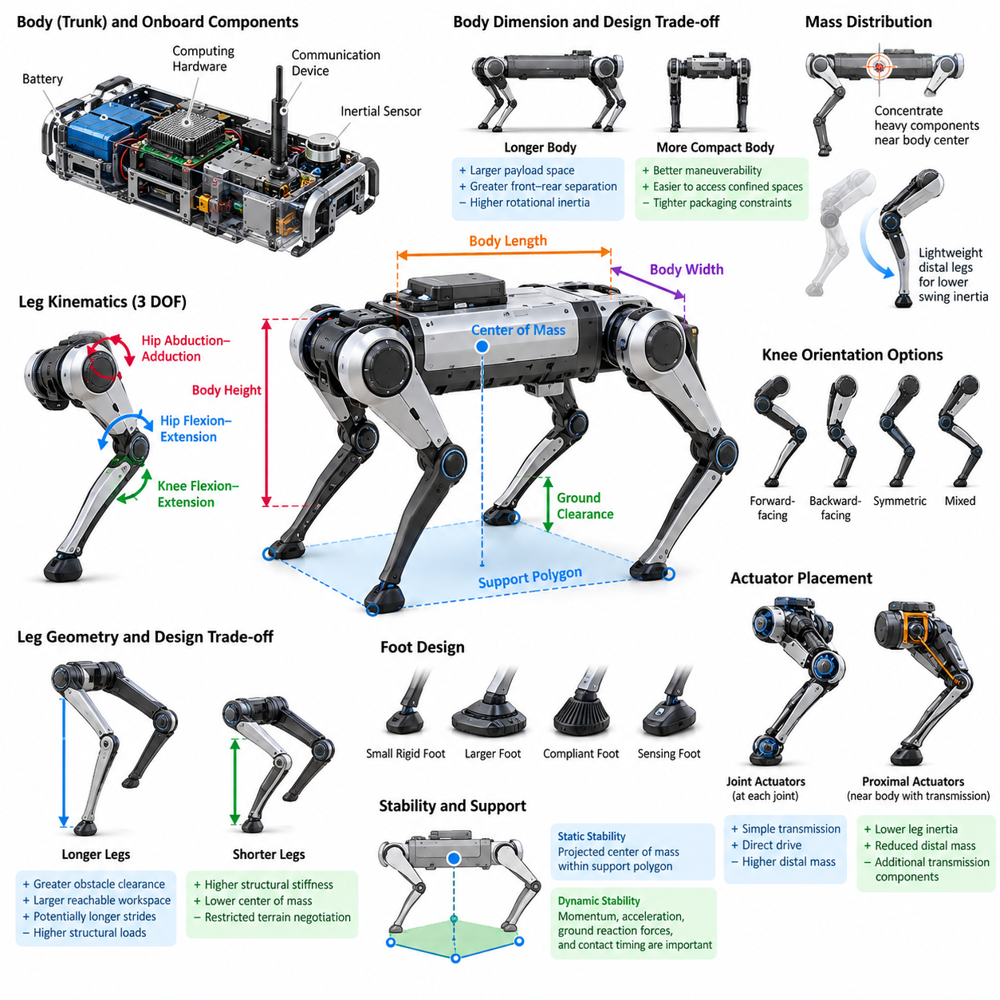
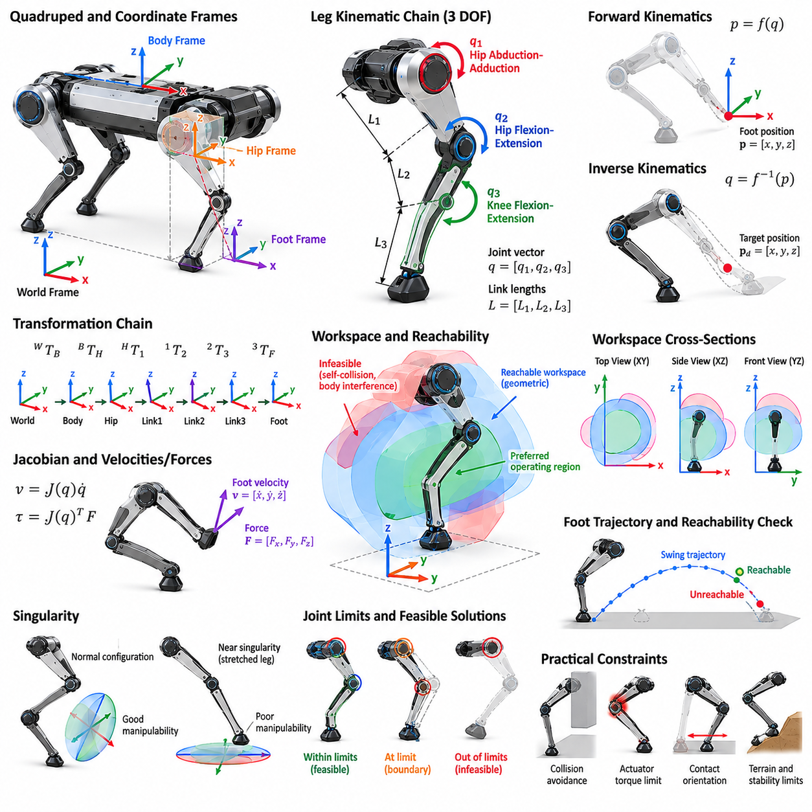
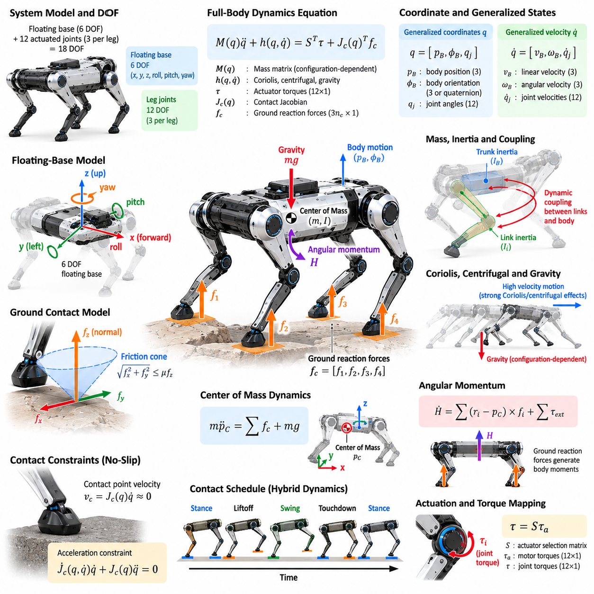
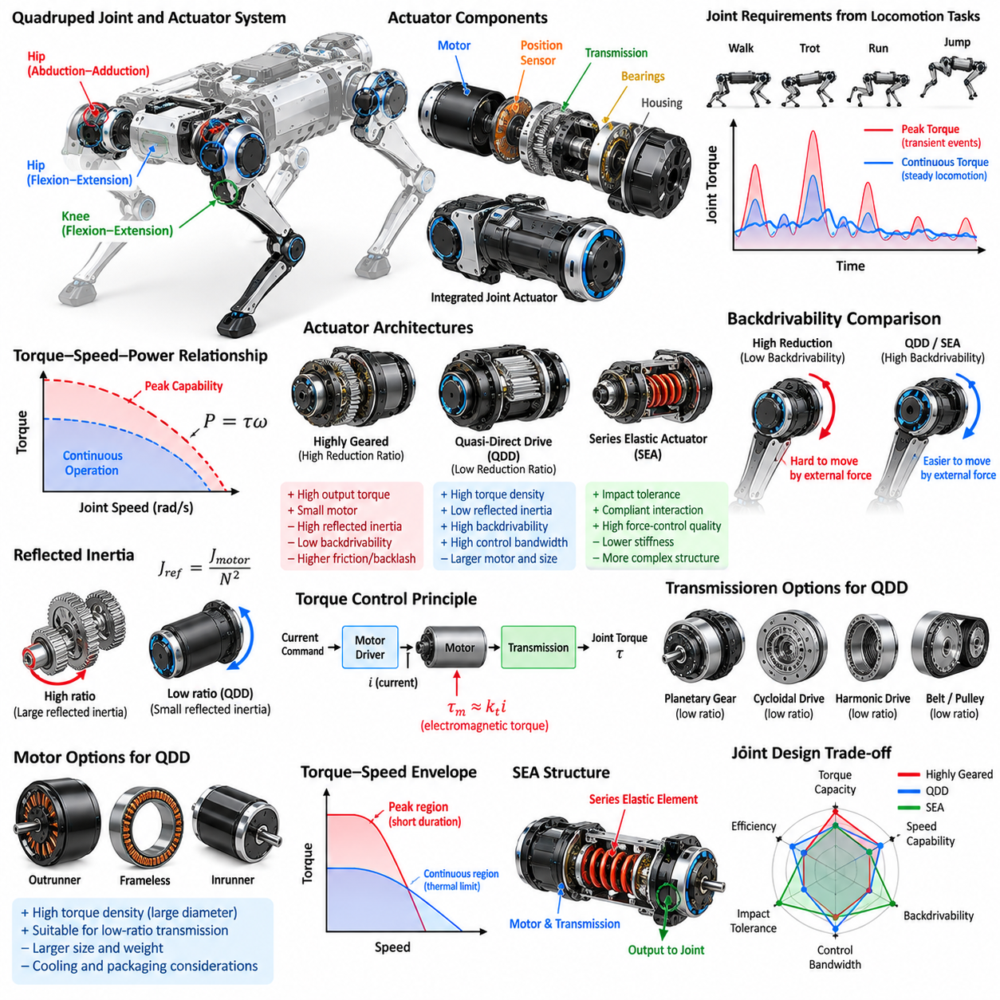
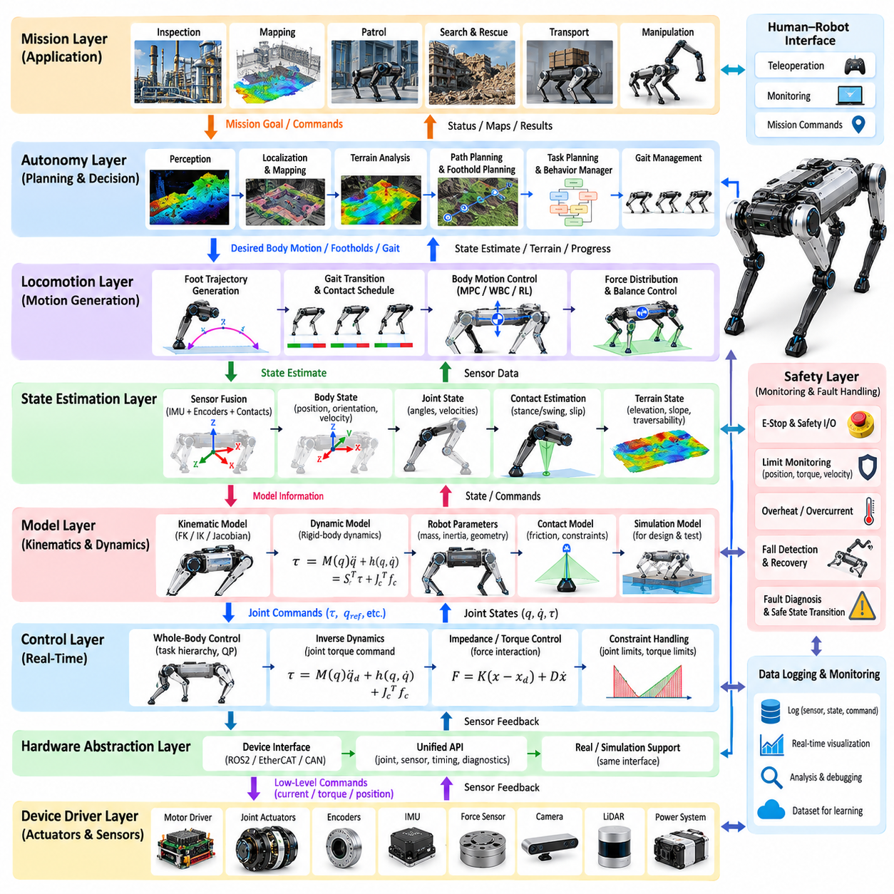
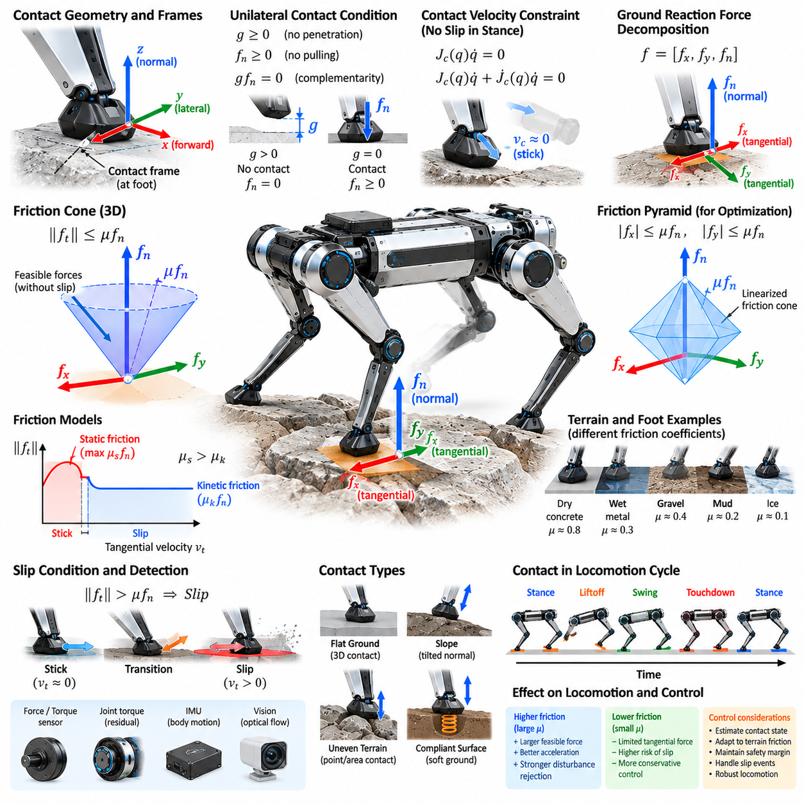
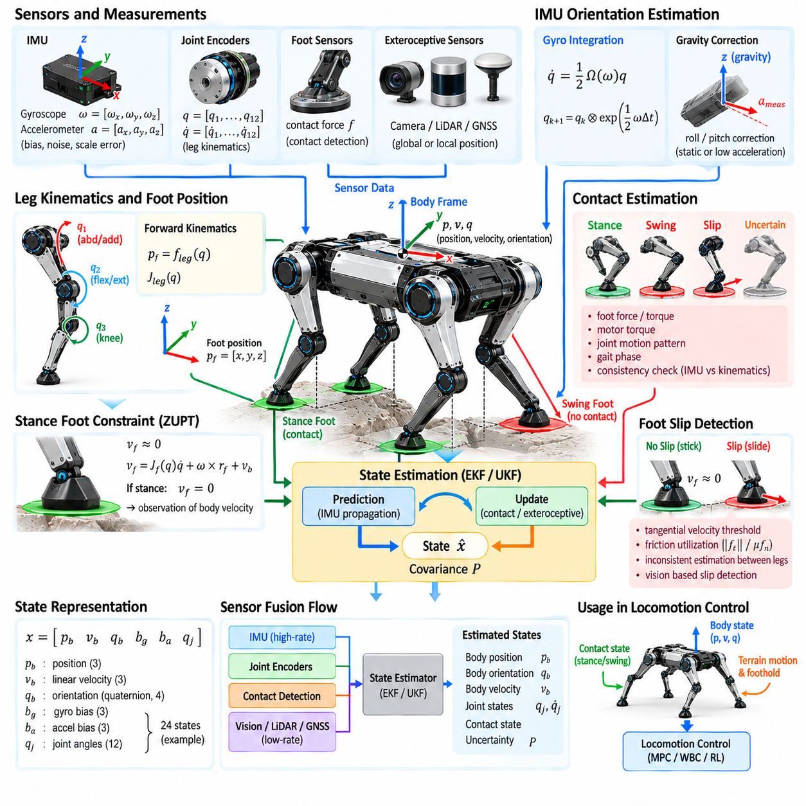
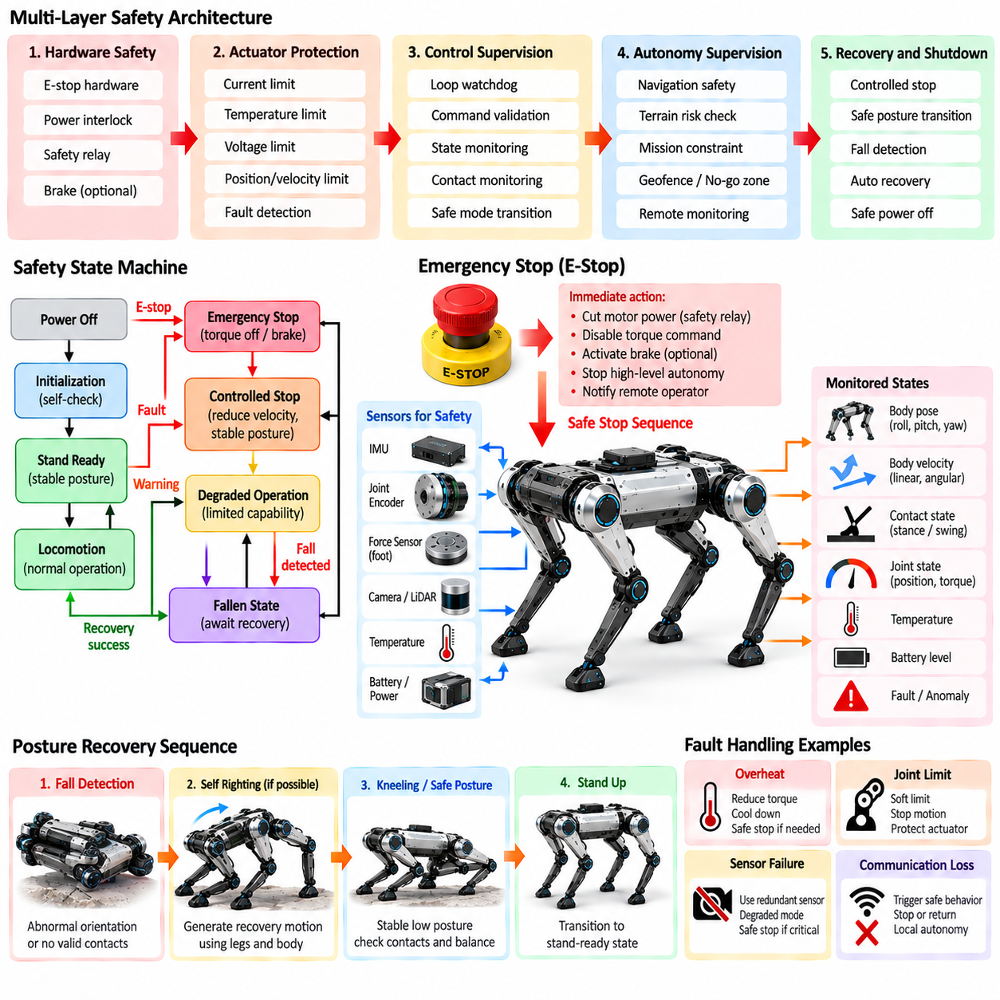
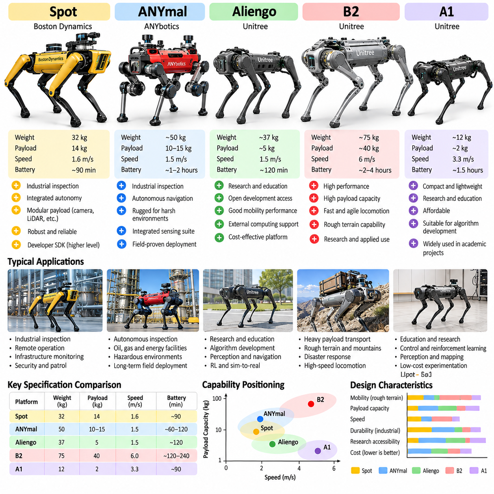
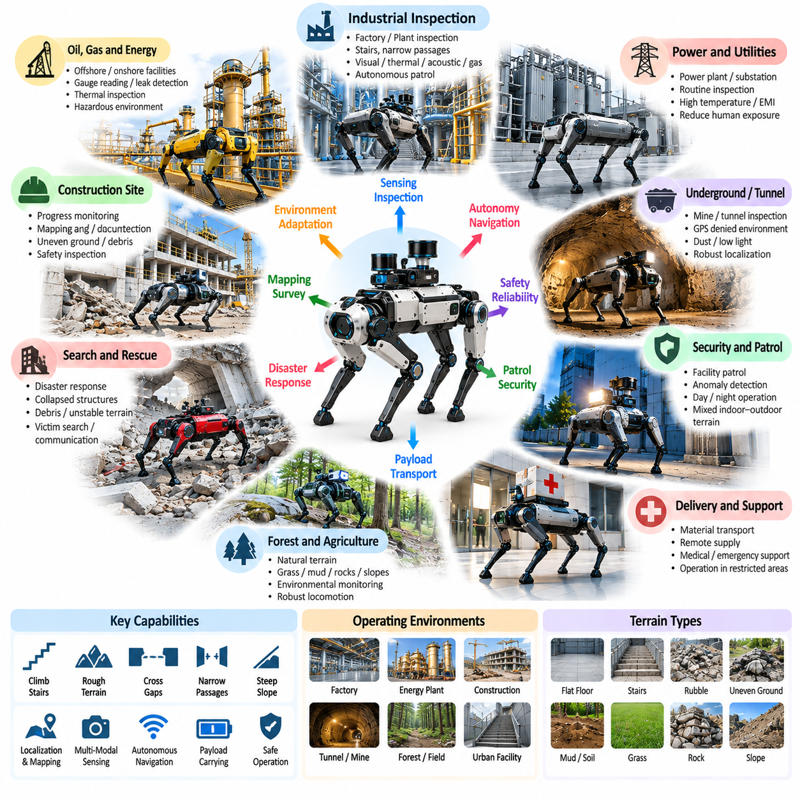

**Volume 21. Quadruped Robot Software**

# Chapter 01. Quadruped Robot Fundamentals

## 01.01. Quadruped Robot Morphology and Design Space

{width="7.268055555555556in" height="7.268055555555556in"}

Quadruped robot morphology defines the physical organization of a four-legged robotic system and establishes the mechanical foundation on which locomotion, perception, control, and autonomy are built. Unlike wheeled robots, quadrupeds interact with the environment through discrete and continuously changing contact points. Their body geometry, limb arrangement, joint structure, actuator placement, and mass distribution therefore directly determine mobility, stability, energy efficiency, and terrain adaptability.

The fundamental morphology consists of a central trunk and four articulated legs positioned around the body. The trunk normally carries batteries, computing hardware, communication devices, inertial sensors, and payloads, while the legs generate supporting and propulsive forces. The relative dimensions of the trunk and legs determine the reachable workspace of each foot, achievable ground clearance, support polygon geometry, turning capability, and ability to negotiate obstacles.

A quadruped leg is commonly represented as a serial kinematic chain containing approximately three active degrees of freedom. A typical configuration includes hip abduction-adduction, hip flexion-extension, and knee flexion-extension. These joints allow the foot to move through a three-dimensional workspace rather than merely swinging forward and backward. Additional degrees of freedom may improve dexterity, but they also increase actuator count, mechanical complexity, control dimensionality, mass, and energy consumption.

Leg geometry strongly influences locomotion characteristics. Longer legs can provide greater obstacle clearance, larger reachable foothold regions, and potentially longer strides, but they also increase bending moments and structural loads. Shorter legs generally provide higher structural stiffness and a lower center of mass, although they restrict terrain negotiation. Designers therefore select link lengths by balancing desired speed, payload capacity, obstacle dimensions, actuator capability, structural strength, and overall robot size.

The orientation of the knee joints creates another important morphological choice. Legs may use forward-facing, backward-facing, symmetric, or mixed knee configurations depending on the intended workspace and mechanical packaging. Knee orientation changes the distribution of feasible foot positions and can influence collision avoidance between the legs and body. It also affects how effectively joint torques can be transformed into ground reaction forces under different postures and terrain conditions.

Body dimensions determine both static geometry and dynamic behavior. A longer body can increase separation between front and rear contacts and provide additional payload space, while a wider body can enlarge lateral support geometry. Excessive dimensions, however, increase rotational inertia and reduce maneuverability in confined environments. Compact bodies improve turning and accessibility but create tighter packaging constraints for batteries, computers, actuators, thermal systems, and payload interfaces.

Mass distribution is especially important because locomotion continuously accelerates and decelerates both the trunk and limbs. Concentrating heavy components near the body center reduces rotational inertia and generally improves dynamic responsiveness. Batteries and major computing hardware are therefore commonly positioned inside the trunk. Keeping distal leg segments lightweight reduces swing inertia, allowing faster foot repositioning while lowering actuator torque requirements and impact-related loads.

Actuator placement is closely coupled with morphology. Directly placing motors at individual joints produces mechanically straightforward transmission paths but increases distal limb mass. Alternatively, actuators can be located closer to the trunk and connected through belts, gears, linkages, cables, or other transmissions. Proximal actuator placement can significantly reduce leg inertia, although additional transmission components introduce compliance, friction, backlash, packaging constraints, and maintenance considerations.

The foot forms the final mechanical interface between the robot and terrain. Its dimensions, shape, compliance, friction characteristics, and sensing capability influence traction and impact behavior. Small rigid feet provide accurate contact geometry on firm surfaces but can generate high local pressure. Larger or compliant feet distribute forces more broadly and accommodate uneven surfaces. Specialized designs may incorporate elastomers, force sensors, tactile sensing, or replaceable terrain-specific contact materials.

Morphology must also account for the robot\'s center of mass relative to its support contacts. During slow locomotion, stability can often be understood through the geometric relationship between the projected center of mass and the support polygon. During dynamic locomotion, momentum, acceleration, ground reaction forces, and contact timing become equally important. Consequently, morphology should not be optimized only for standing stability; it must support the intended dynamic behaviors and control strategies.

The quadruped design space includes important trade-offs among speed, payload, endurance, terrain capability, and mechanical robustness. A lightweight robot with powerful actuators may achieve rapid dynamic locomotion but sacrifice operating time or payload. A heavy platform optimized for transportation may provide excellent load capacity but require substantially larger actuators and batteries. No single morphology is optimal because different operational missions impose fundamentally different combinations of constraints.

Terrain requirements provide one of the strongest drivers of morphological selection. Robots designed for indoor floors can use relatively compact legs and limited foot clearance, whereas outdoor platforms may require longer limbs, larger joint ranges, greater ground clearance, and stronger structures. Rubble, stairs, slopes, vegetation, rocks, mud, and discontinuous terrain each impose different requirements on reachable footholds, foot design, joint torque, sensing placement, and mechanical protection.

Joint range of motion defines the geometric envelope within which the robot can reposition its feet and body. Large ranges enable deep crouching, high stepping, recovery maneuvers, body orientation adjustment, and adaptation to irregular surfaces. However, extreme ranges can create singular configurations, self-collision risks, cable-routing difficulties, and reduced structural stiffness. Practical designs therefore coordinate mechanical joint limits with the useful regions of the kinematic workspace.

Structural compliance introduces another dimension into quadruped morphology. Highly rigid mechanisms simplify geometric modeling and provide accurate motion transmission, while compliant structures can absorb impacts and store mechanical energy. Compliance may originate from elastic feet, flexible links, series elastic actuators, or transmission elements. Properly designed compliance can improve robustness and energy efficiency, but excessive or poorly modeled flexibility can reduce positioning accuracy and complicate feedback control.

Sensor placement must be considered during mechanical design rather than treated as an independent subsystem. Inertial measurement units benefit from rigid mounting near representative body locations, while cameras and LiDAR require unobstructed fields of view and protection from impacts. Joint encoders, motor current sensing, foot force sensors, and contact sensors provide proprioceptive information. Morphology therefore determines not only how the robot moves but also how effectively it observes its own physical state.

Thermal management and environmental protection further constrain the design space. High-performance actuators, power electronics, batteries, and onboard computers generate substantial heat inside a compact body. Sealed housings required for dust or water resistance can make cooling more difficult. Designers must reserve volume for heat sinks, airflow paths, conductive structures, connectors, seals, and protective covers without significantly increasing mass or interfering with leg motion.

Payload integration changes the effective morphology of the complete robot. Manipulators, inspection equipment, communication modules, cargo, or specialized sensors alter the center of mass, inertia, power consumption, and structural loading. A morphology optimized only for the unloaded platform may perform poorly after payload installation. Payload interfaces should therefore be considered as part of the original mechanical architecture, including allowable mass, mounting location, power supply, communication, and dynamic loading.

Scale also changes the underlying engineering problem. Small quadrupeds can use relatively lightweight structures and compact actuators, whereas large robots experience rapidly increasing structural loads, impact forces, and power requirements. Simply enlarging an existing design does not preserve its performance. Link cross-sections, bearings, transmissions, thermal capacity, battery energy, actuator torque density, and foot-ground pressure must all be reconsidered when moving between different size and payload classes.

Modern quadruped design increasingly treats morphology and control as a coupled optimization problem. Mechanical geometry determines the feasible motion space, while control algorithms determine how effectively that space can be exploited. Simulation and optimization can evaluate combinations of link lengths, body dimensions, actuator capabilities, joint limits, foot properties, and mass distributions against mission-level objectives such as speed, stability, energy consumption, payload, or terrain traversal.

This relationship becomes even more important in learning-based locomotion. Reinforcement learning policies can discover motions that exploit subtle mechanical properties such as compliance, inertia, and contact geometry, but they remain constrained by the physical platform. Poor morphology cannot simply be compensated for by a more sophisticated controller. Conversely, a well-designed mechanical structure can enlarge the feasible behavior space and reduce the control effort required to achieve robust locomotion.

Quadruped morphology should therefore be understood as a system-level design problem rather than a selection of isolated mechanical dimensions. Body geometry, leg topology, actuators, transmissions, feet, sensors, batteries, computing hardware, payloads, thermal design, and environmental protection interact with one another. Effective design requires evaluating these relationships together so that the resulting robot provides an appropriate physical foundation for perception, locomotion, manipulation, and autonomous operation.

## 01.02. Quadruped Kinematics Leg Workspace Reachability [w/Code]

{width="7.268055555555556in" height="7.268055555555556in"}

Quadruped kinematics describes the geometric relationship between joint motion, leg configuration, body pose, and foot position without directly considering the forces that produce motion. It provides the mathematical foundation for placing each foot at a desired location, generating swing trajectories, maintaining stance contacts, adjusting body posture, and determining whether a commanded foothold can physically be reached by the robot.

A typical quadruped leg is modeled as a serial kinematic chain connected to the trunk through a hip frame. Many practical designs use three actuated joints corresponding to hip abduction-adduction, hip flexion-extension, and knee flexion-extension. Together these joints provide three-dimensional positioning of the foot. The associated link lengths, joint axes, mechanical offsets, and joint limits define the geometric capabilities of each leg.

Kinematic analysis begins by defining coordinate frames for the world, robot body, hip, individual links, and foot. Homogeneous transformations or equivalent rotation and translation representations describe relationships among these frames. By composing transformations from the body toward the foot, the complete pose of the foot can be expressed as a function of the joint variables and known mechanical dimensions of the leg.

Forward kinematics computes the foot position from a known set of joint angles. For a three-degree-of-freedom leg, the joint vector may be written as q = [q1, q2, q3], and a nonlinear mapping produces the Cartesian foot position p = [x, y, z]. Forward kinematics is computationally straightforward and is continuously used for state estimation, visualization, collision checking, contact reasoning, and feedback control.

Inverse kinematics performs the opposite operation by determining joint configurations that place the foot at a desired Cartesian location. This operation is fundamental to locomotion because higher-level planners usually specify desired footholds or foot trajectories rather than individual joint angles. Depending on the geometry, inverse kinematics may have analytical solutions, numerical solutions, multiple valid configurations, or no physically feasible solution for a particular target.

Analytical inverse kinematics is attractive for conventional three-degree-of-freedom quadruped legs because it can provide fast and deterministic computation. Geometric relationships involving link lengths and target coordinates can often be reduced to trigonometric equations. However, a mathematical solution is not automatically a valid physical configuration. Joint limits, knee orientation, self-collision, actuator constraints, and mechanical interference must also be checked before accepting a solution.

The workspace of a leg is the set of foot positions that can be produced by allowable joint configurations. Its shape depends on link lengths, joint-axis arrangement, joint limits, body interference, and mechanical construction. Although idealized kinematic models may produce relatively simple geometric regions, the practical workspace is usually irregular because portions are removed by collision constraints, singularities, limited joint motion, and structural packaging.

Reachability describes whether a specific target position belongs to the feasible workspace. A geometrically reachable point satisfies the kinematic equations for at least one allowable joint configuration. Practical reachability imposes additional conditions, including collision-free motion, sufficient joint torque, acceptable manipulability, contact orientation, and safety margins from joint limits. Therefore, geometric reachability should be distinguished from dynamically usable reachability during locomotion.

The maximum extension of a leg provides only a crude estimate of reachability. Operating continuously near full extension is undesirable because the leg approaches configurations with poor mechanical leverage and reduced ability to generate motion in certain directions. Similarly, highly folded configurations can create collisions and unfavorable force transmission. Locomotion controllers therefore normally define a preferred operating region located well inside the theoretical workspace boundary.

The Jacobian provides a local relationship between joint velocities and Cartesian foot velocity. In simplified form, foot velocity can be expressed as v = J(q)q̇, where J(q) is the configuration-dependent Jacobian matrix. The transpose of the Jacobian also relates Cartesian forces to joint torques. Consequently, the Jacobian connects geometric kinematics with velocity control, force control, impedance control, and whole-body control.

Singularities occur when the Jacobian loses rank and the leg loses the ability to generate arbitrary Cartesian velocity in one or more directions. Near a singularity, small desired foot motions may require very large joint velocities, and Cartesian force commands may produce unfavorable joint torques. Fully extended or specially aligned link configurations frequently approach such conditions. Robust controllers therefore maintain margins from singular regions whenever possible.

Manipulability measures provide a more continuous description of how effectively a leg can move or exert forces around a particular configuration. Instead of asking only whether a point is reachable, manipulability evaluates the directional quality of motion transmission. A foothold deep inside the geometric workspace may still be undesirable if the associated configuration has poor manipulability. This concept is valuable when selecting footholds for dynamic or force-intensive locomotion.

Each of the four legs has its own workspace relative to its corresponding hip frame. When transformed into the body coordinate system, these workspaces define the regions around the robot where each foot can establish contact. The front and rear legs may have similar mechanical structures but different effective operating regions because their mounting orientations differ. Left-right symmetry can simplify modeling, although calibration errors and payload effects can introduce asymmetry.

The body pose strongly influences world-frame reachability. When the trunk translates, rotates, pitches, or rolls, the hip frames move relative to the terrain and the available foothold regions move with them. A foothold that is unreachable from one body pose may become reachable after shifting the body. This coupling between body pose and leg workspace is fundamental to rough-terrain locomotion, stair climbing, gap crossing, and posture adjustment.

During stance, the kinematic relationship can be interpreted in the opposite direction. If a foot is assumed to remain fixed on the ground, changes in joint angles constrain the motion of the body relative to that contact. With multiple stance feet, several simultaneous contact constraints restrict trunk motion. Whole-body controllers exploit these relationships to regulate body position and orientation while distributing motion and forces among the supporting legs.

During swing, the foot moves through free space from one contact location to another. A swing trajectory must remain inside the leg workspace throughout the motion rather than merely having reachable start and end points. It must also provide sufficient terrain clearance and avoid collisions with the body, other legs, and obstacles. Kinematic trajectory generation therefore evaluates intermediate configurations while respecting joint position, velocity, and acceleration limits.

Reachability becomes particularly important in foothold planning. A terrain perception system may identify many geometrically safe contact locations, but only a subset can be reached from the predicted robot state. The planner can intersect terrain-valid regions with leg-reachable regions to produce feasible foothold candidates. Additional criteria such as friction, surface orientation, stability, manipulability, energy cost, and future-step feasibility can then rank these candidates.

A useful distinction exists between instantaneous workspace and locomotion workspace. Instantaneous workspace describes what a leg can reach from the current body configuration, whereas locomotion workspace considers how body movement and sequential contacts expand feasible motion over time. Quadrupeds can therefore traverse distances far beyond the reach of any individual leg by repeatedly transferring support, repositioning the trunk, and establishing new contacts.

Workspace margins are essential for robust locomotion because modeling and sensing are never exact. Joint encoder offsets, link-length tolerances, structural deformation, terrain estimation errors, actuator tracking errors, and contact uncertainty can all reduce practical reachability. Controllers typically shrink the theoretical workspace by safety margins so that commanded foot positions remain feasible despite these uncertainties and leave room for corrective movements after unexpected disturbances.

Calibration directly affects kinematic accuracy. Small errors in link lengths, joint zero positions, joint-axis orientations, or hip mounting locations accumulate through the kinematic chain and appear as foot-position errors. These errors can degrade contact estimation, terrain adaptation, and force control. Accurate quadruped systems therefore combine mechanical measurement, encoder calibration, parameter identification, and sometimes external sensing to refine the kinematic model.

Kinematic redundancy appears when the robot is considered as a complete multi-legged system rather than as four independent three-joint mechanisms. The body pose and multiple leg joints together provide many possible configurations for achieving a locomotion objective. This redundancy can be exploited to avoid joint limits, improve manipulability, maintain sensor orientation, reduce energy consumption, increase stability, or satisfy additional constraints while preserving required foot contacts.

Numerical optimization becomes useful when simple analytical inverse kinematics is insufficient. An optimization-based solver can simultaneously consider desired foot positions, body pose, joint limits, collision constraints, workspace margins, posture preferences, and smoothness. Such formulations naturally extend toward whole-body inverse kinematics and model-based control, although they require careful numerical conditioning and sufficiently fast computation for real-time robotic operation.

For quadruped locomotion, reachability should ultimately be treated as a time-dependent feasibility problem rather than a static geometric test. The future body pose, expected terrain contacts, joint motion limits, swing duration, and subsequent steps determine whether a foothold remains useful. A location that is reachable now may create an unfavorable configuration for the next step, while a slightly less aggressive foothold may preserve significantly greater future mobility.

Kinematics, workspace, and reachability therefore form a central bridge between mechanical design and locomotion intelligence. Link geometry determines the theoretical motion envelope, while sensing, planning, and control decide how that envelope is used. Reliable quadruped systems combine accurate forward and inverse kinematics, Jacobian analysis, singularity avoidance, workspace constraints, calibration, and predictive foothold reasoning to transform desired body motion into physically feasible leg behavior.

## 01.03. Quadruped Dynamics Full Body Model [w/Code]

{width="7.268055555555556in" height="7.268055555555556in"}

Quadruped dynamics describes how forces, torques, inertia, gravity, and ground contacts produce motion of the complete robot. While kinematics determines geometrically possible configurations, dynamics determines whether those motions can physically occur under available actuator and contact forces. A full-body model therefore provides the foundation for balance control, dynamic locomotion, force distribution, trajectory optimization, and whole-body control.

A quadruped is naturally modeled as a floating-base multibody system because its trunk is not permanently attached to the environment. The floating base contributes six degrees of freedom representing three-dimensional translation and rotation, while actuated leg joints contribute additional generalized coordinates. A robot with three actuated joints per leg consequently has twelve actuated joint coordinates combined with the six-dimensional floating-base motion.

The configuration can be represented by generalized coordinates describing body position, body orientation, and joint angles. Generalized velocity similarly contains the linear and angular velocity of the floating base together with joint velocities. Because three-dimensional orientation has special mathematical properties, implementations commonly use rotation matrices or unit quaternions rather than relying exclusively on Euler angles, particularly for large body rotations.

The standard rigid-body dynamics equation can be expressed conceptually as M(q)q̈ + h(q,q̇) = Sᵀτ + Jc(q)ᵀfc. Here M represents the configuration-dependent mass matrix, h contains Coriolis, centrifugal, and gravitational effects, τ represents actuator torques, Jc is the contact Jacobian, and fc contains external contact forces. This equation couples body motion, joint motion, actuation, and environmental interaction.

The mass matrix captures the inertial properties of the complete robot and changes as the legs move relative to the trunk. Its diagonal and off-diagonal terms describe both individual link inertia and dynamic coupling between coordinates. Consequently, accelerating one leg can influence body motion and other joints. Accurate mass, center-of-mass location, and inertia estimates are therefore important for high-performance dynamic locomotion.

Gravity acts on every link and produces configuration-dependent generalized forces. Although gravity appears simple, its effects vary substantially with body orientation, leg posture, and payload distribution. A robot standing on level terrain requires joint torques and ground reaction forces that collectively support its weight, while a robot on a slope must additionally manage tangential loading and altered contact-force distributions.

Coriolis and centrifugal effects become increasingly significant as joint and body velocities rise. During slow walking they may be relatively modest, but during running, jumping, rapid turning, or recovery maneuvers they can strongly influence required actuator torques. Dynamic controllers account for these velocity-dependent terms so that commanded motion reflects the actual coupled behavior of the multibody system rather than an idealized static approximation.

Ground contact fundamentally distinguishes legged dynamics from free-space robotic manipulation. Each stance foot generates ground reaction forces that support and accelerate the robot, while swing feet normally contribute no supporting contact force. Because contacts repeatedly appear and disappear, quadruped dynamics is a hybrid system containing continuous multibody motion separated by discrete events such as touchdown, liftoff, slipping, and impact.

A stance contact imposes constraints on allowable motion. Under an ideal rigid no-slip assumption, the velocity of the contact point relative to the ground is approximately zero. This condition can be expressed through the contact Jacobian and generalized velocity. Differentiating the constraint produces an acceleration-level relationship that can be incorporated into inverse dynamics, constrained dynamics, optimization, and whole-body control formulations.

Ground reaction force must satisfy physical contact conditions. A normal contact force can push the robot away from the surface but cannot pull the ground toward the foot. Tangential forces are limited by available friction and are commonly represented through a friction cone or a linearized friction pyramid. If commanded forces exceed these limits, the foot may slip and the assumed contact model becomes invalid.

The center of mass provides a useful global description of full-body dynamics. Its acceleration is determined by the sum of external forces, primarily gravity and ground reaction forces. Internal joint forces cannot directly accelerate the system center of mass without external interaction. This principle allows complex articulated dynamics to be reduced to simpler centroidal models for many locomotion planning and control problems.

Angular momentum is equally important because the robot must regulate rotational motion of its complete body. Ground reaction forces generate moments around the center of mass depending on their magnitudes and contact locations. Leg motions can also redistribute internal angular momentum. Centroidal dynamics therefore describes both center-of-mass translation and whole-body angular momentum, providing a powerful intermediate model between simplified templates and full rigid-body dynamics.

Simplified dynamic models are often used because solving the complete multibody equations at every planning stage can be computationally expensive. The single rigid body model treats the robot trunk and overall mass as one rigid object acted upon by contact forces. This approximation neglects detailed leg inertia but often captures the dominant dynamics sufficiently well for model predictive control, foothold planning, and ground reaction force optimization.

The full-body model becomes important when limb inertia, rapid leg motion, payloads, manipulation, or aggressive maneuvers cannot be neglected. It explicitly represents individual links, joints, inertial parameters, actuator torques, and contact constraints. Such models allow controllers to calculate dynamically consistent joint commands while considering the effects of leg acceleration, body motion, gravity compensation, and multiple simultaneous contacts.

Inverse dynamics calculates the generalized forces or actuator torques required to realize a desired acceleration while satisfying contact constraints. In quadrupeds, this problem is usually under additional constraints because the floating base is not directly actuated. Body acceleration must instead be generated through forces transmitted by stance legs. Optimization-based inverse dynamics can distribute these forces while respecting friction, torque, and contact limitations.

Forward dynamics performs the complementary calculation. Given the current configuration, velocity, actuator torques, and external forces, it computes the resulting generalized acceleration. Forward dynamics is fundamental to physics simulation because it predicts how the robot evolves under applied commands. It is also useful for controller validation, system identification, reinforcement learning, trajectory prediction, and evaluation of disturbance responses.

The floating base creates an important distinction between actuated and unactuated coordinates. Motors directly generate torque only at the joints, not at the six body coordinates. The trunk can accelerate only through gravity and external forces, especially forces transmitted through stance contacts. Consequently, maintaining body position and orientation requires coordinated leg actuation that creates an appropriate distribution of contact forces across the supporting feet.

Contact-force distribution is generally not unique when several feet support the robot simultaneously. Many combinations of individual foot forces can produce the same desired net force and moment on the body. Controllers exploit this redundancy to minimize energy, avoid actuator saturation, maintain friction margins, balance loads among legs, or preserve robustness. Optimization provides a systematic method for selecting a desirable force distribution.

Actuator limits impose direct constraints on achievable dynamics. Motors and transmissions have finite torque, speed, power, and thermal capability. A motion may be kinematically reachable yet dynamically infeasible because the required joint torque exceeds actuator capacity. Dynamic feasibility must therefore be evaluated together with joint limits, contact friction, battery power, transmission efficiency, and thermal constraints when designing locomotion behaviors.

Impact dynamics becomes important at foot touchdown. Even when a swing foot approaches the terrain with moderate velocity, contact can produce rapid changes in velocity and large impulsive forces. Compliance in the foot, transmission, structure, or controller can reduce impact severity. Accurate touchdown timing and velocity regulation are therefore essential for reducing mechanical stress, preventing rebound, maintaining traction, and improving state-estimation consistency.

Payloads modify the full-body dynamics by changing total mass, center-of-mass position, inertia, and required contact forces. A payload mounted above or away from the body center can substantially increase rotational moments and reduce stability margins. Manipulator motion mounted on the quadruped creates additional time-varying inertial effects. Full-body modeling is therefore particularly important for mobile manipulation and load-carrying applications.

Model accuracy depends on the quality of inertial and actuator parameters. Link masses, centers of mass, inertia tensors, joint friction, transmission characteristics, and motor torque constants may differ from nominal computer-aided design values. System identification can estimate these parameters from measured motion, torque, current, and force data. Improved parameter estimates increase prediction accuracy and reduce systematic errors in model-based controllers.

Real robots also contain dynamics that ideal rigid-body equations do not fully represent. Gearbox backlash, structural flexibility, cable forces, actuator latency, motor saturation, foot compliance, terrain deformation, and unmodeled friction can create discrepancies between prediction and observation. Robust control, feedback correction, disturbance estimation, and adaptive techniques are therefore used alongside physical models rather than relying on perfect mathematical accuracy.

The choice of dynamic model depends on the control layer and computational objective. Simplified models are valuable for fast prediction over longer horizons, while full-body models are valuable for accurate short-horizon control and torque generation. Modern quadruped architectures frequently combine both approaches, using reduced-order dynamics for planning and model predictive control while employing full-body optimization or inverse dynamics for low-level execution.

A full-body dynamic model ultimately connects desired locomotion behavior with physically realizable forces and torques. It explains how actuator commands propagate through articulated limbs, how contacts accelerate and stabilize the floating body, and how inertia and momentum evolve during motion. Reliable quadruped control therefore depends on combining multibody dynamics, contact constraints, friction models, actuator limits, state estimation, and optimization into a coherent physical framework.

## 01.04. Actuator Selection Quasi Direct Drive SEA [w/Code]

{width="7.268055555555556in" height="7.268055555555556in"}

Actuator selection is one of the most influential design decisions in a quadruped robot because actuators determine achievable joint torque, speed, bandwidth, efficiency, impact tolerance, and force-control quality. Unlike manipulators operating on fixed bases, legged robots repeatedly accelerate their limbs and experience large ground impacts. The actuator must therefore satisfy both locomotion performance and physical interaction requirements.

A quadruped joint actuator typically combines an electric motor, transmission, bearings, position sensing, power electronics, and structural housing. The transmission converts motor speed and torque into joint-level motion appropriate for the leg. Selecting these components cannot be performed independently because motor torque density, reduction ratio, reflected inertia, backlash, efficiency, thermal capacity, and mechanical packaging strongly interact.

Joint requirements should be derived from expected locomotion tasks before choosing a motor or gearbox. Walking, trotting, running, jumping, stair climbing, payload transport, and disturbance recovery produce substantially different torque-speed profiles. Simulation using representative trajectories can estimate continuous torque, peak torque, maximum joint velocity, mechanical power, and energy consumption across the hip and knee joints.

Peak torque determines whether the robot can survive demanding transient events such as acceleration, landing, or recovery, whereas continuous torque is strongly related to thermal capability. Selecting an actuator solely from peak torque can result in overheating during sustained operation. Conversely, designing entirely around continuous torque may create excessive mass. Practical selection therefore considers torque-duration characteristics and realistic duty cycles.

Mechanical power is approximately the product of joint torque and angular velocity. High-performance locomotion may require high torque and high velocity simultaneously, making power density as important as torque density. The actuator must operate across the required torque-speed envelope rather than satisfy only a single maximum value. Motor voltage, winding characteristics, inverter current, transmission ratio, and battery voltage all influence this envelope.

Traditional highly geared actuators use large reduction ratios to amplify motor torque. This approach allows relatively small motors to generate large output torque, but high reduction ratios increase reflected motor inertia, friction, backlash, and resistance to externally imposed motion. These characteristics can reduce force-control quality and impact tolerance, which are particularly important when robot feet repeatedly interact with uncertain terrain.

Backdrivability describes how easily external forces applied at the joint output can cause motion through the transmission and motor. High backdrivability allows the leg to respond naturally to terrain impacts and enables joint torque to be inferred more directly from motor current. Low-backdrivability transmissions can mechanically resist disturbances, but they may isolate the motor from useful contact information and produce less transparent physical interaction.

Quasi-direct drive, commonly abbreviated QDD, addresses these issues by combining a high-torque-density motor with a relatively low transmission ratio. Instead of relying on a small high-speed motor and large gear reduction, QDD uses a larger motor capable of producing substantial torque before reduction. Typical design objectives include low reflected inertia, high backdrivability, high control bandwidth, efficient torque transmission, and robust impact response.

The reflected motor inertia observed at the joint increases approximately with the square of the transmission ratio. Consequently, even a moderate increase in reduction ratio can substantially increase apparent output inertia. Low-ratio QDD architectures reduce this effect, allowing the joint to respond more freely to external disturbances. This property is highly beneficial for dynamic locomotion where feet frequently collide with the ground.

QDD actuators are particularly compatible with torque control. When transmission friction and reduction ratio are relatively low, motor current can provide a useful estimate of output torque because electromagnetic motor torque is approximately proportional to current. High-quality current control can therefore support joint torque control without requiring complex high-ratio transmission models, although dedicated torque sensing may still improve accuracy.

Large-diameter brushless permanent-magnet motors are commonly associated with QDD because increasing motor radius can significantly improve torque production. Outrunner or specialized frameless motors may provide high torque density at moderate rotational speed. However, larger motors increase joint dimensions and can complicate leg packaging. Designers must balance electromagnetic performance against limb inertia, structural integration, cooling, and available space.

Transmission options for QDD include low-ratio planetary gears, cycloidal mechanisms, belts, and other compact reductions. Planetary gearboxes provide high torque density and coaxial packaging, while belt drives can offer low backlash and mechanical simplicity. Each transmission introduces different efficiency, stiffness, backlash, shock resistance, bearing-load capability, and manufacturing requirements that must be evaluated at the complete actuator level.

Series elastic actuators, abbreviated SEA, introduce a deliberately compliant elastic element between the motor-transmission system and the output load. By measuring deformation of this elastic element, joint force or torque can be estimated using its known stiffness. This architecture converts mechanical compliance into both an impact-management mechanism and a sensing element, making SEA attractive for controlled physical interaction.

The spring in an SEA stores and releases mechanical energy while filtering high-frequency impacts transmitted between the environment and drivetrain. This can protect gears and motors during touchdown and collisions. Compliance can also improve force-control stability when interacting with uncertain terrain. However, the spring introduces an additional dynamic state and reduces the direct mechanical stiffness between the commanded motor position and joint output.

SEA torque measurement can be expressed conceptually as τ = kΔθ for a rotational elastic element, where k represents spring stiffness and Δθ represents measured elastic deflection. Accurate torque estimation therefore requires reliable measurement of relative displacement across the spring and sufficiently well-characterized stiffness. Sensor resolution, hysteresis, temperature dependence, mechanical tolerances, and nonlinear spring behavior can affect estimation quality.

Spring stiffness represents a central SEA design trade-off. A stiff spring provides high mechanical bandwidth and small output deflection but generates small measurable deformation for a given torque. A softer spring improves force-sensing resolution and impact absorption but can reduce position-control bandwidth and allow large deflections. The appropriate stiffness depends on expected contact forces, locomotion frequency, control architecture, and mechanical travel limits.

QDD and SEA should not be interpreted as mutually exclusive philosophies. QDD primarily reduces transmission impedance through low gear reduction and low reflected inertia, whereas SEA intentionally introduces measurable compliance. Hybrid actuators can combine relatively low-ratio transmissions with elastic elements to achieve both backdrivability and controlled compliance. The appropriate architecture depends on the desired balance between transparency, force sensing, bandwidth, and robustness.

For highly dynamic quadrupeds, low limb inertia is a major requirement. Heavy actuators mounted near the knee or lower leg increase the energy required for swing motion and generate larger reaction forces on the trunk. Designers therefore attempt to position heavy motors proximally near the body when possible. Mechanical linkages, belts, or remote transmissions may transfer power toward distal joints while keeping major actuator mass close to the trunk.

Actuator bandwidth determines how rapidly commanded torque or motion can be produced. High-bandwidth torque control enables the robot to regulate ground reaction forces, reject disturbances, and execute dynamic gaits. Bandwidth is affected by motor electrical dynamics, current-loop performance, transmission compliance, structural flexibility, sensing delay, communication latency, and control frequency. Mechanical actuator specifications alone therefore do not determine achievable control performance.

Thermal management often establishes the practical continuous-performance limit. Copper losses increase approximately with the square of motor current, while iron losses and inverter losses add further heat. Compact sealed quadruped joints have limited cooling area and may operate in environments where fans are undesirable. Temperature sensors, thermal models, conductive housings, heat paths, and current derating strategies are therefore essential parts of actuator design.

Regenerative operation also influences actuator and power-system selection. During deceleration, landing, or lowering of the body, motors can operate as generators and return energy toward the electrical bus. The inverter and battery must safely absorb this energy. If regenerative power exceeds battery acceptance limits, bus voltage can rise rapidly, requiring braking resistors, energy-management logic, or alternative protective mechanisms.

Position and velocity sensing are required even when torque control is the primary objective. High-resolution encoders support commutation, joint-state estimation, trajectory tracking, and disturbance observation. QDD systems may estimate torque primarily from current, while SEA systems generally require additional measurement across the elastic element. Sensor architecture should therefore be designed together with the mechanical transmission and control strategy.

Joint bearings must withstand loads that can greatly exceed nominal actuator torque requirements. Ground impacts generate radial, axial, and moment loads through the leg structure, and the gearbox itself should not necessarily carry all structural loads. Dedicated output bearings can separate structural loading from transmission components. Bearing arrangement, shaft stiffness, housing deformation, and gear alignment consequently influence actuator durability and control precision.

Actuator selection should include fault and overload behavior. A quadruped may encounter unexpected foot impacts, falls, blocked joints, or actuator saturation. Current limiting, mechanical stops, thermal protection, compliant elements, shock-resistant transmissions, and software torque limits can prevent temporary disturbances from becoming permanent damage. The desired failure mode should be considered during design rather than added only after hardware testing.

Efficiency has direct consequences for robot endurance because locomotion repeatedly transfers energy through every leg joint. Electrical and mechanical losses reduce battery operating time and generate heat that must be removed. QDD can provide high efficiency by avoiding large transmission losses, but its larger motors may require significant current. SEA can recover some elastic energy during cyclic motion, although actual benefits depend strongly on gait and spring tuning.

No actuator architecture is universally optimal for every quadruped. QDD is attractive for highly dynamic robots requiring backdrivability, torque transparency, and rapid response, while SEA is attractive when force sensing, impact isolation, and compliant interaction are dominant requirements. Higher-ratio geared actuators may remain appropriate for slower robots requiring high static torque, compact dimensions, or strong load-holding capability.

The final actuator should therefore be selected at the system level rather than from isolated motor specifications. Required torque-speed envelopes, limb inertia, transmission ratio, reflected inertia, force sensing, compliance, efficiency, thermal limits, battery capability, impact loading, packaging, reliability, and control bandwidth must be evaluated together. Successful quadruped design treats the actuator as an integrated electromechanical and control subsystem that fundamentally shapes locomotion behavior.

## 01.05. Quadruped SW Architecture Layered Overview

{width="7.268055555555556in" height="7.268055555555556in"}

Quadruped robot software architecture organizes sensing, estimation, planning, locomotion, control, hardware communication, and safety into coordinated computational layers. Unlike conventional mobile robots, quadrupeds must continuously regulate unstable multibody dynamics while contacts appear and disappear. The architecture must therefore combine deterministic real-time control with higher-level perception, planning, and autonomous decision making.

A layered architecture separates functions according to abstraction, timing requirements, and hardware dependency. Lower layers interact directly with motors, encoders, inertial sensors, and communication buses, while higher layers reason about body motion, terrain, navigation, and missions. Clear interfaces between layers reduce software coupling and allow individual algorithms or hardware components to be replaced without redesigning the complete system.

At the lowest level, device drivers provide access to actuators and sensors. Motor controllers receive current, torque, velocity, or position commands and return encoder positions, velocities, currents, temperatures, and diagnostic information. Drivers for inertial measurement units, force sensors, cameras, LiDAR, and other devices convert hardware-specific protocols into standardized software representations suitable for upper layers.

The hardware abstraction layer isolates control software from specific devices and communication technologies. It defines consistent interfaces for joint commands, joint states, sensor measurements, timing information, and diagnostics. A controller can therefore operate with real hardware, a simulator, or alternative actuator electronics through the same logical interface. This abstraction significantly improves portability, testing, and long-term maintainability.

Real-time execution is essential in the low-level control stack. Joint servo loops may execute at hundreds or thousands of hertz, and timing jitter can directly degrade torque regulation and stability. These loops commonly perform current control, torque control, actuator compensation, limit enforcement, and communication supervision. Their computational path should remain deterministic and should avoid unpredictable operations that could interrupt control timing.

Above actuator control, the state-estimation layer reconstructs the robot state from multiple sensor streams. Joint encoders provide leg configuration, the inertial measurement unit provides angular velocity and acceleration, and contact-related measurements indicate interactions with the terrain. Estimation algorithms combine these observations to determine body orientation, velocity, position, joint state, contact state, and uncertainty required by locomotion controllers.

Contact estimation is particularly important because many control algorithms depend on knowing which feet are supporting the robot. A commanded stance state does not guarantee actual contact, especially on irregular terrain. Contact estimators may use foot force, motor torque, joint motion, inertial measurements, and planned gait phase. Reliable contact information supports state estimation, slip detection, gait transitions, and ground reaction force control.

The robot model layer provides shared descriptions of kinematics, dynamics, joint limits, inertial properties, collision geometry, and actuator capabilities. Forward kinematics, inverse kinematics, Jacobians, rigid-body dynamics, and coordinate transformations should use consistent model parameters. Maintaining a common model prevents subtle discrepancies between estimation, planning, simulation, and control modules that could otherwise produce incompatible assumptions.

The locomotion control layer transforms desired body and foot behavior into dynamically feasible actuator commands. Depending on the architecture, this layer may contain model predictive control, whole-body control, inverse dynamics, impedance control, or learned policies. It regulates body orientation, center-of-mass behavior, foot trajectories, contact forces, and joint motion while respecting physical constraints imposed by the robot and environment.

A gait-management layer determines the temporal pattern of stance and swing phases across the four legs. Walking, trotting, pacing, bounding, and other gaits can be represented through contact schedules, phase variables, duty factors, and transition rules. The gait manager provides future contact information to trajectory generators and predictive controllers while coordinating smooth transitions between locomotion modes.

Foot trajectory generation converts gait timing and foothold targets into continuous swing-leg motion. The trajectory must lift the foot sufficiently to avoid terrain, move it toward the desired contact location, and approach the ground with appropriate velocity. It must also remain within joint workspace and velocity limits. Feedback corrections may modify the nominal trajectory in response to body velocity errors or unexpected terrain interactions.

Foothold planning operates above basic trajectory generation by selecting suitable future contact locations. On flat terrain, footholds can be generated primarily from desired velocity and gait geometry. On rough terrain, the planner must incorporate elevation, slope, obstacle, surface quality, reachability, and stability information. Selected footholds become critical interfaces between terrain perception and the dynamic locomotion controller.

The perception layer processes exteroceptive sensors such as cameras, depth cameras, LiDAR, radar, or specialized ranging devices. It estimates environmental geometry and identifies terrain characteristics relevant to locomotion. Depending on the application, perception may generate point clouds, elevation maps, traversability maps, semantic labels, obstacles, stairs, edges, or candidate support surfaces for subsequent planning modules.

Terrain representation connects perception with locomotion planning. Raw sensor measurements are generally too large and noisy for direct use by high-frequency controllers, so they are converted into compact representations such as local elevation maps or traversability grids. These representations must be updated as the robot moves while maintaining consistent coordinates and uncertainty estimates. Terrain information can then guide foothold selection and body trajectory planning.

The local motion-planning layer determines how the robot should move through its nearby environment. It converts navigation goals into desired body velocity, heading, posture, or short-horizon trajectories while considering obstacles and terrain. For legged robots, local planning may also account for body clearance, slope limits, stepping capability, and feasible contact regions rather than treating the platform as a simple planar mobile base.

Global navigation operates at a longer spatial and temporal horizon. It uses maps, localization, mission goals, and environmental constraints to determine routes through the environment. The resulting route is passed to local planning, which adapts it to current terrain and robot state. This separation allows global reasoning to remain relatively slow while local planning and locomotion respond rapidly to immediate disturbances and newly observed obstacles.

Behavior and mission layers coordinate higher-level tasks such as navigating to inspection points, following an operator, entering designated areas, performing sensing actions, or returning to a charging station. State machines, behavior trees, task planners, or policy-based systems may be used. These layers should issue goals and constraints rather than directly commanding individual joints, preserving separation between mission logic and physical control.

Communication between layers can use shared memory, message passing, publish-subscribe middleware, or direct real-time interfaces depending on latency requirements. High-frequency torque and state data should follow low-latency deterministic paths, whereas maps, mission commands, and diagnostics can tolerate slower asynchronous communication. Selecting communication mechanisms according to timing criticality prevents high-level software activity from disturbing locomotion control.

Time synchronization is essential because quadruped control combines measurements generated by many sensors and processors. Encoder states, inertial measurements, force data, camera frames, and LiDAR scans must correspond to known acquisition times. Timestamp errors can appear as false motion and degrade sensor fusion. Hardware clocks, synchronized timestamps, buffering, and interpolation are therefore important architectural components rather than merely logging conveniences.

The safety layer should span the entire architecture rather than exist as a single high-level module. Low-level protection monitors joint limits, current, voltage, temperature, communication loss, and actuator faults. Higher-level supervision monitors body orientation, fall conditions, localization quality, terrain hazards, and planner failures. Safety responses may include torque limiting, controlled stopping, posture recovery, motor shutdown, or transition to a predefined safe state.

Fault management requires software to distinguish recoverable disturbances from failures requiring shutdown. Temporary foot slip, delayed perception, or a missed step may be handled through feedback and replanning, whereas actuator overheating or communication loss may require degraded operation or emergency stopping. Diagnostic information should propagate upward so that behavior logic understands system capability instead of continuing to request impossible actions.

Simulation should reproduce the same interfaces used by the physical robot whenever possible. A controller developed against a common hardware abstraction can operate in physics simulation and later on real hardware with minimal structural changes. Simulation enables repeatable testing of locomotion, disturbances, terrain, actuator limits, and failure conditions that may be expensive or dangerous to reproduce physically.

Logging and observability are fundamental for developing complex legged systems. Important states, commands, sensor measurements, contact estimates, planner outputs, timing information, and fault events should be recorded with synchronized timestamps. Visualization and replay tools allow engineers to reconstruct failures and compare expected and actual behavior. Without systematic observability, debugging intermittent dynamic instability becomes extremely difficult.

Configuration management ensures that software modules operate with consistent parameters. Robot dimensions, masses, joint limits, controller gains, sensor calibrations, gait parameters, and safety thresholds should be versioned and associated with specific hardware configurations. Uncontrolled parameter duplication across modules can produce subtle errors. A centralized or clearly governed configuration system therefore forms an important part of the software architecture.

Machine-learning components can be integrated at several layers without replacing the complete architecture. Learned estimators may infer contact or terrain properties, learned locomotion policies may generate joint or foot commands, and semantic models may support navigation. However, their inputs, outputs, execution rates, failure handling, and physical constraints should remain clearly defined so they can coexist with deterministic estimation, control, and safety functions.

Computational deployment often spans multiple processors. Motor controllers or microcontrollers handle hard real-time actuator loops, while onboard CPUs execute estimation, planning, and system management. GPUs or accelerators may process perception and learned policies. The software architecture must therefore consider processor boundaries, communication latency, data ownership, synchronization, resource contention, and graceful behavior when individual computing components become unavailable.

A successful quadruped software architecture is ultimately defined not by the number of modules but by the clarity of responsibilities and interfaces between them. Hardware abstraction, state estimation, modeling, gait generation, locomotion control, perception, planning, navigation, mission logic, safety, simulation, and diagnostics must operate at appropriate time scales while sharing consistent robot and environment state.

The layered approach provides a practical framework for managing this complexity while preserving real-time performance and system extensibility. Fast inner loops maintain physical stability, intermediate layers coordinate contacts and locomotion, and slower layers interpret terrain and mission objectives. By connecting these layers through explicit interfaces and synchronized state information, the quadruped can transform high-level intent into safe, dynamically feasible physical behavior.

## 01.06. Contact Mechanics Friction Cone Slip Model [w/Code]

{width="7.268055555555556in" height="7.268055555555556in"}

Contact mechanics describes how forces are transmitted between a quadruped foot and the terrain during stance, touchdown, and slip. Because legged locomotion depends on intermittent environmental contacts, the quality of these interactions directly determines balance, acceleration, turning, and disturbance rejection. A useful contact model must represent normal support, tangential friction, impact, compliance, and possible loss of contact.

The simplest rigid contact model assumes that the foot and terrain do not penetrate each other. Let the normal gap between the foot and surface be represented by g. Valid contact requires g ≥ 0, while the normal contact force fn must satisfy fn ≥ 0 because an ordinary ground surface can push the foot but cannot pull it. These unilateral conditions distinguish contact mechanics from conventional bilateral mechanical constraints.

Contact complementarity expresses the relationship between separation and normal force. Conceptually, gfn = 0 means that either the foot is separated from the terrain and the normal force is zero, or the foot is touching the terrain and a compressive force may exist. Such complementarity conditions are useful in contact-implicit trajectory optimization and physics simulation because the contact sequence does not always need to be prescribed in advance.

When a stance foot remains stationary relative to rigid terrain, its contact velocity is approximately zero. Using the contact Jacobian Jc, this condition can be expressed as Jc(q)q̇ = 0. An acceleration-level constraint can be obtained by differentiation. These equations connect foot-ground constraints to full-body dynamics and allow inverse dynamics or whole-body controllers to compute motions and forces consistent with active contacts.

The total ground reaction force can be decomposed into a normal component and tangential components. The normal force supports body weight and contributes to vertical acceleration, while tangential forces generate propulsion, braking, and turning. The maximum sustainable tangential force depends strongly on the available normal force and the friction properties of the foot-terrain interface.

Coulomb friction provides a widely used approximation for dry contact. In its simplest form, the tangential force magnitude must satisfy \|\|ft\|\| ≤ μfn, where μ is the coefficient of friction, ft is the tangential force, and fn is the normal force. This inequality defines the range of contact forces that can be generated without gross sliding and forms a central physical constraint in quadruped locomotion control.

In three-dimensional contact, the Coulomb inequality defines a friction cone whose axis is aligned with the terrain normal. Contact forces inside the cone are compatible with sticking contact, while forces attempting to move outside the cone cannot generally be maintained without slip. Increasing normal force expands the allowable tangential force region, whereas a low-friction surface produces a narrow cone and severely limits horizontal force generation.

Optimization-based controllers often approximate the nonlinear friction cone with a friction pyramid. Linear inequalities bound the tangential force components relative to the normal force, producing a polyhedral approximation that is computationally convenient for quadratic programming and model predictive control. More pyramid faces improve approximation accuracy but increase the number of constraints that must be evaluated during optimization.

The coefficient of friction is not a universal constant for a robot foot. It depends on foot material, terrain material, surface roughness, contamination, moisture, temperature, normal loading, and sliding conditions. Rubber on dry concrete may provide strong traction, while the same foot on wet metal, dust, ice, loose gravel, or mud can behave very differently. Robust locomotion should therefore avoid assuming an unrealistically precise friction value.

Static and kinetic friction describe different contact regimes. Static friction resists relative motion while the foot remains stuck to the surface, up to a limiting value. Once sliding begins, kinetic friction governs the resisting force and may have a different magnitude. The transition between these regimes can be abrupt in an ideal Coulomb model, although real materials usually exhibit more complicated velocity-dependent behavior.

Slip occurs when the contact can no longer maintain the assumed no-motion condition. This may happen because commanded tangential force exceeds available friction, normal force becomes too small, terrain deforms, or an unexpected disturbance changes loading. Slip invalidates many stance assumptions used by state estimators and controllers, making rapid detection and adaptation important for preventing a local contact failure from becoming a full-body fall.

Slip velocity is the relative tangential velocity between the foot and terrain at the contact point. Under ideal sticking conditions it is approximately zero. Persistent nonzero tangential velocity while normal contact remains active indicates sliding. In practice, slip can be estimated by combining leg kinematics, body-state estimates, inertial sensing, force measurements, motor torque information, and exteroceptive observations of terrain-relative motion.

Incipient slip is especially important because corrective action is most effective before large sliding develops. A controller can monitor the ratio between tangential force and available friction capacity. As the commanded force approaches the friction boundary, the contact margin decreases. Force redistribution among other stance feet, body acceleration reduction, gait modification, or posture adjustment can restore margin before the foot begins substantial sliding.

A friction margin provides a useful robustness measure. Rather than operating directly on the theoretical friction-cone boundary, controllers maintain contact forces safely inside it. This accounts for uncertainty in friction coefficient, force estimation, terrain orientation, and dynamic modeling. Larger margins improve robustness but reduce the acceleration and maneuvering performance that can be extracted from the available contacts.

Terrain orientation changes the interpretation of contact forces. On a slope, the contact normal is not aligned with the gravity direction, so part of the gravitational load acts tangentially to the surface. The robot must generate sufficient friction merely to remain stationary. As slope angle increases, the required tangential-to-normal force ratio grows, eventually approaching the available friction limit even without commanded locomotion.

Foot geometry influences the contact model. A small rounded foot can often be approximated as a point contact capable of transmitting force but limited moment. A larger flat foot produces a finite contact patch and may support moments depending on pressure distribution and rotational friction. Quadruped models frequently use point contacts for computational simplicity, but this assumption should reflect the actual mechanical design and terrain interaction.

Soft feet and deformable terrain violate the ideal rigid-contact assumption. Rubber pads, soil, sand, mud, vegetation, or snow can deform significantly under load. Contact force then depends on penetration, deformation rate, contact area, and material properties. Compliance can reduce impact forces and improve adaptation to irregular surfaces, but it introduces additional states and uncertainty into estimation and control.

A compliant normal-contact model may represent force as a function of penetration depth and penetration velocity. Spring-damper formulations are commonly used in simulation, where stiffness represents resistance to deformation and damping dissipates impact energy. These models avoid instantaneous rigid impacts but require careful parameter selection because excessive stiffness creates numerical difficulty while insufficient stiffness allows unrealistic penetration.

Tangential compliance can also occur before macroscopic slip. Rubber feet may deform elastically under shear loading while remaining attached to the terrain. This produces small relative displacements that are not equivalent to full sliding. More advanced contact models can represent this presliding behavior, hysteresis, and velocity-dependent friction, although simpler Coulomb models are often preferred for real-time optimization because of their computational efficiency.

Touchdown introduces impact dynamics because the foot velocity may change rapidly when contact is established. An ideal rigid impact can be represented using impulses that instantaneously modify generalized velocity while satisfying contact constraints. Real quadrupeds reduce impact severity through foot compliance, structural flexibility, actuator backdrivability, controlled touchdown velocity, and active impedance control rather than relying on perfectly rigid collision behavior.

Liftoff occurs when the normal contact force decreases toward zero and the foot transitions from stance to swing. Maintaining an artificial contact constraint after normal force vanishes would produce physically invalid pulling forces. Contact-aware controllers therefore coordinate force unloading with gait timing so that a leg gradually reduces its support contribution before entering swing, particularly during smooth gait transitions.

Multiple simultaneous contacts create a force-distribution problem. During a four-foot or three-foot stance, many combinations of individual contact forces can produce the same net body wrench. Optimization can distribute forces while keeping every foot inside its friction limits, respecting unilateral normal forces, minimizing actuator effort, and maintaining adequate contact margins. This redundancy is a major advantage of multi-legged locomotion.

Contact uncertainty should be explicitly considered in rough-terrain operation. Surface normal estimates may be inaccurate, friction may vary between neighboring footholds, and loose terrain may move after loading. A foothold that appears geometrically safe may therefore have poor mechanical support. Combining terrain perception with online contact observations allows the robot to update its assumptions after each touchdown and adapt subsequent steps.

Friction estimation can be performed indirectly from observed contact behavior. If measured tangential and normal forces are available, the robot can infer lower bounds on usable friction while contacts remain stable and update estimates when slip occurs. However, aggressive probing can itself destabilize the robot. Practical systems therefore combine conservative prior assumptions, terrain classification, measured forces, and gradual online adaptation.

Contact models used for planning and control need not have identical complexity. A planner may use simplified friction cones and rigid point contacts to achieve fast prediction, while a simulator may include compliant contact and detailed collision geometry. Low-level controllers can compensate for remaining modeling errors through feedback. Selecting model complexity according to the computational layer provides a useful balance between physical fidelity and real-time performance.

Reliable quadruped locomotion ultimately depends on maintaining physically valid contact rather than merely generating desired joint trajectories. Normal-force constraints, friction cones, slip behavior, terrain orientation, compliance, impact, and uncertainty determine which body motions can actually be supported by the environment. Contact-aware planning and control transform these mechanical limits into explicit constraints for safe and dynamically feasible locomotion.

## 01.07. State Estimation for Quadruped IMU Kinematics [w/Code]

{width="7.268055555555556in" height="7.268055555555556in"}

State estimation for a quadruped reconstructs the robot's body orientation, position, velocity, joint configuration, and contact condition from imperfect sensor measurements. Reliable estimates are essential because locomotion controllers cannot directly observe the complete physical state. Unlike wheeled robots, quadrupeds repeatedly change supporting contacts, making estimation strongly coupled with leg kinematics and contact reasoning.

The inertial measurement unit, or IMU, is a primary sensor for estimating body motion. A typical IMU contains three-axis gyroscopes and accelerometers, and some systems additionally use magnetometers. Gyroscopes measure angular velocity, while accelerometers measure specific force rather than pure translational acceleration. These measurements provide high-rate motion information but contain bias, noise, scale errors, and temperature-dependent effects.

Body orientation can be propagated by integrating measured angular velocity. Rotation matrices or unit quaternions are commonly used because quadrupeds may experience large roll, pitch, and yaw motions during locomotion or recovery. Gyroscope integration provides excellent short-term orientation tracking, but even a small angular-rate bias accumulates over time and produces orientation drift if no additional observations are introduced.

Accelerometers provide information that can help constrain orientation relative to gravity. During static or slowly accelerating conditions, the measured specific-force direction approximately reveals the gravity direction, allowing roll and pitch drift to be corrected. During dynamic locomotion, however, body acceleration can be large, so accelerometer measurements cannot simply be interpreted as gravity. The estimator must distinguish inertial motion from gravitational effects.

Translational state estimation is more difficult because acceleration must be integrated to obtain velocity and position. Small accelerometer biases become velocity errors and then rapidly growing position errors through repeated integration. Pure inertial navigation is therefore insufficient for sustained quadruped locomotion. Additional information from leg kinematics, contacts, cameras, LiDAR, GNSS, or other sensors is required to bound long-term drift.

Joint encoders provide precise measurements of leg configuration. Combined with a calibrated kinematic model, encoder measurements determine the position of each foot relative to the body. If a stance foot is assumed to remain fixed on the terrain, changes in its body-relative position provide information about body motion relative to the world. This creates a form of leg odometry that complements inertial sensing.

The basic stance-foot assumption states that a securely contacting foot has approximately zero velocity relative to the terrain. Using the leg Jacobian and measured joint velocities, the estimator can calculate foot velocity relative to the body. Combining this quantity with body angular velocity and the zero-foot-velocity constraint provides an observation of body translational velocity that can correct inertial drift.

Contact estimation is therefore inseparable from quadruped state estimation. Applying a zero-velocity constraint to a foot that is actually swinging or slipping introduces severe estimation errors. The estimator must determine which feet provide trustworthy constraints using planned gait phase, estimated ground reaction force, motor torque, joint motion, foot sensors, or probabilistic contact models rather than assuming commanded contact is always correct.

Multiple stance feet provide redundant observations of body motion. During a four-foot stance, several kinematic constraints can simultaneously estimate body velocity and orientation consistency. During trotting, typically fewer constraints are available, while flight phases may temporarily eliminate all kinematic contact observations. Estimation uncertainty should therefore evolve according to the current contact configuration and quality of each supporting foot.

Foot slip is a major source of error in legged odometry. If a slipping foot is incorrectly treated as stationary, the estimator interprets foot motion as body motion and corrupts the state estimate. Slip detection can compare predicted and measured contact behavior, examine inconsistent velocity estimates among stance legs, monitor friction utilization, or combine inertial and visual information to identify unreliable contact constraints.

Sensor fusion combines complementary measurements according to their strengths and uncertainty. IMU data provide high-frequency motion propagation, while kinematic contact observations provide drift correction whenever reliable stance contacts exist. Exteroceptive sensors can provide additional global or local constraints. A well-designed estimator therefore separates rapid state propagation from slower measurement corrections rather than depending on a single sensing modality.

The extended Kalman filter, or EKF, is widely used for quadruped state estimation. The filter propagates a state and covariance using an inertial motion model, then updates them when kinematic or external measurements become available. The covariance represents uncertainty and determines how strongly new measurements influence the estimate. Proper noise modeling is essential because overconfident assumptions can make the filter inconsistent or unstable.

Error-state Kalman filtering is particularly suitable for inertial navigation because orientation errors can be represented locally while the nominal orientation remains on the nonlinear rotation manifold. The estimator propagates the nominal position, velocity, orientation, and sensor biases while maintaining a smaller error state for uncertainty correction. This structure is commonly used when accurate high-rate IMU integration is required.

The estimated state often includes gyroscope and accelerometer biases because these quantities change slowly and strongly influence integrated motion. If the estimator can observe sufficient motion and contact constraints, it can continuously refine bias estimates during operation. Bias estimation reduces long-term drift, although some components may become weakly observable depending on robot motion, terrain, and available measurements.

Observability describes whether unknown state variables can be inferred from the available measurements and motion. Reliable stance contacts constrain velocity strongly, but absolute global position and yaw may remain unobservable without external references. Gravity provides roll and pitch information but does not define global heading. Understanding these limitations prevents the estimator from claiming certainty in state components that sensors cannot physically determine.

The world, body, IMU, hip, and foot coordinate frames must be defined consistently. IMU measurements are initially expressed in the sensor frame and must be transformed using calibrated sensor-to-body extrinsics. Joint kinematics similarly depend on accurate hip locations and link geometry. Small frame or sign errors can produce state-estimation failures that resemble controller instability, making coordinate conventions a critical implementation concern.

Time synchronization is equally important because state estimation combines measurements produced at different rates. IMU samples may arrive at hundreds or thousands of hertz, while joint encoders, force sensors, cameras, and LiDAR operate at different frequencies and delays. Measurements must be associated with accurate timestamps, and estimators may require buffering, interpolation, or delayed updates to avoid interpreting timing errors as physical motion.

Kinematic calibration directly affects leg-odometry accuracy. Errors in joint zero positions, link lengths, joint-axis orientation, or hip mounting locations create systematic errors in computed foot positions and velocities. Because these errors can be repeatedly injected during every stance phase, even small calibration inaccuracies may produce significant drift. Accurate mechanical parameters and encoder calibration are therefore part of the estimation system.

IMU calibration includes estimation of bias, scale factor, axis alignment, and sensor-to-body orientation. Temperature can change bias significantly, particularly during warm-up or prolonged high-load operation. Practical systems may use factory calibration, startup procedures, online bias estimation, and temperature compensation together. Rigid mechanical mounting is also necessary because vibration or structural motion can contaminate inertial measurements.

Legged locomotion produces substantial vibration and impact signals. Foot touchdown generates high-frequency acceleration that may temporarily dominate the IMU measurement, while motor and gearbox vibration can introduce additional noise. Filtering is necessary, but excessive filtering adds phase delay and removes useful dynamic information. Filter bandwidth must therefore be selected according to sensor characteristics and control-loop requirements.

External perception can extend proprioceptive state estimation. Visual-inertial odometry uses cameras and IMU measurements, while LiDAR-inertial odometry uses geometric scan alignment together with inertial propagation. These methods provide environmental references that reduce position and yaw drift when leg contacts are uncertain. They are especially valuable during slippery terrain, jumping, or other conditions where foot-based odometry becomes unreliable.

GNSS can provide global position information for outdoor quadrupeds, and real-time kinematic GNSS can achieve much higher accuracy under suitable satellite visibility. However, buildings, vegetation, tunnels, and indoor environments can degrade or eliminate satellite positioning. A robust architecture therefore treats GNSS as one possible measurement source rather than the sole foundation of state estimation.

Terrain information can also improve estimation by constraining foot height or surface orientation. If a reliable elevation map indicates where a stance foot should contact the environment, the estimator can compare predicted and observed foot geometry. Such constraints can reduce vertical drift, although incorrect terrain maps can introduce systematic errors. Measurement confidence should therefore reflect map quality and local terrain uncertainty.

State estimation must provide more than a best-value estimate to advanced controllers. Uncertainty information can influence foothold selection, velocity limits, and safety decisions. When contact confidence decreases or external localization is lost, the robot may reduce speed or select more conservative gaits. Estimation quality can therefore become an explicit input to locomotion and mission-level decision making.

Estimator failure detection is essential because an incorrect state can rapidly destabilize a quadruped. Innovation residuals, covariance growth, disagreement among sensors, impossible body velocities, and inconsistent contact observations can indicate failure. The system may reject faulty measurements, reset selected states, switch sensing modes, reduce locomotion aggressiveness, or execute a controlled stop when state confidence becomes insufficient.

Simulation and recorded-data replay are valuable for estimator development because identical sensor sequences can be processed repeatedly while algorithms and noise parameters are changed. Ground-truth trajectories from motion capture, high-quality localization, or simulation allow quantitative evaluation of orientation, velocity, and position errors. Testing should include impacts, slip, contact transitions, sensor dropout, bias changes, and aggressive motion.

State estimation ultimately forms the feedback foundation of quadruped locomotion. The IMU supplies rapid inertial information, leg kinematics converts stance contacts into motion constraints, and contact reasoning determines when those constraints are trustworthy. By combining calibrated models, synchronized sensing, probabilistic fusion, bias estimation, slip handling, and external references, the robot can maintain a sufficiently accurate representation of its motion for stable physical control.

## 01.08. Quadruped Safety E Stop Posture Recovery [w/Code]

{width="7.268055555555556in" height="7.268055555555556in"}

Quadruped robot safety must address hazards created by high-torque actuators, dynamic locomotion, unstable body configurations, environmental uncertainty, and failures in sensing or computation. Unlike a stationary industrial robot, a quadruped can fall, slide, collide, or continue moving after losing balance. Safety architecture must therefore coordinate hardware protection, real-time supervision, emergency stopping, controlled posture transitions, and recovery behavior.

Safety should be designed as multiple independent layers rather than as a single software function. Local actuator protection handles current, temperature, voltage, velocity, and joint limits, while locomotion supervision evaluates body state, contacts, and controller health. Higher-level safety monitors navigation and mission behavior. Independent emergency mechanisms provide a final path for removing or restricting actuator power when normal control can no longer guarantee safe behavior.

A safety state machine provides a structured representation of robot operating conditions. Typical states may include power-off, initialization, stand-ready, active locomotion, degraded operation, controlled stop, emergency stop, fallen state, and recovery. Transitions should depend on explicit conditions and verified system health rather than informal software flags. This structure prevents incompatible commands from reaching actuators during abnormal conditions.

Emergency stop, or E-stop, is intended to bring the system toward a safe condition when continued operation presents unacceptable risk. It should not be treated as an ordinary pause command. Depending on mechanical design and operating context, an E-stop may disable torque immediately, command a controlled reduction of torque, activate braking mechanisms, or transition through a dedicated safe-stop sequence before power removal.

Immediate torque removal is not always mechanically safe for a legged robot. A standing quadruped can collapse when joint torque disappears, potentially creating additional impact or crushing hazards. For this reason, the safety design must distinguish between emergency power interruption and controlled stopping. When sufficient control authority remains, the robot may first reduce velocity and lower its body before actuator torque is removed or restricted.

A controlled stop is appropriate when a fault is detected but the control system remains functional. Desired body velocity can be reduced toward zero, swing legs can complete safe touchdown, and ground reaction forces can be redistributed among available stance legs. The robot can then transition toward a stable standing, crouching, or sitting posture. This reduces kinetic energy and produces a more predictable final configuration.

The E-stop signal path should minimize dependence on complex high-level software. A physical emergency-stop device can be connected through a dedicated safety circuit, safety controller, or hardware interlock capable of overriding ordinary motion commands. Software may report the event and coordinate shutdown, but the fundamental stop function should not depend entirely on perception, navigation, artificial intelligence, or non-real-time middleware remaining operational.

Remote emergency stopping is important when quadrupeds operate at distance from personnel or in hazardous environments. Wireless stop mechanisms must consider communication loss, latency, interference, and authentication. Loss of a required safety heartbeat can trigger a predefined safe response. However, wireless communication should not be assumed perfectly reliable, so local onboard supervision remains necessary even when remote operators are present.

Watchdog mechanisms detect failures in processors, control loops, communication links, and software processes. A real-time watchdog can verify that torque-control or locomotion loops execute within expected deadlines, while communication watchdogs detect stale commands or missing sensor updates. If a critical heartbeat disappears, the system should enter a predetermined degraded or safe state instead of continuing indefinitely with outdated information.

Joint-level protection provides the first defense against damaging actuator behavior. Position, velocity, torque, current, and temperature limits should be enforced close to the actuator interface. Soft limits can gradually reduce commands as joints approach boundaries, while hard limits provide final protection against excessive motion. Mechanical stops may offer additional protection, but repeated high-energy impacts against them should never be considered normal control behavior.

Command validation prevents invalid references from propagating into low-level controllers. Joint commands can be checked for numerical validity, rate of change, magnitude, and consistency with actuator capabilities. Whole-body commands can similarly be checked against feasible body orientation, height, velocity, and contact conditions. NaN values, communication corruption, or sudden discontinuities should be rejected before they generate physical motion.

Body-state monitoring is essential because individual actuators can remain within their limits while the overall robot becomes unsafe. Roll, pitch, body height, angular velocity, linear velocity, and estimated support conditions can be compared with operating envelopes. Large orientation errors or rapid angular motion may indicate an imminent fall. Safety logic can then reduce commanded motion, modify stance, or transition to a protective posture.

Contact information provides another safety indicator. Unexpected loss of a stance contact, repeated foot slip, excessive impact, or disagreement between commanded and measured contact can indicate unstable terrain or controller failure. Rather than waiting for body orientation to exceed a critical threshold, the system can respond early by widening support, reducing speed, lowering the center of mass, or stopping locomotion.

Fall detection combines body orientation, angular velocity, body height, contact state, and sometimes impact measurements. A robot should distinguish a temporary aggressive maneuver from an unrecoverable fall. Simple angle thresholds alone may generate false triggers during dynamic locomotion. Combining several state variables with persistence conditions allows the system to determine whether active balancing remains feasible or a protective response should begin.

When a fall becomes unavoidable, the objective changes from maintaining nominal locomotion to minimizing damage. The controller may reduce leg extension, avoid violent corrective torques, and move limbs toward configurations that protect joints, sensors, payloads, and surrounding objects. The appropriate protective posture depends on robot morphology because vulnerable cameras, LiDAR units, manipulators, batteries, and joint structures occupy different locations.

Posture control provides safe transitions between standing, crouching, sitting, lying, and other predefined configurations. These transitions should be generated as controlled motions rather than abrupt joint-position changes. Joint limits, self-collision, center-of-mass motion, contact conditions, and actuator torque capacity must remain satisfied. Slow posture transitions are often useful during startup, shutdown, maintenance, and fault handling.

A safe standing posture should provide adequate support margin while avoiding actuator saturation. Body height and leg configuration influence both stability and joint loading. Excessively extended legs can reduce disturbance tolerance, whereas extremely crouched configurations may require large continuous torques. Safety postures should therefore be selected using both geometric stability and actuator thermal or mechanical constraints.

Posture recovery refers to restoring a controllable configuration after the robot has fallen or entered an abnormal pose. Recovery may begin from the side, back, front, or partially collapsed configurations. Before attempting motion, the robot should estimate its orientation, joint configuration, available clearance, actuator condition, and environmental constraints. Recovery should not automatically begin when nearby obstacles or people make the motion unsafe.

Self-righting motions often require large joint excursions and significant transient torque. The robot may use coordinated leg movement to rotate the body, create support points, shift the center of mass, and eventually place the feet beneath the body. Recovery trajectories must respect self-collision and joint limits while avoiding repeated impacts. Torque and velocity limits may differ from those used during normal locomotion.

Recovery can be organized as a sequence of posture states rather than one complex motion. The controller first classifies the fallen orientation, selects an appropriate recovery strategy, moves toward an intermediate configuration, establishes stable contacts, and then raises the body. State transitions can be verified using orientation and contact feedback. This structure makes recovery easier to test and prevents blind execution of an open-loop motion.

Recovery failure must itself be handled safely. A blocked leg, slippery floor, damaged actuator, insufficient battery voltage, or unexpected obstacle can prevent completion of the sequence. The controller should limit the number or duration of recovery attempts and monitor progress. Repeatedly applying maximum torque without meaningful motion can overheat actuators or damage the mechanism and should trigger a safe abort condition.

Actuator thermal state remains important during safety and recovery behavior. Holding a crouched posture or repeatedly attempting self-righting can demand high current for extended periods. Temperature estimates and current limits should therefore remain active even when normal locomotion limits are temporarily modified. A safety behavior that protects the robot from falling but overheats the actuators is not a complete safety solution.

Battery and power-system monitoring also participates in safe locomotion. Low state of charge, excessive current, undervoltage, overvoltage, or abnormal battery temperature can reduce available actuator capability. A sudden reduction in power during dynamic locomotion may cause a fall. Energy-related warnings should therefore trigger progressively conservative behavior, allowing the robot to stop or assume a stable posture before power becomes insufficient.

Sensor-health monitoring is necessary because safety decisions depend on state information. Invalid IMU data, encoder disagreement, force-sensor faults, timestamp errors, or localization failures can make normal control unsafe. Redundant or cross-checked measurements can help identify failures. When critical sensing becomes unavailable, the robot should reduce its operating envelope or enter a state that requires fewer assumptions about environmental and body state.

Safety supervision should remain separated from learning-based or high-level autonomous decision making. Reinforcement-learning policies, foundation models, or mission planners may propose actions, but their outputs should pass through deterministic constraints and safety monitors before reaching actuators. This allows advanced autonomy to operate within a defined physical envelope while independent mechanisms retain authority to limit or reject unsafe commands.

Restarting after an E-stop requires controlled reinitialization rather than immediate restoration of previous commands. The system should verify actuator communication, sensor health, body orientation, contact state, and command sources before torque is re-enabled. Previous velocity or trajectory commands should normally be cleared. The robot can then enter a known posture or stand-ready state before autonomous operation resumes.

Safety events should be logged with synchronized state information so that failures can be reconstructed. E-stop activation, watchdog timeout, excessive joint torque, fall detection, slip events, thermal limits, recovery attempts, and controller transitions should be recorded together with relevant sensor and command data. Such records support root-cause analysis, regression testing, maintenance, and improvement of safety thresholds.

Simulation provides an efficient environment for testing abnormal conditions before physical experiments. Communication loss, actuator faults, sensor corruption, extreme body orientation, low friction, unexpected contact loss, and recovery failure can be injected repeatedly. Simulation cannot replace hardware validation, but it allows dangerous corner cases to be explored systematically before exposing the physical robot or nearby personnel to them.

Physical safety validation should progress from constrained tests to increasingly realistic operation. Emergency stopping, controlled lowering, fall detection, protective posture, self-righting, watchdog behavior, and actuator limiting should be verified individually before being combined with dynamic locomotion. Test procedures should evaluate not only whether a safety function activates, but also whether the resulting physical motion actually reduces risk.

Quadruped safety is therefore an integrated property of mechanical design, electronics, real-time control, state estimation, locomotion software, and operational procedures. E-stop mechanisms provide a final intervention path, while continuous supervision attempts to prevent conditions from reaching that point. Posture control and recovery extend safety beyond stopping by giving the robot structured methods for reaching or restoring mechanically stable configurations.

A robust safety architecture treats normal locomotion, fault response, emergency stopping, protective behavior, and recovery as parts of one coordinated state framework. The objective is not merely to stop software execution but to manage the physical energy and configuration of the robot. By combining independent protection layers, deterministic limits, reliable fault detection, controlled posture transitions, and validated recovery strategies, a quadruped can operate with substantially greater physical reliability.

## 01.09. Platform Survey Spot ANYmal Aliengo B2 A1

{width="7.268055555555556in" height="7.268055555555556in"}

Commercial quadruped platforms demonstrate how common principles of legged locomotion are implemented under different requirements for mobility, payload, autonomy, durability, and research accessibility. Boston Dynamics Spot, ANYbotics ANYmal, Unitree Aliengo, B2, and A1 represent several important design directions, ranging from industrial inspection robots to research-oriented and cost-conscious platforms. Comparing them reveals how hardware and software choices reflect intended operating environments.

Boston Dynamics Spot is designed as a general-purpose mobile robotic platform for industrial inspection, remote operation, sensing, and autonomous missions. Its four articulated legs allow movement through environments containing stairs, uneven surfaces, narrow passages, and obstacles that challenge conventional wheeled robots. The platform emphasizes integrated mobility rather than exposing every low-level locomotion mechanism directly to application developers.

Spot illustrates a product-oriented quadruped architecture in which locomotion, state estimation, balance, and many safety functions are integrated into the platform. Users can focus on mission-level behaviors, payload sensing, inspection workflows, and autonomy through supported interfaces. This approach reduces the engineering effort required to deploy a legged robot, although it provides a different development experience from platforms intended primarily for low-level locomotion research.

A major characteristic of Spot is its support for modular payload integration. Cameras, environmental sensors, communication devices, computational modules, and inspection equipment can be mounted according to application requirements. This makes the robot useful as a mobile sensing platform in industrial facilities. Payload integration, however, must consider mass, center-of-mass location, power consumption, communication interfaces, and the influence of added equipment on mobility.

ANYmal, developed by ANYbotics, represents another major industrial quadruped design direction. The platform has been developed around autonomous inspection and operation in complex industrial environments where stairs, narrow spaces, rough surfaces, and infrastructure obstacles are common. Its architecture emphasizes robust locomotion, environmental perception, autonomous navigation, mission execution, and integration of inspection sensors into a field-deployable robotic system.

ANYmal is particularly significant because its development history connects advanced academic legged-robot research with commercial industrial deployment. Research on dynamic locomotion, state estimation, terrain adaptation, whole-body control, and autonomous navigation contributed to the broader technical foundation associated with the platform. This makes ANYmal an important example of how algorithms developed in research environments can evolve toward reliable operation under practical industrial constraints.

Industrial quadrupeds such as Spot and ANYmal must address requirements extending far beyond the ability to demonstrate dynamic walking. Reliability, environmental protection, communication robustness, battery management, autonomous mission execution, inspection repeatability, and safe behavior around infrastructure become central design concerns. Consequently, commercial performance should not be evaluated only through maximum speed or visually impressive locomotion maneuvers.

Unitree Aliengo represents a different balance between performance, development accessibility, and platform cost. It has been widely recognized as a quadruped platform suitable for research, education, algorithm development, and experimental applications. Its conventional four-leg morphology and electrically actuated joints provide a practical system for studying locomotion control, perception, navigation, reinforcement learning, and integration of external computing or sensing systems.

Aliengo can be viewed as part of the transition from expensive specialized quadruped prototypes toward more accessible commercial legged robots. This transition is important because algorithm research requires repeated physical experimentation. When platforms become easier to acquire and operate, researchers can evaluate gait generation, state estimation, terrain perception, mapping, navigation, and learned control on real hardware rather than relying exclusively on simulation.

Unitree A1 further illustrates the importance of compact and relatively accessible quadruped hardware for research. A1 became widely used in academic demonstrations and experimental projects involving reinforcement learning, sim-to-real transfer, locomotion control, perception, and autonomous navigation. Its significance is therefore not limited to its mechanical specifications; it also lies in the ecosystem of research methods and software experiments that developed around compact commercial quadrupeds.

A1 is smaller and lighter than heavy industrial quadrupeds, which affects both capability and experimental practicality. Lower platform mass can simplify transportation and laboratory testing, while smaller actuators and structure naturally limit payload and some operating conditions. These tradeoffs demonstrate that robot size is not simply a scaling parameter. Mass, actuator capability, leg inertia, battery capacity, structural strength, and achievable contact forces interact throughout the design.

Unitree B2 represents a substantially heavier-duty direction than compact platforms such as A1. It targets demanding mobility and industrial applications requiring greater payload capability, stronger environmental performance, and operation over challenging terrain. A larger platform can carry more substantial sensing or application equipment, but increased mass also raises actuator torque requirements, impact energy, structural loads, battery demands, and safety considerations during operation.

The contrast between A1 and B2 demonstrates how quadruped design changes when the target mission shifts from laboratory experimentation toward industrial transportation or inspection. A compact robot can prioritize portability, development convenience, and lower experimental risk, while a larger industrial platform must emphasize structural robustness, sustained mobility, payload support, thermal management, and protection against environmental exposure.

Despite their differences, these platforms share a broadly similar mechanical organization. Four articulated legs are distributed around a central body containing batteries, computing hardware, communication electronics, and supporting systems. Each leg typically provides multiple actuated degrees of freedom that allow the foot to move through a three-dimensional workspace. Coordinated control of twelve or more actuated joints enables body stabilization and terrain-adaptive stepping.

Actuator design strongly influences the behavior of every platform. High torque density enables compact joints, while low reflected inertia and suitable transmission characteristics improve dynamic response and interaction with terrain. Industrial systems additionally require durability, sealing, thermal management, and long service life. Research-oriented systems may place greater emphasis on control accessibility and rapid experimentation, although mechanical robustness remains essential for repeated locomotion testing.

State estimation is another common architectural requirement. IMU measurements, joint encoders, contact information, and kinematic models provide the basic proprioceptive estimate required for balance and locomotion. Depending on the platform and application, cameras, depth sensors, LiDAR, or other localization systems can extend this estimate. Reliable state estimation is fundamental because the controller must continuously determine body orientation, velocity, and contact condition while the support pattern changes.

Terrain perception distinguishes autonomous field operation from basic blind locomotion. Industrial platforms commonly integrate environmental sensing so that the robot can identify obstacles, stairs, surfaces, passages, and traversable regions. Research platforms can be equipped with similar sensors, but the perception stack may be developed by the user. This difference reflects a broader distinction between purchasing a deployable robotic capability and purchasing hardware for algorithm development.

Software accessibility is therefore an important comparison dimension. A highly integrated commercial robot may provide stable application programming interfaces for navigation, payload control, mission execution, and data acquisition while keeping safety-critical locomotion functions internally managed. A research-oriented platform may expose lower-level commands and state information, allowing greater experimentation with controllers but transferring more responsibility for stability and safety to the developer.

The intended payload also changes the role of the quadruped. An inspection robot may carry thermal cameras, acoustic sensors, gas detectors, high-resolution imaging systems, or industrial communication equipment. A research robot may instead carry a GPU computer, depth camera, LiDAR, or experimental sensor package. Payload mass alone is insufficient for evaluation because mounting position changes the center of mass and therefore affects balance and actuator loading.

Mobility performance should be interpreted through terrain capability rather than speed alone. Stair climbing, slope traversal, obstacle negotiation, operation on loose or irregular ground, turning in constrained areas, and recovery from disturbances may be more important than maximum forward velocity. A robot intended for industrial inspection must repeatedly complete missions under uncertain conditions rather than merely demonstrate a short high-speed maneuver.

Battery endurance is similarly application dependent. A compact research robot may be acceptable with relatively short experiments followed by battery replacement or charging. Industrial inspection requires useful mission duration, predictable energy consumption, safe battery management, and integration with operational workflows. Autonomous docking or charging can become important when robots are expected to execute repeated missions without continuous human intervention.

Environmental robustness creates another major distinction among platforms. Laboratory robots can operate on controlled floors and under supervised conditions, whereas industrial quadrupeds may encounter dust, water, temperature variation, outdoor surfaces, vibration, and communication degradation. Mechanical sealing, connector selection, sensor protection, thermal design, and fault handling therefore become part of the locomotion system\'s practical capability.

Safety requirements also scale with robot mass and mission context. A small research quadruped can still cause injury, but a large platform carries substantially greater kinetic and gravitational energy. Emergency stopping, velocity limits, collision avoidance, actuator protection, communication-loss behavior, controlled posture transitions, and operator procedures become increasingly important as robot size, payload, and autonomy increase.

The platforms also demonstrate different approaches to autonomy. Teleoperation can provide direct human supervision, while waypoint navigation and autonomous mission execution reduce operator workload. Industrial deployment increasingly requires the robot to repeat inspection routes, respond to obstacles, collect sensor data, and return results without continuous manual control. Autonomy therefore combines locomotion with mapping, localization, planning, perception, and mission management.

For researchers selecting a quadruped, the best platform depends on the experimental objective rather than a single performance ranking. Low-level locomotion research benefits from accessible actuator commands, state feedback, simulation support, and software flexibility. Industrial autonomy research may prioritize payload integration, perception sensors, reliability, and navigation interfaces. Heavy-load applications require greater structural and actuator capability even if this increases cost and operational complexity.

Spot and ANYmal illustrate highly integrated industrial robotic systems where locomotion is part of a broader autonomous inspection capability. Aliengo and A1 illustrate the value of comparatively accessible platforms for experimentation and algorithm development. B2 extends the Unitree family toward heavier-duty mobility and industrial operation. These categories overlap, but they provide useful reference points for understanding how product requirements shape quadruped architecture.

A platform survey should therefore avoid comparing robots only through isolated specification values. Payload, speed, runtime, mass, sensing, environmental protection, software interfaces, autonomy, actuator accessibility, safety architecture, and application ecosystem must be considered together. Published specifications can also vary by hardware generation and configuration, so detailed engineering selection should always use the documentation corresponding to the exact model and revision being evaluated.

Taken together, Spot, ANYmal, Aliengo, B2, and A1 demonstrate the maturation of quadruped robotics from specialized dynamic machines into a diverse platform class. Their differences show that there is no universally optimal quadruped configuration. Successful design emerges from matching morphology, actuators, sensing, computing, software abstraction, safety, payload capability, and autonomy to the intended physical task and operating environment.

## 01.10. Robotics Quadruped Target Application Scope

{width="7.268055555555556in" height="7.268055555555556in"}

Defining the target application scope of a quadruped robot is a system-engineering activity that connects mobility technology with real operational requirements. A quadruped should not be developed simply because legged locomotion is technically possible. Its value appears when the environment contains stairs, obstacles, uneven terrain, narrow passages, or discontinuous surfaces that significantly reduce the effectiveness of conventional wheeled platforms.

The application scope begins with the operating environment. Indoor factories, power plants, construction sites, underground facilities, forests, disaster zones, and outdoor infrastructure impose different mobility requirements. Surface geometry, slope, stair dimensions, floor strength, available clearance, lighting, weather, dust, water, temperature, and communication coverage must be characterized before locomotion capability and sensing architecture are selected.

Terrain complexity is one of the strongest reasons for selecting a quadruped architecture. Continuous flat surfaces generally favor wheels because of their mechanical simplicity and energy efficiency. Quadrupeds become advantageous when the robot must cross steps, rubble, gaps, irregular ground, vegetation, steep slopes, or structures designed for human access. The application should therefore justify the additional mechanical and computational complexity of legged mobility.

Industrial inspection is a major target application because many facilities contain stairs, pipes, platforms, narrow corridors, and equipment distributed across multiple elevations. A quadruped can carry cameras, thermal imagers, acoustic sensors, gas detectors, LiDAR, or other inspection instruments while following predefined routes. The primary objective is not merely walking but repeatedly transporting sensing capability to locations where useful measurements must be collected.

Oil, gas, chemical, and energy facilities provide representative inspection environments. Robots may be required to observe gauges, identify thermal anomalies, detect leaks, record equipment sound, inspect structural conditions, and create spatial records. These tasks require integration of locomotion with localization, mapping, mission planning, sensor positioning, data logging, communication, and safe operation around industrial infrastructure.

Power-generation and utility environments create similar requirements but may introduce additional hazards such as restricted areas, electromagnetic interference, heat, water, confined passages, or hazardous equipment. A quadruped can reduce routine human exposure by performing repetitive inspection routes. However, practical deployment requires predictable mission completion, reliable fault handling, and the ability to return to a safe location when sensing, localization, communication, or power becomes degraded.

Construction-site monitoring is another suitable application because the environment changes continuously and often lacks smooth navigation surfaces. A quadruped can traverse temporary ramps, unfinished floors, stairs, debris, and uneven ground while collecting images or three-dimensional mapping data. Repeated surveys can support progress monitoring, dimensional comparison, safety inspection, and documentation of site conditions as construction evolves.

Underground mines, tunnels, and subterranean infrastructure present difficult combinations of rough terrain, limited satellite positioning, dust, darkness, communication constraints, and potentially hazardous conditions. Quadrupeds can provide mobile sensing where wheeled robots may have difficulty maintaining traction or negotiating obstacles. Such applications place strong requirements on local state estimation, LiDAR or visual localization, terrain perception, communication resilience, and autonomous recovery behavior.

Search-and-rescue and disaster-response environments represent a more demanding application class. Collapsed structures, debris, unstable surfaces, narrow openings, poor visibility, and uncertain maps can make conventional mobility difficult. A quadruped may transport cameras, microphones, environmental sensors, communication relays, or lightweight supplies into areas that are dangerous for personnel, but reliability and operator awareness become critical because terrain conditions can exceed normal locomotion assumptions.

Forest, agricultural, and natural-terrain applications emphasize adaptation to irregular and deformable surfaces. Grass, roots, rocks, soil, mud, slopes, and vegetation produce contact conditions that differ significantly from laboratory floors. Successful operation requires robust contact estimation, slip handling, terrain-aware foothold selection, and perception capable of identifying both geometric and mechanical hazards rather than treating every visually clear region as safely traversable.

Security and patrol applications can use quadrupeds to repeat routes through facilities that contain stairs or mixed indoor-outdoor terrain. The robot may carry visual, thermal, acoustic, or environmental sensors and report anomalies to remote operators. In this role, mobility is only one part of the system. Long-duration autonomy, charging, fleet management, communication security, event detection, human supervision, and predictable safety behavior determine operational usefulness.

Remote telepresence is another application category in which the quadruped acts as a mobile embodiment for a distant operator. Cameras, microphones, speakers, and environmental sensors allow the operator to inspect locations and interact with personnel without being physically present. Legged mobility extends telepresence beyond smooth office environments into industrial spaces, outdoor infrastructure, and complex facilities containing stairs or uneven surfaces.

Payload transportation can be considered when materials, tools, sensors, or supplies must move through terrain unsuitable for conventional carts or autonomous mobile robots. The application must define payload mass, center-of-mass variation, required speed, travel distance, terrain severity, and loading method. Carrying capacity cannot be considered independently because additional payload directly changes joint torque, contact force, energy consumption, stability margin, and thermal loading.

A quadruped equipped with a robotic arm extends mobility into loco-manipulation. Instead of only observing equipment, the robot may operate a door, turn a valve, press a button, manipulate a handle, pick up an object, or position a sensor close to a target. These tasks couple manipulation forces with balance and locomotion, requiring coordinated whole-body control rather than treating the arm and mobile base as independent robotic systems.

Inspection manipulation is particularly valuable when a sensor must be positioned precisely. A body-mounted camera may be unable to observe a gauge hidden behind equipment, whereas an articulated arm can move the sensor to an appropriate viewpoint. The same principle applies to contact probes, microphones, thermal sensors, or maintenance tools. The quadruped then functions as a mobile manipulation platform rather than only as a walking sensor carrier.

The target scope should distinguish autonomous operation from teleoperation. Teleoperation can reduce autonomy requirements but increases dependence on communication quality and operator skill. Autonomous missions require localization, terrain understanding, path planning, obstacle avoidance, locomotion adaptation, failure detection, and recovery. Many practical systems combine both approaches, allowing autonomous execution under normal conditions and human intervention when uncertainty becomes excessive.

Operational range is determined by more than battery capacity. Energy consumption changes with terrain, gait, payload, speed, temperature, and repeated posture transitions. Mission planning must reserve sufficient energy for returning to a charging or recovery location. Industrial deployment may additionally require automatic docking or battery management so that repeated missions can be executed without continuous manual servicing.

The application scope should explicitly define expected locomotion capability. Requirements may include walking speed, minimum passage width, maximum slope, stair geometry, obstacle height, ground clearance, turning radius, allowable foot slip, and recovery capability. These requirements can then be translated into leg workspace, actuator torque, body dimensions, gait selection, perception range, and controller performance rather than relying on vague objectives such as good rough-terrain mobility.

Environmental protection must also follow the application. Indoor laboratory operation requires relatively little protection, while field deployment may require resistance to rain, dust, mud, vibration, temperature variation, and accidental impact. Sensor windows, joints, connectors, batteries, computers, and cooling paths must remain functional under expected conditions. Environmental robustness therefore affects mechanical design, electronics, software monitoring, and maintenance procedures simultaneously.

Communication requirements depend on the level of autonomy and operational risk. A teleoperated robot may require continuous low-latency communication, while a highly autonomous robot can continue its mission through temporary network interruptions. Safety-critical commands such as stop requests require particularly reliable handling. The system should define behavior for reduced bandwidth, packet loss, complete communication loss, and restoration of the network connection.

Human interaction must be considered whenever quadrupeds operate around workers or the public. Operators should be able to understand robot state, mission intention, faults, and safety status. Speed restrictions, exclusion zones, audible or visual indicators, emergency-stop mechanisms, and predictable stopping behavior may be required. A technically capable locomotion system is not operationally acceptable if nearby personnel cannot anticipate or safely respond to its behavior.

The application scope also determines the appropriate level of artificial intelligence. Learning-based locomotion can improve terrain adaptation, while semantic perception can identify meaningful objects and regions. Vision-language or foundation-model components may support mission interpretation and human interaction. These functions should complement rather than bypass deterministic safety, state estimation, motion constraints, and low-level control required for reliable physical operation.

Multi-robot deployment introduces another application dimension. Several quadrupeds can divide inspection areas, share maps, relay communication, or provide redundant coverage. Fleet operation requires task allocation, mission scheduling, map consistency, charging coordination, health monitoring, and recovery procedures. The benefit of additional robots should therefore be evaluated at the system level rather than assuming that duplicating individual autonomous robots automatically produces effective cooperation.

Application selection should consider alternatives to quadruped mobility. Wheeled autonomous mobile robots, tracked vehicles, drones, fixed sensors, or conventional human inspection may solve some tasks more economically. A quadruped is justified when its ability to negotiate human-oriented or irregular environments creates sufficient operational value to offset greater cost, energy consumption, maintenance complexity, and control requirements.

A practical target application should therefore be expressed as a measurable operational scenario rather than a general statement such as inspection or patrol. The scenario should specify environment, terrain, mission duration, payload, sensing objectives, autonomy level, communication conditions, human interaction, safety constraints, and success criteria. These parameters provide the basis for deriving engineering requirements and evaluating whether the platform is suitable.

The initial application scope should normally remain narrower than the theoretical capability of the robot. Attempting to support every terrain, payload, sensor, manipulation task, and autonomy mode from the beginning creates excessive integration complexity. A constrained operational design domain allows locomotion, perception, navigation, safety, and mission software to be validated against clearly defined conditions before the system expands toward more difficult environments.

Validation requirements should be derived directly from this operational design domain. If stair traversal is required, representative stairs must become part of testing. If the robot operates on gravel, slopes, or wet surfaces, those conditions must be included in mobility validation. If communication can disappear underground, communication-loss behavior must be tested. Application scope therefore becomes the foundation for meaningful software, hardware, and field-test criteria.

The target application scope ultimately defines what the quadruped must accomplish as a complete physical system. Locomotion provides access, perception provides environmental understanding, navigation determines movement, manipulation enables interaction, and mission software converts these capabilities into useful work. Safety, reliability, energy management, communication, and validation determine whether those capabilities can be deployed repeatedly outside controlled demonstrations.

A well-defined scope prevents quadruped development from becoming a collection of disconnected technologies. It connects morphology, actuators, sensing, state estimation, terrain perception, gait control, whole-body control, autonomy, manipulation, and Physical AI to measurable operational objectives. The correct question is therefore not simply how capable the quadruped can become, but which physical tasks it must perform reliably, safely, and repeatedly within a clearly defined environment.
