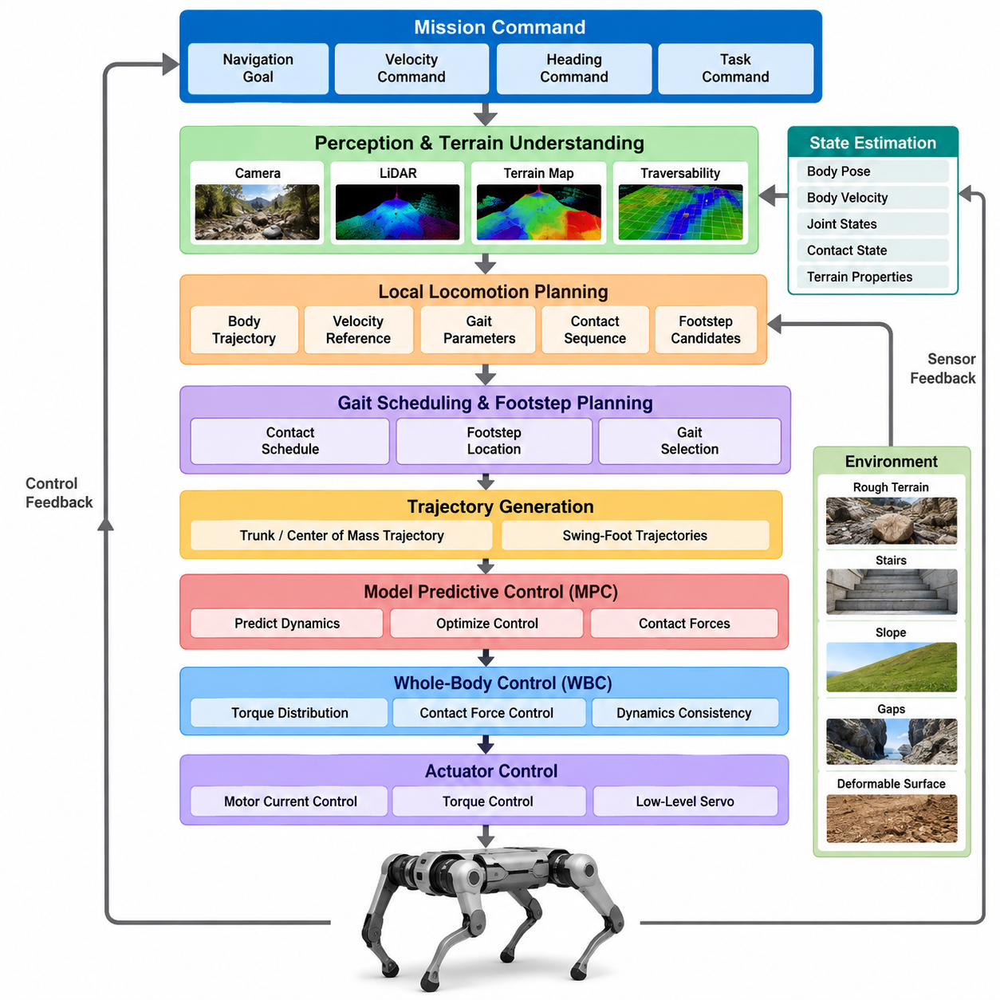
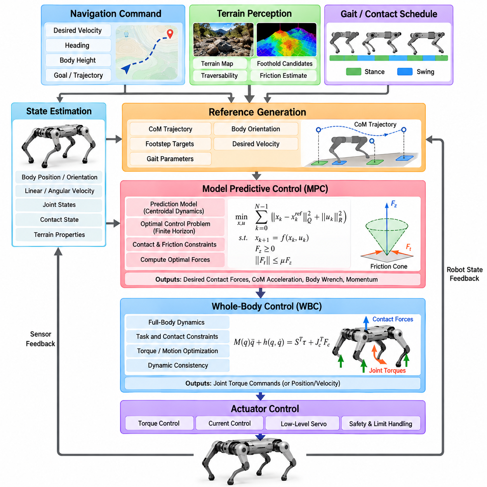
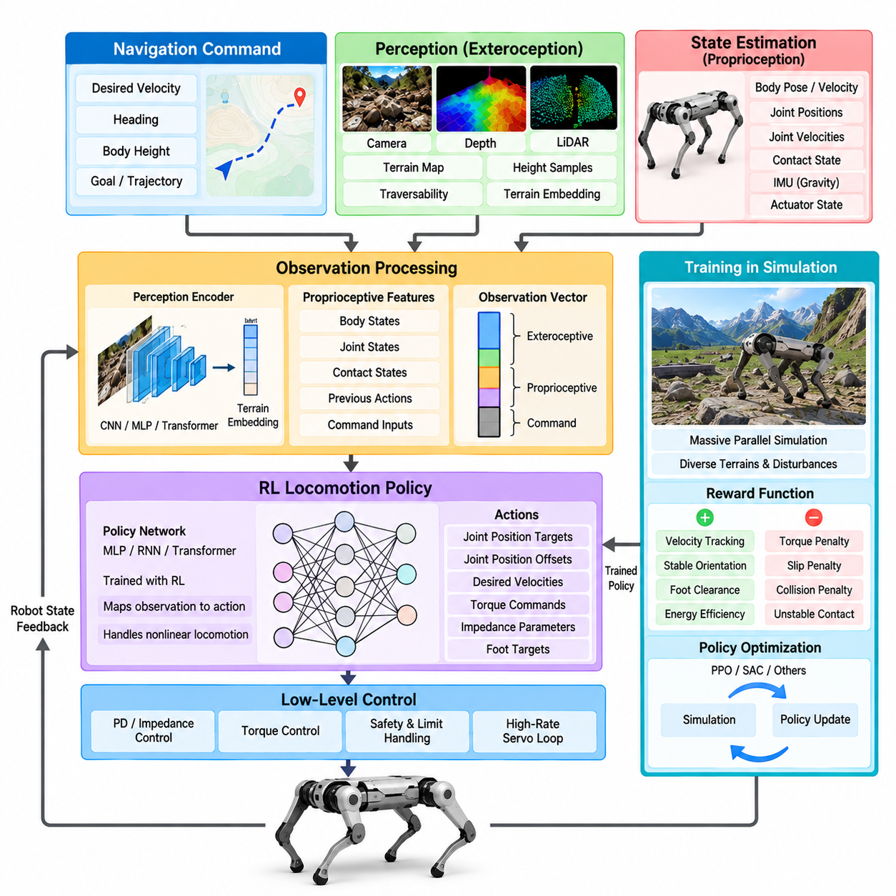
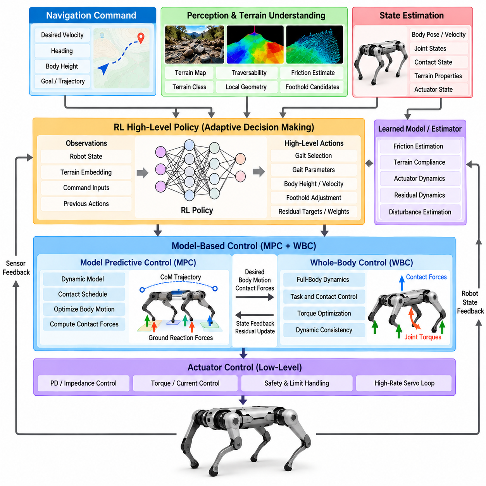
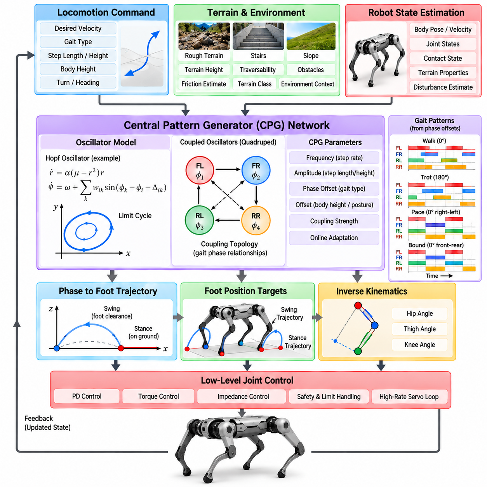
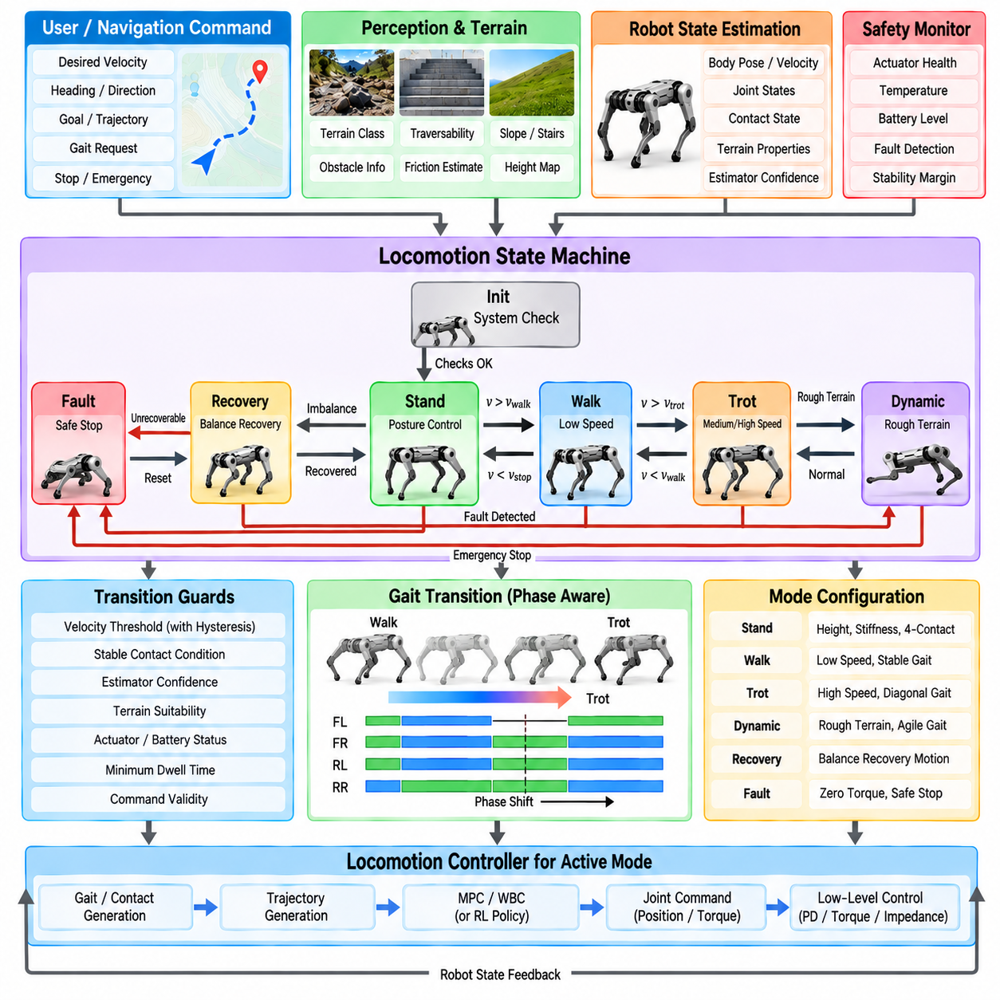
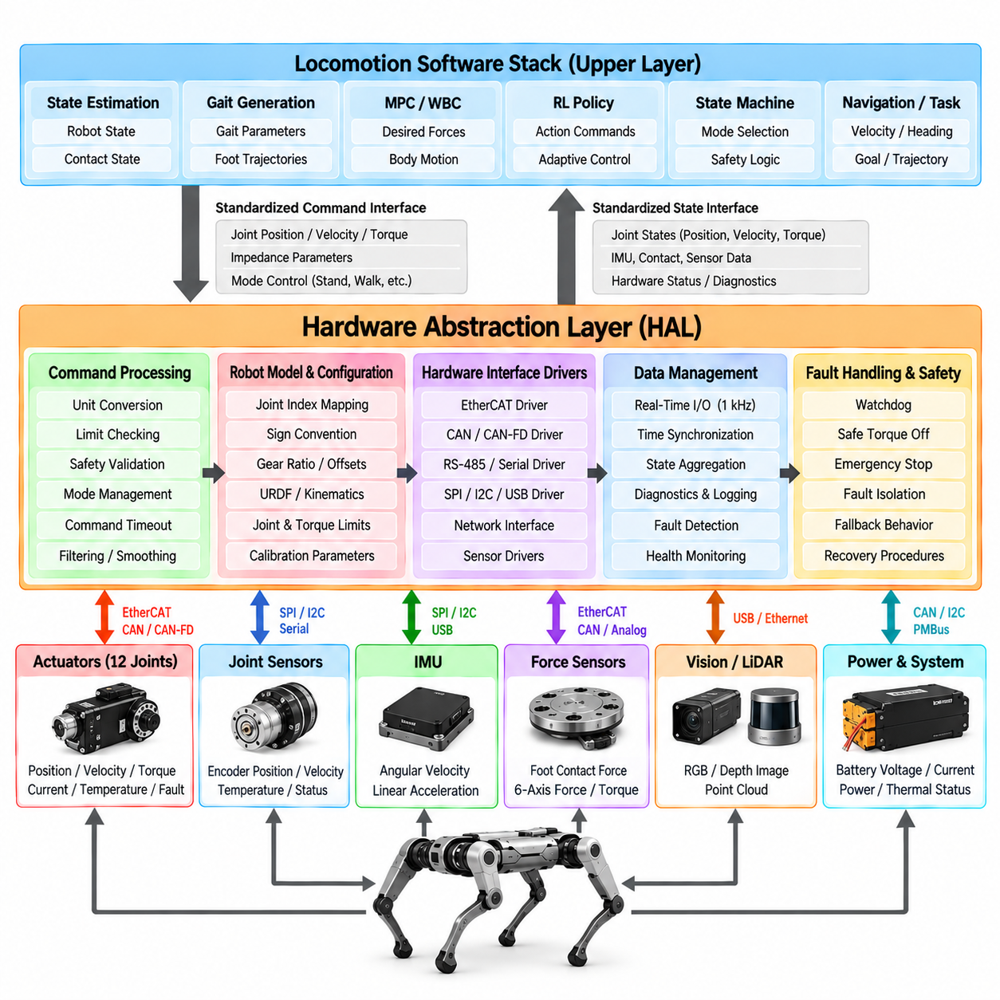
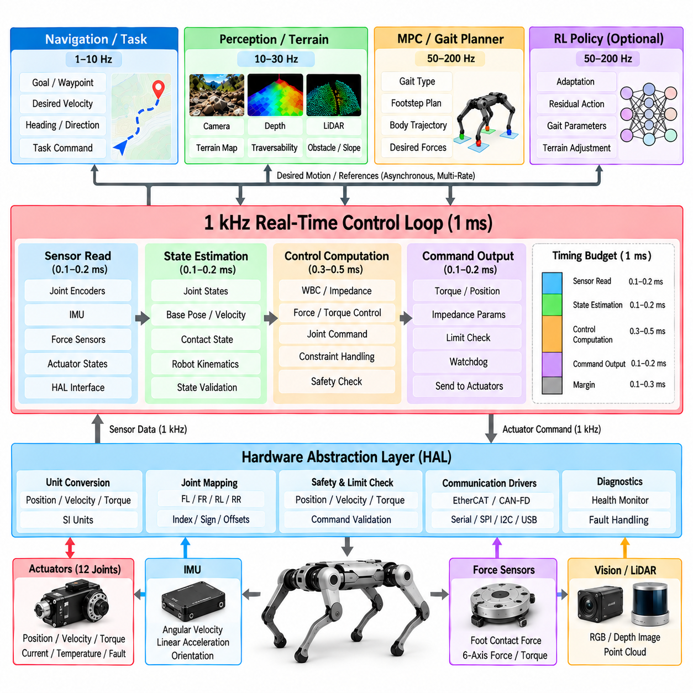
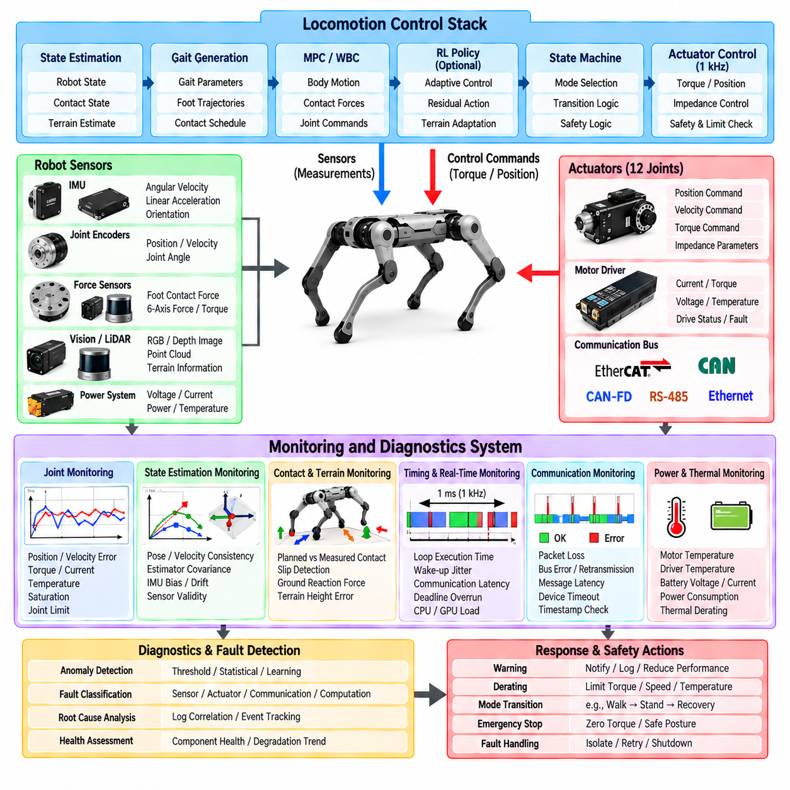
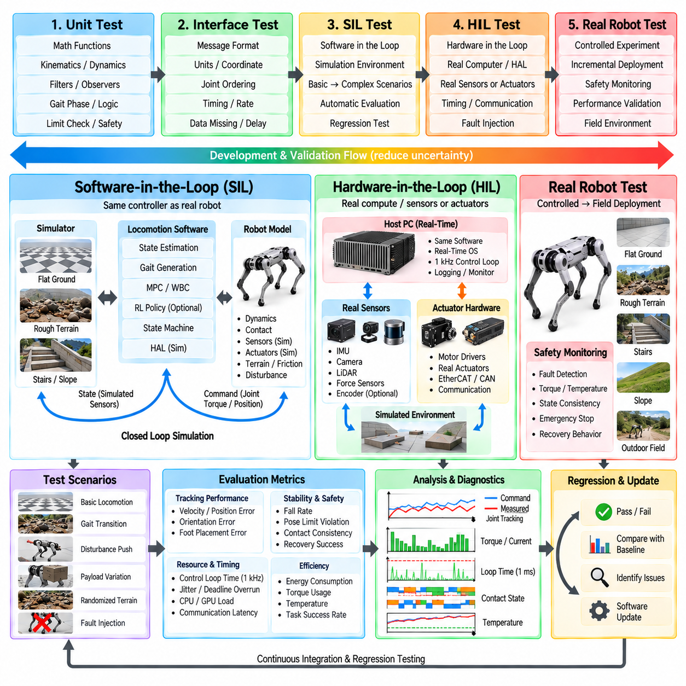

**Volume 21. Quadruped Robot Software**

# Chapter 02. Legged Locomotion Architecture

## 02.01. Locomotion Control Stack Architecture Overview

{width="7.268055555555556in" height="7.268055555555556in"}

Legged locomotion control is commonly organized as a hierarchical stack that converts high-level motion objectives into dynamically feasible joint commands. Unlike wheeled robots, a legged robot continuously changes its contact relationship with the environment. The control architecture must therefore coordinate perception, state estimation, planning, whole-body dynamics, contact management, and actuator control under strict real-time constraints.

At the highest level, the locomotion stack receives mission-oriented commands such as desired position, heading, velocity, destination, or navigation trajectory. These commands may originate from an autonomous navigation system, teleoperation interface, manipulation planner, or task-level Physical AI system. The locomotion controller translates these abstract objectives into body motion while respecting terrain geometry, stability limits, actuator capability, and environmental constraints.

A typical architecture separates locomotion functions according to their characteristic time scales. Global navigation and terrain reasoning may operate relatively slowly, while local motion planning executes more frequently. Whole-body control and model-based stabilization generally require much faster update rates, and motor current or torque control operates at the fastest level. This multi-rate structure allows computationally expensive reasoning to coexist with highly responsive physical stabilization.

State estimation forms a foundational layer because almost every controller depends on an accurate representation of the robot\'s physical state. Measurements from joint encoders, inertial measurement units, force sensors, cameras, LiDAR, and other sensors are fused to estimate body pose, velocity, joint configuration, contact state, and sometimes terrain properties. Errors in these estimates directly propagate into foot placement, balance control, and whole-body motion.

Terrain perception extends state estimation from the robot itself to the surrounding environment. Depth cameras, stereo vision, LiDAR, or learned perception models can generate elevation maps, traversability maps, semantic representations, and local geometric descriptions. The locomotion system uses this information to identify feasible footholds, obstacles, slopes, gaps, stairs, deformable surfaces, and regions that may produce unreliable contact.

A local locomotion planner converts the desired direction of travel and perceived terrain into a short-horizon motion strategy. Depending on the architecture, it may determine body trajectories, velocity references, gait parameters, contact sequences, or candidate footholds. Rather than solving the entire navigation problem, this layer repeatedly replans over a limited horizon so that the robot can respond to newly observed terrain and disturbances.

Gait scheduling defines when individual legs should remain in stance or transition into swing. Walking, trotting, pacing, bounding, crawling, and dynamically generated behaviors can all be represented through different contact schedules. In conventional architectures these schedules may be predefined, whereas optimization-based and learning-based systems can adapt contact timing according to velocity, terrain, disturbance, energy consumption, and stability requirements.

Footstep planning determines where the feet should contact the environment. Simple controllers may calculate footholds from desired body velocity and nominal gait geometry, while advanced systems optimize foothold locations using terrain maps and dynamic constraints. The planner must avoid unsafe surfaces while maintaining sufficient support geometry, kinematic reachability, collision clearance, and favorable conditions for subsequent body motion.

Trajectory generation connects discrete contact decisions to continuous robot motion. Swing-foot trajectories must provide ground clearance, controlled touchdown velocity, and feasible joint motion. Simultaneously, the desired trajectory of the trunk or center of mass must remain compatible with the support configuration. Smooth trajectories are especially important because discontinuous position, velocity, or acceleration references can create undesirable impact forces and actuator transients.

Model Predictive Control, or MPC, is frequently used to coordinate short-horizon body dynamics and contact forces. MPC predicts future robot behavior using a dynamic model and optimizes control variables while considering desired motion and physical constraints. Depending on implementation complexity, the model may represent centroidal dynamics, rigid-body dynamics, or a more complete formulation of the robot.

Through repeated optimization, MPC can calculate desired ground reaction forces, body accelerations, momentum trajectories, or contact decisions. Because the optimization is performed over a moving horizon, the controller continuously incorporates updated state estimates and motion objectives. This makes MPC particularly valuable for dynamic quadruped locomotion where future contact conditions strongly influence present control decisions.

Whole-Body Control, or WBC, converts body-level and contact-level objectives into commands that are consistent with the robot\'s full multibody dynamics. It simultaneously considers trunk orientation, center-of-mass motion, swing-leg tracking, stance constraints, joint limits, contact forces, and other objectives. Optimization techniques such as quadratic programming are commonly employed to resolve competing tasks while satisfying dynamic constraints.

The relationship between MPC and WBC is important in many modern locomotion stacks. MPC can determine the desired evolution of global body dynamics and ground reaction forces, while WBC realizes those objectives using the complete joint-level model. This division allows the predictive controller to remain computationally manageable while the whole-body controller handles detailed kinematics, joint constraints, and contact consistency.

At the lower level, joint controllers translate desired joint positions, velocities, or torques into actuator commands. Position control may be adequate for slow or highly constrained motions, but dynamic locomotion often benefits from torque control or impedance control. Impedance behavior allows the leg to respond compliantly to unexpected terrain while still tracking desired motion, reducing impact sensitivity and improving physical interaction robustness.

Contact estimation provides another essential feedback path across the architecture. A planned stance foot may lose contact, touch down earlier than expected, or encounter a compliant surface. Force sensors, motor torque estimates, joint dynamics, and inertial measurements can be used to infer actual contact conditions. The control stack must distinguish planned contact from measured contact and react appropriately when the two disagree.

Disturbance rejection is therefore distributed rather than confined to a single controller. Fast joint and impedance loops respond immediately to local interaction changes, whole-body control redistributes forces among available contacts, and MPC can modify future force or motion trajectories. Higher-level planners may subsequently change footholds or gait patterns. Hierarchical response allows disturbances to be handled at the fastest meaningful control level.

Real-time communication is critical because locomotion depends on synchronized information flowing between sensors, estimators, planners, controllers, and actuators. Timestamp errors, network jitter, delayed measurements, or asynchronous sensor streams can degrade stability even when individual algorithms are correct. Practical systems therefore require deterministic communication, accurate time synchronization, bounded computation latency, and explicit monitoring of stale or missing data.

The software architecture often reflects this hierarchy through modular processes or nodes connected by well-defined interfaces. Perception publishes terrain information, estimation publishes robot state, planners generate references, controllers calculate dynamic commands, and hardware interfaces communicate with actuators. Middleware such as ROS 2 can support modular integration, while safety-critical high-frequency loops may execute through dedicated real-time processes or embedded controllers.

Safety supervision should remain logically independent from normal locomotion optimization. A supervisory layer monitors orientation, joint limits, actuator temperature, communication health, battery state, excessive contact force, estimator confidence, and controller divergence. When predefined limits are exceeded, it can reduce speed, transition to a safer gait, command a controlled stop, lower the body, or activate hardware-level protective behavior.

Learning-based locomotion introduces an alternative or complementary pathway within this stack. A reinforcement-learning policy may directly generate joint targets, desired torques, foot trajectories, or latent locomotion commands from observations. However, learned policies still require state estimation, actuator interfaces, safety constraints, and often terrain perception. Consequently, learning usually modifies selected layers rather than eliminating the need for an overall control architecture.

Hybrid architectures combine learned policies with model-based control to exploit the strengths of both approaches. Learning can capture complex terrain adaptation and nonlinear behaviors that are difficult to model explicitly, while model-based optimization provides interpretable constraints and predictable dynamic structure. A learned foothold selector, terrain encoder, residual controller, or gait policy can therefore operate together with MPC, WBC, and impedance control.

The architecture must also manage uncertainty because neither perception nor dynamics are perfectly known. Terrain geometry may contain reconstruction errors, friction coefficients may be unknown, payload changes can modify inertial properties, and actuator characteristics can vary with temperature or battery condition. Robust controllers, adaptive estimation, uncertainty-aware planning, and conservative safety margins help prevent small modeling errors from developing into unstable locomotion.

For Physical AI systems, the locomotion stack can be understood as the bridge between embodied intelligence and physical execution. High-level intelligence determines what the robot should accomplish, perception and estimation determine the current physical situation, planning determines feasible future actions, and control converts those actions into forces and motion. Continuous feedback from the physical world closes this perception-action loop.

A well-designed locomotion architecture is therefore not simply a chain of independent algorithms. It is a coordinated hierarchy in which information moves both downward and upward. Commands propagate toward actuators, while state, contact, disturbance, and confidence information propagate toward planning and reasoning layers. The quality of these interfaces often determines overall performance as strongly as the sophistication of any individual algorithm.

Ultimately, robust legged locomotion emerges from the integration of estimation, terrain understanding, gait and foothold planning, predictive dynamics, whole-body coordination, actuator control, and safety supervision. The architecture must maintain stable operation across different computational rates while reacting rapidly to physical events. This integrated control stack provides the foundation upon which advanced quadruped navigation, manipulation, learning, and autonomous Physical AI behaviors can be built.

## 02.02. Model Based Locomotion MPC WBC Stack [w/Code]

{width="7.268055555555556in" height="7.268055555555556in"}

Model-based locomotion uses an explicit mathematical representation of robot dynamics to determine motions and forces that satisfy physical constraints. In quadruped systems, a widely used architecture combines Model Predictive Control (MPC) with Whole-Body Control (WBC). MPC reasons about future body motion and contact forces, while WBC converts these objectives into dynamically consistent joint-level commands.

The fundamental advantage of this architecture is the separation between predictive motion optimization and detailed whole-body realization. Directly optimizing every joint, actuator, contact, and terrain interaction over a long horizon can become computationally expensive. Instead, MPC often employs a reduced-order dynamic model, while WBC uses a more complete multibody model to enforce instantaneous kinematic and dynamic consistency.

The control process begins with a robot state estimate containing body position, orientation, linear and angular velocity, joint states, and estimated contact conditions. Desired velocity, heading, body height, or trajectory commands are provided by higher-level navigation or locomotion modules. Terrain perception may additionally supply surface geometry, foothold candidates, friction estimates, and constraints describing where reliable contacts can occur.

A reference generator converts these inputs into desired body and contact trajectories. It may specify center-of-mass motion, trunk orientation, desired velocity, gait phase, and nominal foothold locations. These references provide targets rather than rigid commands because MPC must retain sufficient freedom to modify future motion when dynamic feasibility, contact limitations, or disturbances make the nominal trajectory undesirable.

MPC repeatedly solves a finite-horizon optimal control problem. Starting from the current estimated state, it predicts how the robot will evolve over a sequence of future time steps. An objective function penalizes deviations from desired body position, velocity, orientation, momentum, or other references while also discouraging excessive control effort and undesirable variations in contact forces.

The prediction model is a critical architectural choice. Many quadruped controllers use centroidal dynamics or simplified rigid-body dynamics because these models capture the dominant relationship between body motion and ground reaction forces without explicitly optimizing every joint. More computationally intensive implementations can employ nonlinear dynamics or full-body models when sufficient processing capability and solver performance are available.

Contact scheduling provides MPC with information about which feet are expected to support the robot during each part of the prediction horizon. For a trot, for example, diagonal pairs of legs alternate between stance and swing. Contact schedules may be predefined by a gait generator, continuously adjusted by a supervisory controller, or incorporated as optimization variables in more advanced formulations.

During stance, MPC determines ground reaction forces that generate the required linear and angular accelerations of the robot body. These forces must obey physical constraints. A foot cannot pull on ordinary ground, normal forces must remain nonnegative, tangential forces must remain compatible with available friction, and actuator or structural limitations may restrict the magnitude and direction of realizable forces.

Friction constraints are commonly represented through a friction cone or a computationally convenient friction pyramid. These constraints prevent the optimizer from requesting contact forces that would cause the foot to slip. When friction is uncertain, conservative coefficients or adaptive estimates may be employed. Terrain-dependent friction therefore becomes an important connection between perception, estimation, planning, and model-based control.

At each control cycle, MPC calculates an optimized sequence of future states and control actions, but normally only the first portion of the solution is applied. The prediction horizon then moves forward, new measurements are incorporated, and the optimization is solved again. This receding-horizon principle enables continuous feedback correction while preserving the ability to anticipate upcoming contact transitions and terrain conditions.

MPC outputs can include desired ground reaction forces, center-of-mass acceleration, body wrench, momentum trajectory, or optimized body states. These quantities describe what the robot should achieve dynamically, but they do not necessarily specify how every joint should move. This is the point at which Whole-Body Control becomes responsible for translating reduced-order objectives into physically executable full-body behavior.

WBC uses the robot\'s multibody equations of motion, including mass distribution, joint configuration, Coriolis effects, gravity, actuator torques, and external contact forces. A typical formulation relates generalized acceleration, actuation, and contact forces through rigid-body dynamics. Contact Jacobians additionally describe how joint and body motion influence the position and velocity of feet interacting with the environment.

The controller simultaneously considers several tasks. The trunk may need to track a desired orientation, the center of mass must follow the reference motion, stance feet should remain stationary relative to the ground, and swing feet must follow planned trajectories toward future footholds. Joint posture objectives can keep the configuration away from singularities, mechanical limits, or geometrically undesirable poses.

Because these objectives can conflict, WBC commonly employs optimization-based formulations such as Quadratic Programming (QP). High-priority physical constraints are imposed explicitly, while tracking objectives are represented through weighted costs or hierarchical tasks. The optimizer then finds generalized accelerations, contact forces, and actuator torques that best satisfy the desired behavior without violating the robot\'s physical limitations.

The interface between MPC and WBC must be designed carefully. If MPC predicts forces using assumptions that differ substantially from the full robot dynamics, WBC may be unable to reproduce them accurately. Consistent coordinate frames, mass properties, contact definitions, timing, and actuator limits are therefore essential. Model mismatch at this interface can produce tracking error, oscillation, or unnecessary control effort.

Swing-leg control operates alongside stance-force regulation. Once a leg leaves the ground, it no longer contributes a supporting contact force and must be moved toward the next foothold. Swing trajectories are typically designed with sufficient ground clearance and smooth velocity profiles. Near touchdown, the trajectory may reduce vertical velocity to limit impact while preparing the leg for rapid transition into force-bearing stance.

Contact transitions represent one of the most sensitive parts of model-based locomotion. The mathematical model may assume that contact begins at a specific instant, while the physical foot can touch earlier or later because of terrain estimation errors. Robust implementations therefore use contact detection, compliant control, transition logic, or force ramping to avoid abrupt changes in commanded forces and joint torques.

Joint torque commands generated by WBC are passed to the low-level actuator controllers. High-performance quadrupeds commonly employ torque or impedance control because these approaches permit dynamic interaction with the environment. Impedance control can combine desired joint motion with compliant response, allowing small terrain errors and impact disturbances to be absorbed without forcing the high-level optimization to model every local interaction.

The MPC and WBC loops usually operate at different frequencies. MPC involves prediction and numerical optimization and may execute at tens to hundreds of hertz depending on model complexity and hardware. WBC generally runs faster because it must respond to rapidly changing joint and contact states. Motor current or torque regulation executes at an even higher frequency inside the actuator or embedded control system.

State estimation latency strongly affects the entire stack. MPC predictions initialized from delayed body states can produce forces appropriate for a state the robot no longer occupies, while WBC may attempt to compensate using inconsistent measurements. Accurate timestamps, sensor synchronization, low-latency communication, and prediction of delayed states are therefore practical requirements rather than merely implementation details.

External disturbances demonstrate the hierarchical behavior of the architecture. If the robot is pushed, fast actuator and impedance loops initially react to the physical deviation. WBC can rapidly redistribute contact forces and modify whole-body acceleration, while the next MPC iterations redesign the future force and body trajectory. If necessary, the gait or foothold planner can subsequently alter the contact sequence.

Model accuracy is important but perfect modeling is neither possible nor required. Payload variation, joint friction, structural compliance, actuator dynamics, ground deformation, and uncertain contact friction introduce discrepancies between predicted and actual motion. Feedback optimization repeatedly corrects these errors, while disturbance observers, adaptive parameters, robust MPC, or learned residual models can further improve performance.

Terrain-aware MPC extends the architecture by incorporating local surface geometry into prediction. Body trajectories and contact forces can then be optimized with respect to slopes, stairs, uneven surfaces, or constrained foothold regions. In more advanced systems, foothold selection and contact timing can also become part of the optimization, increasing adaptability while substantially increasing computational complexity.

The architecture can also incorporate learning without abandoning its model-based foundation. Neural networks may estimate friction, predict disturbances, approximate computationally expensive dynamics, tune MPC costs, or provide residual corrections. Learned components can therefore compensate for difficult-to-model effects while MPC and WBC retain explicit physical constraints and interpretable relationships between forces and motion.

Safety constraints can be embedded directly within both optimization layers. MPC may limit body inclination, predicted contact forces, velocity, or stability margins, while WBC enforces joint position, velocity, torque, and contact constraints. An independent supervisory controller should nevertheless monitor solver status, state-estimation confidence, communication integrity, actuator health, and abnormal body motion.

Optimization failure must be treated as a normal engineering possibility rather than an impossible event. A solver may exceed its computation deadline, encounter infeasible constraints, or receive invalid state information. Practical controllers therefore maintain fallback commands, previous feasible solutions, conservative standing behaviors, or controlled-stop modes so that numerical failure does not immediately become physical instability.

Computational determinism is especially important because a theoretically superior optimization method can perform poorly if its execution time varies unpredictably. The useful controller is one that produces sufficiently good solutions within every required deadline. Warm starting, sparse numerical methods, model simplification, horizon selection, solver tuning, and dedicated real-time computation are therefore integral parts of locomotion architecture design.

The MPC-WBC stack ultimately forms a hierarchical feedback system connecting prediction to physical execution. MPC answers how the robot should distribute motion and forces over the near future, WBC determines how the complete articulated body should realize the current portion of that plan, and low-level controllers produce the actuator behavior required to interact with the real environment.

For quadruped Physical AI, this architecture provides an important bridge between intelligent planning and dynamically reliable embodiment. Higher-level AI can select destinations, behaviors, terrain strategies, or manipulation objectives without directly solving high-frequency rigid-body dynamics. The model-based locomotion stack transforms those intentions into constrained, continuously corrected physical actions while returning state and interaction information upward.

A robust MPC-WBC architecture therefore depends not only on sophisticated optimization algorithms but also on consistent models, reliable estimation, contact-aware planning, deterministic computation, actuator bandwidth, and carefully designed interfaces. When these components operate as a coordinated hierarchy, quadruped robots can achieve stable, agile, and adaptable locomotion while maintaining explicit control over the physical constraints governing real-world motion.

## 02.03. Learning Based Locomotion RL Policy Stack [w/Code]

{width="7.268055555555556in" height="7.268055555555556in"}

Learning-based locomotion replaces selected manually designed control relationships with policies learned from interaction data. Reinforcement Learning (RL) is particularly effective for quadruped locomotion because a policy can learn nonlinear relationships among body motion, joint configuration, contact events, terrain conditions, and actuator commands without requiring every interaction to be represented analytically.

An RL locomotion stack remains a hierarchical control architecture rather than a single neural network directly controlling the entire robot. High-level navigation provides desired velocity, heading, or trajectory commands, while state estimation describes the current robot configuration and motion. A learned locomotion policy transforms these observations and commands into actions that are subsequently executed through lower-level actuator controllers.

The policy observation vector defines what information is available for decision making. Typical proprioceptive observations include body angular velocity, gravity direction, joint positions, joint velocities, previous actions, and commanded motion. Depending on the application, linear velocity, contact estimates, actuator states, terrain information, or temporal histories may also be included to provide richer information about the robot\'s physical state.

Proprioception is especially important because it allows locomotion to remain functional even when external perception becomes unreliable. Joint encoders and inertial measurements provide high-rate information about body and leg motion, while estimated contact states indicate interactions with the ground. Policies trained with sufficiently diverse disturbances can infer useful latent properties of terrain and dynamics from these internal measurements.

Exteroceptive locomotion extends the observation space using cameras, depth sensors, or LiDAR. Terrain height samples, elevation maps, depth images, point clouds, or learned terrain embeddings can inform the policy about upcoming obstacles before physical contact occurs. This enables anticipatory behaviors such as lifting a foot over an obstacle, adapting body height, or selecting safer stepping patterns.

Raw high-dimensional perception is often processed by a dedicated encoder before being provided to the locomotion policy. Convolutional networks, multilayer perceptrons, transformers, or other representation models can compress terrain observations into compact latent vectors. Separating perception encoding from action generation can reduce policy complexity and allow perception components to be trained or updated independently.

The policy network maps observations and task commands to an action representation. Actions may correspond to desired joint positions, joint position offsets, desired velocities, torques, impedance parameters, foot positions, or higher-level locomotion targets. The selected action space strongly influences learning difficulty, control bandwidth, physical interpretability, and the amount of responsibility assigned to low-level controllers.

Desired joint positions combined with proportional-derivative or impedance control are widely used because they provide a useful interface between learned behavior and physical actuation. The policy generates moderate-frequency joint targets while a faster embedded controller tracks those targets and reacts to local disturbances. This structure prevents the neural policy from having to reproduce the fastest actuator dynamics directly.

Direct torque policies provide greater control authority but generally require more accurate simulation and careful training. Small errors in torque commands can immediately influence contact stability, and differences between simulated and physical actuator dynamics can become significant. Torque-level learning therefore places greater importance on actuator modeling, latency simulation, safety constraints, and sim-to-real robustness.

Training is commonly performed in simulation because reinforcement learning may require millions or billions of interaction steps. Large numbers of simulated robots can operate in parallel, allowing policies to experience falls, collisions, extreme disturbances, and unusual terrain without damaging physical hardware. GPU-accelerated simulation has made this massively parallel training approach practical for modern quadruped locomotion.

The reward function defines the behaviors encouraged during training. A locomotion reward may encourage velocity tracking, desired orientation, stable body height, appropriate foot clearance, smooth motion, and energy efficiency. Penalties can discourage excessive torque, joint acceleration, foot slipping, collisions, unstable contact, or abrupt actions. Reward design therefore acts as an implicit specification of desired locomotion behavior.

Poorly designed rewards can produce behaviors that maximize numerical return while violating the designer\'s actual intention. A robot may exploit simulator assumptions, adopt energetically undesirable motion, or discover unnatural contact patterns. Reward terms must therefore be evaluated together with physical constraints and qualitative behavior rather than judged solely by the accumulated reward value.

Curriculum learning gradually increases task difficulty as the policy improves. Training may begin on flat terrain with moderate velocity commands and later introduce slopes, stairs, obstacles, reduced friction, stronger disturbances, or faster motion. This progression helps the policy acquire fundamental balance and gait behavior before solving difficult combinations of locomotion challenges.

Domain randomization is a central technique for transferring policies from simulation to real hardware. During training, parameters such as robot mass, center of mass, joint friction, motor strength, control delay, sensor noise, ground friction, and terrain geometry are randomly varied. The policy is therefore discouraged from depending on one exact simulated model and learns behavior that remains effective across a distribution of dynamics.

Actuator modeling deserves particular attention because simulated ideal motors differ substantially from physical actuators. Real systems exhibit torque limits, bandwidth restrictions, communication delay, friction, saturation, thermal effects, and nonlinear responses. Learned actuator models or experimentally identified motor models can be incorporated into simulation so that the policy experiences more realistic relationships between commands and resulting motion.

Latency randomization similarly improves robustness to real-time implementation effects. Observation delays, command delays, sensor sampling differences, and communication jitter can alter closed-loop behavior. Training the policy under randomized delay conditions reduces sensitivity to a single ideal timing assumption and can significantly improve deployment reliability on embedded computing platforms.

Privileged learning allows information available only during simulation to improve training without requiring that information during deployment. A teacher policy may observe exact terrain geometry, contact forces, friction coefficients, or disturbance parameters, while a student policy receives only realistic onboard observations. Distillation or asymmetric actor-critic methods can transfer useful behavior from privileged simulation knowledge into deployable policies.

Adaptation mechanisms can further address changes that were not explicitly represented by instantaneous observations. Recurrent networks or temporal encoders can process histories of states and actions to infer latent properties such as payload, friction, actuator weakness, or terrain compliance. The resulting internal representation allows locomotion behavior to change according to the estimated dynamics of the current environment.

Policy execution must satisfy strict real-time requirements. At each control step, sensor measurements are collected, observations are normalized, the neural network performs inference, actions are postprocessed, and commands are transmitted to actuator controllers. Although inference is usually cheaper than online trajectory optimization, unpredictable computation or communication delays can still destabilize high-performance locomotion.

Observation normalization is an important but easily overlooked component of deployment. Neural networks are sensitive to the statistical scale of their inputs, so the normalization parameters used during training must be reproduced correctly on the physical robot. Incorrect units, coordinate conventions, scaling factors, or clipping ranges can cause severe policy degradation even when the network weights themselves are correct.

Coordinate-frame consistency is equally critical. Body velocity, gravity vectors, terrain measurements, and command directions may be expressed in world, body, or heading-aligned frames. A mismatch between training and deployment frames can generate systematically incorrect actions. The policy interface must therefore define each observation and action variable with the same precision expected from a conventional model-based controller.

Safety layers are commonly placed around learned policies because neural networks do not inherently guarantee constraint satisfaction. Joint commands can be clipped to mechanical ranges, torque and velocity limits can be enforced, and abnormal body orientation can trigger recovery or shutdown behavior. Independent monitoring can detect invalid observations, policy divergence, excessive contact forces, communication failures, or actuator faults.

Recovery policies may be separated from normal locomotion policies. When the robot experiences a large disturbance or falls into a configuration outside the nominal locomotion distribution, a dedicated recovery controller can attempt to regain a standing posture. A supervisory state machine then selects between standing, locomotion, recovery, controlled stopping, and other operating modes according to robot condition.

Learning-based locomotion does not eliminate gait structure, even when gait timing is not explicitly programmed. Policies frequently discover periodic contact patterns resembling trot, walk, bound, or other recognizable gaits because these patterns are dynamically efficient solutions. Some architectures nevertheless provide gait phase or contact schedules explicitly to improve controllability, predictability, and transitions between behaviors.

Command-conditioned policies can represent many locomotion behaviors within one network. Desired forward velocity, lateral velocity, yaw rate, body height, or gait parameters can be included in the observation vector. The same policy can then generate different motions according to command inputs, reducing the need for separate controllers and enabling continuous transitions across a broad locomotion envelope.

Terrain-conditioned policies extend this concept by adapting behavior to environmental geometry. On flat ground the robot may use efficient low-clearance steps, while rough terrain may produce higher foot trajectories and more conservative body motion. Slopes, stairs, gaps, and irregular footholds can produce different contact strategies when the policy has been trained with sufficiently representative terrain distributions.

Hybrid model-based and learning-based stacks can improve reliability and flexibility. An RL policy may generate footholds, gait parameters, residual forces, or joint corrections while MPC or WBC maintains explicit dynamic constraints. Alternatively, model-based controllers can generate nominal behavior and a learned residual policy can compensate for modeling errors that are difficult to identify analytically.

Residual learning is particularly attractive when a reliable conventional controller already exists. Instead of learning locomotion from the beginning, the policy learns corrections to nominal model-based commands. This reduces the action space that must be learned and provides a meaningful fallback behavior when the learned correction is limited, disabled, or considered unreliable by the supervisory system.

Evaluation must extend beyond average reward or successful walking demonstrations. Policies should be tested across velocity ranges, terrain types, friction conditions, payload changes, external pushes, sensor noise, latency variations, and actuator degradation. Repeated trials and controlled perturbations are necessary to determine whether observed robustness reflects genuine generalization rather than favorable test conditions.

Sim-to-real validation should proceed incrementally. Initial experiments can use restrained or low-speed operation before expanding toward dynamic motion and difficult terrain. Logs of observations, actions, joint states, estimated contacts, motor currents, and body motion should be compared with simulation to identify systematic differences and guide improvements to the training environment.

For Physical AI, an RL locomotion policy functions as an adaptive execution layer between high-level intelligence and physical interaction. Task-level systems determine where and why the robot should move, while the learned policy determines how the articulated body should continuously react to commands, terrain, contacts, and disturbances. Feedback from execution can subsequently influence navigation and higher-level reasoning.

A robust RL policy stack therefore depends on much more than the neural network itself. Simulation quality, observation design, action representation, reward construction, domain randomization, actuator modeling, timing, safety supervision, and validation collectively determine real-world performance. When these components are engineered as an integrated system, learning-based locomotion can provide agile and highly adaptive behavior across complex physical environments.

## 02.04. Hybrid Locomotion Model Based RL Combination [w/Code]

{width="7.268055555555556in" height="7.268055555555556in"}

Hybrid locomotion combines model-based control and reinforcement learning to exploit complementary strengths within a single control architecture. Model-based methods provide explicit dynamics, interpretable constraints, and predictable safety boundaries, while learned policies capture nonlinear effects and adaptive behaviors that are difficult to describe analytically. The objective is not to replace one method with the other, but to assign each method to the control functions where it provides the greatest value.

Conventional model-based locomotion commonly relies on Model Predictive Control (MPC), Whole-Body Control (WBC), trajectory optimization, and impedance control. These techniques use mathematical models to calculate feasible body motion, contact forces, and joint commands. Their behavior can be inspected through physical quantities such as momentum, ground reaction force, friction limits, joint torque, and stability constraints.

Reinforcement Learning (RL) approaches locomotion from a different direction. Instead of explicitly deriving every control relationship, a policy learns mappings from observations and commands to actions through repeated interaction. This makes RL particularly effective for complicated terrain, uncertain contact, actuator nonlinearities, and behaviors where an accurate analytical model would be expensive or impossible to construct.

A hybrid architecture preserves the structured physical reasoning of model-based control while introducing learned components where uncertainty or complexity limits analytical methods. The learned component may operate above, inside, or below the model-based controller. Its role can range from selecting high-level locomotion parameters to generating small residual corrections at the actuator level.

One common architecture uses RL for high-level gait adaptation while retaining MPC and WBC for dynamic execution. The policy can select gait frequency, duty factor, body height, step length, or desired foothold characteristics according to terrain and command conditions. MPC then computes dynamically feasible body motion and contact forces, while WBC converts these objectives into joint-level commands.

Another approach uses learning for foothold selection. A model-based planner may generate nominal footsteps from robot velocity and gait geometry, while a learned policy modifies candidate footholds according to terrain observations. The model-based controller subsequently verifies kinematic reachability, contact constraints, and dynamic feasibility before the selected footholds are physically executed.

Residual reinforcement learning provides a particularly practical hybrid structure. A conventional controller first produces a nominal action based on known robot dynamics, and a learned policy generates a correction to that action. The final command is therefore formed from a physically meaningful baseline plus an adaptive residual rather than being produced entirely by a neural network.

Residual actions can be applied at several levels. A policy may modify desired ground reaction forces generated by MPC, adjust body trajectories, correct foot positions, change joint position references, or compensate actuator torques. Selecting the residual interface determines how much authority learning receives and how strongly the model-based controller constrains the resulting behavior.

Limiting residual magnitude provides a natural safety mechanism. If the nominal controller is known to maintain stable operation within a particular region, the learned correction can be bounded so that it improves performance without completely overriding the baseline behavior. This approach can simplify training because the policy learns only the difference between nominal and desired behavior rather than the complete locomotion task.

Learning can also improve the internal models used by optimization-based controllers. Neural networks may estimate unknown friction coefficients, terrain compliance, actuator response, external disturbances, payload changes, or residual dynamics. These estimates can be supplied to MPC or WBC so that optimization remains explicitly model-based while operating with parameters that better reflect the current physical system.

Learned dynamics models provide another integration mechanism. Instead of replacing the complete analytical model, a network can predict the modeling error between analytical dynamics and measured behavior. The controller then combines nominal physics with the learned residual model. This physics-informed structure often generalizes more reliably than learning the complete dynamics from data because known physical relationships remain explicitly represented.

Adaptive terrain understanding is especially suitable for hybrid control. Perception networks can classify terrain, estimate local geometry, infer traversability, or predict friction before contact. These learned estimates are passed to model-based planning and optimization layers, where they influence foothold selection, velocity limits, contact-force constraints, and body trajectory generation.

The reverse interaction is also useful: model-based calculations can provide structured inputs to learned policies. Predicted contact forces, stability margins, feasible foothold regions, or future body states can become observations for an RL policy. The policy therefore reasons over physically meaningful quantities rather than learning every relationship directly from raw sensor measurements.

Safety filters can be positioned between a learned policy and physical actuation. A policy proposes an action, but an optimization layer checks whether that action violates joint, torque, friction, collision, or stability constraints. If necessary, the proposed command is projected onto a feasible set. This allows learning to explore flexible behavior while explicit physics remains responsible for enforcing critical boundaries.

Control Barrier Functions, constrained optimization, and safety-oriented quadratic programs can serve this filtering role. Their purpose is not necessarily to generate nominal locomotion but to modify unsafe commands minimally. Such architectures create a clear separation between performance-oriented learning and constraint-oriented control, which is valuable when learned behavior must be deployed on expensive physical hardware.

Hybrid systems can also switch between complete controllers rather than blend individual commands. A supervisory controller may use model-based locomotion on predictable terrain and activate a learned policy for highly irregular surfaces or recovery behaviors. Controller switching requires careful transition management because abrupt changes in internal state, gait phase, or command representation can destabilize the robot.

A mixture-of-experts architecture provides a smoother alternative. Multiple specialized policies or controllers can be trained for different terrains, speeds, payloads, or behaviors, while a gating mechanism determines their contribution. Model-based feasibility checks can constrain the selected output. This allows specialization without requiring one policy to represent the entire locomotion operating envelope.

Training a hybrid policy requires the model-based components to be represented inside the training loop when they influence policy actions. If an RL policy learns residual corrections around MPC, the simulation should reproduce the MPC behavior that will exist during deployment. Otherwise, the policy may learn corrections for a baseline controller that differs from the real implementation.

Domain randomization remains important because hybrid control does not eliminate model uncertainty. Robot mass, payload, actuator strength, joint friction, communication delay, ground friction, terrain geometry, and sensor noise can be randomized during training. The model-based controller supplies structured nominal behavior, while the learned component develops robustness against variations not fully captured by the nominal model.

Reward design in hybrid systems can focus more directly on performance improvements over the baseline controller. Rewards may encourage velocity tracking, stability, energy efficiency, terrain traversal, smooth contact, and disturbance rejection while penalizing excessive residual corrections. Penalizing correction magnitude encourages the policy to preserve model-based behavior unless modification produces meaningful benefit.

The allocation of authority between model-based and learned components is a fundamental design decision. Too little learning authority may prevent meaningful adaptation, while excessive authority can effectively bypass the physical guarantees of the baseline controller. Authority can therefore be conditioned on terrain difficulty, estimator confidence, policy uncertainty, speed, or proximity to safety constraints.

Policy confidence can become part of supervisory control. When observations are far outside the training distribution or policy uncertainty becomes high, the system can reduce learned authority and rely more strongly on conservative model-based control. Conversely, within familiar operating conditions, the learned component can receive greater authority to improve agility, efficiency, or terrain adaptation.

Real-time scheduling is more complicated in hybrid systems because neural inference and numerical optimization must coexist. MPC, WBC, perception networks, policy inference, state estimation, and actuator loops may all operate at different frequencies. Their interfaces require consistent timestamps and bounded latency so that learned corrections are applied to the same physical state assumed by the model-based controller.

Failure handling must consider both numerical and learned components. MPC may become infeasible, an optimization solver may exceed its deadline, or a neural policy may receive corrupted observations. Supervisory logic should detect these conditions and transition toward known fallback behaviors such as standing, conservative walking, reduced speed, or controlled stopping rather than allowing one failed component to propagate instability.

Validation should separately evaluate the baseline controller, learned component, and combined system. This makes it possible to determine whether learning actually improves performance and whether the model-based controller continues to provide useful protection. Ablation testing can disable individual learned corrections, perception modules, or safety filters to identify which components are responsible for observed behavior.

Robustness testing should include terrain variation, low friction, payload changes, external pushes, actuator degradation, perception errors, sensor noise, and timing disturbances. A hybrid system should ideally degrade gracefully: as uncertainty increases, performance may become more conservative, but the robot should avoid sudden transitions from successful locomotion to uncontrolled failure.

Hybrid architectures are particularly valuable for quadruped Physical AI because high-level intelligence frequently requests behaviors that cannot be anticipated completely during controller design. The model-based stack provides a physically grounded execution framework, while learning supplies adaptation to environmental diversity and accumulated experience. Together they connect semantic task intelligence with reliable physical interaction.

The same principle can extend beyond locomotion. When a quadruped carries a manipulator, payload, sensor mast, or tool, model-based whole-body constraints can preserve balance while learned components adapt contact strategies or compensate unknown interaction dynamics. Hybrid control therefore provides a scalable foundation for locomotion-manipulation systems operating under changing physical conditions.

The long-term value of hybrid locomotion lies in maintaining a clear division between what is known and what must be learned. Rigid-body dynamics, actuator limits, geometric constraints, and safety boundaries can remain explicit, while uncertain friction, terrain interaction, unmodeled dynamics, and complex adaptation can be learned from data. This separation improves interpretability and reduces unnecessary learning burden.

A successful model-based and RL combination is therefore not defined by simply placing a neural network beside MPC or WBC. It requires deliberate selection of interfaces, authority limits, training distributions, safety mechanisms, timing architecture, and fallback behavior. When these elements are jointly engineered, hybrid locomotion can achieve the predictability of physics-based control together with the adaptability of learned intelligence.

## 02.05. Central Pattern Generator CPG Architecture [w/Code]

{width="7.268055555555556in" height="7.268055555555556in"}

Central Pattern Generator (CPG) architectures generate rhythmic locomotion signals through networks of coupled oscillators. The concept originates from biological motor systems, where neural circuits can produce periodic patterns such as walking even without continuously specifying every joint trajectory. In robotics, CPGs provide a compact mechanism for coordinating repeated leg movements while allowing frequency, phase, amplitude, and offset to be modified online.

A CPG can be interpreted as a dynamical system whose internal state evolves toward a stable periodic orbit called a limit cycle. Once oscillation is established, the system continuously produces rhythmic signals without requiring a stored trajectory for every gait cycle. This property makes CPG control attractive for locomotion because periodic motion emerges naturally from the controller dynamics rather than from repeated playback of predefined trajectories.

The simplest robotic CPG may contain one oscillator for each leg, although more detailed architectures can assign oscillators to individual joints or muscle-like actuator groups. Each oscillator produces a phase-dependent signal that can be transformed into desired joint angles, foot trajectories, contact timing, or other locomotion references. Coupling between oscillators determines how the legs coordinate with one another.

Phase relationships are central to gait generation. A quadruped can produce different gaits by changing the relative phase offsets among four leg oscillators. Walking, trotting, pacing, and bounding correspond to different temporal relationships between foot contacts and swing motions. Instead of storing independent trajectories for every gait, the controller can therefore represent gait structure through a compact set of phase parameters.

Oscillator frequency determines the rate at which the gait cycle repeats. Increasing frequency generally increases stepping cadence, although robot speed also depends on step length, body dynamics, and terrain interaction. Frequency can be commanded directly or adapted according to desired velocity. Smoothly changing oscillator frequency allows the robot to accelerate or decelerate without abruptly resetting the gait cycle.

Oscillation amplitude controls the magnitude of the generated motion. Depending on the mapping between oscillator state and physical movement, amplitude may influence joint excursion, step length, foot clearance, or body oscillation. Online amplitude modulation enables the robot to alter locomotion intensity while preserving the underlying rhythmic organization of the gait.

Offset parameters shift the center of periodic motion and can modify nominal joint posture, body height, or foot position. Frequency, amplitude, phase, and offset therefore form a compact parameterization for controlling complex cyclic behavior. Higher-level locomotion modules can manipulate these variables instead of commanding every point of every joint trajectory directly.

CPG models can be implemented using several mathematical oscillator formulations. Hopf oscillators are widely used because they naturally converge toward stable limit cycles with controllable amplitude and frequency. Other approaches include phase oscillators, coupled nonlinear oscillators, Matsuoka oscillators, and neural oscillator networks inspired more directly by biological reciprocal inhibition.

The Hopf oscillator is particularly useful because its radial dynamics can stabilize oscillation amplitude while its angular dynamics determine phase progression. When perturbed, the oscillator tends to return toward its limit cycle. This inherent convergence provides a form of dynamical robustness and distinguishes oscillator-based generation from purely time-indexed trajectory playback.

Coupling is the mechanism that transforms independent oscillators into a coordinated locomotion network. Each oscillator can influence the phase or state of other oscillators according to predefined coupling strengths and desired phase differences. Proper coupling causes the network to converge toward a stable gait relationship even when individual oscillators are temporarily disturbed.

For a quadruped, coupling topology determines how front, rear, left, and right legs coordinate. Strong symmetric coupling can enforce a regular gait, while more flexible coupling can permit transitions or terrain-dependent adaptations. The topology may be fully connected, pairwise, diagonal, ipsilateral, contralateral, or organized according to a structure inspired by biological locomotor networks.

CPG output is not necessarily applied directly to joints. A common architecture maps oscillator phase into a foot-space trajectory. During the swing portion of the cycle, the foot follows a trajectory that provides forward motion and ground clearance. During stance, the reference moves relative to the body in a manner consistent with propulsion and support before transitioning into the next swing phase.

Inverse kinematics can convert these desired foot positions into joint references for the hip, thigh, and knee. Lower-level position, torque, or impedance controllers then execute the motion. This separation allows the CPG to organize rhythmic timing while conventional kinematic and actuator controllers handle robot-specific geometry and physical realization.

Duty factor defines the fraction of a gait cycle during which a foot remains in stance. Symmetric oscillations can be modified so that swing and stance occupy different proportions of the cycle. A higher duty factor generally increases the amount of time each foot supports the robot, which can be useful for slow, stable locomotion, while lower duty factors are associated with more dynamic gaits.

Sensory feedback transforms an open-loop CPG into an adaptive locomotion controller. Contact sensors, joint measurements, inertial signals, terrain perception, and force estimates can modify oscillator phase, frequency, amplitude, or coupling. This enables the rhythmic generator to synchronize its internal pattern with actual physical events rather than assuming that planned contact occurs exactly as expected.

Phase resetting is an important feedback mechanism. If a foot touches the ground earlier than predicted, the oscillator phase can be advanced or reset to a stance-related state. If contact is delayed, the swing phase can be extended or modified. Such event-based synchronization helps the controller accommodate terrain-height errors and reduces disagreement between internal gait timing and real contact timing.

Load feedback can also influence the CPG. Increased force on one leg may prolong stance, alter the timing of neighboring legs, or modify oscillator amplitude. These responses resemble biological reflex mechanisms and can improve stability by allowing the gait pattern to adapt to asymmetric loading, payload shifts, slopes, or external disturbances.

Body orientation feedback provides another adaptation pathway. Roll, pitch, or angular velocity measured by an inertial measurement unit can modulate leg trajectories or oscillator parameters. For example, legs on one side of the robot can increase extension when the body rolls toward that side, producing corrective support while the basic rhythmic pattern remains active.

Terrain perception can modify CPG parameters before contact occurs. An elevation map or depth sensor may indicate an approaching obstacle, causing increased foot clearance or altered step length. A slope estimate can influence body posture and stance timing. In this architecture, perception does not replace the oscillator but adjusts its parameters according to environmental context.

Gait transitions can be achieved by continuously modifying phase relationships and oscillator parameters. Instead of stopping one gait and starting another, desired phase offsets can gradually move from a walking configuration toward a trotting or bounding configuration. Smooth parameter interpolation reduces discontinuities in foot motion and contact forces during behavioral transitions.

Transition stability depends on coupling dynamics and the speed at which parameters change. If desired phase offsets are changed too rapidly, oscillators may temporarily lose coordination or generate undesirable contact sequences. Practical implementations therefore limit parameter rates, monitor contact states, or use dedicated transition schedules to preserve physically meaningful support patterns.

CPGs can operate as standalone trajectory generators or as components inside larger model-based architectures. A CPG may provide gait phase and nominal foot trajectories while Model Predictive Control computes body motion and ground reaction forces. Whole-Body Control can then enforce dynamic consistency and transform these objectives into joint torques.

This combination is useful because the CPG efficiently represents periodic timing while optimization-based control handles constraints that oscillators do not explicitly represent. Friction limits, actuator torque bounds, body momentum, and contact-force feasibility can remain within MPC or WBC, while the CPG supplies a stable rhythmic structure for contact scheduling and swing-leg motion.

CPGs can also be integrated with reinforcement learning. Instead of asking an RL policy to generate every joint action, the policy can output CPG parameters such as frequency, amplitude, phase offset, duty factor, or trajectory modulation. This reduces the dimensionality of the learned action space and embeds useful locomotion structure directly into the policy interface.

Learning can additionally tune oscillator coupling, sensory feedback gains, or terrain-dependent parameter mappings. The resulting controller combines the regularity and interpretability of oscillator dynamics with the adaptation capability of data-driven methods. Because the learned policy operates on structured locomotion parameters, its behavior may be easier to analyze than direct torque-level neural control.

One advantage of CPG control is graceful recovery from temporary disturbances. Because oscillator dynamics continuously evolve toward stable rhythmic behavior, a perturbation does not necessarily require complete trajectory replanning. Sensory feedback can shift the oscillator state, after which the network naturally returns toward coordinated periodic motion as physical conditions stabilize.

However, rhythmic stability alone does not guarantee whole-body stability. A perfectly synchronized oscillator network can still command motions that violate friction constraints, exceed joint limits, or destabilize the robot body. CPG architectures therefore require appropriate kinematic limits, feedback mechanisms, safety supervision, and potentially model-based stabilization for demanding dynamic locomotion.

Parameter tuning is another important challenge. Coupling gains, phase offsets, oscillator frequencies, amplitudes, duty factors, feedback gains, and trajectory mappings interact with one another. Parameters that work well for one robot may perform poorly on another because morphology, mass distribution, actuator bandwidth, and leg geometry strongly influence the resulting physical dynamics.

Simulation provides an effective environment for CPG design and tuning. Large parameter spaces can be explored without risking hardware, and optimization or learning algorithms can automatically search for efficient gait configurations. Candidate controllers should nevertheless be validated under realistic actuator dynamics, sensor delays, friction variation, and terrain disturbances before physical deployment.

Real-time implementation of a CPG is generally computationally lightweight compared with repeated large-scale optimization. Oscillator state equations can be integrated at high frequency using modest computational resources. This makes CPG architectures attractive for embedded controllers, although the surrounding perception, estimation, optimization, and safety layers may still require substantial computing capability.

For quadruped Physical AI, CPGs provide a useful intermediate representation between high-level behavioral intention and low-level joint execution. A higher-level system can request faster motion, cautious walking, increased clearance, or a different gait, and these semantic intentions can be translated into a small number of oscillator and trajectory parameters.

The architecture is especially powerful when rhythmic generation, sensory adaptation, model-based stabilization, and learning are treated as complementary rather than competing approaches. The CPG supplies temporal organization, feedback aligns rhythm with physical contact, optimization enforces dynamic feasibility, and learning adapts parameters to conditions that are difficult to encode manually.

A well-designed CPG architecture therefore functions as more than a periodic signal generator. It provides a dynamical coordination layer that organizes leg timing, supports smooth gait transitions, incorporates sensory events, and exposes compact parameters to higher-level controllers. Integrated with modern estimation and control methods, it offers an efficient and interpretable foundation for adaptive quadruped locomotion.

## 02.06. Locomotion State Machine Gait Mode Transition [w/Code]

{width="7.268055555555556in" height="7.268055555555556in"}

A locomotion state machine organizes robot behavior into discrete operating modes and defines the conditions under which transitions between those modes are permitted. For a quadruped, these modes may include initialization, standing, walking, trotting, dynamic locomotion, stopping, recovery, and fault handling. The state machine provides supervisory structure above continuous controllers and prevents incompatible behaviors from being activated simultaneously.

Continuous locomotion controllers calculate forces, trajectories, or joint commands, but they do not necessarily determine when a robot should begin walking, change gait, stop, or enter recovery. The state machine addresses this supervisory problem. It interprets operator commands, navigation requests, estimated robot state, contact conditions, terrain information, and safety signals to determine which locomotion behavior should currently be active.

Each state represents a defined control configuration rather than merely a descriptive label. A standing state may activate posture regulation and four-foot contact control, while a trotting state may activate a periodic contact schedule and dynamic body controller. A recovery state may disable normal velocity tracking and instead execute motions designed to return the robot to a controllable posture.

Entry conditions specify when a state can safely become active. Before transitioning from standing to walking, the system may require valid state estimation, healthy actuators, sufficient battery capacity, acceptable body orientation, confirmed ground contacts, and a valid locomotion command. These guards prevent a high-level request from bypassing physical conditions required for safe execution.

Exit conditions determine when the current state should terminate. A walking state may exit because the commanded velocity approaches zero, terrain requires another gait, the robot loses balance, or a safety monitor detects abnormal operation. Separating entry and exit conditions reduces ambiguity and helps prevent rapid switching when sensor values fluctuate near a threshold.

Transition guards are logical conditions evaluated using current state and system information. A transition from walk to trot, for example, may require commanded speed above a threshold for a minimum duration while estimator confidence and terrain quality remain acceptable. Guard conditions can include hysteresis so that the reverse transition occurs at a different threshold, preventing repeated switching around one boundary.

Hysteresis is especially important for gait mode selection. If the walk-to-trot threshold and trot-to-walk threshold are identical, small velocity variations can cause continuous mode oscillation. Using separated thresholds creates a stable operating region. Temporal filtering or minimum dwell times can further ensure that a mode remains active long enough for the physical system to settle.

The state machine often has hierarchical organization. A top level can distinguish normal operation, recovery, and fault states, while normal operation contains subordinate modes such as stand, walk, trot, and specialized terrain locomotion. Hierarchical state machines reduce complexity because safety transitions can be defined at a common parent level instead of being duplicated for every gait.

Locomotion modes are closely related to gait definitions but are not necessarily identical to them. A locomotion mode may include a particular gait together with body-height settings, controller gains, speed limits, terrain assumptions, and contact strategies. Two modes can therefore use the same nominal gait while applying different parameters for flat ground, stairs, slopes, or payload transportation.

A gait transition involves more than replacing one contact schedule with another. The current phase of each leg, support configuration, body momentum, and upcoming footholds must be considered. An immediate change in phase relationships can create unsupported intervals or simultaneous leg motions that were not dynamically planned. Transition logic must therefore coordinate temporal and physical continuity.

Phase-aware transitions preserve the current progression of the gait while gradually changing desired relationships among the legs. A walk can transition toward a trot by modifying phase offsets over several cycles rather than resetting all oscillators or timers. This approach reduces discontinuities in swing trajectories, ground reaction forces, and body acceleration.

Contact-aware transition logic uses measured foot contact rather than relying exclusively on planned gait phase. A requested transition may be delayed until a specific foot touches down or until a stable support configuration is established. This is particularly useful on uneven terrain, where actual contact timing can differ from the nominal schedule because of height errors or compliant surfaces.

Velocity commands should also be blended during transitions. Switching instantly from the speed profile of one mode to another can introduce large acceleration demands. Command filters, ramps, or trajectory generators can gradually modify linear velocity, yaw rate, body height, and other references so that the lower-level controller receives physically reasonable targets.

Controller gains may require similar interpolation. Standing, walking, and dynamic running can require different stiffness, damping, tracking weights, or optimization parameters. Abruptly replacing these values can generate torque discontinuities even when the desired pose is unchanged. Gain scheduling and smooth parameter interpolation reduce these transient effects.

Model Predictive Control can use state-machine outputs to select contact schedules, cost weights, prediction parameters, and motion limits. When the locomotion mode changes, MPC may gradually replace its gait template or reference trajectory while continuing to optimize body dynamics. The state machine therefore determines behavioral context, while MPC determines dynamically feasible execution within that context.

Whole-Body Control similarly receives mode-dependent objectives. In standing, all feet may be constrained to remain stationary while trunk posture receives high priority. During locomotion, swing-foot tracking becomes active and stance constraints change according to gait phase. Recovery or manipulation modes may introduce additional tasks that alter the hierarchy of whole-body objectives.

Learning-based policies can also be coordinated through a state machine. Separate policies may exist for standing, locomotion, stair climbing, recovery, or specialized dynamic behaviors. Alternatively, one command-conditioned policy may support multiple modes while the state machine determines command ranges, safety limits, or contextual parameters supplied to the network.

When switching between learned policies, hidden internal states require attention. Recurrent policies may contain memory that reflects previous observations and actions. Activating such a policy with an inappropriate hidden state can produce unpredictable transient behavior. The state machine may therefore reset, initialize, or transfer recurrent states according to explicit transition procedures.

Central Pattern Generator architectures naturally interact with gait state machines. The state machine can select desired oscillator frequency, amplitude, duty factor, and phase relationships, while the CPG generates continuous rhythmic signals. During mode changes, parameters can be interpolated so that oscillator dynamics produce smooth transitions instead of discontinuous trajectory replacement.

Terrain information can trigger gait transitions automatically. Flat ground may support efficient trotting, while rough terrain may favor slower walking with longer stance duration. Stairs may activate a dedicated stepping mode, and slippery surfaces may reduce speed or increase duty factor. Terrain-triggered transitions should nevertheless consider confidence so that uncertain perception does not cause unnecessary switching.

Robot payload can influence mode selection as well. A quadruped carrying a heavy or dynamically shifting payload may require reduced speed, increased stance duration, lower body acceleration, or different controller gains. Payload estimates can therefore modify transition thresholds and restrict access to aggressive locomotion modes that are inappropriate for the current mass configuration.

Thermal and energy conditions can also affect locomotion states. If motor temperatures rise or battery power becomes limited, the supervisor can transition from aggressive locomotion to an energy-conservative mode. This illustrates that gait selection is not determined only by terrain and speed; it can reflect the complete operational condition of the physical robot.

Recovery states are essential because locomotion controllers are normally designed around a limited region of valid body configurations. If the robot experiences a severe disturbance, slips, or falls, continuing the normal gait controller may be ineffective or unsafe. A recovery state detects this condition and activates specialized behavior intended to restore a stable posture.

Recovery itself can contain multiple substates. The robot may first stop normal leg cycling, determine body orientation, reposition limbs to avoid self-collision, execute a righting maneuver, and finally return to a stable standing configuration. Only after state estimation and contacts are again reliable should the system permit transition back into normal locomotion.

Fault states differ from recovery states because they may represent conditions that cannot safely be corrected through normal motion. Communication loss, actuator faults, invalid sensor data, excessive temperature, or severe power problems may require immediate controlled stopping or disabling of selected actuators. Fault transitions should normally have higher priority than performance-oriented gait transitions.

An emergency state may override every normal transition rule. When critical limits are exceeded, the supervisor should not wait for a convenient gait phase before protecting hardware or preventing hazardous motion. The resulting action depends on system design and may include freezing commands, reducing torque, lowering the body, entering a safe posture, or triggering hardware-level protection.

Transition priority becomes important when several conditions occur simultaneously. A navigation module may request faster motion at the same moment that the safety monitor requests deceleration. The architecture must define deterministic precedence so that safety and hardware protection override mission performance. Without explicit priority rules, independent modules can generate contradictory mode requests.

State-machine events should be timestamped and logged because transition history is valuable for debugging. Logs can record the previous state, new state, trigger condition, estimated robot status, gait phase, contact state, and relevant safety signals. This information makes it possible to determine whether a failure originated in perception, supervisory logic, continuous control, or physical interaction.

Transition testing should include more than nominal mode sequences. Engineers should deliberately test commands arriving near thresholds, rapidly changing velocity requests, delayed contacts, sensor dropouts, terrain classification changes, actuator warnings, and simultaneous transition conditions. These boundary cases frequently expose logical errors that remain invisible during ordinary walking demonstrations.

Formal verification techniques can be useful for safety-critical transition logic. Reachability analysis, invariant checking, and systematic state-transition testing can identify forbidden sequences or states from which safe recovery is impossible. Although continuous robot dynamics remain complex, supervisory logic is sufficiently discrete that portions of its behavior can often be analyzed systematically.

The state machine should avoid becoming responsible for detailed trajectory control. Its purpose is to select behavior, define transition conditions, and configure lower-level controllers. Continuous quantities such as exact foot forces, joint torques, and body accelerations are better handled by MPC, WBC, impedance control, CPGs, or learned policies designed for high-frequency feedback.

For Physical AI, the locomotion state machine forms an important interface between semantic decisions and continuous physical control. A high-level system may request actions such as move quickly, approach carefully, climb stairs, stop, or recover. The state machine converts these intentions into valid control modes while checking whether current physical conditions permit the requested behavior.

This supervisory layer also provides a natural location for combining model-based and learned locomotion. Different states can activate different controllers, or one state can use a hybrid combination of MPC, WBC, CPG, and RL. The state machine defines when each capability is appropriate, while safety logic constrains transitions according to robot condition and environmental uncertainty.

A robust locomotion state-machine architecture therefore combines explicit mode definitions, guarded transitions, hysteresis, phase and contact awareness, smooth command blending, safety priority, recovery behavior, and detailed logging. When integrated with continuous control layers, it allows a quadruped to change behavior predictably without sacrificing dynamic continuity or physical safety.

## 02.07. Hardware Abstraction Layer for Quadruped HW [w/Code]

{width="7.268055555555556in" height="7.268055555555556in"}

A Hardware Abstraction Layer (HAL) provides a standardized software boundary between quadruped locomotion algorithms and physical hardware. Instead of allowing controllers to communicate directly with individual motors, encoders, inertial sensors, force sensors, or communication buses, the HAL exposes consistent interfaces for commands, measurements, configuration, and diagnostics. This separation reduces hardware dependency throughout the locomotion software stack.

Quadruped hardware is inherently heterogeneous. Actuators may use EtherCAT, CAN, CAN-FD, RS-485, Ethernet, or proprietary communication protocols, while sensors may connect through SPI, I2C, USB, serial links, or network interfaces. The HAL hides these implementation details so that upper-level software operates on standardized robot states and commands rather than device-specific packets and registers.

The primary design objective is to separate control logic from hardware access. Model Predictive Control, Whole-Body Control, reinforcement-learning policies, gait generators, and state machines should not need to know the exact motor driver protocol. They should request quantities such as desired torque, position, velocity, or impedance and receive measurements such as joint angle, velocity, estimated torque, temperature, and fault status.

A joint interface commonly represents each actuator using a consistent data structure. The command side may contain desired position, velocity, feedforward torque, proportional gain, and derivative gain. The feedback side may contain measured position, velocity, current, estimated torque, voltage, temperature, encoder status, and drive faults. Consistent naming and units prevent controller implementations from becoming tied to one actuator vendor.

Unit normalization is an essential HAL responsibility. One motor controller may report angles in encoder counts, another in degrees, and another in radians. Torque may be represented as current, percentage of rated output, or physical newton-meters. The HAL converts these device representations into a canonical set of SI units before data is exposed to estimation and control software.

Coordinate conventions require similar standardization. Joint-positive directions, motor rotations, encoder signs, and mechanical zero positions may differ among legs even when the mechanical structures are symmetric. The HAL applies sign conventions, offsets, and gear-ratio transformations so that upper-level controllers see a consistent kinematic representation of the complete robot.

Joint indexing must remain deterministic across every software component. A controller should know exactly which array element corresponds to the front-left hip, front-left thigh, front-left knee, and equivalent joints on the other legs. The HAL establishes this canonical ordering and maps it to physical actuator addresses, preventing accidental command exchange between joints.

Hardware configuration should be separated from executable control code whenever practical. Motor IDs, gear ratios, torque constants, encoder offsets, joint limits, communication channels, and sensor calibration parameters can be stored in configuration files. The HAL loads and validates these parameters during initialization, allowing one software architecture to support multiple robot revisions with minimal source-code modification.

Initialization is more than opening communication devices. The HAL should verify that expected actuators and sensors are present, communication rates are acceptable, firmware versions are compatible, calibration data is available, and measured states are physically plausible. The robot should not enter active torque control until hardware readiness has been established through a deterministic startup sequence.

Actuator enable and disable procedures require explicit state management. Drives may need to transition through initialization, calibration, standby, enabled, fault, and disabled conditions. The HAL coordinates these states and prevents high-level controllers from sending active commands to hardware that is not ready. Controlled sequencing also reduces unexpected motion during startup and shutdown.

The HAL should distinguish command validity from command transport. A communication link may successfully deliver a packet containing an unsafe or outdated command. Before transmission, the interface can check joint position limits, velocity limits, torque limits, numerical validity, timestamps, and operating mode. Invalid commands can be rejected, clipped, or replaced according to defined safety policy.

Command timeout protection is particularly important for legged robots. If the high-level controller stops updating because of a software crash, network failure, or computation overrun, the actuators must not continue applying the last dynamic command indefinitely. A watchdog mechanism detects stale commands and initiates a predefined fallback such as zero torque, damping mode, controlled posture, or hardware shutdown.

Real-time behavior is a fundamental HAL requirement because locomotion stability depends on predictable command and measurement timing. Hardware reads and writes should occur at deterministic intervals with bounded latency and jitter. Dynamic memory allocation, blocking operations, unpredictable logging, and slow device discovery should be avoided inside high-frequency control paths.

Timestamping allows measurements to be associated with the physical time at which they were acquired. This is essential when joint encoders, IMUs, force sensors, and external perception operate at different frequencies or communication delays. The HAL should preserve hardware timestamps when available or generate consistent host timestamps close to the acquisition boundary.

Time synchronization becomes increasingly important when sensing and control are distributed across multiple processors. An embedded motor controller, onboard computer, perception computer, and external sensor may each maintain an independent clock. Protocols such as Precision Time Protocol (PTP) or hardware synchronization signals can establish a common time base, while the HAL exposes synchronized timestamps to higher-level estimation software.

Sensor abstraction extends beyond joint feedback. An inertial interface can expose orientation-related measurements, angular velocity, linear acceleration, temperature, calibration state, and timing information in a consistent format. Foot-force interfaces can provide normal force, multi-axis force, contact estimates, or raw sensor values while hiding whether the measurement originates from load cells, strain gauges, or actuator torque estimation.

The HAL should preserve access to raw measurements even when processed quantities are available. State estimators may need calibrated physical values, while debugging tools may require raw encoder counts or unfiltered IMU data to identify hardware problems. A layered interface can therefore provide both standardized control data and diagnostic-level device information without mixing their responsibilities.

Contact sensing can be abstracted as a common interface even when different robot versions use different technologies. One platform may have dedicated foot-force sensors, another may infer contact from joint torque, and another may combine both. The HAL can expose contact-related measurements consistently while preserving metadata describing their source, confidence, and validity.

Communication-bus abstraction is another important function. A CAN-based robot and an EtherCAT-based robot can present the same joint interface to locomotion software even though their transport mechanisms differ substantially. Device-specific drivers implement the low-level protocol, while the common HAL interface defines the semantic meaning of commands and feedback.

EtherCAT is attractive for high-performance quadrupeds because it supports deterministic cyclic communication and synchronized distributed devices. CAN and CAN-FD provide simpler and robust networking for many embedded actuator systems. The HAL architecture should not assume that one transport is universally superior; instead, it should isolate transport-specific characteristics behind clearly defined driver interfaces.

A layered HAL often separates device drivers, hardware interfaces, and robot-level abstraction. Device drivers understand registers, packets, and firmware protocols. Hardware interfaces translate device information into standardized actuator or sensor representations. The robot-level layer assembles these components into a complete quadruped model with canonical joints, sensors, timing, and safety status.

This layered organization also supports simulation. A simulated robot can implement the same HAL interface as physical hardware, allowing controllers to run without modification. The simulator supplies joint states and sensor measurements while receiving the same command structures expected by real actuators. This interface equivalence reduces differences between development, simulation, hardware-in-the-loop testing, and deployment.

Hardware-in-the-loop testing can replace selected simulated components with physical devices while preserving the surrounding software architecture. For example, real motor drives can be connected to a test bench while the rest of the robot is simulated. A well-designed HAL makes these substitutions possible because control software interacts with interfaces rather than assuming a particular physical implementation.

Reinforcement-learning deployment benefits strongly from hardware abstraction. A policy trained in simulation expects observations and actions with specific ordering, units, scaling, and timing. The HAL can guarantee that physical joint states are transformed into the same conventions used during training and that policy outputs are converted safely into commands appropriate for the actual actuator system.

Model-based control has similar requirements. MPC and WBC depend on accurate joint positions, velocities, torque capabilities, and contact information. Incorrect gear ratios, sign conventions, or encoder offsets can corrupt the robot model even when the optimization mathematics is correct. The HAL therefore forms part of the physical-model integrity required by advanced locomotion controllers.

Diagnostics should be treated as a first-class interface rather than an afterthought. Actuator temperature, bus error counts, supply voltage, communication latency, sensor validity, packet loss, encoder warnings, and drive faults should be available to supervisory software. These signals allow the locomotion state machine to reduce performance or stop the robot before hardware degradation becomes catastrophic.

Fault handling requires standardized severity and response semantics. A temporary packet loss may justify a warning, while encoder failure or excessive motor temperature may require immediate deactivation. Device-specific fault codes can be translated into common categories so that safety logic does not need separate rules for every actuator or sensor model.

Logging at the HAL boundary provides valuable evidence for debugging because it captures both the commands requested by controllers and the measurements returned by hardware. Timestamped logs can reveal whether instability originated from the controller, communication delay, actuator saturation, sensor corruption, or mechanical response. Efficient binary logging is often preferable in high-frequency loops.

Calibration services can also be integrated into the hardware abstraction architecture. Joint-zero calibration, IMU alignment, force-sensor bias estimation, and actuator identification may require dedicated procedures that should not be embedded inside normal locomotion controllers. The HAL can expose controlled calibration operations and store resulting parameters with version and validity information.

Robot description and HAL configuration should remain consistent. Kinematic models, URDF descriptions, gear ratios, joint limits, actuator orientation, and physical hardware mappings must describe the same machine. Automated startup checks can compare selected parameters and reject configurations that would create dangerous disagreement between the software model and physical robot.

Version management becomes important as hardware evolves. A quadruped may receive new motors, revised gearboxes, different sensors, or updated electronics while retaining much of its locomotion software. Hardware profiles and interface-version definitions allow the HAL to support these variants explicitly rather than accumulating hidden conditional logic throughout control algorithms.

Cybersecurity and command authority should also be considered when hardware interfaces are network accessible. Only authorized processes should be able to issue actuator commands, and diagnostic access should not unintentionally provide control capability. Separation between control, monitoring, configuration, and maintenance interfaces reduces the risk of accidental or unauthorized hardware operation.

For Physical AI, the HAL forms the final software boundary before intelligent decisions become electrical and mechanical actions. High-level reasoning, navigation, learned policies, MPC, and WBC ultimately depend on this layer to deliver commands accurately and return trustworthy physical measurements. Errors at the abstraction boundary can invalidate sophisticated intelligence above it.

A robust quadruped HAL therefore combines standardized actuator and sensor interfaces, canonical units and coordinates, deterministic timing, synchronization, command validation, watchdog protection, diagnostics, calibration, simulation compatibility, and explicit fault handling. By isolating hardware-specific complexity, it enables locomotion software to remain portable while preserving the timing and safety guarantees required for real physical execution.

## 02.08. Real Time Control Loop 1kHz Architecture [w/Code]

{width="7.268055555555556in" height="7.268055555555556in"}

A 1 kHz real-time control loop provides the deterministic execution layer required for high-performance quadruped locomotion. At this frequency, the controller completes one sensing, computation, and actuation cycle every 1 millisecond. The objective is not simply to execute software quickly, but to guarantee that critical control operations occur within predictable timing bounds despite concurrent perception, communication, logging, and planning workloads.

The 1 millisecond control period defines a strict computational budget. Within each cycle, the system must acquire hardware measurements, update robot state, calculate control commands, validate outputs, and transmit commands to the actuators. Any computation that cannot reliably satisfy this deadline should normally be moved outside the hard real-time loop or executed at a slower rate.

A typical cycle begins by reading joint encoders, actuator states, inertial measurements, force information, and hardware diagnostics through the Hardware Abstraction Layer (HAL). These measurements should carry consistent timestamps and units so that the control algorithm operates on a coherent representation of the physical robot. Stale, incomplete, or invalid measurements must be detected before they influence actuator commands.

State estimation transforms raw measurements into quantities required by locomotion control. Joint positions and velocities are combined with IMU measurements, contact information, and robot kinematics to estimate base orientation, angular velocity, body velocity, and other dynamic states. The estimator may execute directly at 1 kHz or provide its latest synchronized result through a real-time-safe interface.

The control computation depends on the selected locomotion architecture. A Whole-Body Controller may solve for joint torques from body, contact, and swing-leg objectives, while a lower-level impedance controller may calculate torque from desired position and velocity references. The 1 kHz loop should contain only computations whose worst-case execution time is compatible with the available deadline.

Not every locomotion algorithm must operate at 1 kHz. Model Predictive Control may execute at tens or hundreds of hertz because its optimization horizon is computationally expensive, while gait planning, terrain perception, reinforcement-learning inference, and navigation may use still lower frequencies. Their latest outputs can be consumed by the 1 kHz servo layer through carefully designed asynchronous interfaces.

This creates a multi-rate control architecture. Navigation may update desired velocity slowly, terrain perception may update environmental information at camera or LiDAR frequency, MPC may periodically update force or trajectory references, and the real-time loop continuously tracks the latest valid references. Each layer operates at a rate appropriate to its physical bandwidth and computational requirements.

The separation between hard real-time and non-real-time computation is fundamental. Hard real-time code must meet every required deadline, whereas non-real-time components can tolerate moderate scheduling variation. Graphical interfaces, file operations, network services, model loading, database access, and general-purpose logging should never be allowed to block the high-frequency actuator loop.

A real-time operating environment reduces scheduling uncertainty. Real-time Linux with PREEMPT_RT, dedicated real-time threads, or an RTOS can provide bounded scheduling latency when properly configured. The operating system alone is not sufficient, however; application software must also avoid unpredictable operations and follow deterministic memory, synchronization, and communication practices.

The main control thread is commonly assigned a high real-time scheduling priority. Lower-priority tasks handle telemetry, visualization, configuration, diagnostics, and other noncritical operations. Priority assignment must be designed carefully because incorrect synchronization can produce priority inversion, allowing a low-priority task to delay a time-critical control operation.

CPU affinity can isolate the control thread on a dedicated processor core. This reduces interference from unrelated tasks and improves timing consistency. Interrupt affinity may also be configured so that communication and device interrupts are processed predictably. The objective is to reduce jitter rather than merely increase average computational throughput.

Dynamic memory allocation should generally be avoided inside the 1 kHz loop. Allocation and deallocation can introduce unpredictable latency because their execution time depends on memory state and allocator behavior. Buffers, matrices, messages, and solver workspaces should therefore be preallocated during initialization whenever possible.

Blocking synchronization is another major source of timing uncertainty. A real-time thread should not wait indefinitely for a mutex held by a non-real-time process. Lock-free queues, double buffering, atomic variables, real-time-safe ring buffers, or carefully bounded synchronization mechanisms are commonly used to exchange information between control and slower software components.

Double buffering is particularly useful for multi-rate references. A slower planner writes a complete new trajectory or parameter set into an inactive buffer and atomically makes it available after the update is complete. The real-time thread continues using the previous valid data until the new buffer is ready, preventing partially updated structures from entering the control calculation.

Communication with actuators must also satisfy deterministic timing requirements. EtherCAT is frequently used for high-rate legged-robot control because cyclic process data can be exchanged with predictable latency. CAN-FD or other buses can also be used when their bandwidth, topology, and timing characteristics satisfy the number of actuators and required update frequency.

Distributed clocks and synchronized communication help ensure that measurements from multiple actuator drives correspond to a consistent physical instant. Without synchronization, sequentially sampled joints can represent slightly different robot configurations. At high dynamic speeds, even small temporal inconsistencies can degrade state estimation and whole-body control accuracy.

The real-time loop should distinguish the nominal period from actual execution timing. Every cycle can record its wake-up time, computation duration, communication duration, and completion time. These measurements allow engineers to characterize average latency, worst-case execution time, jitter, and deadline misses rather than assuming that a nominal 1 kHz timer guarantees real-time performance.

Worst-case execution time is more important than average execution time for safety-critical control. A controller that usually completes in 300 microseconds but occasionally requires 1.5 milliseconds cannot reliably satisfy a 1 kHz deadline. Timing validation must therefore examine long-duration operation, computational peaks, communication disturbances, and simultaneous background workloads.

Deadline monitoring should be integrated into the runtime architecture. If a cycle exceeds its allowed execution time, the system can increment an overrun counter, record diagnostic information, and determine whether the event is isolated or persistent. Repeated deadline misses may trigger reduced control complexity, a lower-performance locomotion mode, controlled stopping, or another safety response.

A watchdog provides protection against complete control-loop failure. Hardware or an independent software component monitors whether the control process continues to update within an expected interval. If the process crashes, deadlocks, or stops producing valid commands, the watchdog initiates a predefined actuator response rather than allowing the last command to remain active indefinitely.

Command validation is performed before actuator transmission. Joint torque, position, velocity, and impedance parameters should remain within hardware and configuration limits. Numerical checks should reject NaN or infinite values, while rate limiters can prevent unrealistic command discontinuities. This final validation stage provides a safety boundary between control computation and physical actuation.

Torque saturation requires careful handling because simply clipping commands can alter the behavior assumed by the controller. If a Whole-Body Controller repeatedly requests torque beyond actuator capability, the system should expose saturation information to supervisory logic. Persistent saturation may indicate excessive velocity commands, poor contact assumptions, payload errors, or a controller operating outside its valid region.

Sensor validity should be monitored at the same rate whenever practical. Encoder discontinuities, impossible joint velocities, IMU saturation, missing packets, or inconsistent actuator timestamps can indicate corrupted feedback. Depending on severity, the loop may retain the last valid value briefly, switch to an alternative estimate, reduce performance, or enter a safe state.

The real-time loop interacts closely with the locomotion state machine. Different modes can select different control objectives, gains, contact assumptions, and command limits, but mode changes should be communicated without introducing discontinuities. The high-frequency layer executes the currently authorized mode while supervisory logic determines when transitions are permitted.

Gait phase and contact state often require high-frequency updates even when the gait planner itself runs more slowly. The servo loop can advance phase variables, detect touchdown or liftoff events, and apply the latest swing or stance references. This enables rapid reaction to physical contact while preserving the slower planning architecture above it.

Model Predictive Control can operate asynchronously from the servo loop. MPC periodically computes future body trajectories, contact forces, or other optimized references and publishes the latest valid solution. The 1 kHz controller interpolates or tracks these references until a new solution becomes available, avoiding the need to solve the full optimization problem every millisecond.

Whole-Body Control may operate at the full servo frequency when its optimization problem is sufficiently small and deterministic. Quadratic-programming matrices can be preallocated, sparsity structures reused, and warm starts applied to reduce computation time. Solver iteration limits should be bounded so that occasional difficult optimization problems cannot consume unlimited real-time execution time.

If an optimization problem becomes infeasible, the real-time architecture needs a deterministic fallback. The controller may relax selected noncritical objectives, reuse a previous feasible solution briefly, switch to an impedance-based command, or request a safer locomotion state. Failure handling should be designed in advance rather than relying on undefined solver behavior.

Reinforcement-learning policies are commonly executed at a lower frequency than the motor servo loop. A policy may generate desired joint positions, residual actions, gait parameters, or latent commands that remain valid across several 1 kHz cycles. The servo controller then interpolates and tracks these outputs while enforcing torque, position, velocity, and safety constraints.

Policy inference timing must still be bounded even when it is asynchronous. GPU scheduling, memory transfer, model execution, and preprocessing can introduce variable latency. The real-time loop should never wait synchronously for neural inference. Instead, it should continue using the latest valid policy output and detect when that output becomes too old to trust.

Logging must be designed so that observability does not compromise determinism. The real-time thread can write compact telemetry records into a preallocated ring buffer, while a lower-priority process transfers them to storage. This permits high-rate recording of commands, measurements, timing statistics, contact states, and faults without performing file I/O inside the servo cycle.

Clock synchronization is essential when control data must be correlated with cameras, LiDAR, external computers, or distributed processors. Precision Time Protocol (PTP), synchronized hardware clocks, or trigger signals can establish a shared time reference. The 1 kHz loop can then relate fast proprioceptive measurements to slower perception data with known temporal alignment.

Startup and shutdown require deterministic sequencing. Before the loop begins active control, memory should be allocated, hardware communication established, sensors validated, actuator states confirmed, and initial robot state checked. During shutdown, commands should transition toward a defined safe behavior before drives are disabled, rather than terminating the control process abruptly.

Performance validation should measure timing under realistic worst-case conditions. Tests should include full telemetry, perception workloads, network traffic, optimization activity, policy inference, and hardware communication while the control loop runs continuously. Stress testing reveals interference that may not appear when the servo process is evaluated in isolation.

Software-in-the-loop and hardware-in-the-loop testing can verify real-time behavior before unrestricted robot operation. Artificial delays, dropped packets, solver overruns, sensor corruption, and CPU load can be injected deliberately. The expected result is not merely continued operation, but predictable detection and transition toward defined fallback behavior.

For quadruped Physical AI, the 1 kHz loop is the point where high-level intelligence is converted into tightly timed physical interaction. Navigation, terrain reasoning, learned policies, and planning can operate at slower semantic timescales, while the servo layer continuously maintains contact forces, joint behavior, and body stabilization at the mechanical timescale of the robot.

A robust 1 kHz architecture therefore depends on deterministic scheduling, bounded computation, preallocated memory, real-time-safe communication, multi-rate interfaces, synchronized sensing, deadline monitoring, watchdog protection, command validation, and predefined fallback behavior. The value of the architecture lies not in the numerical frequency alone, but in guaranteeing predictable physical control every millisecond.

## 02.09. Locomotion Monitoring and Diagnostics [w/Code]

{width="7.268055555555556in" height="7.268055555555556in"}

Locomotion monitoring and diagnostics provide continuous visibility into the physical, computational, and control state of a quadruped robot. A locomotion system may appear functional while actuator saturation, estimator drift, contact errors, timing overruns, or thermal problems gradually develop. Monitoring converts these hidden conditions into measurable indicators so that abnormal behavior can be detected before it becomes instability or hardware failure.

Monitoring should span the complete locomotion stack rather than focus only on actuator faults. Relevant information originates from sensors, state estimation, gait generation, Model Predictive Control (MPC), Whole-Body Control (WBC), reinforcement-learning policies, the Hardware Abstraction Layer (HAL), communication buses, and the real-time control loop. Correlating these layers is essential for identifying the actual origin of abnormal robot behavior.

Joint-level monitoring provides the most direct view of actuator behavior. Position, velocity, commanded torque, measured or estimated torque, motor current, temperature, voltage, and drive status can be observed continuously. Comparing commanded and measured quantities reveals tracking errors, mechanical resistance, saturation, calibration problems, or actuator degradation that may not immediately produce a hardware fault.

Tracking error should be interpreted in relation to operating conditions. A temporary position error during impact may be acceptable, while persistent error during normal stance may indicate insufficient torque, excessive load, mechanical damage, or controller tuning problems. Diagnostic thresholds should therefore consider gait phase, commanded motion, actuator limits, and the expected dynamic behavior of the robot.

Actuator saturation is a particularly important diagnostic signal. Repeated torque or current saturation indicates that the controller is requesting behavior close to or beyond physical capability. The cause may be excessive speed, aggressive acceleration, poor foothold selection, unexpected payload, low friction, incorrect model parameters, or mechanical resistance. Persistent saturation should be reported to supervisory control rather than silently clipped.

Thermal monitoring protects motors, drives, batteries, and computing hardware from accumulated stress. Temperature limits can be divided into warning, derating, and critical regions. As temperature rises, the system may reduce torque limits or locomotion speed before reaching a shutdown threshold. This gradual response provides graceful degradation instead of waiting for an abrupt thermal fault.

Electrical diagnostics include supply voltage, battery current, bus voltage, actuator current, and power consumption. Sudden voltage drops may indicate excessive transient load or battery limitations, while abnormal current patterns can reveal stalled joints or mechanical interference. Energy monitoring also helps evaluate gait efficiency and determine whether locomotion performance is sustainable over long missions.

Communication health should be monitored continuously because distributed quadruped control depends on reliable data exchange. Packet loss, bus errors, retransmissions, communication latency, stale messages, and device timeouts can degrade control even when every actuator remains mechanically healthy. Diagnostics should distinguish occasional communication disturbances from persistent network degradation.

Real-time timing diagnostics are equally important. A nominal 1 kHz loop does not guarantee that every control cycle actually completes within 1 millisecond. The system should measure execution time, wake-up jitter, communication duration, solver time, and deadline overruns. Maximum and percentile timing statistics often reveal problems that average execution time alone can hide.

State-estimation monitoring determines whether the controller can trust its representation of robot motion. Orientation, base velocity, joint states, contact estimates, estimator covariance, innovation residuals, and sensor validity can be checked for consistency. A locomotion controller operating on inaccurate state estimates may generate apparently reasonable commands that are physically inappropriate for the actual robot.

IMU diagnostics should detect saturation, bias drift, discontinuities, timestamp errors, and implausible acceleration or angular velocity. Because inertial measurements strongly influence body-state estimation, subtle IMU problems can propagate throughout the locomotion stack. Cross-checking inertial estimates against kinematic and contact information can expose inconsistencies before they destabilize control.

Contact monitoring compares planned contact states with measured or estimated physical contacts. A planned stance foot that produces no supporting force may indicate slip, terrain-height error, failed touchdown, or incorrect contact estimation. Conversely, an unexpected contact during swing may indicate obstacle collision or premature touchdown. These events are valuable indicators of terrain interaction quality.

Slip detection is particularly important because many locomotion controllers assume that stance feet remain approximately stationary relative to the ground. Foot velocity, estimated ground reaction force, joint motion, body acceleration, and friction estimates can be combined to identify probable slip. Persistent slip should influence gait selection, velocity limits, foothold planning, or recovery behavior.

Ground reaction force monitoring provides insight into load distribution and contact quality. Large differences between commanded and measured forces may indicate inaccurate dynamics, poor state estimation, actuator limitations, or unexpected terrain compliance. Force distribution can also reveal whether one leg is consistently overloaded because of body posture, payload imbalance, or calibration errors.

Gait diagnostics monitor phase progression, duty factor, swing duration, stance duration, touchdown timing, liftoff timing, and synchronization among legs. Deviations between planned and actual gait events can indicate terrain disturbances or controller problems. Monitoring these quantities over multiple cycles can reveal systematic asymmetry that may be difficult to observe from individual joint signals.

Foot trajectory diagnostics compare desired and measured foot motion in both swing and stance. Excessive swing tracking error may indicate insufficient actuator bandwidth or kinematic limitations, while unexpected stance-foot movement can indicate slip or structural compliance. Minimum foot clearance and obstacle-contact events can also be recorded to evaluate terrain traversal performance.

Body-level monitoring evaluates roll, pitch, yaw, height, linear velocity, angular velocity, and acceleration relative to desired references. Stability indicators can be derived from orientation error, support configuration, contact forces, momentum, or other controller-specific quantities. Rapid growth of body-state error can provide an early warning before a complete loss of balance occurs.

MPC diagnostics should expose more than the optimized command. Solver status, computation time, objective value, constraint violation, predicted states, contact forces, and infeasibility events provide information about whether the optimization problem remains physically meaningful. Frequent solver difficulty may indicate poor model parameters, unrealistic references, or contact schedules inconsistent with the environment.

WBC diagnostics can similarly report task errors, constraint residuals, joint torque limits, contact consistency, and optimization status. When several tasks compete for limited actuator authority, monitoring their residual errors reveals which objectives are being sacrificed. This is valuable when debugging locomotion because a stable robot may still be failing to achieve intended body or swing-foot behavior.

Learning-based locomotion introduces additional diagnostic requirements. Policy observations and actions should be checked for valid ranges, normalization errors, stale data, and distribution shifts. If available, policy confidence or uncertainty can be monitored. Large deviations from the training distribution can trigger reduced policy authority or transition toward a conservative model-based controller.

Hybrid model-based and learning-based architectures should monitor the contribution of each component separately. In residual reinforcement learning, for example, the nominal command and learned residual should both be logged. A continuously large residual may indicate that the baseline model is inaccurate or that the learned policy is compensating for a persistent hardware or calibration problem.

The locomotion state machine provides important diagnostic context because identical sensor values can have different meanings in different modes. High joint velocity may be normal during dynamic locomotion but abnormal during standing. Monitoring rules should therefore be mode-aware, and every diagnostic event should record the active locomotion state and relevant transition history.

Diagnostic severity should be standardized into meaningful levels. Informational events can record normal transitions, warnings can identify degrading conditions, recoverable faults can request reduced performance or recovery behavior, and critical faults can demand immediate protective action. A consistent severity model prevents individual software modules from implementing contradictory responses to similar problems.

Fault isolation attempts to identify the source rather than merely detect abnormal behavior. A body tilt could originate from foot slip, actuator weakness, incorrect contact estimation, or an IMU problem. Correlating joint commands, forces, contact states, estimator residuals, and communication health helps distinguish these possibilities and reduces unnecessary replacement of healthy components.

Fault detection can combine fixed thresholds with model-based consistency checks. Simple limits are effective for temperature, voltage, torque, and timing, while relationships among several signals can identify subtler failures. Expected motion derived from robot dynamics or kinematics can be compared with measured behavior to generate residuals that indicate inconsistency.

Trend monitoring extends diagnostics beyond instantaneous faults. Slowly increasing motor current, rising joint friction, worsening tracking error, or increasing communication retries may indicate degradation long before a hard limit is exceeded. Statistical summaries across hours or missions can support predictive maintenance and help identify components approaching failure.

Logging should preserve enough information to reconstruct important locomotion events. High-rate logs may include joint states, commands, IMU data, contacts, forces, controller outputs, solver status, timing information, state-machine events, and hardware diagnostics. All records should use a common time reference so that events from different layers can be aligned during analysis.

Because unrestricted high-rate logging can consume excessive storage and communication bandwidth, logging should be structured by importance and rate. A ring buffer can continuously retain recent high-frequency data and preserve it when a fault occurs. Lower-rate summaries can be stored continuously, while detailed traces around abnormal events provide evidence without requiring permanent recording of every raw sample.

Event-triggered recording is particularly useful for intermittent failures. When slip, deadline overrun, actuator saturation, estimator divergence, or a state transition occurs, the system can preserve data from several seconds before and after the event. Pre-trigger history is important because the cause of a failure often appears before the condition that finally activates the fault detector.

Online dashboards can present selected health indicators without becoming part of the real-time control path. Operators may observe gait mode, body orientation, actuator temperatures, battery state, communication health, solver status, and active warnings. Visualization processes should consume diagnostic data asynchronously so that display performance cannot interfere with deterministic locomotion control.

Diagnostic information should also be accessible to autonomous supervisory software. A Physical AI system should not depend exclusively on a human operator to interpret robot health. High-level planning can use diagnostic status to reduce speed, avoid difficult terrain, return to a charging location, request maintenance, or terminate a mission when continued operation becomes unsafe.

Recovery decisions should depend on diagnostic evidence. A temporary slip may require only gait adaptation, while repeated contact loss combined with increasing body tilt may justify a recovery transition. An actuator communication failure may require controlled stopping rather than balance recovery. Mapping diagnostic patterns to appropriate responses prevents one generic recovery behavior from being used for every failure.

Simulation provides a safe environment for validating diagnostic logic. Sensor faults, actuator saturation, communication delay, terrain slip, estimator drift, and timing overruns can be injected systematically. The monitoring system should detect the injected condition with acceptable latency while avoiding excessive false alarms during normal dynamic behavior.

Hardware-in-the-loop testing extends this validation to actual electronics and communication devices. Real motor drives, sensors, buses, or embedded controllers can be exposed to packet loss, delayed commands, voltage variation, or simulated mechanical loads. This allows diagnostic thresholds and fault responses to be evaluated before unrestricted operation on the complete robot.

Diagnostic quality should itself be measured. Detection latency, false-positive rate, false-negative rate, fault-isolation accuracy, and recovery success can serve as engineering metrics. A monitoring system that generates constant unnecessary warnings can become nearly as ineffective as one that misses failures, because operators and supervisory software may stop trusting its outputs.

For quadruped Physical AI, monitoring and diagnostics create the feedback path through which the system evaluates not only the environment but also its own physical capability. Intelligence must know whether sensing, estimation, control, communication, computation, and actuation remain trustworthy before making increasingly complex behavioral decisions.

A robust locomotion monitoring architecture therefore combines high-rate telemetry, mode-aware thresholds, timing analysis, estimator consistency checks, contact and slip detection, controller diagnostics, fault isolation, trend analysis, synchronized logging, event-triggered recording, and graded safety responses. Together these mechanisms transform raw operational data into actionable knowledge about the health and reliability of the locomotion system.

## 02.10. Locomotion SW Testing HIL and SIL Framework

{width="7.268055555555556in" height="7.268055555555556in"}

Locomotion software testing for a quadruped robot requires a structured framework that validates algorithms before they are exposed to unrestricted physical operation. Software-in-the-Loop (SIL) and Hardware-in-the-Loop (HIL) testing provide complementary environments for this purpose. SIL emphasizes repeatable software and dynamics simulation, while HIL introduces real computing, communication, sensing, or actuator hardware into the validation loop.

The primary objective of the testing framework is to progressively reduce uncertainty. A locomotion controller should not move directly from algorithm development to full robot deployment. Individual functions are first tested independently, then integrated within simulation, followed by timing and interface validation, partial hardware testing, and finally controlled experiments on the complete robot. Each stage should define explicit entry and exit criteria.

Unit testing provides the lowest level of verification. Mathematical functions, coordinate transformations, filters, gait phase calculations, kinematic mappings, command limiters, state-transition conditions, and diagnostic logic can be tested with deterministic inputs and expected outputs. These tests are inexpensive to execute frequently and help identify software defects before they become difficult to isolate inside a complete locomotion system.

Interface testing verifies the contracts between software components. A state estimator, gait generator, MPC, WBC, reinforcement-learning policy, and Hardware Abstraction Layer (HAL) may each operate correctly independently while still failing when connected. Tests should verify units, coordinate frames, joint ordering, timestamps, message validity, update rates, and expected behavior when data is missing or delayed.

Software-in-the-Loop testing executes locomotion software against a simulated robot and environment. The same controller architecture intended for the physical quadruped should be used whenever practical. The simulator supplies joint states, IMU measurements, contact information, and environmental interactions, while the controller produces actuator commands through an interface equivalent to the real hardware interface.

A useful SIL architecture separates the robot controller from the simulation engine through a standardized abstraction boundary. This allows different simulators or robot models to be connected without rewriting the locomotion controller. It also encourages the simulated hardware interface to follow the same units, joint conventions, timing semantics, and command structures used by the physical HAL.

SIL testing should begin with simple deterministic scenarios. Standing on flat ground, maintaining body height, executing controlled joint motions, and performing low-speed walking provide clear baseline cases. Once these pass reliably, testing can progress toward higher speeds, gait transitions, slopes, stairs, uneven terrain, external disturbances, payload changes, and increasingly complex contact conditions.

Repeatability is one of the major advantages of simulation. The same initial state, terrain, command sequence, disturbance, and random seed can be executed repeatedly after every software modification. Regression testing can therefore determine whether a new controller feature improves one behavior while unintentionally degrading another previously validated capability.

Automated scenario generation expands SIL beyond a small set of demonstrations. Terrain geometry, friction, payload mass, center-of-mass location, actuator strength, sensor noise, command velocity, and external disturbances can be varied systematically. Parameter sweeps expose regions in which the locomotion stack becomes unstable or violates safety and performance requirements.

Randomized testing is particularly useful for identifying combinations that engineers may not anticipate manually. Domain randomization can vary mass properties, latency, friction, sensor characteristics, actuator dynamics, and terrain parameters. The purpose is not only to improve learned policies but also to stress model-based controllers, state estimators, transition logic, and diagnostic mechanisms under uncertainty.

Fault injection should be a standard part of SIL testing. Encoder errors, IMU bias, delayed packets, dropped messages, incorrect contacts, actuator saturation, solver failure, timing overruns, and communication loss can be introduced deliberately. The expected result is not always continued locomotion; successful testing may require correct detection, graceful degradation, recovery, or controlled stopping.

A scenario should therefore define both performance expectations and safety expectations. Walking speed, tracking error, energy consumption, body stability, and foot-placement accuracy may describe performance, while torque limits, orientation limits, collision constraints, thermal assumptions, and recovery behavior describe safety. A test passes only when the required combination of these conditions is satisfied.

Metrics should be calculated automatically whenever possible. Useful quantities include body pose error, velocity tracking error, foot trajectory error, slip distance, ground reaction force error, torque utilization, energy consumption, solver time, control-loop jitter, number of falls, recovery success, and constraint violations. Automated metrics make regression results more objective than visual inspection alone.

SIL can also validate the locomotion state machine. Tests can issue sequences such as stand, walk, accelerate, transition gait, stop, and recover while verifying that transitions occur only under valid conditions. Boundary tests should deliberately place commands near thresholds to detect oscillation, missing hysteresis, invalid transitions, or unsafe interactions between supervisory logic and continuous control.

Multi-rate software behavior must be tested explicitly. Navigation, perception, MPC, policy inference, WBC, state estimation, and the 1 kHz servo loop may execute at different frequencies. Simulation can introduce realistic update periods and jitter so that developers verify interpolation, buffering, stale-data detection, and asynchronous communication rather than assuming perfectly synchronized software execution.

Real-time Software-in-the-Loop testing adds timing constraints to functional simulation. The controller is executed using its deployment scheduling model while the simulated plant runs in real time or with controlled timing. This reveals whether algorithms that work mathematically can actually satisfy computational deadlines when optimization, inference, communication, and logging execute concurrently.

Hardware-in-the-Loop testing introduces real hardware without immediately exposing the complete robot to unrestricted motion. The physical controller computer may run the actual operating system, real-time scheduler, network stack, and production locomotion binaries while a simulator represents robot dynamics. This validates software execution under deployment-like computational and communication conditions.

One HIL configuration connects the real control computer to simulated actuators and sensors through production communication interfaces. The controller believes it is communicating with the robot, while an interface simulator generates encoder, IMU, force, and fault messages. This arrangement is valuable for testing the HAL, communication timing, watchdogs, initialization procedures, and failure handling.

Another HIL configuration includes actual motor drives or actuators on a test bench. Commands produced by the locomotion stack are transmitted through the real communication bus, and physical drive responses are measured. Mechanical loading can be simulated or applied experimentally. This exposes effects such as drive latency, current limits, encoder behavior, friction, and firmware state transitions.

Sensor HIL can similarly introduce real IMUs, force sensors, encoders, or perception hardware. Controlled motion platforms or signal emulators can generate known inputs while the production software processes actual sensor outputs. This helps validate calibration, synchronization, timestamp handling, sensor saturation behavior, and the transition from raw device data to standardized HAL measurements.

Communication testing is a central HIL function. EtherCAT, CAN-FD, Ethernet, or other production buses can be loaded under realistic traffic conditions while latency, packet loss, synchronization error, and bus faults are measured. Disturbances can be introduced intentionally to verify that stale data, missing devices, or timing degradation are detected before they create unsafe actuator commands.

HIL is especially valuable for validating the 1 kHz real-time control architecture. Execution time, wake-up jitter, communication duration, solver latency, and deadline misses can be measured on the actual deployment computer. CPU load, GPU inference, telemetry, network traffic, and background services should be activated during stress testing to expose resource interference.

Watchdog and fail-safe behavior should be tested intentionally rather than assumed to work. The control process can be paused, crashed, delayed, or disconnected while observing the response of the hardware interface and actuator layer. A successful test demonstrates that stale commands are rejected and the system enters the predefined damping, zero-torque, controlled-stop, or shutdown behavior.

Testing should also verify startup and shutdown sequences. Missing sensors, incorrect configuration files, unavailable actuators, invalid calibration, incompatible firmware, or unexpected initial joint positions should prevent unsafe activation. Shutdown tests should confirm that actuator commands transition toward a safe state before communication and control processes terminate.

Model-based controllers require validation of both mathematical performance and model consistency. Incorrect mass, inertia, joint signs, gear ratios, torque limits, or contact assumptions can produce failures even when MPC or WBC optimization succeeds numerically. SIL and HIL should therefore compare configured robot parameters against simulated and physical hardware representations.

Learning-based locomotion requires additional validation because policy behavior depends on the observation and action distributions encountered during training. Tests should verify observation ordering, normalization, action scaling, inference frequency, recurrent-state initialization, and policy-output limits. Simulation should also explore conditions outside the training distribution to characterize failure boundaries.

Hybrid controllers should test the interactions between model-based and learned components rather than evaluating them only in isolation. For residual reinforcement learning, tests can monitor the nominal command and learned correction separately. For policy-guided MPC, tests should verify that learned references remain compatible with optimization constraints and physical actuator limits.

Regression testing converts SIL and HIL from occasional experiments into an engineering process. A validated collection of scenarios should execute automatically after important software changes. Results can be compared against previous baselines so that changes in stability, tracking accuracy, computation time, energy consumption, or failure rate are detected before deployment.

Continuous integration can execute lightweight unit and SIL tests whenever source code changes, while computationally expensive simulation campaigns and HIL tests can run at scheduled validation stages. Not every test must run on every commit, but the framework should maintain traceability between software versions, test configurations, robot models, and recorded results.

Test artifacts should include configuration files, random seeds, software versions, hardware versions, calibration data, logs, metrics, and pass-or-fail criteria. Without this information, a successful experiment may be difficult to reproduce. Reproducibility is particularly important when locomotion behavior depends on many interacting controller, simulator, and hardware parameters.

Coverage should be evaluated across operating conditions rather than only source-code paths. A locomotion system may execute every software branch while being tested only on flat ground at moderate speed. Meaningful coverage includes gait types, speed ranges, terrain classes, payloads, friction conditions, disturbances, hardware faults, timing conditions, and recovery scenarios.

The transition from HIL to physical robot testing should be governed by explicit gates. Required scenarios should pass, critical faults should produce defined responses, timing margins should remain acceptable, and actuator commands should remain within validated limits. These gates prevent schedule pressure or successful demonstrations from replacing systematic engineering evidence.

Initial physical tests should remain constrained even after SIL and HIL validation. Reduced torque, limited velocity, safety support structures, controlled terrain, emergency-stop systems, and close telemetry monitoring can restrict consequences while remaining modeling errors are identified. Test limits can then expand progressively as evidence accumulates.

Discrepancies between simulation and hardware should feed back into the testing framework. Unexpected friction, structural compliance, actuator delay, sensor noise, contact behavior, or thermal effects can be measured on the robot and incorporated into simulation models. This creates an iterative loop in which physical testing improves SIL fidelity and subsequent simulation becomes more predictive.

For quadruped Physical AI, SIL and HIL provide the bridge between intelligent locomotion algorithms and reliable physical execution. They allow model-based control, reinforcement learning, state estimation, gait logic, real-time software, and hardware interfaces to be challenged systematically before failures can damage equipment or create unsafe motion.

A robust locomotion testing framework therefore combines unit testing, interface verification, repeatable SIL scenarios, randomized stress testing, fault injection, real-time validation, hardware-in-the-loop experiments, automated metrics, regression testing, traceable artifacts, and explicit deployment gates. Together these methods transform locomotion validation from demonstration-driven testing into a reproducible engineering process.
