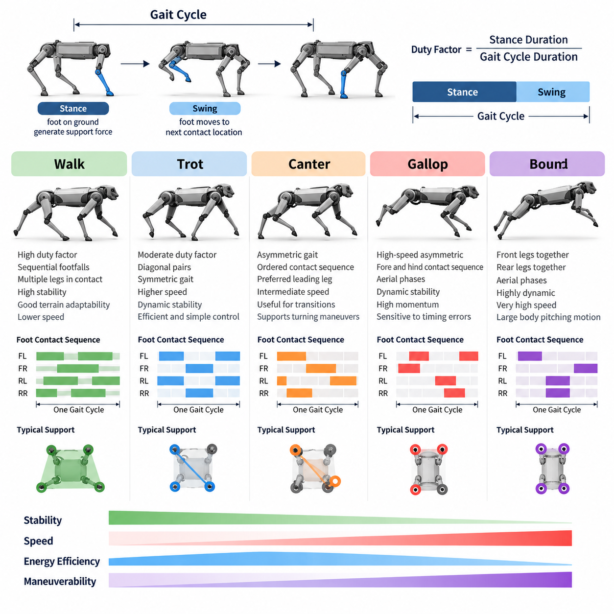
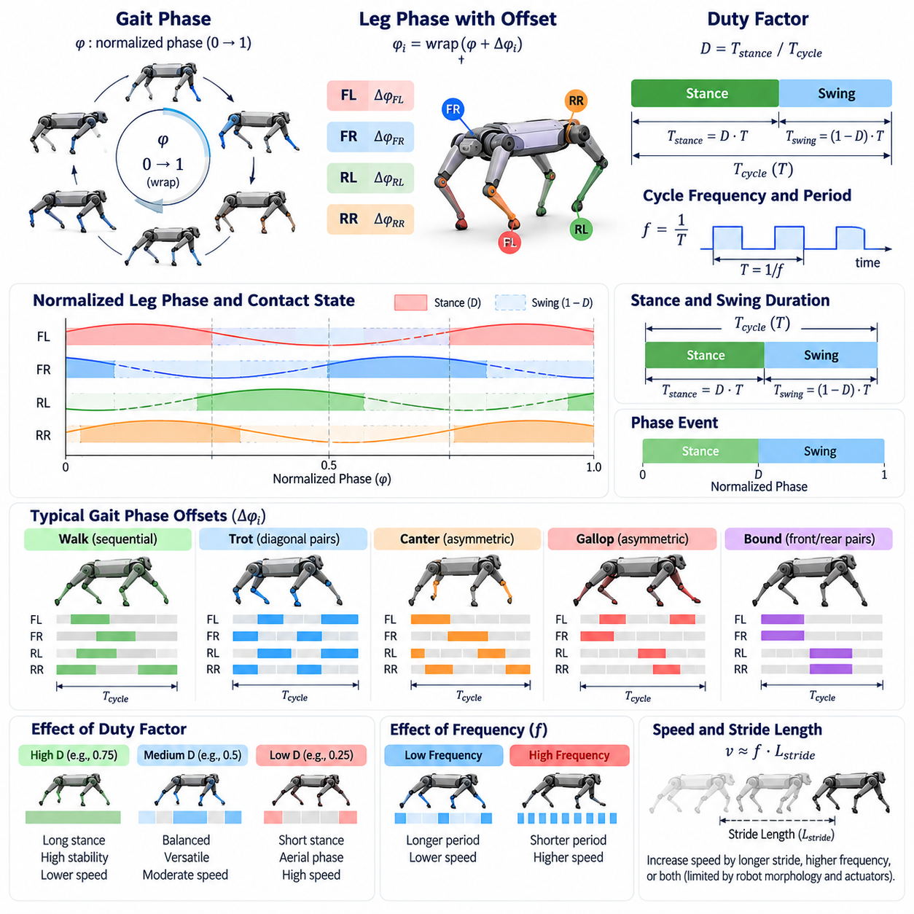
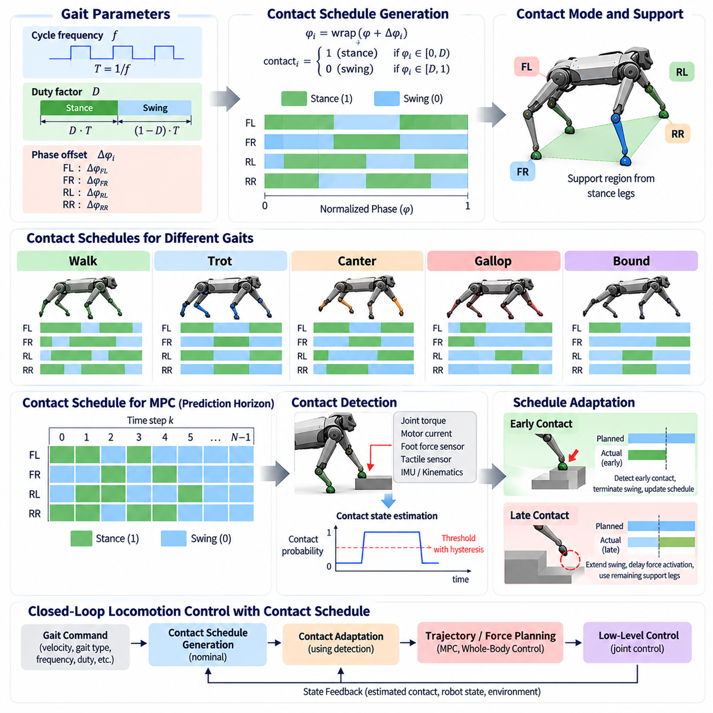
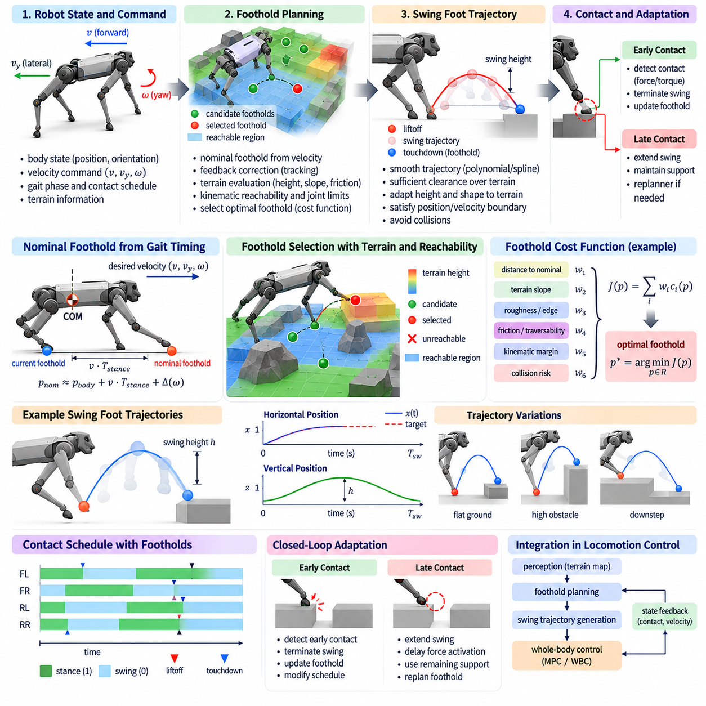
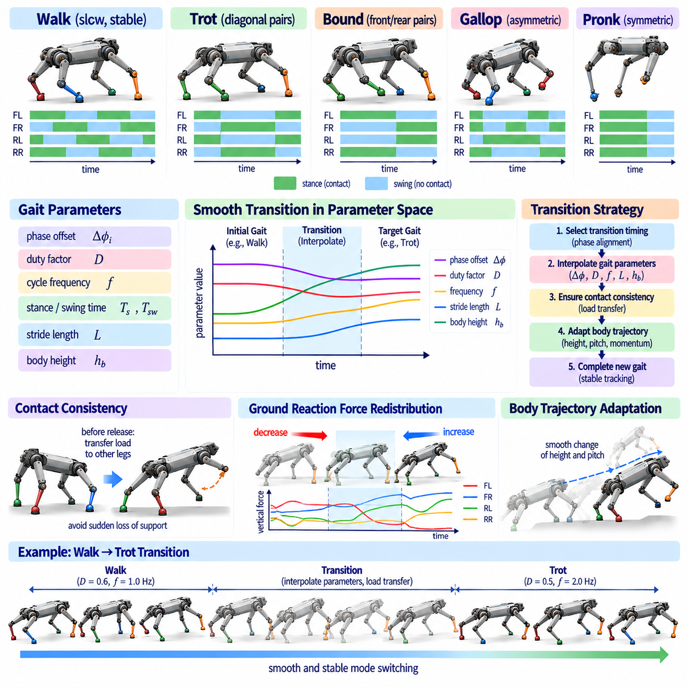
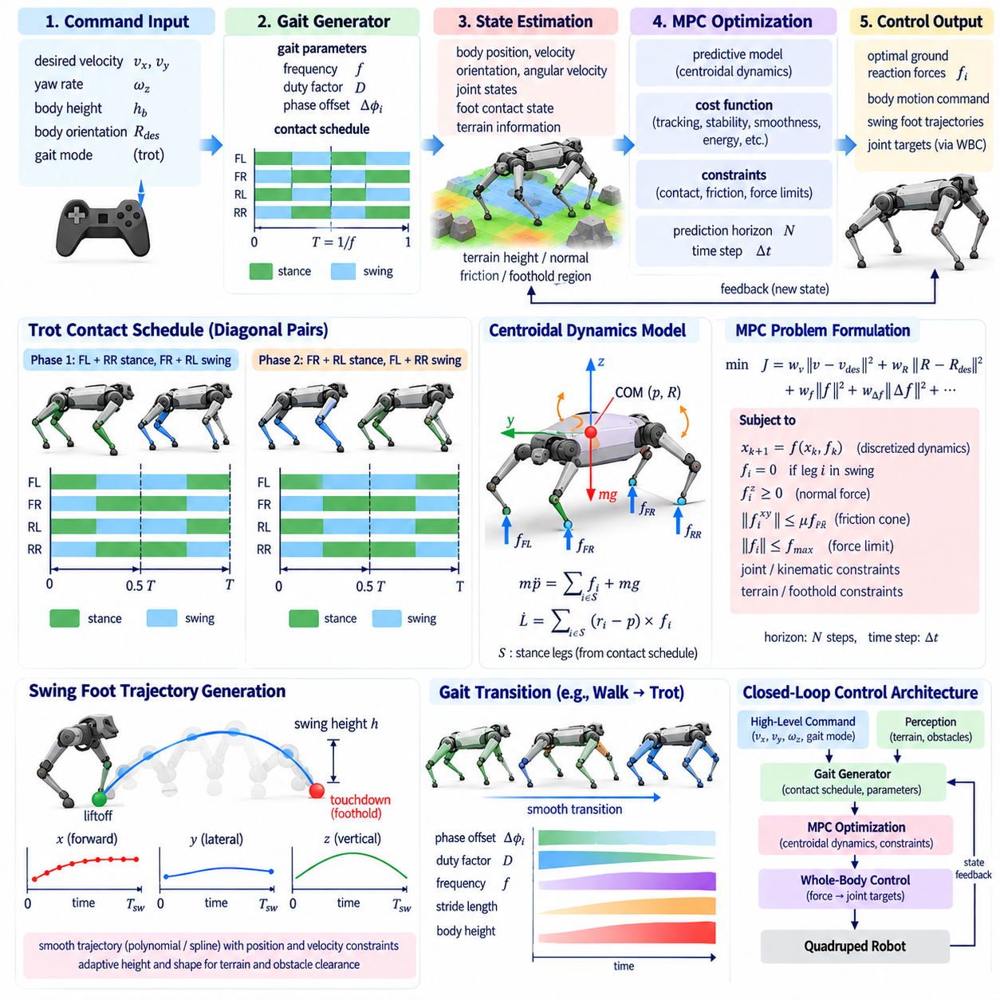
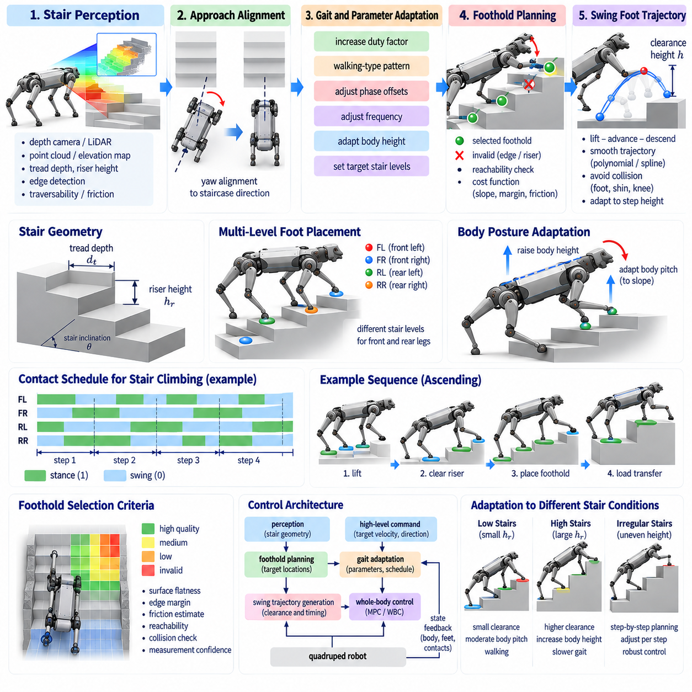
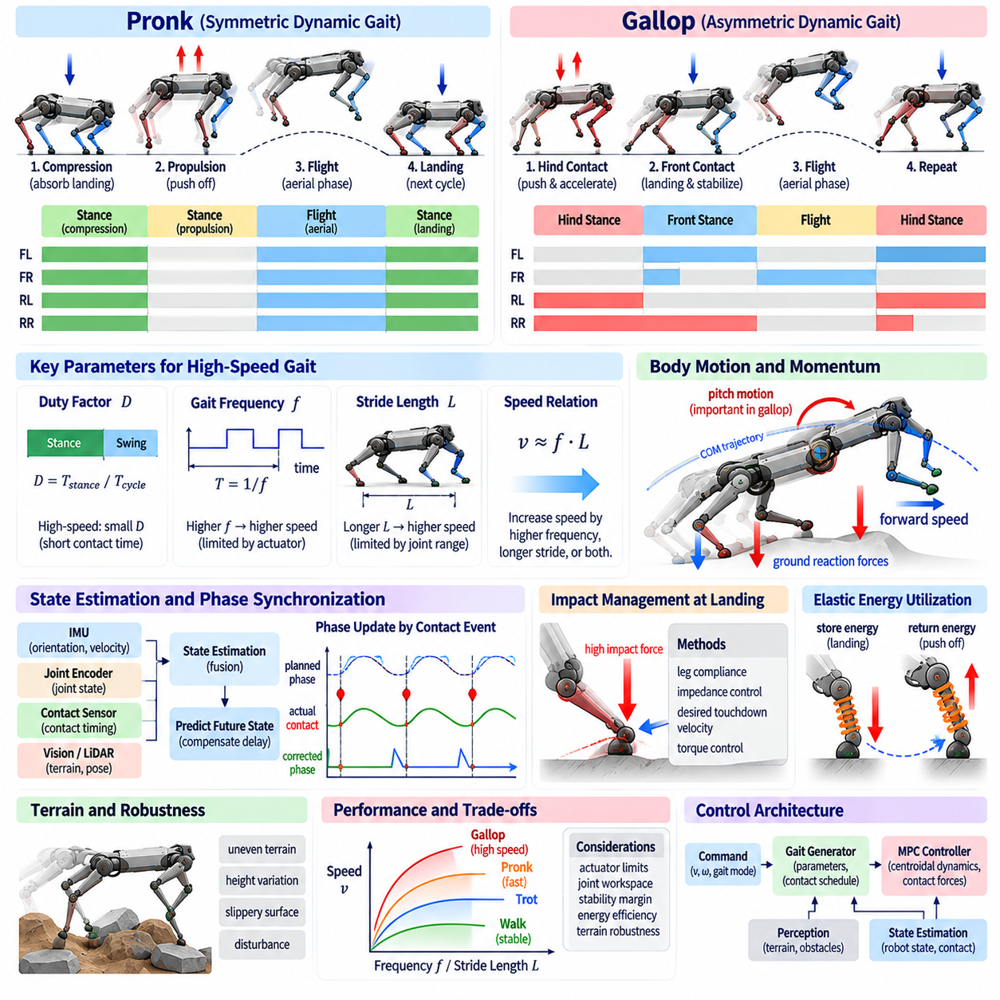
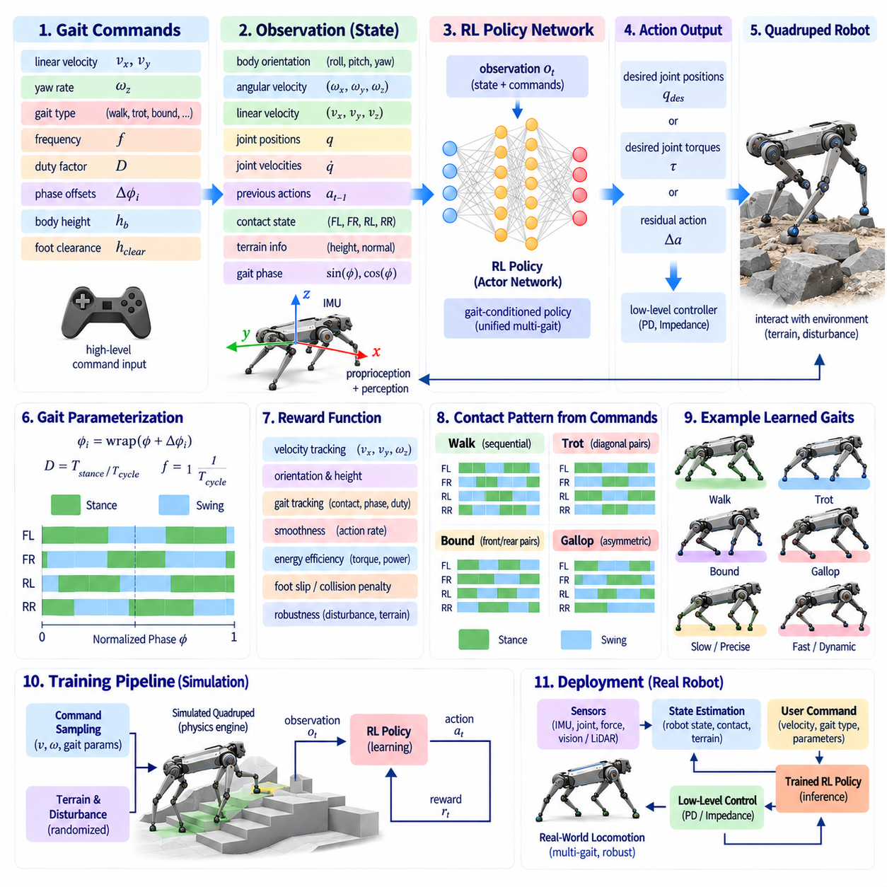
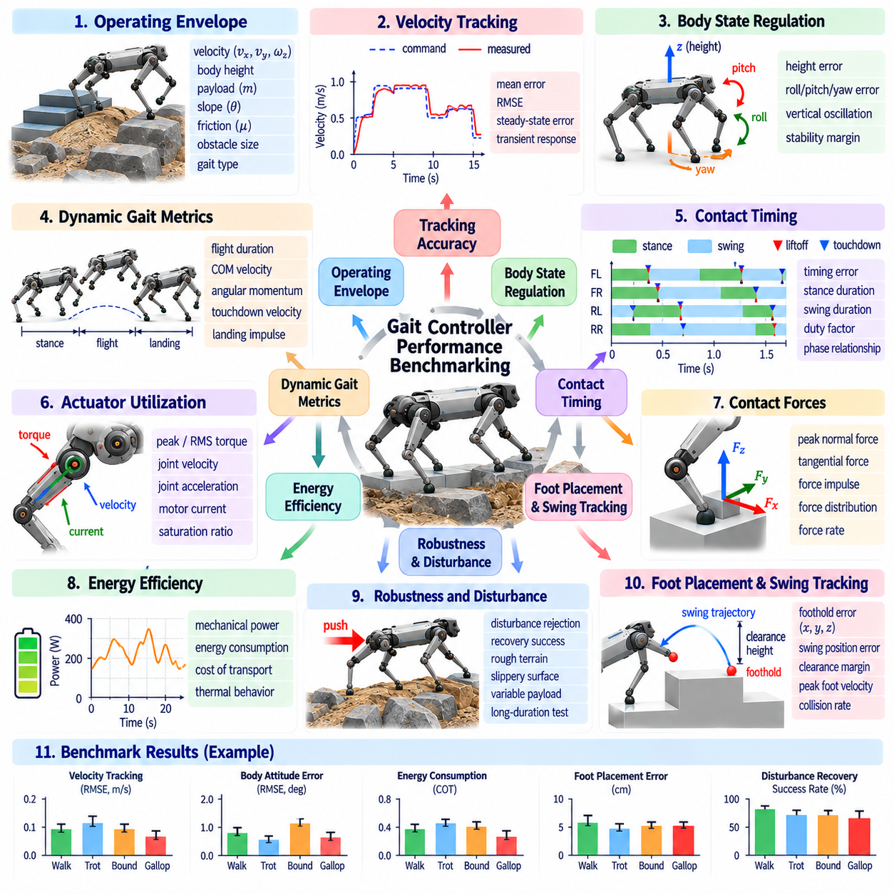

**Volume 21. Quadruped Robot Software**

# Chapter 03. Gait Generation and Control

## 03.01. Gait Classification Walk Trot Canter Gallop Bound

{width="7.268055555555556in" height="7.268055555555556in"}

Gait classification provides a systematic framework for describing how a quadruped coordinates its four legs during locomotion. A gait is defined not simply by forward speed but by the temporal sequence of foot contacts, stance and swing durations, phase relationships among the limbs, and periods of body support. Walk, trot, canter, gallop, and bound represent distinct coordination patterns that provide different compromises among stability, speed, energy efficiency, maneuverability, and dynamic performance.

A useful representation of quadruped gait begins with the gait cycle, defined as a repeating interval of locomotion after which the limb configuration returns to an equivalent phase. Each leg alternates between stance, when the foot interacts with the ground and generates supporting forces, and swing, when the foot moves toward its next contact location. The ratio of stance duration to the complete gait cycle is called the duty factor and is an important parameter for distinguishing static and dynamic gaits.

Walking is generally characterized by relatively high duty factors and overlapping ground-contact periods among multiple legs. In a typical quadrupedal walk, footfalls occur sequentially rather than as synchronized diagonal or lateral pairs. At least two or often three feet remain in contact with the ground for substantial portions of the cycle. This produces a comparatively large support region and allows the center of mass to remain well controlled at low locomotion speeds.

Because walking maintains extensive ground support, it is particularly useful when stability and terrain adaptability are more important than speed. Robotic quadrupeds frequently use walking on rough surfaces, narrow passages, slopes, stairs, or uncertain terrain because individual footholds can be selected and corrected with relatively low dynamic disturbance. The controller can adjust each swing trajectory independently while redistributing supporting forces through the remaining stance legs.

Trotting is a faster symmetric gait in which diagonal pairs of legs operate approximately together. The front-left and rear-right legs form one pair, while the front-right and rear-left legs form the other. These pairs alternate between stance and swing phases with an approximately half-cycle phase difference. The resulting symmetry provides an effective balance between locomotion speed, mechanical simplicity, dynamic stability, and computationally manageable control.

In a trot, the body is often supported primarily by one diagonal pair before support transfers to the opposite pair. At higher speeds, short aerial phases may occur between contacts, transforming the motion into a more dynamically demanding running trot. Ground reaction forces, body inertia, and momentum therefore become increasingly important. Model Predictive Control, centroidal dynamics, and whole-body control are commonly used to coordinate these forces while maintaining desired body orientation and velocity.

Canter is an asymmetric gait positioned conceptually between trot and gallop. Unlike the diagonal symmetry of trot, canter introduces an ordered sequence of limb contacts with a preferred leading leg. This creates a three-beat or related asymmetric rhythm depending on the animal or robotic implementation. Because the gait distinguishes left and right leads, changing the leading leg can influence turning behavior, body orientation, and the distribution of mechanical loads during rapid maneuvering.

For quadruped robots, canter is less commonly used as a default locomotion mode than walk or trot, but it is valuable for studying transitional and asymmetric locomotion. A robotic canter requires precise control of phase offsets, contact timing, body pitch, and momentum transfer. It can provide smoother acceleration toward high-speed motion and can support directional maneuvers where perfectly symmetric footfall patterns would impose unnecessary constraints on the robot\'s dynamic behavior.

Galloping is a high-speed asymmetric gait in which the forelegs and hind legs contact the ground in characteristic sequences separated by substantial changes in body momentum. Depending on the phase pattern, galloping may be classified into transverse or rotary forms. Unlike walking or moderate trotting, galloping relies strongly on dynamic effects, including aerial phases, elastic energy exchange, body pitching motion, and rapid generation of ground reaction forces.

During galloping, the center of mass may travel outside any conventional static support polygon because stability is governed primarily by dynamic momentum rather than quasi-static balance. Successful control therefore requires accurate prediction of future contact states and body motion. Foot placement, touchdown velocity, contact impulse, actuator limits, and friction constraints become critical variables. Small timing errors can generate large disturbances because the robot carries considerable kinetic energy at high speed.

Bounding is another highly dynamic gait in which the two forelegs move approximately together and the two hind legs move approximately together. The front and rear pairs alternate, often with aerial phases between their contacts. This produces a pronounced pitching motion resembling the compression and extension of a spring-loaded body. Bounding is particularly suitable for rapid forward locomotion and provides a useful experimental gait for investigating highly dynamic quadruped control.

The effectiveness of bounding depends strongly on coordinated energy transfer between the fore and hind sections of the robot. The hind legs can generate powerful propulsion, while the forelegs absorb impact and redirect momentum during landing. Body pitch must be carefully controlled so that repeated contacts do not cause unstable rotational motion. Robots with compliant legs, elastic elements, or actively controlled joint impedance can exploit stored mechanical energy to improve bounding efficiency.

The distinction among these gaits can be formalized through relative limb phase. If each leg is assigned a phase variable from zero to one over a gait cycle, gait patterns can be represented by phase offsets among the four limbs. Walking distributes the phases across the cycle, trotting groups diagonal limbs, bounding groups front and rear limbs, while cantering and galloping use asymmetric offsets. This representation allows a controller to generate multiple gaits from a common mathematical framework.

Contact schedules provide another practical representation for robotic control. Instead of describing gait only by biological names, the locomotion system specifies when each foot should be in stance or swing over a prediction horizon. A gait generator can then transform desired velocity, terrain information, and stability requirements into contact sequences. These schedules become reference inputs for trajectory optimization, Model Predictive Control, footstep planning, or reinforcement-learning-based locomotion policies.

Transitions between gaits are as important as the individual gait patterns themselves. A quadruped may begin with a stable walk, transition to trot as commanded velocity increases, and subsequently enter canter, gallop, or bound when higher dynamic performance is required. Abruptly replacing one contact sequence with another can destabilize the robot. Practical gait transition algorithms therefore modify duty factor, phase offsets, stride frequency, and step length progressively while maintaining feasible contact forces.

Speed alone should not determine gait selection. Terrain geometry, friction, payload, actuator temperature, battery condition, external disturbances, and mission objectives may change the most appropriate gait. A heavily loaded quadruped may prefer walking even when a faster command is requested, whereas an unloaded robot on predictable terrain can safely use trot or bound. Intelligent locomotion systems therefore treat gait selection as a constrained decision problem rather than a fixed velocity lookup table.

Terrain perception further changes the role of gait classification. On flat ground, periodic contact timing may be sufficient, but irregular terrain requires foothold adaptation and sometimes temporary departure from the nominal gait. A robot may shorten one stance, extend another, or delay a swing leg when a safe foothold is unavailable. Consequently, practical locomotion combines a nominal gait template with feedback mechanisms that continuously modify contact timing and foot trajectories according to environmental conditions.

Gait generation is closely connected to the robot\'s mechanical design. Leg length, joint range, actuator torque, reflected inertia, foot geometry, compliance, and body mass distribution determine which gait patterns can be executed effectively. A controller cannot create physically unrealistic contact forces or joint velocities. Gait classification must therefore be interpreted together with the robot\'s feasible dynamic envelope, rather than treating biological gait terminology as an independent software abstraction.

Modern learning-based locomotion can blur traditional gait boundaries. Reinforcement-learning policies may discover intermediate or hybrid patterns that do not correspond exactly to walk, trot, canter, gallop, or bound. Nevertheless, classical gait categories remain valuable because they provide interpretable structures for initialization, curriculum learning, policy evaluation, and safety constraints. Learned policies can also be conditioned on gait parameters, allowing continuous interpolation among different locomotion behaviors.

From a Physical AI perspective, gait is an embodied coordination strategy connecting perception, dynamics, control, and environmental interaction. The robot must perceive terrain and internal state, predict feasible contacts, generate coordinated limb motion, regulate contact forces, and adapt its behavior when assumptions become invalid. Gait classification therefore provides more than terminology: it defines reusable patterns through which physical intelligence can organize complex whole-body interaction with the environment.

Walk, trot, canter, gallop, and bound can ultimately be understood as regions within a broader locomotion space parameterized by phase, duty factor, stride frequency, contact sequence, body dynamics, and force distribution. A capable quadruped controller should not merely reproduce these patterns but should select, transition, and adapt them according to task requirements. This perspective transforms gait generation from a fixed animation problem into continuous optimization of stable, efficient, and intelligent physical behavior.

## 03.02. Gait Pattern Parameterization Phase Offset Duty [w/Code]

{width="7.268055555555556in" height="7.268055555555556in"}

Gait pattern parameterization provides a compact mathematical method for describing and generating coordinated leg motion in quadruped locomotion. Instead of defining every joint trajectory independently, the controller represents locomotion through a small set of variables such as gait phase, limb phase offset, duty factor, cycle frequency, stance duration, and swing duration. These parameters separate the temporal structure of locomotion from lower-level joint control.

The central variable in many gait generators is the gait phase. A normalized phase variable commonly progresses from zero to one during each locomotion cycle and then wraps back to zero. Alternatively, phase can be expressed as an angle from zero to 2π. The phase provides a common internal clock that identifies where the robot is within its current gait cycle and allows periodic leg motions to be synchronized with a consistent mathematical reference.

Each leg can be assigned an individual phase derived from the global gait phase. For leg i, its phase may be expressed conceptually as the global phase plus a leg-specific phase offset, with the result wrapped within one cycle. The phase offset determines the temporal relationship between that leg and the other limbs. By changing only these offsets, a common gait generator can reproduce substantially different coordination patterns without redesigning the entire controller.

Phase offsets are especially useful for expressing gait symmetry. In a trot, diagonal legs typically share similar phases while the two diagonal pairs are separated by approximately half a cycle. In a bound, the two forelegs form one synchronized group and the two hind legs form another. Walking distributes the four limb phases more evenly through the cycle. Asymmetric patterns such as canter and gallop require unequal offsets that establish a preferred contact sequence.

Duty factor describes the fraction of a gait cycle during which a foot remains in stance contact with the ground. If the duty factor is 0.6, for example, the corresponding foot spends approximately sixty percent of the cycle in stance and forty percent in swing. This apparently simple parameter has major consequences for support geometry, available force-generation time, dynamic behavior, energy consumption, and the degree to which locomotion depends on momentum.

High duty factors generally create longer stance periods and greater overlap among supporting feet. Such patterns are suitable for slow and stable locomotion because the robot has more time to generate ground reaction forces and redistribute its weight. As the duty factor decreases, stance intervals become shorter and swing intervals occupy a larger proportion of the cycle. Dynamic effects become increasingly important, and aerial phases can emerge when no foot contacts the ground.

The combination of phase offset and duty factor defines much of the contact structure of a periodic gait. Phase offsets determine when each leg enters a particular part of its cycle, while duty factor determines how long that leg remains in stance. Consequently, two gaits with identical phase offsets can exhibit significantly different dynamic properties if their duty factors differ. This separation enables systematic exploration of locomotion patterns within a relatively low-dimensional parameter space.

Cycle frequency is another fundamental gait parameter. It specifies how many complete gait cycles occur per unit time and therefore directly influences step timing and locomotion speed. The cycle period is the inverse of frequency. Increasing frequency shortens both stance and swing durations unless duty factor is modified simultaneously. The controller must ensure that required joint velocities, accelerations, and contact forces remain within the physical capabilities of the robot.

Stride length interacts with gait frequency to determine forward velocity. A robot can increase speed by taking longer steps, increasing cycle frequency, or combining both strategies. These alternatives impose different mechanical requirements. Excessively long strides can approach joint workspace limits, while excessive frequency can demand high actuator velocities and produce large inertial forces. Practical gait parameterization therefore constrains frequency and stride length according to robot morphology and actuator performance.

Stance and swing durations can be calculated directly from the gait period and duty factor. If T represents the complete gait period and D represents the duty factor, stance duration is approximately D times T, while swing duration is approximately one minus D times T. These quantities are important because stance control primarily concerns force generation and body stabilization, whereas swing control concerns foot clearance, trajectory shaping, and preparation for the next touchdown.

Within each leg cycle, the normalized phase can be divided into stance and swing subphases. When the phase lies within the stance portion determined by the duty factor, the controller treats the foot as a planned contact and generates appropriate ground reaction forces. Once the phase crosses the stance-to-swing boundary, the foot is released from support and follows a swing trajectory. This phase-based state machine provides a simple bridge between gait timing and whole-body control.

Swing phase parameterization often introduces an additional normalized variable that progresses from zero at liftoff to one at touchdown. This local swing phase can drive polynomial, Bézier, spline, or learned foot trajectories. Parameters such as step height, touchdown position, clearance margin, and touchdown velocity can then be modified independently from the global gait timing. This modular structure allows terrain adaptation without fundamentally changing the nominal gait pattern.

Stance phase can likewise be parameterized locally from touchdown to liftoff. During stance, the desired foot position may remain approximately fixed relative to the ground while the body moves above it, or it may be adjusted according to compliance and terrain interaction. Force controllers use the planned contact state together with desired body acceleration to distribute ground reaction forces among supporting legs while satisfying friction, torque, and contact constraints.

Contact tables provide a discrete representation derived from continuous gait parameters. For each prediction step, every leg is assigned a stance or swing state according to its phase offset and duty factor. Model Predictive Control can use this future contact schedule to determine which ground reaction forces are available at each instant. Thus, compact phase parameters can be transformed into the explicit contact constraints required by optimization-based locomotion controllers.

Smooth gait transition requires parameter interpolation rather than abrupt switching. If the robot changes from walk to trot, phase offsets, duty factor, frequency, and possibly stride length should evolve while preserving feasible contacts. Directly replacing one phase configuration with another can cause premature liftoff or unexpected touchdown. Transition managers therefore synchronize parameter changes with suitable events such as foot contact, phase boundaries, or dynamically favorable support configurations.

Phase synchronization is also important when actual contact events differ from the nominal schedule. A foot may touch the ground earlier than predicted because of elevated terrain or later because of a depression. Strictly following an open-loop phase clock can then produce inconsistent contact assumptions. Event-based phase correction can advance, delay, or reset selected phase variables using measured touchdown and liftoff events, improving robustness on irregular surfaces.

Adaptive gait parameterization extends this concept by allowing parameters to change according to robot state and environmental conditions. Desired velocity may modify cycle frequency and stride length, while terrain roughness may increase duty factor and foot clearance. Payload changes may favor longer stance times, and low friction may require reduced acceleration and increased contact overlap. Gait parameters therefore become control variables rather than fixed constants stored in a predefined gait library.

Continuous parameterization can also create intermediate patterns between named gaits. Instead of switching only among discrete walk, trot, and bound modes, a controller can continuously vary phase relationships and duty factors within feasible ranges. This allows locomotion behavior to evolve gradually as speed or terrain changes. However, not every mathematical combination produces a physically useful gait, so stability, collision, force, kinematic, and actuator constraints must restrict the allowable parameter region.

Optimization-based methods can search this parameter space according to performance objectives. Energy consumption, tracking error, stability margin, impact force, terrain clearance, or actuator effort can be included in an objective function. The optimizer may then select frequency, duty factor, phase offset, foothold timing, or stride parameters that best satisfy the current task. Parameterization reduces the dimensionality of this search compared with optimizing every joint trajectory directly.

Learning-based locomotion can use the same parameters as commands, observations, or latent variables. A reinforcement-learning policy may receive desired gait frequency, phase offsets, and duty factor and learn joint actions that realize the commanded contact pattern. Alternatively, a higher-level policy can select gait parameters while a lower-level controller executes them. This hierarchical organization combines interpretable gait structure with the adaptability of learned whole-body behavior.

Phase variables can also be embedded directly into neural-network observations through sine and cosine representations. Encoding phase as sin(2πφ) and cos(2πφ) avoids the numerical discontinuity that occurs when a normalized phase wraps from one back to zero. The policy receives a smooth periodic representation of locomotion timing and can associate particular phases with appropriate joint configurations, contact forces, or anticipatory actions.

For Physical AI systems, gait parameterization acts as an interface between high-level intent and embodied dynamics. A command such as move faster, climb cautiously, carry a heavy payload, or traverse slippery terrain can be translated into changes in frequency, duty factor, phase relationship, stride geometry, and contact timing. Lower-level control then converts these abstract temporal parameters into physically realizable joint torques and ground interactions.

A robust gait generator therefore should not treat phase offset and duty factor as isolated numerical settings. They form part of an integrated parameter space that includes frequency, stance and swing timing, step geometry, contact constraints, terrain information, and robot dynamics. By organizing locomotion around this compact representation, a quadruped can generate multiple gaits, transition smoothly between them, adapt contact schedules online, and maintain a consistent interface between planning, learning, and whole-body control.

## 03.03. Contact Schedule Generation and Adaptation [w/Code]

{width="7.268055555555556in" height="7.268055555555556in"}

Contact schedule generation defines when each foot of a quadruped should establish, maintain, and release contact with the environment. It converts an abstract gait description into a time-dependent sequence of stance and swing states that can be used directly by locomotion controllers. Because contact determines how forces enter the robot, the schedule forms a critical interface between gait generation, trajectory planning, dynamics optimization, and whole-body control.

A contact schedule can be represented as a binary state for every leg over time. A value corresponding to stance indicates that the foot is expected to support the body and generate ground reaction forces, while a swing state indicates that the foot is moving toward another foothold. Combining the four leg states produces a contact mode that describes the instantaneous support configuration of the quadruped and determines which dynamic constraints apply.

Periodic gait parameters provide a straightforward way to construct nominal contact schedules. A global gait phase advances according to the commanded cycle frequency, while individual phase offsets determine the relative timing of each leg. The duty factor specifies how much of each cycle is assigned to stance. Evaluating these variables at each control instant produces the planned stance and swing state for every leg without requiring an independently designed timing sequence.

Different gait families generate characteristic contact schedules. Walking produces substantial overlap among stance legs and usually avoids unsupported intervals. Trotting alternates diagonal support pairs, while bounding alternates front and rear pairs. Canter and gallop produce asymmetric contact sequences with characteristic ordering and possible aerial phases. The schedule therefore provides a common representation through which biologically named gaits can be converted into explicit control constraints.

For optimization-based locomotion, the schedule is usually extended over a finite prediction horizon. Each future time step contains the expected contact state of every foot, producing a contact table or contact matrix. Model Predictive Control can then determine which feet are allowed to generate ground reaction forces at each prediction step. Swing feet receive zero or constrained contact forces, whereas stance feet participate in balancing, acceleration, and momentum regulation.

The quality of a contact schedule strongly influences the feasibility of the resulting motion. A schedule that removes too many contacts while large forces are required may make the desired body acceleration impossible. Excessively short stance periods can demand unrealistic peak forces, while poorly timed liftoff can reduce stability. Contact scheduling must therefore consider robot mass, actuator capability, friction, desired velocity, body momentum, and the geometry of available footholds.

Nominal schedules are useful on predictable terrain, but real-world locomotion requires adaptation. Terrain height errors, obstacles, compliance, slipping, impact disturbances, and state-estimation uncertainty can cause actual contact events to differ from planned events. A robust locomotion system must detect these differences and modify the schedule or its execution rather than continuing to assume that every touchdown and liftoff occurs exactly at the nominal time.

Early contact occurs when a swinging foot touches the environment before its scheduled touchdown. This commonly happens when the terrain is higher than expected or when an obstacle intersects the planned swing trajectory. The controller should detect the event through force, torque, tactile, proprioceptive, or kinematic information. Depending on the situation, it can terminate swing motion, establish support, and update the contact schedule to reflect the new physical state.

Late contact occurs when the planned touchdown time has passed but the foot has not established reliable support. A terrain depression, inaccurate elevation estimate, or positioning error can produce this condition. Immediately treating the foot as a load-bearing contact may generate incorrect forces or destabilizing commands. Instead, the controller can extend the swing trajectory downward, delay force activation, and maintain support using the remaining stance legs until contact is confirmed.

Contact detection therefore plays a central role in schedule adaptation. Measurements from joint torque, motor current, foot force sensors, inertial sensors, tactile devices, and state estimators can be combined to estimate whether a foot is truly supporting the environment. Reliable detection should distinguish sustained contact from transient impact or sensor noise. Filtering and hysteresis are often introduced to prevent rapid switching between contact and non-contact states.

The distinction between planned contact and estimated contact is important. Planned contact represents what the gait generator intends, whereas estimated contact represents what the robot is physically experiencing. When these states agree, the nominal controller can proceed normally. When they disagree, supervisory logic must determine whether to modify the gait phase, change force constraints, adjust a foot trajectory, or trigger a recovery behavior.

Phase adaptation provides one method for reconciling contact timing errors. If touchdown occurs early, the phase of the affected leg can be advanced toward its stance interval. If touchdown is delayed, phase progression can be slowed or temporarily held. More sophisticated approaches modify multiple leg phases together so that the overall gait remains coordinated. This prevents local contact corrections from destroying the global timing relationship among the four limbs.

Schedule adaptation must also preserve sufficient support. Before allowing a leg to lift, the controller can evaluate whether the remaining contacts can support the desired body motion. If another leg has failed to establish contact, the scheduled liftoff may be postponed. Such event-based extensions of stance are particularly useful on rough terrain because they prevent the robot from blindly removing a reliable support before another support has become physically available.

Foothold planning and contact scheduling are tightly coupled. A contact schedule determines when a new foothold is required, while terrain perception determines where a feasible foothold exists. If the intended touchdown region contains an obstacle, hole, steep surface, or low-friction area, the planner may need to relocate the foothold. A substantial change in foothold position can then require corresponding changes to swing duration, stance duration, or the timing of neighboring legs.

Terrain-aware scheduling can use elevation maps, surface normals, traversability estimates, semantic information, and friction predictions. Difficult terrain may favor longer stance overlap, reduced gait frequency, and conservative contact transitions. On flat and predictable ground, the schedule can become more dynamic with shorter support intervals. Thus, environmental perception can influence not only where the robot steps but also when each contact should occur.

Desired motion provides another adaptation signal. During acceleration, braking, turning, or lateral movement, the most useful contact pattern may differ from that used during steady forward locomotion. The controller can modify stance duration or contact timing to place supporting feet where they can generate favorable forces. High-level commands therefore influence both spatial foothold placement and temporal contact organization.

External disturbances may require rapid departure from the nominal schedule. A push can shift the center of mass or angular momentum beyond the region recoverable with currently planned contacts. The robot may respond by extending an existing stance, placing a swing foot earlier, or introducing an additional recovery step. In this context, contact scheduling becomes part of feedback stabilization rather than a purely periodic feedforward process.

Contact schedule optimization can treat touchdown and liftoff times as decision variables rather than fixed gait parameters. Trajectory optimization may jointly determine body motion, foot placement, contact forces, and contact timing while satisfying dynamics and friction constraints. This approach can discover highly effective motions, but the optimization problem becomes more difficult because changes in contact mode introduce discrete or hybrid structure into the dynamics.

Hybrid locomotion models explicitly describe this combination of continuous motion and discrete contact transitions. Within a contact mode, the robot evolves according to continuous dynamics, while touchdown or liftoff triggers a transition to another mode. Contact scheduling therefore determines the sequence and duration of these hybrid modes. Understanding this structure is important for analyzing stability and designing optimization, model predictive, and event-driven controllers.

Learning-based methods can also generate or adapt contact schedules. A reinforcement-learning policy may implicitly discover contact timing through joint actions, or a hierarchical policy may explicitly output desired contact states and phase parameters. Learned scheduling can respond flexibly to complex terrain, but physical constraints remain essential. Contact forces, friction limits, self-collision, actuator limits, and minimum support requirements can be enforced through lower-level controllers or safety layers.

Schedule adaptation operates at several time scales. High-level gait selection may change over hundreds of milliseconds or seconds, while foothold and phase adjustments occur within individual steps. Contact detection and impact response may require much faster updates. A practical architecture therefore separates slow strategic adaptation from fast reactive correction while maintaining a consistent contact representation across planning and control layers.

The contact schedule also provides valuable information for state estimation. During reliable stance, a foot can be treated approximately as stationary relative to the environment, providing kinematic constraints that help estimate body velocity and pose. Incorrect contact classification can corrupt these estimates. Consequently, contact estimation, state estimation, and gait control are mutually dependent and should exchange confidence information rather than operating as completely isolated modules.

Fault conditions further demonstrate the importance of adaptive scheduling. If a leg experiences actuator degradation, sensor failure, or reduced load capability, the locomotion system may need to decrease its stance force contribution or avoid using it as a primary support. The remaining legs can receive modified contact durations and force allocations. This creates the possibility of degraded but controlled locomotion instead of immediate total loss of mobility.

For Physical AI, contact schedule generation represents the transformation of locomotion intent into structured physical interaction with the world. Adaptation closes the loop by allowing measured environmental events to modify that intended interaction. Perception identifies terrain and contact conditions, prediction evaluates future support possibilities, control generates forces and motion, and feedback continuously corrects discrepancies between expected and actual physical events.

A capable quadruped should therefore treat the contact schedule as a dynamic plan rather than an immutable timetable. Nominal gait phases provide efficient structure, but actual touchdown, terrain geometry, disturbances, motion commands, and hardware constraints must be allowed to modify that structure online. By integrating schedule generation with perception, estimation, optimization, and whole-body control, the robot can preserve coordinated locomotion while adapting its contacts to the physical reality of the environment.

## 03.04. Foothold Planning Swing Foot Trajectory [w/Code]

{width="7.268055555555556in" height="7.268055555555556in"}

Foothold planning determines where a quadruped should place each foot so that the desired body motion remains dynamically feasible, stable, and compatible with the surrounding terrain. Swing-foot trajectory generation determines how the foot moves from its current contact to the selected foothold. Together, these processes connect terrain perception and motion planning with gait generation, contact scheduling, whole-body control, and physical interaction.

A nominal foothold can first be generated from the robot\'s desired velocity and gait timing. If the body is expected to move forward during the next stance interval, the foot should generally be placed ahead of its current body-relative position. The required displacement depends on commanded translational velocity, yaw rate, stance duration, body geometry, and the leg\'s nominal configuration. This provides a simple reference before terrain constraints are considered.

Velocity feedback can modify this nominal location to reduce tracking error and regulate body momentum. If the robot moves faster than commanded, the next foothold can be shifted to produce a braking effect. If it moves too slowly, the foothold can support additional acceleration. Similar corrections can compensate for lateral velocity or yaw errors. Foot placement therefore functions as an important mechanism for controlling whole-body motion rather than merely positioning individual legs.

Dynamic models provide more systematic foothold rules. Simplified representations such as inverted-pendulum or centroidal models relate center-of-mass motion to future support locations. Capture-point-like concepts estimate where support should be established to regulate unstable body motion. More complete optimization methods jointly consider body trajectory, angular momentum, contact force, and foothold position while respecting the physical constraints of the quadruped.

The nominal foothold must lie inside the reachable workspace of the corresponding leg. Hip location, link lengths, joint limits, body orientation, and expected body motion during stance determine this feasible region. A geometrically attractive terrain point is unusable if the leg cannot reach it without violating joint constraints. Practical planners therefore intersect terrain suitability with kinematic reachability before accepting a foothold candidate.

Terrain perception transforms foothold planning from a purely geometric timing problem into an environment-aware decision process. Elevation maps, depth measurements, point clouds, surface normals, semantic labels, and traversability estimates can identify candidate support regions. The planner should avoid holes, obstacle edges, unstable objects, excessive slopes, and surfaces whose geometry or material properties make reliable contact unlikely.

Foothold quality can be represented through a cost function. Candidate positions may be evaluated according to distance from the nominal foothold, terrain slope, surface roughness, edge distance, estimated friction, kinematic margin, expected contact force, and collision risk. The planner then selects a location that provides a favorable compromise rather than simply choosing the nearest geometrically reachable point.

Uncertainty should also influence foothold selection. A terrain cell reconstructed from sparse or noisy measurements may appear flat while having low confidence. Conservative planning can penalize uncertain regions or increase safety margins around discontinuities. This is particularly important when depth cameras or LiDAR observe terrain at shallow angles, where occlusion and measurement noise can produce unreliable estimates near steps, rocks, or negative obstacles.

The foothold must also support the future contact schedule. A valid location for one leg may become undesirable when considered together with the other planned contacts. The combined support geometry should permit the required body forces and moments throughout the stance interval. Consequently, advanced planners evaluate multiple footholds jointly or include future contact states within Model Predictive Control or trajectory optimization.

Once a foothold has been selected, swing-foot trajectory generation defines a continuous path from liftoff to touchdown. The trajectory must satisfy position and velocity boundary conditions while providing sufficient clearance over the terrain. Simple trajectories can be constructed using polynomial segments, splines, or Bézier curves. These representations provide smooth derivatives and allow the trajectory shape to be modified using a small number of intuitive parameters.

A typical swing trajectory separates horizontal progression from vertical clearance. The horizontal coordinates move from the liftoff position toward the target foothold, while the vertical coordinate rises to a clearance height and then descends toward the terrain. The highest point is often reached near the middle of swing, although asymmetric trajectories may be preferable when stepping onto high obstacles or descending from elevated surfaces.

Swing height should be adapted rather than fixed whenever terrain information is available. Excessive clearance wastes energy and requires larger joint velocities, while insufficient clearance increases the probability of collision. A terrain-aware planner can inspect the elevation profile along the expected foot path and set the trajectory above the highest relevant obstacle with an additional uncertainty and safety margin.

Trajectory smoothness is important because abrupt changes in foot acceleration propagate into joint torques and body disturbances. Position, velocity, and often acceleration should remain continuous across trajectory segments. Near liftoff, the trajectory should avoid generating unnecessary impulses, while near touchdown it should prepare the foot for controlled contact. Smooth interpolation reduces mechanical stress and improves tracking by lower-level joint controllers.

Touchdown velocity is a particularly important design variable. A large downward velocity can produce high impact forces, excite structural vibration, and increase the probability of slipping or rebounding. An excessively slow approach can make contact timing uncertain. The desired touchdown velocity is therefore selected according to gait speed, terrain compliance, sensing quality, and the ability of the controller to detect and regulate impact.

Foot orientation can also be planned when the robot has sufficient distal degrees of freedom or an articulated foot. On inclined terrain, aligning the foot with the estimated surface normal can increase contact area and improve force transmission. For point-foot robots, orientation may not be directly controllable, but the approach direction and leg configuration still influence contact robustness and the achievable friction forces.

Swing motion must satisfy collision constraints for the entire leg, not only for the foot. A foot trajectory that clears an obstacle may still cause the shin, knee, or other links to collide with terrain or the robot itself. Advanced planners therefore perform swept-volume or configuration-space checks and may modify knee posture, swing height, lateral motion, or body pose to maintain sufficient clearance.

Online replanning becomes necessary when perception changes during the swing phase. New terrain measurements may reveal that the selected foothold is unsafe or that an obstacle lies along the planned path. Because the foot has limited time before touchdown, replanning must preserve continuity while redirecting the trajectory toward a new feasible target. The remaining swing time and actuator limits constrain how far the foothold can be moved.

Early contact provides another reason to modify swing execution. If the foot strikes terrain before reaching its intended target, continuing the nominal trajectory can create excessive force or cause stumbling. Contact detection can terminate or reshape the swing trajectory and transition the leg into stance. The controller may simultaneously update terrain estimates because unexpected contact provides direct evidence that the perceived surface geometry was inaccurate.

Late contact occurs when the foot reaches the expected touchdown region without finding the ground. The controller can extend the foot downward using a controlled search trajectory while delaying load transfer. Remaining stance legs must maintain body support during this extension. If contact still cannot be established, the planner may need to select another foothold or initiate a recovery behavior rather than allowing the leg to continue searching indefinitely.

Turning requires foothold planning to account for rotational body motion. Each foot\'s nominal location depends not only on linear velocity but also on yaw rate and its position relative to the body center. During turning, inner and outer legs follow different spatial paths. Proper placement prevents excessive leg crossing, joint-limit violations, and unwanted lateral forces while allowing the robot to generate the moment required for rotation.

High-speed locomotion places stronger demands on foothold accuracy. Short stance times provide less opportunity to correct body momentum after touchdown, while larger velocities amplify the consequences of placement errors. The planner must account for prediction latency, state-estimation uncertainty, actuator response, and terrain geometry. Dynamic gaits therefore often rely on predictive foot placement rather than purely reactive correction.

Optimization-based approaches can jointly solve foothold and swing-trajectory variables. An objective function may penalize tracking error, energy use, impact velocity, terrain risk, deviation from nominal placement, and proximity to kinematic limits. Constraints enforce reachability, collision avoidance, contact feasibility, friction limits, and actuator capability. Such optimization provides flexibility but must be computationally efficient enough for online locomotion.

Learning-based methods can complement analytical planning by predicting foothold corrections or swing parameters from terrain observations and robot state. Reinforcement learning can discover stepping strategies that are difficult to encode manually, while imitation learning can reproduce expert locomotion behavior. Safety and feasibility layers can constrain learned outputs so that commanded footholds remain reachable and swing trajectories avoid known hazards.

Foothold planning and swing control also provide a natural connection between perception and Physical AI. Terrain observations are converted into actionable hypotheses about where physical support can safely exist. The robot then commits to one of those hypotheses by moving a leg through free space and testing the environment through contact. Touchdown consequently becomes both a control event and a source of new physical information.

A robust quadruped locomotion system therefore treats foothold selection and swing-foot trajectory generation as a coupled, continuously updated process. Desired body motion proposes nominal steps, perception identifies feasible terrain, dynamics determines useful support locations, and trajectory generation moves each foot safely toward contact. Feedback from unexpected collisions or missing ground then updates both execution and future planning, closing the loop between prediction and physical interaction.

## 03.05. Gait Transition Smooth Mode Switching [w/Code]

{width="7.268055555555556in" height="7.268055555555556in"}

Gait transition is the process of changing a quadruped from one locomotion pattern to another while preserving balance, feasible contact forces, continuous body motion, and coordinated limb timing. Typical transitions include walk-to-trot, trot-to-bound, or dynamic-to-static motion. Unlike simple mode replacement, smooth switching must manage the temporary contact patterns and dynamic states that appear between the initial and target gaits.

Each gait can be described through parameters such as phase offsets, duty factor, cycle frequency, stance duration, swing duration, stride length, and contact sequence. A gait transition therefore involves moving from one region of this parameter space to another. If these parameters are changed abruptly, feet may lift unexpectedly, contact forces may disappear too quickly, and commanded joint motion may become discontinuous, producing instability or large mechanical loads.

The most fundamental requirement is contact consistency. A leg that currently supports substantial body weight should not suddenly be classified as a swing leg merely because the target gait assigns it a different phase. Before contact is released, the remaining legs must be capable of supporting the required body forces and moments. Transition logic therefore coordinates phase changes with actual touchdown, liftoff, and load-transfer events rather than relying only on elapsed time.

Phase alignment provides a practical mechanism for initiating transitions. The controller can wait until the current gait reaches a configuration that is compatible with the target gait and then begin modifying phase relationships. For example, a walk-to-trot transition may be initiated when diagonal legs approach a timing relationship that can evolve naturally into paired motion. Selecting a favorable transition phase reduces the magnitude of temporal corrections required from individual legs.

Phase offsets can then be interpolated from their initial values toward those of the target gait. Direct linear interpolation is conceptually simple, but phase is periodic and must be handled carefully near cycle boundaries. Circular interpolation or oscillator-based synchronization can avoid artificial jumps. The transition rate should also respect the available stance and swing times so that no leg is forced to accelerate unrealistically merely to satisfy a new phase relationship.

Duty factor often changes substantially between slow and dynamic gaits. Walking typically uses longer stance periods and greater contact overlap, whereas running gaits may shorten stance and introduce aerial phases. Reducing duty factor too quickly can remove support before body momentum is appropriate for dynamic locomotion. A smooth transition gradually adjusts stance-to-swing timing while the controller simultaneously reshapes ground reaction forces and body trajectories.

Cycle frequency is another important transition variable. Increasing speed commonly requires higher stepping frequency, but an instantaneous frequency change would alter phase progression and foot timing abruptly. Frequency can instead be ramped toward the target value over several steps. The rate of change may depend on actuator capability, desired acceleration, terrain quality, and current dynamic stability, allowing the locomotion rhythm to accelerate without creating excessive joint motion.

Stride length should evolve consistently with frequency and commanded velocity. If frequency increases while stride length remains temporarily unchanged, the robot may accelerate more rapidly than intended. Conversely, reducing stride length too early can produce braking. Transition management therefore coordinates temporal gait parameters with spatial foot-placement parameters so that the resulting body velocity follows a smooth trajectory rather than exhibiting a sudden jump.

Body trajectory continuity is as important as limb timing. Different gaits may have different preferred body heights, pitch oscillations, vertical center-of-mass motion, and angular momentum patterns. Switching reference trajectories abruptly can produce large control errors. Smooth mode switching blends body position, velocity, orientation, and momentum references so that the whole-body controller receives dynamically compatible commands throughout the transition.

Ground reaction force redistribution is central to successful load transfer. During a transition, contact forces should move gradually from legs that are leaving stance toward legs that will remain or enter stance. Sudden force removal can create body acceleration or rotation, while sudden force application can produce impact. Optimization-based controllers can explicitly regulate force rates and distribute loads according to friction, torque, and contact constraints.

Transitions into aerial gaits require particular care because the stability mechanism changes fundamentally. A walking robot can rely strongly on continuous support, whereas a running or bounding robot must tolerate intervals without ground contact. Before entering an aerial phase, the robot must establish suitable linear and angular momentum. The final stance preceding flight therefore becomes a launch event whose force profile must be coordinated with the expected landing configuration.

Transitions from dynamic gaits to slower gaits involve the opposite problem. Excess kinetic energy must be dissipated while progressively increasing contact overlap and support duration. The controller can shorten forward foot placement, increase braking forces, and modify body posture while reducing cycle frequency. Attempting to switch directly from high-speed running to a static support pattern can exceed friction or actuator limits and cause slipping or pitching.

Turning transitions introduce additional complexity because gait symmetry may need to change while the robot is rotating. The inner and outer legs require different step lengths and sometimes different timing. A controller transitioning from straight trot to aggressive turning may temporarily adopt asymmetric phase or foothold patterns. Smooth switching should therefore permit controlled asymmetry rather than forcing the target gait to remain perfectly periodic during maneuvering.

Terrain conditions can determine when a gait transition is safe. A speed-based controller might normally switch from walk to trot above a velocity threshold, but rough, slippery, or uncertain terrain may require the robot to remain in a high-duty-factor gait. Transition logic should incorporate terrain slope, roughness, friction estimate, foothold availability, and perception confidence instead of treating commanded speed as the only switching variable.

Hysteresis is useful when gait selection depends on thresholds. Without hysteresis, a velocity fluctuating around a switching boundary can cause repeated transitions between walk and trot. Separate thresholds for entering and leaving a gait reduce this mode chattering. Minimum dwell times or transition completion conditions can provide additional protection by preventing a new transition request before the current transition has reached a dynamically consistent state.

Finite-state machines offer a straightforward implementation for gait switching. States can represent stable gaits and intermediate transition modes, while events such as velocity thresholds, foot contacts, or phase conditions trigger state changes. This structure is interpretable and easy to validate. However, a large number of gait combinations can create many transition states, motivating more continuous parameter-based approaches for advanced locomotion systems.

Continuous gait manifolds provide an alternative to discrete switching. Walk, trot, bound, and intermediate patterns can be represented as regions of a common parameter space, allowing the controller to move continuously between them. Phase offset, duty factor, frequency, and stride geometry become smoothly varying variables. This approach reduces the distinction between gait selection and gait transition, because changing gait becomes a trajectory through parameter space.

Central pattern generators and coupled oscillators provide another framework for smooth transitions. Each leg can be associated with an oscillator whose phase and frequency are coupled to the other legs. Changing coupling relationships or oscillator parameters causes the network to converge toward a new coordination pattern. Because the phases evolve continuously, these systems naturally avoid some discontinuities associated with direct replacement of contact tables.

Model Predictive Control can incorporate gait transitions by predicting future contact modes and optimizing body motion and contact forces across the switching interval. The prediction horizon may contain both the current and target gait patterns. This allows the controller to anticipate future support changes before they occur. However, the planned contact sequence must remain computationally manageable, especially when contact timing itself is optimized.

Trajectory optimization can search for dynamically feasible transitions rather than relying entirely on predefined interpolation rules. The optimizer may determine intermediate footholds, contact durations, force profiles, and body trajectories that connect two gait states. Such methods are particularly valuable for transitions involving large changes in speed or momentum, although computational cost can limit their direct use in high-frequency online control.

Learning-based controllers can acquire gait transitions through reinforcement learning or imitation learning. A policy conditioned on desired velocity or gait command can learn to change coordination patterns without explicit hand-designed transition states. Curriculum training can expose the policy to progressively larger changes in command. Nevertheless, constraints and validation remain necessary because visually smooth transitions are not automatically dynamically safe or hardware-compatible.

Contact feedback should remain active throughout any transition. Unexpected early or late touchdown can invalidate the planned phase interpolation, especially on uneven terrain. The transition manager can delay a scheduled liftoff, extend stance, or resynchronize phases based on measured contact events. This event-driven correction prevents a mathematically smooth parameter transition from becoming physically inconsistent with the environment.

Actuator limits impose additional constraints on transition speed. Rapid changes in gait may require high joint acceleration, torque, or power even when the resulting foot trajectories appear geometrically smooth. Thermal state and battery power can further restrict available performance. A practical transition manager should therefore consider torque, velocity, power, and temperature margins when deciding how quickly the target gait can be reached.

Stability assessment can be used to authorize or reject a requested transition. Depending on gait speed, relevant measures may include support geometry, center-of-mass state, capture-point-like quantities, predicted contact feasibility, friction margin, or centroidal momentum. If the target gait cannot be entered safely, the controller can delay the transition or choose an intermediate gait instead of blindly executing the requested mode.

For Physical AI, gait transition is a clear example of embodied decision making. A high-level intention such as accelerate, slow down, turn rapidly, or enter rough terrain must be converted into a sequence of physically feasible changes in contact, momentum, and limb coordination. Perception and state estimation determine whether the environment and robot state permit the change, while control continuously manages the resulting physical consequences.

Smooth mode switching therefore requires more than interpolating a single gait parameter. Phase relationships, duty factor, frequency, footholds, body trajectories, contact forces, and actual contact events must evolve coherently under kinematic and dynamic constraints. By treating gait transition as a controlled trajectory between locomotion regimes, a quadruped can change behavior without sacrificing stability, mechanical safety, or continuity of interaction with the environment.

## 03.06. Trot Controller MPC Based Implementation [w/Code]

{width="7.268055555555556in" height="7.268055555555556in"}

An MPC-based trot controller uses Model Predictive Control to coordinate body motion, ground reaction forces, and alternating diagonal contacts over a finite prediction horizon. Rather than reacting only to the current tracking error, MPC predicts how candidate control actions will influence future robot states. This predictive structure is particularly useful for trot because support changes rapidly between diagonal leg pairs and dynamic balance must be maintained throughout each transition.

A nominal trot divides the four legs into two diagonal pairs. The front-left and rear-right legs typically share one contact phase, while the front-right and rear-left legs form the opposite pair. The pairs alternate approximately half a gait cycle apart. Depending on duty factor and commanded speed, the transition between pairs may contain overlapping support or a short aerial interval, which directly changes the dynamic constraints imposed on the MPC problem.

The controller usually receives desired linear velocity, yaw rate, body height, and orientation from a higher-level command layer. A gait generator converts the desired locomotion mode into phase variables and a future contact schedule. State estimation provides body position, velocity, orientation, angular velocity, joint states, and estimated foot contacts. Terrain information may additionally provide local surface height, normal direction, friction estimates, and feasible foothold regions.

For computational efficiency, the predictive model commonly represents the robot through centroidal or single-rigid-body dynamics rather than full joint-space dynamics. The body is approximated as a rigid mass with position, orientation, linear momentum, and angular momentum. Ground reaction forces acting at the stance feet generate translational acceleration and body moments. This reduced model captures the dominant whole-body behavior while remaining suitable for real-time optimization.

The translational dynamics follow the relationship between total external force and center-of-mass acceleration. Ground reaction forces from all active contacts are summed together with gravity to predict future linear motion. Rotational dynamics relate foot forces and their moment arms to angular acceleration or angular momentum. The relative position of each stance foot therefore determines how effectively a contact force can regulate body roll, pitch, and yaw.

The nonlinear predictive dynamics are often linearized or discretized to construct an optimization problem that can be solved at high frequency. State and control vectors are propagated across multiple future time steps. Depending on the formulation, the optimizer may solve a quadratic program, sequential quadratic program, or nonlinear program. Real-time quadruped systems typically favor formulations that provide predictable computation time while retaining sufficient dynamic accuracy.

The contact schedule determines which ground reaction forces are available at every prediction step. A stance leg is assigned force decision variables, while a swing leg is constrained to produce no supporting force. During trot, these constraints alternate between diagonal pairs according to the planned phase. By including future contact switches inside the prediction horizon, MPC can prepare the body for support changes before they physically occur.

The objective function expresses the desired locomotion behavior. Typical terms penalize errors in body position, linear velocity, orientation, angular velocity, or momentum relative to their references. Additional penalties limit excessive contact forces and rapid force changes. Weight selection determines how strongly the controller prioritizes velocity tracking, attitude stabilization, smooth actuation, or energy-related objectives and therefore significantly influences the character of the resulting trot.

Contact forces must satisfy physical constraints. The normal force should generally remain compressive because a foot cannot pull on ordinary ground. Tangential forces must remain inside an approximation of the friction cone so that the predicted contact does not slip. Maximum force limits may reflect actuator capability, structural loading, or terrain strength. These constraints prevent the optimizer from stabilizing the model using physically impossible contact forces.

The MPC horizon must be long enough to include meaningful future support changes. If the horizon contains only the current diagonal stance, the controller may fail to anticipate the next contact pair. A longer horizon improves prediction but increases computational cost and model uncertainty. Horizon length, discretization interval, and solver frequency are therefore selected together according to gait period, available computing resources, and required control bandwidth.

At each MPC update, the optimization begins from the latest estimated robot state. The solver computes an optimal sequence of future contact forces, but only the first portion of that sequence is applied. At the next update, new measurements are incorporated and the optimization is solved again. This receding-horizon mechanism provides feedback and allows the controller to continuously correct prediction errors, disturbances, and deviations from the nominal trot.

MPC typically operates at a slower frequency than the lowest-level torque controller. The optimized contact forces and body references are passed to a whole-body controller, inverse-dynamics controller, or force-to-torque mapping layer. Using the leg Jacobian, desired foot forces can be converted approximately into joint torques. More complete whole-body formulations simultaneously satisfy body tasks, stance constraints, swing-foot tracking, and joint limits.

Swing legs require a separate but coordinated control process. While MPC determines body behavior through stance forces, a foothold planner selects the next touchdown location for each swing leg. Desired velocity, body state, yaw motion, terrain geometry, and predicted stance timing influence the target foothold. A swing trajectory generator then produces a smooth path with sufficient terrain clearance and suitable touchdown velocity.

Foot placement provides an important mechanism for stabilizing trot beyond force control alone. If the body develops excessive forward velocity, the next foothold can be shifted to create a corrective braking effect. Lateral and rotational errors can be handled similarly. Because MPC predicts future body motion, predicted state information can be used to refine touchdown locations rather than relying only on instantaneous velocity error.

State estimation quality strongly affects controller performance. Errors in body orientation, velocity, or contact state produce incorrect predictions and therefore incorrect optimized forces. Inertial measurement units, joint encoders, contact sensing, kinematic constraints, and sometimes visual or LiDAR odometry are fused to estimate the robot state. During reliable stance, stationary-foot assumptions can provide valuable information for reducing body velocity drift.

Contact estimation must distinguish planned stance from actual physical support. A foot may touch down earlier or later than expected because of terrain height error. Applying the planned MPC force before contact exists is physically meaningless, while continuing swing control after unexpected contact can generate impact. Practical implementations therefore use contact feedback to modify force activation, update phase, or temporarily adapt the planned contact schedule.

Body orientation control is especially important during diagonal support because the available support geometry is narrower than in a multi-leg walking stance. Roll and pitch disturbances can grow rapidly if forces are poorly distributed. MPC anticipates rotational consequences by considering each foot\'s moment arm relative to the center of mass. This enables the optimizer to generate differential contact forces that regulate both translation and attitude.

Turning trot requires the predictive controller to coordinate yaw dynamics with asymmetric foothold motion. Desired yaw rate changes the future body orientation and alters the relative locations of the feet. Inner and outer legs may require different step lengths, and stance forces must generate the required yaw moment without violating friction constraints. Predictive modeling is valuable because rotational and translational effects remain strongly coupled during aggressive turns.

Terrain slope modifies both force requirements and reference geometry. On an incline, gravity has a component along the terrain surface and the desired body orientation may be aligned partially with the local ground normal. Friction margins become particularly important during climbing or descending. Terrain-aware MPC can incorporate estimated surface normals and contact frames so that force constraints are expressed consistently with the actual supporting surface.

Rough terrain introduces additional uncertainty because foot heights and contact timing may differ from the nominal model. A robust implementation combines MPC with adaptive foothold planning and event-based contact correction. The controller may extend a stance when another foot fails to establish support, reduce commanded velocity, or increase force margins. MPC provides predictive coordination, but local reactive mechanisms remain necessary when environmental events cannot be predicted accurately.

External disturbances illustrate the benefit of receding-horizon control. After a push, the estimated body velocity and angular momentum change immediately. The next MPC solution redistributes available ground reaction forces and predicts how future diagonal contacts can contribute to recovery. If force control alone is insufficient, the foothold planner can reposition the next swing foot, combining momentum regulation with corrective stepping.

Solver performance is a critical implementation concern. Optimization must finish within the available control interval, and occasional long solve times can be more problematic than a slightly less optimal but predictable solution. Warm starting from the previous solution, exploiting sparse matrices, precomputing model terms, and using efficient quadratic-program solvers can reduce latency. Controller design must therefore consider computational architecture as part of locomotion performance.

Model mismatch must also be managed. A single-rigid-body model neglects leg inertia, joint elasticity, drivetrain dynamics, impact transients, and some body deformation. These approximations are often acceptable for planning ground reaction forces but become less accurate during very fast or highly dynamic motion. Feedback control, disturbance estimation, model adaptation, or learned residual models can compensate for systematic differences between prediction and hardware behavior.

Safety constraints should remain active independently of nominal tracking objectives. Joint position, velocity, torque, foot workspace, friction, body attitude, and contact-force limits can be monitored during execution. If the optimization becomes infeasible or state estimates become unreliable, the system should fall back to a conservative behavior rather than applying uncontrolled commands. Reliable locomotion requires explicit handling of degraded computational or sensing conditions.

An MPC-based trot controller is therefore best understood as a layered closed-loop system rather than a single optimization routine. Gait generation supplies future contacts, perception and estimation describe the current physical state, MPC predicts body dynamics and optimizes stance forces, foothold planning organizes future support, and whole-body control realizes these decisions through joint actuation. Feedback continuously reconnects the mathematical prediction to the actual robot.

From a Physical AI perspective, this architecture demonstrates how prediction becomes physical action. The robot predicts how its body will evolve under candidate contact forces, chooses actions that satisfy motion objectives and physical constraints, executes those actions through its legs, and then observes the resulting state. Repeating this cycle at high frequency allows a trot to remain stable while speed, terrain, contact conditions, and disturbances continuously change.

## 03.07. Stair Climbing Gait Adaptation [w/Code]

{width="7.268055555555556in" height="7.268055555555556in"}

Stair climbing requires a quadruped to adapt ordinary locomotion to a structured but strongly discontinuous three-dimensional terrain. Unlike flat-ground walking, each step introduces a vertical obstacle, a limited support surface, and repeated changes in body height. Successful locomotion therefore requires coordinated adaptation of gait timing, foothold placement, swing-foot clearance, body posture, contact forces, and stability margins.

The first requirement is reliable perception of stair geometry. The robot must estimate tread depth, riser height, staircase inclination, edge locations, and the orientation of the staircase relative to its body. Depth cameras, LiDAR, stereo vision, or other range sensors can generate point clouds and elevation maps from which repeated planar surfaces and vertical discontinuities are extracted. Accurate geometry is essential because small foothold errors can place a foot near a stair edge.

Stair perception should distinguish usable tread surfaces from risers and uncertain regions. A geometrically flat area is not automatically a safe foothold if it is too narrow or located close to an edge. The perception system can assign traversability or foothold-quality values according to surface orientation, available contact area, edge distance, measurement confidence, and estimated friction. These values become constraints or costs for the foothold planner.

The robot must also determine its approach alignment before climbing. Large yaw misalignment causes the left and right legs to encounter stair edges at different longitudinal positions, complicating foot placement and increasing the risk of collision. A navigation or local planning layer can rotate the body toward the staircase direction before ascent. Small remaining alignment errors can then be compensated through asymmetric footholds and body-yaw control.

A conservative stair-climbing gait usually increases duty factor and contact overlap relative to dynamic flat-ground locomotion. Maintaining three or at least two reliable support contacts for substantial portions of the cycle provides time for deliberate foot placement and load transfer. Walking-type patterns are therefore commonly suitable for uncertain stairs, although more dynamic machines may climb using trot-like patterns when stair geometry is regular and accurately known.

Foothold planning becomes highly structured because each foot should land on a tread rather than near a riser or edge. The nominal foothold predicted from desired velocity is projected or optimized toward a safe region on the target stair. Safety margins should be maintained from both the front and rear edges of the tread. The selected point must simultaneously satisfy leg reachability, collision constraints, and future support requirements.

The planner must decide which stair level each leg should target. Depending on body length, tread depth, and leg workspace, the front and rear legs may occupy different stair levels simultaneously. This creates a three-dimensional support configuration in which the feet have different heights. The controller must therefore reason about contact locations in full spatial coordinates rather than assuming that all stance feet lie on a common ground plane.

Swing-foot trajectories require substantially greater vertical clearance than on flat terrain. During ascent, the foot must clear the stair riser before moving onto the upper tread. A simple flat-ground arc may intersect the vertical face even if its final foothold is valid. The trajectory should therefore account explicitly for obstacle geometry and provide sufficient clearance for both the foot and lower leg throughout the swing.

A stair-aware swing trajectory may separate the motion into lifting, advancing, and descending components. The foot can first rise above the expected stair edge, then move forward over the tread, and finally descend toward the selected contact point. Smooth polynomial, spline, or Bézier representations can connect these phases while maintaining continuous velocity and acceleration. Clearance margins should account for perception uncertainty and tracking error.

Collision avoidance must include the entire leg geometry. While the foot passes over a stair edge, the shin or knee may still collide with the riser, particularly when climbing high steps. The planner may need to increase knee flexion, modify hip motion, raise the body, or alter the horizontal path. Kinematic checks across the complete swing trajectory are therefore more important than simply verifying the endpoint.

Body-height adaptation improves leg reachability during climbing. Keeping the body at a fixed world height may force front or rear legs toward extreme joint configurations as the feet occupy different levels. The controller can gradually raise the center of mass during ascent while maintaining useful joint margins. Desired body height can be referenced to the local staircase profile rather than to a single horizontal ground plane.

Body pitch is another important variable. A moderate pitch aligned with the staircase slope can improve workspace distribution and reduce extreme leg extension, although excessive pitch may reduce stability or sensor visibility. The preferred orientation depends on robot morphology and stair geometry. Whole-body control can regulate pitch while allowing limited adaptation that improves reachability and contact-force distribution.

Ascending stairs changes the required ground reaction forces because the robot must continually increase gravitational potential energy. Stance legs must provide vertical support together with forward propulsion and body-moment regulation. The load should be distributed according to each foot\'s location, friction capability, and joint torque margin. Abruptly transferring weight to a newly placed upper foot can produce slipping or excessive impact.

Controlled load transfer is therefore essential after touchdown. Once a swing foot reaches the upper tread, contact should be confirmed before it receives substantial supporting force. The controller can gradually increase its normal force while unloading another leg. Force sensors, joint torque estimates, or proprioceptive contact detection help determine whether the new foothold is physically reliable before the next leg begins its swing.

Model Predictive Control can coordinate these changing support conditions over a future horizon. The contact schedule identifies which stair level each foot is expected to occupy, while the predictive model estimates future body motion and required ground reaction forces. MPC can prepare for changes in body height and support geometry before they occur, improving stability compared with purely reactive force control.

Stair climbing may require adaptation of step frequency and stride length. High frequency leaves less time for accurate swing placement and contact verification, while excessive stride length may cause the robot to skip safe tread regions or exceed leg workspace. A cautious controller typically reduces forward velocity and lengthens the available swing and stance times. Regular stairs can permit faster motion once geometry and contact reliability are well established.

Contact timing should remain event-aware rather than purely periodic. A foot may touch a stair edge earlier than predicted, or it may fail to find the tread at the expected height because of perception error. Early contact should trigger rapid modification of the swing command to avoid pushing aggressively against the riser. Late contact may require a controlled downward search while the other legs continue supporting the body.

Unexpected contact can also improve the terrain model. If the foot encounters a surface above or below the predicted elevation, the discrepancy provides direct physical evidence about stair geometry. A Physical AI system can fuse this contact information with visual or range-based perception to update local elevation estimates. Locomotion then becomes an active sensing process in which stepping both executes motion and verifies environmental structure.

Descending stairs presents a different dynamic problem from ascent. The robot must lower its center of mass while controlling gravitational acceleration and avoiding large touchdown impacts. Swing feet move toward lower surfaces that may be partially occluded by stair edges. Perception uncertainty is therefore often greater, and the controller should approach touchdown with controlled vertical velocity while maintaining strong support through the remaining stance legs.

During descent, excessive forward body motion can cause the center of mass to advance beyond a recoverable support configuration. Footholds and body velocity should therefore be planned together. The front legs may establish lower contacts while the rear legs regulate descent from higher steps. Braking forces and body pitch control help prevent uncontrolled forward rotation, particularly on steep staircases or low-friction surfaces.

Friction is critical during both ascent and descent. The limited tread surface restricts where forces can be applied, and large tangential forces may cause a foot to slip toward an edge. Force optimization should maintain a suitable friction margin rather than operating directly at the estimated limit. If the surface appears wet, polished, dusty, or otherwise uncertain, the robot can reduce speed and increase contact overlap.

Stability assessment should account for the true three-dimensional support geometry. Conventional planar support polygons provide useful intuition but become incomplete when feet occupy different elevations and dynamic effects are significant. Centroidal momentum, predicted contact feasibility, force limits, and reachable corrective footholds provide more general measures. The controller should delay a leg lift if the remaining contacts cannot safely support the next motion.

Turning on stairs further increases complexity because foothold regions are narrow and located at discrete heights. Large yaw changes can bring feet close to stair edges or create leg crossing. Whenever possible, major heading changes should occur on landings or sufficiently wide treads. If turning during climbing is unavoidable, the planner should use small incremental yaw changes and independently evaluate each leg\'s reachable safe region.

Robot morphology determines the staircase geometry that can be negotiated. Maximum riser height depends on leg length, joint range, body clearance, torque capability, and collision geometry. Tread depth must provide enough area for reliable contact and permit feasible configurations for multiple legs. A stair-climbing controller should therefore evaluate terrain against explicit robot capability limits rather than assuming that every detected staircase is traversable.

Learning-based control can complement model-based stair adaptation. Reinforcement learning can expose the robot to variations in riser height, tread depth, friction, sensing noise, and disturbances during simulation. A learned policy may develop useful coordination strategies that are difficult to hand-design. However, explicit perception, reachability checks, contact constraints, and safety limits remain valuable for transferring learned behavior to physical hardware.

Failure recovery should be incorporated into stair locomotion from the beginning. If a foot slips, misses a tread, or encounters an unexpected obstacle, the robot should avoid immediately continuing the nominal gait. It can freeze selected contacts, lower the body, widen support where possible, or return the affected foot to a safer location. Recovery behavior should prioritize restoring reliable support before resuming upward or downward progression.

Stair-climbing gait adaptation therefore integrates perception, gait timing, three-dimensional foothold planning, collision-aware swing motion, predictive force control, and event-based feedback. The robot must continuously reconcile its geometric model of the staircase with physical contact observations. By adjusting body posture, support timing, footholds, and forces to each step, a quadruped can transform a nominal gait into a terrain-specific locomotion strategy.

From a Physical AI perspective, stairs illustrate why locomotion cannot be separated into independent perception and control problems. The robot observes structured geometry, predicts feasible contacts, moves a limb toward a selected support surface, physically tests that prediction through touchdown, and then updates future actions from the result. Reliable stair climbing emerges from this repeated closed loop between environmental understanding, prediction, action, and contact.

## 03.08. Dynamic Gait Pronk Gallop at High Speed [w/Code]

{width="7.268055555555556in" height="7.268055555555556in"}

High-Speed Dynamic Gait is a gait form in which a quadruped robot achieves high locomotion speed by using short contact times, large ground reaction forces, fast leg motions, and frequent aerial phases. Pronk and gallop are representative dynamic gaits that actively utilize momentum, elastic energy, and contact timing more than conventional walking or trotting. In these gaits, periodic dynamic stability and precise state prediction are far more important than static stability.

Pronk is a symmetric gait pattern in which all four legs perform stance and swing almost simultaneously. All feet push off the ground at a similar moment to propel the body into the air, and land almost simultaneously after the aerial phase. This synchronized contact structure makes the gait pattern itself relatively simple, but requires high peak forces and precise touchdown control because the whole-body momentum must be regulated during a short stance phase.

One cycle of a pronk can generally be interpreted through the processes of compression, propulsion, flight, and landing. Immediately after landing, the legs compress while absorbing the downward motion of the body, and subsequently push off the ground to generate the vertical and forward momentum required for the next flight phase. Since external contact forces are almost nonexistent in the air, the body trajectory strongly depends on the velocity and angular momentum formed at the moment of liftoff.

Gallop is a more complex asymmetric dynamic gait than pronk, possessing a clear phase difference between the front and hind legs. Generally, the hind legs generate strong propulsive force, and the front legs play an important role in landing and body attitude regulation. Leg contacts progress in a specific sequence rather than occurring simultaneously, and this sequential contact can form high forward speeds and long stride lengths.

Gallop actively utilizes the pitch motion of the body. When the hind legs push off the ground, the body is propelled forward and gains a specific pitch momentum, which the front leg landings absorb or readjust for the next cycle. Therefore, gallop control must manage body angular velocity and angular momentum together, not just the center-of-mass position. If body pitch and leg contact sequence are improperly coupled, landing impact or forward rotational instability can increase rapidly.

In high-speed walking, the duty factor tends to decrease, and the time each leg is in contact with the ground becomes shorter. Since necessary momentum changes must be created during short stance times, average and peak ground reaction forces can increase. At the same time, as the aerial phase lengthens, opportunities for state correction using the ground decrease. Therefore, the controller must treat each contact not as a simple support event, but as a momentum regulation phase that determines the next flight state.

Gait frequency and stride length are key variables that determine high-speed locomotion performance. Moving speed is generally formed by a combination of step frequency and effective stride length, but these two values cannot be increased indefinitely. High frequencies increase the effects of actuator speed and leg inertia, while long stride lengths limit joint workspace and landing stability. Therefore, an appropriate balance between frequency and stride length must be found according to the target speed.

In high-speed pronk and gallop, state-estimation delay becomes a particularly critical issue. At low speeds, an error of tens of milliseconds may manifest as a relatively small position difference, but at high speeds, the same delay translates into significant body and foot position errors. The current state must be estimated by quickly fusing information from inertial measurement units, joint encoders, contact information, and external pose estimation, and future-state prediction is also necessary to compensate for control delay.

Contact detection is directly used for phase synchronization in dynamic gaits. Discrepancies between planned landing time and actual contact time can occur due to terrain height, body state, and model errors. If the actual touchdown is earlier or later than expected, a fixed time-based gait pattern can accumulate continuous errors until the next contact. Event-based phase correction can use actual contact to resynchronize the gait oscillator or contact schedule.

In high-speed landing, impact management is a key design element. When the feet and body with high downward velocity come into contact with the ground, large impact forces can occur in a very short time. Impacts must be absorbed using leg compliance, joint impedance, desired touchdown velocity, and actuator torque control. Overly stiff control can transmit impacts directly to the structure, while overly soft control can cause posture collapse or excessive leg compression.

The storage and return of elastic energy play an important role in efficient dynamic gaits. Similar to real animals, if a robot\'s legs or drivetrain have appropriate compliance, a portion of the energy generated during landing can be stored and reused during propulsion. Virtual spring-damper characteristics can also be realized through active impedance control as well as series elastic actuators or mechanical elastic elements.

In pronk control, force symmetry across all four legs is important for maintaining body posture. If one leg generates greater force than the others or if contact timing differs, unintended roll, pitch, or yaw moments can be created. Therefore, making the force of each foot equal is not sufficient; the overall force and moment must be created at desired values considering the actual contact position and the moment arm relative to the center of mass.

In gallop, force distribution is inherently asymmetric and changes rapidly over time. The hind legs can generate large forward and vertical forces during the propulsion phase, while the front legs can contribute more to deceleration and attitude stabilization after landing. The controller must plan contact forces so that target linear momentum and angular momentum are maintained across the entire cycle while allowing for these role differences.

Model Predictive Control is a useful method for dealing with high-speed dynamic gaits. Including future stance and flight states within the prediction horizon allows the controller to evaluate in advance the impact of current contact forces on the next flight trajectory and landing state. Particularly in gaits with complex contact sequences like gallop, momentum planning that considers future leg contacts can provide more effective control than simple instantaneous feedback.

During the aerial phase, ground reaction forces through the feet cannot be used, so the translational motion of the body cannot be directly changed. However, the motion of the legs can be used to adjust the inertia distribution and angular momentum relationship of the body. Fast leg swing can produce a reaction on body posture, which can be used to limitedly adjust pitch or roll states before landing. This effect becomes difficult to ignore in high-speed locomotion.

Foothold planning must become more predictive as speed increases. If target points are determined based solely on the body position at the moment the foot begins its swing, the body may have already traveled a significant distance by the time landing occurs. Therefore, footholds must be decided by predicting the body position, velocity, and rotational state at the expected landing time. A corrective foothold can also account for the braking or propulsive effects required during the next stance.

Swing-foot trajectories must be fast yet safe from collisions. At high speeds, swing times are short, requiring high joint velocities and accelerations; however, lifting feet excessively high increases energy consumption and inertial load. Conversely, insufficient clearance can cause the foot to collide with obstacles even with small terrain variations. Therefore, dynamically adjusting the minimum safety margin based on speed and terrain uncertainty is important.

Actuator performance directly limits the highest achievable gait speed. Motor maximum torque, maximum speed, torque-speed characteristics, peak power, thermal limits, and gearbox efficiency are all important. Since high-speed gaits repeatedly demand large mechanical power over short periods, performance should not be evaluated by static peak torque alone. The difference between continuous power and peak power must also be considered.

Leg inertia becomes an important energy and control factor at high speeds. Moving heavy distal links back and forth rapidly generates significant inertial torque and energy consumption. Consequently, dynamic quadruped robots generally favor designs that place heavy actuators close to the body and reduce distal leg mass. Low leg inertia enables high gait frequencies and improves the ability to correct foot placement immediately before contact.

Friction constraints are important in both high-speed propulsion and braking. Increasing tangential ground reaction forces to obtain strong forward propulsion can push the feet close to friction limits. If slip occurs, not only are planned momentum changes failed to be made, but body posture can also rapidly collapse. The controller must calculate allowable contact forces while maintaining a sufficient margin relative to the estimated friction coefficient.

In high-speed turning, linear motion and yaw motion are strongly coupled. Left and right leg landing positions, contact times, and propulsive forces must differ to create the desired turning radius. Overly large yaw commands can exceed the friction limits of the outer legs or push the inner legs into unfavorable workspaces. Therefore, as speed increases, it is necessary to limit the allowable yaw rate and curvature.

Terrain uncertainty restricts the usable range of dynamic gaits. On flat, predictable ground, pronk or gallop can be executed at high speeds, but on rough terrain, recovery opportunities decrease significantly due to short contact times and long aerial phases. An adaptive strategy that modifies gait speed, duty factor, swing height, or the gait mode itself based on terrain perception results is required.

Gait transitions to dynamic gaits must also occur progressively. When transitioning from trot to gallop, it is not merely a matter of changing the contact sequence; whole-body momentum, stride length, frequency, and pitch oscillation must be shifted to a new periodic state. Conversely, when decelerating from a high-speed gallop, kinetic energy must be safely dissipated while increasing contact overlap and transitioning to a more stable gait.

Reinforcement learning can be useful for generating complex dynamic gaits such as pronk and gallop. Policies can be trained to receive target velocity and state information as input and generate joint targets, torques, or residual control commands. Robustness can be improved through training that includes diverse speed, friction, terrain, mass, and delay conditions, and there is also potential to discover natural dynamic coordination patterns that are difficult to design explicitly.

However, learned high-speed policies must explicitly account for hardware limits. Torques or joint speeds that appear instantaneously possible in simulation may not be allowed in actual motors, gearboxes, batteries, and structures. Domain randomization, actuator modeling, delay modeling, torque limits, and thermal limits must be included in the training process, and a separate safety layer should be maintained on the actual robot.

Failure recovery in high-speed dynamic gaits is more difficult than in conventional low-speed gaits. When a single contact fails, the body already possesses large momentum, so there may be insufficient time to wait for the next normal gait cycle. The controller may need to select an immediate corrective touchdown, emergency contact extension, body posture change, or safe-fall behavior. Therefore, predicting the recoverable region in advance is important.

Pronk and gallop performance should not be evaluated solely by top speed. Velocity tracking error, attitude stability, landing impact, slip frequency, energy consumption, actuator thermal load, peak contact force, and recovery performance must be evaluated together. A controller that performs a repeatable gait with lower impact and energy while achieving the same speed may be superior in an actual system.

From the perspective of Physical AI, high-speed dynamic gait is an extreme example of the coupling between prediction and physical interaction. The robot must predict its momentum and landing state before future contact occurs, and use short ground contacts to form the next aerial state. Afterwards, it observes the actual landing outcome again to modify its subsequent actions. This fast closed loop transforms high-speed locomotion from simple trajectory tracking into a process of continuous physical prediction and validation.

Therefore, high-speed pronk and gallop control must address gait phase, momentum planning, contact forces, footholds, body posture, actuator performance, and terrain conditions as one integrated dynamic system. Stable high-speed locomotion does not arise from a specific gait pattern itself, but is realized when prediction, contact, energy transfer, state estimation, and real-time feedback are precisely coordinated.

## 03.09. RL Learned Gait Policy with Gait Commands [w/Code]

{width="7.268055555555556in" height="7.268055555555556in"}

Reinforcement learning can produce a unified locomotion policy that generates multiple quadruped gaits according to explicit gait commands rather than requiring a separately engineered controller for every locomotion mode. The policy observes the robot state, motion command, and gait specification and outputs joint targets, torques, or other low-level actions. Through repeated interaction with simulation, it learns coordinated contact and body motions that maximize a designed reward.

A gait command provides additional information beyond desired forward, lateral, and yaw velocities. It can specify properties such as gait type, stepping frequency, duty factor, phase offsets, body height, or desired foot-clearance characteristics. The policy therefore learns not only how fast and in which direction to move, but also how the requested motion should be realized through a particular pattern of leg coordination.

One useful representation expresses gait commands through continuous phase parameters rather than discrete labels such as walk, trot, pace, or bound. Each leg is assigned a phase within a normalized gait cycle, while relative phase offsets define coordination among the four legs. Duty factor determines how much of the cycle is associated with stance. Frequency controls phase progression, allowing many periodic contact patterns to be represented through a common command interface.

Discrete gait labels can still be useful at the user or task-planning level. A command such as trot can be translated into predefined phase relationships, duty factors, and frequency ranges before being supplied to the learned policy. This separates semantic gait selection from low-level coordination. It also allows the policy architecture to remain unchanged when higher-level software requests different locomotion behaviors.

The observation vector commonly contains body orientation, angular velocity, estimated linear velocity, joint positions, joint velocities, previous actions, and command variables. Some policies additionally receive contact states, terrain measurements, foot positions, or local height samples. Observations are normally expressed in body-centered coordinates where possible so that the learned behavior does not depend unnecessarily on absolute world position or heading.

Phase information is particularly valuable for command-conditioned gait learning. The policy may receive sine and cosine encodings of the current gait phase so that periodic boundaries are represented continuously. Individual leg phases can then be derived from the global phase and commanded offsets. This gives the neural network an explicit temporal reference for when each leg is expected to enter stance or swing without forcing the policy to infer the entire gait clock from history.

Actions may be represented as desired joint positions for a lower-level proportional-derivative controller. This arrangement allows reinforcement learning to determine coordinated posture and leg motion while a conventional feedback loop provides high-bandwidth joint stabilization. Other systems directly predict joint torques or residual corrections to model-based commands. The action representation strongly affects training difficulty, robustness, and the degree of control authority given to the learned policy.

The reward function determines which locomotion properties emerge during training. Velocity-tracking terms encourage the robot to follow commanded linear and angular velocities, while orientation and body-height terms regulate posture. Penalties can discourage excessive torque, joint acceleration, action changes, foot slip, collisions, and undesirable body contact. The relative weighting of these terms determines whether the resulting behavior prioritizes precision, smoothness, efficiency, or robustness.

Gait-specific rewards can encourage the requested contact pattern. A desired contact schedule can be generated from the commanded phases and duty factor, and the policy can receive rewards for matching expected stance and swing states. Foot-force or foot-velocity terms may distinguish supporting contacts from moving feet. Such shaping helps the policy learn recognizable commanded gaits while still allowing deviations when necessary to maintain physical stability.

Excessively strict contact rewards can reduce robustness. A robot encountering a disturbance may need to place a foot earlier than commanded or extend stance longer than the nominal schedule. If the reward strongly punishes every timing deviation, the policy may preserve an ideal gait pattern at the expense of balance. Practical training therefore balances gait conformity with task performance and recovery so that commanded timing acts as a strong preference rather than an unsafe absolute rule.

Command sampling during training is critical for obtaining a versatile policy. Desired velocities, yaw rates, gait frequencies, phase offsets, and duty factors can be randomized across episodes or within episodes. The training distribution should cover the combinations expected during deployment while avoiding large regions that are physically impossible. Progressive curricula can begin with simple low-speed commands and gradually introduce faster, more diverse, and more dynamic gait configurations.

Smooth transitions between learned gaits can emerge when command parameters vary continuously during training. Instead of training only isolated trot and bound behaviors, the policy can experience gradual changes in phase offset, frequency, and duty factor. It then learns intermediate coordination patterns that connect the nominal gaits. This reduces the need for a large hand-designed finite-state machine dedicated to every possible gait transition.

Abrupt command changes should also be included during training because real systems may receive sudden requests to accelerate, stop, turn, or change gait. The policy must learn that the commanded gait cannot always be established instantaneously. Dynamic state, current contacts, and available actuator authority determine how rapidly the transition can occur. Training with command changes teaches the network to reconcile high-level requests with the physical continuity of the robot.

Domain randomization improves the ability of the learned gait policy to transfer from simulation to hardware. Robot mass, center-of-mass location, link inertia, motor strength, joint friction, ground friction, sensor noise, communication delay, and terrain properties can be varied during training. A policy that succeeds across these variations is less likely to depend on a single perfectly calibrated simulation model.

Actuator modeling is especially important for dynamic locomotion. Unrealistically instantaneous torque or position response can allow a simulated policy to exploit behavior that cannot be reproduced by physical motors. Training should account for torque limits, velocity limits, control latency, gearbox effects, and approximate motor dynamics. Action filtering or delayed-action models can further reduce the discrepancy between simulated commands and hardware execution.

Terrain randomization can extend the gait policy beyond flat-ground locomotion. Height variations, slopes, steps, compliant surfaces, and friction changes expose the policy to disturbances in contact timing and body motion. Terrain observations may be supplied explicitly when anticipatory adaptation is desired. Without exteroceptive information, the policy can still learn reactive robustness through proprioception, but it cannot reliably anticipate obstacles that have not yet affected the body.

Privileged information is often useful during training even when it will not be available during deployment. A teacher policy may observe accurate terrain geometry, contact forces, external disturbances, or true body velocity from the simulator. A student policy can then be trained through imitation or asymmetric actor-critic methods to operate from realistic onboard observations. This approach can simplify learning while preserving deployable sensing requirements.

Recurrent neural networks or observation histories can help when the robot state is only partially observable. A short history of joint motion, inertial measurements, actions, and contacts contains information about velocity, terrain interaction, and actuator response that may not be available in a single observation. Memory can therefore improve disturbance rejection and adaptation, although it also complicates training and validation.

A learned gait policy should respect joint and workspace limits throughout the commanded gait range. High stepping frequency or extreme phase relationships can demand foot motion that exceeds available leg speed or reach. Training penalties can discourage joint-limit proximity, but explicit command bounds are also valuable. A command interface should reject or saturate combinations known to be physically infeasible rather than expecting the neural network to solve every impossible request.

Energy and thermal considerations can also be incorporated into policy learning. Torque penalties, mechanical-power penalties, or cost-of-transport objectives encourage economical movement. However, minimizing instantaneous torque alone does not necessarily minimize energy consumption. High-speed dynamic gaits may trade larger peak forces for shorter contact times, so evaluation should consider complete gait cycles and actual actuator characteristics.

Foot slip provides an important signal for gait quality. A stance foot should ideally have low tangential velocity relative to the ground while supporting load. Penalizing slip can improve efficiency and reduce instability, especially when the training environment includes variable friction. Nevertheless, the policy should retain enough flexibility to recover from unavoidable sliding rather than terminating behavior immediately whenever ideal no-slip assumptions are violated.

Disturbance training improves recovery behavior. Random pushes, unexpected velocity changes, imperfect contacts, and variations in payload can be introduced during learning. The policy then discovers corrective foot placement and force redistribution strategies while continuing to follow gait commands when possible. Strong disturbances may temporarily override the nominal contact pattern, after which the policy can resynchronize with the requested gait.

Payload variation is relevant when the quadruped performs practical Physical AI tasks. Additional mass changes required ground reaction forces, actuator loads, natural frequencies, and body inertia. If training includes variations in payload mass and location, the learned policy can become less sensitive to a single nominal configuration. Explicit payload estimates can also be included as context when large configuration changes are expected.

Higher-level navigation can use the gait-command interface to select locomotion behavior according to task and environment. A planner may request a conservative walk on uncertain terrain, trot on regular ground, or a faster dynamic gait when sufficient space and traction are available. The reinforcement-learned controller then converts these semantic or parametric commands into continuous whole-body actions without requiring the navigation layer to manage individual joint trajectories.

A safety layer remains important even when the learned policy performs well in simulation and hardware tests. Joint position, velocity, torque, body orientation, contact force, and temperature can be monitored independently of the neural policy. Commands outside validated operating regions can be limited, and severe instability can trigger a conservative recovery or shutdown behavior. Learning should extend locomotion capability without eliminating deterministic protection mechanisms.

Policy validation should examine more than average reward. Each commanded gait should be evaluated for velocity tracking, contact timing, body stability, foot slip, energy consumption, peak torque, impact force, transition quality, and disturbance recovery. Testing across command combinations is especially important because a neural policy may behave well at nominal training points but exhibit unexpected behavior between or beyond them.

Simulation-to-real validation should proceed progressively. Initial hardware tests can use low velocities, high support margins, and restricted gait commands before expanding toward dynamic behaviors. Logged observations, actions, contact events, motor currents, and tracking errors can reveal systematic simulation mismatch. These measurements can then guide improved actuator models, randomization ranges, reward design, or policy retraining.

The learned policy can also be combined with model-based locomotion rather than replacing it entirely. Model Predictive Control may provide desired contact forces or body trajectories while reinforcement learning supplies residual corrections, adaptive foothold adjustments, or low-level joint behavior. Such hybrid architectures combine explicit physical constraints and prediction with the ability of learning to compensate for complex dynamics and modeling errors.

From a Physical AI perspective, command-conditioned reinforcement learning creates a compact mapping from locomotion intent to embodied behavior. A command specifies desired motion and coordination, the policy interprets that request in the context of the current physical state, and the robot executes actions whose consequences are observed through sensors and contacts. Training shapes this mapping through repeated physical or simulated interaction rather than through manually specifying every control rule.

An RL-learned gait policy with gait commands therefore provides a flexible framework for multi-gait quadruped locomotion. Its effectiveness depends not only on neural-network capacity but on command representation, observations, action interfaces, reward structure, simulation fidelity, randomization, safety constraints, and systematic validation. When these components are designed together, one policy can support diverse gaits, smooth transitions, disturbance recovery, and adaptable locomotion within a unified control architecture.

## 03.10. Gait Controller Performance Benchmarking [w/Code]

{width="7.268055555555556in" height="7.268055555555556in"}

Gait controller performance benchmarking provides a systematic method for determining whether a quadruped locomotion controller is stable, accurate, efficient, robust, and computationally practical across representative operating conditions. A meaningful benchmark should evaluate more than successful forward motion. It should measure how well the controller follows commands, manages contacts, rejects disturbances, respects hardware limits, and maintains repeatable behavior.

Benchmarking begins by defining the operating envelope in which the controller is expected to function. This envelope may include forward and lateral velocity, yaw rate, body height, payload, terrain slope, surface friction, obstacle size, and gait type. Tests should cover nominal conditions as well as combinations near the validated limits. Without a clearly defined envelope, performance results from different controllers cannot be compared consistently.

Velocity tracking is one of the most fundamental metrics. The commanded forward, lateral, and yaw velocities are compared with measured body motion over time. Mean absolute error, root-mean-square error, steady-state error, and transient response can quantify tracking quality. Step changes and continuously varying commands should both be tested because a controller that performs well at constant speed may respond poorly during acceleration or turning.

Body-state regulation evaluates whether the robot maintains desired height, roll, pitch, and sometimes yaw orientation while moving. Root-mean-square orientation error and maximum deviation provide useful measures, particularly during contact transitions. Vertical body oscillation can also indicate gait smoothness. Excessive attitude motion may reveal poor force distribution even when average velocity tracking appears acceptable.

Contact timing should be evaluated against the intended gait pattern. Measured touchdown and liftoff events can be compared with the commanded contact schedule to calculate timing error, stance duration, swing duration, and duty factor. For periodic gaits, phase relationships among the four legs can also be measured. These metrics reveal whether the physical robot actually executes the coordination pattern assumed by the gait generator.

Contact-force performance provides information that kinematic metrics cannot capture. Peak normal force, tangential force, force impulse, force distribution among stance legs, and force-rate variation can be evaluated. High force peaks may indicate harsh touchdown or poor load transfer. Comparing measured forces with planned MPC or whole-body-control forces can also expose model mismatch, estimator error, or low-level tracking limitations.

Foot-placement accuracy is especially important for terrain-aware locomotion. The measured touchdown location can be compared with the commanded foothold in body or world coordinates. Longitudinal, lateral, and vertical errors should be considered separately because they have different consequences. On stairs or stepping stones, even modest errors may reduce the available safety margin from an edge despite otherwise stable body motion.

Swing-foot tracking can be assessed throughout the complete trajectory rather than only at touchdown. Position error, clearance error, peak velocity, peak acceleration, and minimum distance from terrain provide useful indicators. Collision events should be recorded explicitly. These measurements help distinguish failures caused by foothold selection from those caused by inadequate trajectory tracking or insufficient obstacle clearance.

Slip is a critical measure of contact quality. During stance, tangential foot displacement relative to the supporting surface should remain small under normal no-slip operation. Slip distance, slip velocity, number of slip events, and recovery success can be recorded. Testing across multiple friction coefficients reveals how close the controller operates to its friction limits and whether force allocation adapts appropriately to reduced traction.

Energy efficiency should be measured when comparing controllers intended for sustained operation. Mechanical joint power can be integrated over time to estimate positive and negative work, while electrical measurements can provide battery-level energy consumption. Cost of transport normalizes energy by robot weight and traveled distance, allowing comparisons across speeds or configurations. Thermal behavior should also be considered during long-duration tests.

Actuator utilization indicates whether apparently successful locomotion leaves adequate control margin. Peak and root-mean-square joint torque, velocity, acceleration, mechanical power, and motor current can be compared with hardware limits. A controller that repeatedly operates near saturation may be fragile even if short tests succeed. Saturation duration and frequency therefore provide valuable measures of practical robustness.

Dynamic gaits require additional momentum-related evaluation. Center-of-mass velocity, centroidal angular momentum, flight duration, touchdown velocity, and landing impulse can characterize trot, bound, pronk, or gallop behavior. Cycle-to-cycle variation is particularly important because a gait may appear stable over a few steps while gradually accumulating momentum errors that eventually lead to failure.

Stability should not be represented by a single metric for every gait. Slow walking may be evaluated using support geometry and center-of-mass margins, while dynamic locomotion requires measures related to momentum, contact feasibility, and recoverability. Body attitude limits, predicted friction margins, and feasible corrective footholds can complement traditional stability measures. The benchmark should match the physics of the tested locomotion regime.

Disturbance rejection tests evaluate robustness beyond nominal tracking. Controlled pushes can be applied in longitudinal, lateral, or rotational directions at different phases of the gait cycle. Useful metrics include maximum recoverable impulse, peak body deviation, recovery time, number of corrective steps, and whether the commanded gait is restored. Disturbance timing should be recorded because sensitivity can vary substantially across contact phases.

Payload robustness can be evaluated by changing carried mass and its location relative to the nominal center of mass. The benchmark should measure tracking degradation, posture error, actuator loading, energy consumption, and recovery behavior as payload increases. Off-center payloads are particularly useful because they introduce both gravitational and inertial moments and therefore test whether the controller can adapt its force distribution.

Terrain benchmarking should progress from controlled surfaces to increasingly difficult geometry. Flat ground establishes baseline performance, while slopes, steps, stairs, rough terrain, and discrete footholds test different capabilities. Terrain dimensions and surface properties should be recorded quantitatively. Descriptions such as easy or difficult terrain are insufficient for reproducible comparison because different laboratories may interpret them very differently.

Stair benchmarks can specify riser height, tread depth, inclination, staircase width, surface friction, and number of steps. Performance measures can include successful ascent and descent rate, foothold error, edge margin, body attitude variation, contact failures, and traversal time. Repeating tests with slightly varied stair dimensions reveals whether the controller has learned or encoded one geometry rather than a general stair-climbing strategy.

High-speed benchmarking should distinguish maximum demonstrated speed from sustainable operational speed. A brief peak-speed run may not reveal thermal loading, repeated impact, estimator drift, or actuator saturation. Longer trials at several fractions of maximum speed provide a more useful performance profile. Turning capability should also be measured because a robot that runs quickly only in a straight line has limited practical mobility.

Gait transitions should be benchmarked separately from steady-state gaits. Walk-to-trot, trot-to-bound, acceleration, deceleration, stopping, and turning transitions can be evaluated using velocity discontinuity, attitude deviation, contact timing error, peak force, and transition duration. Repeated switching tests can reveal mode-chattering or synchronization problems that may not appear when each gait is tested independently.

For reinforcement-learning controllers, command coverage is an important benchmarking dimension. Tests should sample the validated combinations of velocity, yaw rate, gait frequency, duty factor, and phase relationships rather than evaluating only a few nominal commands. Performance maps can reveal regions where tracking, stability, or energy efficiency degrades. Out-of-distribution commands should be clearly separated from validated operating conditions.

Robustness to model uncertainty can be examined by modifying mass, inertia, friction, actuator response, sensor noise, and latency in simulation or controlled experiments. The same perturbation set should be applied to competing controllers. Performance degradation as uncertainty increases is often more informative than performance at a single nominal model because real hardware never exactly matches its mathematical representation.

State-estimation robustness should also be tested explicitly. Artificial delays, measurement noise, temporary loss of external localization, or biased velocity estimates can reveal how strongly locomotion depends on estimator quality. Metrics should include tracking degradation, stability margin, recovery time, and failure threshold. Such tests are especially important for high-speed gaits in which even small delays can create substantial prediction errors.

Computational performance is part of controller performance. MPC, whole-body optimization, perception, and learned policies must complete within their assigned control periods. Average execution time alone is insufficient; maximum latency, high-percentile latency, deadline misses, solver iterations, and optimization failures should be recorded. A slightly less optimal controller with predictable timing may be safer than one with occasional severe computational overruns.

Benchmarking should distinguish controller failure from perception, hardware, and communication failure. Logging synchronized state estimates, commands, contact measurements, joint data, solver status, and sensor timing allows post-test diagnosis. A standardized failure taxonomy can classify events such as slip, missed foothold, joint saturation, estimator divergence, collision, solver infeasibility, or communication timeout rather than treating every unsuccessful trial identically.

Repeatability is essential for scientifically meaningful evaluation. Each test condition should be repeated enough times to characterize variability rather than reporting only the best trial. Mean, standard deviation, confidence intervals, and success rate can summarize repeated experiments. Randomized disturbance timing or terrain variation can further prevent the benchmark from unintentionally favoring a controller tuned to a fixed sequence.

Simulation benchmarks are valuable because they allow large numbers of controlled and reproducible experiments. Parameters can be varied systematically, rare failures can be generated safely, and ground-truth state information is available. However, simulation results should not be treated as equivalent to hardware performance. Contact modeling, actuator dynamics, sensor characteristics, structural compliance, and latency can create significant simulation-to-real differences.

Hardware benchmarking validates whether the controller survives these unmodeled effects. Initial experiments should remain within conservative operating limits and progressively expand toward higher speed, larger disturbances, more difficult terrain, and longer duration. Safety equipment and automatic protection mechanisms should be used without allowing them to hide controller failures. Intervention events should therefore be recorded as part of benchmark outcomes.

Comparisons among model-based, learning-based, and hybrid controllers should use the same robot configuration, command profiles, terrain conditions, and evaluation metrics whenever possible. Differences in hardware, payload, sensing, or test duration can otherwise dominate the results. Benchmarking should identify tradeoffs rather than assume one controller class is universally superior, because accuracy, efficiency, robustness, adaptability, and computation may favor different approaches.

A practical benchmark can combine several metrics into a structured scorecard while preserving the underlying measurements. Success rate, tracking accuracy, stability, energy, peak loading, disturbance recovery, terrain capability, and computational reliability can be reported as separate dimensions. A single aggregate score may simplify ranking, but it should never replace the detailed metrics needed to understand why one controller performs differently from another.

From a Physical AI perspective, gait benchmarking evaluates the entire closed loop between perception, prediction, control, physical interaction, and feedback. A controller is successful not merely when its mathematical objective is minimized, but when the embodied robot repeatedly produces safe and useful motion under real environmental variability. Contact outcomes therefore become experimental evidence about the quality of both the internal model and the resulting decisions.

Gait controller performance benchmarking should ultimately establish a reproducible relationship between commanded behavior, environmental conditions, physical execution, and measurable outcomes. By combining tracking, contact, stability, energy, robustness, terrain, actuator, and computational metrics, developers can identify both capability and failure boundaries. This transforms locomotion evaluation from a demonstration of isolated successful runs into systematic evidence of controller performance.
