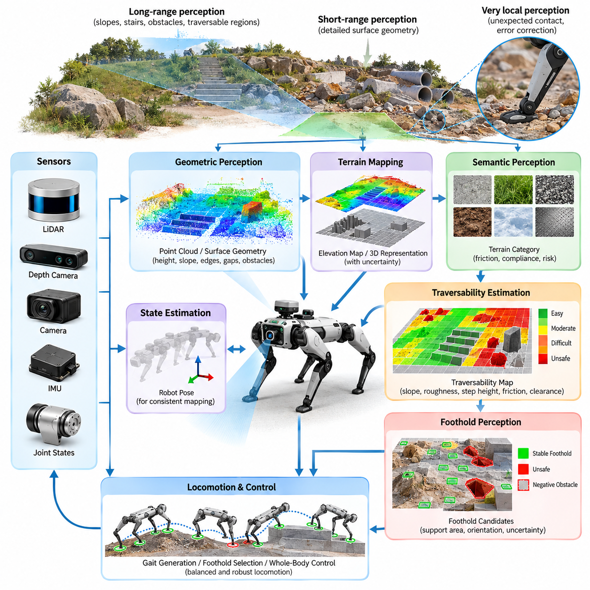
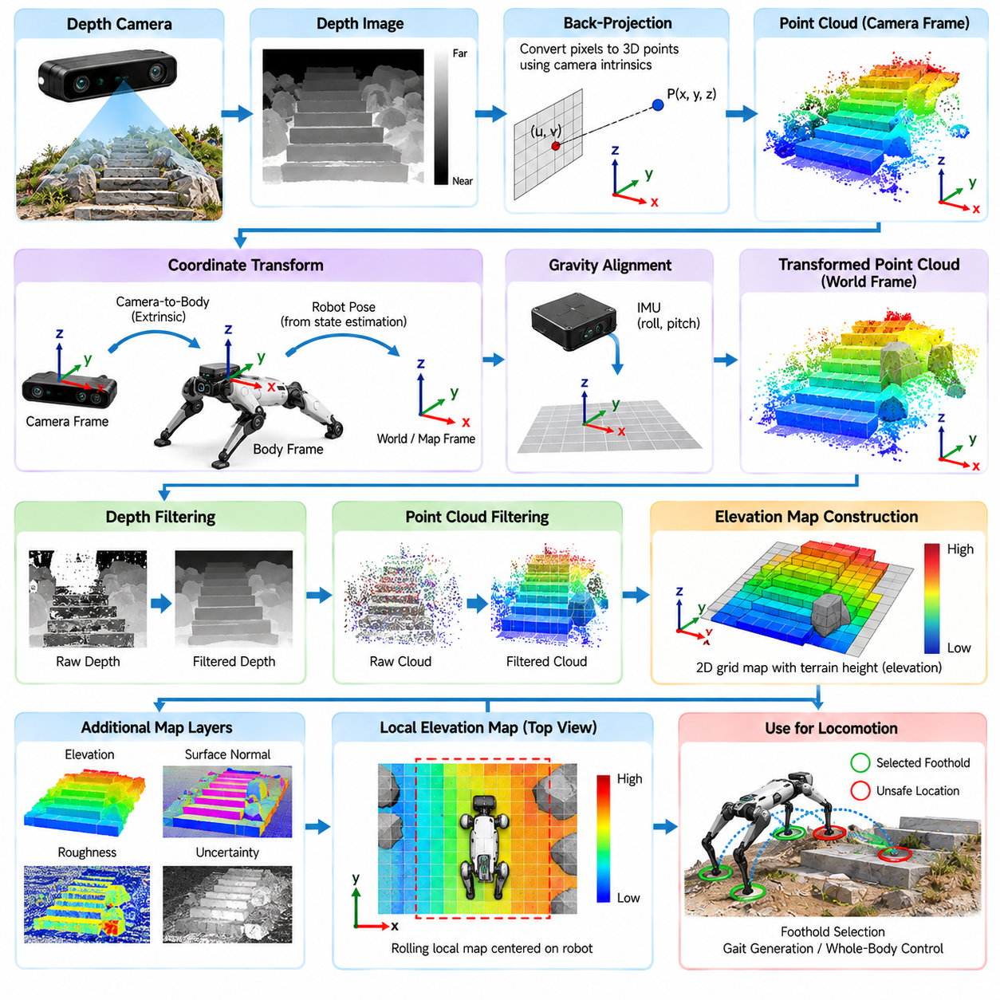
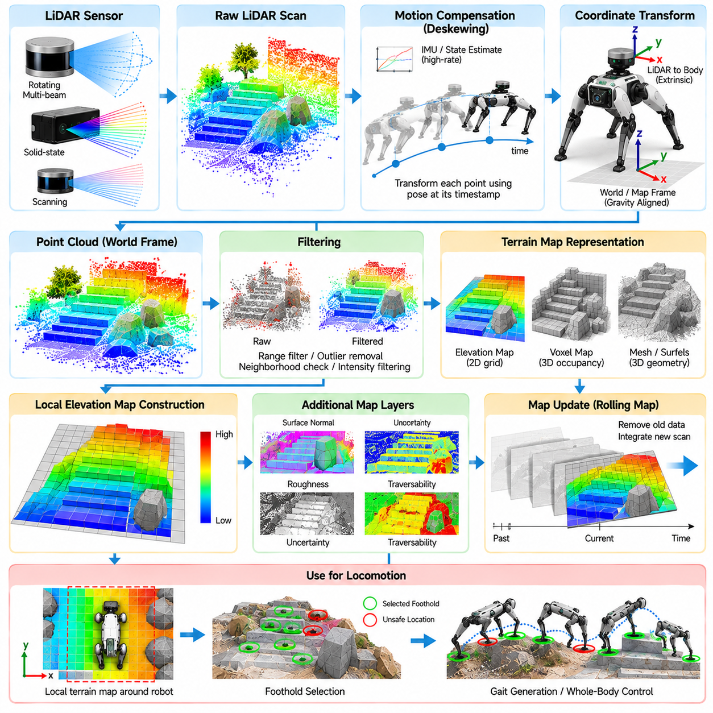
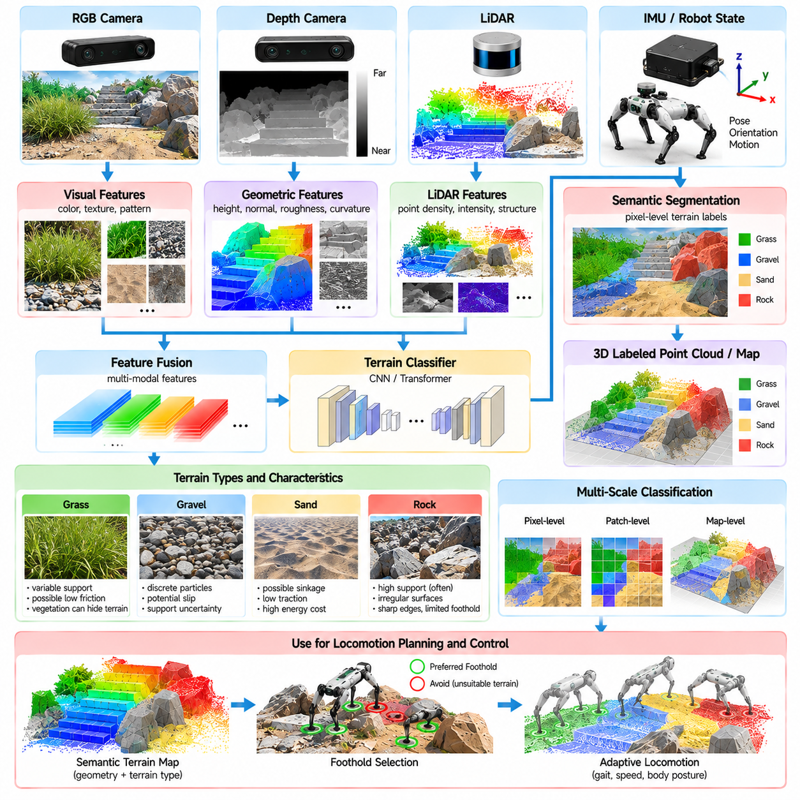
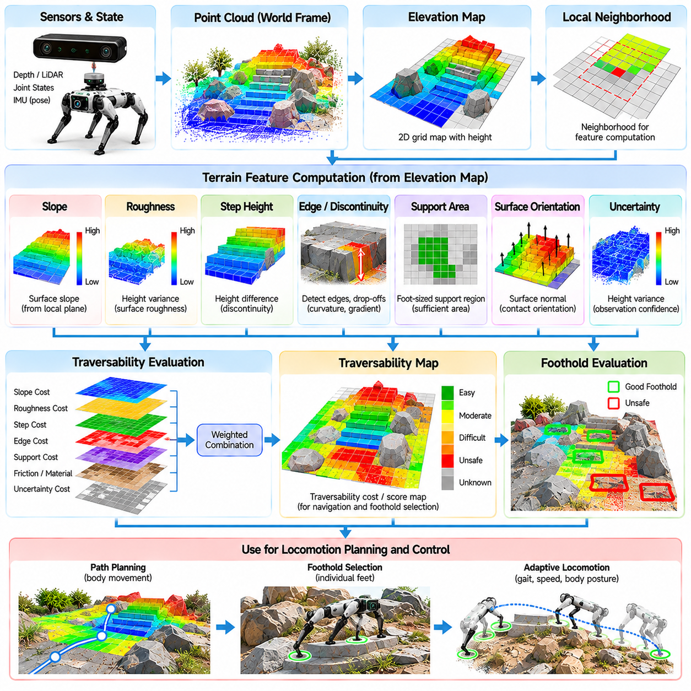
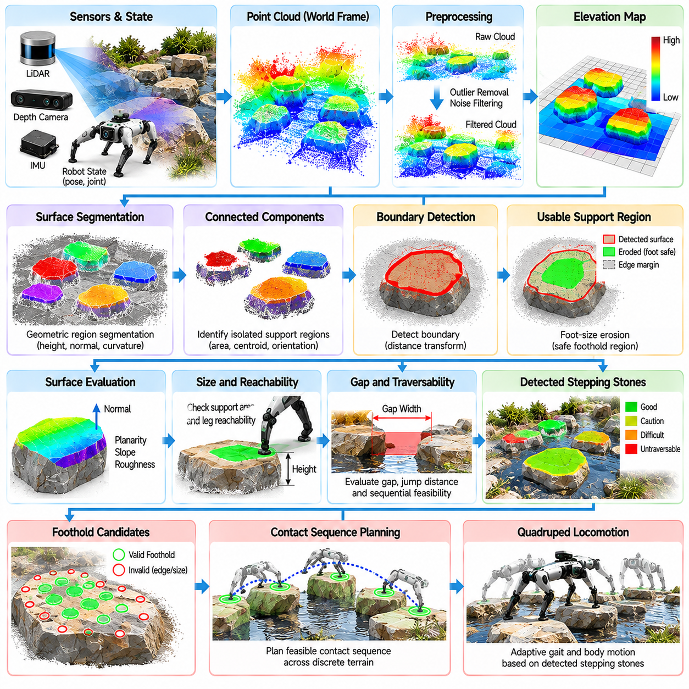
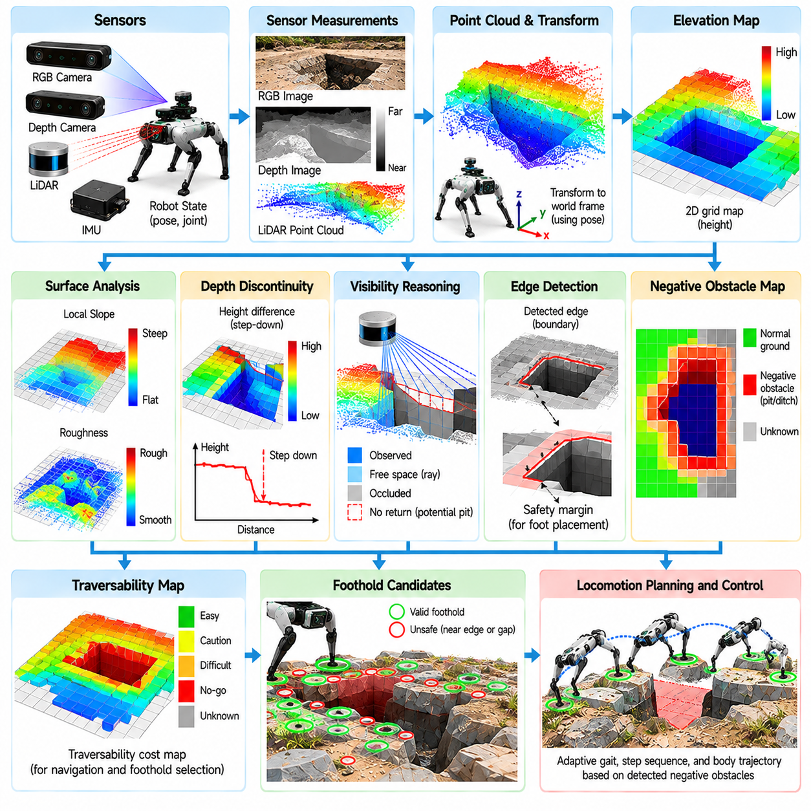
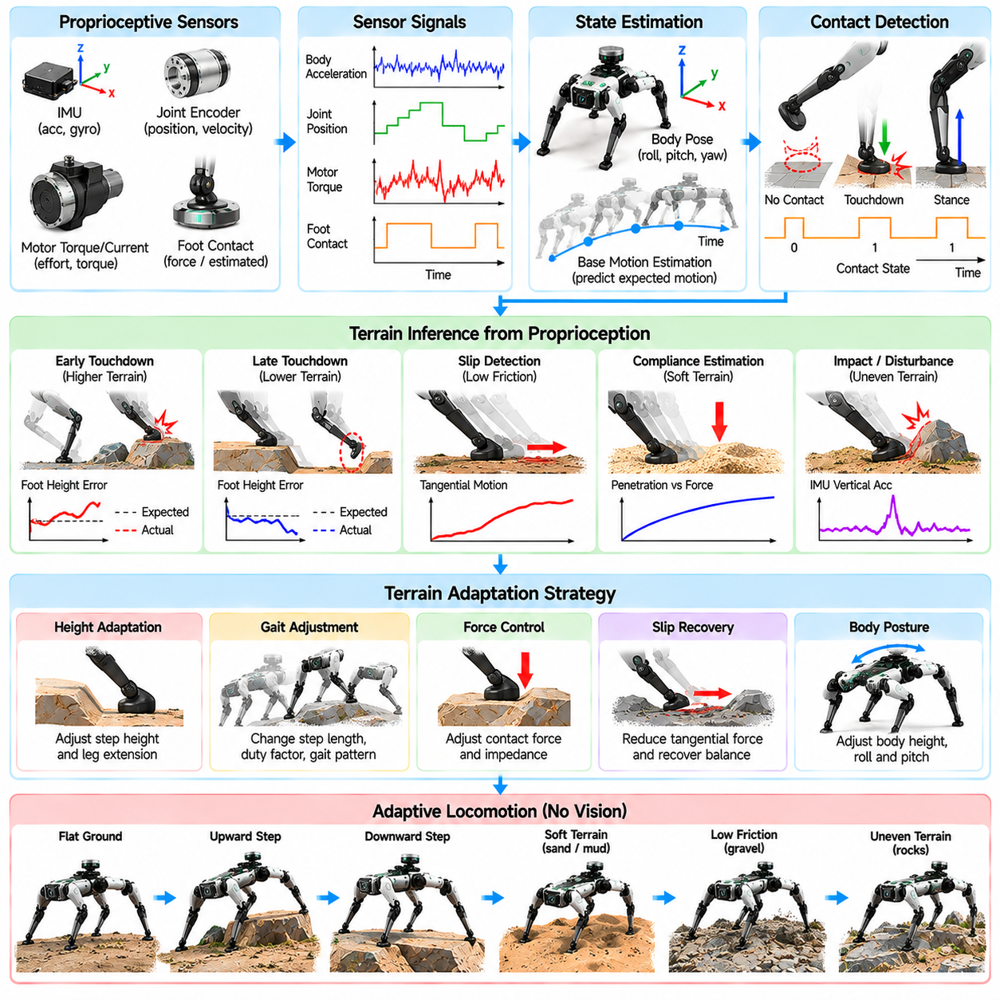
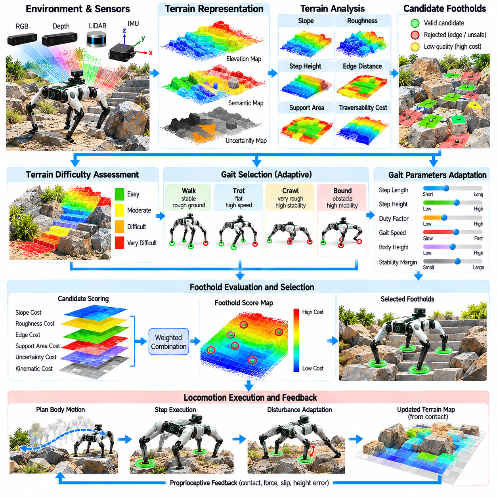
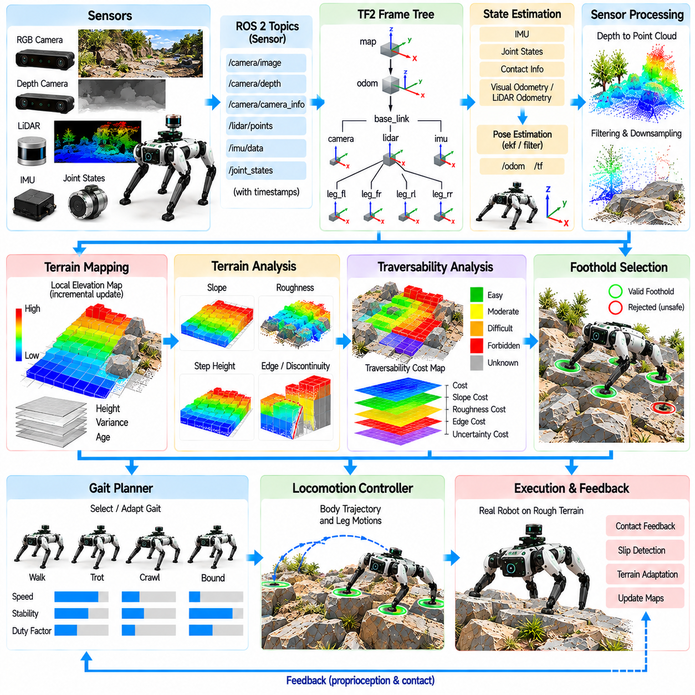

**Volume 21. Quadruped Robot Software**

# Chapter 04. Terrain Perception

## 04.01. Terrain Perception Requirements for Quadruped

{width="7.268055555555556in" height="7.268055555555556in"}

4족 보행 로봇(Quadruped Robot)의 지형 인식(Terrain Perception)은 이동에 직접적인 영향을 미치는 환경의 물리적 특성을 관찰하고, 해석하고, 표현하는 과정이다. 바퀴형 로봇(Wheeled Robot)과 달리 4족 보행 로봇은 어디로 이동할 수 있는지뿐만 아니라 각각의 발(Foot)이 어디에 안전하게 접촉할 수 있는지도 지속적으로 판단해야 한다. 따라서 지형 인식은 균형(Balance), 보행 생성(Gait Generation), 발판 선택(Foothold Selection), 전신 운동(Whole-Body Motion)과 밀접하게 결합된다.

4족 보행 로봇의 지형 인식 시스템(Terrain Perception System)은 여러 공간적 규모(Spatial Scale)에서 환경을 표현할 수 있어야 한다. 장거리 인식(Long-Range Perception)은 로봇이 접근하기 전에 경사면(Slope), 계단(Stairs), 장애물(Obstacle), 통로(Corridor), 주행 가능 영역(Traversable Region)을 식별하는 데 필요하다. 단거리 인식(Short-Range Perception)은 발판 계획(Foothold Planning)을 위한 상세한 표면 형상을 제공해야 하며, 각 다리 주변의 매우 국소적인 정보는 착지 전에 관찰하지 못했던 예상치 못한 접촉 조건을 검출하고 오류를 보정하는 데 필요하다.

기하학적 인식(Geometric Perception)은 보행 이동이 지형의 형상에 크게 의존하기 때문에 가장 기본적인 요구사항 중 하나이다. 로봇은 표면 높이(Surface Height), 경사(Slope), 방향(Orientation), 불연속부(Discontinuity), 모서리(Edge), 틈(Gap), 장애물 크기를 추정해야 한다. 단순한 2차원 점유 표현(2D Occupancy Representation)은 동일한 수평 위치에서도 서로 다른 수직 구조가 존재하여 완전히 다른 몸체 및 발 궤적을 요구할 수 있기 때문에 일반적으로 다족 보행(Legged Locomotion)에 충분하지 않다.

고도 지도(Elevation Map)는 로봇 주변의 셀(Cell)에 추정된 지형 높이를 할당함으로써 유용한 중간 표현(Intermediate Representation)을 제공한다. 이러한 지도는 발판 평가(Foothold Evaluation), 장애물 극복(Obstacle Negotiation), 몸체 높이 조절(Body-Height Adjustment), 국소 궤적 계획(Local Trajectory Planning)을 지원할 수 있다. 그러나 센서 잡음(Sensor Noise), 가림(Occlusion), 반사 표면(Reflective Surface), 식생(Vegetation), 움직임(Motion), 제한된 관측 각도 때문에 잘못되거나 누락된 높이 측정값이 발생할 수 있으므로 불확실성(Uncertainty)도 함께 고려해야 한다.

3차원 인식(3D Perception)은 계단, 암석, 잔해(Rubble), 팔레트(Pallet), 파이프(Pipe), 식생, 건설 자재 또는 불규칙한 산업 구조물이 포함된 복잡한 환경에서 특히 중요하다. 라이다(LiDAR) 또는 깊이 카메라(Depth Camera)에서 획득한 포인트 클라우드(Point Cloud)는 고도, 복셀(Voxel), 메시(Mesh), 주행 가능성(Traversability) 표현으로 변환되기 전에 상세한 기하학 정보를 유지할 수 있다. 인식 파이프라인(Perception Pipeline)은 실시간 동작에 충분한 계산 효율성을 유지하면서 보행에 필요한 정보를 보존해야 한다.

지형 인식은 기하학적 정보만으로 제한되어서는 안 된다. 기하학적으로 유사한 표면도 서로 매우 다른 물리적 특성을 가질 수 있기 때문이다. 마른 콘크리트(Dry Concrete), 젖은 타일(Wet Tile), 느슨한 자갈(Loose Gravel), 진흙(Mud), 잔디(Grass), 눈(Snow), 금속판(Metal Plate)은 비슷한 기하학적 지지 구조를 가지면서도 서로 다른 마찰(Friction)과 변형(Deformation) 특성을 나타낼 수 있다. 따라서 의미론적 인식(Semantic Perception)이나 외관 기반 인식(Appearance-Based Perception)을 이용하여 예상 접지력(Traction), 순응성(Compliance), 불안정성(Instability), 이동 위험도를 추정할 필요가 있다.

주행 가능성 추정(Traversability Estimation)은 원시 환경 관측(Raw Environmental Observation)을 보행 및 내비게이션 시스템이 직접 사용할 수 있는 정보로 변환한다. 단순히 셀을 점유(Occupied) 또는 자유 공간(Free)으로 구분하는 대신 특정 영역을 통과하는 것이 얼마나 어렵거나 위험한지를 추정한다. 주행 가능성은 경사, 거칠기(Roughness), 단차 높이(Step Height), 여유 공간(Clearance), 예상 마찰, 발판 가용성(Foothold Availability), 몸체 크기, 관절 한계(Joint Limit), 현재 보행 또는 이동 제어기의 능력에 따라 달라질 수 있다.

발판 인식(Foothold Perception)은 일반적인 내비게이션보다 더욱 엄격한 요구조건을 가진다. 로봇 몸체가 통과할 수 있는 영역이라도 개별 발이 착지하기에는 위험한 위치가 포함될 수 있다. 인식 시스템은 충분한 면적, 적절한 방향, 허용 가능한 불확실성을 가진 안정적인 접촉면(Contact Surface)을 찾아야 한다. 또한 구멍(Hole), 틈, 계단 모서리, 낭떠러지(Drop-Off)와 같은 음의 장애물(Negative Obstacle)을 인식해야 하는데, 이러한 장애물은 지면 위로 직접 관측되는 양의 장애물(Positive Obstacle)보다 훨씬 위험할 수 있다.

인식 정확도(Perception Accuracy)는 로봇과 발의 크기를 기준으로 고려해야 한다. 전역 내비게이션(Global Navigation)에서는 중요하지 않은 작은 기하학적 오차라도 발이 모서리에 착지하거나 지지면 밖으로 일부 벗어나게 만들 수 있다. 따라서 발판 계획에 사용되는 지형 지도는 장거리 경로 계획(Long-Range Route Planning)에 사용하는 지도보다 훨씬 높은 해상도(Resolution)를 요구하는 경우가 많다. 다중 해상도 표현(Multi-Resolution Representation)을 이용하면 모든 영역의 계산량을 불필요하게 증가시키지 않으면서 이러한 상충되는 요구조건을 충족할 수 있다.

지연 시간(Latency) 역시 중요하다. 로봇이 움직이는 동안 지형 정보는 지속적으로 오래된 정보가 되기 때문이다. 지나치게 늦게 생성되는 정확한 기하학 지도보다 약간의 잡음이 있더라도 낮은 지연 시간으로 제공되는 지도가 더 유용할 수 있다. 따라서 센서 획득(Sensor Acquisition), 동기화(Synchronization), 상태 추정(State Estimation), 포인트 클라우드 처리, 지도 갱신(Map Updating), 지형 분류(Terrain Classification), 계획기 통신(Planner Communication)은 전체 지연 시간이 로봇의 속도와 보행 동역학(Gait Dynamics)에 적합하도록 실시간 파이프라인을 구성해야 한다.

신뢰할 수 있는 지형 지도 생성을 위해서는 로봇 자신의 자세 및 위치 추정(Pose Estimation)이 정확해야 한다. 라이다와 카메라에서 얻은 측정값은 로봇 몸체가 이동하고 회전하며 피치(Pitch)와 롤(Roll) 운동을 수행하는 동안 일관된 좌표계(Coordinate Frame)로 변환되어야 한다. 위치 추정이나 자세 추정의 오차는 실제로 존재하지 않는 지형 변형으로 나타날 수 있다. 따라서 관성측정장치(IMU), 관절 상태(Joint State), 접촉 정보(Contact Information), 비주얼 또는 라이다 오도메트리(Visual or LiDAR Odometry), 기타 위치 추정 정보를 긴밀하게 통합하는 것이 필수적이다.

센서 간 시간 동기화(Time Synchronization)는 동적인 다족 보행에서 특히 중요하다. 특정 몸체 자세에서 획득한 깊이 영상(Depth Image)을 다른 시점에 해당하는 자세 추정값과 결합하면 안전한 지형 정보를 생성할 수 없다. 하드웨어 타임스탬프(Hardware Timestamp), 동기화된 클록(Synchronized Clock), 보정된 센서 변환(Calibrated Sensor Transformation)을 사용하면 움직임으로 인한 왜곡을 감소시킬 수 있다. 이러한 요구조건은 보행 속도, 센서 수, 지형 복잡성, 몸체의 각운동(Angular Motion)이 증가할수록 더욱 중요해진다.

가림(Occlusion)은 외부수용성 인식(Exteroceptive Perception)에서 피할 수 없는 한계이다. 로봇 자신의 다리가 카메라 시야를 가릴 수 있고, 장애물이 잠재적인 발판을 가릴 수 있으며, 급경사 지형은 로봇이 가까이 접근하기 전까지 관측할 수 없는 영역을 만들 수 있다. 따라서 센서 배치(Sensor Placement)와 다중 센서 융합(Multi-Sensor Fusion)을 통해 상호 보완적인 시야(Field of View)를 최대화해야 한다. 동시에 계획기는 실제로 자유 공간으로 확인된 지형과 단순히 관측되지 않아 알 수 없는 지형(Unknown Terrain)을 구분해야 한다.

고유수용성 센싱(Proprioceptive Sensing)은 로봇이 환경과 물리적으로 상호작용할 때 발생하는 현상을 관찰함으로써 또 다른 지형 인식 계층을 제공한다. 관절 인코더(Joint Encoder), 모터 전류(Motor Current), 토크 추정(Torque Estimation), 발 힘 센서(Foot-Force Sensor), IMU 신호는 접촉 시점(Contact Timing), 충격(Impact), 미끄러짐(Slip), 침하(Sinking), 예상하지 못한 지면 높이를 감지할 수 있다. 이러한 측정값을 이용하면 예측한 지형과 실제 접촉 조건 사이의 차이를 검출하고 국소 지형 모델(Local Terrain Model)을 온라인으로 보정할 수 있다.

미끄러짐 검출(Slip Detection)은 시각적 외관만으로 실제 사용 가능한 마찰력을 보장할 수 없기 때문에 특히 중요하다. 지면에 대한 예상하지 못한 발의 움직임은 운동학적 불일치(Kinematic Inconsistency), 접촉력(Contact Force), 관성 측정값(Inertial Measurement), 상태 추정 잔차(State-Estimation Residual)를 통해 추정할 수 있다. 미끄러짐이 검출되면 보행 시스템은 속도를 낮추거나, 접촉력을 조절하거나, 보폭을 줄이거나, 발판을 변경하거나, 다른 보행 패턴(Gait)을 선택할 수 있다. 따라서 지형 인식은 발 착지 이전에 끝나는 것이 아니라 접촉 이후에도 계속된다.

동적 환경(Dynamic Environment)은 추가적인 인식 요구사항을 발생시킨다. 사람, 차량, 기계, 문, 이동 장비, 다른 로봇은 정적인 지형 지도(Static Terrain Map)에 영구적으로 포함되어서는 안 된다. 인식 시스템은 지속적으로 존재하는 지형 구조와 일시적이거나 움직이는 객체를 구분하고 그에 따라 환경 표현을 갱신해야 한다. 사람이나 산업 장비 주변에서 동작하는 4족 보행 로봇에서는 이러한 분리가 안전한 내비게이션과 신뢰성 있는 발판 생성 모두에 매우 중요하다.

강건한 지형 인식(Robust Terrain Perception)은 모든 측정값이 정확하다고 가정하는 대신 불확실성을 명시적으로 표현해야 한다. 지형 높이, 표면 법선(Surface Normal), 의미론적 클래스(Semantic Class), 주행 가능성, 마찰 추정값, 발판 품질(Foothold Quality)에 각각 신뢰도(Confidence)를 부여할 수 있다. 계획 알고리즘은 이를 이용하여 충분히 관측된 영역을 우선적으로 선택하고 관측이 불충분한 영역에서는 보수적으로 행동할 수 있다. 불확실성 기반 인식(Uncertainty-Aware Perception)은 모서리, 반사 재질, 투명 표면, 식생, 어두운 환경, 먼지, 센서 측정 한계 부근에서 특히 중요하다.

센서 중복성(Sensor Redundancy)은 환경 조건으로 인해 개별 센서의 성능이 저하될 때 시스템의 복원력(Resilience)을 향상시킨다. 라이다는 조명 변화에도 비교적 신뢰할 수 있는 기하학적 측정값을 제공하고, 카메라는 밀도 높은 외관 및 의미론적 정보를 제공한다. 깊이 카메라는 편리한 국소 기하학 정보를 제공하지만 실외 또는 특정 표면에서는 성능이 저하될 수 있다. IMU와 고유수용성 센서는 외부 가시성이 나빠진 상황에서도 사용할 수 있으며, 센서 융합을 통해 이러한 상호 보완적인 장점을 지속적인 보행에 활용할 수 있다.

보정 품질(Calibration Quality)은 융합된 지형 정보의 활용 가능성에 직접적인 영향을 미친다. 센서 내부 파라미터(Intrinsic Parameter), 카메라-라이다 변환(Camera-to-LiDAR Transformation), 센서-몸체 변환(Sensor-to-Body Transformation), 시간 오프셋(Time Offset)은 진동, 온도 변화, 기계적 충격, 장기간의 운용 환경에서도 충분한 정확도를 유지해야 한다. 작은 보정 오차도 포인트 클라우드의 불일치나 발판 위치의 변위를 발생시킬 수 있으므로 실제 시스템에서는 보정 상태를 검증하고 운용 중 성능 저하를 검출하는 메커니즘이 필요하다.

지형 표현(Terrain Representation)은 보행 계획(Locomotion Planning)과 자연스럽게 연결되어야 한다. 기하학적으로 정교하지만 제어기가 사용하기 어려운 환경 정보를 생성해서는 안 된다. 유용한 출력에는 국소 고도(Local Elevation), 표면 법선, 발판 후보(Foothold Candidate), 장애물 경계(Obstacle Boundary), 지형 클래스(Terrain Class), 신뢰도 값, 주행 가능성 비용(Traversability Cost) 등이 포함된다. 이러한 표현은 원시 센싱(Raw Sensing)과 보행, 발판, 몸체 운동, 내비게이션 의사결정 사이를 연결하는 기능적 인터페이스를 형성한다.

인식 범위(Perception Range)와 해상도는 로봇의 보행 행동에 따라 조절될 필요가 있다. 잔해 위를 저속으로 이동하는 경우에는 상세한 국소 기하학과 높은 신뢰도의 발판 추정이 중요하다. 반면 비교적 평탄한 지형을 빠르게 이동할 때는 장거리 경사 및 장애물 검출이 더욱 중요해진다. 적응형 센싱 및 매핑(Adaptive Sensing and Mapping)을 사용하면 모든 상황에서 동일한 처리를 유지하는 대신 속도, 보행 패턴, 지형 난이도, 임무 요구사항에 따라 계산 자원을 할당할 수 있다.

지형 인식은 빠른 몸체 운동, 진동, 충격, 급격한 자세 변화 중에도 정상적으로 동작해야 한다. 이러한 조건은 모션 블러(Motion Blur), 포인트 클라우드 왜곡(Point-Cloud Distortion), 일시적인 센서 가림, 불안정한 깊이 추정을 발생시킬 수 있다. 부드러운 실험실 환경의 움직임만을 고려해 설계된 알고리즘은 실제 보행 환경에서 실패할 수 있다. 따라서 강건한 필터링(Robust Filtering), 움직임 보상(Motion Compensation), 고속 상태 추정(High-Rate State Estimation), 적절한 센서 장착, 기계적으로 안정적인 보정 상태가 기본적인 공학적 요구사항이다.

학습 기반 지형 인식(Learning-Based Terrain Perception)은 복잡한 지형 패턴을 인식하고 축적된 경험으로부터 주행 가능성을 예측함으로써 기하학 기반 파이프라인을 강화할 수 있다. 신경망 모델(Neural Model)은 영상과 포인트 클라우드에서 의미론적 클래스, 표면 특성, 발판 품질, 이동 비용(Locomotion Cost)을 추정할 수 있다. 그러나 익숙하지 않은 지형에서는 높은 신뢰도를 가진 잘못된 예측이 발생하여 물리적 안정성에 직접적인 영향을 줄 수 있으므로 학습 기반 예측은 기하학적 제약(Geometric Constraint) 및 불확실성 추정과 결합되어야 한다.

학습 데이터(Training Data)는 실제 운용에서 예상되는 다양한 조건을 충분히 표현해야 한다. 조명, 날씨, 표면 질감(Surface Texture), 경사, 장애물 형상, 센서 잡음, 로봇 움직임의 변화가 포함되어야 한다. 시뮬레이션(Simulation)과 합성 데이터(Synthetic Data)는 희귀하거나 위험한 상황에 대한 데이터 범위를 확장할 수 있으며, 실제 데이터(Real-World Data)는 정확하게 모델링하기 어려운 센싱 특성을 반영한다. 도메인 랜덤화(Domain Randomization)와 도메인 적응(Domain Adaptation)은 시뮬레이션 환경과 실제 환경 사이의 차이를 더욱 감소시킬 수 있다.

어떠한 지형 인식 시스템도 완전한 관측을 보장할 수 없으므로 실패 처리(Failure Handling)는 핵심적인 요구사항이다. 깊이 정보 누락, 위치 추정 드리프트(Localization Drift), 센서 고장, 과도한 불확실성, 서로 모순되는 측정값이 발생하면 제어되지 않은 보행을 계속하는 대신 인식 가능한 성능 저하 상태(Degraded State)로 전환되어야 한다. 로봇은 속도를 낮추거나, 보폭을 줄이거나, 안정성 여유(Stability Margin)를 증가시키거나, 추가 관측을 수행하거나, 대체 경로를 선택하거나, 안전한 보행에 필요한 신뢰도를 확보할 수 없는 경우 정지할 수 있어야 한다.

궁극적인 성능 평가 기준은 단순한 지도 정확도(Map Accuracy)가 아니라 실제 지형과의 성공적인 물리적 상호작용(Physical Interaction)이다. 따라서 평가는 인식 성능 지표를 발판 성공률(Foothold Success), 미끄러짐 발생 빈도(Slip Frequency), 몸체 안정성(Body Stability), 지형 통과 성공률(Traversal Completion), 충돌 회피(Collision Avoidance), 복구 행동(Recovery Behavior), 전도율(Fall Rate)과 같은 보행 결과와 연결해야 한다. 기하학적 오차를 줄이더라도 실제 보행 신뢰성을 향상시키지 못하는 인식 기술은 4족 보행 시스템에서 실질적인 가치가 제한될 수 있다.

따라서 지형 인식은 독립적인 센싱 모듈이 아니라 폐루프 인식-행동 구조(Closed Perception-Action Loop)의 일부로 다루어져야 한다. 로봇은 지형을 관측하고, 실행 가능한 접촉을 예측하고, 움직임을 수행하고, 그 결과로 발생하는 물리적 상호작용을 측정한 후 환경에 대한 이해를 다시 갱신한다. 외부수용성 인식(Exteroception), 고유수용성 인식(Proprioception), 계획(Planning), 제어(Control), 물리적 피드백(Physical Feedback) 사이의 이러한 지속적인 상호작용을 통해 4족 보행 로봇은 기존 이동 로봇의 내비게이션만으로 충분히 표현하기 어려운 복잡한 지형에서도 안전하게 이동할 수 있다.

## 04.02. Elevation Map Construction from Depth Camera [w/Code]

{width="7.268055555555556in" height="7.268055555555556in"}

고도 지도(Elevation Map)는 2차원 격자(Two-Dimensional Grid)의 각 셀(Cell)에 추정된 지형 높이를 할당하는 압축된 기하학적 표현(Geometric Representation)이다. 4족 보행 로봇(Quadruped Robot)에서는 3차원 깊이 센싱(3D Depth Sensing)과 보행 계획(Locomotion Planning)을 연결하는 실용적인 역할을 한다. 모든 제어 판단마다 전체 포인트 클라우드(Point Cloud)를 처리하는 대신, 구조화된 지형 표현에서 국소 높이(Local Height), 경사(Slope), 거칠기(Roughness), 표면 방향(Surface Orientation)을 직접 조회할 수 있다.

깊이 카메라(Depth Camera)는 개별 영상 픽셀(Image Pixel)에 대해 카메라와 관측 표면 사이의 거리를 측정한다. 센싱 기술(Sensing Technology)에 따라 깊이는 스테레오 정합(Stereo Matching), 구조광(Structured Light), 비행시간 측정(Time-of-Flight Measurement) 등을 통해 획득할 수 있다. 생성된 깊이 영상(Depth Image)은 밀도 높은 기하학 정보를 포함하지만 측정값은 카메라를 기준으로 표현된다. 따라서 고도 지도 생성은 이러한 측정값을 3차원 점으로 변환하고 로봇 또는 월드 좌표계(World Coordinate Frame)로 변환하는 과정에서 시작된다.

보정된 핀홀 카메라 모델(Calibrated Pinhole Camera Model)에서는 영상 좌표와 연관된 깊이 값을 카메라 내부 파라미터(Camera Intrinsic Parameters)를 이용하여 3차원 공간으로 역투영(Back-Projection)할 수 있다. 초점거리(Focal Length)와 광학 중심(Optical Center)은 각 관측 광선(Viewing Ray)의 방향을 결정하고, 측정된 깊이는 해당 광선상에서 점의 위치를 결정한다. 유효한 픽셀에 이 과정을 반복하면 깊이 영상이 관측 지형 및 주변 객체의 공간 구조를 나타내는 정렬된 포인트 클라우드(Organized Point Cloud)로 변환된다.

정확한 카메라 보정(Camera Calibration)은 내부 파라미터의 체계적인 오차가 복원된 기하학 구조를 직접 왜곡하기 때문에 필수적이다. 렌즈 왜곡(Lens Distortion)은 포인트를 고도 지도에 삽입하기 전에 보정하거나 투영 모델(Projection Model)에 포함해야 한다. 깊이 카메라는 깊이에 따른 편향(Depth-Dependent Bias)이나 공간적으로 변화하는 측정 오차를 가질 수도 있다. 따라서 보정 절차는 영상 기하학뿐만 아니라 보행에 필요한 작동 범위(Operating Range)에서 실제 깊이 정확도까지 특성화해야 한다.

복원된 포인트 클라우드는 처음에는 카메라 좌표계(Camera Coordinate Frame)에 존재하며, 이를 매핑 좌표계(Mapping Frame)로 변환해야 한다. 이를 위해서는 카메라와 로봇 몸체 사이의 강체 변환(Rigid Transformation)과 로봇 자세 추정값(Robot Pose Estimate)이 필요하다. 카메라-몸체 변환(Camera-to-Body Transformation)이 보정된 외부 변환(Extrinsic Transform)으로 정의되고 몸체 자세가 상태 추정(State Estimation)을 통해 제공되면, 각 측정점은 중력 방향 및 이전에 관측한 지형과 일관된 위치에 배치될 수 있다.

중력 정렬(Gravity Alignment)은 높이가 물리적으로 의미 있는 수직 방향을 가져야 하므로 고도 지도 생성에서 특히 중요하다. 관성측정장치(IMU)는 롤(Roll)과 피치(Pitch) 정보를 제공하여 4족 보행 로봇의 몸체가 보행 중 흔들리더라도 매핑 좌표계가 중력 방향에 정렬되도록 할 수 있다. 신뢰성 있는 자세 보상(Attitude Compensation)이 없으면 정상적인 몸체의 피치와 롤 운동이 지형의 경사나 물결 형태로 잘못 표현되어 발판 선택(Foothold Selection)의 품질을 저하시킬 수 있다.

깊이 카메라와 상태 추정기(State Estimator) 사이의 시간 동기화(Time Synchronization)도 매우 중요하다. 4족 보행은 빠른 병진 및 회전 몸체 운동을 발생시키므로 작은 타임스탬프(Timestamp) 오차만으로도 잘못된 자세를 사용하여 깊이 측정값을 변환할 수 있다. 이로 인해 중복된 모서리, 흐려진 표면, 잘못된 높이 변화가 생성될 수 있다. 하드웨어 타임스탬프(Hardware Timestamp)와 고속 상태 추정값의 보간(Interpolation)을 사용하면 이러한 움직임 기반 매핑 오차를 크게 줄일 수 있다.

지도에 데이터를 삽입하기 전에 유효하지 않거나 신뢰성이 낮은 깊이 측정값을 제거해야 한다. 깊이 카메라는 일반적으로 누락 픽셀(Missing Pixel), 고립된 이상치(Isolated Outlier), 객체 경계 주변의 비정상적인 플라잉 포인트(Flying Point), 최소 또는 최대 작동 거리 주변의 잡음 측정값을 생성할 수 있다. 센싱 원리에 따라 반사성, 투명성, 어두운 색상 또는 질감이 부족한 표면에서도 측정 성능이 저하될 수 있다. 필터링(Filtering)은 이러한 오류가 고도 지도에서 가짜 장애물이나 위험한 발판으로 변환되는 것을 방지한다.

깊이 필터링(Depth Filtering)은 영상 영역과 3차원 영역 모두에서 수행할 수 있다. 공간 필터(Spatial Filter)는 고립된 깊이 불연속값을 제거하고, 시간 필터(Temporal Filter)는 단기적인 측정 변동을 억제한다. 포인트 클라우드 필터(Point-Cloud Filter)는 예상 높이 또는 거리 범위를 벗어난 측정값을 제거하거나 통계적으로 고립된 점을 제거할 수 있다. 그러나 계단 모서리, 암석, 연석(Curb), 틈과 같은 실제 지형 불연속부는 보행 계획에 반드시 필요한 기하학 구조이므로 필터링 과정에서도 이를 보존해야 한다.

국소 고도 지도(Local Elevation Map)는 일반적으로 로봇을 중심으로 하거나 로봇 주변에 배치된 2차원 격자로 표현된다. 각 격자 셀은 고정된 수평 영역에 대응하며 추정된 지형 고도를 저장한다. 추가 계층(Layer)에는 분산(Variance), 표면 법선(Surface Normal), 거칠기, 주행 가능성(Traversability), 의미론적 클래스(Semantic Class), 관측 경과 시간(Observation Age) 등이 포함될 수 있다. 이동형 국소 지도(Rolling Local Map)는 가까운 미래의 보행에 직접 영향을 미치는 지형에 계산 자원을 집중할 수 있기 때문에 4족 보행 로봇에 특히 유용하다.

지도 해상도(Map Resolution)는 기하학적 세부 정보, 계산 비용(Computational Cost), 센서 불확실성(Sensor Uncertainty) 사이의 균형을 결정한다. 거친 격자는 메모리와 갱신 비용을 감소시키지만 좁은 발판을 제거하거나 인접한 지형 구조를 하나로 합칠 수 있다. 지나치게 세밀한 격자는 더 많은 기하학 정보를 보존하지만 잡음을 확대하고 계산량을 증가시킬 수 있다. 따라서 셀 크기(Cell Size)는 발의 크기, 예상 장애물 규모, 깊이 카메라 정확도, 발판 계획기(Foothold Planner)가 요구하는 공간 정밀도를 고려하여 결정해야 한다.

변환된 점이 지도에 입력되면 수평 좌표를 이용하여 해당 격자 셀을 결정하고, 수직 좌표는 후보 고도 측정값(Candidate Elevation Measurement)으로 사용된다. 여러 깊이 픽셀이 동일한 표면 영역을 관측하기 때문에 하나의 셀에 여러 점이 입력될 수 있다. 단순히 가장 최근의 측정값만 저장하는 방식은 일반적으로 충분하지 않다. 대신 시간에 따라 측정값을 융합(Temporal Fusion)하여 반복된 관측이 추정값을 개선하고 잡음이 많거나 일관성이 낮은 관측값의 영향은 감소하도록 해야 한다.

확률적 고도 매핑(Probabilistic Elevation Mapping)은 각 셀을 추정 높이와 불확실성(Uncertainty)을 함께 사용하여 표현한다. 새로운 깊이 측정값에는 센서 특성, 관측 기하학(Viewing Geometry), 거리, 자세 불확실성을 기반으로 분산값이 할당된다. 기존 셀 추정값과 새로운 관측값은 분산 가중 융합(Variance-Weighted Fusion)을 통해 결합할 수 있다. 반복적으로 일관된 측정값은 불확실성을 감소시키고, 잡음이 큰 측정값은 상대적으로 적은 영향을 미치므로 지도는 지형 형상과 신뢰도를 동시에 표현할 수 있다.

측정 불확실성(Measurement Uncertainty)은 일반적으로 깊이 카메라에서 거리가 멀어질수록 증가하며 입사각(Incidence Angle)의 영향을 받을 수도 있다. 비스듬한 각도로 관측한 표면은 관측 방향에 거의 수직인 표면보다 신뢰성이 낮은 깊이 값을 생성할 수 있다. 상태 추정 불확실성(State-Estimation Uncertainty) 역시 고려해야 한다. 정확한 깊이 값이라도 불확실한 로봇 자세로 변환하면 월드 좌표에서 불확실한 위치를 생성하기 때문이다. 따라서 강건한 고도 매핑은 센싱 및 자세 불확실성을 지도 내부로 전파해야 한다.

하나의 격자 셀에 서로 다른 수직 표면의 측정값이 포함되는 경우도 있다. 이러한 현상은 벽, 계단 수직면(Stair Riser), 식생, 테이블 모서리 또는 돌출 구조물(Overhanging Structure) 주변에서 발생한다. 일반적인 단일 높이 고도 지도(Single-Height Elevation Map)는 임의의 3차원 기하학 구조를 완전하게 표현할 수 없다. 따라서 복잡한 돌출 구조가 실제 운용에서 중요하다면 부적절한 수직 구조를 제거하거나, 복수 가설(Multiple Hypothesis)을 유지하거나, 복셀(Voxel) 또는 점유 표현(Occupancy Representation)을 함께 사용해야 한다.

지면 분할(Ground Segmentation)은 지지 가능한 표면과 지면으로 해석해서는 안 되는 객체를 구분함으로써 지형 지도의 품질을 향상시킬 수 있다. 표면 법선, 높이 연속성(Height Continuity), 국소 경사(Local Slope), 의미론적 정보, 기하학적 군집화(Geometric Clustering)를 이용하여 지형일 가능성이 높은 점을 식별할 수 있다. 그러나 4족 보행 로봇에서는 계단, 경사로(Ramp), 암석, 의도적으로 올라갈 수 있는 구조물도 유효한 지지 지형이 될 수 있으므로 지면이 전체적으로 평평하다고 가정해서는 안 된다.

깊이 카메라는 제한된 시야각(Field of View)을 가지며 지형이 장애물이나 로봇 자체에 의해 가려질 수 있기 때문에 관측 누락(Missing Observation)은 피할 수 없다. 관측되지 않은 셀은 자동으로 자유 공간이나 평평한 지면으로 간주하지 않고 명시적인 미확인 영역(Unknown Area)으로 유지해야 한다. 인접한 기하학 정보가 충분한 근거를 제공한다면 작은 누락 영역은 국소 보간(Local Interpolation)으로 채울 수 있지만, 지나친 보간은 발 착지에 중요한 구멍, 낭떠러지, 좁은 불연속부를 위험하게 숨길 수 있다.

지도 노화(Map Aging)는 위치 추정 오차가 누적되거나 환경이 변화하면서 오래된 관측값의 신뢰성이 감소하기 때문에 유용하다. 각 셀에는 가장 최근 관측 시각을 저장할 수 있으며, 이를 이용해 오래된 측정값의 신뢰도를 낮추거나 일정 시간이 지나면 제거할 수 있다. 이동형 고도 지도는 로봇이 이동함에 따라 멀어진 지형을 자연스럽게 제거하는 반면, 발 주변에서 최근에 관측한 영역은 즉각적인 보행 판단을 위해 가장 높은 관련성을 유지한다.

표면 법선은 인접한 고도 셀 또는 국소 포인트 클라우드의 기하학 정보로부터 추정할 수 있다. 표면 법선은 표면의 방향을 나타내며 경사 검출과 접촉 적합성(Contact Suitability) 평가에 유용한 정보를 제공한다. 국소 높이 변화(Local Height Variation)를 이용하면 지형 거칠기도 추정할 수 있다. 고도, 경사, 거칠기, 불확실성을 함께 사용하면 계획기는 매끄러운 지지면과 불규칙하거나 기하학적으로 위험한 영역을 구분할 수 있다.

고도 기울기(Elevation Gradient)는 단차 경계(Step Boundary), 연석, 암석 및 기타 급격한 지형 높이 변화를 검출하는 데 사용할 수 있다. 이러한 불연속부는 평활화 필터(Smoothing Filter)가 로봇이 인식해야 하는 구조 자체를 제거할 수 있기 때문에 신중하게 처리해야 한다. 모서리 보존 필터링(Edge-Preserving Filtering)과 신뢰도 기반 처리(Confidence-Aware Processing)를 사용하면 의미 있는 기하학적 경계를 유지하면서 측정 잡음을 감소시킬 수 있다. 이는 계단이나 플랫폼 모서리 근처에서 발판을 선택할 때 특히 중요하다.

음의 장애물(Negative Obstacle)은 구멍이나 낙차가 명시적인 낮은 높이 표면으로 나타나는 대신 깊이 측정값 자체가 존재하지 않을 수 있기 때문에 특별한 주의가 필요하다. 매핑 시스템은 가시성(Visibility)과 광선 기하학(Ray Geometry)을 고려하여 측정값 누락을 자동으로 안전한 지형으로 해석하지 않아야 한다. 현재의 깊이 관측, 이전 지도 정보, 명시적인 미확인 공간 처리를 결합하면 계획기가 관측되지 않은 틈에 발판을 선택하는 것을 방지할 수 있다.

여러 개의 깊이 카메라(Multiple Depth Cameras)를 사용하면 가림을 줄이고 4족 보행 로봇 주변의 지형 관측 범위를 확장할 수 있다. 전방 카메라(Front-Facing Camera)는 경로 및 발판 계획을 위한 선행 정보를 제공하고, 하향 또는 측면 카메라는 발 주변의 관측 성능을 향상시킬 수 있다. 모든 카메라의 측정값은 공통 매핑 좌표계(Common Mapping Frame)로 변환한 후 각 센서의 불확실성 모델에 따라 융합할 수 있다. 센서 수가 증가할수록 정확한 외부 보정(Extrinsic Calibration)과 시간 동기화의 중요성도 증가한다.

깊이 카메라 기반 고도 매핑(Depth-Camera Elevation Mapping)은 로봇이 보행하는 동안 지속적으로 동작해야 한다. 효율적인 구현에서는 유용한 영상 영역만 처리하고, 중복된 측정값을 다운샘플링(Downsampling)하며, 영향을 받는 지도 셀만 갱신하고, 필요한 경우 병렬 연산(Parallel Computation)을 활용한다. 매핑 갱신률(Mapping Rate)은 로봇 움직임으로 인해 변화하는 지형 정보가 발판 또는 몸체 운동 계획기(Body-Motion Planner)에서 필요로 하기 전에 지도에 반영될 만큼 충분히 높아야 한다.

고도 지도는 발판 계획과 직접 연결될 때 특히 유용하다. 후보 발 위치(Candidate Foot Position)는 높이, 국소 경사, 거칠기, 모서리와의 거리, 지지 면적(Support Area), 불확실성을 기준으로 평가할 수 있다. 관측이 누락되거나 신뢰성이 낮은 영역에는 높은 비용을 부여하거나 후보에서 제외할 수 있다. 이를 통해 계획기는 깊이 측정값의 연속적인 스트림을 기하학적 및 안정성 제약을 만족하는 이산적인 접촉 결정(Discrete Contact Decision)으로 변환할 수 있다.

몸체 궤적 계획(Body Trajectory Planning)은 동일한 고도 지도를 더 큰 공간적 규모에서 활용할 수 있다. 로봇 아래와 주변의 지형 높이는 다리 작업 공간(Leg Workspace)과 지상고(Ground Clearance)를 유지하면서 몸체 높이, 롤, 피치를 조절하기 위한 정보를 제공한다. 앞으로 나타날 경사나 단차를 미리 파악하면 개별 발이 해당 지형에 도달하기 전에 몸체 자세를 변경할 수 있으므로 더욱 부드러운 보행이 가능하고 관절 한계 또는 충돌 문제의 위험을 줄일 수 있다.

고도 지도의 품질은 단순한 점별 높이 오차(Point-Wise Height Error)뿐만 아니라 실제 보행에 미치는 영향을 기준으로 평가해야 한다. 중요한 지표에는 높이 정확도(Height Accuracy), 불확실성 보정(Uncertainty Calibration), 모서리 보존(Edge Preservation), 갱신 지연(Update Latency), 지도 완전성(Map Completeness), 가짜 장애물 발생률(False-Obstacle Rate)이 포함된다. 4족 보행 운용에서는 여기에 발판 성공률(Foothold Success), 틈 미검출 빈도(Missed-Gap Frequency), 미끄러짐 발생(Slip Occurrence), 지형 통과 성공률(Traversal Completion), 실제 몸체 운동 조건에서의 안정성을 함께 평가해야 한다.

강건한 시스템(Robust System)은 매핑 성능이 저하된 상태를 검출할 수 있어야 한다. 과도한 깊이 정보 누락, 일관성이 없는 측정값, 부정확한 위치 추정, 카메라 가림, 빠르게 증가하는 지도 불확실성은 지형 정보가 더 이상 신뢰할 수 없음을 의미할 수 있다. 이러한 상황에서 정상 보행을 계속하는 대신 로봇은 속도를 낮추고, 보폭을 줄이고, 안정성 여유(Stability Margin)를 증가시키거나, 센서의 위치를 조정하거나, 충분한 지형 신뢰도가 회복될 때까지 정지할 수 있다.

따라서 깊이 카메라를 이용한 고도 지도 생성(Elevation-Map Construction from Depth Camera)은 단순히 깊이 영상을 변환하는 과정이 아니다. 이는 보정된 센싱(Calibrated Sensing), 로봇 상태 추정, 좌표 변환(Coordinate Transformation), 불확실성 모델링(Uncertainty Modeling), 시간적 융합(Temporal Fusion), 기하학적 분석(Geometric Analysis), 실시간 지도 관리(Real-Time Map Management)를 결합하는 지속적인 추정 문제(Continuous Estimation Problem)이다. 이러한 요소가 통합적으로 동작할 때 밀도 높은 깊이 관측값은 4족 보행 로봇의 발판 선택, 몸체 계획, 적응형 보행(Adaptive Locomotion)에 적합한 안정적인 국소 지형 표현으로 변환될 수 있다.

## 04.03. LiDAR Based Terrain Mapping and Update [w/Code]

{width="7.268055555555556in" height="7.268055555555556in"}

라이다 기반 지형 매핑(LiDAR-Based Terrain Mapping)은 방출된 레이저 신호(Laser Signal)를 이용하여 객체까지의 거리를 측정함으로써 4족 보행 로봇(Quadruped Robot)에 주변 표면에 대한 직접적인 3차원 측정 정보를 제공한다. 수동 비전(Passive Vision)과 비교하면 라이다(LiDAR)는 조명 변화에 상대적으로 영향을 적게 받으며 밝은 실외 환경과 어두운 환경 모두에서 동작할 수 있다. 이러한 특성으로 인해 지속적인 보행 중에도 기하학적 신뢰성을 유지해야 하는 지형 인식(Terrain Perception)에 매우 유용하다.

서로 다른 라이다 구성(LiDAR Configuration)은 서로 다른 지형 관측 특성을 제공한다. 회전식 다중 빔 센서(Rotating Multi-Beam Sensor)는 넓은 수평 관측 범위와 긴 측정 거리를 제공하며, 솔리드 스테이트 라이다(Solid-State LiDAR)와 스캐닝 라이다(Scanning LiDAR)는 상대적으로 제한된 시야(Field of View) 내에서 밀도 높은 측정값을 제공할 수 있다. 적절한 구성은 로봇 크기, 예상 지형, 보행 속도, 탑재 중량 제한(Payload Limitation), 요구 지도 해상도(Map Resolution), 그리고 주요 목적이 내비게이션인지 발판 계획(Foothold Planning)인지 또는 두 가지 모두인지에 따라 결정된다.

각 라이다 측정값은 측정된 거리와 방출된 빔(Beam)의 알려진 방향을 이용하여 3차원 점으로 변환할 수 있다. 따라서 하나의 전체 스캔(Scan)은 관측 가능한 지형, 장애물, 구조물 및 잠재적으로 움직이는 객체를 나타내는 포인트 클라우드(Point Cloud)를 생성한다. 이러한 점을 지형 지도에 사용하기 위해서는 보정된 센서 외부 파라미터(Sensor Extrinsics)와 추정된 로봇 자세(Robot Pose)를 이용하여 라이다 좌표계(LiDAR Coordinate Frame)에서 공통 매핑 좌표계(Common Mapping Frame)로 변환해야 한다.

라이다와 로봇 몸체 사이의 정확한 외부 보정(Extrinsic Calibration)은 기본적인 요구사항이다. 작은 회전 오차(Rotational Error)는 측정 거리가 증가할수록 더 큰 위치 오차를 발생시키며, 병진 오차(Translation Error)는 복원된 지형을 체계적으로 이동시킬 수 있다. 보정 상태는 진동, 기계적 하중, 충격, 온도 변화에서도 안정적으로 유지되어야 한다. 따라서 실제 시스템에서는 유지보수 또는 장기간 운용 중 보정 일관성(Calibration Consistency)을 점검하는 절차를 포함할 수 있다.

4족 보행은 라이다 스캔이 획득되는 동안 로봇 몸체가 지속적으로 병진 이동하고 피치(Pitch), 롤(Roll), 요(Yaw) 운동을 수행하기 때문에 특히 까다로운 움직임 왜곡(Motion Distortion) 문제를 발생시킨다. 하나의 스캔 내부에서도 서로 다른 시점에 획득된 점들은 서로 다른 센서 자세에 대응한다. 이를 동시에 획득된 측정값으로 처리하면 평면이 휘어지거나 모서리가 흐려질 수 있다. 따라서 정확한 지형 복원을 위해 움직임 보상(Motion Compensation)이 필수적이다.

디스큐잉(Deskewing)은 각 점 또는 작은 점 그룹이 획득된 시점의 라이다 자세를 추정하여 이러한 왜곡을 보정한다. 고속 관성측정장치(IMU) 측정값, 관절 정보(Joint Information), 라이다 오도메트리(LiDAR Odometry), 융합된 상태 추정값(Fused State Estimate)을 이용하여 필요한 운동 궤적(Motion Trajectory)을 제공할 수 있다. 각 측정값은 지도에 삽입되기 전에 해당 타임스탬프(Timestamp)에 따라 변환된다. 따라서 라이다와 상태 추정기(State Estimator) 사이의 정확한 시간 동기화(Time Synchronization)는 기하학적 보정만큼 중요하다.

지형 매핑에는 일반적으로 중력 방향에 정렬된 안정적인 기준 좌표계(Reference Frame)가 필요하다. 로봇 몸체 좌표계(Body Frame)는 매 걸음마다 방향이 변하기 때문에 단독으로 지형 기준 좌표계로 사용하기에는 적합하지 않다. IMU 기반 자세 추정(Attitude Estimation)을 이용하면 라이다 점들을 중력 정렬 국소 좌표계(Gravity-Aligned Local Frame) 또는 월드 좌표계(World Frame)로 변환할 수 있다. 이를 통해 일반적인 몸체의 롤과 피치가 인공적인 지형 경사로 표현되는 것을 방지하고 보행 계획에 의미 있는 고도 정보를 제공할 수 있다.

원시 라이다 스캔(Raw LiDAR Scan)에는 실제 사용 가능한 지형을 나타내지 않는 측정값이 포함될 수 있다. 먼지, 비, 식생(Vegetation), 반사 재질, 다중 경로 효과(Multipath Effect), 센서 아티팩트(Sensor Artifact)로 인해 고립된 점이나 잘못된 구조가 생성될 수 있다. 거리 필터링(Range Filtering), 통계적 이상치 제거(Statistical Outlier Removal), 이웃 일관성 검사(Neighborhood Consistency Check), 반사 강도 기반 처리(Intensity-Based Processing)를 통해 이러한 오류를 줄일 수 있다. 다만 발 착지에 중요한 작은 암석, 연석(Curb), 계단 모서리 등의 구조가 제거되지 않도록 보수적으로 필터링해야 한다.

지형 지도(Terrain Map)는 고도 격자(Elevation Grid), 복셀 지도(Voxel Map), 포인트 클라우드 지도(Point-Cloud Map), 서펠(Surfel), 메시(Mesh) 또는 이러한 표현의 조합으로 구성할 수 있다. 고도 지도(Elevation Map)는 국소적으로 단일 높이를 가지는 지면을 계산 효율적으로 표현하는 데 적합하며, 복셀 지도는 벽, 돌출 구조물(Overhang), 터널 및 복잡한 3차원 구조를 표현할 수 있다. 4족 보행 시스템에서는 보행을 위한 상세한 국소 표현과 내비게이션을 위한 더 넓고 낮은 해상도의 지도를 함께 유지할 수 있다.

국소 고도 지도(Local Elevation Map)는 라이다 점들을 수평 격자상의 높이 측정값으로 변환한다. 변환된 각 점은 수평 좌표에 따라 특정 셀(Cell)에 할당되고 수직 좌표는 추정 지형 고도에 반영된다. 각 셀에는 추가로 분산(Variance), 표면 법선(Surface Normal), 거칠기(Roughness), 관측 횟수(Observation Count), 주행 가능성(Traversability), 타임스탬프 정보를 저장할 수 있다. 이러한 구조화된 표현을 통해 보행 알고리즘은 필요한 지형 특성에 효율적으로 접근할 수 있다.

지도 해상도는 로봇의 물리적 크기와 예상되는 지형에 따라 결정해야 한다. 내비게이션 지도(Navigation Map)는 상대적으로 거친 셀을 사용할 수 있지만 발판 계획에서는 로봇 발 크기와 비슷한 지지면을 구분할 수 있을 정도의 해상도가 필요하다. 지나치게 높은 해상도는 메모리 사용량을 증가시키고 측정 잡음을 두드러지게 만들며, 지나치게 낮은 해상도는 보행 안전에 영향을 미치는 좁은 틈, 단차, 모서리 또는 작은 발판을 제거할 수 있다.

확률적 융합(Probabilistic Fusion)은 반복적인 라이다 관측으로 생성되는 지도의 안정성을 향상시킨다. 새로운 점이 입력될 때마다 기존 셀 값을 단순히 교체하는 대신 이전 높이 추정값과 현재 측정값을 각각의 불확실성에 따라 결합할 수 있다. 센서 거리, 입사각(Incidence Angle), 빔 발산(Beam Divergence), 보정 정확도, 로봇 자세 불확실성(Robot-Pose Uncertainty)은 측정 신뢰도에 영향을 줄 수 있다. 일관된 관측은 점진적으로 지도 신뢰도를 높이고 불확실한 측정값에는 낮은 가중치가 적용된다.

자세 추정 정확도(Pose Estimation Accuracy)는 지형 지도의 일관성에 큰 영향을 미친다. 라이다 거리 측정값 자체가 정밀하더라도 연속적인 스캔을 부정확한 로봇 자세로 지도에 삽입하면 중복된 표면이나 흐려진 구조가 발생할 수 있다. 라이다 오도메트리는 연속 스캔 또는 국소 지도를 정합하여 상대 운동(Relative Motion)을 추정할 수 있으며, IMU는 고속 회전 및 가속도 정보를 제공한다. 이러한 정보를 고유수용성 상태 추정(Proprioceptive State Estimation)과 융합하면 동적인 보행 중 강건성을 향상시킬 수 있다.

스캔 정합(Scan Matching)은 관측 사이의 기하학적 구조가 가장 잘 정렬되도록 하는 변환을 찾아 로봇의 움직임을 추정한다. 계산 자원과 환경 구조에 따라 점-대-점(Point-to-Point), 점-대-평면(Point-to-Plane), 특징 기반(Feature-Based), 분포 기반 정합(Distribution-Based Registration) 방법을 사용할 수 있다. 기하학적 특징이 풍부한 지형은 강한 제약조건을 제공하지만 긴 복도, 평평한 바닥, 반복 구조에서는 특정 방향의 관측 가능성(Observability)이 낮아져 위치 추정 불확실성이 증가할 수 있다.

지면 분할(Ground Segmentation)은 보행을 지지할 가능성이 있는 지형을 수직 장애물 및 기타 구조물과 구분한다. 단순한 높이 임계값(Height Threshold)은 유효한 지형에 급경사, 계단, 암석, 불규칙한 표면이 포함될 수 있기 때문에 4족 보행 로봇에는 충분하지 않다. 국소 표면 법선, 이웃 연속성(Neighborhood Continuity), 경사, 곡률(Curvature), 기하학적 군집화(Geometric Clustering), 로봇의 물리적 능력 제약을 이용하여 보다 의미 있는 분류를 수행할 수 있다. 따라서 지면의 정의는 로봇이 실제로 통과할 수 있는 능력과 연관된다.

국소 라이다 이웃 영역에서 추출한 표면 법선은 지형 방향을 나타내며 경사 추정과 발판 평가에 유용하다. 곡률과 국소 높이 변화(Local Height Variation)는 거칠기에 대한 추가적인 정보를 제공한다. 중간 정도의 경사를 가지면서 거칠기가 낮은 영역은 안정적인 접촉에 적합할 수 있지만, 동일한 정도의 경사에 불규칙한 암석이 존재하는 영역은 세심한 발판 선택이 필요하다. 따라서 지형 특성 기술자(Terrain Descriptor)는 여러 기하학적 특성을 함께 고려해야 한다.

주행 가능성 매핑(Traversability Mapping)은 복원된 기하학 구조를 보행 중심의 비용(Locomotion-Oriented Cost)으로 변환한다. 각 영역은 경사, 거칠기, 단차 높이(Step Height), 장애물 근접도(Obstacle Proximity), 지지 면적(Support Area), 불확실성, 예상 여유 공간(Expected Clearance)을 기준으로 평가할 수 있다. 주행 가능 여부를 단순한 이진값으로 표현하는 대신 연속적인 비용 표현(Continuous Cost Representation)을 사용하면 계획기가 여러 대안을 비교하여 이동 진행도, 안정성, 에너지 소비, 보행 난이도 사이의 균형을 고려한 경로를 선택할 수 있다.

구멍, 도랑(Trench), 낭떠러지(Drop-Off)와 같은 음의 장애물(Negative Obstacle)은 비어 있는 영역 자체에서 라이다 반사 신호가 돌아오지 않을 수 있기 때문에 검출하기 어렵다. 이를 검출하려면 광선 경로(Ray Path), 불연속성(Discontinuity), 가시성(Visibility), 주변 표면의 기하학 구조를 함께 고려해야 한다. 관측된 지면이 갑자기 끝난 후 미확인 공간(Unknown Space)이 나타나는 경우 이를 자동으로 주행 가능한 영역으로 처리해서는 안 된다. 따라서 안전한 4족 보행을 위해서는 미확인 공간을 명시적으로 표현하는 것이 중요하다.

가림(Occlusion) 역시 지형 지도의 완전성에 영향을 미친다. 큰 암석, 식생, 벽 또는 로봇 자체의 몸체가 센서로부터 잠재적인 발판을 가릴 수 있다. 이동형 국소 지도(Rolling Local Map)는 이전 관측 위치에서 획득한 정보를 유지함으로써 특정 영역이 일시적으로 가려진 경우에도 유용한 지형 정보를 유지할 수 있다. 그러나 위치 추정 드리프트(Localization Drift)나 환경 변화로 인해 신뢰도가 감소할 수 있으므로 오래된 정보에는 경과 시간(Age)과 불확실성을 함께 부여해야 한다.

4족 보행 로봇이 환경을 이동함에 따라 지속적인 지도 갱신(Continuous Map Updating)이 필요하다. 새로운 스캔은 이전에 관측하지 못했던 지형을 추가하고 기존 추정값을 개선하며, 국소 작동 범위를 벗어난 지도 영역은 제거하거나 전역 표현(Global Representation)으로 전달할 수 있다. 이동형 지도 전략(Rolling-Map Strategy)은 가까운 미래의 보행 판단에 필요한 로봇 주변의 고해상도 정보만 유지하여 메모리와 계산량을 제한할 수 있다.

완전히 정적이지 않은 환경에서는 지도 노화(Map Aging)가 중요하다. 객체가 이동하거나, 문이 열리거나, 장비 위치가 변경되거나, 로봇과의 상호작용으로 지형 자체가 변할 수 있다. 각 지도 요소에는 마지막 관측 시각과 신뢰도(Confidence)를 저장할 수 있다. 반복적으로 확인되지 않는 측정값은 점차 신뢰도를 감소시키고 최근에 관측된 기하학 정보에는 더 높은 중요도를 부여할 수 있다. 이를 통해 오래된 구조물이 지속적으로 보행 판단에 영향을 미치는 것을 방지할 수 있다.

동적 객체 필터링(Dynamic-Object Filtering)은 움직이는 사람, 차량, 기계, 다른 로봇 등이 영구적인 지형 구조로 지도에 포함되는 것을 방지한다. 연속적인 스캔 사이의 움직임 일관성(Motion Consistency), 군집화(Clustering), 추적(Tracking), 의미론적 정보(Semantic Information), 정적 지도 정합의 잔차(Residual)를 이용하여 잠재적인 동적 반사점(Dynamic Return)을 식별할 수 있다. 정적 지형과 일시적인 객체를 분리하면 특히 산업 환경과 사람과 공유하는 환경에서 매핑 품질과 내비게이션 안전성을 모두 향상시킬 수 있다.

다중 라이다 시스템(Multi-LiDAR System)은 시야를 확장하고 로봇 자체에 의한 가림(Self-Occlusion)을 줄일 수 있다. 전방 센서는 장거리 지형 정보를 미리 제공하고, 추가 센서는 측면, 후방 및 발 근처의 지형을 관측할 수 있다. 모든 측정값은 동기화되어야 하며 정확하게 보정된 외부 변환을 통해 동일한 매핑 좌표계로 변환되어야 한다. 센서 융합 과정에서는 거리 정확도, 스캔 패턴(Scan Pattern), 해상도, 갱신 주기(Update Frequency)의 차이도 고려해야 한다.

라이다는 카메라와 결합하여 더욱 풍부한 지형 표현을 생성할 수 있다. 라이다는 신뢰성 높은 기하학 정보를 제공하고 RGB 카메라는 의미론적 라벨(Semantic Label), 재질 외관(Material Appearance), 시각적 맥락(Visual Context)을 제공할 수 있다. 의미론적 정보를 라이다 점에 투영하면 기하학적 표면을 콘크리트, 잔디, 자갈, 계단, 식생, 물과 같은 범주와 연결할 수 있다. 이러한 융합은 기하학 정보만 사용하는 경우보다 주행 가능성 예측(Traversability Prediction)을 향상시킬 수 있다.

고유수용성 측정(Proprioceptive Measurement)을 이용하면 실제 물리적 접촉 이후에도 지형 모델을 추가로 갱신할 수 있다. 발이 라이다가 예측한 높이와 다른 위치에서 지면에 접촉하면 해당 접촉 측정값은 국소 지형 기하학에 대한 직접적인 증거를 제공한다. 예상하지 못한 미끄러짐(Slip)이나 침하(Sinking)는 기하학적으로 유효한 표면이 불리한 기계적 특성을 가지고 있음을 나타낼 수 있다. 따라서 외부수용성 매핑(Exteroceptive Mapping)과 접촉 피드백(Contact Feedback)을 결합하면 지형 이해를 지속적으로 보정할 수 있다.

실시간 성능(Real-Time Performance)은 매우 중요하다. 지나치게 느리게 갱신되는 지형 지도는 다음 걸음에 필요한 지형이 아니라 로봇이 이전에 위치했던 곳을 기준으로 한 지형을 표현할 수 있기 때문이다. 효율적인 구현에서는 중복 포인트를 다운샘플링(Downsampling)하고, 관련 공간 영역으로 갱신 범위를 제한하며, 증분 정합(Incremental Registration)을 사용하고, 계산량이 큰 연산을 병렬화(Parallelization)한다. 매핑 지연 시간(Mapping Latency)은 로봇의 이동 속도와 보행 주파수(Gait Frequency)를 함께 고려하여 평가해야 한다.

매핑 파이프라인(Mapping Pipeline)은 자체적인 신뢰성을 명시적으로 감시할 수 있어야 한다. 큰 스캔 정합 잔차, 급격하게 증가하는 자세 불확실성, 불충분한 기하학적 특징, 비정상적인 포인트 밀도(Point Density), 동기화 손실은 매핑 성능이 저하된 상태를 나타낼 수 있다. 이러한 정보는 보행 시스템에 전달되어 로봇이 속도를 낮추고, 안정성 여유(Stability Margin)를 증가시키고, 추가 관측을 수행하거나, 다른 인식 전략으로 전환하거나, 필요한 경우 정지하도록 해야 한다.

지형 지도 평가는 기하학적 품질과 실제 보행 성능을 모두 고려해야 한다. 일반적인 평가 지표에는 포인트 정렬 오차(Point Alignment Error), 고도 정확도(Elevation Accuracy), 지도 완전성(Map Completeness), 정합 드리프트(Registration Drift), 갱신률(Update Rate), 계산 비용(Computational Cost)이 포함된다. 4족 보행 로봇에서는 이러한 지표를 발판 성공률(Foothold Success), 장애물 극복(Obstacle Negotiation), 음의 장애물 미검출(Missed Negative Obstacle), 미끄러짐 빈도(Slip Frequency), 몸체 안정성(Body Stability), 지형 통과 성공률(Traversal Completion), 빠른 몸체 운동에서도 안전한 보행을 유지하는 능력과 연결하여 평가해야 한다.

따라서 라이다 기반 지형 매핑은 단순히 레이저 스캔을 누적하는 과정이 아니라 지속적인 추정 및 갱신 과정(Continuous Estimation and Update Process)이다. 신뢰성 있는 동작을 위해서는 보정된 센싱(Calibrated Sensing), 정밀한 시간 동기화(Precise Timing), 움직임 보상, 상태 추정, 확률적 융합, 기하학적 분석(Geometric Analysis), 동적 환경 처리(Dynamic-Scene Handling), 불확실성 관리(Uncertainty Management)가 필요하다. 이를 발판 및 몸체 계획(Body Planning)과 통합하면 생성된 지도는 복잡한 지형에서 안전하고 적응적인 4족 보행을 지원하는 능동적 환경 표현(Active Representation)이 된다.

## 04.04. Terrain Classification Grass Gravel Sand Rock [w/Code]

{width="7.268055555555556in" height="7.268055555555556in"}

지형 분류(Terrain Classification)는 4족 보행 로봇(Quadruped Robot)이 접근하거나 접촉하려는 표면의 물리적 유형을 추정할 수 있도록 한다. 기하학적 지도(Geometric Map)만으로는 보행 난이도(Locomotion Difficulty)를 완전히 설명할 수 없는데, 높이와 경사가 유사한 표면이라도 발과의 상호작용은 크게 다를 수 있기 때문이다. 잔디(Grass), 자갈(Gravel), 모래(Sand), 암석(Rock)은 마찰(Friction), 순응성(Compliance), 변형(Deformation), 안정성(Stability), 시각적 외관(Visual Appearance)이 서로 다르므로 각각 다른 보행 전략이 필요하다.

잔디는 많은 환경에서 시각적으로 식별할 수 있지만 기계적 특성(Mechanical Properties)은 크게 달라질 수 있다. 단단한 토양 위의 짧고 마른 잔디는 신뢰할 수 있는 지지력을 제공할 수 있지만, 키가 큰 식생(Vegetation)은 구멍, 암석, 나뭇가지 또는 불규칙한 지면을 가릴 수 있다. 젖은 잔디는 마찰을 크게 감소시킬 수 있으며, 밀집된 식생은 잘못된 깊이 측정값을 생성할 수 있다. 따라서 유용한 분류기는 식생의 외관뿐만 아니라 그 아래 지지면(Supporting Surface)에 대한 불확실성도 구분할 수 있어야 한다.

자갈은 로봇의 발에 하중이 가해질 때 움직일 수 있는 개별 입자(Discrete Particle)로 구성된다. 안정성은 입자 크기(Particle Size), 충전 밀도(Packing Density), 경사, 수분, 하부 재질(Underlying Material)에 따라 달라진다. 발이 기하학적으로 적합한 위치에 처음 접촉하더라도 돌이 재배열되면서 측면 변위(Lateral Displacement)가 발생할 수 있다. 따라서 지형 분류에서는 자갈을 단단하고 거친 지면과 동일하게 처리하지 않고 잠재적인 미끄러짐(Slip) 및 지지 불확실성(Support Uncertainty)과 연관시켜야 한다.

모래는 하중이 가해질 때 발이 표면 내부로 침투하고 표면을 변형시킬 수 있기 때문에 다른 보행 문제를 발생시킨다. 미세하고 느슨한 모래(Fine Loose Sand)는 상당한 침하(Sinkage)를 발생시키고 유효 접지력(Effective Traction)을 감소시키며 보행 에너지 소비를 증가시킬 수 있다. 다져진 모래(Compacted Sand)나 습기가 있는 모래는 훨씬 단단하게 거동할 수 있다. 따라서 분류는 단순한 의미론적 라벨링(Semantic Labeling)에 머무르지 않고 변형 가능성(Deformability)과 예상 지지 강도(Expected Support Strength)의 추정과 연결될 때 더욱 유용하다.

암석 지형(Rock Terrain)은 연속적인 기반암(Bedrock)부터 느슨한 돌과 크고 불규칙한 바위가 분포하는 지형까지 다양하게 나타날 수 있다. 단단한 암석은 높은 구조적 지지력(Structural Support)을 제공할 수 있지만 급격한 국소 법선(Local Normal), 날카로운 모서리, 제한된 발판 면적을 가질 수 있다. 느슨한 암석은 접촉 후 회전하거나 이동할 수 있다. 따라서 효과적인 지형 이해를 위해서는 암석이라는 의미론적 범주와 함께 거칠기(Roughness), 곡률(Curvature), 표면 방향(Surface Orientation), 국소 지지 면적(Local Support Area)과 같은 기하학적 지표를 결합해야 한다.

비전 카메라(Visual Camera)는 색상, 질감(Texture), 공간 패턴(Spatial Pattern), 주변 맥락을 통해 지형 범주를 구분하는 데 풍부한 정보를 제공한다. 합성곱 신경망(Convolutional Neural Network)이나 비전 트랜스포머(Vision Transformer) 모델은 RGB 영상에서 판별 특징(Discriminative Feature)을 학습하여 픽셀 수준의 의미론적 분할(Pixel-Level Semantic Segmentation)을 생성할 수 있다. 그러나 외관은 조명, 그림자, 날씨, 계절, 카메라 노출(Camera Exposure), 표면 수분에 따라 달라지므로 시각적 분류만으로는 강건한 물리적 해석을 보장하기 어렵다.

깊이 카메라(Depth Camera)와 라이다(LiDAR)는 시각적 외관을 보완하는 기하학적 특징(Geometric Feature)을 제공한다. 국소 높이 분산(Local Height Variance), 포인트 밀도(Point Density), 표면 법선 분포(Surface Normal Distribution), 곡률, 거칠기, 공간 주파수(Spatial Frequency)는 매끄러운 모래와 불규칙한 자갈 또는 구조적인 암석을 구분하는 데 도움을 줄 수 있다. 색상 외관이 변하더라도 기하학 정보는 유용할 수 있지만 식생과 변형 가능한 지형에서는 복잡하거나 불완전한 측정값이 생성될 수 있으므로 다중 모달 인식(Multimodal Perception)을 통해 분류 신뢰성을 향상시킬 수 있다.

라이다 반사 강도(LiDAR Return Intensity)는 서로 다른 표면이 레이저 에너지를 다르게 반사하기 때문에 추가적인 정보를 제공할 수 있다. 그러나 반사 강도는 거리, 입사각(Incidence Angle), 파장(Wavelength), 센서 설계, 수분, 재질 특성의 영향을 받으므로 일반적인 재질 측정값으로 직접 해석해서는 안 된다. 적절하게 정규화(Normalization)한 후에는 기하학 및 다른 센싱 모달리티(Sensing Modality)와 결합하여 지형 범주를 구분하는 여러 특징 중 하나로 활용할 수 있다.

지형 분류는 서로 다른 공간적 규모(Spatial Scale)에서 수행할 수 있다. 픽셀 수준 또는 포인트 수준 분류(Point-Level Classification)는 상세한 경계를 제공하고, 패치 수준 분류(Patch-Level Classification)는 국소 영역의 지배적인 지형 유형을 요약한다. 보행에서는 잠재적인 발판과 대략적으로 대응하는 패치가 특히 유용할 수 있는데, 중요한 문제는 개별 픽셀이 잔디인지 자갈인지가 아니라 전체 접촉 영역(Contact Area)이 신뢰할 수 있는 지지력을 제공할 수 있는지 여부이기 때문이다.

의미론적 분할(Semantic Segmentation)은 각 영상 픽셀 또는 3차원 점에 지형 라벨(Terrain Label)을 할당하여 로봇의 지형 지도에 투영할 수 있는 밀도 높은 표현(Dense Representation)을 생성한다. 카메라 영상의 라벨은 보정된 카메라-라이다 변환(Camera-LiDAR Transformation)을 이용하여 라이다 점으로 전달할 수 있다. 생성된 의미론적 지도(Semantic Map)는 공간적 기하학과 지형 유형을 결합하여 내비게이션 및 발판 계획기가 표면 형상과 예상되는 물리적 특성을 동시에 고려할 수 있도록 한다.

학습 데이터(Training Data)는 각 지형 클래스 내부의 다양성을 충분히 표현해야 한다. 잔디는 짧거나 길고, 건조하거나 젖어 있으며, 녹색 또는 갈색일 수 있다. 자갈은 입자 크기와 색상이 다양하고, 모래는 건조하거나 젖고, 다져지거나 흐트러진 상태일 수 있으며, 암석은 매끄러운 판 형태 또는 불규칙한 조각 형태로 나타날 수 있다. 제한적인 사례만으로 학습된 모델은 지형의 본질적인 특성 대신 우연한 외관 특징을 학습할 수 있으며, 익숙하지 않은 환경에 배치될 경우 실패할 가능성이 높다.

데이터 증강(Data Augmentation)은 학습 과정에서 밝기, 대비(Contrast), 색상, 영상 크기, 시점(Viewpoint), 센서 잡음을 변화시켜 강건성을 향상시킬 수 있다. 합성 환경(Synthetic Environment)을 이용하면 실제 환경에서 체계적으로 수집하기 어려운 지형 기하학과 외관의 조합을 더욱 다양하게 생성할 수 있다. 그러나 시뮬레이션의 시각적 및 물리적 특성이 실제 센싱 효과를 완전히 재현하기는 어렵기 때문에 합성 데이터(Synthetic Data)는 일반적으로 대표적인 실제 측정 데이터 및 실제 배치 환경 중심의 검증(Deployment-Oriented Validation)과 함께 사용해야 한다.

클래스 불균형(Class Imbalance) 역시 고려해야 한다. 잔디와 같은 일반적인 지형이 데이터셋 대부분을 차지하는 반면 위험한 지형 범주는 상대적으로 적게 나타날 수 있다. 평균 정확도(Average Accuracy)만을 최적화한 분류기는 드물지만 안전에 중요한 표면에서 낮은 성능을 보일 수 있다. 균형 샘플링(Balanced Sampling), 클래스 가중 손실(Class-Weighted Loss), 어려운 사례 마이닝(Hard-Example Mining), 위험 조건에 대한 집중적인 데이터 수집을 통해 분류 오류가 보행에 큰 영향을 미치는 영역의 성능을 개선할 수 있다.

분류 신뢰도(Classification Confidence)는 예측된 지형 라벨만큼 중요하다. 모델은 학습 분포(Training Distribution)를 벗어난 표면, 혼합 지형(Mixed Terrain), 강한 그림자, 진흙이 묻은 자갈, 암석을 덮은 식생 또는 기타 모호한 조건을 만날 수 있다. 인식 시스템은 모든 관측을 강제로 알려진 범주에 할당하는 대신 불확실성(Uncertainty)을 명시적으로 표현해야 한다. 신뢰도가 낮은 영역에는 보수적인 주행 가능성 비용(Traversability Cost)을 부여하거나 발 착지 전에 추가 센싱을 수행할 수 있다.

혼합 지형은 클래스 경계에서 흔하게 나타나며 항상 하나의 라벨로 정확하게 표현할 수 있는 것은 아니다. 잠재적인 발판 영역에는 잔디와 노출된 암석이 함께 존재하거나 자갈과 모래가 섞여 있을 수 있다. 이러한 상황에서는 지형 클래스에 대한 확률 분포(Probability Distribution)가 단일 라벨보다 더 많은 정보를 제공한다. 계획기는 접촉 품질(Contact Quality)과 보행 위험도를 추정할 때 가장 가능성이 높은 클래스뿐만 아니라 분류 불확실성도 함께 고려할 수 있다.

시간적 일관성(Temporal Consistency)을 이용하면 지형은 연속적인 관측 사이에서 임의로 종류가 변경되지 않기 때문에 분류 성능을 향상시킬 수 있다. 여러 프레임(Frame)의 예측값을 확률적 융합(Probabilistic Fusion)을 이용하여 국소 지도(Local Map)에 누적할 수 있다. 일관된 관측은 신뢰도를 증가시키고 서로 충돌하는 예측은 불확실성을 유지한다. 시간적 융합(Temporal Fusion)은 일시적인 조명 변화, 영상 잡음, 희소한 라이다 반사값, 부분적인 가림으로 인해 의미론적 라벨이 반복적으로 변경되는 현상도 감소시킬 수 있다.

지형 분류는 기하학적 주행 가능성 분석(Geometric Traversability Analysis)과 결합될 때 더욱 높은 가치를 가진다. 평평한 암석 표면은 높은 주행 가능성을 가질 수 있지만 동일하게 단단한 급경사 암벽은 주행할 수 없다. 마찬가지로 평평한 잔디는 기하학적으로 안전해 보이지만 그 아래의 지지 조건은 불확실할 수 있다. 따라서 실용적인 지형 비용(Terrain Cost)은 클래스 유형만 사용하는 것이 아니라 의미론적 범주, 경사, 거칠기, 단차 높이(Step Height), 지지 면적(Support Area), 장애물 근접도(Obstacle Proximity), 불확실성을 함께 고려해야 한다.

예측된 지형 클래스는 보행 패턴 선택(Gait Selection)과 제어기 파라미터(Controller Parameter)에 영향을 줄 수 있다. 단단한 암석에서는 정밀한 발판 배치와 충격 관리(Impact Management)를 우선할 수 있다. 느슨한 자갈에서는 가속도를 줄이고 과도한 접선력(Tangential Force)을 피할 수 있다. 모래에서는 짧은 보폭과 낮은 최대 힘(Peak Force)을 사용하여 침하를 감소시킬 수 있으며, 불확실한 잔디에서는 이동 속도를 낮추고 안정성 여유(Stability Margin)를 증가시킬 수 있다. 따라서 지형 인식은 적응형 보행(Adaptive Locomotion)을 직접 지원할 수 있다.

마찰 추정(Friction Estimation)은 의미론적 지형 분류와 물리적 제어 사이의 중요한 연결을 제공한다. 지형 라벨은 마찰에 대한 사전 기대값(Prior Expectation)을 제공할 수 있지만 실제 마찰은 동일한 클래스 내부에서도 크게 달라질 수 있다. 젖은 암석은 마른 자갈보다 더 미끄러울 수 있으며 다져진 모래는 예상보다 높은 접지력을 제공할 수 있다. 따라서 의미론적 정보는 마찰 추정값을 초기화하거나 제약하는 데 사용해야 하며 결정적인 물리적 측정값으로 간주해서는 안 된다.

고유수용성 피드백(Proprioceptive Feedback)을 이용하면 로봇이 접촉 이후 지형에 대한 해석을 수정할 수 있다. 관절 토크(Joint Torque), 모터 전류(Motor Current), 발 속도(Foot Velocity), 접촉력(Contact Force), 몸체 가속도(Body Acceleration)를 통해 미끄러짐, 침하, 충격, 예상하지 못한 순응성을 검출할 수 있다. 시각적으로 암석으로 분류된 표면이 하중에 의해 변형되거나 잔디로 판단한 표면에서 큰 미끄러짐이 발생하면 로봇은 국소 지형 특성을 갱신하고 이후의 발판 또는 제어 결정을 수정할 수 있다.

접촉 기반 지형 분류(Contact-Based Terrain Classification)는 발-지면 상호작용(Foot-Ground Interaction) 중 측정되는 기계적 반응을 이용하여 원격 센싱(Remote Sensing)을 보완할 수 있다. 힘 프로파일(Force Profile), 진동(Vibration), 음향 반응(Acoustic Response), 관절 운동(Joint Motion), 침투(Penetration)에서 추출한 특징을 이용하면 단단한 표면, 입자성 표면(Granular Surface), 순응성 표면(Compliant Surface)을 구분하는 데 도움을 줄 수 있다. 이러한 정보는 접촉 이후에만 사용할 수 있지만 궁극적으로 보행 성능을 결정하는 실제 물리적 특성에 대한 직접적인 증거를 제공한다.

음향 및 진동 센싱(Audio and Vibration Sensing)도 지형 식별에 추가적으로 기여할 수 있다. 암석에 발이 충돌할 때 발생하는 음향 및 구조 진동 특성은 모래, 자갈 또는 식생에 충돌할 때와 다를 수 있다. 마이크로폰(Microphone), IMU 또는 전용 진동 센서(Vibration Sensor)를 이용하여 이러한 반응을 측정할 수 있다. 이러한 센싱 모달리티는 시각적 외관이 모호한 경우 특히 유용할 수 있지만 로봇 자체에서 발생하는 기계적 잡음을 지형 관련 신호와 분리해야 한다.

온라인 적응(Online Adaptation)은 배치 장소에 따라 지형 특성이 변화할 수 있기 때문에 유용하다. 특정 지역에서 학습된 분류기는 다른 지역에서 서로 다른 식생, 광물 색상, 입자 크기 또는 기상 조건을 경험할 수 있다. 운용 과정에서 획득한 높은 신뢰도의 관측과 접촉 피드백을 이용하여 예측 모델을 개선할 수 있다. 그러나 잘못된 자기 라벨링(Self-Labeling)이 점진적으로 모델 성능을 저하시키는 것을 방지하기 위해 신중한 적응 메커니즘이 필요하다.

오픈 세트 인식(Open-Set Recognition)은 미리 정의된 어떠한 클래스에도 속하지 않는 지형을 처리한다. 원래 분류기가 잔디, 자갈, 모래, 암석만을 대상으로 학습되었더라도 진흙(Mud), 눈(Snow), 얼음(Ice), 금속 격자(Metal Grating), 목재(Wood), 물(Water), 인공 바닥(Artificial Flooring), 건설 잔해(Construction Debris)가 나타날 수 있다. 안전 중심 시스템에서는 이러한 관측을 가장 가까운 기존 클래스에 높은 신뢰도로 할당하고 잘못된 물리적 특성을 가정하는 대신 미확인 지형(Unknown Terrain)으로 검출해야 한다.

지형 지도(Terrain Map)는 고도(Elevation), 표면 법선, 거칠기, 불확실성과 함께 의미론적 정보를 추가 계층(Additional Layer)으로 저장할 수 있다. 각 셀에는 새로운 관측값이 입력될 때마다 갱신되는 클래스 확률(Class Probability)을 저장할 수 있다. 이를 통해 원래 표면이 카메라의 시야를 벗어난 이후에도 로봇은 지형 정보를 유지할 수 있다. 환경 조건이나 표면 특성이 변하는 경우 의미론적 지도 노화(Semantic Map Aging)를 통해 오래된 정보를 제거할 수 있다.

평가는 일반적인 분류 정확도(Classification Accuracy)만으로 제한해서는 안 된다. 정밀도(Precision), 재현율(Recall), 혼동 행렬(Confusion Matrix), 보정 오차(Calibration Error), 조명 변화에 따른 성능도 유용하지만 보행 중심의 평가 역시 중요하다. 지형 분류기는 궁극적으로 발판 선택을 개선하고, 미끄러짐과 침하를 감소시키며, 위험한 표면을 회피하고, 적절한 보행 적응을 지원하며, 실제 환경 조건에서 지형 통과 성공률을 향상시키는지를 기준으로 평가해야 한다.

실패 분석(Failure Analysis)에서는 물리적 결과가 서로 다른 클래스 사이에서 발생하는 분류 오류에 특히 주의해야 한다. 자갈을 암석으로 잘못 분류하면 제어기가 단단한 표면에 적합한 힘을 적용할 수 있으며, 모래를 단단하게 다져진 지면으로 오인하면 예상하지 못한 침하가 발생할 수 있다. 따라서 분류 오류의 비용은 비대칭적(Asymmetric)이다. 안전 중심 학습 및 평가에서는 각 오류가 로봇의 안정성과 이동성에 미칠 것으로 예상되는 영향에 따라 서로 다른 가중치를 부여할 수 있다.

강건한 지형 분류 시스템(Robust Terrain-Classification System)은 외부수용성 예측(Exteroceptive Prediction)을 기하학적 증거, 불확실성 추정(Uncertainty Estimation), 시간적 융합, 물리적 피드백과 결합해야 한다. 카메라는 외관을 인식하고, 라이다와 깊이 센서는 기하학 구조를 설명하며, 고유수용성 센싱(Proprioceptive Sensing)은 실제 접촉 거동을 검증한다. 어떠한 단일 센싱 모달리티도 지형을 완전하게 특성화할 수 없지만 이들을 통합하면 단순한 의미론적 인식에서 표면이 물리적으로 어떻게 반응할 것인지 추정하는 단계로 발전할 수 있다.

따라서 잔디, 자갈, 모래, 암석에 대한 지형 분류는 단순한 영상 인식(Image Recognition) 문제가 아니다. 그 목적은 관측 가능한 지형 특성을 접촉 역학(Contact Mechanics)과 보행 의사결정(Locomotion Decision)에 필요한 정보로 변환하는 것이다. 의미론적 라벨을 기하학, 마찰, 변형 가능성, 불확실성, 측정된 발-지면 상호작용과 연결함으로써 4족 보행 로봇은 실제로 마주하는 물리적 지형에 따라 발판, 보행 패턴, 속도, 제어 전략을 적응적으로 변경할 수 있다.

## 04.05. Traversability Analysis from Elevation Map [w/Code]

{width="7.268055555555556in" height="7.268055555555556in"}

주행 가능성 분석(Traversability Analysis)은 고도 지도(Elevation Map)를 4족 보행 로봇(Quadruped Robot)이 관측된 지형을 얼마나 안전하고 효과적으로 이동할 수 있는지를 나타내는 표현으로 변환하는 과정이다. 고도 지도는 표면 높이를 표현하지만 높이만으로 보행 가능성(Locomotion Feasibility)을 결정할 수는 없다. 로봇은 특정 영역이 몸체 이동이나 발 배치(Foot Placement)에 적합한지를 판단하기 전에 국소 경사(Local Slope), 거칠기(Roughness), 불연속부(Discontinuity), 지지 면적(Support Area), 불확실성(Uncertainty), 자체적인 물리적 능력을 함께 해석해야 한다.

주행 가능성(Traversability)은 지형 자체의 절대적인 특성이 아니라 기본적으로 로봇 의존적(Robot-Dependent)인 특성이다. 대형 4족 보행 로봇이 쉽게 넘어갈 수 있는 단차도 소형 플랫폼에서는 통과하기 어려울 수 있으며, 좁은 지지면도 특정 발 설계에는 적합하지만 다른 발에는 적합하지 않을 수 있다. 따라서 분석에는 다리 길이(Leg Length), 발 크기(Foot Dimensions), 관절 한계(Joint Limits), 몸체 여유 공간(Body Clearance), 최대 단차 높이(Maximum Step Height), 허용 경사(Allowable Slope), 보행 특성(Gait Characteristics), 제어기 성능(Controller Capabilities)을 포함해야 한다.

고도 지도는 일반적으로 각 셀(Cell)에 추정된 표면 높이와 함께 분산(Variance), 관측 경과 시간(Observation Age), 표면 법선(Surface Normal) 등의 추가 정보를 저장할 수 있는 2차원 격자(Two-Dimensional Grid)로 표현된다. 주행 가능성 처리 과정에서는 개별 셀과 주변의 국소 영역을 분석하여 기하학적 기술자(Geometric Descriptor)를 추출한다. 이러한 기술자는 내비게이션(Navigation), 발판(Foothold), 몸체 궤적 계획기(Body Trajectory Planner)가 사용할 수 있는 비용(Cost) 또는 실행 가능성 척도(Feasibility Measure)로 변환된다.

국소 경사는 가장 중요한 지형 기술자(Terrain Descriptor) 중 하나이다. 주변 고도 셀에 평면(Plane)을 피팅하거나 국소 높이 기울기(Local Height Gradient)로부터 표면 법선을 계산하여 추정할 수 있다. 완만한 경사는 일반적으로 안정적인 지지를 제공하지만 가파른 표면에서는 더 큰 접선력(Tangential Force)이 필요하고 안정성 여유(Stability Margin)가 감소한다. 허용 가능한 경사는 사용 가능한 마찰(Friction), 보행 패턴(Gait), 몸체 자세(Body Orientation), 접촉력을 재분배하는 로봇의 능력에 따라 달라진다.

거칠기는 추정된 국소 표면 주변에서 발생하는 작은 규모의 높이 변화를 나타낸다. 평면 피팅 이후의 잔차 높이 오차(Residual Height Error), 국소 높이 분산(Local Height Variance), 곡률(Curvature), 인접 셀 사이의 차이를 이용하여 계산할 수 있다. 낮은 거칠기는 일반적으로 매끄러운 지지 영역을 의미하며, 높은 거칠기는 암석, 잔해(Rubble), 나무뿌리 또는 불규칙한 구조를 나타낼 수 있다. 작은 높이 변화는 큰 발에서는 평균화될 수 있으므로 거칠기는 발 크기를 기준으로 평가해야 한다.

단차 높이(Step Height)는 짧은 수평 거리에서 발생하는 급격한 고도 차이를 나타낸다. 4족 보행 로봇은 각각의 발을 독립적으로 들어 올려 배치할 수 있기 때문에 일반적으로 바퀴형 로봇(Wheeled Robot)보다 큰 불연속부를 극복할 수 있다. 그러나 단차 통과 가능성은 다리 작업 공간(Leg Workspace), 스윙 여유 공간(Swing Clearance), 몸체 높이, 관절 구성(Joint Configuration), 착지 가능 면적에 따라 달라진다. 따라서 주행 가능성 분석에서는 검출된 단차를 로봇의 운동학적 및 동역학적 한계(Kinematic and Dynamic Limits)와 비교해야 한다.

지형 불연속부(Terrain Discontinuity)는 계단 모서리, 연석(Curb), 플랫폼(Platform), 암석, 낭떠러지(Drop-Off) 주변에서 특히 중요하다. 고도 기울기(Elevation Gradient)를 이용하면 급격한 양의 또는 음의 높이 변화를 검출할 수 있지만 측정 잡음으로 인해 잘못된 모서리가 생성될 수도 있다. 따라서 모서리 검출(Edge Detection)에서는 기울기 크기뿐만 아니라 공간적 일관성(Spatial Consistency)도 함께 고려해야 한다. 강한 불연속부에 바로 인접한 영역은 발의 일부가 모서리에 걸쳐 착지하여 불안정해질 수 있으므로 높은 주행 비용을 부여할 수 있다.

지지 면적은 후보 영역이 안정적인 발 접촉을 위해 충분한 표면을 제공하는지를 평가한다. 특정 셀이 적절한 높이와 경사를 가지고 있더라도 좁은 암석, 계단 모서리 또는 분절된 표면(Fragmented Surface)에 위치할 수 있다. 발 크기와 대략적으로 대응하는 주변 영역을 분석하면 연속적인 지지면(Contiguous Support)이 얼마나 확보되는지를 추정할 수 있다. 충분한 지지 면적을 확보하지 못한 후보 발판은 중심점 자체가 기하학적으로 유효하더라도 제외할 수 있다.

표면 방향(Surface Orientation)은 안전하게 생성할 수 있는 접촉력의 방향과 크기에 영향을 준다. 경사진 표면에 배치된 발은 미끄러짐을 방지하기 위해 국소 마찰 원뿔(Local Friction Cone)을 만족하는 접촉력을 생성해야 한다. 따라서 주행 가능성 분석에서는 표면 법선 정보와 가정하거나 추정한 마찰계수(Coefficient of Friction)를 결합할 수 있다. 높은 마찰력을 가진 급경사 지형은 여전히 통과할 수 있지만 마찰력이 낮은 완만한 경사에서는 보다 보수적인 처리가 필요할 수 있다.

고도 지도에는 추정 오차와 관측되지 않은 영역이 포함되므로 불확실성은 주행 가능성 분석의 핵심 요소이다. 각 셀에는 센서 잡음(Sensor Noise), 관측 기하학(Viewing Geometry), 위치 추정 불확실성(Localization Uncertainty), 반복 관측에서 도출된 높이 분산(Height Variance) 또는 신뢰도(Confidence)를 저장할 수 있다. 기하학적으로 우수한 발판이라도 불확실성이 높다면 충분히 관측된 표면과 동일하게 취급해서는 안 된다. 따라서 불확실성이 증가하면 주행 비용을 높이거나 해당 영역을 완전히 무효화할 수 있다.

미확인 지형(Unknown Terrain)은 확인된 장애물 및 확인된 주행 가능 표면과 명확하게 구분해야 한다. 유효한 고도 데이터가 없는 셀은 가려진 바닥, 깊은 구멍, 반사 표면 또는 센서 관측 범위 밖의 영역을 의미할 수 있다. 미확인 공간을 안전하다고 가정하면 치명적인 발 배치 오류로 이어질 수 있다. 따라서 보수적인 계획기(Conservative Planner)는 일반적으로 미확인 영역에 높은 비용을 부여하면서 추가 관측을 통해 불확실성을 감소시킬 수 있는 경우에는 제한적인 탐색을 허용한다.

구멍, 도랑(Trench), 낭떠러지와 같은 음의 장애물(Negative Obstacle)은 주로 측정값 누락이나 급격한 고도 감소로 나타날 수 있기 때문에 특별한 분석이 필요하다. 가시성 추론(Visibility Reasoning)과 광선 정보(Ray Information)를 이용하면 실제로 관측되지 않은 영역과 지형 경계 뒤에 존재하는 빈 공간을 구분하는 데 도움을 받을 수 있다. 의심되는 음의 장애물 주변에는 지지면 자체가 존재하지 않을 수 있으므로 강한 페널티(Penalty)를 부여해야 한다.

기본적인 주행 가능성 점수(Traversability Score)는 정규화된 경사, 거칠기, 단차 높이, 지지 면적, 불확실성을 결합하여 계산할 수 있다. 가중 조합(Weighted Combination)은 계산 효율이 높고 해석하기 쉽지만 고정된 가중치는 모든 보행 조건을 충분히 표현하지 못할 수 있다. 예를 들어 잔해 위를 저속으로 이동할 때는 거칠기가 중요할 수 있고, 빠른 이동에서는 경사와 여유 공간이 더욱 중요할 수 있다. 따라서 상황 의존적 가중치(Context-Dependent Weighting)를 적용하면 실제 성능을 향상시킬 수 있다.

이진 주행 가능성 분류(Binary Traversability Classification)는 지형을 통과 가능 또는 통과 불가능으로 구분하며 강제적인 안전 제약조건(Hard Safety Constraint)을 적용하는 데 유용하다. 그러나 많은 표면은 이 두 극단 사이에 존재한다. 연속적인 주행 가능성 비용(Continuous Traversability Cost)을 사용하면 여러 경로가 기술적으로 모두 가능할 때에도 계획기가 더 쉽고 안전한 지형을 선택할 수 있다. 따라서 위험한 영역에는 강제 제약을 적용하고 허용 가능한 지형에는 연속 비용을 사용하는 결합 표현을 사용할 수 있다.

로봇 몸체에 대한 주행 가능성과 개별 발에 대한 주행 가능성을 구분해야 한다. 몸체 수준의 경로(Body-Level Path)는 전체적으로 이동 가능한 영역을 통과하더라도 해당 영역 내부의 특정 발판은 부적합할 수 있다. 반대로 거친 수준에서는 이동하기 어려워 보이는 지형에서도 개별적으로 안전한 발판이 존재할 수 있다. 따라서 계층적 분석(Hierarchical Analysis)에서는 낮은 해상도의 몸체 주행 가능성 지도와 높은 해상도의 발판 적합성 지도(Foothold Suitability Map)를 함께 사용할 수 있다.

발별 주행 가능성(Foot-Specific Traversability)은 예상 접촉 영역(Contact Footprint) 내부의 기하학 정보를 이용하여 후보 접촉 위치를 평가한다. 높이 변화, 표면 법선, 모서리까지의 거리(Edge Distance), 지지 면적, 불확실성을 해당 접촉 영역에서 계산할 수 있다. 또한 해당 다리가 관절 한계를 위반하지 않고 후보 위치에 도달할 수 있는지도 고려할 수 있다. 이를 통해 지형 평가는 순수한 환경 분석에서 지형과 로봇의 실행 가능성을 함께 고려하는 문제로 확장된다.

도달 가능성 제약(Reachability Constraint)은 기하학적으로 매우 우수한 발판이라도 계획된 몸체 자세에서 해당 다리가 도달할 수 없다면 사용할 수 없기 때문에 중요하다. 로봇의 운동학적 작업 공간(Kinematic Workspace)을 지형 지도에 투영하여 후보 영역을 식별할 수 있다. 이후 도달 가능한 영역 내부에서만 주행 가능성 점수를 계산하면 계산량을 줄이는 동시에 계획기가 물리적으로 불가능한 접촉 위치를 선택하는 것을 방지할 수 있다.

몸체 여유 공간 분석(Body Clearance Analysis)은 몸통(Torso) 또는 로봇의 다른 구성요소가 지형과 충돌하지 않고 이동할 수 있는지를 판단한다. 높은 암석, 단차, 식생 또는 좁은 통로는 적절한 발판이 존재하더라도 몸체와 간섭할 수 있다. 계획된 몸체 궤적 주변의 고도 정보와 로봇의 기하학적 모델(Geometric Model)을 결합하여 여유 공간을 추정하고 몸체 높이, 롤 또는 피치 조절이 필요한 자세를 식별할 수 있다.

지형 형태(Terrain Morphology)는 로봇의 물리적 크기에 대응하는 공간적 규모의 필터를 이용하여 분석할 수 있다. 작고 고립된 높이 변화는 몸체 내비게이션에서는 중요하지 않을 수 있지만 발에는 결정적인 영향을 줄 수 있으며, 더 큰 구조물은 로봇 전체에 영향을 준다. 다중 스케일 처리(Multi-Scale Processing)를 이용하면 모든 판단을 동일한 해상도에서 수행하지 않고도 동일한 고도 지도에서 전역 내비게이션, 국소 몸체 계획, 정밀 발판 선택을 위한 서로 다른 지형 기술자를 생성할 수 있다.

새로운 고도 측정값이 입력될 때마다 주행 가능성 지도(Traversability Map)는 지속적으로 갱신되어야 한다. 반복 관측을 통해 표면 추정값을 개선하고, 불확실성을 감소시키며, 이전에 가려졌던 지형을 확인하거나 오래된 가정을 무효화할 수 있다. 모든 센서 프레임마다 전체 지도를 다시 계산하는 것보다 증분 계산(Incremental Computation)이 효율적이다. 고도 또는 신뢰도가 의미 있게 변경된 셀만 국소적인 주행 가능성 갱신을 발생시키도록 구성할 수 있다.

시간적 일관성(Temporal Consistency)은 센서 잡음으로 인해 주행 가능성 값이 과도하게 변하는 것을 방지한다. 실제 지형이 정적인 경우 특정 영역이 안전과 위험 상태 사이를 빠르게 반복해서 변경해서는 안 된다. 확률적 필터링(Probabilistic Filtering), 신뢰도 가중 갱신(Confidence-Weighted Update), 히스테리시스(Hysteresis)를 이용하면 실제 환경 변화에는 대응하면서 판단을 안정화할 수 있다. 그러나 지나친 평활화(Smoothing)는 새롭게 관측된 위험 요소의 검출을 지연시킬 수 있으므로 주의해야 한다.

의미론적 지형 정보(Semantic Terrain Information)는 기하학적 주행 가능성 분석을 보완할 수 있다. 동일한 경사와 거칠기를 가진 두 표면이라도 하나가 마른 암석이고 다른 하나가 젖은 잔디 또는 느슨한 자갈이라면 기계적 특성은 다를 수 있다. 지형 클래스(Terrain Class)는 기하학적 비용을 수정하기 위한 마찰, 순응성(Compliance), 변형 가능성(Deformability)의 사전 추정값(Prior Estimate)을 제공할 수 있다. 이를 통해 고도 분석만 사용하는 경우보다 실제 물리적 상호작용을 더 풍부하게 표현할 수 있다.

고유수용성 피드백(Proprioceptive Feedback)을 이용하면 접촉 이후에도 주행 가능성을 추가로 갱신할 수 있다. 미끄러짐(Slip), 침하(Sinkage), 예상하지 못한 충격 또는 과도한 변형은 접촉 이전의 지형 추정이 불완전했음을 나타낸다. 영향을 받은 지도 영역에는 더 높은 위험 비용을 부여할 수 있으며 주변의 유사한 지형도 더욱 보수적으로 처리할 수 있다. 따라서 접촉 경험(Contact Experience)을 이용하면 주행 가능성을 예측된 기하학적 실행 가능성에서 실제로 관측된 물리적 실행 가능성으로 발전시킬 수 있다.

동적 보행(Dynamic Locomotion)에서는 주행 가능성 분석이 속도와 보행 패턴을 고려해야 한다. 저속 보행에서는 안전한 표면도 달리기에서는 충격력(Impact Force), 요구 마찰력, 정지 거리(Stopping Distance)가 증가하여 위험해질 수 있다. 따라서 주행 가능성은 완전히 고정된 지형 속성으로 저장하기보다 의도된 보행 모드(Locomotion Mode)에 따라 조건화해야 한다. 걷기(Walking), 트로팅(Trotting), 등반(Climbing), 신중한 탐색(Cautious Exploration) 등에 대해 서로 다른 비용 계층을 구성할 수 있다.

학습 기반 주행 가능성 모델(Learning-Based Traversability Model)은 고도 지도 패치(Elevation Patch) 또는 다중 모달 지형 관측(Multimodal Terrain Observation)에서 직접 보행 난이도를 추정할 수 있다. 신경망(Neural Network)은 시뮬레이션이나 실제 로봇 경험을 통해 지형 기하학과 성공적인 통과 사이의 관계를 학습할 수 있다. 그러나 학습된 예측은 불확실성을 유지해야 하며, 특히 학습 분포를 벗어난 지형에서는 알려진 기하학적 및 운동학적 안전 한계에 의해 제약되어야 한다.

시뮬레이션(Simulation)은 지형 파라미터를 체계적으로 변화시킬 수 있기 때문에 다양한 주행 가능성 사례를 생성하는 데 유용하다. 경사, 단차, 암석, 틈, 거친 표면을 다양한 난이도로 생성하고 로봇의 성공 또는 실패 결과를 라벨(Label)로 사용할 수 있다. 도메인 랜덤화(Domain Randomization)를 통해 다양성을 증가시킬 수 있지만 센서 잡음, 접촉 역학(Contact Mechanics), 지형 변형을 완벽하게 재현하기는 어렵기 때문에 실제 환경 검증(Real-World Validation)이 반드시 필요하다.

주행 가능성 평가는 사람이 라벨링한 지형과 얼마나 일치하는지만 측정해서는 안 된다. 유용한 시스템 수준 지표(System-Level Metric)에는 발판 성공률(Successful Foothold Rate), 미끄러짐 빈도(Slip Frequency), 충돌률(Collision Rate), 몸체 안정성(Body Stability), 에너지 소비(Energy Consumption), 통과 시간(Traversal Time), 복구 행동 빈도(Recovery Frequency), 전도율(Fall Rate)이 포함된다. 가장 의미 있는 주행 가능성 표현은 단순히 사람이 보기에 어려운 지형을 재현하는 것이 아니라 실제 로봇의 보행 의사결정을 개선하는 표현이다.

안전 여유(Safety Margin)는 모델 오차와 외란(Disturbance)을 고려해야 한다. 로봇은 추정된 최대 경사, 최대 단차 높이 또는 도달 가능성 경계에서 항상 한계 수준으로 동작해서는 안 된다. 보수적인 여유는 상태 추정 오차(State-Estimation Error), 지형 불확실성, 액추에이터 한계(Actuator Limitation), 외부 외란, 불완전한 접촉 모델에 대한 허용 범위를 제공한다. 신뢰도가 높을 때는 이러한 여유를 줄일 수 있고 센싱 또는 위치 추정 품질이 저하되면 증가시킬 수 있다.

실시간 구현(Real-Time Implementation)에서는 지형 기술자의 복잡성과 계산 지연(Computational Latency) 사이의 균형이 필요하다. 표면 피팅(Surface Fitting), 거칠기 추정, 모서리 검출, 지지 분석(Support Analysis), 불확실성 전파(Uncertainty Propagation), 도달 가능성 검사는 모두 국소 지도에서 지속적으로 실행될 수 있다. 병렬 처리(Parallel Processing), 이웃 영역 캐싱(Neighborhood Caching), 증분 갱신, 다중 해상도 표현(Multi-Resolution Representation)을 이용하면 보행 주기(Gait Cycle)와 발판 계획 주파수에 적합한 계산 성능을 유지할 수 있다.

강건한 주행 가능성 시스템(Robust Traversability System)은 추정된 비용뿐만 아니라 해당 비용이 발생한 이유도 제공해야 한다. 경사, 거칠기, 모서리 근접도(Edge Proximity), 지지 상태, 불확실성, 의미론적 위험(Semantic Risk)을 각각 별도의 계층으로 표현하면 결과를 쉽게 진단할 수 있으며 계획기가 상황에 따라 우선순위를 조정할 수 있다. 이러한 계층형 설계(Layered Design)는 특정 발판이 거부된 이유를 구체적인 기하학적 또는 신뢰도 제약조건까지 추적할 수 있기 때문에 시험 과정에서 특히 유용하다.

따라서 고도 지도 기반 주행 가능성 분석(Traversability Analysis from Elevation Map)은 단순히 지형을 통과 가능 또는 차단 영역으로 분류하는 과정이 아니다. 이는 지형 형상, 불확실성, 접촉 요구조건(Contact Requirements), 운동학(Kinematics), 로봇의 물리적 능력을 결합하여 측정된 표면 기하학을 로봇별 보행 실행 가능성(Robot-Specific Locomotion Feasibility)으로 변환하는 과정이다. 이를 발판 및 몸체 계획과 통합하면 4족 보행 로봇은 단순히 기하학적으로 가능한 경로와 접촉점이 아니라 물리적으로 안전하고 동역학적으로 적합한 경로와 발판을 선택할 수 있다.

## 04.06. Stepping Stone and Discrete Terrain Detection [w/Code]

{width="7.268055555555556in" height="7.268055555555556in"}

디딤돌 및 이산 지형 검출(Stepping-Stone and Discrete-Terrain Detection)은 연속적인 지면을 가정할 수 없는 환경에서 4족 보행 로봇(Quadruped Robot)이 서로 분리된 지지 영역(Support Region)을 식별할 수 있도록 한다. 대표적인 환경에는 고립된 돌, 블록(Block), 계단, 보(Beam), 플랫폼(Platform), 잔해(Rubble), 틈(Gap), 인공 발판 코스(Artificial Foothold Course) 등이 포함된다. 일반적인 주행 가능성 분석(Traversability Analysis)과 달리 로봇은 개별 발을 지지할 수 있는 표면이 무엇인지, 그리고 이러한 표면들이 공간적으로 어떻게 분리되어 있는지를 명시적으로 판단해야 한다.

인식 문제는 신뢰할 수 있는 3차원 지형 기하학(3D Terrain Geometry)의 센싱에서 시작된다. 깊이 카메라(Depth Camera), 스테레오 비전(Stereo Vision), 라이다(LiDAR)는 관측 가능한 지지면과 주변 틈을 표현하는 포인트 클라우드(Point Cloud) 또는 깊이 측정값을 제공할 수 있다. 이러한 측정값은 보정된 센서 외부 파라미터(Sensor Extrinsics)와 정확한 로봇 상태 추정(Robot State Estimation)을 이용하여 중력 정렬 기준 좌표계(Gravity-Aligned Reference Frame)로 변환해야 한다. 자세 또는 보정 오차는 작은 지지 영역의 위치를 이동시켜 위험한 발판 선택(Foothold Selection)을 초래할 수 있다.

이산 지형(Discrete Terrain)은 수평 방향의 자유 공간(Free Space)이 반드시 사용 가능한 지면 지지력을 의미하지 않는다는 점에서 연속 지형(Continuous Terrain)과 다르다. 두 돌 사이의 틈은 내비게이션 관점에서는 장애물이 없는 공간처럼 보일 수 있지만 발 접촉에는 완전히 부적합할 수 있다. 따라서 지형 표현은 기존의 점유-자유 공간(Occupied-versus-Free) 매핑에만 의존하지 않고 주행 가능한 지지면(Traversable Support Surface), 장애물, 음의 장애물(Negative Obstacle), 미확인 공간(Unknown Space)을 구분해야 한다.

고도 지도(Elevation Map)는 지형 표면을 주로 수평면에 대한 높이로 표현할 수 있는 경우 유용한 초기 표현을 제공한다. 개별 디딤돌은 낮거나 미확인 상태인 셀(Cell)에 의해 분리된 연결된 고도 영역으로 나타난다. 높이 기울기(Height Gradient), 불연속부(Discontinuity), 연결 요소 분석(Connected-Component Analysis), 국소 표면 피팅(Local Surface Fitting)을 이용하여 후보 지지 영역을 식별할 수 있다. 돌출 구조물(Overhang)이나 여러 수직 표면이 존재하는 복잡한 환경에서는 복셀 지도(Voxel Map)가 필요할 수 있다.

센서 잡음(Sensor Noise)은 하나의 실제 돌을 여러 개의 영역으로 잘못 분할하거나 인접한 돌들을 잘못 연결할 수 있기 때문에 전처리(Preprocessing)가 필요하다. 이상치 제거(Outlier Removal), 신뢰도 필터링(Confidence Filtering), 제한적인 모서리 보존 평활화(Edge-Preserving Smoothing)를 이용하면 기하학적 일관성을 향상시킬 수 있다. 그러나 지나친 평활화는 실제 지지면 사이의 틈을 메울 수 있기 때문에 위험하다. 따라서 필터는 측정 잡음을 감소시키면서 발 배치에 중요한 불연속부를 명시적으로 보존해야 한다.

표면 분할(Surface Segmentation)은 관측된 지형을 국소적으로 일관된 기하학 영역으로 분리한다. 인접한 포인트 또는 고도 셀은 높이 연속성(Height Continuity), 표면 법선 유사도(Surface-Normal Similarity), 곡률(Curvature), 공간적 근접성(Spatial Proximity)을 기준으로 그룹화할 수 있다. 이상적인 디딤돌은 비교적 일관된 방향을 가진 연결된 표면 패치(Surface Patch)를 형성한다. 분할을 통해 밀도 높은 기하학적 측정값을 접촉 적합성(Contact Suitability)을 개별적으로 평가할 수 있는 이산 지형 요소로 변환할 수 있다.

연결 요소 분석은 후보 지형 셀이 분류된 이후 고립된 지지 영역을 식별하는 데 사용할 수 있다. 각 요소(Component)는 면적, 경계(Boundary), 중심점(Centroid), 방향, 높이, 형상(Shape)을 기준으로 특성화할 수 있다. 신뢰성 있는 발 지지를 제공하기에 지나치게 작은 요소는 제거할 수 있다. 나머지 영역은 이후 로봇의 발 형상(Foot Geometry)과 도달 가능성 제약(Reachability Constraint)에 따라 평가할 수 있는 잠재적인 디딤돌 또는 플랫폼 구간이 된다.

안전한 발판은 일반적으로 지지면의 모서리에서 충분히 떨어져 있어야 하므로 경계 검출(Boundary Detection)이 특히 중요하다. 고도 기울기 또는 불연속부를 이용하여 돌의 경계를 추정할 수 있으며 형태학적 연산(Morphological Operation)을 통해 잡음이 포함된 경계선을 정규화할 수 있다. 경계가 결정되면 거리 변환(Distance Transform)을 이용하여 내부의 각 점에서 가장 가까운 모서리까지의 거리를 계산할 수 있다. 모서리 여유 거리(Edge Clearance)가 큰 후보 발판은 일반적으로 인식 및 발 배치 오차에 대해 더 높은 허용성을 제공한다.

실제로 사용할 수 있는 지지 영역은 시각적으로 검출된 돌의 전체 영역보다 작다. 발의 중심점뿐만 아니라 전체 발이 표면 위에 위치해야 하기 때문이다. 따라서 검출된 경계를 발 크기와 추가적인 안전 여유(Safety Margin)에 따라 침식(Erosion)할 수 있다. 이러한 연산을 통해 중간 정도의 위치 추정 또는 제어 오차가 발생하더라도 예상 접촉 영역(Contact Footprint)이 지지면 내부에 유지될 수 있는 유효 발판 영역(Effective Foothold Region)을 생성할 수 있다.

이산 지지 패치(Discrete Support Patch)를 평가할 때는 표면 방향(Surface Orientation)도 고려해야 한다. 충분히 큰 돌이라도 상부 표면이 심하게 기울어져 있거나 불규칙하다면 발판으로 부적합할 수 있다. 국소 평면 피팅(Local Plane Fitting)을 이용하면 표면 방향과 평면성(Planarity)을 나타내는 표면 법선(Surface Normal)과 잔차 오차(Residual Error)를 계산할 수 있다. 로봇은 해당 영역을 후보 발판으로 승인하기 전에 이러한 값을 허용 가능한 접촉 각도(Contact Angle)와 거칠기 한계(Roughness Limit)와 비교할 수 있다.

평면성은 안정적인 인공 디딤돌, 블록, 플랫폼을 식별하는 데 유용하지만 자연 지형이 항상 완전한 평면일 것이라고 가정할 수는 없다. 암석은 전체적으로 곡면을 이루더라도 일부 영역에 국소적으로 안정적인 표면을 제공할 수 있다. 다중 스케일 표면 분석(Multi-Scale Surface Analysis)을 이용하면 전체 객체를 제거하지 않고 국소적으로 사용 가능한 패치를 식별할 수 있다. 분석에 사용되는 공간적 규모는 전체 지형 객체보다 발 접촉 면적과 대략적으로 대응해야 한다.

지지 면적 추정(Support-Area Estimation)은 예상되는 발 접촉 영역 아래에 충분한 연속 표면이 존재하는지를 평가한다. 좁은 모서리 근처의 후보점은 중심 위치 자체는 안전하더라도 주변 지지 면적이 충분하지 않을 수 있다. 발 형상을 국소 표면에 투영하여 접촉 커버리지(Contact Coverage)를 추정하고 과도한 돌출(Overhang)이 발생하는 위치를 제거할 수 있다. 이러한 방식은 후보 발판을 크기가 없는 단순한 점으로 평가하는 것보다 실제 접촉을 더욱 정확하게 반영한다.

이산 지지면 사이에서는 음의 공간(Negative Space)을 검출하는 것이 필수적이다. 측정값이 없는 영역은 실제 틈, 센서 가림(Occlusion), 또는 낮은 표면 반사율(Poor Surface Reflectivity)을 의미할 수 있으며 이러한 경우를 동일하게 처리해서는 안 된다. 광선 기반 가시성 추론(Ray-Based Visibility Reasoning)을 이용하면 특정 영역이 센서에 의해 관측되었어야 하는지를 판단할 수 있다. 확인된 빈 공간은 틈으로 표시하고 실제로 관측되지 않은 영역은 미확인 상태로 유지하여 보수적으로 처리해야 한다.

틈의 폭(Gap Width)은 디딤돌의 연속적인 배열을 실제로 통과할 수 있는지를 결정하는 중요한 요소이다. 인접한 지지 영역 사이의 수평 거리는 이론적인 운동학적 최대 도달 거리(Theoretical Kinematic Reach)가 아니라 로봇의 실질적인 최대 보폭(Maximum Practical Step Length)과 비교해야 한다. 동적 균형(Dynamic Balance), 스윙 궤적(Swing Trajectory), 몸체 운동(Body Motion), 불확실성으로 인해 실제 사용할 수 있는 도달 거리는 감소한다. 따라서 기하학적으로 도달 가능한 돌이라도 로봇의 한계에 지나치게 가까운 동작을 요구하면 제외할 수 있다.

지지면 사이의 높이 차이(Height Difference)도 중요한 제약조건이다. 큰 상향 단차(Upward Step)는 충분한 다리 들어올림 능력과 스윙 여유 공간을 필요로 하며, 하향 단차(Downward Step)는 충격을 증가시키고 몸체 안정화를 어렵게 만들 수 있다. 따라서 동일한 수평 거리라도 상대적인 고도에 따라 난이도가 달라질 수 있다. 후보 전이(Candidate Transition)는 수평 변위(Horizontal Displacement)와 수직 높이 변화(Vertical Height Change)를 모두 이용하여 특성화해야 한다.

도달 가능성 분석(Reachability Analysis)은 지형 인식을 로봇 운동학(Robot Kinematics)과 직접 연결한다. 각 다리에 대해 예상 몸체 자세(Expected Body Pose)는 관절 한계를 위반하지 않고 발을 배치할 수 있는 작업 공간(Workspace)을 정의한다. 후보 지지 영역과 이 작업 공간의 교집합을 계산하여 물리적으로 도달 가능한 발판을 식별할 수 있다. 이를 통해 계획기는 계획된 몸체 구성에서 접근할 수 없는 기하학적으로 매력적인 돌을 후보로 고려하지 않도록 할 수 있다.

충돌이 없는 스윙 운동(Collision-Free Swing Motion)도 확인해야 한다. 목표 발판이 착지 시점에는 도달 가능하더라도 그 위치까지 이동하는 발의 경로가 암석 모서리, 단차 또는 인접 장애물과 충돌할 수 있다. 후보 스윙 궤적을 따라 지형 기하학을 조회하여 필요한 발의 여유 높이(Foot Clearance)를 결정할 수 있다. 이후 장애물 형상에 따라 스윙 높이(Swing Height)를 조절하면서 에너지 소비와 추종 난이도를 증가시키는 불필요하게 큰 움직임을 피할 수 있다.

이산 지형은 자연스럽게 그래프 표현(Graph Representation)으로 구성할 수 있다. 각각의 안전한 지지 영역 또는 후보 발판을 노드(Node)로 표현하고, 두 접촉 또는 지지 구성 사이에서 가능한 전이를 에지(Edge)로 표현할 수 있다. 에지의 실행 가능성(Edge Feasibility)에는 거리, 높이 차이, 도달 가능성, 충돌 여유 공간(Collision Clearance), 불확실성, 예상 안정성을 포함할 수 있다. 이후 계획 문제는 물리적으로 실행 가능한 지지 전이의 연속적인 순서를 탐색하는 문제로 변환된다.

4족 보행에서는 안정성이 전체 접촉 구성(Contact Configuration)에 의해 결정되므로 각각의 발을 독립적으로 계획하는 것만으로는 일반적으로 충분하지 않다. 특정 다리가 도달할 수 있는 발판이라도 불리한 지지 다각형(Support Polygon)을 만들거나 이후의 발걸음을 제한할 수 있다. 따라서 이산 지형 계획에서는 특히 사용 가능한 돌의 수가 적은 경우 발판 순서를 몸체 자세 및 나머지 지지 발의 위치와 함께 고려해야 한다.

몸체 자세 실행 가능성(Body Pose Feasibility)은 디딤돌 선택과 밀접하게 결합되어 있다. 기하학적으로 유효한 네 개의 발판을 선택했더라도 지나치게 큰 몸체 롤(Roll), 피치(Pitch), 높이 조절을 요구할 수 있다. 계획기는 선택된 지지면을 사용하는 동안 몸체가 적절한 방향과 다리 작업 공간을 유지할 수 있는지를 평가해야 한다. 따라서 이 문제는 지형 기하학, 접촉 배치(Contact Placement), 몸체 구성(Body Configuration), 보행 안정성이 결합된 문제로 확장된다.

이산 지형에서는 작은 위치 오차만으로도 발이 유효한 돌에서 빈 공간으로 벗어날 수 있으므로 불확실성이 더욱 중요하다. 따라서 검출된 각 지지 경계에는 센서 잡음, 관측 시점(Viewpoint), 지도 융합(Map Fusion), 위치 추정 불확실성에서 도출된 신뢰도(Confidence)가 포함되어야 한다. 신뢰도가 낮을 때는 안전 여유를 증가시켜 실제 사용 가능한 발판 영역을 축소하고 더 크거나 더 명확하게 관측된 지지면을 선택하도록 유도할 수 있다.

서로 다른 시점에서 반복적으로 관측하면 디딤돌 검출 성능을 크게 향상시킬 수 있다. 로봇이 지형에 접근하면 처음에는 작거나 일부만 관측되었던 표면을 더욱 정확하게 측정할 수 있다. 시간적 지도 융합(Temporal Map Fusion)은 경계를 정밀하게 만들고 고도 불확실성을 감소시키며 숨겨져 있던 틈을 확인할 수 있다. 따라서 계획기는 더 높은 품질의 지형 정보가 확보됨에 따라 접촉 순서(Contact Sequence)를 수정할 수 있다.

다중 카메라(Multi-Camera) 또는 카메라-라이다 시스템(Camera-LiDAR System)은 이산 지지면 주변의 가림을 줄일 수 있다. 전방 센서는 지형을 미리 검출하고, 하향 센서(Downward-Facing Sensor)는 정밀한 발 배치가 필요한 발 주변의 표면을 관측할 수 있다. 라이다는 신뢰성 있는 기하학 정보를 제공하고 카메라는 밀도 높은 모서리 또는 의미론적 정보(Semantic Information)를 추가할 수 있다. 개별 디딤돌이 전체 시야의 작은 영역만 차지하는 경우 센서 융합(Sensor Fusion)이 특히 유용하다.

의미론적 정보는 실제 지지 구조와 시각적으로 유사하지만 기계적으로 부적합한 객체를 구분하는 데 도움을 줄 수 있다. 단단한 콘크리트(Rigid Concrete)의 평평한 표면은 신뢰할 수 있지만 식생, 느슨한 잔해, 물 또는 변형 가능한 재질(Deformable Material)은 동일한 수준의 지지력을 제공하지 못할 수 있다. 의미론적 라벨(Semantic Label)은 기하학적 분석을 대체해서는 안 되지만 검출된 영역을 발판으로 사용할지를 판단할 때 신뢰도와 접촉 비용(Contact Cost)을 수정하는 데 활용할 수 있다.

고유수용성 피드백(Proprioceptive Feedback)은 발이 검출된 지지면에 접촉한 이후 확인 정보를 제공한다. 접촉 시점(Contact Timing), 접촉력(Contact Force), 관절 운동(Joint Motion), 미끄러짐 추정(Slip Estimation)을 이용하면 돌의 높이와 안정성이 정확하게 예측되었는지 판단할 수 있다. 예상하지 못한 움직임은 느슨한 암석이나 불안정한 블록을 의미할 수 있다. 이후 지도에서 해당 영역을 갱신하고 다음 발걸음을 계획하기 전에 주변의 유사한 지지면에 더 높은 위험도를 부여할 수 있다.

디딤돌 검출은 보행이 진행됨에 따라 사용 가능한 발판이 로봇을 기준으로 계속 이동하기 때문에 낮은 지연 시간(Low Latency)으로 동작해야 한다. 센서 획득(Sensor Acquisition), 상태 추정, 지도 갱신(Map Updating), 분할(Segmentation), 경계 추출(Boundary Extraction), 발판 생성(Foothold Generation), 도달 가능성 평가를 계획 주기(Planning Cycle) 내부에서 조정해야 한다. 새롭게 관측되거나 크게 변경된 지형 영역만 완전하게 재분석하면 되므로 증분 처리(Incremental Processing)가 유리하다.

평가에서는 인식 정확도뿐만 아니라 실제 보행에 미치는 결과도 측정해야 한다. 기하학적 지표에는 경계 오차(Boundary Error), 지지 영역 검출률(Support-Region Detection Rate), 고도 정확도(Elevation Accuracy), 틈 검출(Gap Detection), 잘못된 지지면 검출률(False-Support Rate)이 포함된다. 로봇 수준 지표에는 성공적인 발 배치율(Successful Foot-Placement Rate), 모서리 접촉 빈도(Edge-Contact Frequency), 발판 미검출(Missed Foothold), 복구 행동(Recovery Action), 지형 통과 성공률(Traversal Completion), 전도(Fall)가 포함된다. 특히 잘못된 지지면 검출(False Positive Support Detection)은 로봇이 지지되지 않는 공간으로 발을 내딛게 할 수 있으므로 매우 심각하다.

강건한 시스템(Robust System)은 이산 지형을 충분한 신뢰도로 해석할 수 없을 때 대체 행동(Fallback Behavior)을 유지해야 한다. 로봇은 속도를 낮추거나, 틈 앞에서 정지하거나, 몸체 또는 센서 위치를 변경하거나, 추가 관측을 수행하거나, 다른 경로를 선택할 수 있다. 불확실한 지지 경계를 기반으로 발을 내딛는 것은 보행을 지연시키는 것보다 훨씬 심각한 결과를 초래할 수 있으므로 인식 신뢰도는 움직임의 적극성(Motion Aggressiveness)에 직접적으로 영향을 주어야 한다.

따라서 디딤돌 및 이산 지형 검출은 단순한 객체 인식(Object Recognition)이 아니라 인식과 계획이 긴밀하게 결합된 문제이다. 로봇은 서로 분리된 지지면을 식별하고, 실제 사용할 수 있는 접촉 면적을 추정하고, 틈을 보존하며, 불확실성을 정량화하고, 발 형상, 다리 도달 가능성, 스윙 여유 공간, 몸체 안정성을 이용하여 지지면 사이의 전이를 평가해야 한다. 이러한 기능을 통해 4족 보행 로봇은 안전한 이동이 정밀한 이산 물리 접촉(Discrete Physical Contact)의 연속적인 순서에 의존하는 복잡한 지형을 통과할 수 있다.

## 04.07. Negative Obstacle Pit Ditch Detection [w/Code]

{width="7.268055555555556in" height="7.268055555555556in"}

음의 장애물(Negative Obstacle)은 지지 표면이 주변 지면보다 위로 돌출되는 것이 아니라 아래로 낮아지는 형태의 지형 위험 요소이다. 구덩이(Pit), 도랑(Ditch), 참호(Trench), 홀(Hole), 절벽 모서리(Cliff Edge), 배수로(Drainage Channel), 바닥이 유실된 구간(Missing Floor Section) 등이 대표적인 사례이다. 4족 보행 로봇(Quadruped Robot)에서는 몸체 궤적이 장애물 없이 보이더라도 검출에 실패하면 발이 지지되지 않는 공간으로 들어갈 수 있기 때문에 이러한 위험 요소가 특히 위험하다.

음의 장애물을 검출하는 것은 양의 장애물(Positive Obstacle)을 검출하는 것과 근본적으로 다르다. 암석이나 벽은 일반적으로 점유 공간(Occupied Space)을 나타내는 명확한 센서 반사값(Sensor Return)을 생성하지만, 구덩이는 주로 측정값의 부재(Absence of Measurement)로 나타날 수 있다. 측정값 누락은 가림(Occlusion), 제한된 센서 거리, 반사 표면, 불충분한 조명, 불리한 관측 기하학(Viewing Geometry)으로도 발생할 수 있으므로 모호하다. 따라서 신뢰성 있는 검출을 위해서는 관측값이 존재하지 않는 이유를 추론해야 한다.

깊이 카메라(Depth Camera)는 구덩이나 도랑의 내부 표면이 보이고 유효한 깊이 측정값을 생성하는 경우 이를 검출할 수 있다. 영상 영역에서 측정 깊이가 갑자기 증가하면 아래쪽으로 내려가는 지형 전이(Downward Terrain Transition)를 나타낼 수 있다. 그러나 가파른 벽이나 깊은 공동(Cavity)은 카메라가 관측할 수 없는 영역을 만들 수 있다. 따라서 인식 시스템은 재구성된 바닥 표면에만 의존하지 않고 측정된 깊이 불연속(Depth Discontinuity)과 가시성 추론(Visibility Reasoning)을 결합해야 한다.

라이다(LiDAR)는 정확한 기하학적 측정값을 제공하며 레이저 빔이 함몰부의 바닥이나 반대쪽 벽에 도달할 수 있을 때 음의 장애물을 검출할 수 있다. 연속적인 지면 반사값 이후 갑작스럽게 측정 거리가 증가하면 지면 하강(Drop)을 의미할 수 있다. 깊은 구덩이 내부에서는 포인트가 거의 또는 전혀 반환되지 않을 수 있으므로 이러한 반사값 부재 패턴 자체가 중요한 정보가 된다. 센서 장착 높이와 빔 각도(Beam Angle)는 이러한 구조물을 얼마나 일찍 관측할 수 있는지에 큰 영향을 준다.

스테레오 비전(Stereo Vision)은 영상 대응(Image Correspondence)을 이용하여 깊이를 추정하고 지형 경계를 검출하는 데 유용한 밀도 높은 공간 정보를 제공한다. 그러나 균일한 표면, 그림자, 반복적인 텍스처(Repetitive Texture), 큰 깊이 불연속은 스테레오 신뢰성을 저하시킬 수 있다. 단안 영상(Monocular Image)의 외관 단서는 모서리나 지형 변화를 식별할 수 있지만 독립적으로 미터 단위의 깊이를 제공하지는 못한다. 따라서 시각적 단서와 기하학적 센싱을 결합하면 일반적으로 강건성을 향상시킬 수 있다.

음의 장애물은 관측 기하학의 영향을 크게 받기 때문에 센서 배치(Sensor Placement)가 중요하다. 전방 센서(Forward-Facing Sensor)는 로봇이 도랑에 도달하기 전에 이를 검출할 수 있지만 관측 각도가 얕아지면 가까운 쪽 모서리가 바닥을 가릴 수 있다. 하향 센서(Downward-Facing Sensor)는 발 주변의 지형을 관측하는 데 유리하지만 사전 경고 거리가 짧다. 따라서 서로 보완적인 여러 관측 시점(Viewpoint)을 이용하면 사각 영역을 줄이고 검출 거리를 증가시킬 수 있다.

중력 방향으로 정렬된 고도 지도(Gravity-Aligned Elevation Map)는 아래쪽으로 변화하는 지형을 분석하기 위한 편리한 표현을 제공한다. 일반적인 지면은 국소적으로 연속적인 고도값을 생성하지만 구덩이나 도랑은 내부 표면이 관측될 경우 급격한 음의 기울기(Negative Gradient)를 형성한다. 주변 지형에 비해 큰 하향 높이 차이를 갖는 셀(Cell)은 음의 장애물 후보로 표시할 수 있다. 임계값(Threshold)은 로봇 크기, 센서 불확실성, 안전하게 통과할 수 있는 최대 하향 단차 높이(Maximum Safe Step-Down Height)를 반영해야 한다.

고도 기울기(Elevation Gradient)만으로는 충분하지 않다. 지형이 아래쪽으로 급격하게 사라지는 바로 그 위치에서 측정값이 누락될 수 있기 때문이다. 충분히 관측된 지면이 끝나는 경계 주변의 미확인 셀(Unknown Cell)은 특별히 주의해서 처리해야 한다. 유효한 지면이 강한 경계에서 종료되고 그 이후 영역이 원래 관측 가능해야 함에도 지지면 반사값이 없다면 시스템은 해당 영역을 일반적인 미탐색 지형으로 처리하는 대신 잠재적인 낙차(Possible Drop)로 추론할 수 있다.

광선 기반 가시성 추론(Ray-Based Visibility Reasoning)은 가림과 잠재적인 빈 공간을 구분하는 강력한 방법을 제공한다. 각각의 깊이 또는 라이다 측정값은 센서에서 관측된 표면까지의 센싱 광선(Sensing Ray)을 정의한다. 광선이 통과한 영역은 비어 있는 것으로 확인할 수 있지만 표면 뒤에 가려진 영역은 관측되지 않은 상태로 남는다. 측정값이 없는 지형 영역이 이론적으로 관측 가능한 공간에 존재하는지를 분석함으로써 반사값 부재가 음의 장애물의 증거인지를 추정할 수 있다.

지면 평면 예측(Ground-Plane Prediction)도 검출을 지원할 수 있다. 의심되는 위험 영역 이전의 관측값을 이용하여 국소 지형 표면을 피팅하고 제한된 거리까지 전방으로 외삽(Extrapolation)할 수 있다. 예상되는 지면이 센서 광선과 교차해야 하지만 예측 표면 주변에서 측정값이 존재하지 않는다면 음의 장애물 가설(Negative-Obstacle Hypothesis)에 대한 신뢰도가 증가한다. 이 방법은 구덩이 바닥이 너무 깊거나 가려져 직접 측정할 수 없는 경우 특히 유용하다.

모서리 검출(Edge Detection)은 구덩이, 도랑 또는 낙차 영역의 가까운 쪽 경계를 식별한다. 강한 깊이 불연속, 고도 기울기, 표면 법선 변화(Surface-Normal Change), 영상 모서리는 지형 단절(Terrain Break)을 나타낼 수 있다. 발판 계획기(Foothold Planner)는 경계로부터 충분한 거리를 유지해야 하므로 정확한 모서리 위치 추정이 중요하다. 검출된 모서리를 발 크기, 위치 추정 오차(Localization Error), 지형 불확실성에 따라 확장하여 안전 영역(Safety Region)을 생성할 수 있다.

음의 장애물의 기하학적 형상은 해당 장애물을 반드시 회피해야 하는지 또는 통과할 수 있는지를 결정한다. 얕은 함몰부는 통과할 수 있지만 깊은 도랑은 그 위를 건너는 동작이 필요할 수 있다. 중요한 파라미터에는 폭(Width), 깊이(Depth), 모서리 방향(Edge Orientation), 바닥 형상(Bottom Geometry), 양쪽 지지면의 품질이 포함된다. 따라서 충분한 측정값이 확보되는 경우 단순한 위험 검출에서 기하학적 특성화(Geometric Characterization)로 발전해야 한다.

구덩이의 바닥이 관측되는 경우 주변 지면과의 고도 차이를 비교하여 깊이를 추정할 수 있다. 바닥을 관측할 수 없는 경우에는 임의의 유한하고 안전한 깊이를 가정해서는 안 된다. 대신 최소 깊이 경계(Lower Bound) 또는 깊이 미확인 상태(Unknown-Depth State)를 유지할 수 있다. 보행 관점에서 관측되지 않는 깊은 영역은 물리적 지지 특성을 보장할 수 없으므로 일반적으로 보수적으로 처리해야 한다.

도랑의 폭(Ditch Width)은 4족 보행에서 특히 중요하다. 반대쪽 지지면이 관측된다면 가까운 쪽과 먼 쪽 지지 경계 사이의 수평 거리를 추정하고 이를 실질적인 보행 능력(Practical Stepping Capability)과 비교할 수 있다. 로봇의 실행 가능한 보폭보다 좁은 도랑은 정밀하게 계획된 접촉을 통해 건널 수 있지만 더 넓은 도랑은 회피하거나 다른 경로를 선택해야 한다. 안전 여유는 이론적인 최대 도달 거리를 실제 사용 가능한 거리보다 작게 제한해야 한다.

음의 장애물은 점유 지도(Occupancy Map) 또는 복셀 지도(Voxel Map)에서도 표현할 수 있다. 자유 공간 광선 추적(Free-Space Ray Tracing)을 이용하면 예상 지면 높이 아래에 존재하는 빈 체적(Empty Volume)을 확인할 수 있으며 미확인 체적(Unknown Volume)은 관측이 충분하지 않음을 나타낸다. 3차원 표현은 구덩이 벽이 불규칙하거나 주변 구조물을 하나의 고도값으로 표현할 수 없는 경우 유리하다. 따라서 고도 지도와 복셀 지도를 함께 유지하여 상호 보완적인 추론을 수행할 수 있다.

시간적 융합(Temporal Fusion)은 로봇이 의심되는 위험 영역에 접근하면서 검출 성능을 향상시킨다. 초기 관측에서는 약한 모서리만 나타날 수 있지만 이후의 관측 시점에서는 반대쪽 벽이나 바닥을 확인할 수 있다. 여러 관측값을 공통 지도에 결합하면 기하학적 신뢰도를 높이고 개별 센서 오류에 대한 민감도를 줄일 수 있다. 그러나 부정확한 상태 추정으로 인해 로봇이 반드시 회피해야 하는 모서리가 흐려질 수 있으므로 상태 추정 오차를 제어해야 한다.

지도 이력(Map History)은 장애물이 로봇의 다리나 몸체에 의해 일시적으로 가려지는 경우 유용하다. 도랑 경계를 신뢰성 있게 관측한 이후에는 센서가 직접적인 가시성을 일시적으로 잃더라도 국소 지도(Local Map)에 해당 위치를 유지할 수 있다. 저장된 각 관측값에는 신뢰도와 경과 시간(Age Information)을 포함하여 위치 추정 드리프트(Localization Drift) 또는 환경 변화가 커지는 경우 오래된 데이터의 가중치를 감소시킬 수 있도록 해야 한다.

지형 분류(Terrain Classification)는 음의 장애물 검출에 추가적인 증거를 제공할 수 있다. RGB 영상의 어두운 영역은 구멍을 의미할 수 있지만 단순한 그림자나 어두운 재질일 수도 있다. 의미론적 분할(Semantic Segmentation)을 이용하면 배수로, 계단, 플랫폼 모서리 또는 알려진 구조적 특징을 식별할 수 있으며 기하학적 센싱은 실제 물리적 지지면이 존재하는지를 확인할 수 있다. 따라서 의미론적 증거는 미터 단위의 기하학(Metric Geometry)을 대체하기보다 보완해야 한다.

깊은 그림자(Deep Shadow)는 카메라 기반 시스템에서 잘못된 검출의 주요 원인이다. 외관만을 사용하는 방법은 그림자와 구멍 모두 영상에서 어두운 영역을 형성하기 때문에 그림자를 구멍으로 분류할 수 있다. 깊이 또는 라이다 측정값은 지지 표면이 실제로 존재하는지를 확인하여 이러한 모호성을 해결할 수 있다. 반대로 투명하거나 반사율이 높은 표면은 능동형 깊이 센서(Active Depth Sensor)의 성능을 저하시킬 수 있으므로 음의 장애물로 판단하기 전에 다중 모달 일관성 검사(Multimodal Consistency Check)가 필요하다.

식생(Vegetation)은 잔디가 구덩이, 배수로 또는 불규칙한 지면을 가릴 수 있기 때문에 또 다른 어려운 사례를 만든다. 라이다 반사값은 실제 지지 토양이 아니라 잎에서 발생할 수 있으며 카메라는 틈 위에서도 연속적인 식생 텍스처를 관측할 수 있다. 높이 분산(Height Variance), 침투 반사값(Penetration Return), 의미론적 식생 검출(Semantic Vegetation Detection), 보수적인 불확실성 모델링을 이용하여 실제 지지면을 신뢰성 있게 관측할 수 없는 영역을 식별하는 데 도움을 받을 수 있다.

거짓 음성(False Negative)과 거짓 양성(False Positive)은 서로 다른 결과를 초래하므로 불확실성을 명시적으로 표현해야 한다. 깊은 구덩이를 놓치면 로봇이 전도될 수 있지만 존재하지 않는 구덩이를 잘못 검출하는 경우에는 우회하거나 속도를 낮추는 정도로 끝날 수 있다. 따라서 안전 중심 시스템(Safety-Oriented System)은 증거가 모호할 때 위험 검출을 우선하는 비대칭 의사결정 임계값(Asymmetric Decision Threshold)을 사용할 수 있다. 보수성의 정도는 로봇 속도, 임무 요구사항, 대체 경로의 존재 여부에 따라 달라질 수 있다.

검출된 장애물 경계는 무한히 얇은 선으로 취급하지 않고 안전 구역(Safety Zone)으로 확장해야 한다. 발 크기, 상태 추정 오차(State-Estimation Error), 센서 해상도(Sensor Resolution), 지도 불확실성, 제어 추종 오차(Control Tracking Error), 실제 모서리의 침식 가능성을 모두 고려해야 한다. 로봇의 속도가 높거나 인식 신뢰도가 낮으면 필요한 안전 여유를 증가시킬 수 있다. 이후 발판 계획기는 확장된 위험 영역 내부에 포함되는 접촉점을 제거할 수 있다.

몸체 수준 계획(Body-Level Planning)에서도 낙차 영역의 기하학을 고려해야 한다. 모든 발이 유효한 표면에 위치하더라도 로봇의 질량 중심(Center of Mass)과 몸체 방향이 절벽이나 도랑 모서리 근처에서 위험해질 수 있다. 계획기는 지지 다각형(Support Polygon)의 기하학, 몸체 여유 공간(Body Clearance), 예상 외란(Expected Disturbance), 복구 능력(Recovery Capability)을 고려해야 한다. 이를 통해 개별적으로는 유효한 발 배치가 위험 영역 주변에서 전체적으로 불안정한 자세를 생성하는 것을 방지할 수 있다.

건널 수 있을 정도로 좁은 도랑은 이산 지형 계획(Discrete-Terrain Planning) 문제를 형성한다. 로봇은 양쪽의 신뢰할 수 있는 지지 영역을 식별하고, 다리 도달 가능성(Leg Reachability)을 확인하고, 충돌 없는 스윙 궤적(Collision-Free Swing Trajectory)을 생성하며, 나머지 다리로 안정적인 접촉을 유지해야 한다. 따라서 도랑 횡단은 낮은 비용의 연속 지형을 일반적으로 걷는 방식이 아니라 제약된 발판 전이(Constrained Foothold Transition)의 연속적인 순서로 계획해야 한다.

고유수용성 센싱(Proprioceptive Sensing)은 외부수용성 검출(Exteroceptive Detection)이 완벽하지 않을 때 최종적인 보호 계층을 제공한다. 발이 예상보다 더 아래로 내려갔음에도 접촉이 형성되지 않는다면 제어기는 비정상적인 다리 신장(Abnormal Leg Extension) 또는 접촉력 부재(Missing Contact Force)를 검출할 수 있다. 빠른 복구 동작을 통해 다리를 회수하거나, 다른 발로 지지를 이동하거나, 몸체 진행을 정지할 수 있다. 이러한 반응은 인식을 대체할 수 없지만 검출되지 않은 함몰부로 인한 결과를 완화할 수 있다.

능동 인식(Active Perception)은 불확실한 음의 장애물 검출을 개선할 수 있다. 로봇은 발을 내딛기 전에 속도를 낮추거나, 몸체 높이를 변경하거나, 측면으로 이동하거나, 센서를 의심 영역 방향으로 조정하여 더 좋은 관측 각도를 확보할 수 있다. 이러한 동작은 발걸음을 결정하기 전에 의도적으로 관측 기하학을 변경한다. 많은 구덩이가 하나의 먼 관측 시점만으로 특성화하기 어렵기 때문에 능동 인식은 특히 유용하다.

검출 지연 시간(Detection Latency)은 정지 및 발걸음 안전성에 직접적인 영향을 준다. 높은 보행 속도에서는 로봇이 보행 패턴을 수정하거나 정지할 시간이 필요하기 때문에 위험 요소를 더 먼 거리에서 인식해야 한다. 따라서 인식 거리(Perception Range), 처리 지연(Processing Delay), 계획 지연(Planning Latency), 제어기 응답(Controller Response)을 함께 고려해야 한다. 정확도가 매우 높은 검출기라도 지연 시간이 지나치게 크다면 빠른 보행에서는 안전하지 않을 수 있다.

평가에서는 단순한 직사각형 구멍뿐만 아니라 다양한 형태의 구덩이와 도랑을 포함해야 한다. 시험 조건에서는 폭, 깊이, 모서리 날카로움(Edge Sharpness), 경사, 표면 재질, 조명, 식생, 센서 관측 시점, 부분 가림(Partial Occlusion)을 변화시켜야 한다. 중요한 인식 지표에는 검출 거리(Detection Distance), 경계 오차(Boundary Error), 거짓 음성률(False-Negative Rate), 거짓 양성률(False-Positive Rate), 깊이 추정 정확도(Depth Estimation Accuracy)가 포함되며, 로봇 수준 평가에서는 성공적인 회피 또는 횡단 여부를 측정해야 한다.

검출되지 않은 음의 장애물은 직접적으로 전도를 유발할 수 있으므로 거짓 음성 성능(False-Negative Performance)을 특히 중요하게 평가해야 한다. 시험에는 바닥이 보이지 않는 조건, 하나의 모서리만 관측되는 조건, 센서 반사값이 희소한 조건, 외관이 오해를 유발하는 조건을 포함해야 한다. 강건한 시스템은 증거가 충분하지 않을 때 지형을 안전하다고 잘못 판단하기보다 불확실한 상태로 전환되어야 한다. 확인되지 않은 지지면(Unknown Support)이 아무런 검증 없이 확인된 지지면(Confirmed Support)으로 변환되어서는 안 된다.

음의 장애물 검출은 고도 매핑(Elevation Mapping), 주행 가능성 분석(Traversability Analysis), 발판 계획(Foothold Planning), 보행 제어(Locomotion Control)와 통합되어야 한다. 인식 모듈은 의심되는 낙차 영역을 식별하고 경계를 추정하며, 지형 지도는 관측값을 보존하고 융합하며, 주행 가능성 계층은 위험도를 부여하고, 계획기는 회피 또는 횡단 행동을 선택한다. 이러한 통합을 통해 검출된 위험 요소가 실제 물리적 움직임의 의사결정에 직접 반영될 수 있다.

따라서 구덩이 및 도랑 검출(Pit and Ditch Detection)은 본질적으로 관측된 기하학뿐만 아니라 지지면의 부재(Missing Support)를 함께 추론하는 문제이다. 신뢰성 있는 동작을 위해서는 깊이 불연속 분석(Depth Discontinuity Analysis), 가시성 모델링(Visibility Modeling), 광선 추론(Ray Reasoning), 불확실성 추정(Uncertainty Estimation), 시간적 융합, 로봇별 안전 여유(Robot-Specific Safety Margin)가 필요하다. 설명되지 않는 지형 정보의 부재를 단순히 무해한 누락 데이터로 취급하지 않고 의미 있는 증거로 처리함으로써 4족 보행 로봇은 자연 및 산업 환경에서 가장 위험한 지형 구조 중 일부를 인식하고 안전하게 대응할 수 있다.

## 04.08. Proprioceptive Terrain Adaptation No Vision [w/Code]

{width="7.268055555555556in" height="7.268055555555556in"}

고유수용성 지형 적응(Proprioceptive Terrain Adaptation)은 4족 보행 로봇(Quadruped Robot)이 카메라, 라이다(LiDAR) 또는 기타 외부 인식 센서(External Perception Sensor)에 의존하지 않고 자체 몸체에서 생성되는 신호를 이용하여 보행을 조정할 수 있도록 한다. 관절 위치(Joint Position), 관절 속도(Joint Velocity), 모터 전류(Motor Current), 추정 토크(Estimated Torque), 발 접촉(Foot Contact), 관성 측정값(Inertial Measurement)은 로봇이 지면과 물리적으로 어떻게 상호작용하는지를 나타낸다. 이러한 능력은 시각적 인식이 사용할 수 없거나 신뢰성이 낮거나 지연되거나 의도적으로 제외된 상황에서 필수적이다.

핵심 원리는 지형의 특성을 로봇의 접촉 반응을 통해 간접적으로 추론할 수 있다는 것이다. 발이 예상보다 일찍 착지하면 지형이 예상보다 높을 수 있으며, 접촉이 늦게 발생하면 표면이 더 낮을 수 있다. 예상하지 못한 관절 운동, 충격력(Impact Force), 미끄러짐(Slip), 몸체 가속도(Body Acceleration)는 국소 지형 기하학(Local Terrain Geometry)과 기계적 특성에 대한 추가 정보를 제공한다. 따라서 보행은 움직임을 수행하는 과정인 동시에 환경을 센싱하는 과정이 된다.

관성 측정 장치(Inertial Measurement Unit, IMU)는 몸체의 각속도(Angular Velocity)와 선형 가속도(Linear Acceleration)에 대한 고주파 정보를 제공한다. 롤(Roll), 피치(Pitch), 수직 가속도(Vertical Acceleration), 회전 외란(Rotational Disturbance)의 변화는 불균일한 지지, 충격 또는 접촉 발의 미끄러짐을 나타낼 수 있다. IMU 신호는 지형 상호작용뿐만 아니라 명령된 몸체 운동의 영향도 받기 때문에 유용한 적응을 위해서는 예상된 보행 동역학과 환경으로 인해 발생하는 예상 밖의 잔차 운동(Residual Motion)을 구분해야 한다.

관절 인코더(Joint Encoder)는 다리 구성(Leg Configuration)과 운동을 직접 측정한다. 순기구학(Forward Kinematics)과 결합하면 제어기가 로봇 몸체에 대한 발의 상대 위치를 추정할 수 있다. 지지 구간(Stance Phase)에서는 예상 접촉 기하학과 추정된 접촉 기하학 사이의 차이를 통해 지형 높이 차이를 파악할 수 있다. 스윙 구간(Swing Phase)에서는 관절 궤적을 통해 예정된 착지 전에 발이 장애물과 접촉했는지를 확인하여 접촉 상태와 이후의 다리 운동을 신속하게 수정할 수 있다.

모터 토크(Motor Torque) 또는 전류 측정값은 지형 정보를 제공하는 또 다른 중요한 정보원이다. 스윙 중 갑작스러운 토크 증가는 예상하지 못한 충돌을 의미할 수 있으며, 지지 상태에서 비정상적인 토크는 불안정한 지지, 변형 또는 과도한 하중 집중을 나타낼 수 있다. 액추에이터 마찰(Actuator Friction), 전달계 동역학(Transmission Dynamics), 명령된 가속도도 지형 외란 없이 유사한 신호를 생성할 수 있으므로 토크 패턴은 관절 속도 및 접촉 상태와 함께 해석해야 한다.

발 접촉 검출(Foot-Contact Detection)은 고유수용성 적응의 기본 요소이다. 접촉은 전용 힘 센서(Force Sensor)를 사용하여 측정하거나 관절 토크, 모터 전류, 운동학(Kinematics), 가속도로부터 추정할 수 있다. 제어기는 실제 착지(Touchdown) 및 이륙(Liftoff) 이벤트를 계획된 접촉 일정(Contact Schedule)과 비교한다. 접촉 시간 오차는 가정된 지형 높이 또는 접촉 조건이 잘못되었다는 즉각적인 증거를 제공하며 외부 지형 지도 없이도 국소적인 보행 적응을 유발할 수 있다.

조기 착지(Early Touchdown)는 스윙 중인 발이 계획된 접촉 시점보다 먼저 지형과 접촉할 때 발생한다. 이러한 상황에서 기존의 스윙 궤적을 계속 실행하면 과도한 충격이나 원하지 않는 힘이 발생할 수 있다. 제어기는 접촉을 신속하게 인식하고 스윙 운동을 종료하거나 수정하여 다리를 제어된 지지 상태로 전환해야 한다. 착지 시 측정된 발 위치는 실제 국소 지형 높이에 대한 추정값으로도 활용할 수 있다.

지연 착지(Late Touchdown)는 발이 예상된 접촉 위치에 도달했음에도 지지면이 검출되지 않을 때 발생한다. 제어기는 안전한 운동학적 한계(Kinematic Limit) 내에서 다리를 아래쪽으로 연장하면서 몸체 진행을 줄이거나 나머지 지지 다리로 지지력을 재분배할 수 있다. 계속해서 접촉이 형성되지 않는다면 함몰부(Depression), 구멍(Hole), 모서리(Edge) 또는 위치 추정 오차를 의미할 수 있다. 최대 탐색 깊이(Maximum Search Depth)를 설정하여 제어되지 않은 다리 신장을 방지해야 한다.

접촉력 추정(Contact-Force Estimation)은 검출된 착지가 신뢰할 수 있는 지지를 의미하는지를 판단하는 데 도움을 준다. 발은 식생(Vegetation), 느슨한 잔해(Loose Debris), 순응성 표면(Compliant Surface)에 접촉할 수 있으며 이러한 접촉이 즉시 예상 하중을 지지하는 것은 아니다. 추정된 수직력(Normal Force)을 이용하여 하중 전달을 확인할 수 있고 접선력(Tangential Force)의 거동을 통해 잠재적인 미끄러짐을 파악할 수 있다. 따라서 제어기는 모든 검출 충격을 동일한 지지 상태로 처리하지 않고 초기 접촉(Initial Contact)과 안정적인 하중 지지 접촉(Stable Load-Bearing Contact)을 구분해야 한다.

시각적 지형 분류 없이 보행할 때는 미끄러짐 검출(Slip Detection)이 특히 중요하다. 정상적인 지지 구간에서는 접촉 중인 발이 지면에 대해 대략적으로 정지해 있어야 한다. 다리 운동학, 몸체 상태 추정(Body Estimation), 접촉력 거동에서 추론된 예상하지 못한 발 움직임은 잠재적인 미끄러짐을 나타낸다. 미끄러짐이 검출되면 제어기는 접선력 요구량을 줄이고, 보폭을 단축하고, 속도를 낮추거나, 몸체 자세를 변경하여 접지력(Traction)을 회복할 수 있다.

지형 순응성(Terrain Compliance) 역시 고유수용성 정보를 이용하여 추정할 수 있다. 연약한 토양, 모래, 식생 또는 변형 가능한 재질에서는 초기 접촉 이후에도 발이 계속 움직이면서 힘이 점진적으로 증가할 수 있다. 침투 변위(Penetration Displacement)와 추정 접촉력 사이의 관계는 유효 지형 강성(Effective Terrain Stiffness)에 대한 정보를 제공한다. 이 추정값을 이용하여 관측된 지지 특성에 따라 지지 제어, 접촉 타이밍, 몸체 높이, 힘 분배를 수정할 수 있다.

충격 특성(Impact Characteristics)은 지형의 경도(Hardness)에 대한 추가 정보를 제공한다. 동일한 착지 조건에서 강체 표면(Rigid Surface)은 일반적으로 순응성 표면보다 더 날카로운 가속도 및 힘의 과도 응답(Transient Response)을 발생시킨다. 그러나 충격 크기는 발 속도, 다리 임피던스(Leg Impedance), 로봇 질량 분포, 제어기 동작의 영향도 받는다. 따라서 지형 추론에서는 원시 가속도 피크를 독립적으로 해석하기보다 명령된 운동을 기준으로 충격 특징을 정규화하거나 조건화해야 한다.

다리 임피던스 제어(Leg Impedance Control)는 불확실한 지형에 적응하기 위한 자연스러운 메커니즘이다. 완전히 강체적인 발 궤적을 명령하는 대신 제어기는 조절 가능한 강성(Stiffness)과 감쇠(Damping)를 이용하여 위치 오차, 속도, 접촉력 사이의 관계를 조절할 수 있다. 낮은 스윙 또는 착지 강성은 예상하지 못한 접촉을 흡수할 수 있으며 적절한 지지 강성은 안정적인 지지를 유지한다. 적응형 임피던스(Adaptive Impedance)는 정확한 지형 기하학을 알 수 없는 상황에서 기계적인 허용성을 제공한다.

몸체 자세 제어(Body Attitude Regulation)는 다리 수준의 적응을 보완한다. 불균일한 접촉 높이는 몸체 롤, 피치, 수직 위치에 외란을 발생시킨다. 제어기는 다리 힘을 재분배하거나 목표 다리 길이(Desired Leg Length)를 수정하여 명령된 몸체 자세를 복원할 수 있다. 이를 통해 로봇은 각 발 아래의 지면에 대한 명시적인 기하학 모델이 없어도 불규칙한 지형에 몸체를 적응시킬 수 있다.

국소 지형 높이(Local Terrain Height)는 지지 발 운동학(Stance-Foot Kinematics)을 이용하여 추정할 수 있다. 접촉 중인 발이 지면에 대해 정지되어 있다고 가정하면 추정된 몸체 자세와 다리 구성을 통해 국소 기준 좌표계(Local Reference Frame)에서 발의 위치를 결정할 수 있다. 여러 다리에서 반복적으로 얻은 접촉 관측값을 이용하면 희소한 접촉 기반 지형 표현(Sparse Contact-Based Terrain Representation)을 생성할 수 있다. 비전 기반 고도 지도보다 완전하지는 않지만 실제로 물리적 지지가 확인된 위치를 직접 측정한다.

접촉 기반 지형 메모리(Contact-Based Terrain Memory)는 로봇이 이동하는 동안 최근 발판의 높이와 지지 품질을 유지할 수 있다. 성공적인 각 접촉에는 위치, 추정 고도, 미끄러짐 경향(Slip Tendency), 순응성, 신뢰도(Confidence)를 저장할 수 있다. 외부수용성 지도(Exteroceptive Map)를 사용할 수 없는 경우 주변의 미래 발판은 이러한 정보를 사전 정보(Prior)로 사용할 수 있다. 지형은 변할 수 있고 상태 추정 드리프트(State-Estimation Drift)가 발생할 수 있으므로 오래된 접촉 정보의 신뢰도는 점진적으로 감소시켜야 한다.

보행 패턴 적응(Gait Adaptation)은 고유수용성 정보로 관측된 지형 난이도에 대한 상위 수준의 대응 방법을 제공한다. 안정적인 지면에서는 긴 보폭과 높은 속도를 사용할 수 있다. 반복적인 충격, 미끄러짐, 지연 접촉, 큰 몸체 외란이 발생하면 짧은 보폭, 증가된 듀티 팩터(Duty Factor), 감소된 속도 또는 더욱 보수적인 보행 패턴을 적용할 수 있다. 따라서 보행 시스템은 사전에 정의된 지형 라벨이 아니라 실제 측정된 상호작용 품질에 따라 보행의 적극성(Gait Aggressiveness)을 조절할 수 있다.

스윙 발 궤적 적응(Swing-Foot Trajectory Adaptation) 역시 중요하다. 예상하지 못한 충돌이 반복적으로 발생하면 제어기는 스윙 여유 높이(Swing Clearance)를 증가시켜 보이지 않는 장애물과 충돌할 가능성을 줄일 수 있다. 지연 접촉이 반복되면 착지 부근에서 아래쪽 탐색 범위(Downward Search Range)를 증가시킬 수 있다. 그러나 지나치게 높은 스윙은 에너지를 낭비하고 과도한 하향 탐색은 다리를 불리한 자세에 위치시킬 수 있으므로 이러한 적응은 제한된 범위에서 이루어져야 한다.

지지력 재분배(Stance-Force Redistribution)를 이용하면 특정 발이 예상보다 약한 지지를 제공할 때 대응할 수 있다. 다리가 미끄러지거나 침하하거나 충분한 수직력을 생성하지 못하면 전신 제어기(Whole-Body Controller)는 해당 접촉에 할당된 하중을 줄이고 더 신뢰할 수 있는 다른 다리로 힘을 전달할 수 있다. 재분배의 실행 가능성은 현재 접촉 구성(Contact Configuration), 마찰 한계(Friction Limit), 액추에이터 성능, 동적 안정성 요구조건에 따라 달라진다.

지형 접촉이 불확실하면 상태 추정(State Estimation)도 더욱 어려워진다. 많은 보행 로봇 상태 추정기는 지지 발을 대략적으로 정지된 기준점으로 사용하여 몸체 속도와 위치를 추정한다. 미끄러지거나 변형되는 접촉은 이러한 가정을 위반하여 상태 추정값을 손상시킬 수 있다. 따라서 접촉 신뢰도(Contact Confidence)를 추정기 가중치에 반영하여 신뢰성이 낮은 발이 몸체 상태 추정에 미치는 영향을 감소시켜야 한다.

확률적 접촉 추정(Probabilistic Contact Estimation)은 단순한 이진 접촉 플래그(Binary Contact Flag)보다 강건성을 향상시킬 수 있다. 각 발을 단순히 접촉 또는 비접촉 상태로 선언하는 대신 힘, 토크, 운동학, 접촉 타이밍, 가속도를 이용하여 접촉 확률(Contact Probability)을 추정할 수 있다. 이러한 표현은 불확실한 접촉이 제어와 상태 추정에 점진적으로 영향을 주도록 하여 잡음이 포함된 임계값 때문에 발생하는 급격한 모드 전환(Mode Change)을 감소시킬 수 있다.

학습 기반 보행 정책(Learning-Based Locomotion Policy)은 고유수용성 신호의 시간 이력(Proprioceptive History)을 이용하여 잠재적인 지형 상태(Latent Terrain Condition)를 추론할 수 있다. 순환 신경망(Recurrent Neural Network), 시간 인코더(Temporal Encoder), 정책 신경망(Policy Network)은 관절 상태, IMU 측정값, 명령, 이전 행동의 연속적인 데이터를 처리할 수 있다. 다양한 지형에서 학습하면 정책은 명시적인 기하학적 지형 지도를 재구성하지 않고도 경사, 순응성, 마찰, 외란, 접촉 불규칙성에 대한 내부 표현을 학습할 수 있다.

특권 정보 기반 학습(Privileged Learning)은 이러한 정책을 개발하는 데 특히 유용하다. 시뮬레이션 학습 과정에서는 교사 모델(Teacher) 또는 크리틱(Critic)이 실제 로봇에서는 사용할 수 없는 지형 높이, 마찰, 접촉력 또는 기타 특권 변수(Privileged Variable)에 접근할 수 있다. 이후 학생 정책(Student Policy)은 실제 배치 가능한 고유수용성 관측만을 이용하여 효과적인 행동을 재현하도록 학습된다. 이 방법을 통해 숨겨진 지형 특성에 대한 정보를 비전 없이 동작할 수 있는 정책으로 전달할 수 있다.

많은 지형 특성은 하나의 순간적인 측정값만으로 신뢰성 있게 추론할 수 없기 때문에 시간적 정보(Temporal Information)가 필수적이다. 미끄러짐은 지속적인 상대 운동을 통해 나타나고, 순응성은 힘-변위 변화(Force-Displacement Evolution)를 통해 나타나며, 불규칙한 지형은 연속적인 접촉 시간 오차를 통해 드러난다. 따라서 관측 이력(Observation History)을 이용하면 제어기 또는 학습 정책이 일시적인 센서 잡음과 지속적인 물리적 특성을 구분할 수 있다.

도메인 랜덤화(Domain Randomization)는 시뮬레이션 학습 과정에서 고유수용성 적응의 강건성을 향상시킬 수 있다. 지형 높이, 마찰, 강성, 액추에이터 출력, 센서 잡음, 지연 시간(Latency), 탑재 하중(Payload), 질량 분포, 외부 외란을 에피소드마다 변화시킬 수 있다. 이를 통해 정책은 하나의 고정된 로봇 또는 지형 모델에 의존하는 대신 실제 상호작용을 통해 조건을 추론하도록 학습되며 시뮬레이션-현실 전이(Sim-to-Real Transfer)의 성공 가능성을 높일 수 있다.

고유수용성 보행(Proprioceptive Locomotion)은 일반적으로 물리적 접촉 중 또는 접촉 직전에 지형 특성을 발견하기 때문에 본질적으로 반응적(Reactive)이다. 관절 및 IMU 측정값만으로 수 미터 앞에 있는 큰 구덩이를 신뢰성 있게 식별할 수는 없다. 이러한 한계는 고유수용성 적응과 외부수용성 지형 인식(Exteroceptive Terrain Perception)을 구분한다. 고유수용성 적응의 강점은 보이지 않는 지형을 장거리에서 예측하는 것이 아니라 신속한 국소 보정(Local Correction)과 물리적 검증(Physical Verification)에 있다.

따라서 고유수용성 시스템은 지형을 충분히 해석할 수 없는 경우 안전 대응(Safety Response)도 제공해야 한다. 반복적인 접촉 실패(Missing Contact), 과도한 미끄러짐, 큰 몸체 자세 오차, 비정상적인 충격, 불안정한 힘 분배가 발생하면 속도 감소, 보행 안정화(Gait Stabilization), 정지 또는 자세 복구(Posture Recovery)를 수행할 수 있다. 시스템은 점점 불확실해지는 지지를 계속 보상하려 하기보다 적응이 안전 한계에 도달한 시점을 인식해야 한다.

고유수용성 적응은 카메라와 라이다를 탑재한 로봇에서도 중요하다. 외부 인식은 지형을 예측하지만 물리적 상호작용은 그 예측을 검증하기 때문이다. 시각적으로 평평한 표면도 실제로는 미끄럽거나, 순응성이 있거나, 느슨하거나, 기계적으로 불안정할 수 있다. 접촉 센싱(Contact Sensing)은 외관이나 기하학만으로 신뢰성 있게 판단하기 어려운 가정을 수정하여 예측된 지형 특성과 실제 물리적 거동 사이에 피드백 루프(Feedback Loop)를 제공할 수 있다.

평가에서는 외부 인식을 의도적으로 비활성화하거나 성능을 저하시킨 조건도 포함해야 한다. 불규칙한 지면, 숨겨진 단차, 연약한 표면, 저마찰 영역(Low-Friction Patch), 느슨한 재질, 작은 함몰부 등을 이용하여 접촉 검출 정확도(Contact-Detection Accuracy), 미끄러짐 복구(Slip Recovery), 몸체 안정성, 추종 성능(Tracking Performance), 전도율(Fall Rate), 적응 지연 시간(Adaptation Latency)을 측정할 수 있다. 성공적인 동작은 단순한 지형 분류 정확도가 아니라 실제 보행 강건성(Locomotion Robustness)을 기준으로 평가해야 한다.

비전 없는 고유수용성 지형 적응은 궁극적으로 로봇의 몸체 자체를 분산형 물리 센서(Distributed Physical Sensor)로 활용하는 접근 방식이다. 각각의 발 접촉, 액추에이터 하중, 관절 변위, 미끄러짐 이벤트, 몸체 외란은 환경에 대한 정보를 포함한다. 이러한 신호를 접촉 추정(Contact Estimation), 적응형 임피던스(Adaptive Impedance), 상태 추정, 보행 수정(Gait Modification), 전신 제어(Whole-Body Control)와 통합함으로써 4족 보행 로봇은 명시적인 시각적 지형 인식이 사용할 수 없거나 신뢰할 수 없는 상황에서도 강건한 보행을 유지할 수 있다.

## 04.09. Terrain Aware Gait and Foothold Selection [w/Code]

{width="7.268055555555556in" height="7.268055555555556in"}

지형 인식 기반 보행 패턴 및 발판 선택(Terrain-Aware Gait and Foothold Selection)은 환경 인식(Environmental Perception)을 보행 의사결정(Locomotion Decision)과 직접 연결한다. 모든 표면에서 고정된 보행 패턴을 명령하는 대신 로봇은 각 발을 어떻게 그리고 어디로 이동시킬지 결정하기 전에 지형 기하학(Terrain Geometry), 지지 품질(Support Quality), 불확실성(Uncertainty), 예상 접촉 특성(Expected Contact Properties)을 평가한다. 이러한 결합을 통해 4족 보행 로봇(Quadruped Robot)은 경사, 암석, 느슨한 지면, 단차, 틈 및 기타 불규칙한 지형에 맞추어 움직임을 적응시킬 수 있다.

지형 정보(Terrain Information)는 고도 지도(Elevation Map), 깊이 카메라(Depth Camera), 라이다(LiDAR), 의미론적 분류(Semantic Classification) 또는 최근의 발 접촉(Foot Contact)으로부터 얻을 수 있다. 유용한 기술자(Descriptor)에는 표면 높이, 경사(Slope), 거칠기(Roughness), 곡률(Curvature), 모서리 거리(Edge Distance), 지지 면적(Support Area), 마찰 추정값(Friction Estimate), 순응성(Compliance), 신뢰도(Confidence)가 포함된다. 이러한 값은 독립적인 인식 출력으로 남아 있어서는 안 되며 보행 패턴 및 발판 계획기(Gait and Foothold Planner)가 해석할 수 있는 보행 비용(Locomotion Cost)과 제약조건(Constraint)으로 변환되어야 한다.

보행 패턴 선택(Gait Selection)은 다리 접촉의 시간적 구조(Temporal Structure)를 결정한다. 걷기(Walking), 트로팅(Trotting), 크롤링(Crawling), 페이싱(Pacing), 바운딩(Bounding) 및 기타 패턴은 서로 다른 지지 시간(Support Duration), 동적 안정성(Dynamic Stability), 속도, 기동성(Maneuverability)의 조합을 생성한다. 지형 인식 기반 시스템은 명령 속도가 증가할 때 가장 빠른 보행 패턴이 항상 적절하다고 가정하는 대신 환경의 난이도에 따라 이러한 패턴을 선택하거나 수정한다.

안정적이고 비교적 평탄한 지형에서는 더 긴 보폭, 짧은 지지 시간, 높은 보행 속도를 사용할 수 있다. 지형이 거칠어지거나 불확실성이 증가하면 로봇은 속도를 낮추고, 보폭(Stride Length)을 줄이고, 듀티 팩터(Duty Factor)를 증가시키며, 동시에 더 많은 발의 접촉을 유지할 수 있다. 이러한 변화는 안정성 여유(Stability Margin)를 증가시키고 지형 인식 및 발판 계획을 위한 추가 시간을 제공한다. 따라서 지형 난이도는 보행의 공간적 특성과 시간적 특성 모두에 영향을 준다.

듀티 팩터는 각 발이 하나의 보행 주기(Gait Cycle) 동안 지면과 접촉해 있는 시간의 비율을 결정하기 때문에 특히 중요하다. 듀티 팩터를 증가시키면 일반적으로 지지 구간(Stance Phase)이 길어지고 동시에 지지하는 다리의 수를 증가시킬 수 있다. 불확실한 지형에서는 이를 통해 힘 재분배(Force Redistribution)를 수행할 기회가 증가하지만 지나치게 긴 지지 시간은 속도를 감소시키고 동적 기동성을 제한할 수 있다.

발판 선택(Foothold Selection)은 각각의 발이 접촉해야 하는 공간적 위치를 결정한다. 명목 보행 생성기(Nominal Gait Generator)는 먼저 목표 속도, 몸체 운동(Body Motion), 보행 위상(Gait Phase)을 기반으로 선호되는 착지 위치를 예측할 수 있다. 이후 지형 인식 기반 계획은 이 명목 위치 주변에서 더 안전한 대안을 탐색한다. 목표는 기하학적 또는 기계적으로 부적절한 접촉을 피하면서 원래의 보행 의도를 최대한 유지하는 것이다.

고도 지도는 후보 발판을 평가하기 위한 기하학적 정보를 제공한다. 국소 경사(Local Slope)는 표면 기울기를 나타내고, 거칠기는 작은 규모의 불규칙성을 측정하며, 높이 차이는 단차 또는 불연속부(Discontinuity)를 나타낸다. 절벽, 구멍 또는 날카로운 모서리 주변의 후보 영역은 제외할 수 있다. 또한 계획기는 단순히 발 중심점만 고려하는 것이 아니라 전체 발 접촉 영역(Foot Contact Area)이 표면에 적절하게 배치될 수 있는지를 평가할 수 있다.

지지 면적은 암석, 블록(Block), 계단, 이산 지형(Discrete Terrain)에서 특히 중요하다. 발판의 중심 위치가 적합하더라도 전체 발을 지지하기 위한 주변 표면이 충분하지 않을 수 있다. 검출된 지지 영역을 발 크기와 안전 여유(Safety Margin)에 따라 침식(Erosion)하면 유효 발판 영역(Effective Foothold Region)을 생성할 수 있다. 이 영역 내부의 후보 위치는 인식, 상태 추정(State Estimation), 추종 오차(Tracking Error)에 대해 더 높은 허용성을 제공한다.

발판 품질(Foothold Quality)은 단순한 유효 또는 무효 판단이 아니라 연속적인 비용(Continuous Cost)으로 표현할 수 있다. 후보 위치에는 경사, 거칠기, 모서리 근접도(Edge Proximity), 불확실성, 부족한 지지 면적 또는 불리한 다리 구성(Leg Configuration)에 대한 페널티(Penalty)를 부여할 수 있다. 계획기는 이러한 페널티를 결합하여 후보들의 우선순위를 결정할 수 있다. 명확하게 위험한 영역에는 강제 제약조건(Hard Constraint)을 적용하고 여러 실행 가능한 접촉 사이에서는 연속 비용을 이용하여 유연하게 선택할 수 있다.

도달 가능성(Reachability)은 지형 탐색 영역을 해당 다리가 물리적으로 접근할 수 있는 위치로 제한한다. 사용 가능한 작업 공간(Workspace)은 몸체 자세(Body Pose), 관절 한계(Joint Limit), 현재 다리 구성, 다음 발걸음 동안 예상되는 운동에 따라 달라진다. 실제 작업 공간 밖에 있는 기하학적으로 우수한 발판은 사용할 수 없다. 따라서 후보 생성 단계부터 지형 적합성(Terrain Suitability)과 운동학적 실행 가능성(Kinematic Feasibility)을 결합해야 한다.

발판이 기술적으로 도달 가능한 경우에도 착지 시의 다리 구성은 중요하다. 작업 공간 경계에 가까운 접촉은 외란 대응(Disturbance Rejection)이나 이후의 몸체 운동을 위한 여유를 거의 남기지 않을 수 있다. 계획기는 관절이 한계에서 충분히 떨어진 구성을 유지하고 향후 이동성(Future Mobility)을 보존하는 발판을 선호할 수 있다. 이를 통해 모든 도달 가능한 위치를 동일하게 취급하는 대신 운동학적 여유(Kinematic Margin)를 고려할 수 있다.

발판 배치와 몸체 운동 사이의 관계는 양방향(Bidirectional)이다. 몸체 위치는 다리가 어느 지형 영역에 도달할 수 있는지를 결정하고, 선택된 발판은 이후 지지할 수 있는 몸체 자세를 제한한다. 따라서 지형 인식 기반 보행은 몸체 궤적(Body Trajectory)과 접촉 계획(Contact Planning)을 조정해야 한다. 몸체를 약간 측면으로 이동하거나 높이를 조절하는 것만으로도 어려운 지형에서 훨씬 더 좋은 발판 선택지를 확보할 수 있다.

발판 선택에서는 전체 접촉 구성(Contact Configuration)의 안정성도 고려해야 한다. 각각의 발을 국소적인 지형 품질만을 기준으로 독립적으로 선택하면 전체적으로 불리한 지지 배열이 생성될 수 있다. 계획기는 지지 기하학(Support Geometry), 질량 중심 운동(Center-of-Mass Motion), 예상 접촉력(Expected Contact Force), 향후 접촉 순서(Contact Sequence)를 고려해야 한다. 국소적으로 품질이 약간 낮은 발판이라도 전체적으로 훨씬 안정적인 구성을 만든다면 더 적합할 수 있다.

표면 법선(Surface Normal)은 각 발판에서 생성할 수 있는 접촉력의 방향에 영향을 준다. 경사진 지형에서는 사용 가능한 마찰 원뿔(Friction Cone)이 국소 표면 법선에 따라 방향을 갖는다. 계획기와 제어기는 예상 접촉력이 마찰 제약조건(Friction Constraint)을 만족하도록 해야 한다. 따라서 기하학적 형상이 적절한 발판이라도 지나치게 큰 접선력(Tangential Force)을 요구하는 방향을 가지고 있다면 바람직하지 않을 수 있다.

의미론적 지형 정보(Semantic Terrain Information)는 기하학적 정보만으로는 표현하기 어려운 발판 선호도를 조정할 수 있다. 마른 암석, 느슨한 자갈, 젖은 잔디, 모래, 단단한 콘크리트는 국소 형상이 유사하더라도 예상되는 마찰이나 변형 특성이 다를 수 있다. 의미론적 분류는 이러한 특성에 대한 사전 추정값(Prior Estimate)을 제공할 수 있다. 이러한 사전 정보는 접촉 비용에 영향을 주되 실제 발-지면 상호작용(Foot-Ground Interaction) 이후의 고유수용성 증거(Proprioceptive Evidence)에 의해 수정될 수 있어야 한다.

불확실성은 발판 선택에 직접 반영되어야 한다. 유리한 관측 시점에서 반복적으로 관측된 후보 영역은 높은 신뢰도를 가질 수 있지만 부분적으로 가려지거나 희소하게 측정된 영역은 더욱 보수적으로 처리해야 한다. 불확실성이 증가하면 모서리 안전 여유를 확대하고, 허용 경사를 감소시키거나, 접촉 비용을 증가시킬 수 있다. 이를 통해 기하학적으로는 최적으로 보이지만 실제 형상이 충분히 확인되지 않은 발판을 선택하는 것을 방지할 수 있다.

미확인 지형(Unknown Terrain)을 자동으로 안전한 지형으로 해석해서는 안 된다. 신뢰할 수 있는 지지면 측정값이 존재하지 않는 경우 계획기는 높은 비용을 부여하거나 탐색이 반드시 필요한 경우를 제외하고 접촉을 금지할 수 있다. 로봇이 불확실한 영역으로 진입해야 한다면 속도를 낮추고, 듀티 팩터를 증가시키며, 신중한 탐색 동작(Cautious Probing Motion)을 사용할 수 있다. 따라서 보행의 적극성(Locomotion Aggressiveness)은 추정된 지형 난이도뿐만 아니라 인식 신뢰도에도 의존해야 한다.

디딤돌(Stepping Stone)과 기타 이산 지지면(Discrete Support)은 명시적인 접촉 순서 계획(Contact Sequencing)을 필요로 한다. 계획기는 각 다리가 어떤 지지 영역에 도달할 수 있는지와 해당 영역 사이의 전이가 안정성을 유지할 수 있는지를 판단해야 한다. 틈의 폭(Gap Width), 높이 차이(Height Difference), 모서리 여유(Edge Clearance), 몸체 구성은 가능한 접촉 순서를 제한한다. 이러한 지형에서는 발판 계획이 명목 착지 위치 주변을 조금 수정하는 문제가 아니라 이산 탐색 문제(Discrete Search Problem)가 된다.

경사 지형에서는 보행 패턴, 발판, 몸체 자세를 서로 연계하여 적응시켜야 한다. 오르막에서는 로봇이 안정성과 접지력을 유지하기 위해 몸체 위치와 접촉력 분포(Contact-Force Distribution)를 변경할 수 있다. 내리막에서는 중력으로 인해 몸체 운동이 가속되고 부적절한 발판의 영향이 증가하기 때문에 다른 문제가 발생한다. 횡경사(Side Slope)는 비대칭적인 다리 하중을 발생시키며 충분한 안정성 여유를 유지하기 위해 몸체를 측면으로 조절해야 할 수 있다.

느슨하거나 변형 가능한 지형에서는 기하학적으로 단순해 보이더라도 보수적인 힘 및 보행 전략이 필요하다. 모래나 자갈에서는 과도한 접선력이 미끄러짐이나 입자 이동(Particle Displacement)을 발생시킬 수 있다. 짧은 보폭, 낮은 가속도, 긴 지지 시간, 부드러운 힘 전이(Smooth Force Transition)를 이용하면 접촉 신뢰성을 향상시킬 수 있다. 최근 접촉에서 더 좋은 지지력이 확인된 영역이 있다면 이를 이용하여 발판 선호도도 갱신할 수 있다.

고유수용성 피드백(Proprioceptive Feedback)은 예측된 발판 품질과 실제 지형 거동 사이의 피드백 루프를 완성한다. 착지 이후 접촉력, 관절 운동, 미끄러짐, 침하(Sinkage), 충격을 이용하여 선택한 위치가 예상대로 작동했는지를 판단할 수 있다. 지지력이 예상보다 낮으면 이후 발판의 비용을 수정하고 보행 패턴을 더욱 보수적으로 변경할 수 있다. 따라서 지형 인식 기반 보행은 예측과 지속적인 물리적 검증(Physical Verification)을 결합한다.

조기 착지(Early Touchdown)가 발생하면 계획된 스윙 궤적(Swing Trajectory)을 즉시 수정해야 한다. 발이 보이지 않는 장애물 또는 지도에서 예상한 것보다 높은 지형에 접촉했을 수 있다. 기존 궤적을 강제로 유지하는 대신 제어기는 접촉을 수용하고 충격을 조절하며 국소 지형 추정값을 갱신할 수 있다. 이렇게 얻은 정보는 나머지 다리의 발판 위치와 접촉 타이밍에도 영향을 줄 수 있다.

지연 착지(Late Touchdown)는 계획된 높이에서 예상했던 지지면과 접촉하지 못했음을 의미한다. 제어기는 다른 지지 다리로 하중을 전달하면서 안전한 범위 내에서 다리를 아래쪽으로 연장할 수 있다. 지연 접촉이 반복적으로 발생하면 함몰부(Depression) 또는 체계적인 지도 오차(Systematic Map Error)를 의미할 수 있으며 속도를 낮추거나 보행 패턴을 변경해야 할 수 있다. 따라서 접촉 타이밍(Contact Timing)은 지형 인식 기반 적응을 위한 중요한 피드백 신호가 된다.

스윙 궤적 생성(Swing Trajectory Generation)은 목표 발판뿐만 아니라 이륙(Liftoff)에서 착지까지 존재하는 지형도 고려해야 한다. 암석, 단차, 식생은 착지 표면이 안전하더라도 낮은 스윙 경로와 충돌할 수 있다. 지형 인식 기반 스윙 계획(Terrain-Aware Swing Planning)은 관측된 장애물과 불확실성에 따라 여유 높이(Clearance)를 조절한다. 그러나 과도한 여유 높이는 에너지 소비를 증가시키고 추종 정확도를 저하시킬 수 있으므로 피해야 한다.

보행 패턴 및 발판 계획기는 변화하는 지형 관측에 대응할 수 있는 주기로 동작해야 한다. 로봇이 이동하면서 새로운 측정값을 통해 더 안전한 발판이 발견되거나 이전에 선택한 발판이 무효화될 수 있다. 충분한 시간이 남아 있다면 재계획(Replanning)을 통해 착지 전에 대응할 수 있다. 그러나 착지 직전의 지나친 변경은 제어 안정성을 저하시킬 수 있으므로 일정 시점 이후에는 안전상 필요한 경우에만 선택된 접촉을 변경하는 확정 구간(Commitment Horizon)을 정의할 수 있다.

모델 예측 제어(Model Predictive Control, MPC)는 유한한 미래 예측 구간(Finite Prediction Horizon)에서 지형 인식 기반 접촉 결정을 자연스럽게 통합할 수 있다. 예측된 몸체 운동, 접촉 타이밍, 발판 위치, 마찰 제약조건, 액추에이터 한계를 함께 평가할 수 있다. 계산 자원에 따라 발판 위치를 직접 최적화하거나 후보 집합(Candidate Set)에서 선택할 수 있다. 생성된 계획은 전신 제어(Whole-Body Control)가 실행할 미래 접촉 목표를 제공한다.

전신 제어(Whole-Body Control)는 접촉 및 동역학적 제약조건을 만족하면서 지형 인식 기반 계획을 관절 토크 또는 운동 명령으로 변환한다. 지지 다리 사이에 힘을 분배하고, 목표 몸체 운동을 추종하며, 스윙 다리 작업(Swing-Leg Task)을 관리한다. 계획된 발판이 충분한 지지력을 제공하지 못하면 힘 분배를 온라인으로 수정할 수 있다. 이 계층은 상대적으로 느린 인식 및 계획 과정 아래에서 필요한 빠른 보정 응답(Fast Corrective Response)을 제공한다.

학습 기반 방법(Learning-Based Method)은 지형 관측으로부터 발판 점수(Foothold Score), 보행 파라미터(Gait Parameter) 또는 전체 보행 행동을 예측함으로써 최적화 기반 방법을 보완할 수 있다. 다양한 시뮬레이션 지형에서 학습된 정책(Policy)은 수작업으로 표현하기 어려운 관계를 학습할 수 있다. 그러나 특히 학습 분포(Training Distribution)를 벗어난 지형에서는 학습된 의사결정도 기하학적 안전 제약, 접촉 실행 가능성(Contact Feasibility), 불확실성을 만족해야 한다.

지형 인식 기반 보행에는 명시적인 대체 행동(Fallback Behavior)이 포함되어야 한다. 안전한 발판 순서를 찾을 수 없는 경우 로봇은 속도를 낮추거나, 정지하거나, 몸체 위치를 변경하거나, 추가 지형 관측을 수행하거나, 다른 경로를 선택할 수 있다. 보행 명령이 주어졌다는 이유만으로 계획기가 반드시 접촉 위치를 반환하도록 강제해서는 안 된다. 충분히 안전한 해법이 존재하지 않는다는 것을 판단하는 것 자체가 중요한 보행 능력이다.

평가에서는 발판 예측만을 독립적으로 평가하기보다 인식에서 실제 접촉까지의 전체 루프(Perception-to-Contact Loop)를 검증해야 한다. 유용한 지표에는 성공적인 접촉률(Successful Contact Rate), 모서리 여유, 미끄러짐 빈도(Slip Frequency), 몸체 안정성, 보행 전환 품질(Gait Transition Quality), 지형 통과 속도(Traversal Speed), 에너지 소비(Energy Consumption), 복구 빈도(Recovery Frequency), 전도율(Fall Rate)이 포함된다. 시험은 평지, 경사, 암석, 계단, 느슨한 표면, 틈, 디딤돌, 불확실하거나 부분적으로 관측된 영역을 포함해야 한다.

궁극적으로 지형 인식 기반 보행 패턴 및 발판 선택은 지형 인식을 물리적으로 의미 있는 보행 행동으로 변환한다. 보행 타이밍(Gait Timing)은 언제 지지력을 사용할 수 있는지를 결정하고, 발판 계획은 어디에서 지지력을 확보할지를 결정하며, 몸체 계획(Body Planning)은 도달 가능한 자세를 조정하고, 피드백은 실제 접촉 품질을 검증한다. 이러한 과정을 통합함으로써 4족 보행 로봇은 단순히 이동 경로뿐만 아니라 각각의 발걸음에 대한 세부적인 구조까지 실제로 마주하는 지형에 맞추어 적응시킬 수 있다.

## 04.10. Terrain Perception ROS2 Integration Case [w/Code]

{width="7.268055555555556in" height="7.268055555555556in"}

지형 인식의 ROS 2 통합(ROS 2 Integration for Terrain Perception)은 단순히 깊이 센서(Depth Sensor)를 보행 제어기(Locomotion Controller)에 연결하는 것 이상의 작업을 요구한다. 실용적인 4족 보행 로봇(Quadruped Robot) 시스템에서는 센싱(Sensing), 좌표 변환(Coordinate Transform), 상태 추정(State Estimation), 지형 지도 생성(Terrain-Map Generation), 주행 가능성 분석(Traversability Analysis), 발판 평가(Foothold Evaluation), 제어(Control)를 명확하게 정의된 인터페이스를 통해 조정해야 한다. ROS 2는 이러한 구성요소가 독립적이면서도 동기화된 모듈로 동작할 수 있도록 통신 프레임워크(Communication Framework)를 제공한다.

대표적인 지형 인식 스택(Terrain-Perception Stack)은 깊이 카메라(Depth Camera), 스테레오 카메라(Stereo Camera), 라이다(LiDAR)와 같은 외부수용성 센서(Exteroceptive Sensor)에서 시작한다. 센서 드라이버(Sensor Driver)는 ROS 2 토픽(Topic)을 통해 깊이 영상, 포인트 클라우드(Point Cloud), 카메라 보정 데이터(Camera Calibration Data), 스캔 측정값을 발행한다. 관성 측정 장치(Inertial Measurement Unit, IMU)와 관절 상태 인터페이스(Joint-State Interface)는 몸체 운동과 고유수용성 정보(Proprioceptive Information)를 제공한다. 각각의 지형 관측값은 해당 측정값이 획득된 순간의 로봇 자세와 일치해야 하므로 정확한 타임스탬프(Timestamp)가 필수적이다.

좌표 프레임 관리(Coordinate-Frame Management)는 일반적으로 ROS 2의 TF2 변환 시스템(TF2 Transform System)을 통해 구현된다. 대표적인 프레임에는 map, odom, base_link, 개별 센서 프레임(Sensor Frame), 발 프레임(Foot Frame)이 포함된다. 정적 변환(Static Transform)은 고정된 센서 장착 기하학을 표현하고, 동적 변환(Dynamic Transform)은 변화하는 몸체 및 관절 구성을 표현한다. 서로 다른 측정값을 공통 지형 표현으로 융합하기 전에 모든 지형 데이터는 일관되게 중력 정렬 국소 또는 월드 프레임(Gravity-Aligned Local or World Frame)으로 변환되어야 한다.

상태 추정은 지형 관측값을 정합(Register)하는 데 필요한 로봇 자세를 제공한다. 플랫폼 구성에 따라 IMU 측정값, 관절 상태(Joint State), 다리 접촉 정보(Leg-Contact Information), 시각 주행 거리 추정(Visual Odometry), 라이다 주행 거리 추정(LiDAR Odometry)이 상태 추정에 사용될 수 있다. 지형 인식 노드(Terrain-Perception Node)는 로봇 운동을 독립적으로 다시 계산하기보다 알려진 타이밍과 프레임 규칙을 갖는 자세 추정값을 입력으로 사용해야 한다. 부정확한 상태 추정은 직접적으로 흐려진 지도, 이동된 장애물, 잘못된 발판 위치를 발생시킨다.

센서 처리 단계(Sensor-Processing Stage)는 원시 측정값(Raw Measurement)을 기하학적으로 유용한 관측값으로 변환한다. 깊이 영상은 카메라 내부 파라미터(Camera Intrinsics)를 이용하여 포인트 클라우드로 투영할 수 있으며, 라이다 스캔은 거리, 강도(Intensity), 이상치(Outlier)를 기준으로 필터링할 수 있다. 다운샘플링(Downsampling)은 계산 부하를 줄일 수 있지만 로봇 발에 중요한 지형 특징을 보존할 수 있는 충분한 해상도를 유지해야 한다. 지나친 필터링은 보행 안전성에 영향을 미치는 작은 암석, 모서리 또는 좁은 틈을 제거할 수 있다.

지형 매핑 노드(Terrain-Mapping Node)는 변환된 관측값을 국소 고도 지도(Local Elevation Map)에 통합한다. 각각의 그리드 셀(Grid Cell)은 추정 높이, 분산(Variance), 관측 경과 시간(Observation Age), 추가적인 표면 통계량(Surface Statistics)을 포함할 수 있다. 모든 센서 프레임마다 전체 지도를 다시 생성하는 것보다 증분 갱신(Incremental Update)이 바람직하다. 원하는 계획 범위(Planning Horizon)와 위치 추정 안정성에 따라 국소 지도는 로봇과 함께 이동하거나 주행 거리 프레임(Odometric Frame)을 기준으로 유지할 수 있다.

지도 불확실성(Map Uncertainty)은 ROS 2 처리 과정에서 제거하지 않고 전파해야 한다. 깊이 잡음(Depth Noise), 자세 불확실성(Pose Uncertainty), 희소한 관측, 시간 경과에 따른 정보 노후화(Temporal Aging)는 모두 지형 높이에 대한 신뢰도에 영향을 준다. 결정론적인 고도값(Deterministic Elevation Value)만 발행하면 하위 계획기가 필요로 하는 정보가 사라진다. 더욱 풍부한 지형 지도 메시지(Terrain-Map Message)는 분산 또는 신뢰도를 유지하여 충분히 관측되지 않은 영역에서 발판 선택이 더욱 보수적으로 이루어지도록 할 수 있다.

지형 분석 노드(Terrain-Analysis Node)는 고도 표현(Elevation Representation)으로부터 보행과 관련된 특징을 추출한다. 각 지도 영역에 대해 국소 경사(Local Slope), 거칠기(Roughness), 곡률(Curvature), 단차 높이(Step Height), 모서리 근접도(Edge Proximity), 지지 면적(Support Area)을 계산할 수 있다. 이러한 특징은 별도의 계층(Layer)으로 발행하거나 하나의 주행 가능성 표현(Traversability Representation)으로 결합할 수 있다. 중요한 아키텍처 원칙은 기하학적 인식 결과가 단순한 시각화 데이터로 남는 것이 아니라 보행에 직접적으로 의미 있는 값으로 변환되어야 한다는 것이다.

주행 가능성 분석은 지형 특징을 보행 난이도 또는 실행 가능성(Feasibility)의 추정값으로 변환한다. 매끄럽고 거의 수평인 표면에는 낮은 주행 비용(Traversal Cost)을 부여할 수 있으며, 가파르거나 거칠거나 불확실하거나 불연속적인 영역에는 더 높은 비용을 부여할 수 있다. 구멍과 확인된 음의 장애물(Negative Obstacle)은 금지 영역으로 표시할 수 있다. 발 크기, 최대 단차 높이, 실질적인 도달 거리(Practical Reach), 몸체 여유 공간(Body Clearance)과 같은 로봇별 파라미터가 이러한 분류에 반영되어야 한다.

발판 선택 노드(Foothold-Selection Node)는 로봇 상태와 보행 정보를 함께 지형 지도로부터 입력받는다. 각 다리에 대해 명령 속도와 보행 위상(Gait Phase)을 기반으로 명목 착지 위치(Nominal Touchdown Position)를 생성할 수 있다. 이후 노드는 주변 지형에서 충분한 지지 면적, 허용 가능한 경사, 모서리 여유(Edge Clearance), 운동학적 도달 가능성(Kinematic Reachability)을 만족하는 후보를 탐색한다. 선택된 발판에는 목표 위치뿐만 아니라 신뢰도 또는 품질 척도(Quality Measure)도 포함되어야 한다.

ROS 2 메시지 설계(Message Design)는 인식 출력(Perception Output)과 제어 명령(Control Command)을 명확하게 구분해야 한다. 지형 노드는 지도, 지지 영역(Support Region), 장애물 경계(Obstacle Boundary), 발판 후보(Foothold Candidate)를 발행할 수 있으며, 보행 계획기(Locomotion Planner)는 이러한 관측값이 움직임에 어떤 영향을 줄지를 결정한다. 이러한 분리는 센서별 가정이 저수준 제어(Low-Level Control)에 포함되는 것을 방지하고 카메라, 매핑 알고리즘 또는 계획기를 독립적으로 교체하기 쉽게 만든다.

보행 계획기(Gait Planner)는 지형 정보를 이용하여 공간적인 발판 위치뿐만 아니라 시간적인 접촉 동작도 수정한다. 쉬운 지형에서는 명목 보행 패턴과 속도를 유지할 수 있다. 지형 난이도가 증가하면 짧은 보폭, 증가된 듀티 팩터(Duty Factor), 감소된 속도 또는 더욱 보수적인 접촉 순서(Contact Sequence)를 적용할 수 있다. ROS 2 파라미터(Parameter)를 통해 임계값과 적응 이득(Adaptation Gain)을 노출하면 핵심 소프트웨어 아키텍처를 변경하지 않고도 동작을 조정할 수 있다.

전신 제어기(Whole-Body Controller)는 계획 계층(Planning Layer)으로부터 목표 몸체 운동, 접촉 상태(Contact State), 발판 목표를 입력받는다. 전신 제어기는 동역학 및 접촉 제약조건을 만족하면서 관절 수준 명령(Joint-Level Command)을 계산한다. 제어기는 일반적으로 지형 매핑보다 훨씬 높은 주파수로 동작한다. 따라서 지형 인식을 가장 빠른 제어 루프에 직접 삽입하기보다 상대적으로 느린 환경 갱신이 고주파 제어기가 추종하는 기준값(Reference)을 수정하도록 구성해야 한다.

서로 다른 갱신 주기(Update Rate)는 통합 과정에서 핵심적인 문제이다. 카메라는 초당 수십 프레임을 발행할 수 있고, 고도 지도는 이와 비슷하거나 더 낮은 주기로 갱신될 수 있으며, 발판 계획기는 보행 이벤트에 따라 실행되고, 관절 제어는 수백 헤르츠 이상으로 동작할 수 있다. ROS 2 노드는 모든 하위 시스템을 동일한 주파수로 강제하지 않고 가장 최신의 유효한 정보(Newest Valid Information)를 교환할 수 있도록 구성해야 한다.

서비스 품질(Quality of Service, QoS) 설정은 각 통신 채널의 의미에 맞추어 구성해야 한다. 고주파 센서 스트림은 낮은 지연 시간을 우선하면서 일부 메시지 손실을 허용할 수 있지만 구성 정보나 중요한 상태 정보는 신뢰성 있는 전달(Reliable Delivery)이 필요할 수 있다. 큐 깊이(Queue Depth)는 제한하여 오래된 지형 데이터를 처리하면서 지연이 누적되지 않도록 해야 한다. 보행에서는 과거의 모든 센서 프레임을 처리하는 것보다 최신 지도를 확보하는 것이 더 중요할 수 있다.

ROS 2 콜백 구성(Callback Organization) 역시 실시간 동작에 영향을 준다. 계산량이 큰 포인트 클라우드 처리가 상태 또는 제어 정보를 담당하는 콜백을 차단해서는 안 된다. 별도의 콜백 그룹(Callback Group), 실행기(Executor), 프로세스를 이용하여 타이밍 요구조건에 따라 작업 부하를 분리할 수 있다. 엄격한 결정론적 제어(Deterministic Control)가 필요한 경우 보행의 하드 실시간 부분(Hard Real-Time Portion)은 가변적인 실행 시간을 갖는 알고리즘을 사용하는 인식 파이프라인과 분리해야 한다.

수명주기 노드(Lifecycle Node)는 미설정(Unconfigured), 비활성(Inactive), 활성(Active), 종료(Finalized)와 같은 명시적인 상태를 제공하여 시스템 관리를 개선할 수 있다. 지형 처리가 활성화되기 전에 센서 보정(Sensor Calibration), 지도 파라미터, 프레임 가용성(Frame Availability), 제어기 준비 상태를 확인할 수 있다. 4족 보행 시스템에서는 개별 프로세스가 시작되었다는 이유만으로 보행을 시작해서는 안 되며 전체 인식-제어 체인(Perception-to-Control Chain)이 먼저 유효한 동작 상태에 도달해야 한다.

파라미터는 지형 처리 동작을 구성하기 위한 편리한 메커니즘을 제공한다. 지도 해상도(Map Resolution), 지도 크기, 센서 범위, 경사 임계값(Slope Threshold), 거칠기 한계(Roughness Limit), 모서리 안전 여유, 필터링 강도, 신뢰도 임계값을 ROS 2 파라미터 인터페이스를 통해 제공할 수 있다. 플랫폼별 값은 알고리즘 로직과 분리하여 동일한 소프트웨어 스택을 서로 다른 발 크기, 센서, 다리 작업 공간(Leg Workspace)을 갖는 로봇에 적용할 수 있도록 해야 한다.

실용적인 실행 구성(Launch Configuration)은 일관된 네임스페이스(Namespace)와 파라미터 파일을 이용하여 센서 드라이버, 변환 발행기(Transform Publisher), 상태 추정기, 지형 매퍼(Terrain Mapper), 지형 분석기(Terrain Analyzer), 발판 계획기, 시각화 도구를 시작해야 한다. 실행 시 검증(Launch-Time Validation)을 통해 보행이 시작되기 전에 누락된 변환이나 사용할 수 없는 센서를 검출해야 한다. 모듈식 실행 파일(Modular Launch File)을 사용하면 전체 4족 보행 스택과 독립적으로 개별 인식 구성요소를 시험할 수도 있다.

RViz를 이용한 시각화(Visualization)는 통합 과정에서 유용하다. 포인트 클라우드, 고도 지도, 주행 가능성 계층, 검출된 모서리, 후보 발판, 선택된 접촉점, 로봇 좌표 프레임을 동시에 표시할 수 있다. 이를 통해 전체 시스템을 하나의 블랙박스(Black Box)로 취급하지 않고 보행 실패가 센서 측정, 좌표 변환, 지도 생성, 지형 점수화(Terrain Scoring), 계획 중 어느 단계에서 발생했는지를 판단할 수 있다.

ROS 2 백 기록(ROS 2 Bag Recording)은 반복 가능한 디버깅(Debugging)과 평가를 위한 중요한 메커니즘을 제공한다. 실험 중 센서 토픽, 변환, 상태 추정값, 지형 지도, 발판 결정, 보행 명령을 기록할 수 있다. 이후 동일한 데이터를 수정된 인식 알고리즘에서 다시 재생(Replay)하여 실제 로봇을 반복적으로 동작시키지 않고도 시험할 수 있다. 이는 지형 처리 파라미터를 조정하거나 서로 다른 알고리즘을 비교할 때 재현성(Reproducibility)을 크게 향상시킨다.

기록된 데이터와 실시간 동작 모두에서 타임스탬프 일관성(Timestamp Consistency)을 신중하게 검증해야 한다. 포인트 클라우드를 잘못된 시점의 몸체 자세를 이용하여 변환하면 센서와 상태 추정기가 각각 정확하더라도 지형 특징이 이동되어 나타난다. 따라서 변환 조회 실패(Transform Lookup Failure), 클록 오프셋(Clock Offset), 통신 지연, 근사 동기화(Approximate Synchronization)를 명시적으로 모니터링해야 한다. 그렇지 않으면 타이밍 오차가 기하학적 보정 오차처럼 보일 수 있다.

진단 기능(Diagnostics)은 지형 인식 체인의 상태를 외부에 제공해야 한다. 유용한 상태 정보에는 센서 갱신 주파수, 손실된 메시지(Dropped Message), 변환 가용성, 지도 경과 시간(Map Age), 처리 지연 시간(Processing Latency), 상태 추정 신뢰도, 계획기 실행 시간이 포함된다. 감독 노드(Supervisory Node)는 이러한 값을 모니터링하고 인식 정보가 오래된 경우 공격적인 보행을 제한할 수 있다. 고장 검출(Failure Detection)은 선택적인 디버깅 기능이 아니라 아키텍처의 일부로 고려해야 한다.

지형 정보가 일시적으로 사용할 수 없게 되면 보행 시스템은 안전한 방향으로 성능을 저하시켜야 한다. 계획기는 제한된 시간 동안 최근 지도를 계속 사용하면서 속도를 낮추거나 고유수용성 지형 적응(Proprioceptive Terrain Adaptation)으로 전환할 수 있다. 지도 경과 시간 또는 불확실성이 허용 임계값을 초과하면 이전에 관측한 지형이 여전히 유효하다고 가정하며 계속 이동하는 대신 로봇을 정지시킬 수 있다. 이러한 대체 로직(Fallback Logic)은 명시적으로 정의되고 시험 가능해야 한다.

음의 장애물(Negative Obstacle)은 ROS 2 지형 표현에서 특별한 주의가 필요하다. 미확인 셀(Unknown Cell)은 확인된 자유 공간(Confirmed Free Space) 또는 지지 지형(Supported Terrain)과 구분되어야 한다. 관측되지 않은 영역을 자동으로 채우는 매핑 노드는 구덩이나 절벽 모서리를 하위 분석 과정에서 사라지게 만들 수 있다. 주행 가능성 메시지는 비지지(Unsupported), 미확인(Unknown), 확인된 위험(Confirmed Hazard) 상태를 보존하여 발판 계획기가 누락된 측정값을 안전한 지지면으로 잘못 해석하지 않도록 해야 한다.

고유수용성 피드백(Proprioceptive Feedback)은 제어기에서 지형 시스템으로 다시 전달할 수 있다. 조기 착지(Early Touchdown), 지연 착지(Late Touchdown), 미끄러짐(Slip), 예상하지 못한 충격(Unexpected Impact), 침하(Sinkage)는 기하학적 지도 또는 예측된 지형 특성이 부정확했음을 의미할 수 있다. 이러한 이벤트를 접촉 관측(Contact Observation)으로 발행하고 지도 위치와 연결할 수 있다. 이후 지형 추정값을 수정하거나 신뢰도를 낮춤으로써 폐루프 인식-행동 피드백(Closed Perception-Action Feedback Loop)을 구성할 수 있다.

의미론적 지형 정보(Semantic Terrain Information)는 추가적인 ROS 2 지도 계층으로 통합할 수 있다. 비전 모델(Vision Model)은 잔디, 자갈, 콘크리트, 진흙, 식생 또는 기타 재질을 분류할 수 있으며 기하학적 처리는 높이와 경사를 제공한다. 지형 분석기는 이러한 관측값을 결합하여 예상 마찰 또는 지지 품질을 수정할 수 있다. 의미론적 계층과 기하학적 계층을 개별적으로 식별할 수 있도록 유지하면 각각의 정보원이 자체적인 신뢰도와 갱신 동작을 유지할 수 있다.

시뮬레이션(Simulation)은 실제 로봇에 배치하기 전에 전체 ROS 2 인터페이스 구조를 검증할 수 있는 안전한 환경을 제공한다. 시뮬레이션된 4족 보행 로봇은 실제 하드웨어에서 사용할 것과 동일한 메시지 규칙을 이용하여 센서, 관절, IMU, 접촉 토픽을 발행할 수 있다. 이후 경사, 계단, 암석, 틈, 불규칙한 표면에서 지형 지도와 발판 결정을 시험할 수 있다. 호환 가능한 인터페이스를 유지하면 시뮬레이션에서 실제 로봇으로 전환할 때 필요한 소프트웨어 변경을 줄일 수 있다.

통합 시험(Integration Testing)은 전체 보행 동작뿐만 아니라 각각의 인터페이스도 검증해야 한다. 시험 과정에서 의도적으로 변환을 제거하거나, 센서 토픽을 지연시키거나, 잡음이 포함된 지형 측정값을 주입하거나, 매핑 노드를 중지하거나, 오래된 지도를 제공할 수 있다. 이러한 상황에 대한 예상 대응은 사전에 정의되어야 한다. 강건성(Robustness)은 정상 조건에서의 인식 정확도뿐만 아니라 분산 ROS 2 시스템의 일부가 고장 났을 때 얼마나 예측 가능하게 동작하는지에도 의존한다.

성능 평가에서는 센서 획득에서 보행 응답까지의 종단 간 지연 시간(End-to-End Latency)을 측정해야 한다. 개별 노드의 실행 시간만으로는 충분하지 않다. 전송(Transport), 큐잉(Queuing), 동기화(Synchronization), 매핑, 계획, 제어기 갱신에서 발생하는 지연이 누적되기 때문이다. 실제로 중요한 것은 지형 관측값이 발 궤적을 변경하는 시점에 얼마나 오래된 정보인가이다. 이러한 지연 시간은 주어진 인식 거리(Perception Range)에서 가능한 최대 안전 보행 속도를 결정한다.

성공적인 ROS 2 지형 인식 통합은 센싱에서 실제 물리적 접촉까지 체계적인 데이터 흐름(Data Flow)을 구축한다. 센서는 타임스탬프가 포함된 관측값을 제공하고, TF2와 상태 추정은 이를 일관된 좌표계에 배치하며, 매핑은 기하학과 불확실성을 보존하고, 지형 분석은 보행 특징을 추출하며, 계획기는 이러한 특징을 보행 패턴과 발판 결정으로 변환한다. 이후 제어 계층은 이러한 결정을 실행하면서 실제 물리적 접촉 증거를 다시 시스템으로 반환한다.

따라서 이 통합 사례는 지형 인식이 독립적인 비전 기능이 아니라 전체 보행 아키텍처(Locomotion Architecture)를 구성하는 분산형 요소임을 보여준다. ROS 2는 모듈식 통신(Modular Communication), 구성(Configuration), 진단, 기록, 수명주기 관리 메커니즘을 제공하며, 로봇별 계획 및 제어는 인식 결과를 안전한 움직임으로 변환한다. 좌표 프레임, 타임스탬프, 불확실성, 지연 시간, 고장 상태(Failure State)를 신중하게 관리하는 것이 개별 지형 알고리즘을 실제 배치 가능한 4족 보행 로봇 시스템으로 전환하는 핵심이다.
