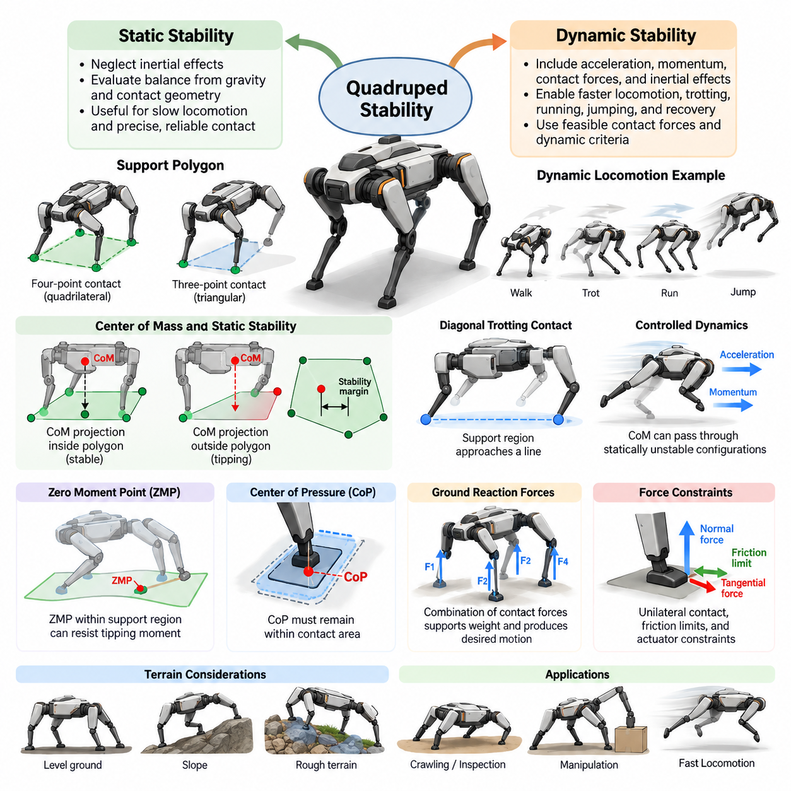
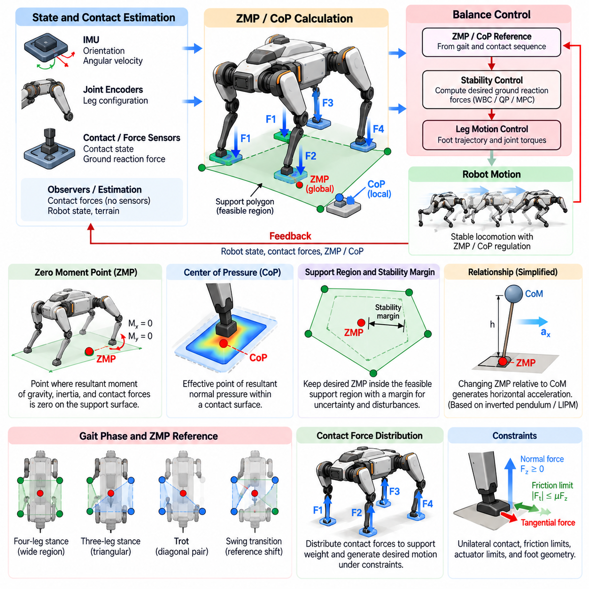
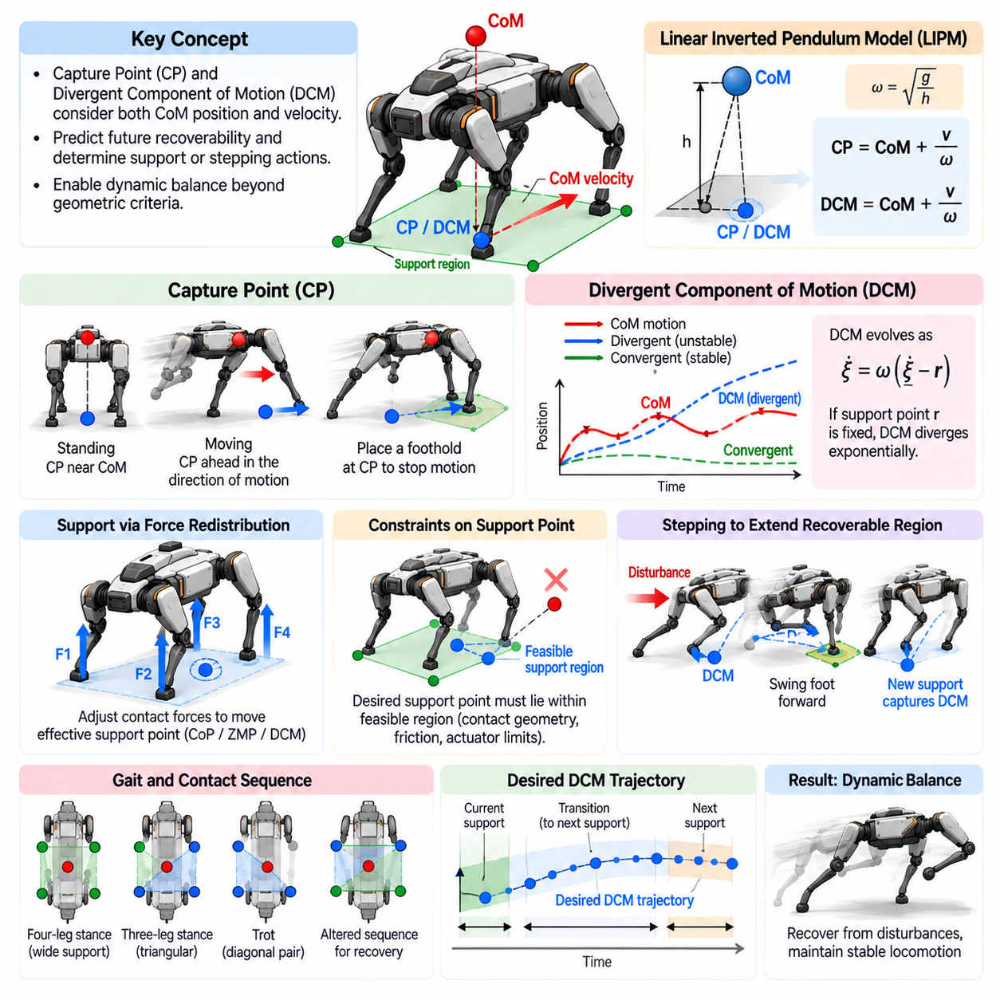
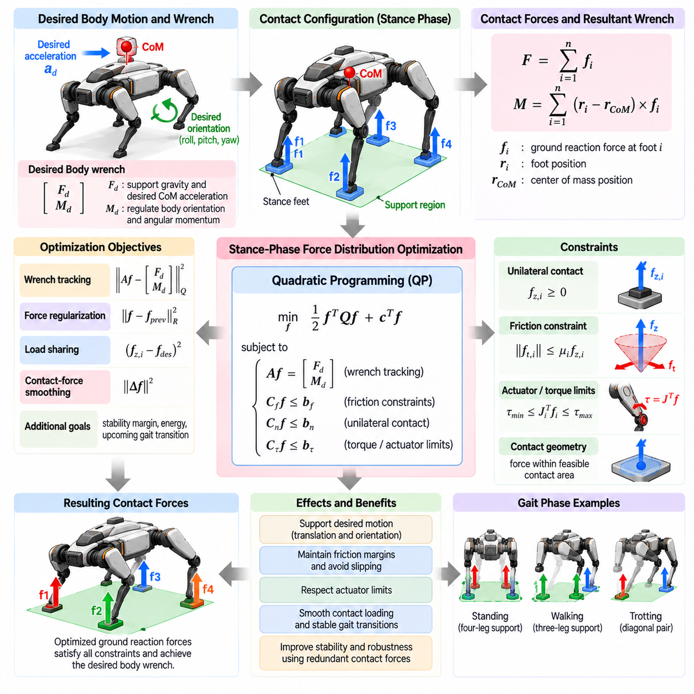
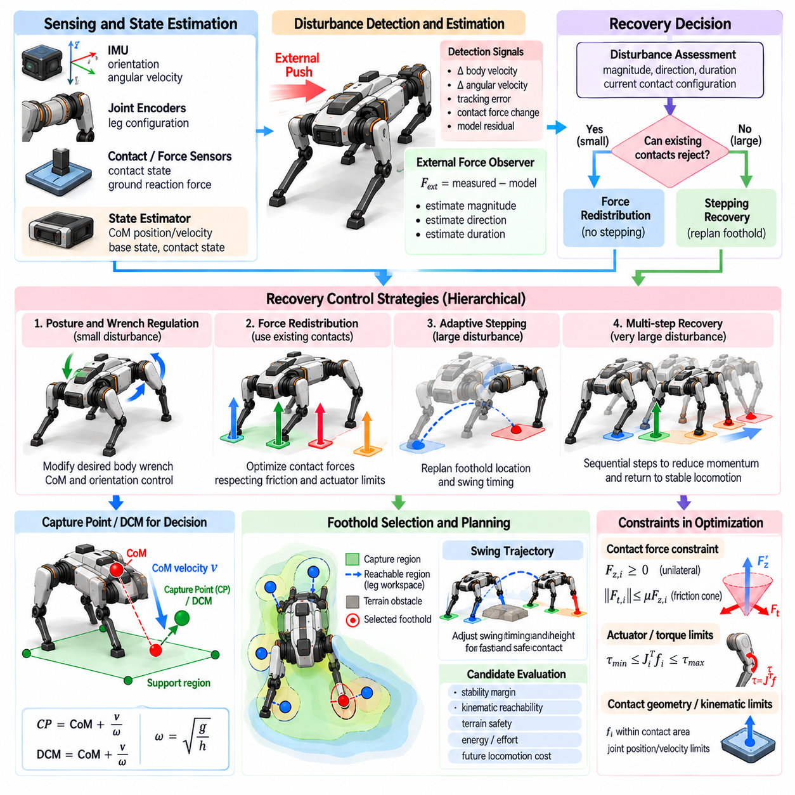
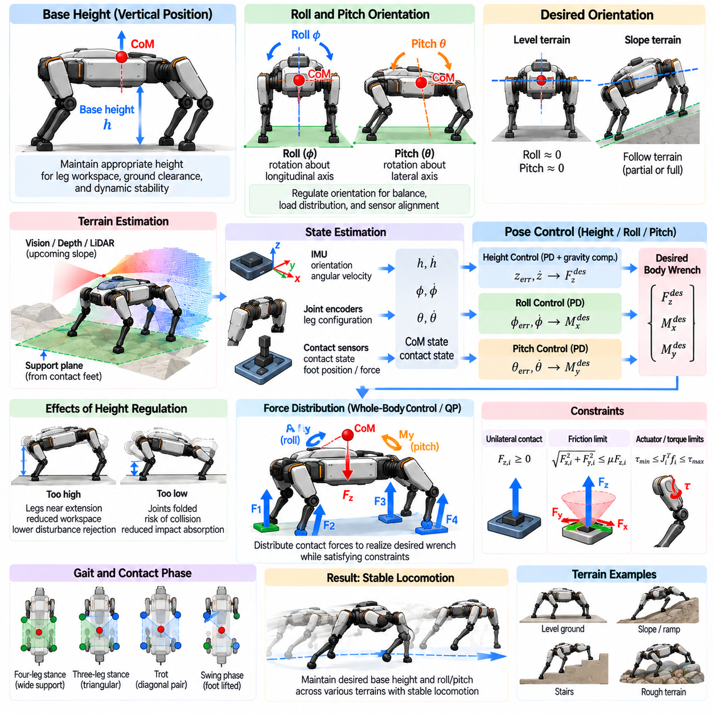
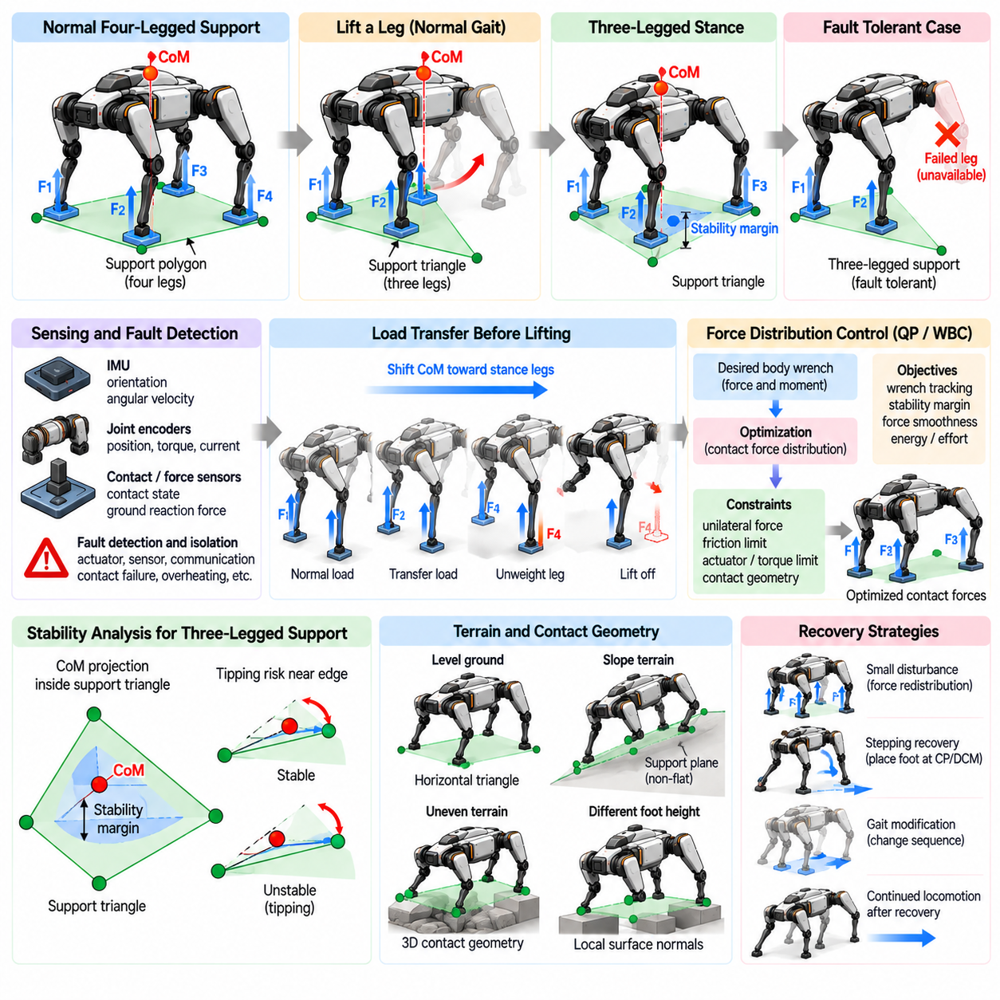
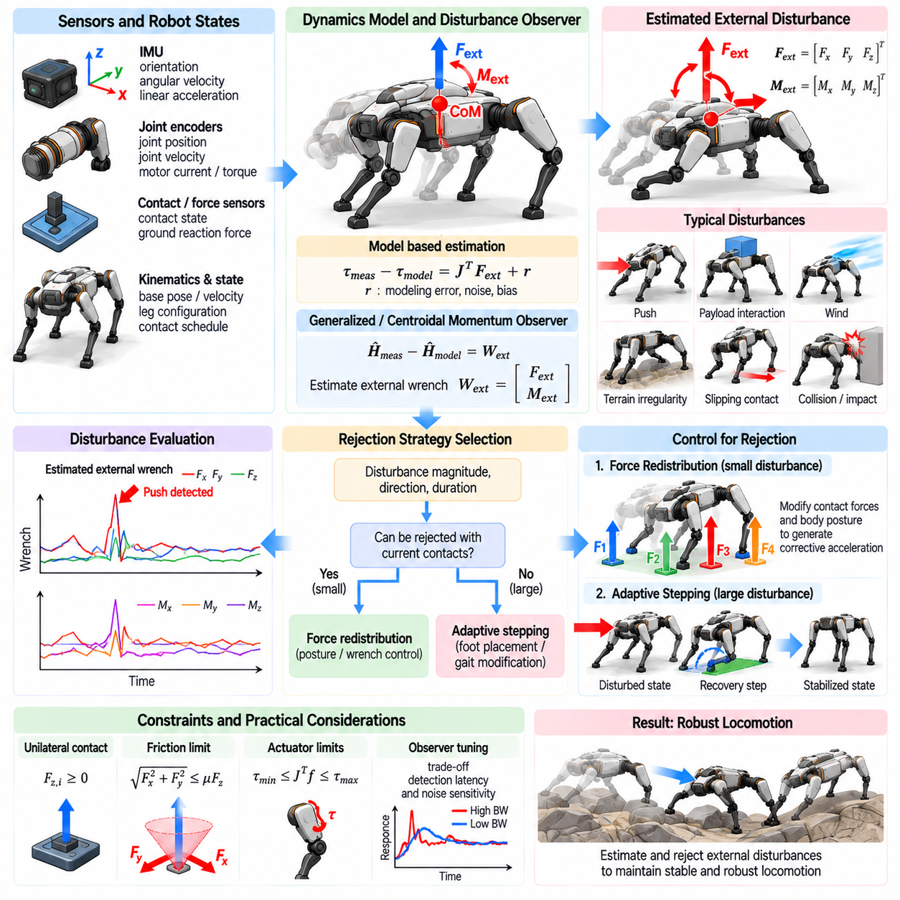
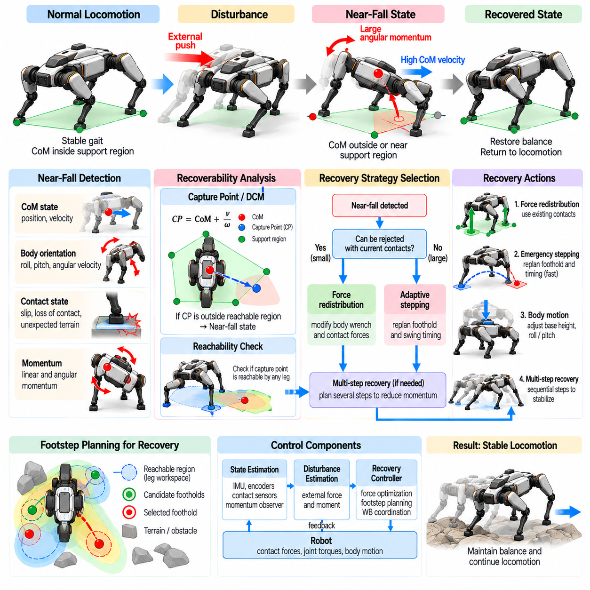
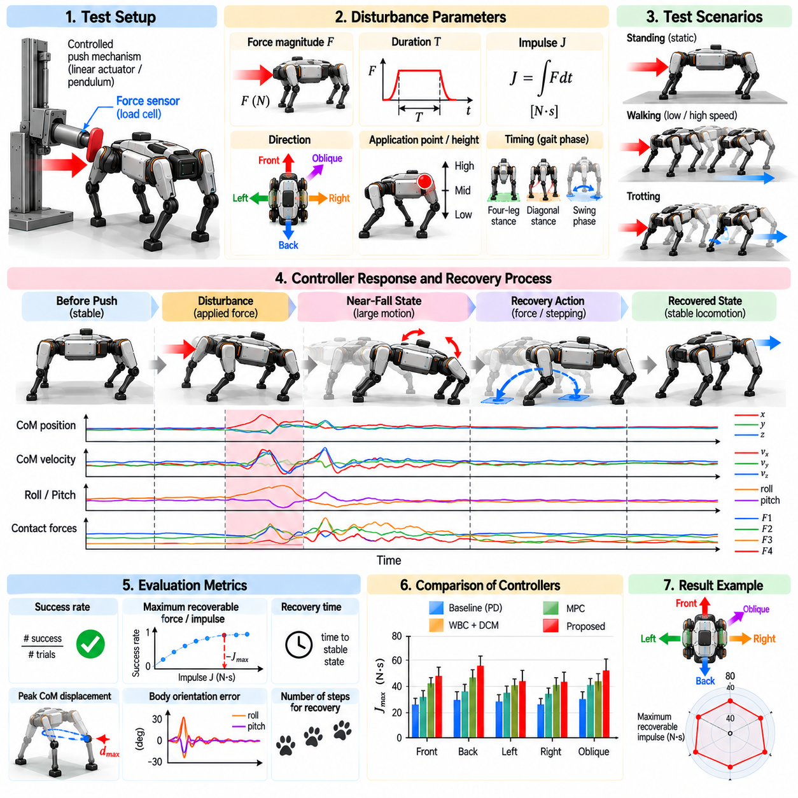

**Volume 21. Quadruped Robot Software**

# Chapter 05. Balance and Stability Control

## 05.01. Stability Criteria Static Dynamic for Quadruped

{width="7.268055555555556in" height="7.268055555555556in"}

안정성(Stability)은 사족보행 로봇(Quadruped Robot)의 이동에서 가장 기본적인 요구사항이다. 로봇은 서로 분리된 발 접촉점(Foot Contact)을 이용해 몸체가 넘어지지 않도록 지속적으로 유지해야 하기 때문이다. 바퀴형 로봇(Wheeled Robot)과 달리 사족보행 로봇은 보행하면서 접촉점을 반복적으로 생성하고 제거한다. 따라서 안정성 기준(Stability Criteria)은 현재의 몸체 상태와 접촉 구성이 균형(Balance)을 유지할 수 있는지를 판단하는 수학적 조건을 제공한다.

사족보행 로봇의 안정성은 일반적으로 정적 안정성(Static Stability)과 동적 안정성(Dynamic Stability)으로 구분된다. 정적 안정성은 관성 효과(Inertial Effect)가 충분히 작아 무시할 수 있다고 가정하며, 주로 중력(Gravity)과 지지 접촉점의 기하학적 구조를 이용하여 균형을 평가한다. 동적 안정성은 가속도(Acceleration), 운동량(Momentum), 접촉력(Contact Force), 관성 효과까지 고려하므로 빠른 보행, 트로팅(Trotting), 달리기, 점프 및 복구 동작을 설명할 수 있다.

지지 다각형(Support Polygon)은 정적 안정성 분석에서 가장 중요한 개념 중 하나이다. 지지 다각형은 현재 로봇을 지지하고 있는 발의 지면 접촉점(Ground Contact Point)을 연결하여 형성된다. 네 발이 평평한 지면에 모두 접촉하면 지지 다각형은 대략 사각형 형태가 된다. 크롤 보행(Crawl Gait) 중 한 다리가 스윙(Swing) 상태에 있다면 나머지 세 개의 지지 발은 일반적으로 삼각형 형태의 지지 다각형을 형성한다.

평탄한 지면에서 정적으로 균형을 유지하는 사족보행 로봇의 경우 질량중심(Center of Mass, CoM)의 수직 투영점(Vertical Projection)은 지지 다각형 내부에 유지되어야 한다. 질량중심 투영점이 다각형의 경계를 넘어가면 중력에 의해 해당 지지 경계를 중심으로 전복 모멘트(Tipping Moment)가 발생한다. 이때 로봇은 자세를 변경하거나 새로운 접촉점을 형성하거나 동적 움직임을 이용하여 넘어지는 것을 방지해야 한다.

질량중심 투영점을 단순히 지지 다각형 내부에 유지하는 것만으로는 해당 자세가 얼마나 강건한지를 판단하기 어렵다. 정적 안정성 여유(Static Stability Margin)는 질량중심 투영점과 지지 다각형의 가장 가까운 경계 사이의 거리를 나타낸다. 일반적으로 안정성 여유가 클수록 모델링 오차, 외란(Disturbance), 지형 불규칙성 및 작은 몸체 자세 변화에 대한 허용 능력이 높아진다.

정적 안정성은 크롤링(Crawling), 검사(Inspection), 조작(Manipulation), 불확실한 지형 통과와 같은 저속 이동에서 특히 유용하다. 사족보행 로봇은 하나의 발을 들어 올리기 전에 질량중심을 나머지 지지 다리 방향으로 의도적으로 이동시킬 수 있다. 이러한 방식은 이동 속도 측면에서는 보수적이지만 정확한 발판(Foothold)과 신뢰성 높은 지면 접촉이 속도보다 중요한 환경에서 예측 가능한 균형 동작을 제공한다.

실제 지형에서는 접촉점의 높이와 방향이 서로 다를 수 있기 때문에 정적 안정성 분석이 더욱 복잡해진다. 바위, 계단, 경사면 또는 불규칙한 지형에서는 단순한 수평 지지 다각형만으로 충분하지 않을 수 있다. 따라서 안정성 분석에서는 지지 평면(Support Plane) 또는 3차원 접촉 기하 구조(Three-Dimensional Contact Geometry)를 고려하고, 표면 법선(Surface Normal), 마찰 제약조건(Friction Constraint), 로봇 몸체에 대한 중력 방향 등을 함께 평가할 수 있다.

동적 이동(Dynamic Locomotion)은 일반적으로 질량중심 투영만으로 설명할 수 없다. 예를 들어 트로트 보행(Trot Gait)에서는 대각선 방향의 두 발만 지면에 접촉할 수 있으며, 이때 지지 영역은 거의 하나의 선에 가까워진다. 그러나 제어된 가속도와 운동량을 이용하면 정적으로는 불안정한 상태를 통과할 수 있으므로 질량중심이 모든 순간에 정적으로 지지될 필요는 없다.

영 모멘트 점(Zero Moment Point, ZMP)은 대표적인 동적 안정성 기준(Dynamic Stability Criterion)을 제공한다. ZMP는 중력과 관성력에 의해 발생하는 합성 전복 모멘트가 요구되는 모멘트 조건을 만족하는 지지 표면상의 점을 의미한다. ZMP가 실현 가능한 지지 영역(Feasible Support Region) 내부에 존재한다면, 주어진 모델 가정에서 접촉 구성이 회전 전복을 억제하는 데 필요한 힘을 이론적으로 생성할 수 있다.

ZMP 개념은 주로 근사적으로 평면 접촉을 갖는 다족 보행 연구에서 발전했지만 사족보행 로봇의 균형을 이해하는 데에도 유용하다. 그러나 접촉점이 적거나 비평면(Noncoplanar)이고, 미끄러짐이 발생하거나 접촉이 빠르게 변화하면 직접 적용하기 어려워진다. 따라서 현대의 사족보행 제어기(Quadruped Controller)는 기하학적인 ZMP 조건에만 의존하기보다 실현 가능한 접촉력(Feasible Contact Force)을 이용하여 안정성을 정의하는 경우가 많다.

압력중심(Center of Pressure, CoP)은 접촉 표면 내부에서 합성 지면반력(Resultant Ground Reaction Force)이 효과적으로 작용하는 위치를 나타낸다. 유한한 크기의 발을 사용하는 경우 발이 모서리를 중심으로 회전하지 않고 표면 접촉을 유지하려면 일반적으로 CoP가 실제 접촉 영역 내부에 존재해야 한다. 따라서 CoP 제약조건은 개별 발 접촉의 국부적인 실현 가능성을 나타내어 전체 몸체의 안정성 조건을 보완한다.

지면반력(Ground Reaction Force)은 동적 안정성에서 핵심적인 요소이다. 각각의 지지 발은 로봇의 무게를 지지하면서 원하는 몸체 가속도와 회전 운동을 발생시키는 힘을 생성한다. 제어기는 단방향 접촉 조건(Unilateral Contact Condition), 액추에이터 성능, 지형 형상 및 마찰 한계를 만족하면서 사용 가능한 접촉점 사이에 힘을 분배한다. 따라서 균형 문제는 제약조건을 갖는 힘 분배 문제(Constrained Force Allocation Problem)로 해석할 수 있다.

발은 지면을 밀어낼 수 있지만 일반적으로 지면을 당길 수는 없다. 따라서 접촉력의 법선 성분(Normal Component)은 단방향 제약조건(Unilateral Constraint)을 만족해야 한다. 접선 방향의 힘 역시 마찰에 의해 제한된다. 이러한 관계는 일반적으로 마찰 원뿔(Friction Cone) 또는 선형화된 마찰 피라미드(Friction Pyramid)를 이용하여 표현하며, 이는 미끄러짐 없이 생성할 수 있는 접촉력의 범위를 정의한다.

질량중심 동역학 모델(Centroidal Dynamics Model)은 동적 균형을 분석하기 위한 효율적인 표현 방법을 제공한다. 모든 관절을 개별적으로 모델링하는 대신 로봇의 질량중심을 기준으로 전체 선형 운동량(Linear Momentum)과 각운동량(Angular Momentum)의 변화를 표현한다. 접촉력과 모멘트 암(Moment Arm)은 운동량의 변화를 결정하며, 이를 통해 계획된 몸체 운동과 물리적으로 실현 가능한 지지력을 직접 연결할 수 있다.

각운동량(Angular Momentum)은 공격적인 동적 이동(Aggressive Locomotion)에서 특히 중요해진다. 사족보행 로봇은 몸통을 회전시키고 다리의 위치를 변경하며 접촉력을 재분배하여 몸체 방향을 제어할 수 있다. 따라서 안정성은 몸통을 항상 완전히 수평으로 유지하는 것을 의미하지 않는다. 달리기, 점프, 외란 억제 및 접촉 구성 전환 과정에서는 의도적으로 각운동량을 변화시킬 수 있다.

또 다른 중요한 개념인 캡처 포인트(Capture Point)는 현재의 운동을 감쇠하거나 방향을 변경하여 넘어지는 것을 방지하기 위해 어느 위치에 새로운 지지점을 형성해야 하는지를 나타낸다. 외란으로 로봇이 밀렸을 경우 질량중심을 기존 지지 영역으로 복귀시키는 것만으로는 충분하지 않을 수 있다. 대신 로봇은 움직이는 방향으로 발을 내디뎌 새로운 지지 구성을 형성해야 할 수 있다.

캡처 포인트 개념은 정적 균형(Static Balance)과 동적 균형(Dynamic Balance)의 중요한 차이를 보여준다. 정적 안정성은 현재의 지지 기하 구조가 평형 상태(Equilibrium)를 유지할 수 있는지를 평가한다. 반면 동적 안정성은 미래의 운동과 접촉력을 이용하여 변화하는 로봇 상태를 복구 가능한 상태(Recoverable State)로 유지할 수 있는지를 평가한다. 따라서 동적 안정성 제어기는 위치뿐 아니라 속도와 운동량도 함께 고려한다.

현대의 사족보행 로봇은 미래 시간 구간에서 안정성을 평가하기 위해 모델 예측 제어(Model Predictive Control, MPC)를 자주 사용한다. MPC는 물리적 제약조건을 적용하면서 질량중심 운동, 몸체 방향, 접촉 일정(Contact Schedule), 지면반력을 예측한다. 단일 순간의 자세만으로 안정성을 판단하는 대신 균형을 유지하면서 이동 목표를 추종할 수 있는 일련의 실현 가능한 제어 행동을 탐색한다.

전신 제어(Whole-Body Control, WBC)는 이러한 계획 과정을 보완하여 원하는 몸체 운동과 접촉력을 관절 수준의 명령으로 변환한다. 제어기는 스윙 다리를 조정하고 몸체 자세를 제어하며 관절 토크와 가속도 제한을 만족하는 동시에 지지 다리의 접촉 제약조건을 충족해야 한다. 따라서 안정성 기준은 전역 운동 계획(Global Motion Planning)부터 접촉력 최적화와 액추에이터 제어까지 여러 계층에서 작동한다.

외란 억제(Disturbance Rejection)는 수학적인 평형 조건을 넘어 실제적인 안정성을 평가하는 중요한 척도이다. 외부 충격, 탑재물의 이동, 발 위치 오차, 불규칙한 지형 및 부정확한 상태 추정은 모두 로봇을 기준 궤적에서 벗어나게 만들 수 있다. 강건한 사족보행 로봇은 이러한 편차를 감지하고 균형 회복이 불가능해지기 전에 힘 재분배, 몸체 조정, 스윙 다리 수정 또는 비상 스텝(Emergency Step)을 수행한다.

따라서 상태 추정(State Estimation)은 안정성 제어와 분리할 수 없다. 제어기는 몸체 방향, 각속도, 선속도, 관절 상태, 발 접촉 상태 및 필요한 경우 지형 형상에 대한 신뢰성 높은 추정값을 요구한다. 관성측정장치(Inertial Measurement Unit, IMU), 관절 인코더(Joint Encoder), 힘 센서(Force Sensor), 비전(Vision), 라이다(LiDAR) 등은 상호 보완적인 정보를 제공할 수 있다. 접촉 상태나 몸체 속도의 추정 오류는 정상적인 안정성 제어기에서도 부적절한 행동을 발생시킬 수 있다.

발 접촉 전환(Foot-Contact Transition)은 실현 가능한 지지 영역과 힘 영역이 급격하게 변화하기 때문에 특히 민감한 순간이다. 지지 발을 들어 올리기 전에 제어기는 하중을 나머지 접촉점으로 재분배해야 한다. 새롭게 놓인 발을 지지점으로 사용하기 전에는 실제 접촉이 이루어졌는지와 충분한 마찰력이 존재하는지를 판단해야 한다. 부드러운 접촉 전환은 힘의 불연속성을 감소시키고 전체적인 이동 강건성(Locomotion Robustness)을 향상시킨다.

안정성 기준은 보행 패턴(Gait)에 따라서도 크게 달라진다. 크롤 보행은 대부분의 보행 주기에서 양의 정적 안정성 여유를 유지할 수 있지만 트로트 보행은 의도적으로 정적 안정성 여유가 거의 없거나 존재하지 않는 구성을 사용한다. 바운딩(Bounding)과 갤로핑(Galloping)은 더욱 강한 동적 효과를 이용하며 지면과 접촉하지 않는 비행 구간(Flight Phase)을 포함할 수도 있다. 따라서 하나의 기하학적 규칙을 모든 상황에 적용하기보다 이동 형태에 적합한 안정성 기준을 사용해야 한다.

지형 불확실성(Terrain Uncertainty)은 안정성의 의미를 더욱 변화시킨다. 계획된 발판이 움직이거나 변형될 수 있으며 예상보다 낮은 마찰력을 제공할 수도 있다. 따라서 강건 제어기(Robust Controller)는 마찰 한계, 접촉력 범위 및 운동학적 제약조건 주변에 안전 여유(Safety Margin)를 유지한다. 또한 인지 기반 이동(Perception-Aware Locomotion)은 도달 가능한 모든 위치를 동일하게 취급하지 않고 추정된 경사도, 거칠기, 순응성(Compliance), 통과 가능성(Traversability)을 기반으로 발판을 선택할 수 있다.

탑재물(Payload)과 조작 작업은 사족보행 로봇의 질량중심을 크게 이동시키고 관성 특성을 변화시킬 수 있다. 장비 운반, 로봇팔 작동 또는 물체 견인은 균형 유지에 필요한 힘을 변화시킨다. 따라서 이러한 영향이 큰 경우 안정성 분석은 로봇과 탑재물을 결합한 동역학(Combined Robot-Payload Dynamics)을 사용해야 하며, 특히 탑재물이 크거나 로봇 몸체에 대해 상대적으로 움직이는 경우 더욱 중요하다.

에너지 효율(Energy Efficiency)과 안정성은 때때로 서로 상충하는 목표를 형성할 수 있다. 큰 정적 안정성 여유를 유지하려면 불필요한 몸체 이동이 요구될 수 있으며, 공격적인 동적 이동은 높은 최대 접촉력과 빠른 액추에이터 응답을 요구할 수 있다. 실제 제어기는 가중 최적화 목적함수(Weighted Optimization Objective)와 적절한 제약 여유를 이용하여 안정성, 속도, 에너지 소비, 추종 정확도, 액추에이터 한계 및 지형 안전성 사이의 균형을 조정한다.

실용적인 안정성 아키텍처(Stability Architecture)는 하나의 지표에만 의존하기보다 여러 기준을 결합한다. 지지 기하 구조는 저속 이동에서 직관적인 안전 척도를 제공하고, 마찰 제약조건은 접촉의 실현 가능성을 검증하며, 질량중심 동역학은 운동량 변화를 표현한다. 여기에 예측 최적화(Predictive Optimization)를 적용하면 미래의 복구 가능성을 평가할 수 있으며, 이러한 방법을 함께 사용함으로써 다양한 운용 조건에서 사족보행 균형을 더욱 완전하게 설명할 수 있다.

궁극적으로 사족보행 로봇의 안정성은 특정 자세에 고정된 특성이 아니라 몸체 상태, 운동량, 지형, 접촉, 힘 및 미래 행동 사이에서 지속적으로 관리되는 관계이다. 정적 안정성 기준은 현재 접촉 기하 구조가 중력을 지지할 수 있는지를 설명하고, 동적 안정성 기준은 제어된 힘과 계획된 접촉을 이용하여 움직이는 시스템을 안정하거나 복구 가능한 궤적(Recoverable Trajectory)으로 유도할 수 있는지를 결정한다.

정적 안정성과 동적 안정성을 함께 이해하는 것은 고급 사족보행 이동 제어(Advanced Quadruped Locomotion Control)의 기반을 형성한다. 저속 지형 통과에서는 질량중심 투영과 정적 안정성 여유를 중시할 수 있지만, 고성능 이동에서는 운동량 제어, 마찰을 고려한 힘 최적화, 예측 제어 및 능동적인 스테핑(Active Stepping)이 필요하다. 고성능 사족보행 로봇은 실현 가능한 접촉과 복구 가능한 운동을 유지하면서 이러한 안정성 영역 사이를 지속적으로 전환한다.

## 05.02. ZMP and CoP Based Balance Controller [w/Code]

{width="7.268055555555556in" height="7.268055555555556in"}

영 모멘트 점(Zero Moment Point, ZMP)과 압력중심(Center of Pressure, CoP)은 사족보행 로봇(Quadruped Robot)이 지면과 상호작용하면서 균형을 제어하는 데 사용되는 밀접하게 관련된 개념이다. ZMP 및 CoP 기반 제어기는 몸체 자세만을 고려하는 것이 아니라 현재의 지지 영역(Support Region)을 통해 중력, 관성력 및 접촉력이 어떻게 작용하는지를 평가하고, 동역학적으로 실현 가능한 균형을 유지하도록 로봇의 움직임을 조정한다.

영 모멘트 점(Zero Moment Point, ZMP)은 지지 표면(Support Surface)에서 정의되며, 중력, 관성 및 접촉 반력에 의해 생성되는 합성 모멘트(Resultant Moment)의 수평 성분이 영 모멘트 조건(Zero-Moment Condition)을 만족하는 지점을 의미한다. 계산된 ZMP가 허용 가능한 지지 영역 내부에 유지되면, 가정된 접촉 모델에서 로봇은 제어되지 않는 회전 전복을 방지할 수 있는 접촉 렌치(Contact Wrench)를 일반적으로 생성할 수 있다.

압력중심(Center of Pressure, CoP)은 접촉 표면에서 합성 법선 압력 분포(Resultant Normal Pressure Distribution)가 효과적으로 작용하는 지점을 나타낸다. 강체 평면 발(Rigid Flat Foot)의 경우 CoP는 물리적인 접촉 영역 내부에 유지되어야 한다. CoP가 모서리에 가까워질수록 사용 가능한 복원 모멘트(Restoring Moment)는 감소하며, 경계를 벗어나려고 하면 발이 모서리를 중심으로 회전하여 기존의 표면 접촉 조건이 더 이상 유효하지 않을 수 있다.

ZMP와 CoP는 단순화된 조건에서 서로 동일한 의미로 사용되기도 하지만 모든 상황에서 동일한 개념은 아니다. 접촉면이 평면이고 강체이며 적절하게 모델링된 경우 두 위치는 일치하거나 밀접한 관계를 가질 수 있다. 그러나 일반적인 사족보행에서는 다중 접촉(Multiple Contact), 비동일 평면 지형(Noncoplanar Terrain), 발의 형상, 접선력(Tangential Force), 외부 모멘트 등을 고려해야 하므로 전역 균형량(Global Balance Quantity)과 국부 압력 거동(Local Pressure Behavior)을 주의해서 구분해야 한다.

균형 제어기(Balance Controller)는 로봇 상태를 추정하고 활성 접촉 구성(Active Contact Configuration)을 식별하는 것에서 시작한다. 몸체 방향과 각속도는 일반적으로 관성측정장치(Inertial Measurement Unit, IMU)를 통해 얻고, 관절 인코더(Joint Encoder)는 다리의 구성을 제공한다. 접촉 센서, 힘 센서, 모터 토크 추정 또는 관측기(Observer)는 어떤 발이 몸체를 지지하고 있는지를 판단하며, 이러한 추정값으로 이후 ZMP 및 CoP 계산에 사용되는 지지 기하 구조를 구성한다.

여러 발이 동시에 지면과 접촉하는 경우 각각의 접촉 영역은 전체적으로 실현 가능한 지지 영역(Feasible Support Region)을 정의한다. 점 형태의 발(Point Foot) 모델에서는 접촉 위치를 이용하여 이 영역을 근사할 수 있으며, 유한한 크기의 발은 추가적인 국부 압력 영역을 제공한다. 일반적으로 제어기는 불확실성, 외란 및 불완전한 지형 추정을 고려한 안정성 여유(Stability Margin)를 설정하여 목표 ZMP가 위험한 경계에서 충분히 떨어져 있도록 유지해야 한다.

적절한 센서를 사용할 수 있다면 측정되거나 추정된 CoP는 지면반력(Ground Reaction Force)과 접촉 모멘트(Contact Moment)를 이용하여 계산할 수 있다. 센서가 장착된 발에서는 압력 또는 힘-토크 측정(Force-Torque Measurement)을 통해 접촉 표면에서 하중이 어떻게 분포하는지 파악할 수 있다. 전용 힘 센서가 없는 로봇에서는 액추에이터 토크, 관절 동역학, 상태 관측기 또는 최적화 기반 전신 추정(Whole-Body Estimation)을 통해 접촉력을 추정할 수 있다.

균형 제어의 목적은 일반적으로 몸체 운동과 합성 지면반력이 작용하는 위치 사이의 원하는 관계로 표현된다. 로봇 몸체가 목표 상태에서 벗어나기 시작하면 제어기는 목표 ZMP 또는 CoP를 이동시켜 생성되는 접촉력이 보정 가속도(Corrective Acceleration)를 발생시키도록 한다. 따라서 균형 조절은 단순히 기하학적으로 몸체를 중앙에 유지하는 것이 아니라 지면반력을 능동적으로 형성하는 과정에 기반한다.

단순화된 역진자 모델(Inverted Pendulum Model)은 이러한 관계를 직관적으로 이해하는 데 유용하다. 로봇의 몸체는 지지 표면 위에 위치한 집중 질량(Concentrated Mass)으로 근사되고, 다리는 합성 지지력이 작용하는 위치를 조절한다. 질량중심(Center of Mass, CoM)에 대한 ZMP의 위치를 변화시키면 수평 가속도를 조절할 수 있다. 이러한 원리는 많은 균형 제어기와 예측 보행 방법의 기초가 된다.

선형 역진자 모델(Linear Inverted Pendulum Model, LIPM)은 질량중심 높이가 거의 일정하고 각운동량(Angular Momentum)의 거동이 제한된다고 가정하여 동역학을 더욱 단순화한다. 이러한 가정에서는 수평 방향의 질량중심 운동을 ZMP 위치와 직접 연결할 수 있다. 실제 사족보행 로봇은 거친 지형을 이동할 때 이러한 가정을 완전히 만족하지 않지만, LIPM은 계획, 분석 및 계산 효율적인 균형 제어에서 여전히 유용하다.

ZMP 기준 궤적(Reference Trajectory)은 계획된 보행 패턴(Gait)과 예상되는 접촉 순서(Contact Sequence)를 이용하여 생성할 수 있다. 네 다리가 모두 지지하는 상태에서는 기준점을 지지 영역 내부에 충분히 유지할 수 있다. 한 다리가 스윙 상태로 전환되면 기준점은 나머지 발이 형성하는 지지 영역으로 이동해야 한다. 트로트 보행(Trot Gait)에서는 주된 지지가 대각선 방향의 두 다리에 의해 제공되므로 실현 가능한 지지 영역이 좁아져 동적 제어가 더욱 어려워진다.

목표 ZMP가 급격하게 변화하면 비현실적인 지면반력 변화가 필요할 수 있으므로 부드러운 기준 전환(Smooth Reference Transition)이 중요하다. 따라서 궤적 생성기(Trajectory Generator)는 접촉 시점, 몸체 속도 및 힘의 한계를 고려하면서 목표 지지점을 보간한다. 발을 들어 올리기 전에 해당 발의 하중이 제거되고, 새롭게 접촉한 발에는 착지 후 하중이 점진적으로 전달될 수 있도록 충분히 이른 시점부터 전환을 시작해야 한다.

로봇이 유한한 크기의 발 표면을 가지고 있는 경우 CoP 제어는 보다 직접적인 접촉 수준에서 작동한다. 필요한 하중 분포에 따라 각각의 지지 발 내부에 목표 CoP를 지정할 수 있다. 이후 제어기는 발목 토크(Ankle Torque), 다리 힘 또는 전신 렌치(Whole-Body Wrench)를 조절하여 측정된 압력중심이 기준값을 추종하도록 한다. 이러한 방식은 국부적인 발 회전에 대한 저항성을 높이고 자세 제어 성능을 향상시킬 수 있다.

많은 사족보행 로봇은 비교적 작거나 점 형태에 가까운 발을 사용하며 구동형 발목(Actuated Ankle)이 없는 경우가 많다. 이러한 시스템에서는 휴머노이드 로봇(Humanoid Robot)에 비해 발 내부의 국부적인 CoP 조절 능력이 제한된다. 대신 여러 다리 사이의 힘을 재분배하고 몸체 가속도를 변화시키며 발 위치를 조정하여 균형을 유지한다. 그럼에도 전역 합성 CoP(Global Resultant CoP) 또는 이에 대응하는 지지력 작용 위치는 전체 접촉 거동을 분석하는 데 유용하다.

힘 분배(Force Distribution)는 일반적으로 제약조건이 있는 최적화 문제(Constrained Optimization Problem)로 구성된다. 원하는 몸체 렌치(Body Wrench)를 여러 지지 다리에 분배하면서 힘 평형, 마찰 제약조건, 단방향 접촉 조건 및 액추에이터 한계를 만족시킨다. 이렇게 계산된 접촉력은 유효 ZMP 또는 CoP를 결정한다. 최적화를 사용하면 균형 요구사항을 자세 추종, 에너지 감소, 부드러운 힘 변화 및 강건성 목표와 함께 고려할 수 있다.

수학적으로 적절한 ZMP가 항상 실제로 해당 힘을 생성할 수 있음을 의미하지는 않기 때문에 마찰 제약조건(Friction Constraint)은 필수적이다. 합성 지지점이 지지 영역 내부에 있더라도 과도한 수평력이 발생하면 지지 발이 미끄러질 수 있다. 따라서 제어기는 마찰 원뿔(Friction Cone) 또는 마찰 피라미드(Friction Pyramid) 제약조건을 적용하여 계획된 접촉력이 추정된 지면 마찰 조건을 만족하도록 한다.

모델 예측 제어(Model Predictive Control, MPC)는 유한한 예측 구간에서 미래의 질량중심 상태와 지지 조건을 예측하기 때문에 ZMP 기반 균형 조절을 위한 강력한 프레임워크를 제공한다. 최적화 과정에서 향후 ZMP 기준값, 지면반력 또는 몸체 가속도를 선택하면서 예정된 접촉 변화를 고려할 수 있다. 예측 제어는 이동 과정에서 실현 가능한 지지 영역이 빠르게 변화할 때 특히 유용하다.

전신 제어(Whole-Body Control, WBC)는 상위 수준의 계획기에서 생성된 균형 명령을 실행할 수 있다. 목표 질량중심 가속도, 몸체 방향 및 지지력을 운동학적·동역학적 제약조건을 만족하면서 관절 토크 또는 관절 가속도로 변환한다. ZMP 또는 CoP 목표는 이러한 최적화 문제에 직접 포함될 수도 있으며, 최적화된 접촉력 분배의 결과로 간접적으로 나타날 수도 있다.

모델 기반 기준값만으로는 외란과 추정 오차를 보상할 수 없으므로 피드백(Feedback)이 필요하다. 제어기는 측정된 몸체 상태, 접촉력 및 압력 정보를 목표값과 비교하여 보정 명령을 생성한다. 위치, 속도, 방향 및 운동량 피드백을 이용하여 목표 지지 렌치(Desired Support Wrench)를 수정함으로써 지나치게 공격적인 반응 없이 로봇을 계획된 동적 상태로 복귀시킬 수 있다.

외부 외란(External Disturbance)은 ZMP와 CoP 피드백의 실제적인 역할을 잘 보여준다. 측면에서 가해진 충격으로 몸체가 가속되면 제어기는 지면반력을 재분배하여 유효 지지점이 복원 가속도(Restoring Acceleration)를 발생시키는 방향으로 이동하도록 할 수 있다. 필요한 지점이 실현 가능한 영역 내부에 있다면 발을 옮기지 않고 균형을 회복할 수 있지만, 더 큰 외란은 현재의 지지 능력을 초과하여 새로운 스텝이 필요할 수 있다.

이러한 한계 때문에 스테핑 제어(Stepping Control)와의 통합이 중요하다. ZMP와 CoP 조절은 필요한 지면반력을 현재 접촉점으로 생성할 수 있는 동안에만 효과적이다. 예측된 균형점이 실현 가능한 경계에 접근하거나 이를 초과한다면 제어기는 다음 발판 위치(Foothold)를 수정하여 미래의 지지 영역을 확대하거나 재배치할 수 있다. 이때 균형 제어는 힘 조절과 접촉 계획(Contact Planning)이 결합된 과정이 된다.

불규칙한 지형에서는 발이 서로 다른 방향과 높이를 가진 표면에 접촉할 수 있기 때문에 추가적인 복잡성이 발생한다. 접촉점들이 강하게 비동일 평면을 형성하면 단일 평면 ZMP 표현의 정확성이 낮아진다. 이 경우 제어기는 투영 지지 평면(Projected Support Plane), 접촉 렌치 원뿔(Contact Wrench Cone), 질량중심 동역학(Centroidal Dynamics) 또는 직접적인 힘 최적화를 사용하면서 필요한 경우 ZMP와 CoP를 유용한 진단 또는 기준 변수로 유지할 수 있다.

접촉 불확실성(Contact Uncertainty) 역시 고려해야 한다. 몸체를 지지한다고 가정한 발이 부분적으로 미끄러지거나 예상하지 못한 위치의 장애물과 접촉하거나 안정적인 접촉을 형성하지 못할 수 있다. 이러한 발을 지지 모델에 포함하면 잘못된 ZMP 추정과 위험한 힘 명령이 발생할 수 있다. 강건 제어기(Robust Controller)는 접촉 신뢰도(Contact Confidence)를 지속적으로 갱신하고 측정된 힘이 계획된 접촉 상태와 일치하지 않을 경우 신속하게 하중을 재분배한다.

힘, 토크 및 압력 측정에는 일반적으로 노이즈와 구조적 진동이 포함되므로 센서 필터링(Sensor Filtering)이 필요하다. 그러나 지나친 필터링은 시간 지연을 발생시켜 빠른 균형 제어 응답을 저하시킬 수 있다. 따라서 실제 시스템에서는 적절하게 필터링된 측정값과 동적 관측기(Dynamic Observer), 상태 추정기(State Estimator)를 함께 사용한다. 균형 제어의 대역폭(Control Bandwidth)은 센서 품질, 액추에이터 동역학, 기계적 순응성(Mechanical Compliance), 통신 지연과 일관되게 선정해야 한다.

탑재물(Payload)의 변화는 질량중심 위치뿐 아니라 몸체 가속도와 필요한 접촉력 사이의 관계도 변화시킨다. 무거운 탑재물이 비대칭적으로 장착된 경우 무부하 로봇을 기준으로 설계된 ZMP 제어기에는 지속적인 편향이 발생할 수 있다. 따라서 정확한 질량 특성(Mass Property) 추정 또는 온라인 적응(Online Adaptation)은 특히 매니퓰레이터, 센서, 화물 또는 동적으로 움직이는 장비를 운반하는 사족보행 로봇의 균형 성능을 향상시킨다.

잘 설계된 ZMP 및 CoP 기반 제어기는 모든 순간에 안정성 여유를 최대화하려고 해서는 안 된다. 이러한 접근은 이동을 불필요하게 제한하고 목표 속도나 기동성과 충돌할 수 있다. 대신 제어기는 제어된 동적 운동을 허용하면서 충분한 안정성 여유를 유지해야 한다. 안전 여유는 보행 패턴, 지형 신뢰도, 탑재물, 속도 및 예상되는 외란 수준에 따라 조정할 수 있다.

가장 효과적인 아키텍처는 ZMP와 CoP를 균형에 대한 완전한 설명으로 사용하는 것이 아니라 보다 광범위한 접촉 안정성 프레임워크(Contact-Stability Framework)의 구성 요소로 취급한다. ZMP는 몸체 동역학과 지지 기하 구조 사이의 관계를 직관적으로 표현하며, CoP는 합성 압력이 실제 접촉점을 통해 어떻게 작용하는지를 나타낸다. 강건한 사족보행을 위해서는 마찰 실현 가능성, 운동량 동역학, 액추에이터 성능 및 미래 발판도 함께 고려해야 한다.

이러한 통합적인 접근법을 통해 균형 제어는 몸체 운동을 감지하고, 접촉 상태를 추정하며, 실현 가능한 지지 거동을 예측하고, 지면반력을 분배하며, 미래의 스텝을 수정하는 연속적인 과정이 된다. ZMP와 CoP는 이러한 과정들을 연결하는 중요한 물리량을 제공한다. 예측 제어(Predictive Control) 및 전신 최적화(Whole-Body Optimization)와 결합하면 정적 영역과 동적 영역을 모두 포괄하는 안정적인 사족보행 이동을 위한 실용적인 기반을 제공한다.

## 05.03. Capture Point and DCM for Quadruped Balance [w/Code]

{width="7.268055555555556in" height="7.268055555555556in"}

캡처 포인트(Capture Point)와 발산 운동 성분(Divergent Component of Motion, DCM)은 사족보행 로봇(Quadruped Robot)의 동적 균형(Dynamic Balance)을 이해하기 위한 강력한 개념을 제공한다. 순수한 기하학적 안정성 기준과 달리 이들은 질량중심(Center of Mass, CoM)의 위치뿐 아니라 속도까지 명시적으로 고려한다. 따라서 제어기는 로봇이 현재 지지되고 있는지뿐만 아니라 현재의 움직임을 실현 가능한 접촉 행동(Contact Action)을 통해 정지, 전환 또는 복구할 수 있는지도 판단할 수 있다.

캡처 포인트(Capture Point, CP)는 단순화된 동역학 모델에서 질량중심의 움직임을 균형 상태로 유도하기 위해 로봇이 유효 지지점(Effective Support Point)을 형성하거나 발을 디뎌야 하는 위치를 나타낸다. 정지한 로봇은 질량중심 근처에 지지점이 필요할 수 있지만, 움직이는 로봇은 일반적으로 운동량(Momentum)을 흡수하기 위해 이동 방향으로 변위된 위치에 지지점을 형성해야 한다.

이 개념은 질량중심의 투영만으로 동적 이동(Dynamic Locomotion)을 설명하기에 충분하지 않은 이유를 보여준다. 로봇의 질량중심 투영점이 지지 영역(Support Region) 내부에 있더라도 매우 빠르게 움직이고 있다면 곧 복구 불가능한 상태에 도달할 수 있다. 반대로 질량중심 투영점이 정적으로 안정한 영역을 일시적으로 벗어나더라도 적절한 운동량과 미래의 발 배치(Foot Placement)를 이용하면 넘어지지 않고 성공적으로 균형을 회복할 수 있다.

캡처 포인트 분석의 일반적인 수학적 기반은 선형 역진자 모델(Linear Inverted Pendulum Model, LIPM)이다. 로봇은 지지 표면 위에서 거의 일정한 높이를 유지하며 움직이는 점 질량(Point Mass)으로 근사된다. 이러한 가정에서 수평 방향의 질량중심 동역학에는 불안정 성분(Unstable Component)이 포함되며, 그 변화는 질량중심 위치와 속도, 중력 및 유효 지지점에 의해 결정된다.

질량중심 높이가 일정한 경우 특성 진자 주파수(Characteristic Pendulum Frequency)는 일반적으로 중력가속도를 질량중심 높이로 나눈 값의 제곱근으로 표현된다. 이때 캡처 포인트는 개념적으로 질량중심 위치에 수평 속도를 이 주파수로 나눈 값을 더한 것으로 표현할 수 있다. 따라서 속도가 증가할수록 필요한 캡처 위치는 이동 방향으로 더 멀어지게 된다.

발산 운동 성분(Divergent Component of Motion, DCM)은 이러한 동적 상태 표현을 일반화한 개념이다. DCM은 역진자 동역학에서 불안정하거나 발산하는 성분을 수렴 성분(Convergent Component)과 분리한다. 발산 성분은 로봇이 복구 가능한 균형 상태에서 멀어지는지를 결정하므로 DCM을 제어하면 동적 안정성(Dynamic Stability)을 직접적으로 조절할 수 있다.

표준적인 일정 높이 LIPM 가정에서 DCM은 순간적인 캡처 포인트(Instantaneous Capture Point)와 동일한 기본 표현을 갖는다. 그러나 두 용어는 서로 다른 해석을 강조한다. 캡처 포인트는 움직임을 정지시키기 위해 지지점을 어디에 형성해야 하는지에 초점을 두는 반면, DCM은 접촉력, 지지점 조절 또는 미래의 스테핑(Stepping)을 통해 지속적으로 제어해야 하는 시간에 따라 변화하는 불안정 상태에 초점을 둔다.

DCM 동역학은 DCM과 유효 지지점 사이의 관계를 이용하여 미래의 변화를 예측할 수 있기 때문에 특히 유용하다. DCM이 지지점에서 벗어난 상태에서 지지점이 고정되어 있으면 발산 상태는 지수적으로 멀어지는 경향을 보인다. 따라서 제어기는 DCM이 물리적으로 복구 가능한 영역을 벗어나기 전에 지지력을 조절하거나 접촉 상태를 변경해야 한다.

사족보행 로봇이 다중 다리 지지 상태(Multi-Leg Stance)에 있을 때는 지지 다리 사이에서 지면반력(Ground Reaction Force)을 재분배하여 유효 지지점을 조절할 수 있다. 필요한 DCM 보정량이 비교적 작다면 발을 이동하지 않고도 균형을 회복할 수 있다. 제어기는 합성 지지력(Resultant Support Force)을 변경하여 질량중심 가속도가 발산 운동을 목표 궤적 방향으로 다시 유도하도록 한다.

사용 가능한 힘의 재분배 범위는 접촉 기하 구조(Contact Geometry), 마찰 및 액추에이터 성능에 의해 제한된다. 활성 접촉점으로 실현할 수 있는 영역 밖에 목표 지지점을 임의로 배치할 수는 없다. DCM 조절에 이러한 한계를 넘어서는 지지 행동이 필요하다면 로봇은 접촉 구성을 변경해야 한다. 이는 연속적인 균형 제어와 이산적인 발걸음 계획(Footstep Planning)을 자연스럽게 연결한다.

스테핑(Stepping)은 새로운 지지 위치를 생성하여 복구 가능한 영역(Recoverable Region)을 확장한다. 예를 들어 외란이 로봇을 전방으로 밀면 질량중심 위치와 속도가 모두 DCM에 영향을 주기 때문에 DCM 역시 전방으로 이동한다. 제어기는 스윙 발(Swing Foot)을 더 앞쪽에 배치하여 미래의 지지 영역이 변화하는 DCM을 포착하고 전방 움직임을 감소시키는 데 필요한 힘을 생성하도록 할 수 있다.

사족보행 로봇은 사용 가능한 여러 다리가 복구 과정에 참여할 수 있기 때문에 이족보행 로봇(Biped Robot)보다 다양한 접촉 선택지를 제공한다. 보행 단계(Gait Phase)에 따라 제어기는 다음 발판 위치(Foothold)를 변경하거나 진행 중인 스윙을 가속하고, 발을 들어 올리는 시점을 지연하거나, 지지 시간을 연장하거나, 계획된 접촉 순서를 변경할 수 있다. DCM 기반 분석은 어떤 수정이 복구 가능한 동적 상태를 가장 효과적으로 회복하는지를 판단하는 데 도움을 준다.

목표 DCM 궤적(Desired DCM Trajectory)은 계획된 일련의 지지 조건으로부터 구성할 수 있다. 접촉 전환 시 갑작스러운 명령 변화를 발생시키는 대신 계획기는 미래의 발판과 보행 타이밍에 일치하는 연속적인 변화를 생성한다. 이후 질량중심 궤적을 생성하거나 조절하여 질량중심 운동이 DCM 기준 궤적과 사용 가능한 지지 행동에 적합하도록 유지할 수 있다.

발걸음 위치(Footstep Location)와 접촉 타이밍(Contact Timing)은 DCM 제어에서 강하게 결합되어 있다. 외란 방향으로 발을 더 멀리 배치하면 복구 능력을 증가시킬 수 있지만 스윙 시간이 길다면 그 효과가 너무 늦게 나타날 수 있다. 스윙 시간을 단축하면 더 빠르게 지지점을 확보할 수 있지만 높은 관절 속도와 가속도가 요구될 수 있다. 따라서 실제 복구 계획에서는 공간적 접촉 결정과 시간적 접촉 결정을 함께 최적화해야 한다.

중요한 확장 개념으로 포착 가능성(Capturability)이 있으며, 이는 실현 가능한 수의 미래 접촉을 이용하여 로봇이 안정하거나 제한된 상태(Bounded State)에 도달할 수 있는지를 나타낸다. 1단계 포착 가능성(One-Step Capturability)은 하나의 새로운 발판만으로 균형을 회복할 수 있는지를 평가하고, 다단계 포착 가능성(Multi-Step Capturability)은 여러 발걸음의 연속적인 조합을 고려한다. 이는 현재 DCM이 순간적인 지지 영역 내부에 존재하는지만 확인하는 것보다 풍부한 안정성 척도를 제공한다.

캡처 영역(Capture Region)은 주어진 동적 상태를 복구할 수 있는 실현 가능한 발판들의 집합을 나타낸다. 그 크기와 형태는 다리 도달 가능성(Leg Reachability), 질량중심 속도, 접촉 타이밍, 지형 형상, 마찰 및 액추에이터 한계에 의해 결정된다. 사족보행 로봇에서는 이론적으로 안정화가 가능한 위치라도 다리가 물리적으로 도달할 수 없다면 선택되지 않도록 캡처 영역 분석을 운동학적 작업공간 제약조건(Kinematic Workspace Constraint)과 결합할 수 있다.

모델 예측 제어(Model Predictive Control, MPC)는 유한한 예측 구간에서 DCM의 거동을 포함할 수 있다. 최적화기는 미래의 몸체 상태, 접촉 단계 및 지지 행동을 예측하면서 발산 운동을 제한된 범위에 유지하는 지면반력 또는 발판을 선택한다. 이러한 예측 방식은 현재의 접촉 집합이 제한된 제어 능력을 제공하지만 미래의 접촉을 통해 추가적인 복구 능력을 확보할 수 있는 트로트 보행(Trotting)이나 빠른 보행 전환에서 특히 유용하다.

DCM 제어는 질량중심 동역학(Centroidal Dynamics)과도 통합할 수 있다. 단순화된 역진자 모델은 계산 효율성과 직관적인 균형 변수를 제공하는 반면, 질량중심 모델은 선형 운동량(Linear Momentum)과 각운동량(Angular Momentum)을 더욱 정확하게 표현한다. 따라서 계층형 아키텍처(Hierarchical Architecture)에서는 상위 수준의 복구 계획에 DCM을 사용하고, 동역학적으로 실현 가능한 힘과 토크를 생성하기 위해 질량중심 최적화기 또는 전신 최적화기(Whole-Body Optimizer)를 사용할 수 있다.

각운동량은 단순한 캡처 포인트 공식에 중요한 한계를 제공한다. 몸통을 회전시키거나 다리를 빠르게 움직이면 질량중심 운동과 지면반력 사이의 관계를 변화시킬 수 있다. 고급 제어기는 이러한 추가적인 운동량 제어 능력(Momentum Authority)을 무시하지 않고 적극적으로 활용할 수 있다. 이러한 일반화된 방법은 공격적인 사족보행 기동(Aggressive Quadruped Maneuver)에서 더 높은 복구 능력을 제공한다.

가변적인 질량중심 높이(Variable Center-of-Mass Height) 역시 동역학에 영향을 준다. 표준 LIPM은 일정한 높이를 가정하지만 사족보행 로봇은 장애물을 통과하거나 충격을 흡수하고, 경사면을 오르거나 점프를 준비할 때 몸체를 자주 낮추거나 높인다. 가변 높이 역진자 모델(Variable-Height Inverted Pendulum Model)과 일반화된 DCM 공식은 이러한 움직임을 고려할 수 있지만 계획 및 제어의 복잡성을 증가시킨다.

불규칙한 지형(Uneven Terrain)은 미래의 지지 표면이 서로 다른 높이와 방향을 가질 수 있기 때문에 추가적인 문제를 발생시킨다. 평평한 수평면에서 유효한 캡처 위치가 계단, 바위 또는 경사면에서는 직접적으로 적절한 발판에 대응하지 않을 수 있다. 따라서 지형 인식 계획기(Terrain-Aware Planner)는 DCM 기반 복구 요구조건을 인식된 표면 형상, 접촉 법선(Contact Normal), 마찰 추정, 충돌 제약조건 및 발판 품질과 결합한다.

DCM은 질량중심 속도에 직접 의존하므로 상태 추정(State Estimation)의 정확성이 매우 중요하다. 특히 빠른 이동에서는 작은 속도 오차도 추정된 캡처 위치를 크게 변화시킬 수 있다. 따라서 신뢰성 높은 관성 센싱(Inertial Sensing), 관절 상태 추정, 접촉 검출, 비전 또는 라이다 오도메트리(LiDAR Odometry), 동적 필터링(Dynamic Filtering)은 불필요하거나 잘못된 방향의 복구 스텝이 발생하는 것을 방지하는 데 중요하다.

외란 검출(Disturbance Detection)은 측정 또는 추정된 DCM을 목표 궤적과 비교하여 구현할 수 있다. 증가하는 DCM 오차는 로봇의 동적 상태가 계획된 움직임으로부터 발산하고 있음을 나타낸다. 작은 오차는 접촉력 재분배를 통해 보정할 수 있으며, 더 큰 편차가 발생하면 발판 조정, 스윙 시간 변경, 보행 전환(Gait Transition) 또는 비상 복구 스테핑(Emergency Recovery Stepping)을 실행할 수 있다.

실용적인 제어기는 모든 작은 DCM 편차에 반응하면 불필요한 스테핑과 진동성 거동(Oscillatory Behavior)이 발생할 수 있으므로 임계값(Threshold)을 신중하게 사용해야 한다. 데드 밴드(Dead Band), 미래 오차 예측, 신뢰도 척도(Confidence Measure), 외란 지속시간 등을 이용하여 힘 제어만으로 충분한지 또는 접촉 재계획(Contact Replanning)이 필요한지를 판단할 수 있다. 이를 통해 단순한 안정과 불안정의 이분법적인 판단 대신 단계적인 복구 전략을 구성할 수 있다.

탑재물(Payload)은 시스템의 질량중심, 관성 및 실현 가능한 가속도를 변화시켜 캡처 포인트와 DCM 거동에 영향을 준다. 움직이는 매니퓰레이터(Manipulator)나 이동하는 탑재물은 추가적으로 내부 운동량(Internal Momentum)을 생성하여 균형 요구조건을 변화시킬 수 있다. 따라서 사족보행 모바일 매니퓰레이터(Quadruped Mobile Manipulator)의 균형 제어기는 공칭 베이스 파라미터에만 의존하지 않고 로봇과 탑재물이 결합된 상태를 추정해야 한다.

보행 패턴(Gait)의 선택 역시 사용 가능한 복구 메커니즘을 결정한다. 느린 크롤 보행(Crawl Gait)에서는 여러 지지 접촉점이 상당한 힘 재분배 능력을 제공한다. 트로트 보행에서는 지지 영역이 좁아질 수 있으므로 스테핑 결정이 더욱 중요해진다. 바운딩(Bounding), 달리기 및 비행 단계(Flight Phase)에서는 연속적인 지면반력 보정이 일시적으로 불가능할 수 있으므로 예측적인 접촉 배치(Predictive Contact Placement)에 더욱 크게 의존한다.

따라서 캡처 포인트와 DCM은 독립적인 안정성 지표가 아니라 더 광범위한 균형 아키텍처(Balance Architecture)의 구성 요소로 이해해야 한다. 지지 기하 구조는 힘이 작용할 수 있는 위치를 결정하고, 마찰은 어떤 힘이 실현 가능한지를 결정하며, 운동학은 도달 가능한 발판을 제한한다. 또한 전신 동역학(Whole-Body Dynamics)은 명령된 행동을 실제로 생성할 수 있는지를 결정한다. DCM은 이러한 물리적 제약조건과 미래의 복구 가능성을 연결하는 간결한 상태 표현을 제공한다.

통합된 사족보행 제어기에서 상태 추정기는 질량중심 위치와 속도를 제공하고, DCM 추정기는 시간에 따라 변화하는 발산 상태를 식별하며, 예측 계획기(Predictive Planner)는 현재 접촉점만으로 이를 복구할 수 있는지를 판단한다. 필요한 경우 발판 위치와 접촉 타이밍을 수정한다. 이후 힘 제어기 또는 전신 제어기(Whole-Body Controller)는 마찰, 토크 및 운동학적 제약조건을 만족하면서 필요한 접촉 행동을 실현한다.

캡처 포인트와 DCM 방법의 가장 중요한 장점은 균형 문제를 단순한 위치 문제에서 복구 가능성(Recoverability)에 대한 예측 문제로 전환한다는 것이다. 제어기는 로봇이 어느 방향으로 움직이고 있는지, 불안정 상태가 얼마나 빠르게 변화하고 있는지, 그리고 어떤 미래의 접촉 행동을 통해 이러한 발산을 억제할 수 있는지를 평가한다. 이는 정적 안정성 여유만으로 충분하지 않은 외란 복구와 고속 이동에서 특히 중요한 의미를 갖는다.

DCM 조절, 캡처 영역 분석, 접촉력 최적화(Contact-Force Optimization), 적응형 발 배치(Adaptive Foot Placement)를 결합하면 사족보행 로봇은 넘어지는 상태가 불가피해지기 전에 외란에 대응할 수 있다. 이러한 개념은 순간적인 균형 제어와 미래의 접촉 계획 사이를 연결하며, 로봇이 현재의 지지력뿐 아니라 새로운 접촉을 생성할 수 있는 능력까지 활용하여 강건한 동적 이동(Robust Dynamic Locomotion)을 수행할 수 있도록 한다.

## 05.04. Stance Phase Force Distribution Optimization [w/Code]

{width="7.268055555555556in" height="7.268055555555556in"}

사족보행 로봇(Quadruped Robot)의 이동에서 지지 단계(Stance Phase) 동안 지형과 접촉하고 있는 발들은 로봇을 지지하고 움직임을 제어하는 데 필요한 힘과 모멘트를 함께 생성해야 한다. 지지 단계 힘 분배(Stance-Phase Force Distribution)는 마찰, 접촉, 액추에이터 및 안정성 제약조건을 만족하면서 원하는 전신 렌치(Whole-Body Wrench)를 여러 접촉점에 어떻게 분배할 것인지를 결정한다.

힘 분배의 기본 입력은 일반적으로 합력(Resultant Force)과 합성 모멘트(Resultant Moment)로 구성된 목표 몸체 렌치(Desired Body Wrench)이다. 힘 성분은 중력을 지지하고 원하는 질량중심(Center of Mass, CoM) 가속도를 생성하며, 모멘트 성분은 몸체 방향과 각운동량(Angular Momentum)을 조절한다. 개별 지지 발의 힘은 이러한 명령된 렌치를 근사하거나 정확하게 생성하도록 결합되어야 한다.

여러 개의 지지 발을 가진 로봇에서는 동일한 합성 몸체 렌치를 생성할 수 있는 접촉력 조합이 여러 가지 존재할 수 있다. 이러한 중복성(Redundancy)으로 인해 힘 분배는 유일한 대수적 해가 아니라 최적화 문제(Optimization Problem)가 된다. 제어기는 추가적인 자유도를 활용하여 안정성을 향상시키고, 액추에이터 부하를 줄이며, 마찰 여유를 유지하고, 접촉 하중을 부드럽게 변화시키며, 향후 보행 전환(Gait Transition)에 대비할 수 있다.

접촉력과 몸체 렌치 사이의 관계는 질량중심을 기준으로 한 각 지지 발의 위치로부터 구성할 수 있다. 각 접촉력은 합성 선형 힘(Resultant Linear Force)에 직접 기여하며, 동시에 모멘트 암(Moment Arm)을 통해 모멘트를 생성한다. 이러한 관계를 결합하면 개별 지면반력(Ground Reaction Force)으로부터 로봇에 작용하는 순 렌치(Net Wrench)를 계산하는 매핑을 구성할 수 있다.

기본적인 최적화 목적은 목표 렌치와 선택된 접촉력으로 생성되는 렌치 사이의 차이를 최소화하는 것이다. 가중 페널티(Weighted Penalty)를 사용하면 선형 가속도, 롤(Roll), 피치(Pitch), 요(Yaw) 제어에 서로 다른 중요도를 부여할 수 있다. 추가적인 정규화 항(Regularization Term)을 사용하면 불필요하게 큰 힘이나 이전 제어 주기에서 계산된 힘과 비교하여 급격하게 변화하는 힘을 억제할 수 있다.

지면 접촉에는 단방향 제약조건(Unilateral Constraint)이 존재한다. 지지 발의 법선력(Normal Force)은 로봇을 지면에서 밀어낼 수 있지만 일반적으로 지면 방향으로 끌어당길 수는 없다. 따라서 각 접촉력은 발에 하중이 가해지는 동안 적절한 양의 법선 성분을 유지해야 한다. 발을 들어 올릴 예정이라면 해당 성분을 점진적으로 감소시켜 명령된 접촉력이 영에 가까워지도록 할 수 있다.

마찰(Friction)은 또 다른 핵심적인 제약조건이다. 미끄러짐을 방지하려면 접선 방향 접촉력(Tangential Contact Force)이 법선력에 비해 충분히 작게 유지되어야 한다. 쿨롱 마찰(Coulomb Friction)은 자연스럽게 마찰 원뿔(Friction Cone)로 표현되지만, 실시간 최적화에서는 선형 부등식으로 구성된 마찰 피라미드(Friction Pyramid)를 이용하여 이를 근사하는 경우가 많다. 불확실하거나 위치에 따라 달라지는 마찰을 고려하기 위해 보수적인 여유를 적용할 수도 있다.

힘의 한계는 액추에이터 성능(Actuator Capability)도 반영해야 한다. 접촉력이 마찰 조건을 만족하더라도 이에 대응하는 관절 토크가 모터, 감속기, 열적 또는 구조적 한계를 초과할 수 있다. 따라서 보다 완전한 최적화기는 토크 제약조건(Torque Constraint)을 직접 포함하거나 다리 자코비안(Leg Jacobian)과 알려진 액추에이터 한계로부터 근사적인 실현 가능 힘 범위를 계산하여 물리적으로 구현할 수 없는 명령을 방지한다.

다리 자코비안(Leg Jacobian)은 데카르트 접촉력(Cartesian Contact Force)과 관절 토크 사이의 관계를 제공한다. 적절한 준정적 관계(Quasi-Static Relationship)에서는 자코비안의 전치행렬(Transpose)이 발의 힘을 일반화된 관절 토크(Generalized Joint Torque)로 변환한다. 이를 통해 최적화기 또는 이후의 전신 제어기(Whole-Body Controller)는 제안된 힘 분배가 현재의 다리 구성과 사용 가능한 액추에이터 제어 능력에 적합한지를 평가할 수 있다.

이차 계획법(Quadratic Programming, QP)은 많은 추종 목표를 이차 비용함수(Quadratic Cost)로 표현할 수 있고 마찰, 힘 및 토크 제한을 선형 제약조건이나 적절한 근사 형태로 표현할 수 있기 때문에 지지력 최적화에 널리 사용된다. 효율적인 QP 솔버(QP Solver)는 높은 제어 주파수에서 힘 분배를 계산할 수 있으므로 이러한 방식은 실시간 사족보행 제어에 실용적으로 적용할 수 있다.

목적함수(Objective Function)의 가중치는 로봇의 동작 특성에 큰 영향을 준다. 몸체 방향에 높은 가중치를 부여하면 몸통 자세를 적극적으로 유지할 수 있지만 크거나 불균일한 접촉력이 필요할 수 있다. 강한 힘 정규화(Force Regularization)는 하중 변화를 부드럽게 만들지만 추종 성능을 감소시킬 수 있다. 따라서 제어기 설계에서는 하나의 물리량만 최소화하는 대신 운동 정확도, 강건성, 에너지 사용 및 사용 가능한 접촉 제어 능력 사이의 균형을 고려해야 한다.

하중 분담(Load Sharing)은 추가적인 최적화 목표를 제공한다. 평평한 지면에서 대칭적으로 서 있는 경우에는 수직 하중을 대략 균등하게 분배하는 것이 바람직할 수 있다. 그러나 가속, 경사면 이동 또는 조작 작업에서는 의도적으로 비대칭적인 하중 분배가 필요할 수 있다. 따라서 최적화기는 균등한 힘 분배를 보편적인 균형 조건이 아니라 상황에 따라 적용되는 선호 조건으로 취급해야 한다.

접촉력 평활화(Contact-Force Smoothing)는 보행 전환 부근에서 특히 중요하다. 새롭게 접촉한 발의 힘을 즉시 큰 값으로 설정하면 충격과 유사한 거동이 발생하여 구조적 진동을 유발할 수 있다. 마찬가지로 발을 들어 올리기 직전에 힘을 갑자기 제거하면 몸체 운동이 교란될 수 있다. 따라서 접촉 단계에 따라 힘 기준값을 점진적으로 증가 또는 감소시키거나 시간에 따른 급격한 힘 변화에 페널티를 부여하는 방법이 일반적으로 사용된다.

크롤 보행(Crawl Gait)에서는 보행 주기의 상당한 구간 동안 세 개 또는 네 개의 발이 몸체를 지지하므로 힘 분배를 위한 상당한 중복성을 확보할 수 있다. 최적화기는 접촉점 사이에서 하중을 점진적으로 전달하면서 큰 마찰 여유와 안정성 여유를 유지할 수 있다. 따라서 저속 이동에서는 힘 분배 제어가 어느 정도의 모델링 오차와 외란에 비교적 강건하게 대응할 수 있다.

트로트 보행(Trotting)은 대각선 방향의 두 발이 주요 지지 역할을 수행하는 경우가 많기 때문에 더욱 어려운 문제를 제공한다. 동시에 존재하는 접촉점의 수가 감소하면 생성 가능한 몸체 렌치의 범위도 제한된다. 최적화기는 좁은 힘 실현 가능성 여유(Force-Feasibility Margin)를 만족하면서 필수적인 균형 목표를 우선해야 하며, 원하는 렌치를 생성할 수 없는 경우에는 몸체 가속도 또는 방향 명령을 줄여야 할 수도 있다.

바운딩(Bounding)과 달리기(Running)에서는 더욱 빠른 힘 변화가 발생하며 비행 단계(Flight Phase)가 포함될 수도 있다. 지지 시간이 짧아지기 때문에 몸체의 운동량을 변경하려면 비교적 큰 충격량(Impulse)이 필요하다. 따라서 최적화에서는 최대 힘 한계, 접촉 지속시간, 액추에이터 대역폭 및 충격 거동을 고려해야 하며, 이러한 이동 영역에서 힘 분배는 궤적 최적화(Trajectory Optimization) 및 예측 이동 계획(Predictive Locomotion Planning)과 밀접하게 연결된다.

지형의 방향은 법선 접촉력과 접선 접촉력의 정의를 변화시킨다. 경사면에서는 힘 제약조건을 고정된 월드 좌표계(World Frame)의 수직 방향이 아니라 국부 지형 법선(Local Terrain Normal)을 기준으로 표현해야 한다. 불규칙한 지형에서는 각 발이 서로 다른 접촉 좌표계(Contact Frame)를 가질 수 있다. 따라서 물리적으로 의미 있는 마찰 제약조건을 구성하려면 정확한 지형 법선 추정(Terrain-Normal Estimation)이 중요하다.

비동일 평면 접촉(Noncoplanar Contact)은 평평한 표면에서는 생성할 수 없는 힘과 모멘트의 조합을 생성할 수 있지만 실현 가능성 분석을 더욱 복잡하게 만든다. 직접적인 접촉력 최적화는 각 힘을 실제 3차원 접촉 위치에서 표현하므로 이러한 구성을 자연스럽게 처리할 수 있다. 이것이 현대의 사족보행 제어기에서 순수한 평면 안정성 기준보다 힘 또는 렌치 기반 공식(Force- or Wrench-Based Formulation)을 선호하는 이유 중 하나이다.

마찰 경계, 힘의 한계 또는 지지 영역 경계에 가까운 해를 억제함으로써 안정성 여유(Stability Margin)를 최적화 문제에 포함할 수 있다. 단순히 제약조건을 만족시키는 데 그치지 않고 최적화기가 외란에 대응할 수 있는 여분의 제어 능력(Reserve Authority)을 유지하도록 할 수 있다. 이러한 여유는 지형 특성이 불확실하거나 상태 추정 및 접촉 위치 추정에 오차가 존재하는 경우 특히 중요하다.

접촉 불확실성(Contact Uncertainty)은 신뢰도에 따라 힘의 한계를 변경하는 방식으로 처리할 수 있다. 접촉 품질이 불확실한 발에는 즉시 큰 비율의 몸체 하중을 할당하지 않는 것이 바람직하다. 제어기는 처음에는 보수적인 힘의 상한을 설정하고 안정적인 접촉이 확인된 이후 이를 증가시킬 수 있다. 반대로 예상하지 못한 힘의 손실이나 미끄러짐이 발생하면 남아 있는 지지 다리로 하중을 빠르게 재분배할 수 있다.

모델 예측 제어(Model Predictive Control, MPC)는 미래의 접촉 단계 전체에 걸쳐 힘 분배를 고려함으로써 순간적인 힘 최적화를 확장한다. 현재 상태만을 기준으로 힘을 선택하는 대신 MPC는 현재의 힘이 미래의 질량중심 운동과 몸체 방향에 어떤 영향을 미치는지를 예측한다. 따라서 예정된 접촉 순서를 만족하면서 향후 발 들기, 착지, 가속 또는 지형 변화에 미리 대비할 수 있다.

질량중심 동역학(Centroidal Dynamics)은 예측적인 힘 최적화를 위한 유용한 모델을 제공한다. 전체 선형 운동량(Linear Momentum)은 외력에 따라 변화하며, 각운동량은 질량중심 주변에서 이러한 힘에 의해 생성되는 모멘트에 따라 변화한다. 이 표현에서 접촉력을 최적화하면 모든 관절 상태를 상위 수준 최적화 문제에 직접 포함하지 않고도 전신 균형의 주요 동역학을 표현할 수 있다.

전신 제어(Whole-Body Control, WBC)는 이후 최적화된 접촉력을 관절 수준의 명령으로 변환할 수 있다. WBC는 원하는 몸체 가속도, 지지 제약조건, 스윙 다리 작업, 관절 한계 및 토크 성능을 동시에 고려한다. 상위 수준에서 계산된 힘의 해가 세부적인 로봇 제약조건과 동역학적으로 일치하지 않는 경우 계층적 최적화(Hierarchical Optimization) 또는 통합 최적화를 통해 가장 중요한 균형 목표를 유지하면서 명령을 조정할 수 있다.

힘 추정(Force Estimation)은 이러한 과정에 필수적인 피드백을 제공한다. 발 힘 센서(Foot Force Sensor)를 갖춘 로봇은 지면반력을 직접 측정할 수 있으며, 다른 플랫폼에서는 관절 토크, 모터 전류, 액추에이터 모델 또는 관측기(Observer)를 이용하여 이를 추정한다. 추정된 힘과 명령된 힘을 비교하면 접촉 오류를 검출하고 모델링 오차를 보상하며 잠재적인 미끄러짐이나 예상하지 못한 지형 상호작용을 식별할 수 있다.

탑재물(Payload)은 최적의 힘 분배를 크게 변화시킨다. 비대칭 하중은 로봇과 탑재물을 결합한 질량중심을 이동시키며, 로봇 매니퓰레이터(Robotic Manipulator)는 상호작용 과정에서 추가적인 힘과 모멘트를 생성할 수 있다. 지지 제어기는 목표 몸체 렌치를 계산할 때 이러한 영향을 고려해야 한다. 그렇지 않으면 명목상 대칭적인 힘 분배가 몸체 방향 오차를 발생시키거나 특정 다리에 과도한 하중을 줄 수 있다.

에너지와 열적 조건(Energy and Thermal Considerations) 역시 장시간 운용에서 힘 분배에 영향을 줄 수 있다. 동일한 다리에 반복적으로 높은 하중을 할당하면 모터 온도와 기계적 응력이 증가할 수 있다. 이차적인 최적화 목표를 이용하면 균형과 궤적 추종이라는 주요 요구사항을 유지하면서 액추에이터 상태, 효율 또는 열 상태에 따라 부하를 분배할 수 있다.

힘 분배는 발판 계획(Foothold Planning)과도 조정되어야 한다. 좋지 않은 발판 구성에서는 최적화기의 성능과 관계없이 원하는 렌치를 생성하기 어렵거나 불가능할 수 있다. 따라서 예측 이동 시스템은 발 위치가 운동학적으로 도달 가능한지만 평가하는 것이 아니라, 해당 접촉 구성이 향후 움직임에 필요한 충분한 힘과 모멘트 제어 능력을 제공하는지도 함께 평가한다.

실제 구현에서는 상태 추정값과 접촉 조건이 변화함에 따라 지지력 최적화(Stance-Force Optimization)가 높은 주파수로 반복 실행된다. 각 제어 주기에서는 목표 몸체 렌치, 활성 접촉 집합(Active Contact Set), 지형 좌표계, 마찰 추정값 및 물리적 한계를 갱신한다. 이전 해를 이용한 웜 스타트(Warm Start)는 계산량을 줄이고 특히 빠르게 변화하는 이동에서 시간적 일관성을 향상시킬 수 있다.

강건한 힘 분배(Robust Force Distribution)는 현재 순간의 평형 조건만 만족시키는 것을 목표로 하지 않는다. 실현 가능한 접촉력을 유지하는 동시에 외란과 미래의 보행 변화에 대응할 수 있는 충분한 제어 능력을 보존해야 한다. 이를 위해 렌치 추종, 마찰 여유, 액추에이터 한계, 접촉 신뢰도, 시간적 평활화 및 예측 정보를 하나의 통합 최적화 프레임워크(Unified Optimization Framework) 안에서 결합해야 한다.

따라서 지지 단계 힘 분배 최적화(Stance-Phase Force Distribution Optimization)는 상위 수준의 이동 목표와 지형과의 실제 물리적 상호작용을 연결하는 핵심적인 역할을 수행한다. 원하는 몸체 운동을 개별 발에서 실현 가능한 힘으로 변환함으로써 사족보행 로봇은 보행 패턴, 지형, 탑재물 및 외란에 지속적으로 적응하면서 질량중심 운동, 몸체 방향 및 운동량을 안정적으로 제어할 수 있다.

## 05.05. Push Recovery Controller Design [w/Code]

{width="7.268055555555556in" height="7.268055555555556in"}

푸시 복구(Push Recovery)는 사족보행 로봇(Quadruped Robot)이 예상하지 못한 외부 외란(External Disturbance)을 받은 후에도 넘어지지 않고 직립 상태를 유지하면서 제어 가능한 이동 상태로 복귀하는 능력을 의미한다. 외부에서 가해지는 힘은 매우 짧은 시간 안에 질량중심(Center of Mass, CoM)의 속도, 몸체 방향, 각운동량(Angular Momentum), 접촉 하중을 변화시킬 수 있다. 따라서 효과적인 복구를 위해서는 빠른 상태 추정, 외란 평가, 힘 재분배 및 필요한 경우 적응형 스테핑(Adaptive Stepping)이 요구된다.

푸시 복구 제어기(Push-Recovery Controller)는 기존 접촉점만으로 억제할 수 있는 작은 외란과 접촉 구성을 변경해야 하는 큰 외란을 구분해야 한다. 이러한 구분은 불필요한 스테핑을 방지하면서 충분한 복구 능력을 유지할 수 있게 한다. 외란의 크기가 증가함에 따라 제어기는 자세 및 힘 조절에서 발 배치 조정, 보행 변경, 비상 복구 행동으로 단계적으로 대응 수준을 높일 수 있다.

외란 검출(Disturbance Detection)은 추정된 로봇 상태에서 시작된다. 예상하지 못한 몸체 속도, 각속도, 방향, 운동량, 접촉력 또는 추종 오차의 변화는 외부 상호작용을 나타낼 수 있다. 실제 시스템에서는 하나의 신호에만 의존하지 않고 관성 측정값, 관절 상태, 접촉력 추정값 및 모델 예측값을 결합하여 실제 외란을 정상적인 이동 동역학과 센서 노이즈로부터 구분한다.

외력 관측기(External-Force Observer)는 측정된 로봇 거동과 동역학 모델에서 예측한 가속도 및 운동량 변화를 비교하여 외란 추정 성능을 향상시킬 수 있다. 예상된 움직임과 관측된 움직임 사이의 잔차(Residual)는 모델링되지 않은 외력이나 외부 모멘트에 대한 정보를 제공한다. 외란의 크기, 방향 및 지속시간은 적절한 복구 전략을 결정하는 데 큰 영향을 주므로 정확한 추정이 중요하다.

비교적 작은 외란의 경우 로봇은 발판을 변경하지 않고도 균형을 회복할 수 있다. 활성 지지 다리 사이에서 지면반력(Ground Reaction Force)을 재분배하여 보정 선형 가속도와 각가속도를 생성한다. 몸체 방향 피드백과 질량중심 조절을 통해 목표 전신 렌치(Whole-Body Wrench)를 수정하고, 힘 최적화기(Force Optimizer)는 마찰이나 액추에이터 제약조건을 위반하지 않으면서 해당 렌치를 생성하는 접촉력을 결정한다.

사용 가능한 복구 제어 능력(Recovery Authority)은 현재의 지지 구성에 크게 의존한다. 네 발 지지 상태(Four-Foot Stance)는 일반적으로 상당한 힘과 모멘트 생성 능력을 제공하지만, 트로트 보행(Trotting) 중 대각선 두 발 지지 상태는 훨씬 좁은 실현 가능 영역을 제공한다. 따라서 복구 제어기는 보행 단계와 관계없이 고정된 임계값을 적용하기보다 순간적인 접촉 구성을 기준으로 외란의 심각도를 평가해야 한다.

질량중심 속도는 특히 중요하다. 로봇이 외란 직후 기하학적으로 안정적으로 보이더라도 지지 영역을 곧 벗어날 만큼 충분한 운동량을 가지고 있을 수 있기 때문이다. 캡처 포인트(Capture Point) 또는 발산 운동 성분(Divergent Component of Motion, DCM)은 위치와 속도를 결합하는 간결한 척도를 제공한다. 이를 통해 현재의 접촉점만으로 움직임을 정지시킬 수 있는지 또는 새로운 발판을 생성해야 하는지를 예측할 수 있다.

힘 재분배만으로 충분하지 않은 경우 스테핑(Stepping)이 주요 복구 메커니즘이 된다. 미래의 지지 영역을 확대하거나 재배치하는 데 필요한 방향으로 발을 이동시킨다. 목표 복구 발판(Recovery Foothold)은 질량중심 상태, 외란 방향, 사용 가능한 스윙 다리, 운동학적 도달 가능성, 지형 조건 및 접촉 타이밍에 따라 결정된다. 실현 가능한 스텝은 동역학적으로 효과적이면서 물리적으로도 도달 가능해야 한다.

복구 스테핑(Recovery Stepping)은 단순히 발의 위치를 변경하는 것에 한정되지 않는다. 이상적인 발판이라도 접촉 시점이 너무 늦으면 효과가 제한되기 때문에 스윙 타이밍(Swing Timing) 역시 중요하다. 제어기는 진행 중인 스윙을 가속하거나 남은 스윙 시간을 단축하고, 다른 다리의 발 들기 시점을 지연하거나, 복구에 사용할 다른 다리를 선택할 수 있다. 따라서 공간적 재계획과 시간적 재계획을 함께 조정해야 한다.

사족보행 로봇은 여러 개의 복구 다리를 선택할 수 있으므로 높은 유연성을 제공하지만 동시에 이산적인 의사결정 문제(Discrete Decision Problem)가 발생한다. 최적의 다리는 보행 단계, 외란 방향, 현재 발 위치, 작업공간 한계 및 지형에 따라 달라진다. 가장 가까운 다리를 선택하는 것이 항상 최적은 아니다. 제어기는 자체 충돌, 특이 자세(Singular Configuration), 과도한 관절 움직임을 피하면서 충분한 복구 능력을 제공하는 접촉을 선택해야 한다.

캡처 영역(Capture Region)은 복구 스텝 계획에 유용한 표현을 제공한다. 이는 외란을 받은 현재 상태를 제한된 상태 또는 안정 상태로 유도할 수 있는 발판 위치들의 영역을 의미한다. 이 영역을 다리의 도달 가능한 작업공간(Reachable Workspace) 및 안전한 지형 영역과 교차시키면 복구 접촉 후보군을 생성할 수 있다. 이후 최적화를 통해 안정성 여유, 제어 노력 및 향후 이동 요구조건을 고려하여 발판을 선택할 수 있다.

일부 외란은 한 번의 스텝만으로 복구할 수 없다. 운동량이 너무 크거나 처음 도달할 수 있는 발판만으로 충분하지 않은 경우 또는 지형이 사용 가능한 접촉점을 제한하는 경우에는 다단계 복구(Multi-Step Recovery)가 필요하다. 예측 계획(Predictive Planning)을 이용하면 발산 운동을 점진적으로 감소시키는 일련의 스텝을 생성할 수 있다. 여러 개의 실현 가능한 접촉을 이용하는 것이 더 안전하다면 첫 번째 스텝에서 완전한 복구를 요구하지 않아야 한다.

몸체 자세 제어(Body Attitude Control)는 또 다른 핵심적인 복구 메커니즘이다. 측면 외란은 병진 운동과 롤 각운동량(Roll Angular Momentum)을 동시에 발생시킬 수 있으며, 종방향 외란은 피치 회전(Pitch Rotation)을 생성할 수 있다. 제어기는 질량중심 가속도와 몸체 토크를 독립적으로 처리하기보다 상호 조정해야 한다. 적절한 몸통 회전은 각운동량을 활용하여 실현 가능한 복구 행동의 범위를 확장할 수도 있다.

질량중심 동역학(Centroidal Dynamics)은 외부 접촉력에 따른 전체 선형 운동량과 각운동량의 변화를 표현하므로 이러한 조정을 위한 유용한 모델을 제공한다. 질량중심 기반 복구 계획기(Centroidal Recovery Planner)는 지지력과 미래의 접촉점이 외란에 의해 발생한 운동량을 어떻게 변경해야 하는지를 결정할 수 있다. 이 표현은 완전한 강체 동역학(Full Rigid-Body Dynamics)보다 계산적으로 단순하면서도 중요한 전신 효과를 표현한다.

모델 예측 제어(Model Predictive Control, MPC)는 복구가 본질적으로 미래의 실현 가능성을 판단하는 문제이므로 푸시 복구에 매우 적합하다. MPC는 유한한 예측 구간에서 질량중심 운동, 몸체 방향, 접촉력 및 향후 접촉 전환을 예측할 수 있다. 최적화기는 현재 접촉점만으로 충분한지를 판단하고 로봇이 복구 불가능한 상태에 도달하기 전에 미래의 힘이나 발판을 준비할 수 있다.

복구 MPC(Recovery MPC)는 현실적인 제약조건을 포함해야 한다. 접촉력은 마찰 한계 내부에 유지되어야 하고, 법선력은 단방향 접촉 조건(Unilateral Contact Condition)을 만족해야 하며, 관절 토크는 실제로 생성 가능해야 한다. 또한 복구 발판은 운동학적 작업공간 내부에 존재해야 한다. 이러한 제약조건을 포함하면 수학적으로는 안정화가 가능하지만 실제 로봇이 실행할 수 없는 궤적이 생성되는 것을 방지할 수 있다.

마찰 불확실성(Friction Uncertainty)은 복구 과정에서 보정력이 사용 가능한 접지 한계에 가까워질 수 있기 때문에 특히 중요하다. 낮은 마찰의 표면에서 과도한 수평력을 명령하면 복구 가능한 외란이 발 미끄러짐(Foot Slip)으로 악화될 수 있다. 따라서 강건 제어기는 마찰 여유(Friction Margin)를 유지하고 접촉 품질을 추정하며, 측정된 거동에서 접지력이 부족하다고 판단되는 접촉점에 대한 의존도를 줄인다.

미끄러짐 검출(Slip Detection)이 발생하면 복구 전략을 즉시 변경해야 한다. 미끄러지는 발에는 강체 접촉을 가정하여 계산된 하중을 계속 할당해서는 안 된다. 제어기는 해당 다리의 접선력을 감소시키고 신뢰할 수 있는 다른 접촉점으로 하중을 재분배하거나 몸체 운동을 조정하고 새로운 스텝을 시작할 수 있다. 접촉점이 접지력을 잃는 순간 실현 가능한 렌치 영역(Feasible Wrench Region)이 변화하므로 빠른 접촉 상태 적응이 필수적이다.

전신 제어(Whole-Body Control, WBC)는 복구 목표를 관절 수준의 명령으로 변환한다. 목표 몸체 가속도, 방향, 접촉력 및 스윙 발 궤적을 관절 한계와 액추에이터 성능을 만족하면서 상호 조정해야 한다. 심각한 외란에서는 작업 우선순위(Task Priority)를 일시적으로 변경하여 정상적인 속도 추종, 자세 선호도 또는 부차적인 조작 작업보다 균형 복구에 더 높은 우선순위를 부여할 수 있다.

복구 행동은 이분법적(Binary)이 아니라 단계적으로 구성되어야 한다. 작은 외란은 임피던스(Impedance) 및 힘 조절을 통해 처리할 수 있고, 중간 정도의 외란은 적극적인 힘 재분배와 스윙 조정을 통해 대응할 수 있으며, 큰 외란에는 스테핑이나 보행 전환(Gait Transition)이 필요하다. 직립 상태의 복구가 물리적으로 불가능한 극단적인 외란에서는 보호 행동(Protective Action)이 필요할 수 있다. 이러한 단계적 대응은 효율성과 강건성을 모두 향상시킨다.

임계값(Threshold)은 로봇의 현재 동적 상태를 고려하여 설정해야 한다. 고정된 몸체 각도 또는 속도 임계값은 서기, 크롤링, 트로팅 또는 달리기 상태에서 동일한 측정값이 서로 다른 위험도를 의미할 수 있기 때문에 성능이 좋지 않을 수 있다. 예측된 실현 가능성, DCM 오차, 캡처 영역 경계 또는 남아 있는 힘 제어 능력을 기반으로 한 복구 조건이 개별적인 상태 임계값보다 의미 있는 판단 기준을 제공한다.

보행 적응(Gait Adaptation)은 복구 능력을 크게 향상시킬 수 있다. 트로트 보행 중인 로봇은 외란 이후 일시적으로 더 넓거나 긴 지지 구간을 갖는 보행 패턴으로 전환할 수 있다. 제어기는 지지 시간을 연장하거나 추가 접촉을 삽입하고, 명령 속도를 감소시키거나 보다 보수적인 보행 패턴으로 변경할 수 있다. 따라서 복구는 개별 발 궤적을 수정하는 것뿐 아니라 전체 이동 구조를 변경하는 과정도 포함한다.

충분한 센싱 및 계산 능력을 사용할 수 있다면 지형 인식(Terrain Perception)도 복구 계획에 포함되어야 한다. 동역학적으로 이상적인 복구 위치에 장애물, 구멍, 급경사면 또는 낮은 마찰의 재질이 존재할 수 있다. 따라서 후보 발판은 균형 계획기에서 선택되기 전에 지형 높이, 경사도, 거칠기, 의미론적 위험(Semantic Hazard), 충돌 제약조건 및 추정 접촉 품질을 이용하여 필터링해야 한다.

상태 추정 지연(State-Estimation Latency)은 복구 성능에 큰 영향을 준다. 푸시 외란은 빠르게 변화하기 때문에 속도나 방향 추정이 지연되면 실현 가능한 복구 영역이 이미 축소된 이후에 제어기가 반응할 수 있다. 따라서 고주파 관성 센싱, 정확한 접촉 검출, 낮은 지연의 필터링 및 예측 상태 추정(Predictive State Estimation)은 최적화 알고리즘 자체만큼 중요하다.

액추에이터 대역폭(Actuator Bandwidth)과 토크 한계는 보정력을 실제로 얼마나 빠르게 생성할 수 있는지를 결정한다. 이러한 한계를 고려하지 않은 제어기는 하드웨어가 추종할 수 없는 순간적인 힘 변화를 요구할 수 있다. 따라서 복구 계획에서는 토크 변화율 한계, 모터 포화(Motor Saturation), 전달계 순응성(Transmission Compliance), 통신 지연 및 열적 제한을 고려하여 예측된 복구 능력이 실제 플랫폼의 성능을 반영하도록 해야 한다.

탑재물(Payload)과 매니퓰레이터(Manipulator)는 복구 동역학을 크게 변화시킬 수 있다. 높은 위치의 탑재물은 결합 질량중심을 상승시켜 전복 민감도를 높일 수 있으며, 길게 뻗은 매니퓰레이터는 관성을 변화시키고 추가적인 각운동량을 생성할 수 있다. 복구 제어는 로봇과 탑재물이 결합된 상태를 사용해야 하며, 가능하다면 매니퓰레이터 움직임과 다리 동작을 조정하여 전신 안정화를 향상시켜야 한다.

학습 기반 방법(Learning-Based Method)은 복잡한 외란과 불확실한 동역학에 정책을 적응시킴으로써 모델 기반 푸시 복구를 보완할 수 있다. 강화학습(Reinforcement Learning, RL)을 이용하면 시뮬레이션에서 다양한 푸시 방향, 크기, 시점, 지형 조건 및 모델 파라미터를 경험하게 할 수 있다. 그러나 학습된 복구 정책을 실제 하드웨어에 적용할 때에도 물리적 안전 제약조건, 접촉 실현 가능성 및 액추에이터 한계를 준수해야 한다.

도메인 랜덤화(Domain Randomization)와 외란 커리큘럼(Disturbance Curriculum)은 학습 과정에서 강건성을 향상시킬 수 있다. 시뮬레이션 로봇에 질량, 마찰, 지연, 모터 성능, 탑재물, 센서 노이즈 및 외부 충격량의 변화를 적용할 수 있다. 외란의 강도를 점진적으로 증가시키면 정책이 정상적인 안정화와 복구 동작을 함께 학습할 수 있으며, 모델 기반 안전 계층(Model-Based Safety Layer)을 사용하면 실제 운용 중 학습된 행동을 추가적으로 제한할 수 있다.

푸시 복구 성능은 단순히 로봇이 넘어지는지 여부만으로 평가해서는 안 된다. 유용한 평가 지표에는 최대 복구 가능 충격량(Maximum Recoverable Impulse), 복구 시간, 복구 스텝의 횟수와 길이, 최대 접촉력, 마찰 여유, 몸체 각도 변화량, 액추에이터 포화 및 원래 궤적으로부터의 편차 등이 포함된다. 서로 다른 보행 단계에서 반복 시험하면 특정한 유리한 접촉 구성에 성능이 지나치게 의존하는지를 확인할 수 있다.

강건한 시험 프로토콜(Test Protocol)은 여러 방향과 다양한 몸체 위치에 외란을 가해야 한다. 동일한 크기의 힘이라도 적용 위치에 따라 서로 다른 선형 운동량과 각운동량의 조합을 생성할 수 있기 때문이다. 또한 보행 단계, 지면 마찰, 탑재물, 명령 속도 및 접촉 구성을 변화시켜 시험해야 한다. 이를 통해 로봇이 신뢰성 있게 견딜 수 있는 외란의 범위를 나타내는 복구 엔벌로프(Recovery Envelope)를 구성할 수 있다.

전체적인 푸시 복구 아키텍처(Push-Recovery Architecture)는 인지, 추정, 예측, 힘 제어 및 발걸음 계획이 하나의 조정된 시스템으로 작동할 때 가장 효과적이다. 외란 추정은 무엇이 변화했는지를 식별하고, 동적 상태 분석은 현재 접촉점만으로 충분한지를 판단하며, 예측 계획은 복구 전략을 선택한다. 이후 전신 제어가 필요한 힘과 움직임을 실제로 실행한다.

궁극적으로 푸시 복구는 단순히 공칭 자세(Nominal Pose)를 복원하는 것이 아니라 복구 가능성(Recoverability)을 유지하는 능력을 의미한다. 고성능 사족보행 로봇은 사용 가능한 접촉점과 도달 가능한 미래 발판을 이용하여 현재의 운동량을 계속 전환할 수 있는지를 지속적으로 평가한다. 힘 재분배, DCM 또는 캡처 분석, 예측 스테핑, 보행 적응 및 전신 최적화를 결합함으로써 로봇은 넘어지는 것이 불가피해지기 전에 외란에 효과적으로 대응할 수 있다.

## 05.06. Base Height and Roll Pitch Regulation [w/Code]

{width="7.268055555555556in" height="7.268055555555556in"}

베이스 높이(Base Height)와 롤-피치 조절(Roll-Pitch Regulation)은 부유 몸체(Floating Body)가 지형과의 다리 접촉을 반복적으로 변경하면서도 적절한 자세를 유지해야 하므로 사족보행 로봇(Quadruped Robot)의 균형 제어에서 핵심적인 구성 요소이다. 제어기는 수직 방향의 몸체 위치와 몸통 방향을 조절하여 이동 전반에 걸쳐 다리 작업공간(Leg Workspace), 접촉 품질, 센서 정렬 및 동적 안정성(Dynamic Stability)을 유지한다.

베이스 높이(Base Height)는 지형 또는 선택된 지지 기준(Support Reference)에 대한 로봇 몸체의 수직 위치를 나타낸다. 목표 높이는 단순히 외형적인 자세 파라미터가 아니다. 이는 사용 가능한 다리 신장량, 관절 구성, 지면 여유 높이(Ground Clearance), 위치에너지 및 지지 다리가 운동학적 또는 액추에이터 한계에 접근하지 않으면서 생성할 수 있는 수직력의 범위를 결정한다.

몸체가 지나치게 높게 유지되면 다리가 거의 완전히 펴진 상태가 되어 외란을 억제하거나 불규칙한 지형을 추종하기 위한 유효 작업공간이 감소할 수 있다. 반대로 지나치게 낮으면 관절이 과도하게 접힌 자세에 접근하고 몸체가 장애물과 충돌할 수 있으며 충격을 흡수할 수 있는 운동 범위도 감소할 수 있다. 따라서 높이 조절(Height Regulation)은 상하 방향으로 충분한 움직임을 확보할 수 있는 운용 영역을 유지해야 한다.

롤(Roll)은 베이스의 종축(Longitudinal Axis)을 중심으로 한 회전을 나타내며, 피치(Pitch)는 횡축(Lateral Axis)을 중심으로 한 회전을 나타낸다. 이러한 방향은 과도한 롤이나 피치가 다리 사이의 하중 분포를 변화시키고 결합 질량중심(Combined Center of Mass)을 위험한 지지 경계 방향으로 이동시킬 수 있기 때문에 균형에 큰 영향을 준다. 방향 조절은 지지 다리의 힘을 조정하여 보정 모멘트(Corrective Moment)를 생성한다.

목표 롤과 피치가 항상 영일 필요는 없다. 평평한 지형에서는 몸통을 대략 수평으로 유지하는 것이 센싱, 탑재물 안정성 및 예측 가능한 이동에 유용한 경우가 많다. 그러나 경사면이나 구조화된 장애물에서는 작업 목적, 다리 작업공간, 마찰 조건 및 센서 요구사항에 따라 목표 몸체 방향을 지형에 부분적으로 정렬하거나 중력 기준 좌표계(Gravity-Level Frame)에 더 가깝게 유지할 수 있다.

지형 정렬 자세(Terrain-Aligned Posture)는 긴 경사면을 이동할 때 보다 대칭적인 다리 구성을 유지하는 데 도움이 될 수 있다. 반대로 중력 기준의 안정적인 방향이 필요한 탑재물이나 인지 센서의 경우에는 몸체를 수평에 가깝게 유지하는 것이 바람직할 수 있다. 따라서 실제 제어기는 지형 형상, 이동 목표, 기계적 한계 및 임무 요구조건을 결합하여 목표 롤과 피치를 생성한다.

지형 방향(Terrain Orientation)은 지지 발의 위치 또는 인지 측정값으로부터 추정할 수 있다. 활성 접촉점에 지지 평면(Support Plane)을 피팅하여 근사적인 국부 표면 법선(Local Surface Normal)을 얻을 수 있다. 비전(Vision), 깊이 센싱(Depth Sensing), 라이다(LiDAR)를 이용하면 발이 실제로 접촉하기 전에 전방의 경사도도 추정할 수 있다. 접촉 기반 추정과 인지 기반 추정을 결합하면 지형 변화 이후에만 반응하지 않고 몸체 자세를 부드럽게 조절할 수 있다.

베이스 높이 역시 고정된 월드 좌표계(World Coordinate)의 고도 대신 추정된 지형 평면을 기준으로 설정할 수 있다. 이는 경사로, 계단 또는 불규칙한 표면을 이동할 때 중요하다. 전역 수직 좌표를 일정하게 유지하는 것만으로는 일관된 다리 신장 상태를 보장할 수 없기 때문이다. 목표 몸체 위치는 국부 지지 표면으로부터 일정한 오프셋을 유지하면서 지형 장애물과 충분한 간격을 확보하도록 생성할 수 있다.

상태 추정(State Estimation)은 자세 조절에 필요한 피드백을 제공한다. 관성측정장치(Inertial Measurement Unit, IMU)는 방향과 각속도를 제공하며, 관절 인코더(Joint Encoder)와 순기구학(Forward Kinematics)을 통해 베이스에 대한 발의 위치를 추정한다. 접촉 정보는 어떤 발을 신뢰할 수 있는 지지 기준으로 사용할지를 결정한다. 센서 융합(Sensor Fusion)은 이러한 측정값을 결합하여 몸체 높이, 수직 속도, 롤, 피치 및 각각의 변화율을 추정한다.

추정된 높이나 방향을 직접 미분하면 노이즈가 증폭될 수 있으므로 일반적으로 속도 추정에는 필터링 또는 관측기 기반 추정(Observer-Based Estimation)이 필요하다. 그러나 지나친 필터링은 위상 지연(Phase Delay)을 발생시켜 균형 제어 성능을 감소시킬 수 있다. 따라서 자세 제어 루프가 측정 노이즈나 구조적 진동에 과도하게 반응하지 않으면서 외란에는 빠르게 대응하도록 추정기와 제어기의 대역폭을 함께 설계해야 한다.

단순한 베이스 높이 제어기는 수직 위치와 속도에 대해 비례-미분 피드백(Proportional-Derivative Feedback)을 사용할 수 있다. 높이 오차는 목표 수직 가속도 또는 힘을 생성하고, 수직 속도 피드백은 감쇠(Damping)를 제공한다. 중력 보상(Gravity Compensation)은 로봇을 지지하는 데 필요한 기본 힘을 제공한다. 이렇게 계산된 전체 수직력 명령은 활성 지지 다리 사이에 분배된다.

롤과 피치 역시 방향 오차와 각속도를 이용하는 유사한 피드백 구조로 조절할 수 있다. 제어기는 회전 편차를 억제하고 감쇠를 제공하는 목표 몸체 모멘트를 계산한다. 이러한 모멘트는 지지 다리의 힘 차이를 적절하게 생성하여 구현한다. 예를 들어 한쪽 다리의 힘을 증가시키면서 반대쪽의 힘을 감소시키면 롤 방향의 보정 모멘트를 생성할 수 있다.

3차원 회전은 일반적인 유클리드 벡터(Euclidean Vector)가 아니므로 방향 오차(Orientation Error)는 주의해서 표현해야 한다. 롤과 피치 편차가 크지 않은 경우 단순한 각도 오차를 사용할 수 있지만, 보다 일반적인 제어기는 회전 행렬(Rotation Matrix), 쿼터니언(Quaternion) 또는 리 군(Lie Group) 표현을 사용한다. 이러한 방법은 특이점을 방지하고 큰 몸체 회전이나 복잡한 지형 이동에서도 일관된 방향 오차를 제공한다.

목표 수직력과 롤-피치 모멘트는 함께 목표 몸체 렌치(Desired Body Wrench)의 일부를 구성한다. 지지력 최적화기(Stance-Force Optimizer)는 마찰, 단방향 힘 및 액추에이터 제약조건을 만족하면서 이 렌치를 사용 가능한 접촉점 사이에 분배한다. 지형 접촉이 실제로 생성할 수 있는 물리적인 힘과 독립적으로 높이와 자세를 조절할 수 없기 때문에 이러한 결합이 중요하다.

접촉 기하 구조(Contact Geometry)는 지지력이 몸체 방향을 얼마나 효과적으로 조절할 수 있는지를 결정한다. 횡방향으로 넓은 지지 자세는 높은 롤 모멘트 제어 능력을 제공하고, 전후 방향으로 긴 접촉 간격은 피치 제어 능력을 향상시킨다. 트로트 보행(Trotting)에서 대각선 두 발만 몸체를 지지하면 생성 가능한 모멘트 영역이 제한된다. 따라서 활성 접촉 구성에 따라 제어기 이득과 우선순위를 변경할 필요가 있다.

힘 분배는 자세를 지나치게 공격적으로 조절하여 접촉력이 마찰 또는 액추에이터 한계에 접근하지 않도록 해야 한다. 큰 롤 오차가 존재하더라도 발을 미끄러지게 하거나 특정 다리에 과부하를 발생시키는 보정 모멘트를 요구해서는 안 된다. 최적화 기반 제어기는 제약조건이 활성화되면 자세 추종 목표를 완화하여 먼저 접촉 실현 가능성과 전체 균형을 유지한 후 공칭 몸체 자세를 복원할 수 있다.

베이스 높이 조절은 수직 순응성(Vertical Compliance)과 밀접하게 관련된다. 지나치게 강체적인 높이 제어기는 지형 충격을 몸체로 직접 전달하고 큰 접촉력 변화를 요구할 수 있다. 임피던스 거동(Impedance Behavior)을 통해 제어된 순응성을 도입하면 충격에 대응하여 베이스가 약간 움직이도록 허용하면서 이후 기준 위치로 복귀시킬 수 있다. 이를 통해 충격 흡수 능력을 향상시키고 최대 힘을 감소시킬 수 있다.

임피던스 공식(Impedance Formulation)은 일반적으로 수직 위치 및 속도 오차를 목표 복원력과 연결하여 가상의 스프링과 댐퍼(Virtual Spring and Damper)와 유사한 거동을 생성한다. 롤과 피치에도 유사한 회전 임피던스(Rotational Impedance)를 적용할 수 있다. 가상 강성(Virtual Stiffness)은 몸체가 목표 자세로 얼마나 강하게 복귀하는지를 결정하고, 가상 감쇠(Virtual Damping)는 외란 이후 진동과 에너지 소산을 조절한다.

제어기 이득(Controller Gain)은 로봇의 질량, 관성, 보행 패턴, 액추에이터 대역폭 및 접촉 조건에 따라 설정해야 한다. 강성이 지나치게 높으면 진동이나 힘 포화가 발생할 수 있고, 너무 낮으면 몸체의 자세 편차가 커질 수 있다. 과도한 미분 이득은 센서 노이즈를 증폭시킬 수 있다. 이득 스케줄링(Gain Scheduling)을 이용하면 보행 단계, 속도, 지형, 탑재물 및 지지 접촉점 수에 따라 이러한 파라미터를 조정할 수 있다.

높이 명령(Height Command)은 사전에 계획할 수도 있다. 로봇은 빠르게 가속하기 전에 안정성 여유를 높이기 위해 몸체를 낮추거나, 장애물을 통과하기 위해 베이스를 높일 수 있으며, 점프하기 전에 추진을 위한 추가적인 다리 신장 범위를 확보하기 위해 몸체를 웅크릴 수 있다. 따라서 베이스 높이 조절은 항상 하나의 고정된 공칭값을 유지하는 대신 계획된 궤적(Planned Trajectory)을 추종해야 한다.

롤과 피치 기준값 역시 이동 목표를 지원하도록 계획할 수 있다. 빠른 선회 또는 횡방향 가속 중에는 제어된 몸체 기울기(Body Lean)가 힘 분배를 개선하고 필요한 횡방향 접촉력을 줄일 수 있다. 오르막 이동에서는 계획된 피치 조정을 통해 다리 작업공간을 유지하고 접지력을 향상시킬 수 있다. 따라서 방향 조절은 의도적인 기준 움직임과 원하지 않는 자세 외란을 구분해야 한다.

스윙 다리(Swing Leg)의 움직임은 로봇의 내부 운동량과 질량 분포를 변화시키므로 베이스 조절과 상호작용한다. 빠른 스윙 가속은 몸통에 반력과 반작용 모멘트를 발생시킬 수 있다. 전신 제어기(Whole-Body Controller)는 이러한 효과를 사전에 고려하여 지지력을 조정함으로써 외란 발생 이후 큰 보정 동작을 수행하지 않고도 베이스 높이와 방향을 안정적으로 유지할 수 있다.

탑재물(Payload)은 결합 질량중심을 이동시키고 몸체 관성을 변화시키므로 추가적인 문제를 발생시킨다. 비대칭 탑재물은 지속적인 롤 또는 피치 모멘트를 생성할 수 있으며, 움직이는 매니퓰레이터(Manipulator)는 시간에 따라 변화하는 외란을 발생시킬 수 있다. 자세 조절은 갱신된 질량 특성(Mass Property) 또는 온라인 추정값을 사용하여 피드포워드 렌치(Feedforward Wrench) 계산이 실제 로봇 구성과 일치하도록 해야 한다.

조작 작업(Manipulation Task)은 의도적으로 자세 목표를 변경할 수 있다. 로봇팔을 탑재한 사족보행 로봇은 큰 조작력을 가하기 전에 몸체를 낮추고 지지 자세를 넓힐 수 있다. 예상되는 반작용 모멘트에 대응하도록 롤과 피치 기준값을 조정할 수도 있다. 이 경우 이동 균형(Locomotion Balance)과 조작 안정성(Manipulation Stability)은 하나의 전신 힘 제어 문제(Whole-Body Force-Control Problem)가 된다.

불규칙한 지형에서는 높이와 방향을 엄격하게 독립적으로 조절하는 것이 비현실적일 수 있다. 정확한 높이와 방향 추종이 발 접촉 제약조건과 충돌할 수 있기 때문이다. 제어기는 정확한 자세 추종보다 안정적인 접촉과 실현 가능한 다리 구성을 우선해야 한다. 소프트 최적화 목표(Soft Optimization Objective)를 사용하면 신뢰성 있는 지지를 유지하기 위해 필요한 경우 몸체가 공칭 기준에서 어느 정도 벗어나는 것을 허용할 수 있다.

목표 베이스 자세를 선택할 때는 관절 한계(Joint Limit)도 고려해야 한다. 특정 몸체 높이가 동역학적으로 안정적이더라도 불규칙한 지형에서는 하나 이상의 다리가 운동학적 한계에 가까워질 수 있다. 온라인 자세 최적화(Online Posture Optimization)는 높이, 롤 및 피치를 동시에 조정하여 충분한 지면 여유와 허용 가능한 몸체 방향을 유지하면서 작업공간 여유(Workspace Margin)를 최대화할 수 있다.

모델 예측 제어(Model Predictive Control, MPC)는 미래의 베이스 자세를 접촉력 및 발판과 함께 최적화할 수 있다. 향후 지형과 접촉 전환을 예측함으로써 MPC는 어려운 스텝이 발생하기 전에 높이나 방향을 변경하기 시작할 수 있다. 이를 통해 갑작스러운 보정 동작을 줄이고 계단, 경사면, 틈 또는 큰 지형 높이 변화에 대비하여 다리 작업공간을 사전에 준비할 수 있다.

전신 제어(Whole-Body Control, WBC)는 베이스 조절과 다리 작업 사이의 최종적인 조정을 제공한다. 목표 베이스 가속도, 각가속도, 지지력 및 스윙 발 궤적을 로봇 동역학과 관절 제약조건을 만족하도록 함께 계산한다. 작업 가중치(Task Weighting) 또는 계층 구조를 이용하면 정확한 높이나 방향 추종이 일시적으로 불가능해지는 경우에도 접촉 일관성과 균형이 우선적으로 유지되도록 할 수 있다.

외란 복구(Disturbance Recovery)에서는 공칭 자세 조절을 일시적으로 완화해야 할 수 있다. 강한 푸시 이후 몸통을 즉시 원래의 롤이나 피치로 강제 복귀시키면 균형을 회복하는 데 필요한 움직임과 충돌할 수 있다. 복구 제어기는 운동량 조절과 스테핑을 우선하면서 일시적인 몸체 기울기를 허용하고, 동적 상태가 다시 복구 가능한 영역에 들어온 이후 공칭 베이스 자세를 점진적으로 복원할 수 있다.

성능은 높이 추종 오차, 롤-피치 오차, 각속도 응답, 정착 시간(Settling Time), 접촉력 변화, 관절 한계 여유 및 외란 억제 성능을 이용하여 평가할 수 있다. 시험에는 정지 자세, 보행 전환, 경사면, 불규칙한 지형, 탑재물 변화 및 외부 푸시가 포함되어야 한다. 여러 조건에서 평가함으로써 제어기가 평탄한 지면의 정지 상태에만 맞춰 조정된 것이 아니라 실제로 강건한지를 확인할 수 있다.

따라서 베이스 높이와 롤-피치 조절(Base Height and Roll-Pitch Regulation)은 단순한 자세 제어 기능 이상의 역할을 수행한다. 이는 몸체 기하 구조, 접촉력 생성 능력, 다리 작업공간, 지형 적응 및 외란 대응을 상호 조정한다. 상태 추정, 힘 최적화, 예측 계획 및 전신 제어와 통합될 때 신뢰성 높은 사족보행 이동을 위한 안정적이고 적응 가능한 몸체 플랫폼을 제공한다.

## 05.07. Three Legged Stand and Fault Tolerant Balance [w/Code]

{width="7.268055555555556in" height="7.268055555555556in"}

세 다리 서기(Three-Legged Standing)는 정상적인 보행에서도 하나의 다리가 반복적으로 지면에서 떨어지고 나머지 세 다리가 몸체를 지지해야 하므로 사족보행 로봇(Quadruped Robot)의 중요한 능력이다. 또한 액추에이터 고장, 기계적 손상, 센서 결함, 불량한 지형 접촉 또는 의도적인 정비 작업으로 하나의 다리를 사용할 수 없을 때 결함 허용 균형(Fault-Tolerant Balance)을 구현하기 위한 기반이 된다.

세 개의 발이 지면과 접촉하고 있는 경우 평면 지형에서는 이들의 접촉 위치가 대략 삼각형 형태의 지지 영역(Support Region)을 형성한다. 정적 평형(Static Equilibrium)을 유지하려면 결합 질량중심(Combined Center of Mass)의 수직 투영점이 충분한 안정성 여유(Stability Margin)를 가지고 이 삼각형 내부에 존재해야 한다. 로봇은 네 번째 다리의 하중을 제거하기 전에 몸체를 이동시켜 질량중심이 남아 있는 지지 영역의 보다 안전한 위치로 이동하도록 할 수 있다.

세 다리 지지 삼각형(Support Triangle)은 일반적으로 네 다리 지지 다각형(Four-Leg Support Polygon)보다 작고 비대칭적이다. 따라서 전복에 대한 여유가 감소하고 몸체가 외란, 탑재물 이동 및 접촉 위치 오차에 더욱 민감해진다. 그러므로 제어기는 질량중심 투영점이 단순히 삼각형 내부에 존재하는지만 판단할 것이 아니라 각각의 중요한 지지 경계로부터 얼마나 떨어져 있는지도 평가해야 한다.

세 다리 균형(Three-Legged Balance)은 본질적으로 전신 협조(Whole-Body Coordination) 문제이다. 몸통을 움직이면 질량중심 위치가 변화하며, 베이스 높이(Base Height), 롤(Roll), 피치(Pitch)를 변경하면 다리의 기하학적 구성과 힘 생성 능력이 달라진다. 제어기는 정적 또는 동적 안정성, 충분한 관절 작업공간, 지면 여유 및 세 개의 지지 다리 모두에서 실현 가능한 힘 생성을 동시에 확보할 수 있는 몸체 자세를 선택해야 한다.

의도적으로 하나의 다리를 들어 올리기 전에 제어기는 하중 전달 단계(Load-Transfer Phase)를 수행해야 한다. 지면에서 떨어질 발에 명령되는 접촉력을 점진적으로 감소시키면서 나머지 세 발이 추가 하중을 담당하도록 한다. 이러한 전환은 합성 지면반력(Resultant Ground Reaction Force)의 갑작스러운 변화를 방지하고 발이 지면에서 완전히 떨어지기 전에 세 다리 접촉 구성이 몸체를 안정적으로 지지할 수 있는지를 제어기가 확인할 수 있게 한다.

하나의 접촉점이 제거되면 힘 분배(Force Distribution)의 중복성이 감소한다. 네 개의 지지 다리가 있는 경우 여러 접촉력 조합을 통해 원하는 몸체 렌치(Body Wrench)를 생성할 수 있다. 세 개의 접촉점도 상당한 제어 능력을 제공하지만 실현 가능한 힘과 모멘트의 범위는 감소한다. 최적화기는 단방향 힘, 마찰, 액추에이터 및 관절 토크 제약조건을 만족하면서 필수적인 균형 목표를 우선적으로 처리해야 한다.

지지 삼각형의 기하학적 중심이 반드시 최적의 질량중심 목표 위치인 것은 아니다. 지형 마찰, 다리 구성, 액추에이터 성능, 탑재물 분포 및 예상되는 외란으로 인해 지지 영역의 특정 부분이 다른 영역보다 더 안전할 수 있다. 따라서 최적화를 통해 몸체를 단순히 기하학적 중심에 위치시키는 대신 실제적인 안정성과 힘의 여유를 최대화하는 목표 몸체 위치를 선택할 수 있다.

각각의 남아 있는 다리가 전체 하중의 더 큰 비율을 담당하기 때문에 마찰 제약조건(Friction Constraint)은 특히 중요해진다. 경사면이나 저마찰 표면에서는 하나의 지지 발에 요구되는 접선력(Tangential Force)이 마찰 한계에 접근할 수 있다. 결함 허용 제어기(Fault-Tolerant Controller)는 보수적인 마찰 여유를 유지하고 하나의 다리 문제를 다른 접촉점의 미끄러짐으로 확대시키는 하중 재분배를 피해야 한다.

지형 기하 구조(Terrain Geometry) 역시 세 다리 안정성에 영향을 준다. 지지 발들이 서로 다른 높이에 위치하거나 서로 다른 방향의 표면과 접촉하는 경우 단순한 수평 지지 삼각형만으로는 상태를 완전하게 설명할 수 없다. 제어기는 3차원 접촉 위치, 국부 표면 법선(Local Surface Normal), 접촉 렌치 실현 가능성(Contact Wrench Feasibility) 및 질량중심 동역학(Centroidal Dynamics)을 이용하여 남은 접촉점들이 필요한 지지력과 모멘트를 생성할 수 있는지를 판단할 수 있다.

결함 허용 균형은 신뢰성 높은 결함 검출 및 분리(Fault Detection and Isolation)에서 시작된다. 제어기는 비정상적인 거동이 액추에이터, 인코더, 힘 센서, 통신 링크, 기계식 전달계 또는 지형 접촉 중 어디에서 발생했는지를 판단해야 한다. 정상적인 다리를 잘못 고장으로 판정하면 불필요하게 사용 가능한 지지 능력이 감소하며, 실제로 고장 난 다리에 계속 의존하면 로봇이 빠르게 불안정해질 수 있다.

결함 지표(Fault Indicator)에는 예상하지 못한 관절 위치 오차, 토크 추종 오차, 비정상적인 모터 전류, 온도 상승, 통신 손실, 일관되지 않은 인코더 측정값 또는 예상 접촉력과 측정 접촉력 사이의 불일치가 포함될 수 있다. 여러 지표를 결합하면 진단 신뢰성을 향상시킬 수 있다. 모델 기반 잔차(Model-Based Residual)를 이용하면 특정 다리가 명령 입력에 따라 예상된 움직임이나 힘을 더 이상 생성하지 못하는 상황도 검출할 수 있다.

모든 결함이 다리를 제어 시스템에서 완전히 제거해야 하는 것은 아니다. 성능이 저하된 액추에이터는 제한적인 토크를 여전히 생성할 수 있고, 손상된 센서의 정보는 관측기 추정값(Observer Estimate)으로 대체할 수 있으며, 미끄러진 발도 위치를 다시 조정하면 접촉을 회복할 수 있다. 따라서 결함 관리는 모든 이상 상태를 단순한 이진 다리 고장으로 표현하기보다 정상(Healthy), 성능 저하(Degraded), 신뢰 불가(Unreliable), 사용 불가(Unavailable) 상태로 구분해야 한다.

결함이 확인되면 제어기는 접촉 및 구동 모델(Contact and Actuation Model)을 재구성해야 한다. 영향을 받은 다리에는 지지력을 영으로 설정하거나 제한된 토크 한계, 낮아진 작업 우선순위 또는 안전 유지 자세를 적용할 수 있다. 지지력 최적화기(Stance-Force Optimizer)와 전신 제어기(Whole-Body Controller)는 정상적인 네 다리 문제를 계속 계산하는 대신 남아 있는 신뢰 가능한 기능만을 이용하여 실현 가능한 동작을 다시 계산해야 한다.

갑작스러운 다리 고장에 대한 즉각적인 대응은 로봇의 동적 상태에 따라 달라진다. 정지 상태에서는 제어기가 질량중심을 남아 있는 지지 삼각형 내부로 천천히 이동시킬 수 있다. 그러나 걷기나 트로트 보행(Trotting) 중에는 운동량이 이미 고장 난 다리 방향으로 향하고 있을 수 있다. 안정적인 세 다리 지지 구성을 형성하기 전에 빠른 힘 재분배, 몸체 움직임 또는 비상 스텝(Emergency Step)이 필요할 수 있다.

캡처 포인트(Capture Point) 또는 발산 운동 성분(Divergent Component of Motion, DCM) 분석은 현재 질량중심 위치와 속도가 남아 있는 접촉점만으로 복구 가능한지를 판단함으로써 이러한 전환을 지원할 수 있다. 발산 상태를 세 다리 지지 영역 내부에서 포착할 수 없다면 로봇은 기존 지지 형상을 유지하려고 시도하는 대신 새로운 접촉점을 생성하거나 사용 가능한 발의 위치를 변경해야 한다.

하나의 다리가 고장 나면 미래에 도달할 수 있는 접촉점 집합(Reachable Contact Set)도 변화한다. 네 다리가 교대로 참여하는 정상적인 보행 패턴을 더 이상 사용할 수 없을 수 있다. 이동 계획기(Locomotion Planner)는 기능하는 세 다리를 이용하여 결함 적응형 접촉 순서(Fault-Adapted Contact Sequence)를 생성해야 한다. 로봇의 기하 구조와 고장 위치에 따라 저속 크롤 보행, 반복적인 호핑 형태의 지지 전환 또는 매우 비대칭적인 스테핑이 사용될 수 있다.

세 다리 이동(Three-Legged Locomotion)은 각각의 정상 다리가 몸체를 지지하는 역할과 다음 접촉점을 생성하는 역할을 번갈아 수행해야 하므로 세 다리 정지보다 훨씬 어렵다. 특정 순간에는 신뢰할 수 있는 접촉점이 두 개만 남을 수도 있으므로 동적 균형(Dynamic Balance)이 필요하다. 따라서 실제 결함 허용 시스템은 명령 속도를 낮추고 지지 시간을 증가시키며 몸체를 낮추고 보수적인 발판을 사용하여 복구 여유를 확대할 수 있다.

사용할 수 없는 다리는 일반적으로 기계적으로 안전한 구성(Mechanically Safe Configuration)에 배치해야 한다. 가능하다면 의도하지 않은 충돌, 끌림 또는 걸림을 방지하도록 접거나 지면에서 떨어진 상태로 유지할 수 있다. 그러나 선택된 자세가 질량중심을 과도하게 이동시키거나 남아 있는 다리의 작업공간을 방해해서는 안 된다. 기계적 손상이 존재하는 경우에는 안전하게 사용할 수 있는 자세가 더욱 제한될 수 있다.

베이스 높이 적응(Base-Height Adaptation)은 결함 허용성을 향상시킬 수 있다. 몸체를 낮추면 일반적으로 전복과 관련된 중력 위치에너지가 감소하여 실제적인 안정성을 향상시킬 수 있지만, 지나치게 낮추면 다리 작업공간이 감소할 수 있다. 롤과 피치 기준값도 조정하여 남은 다리들이 보다 강한 구성에서 작동하도록 하고 결합 질량중심을 지지 접촉점에 대해 유리한 위치에 배치할 수 있다.

탑재물 분포(Payload Distribution)는 다리 고장 이후 특히 중요해진다. 고장 난 다리 쪽 모서리 근처에 위치한 탑재물은 질량중심을 사라진 지지점 방향으로 이동시켜 남아 있는 안정성 여유를 크게 감소시킬 수 있다. 탑재물을 이동시킬 수 있다면 매니퓰레이터(Manipulator)나 내부 메커니즘을 이용해 위치를 조정할 수 있다. 그렇지 않으면 베이스 자세와 남은 접촉력이 비대칭 질량 분포를 보상해야 한다.

모델 예측 제어(Model Predictive Control, MPC)는 미래의 접촉 전환 과정에서 세 다리 균형이 계속 실현 가능한지를 평가할 수 있다. 예측 모델에서 고장 난 다리를 제외하거나 제약함으로써 질량중심 운동, 몸체 방향, 접촉력 및 사용 가능한 발판을 최적화할 수 있다. 이를 통해 각 접촉 전환이 발생한 이후에만 대응하는 대신 미래의 지지 능력 감소를 사전에 준비할 수 있다.

전신 제어(Whole-Body Control, WBC)는 재구성된 전략을 실제로 실행하는 메커니즘을 제공한다. 제어기는 변경된 토크 및 운동학적 한계를 만족하면서 목표 베이스 가속도, 지지력, 정상 다리의 움직임 및 손상된 다리의 안전 자세를 상호 조정한다. 작업 우선순위는 균형과 접촉 무결성(Contact Integrity)이 정상적인 속도 추종이나 부차적인 목표보다 우선하도록 조정해야 한다.

결함 허용 제어는 기계적 지지를 직접적으로 제거하지 않는 센싱 결함(Sensing Failure)도 처리해야 한다. 액추에이터는 정상적으로 작동하지만 인코더가 고장 난 경우 중복 센서나 동적 관측기(Dynamic Observer)를 이용하여 손실된 상태 정보를 복원할 수 있다. 마찬가지로 발 힘 센서가 고장 나더라도 액추에이터 토크와 로봇 동역학으로부터 신뢰할 수 있는 힘 추정값을 얻을 수 있다면 해당 접촉점을 반드시 포기할 필요는 없다.

통신 결함(Communication Fault)은 영향을 받은 액추에이터에 대한 센싱과 명령 권한을 동시에 잃을 수 있으므로 특별한 처리가 필요하다. 이상적으로는 통신이 손실될 경우 로컬 관절 제어기(Local Joint Controller)가 사전에 정의된 안전 상태로 진입해야 한다. 상위 수준 균형 제어기는 명령된 토크나 위치가 연결이 끊어진 하위 시스템에서 실행되고 있다고 가정하지 않도록 자신의 모델을 신속하게 갱신해야 한다.

결함 허용 제어는 남아 있는 세 다리의 물리적 한계에서 지속적으로 작동하기보다 예비 제어 능력(Reserve Capability)을 보존해야 한다. 공칭 자세를 유지하는 데 사용 가능한 모든 마찰력과 토크 능력을 소비하면 작은 추가 외란만으로도 실패할 수 있다. 보수적인 몸체 위치 선정과 힘 분배를 통해 예상하지 못한 푸시, 지형 오차 및 모델링 불확실성에 대응할 수 있는 잔여 제어 능력을 유지해야 한다.

일시적인 결함에서 복구할 때는 제어된 재통합(Controlled Reintegration)이 필요하다. 다시 사용 가능해진 다리에 즉시 공칭 하중을 할당해서는 안 된다. 제어기는 액추에이터의 정상 상태를 확인하고 신뢰성 있는 접촉을 형성한 다음 힘을 점진적으로 증가시키면서 명령된 거동과 측정된 거동 사이의 일관성을 감시해야 한다. 이를 통해 간헐적인 결함이 다리 재투입 과정에서 로봇을 불안정하게 만드는 것을 방지할 수 있다.

세 다리 및 결함 허용 균형의 시험에는 체계적인 결함 주입(Fault Injection)이 필요하다. 정지, 보행 전환 및 이동 중에 한 번에 하나의 다리를 비활성화하고 지형, 탑재물 및 외란 조건을 변화시키면서 실험할 수 있다. 계획된 다리 제거와 예상하지 못한 갑작스러운 고장을 모두 시험해야 한다. 특히 갑작스러운 고장에서는 질량중심을 사전에 이동시킬 시간이 거의 없기 때문이다.

유용한 평가 지표에는 최소 안정성 여유(Minimum Stability Margin), 최대 복구 가능 외란, 남은 다리의 최대 힘, 액추에이터 포화, 몸체 각도 변화량, 복구 시간 및 세 다리 지지를 유지할 수 있는 지속시간이 포함된다. 결함 검출 지연(Fault-Detection Delay)과 오경보율(False-Alarm Rate) 역시 중요하다. 우수한 복구 제어기라도 적시에 정확한 진단이 이루어지지 않으면 효과적으로 작동할 수 없기 때문이다.

고장 난 다리의 위치는 서로 다른 영향을 주므로 각 위치에 대해 독립적으로 시험해야 한다. 전방 및 후방 다리는 피치 제어 능력에 서로 다른 영향을 미치며, 좌측과 우측 다리의 고장은 횡방향 안정성을 변화시킨다. 기계적 비대칭성과 탑재물 비대칭성으로 인해 각 모서리에서 서로 다른 거동이 나타날 수도 있다. 따라서 강건한 제어기는 하나의 고정된 보상 전략을 사용하는 대신 사용 불가능한 다리의 위치에 따라 적응해야 한다.

세 다리 서기(Three-Legged Standing)는 사족보행 로봇의 안정성이 단순히 네 발을 모두 지면에 유지하는 것이 아니라 접촉 기하 구조(Contact Geometry)를 적응적으로 활용하는 능력에 달려 있음을 보여준다. 질량중심을 이동시키고 힘을 재분배하며 몸체 자세를 조정하고 감소된 실현 가능성 여유를 고려함으로써 로봇은 하나의 정상적인 지지 접촉점을 잃은 상태에서도 유용한 균형을 유지할 수 있다.

결함 허용 균형(Fault-Tolerant Balance)은 이러한 원리를 진단, 모델 재구성(Model Reconfiguration), 힘 최적화, 예측 계획 및 전신 제어를 결합하는 완전한 복원력 아키텍처(Resilience Architecture)로 확장한다. 이러한 구성 요소들이 함께 작동하면 사족보행 로봇은 다리 기능이 크게 손실된 이후에도 즉시 실패하는 대신 성능을 점진적으로 저하시키면서 안정성을 보존하고 제한적인 이동을 계속 수행할 가능성을 확보할 수 있다.

## 05.08. External Disturbance Estimation and Rejection [w/Code]

{width="7.268055555555556in" height="7.268055555555556in"}

외부 외란 추정 및 억제(External Disturbance Estimation and Rejection)는 사족보행 로봇(Quadruped Robot)이 공칭 운동 모델(Nominal Motion Model)에서 예측되지 않은 힘과 모멘트를 식별하고, 이러한 영향이 균형 상실로 발전하기 전에 이를 보상할 수 있도록 한다. 외란은 외부 푸시, 탑재물 상호작용, 바람, 충격, 지형 불규칙성, 접촉 미끄러짐, 모델링 오차 또는 환경과의 예상하지 못한 물리적 상호작용으로부터 발생할 수 있다.

외란은 선형 운동량(Linear Momentum)과 각운동량(Angular Momentum)의 변화를 통해 로봇에 영향을 미친다. 외력은 질량중심(Center of Mass, CoM) 가속도를 변화시키고, 외부 모멘트는 각운동량과 몸체 방향을 변화시킨다. 이러한 영향은 빠르게 발생할 수 있으므로 균형 제어기(Balance Controller)는 로봇 상태뿐만 아니라 부유 베이스(Floating Base)에 작용하는 설명되지 않은 렌치(Wrench)까지 추정해야 한다.

로봇 동역학(Robot Dynamics)은 외란 추정을 위한 자연스러운 기반을 제공한다. 측정된 관절 운동, 추정된 베이스 가속도, 명령된 액추에이터 토크, 중력 및 모델링된 접촉력을 강체 모델(Rigid-Body Model)에서 예측한 거동과 비교할 수 있다. 예측된 동역학과 관측된 동역학 사이의 잔차(Residual)는 외력, 모델링되지 않은 접촉, 액추에이터 오차 및 모델링 불확실성에 관한 정보를 포함한다.

일반화 운동량 관측기(Generalized Momentum Observer)는 외란을 추정하기 위해 일반적으로 사용되는 방법이다. 노이즈가 포함된 속도 측정값을 직접 미분하는 대신 관측기는 일반화 운동량(Generalized Momentum)의 변화를 추적하고 이를 알려진 힘과 토크로부터 예상되는 운동량 변화와 비교한다. 이렇게 생성된 잔차는 로봇에 작용하는 등가 외부 일반화 힘(Equivalent External Generalized Force)을 나타낼 수 있다.

질량중심 운동량(Centroidal Momentum)은 사족보행 균형을 위한 또 다른 유용한 표현을 제공한다. 전체 선형 운동량의 변화율은 중력과 외력에 의해 결정되며, 각운동량은 접촉력과 외부 상호작용에 의해 생성되는 모멘트에 따라 변화한다. 따라서 측정된 운동량 변화와 예측된 접촉력의 기여 사이에 불일치가 존재하면 알려지지 않은 외부 렌치(External Wrench)가 작용하고 있음을 나타낼 수 있다.

외란 추정의 정확도는 상태 추정(State Estimation)의 성능에 크게 의존한다. 베이스 속도, 방향, 각속도, 관절 운동 또는 접촉 상태의 오차가 거짓 외란(False Disturbance)으로 나타날 수 있다. 따라서 동역학 모델의 잔차를 외부 상호작용으로 해석하기 위해서는 고주파 관성 측정, 정확한 관절 인코더, 신뢰성 높은 접촉 검출 및 일관된 운동학적 추정이 필수적이다.

정상적인 이동에서도 크고 빠르게 변화하는 지면반력(Ground Reaction Force)이 발생하므로 접촉력 정보는 특히 중요하다. 이러한 힘을 발 센서(Foot Sensor)를 통해 직접 측정할 수 있다면 외란 모델에 포함할 수 있다. 직접적인 센싱을 사용할 수 없는 경우 액추에이터 토크, 관절 동역학, 모터 전류 또는 전신 관측기(Whole-Body Observer)를 이용하여 접촉력을 추정할 수 있다.

접촉 전환(Contact Transition)은 외란 관측기에 중요한 문제를 발생시킨다. 착지(Touchdown)와 발 들기(Liftoff)는 자연스럽게 힘과 운동량의 빠른 변화를 발생시키며 이는 외부 충격과 유사하게 나타날 수 있다. 추정기는 계획된 접촉 일정(Contact Schedule)과 검출된 접촉 상태를 이용하여 예상된 이동 이벤트와 예상하지 못한 외란을 구분해야 한다. 잘못된 검출을 방지하기 위해 접촉 전환 구간에서 관측기 이득(Observer Gain)을 조정할 수도 있다.

외란 추정은 세 개의 힘 성분과 세 개의 모멘트 성분으로 구성된 6차원 외부 렌치(Six-Dimensional External Wrench)로 표현할 수 있다. 완전한 렌치를 추정하는 것은 비슷한 크기의 힘이라도 몸체의 서로 다른 위치에 작용하면 매우 다른 영향을 발생시킬 수 있기 때문에 유용하다. 질량중심에서 멀리 떨어진 위치에 작용하는 힘은 상당한 회전 운동을 생성할 수 있다.

추정된 렌치가 항상 정확한 힘의 작용점(Point of Application)을 알려주는 것은 아니다. 외란의 위치를 추정하려면 추가적인 가정이나 측정값이 필요하다. 촉각 센서(Tactile Sensor), 힘 센서, 충돌 검출기 또는 매니퓰레이터 측정값을 통해 접촉 위치 정보를 얻을 수 있다. 이러한 정보가 없더라도 제어기는 질량중심에서 표현된 등가 렌치를 균형 보상에 사용할 수 있다.

관측기 대역폭(Observer Bandwidth)은 추정기가 얼마나 빠르게 반응하는지를 결정한다. 높은 대역폭의 관측기는 갑작스러운 푸시를 빠르게 검출할 수 있지만 센서 노이즈, 모델 오차 및 접촉 충격에 더욱 민감해진다. 낮은 대역폭의 관측기는 더 부드러운 추정값을 제공하지만 동적 균형 제어에는 반응이 너무 느릴 수 있다. 따라서 실제 설계에서는 검출 지연과 노이즈 민감도의 균형을 고려하며 적응형 필터링(Adaptive Filtering)을 사용할 수도 있다.

지속적인 모델링 오차가 상수 외력처럼 나타나는 것을 방지하기 위해 바이어스 보상(Bias Compensation)이 중요하다. 잘못된 로봇 질량, 탑재물 위치, 질량중심 위치, 관절 마찰 또는 액추에이터 보정 오차는 체계적인 잔차를 생성할 수 있다. 천천히 변화하는 바이어스 항을 별도로 추정하면 외란 관측기가 지속적인 모델 불일치보다 실제 환경 상호작용에 민감하게 유지될 수 있다.

외란이 추정되면 제어기는 이를 억제해야 하는지 판단해야 한다. 모든 외력이 바람직하지 않은 것은 아니다. 매니퓰레이터가 표면을 누르거나 하중을 견인하거나 의도적으로 물체에 기대는 경우에는 작업의 일부로 외부 렌치가 발생한다. 따라서 외란 억제(Disturbance Rejection)는 의도된 상호작용과 명령되지 않은 외란을 구분해야 한다.

작은 외란은 기존 접촉 구성을 유지하면서 목표 몸체 렌치(Desired Body Wrench)를 수정하여 억제할 수 있다. 추정된 수평력이 로봇을 측면으로 밀고 있다면 제어기는 반대 방향의 질량중심 가속도와 보정 몸체 모멘트를 명령할 수 있다. 이후 지지력 최적화기(Stance-Force Optimizer)가 필요한 보상을 지지 발 사이에 분배한다.

피드포워드 외란 보상(Feedforward Disturbance Compensation)은 응답 속도를 향상시킬 수 있다. 위치나 방향 오차가 증가할 때까지 기다리는 대신 추정된 외부 렌치를 목표 렌치 명령에서 직접 상쇄할 수 있다. 외란 추정에는 오차가 존재하므로 피드백 조절(Feedback Regulation)은 여전히 필요하지만, 피드포워드 보상은 보정 동작이 시작되기 전에 필요한 몸체 움직임을 감소시킨다.

힘 보상은 접촉 실현 가능성(Contact Feasibility)을 만족해야 한다. 이론적으로 이상적인 반대 방향의 힘이 지지 발의 사용 가능한 마찰 또는 법선력 한계를 초과할 수 있다. 따라서 제어기는 보상 요구량을 실현 가능한 접촉 렌치 영역(Feasible Contact-Wrench Region)으로 투영하거나 외란 억제, 마찰 여유, 액추에이터 한계 및 균형 요구조건 사이의 절충을 수행하는 최적화 문제를 해결해야 한다.

외란은 직접적인 힘 상쇄뿐만 아니라 몸체 움직임을 이용해서도 억제할 수 있다. 제어된 질량중심 이동이나 몸통 회전을 허용하면 필요한 접촉력을 줄이고 안정성을 유지할 수 있다. 이는 특히 큰 푸시에서 중요하다. 원래 몸체 자세를 강체적으로 유지하려고 하면 사용 가능한 제어 능력을 모두 소모하여 발 미끄러짐이나 액추에이터 포화를 발생시킬 수 있기 때문이다.

임피던스 제어(Impedance Control)는 순응적인 외란 억제를 위한 자연스러운 프레임워크를 제공한다. 몸체가 가상 질량-스프링-댐퍼 시스템(Virtual Mass-Spring-Damper System)처럼 동작하도록 하여 외력에 약간 순응하면서 복원 운동을 생성할 수 있다. 적절한 강성과 감쇠를 사용하면 로봇이 모든 상호작용에 최대 힘으로 저항하는 대신 외란 에너지를 흡수할 수 있다.

최적의 순응성(Compliance)은 작업과 지형에 따라 달라진다. 민감한 탑재물을 운반하거나 정밀한 센서 방향을 유지할 때는 높은 강성이 유용할 수 있으며, 낮은 강성은 충격과 불확실한 접촉에 대한 강건성을 향상시킬 수 있다. 가변 임피던스(Variable Impedance)를 이용하면 보행 패턴, 외란의 크기, 탑재물 및 접촉 신뢰도에 따라 몸체 강성과 감쇠를 변경할 수 있다.

외란이 현재 접촉점의 억제 능력을 초과하면 전략을 힘 보상에서 복구 움직임(Recovery Motion)으로 변경해야 한다. 캡처 포인트(Capture Point) 또는 발산 운동 성분(Divergent Component of Motion, DCM) 분석을 이용하면 외란을 받은 질량중심 상태가 스테핑 없이 복구 가능한지를 판단할 수 있다. 복구가 불가능하다면 제어기는 발판을 수정하거나 복구 스텝(Recovery Step)을 시작해야 한다.

모델 예측 제어(Model Predictive Control, MPC)는 외란 추정과 미래 균형 예측을 결합할 수 있다. 추정된 외부 렌치를 예측 모델에 포함하면 미래의 질량중심 운동과 접촉력이 외란의 영향을 반영할 수 있다. 이후 MPC는 순간적인 추종 오차에만 반응하는 대신 유한한 예측 구간에서 힘 재분배, 몸체 움직임 및 향후 발판을 최적화할 수 있다.

지속적인 외란(Persistent Disturbance)은 짧은 충격과 다른 방식으로 처리해야 한다. 짧은 푸시는 주로 운동량을 변화시키지만 지속적인 힘은 장시간 균형을 유지해야 하는 계속적인 하중을 생성한다. 추정기는 외란의 지속시간을 특성화해야 하며, 제어기는 새로운 지속 가능한 평형 상태를 형성하기 위해 공칭 질량중심 위치를 이동시키거나 몸체 방향 또는 발판을 변경해야 할 수 있다.

알려지지 않은 탑재물 힘은 탑재물 모델이 갱신될 때까지 지속적인 외란으로 해석될 수 있다. 로봇이 물체를 들어 올리면 추가된 무게와 이동한 질량중심이 처음에는 모델 잔차를 생성한다. 온라인 질량 및 질량중심 추정(Online Mass and Center-of-Mass Estimation)을 통해 이러한 겉보기 외란을 갱신된 공칭 모델로 변환하면 외란 관측기가 다시 예상하지 못한 상호작용에 집중할 수 있다.

미끄러짐(Slip)은 가정된 접촉 모델 자체가 유효하지 않게 되므로 특별한 외란 추정 문제를 발생시킨다. 예상하지 못한 몸체 움직임이 처음에는 외력처럼 보일 수 있지만 실제 원인은 지면 구속조건의 상실일 수 있다. 외란 잔차를 발 속도, 마찰 추정값 및 접촉력 일관성과 결합하면 외부 푸시와 접촉 미끄러짐을 구분하는 데 도움이 된다.

지형 충격(Terrain Impact)도 마찬가지로 짧고 높은 주파수의 잔차를 생성할 수 있다. 발이 장애물에 부딪히거나 예상보다 일찍 착지하면 충격성 상호작용(Impulsive Interaction)이 발생하지만 항상 공격적인 전신 외란 억제를 실행해야 하는 것은 아니다. 이벤트 분류(Event Classification)를 통해 예상된 충격, 예상하지 못한 충돌, 지속적인 외력 및 접촉 상실을 구분하면 각 조건에 적절한 대응을 적용할 수 있다.

전신 제어(Whole-Body Control, WBC)는 외란 억제와 이동 작업을 상호 조정한다. 추정된 렌치는 목표 베이스 가속도 또는 접촉력 목표를 수정할 수 있으며, 동시에 WBC는 지지 제약조건, 스윙 궤적, 관절 한계 및 토크 한계를 관리한다. 강한 외란이 발생한 경우 균형 작업(Balance Task)에 공칭 속도나 자세 추종보다 일시적으로 높은 우선순위를 부여할 수 있다.

수학적으로 실현 가능한 몸체 렌치라 하더라도 과도한 관절 토크를 요구할 수 있으므로 외란 억제 과정에서 액추에이터 포화(Actuator Saturation)를 감시해야 한다. 접촉력에서 관절 토크로의 매핑은 다리 구성에 따라 달라지므로 외란 대응 능력도 이동 중 지속적으로 변화한다. 강건한 제어기는 공격적인 보상을 실행하기 전에 남아 있는 토크 여유(Torque Reserve)를 추정해야 한다.

결함(Fault)과 외란(Disturbance) 역시 구분해야 한다. 갑자기 토크를 잃은 모터는 외부 푸시와 유사한 움직임을 발생시킬 수 있으며, 인코더 오차는 겉보기 동역학 잔차를 생성할 수 있다. 진단 로직(Diagnostic Logic)은 복구 행동을 선택하기 전에 외란 추정값을 액추에이터 상태, 통신 상태, 센서 일관성 및 접촉 정보와 결합해야 한다.

학습 기반 추정기(Learning-Based Estimator)는 복잡한 마찰, 액추에이터 동역학, 순응성 또는 지형 상호작용을 정확하게 모델링하기 어려운 경우 모델 기반 관측기를 보완할 수 있다. 학습된 잔차 모델(Learned Residual Model)은 로봇 데이터로부터 체계적인 예측 오차를 추정할 수 있다. 그러나 잘못된 예측이 직접적으로 위험한 보상력을 생성하지 않도록 추정기는 충분히 제한되고 해석 가능한 형태로 유지되어야 한다.

외란 관측기는 제어된 힘을 가하는 실험을 통해 검증해야 한다. 알려진 푸시를 종방향, 횡방향 및 수직 방향으로 가하고 몸체의 서로 다른 위치에 적용할 수 있다. 실제로 가해진 힘과 추정된 렌치를 비교하면 추정 지연, 크기 오차, 방향 오차, 바이어스 및 힘의 작용 위치에 대한 민감도를 평가할 수 있다.

검증에는 외부 외란이 없는 정상적인 이동도 포함되어야 한다. 관측기가 정상적인 보행 동역학, 착지 충격, 가속 명령 또는 모델 불확실성을 반복적으로 외부 푸시로 해석해서는 안 된다. 외란의 오검출(False-Positive Disturbance Detection)은 의도적으로 명령된 움직임에 대해 제어기가 불필요한 보정력을 생성하게 하여 이동 성능을 저하시킬 수 있다.

유용한 성능 지표에는 렌치 추정 오차(Wrench Estimation Error), 검출 지연, 외란 억제 시간, 최대 질량중심 변위, 몸체 각도 변화량, 접촉력 여유, 액추에이터 포화 및 최대 억제 가능 외란이 포함된다. 정지, 걷기, 트로트 보행, 경사면, 불규칙한 지형 및 탑재물 조건에서 시험하면 운용 상태에 따라 관측기 정확도와 외란 억제 능력이 어떻게 변화하는지를 확인할 수 있다.

따라서 외부 외란 추정 및 억제(External Disturbance Estimation and Rejection)는 물리적 상호작용과 균형 제어를 연결하는 폐루프(Closed Loop)를 형성한다. 추정기는 설명되지 않은 힘과 모멘트를 식별하고, 제어기는 그것이 원하지 않는 외란인지를 판단하며, 힘 또는 운동 계획기는 사용 가능한 접촉점과 액추에이터 제어 능력을 이용하여 실현 가능한 대응을 선택한다.

강건한 사족보행 로봇은 외란으로 인해 큰 자세 오차가 발생한 이후에만 반응해서는 안 된다. 운동량과 동역학 잔차를 관측하고 외부 렌치를 추정하며, 그 추정값을 힘 최적화, 예측 제어 및 복구 계획에 통합함으로써 로봇은 물리적 원인 자체에 대응할 수 있다. 이를 통해 불확실한 실제 환경과의 상호작용에서도 안정적인 균형을 유지할 수 있다.

## 05.09. Balance Recovery from Near Fall State [w/Code]

{width="7.268055555555556in" height="7.268055555555556in"}

준낙상 상태(Near-Fall State)는 사족보행 로봇(Quadruped Robot)이 복구 가능한 균형(Recoverable Balance)의 경계에 접근했지만 아직 피할 수 없는 낙상 상태에 진입하지 않은 상황을 의미한다. 질량중심(Center of Mass, CoM)이 현재 지지 영역 밖으로 빠르게 이동하거나, 몸통에 큰 각운동량(Angular Momentum)이 축적되거나, 하나 이상의 접촉점이 지지 능력을 잃고 있을 수 있다. 복구를 위해서는 이러한 상태를 조기에 인식하고 남아 있는 제어 능력을 적극적으로 활용해야 한다.

준낙상 복구(Near-Fall Recovery)는 공칭 자세(Nominal Posture)를 복원하는 것이 더 이상 즉각적인 목표가 아니라는 점에서 일반적인 균형 조절과 다르다. 주요 목표는 운동량을 재지정하고 유효한 접촉점을 생성하며 몸체와 지면의 충돌을 방지함으로써 복구 가능성(Recoverability)을 유지하는 것이다. 동역학적으로 실현 가능한 복구 행동의 범위를 확대할 수 있다면 몸체 위치, 방향, 보행 및 명령 속도의 일시적인 편차를 허용할 수 있다.

기하학적 안정성 기준(Geometric Stability Criterion)만으로는 준낙상을 검출하기에 충분하지 않다. 질량중심 투영점이 여전히 지지 다각형(Support Polygon) 내부에 존재하더라도 그 속도로 인해 빠르게 경계 방향으로 이동할 수 있다. 반대로 투영점이 일시적으로 공칭 지지 영역을 벗어나더라도 동적 스테핑(Dynamic Stepping)을 통해 복구할 수 있다. 따라서 위치, 속도, 각운동량, 접촉 상태 및 미래 발판의 실현 가능성을 함께 고려해야 한다.

캡처 포인트(Capture Point)와 발산 운동 성분(Divergent Component of Motion, DCM)은 동적 복구 가능성(Dynamic Recoverability)을 판단하기 위한 유용한 지표를 제공한다. 이러한 값은 질량중심의 위치와 속도를 결합하여 발산 운동을 정지시키기 위해 지지점이 생성되어야 하는 위치를 추정한다. 필요한 캡처 위치가 도달 가능한 발판 영역에 접근하거나 이를 벗어나면 로봇은 준낙상 상태에 진입하고 있는 것이며 공칭 이동에서 비상 균형 복구(Emergency Balance Recovery)로 전환해야 한다.

각운동량 역시 중요하다. 병진 운동이 관리 가능한 수준으로 보이더라도 심각한 몸통 회전은 복구를 불가능하게 만들 수 있기 때문이다. 큰 롤(Roll) 또는 피치(Pitch) 각속도는 몸체를 빠르게 지형과의 충돌 상태로 이끌 수 있다. 따라서 준낙상 검출기는 선형 상태와 회전 상태를 모두 평가하고 사용 가능한 지지력과 미래 접촉점으로 축적된 운동량을 소산하거나 다른 방향으로 전환할 수 있는지를 추정해야 한다.

접촉 성능 저하(Contact Degradation)는 준낙상 거동을 발생시키는 또 다른 주요 원인이다. 발이 미끄러지거나 법선력을 잃고, 예상하지 못한 표면에 착지하거나, 보행 계획기(Gait Planner)가 가정한 접촉을 형성하지 못할 수 있다. 이 경우 실현 가능한 지지 영역과 접촉 렌치 집합(Contact-Wrench Set)이 거의 순간적으로 변화할 수 있다. 복구 로직은 신뢰할 수 없는 지지 상태가 검출되는 즉시 활성 접촉 모델(Active Contact Model)을 갱신해야 한다.

첫 번째 복구 행동은 일반적으로 신뢰할 수 있는 접촉점 사이에서 지면반력(Ground Reaction Force)을 적극적으로 재분배하는 것이다. 제어기는 발산하는 질량중심 운동과 과도한 몸체 회전을 억제하도록 목표 전신 렌치(Desired Whole-Body Wrench)를 수정할 수 있다. 그러나 힘 재분배는 마찰, 법선력, 액추에이터 및 관절 토크 제약조건을 만족하면서 충분한 예비 제어 능력(Reserve Authority)이 남아 있을 때만 효과적이다.

기존 접촉점만으로 움직임을 정지시킬 수 없는 경우에는 스테핑(Stepping)이 필요하다. 비상 발 배치(Emergency Foot Placement)는 공칭 보행 패턴을 유지하는 것보다 동역학적 효과를 우선해야 한다. 스윙 중인 발을 캡처 위치 방향으로 재지정하거나 기존 목표 발판을 변경할 수 있으며, 새로운 지지점을 생성하는 것이 더 큰 복구 능력을 제공한다면 원래 지지 상태를 유지하도록 계획된 다리를 들어 올릴 수도 있다.

비상 스테핑(Emergency Stepping)은 공간적 적응과 시간적 적응을 모두 필요로 한다. 이론적으로 이상적인 발판이라도 몸체 상태가 더욱 발산하기 전에 스윙 다리가 해당 위치에 도달하지 못하면 효과가 없다. 제어기는 스윙 지속시간을 단축하고 액추에이터 한계 내에서 스윙 발 가속도를 증가시키며, 안전한 경우 발의 여유 높이를 낮추거나 더 빠르게 안정화 접촉을 형성할 수 있는 다른 다리를 선택할 수 있다.

도달 가능성(Reachability)은 복구 능력에 물리적인 한계를 설정한다. 원하는 캡처 위치가 사용 가능한 모든 다리의 운동학적 작업공간(Kinematic Workspace)을 벗어날 수 있다. 이러한 상황에서는 불가능한 스텝을 명령하는 대신 가장 적절한 도달 가능한 발판을 선택해야 한다. 첫 번째 접촉을 통해 운동량을 충분히 감소시킨 후 두 번째 스텝을 수행할 수 있으므로 실현 불가능한 단일 스텝 안정화보다 다단계 복구(Multi-Step Recovery)가 더 적절할 수 있다.

다단계 복구는 큰 외란 이후 또는 고속 이동 중에 특히 중요하다. 첫 번째 스텝은 주로 즉각적인 붕괴를 방지하고, 이후의 접촉점들이 질량중심 속도와 각운동량을 점진적으로 감소시킬 수 있다. 예측 계획(Predictive Planning)은 여러 미래 접촉 전환을 평가하고 하나의 발판에서 완전한 균형 복원을 요구하는 대신 여러 접촉에 걸쳐 복구 동작을 분배할 수 있다.

몸체 움직임 자체도 복구에 기여할 수 있다. 몸통이 제어된 방식으로 병진 이동하거나 기울어지고 회전하도록 허용하면 다리의 도달 가능성을 유지하고 필요한 접촉 렌치를 감소시킬 수 있다. 몸체를 공칭 자세에 강체적으로 유지하려고 하면 중요한 힘 제어 능력을 소모할 수 있다. 따라서 준낙상 제어에서는 몸체 자세를 불변의 기준값이 아니라 복구 변수(Recovery Variable)로 취급한다.

비상 복구 과정에서는 베이스 높이(Base Height)도 변경할 수 있다. 몸체를 낮추면 전복 민감도를 감소시키고 다리를 더 넓은 안정화 접촉 위치로 이동할 수 있도록 준비할 수 있지만, 지나치게 낮추면 작업공간을 소모하거나 몸체와 지면의 충돌 위험을 증가시킬 수 있다. 적절한 대응은 지형 형상, 현재 다리 구성, 수직 속도 및 예상 충돌까지 남은 시간에 따라 달라진다.

롤과 피치 조절(Roll and Pitch Regulation) 역시 복구 상황을 고려해야 한다. 정상적인 이동에서는 제어기가 목표 몸통 방향을 강하게 추종할 수 있지만, 준낙상 상태에서는 일시적인 기울기가 오히려 유리할 수 있다. 따라서 필요한 경우 방향 목표를 완화하여 접촉력이 우선적으로 운동량을 재지정하는 데 사용되도록 하고, 이후 공칭 몸체 자세를 점진적으로 복원해야 한다.

질량중심 동역학(Centroidal Dynamics)은 접촉력이 전체 선형 및 각운동량을 어떻게 변화시키는지를 표현하므로 준낙상 복구를 위한 간결한 모델을 제공한다. 복구 최적화기(Recovery Optimizer)는 이 모델을 이용하여 현재 및 계획된 접촉점들이 충분한 충격량(Impulse)과 모멘트를 생성할 수 있는지를 판단할 수 있다. 이를 통해 로봇의 붕괴를 방지할 수 있는지를 결정하는 핵심 물리량을 직접적으로 고려할 수 있다.

복구에 사용할 수 있는 시간이 거의 남지 않은 경우에는 충격량 생성 능력(Impulse Capability)이 특히 중요하다. 하나의 접촉점이 큰 힘을 생성할 수 있더라도 다음 접촉 전환이 발생하기 전까지 짧은 시간 동안만 이를 유지할 수 있다. 사용 가능한 접촉 시간 동안 힘을 적분한 값이 변화시킬 수 있는 운동량을 결정한다. 따라서 복구 계획은 힘의 크기뿐만 아니라 해당 힘을 실제로 유지할 수 있는 지속시간도 고려해야 한다.

모델 예측 제어(Model Predictive Control, MPC)는 제약조건을 고려하여 미래 상태의 변화를 평가하므로 준낙상 복구에 매우 적합하다. MPC는 비상 행동을 최적화하면서 질량중심 운동, 몸체 회전, 접촉력 및 접촉 전환을 예측할 수 있다. 이를 통해 힘 재분배만으로 충분한지, 스테핑이 필요한지, 그리고 어떤 실현 가능한 접촉 순서가 가장 높은 복구 가능성을 제공하는지를 판단할 수 있다.

비상 MPC(Emergency MPC)에서 사용하는 목적함수(Objective Function)는 공칭 이동 상태와 달라야 한다. 속도 추종과 보행 규칙성은 상대적으로 중요도가 낮아지고 운동량 감소, 충돌 회피, 실현 가능한 접촉 생성 및 액추에이터 예비 능력 보존이 주요 목표가 된다. 최적화 가중치를 일시적으로 변경함으로써 제어기는 공칭 성능보다 생존을 위해 로봇의 기능을 사용할 수 있다.

준낙상 복구에서는 큰 접선력이 요구되는 경우가 많기 때문에 마찰 불확실성(Friction Uncertainty)을 보수적으로 처리해야 한다. 추정된 마찰 경계에서 정확하게 작동하는 것에 의존하는 계획은 강건하지 않다. 최적화기는 가능한 경우 안전 여유를 유지해야 하며 미끄러짐, 낮은 법선 하중, 불확실한 지형 방향 또는 불량한 접촉 기하 구조를 보이는 접촉점에 지나치게 의존해서는 안 된다.

비상 스텝이 필요한 상황에서는 지형 인식(Terrain Perception)의 중요성이 더욱 증가한다. 복구 발판은 동역학적으로 유용할 뿐만 아니라 물리적으로도 안전해야 한다. 장애물, 구멍, 급격한 모서리, 불안정한 재질 및 큰 높이 변화는 이상적인 캡처 위치를 사용할 수 없게 만들 수 있다. 따라서 빠른 지형 평가를 비상 발판 생성(Emergency Foothold Generation)과 통합해야 한다.

전신 제어(Whole-Body Control, WBC)는 베이스 움직임, 지지력, 스윙 다리 궤적 및 관절 토크를 조정하여 복구 전략을 실행한다. 준낙상 상태에서는 균형, 접촉 무결성(Contact Integrity) 및 충돌 회피가 부차적인 자세나 이동 목표보다 우선하도록 작업 계층(Task Hierarchy)을 변경해야 한다. 비현실적인 명령으로는 실제 시스템을 복구할 수 없으므로 관절 한계와 토크 포화는 계속 엄격하게 적용되어야 한다.

액추에이터 포화(Actuator Saturation)는 복구 제어 능력이 감소하고 있음을 나타내는 중요한 지표이다. 여러 관절이 지속적으로 토크 한계에 근접하는 동시에 발산 운동이 계속 증가한다면 현재의 전략으로는 더 이상 충분하지 않을 수 있다. 토크 여유, 접촉력 여유 및 다리 작업공간을 감시하면 직립 상태의 복구가 물리적으로 불가능해지기 전에 남아 있는 보정 능력을 추정할 수 있다.

복구 과정에는 명시적인 충돌 예측(Collision Prediction)이 포함되어야 한다. 심각한 회전이나 수직 붕괴 과정에서 몸통, 무릎, 엉덩이 또는 탑재물이 지형에 접근할 수 있다. 예상되는 충돌 위치를 예측하면 가능한 경우 제어기가 몸체 방향이나 다리 구성을 변경하여 충돌을 회피할 수 있다. 충돌을 피할 수 없다면 전략을 균형 복구에서 손상을 최소화하는 보호 행동(Protective Behavior)으로 전환해야 한다.

복구 가능한 준낙상과 피할 수 없는 낙상 사이의 경계는 고정되어 있지 않다. 이는 보행 단계, 지형, 마찰, 속도, 탑재물, 사용 가능한 발판, 액추에이터 성능 및 외란 방향에 따라 달라진다. 따라서 유용한 복구 시스템은 몸체 각도나 질량중심 위치에 대한 하나의 보편적인 임계값에 의존하기보다 상태 의존적인 생존 가능 영역 또는 복구 가능 영역(State-Dependent Viability or Recoverability Region)을 추정해야 한다.

생존 가능성 분석(Viability Analysis)은 적어도 하나의 허용 가능한 미래 제어 입력 시퀀스가 로봇을 안전한 상태 내부에 유지할 수 있는지를 판단한다. 완전한 사족보행 로봇에 대한 정확한 생존 가능성 계산은 계산 비용이 크지만, 캡처 영역, 도달 가능한 발판, 힘 실현 가능성, 관절 한계 및 예측 충돌을 이용하여 근사적인 생존 가능성 척도를 구성할 수 있다. 이러한 척도는 비상 복구를 시작하기 위한 체계적인 판단 기준을 제공한다.

상태 추정 지연(State-Estimation Latency)은 복구 가능성 경계 부근에서 특히 위험하다. 지연된 추정값은 로봇이 이미 벗어난 과거 상태를 나타낼 수 있으며, 그 결과 선택된 발판이나 힘 명령이 현재 상태에 적합하지 않을 수 있다. 따라서 복구에 사용할 수 있는 짧은 시간 구간을 보존하기 위해 고주파 관성 센싱, 빠른 접촉 검출, 예측 필터링 및 낮은 지연의 제어 실행이 필수적이다.

하나의 성공적인 접촉이 형성되었다고 해서 복구 모드(Recovery Mode)를 즉시 종료해서는 안 된다. 즉각적인 낙상은 방지되었더라도 로봇은 여전히 동역학적으로 불안정할 수 있다. 제어기는 상태가 충분히 강건한 영역으로 복귀할 때까지 운동량, 접촉 여유, 몸체 방향 및 미래 지지 실현 가능성을 계속 감시한 후 공칭 보행과 속도 명령을 다시 시작해야 한다.

정상적인 이동으로의 전환은 점진적으로 수행해야 한다. 복구 스텝 이후에는 발이 매우 비대칭적인 위치에 놓이고 몸체도 선호 자세에서 벗어날 수 있다. 안정화 단계(Stabilization Phase)를 통해 잔류 속도를 감소시키고 하중을 재분배하며 베이스 높이와 방향을 복원하고 발의 위치를 다시 조정할 수 있다. 충분한 안정성 여유가 확보된 이후에만 공칭 보행 생성기(Nominal Gait Generator)가 완전한 제어 권한을 회복해야 한다.

탑재물(Payload)과 매니퓰레이터(Manipulator)는 준낙상 경계를 크게 변화시킬 수 있다. 높거나 중심에서 벗어난 탑재물은 회전 민감도를 증가시키며, 매니퓰레이터의 움직임은 각운동량과 질량중심 위치를 변화시켜 복구를 악화시키거나 반대로 지원할 수 있다. 따라서 전신 복구(Whole-Body Recovery)는 안전하게 복구 가능성을 증가시킬 수 있다면 움직일 수 있는 상부 구성 요소를 제어 가능한 자원으로 고려해야 한다.

학습 기반 복구 정책(Learning-Based Recovery Policy)은 수동으로 설계하기 어려운 협조 동작을 발견함으로써 모델 기반 방법을 보완할 수 있다. 시뮬레이션에서 로봇에 푸시, 미끄러짐, 발판 실패, 지형 오차, 액추에이터 성능 저하 및 낙상 경계 부근의 복합적인 외란을 경험하게 할 수 있다. 학습된 정책이 빠른 복구 행동을 제안하는 동안 모델 기반 제약조건은 접촉, 토크 및 충돌 안전성을 보장할 수 있다.

학습 과정에는 성공적인 공칭 이동에서는 거의 발생하지 않는 상태도 포함해야 한다. 학습 데이터가 작은 외란만 포함하면 정책은 큰 몸체 각도, 높은 각속도, 비정상적인 접촉 패턴 또는 극단적인 관절 구성에 대한 경험을 거의 갖지 못한다. 따라서 의도적인 준낙상 상태 샘플링(Near-Fall State Sampling)과 커리큘럼 설계(Curriculum Design)를 통해 복구 가능한 상황의 범위를 확장할 수 있다.

평가에서는 단순한 낙상률(Fall Rate) 이상의 지표를 측정해야 한다. 유용한 지표에는 복구 가능한 외란 엔벌로프(Recoverable Disturbance Envelope), 최소 잔여 안정성 여유, 최대 몸체 각도, 최대 각속도, 복구 스텝 수, 복구 이동 거리, 액추에이터 포화, 접촉 미끄러짐, 충돌 발생 여부 및 강건한 이동 상태로 복귀하는 데 필요한 시간이 포함된다.

실험에서는 제어된 푸시, 갑작스러운 발판 상실, 저마찰 영역, 예상하지 못한 지형 높이, 탑재물 이동 및 접촉 실패를 이용하여 준낙상 상태를 생성해야 한다. 동일한 외부 충격량도 특정 접촉 구성에서는 쉽게 복구할 수 있지만 다른 구성에서는 복구할 수 없을 수 있으므로 다양한 보행 단계와 외란 방향에 대해 시험해야 한다.

준낙상 상태에서의 균형 복구(Balance Recovery from Near-Fall State)는 궁극적으로 미래의 제어 가능성을 보존하는 문제이다. 로봇은 공칭 안정화만으로는 더 이상 충분하지 않은 시점을 인식하고 남아 있는 접촉 및 액추에이터 제어 능력을 활용하며, 필요한 경우 새로운 지지점을 생성해야 한다. 또한 시스템을 복구 가능한 영역 내부에 유지하기 위해 보행 추종이나 자세 정확도를 일시적으로 희생할 수 있어야 한다.

따라서 고성능 사족보행 로봇은 낙상(Falling)을 단순한 이진 이벤트가 아니라 동적인 과정으로 다루어야 한다. 복구 가능성 추정, 운동량 조절, 비상 힘 재분배, 적응형 스테핑, 예측 접촉 계획, 전신 제어 및 보호용 대체 행동(Protective Fallback Behavior)을 결합함으로써 로봇은 일반적인 외란 억제와 피할 수 없는 물리적 붕괴 사이의 짧은 시간 구간에서 적극적으로 개입하여 균형을 회복할 수 있다.

## 05.10. Balance Controller Benchmark Push Recovery Test

{width="7.268055555555556in" height="7.268055555555556in"}

푸시 복구 벤치마크(Push-Recovery Benchmark)는 사족보행 로봇(Quadruped Robot)의 균형 제어기(Balance Controller)가 제어된 외부 외란을 받은 이후에도 복구 가능한 상태(Recoverable State)를 유지하거나 회복할 수 있는지를 평가한다. 공칭 보행 시험과 달리 이 벤치마크는 의도적으로 로봇을 계획된 운동에서 벗어나게 하고, 상태 추정, 접촉력 제어, 스테핑 및 전신 협조(Whole-Body Coordination)가 낙상을 방지하고 안정적인 이동을 얼마나 효과적으로 복원하는지를 측정한다.

유용한 벤치마크에서는 외란(Disturbance)을 물리적으로 측정 가능한 값으로 정의해야 한다. 푸시는 힘의 크기, 지속시간, 충격량(Impulse), 방향, 작용점(Point of Application), 보행 주기에 대한 적용 시점으로 특성화할 수 있다. 최대 힘만 보고하는 것은 충분하지 않다. 짧은 시간의 큰 충격과 비교적 긴 시간 동안 작용하는 중간 크기의 힘은 로봇에 매우 다른 운동량을 전달할 수 있기 때문이다.

충격량(Impulse)은 가해진 힘을 시간에 대해 적분한 값으로 선형 운동량(Linear Momentum)의 변화와 직접적으로 관련되므로 중요한 공통 평가 척도를 제공한다. 회전 외란의 경우 동일한 힘이라도 서로 다른 각충격량(Angular Impulse)을 생성할 수 있으므로 힘의 작용점도 기록해야 한다. 따라서 완전한 벤치마크에서는 적용된 힘의 시간 이력(Force History)과 로봇 몸체에 대한 작용 위치를 모두 기록한다.

정량적인 비교가 필요한 경우 외란은 제어되지 않은 수동 푸시보다 반복 가능한 메커니즘을 사용하여 가해야 한다. 보정된 선형 액추에이터(Calibrated Linear Actuator), 진자 충격기(Pendulum Impactor), 계측형 푸시 장치(Instrumented Pushing Device) 또는 제어된 현수 질량을 이용하여 재현 가능한 외란을 생성할 수 있다. 명령된 외란이 실제 전달된 힘과 동일하다고 가정하지 말고 힘 센서나 로드셀(Load Cell)을 이용하여 실제 상호작용을 측정해야 한다.

시험에서는 여러 외란 방향을 포함해야 한다. 종방향 푸시는 전방 및 후방 복구를 평가하고, 횡방향 푸시는 롤 안정성과 측면 스테핑을 평가하며, 대각선 방향 푸시는 여러 운동 성분을 동시에 조절하는 능력을 요구한다. 수직 또는 복합 외란을 추가하면 접촉 하중 감소와 신뢰성 있는 지면 접촉을 유지하는 제어기의 능력도 평가할 수 있다.

힘의 작용 위치 역시 변화시켜야 한다. 질량중심(Center of Mass, CoM) 근처에 가해지는 힘은 주로 선형 운동량을 변화시키지만, 몸통의 높은 위치에 가해지는 힘은 상당한 롤 또는 피치 각운동량(Angular Momentum)을 발생시킬 수 있다. 여러 개의 알려진 높이와 몸체 위치에 외란을 적용하면 병진 복구 성능과 회전 안정화 능력을 구분하여 평가할 수 있다.

이동 중에는 사용 가능한 지지 기하 구조(Support Geometry)가 지속적으로 변화하므로 푸시 적용 시점이 특히 중요하다. 네 다리 지지 상태에서 발생한 외란은 대각선 두 다리 지지 상태에서 발생한 동일한 외란보다 훨씬 쉽게 억제할 수 있다. 따라서 벤치마크 시험에서는 푸시 적용 시점을 보행 단계(Gait Phase)와 동기화하거나 외란이 시작되는 순간의 정확한 접촉 구성을 기록해야 한다.

정지 시험(Standing Test)은 보행 전환의 영향을 배제하고 균형 제어 자체를 평가할 수 있으므로 유용한 기준선을 제공한다. 로봇이 고정된 공칭 지지 자세를 유지하는 동안 점진적으로 더 강한 푸시를 가할 수 있다. 이러한 시험을 통해 힘 재분배 능력, 마찰 한계, 몸체 순응성(Body Compliance) 및 복구 스테핑(Recovery Stepping)이 처음 필요해지는 외란 수준을 확인할 수 있다.

걷기와 트로트 보행(Trotting) 시험은 벤치마크를 동적 이동 영역으로 확장한다. 복구 제어 능력은 기존 운동량과 접촉 타이밍에 따라 달라지므로 대표적인 보행 단계와 명령 속도에서 푸시를 적용해야 한다. 로봇이 넘어지지 않는지만 평가할 것이 아니라 제어 가능한 이동 상태로 얼마나 효과적으로 복귀하는지도 평가해야 한다.

벤치마크에서는 제자리 복구(In-Place Recovery)와 스테핑 복구(Stepping Recovery)를 구분해야 한다. 작은 외란의 경우 제어기는 발판을 변경하지 않고 접촉력 재분배와 몸체 움직임을 통해 푸시를 억제할 수 있다. 더 큰 외란에서는 하나 이상의 복구 스텝이 필요할 수 있다. 이러한 전략 사이의 전환점을 기록하면 제어기의 실질적인 외란 억제 범위(Disturbance-Rejection Range)를 파악할 수 있다.

최대 복구 가능 외란(Maximum Recoverable Disturbance)은 핵심 지표이지만 이를 정확하게 정의해야 한다. 복구는 몸체와 지면의 충돌을 방지하고 정해진 시간 안에 지정된 제한 상태(Bounded State)로 복귀하는 것으로 정의할 수 있다. 이후 반복 시험이 더 이상 복구 조건을 만족하지 못할 때까지 외란 강도를 점진적으로 증가시켜 최대 복구 가능 충격량(Maximum Recoverable Impulse)을 추정할 수 있다.

복구에는 확률적 요소가 존재하므로 한 번의 성공적인 시험만으로 한계를 정의해서는 안 된다. 안정성 경계 부근에서는 접촉, 마찰, 상태 추정 또는 액추에이터 온도의 작은 차이도 결과를 변화시킬 수 있다. 따라서 각각의 외란 조건을 반복해서 시험하고 충격량 또는 힘의 크기에 따른 복구 확률(Recovery Probability)을 보고해야 한다.

질량중심 변위(Center-of-Mass Displacement)는 로봇이 복구되기 전에 얼마나 이동하는지를 평가하는 유용한 척도이다. 최대 변위, 푸시 종료 시점의 변위 및 전체 복구 이동 거리를 기록할 수 있다. 로봇이 넘어지지 않더라도 큰 거리를 제어되지 않은 상태로 이동한다면 좁은 영역 안에서 외란을 소산하는 제어기보다 효과가 낮을 수 있다.

시험 전 과정에서 몸체 방향(Body Orientation)을 측정해야 한다. 최대 롤 및 피치 편차는 몸통이 공칭 자세에서 얼마나 크게 벗어나는지를 나타내며, 최대 각속도(Peak Angular Velocity)는 회전 외란의 심각도에 대한 정보를 제공한다. 정착 시간(Settling Time)은 외란이 종료된 이후 몸체 방향이 허용 가능한 범위로 얼마나 빠르게 복귀하는지를 나타낼 수 있다.

접촉력 측정(Contact-Force Measurement)을 통해 제어기가 물리적으로 어떤 방식으로 복구를 수행하는지를 확인할 수 있다. 각 발의 최대 법선력, 접선력, 하중 재분배 및 마찰 사용률을 기록할 수 있다. 이러한 신호는 제어기가 사용 가능한 접촉점을 균형 있게 활용하는지 또는 특정 다리를 반복적으로 마찰이나 액추에이터 한계에 가깝게 사용하는지를 보여준다.

마찰 여유(Friction Margin)는 특히 중요한 평가 지표이다. 미끄러짐 경계 부근에서 성공한 시험은 지형의 불확실성에 대한 강건성이 거의 없을 수 있기 때문이다. 추정 또는 측정된 접촉력을 사용 가능한 마찰 영역과 비교할 수 있다. 유사한 복구 성능을 달성하면서 더 큰 마찰 여유를 유지하는 제어기는 일반적으로 더 높은 예비 제어 능력(Reserve Capability)을 가진다.

발 미끄러짐(Foot Slip)은 최종적인 낙상 여부만으로 추론하지 말고 명시적으로 검출해야 한다. 발의 상대 운동, 접촉력 거동 및 운동학적 불일치(Kinematic Inconsistency)를 이용하여 부분적 또는 일시적인 미끄러짐을 식별할 수 있다. 제어기가 성공적으로 복구하더라도 가정된 강체 접촉 모델(Rigid-Contact Model)을 반복적으로 위반할 수 있으므로 미끄러짐의 횟수, 지속시간 및 크기는 중요한 정보를 제공한다.

스테핑이 발생하는 경우 복구 스텝의 거동을 정량화해야 한다. 유용한 지표에는 스텝 시작 지연(Step Initiation Delay), 착지 시간, 스텝 길이, 스텝 방향, 복구 스텝 횟수 및 공칭 발판으로부터의 편차가 포함된다. 이러한 측정값을 통해 제어기가 새로운 지지점을 얼마나 빠르게 생성하는지와 발 배치 전략이 외란에 의해 발생한 운동량의 방향에 적절하게 대응하는지를 확인할 수 있다.

캡처 포인트(Capture Point) 또는 발산 운동 성분(Divergent Component of Motion, DCM)을 상태 기반 벤치마크 지표로 사용할 수 있다. 추정된 캡처 상태와 실현 가능한 지지 영역 또는 발판 영역 사이의 거리는 로봇이 복구 가능성 경계(Recoverability Boundary)에 얼마나 가까이 접근하는지를 나타낸다. 시험 과정에서 이 값을 추적하면 외형적으로 유사한 외란이 서로 다른 복구 결과를 발생시키는 이유를 분석할 수 있다.

장시간의 포화를 통해서만 성공하는 복구는 반복적인 외란에 대해 동일한 성능을 보장하지 못할 수 있으므로 액추에이터 사용률(Actuator Utilization)을 감시해야 한다. 최대 관절 토크, 토크 변화율 요구량, 모터 전류, 속도 및 포화 지속시간을 기록할 수 있다. 반복적인 고출력 시험으로 액추에이터 온도가 크게 상승하는 경우 열 상태(Thermal State) 역시 제어하거나 보고해야 한다.

기계적인 복구 성능과 함께 상태 추정(State Estimation) 성능도 평가해야 한다. 가능한 경우 추정된 베이스 속도, 방향, 접촉 상태 및 외부 렌치를 기준 측정값과 비교할 수 있다. 검출 지연(Detection Latency)은 특히 중요하다. 외란 인식이 지연되면 힘 재분배 또는 비상 스테핑에 사용할 수 있는 제한된 시간을 소모하기 때문이다.

실험실 시험에서는 외부 모션 캡처 시스템(External Motion-Capture System)을 이용하여 몸체 위치와 방향의 기준값을 얻을 수 있다. 포스 플레이트(Force Plate) 또는 계측형 발(Instrumented Foot)을 통해 기준 지면반력을 측정하고, 외란 장치를 통해 적용된 힘을 측정할 수 있다. 푸시에서 추정, 제어 행동 및 복구로 이어지는 인과적 과정을 정확하게 재구성하려면 이러한 시스템 사이의 시간 동기화(Time Synchronization)가 필수적이다.

제어기 지연(Controller Latency)도 벤치마크에 포함해야 한다. 외란 시작, 외란 검출, 수정된 힘 명령, 스윙 발 재계획 및 실제 액추에이터 응답 사이의 시간을 측정할 수 있다. 복구 과정을 이러한 단계로 분해하면 성능 한계가 센싱, 추정, 최적화, 통신 또는 액추에이터 동역학 중 어디에서 발생하는지를 식별할 수 있다.

기준 비교를 위해서는 지형 조건(Terrain Condition)을 표준화해야 한다. 표면 재질, 마찰계수, 경사도, 순응성 및 불규칙성은 복구 성능에 영향을 준다. 고마찰 실험실 바닥에서만 시험한 제어기는 실제 환경보다 상당히 높은 성능을 보이는 것처럼 나타날 수 있다. 따라서 추가 시험에서는 점진적으로 낮은 마찰과 불규칙한 지형 조건을 도입해야 한다.

탑재물 변화(Payload Variation)는 또 다른 중요한 벤치마크 차원을 제공한다. 공칭 질량, 증가된 탑재물, 이동된 질량중심 또는 높은 위치의 탑재물 조건에서 시험을 반복할 수 있다. 제어기는 동역학 모델을 이러한 변화에 적응시키거나 파라미터 변화에 대해 충분한 강건성을 보여야 한다. 탑재물 조건을 명시하면 기계적으로 서로 다른 시험 조건 사이의 잘못된 비교를 방지할 수 있다.

복구 시험에는 예상하지 못한 접촉 이벤트(Unexpected Contact Event)도 포함해야 한다. 지지 발을 저마찰 영역에 놓거나 계획된 발판을 제거할 수 있으며, 스윙 발이 장애물과 충돌하도록 시험할 수도 있다. 이러한 시험은 균형 제어기가 직접적인 외부 푸시뿐만 아니라 접촉 모델 실패(Contact-Model Failure)로 발생하는 외란도 처리할 수 있는지를 평가한다.

준낙상 시험(Near-Fall Test)은 벤치마크를 제어기의 생존 가능성 경계(Viability Boundary)까지 확장할 수 있다. 로봇이 공격적인 스테핑, 큰 몸체 움직임 또는 여러 개의 복구 접촉을 필요로 할 때까지 외란의 크기를 증가시킨다. 이러한 시험은 공칭 자세 추종이 복구 가능성 보존보다 부차적인 목표가 되는 극한 조건에서 제어기가 어떻게 동작하는지를 보여준다.

고에너지 시험에서는 안전 메커니즘(Safety Mechanism)이 필수적이다. 수동형 상부 테더(Passive Overhead Tether) 또는 낙상 방지 시스템(Fall-Arrest System)을 이용하면 정상적인 움직임 동안 로봇을 실질적으로 지지하지 않으면서 하드웨어 손상을 방지할 수 있다. 유효한 시험에서는 테더가 느슨한 상태를 유지해야 하며, 안정화 힘을 제공하여 측정된 복구 성능을 인위적으로 향상시켜서는 안 된다.

일관된 실패 기준(Failure Criterion)이 필요하다. 몸통이나 보호 대상 몸체 구성 요소가 지면과 접촉하거나, 안전 테더에 상당한 하중이 작용하거나, 로봇이 지정된 시험 영역을 벗어나거나, 정해진 복구 시간 안에 제한된 안정 상태로 복귀하지 못하는 경우 실패로 정의할 수 있다. 이러한 조건은 시험을 시작하기 전에 명확하게 정의해야 한다.

벤치마크 결과는 하나의 최대 힘 값보다 복구 엔벌로프(Recovery Envelope)로 요약할 수 있다. 이 엔벌로프는 방향, 충격량, 보행 단계, 속도, 탑재물 및 지형 조건에 따른 성공적인 외란 조합을 나타낼 수 있다. 이러한 표현은 사족보행 로봇의 균형 능력이 갖는 다차원적 특성을 더 잘 나타내며 복구 성능이 취약한 방향이나 운용 상태를 식별할 수 있게 한다.

통계적 보고(Statistical Reporting)는 비교 가능성을 향상시킨다. 각각의 시험 조건에 대해 시험 횟수, 성공률, 평균 응답, 변동성 및 신뢰구간(Confidence Interval)을 보고할 수 있다. 실패 경계 부근에서는 한계를 완전히 명확한 단일 임계값으로 처리하는 대신 로지스틱 모델(Logistic Model)과 같은 확률 모델을 이용하여 특정 복구 확률에 대응하는 외란 크기를 추정할 수 있다.

제어기 비교에서는 가능한 한 동일한 기계적 및 환경적 조건을 사용해야 한다. 서로 다른 로봇 질량, 발 형상, 액추에이터 출력, 지지 폭 또는 마찰 조건이 결과를 지배하여 알고리즘 자체의 차이를 가릴 수 있다. 동일한 플랫폼에서 제어기를 비교하는 경우 초기 상태, 보행, 외란 발생 장치, 지형 및 평가 기준을 일관되게 유지해야 한다.

절제 시험(Ablation Test)을 통해 어떤 제어기 구성 요소가 복구 성능에 가장 크게 기여하는지를 확인할 수 있다. 힘 재분배만 사용하는 경우와 스테핑을 활성화한 경우, 공칭 피드백과 외란 피드포워드(Disturbance Feedforward)를 사용하는 경우 또는 고정 발판과 예측 재계획(Predictive Replanning)을 사용하는 경우를 비교할 수 있다. 이러한 비교는 벤치마크를 단순한 성공 시연이 아니라 제어기 아키텍처를 이해하기 위한 공학적 도구로 확장한다.

하드웨어 시험 전에 시뮬레이션(Simulation)을 이용하여 벤치마크 개발을 지원할 수 있다. 동일한 외란 프로토콜을 광범위한 파라미터 범위에 적용하여 중요한 보행 단계, 예상되는 실패 모드 및 적절한 하드웨어 시험 수준을 식별할 수 있다. 그러나 실제 접촉, 액추에이터 한계, 지연, 순응성 및 마찰 불확실성이 푸시 복구에 큰 영향을 주므로 시뮬레이션 결과가 실제 물리적 검증을 대체해서는 안 된다.

따라서 엄격한 푸시 복구 벤치마크(Rigorous Push-Recovery Benchmark)는 외란이 적용되는 순간부터 강건한 상태가 복원될 때까지의 전체 응답을 측정해야 한다. 성능을 단순한 낙상 여부로 축소하지 않고 외란 크기, 운동량 변화, 몸체 움직임, 접촉력, 스테핑 거동, 액추에이터 사용률, 추정 지연 및 최종 복구 상태를 종합적으로 평가해야 한다.

외란 생성, 보행 단계, 환경 조건, 성공 기준 및 정량적 평가 지표를 표준화함으로써 푸시 복구 시험(Push-Recovery Test)은 사족보행 로봇의 균형 제어기를 재현 가능한 방식으로 평가할 수 있는 방법을 제공한다. 이를 통해 얻어진 복구 엔벌로프는 로봇이 단순히 푸시를 견딜 수 있는지를 보여주는 것뿐만 아니라 안정적인 운용 상태로 복귀하는 과정에서 얼마나 많은 물리적 여유와 제어 여유(Control Margin)를 유지하고 있는지를 보여준다.
