**Volume 21. Quadruped Robot Software**


# Chapter 06. Whole Body Control for Quadrupeds

##  

## 06.01. WBC Framework for Quadruped Tasks and Priorities

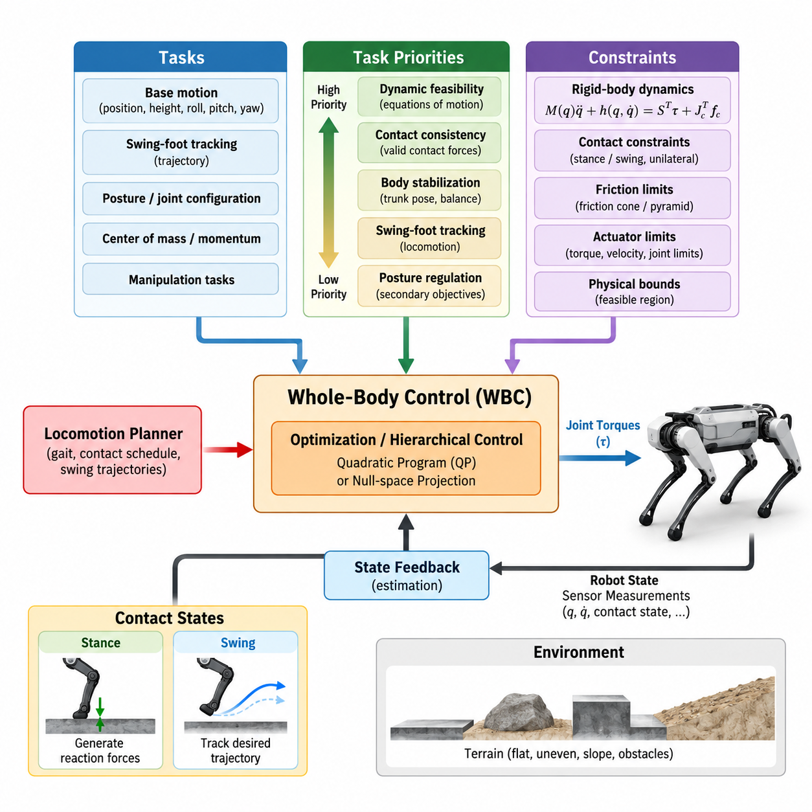{width="7.268055555555556in" height="7.268055555555556in"}

Whole-Body Control (WBC) provides a unified framework for coordinating all actuated joints, floating-base motion, and contact forces of a quadruped robot. Instead of controlling each leg independently, WBC treats the robot as a coupled multibody system whose motions must simultaneously satisfy dynamic equations, contact constraints, actuator limits, and task objectives. This integrated formulation is essential for stable locomotion and physically consistent behavior.

A quadruped is naturally modeled as a floating-base system because its trunk is not rigidly attached to the environment. The generalized configuration therefore includes the six-degree-of-freedom pose of the base together with the joint coordinates of all legs. Since the floating base cannot be actuated directly, desired body motion must be produced indirectly through joint torques and reaction forces generated at feet that maintain contact with the terrain.

The foundation of WBC is the rigid-body equation of motion, commonly expressed as M(q)q̈ + h(q,q̇) = Sᵀτ + Jcᵀfc. Here, the mass matrix describes inertial coupling, h contains Coriolis, centrifugal, and gravitational effects, τ represents actuator torques, and fc represents contact forces. This equation connects desired accelerations and contact interactions to physically realizable joint commands.

Contact states fundamentally change the controllability of a quadruped. During stance, a foot is constrained by the terrain and can generate reaction forces that support and accelerate the body. During swing, the same foot becomes a motion task and must follow a desired trajectory without contributing ground force. WBC continuously reorganizes these constraints and objectives according to the contact schedule supplied by the gait or locomotion planner.

Tasks are mathematical descriptions of behaviors that the controller should achieve. A base task may regulate trunk position, height, velocity, roll, pitch, and yaw, while swing-foot tasks track trajectories toward future footholds. Additional tasks may control posture, center of mass, joint configuration, momentum, or manipulation devices. WBC combines these heterogeneous objectives within a common optimization or hierarchical control structure.

Task priority becomes important because not every objective can be satisfied exactly at the same time. Maintaining physically valid contact and respecting system dynamics generally have greater importance than accurately tracking a nominal posture. A controller may therefore organize objectives into levels such as dynamic feasibility, contact consistency, body stabilization, swing-foot tracking, and posture regulation. Lower-priority tasks use only the remaining control freedom.

Strict hierarchical WBC can enforce priorities mathematically through null-space projection or hierarchical optimization. Once a higher-priority task is satisfied, lower-level commands are projected into directions that do not interfere with that solution. This approach is valuable when safety-critical constraints must never be sacrificed for secondary performance objectives, although numerical implementation becomes more demanding as the number of priority levels increases.

Another widely used approach formulates WBC as a quadratic program (QP). Desired task accelerations, contact forces, or tracking errors are represented through quadratic costs, while dynamics, contact conditions, friction limits, and actuator bounds appear as equality or inequality constraints. Different task weights establish soft priorities. The QP then finds the control variables that provide the best compromise while remaining within the feasible physical region.

Contact-force optimization is particularly important for quadrupeds because ground reaction forces determine how the floating body is supported and accelerated. The controller distributes forces among stance feet according to desired body motion while preventing unrealistic solutions. Normal forces must remain compatible with unilateral contact, meaning that a foot may push against the ground but cannot pull the ground toward the robot.

Tangential contact forces must also remain inside an admissible friction region. Coulomb friction is commonly approximated using a linearized friction cone or friction pyramid so that it can be incorporated efficiently into a QP. These constraints reduce slipping by ensuring that horizontal forces remain compatible with available normal force and assumed terrain friction. Contact-force limits may additionally account for foot geometry and hardware capabilities.

Swing-leg control introduces a different objective. The controller receives a desired foot trajectory from the locomotion planner and converts its tracking requirements into joint-level behavior through the foot Jacobian and robot dynamics. Position, velocity, and acceleration references can be combined with feedback terms. Because the body itself moves during locomotion, accurate swing tracking requires considering the coupled motion of both the floating base and leg joints.

Body stabilization usually occupies a high level within the task hierarchy. Desired trunk orientation and translational motion may originate from a velocity command, gait generator, model predictive controller, or navigation system. WBC translates these references into dynamically consistent accelerations, forces, and torques. In this sense, it acts as the bridge between higher-level locomotion planning and the robot\'s low-level torque-controlled actuators.

Posture regulation is commonly assigned a lower priority because its role is to shape internal joint configurations rather than dominate locomotion. A nominal posture can keep joints away from mechanical limits, improve manipulability, reduce awkward leg configurations, and maintain useful clearance. When higher-priority tasks require different joint motions, posture tracking is intentionally relaxed so that stability and contact objectives remain achievable.

Physical limits must be included explicitly in practical WBC. Joint torque saturation, joint position and velocity limits, maximum contact forces, friction constraints, and allowable accelerations define the feasible operating envelope. Ignoring these limits can produce mathematically attractive but physically impossible commands. Constraint-aware optimization allows the controller to degrade tracking performance gracefully rather than demanding actions that the actuators cannot execute.

The relationship between WBC and Model Predictive Control (MPC) is complementary rather than competitive. MPC can predict body motion and optimize future contact forces or foothold-related behavior over a finite horizon, while WBC operates at a faster rate to realize the immediate reference using the full robot model. MPC therefore answers what global motion should occur, whereas WBC determines how the complete articulated robot should execute that motion now.

State estimation is equally critical because WBC depends on reliable estimates of base pose, velocity, joint states, contact conditions, and sometimes terrain orientation. Errors in these quantities directly affect dynamic compensation and contact-force computation. Information from IMUs, joint encoders, foot-contact sensing, vision, LiDAR, or proprioceptive estimators can therefore influence control quality even when the WBC algorithm itself remains unchanged.

Contact transitions require special treatment because abrupt switching between stance and swing can create discontinuities in desired force or acceleration. Practical controllers introduce smooth force ramps, trajectory blending, touchdown detection, and compliant behavior near contact events. These mechanisms reduce impact and prevent sudden torque changes while allowing the optimization problem to transition between different sets of constraints as the gait evolves.

Robustness also requires recognizing that the mathematical model is never exact. Link masses, inertias, actuator dynamics, terrain properties, and contact locations contain uncertainty. Feedback terms compensate for moderate modeling errors, while force sensing, disturbance estimation, adaptive control, or learned residual models may further improve performance. WBC should therefore be viewed as a model-based framework operating continuously with measured state feedback rather than as pure feedforward dynamics.

At the actuator interface, optimized generalized behavior must ultimately become commands such as joint torque, position, velocity, or combinations of these quantities. High-performance quadrupeds often use torque-oriented control because it provides direct access to dynamic interaction with the environment. Nevertheless, impedance-controlled actuators can also realize WBC outputs by combining feedforward torque with joint-space stiffness and damping for additional local robustness.

A complete quadruped WBC architecture therefore forms a real-time hierarchy connecting perception, state estimation, gait planning, trajectory generation, dynamic optimization, and actuator control. Higher layers specify where and how the robot should move, while WBC reconciles these intentions with instantaneous contact conditions and physical constraints. This separation allows locomotion strategies to change without redesigning the entire low-level control system.

The central design principle is that quadruped behavior should not be interpreted as twelve independent joint-control problems. Every body acceleration, foot placement, and ground reaction force affects the dynamics of the complete robot. Whole-Body Control exploits these couplings explicitly, resolving competing objectives according to their priorities while preserving feasibility, balance, contact consistency, and actuator safety during dynamically changing locomotion tasks.

전신 제어(Whole-Body Control, WBC)는 사족보행 로봇(Quadruped Robot)의 모든 구동 관절(Actuated Joint), 부유 기저 운동(Floating-Base Motion), 접촉력(Contact Force)을 통합적으로 조정하기 위한 제어 프레임워크(Control Framework)를 제공한다. 각 다리(Leg)를 독립적으로 제어하는 대신, WBC는 로봇을 동역학 방정식(Dynamic Equation), 접촉 제약조건(Contact Constraint), 구동기 한계(Actuator Limit), 작업 목표(Task Objective)를 동시에 만족해야 하는 결합 다물체 시스템(Coupled Multibody System)으로 취급한다. 이러한 통합적 구성은 안정적인 보행(Locomotion)과 물리적으로 일관된 동작을 구현하는 데 필수적이다.

사족보행 로봇은 몸통(Trunk)이 환경에 고정되어 있지 않기 때문에 자연스럽게 부유 기저 시스템(Floating-Base System)으로 모델링된다. 따라서 일반화 구성(Generalized Configuration)은 기저(Base)의 6자유도(Six-Degree-of-Freedom, 6-DoF) 자세(Pose)와 모든 다리의 관절 좌표(Joint Coordinate)를 함께 포함한다. 부유 기저에는 직접적인 구동력을 가할 수 없으므로, 원하는 몸체 운동(Body Motion)은 관절 토크(Joint Torque)와 지면에 접촉한 발에서 생성되는 반력(Reaction Force)을 통해 간접적으로 만들어져야 한다.

WBC의 기반은 강체 운동 방정식(Rigid-Body Equation of Motion)이며, 일반적으로 M(q)q̈ + h(q,q̇) = Sᵀτ + Jcᵀfc와 같이 표현된다. 여기에서 질량 행렬(Mass Matrix)은 관성 결합(Inertial Coupling)을 나타내며, h는 코리올리 효과(Coriolis Effect), 원심 효과(Centrifugal Effect), 중력 효과(Gravity Effect)를 포함한다. τ는 구동기 토크(Actuator Torque)를, fc는 접촉력(Contact Force)을 의미한다. 이 방정식은 원하는 가속도와 접촉 상호작용을 물리적으로 실현 가능한 관절 명령(Joint Command)과 연결한다.

접촉 상태(Contact State)는 사족보행 로봇의 제어 가능성(Controllability)을 근본적으로 변화시킨다. 지지 상태(Stance)에서 발은 지면에 의해 구속되며 몸체를 지지하고 가속하기 위한 반력(Reaction Force)을 생성할 수 있다. 반면 유각 상태(Swing)에서는 동일한 발이 운동 작업(Motion Task)의 대상이 되어 지면 반력을 발생시키지 않으면서 원하는 궤적(Desired Trajectory)을 따라야 한다. WBC는 보행 계획기(Gait Planner) 또는 이동 계획기(Locomotion Planner)가 제공하는 접촉 일정(Contact Schedule)에 따라 이러한 제약조건과 목표를 지속적으로 재구성한다.

작업(Task)은 제어기가 달성해야 하는 동작을 수학적으로 표현한 것이다. 기저 작업(Base Task)은 몸통 위치(Trunk Position), 높이(Height), 속도(Velocity), 롤(Roll), 피치(Pitch), 요(Yaw)를 조절할 수 있으며, 유각 발 작업(Swing-Foot Task)은 다음 발 디딤 위치(Foothold)를 향하는 궤적을 추종한다. 추가적으로 자세(Posture), 질량중심(Center of Mass, CoM), 관절 구성(Joint Configuration), 운동량(Momentum), 조작 장치(Manipulation Device) 등을 제어하는 작업도 포함될 수 있다. WBC는 이러한 서로 다른 목표를 공통의 최적화(Optimization) 또는 계층적 제어 구조(Hierarchical Control Structure) 안에서 통합한다.

모든 목표를 동시에 정확하게 만족시킬 수 있는 것은 아니기 때문에 작업 우선순위(Task Priority)가 중요하다. 물리적으로 유효한 접촉(Physically Valid Contact)을 유지하고 시스템 동역학(System Dynamics)을 만족시키는 것은 일반적으로 기준 자세(Nominal Posture)를 정확하게 추종하는 것보다 높은 중요도를 가진다. 따라서 제어기는 동역학적 실현 가능성(Dynamic Feasibility), 접촉 일관성(Contact Consistency), 몸체 안정화(Body Stabilization), 유각 발 추종(Swing-Foot Tracking), 자세 조절(Posture Regulation) 등의 단계로 목표를 구성할 수 있다. 낮은 우선순위의 작업은 상위 작업을 수행하고 남은 제어 자유도(Control Freedom)만을 사용한다.

엄격한 계층적 전신 제어(Hierarchical WBC)는 영공간 투영(Null-Space Projection) 또는 계층적 최적화(Hierarchical Optimization)를 통해 우선순위를 수학적으로 강제할 수 있다. 상위 우선순위 작업이 만족되면 하위 단계의 명령은 해당 해를 방해하지 않는 방향으로 투영된다. 이러한 방식은 안전 필수 제약조건(Safety-Critical Constraint)이 부차적인 성능 목표 때문에 희생되어서는 안 되는 경우에 특히 유용하다. 그러나 우선순위 단계가 증가할수록 수치적 구현(Numerical Implementation)은 더욱 복잡해진다.

또 다른 널리 사용되는 방식은 WBC를 이차 계획법(Quadratic Programming, QP) 문제로 구성하는 것이다. 원하는 작업 가속도(Task Acceleration), 접촉력(Contact Force), 추종 오차(Tracking Error)는 이차 비용함수(Quadratic Cost)로 표현하고, 동역학, 접촉 조건, 마찰 한계(Friction Limit), 구동기 한계는 등식 또는 부등식 제약조건(Equality or Inequality Constraint)으로 표현한다. 서로 다른 작업 가중치(Task Weight)를 이용하여 소프트 우선순위(Soft Priority)를 설정하며, QP는 물리적으로 실현 가능한 영역 안에서 가장 적절한 절충 해를 계산한다.

접촉력 최적화(Contact-Force Optimization)는 지면 반력(Ground Reaction Force)이 부유 몸체(Floating Body)를 지지하고 가속하는 방식을 결정하기 때문에 사족보행 로봇에서 특히 중요하다. 제어기는 원하는 몸체 운동에 따라 지지 발(Stance Foot) 사이에 힘을 분배하면서 비현실적인 해가 생성되지 않도록 제한한다. 수직력(Normal Force)은 단방향 접촉(Unilateral Contact) 조건을 만족해야 하므로 발은 지면을 밀 수 있지만 지면을 로봇 방향으로 당길 수는 없다.

접선 방향 접촉력(Tangential Contact Force) 역시 허용 가능한 마찰 영역(Friction Region) 내부에 존재해야 한다. 쿨롱 마찰(Coulomb Friction)은 QP에 효율적으로 포함할 수 있도록 선형화된 마찰 원뿔(Linearized Friction Cone) 또는 마찰 피라미드(Friction Pyramid)로 근사되는 경우가 많다. 이러한 제약조건은 수평력이 사용 가능한 수직력과 가정된 지면 마찰계수(Terrain Friction)에 적합하도록 하여 미끄러짐(Slip)을 줄인다. 접촉력 한계에는 발의 형상(Foot Geometry)과 하드웨어 성능도 추가적으로 반영될 수 있다.

유각 다리 제어(Swing-Leg Control)는 이와 다른 목표를 가진다. 제어기는 이동 계획기에서 원하는 발 궤적(Foot Trajectory)을 전달받고, 발 자코비안(Foot Jacobian)과 로봇 동역학(Robot Dynamics)을 이용하여 추종 요구조건을 관절 수준 동작으로 변환한다. 위치(Position), 속도(Velocity), 가속도(Acceleration) 기준값을 피드백 항(Feedback Term)과 결합할 수 있다. 보행 중에는 몸체 자체도 움직이므로 정확한 유각 추종을 위해 부유 기저와 다리 관절의 결합 운동(Coupled Motion)을 함께 고려해야 한다.

몸체 안정화(Body Stabilization)는 일반적으로 작업 계층(Task Hierarchy)의 높은 단계에 위치한다. 원하는 몸통 자세(Trunk Orientation)와 병진 운동(Translational Motion)은 속도 명령(Velocity Command), 보행 생성기(Gait Generator), 모델 예측 제어기(Model Predictive Controller, MPC), 또는 내비게이션 시스템(Navigation System)에서 제공될 수 있다. WBC는 이러한 기준값을 동역학적으로 일관된 가속도, 힘, 토크로 변환한다. 이러한 관점에서 WBC는 상위 수준의 이동 계획과 로봇의 하위 수준 토크 제어 구동기(Torque-Controlled Actuator)를 연결하는 역할을 수행한다.

자세 조절(Posture Regulation)은 보행 자체를 지배하기보다는 내부 관절 구성(Internal Joint Configuration)을 형성하는 역할을 하기 때문에 일반적으로 낮은 우선순위가 부여된다. 기준 자세(Nominal Posture)는 관절이 기계적 한계(Mechanical Limit)에 접근하는 것을 방지하고, 조작성(Manipulability)을 향상시키며, 부자연스러운 다리 형상을 줄이고, 필요한 지면 간극(Clearance)을 유지할 수 있다. 상위 우선순위 작업에서 다른 관절 운동이 필요한 경우에는 안정성과 접촉 목표를 달성할 수 있도록 자세 추종이 의도적으로 완화된다.

실제 WBC에서는 물리적 한계(Physical Limit)를 명시적으로 포함해야 한다. 관절 토크 포화(Joint Torque Saturation), 관절 위치 및 속도 한계(Joint Position and Velocity Limit), 최대 접촉력(Maximum Contact Force), 마찰 제약조건(Friction Constraint), 허용 가속도(Allowable Acceleration)는 시스템의 실현 가능한 작동 영역(Feasible Operating Envelope)을 정의한다. 이러한 한계를 무시하면 수학적으로는 적절하지만 물리적으로 실행할 수 없는 명령이 생성될 수 있다. 제약조건을 고려한 최적화는 구동기가 수행할 수 없는 동작을 요구하는 대신 추종 성능을 점진적으로 완화할 수 있게 한다.

WBC와 모델 예측 제어(Model Predictive Control, MPC)의 관계는 경쟁적이라기보다 상호 보완적이다. MPC는 유한 예측 구간(Finite Horizon)에서 미래 몸체 운동을 예측하고 향후 접촉력 또는 발 디딤과 관련된 동작을 최적화할 수 있으며, WBC는 더 높은 주기로 동작하면서 전체 로봇 모델(Full Robot Model)을 이용하여 현재 시점의 기준값을 실현한다. 따라서 MPC가 전체적으로 어떤 운동이 이루어져야 하는지를 결정한다면, WBC는 완전한 관절 로봇(Articulated Robot)이 바로 현재 그 운동을 어떻게 실행할 것인지를 결정한다.

상태 추정(State Estimation) 역시 매우 중요하다. WBC는 기저 자세(Base Pose), 속도(Velocity), 관절 상태(Joint State), 접촉 조건(Contact Condition), 경우에 따라 지형 방향(Terrain Orientation)에 대한 신뢰성 높은 추정값에 의존하기 때문이다. 이러한 값의 오차는 동역학 보상(Dynamic Compensation)과 접촉력 계산에 직접적인 영향을 준다. 따라서 관성측정장치(Inertial Measurement Unit, IMU), 관절 인코더(Joint Encoder), 발 접촉 센서(Foot-Contact Sensor), 비전(Vision), 라이다(LiDAR), 고유수용성 추정기(Proprioceptive Estimator)의 정보는 WBC 알고리즘 자체가 동일하더라도 전체 제어 품질에 큰 영향을 줄 수 있다.

접촉 전환(Contact Transition)은 지지 상태와 유각 상태 사이의 급격한 전환이 원하는 힘이나 가속도의 불연속(Discontinuity)을 발생시킬 수 있기 때문에 특별한 처리가 필요하다. 실제 제어기는 부드러운 힘 램프(Force Ramp), 궤적 블렌딩(Trajectory Blending), 착지 감지(Touchdown Detection), 접촉 시점의 순응 동작(Compliant Behavior)을 적용한다. 이러한 메커니즘은 충격(Impact)과 갑작스러운 토크 변화를 줄이면서 보행 변화에 따라 최적화 문제가 서로 다른 제약조건 집합 사이에서 안정적으로 전환되도록 한다.

강인성(Robustness)을 확보하려면 수학적 모델이 실제 시스템과 완전히 일치하지 않는다는 사실도 고려해야 한다. 링크 질량(Link Mass), 관성(Inertia), 구동기 동역학(Actuator Dynamics), 지면 특성(Terrain Property), 접촉 위치(Contact Location)에는 불확실성이 존재한다. 피드백 항은 일정 수준의 모델링 오차를 보상하며, 힘 센싱(Force Sensing), 외란 추정(Disturbance Estimation), 적응 제어(Adaptive Control), 학습 기반 잔차 모델(Learned Residual Model)을 통해 성능을 더욱 향상시킬 수 있다. 따라서 WBC는 순수한 피드포워드 동역학(Feedforward Dynamics)이 아니라 측정된 상태 피드백과 지속적으로 결합되는 모델 기반 제어 프레임워크(Model-Based Control Framework)로 이해해야 한다.

구동기 인터페이스(Actuator Interface)에서는 최적화된 일반화 동작(Generalized Behavior)이 최종적으로 관절 토크, 위치, 속도 또는 이들의 조합으로 구성된 명령으로 변환되어야 한다. 고성능 사족보행 로봇은 환경과의 동역학적 상호작용을 직접적으로 제어할 수 있기 때문에 토크 기반 제어(Torque-Oriented Control)를 사용하는 경우가 많다. 그러나 임피던스 제어 구동기(Impedance-Controlled Actuator) 역시 피드포워드 토크(Feedforward Torque)에 관절 공간 강성(Joint-Space Stiffness)과 감쇠(Damping)를 결합하여 WBC 출력을 구현하고 추가적인 국부 강인성(Local Robustness)을 확보할 수 있다.

완전한 사족보행 WBC 구조는 지각(Perception), 상태 추정(State Estimation), 보행 계획(Gait Planning), 궤적 생성(Trajectory Generation), 동역학 최적화(Dynamic Optimization), 구동기 제어(Actuator Control)를 연결하는 실시간 계층 구조(Real-Time Hierarchy)를 형성한다. 상위 계층은 로봇이 어디로 어떻게 이동해야 하는지를 지정하며, WBC는 이러한 의도를 순간적인 접촉 상태와 물리적 제약조건에 맞추어 조정한다. 이러한 분리를 통해 전체 하위 제어 시스템을 다시 설계하지 않고도 다양한 이동 전략(Locomotion Strategy)을 적용할 수 있다.

핵심 설계 원칙은 사족보행 로봇의 동작을 12개의 독립적인 관절 제어 문제로 해석해서는 안 된다는 것이다. 모든 몸체 가속도(Body Acceleration), 발 디딤(Foot Placement), 지면 반력(Ground Reaction Force)은 로봇 전체의 동역학에 영향을 준다. 전신 제어(Whole-Body Control)는 이러한 결합 관계를 명시적으로 활용하고, 변화하는 동적 보행 작업(Dynamic Locomotion Task)에서 실현 가능성(Feasibility), 균형(Balance), 접촉 일관성(Contact Consistency), 구동기 안전성(Actuator Safety)을 유지하면서 서로 경쟁하는 목표를 우선순위에 따라 조정한다.

##  

## 06.02. Task Hierarchy Locomotion Payload Orientation [w/Code]

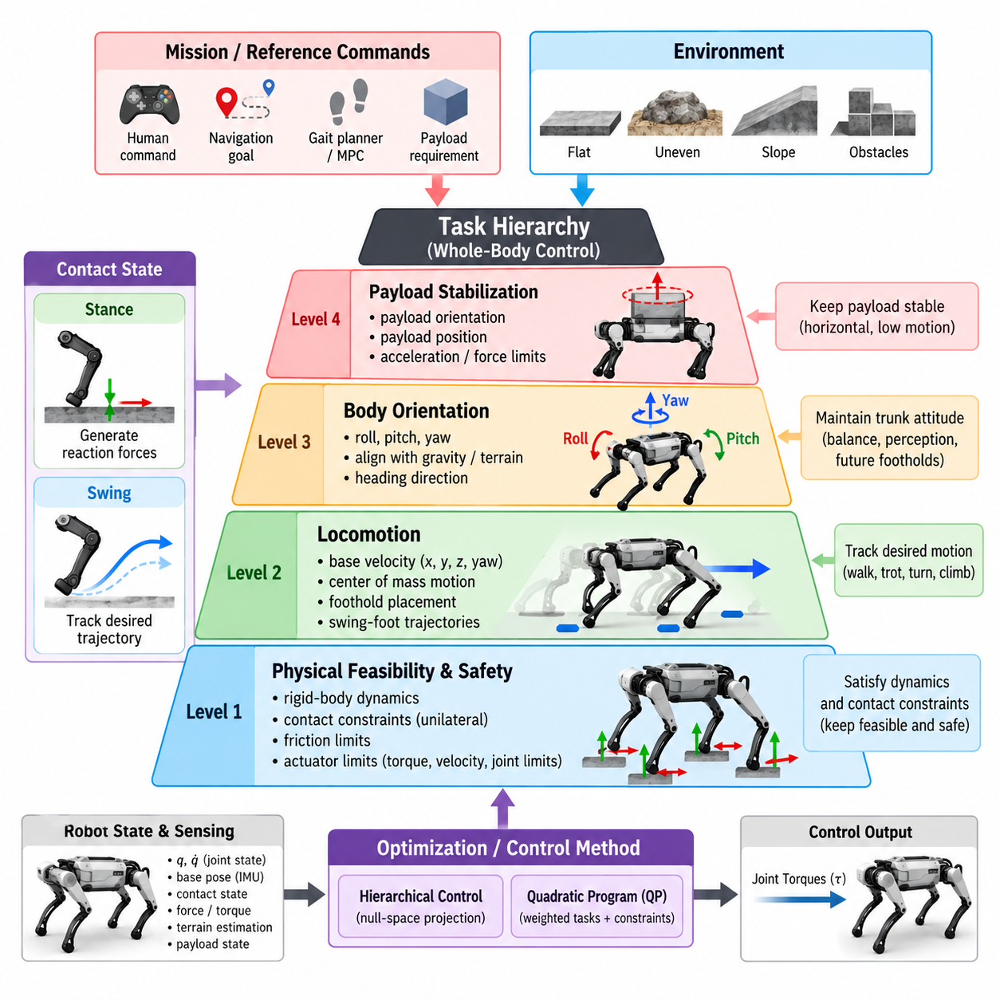{width="7.268055555555556in" height="7.268055555555556in"}

Task hierarchy in quadruped Whole-Body Control (WBC) determines how multiple objectives compete for the robot's limited dynamic and kinematic capabilities. Locomotion, payload stabilization, body orientation, contact maintenance, and posture regulation cannot always be satisfied simultaneously. A hierarchy assigns relative importance so that essential physical constraints remain protected while secondary objectives use the remaining control authority.

The highest level of a practical hierarchy is normally associated with physical feasibility and safety. The equations of motion, stance-foot contact conditions, unilateral ground reaction forces, friction limits, and actuator constraints define what the robot can physically execute. These requirements are not merely desirable tracking objectives. They establish the feasible solution space within which locomotion and payload-related tasks must operate.

Contact consistency is particularly important because stance feet create the mechanical connection between the floating-base robot and the environment. A commanded body acceleration is meaningful only if compatible ground reaction forces can be generated through the active contacts. Consequently, WBC must prevent solutions that require a stance foot to penetrate the terrain, pull on the ground, or generate tangential forces beyond the available friction region.

Locomotion objectives usually occupy the next major layer of the hierarchy. They describe desired translational velocity, body height, center-of-mass motion, yaw behavior, and progression toward navigation goals. These references may originate from a human command, autonomous navigation system, gait planner, or Model Predictive Control (MPC). WBC converts them into instantaneous whole-body accelerations, contact forces, and joint torques.

Locomotion should not be interpreted only as forward velocity tracking. A quadruped must coordinate base translation, angular motion, foothold placement, stance-force distribution, and swing-leg trajectories. When climbing slopes or traversing irregular terrain, maintaining a commanded velocity may conflict with stability or contact feasibility. The hierarchy therefore permits velocity tracking to be relaxed when necessary to preserve physically sustainable motion.

Body orientation is another central task because roll, pitch, and yaw influence balance, perception, payload behavior, and future foot placement. Roll and pitch references may be aligned with gravity or adapted to estimated terrain geometry, while yaw generally follows the desired travel direction. Orientation errors are commonly converted into desired angular accelerations or momentum changes that the WBC realizes through coordinated contact forces.

Orientation priorities depend strongly on the operating scenario. During ordinary walking, moderate roll and pitch deviations may be acceptable if they help the robot negotiate uneven terrain. For a robot carrying sensitive equipment, however, maintaining payload orientation may become more important than maintaining nominal trunk orientation. The controller must therefore distinguish between body attitude requirements and mission-dependent payload requirements.

Payload control introduces additional dynamic coupling because the carried mass changes the robot's total mass distribution, center of mass, inertia, and required support forces. A payload mounted rigidly on the trunk modifies the dynamics directly, whereas an articulated or suspended payload can introduce additional degrees of freedom and disturbances. WBC must incorporate these effects if accurate balance and motion control are required.

When payload mass is significant, locomotion references may need to become subordinate to payload stability. Rapid acceleration, aggressive turning, or large body rotations can produce undesirable inertial forces on the payload. A task hierarchy can therefore reduce commanded acceleration or modify body motion while maintaining the payload within specified orientation, acceleration, or force limits. Mission performance is preserved by explicitly representing these requirements rather than treating them as disturbances.

Payload orientation may be defined relative to gravity, the robot trunk, the terrain, or a task-specific reference frame. For example, a sensor package may need a stable horizontal orientation, while transported liquid may require limits on tilt and acceleration. A manipulator mounted on the quadruped may require its base to remain within a restricted orientation range to preserve reachability and manipulation accuracy.

The relationship between trunk orientation and payload orientation becomes especially important when an active stabilization mechanism is available. If the payload is mounted on a gimbal, manipulator, or actuated platform, the robot body can move while the payload remains approximately stabilized. WBC can exploit this additional redundancy by distributing orientation correction between the floating base and payload actuators according to task priority and available motion range.

Hierarchical control can implement these priorities using strict or soft formulations. In a strict hierarchy, a higher-priority task is solved first and lower-priority tasks are constrained to the null space remaining after that solution. This ensures that a locomotion or safety-critical orientation objective cannot be degraded by posture optimization. Such formulations provide clear priority semantics but may require several sequential optimization problems.

Soft hierarchy instead represents objectives through weighted costs within a common quadratic program (QP). Large weights can emphasize payload orientation or trunk stabilization, while smaller weights regulate posture and secondary tracking. This formulation is computationally convenient and allows smooth compromises, but weights must be chosen carefully because a sufficiently large lower-level error can potentially influence an intended higher-priority objective.

A hybrid hierarchy is often attractive for real quadrupeds. Hard constraints can protect rigid-body dynamics, contact feasibility, friction, joint limits, and torque limits, while high-weight objectives regulate balance and mission-critical payload behavior. Lower-weight costs can then handle velocity tracking, swing-foot accuracy, nominal posture, energy consumption, or torque regularization. This separates requirements that must never be violated from objectives that may be traded.

Swing-foot control illustrates how task priority changes dynamically during locomotion. During the swing phase, accurate foot positioning is necessary for successful future contact, but small trajectory deviations may be tolerated if joint limits or body stabilization require additional freedom. Near touchdown, vertical velocity and contact preparation may become more important than tracking every point of the nominal swing trajectory.

The hierarchy can also vary according to gait phase. During four-foot support, the robot possesses substantial contact redundancy and can simultaneously regulate body orientation and payload stability. During trot or dynamic transitions, fewer contacts are available and the feasible force distribution becomes more restricted. The controller may temporarily reduce lower-priority objectives to concentrate control authority on balance and contact consistency.

Terrain conditions provide another reason for adaptive priorities. On flat high-friction ground, velocity tracking and body-level orientation control can be relatively aggressive. On slippery, deformable, or steep terrain, contact-force feasibility becomes more restrictive. WBC can reduce tangential force demands, allow slower motion, modify trunk orientation, or increase posture compliance instead of forcing the original locomotion command under unsuitable conditions.

Task scaling provides a systematic mechanism for handling infeasible combinations of objectives. Rather than allowing the optimization problem to fail, the controller can reduce the magnitude of selected task commands until a feasible solution is recovered. For example, desired forward acceleration can be scaled while payload orientation remains tightly controlled. This produces graceful performance degradation instead of abrupt loss of control.

Redundancy resolution is fundamental to task hierarchy because quadrupeds frequently possess multiple ways to accomplish similar body behavior. Different combinations of joint accelerations and contact forces may generate nearly identical trunk motion. WBC uses this redundancy to satisfy secondary objectives such as maintaining comfortable joint configurations, reducing torque, balancing contact loads, avoiding singular configurations, or minimizing unnecessary motion.

Posture tasks usually occupy a lower level because they shape the internal configuration without directly defining the primary mission. Desired joint angles can keep legs near efficient operating regions and maintain sufficient workspace for future steps. However, if posture regulation conflicts with balance, foothold tracking, payload stabilization, or physical constraints, it should yield rather than forcing the robot toward a dynamically unfavorable configuration.

Joint-limit avoidance may require stronger treatment than ordinary posture regulation. As a joint approaches its mechanical boundary, the controller can introduce inequality constraints or rapidly increasing avoidance costs. This prevents a low-priority locomotion objective from driving the mechanism into an unusable configuration. Similar techniques can maintain clearance from self-collision or preserve minimum leg extension margins required for disturbance recovery.

Payload-aware force distribution can further improve stability. If a heavy payload shifts the combined center of mass toward one side of the robot, equal force distribution among the feet is no longer appropriate. WBC can allocate larger normal forces to contacts positioned beneath the shifted load while respecting friction and actuator limits. This enables the contact-force solution to reflect the actual mass distribution of the robot-payload system.

Dynamic payloads require even greater coordination. A moving manipulator, oscillating load, or changing cargo position creates time-varying inertial effects that can disturb locomotion. If these motions are modeled, WBC can anticipate their influence and compensate through body motion and contact-force redistribution. If they are not modeled explicitly, disturbance observers and feedback control must reject the resulting errors after they appear.

Orientation control should also account for the difference between geometric tracking and dynamic feasibility. Demanding perfectly level roll and pitch while crossing strongly inclined terrain may create poor leg configurations or excessive contact forces. A terrain-aware controller can generate an orientation reference that balances global vertical alignment, local surface geometry, foothold reachability, and payload requirements rather than imposing a single fixed attitude.

Higher-level planners can assist WBC by generating references that already respect approximate dynamic limitations. MPC may optimize future body motion and contact forces while considering payload mass and gait timing, whereas WBC resolves the detailed full-body response at higher frequency. This division reduces conflicts because the task hierarchy receives references that are more likely to remain feasible under current and predicted contact conditions.

State estimation directly affects hierarchy execution. Incorrect terrain orientation, payload mass, base attitude, or contact classification can cause the controller to prioritize objectives using an inaccurate representation of the physical system. Payload-aware quadrupeds may therefore require load estimation, center-of-mass identification, contact estimation, and reliable inertial sensing in addition to conventional joint-state measurements.

A well-designed task hierarchy is ultimately mission dependent rather than universal. A fast scouting robot may prioritize locomotion speed and disturbance recovery, while a logistics quadruped carrying fragile cargo may prioritize payload acceleration and orientation. A quadruped equipped with a manipulator may prioritize end-effector accuracy during manipulation and return locomotion tasks to higher importance when traveling between work locations.

The essential principle is to preserve a clear distinction between constraints, primary tasks, and secondary preferences. Physical feasibility and safety establish the boundaries of possible behavior; locomotion, payload, and orientation objectives determine mission behavior within those boundaries; posture and optimization criteria exploit remaining redundancy. By organizing these layers explicitly, WBC can adapt the entire quadruped to changing terrain, contact states, payload conditions, and operational priorities without losing dynamic consistency.

사족보행 로봇의 전신 제어(Whole-Body Control, WBC)에서 작업 계층(Task Hierarchy)은 여러 목표가 로봇의 제한된 동역학적 및 운동학적 능력(Dynamic and Kinematic Capability)을 어떻게 나누어 사용할 것인지를 결정한다. 이동(Locomotion), 페이로드 안정화(Payload Stabilization), 몸체 방향 제어(Body Orientation), 접촉 유지(Contact Maintenance), 자세 조절(Posture Regulation)은 항상 동시에 완벽하게 만족될 수 있는 것은 아니다. 따라서 작업 계층은 필수적인 물리적 제약조건을 보호하면서 부차적인 목표가 남아 있는 제어 능력(Control Authority)을 사용하도록 상대적인 중요도를 부여한다.

실제적인 작업 계층의 최상위 단계는 일반적으로 물리적 실현 가능성(Physical Feasibility)과 안전성(Safety)에 관련된다. 운동 방정식(Equation of Motion), 지지 발 접촉 조건(Stance-Foot Contact Condition), 단방향 지면 반력(Unilateral Ground Reaction Force), 마찰 한계(Friction Limit), 구동기 제약조건(Actuator Constraint)은 로봇이 물리적으로 실행할 수 있는 동작을 정의한다. 이러한 요구사항은 단순히 바람직한 추종 목표가 아니라 이동 및 페이로드 관련 작업이 수행될 수 있는 실현 가능 해 공간(Feasible Solution Space)을 형성한다.

접촉 일관성(Contact Consistency)은 지지 발(Stance Foot)이 부유 기저 로봇(Floating-Base Robot)과 환경 사이의 기계적 연결을 형성하기 때문에 특히 중요하다. 명령된 몸체 가속도(Body Acceleration)는 활성 접촉(Active Contact)을 통해 이에 적합한 지면 반력을 생성할 수 있을 때만 의미가 있다. 따라서 WBC는 지지 발이 지면을 관통하거나, 지면을 당기거나, 사용 가능한 마찰 영역(Friction Region)을 초과하는 접선 방향 힘(Tangential Force)을 요구하는 해가 생성되지 않도록 해야 한다.

이동 목표(Locomotion Objective)는 일반적으로 작업 계층에서 그다음 주요 단계를 차지한다. 여기에는 원하는 병진 속도(Translational Velocity), 몸체 높이(Body Height), 질량중심 운동(Center-of-Mass Motion), 요 운동(Yaw Behavior), 내비게이션 목표(Navigation Goal)를 향한 이동이 포함된다. 이러한 기준값은 사람의 명령, 자율 내비게이션 시스템(Autonomous Navigation System), 보행 계획기(Gait Planner), 모델 예측 제어(Model Predictive Control, MPC)에서 제공될 수 있다. WBC는 이를 순간적인 전신 가속도, 접촉력, 관절 토크로 변환한다.

이동(Locomotion)은 단순히 전진 속도를 추종하는 것으로 해석해서는 안 된다. 사족보행 로봇은 기저 병진 운동(Base Translation), 각운동(Angular Motion), 발 디딤 위치(Foothold Placement), 지지력 분배(Stance-Force Distribution), 유각 다리 궤적(Swing-Leg Trajectory)을 서로 조정해야 한다. 경사면을 오르거나 불규칙한 지형을 이동할 때 명령된 속도를 유지하는 것이 안정성 또는 접촉 실현 가능성과 충돌할 수 있다. 따라서 작업 계층은 물리적으로 지속 가능한 운동을 보존하기 위해 필요한 경우 속도 추종을 완화할 수 있도록 한다.

몸체 방향(Body Orientation)은 롤(Roll), 피치(Pitch), 요(Yaw)가 균형(Balance), 지각(Perception), 페이로드 동작(Payload Behavior), 향후 발 디딤 위치에 영향을 미치기 때문에 또 다른 핵심 작업이다. 롤과 피치 기준값은 중력 방향(Gravity Direction)에 맞추거나 추정된 지형 형상(Terrain Geometry)에 따라 조정할 수 있으며, 요는 일반적으로 원하는 이동 방향을 따른다. 방향 오차(Orientation Error)는 원하는 각가속도(Angular Acceleration) 또는 운동량 변화(Momentum Change)로 변환되고, WBC는 조정된 접촉력을 통해 이를 실현한다.

방향 제어 우선순위(Orientation Priority)는 운용 상황에 따라 크게 달라진다. 일반적인 보행에서는 불규칙한 지형을 극복하는 데 도움이 된다면 일정 수준의 롤과 피치 편차가 허용될 수 있다. 그러나 민감한 장비를 운반하는 로봇에서는 페이로드 방향(Payload Orientation)을 유지하는 것이 기준 몸통 방향(Nominal Trunk Orientation)을 유지하는 것보다 중요할 수 있다. 따라서 제어기는 몸체 자세 요구조건(Body Attitude Requirement)과 임무에 따라 달라지는 페이로드 요구조건(Mission-Dependent Payload Requirement)을 구분해야 한다.

페이로드 제어(Payload Control)는 운반되는 질량이 로봇 전체의 질량 분포(Mass Distribution), 질량중심(Center of Mass), 관성(Inertia), 필요한 지지력(Support Force)을 변화시키기 때문에 추가적인 동역학적 결합(Dynamic Coupling)을 발생시킨다. 몸통에 강체로 고정된 페이로드는 동역학을 직접 변화시키는 반면, 관절형 또는 매달린 페이로드(Articulated or Suspended Payload)는 추가적인 자유도(Degree of Freedom)와 외란(Disturbance)을 발생시킬 수 있다. 정확한 균형과 운동 제어가 필요한 경우 WBC는 이러한 영향을 포함해야 한다.

페이로드 질량이 상당히 큰 경우에는 이동 기준값(Locomotion Reference)이 페이로드 안정성(Payload Stability)보다 낮은 우선순위를 가져야 할 수 있다. 급격한 가속, 공격적인 선회, 큰 몸체 회전은 페이로드에 바람직하지 않은 관성력(Inertial Force)을 발생시킬 수 있다. 따라서 작업 계층은 페이로드를 지정된 방향, 가속도 또는 힘의 한계 내에 유지하면서 명령 가속도를 감소시키거나 몸체 운동을 수정할 수 있다. 이러한 요구사항을 단순한 외란으로 취급하지 않고 명시적으로 표현함으로써 임무 수행 성능을 유지할 수 있다.

페이로드 방향(Payload Orientation)은 중력(Gravity), 로봇 몸통(Robot Trunk), 지형(Terrain), 또는 작업별 기준 좌표계(Task-Specific Reference Frame)를 기준으로 정의할 수 있다. 예를 들어 센서 패키지(Sensor Package)는 안정적인 수평 방향을 유지해야 할 수 있으며, 액체를 운반하는 경우에는 기울기와 가속도에 제한이 필요할 수 있다. 사족보행 로봇에 장착된 매니퓰레이터(Manipulator)는 도달 가능성(Reachability)과 조작 정확도(Manipulation Accuracy)를 유지하기 위해 기저 방향이 제한된 범위 내에 존재하도록 요구할 수 있다.

능동 안정화 메커니즘(Active Stabilization Mechanism)을 사용할 수 있는 경우 몸통 방향과 페이로드 방향 사이의 관계는 더욱 중요해진다. 페이로드가 짐벌(Gimbal), 매니퓰레이터, 또는 구동 플랫폼(Actuated Platform)에 장착되어 있다면 로봇 몸체가 움직이더라도 페이로드는 거의 안정된 상태를 유지할 수 있다. WBC는 이러한 추가적인 여유 자유도(Redundancy)를 활용하여 작업 우선순위와 사용 가능한 운동 범위에 따라 부유 기저와 페이로드 구동기 사이에 방향 보정(Orientation Correction)을 분배할 수 있다.

계층적 제어(Hierarchical Control)는 엄격한 방식(Strict Formulation) 또는 소프트 방식(Soft Formulation)을 사용하여 이러한 우선순위를 구현할 수 있다. 엄격한 계층에서는 높은 우선순위 작업을 먼저 해결한 다음, 하위 우선순위 작업을 그 해를 구한 후 남은 영공간(Null Space)으로 제한한다. 이를 통해 이동 또는 안전 필수 방향 목표(Safety-Critical Orientation Objective)가 자세 최적화(Posture Optimization)에 의해 저하되는 것을 방지할 수 있다. 이러한 구성은 명확한 우선순위 의미를 제공하지만 여러 개의 순차적 최적화 문제(Sequential Optimization Problem)가 필요할 수 있다.

소프트 계층(Soft Hierarchy)은 하나의 공통 이차 계획법(Quadratic Programming, QP) 안에서 목표를 가중 비용함수(Weighted Cost)로 표현한다. 큰 가중치는 페이로드 방향 또는 몸통 안정화(Trunk Stabilization)를 강조하고, 작은 가중치는 자세와 부차적인 추종 목표를 조절할 수 있다. 이러한 구성은 계산적으로 편리하고 부드러운 절충(Smooth Compromise)을 가능하게 하지만, 매우 큰 하위 단계 오차가 의도한 상위 우선순위 목표에 영향을 미칠 수 있으므로 가중치를 신중하게 선택해야 한다.

하이브리드 계층(Hybrid Hierarchy)은 실제 사족보행 로봇에 특히 유용하다. 강성 제약조건(Hard Constraint)은 강체 동역학(Rigid-Body Dynamics), 접촉 실현 가능성(Contact Feasibility), 마찰, 관절 한계, 토크 한계를 보호할 수 있으며, 높은 가중치의 목표는 균형과 임무 필수 페이로드 동작(Mission-Critical Payload Behavior)을 조절할 수 있다. 이후 낮은 가중치 비용함수는 속도 추종, 유각 발 정확도, 기준 자세, 에너지 소비(Energy Consumption), 토크 정규화(Torque Regularization)를 처리할 수 있다. 이를 통해 절대로 위반해서는 안 되는 요구사항과 서로 절충할 수 있는 목표를 분리할 수 있다.

유각 발 제어(Swing-Foot Control)는 이동 과정에서 작업 우선순위가 동적으로 변화하는 방식을 잘 보여준다. 유각 단계(Swing Phase)에서는 향후 성공적인 접촉을 위해 정확한 발 위치 제어가 필요하지만, 관절 한계 또는 몸체 안정화를 위해 추가적인 자유도가 필요하다면 작은 궤적 편차는 허용할 수 있다. 착지(Touchdown)에 가까워지면 기준 유각 궤적의 모든 지점을 정확히 추종하는 것보다 수직 속도(Vertical Velocity)와 접촉 준비(Contact Preparation)가 더 중요해질 수 있다.

작업 계층은 보행 단계(Gait Phase)에 따라서도 변화할 수 있다. 네 발이 모두 지면을 지지하는 상태에서는 로봇이 상당한 접촉 여유도(Contact Redundancy)를 가지므로 몸체 방향과 페이로드 안정성을 동시에 조절할 수 있다. 반면 트로트(Trot) 또는 동적 전환(Dynamic Transition)에서는 사용할 수 있는 접촉점이 감소하여 실현 가능한 힘 분배가 더욱 제한된다. 제어기는 균형과 접촉 일관성에 제어 능력을 집중하기 위해 일시적으로 낮은 우선순위의 목표를 완화할 수 있다.

지형 조건(Terrain Condition)은 적응형 우선순위(Adaptive Priority)가 필요한 또 다른 이유이다. 평탄하고 마찰력이 높은 지면에서는 속도 추종과 몸체 방향 제어를 비교적 적극적으로 수행할 수 있다. 미끄럽거나 변형 가능한 지면 또는 급경사에서는 접촉력 실현 가능성이 더욱 제한된다. WBC는 부적절한 조건에서도 기존 이동 명령을 강제로 유지하는 대신 접선 방향 힘 요구량을 줄이고, 이동 속도를 낮추고, 몸통 방향을 변경하거나, 자세 순응성(Posture Compliance)을 증가시킬 수 있다.

작업 스케일링(Task Scaling)은 실현 불가능한 목표 조합을 처리하기 위한 체계적인 방법을 제공한다. 최적화 문제 자체가 실패하도록 두는 대신 제어기는 실현 가능한 해를 다시 확보할 때까지 선택된 작업 명령의 크기를 감소시킬 수 있다. 예를 들어 페이로드 방향은 엄격하게 유지하면서 원하는 전진 가속도(Forward Acceleration)를 축소할 수 있다. 이러한 방식은 갑작스러운 제어 상실 대신 점진적인 성능 저하(Graceful Performance Degradation)를 가능하게 한다.

여유도 해석(Redundancy Resolution)은 사족보행 로봇이 유사한 몸체 동작을 구현하는 여러 방법을 가지는 경우가 많기 때문에 작업 계층의 핵심 요소이다. 서로 다른 관절 가속도와 접촉력 조합이 거의 동일한 몸통 운동을 생성할 수 있다. WBC는 이러한 여유도를 활용하여 편안한 관절 구성 유지, 토크 감소, 접촉 하중 균형(Contact Load Balancing), 특이 자세(Singular Configuration) 회피, 불필요한 운동 최소화 등의 부차적인 목표를 달성한다.

자세 작업(Posture Task)은 주요 임무를 직접 정의하기보다는 내부 구성(Internal Configuration)을 조절하기 때문에 일반적으로 낮은 단계에 배치된다. 원하는 관절 각도는 다리를 효율적인 작동 영역에 유지하고 향후 스텝을 위한 충분한 작업 공간(Workspace)을 확보할 수 있다. 그러나 자세 조절이 균형, 발 디딤 추종, 페이로드 안정화 또는 물리적 제약조건과 충돌한다면 로봇을 동역학적으로 불리한 구성으로 강제하기보다는 자세 목표가 양보해야 한다.

관절 한계 회피(Joint-Limit Avoidance)는 일반적인 자세 조절보다 더 강하게 처리해야 할 수 있다. 관절이 기계적 경계(Mechanical Boundary)에 접근하면 제어기는 부등식 제약조건(Inequality Constraint) 또는 급격하게 증가하는 회피 비용(Avoidance Cost)을 적용할 수 있다. 이를 통해 낮은 우선순위의 이동 목표가 기구를 사용할 수 없는 구성으로 몰아가는 것을 방지한다. 유사한 기법을 이용하여 자체 충돌(Self-Collision)을 방지하거나 외란 회복(Disturbance Recovery)에 필요한 최소 다리 신장 여유(Minimum Leg Extension Margin)를 유지할 수 있다.

페이로드를 고려한 힘 분배(Payload-Aware Force Distribution)는 안정성을 더욱 향상시킬 수 있다. 무거운 페이로드로 인해 결합 질량중심(Combined Center of Mass)이 로봇의 한쪽으로 이동하면 네 발에 동일한 힘을 분배하는 것은 더 이상 적절하지 않다. WBC는 마찰 및 구동기 한계를 만족하면서 이동된 하중 아래에 위치한 접촉점에 더 큰 수직력을 할당할 수 있다. 이를 통해 접촉력 해(Contact-Force Solution)가 실제 로봇-페이로드 시스템(Robot-Payload System)의 질량 분포를 반영하도록 할 수 있다.

동적 페이로드(Dynamic Payload)는 더욱 높은 수준의 협조 제어를 요구한다. 움직이는 매니퓰레이터, 진동하는 하중, 또는 변화하는 화물 위치는 시간에 따라 변하는 관성 효과(Time-Varying Inertial Effect)를 발생시켜 이동을 방해할 수 있다. 이러한 운동을 모델링할 수 있다면 WBC는 그 영향을 미리 예측하고 몸체 운동과 접촉력 재분배(Contact-Force Redistribution)를 통해 보상할 수 있다. 명시적으로 모델링하지 않는 경우에는 외란 관측기(Disturbance Observer)와 피드백 제어를 통해 발생한 오차를 사후에 제거해야 한다.

방향 제어(Orientation Control)는 기하학적 추종(Geometric Tracking)과 동역학적 실현 가능성(Dynamic Feasibility)의 차이도 고려해야 한다. 매우 경사진 지형을 이동하면서 완벽하게 수평인 롤과 피치를 요구하면 불리한 다리 구성이나 과도한 접촉력이 발생할 수 있다. 지형 인식 제어기(Terrain-Aware Controller)는 하나의 고정된 자세를 강제하는 대신 전역 수직 정렬(Global Vertical Alignment), 국부 지면 형상(Local Surface Geometry), 발 디딤 도달 가능성(Foothold Reachability), 페이로드 요구조건 사이의 균형을 고려하여 방향 기준값을 생성할 수 있다.

상위 수준 계획기(Higher-Level Planner)는 대략적인 동역학적 한계를 이미 고려한 기준값을 생성하여 WBC를 지원할 수 있다. MPC는 페이로드 질량과 보행 타이밍(Gait Timing)을 고려하면서 미래의 몸체 운동과 접촉력을 최적화할 수 있으며, WBC는 더 높은 주파수에서 세부적인 전신 반응(Full-Body Response)을 결정한다. 이러한 역할 분담은 현재 및 예측된 접촉 조건에서 실현 가능성이 높은 기준값을 작업 계층에 제공함으로써 목표 사이의 충돌을 줄인다.

상태 추정(State Estimation)은 작업 계층의 실행에 직접적인 영향을 미친다. 잘못된 지형 방향, 페이로드 질량, 기저 자세(Base Attitude), 접촉 분류(Contact Classification)는 제어기가 실제 물리 시스템을 부정확하게 표현한 상태에서 목표의 우선순위를 처리하도록 만들 수 있다. 따라서 페이로드를 고려하는 사족보행 로봇에는 일반적인 관절 상태 측정뿐 아니라 하중 추정(Load Estimation), 질량중심 식별(Center-of-Mass Identification), 접촉 추정(Contact Estimation), 신뢰성 높은 관성 센싱(Inertial Sensing)이 필요할 수 있다.

잘 설계된 작업 계층은 궁극적으로 보편적으로 고정된 구조가 아니라 임무 의존적(Mission Dependent)이어야 한다. 고속 정찰 로봇(Fast Scouting Robot)은 이동 속도와 외란 회복을 우선시할 수 있는 반면, 깨지기 쉬운 화물을 운반하는 물류 사족보행 로봇(Logistics Quadruped)은 페이로드 가속도와 방향 안정성을 우선할 수 있다. 매니퓰레이터가 장착된 사족보행 로봇은 조작 중에는 말단장치 정확도(End-Effector Accuracy)를 우선하고, 작업 위치 사이를 이동할 때는 다시 이동 작업에 높은 우선순위를 부여할 수 있다.

핵심 원칙은 제약조건(Constraint), 주요 작업(Primary Task), 부차적 선호조건(Secondary Preference)을 명확하게 구분하는 것이다. 물리적 실현 가능성과 안전성은 가능한 동작의 경계를 설정하고, 이동, 페이로드, 방향 목표는 그 경계 안에서 임무 수행 동작을 결정하며, 자세와 최적화 기준(Optimization Criterion)은 남아 있는 여유도를 활용한다. 이러한 계층을 명시적으로 구성함으로써 WBC는 동역학적 일관성(Dynamic Consistency)을 잃지 않으면서 변화하는 지형, 접촉 상태, 페이로드 조건, 운용 우선순위에 맞추어 사족보행 로봇 전체의 동작을 적응시킬 수 있다.

##  

## 06.03. QP Based WBC Solver OSQP qpOASES [w/Code]

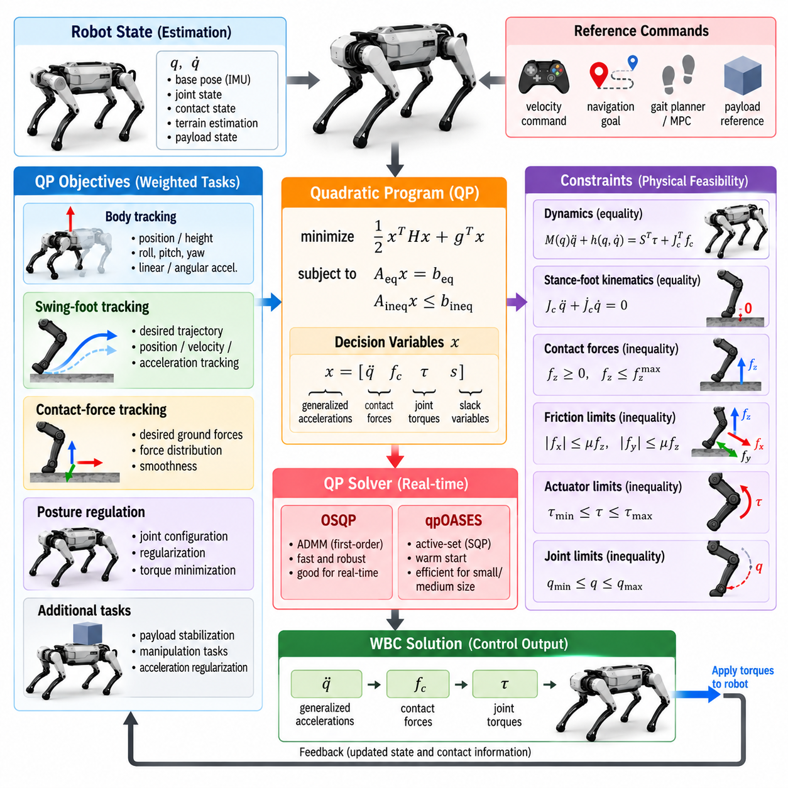{width="7.268055555555556in" height="7.268055555555556in"}

Quadratic Programming (QP) is one of the most practical mathematical foundations for Whole-Body Control (WBC) in quadruped robots. It allows body acceleration, joint motion, ground reaction forces, and actuator torques to be optimized together while explicitly enforcing physical constraints. The resulting controller can coordinate many competing objectives without separating locomotion into independent joint-level problems.

A standard convex QP minimizes an objective of the form 1/2 xᵀHx + gᵀx while satisfying equality and inequality constraints. In quadruped WBC, the decision vector x may contain generalized accelerations, joint torques, contact forces, task slack variables, or combinations of these quantities. The Hessian H and gradient g encode tracking objectives and regularization terms, while constraints describe physical feasibility.

One common formulation selects generalized acceleration q̈ and contact force fc as primary decision variables. Joint torques can then be recovered from the rigid-body dynamics after optimization. Another formulation includes q̈, fc, and τ simultaneously, allowing actuator limits to appear directly in the optimization. The appropriate choice depends on controller architecture, computational budget, actuator interface, and desired constraint structure.

The floating-base equations of motion provide fundamental equality constraints. Because the six-dimensional base has no direct actuator, its translational and rotational dynamics must be generated through contact forces. The QP therefore ensures that candidate accelerations and forces satisfy the robot model. This prevents the optimizer from requesting body motions that cannot be produced through the current stance contacts.

Stance-foot kinematics introduce additional equality constraints. A rigid stationary contact ideally satisfies Jc q̈ + J̇c q̇ = 0, preventing acceleration of the stance foot relative to the terrain. Depending on the contact model, selected directions may instead permit controlled compliance or sliding. These equations connect generalized robot acceleration to the instantaneous geometry of each active contact.

Swing-foot motion is normally represented as a tracking objective rather than a rigid constraint. Desired Cartesian acceleration can be generated from feedforward trajectory acceleration together with position and velocity feedback. The QP minimizes the difference between this desired acceleration and the acceleration predicted through the swing-foot Jacobian. Weighting determines how strongly trajectory tracking competes with other objectives.

Body position and orientation tasks can be constructed similarly. Desired linear and angular accelerations are calculated from reference trajectories and feedback errors, then mapped into generalized coordinates through task Jacobians. The optimizer attempts to reproduce these accelerations while remaining dynamically feasible. Consequently, perfect tracking may be relaxed automatically when contact geometry or actuator capability becomes restrictive.

Ground reaction forces require inequality constraints because feet can push against the ground but normally cannot pull it. Normal force is therefore constrained to remain nonnegative and may also have an upper limit. Tangential forces must remain inside the available friction region. These conditions are essential because unconstrained force optimization can produce mathematically effective but physically impossible contact solutions.

The nonlinear Coulomb friction cone is commonly approximated by a linear friction pyramid for real-time QP computation. Constraints such as \|fx\| ≤ μfz and \|fy\| ≤ μfz can be represented as linear inequalities, where μ is the assumed friction coefficient. Conservative values improve robustness against slipping, although excessive conservatism can unnecessarily reduce the robot\'s available locomotion capability.

Actuator limitations can also be represented directly. Joint torque bounds prevent the optimizer from exceeding motor, transmission, or thermal capability, while acceleration and velocity-related constraints can protect mechanical hardware. Joint-position limits may be handled through predictive bounds that restrict accelerations before a joint reaches its physical boundary. This makes constraint management part of control rather than an external saturation step.

QP objectives often combine several weighted terms. Body tracking, swing-foot tracking, desired contact-force tracking, posture regulation, torque minimization, acceleration regularization, and force smoothing can coexist in one cost function. Large weights emphasize important tasks, whereas smaller weights use residual freedom. Careful normalization is required because task variables may have very different physical units and numerical magnitudes.

Slack variables are useful when strict satisfaction of a task could make the QP infeasible. A constraint can be softened by introducing a controlled violation variable and penalizing it strongly in the objective. This allows the solver to return a physically meaningful degraded solution instead of failing completely. Safety-critical constraints, however, should generally remain hard unless a carefully designed fallback mechanism exists.

Numerical conditioning strongly influences real-time WBC performance. Poorly scaled matrices, nearly dependent constraints, extreme task weights, or ill-conditioned Jacobians can increase solver iterations and produce unstable solutions. Scaling forces, accelerations, torques, and task residuals to comparable numerical ranges improves robustness. Small regularization terms can also make the Hessian better conditioned and reduce ambiguity in redundant solutions.

OSQP is a widely used open-source solver for convex quadratic programs. It uses an operator-splitting approach based on the Alternating Direction Method of Multipliers (ADMM) and is designed to exploit sparse problem structure. WBC problems often contain sparse dynamics and constraint matrices, making OSQP attractive for robotics research, prototyping, and systems where reliable handling of structured QPs is important.

An important characteristic of OSQP is that it can solve convex QPs without requiring every iteration to perform the same operations as classical active-set methods. Its formulation handles equality and inequality constraints in a unified manner. Warm starting from the previous control cycle can substantially improve practical performance because consecutive WBC optimization problems usually differ only slightly during continuous locomotion.

OSQP also supports factorization reuse when the sparsity pattern remains unchanged. In a quadruped controller, the dimensions and matrix structure often remain similar across many control cycles, especially within the same contact phase. Updating numerical values while preserving symbolic structure reduces computational overhead. Contact switching still requires careful implementation because the active constraint structure can change with gait phase.

qpOASES represents a different solver philosophy and is well known for online and model-predictive optimization. It uses an active-set strategy designed to exploit the fact that sequential QPs often change gradually. The solver identifies constraints that are active at the optimum and updates this working set as parameters change. This behavior can be effective for control applications requiring repeated solutions of closely related QPs.

The online active-set strategy of qpOASES can provide very fast solutions when the optimal active set changes only modestly between control cycles. Warm-start information from the previous QP is therefore particularly valuable. However, computational time can vary when contact transitions, disturbances, or major reference changes cause substantial modifications to the active constraint set, which must be considered in hard real-time implementations.

Choosing between OSQP and qpOASES should therefore depend on the actual WBC formulation rather than solver popularity alone. OSQP is attractive for sparse convex problems and offers predictable iterative behavior with adjustable accuracy. qpOASES can be highly efficient for smaller dense or moderately sized sequential QPs with favorable active-set evolution. Benchmarking should use the robot\'s real matrix dimensions and contact transitions.

Solver accuracy must also be selected according to control requirements. Extremely tight numerical tolerances may consume unnecessary computation, whereas loose tolerances can create constraint violations or noisy torque commands. A WBC implementation should evaluate primal residuals, dual residuals, constraint margins, solution quality, and computation time together rather than judging a solver solely by whether it reports successful convergence.

Warm starting is especially effective because quadruped dynamics evolve continuously at high control frequency. The previous solution for acceleration, torque, and contact force is usually close to the next optimum. Reusing primal variables, dual variables, or active-set information can reduce computation significantly. At gait transitions, however, obsolete contact forces and multipliers should be reset or transformed appropriately.

Real-time implementation requires deterministic data handling around the solver. Robot state estimation, dynamics computation, Jacobian evaluation, QP assembly, numerical solution, and command transmission must all fit inside the control period. Dynamic memory allocation and unnecessary matrix reconstruction should be minimized. Preallocated sparse structures and fixed-size linear algebra can substantially reduce latency variation in high-frequency control loops.

The controller must also define behavior for solver failure. Maximum iteration limits, numerical errors, infeasibility, or delayed computation should never result in undefined actuator commands. A practical WBC system can retain a previous safe command briefly, switch to a simplified stabilizing controller, reduce task demands, increase slack, or initiate a controlled stop depending on the severity and duration of the failure.

Monitoring solver health is therefore part of robot safety. Useful runtime signals include solution status, iteration count, computation time, maximum constraint violation, friction margin, torque margin, and task residuals. Sudden changes can indicate contact-estimation errors, unrealistic planner commands, poor model parameters, or numerical conditioning problems before they become visible as severe physical instability.

Contact transitions are among the most demanding moments for a QP-based WBC solver. When a foot touches down or lifts off, contact Jacobians, force variables, and inequality constraints change. Smooth force ramping and consistent initialization prevent large discontinuities. Some implementations preserve fixed QP dimensions and activate or deactivate contacts through bounds, reducing structural changes and simplifying memory management.

Hierarchical behavior can be implemented inside QP-based WBC using weights, sequential QPs, or lexicographic optimization. A single weighted QP is computationally simple but does not guarantee strict task priority. Sequential QPs provide stronger priority semantics by preserving higher-level solutions before optimizing lower levels. The appropriate architecture depends on whether mission-critical objectives require mathematically strict separation.

QP-based WBC becomes particularly powerful when connected to Model Predictive Control (MPC). MPC can provide desired body trajectories and contact-force references over a future horizon, while the WBC QP enforces full-body dynamics and actuator constraints at the current instant. The QP effectively converts reduced-order planning decisions into feasible commands for the complete articulated quadruped.

A successful implementation is ultimately determined by the complete control pipeline rather than the solver alone. Accurate dynamics, reliable contact estimation, properly scaled tasks, physically meaningful constraints, warm-start strategies, bounded computation time, and robust fallback logic are all essential. OSQP or qpOASES provides the numerical optimization engine, but the quality of WBC depends on how carefully the physical control problem is formulated around that engine.

이차 계획법(Quadratic Programming, QP)은 사족보행 로봇의 전신 제어(Whole-Body Control, WBC)를 구현하기 위한 가장 실용적인 수학적 기반 중 하나이다. 이를 통해 몸체 가속도(Body Acceleration), 관절 운동(Joint Motion), 지면 반력(Ground Reaction Force), 구동기 토크(Actuator Torque)를 함께 최적화하면서 물리적 제약조건을 명시적으로 적용할 수 있다. 따라서 이동 문제를 독립적인 관절 수준 문제로 분리하지 않고 여러 경쟁 목표를 통합적으로 조정할 수 있다.

표준 볼록 이차 계획법(Convex QP)은 등식 및 부등식 제약조건을 만족하면서 1/2 xᵀHx + gᵀx 형태의 목적함수(Objective Function)를 최소화한다. 사족보행 WBC에서 결정 변수 벡터(Decision Vector) x는 일반화 가속도(Generalized Acceleration), 관절 토크(Joint Torque), 접촉력(Contact Force), 작업 슬랙 변수(Task Slack Variable), 또는 이들의 조합을 포함할 수 있다. 헤시안 행렬(Hessian Matrix) H와 기울기 벡터(Gradient Vector) g는 추종 목표와 정규화 항(Regularization Term)을 표현하며, 제약조건은 물리적 실현 가능성을 정의한다.

일반적인 구성 중 하나는 일반화 가속도 q̈와 접촉력 fc를 주요 결정 변수로 선택하는 것이다. 이후 최적화 결과와 강체 동역학(Rigid-Body Dynamics)을 이용하여 관절 토크를 계산할 수 있다. 또 다른 구성에서는 q̈, fc, τ를 동시에 결정 변수에 포함하여 구동기 한계(Actuator Limit)를 최적화 문제에 직접 적용한다. 적절한 선택은 제어기 구조(Controller Architecture), 계산 자원(Computational Budget), 구동기 인터페이스(Actuator Interface), 원하는 제약조건 구조에 따라 달라진다.

부유 기저 운동 방정식(Floating-Base Equation of Motion)은 기본적인 등식 제약조건(Equality Constraint)을 제공한다. 6차원의 기저(Base)는 직접 구동할 수 없으므로 병진 및 회전 동역학(Translational and Rotational Dynamics)은 접촉력을 통해 생성되어야 한다. 따라서 QP는 후보 가속도와 힘이 로봇 모델을 만족하도록 보장한다. 이를 통해 최적화기가 현재의 지지 접촉(Stance Contact)을 통해 생성할 수 없는 몸체 운동을 요구하는 것을 방지한다.

지지 발 운동학(Stance-Foot Kinematics)은 추가적인 등식 제약조건을 도입한다. 이상적인 강체 정지 접촉(Rigid Stationary Contact)은 Jc q̈ + J̇c q̇ = 0을 만족하여 지면에 대한 지지 발의 가속도를 방지한다. 접촉 모델(Contact Model)에 따라 특정 방향에서는 제어된 순응성(Controlled Compliance)이나 미끄러짐(Sliding)을 허용할 수도 있다. 이러한 방정식은 일반화 로봇 가속도와 각 활성 접촉점(Active Contact)의 순간적인 기하학적 관계를 연결한다.

유각 발 운동(Swing-Foot Motion)은 일반적으로 강성 제약조건(Hard Constraint)이 아니라 추종 목표(Tracking Objective)로 표현된다. 원하는 데카르트 가속도(Cartesian Acceleration)는 피드포워드 궤적 가속도(Feedforward Trajectory Acceleration)에 위치 및 속도 피드백을 결합하여 생성할 수 있다. QP는 이 원하는 가속도와 유각 발 자코비안(Swing-Foot Jacobian)을 통해 예측되는 가속도의 차이를 최소화한다. 가중치(Weighting)는 궤적 추종이 다른 목표와 어느 정도 강하게 경쟁할 것인지를 결정한다.

몸체 위치 및 방향 작업(Body Position and Orientation Task)도 유사한 방식으로 구성할 수 있다. 원하는 선형 및 각가속도(Linear and Angular Acceleration)는 기준 궤적(Reference Trajectory)과 피드백 오차(Feedback Error)를 통해 계산된 후 작업 자코비안(Task Jacobian)을 이용하여 일반화 좌표(Generalized Coordinate)에 대응된다. 최적화기는 동역학적 실현 가능성을 유지하면서 이러한 가속도를 구현하려고 한다. 따라서 접촉 형상이나 구동기 능력이 제한될 경우 완벽한 추종은 자동으로 완화될 수 있다.

지면 반력(Ground Reaction Force)에는 발이 지면을 밀 수 있지만 일반적으로 당길 수는 없기 때문에 부등식 제약조건(Inequality Constraint)이 필요하다. 따라서 수직력(Normal Force)은 음수가 되지 않도록 제한되며 상한값도 설정할 수 있다. 접선 방향 힘(Tangential Force)은 사용 가능한 마찰 영역(Friction Region) 내부에 있어야 한다. 이러한 조건은 제약되지 않은 힘 최적화가 수학적으로 효과적이지만 물리적으로 불가능한 접촉력 해를 생성하는 것을 방지하기 위해 필수적이다.

비선형 쿨롱 마찰 원뿔(Nonlinear Coulomb Friction Cone)은 실시간 QP 계산을 위해 일반적으로 선형 마찰 피라미드(Linear Friction Pyramid)로 근사된다. \|fx\| ≤ μfz 및 \|fy\| ≤ μfz와 같은 조건은 선형 부등식으로 표현할 수 있으며, 여기서 μ는 가정된 마찰계수(Friction Coefficient)이다. 보수적인 값을 사용하면 미끄러짐에 대한 강인성이 향상되지만 지나치게 보수적인 설정은 로봇이 사용할 수 있는 이동 능력을 불필요하게 제한할 수 있다.

구동기 한계(Actuator Limitation) 역시 직접 표현할 수 있다. 관절 토크 한계(Joint Torque Bound)는 최적화기가 모터, 변속기(Transmission), 열적 성능(Thermal Capability)을 초과하는 명령을 생성하는 것을 방지하며, 가속도 및 속도 관련 제약조건은 기계 하드웨어를 보호할 수 있다. 관절 위치 한계(Joint-Position Limit)는 관절이 물리적 경계에 도달하기 전에 가속도를 제한하는 예측형 경계(Predictive Bound)를 통해 처리할 수 있다. 이를 통해 제약조건 관리가 외부 포화 처리(Saturation)가 아니라 제어 문제 자체의 일부가 된다.

QP 목적함수는 여러 개의 가중 항(Weighted Term)을 결합하는 경우가 많다. 몸체 추종(Body Tracking), 유각 발 추종(Swing-Foot Tracking), 원하는 접촉력 추종(Contact-Force Tracking), 자세 조절(Posture Regulation), 토크 최소화(Torque Minimization), 가속도 정규화(Acceleration Regularization), 힘 평활화(Force Smoothing)를 하나의 비용함수에 포함할 수 있다. 큰 가중치는 중요한 작업을 강조하고 작은 가중치는 남아 있는 자유도를 활용한다. 작업 변수의 물리적 단위와 수치적 크기가 크게 다를 수 있으므로 신중한 정규화(Normalization)가 필요하다.

슬랙 변수(Slack Variable)는 작업을 엄격하게 만족시키는 것이 QP를 실현 불가능하게 만들 수 있는 경우 유용하다. 제어된 위반 변수(Violation Variable)를 도입하고 목적함수에서 이에 큰 페널티(Penalty)를 부여함으로써 제약조건을 완화할 수 있다. 이를 통해 솔버(Solver)가 완전히 실패하는 대신 물리적으로 의미 있는 성능 저하 해(Degraded Solution)를 반환할 수 있다. 그러나 안전 필수 제약조건(Safety-Critical Constraint)은 신중하게 설계된 폴백 메커니즘(Fallback Mechanism)이 없는 한 일반적으로 강성 제약조건으로 유지해야 한다.

수치적 조건성(Numerical Conditioning)은 실시간 WBC 성능에 큰 영향을 미친다. 적절하게 스케일링되지 않은 행렬, 거의 종속적인 제약조건, 극단적인 작업 가중치, 또는 조건이 나쁜 자코비안(Ill-Conditioned Jacobian)은 솔버 반복 횟수를 증가시키고 불안정한 해를 생성할 수 있다. 힘, 가속도, 토크, 작업 잔차(Task Residual)를 유사한 수치 범위로 스케일링하면 강인성이 향상된다. 작은 정규화 항을 추가하면 헤시안의 조건성을 개선하고 여유도가 있는 해의 모호성을 줄일 수 있다.

OSQP는 볼록 이차 계획법을 위한 널리 사용되는 오픈소스 솔버(Open-Source Solver)이다. OSQP는 교대 방향 승수법(Alternating Direction Method of Multipliers, ADMM)에 기반한 연산자 분할(Operator Splitting) 방식을 사용하며 희소 문제 구조(Sparse Problem Structure)를 활용하도록 설계되었다. WBC 문제는 일반적으로 희소한 동역학 및 제약 행렬을 포함하므로 OSQP는 로봇 연구, 프로토타이핑(Prototyping), 구조화된 QP를 안정적으로 처리해야 하는 시스템에서 유용하다.

OSQP의 중요한 특징 중 하나는 고전적인 활성 집합 방법(Active-Set Method)과 다른 방식으로 볼록 QP를 해결할 수 있다는 것이다. OSQP의 구성은 등식 및 부등식 제약조건을 통합된 형태로 처리한다. 이전 제어 주기의 결과를 이용한 웜 스타트(Warm Start)는 실제 성능을 크게 향상시킬 수 있는데, 연속적인 보행 과정에서 인접한 WBC 최적화 문제는 일반적으로 작은 차이만 가지기 때문이다.

OSQP는 희소 패턴(Sparsity Pattern)이 변경되지 않는 경우 행렬 분해 재사용(Factorization Reuse)도 지원한다. 사족보행 제어기에서는 특히 동일한 접촉 단계(Contact Phase) 동안 문제의 차원과 행렬 구조가 여러 제어 주기에 걸쳐 유사하게 유지되는 경우가 많다. 기호적 구조(Symbolic Structure)를 유지하면서 수치값만 갱신하면 계산 오버헤드를 줄일 수 있다. 그러나 보행 단계에 따라 활성 제약조건 구조가 달라질 수 있으므로 접촉 전환(Contact Switching)은 신중하게 구현해야 한다.

qpOASES는 다른 솔버 철학(Solver Philosophy)을 사용하며 온라인 및 모델 예측 최적화(Model-Predictive Optimization) 분야에서 잘 알려져 있다. qpOASES는 연속적인 QP가 점진적으로 변화한다는 특성을 활용하도록 설계된 활성 집합 전략(Active-Set Strategy)을 사용한다. 솔버는 최적해에서 활성화되는 제약조건을 식별하고 매개변수가 변화함에 따라 작업 집합(Working Set)을 갱신한다. 이러한 특성은 서로 밀접하게 연관된 QP를 반복적으로 해결해야 하는 제어 응용에서 효과적일 수 있다.

qpOASES의 온라인 활성 집합 전략(Online Active-Set Strategy)은 제어 주기 사이에서 최적 활성 집합(Optimal Active Set)이 크게 변화하지 않을 경우 매우 빠른 해를 제공할 수 있다. 따라서 이전 QP의 웜 스타트 정보가 특히 중요하다. 그러나 접촉 전환, 외란(Disturbance), 큰 기준값 변화로 활성 제약조건 집합이 크게 변경되면 계산 시간이 달라질 수 있으며, 이는 하드 실시간 구현(Hard Real-Time Implementation)에서 반드시 고려해야 한다.

따라서 OSQP와 qpOASES 중 하나를 선택할 때는 솔버의 인지도보다는 실제 WBC 구성에 기반해야 한다. OSQP는 희소 볼록 문제(Sparse Convex Problem)에 적합하며 조절 가능한 정확도와 비교적 예측 가능한 반복 특성을 제공한다. qpOASES는 활성 집합의 변화가 적절한 소규모 밀집 문제(Dense Problem) 또는 중간 규모의 연속 QP에서 매우 효율적일 수 있다. 성능 평가는 실제 로봇의 행렬 차원(Matrix Dimension)과 접촉 전환 조건을 사용하여 수행해야 한다.

솔버 정확도(Solver Accuracy) 역시 제어 요구조건에 맞게 선택해야 한다. 지나치게 엄격한 수치 허용오차(Numerical Tolerance)는 불필요한 계산량을 증가시키는 반면, 너무 느슨한 허용오차는 제약조건 위반이나 노이즈가 많은 토크 명령을 발생시킬 수 있다. WBC 구현에서는 솔버가 성공적인 수렴을 보고했는지만 평가할 것이 아니라 원시 잔차(Primal Residual), 쌍대 잔차(Dual Residual), 제약조건 여유(Constraint Margin), 해의 품질(Solution Quality), 계산 시간을 함께 평가해야 한다.

웜 스타트(Warm Starting)는 사족보행 로봇의 동역학이 높은 제어 주파수에서 연속적으로 변화하기 때문에 특히 효과적이다. 이전 주기의 가속도, 토크, 접촉력 해는 일반적으로 다음 최적해와 가깝다. 원시 변수(Primal Variable), 쌍대 변수(Dual Variable), 활성 집합 정보를 재사용하면 계산량을 크게 줄일 수 있다. 그러나 보행 전환 시에는 더 이상 유효하지 않은 접촉력과 승수(Multiplier)를 적절히 초기화하거나 변환해야 한다.

실시간 구현(Real-Time Implementation)에서는 솔버 주변의 결정론적 데이터 처리(Deterministic Data Handling)도 필요하다. 로봇 상태 추정, 동역학 계산, 자코비안 계산, QP 구성, 수치해 계산, 명령 전송이 모두 하나의 제어 주기(Control Period) 안에 완료되어야 한다. 동적 메모리 할당(Dynamic Memory Allocation)과 불필요한 행렬 재구성은 최소화해야 한다. 사전에 할당된 희소 구조(Preallocated Sparse Structure)와 고정 크기 선형대수(Fixed-Size Linear Algebra)는 고주파 제어 루프의 지연 변동(Latency Variation)을 크게 줄일 수 있다.

제어기는 솔버 실패(Solver Failure)에 대한 동작도 정의해야 한다. 최대 반복 횟수 초과, 수치 오류, 실현 불가능성(Infeasibility), 계산 지연이 발생했을 때 정의되지 않은 구동기 명령이 출력되어서는 안 된다. 실제 WBC 시스템은 실패의 심각성과 지속 시간에 따라 이전의 안전한 명령을 짧은 시간 동안 유지하거나, 단순화된 안정화 제어기(Stabilizing Controller)로 전환하거나, 작업 요구량을 줄이거나, 슬랙을 증가시키거나, 제어된 정지(Controlled Stop)를 시작할 수 있다.

따라서 솔버 상태 감시(Solver Health Monitoring)는 로봇 안전의 일부이다. 유용한 실시간 신호에는 해 상태(Solution Status), 반복 횟수(Iteration Count), 계산 시간, 최대 제약조건 위반(Maximum Constraint Violation), 마찰 여유(Friction Margin), 토크 여유(Torque Margin), 작업 잔차가 포함된다. 이러한 값의 갑작스러운 변화는 심각한 물리적 불안정성이 나타나기 전에 접촉 추정 오류, 비현실적인 계획기 명령, 부정확한 모델 매개변수, 수치적 조건성 문제를 나타낼 수 있다.

접촉 전환(Contact Transition)은 QP 기반 WBC 솔버에 가장 까다로운 순간 중 하나이다. 발이 착지하거나 지면에서 떨어질 때 접촉 자코비안(Contact Jacobian), 힘 변수(Force Variable), 부등식 제약조건이 변화한다. 부드러운 힘 램핑(Force Ramping)과 일관된 초기화(Consistent Initialization)는 큰 불연속을 방지한다. 일부 구현에서는 QP 차원을 고정한 상태로 유지하고 경계조건(Bound)을 통해 접촉을 활성화하거나 비활성화하여 구조적 변화를 줄이고 메모리 관리를 단순화한다.

QP 기반 WBC의 계층적 동작(Hierarchical Behavior)은 가중치, 순차적 QP(Sequential QP), 또는 사전식 최적화(Lexicographic Optimization)를 이용하여 구현할 수 있다. 단일 가중 QP(Weighted QP)는 계산적으로 단순하지만 엄격한 작업 우선순위를 보장하지 않는다. 순차적 QP는 하위 단계를 최적화하기 전에 상위 단계의 해를 보존함으로써 더욱 강력한 우선순위 의미를 제공한다. 적절한 구조는 임무 필수 목표(Mission-Critical Objective)에 수학적으로 엄격한 분리가 필요한지에 따라 결정된다.

QP 기반 WBC는 모델 예측 제어(Model Predictive Control, MPC)와 연결될 때 특히 강력해진다. MPC는 미래 예측 구간에 대한 원하는 몸체 궤적과 접촉력 기준값을 제공할 수 있으며, WBC QP는 현재 시점에서 전신 동역학(Full-Body Dynamics)과 구동기 제약조건을 적용한다. 따라서 QP는 축소 차수 모델(Reduced-Order Model)을 이용한 계획 결과를 완전한 관절형 사족보행 로봇(Articulated Quadruped)이 실행할 수 있는 명령으로 변환하는 역할을 한다.

성공적인 구현은 궁극적으로 솔버 자체가 아니라 전체 제어 파이프라인(Control Pipeline)에 의해 결정된다. 정확한 동역학, 신뢰성 높은 접촉 추정, 적절하게 스케일링된 작업, 물리적으로 의미 있는 제약조건, 웜 스타트 전략, 제한된 계산 시간, 강인한 폴백 로직(Fallback Logic)이 모두 필수적이다. OSQP 또는 qpOASES는 수치 최적화 엔진(Numerical Optimization Engine)을 제공하지만, WBC의 품질은 해당 엔진을 중심으로 물리적 제어 문제를 얼마나 신중하게 구성하는가에 의해 결정된다.

##  

## 06.04. Swing and Stance Leg Task Management [w/Code]

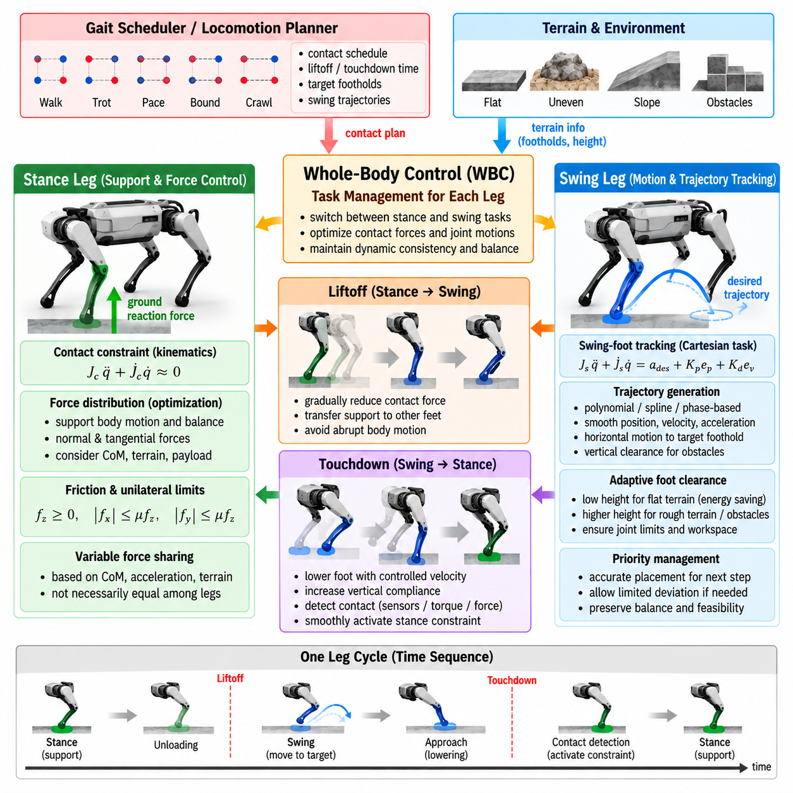{width="7.268055555555556in" height="7.268055555555556in"}

Swing and stance leg task management is a central function of Whole-Body Control (WBC) because each quadruped leg repeatedly changes its physical role during locomotion. A stance leg supports and accelerates the floating body through ground reaction forces, whereas a swing leg moves toward a future foothold without intentionally supporting the robot. WBC must change these task definitions continuously while preserving dynamic consistency.

The gait scheduler provides the fundamental contact mode for each leg. Depending on the selected gait, such as walk, trot, pace, bound, or crawl, every foot receives planned liftoff and touchdown times. WBC uses this contact schedule to determine which feet are modeled as active contacts and which are treated as free-moving end effectors. Accurate synchronization between the gait generator and WBC is therefore essential.

During stance, the foot becomes part of the robot-environment constraint system. For an ideal rigid contact, its velocity relative to the terrain should remain approximately zero and its acceleration should satisfy the corresponding contact kinematics. The controller uses the stance-foot Jacobian to constrain generalized acceleration while optimizing contact forces that support desired body motion and maintain balance.

Ground reaction force is the primary control mechanism available to a stance leg. By coordinating normal and tangential forces across all supporting feet, WBC can regulate center-of-mass acceleration, trunk orientation, angular momentum, and disturbance rejection. The force assigned to each foot must remain compatible with friction, unilateral contact, actuator capability, and the geometry of the current support configuration.

Stance-force distribution should not necessarily be equal among all supporting legs. The required distribution depends on the center-of-mass position, desired acceleration, terrain geometry, payload, and number of active contacts. A foot positioned near the projected load may carry more normal force, while another contact may contribute more strongly to yaw or lateral stabilization. WBC resolves this distribution as a coupled optimization problem.

The swing phase begins when a foot is intentionally unloaded and released from its contact constraints. Its role changes from force generation to motion tracking. A swing trajectory typically moves the foot from the previous foothold toward a planned landing location while maintaining sufficient terrain clearance. Position, velocity, and acceleration references are provided to WBC and converted into dynamically consistent joint behavior.

Swing trajectories are commonly designed with smooth polynomial, spline, or phase-based functions. Horizontal motion progresses toward the target foothold, while vertical motion raises the foot to a clearance height and subsequently lowers it for touchdown. Smooth velocity and acceleration profiles are important because discontinuous references can generate abrupt joint torques, excite structural vibration, and interfere with body stabilization.

Foot clearance is not a fixed geometric requirement in all environments. Flat indoor terrain may permit a relatively low swing height, reducing energy consumption and unnecessary leg motion. Rough outdoor terrain may require increased clearance based on elevation maps, obstacle estimates, or uncertainty. WBC must realize the resulting trajectory while ensuring that joint limits and leg workspace remain feasible.

Swing-foot tracking is usually formulated as a Cartesian task. If Js represents the swing-foot Jacobian, the commanded foot acceleration is related to generalized acceleration through Js q̈ + J̇s q̇. Feedback terms based on position and velocity errors can be added to the desired feedforward acceleration. This formulation allows the optimizer to coordinate swing motion with simultaneous trunk and stance-leg behavior.

The relative priority of swing-foot tracking must be chosen carefully. Accurate placement is important because the touchdown location determines the geometry of the next support phase. However, enforcing swing tracking too strongly can conflict with body stabilization, joint limits, or torque constraints. Practical WBC therefore allows limited trajectory deviation when preserving balance or hardware feasibility requires additional control freedom.

Liftoff is a transition rather than an instantaneous change of physical role. Before removing a stance constraint, the controller can progressively reduce the desired contact force on that leg. This unloading process transfers support to the remaining feet and prevents abrupt changes in body acceleration. Once the normal force approaches an appropriate level, the leg can transition into swing motion with reduced disturbance.

Touchdown requires similarly careful management. The controller should avoid driving the foot aggressively into the terrain using a rigid position objective. Near the expected contact time, downward velocity can be reduced and vertical compliance increased. Contact sensors, joint torque estimates, force measurements, or proprioceptive detection can identify actual touchdown and trigger the transition from swing tracking to stance constraints.

Planned and measured contact states may differ. A foot can encounter the ground earlier than expected because of an obstacle or terrain-height error, or it may fail to contact at the expected time because the surface is lower than predicted. Robust WBC therefore should not rely exclusively on the gait schedule. Contact estimation provides feedback that allows task management to respond to the physical environment.

Early contact requires rapid but smooth modification of the swing task. Continuing the original downward trajectory after contact can generate a large impact force or cause slipping. Once reliable early contact is detected, the controller can terminate vertical swing tracking, introduce compliant contact behavior, and gradually activate stance-force capability. This transition should avoid instantaneous changes in commanded torque.

Late contact presents the opposite problem. If touchdown is expected but no contact is detected, immediately imposing a rigid stance constraint would create an incorrect model of the robot-environment interaction. The controller may extend the leg downward within safe workspace limits while maintaining body support through the remaining contacts. The planned stance task is activated only after contact becomes sufficiently credible.

Contact confidence can be treated continuously rather than as a purely binary variable. During uncertain transitions, force limits, task weights, or constraint stiffness can be adjusted according to estimated contact probability. A newly detected contact may initially receive a small allowable normal force, which increases as confidence grows. Such gradual activation reduces sensitivity to noisy contact classification.

Stance-foot slip is another important task-management condition. The rigid-contact assumption becomes invalid when tangential ground forces exceed available friction or the terrain moves beneath the foot. Slip can be detected using discrepancies between predicted and measured foot velocity, inertial motion, or force information. WBC can then reduce tangential force demand and modify body or foothold objectives.

Terrain orientation affects both stance and swing management. A stance foot on an inclined surface should use a contact frame aligned with the local terrain normal when reliable geometry is available. Friction constraints can then be expressed relative to that surface. For swing motion, terrain estimates influence landing height, approach direction, clearance, and the orientation requirements of specialized feet or end effectors.

The support polygon and contact geometry change every time a leg enters or leaves stance. During four-leg support, substantial redundancy exists for distributing forces and stabilizing the trunk. During diagonal two-leg support in a trot, force authority is more restricted. WBC must therefore adapt task weights, feasible force ranges, and body objectives according to the instantaneous support configuration.

Dynamic gaits make this adaptation particularly important because stance periods are short and forces can become large. Rapid force changes at touchdown and liftoff may excite the body or exceed actuator limits. Force-rate regularization can penalize excessive differences between consecutive contact-force solutions. This creates smoother load transfer while still allowing the controller to respond to disturbances.

Joint-space posture objectives remain active underneath swing and stance tasks but should not interfere with their primary roles. During swing, posture regulation can guide the leg toward comfortable configurations while the foot follows its Cartesian trajectory. During stance, internal posture objectives can avoid joint limits and singularities while contact forces support the body. Higher-priority contact and balance requirements must remain protected.

Leg workspace management is particularly important for foothold feasibility. A navigation or locomotion planner may request a foot position that lies near or beyond the kinematic reach of the leg. WBC cannot correct an fundamentally unreachable target through optimization alone. Workspace constraints or reachability checks should therefore modify foothold commands before excessive joint motion or infeasibility occurs.

Swing-leg motion also affects the floating body through inertial coupling. Although a swing leg does not generate intentional ground reaction force, rapidly accelerating its links produces reaction forces and moments on the trunk. Full-body dynamics naturally capture these effects. This becomes increasingly important for heavy legs, high-speed running, or robots carrying additional equipment on distal links.

Payload conditions can modify stance and swing priorities. A heavy or offset payload changes the combined center of mass and may require asymmetric stance-force distribution. If payload orientation must remain stable, swing-leg acceleration may need to be limited to reduce trunk disturbances. Task management therefore connects leg-level behavior to mission-level requirements rather than treating each leg independently.

Model Predictive Control (MPC) can provide WBC with future contact schedules, desired ground reaction forces, body trajectories, and foothold locations. WBC then realizes the current portion of that plan using the complete robot model and measured state. Differences between predicted and actual contact can be corrected locally, while significant deviations can be communicated upward so that the future plan is regenerated.

Real-time implementation benefits from maintaining a consistent mathematical structure across gait transitions. Instead of repeatedly changing optimization dimensions, some WBC systems retain variables for all feet and modify bounds, weights, or constraints according to contact mode. This can simplify memory management, preserve sparse matrix structure, and reduce numerical disturbances when the robot switches between swing and stance.

Safe failure handling must also consider individual leg tasks. If swing tracking becomes infeasible, the controller may reduce trajectory acceleration or select a safer intermediate configuration. If a stance contact becomes unreliable, force should be redistributed to other available contacts whenever possible. Severe loss of support may require gait recovery, emergency stepping, body lowering, or a controlled stop.

Effective swing and stance management ultimately depends on treating contact as a dynamic process rather than a fixed binary schedule. Planned gait phase, measured contact, terrain geometry, friction, force capability, workspace, and whole-body stability must be considered together. By continuously redefining each leg's task and smoothly managing transitions, WBC enables a quadruped to transform coordinated foot motion into stable, adaptable, and dynamically consistent locomotion.

유각 및 지지 다리 작업 관리(Swing and Stance Leg Task Management)는 각 다리가 이동 과정에서 물리적 역할을 반복적으로 변경하기 때문에 전신 제어(Whole-Body Control, WBC)의 핵심 기능이다. 지지 다리(Stance Leg)는 지면 반력(Ground Reaction Force)을 통해 부유 몸체(Floating Body)를 지지하고 가속하는 반면, 유각 다리(Swing Leg)는 의도적으로 로봇을 지지하지 않고 다음 발 디딤 위치(Foothold)를 향해 이동한다. WBC는 동역학적 일관성(Dynamic Consistency)을 유지하면서 이러한 작업 정의를 지속적으로 변경해야 한다.

보행 스케줄러(Gait Scheduler)는 각 다리에 대한 기본적인 접촉 모드(Contact Mode)를 제공한다. 워크(Walk), 트로트(Trot), 페이스(Pace), 바운드(Bound), 크롤(Crawl)과 같은 선택된 보행 형태에 따라 각 발에는 계획된 이륙(Liftoff) 및 착지(Touchdown) 시간이 할당된다. WBC는 이러한 접촉 일정(Contact Schedule)을 이용하여 어떤 발을 활성 접촉(Active Contact)으로 모델링하고 어떤 발을 자유롭게 움직이는 말단장치(Free-Moving End Effector)로 처리할지를 결정한다. 따라서 보행 생성기(Gait Generator)와 WBC 사이의 정확한 동기화가 필수적이다.

지지 단계(Stance Phase)에서 발은 로봇-환경 제약 시스템(Robot-Environment Constraint System)의 일부가 된다. 이상적인 강체 접촉(Rigid Contact)에서는 지면에 대한 발의 상대 속도가 거의 0으로 유지되어야 하며, 가속도는 해당 접촉 운동학(Contact Kinematics)을 만족해야 한다. 제어기는 지지 발 자코비안(Stance-Foot Jacobian)을 이용하여 일반화 가속도(Generalized Acceleration)를 제한하는 동시에 원하는 몸체 운동을 지원하고 균형을 유지하기 위한 접촉력을 최적화한다.

지면 반력(Ground Reaction Force)은 지지 다리가 사용할 수 있는 주요 제어 수단이다. 모든 지지 발의 수직력(Normal Force)과 접선 방향 힘(Tangential Force)을 조정함으로써 WBC는 질량중심 가속도(Center-of-Mass Acceleration), 몸통 방향(Trunk Orientation), 각운동량(Angular Momentum), 외란 억제(Disturbance Rejection)를 조절할 수 있다. 각 발에 할당되는 힘은 마찰, 단방향 접촉(Unilateral Contact), 구동기 성능, 현재 지지 형상(Support Configuration)의 기하학적 조건을 만족해야 한다.

지지력 분배(Stance-Force Distribution)는 모든 지지 다리에 반드시 동일하게 이루어질 필요는 없다. 필요한 힘의 분배는 질량중심 위치, 원하는 가속도, 지형 형상(Terrain Geometry), 페이로드(Payload), 활성 접촉점의 수에 따라 달라진다. 투영된 하중(Projected Load)에 가까운 발은 더 큰 수직력을 담당할 수 있으며, 다른 접촉점은 요(Yaw) 또는 횡방향 안정화(Lateral Stabilization)에 더 크게 기여할 수 있다. WBC는 이러한 힘 분배를 결합 최적화 문제(Coupled Optimization Problem)로 해결한다.

유각 단계(Swing Phase)는 발에서 의도적으로 하중을 제거하고 접촉 제약조건(Contact Constraint)으로부터 해제할 때 시작된다. 이때 다리의 역할은 힘 생성에서 운동 추종(Motion Tracking)으로 변화한다. 일반적인 유각 궤적(Swing Trajectory)은 충분한 지면 간극(Terrain Clearance)을 유지하면서 이전 발 디딤 위치에서 계획된 착지 위치까지 발을 이동시킨다. 위치, 속도, 가속도 기준값이 WBC에 제공되며 동역학적으로 일관된 관절 동작으로 변환된다.

유각 궤적은 일반적으로 부드러운 다항식(Polynomial), 스플라인(Spline), 또는 위상 기반 함수(Phase-Based Function)를 이용하여 설계된다. 수평 운동은 목표 발 디딤 위치를 향해 진행되고, 수직 운동은 발을 일정한 간극 높이(Clearance Height)까지 들어 올린 후 착지를 위해 다시 낮춘다. 불연속적인 기준값은 갑작스러운 관절 토크를 생성하고 구조 진동(Structural Vibration)을 유발하며 몸체 안정화를 방해할 수 있으므로 부드러운 속도 및 가속도 프로파일이 중요하다.

발 간극(Foot Clearance)은 모든 환경에서 고정된 기하학적 요구조건이 아니다. 평탄한 실내 지형에서는 비교적 낮은 유각 높이를 사용할 수 있어 에너지 소비와 불필요한 다리 운동을 줄일 수 있다. 거친 야외 지형에서는 고도 지도(Elevation Map), 장애물 추정(Obstacle Estimation), 불확실성(Uncertainty)을 기반으로 더 큰 간극이 필요할 수 있다. WBC는 관절 한계와 다리 작업 공간(Leg Workspace)의 실현 가능성을 보장하면서 이러한 궤적을 구현해야 한다.

유각 발 추종(Swing-Foot Tracking)은 일반적으로 데카르트 작업(Cartesian Task)으로 구성된다. Js가 유각 발 자코비안(Swing-Foot Jacobian)을 나타낸다면 명령된 발 가속도는 Js q̈ + J̇s q̇를 통해 일반화 가속도와 연결된다. 위치 및 속도 오차를 기반으로 하는 피드백 항(Feedback Term)을 원하는 피드포워드 가속도(Feedforward Acceleration)에 추가할 수 있다. 이러한 구성은 최적화기가 유각 운동을 몸통 및 지지 다리 동작과 동시에 조정할 수 있도록 한다.

유각 발 추종의 상대적 우선순위(Relative Priority)는 신중하게 선택해야 한다. 정확한 발 배치는 착지 위치가 다음 지지 단계의 기하학적 구조를 결정하기 때문에 중요하다. 그러나 유각 추종을 지나치게 강하게 적용하면 몸체 안정화, 관절 한계 또는 토크 제약조건과 충돌할 수 있다. 따라서 실제 WBC에서는 균형이나 하드웨어 실현 가능성을 유지하기 위해 추가적인 제어 자유도가 필요한 경우 제한적인 궤적 편차를 허용한다.

이륙(Liftoff)은 물리적 역할이 순간적으로 변경되는 사건이라기보다 하나의 전환 과정(Transition)이다. 지지 제약조건을 제거하기 전에 제어기는 해당 다리에 요구되는 접촉력을 점진적으로 감소시킬 수 있다. 이러한 하중 제거 과정(Unloading Process)은 지지력을 나머지 발로 전달하여 갑작스러운 몸체 가속도 변화를 방지한다. 수직력이 적절한 수준까지 감소하면 다리는 더 작은 외란으로 유각 운동으로 전환할 수 있다.

착지(Touchdown) 역시 신중하게 관리해야 한다. 제어기는 강성 위치 목표(Rigid Position Objective)를 이용하여 발을 지면에 공격적으로 밀어 넣어서는 안 된다. 예상 접촉 시점에 가까워지면 하강 속도를 줄이고 수직 순응성(Vertical Compliance)을 증가시킬 수 있다. 접촉 센서(Contact Sensor), 관절 토크 추정(Joint Torque Estimation), 힘 측정(Force Measurement), 고유수용성 감지(Proprioceptive Detection)를 통해 실제 착지를 식별하고 유각 추종에서 지지 제약조건으로 전환할 수 있다.

계획된 접촉 상태(Planned Contact State)와 측정된 접촉 상태(Measured Contact State)는 서로 다를 수 있다. 장애물 또는 지형 높이 오차 때문에 발이 예상보다 일찍 지면과 접촉하거나, 실제 지면이 예상보다 낮아 계획된 시점에 접촉하지 못할 수도 있다. 따라서 강인한 WBC는 보행 일정에만 의존해서는 안 된다. 접촉 추정(Contact Estimation)은 작업 관리가 실제 물리적 환경에 대응할 수 있도록 피드백을 제공한다.

조기 접촉(Early Contact)이 발생하면 유각 작업을 빠르면서도 부드럽게 수정해야 한다. 접촉 이후에도 기존의 하강 궤적을 계속 수행하면 큰 충격력(Impact Force)이 발생하거나 미끄러짐을 유발할 수 있다. 신뢰할 수 있는 조기 접촉이 감지되면 제어기는 수직 유각 추종을 종료하고 순응 접촉 동작(Compliant Contact Behavior)을 도입하며 지지력 생성 능력을 점진적으로 활성화할 수 있다. 이 전환 과정에서는 명령 토크가 순간적으로 변화하지 않도록 해야 한다.

지연 접촉(Late Contact)은 반대의 문제를 발생시킨다. 착지가 예상되었지만 실제 접촉이 감지되지 않은 상태에서 즉시 강체 지지 제약조건을 적용하면 로봇-환경 상호작용을 잘못 모델링하게 된다. 제어기는 나머지 접촉점을 통해 몸체를 지지하면서 안전한 작업 공간 범위 내에서 다리를 아래쪽으로 추가 신장할 수 있다. 계획된 지지 작업은 접촉이 충분히 신뢰할 수 있다고 판단된 이후에만 활성화된다.

접촉 신뢰도(Contact Confidence)는 완전한 이진 변수(Binary Variable)가 아니라 연속적인 값으로 처리할 수도 있다. 불확실한 전환 구간에서는 추정된 접촉 확률(Contact Probability)에 따라 힘 한계, 작업 가중치 또는 제약조건 강성(Constraint Stiffness)을 조정할 수 있다. 새롭게 감지된 접촉에는 처음에는 작은 수직력만 허용하고 신뢰도가 증가함에 따라 허용 힘을 점진적으로 증가시킬 수 있다. 이러한 점진적 활성화는 노이즈가 포함된 접촉 분류에 대한 민감도를 줄인다.

지지 발 미끄러짐(Stance-Foot Slip)도 중요한 작업 관리 조건이다. 접선 방향 지면력이 사용 가능한 마찰력을 초과하거나 발 아래의 지면 자체가 움직이는 경우 강체 접촉 가정은 더 이상 유효하지 않다. 미끄러짐은 예측된 발 속도와 측정된 발 속도, 관성 운동(Inertial Motion), 힘 정보 사이의 불일치를 이용하여 감지할 수 있다. WBC는 이후 접선 방향 힘 요구량을 줄이고 몸체 또는 발 디딤 목표를 수정할 수 있다.

지형 방향(Terrain Orientation)은 지지 및 유각 관리 모두에 영향을 준다. 경사면에 위치한 지지 발은 신뢰할 수 있는 지형 형상 정보가 존재하는 경우 국부 지면 법선(Local Terrain Normal)에 정렬된 접촉 좌표계(Contact Frame)를 사용할 수 있다. 이후 마찰 제약조건은 해당 표면을 기준으로 표현할 수 있다. 유각 운동에서는 지형 추정값이 착지 높이, 접근 방향(Approach Direction), 발 간극, 특수 발 또는 말단장치의 방향 요구조건에 영향을 준다.

지지 다각형(Support Polygon)과 접촉 형상(Contact Geometry)은 다리가 지지 상태에 진입하거나 이탈할 때마다 변화한다. 네 다리가 모두 지지하는 상태에서는 힘 분배와 몸통 안정화를 위한 상당한 여유도(Redundancy)가 존재한다. 반면 트로트에서 대각선 두 다리만 지지하는 상태에서는 사용할 수 있는 힘 제어 능력이 더욱 제한된다. 따라서 WBC는 순간적인 지지 구성에 따라 작업 가중치, 실현 가능한 힘 범위, 몸체 목표를 조정해야 한다.

동적 보행(Dynamic Gait)에서는 지지 시간이 짧고 접촉력이 커질 수 있기 때문에 이러한 적응이 특히 중요하다. 착지와 이륙 과정에서 급격한 힘 변화가 발생하면 몸체 진동을 유발하거나 구동기 한계를 초과할 수 있다. 힘 변화율 정규화(Force-Rate Regularization)는 연속된 접촉력 해 사이의 과도한 차이에 페널티를 부여할 수 있다. 이를 통해 외란에 대한 제어기의 대응 능력을 유지하면서도 보다 부드러운 하중 전달(Load Transfer)을 구현할 수 있다.

관절 공간 자세 목표(Joint-Space Posture Objective)는 유각 및 지지 작업 아래에서 계속 활성화될 수 있지만 각각의 주요 역할을 방해해서는 안 된다. 유각 단계에서는 자세 조절이 발의 데카르트 궤적을 유지하면서 다리를 편안한 관절 구성으로 유도할 수 있다. 지지 단계에서는 내부 자세 목표가 몸체를 지지하는 접촉력을 유지하면서 관절 한계와 특이점(Singularity)을 회피할 수 있다. 그러나 상위 우선순위의 접촉 및 균형 요구조건은 반드시 보호되어야 한다.

다리 작업 공간 관리(Leg Workspace Management)는 발 디딤 위치의 실현 가능성을 위해 특히 중요하다. 내비게이션 또는 이동 계획기가 다리의 운동학적 도달 범위(Kinematic Reach) 근처나 그 바깥에 위치한 발 위치를 요구할 수 있다. WBC 최적화만으로는 근본적으로 도달할 수 없는 목표를 해결할 수 없다. 따라서 과도한 관절 운동이나 최적화 문제의 실현 불가능성이 발생하기 전에 작업 공간 제약조건 또는 도달 가능성 검사(Reachability Check)를 통해 발 디딤 명령을 수정해야 한다.

유각 다리 운동도 관성 결합(Inertial Coupling)을 통해 부유 몸체에 영향을 준다. 유각 다리는 의도적인 지면 반력을 생성하지 않지만 다리 링크(Link)를 빠르게 가속하면 몸통에 반력과 반작용 모멘트(Reaction Moment)가 발생한다. 전신 동역학(Full-Body Dynamics)은 이러한 효과를 자연스럽게 포함한다. 이러한 영향은 다리가 무겁거나 고속 주행을 수행하거나 원위 링크(Distal Link)에 추가 장비가 장착된 로봇에서 더욱 중요해진다.

페이로드 조건(Payload Condition)은 지지 및 유각 우선순위를 변화시킬 수 있다. 무겁거나 중심에서 벗어난 페이로드는 결합 질량중심(Combined Center of Mass)을 변화시키며 비대칭적인 지지력 분배가 필요할 수 있다. 페이로드 방향을 안정적으로 유지해야 한다면 몸통 외란을 줄이기 위해 유각 다리 가속도를 제한해야 할 수도 있다. 따라서 작업 관리는 각 다리를 독립적으로 취급하는 것이 아니라 다리 수준 동작을 임무 수준 요구조건(Mission-Level Requirement)과 연결해야 한다.

모델 예측 제어(Model Predictive Control, MPC)는 미래 접촉 일정, 원하는 지면 반력, 몸체 궤적, 발 디딤 위치를 WBC에 제공할 수 있다. WBC는 완전한 로봇 모델(Complete Robot Model)과 측정된 상태를 이용하여 해당 계획의 현재 부분을 실행한다. 예측된 접촉과 실제 접촉 사이의 차이는 국부적으로 수정할 수 있으며, 큰 차이가 발생한 경우 이를 상위 계층에 전달하여 미래 계획을 다시 생성할 수 있다.

실시간 구현(Real-Time Implementation)에서는 보행 전환 과정에서도 일관된 수학적 구조를 유지하는 것이 유리하다. 일부 WBC 시스템은 최적화 문제의 차원을 반복적으로 변경하는 대신 모든 발에 대한 변수를 유지하고 접촉 모드에 따라 경계조건(Bound), 가중치 또는 제약조건을 변경한다. 이러한 방법은 메모리 관리를 단순화하고 희소 행렬 구조(Sparse Matrix Structure)를 유지하며 로봇이 유각과 지지 상태 사이를 전환할 때 발생하는 수치적 외란(Numerical Disturbance)을 줄일 수 있다.

안전한 실패 처리(Safe Failure Handling)에서도 개별 다리 작업을 고려해야 한다. 유각 추종이 실현 불가능해지면 제어기는 궤적 가속도를 줄이거나 더 안전한 중간 관절 구성을 선택할 수 있다. 지지 접촉의 신뢰성이 저하되면 가능한 경우 다른 접촉점으로 힘을 재분배해야 한다. 심각한 지지 손실이 발생하면 보행 복구(Gait Recovery), 비상 스테핑(Emergency Stepping), 몸체 낮추기(Body Lowering), 또는 제어된 정지(Controlled Stop)가 필요할 수 있다.

효과적인 유각 및 지지 관리의 핵심은 접촉을 고정된 이진 일정(Binary Schedule)이 아니라 동적으로 변화하는 과정(Dynamic Process)으로 다루는 것이다. 계획된 보행 단계, 측정된 접촉, 지형 형상, 마찰, 힘 생성 능력, 작업 공간, 전신 안정성을 함께 고려해야 한다. 각 다리의 작업을 지속적으로 재정의하고 전환을 부드럽게 관리함으로써 WBC는 조정된 발 운동을 안정적이고 적응 가능하며 동역학적으로 일관된 사족보행 이동으로 변환할 수 있다.

##  

## 06.05. Payload Carrying WBC with Load Estimation [w/Code]

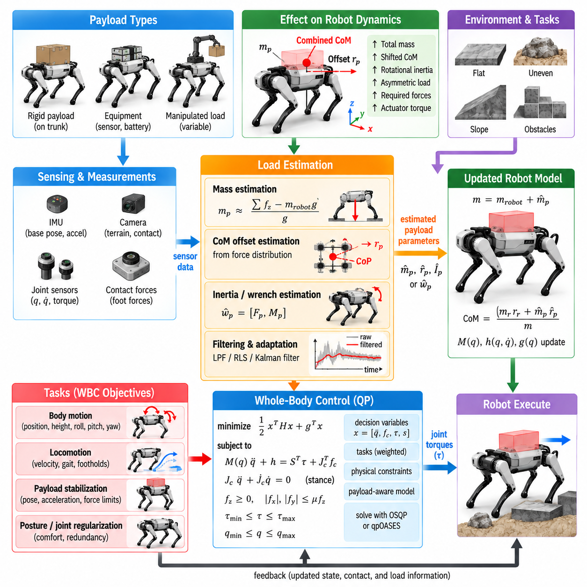{width="7.268055555555556in" height="7.268055555555556in"}

Payload-carrying Whole-Body Control (WBC) extends conventional quadruped control by explicitly accounting for additional mass and inertia introduced by transported equipment or cargo. A payload changes the robot's total weight, center of mass, rotational inertia, required ground reaction forces, and actuator loading. If these changes are ignored, a controller based on nominal robot parameters can produce systematic tracking errors and reduced stability.

The simplest payload model assumes that the load is rigidly attached to the trunk. Its mass, center-of-mass offset, and inertia tensor can then be incorporated into the corresponding rigid-body parameters. The robot and payload behave approximately as one composite multibody system. This representation is appropriate for firmly mounted batteries, sensors, containers, tools, or cargo that does not move significantly relative to the body.

Payload mass alone is insufficient when the load is positioned away from the trunk center. An offset load creates gravitational moments and changes the combined center of mass of the robot-payload system. A heavy object mounted toward the rear, front, or side therefore produces asymmetric support requirements. WBC must redistribute contact forces among stance feet and may modify trunk posture to maintain adequate stability margins.

Rotational inertia becomes increasingly important when the robot accelerates angularly. A large or spatially extended payload can substantially increase roll, pitch, and yaw inertia even if its center of mass remains close to the trunk center. Orientation controllers designed for the unloaded robot may then demand insufficient torque or exhibit slower response. Payload-aware dynamics allow desired angular accelerations to be converted into more accurate force and torque requirements.

Load estimation is required when payload properties are unknown or change during operation. Logistics robots may repeatedly receive and release objects, while manipulation systems can pick up components with uncertain mass. Instead of relying on manually entered parameters, the controller can estimate additional mass, center-of-mass displacement, or disturbance wrench from measured robot motion, actuator effort, and contact behavior.

A basic mass estimator can compare the support force predicted by the nominal model with the force required to maintain measured vertical equilibrium. When the robot stands approximately still, the sum of vertical ground reaction forces should correspond to the combined gravitational load. The difference between measured or estimated support force and nominal robot weight provides information about the additional payload mass.

Dynamic operation requires richer estimation because inertial forces become mixed with gravity. During acceleration, measured joint torques, base acceleration, angular velocity, contact forces, and known robot dynamics can be combined in a parameter-estimation problem. The estimator searches for payload parameters that reduce the residual between predicted dynamics and observed behavior. Sufficient excitation is necessary to identify some parameters reliably.

Payload center-of-mass estimation can exploit the distribution of support forces among the feet. During quasi-static standing, the location of the combined center of pressure reflects the projected center of mass when external disturbances are small. By comparing this location with the known unloaded robot model, the controller can infer approximate payload offsets. Multiple postures or controlled motions can improve observability.

More general methods estimate an external wrench acting on the trunk. A six-dimensional wrench contains three force and three moment components and can represent the net effect of an unknown load. Disturbance observers, momentum observers, or inverse-dynamics residuals can estimate this wrench without immediately identifying detailed payload parameters. WBC can compensate for the estimated disturbance directly while slower algorithms identify physical load properties.

Filtering is essential because raw load estimates can contain sensor noise, modeling errors, impact transients, and contact-estimation errors. Low-pass filtering, recursive least squares, Kalman filtering, or Bayesian estimation can provide smoother parameter updates. However, excessive filtering introduces delay when a payload changes suddenly. The estimator must therefore balance noise rejection against the need for timely adaptation.

The controller should also distinguish persistent payload effects from short-duration external disturbances. A constant additional downward force and moment may indicate a carried load, whereas a brief lateral force may result from collision or human interaction. Treating every disturbance as a payload change can corrupt the model. Persistence tests, confidence measures, and parameter-rate limits help separate slowly varying load properties from transient events.

Once payload parameters are available, WBC can update the mass matrix, gravity vector, Coriolis terms, center-of-mass location, and centroidal quantities used by the optimization. Depending on computational architecture, the complete rigid-body model may be regenerated or payload contributions may be added analytically. The update should remain numerically smooth because abrupt model changes can produce discontinuities in optimized forces and torques.

Ground reaction force distribution is one of the most immediate consequences of payload adaptation. A heavier robot requires greater total normal force, while an offset payload requires asymmetric loading among the feet. The WBC optimization distributes these forces according to the updated combined center of mass while respecting friction cones, force limits, contact geometry, and actuator capability.

Payload carrying also reduces available dynamic margin. Motors that previously had substantial torque reserve may operate closer to saturation simply to support the increased weight. The controller must recognize that aggressive acceleration, high step frequency, or large body rotations may no longer be feasible. Torque constraints inside the WBC optimization naturally reveal this reduced capability and allow locomotion objectives to be relaxed.

A payload-aware controller can modify motion commands before actuator saturation occurs. Desired forward acceleration, yaw rate, body height, or gait frequency can be scaled according to estimated load and available torque margin. This approach is preferable to generating aggressive commands and clipping them afterward because command scaling preserves coordination between body motion, contact forces, and swing-leg behavior.

Foot placement may also need adaptation. Changes in combined center of mass alter the relationship between foothold geometry and body stability. A rear-heavy payload, for example, can require different nominal foot locations or stance lengths to maintain useful support margins. Higher-level gait or MPC modules can incorporate the estimated payload state and provide WBC with load-aware foothold and body-motion references.

Payload orientation becomes a separate control objective when the transported object must remain level or aligned with a specified frame. Fragile instruments, cameras, containers, liquids, or manipulation platforms may tolerate only limited roll and pitch. WBC can prioritize payload orientation over nominal trunk attitude when an actuated mount or manipulator provides sufficient degrees of freedom to separate the two.

When the payload is rigidly attached, payload and trunk orientations cannot be controlled independently. The controller must then regulate trunk motion according to payload requirements. Limiting angular acceleration, roll, pitch, and jerk can reduce inertial loading on transported objects. This may require slower locomotion over rough terrain even when the robot itself could physically tolerate more aggressive motion.

Suspended or partially compliant payloads require more complex modeling. A hanging load can oscillate like a pendulum, generating time-varying forces and moments that disturb the trunk. Simply increasing the robot mass does not capture this behavior. Additional payload states, such as swing angle and angular velocity, may need to be estimated and incorporated into planning or control to suppress oscillation.

Manipulated payloads introduce another form of dynamic coupling. When a quadruped-mounted arm picks up an object, the load may move through a large workspace relative to the trunk. The combined center of mass and inertia then change continuously with arm configuration. Whole-body dynamics should include the manipulator and object so that leg contact forces, body stabilization, and manipulation forces are coordinated consistently.

Contact constraints become more critical under heavy loads because required ground reaction forces approach friction and structural limits. A payload may increase normal force and potentially increase available friction, but it also increases tangential forces required for acceleration. On low-friction terrain, the controller may need to reduce acceleration substantially to keep each contact force inside its friction cone and prevent slipping.

Terrain inclination further modifies payload requirements. On a slope, gravity generates both normal and tangential components relative to the contact surface. An offset payload can additionally create moments that increase loading on selected feet. Terrain-aware WBC combines estimated surface normals with the updated robot-payload dynamics to calculate feasible force distributions and orientation references.

Load estimation should include confidence information whenever possible. Poor excitation, uncertain contacts, sensor bias, or rapid motion may make parameter estimates unreliable. Instead of immediately applying every estimate, the controller can blend between nominal and estimated models according to confidence. Parameter bounds can prevent unrealistic mass or center-of-mass values from destabilizing the control system.

Safety limits should depend on the estimated payload state. Maximum speed, acceleration, slope capability, step height, and allowable gait may differ significantly between unloaded and fully loaded operation. A supervisory controller can use estimated mass, center-of-mass offset, actuator margin, and contact margin to select appropriate operating envelopes. WBC then enforces the corresponding instantaneous constraints.

Load changes require special handling during pickup and release. When an object is acquired, the dynamics may change within a short time and contact forces must increase accordingly. During release, support requirements decrease suddenly. Detecting these events and smoothly transitioning model parameters prevents abrupt body motion. Manipulator force sensing or changes in joint torque can provide useful event information.

QP-based WBC provides a natural framework for integrating payload adaptation. Updated dynamics appear in equality constraints, while torque limits, friction constraints, and contact-force bounds remain explicit inequalities. Payload orientation, body tracking, and posture objectives can be weighted according to mission requirements. Slack variables can preserve feasibility when the requested motion becomes too demanding for the loaded robot.

Model Predictive Control (MPC) can further exploit load estimates by predicting future motion using the updated mass and inertia. The planner can generate slower accelerations, modified contact forces, and different footholds before WBC executes them. This reduces disagreement between planning and execution, particularly when payload mass represents a substantial fraction of the robot's own mass.

Validation should cover more than static load support. Testing should include different payload masses, center-of-mass offsets, gait speeds, slopes, accelerations, disturbances, pickup events, and uncertain friction conditions. Important metrics include estimation error, body tracking error, force distribution, torque margin, slip occurrence, solver feasibility, and recovery behavior after sudden load changes.

Payload-aware WBC ultimately treats cargo as part of the robot's instantaneous physical system rather than as an unmodeled disturbance. Load estimation provides the bridge between unknown operating conditions and model-based control. By continuously adapting dynamics, contact-force distribution, motion limits, and task priorities, a quadruped can carry changing loads while preserving balance, actuator safety, terrain compatibility, and predictable mission performance.

페이로드 운반 전신 제어(Payload-Carrying Whole-Body Control, WBC)는 운반되는 장비나 화물로 인해 추가되는 질량과 관성(Inertia)을 명시적으로 고려함으로써 기존의 사족보행 로봇 제어를 확장한다. 페이로드(Payload)는 로봇의 전체 중량, 질량중심(Center of Mass), 회전 관성(Rotational Inertia), 필요한 지면 반력(Ground Reaction Force), 구동기 부하(Actuator Loading)를 변화시킨다. 이러한 변화를 무시하면 기준 로봇 매개변수(Nominal Robot Parameter)에 기반한 제어기에서 지속적인 추종 오차와 안정성 저하가 발생할 수 있다.

가장 단순한 페이로드 모델(Payload Model)은 하중이 몸통(Trunk)에 강체로 고정되어 있다고 가정한다. 이 경우 페이로드의 질량, 질량중심 오프셋(Center-of-Mass Offset), 관성 텐서(Inertia Tensor)를 해당 강체 매개변수(Rigid-Body Parameter)에 포함할 수 있다. 로봇과 페이로드는 하나의 복합 다물체 시스템(Composite Multibody System)처럼 동작한다. 이러한 표현은 몸체에 단단히 장착되어 상대적으로 거의 움직이지 않는 배터리, 센서, 컨테이너, 공구, 화물 등에 적합하다.

페이로드가 몸통 중심에서 떨어진 위치에 배치된 경우에는 페이로드 질량만으로 충분하지 않다. 편심 하중(Offset Load)은 중력 모멘트(Gravitational Moment)를 발생시키고 로봇-페이로드 시스템의 결합 질량중심(Combined Center of Mass)을 변화시킨다. 따라서 후방, 전방 또는 측면에 장착된 무거운 물체는 비대칭적인 지지 요구조건을 발생시킨다. WBC는 적절한 안정성 여유(Stability Margin)를 유지하기 위해 지지 발 사이의 접촉력을 재분배하고 필요한 경우 몸통 자세를 수정해야 한다.

회전 관성(Rotational Inertia)은 로봇이 각가속도(Angular Acceleration)를 발생시킬 때 더욱 중요해진다. 크기가 크거나 공간적으로 넓게 분포된 페이로드는 질량중심이 몸통 중심에 가까이 있더라도 롤(Roll), 피치(Pitch), 요(Yaw) 방향의 관성을 크게 증가시킬 수 있다. 무부하 로봇을 기준으로 설계된 방향 제어기(Orientation Controller)는 충분하지 않은 토크를 요구하거나 더 느린 응답을 나타낼 수 있다. 페이로드 인식 동역학(Payload-Aware Dynamics)을 이용하면 원하는 각가속도를 보다 정확한 힘과 토크 요구량으로 변환할 수 있다.

운용 중 페이로드 특성을 알 수 없거나 변화하는 경우에는 하중 추정(Load Estimation)이 필요하다. 물류 로봇(Logistics Robot)은 물체를 반복적으로 적재하고 하역할 수 있으며, 조작 시스템(Manipulation System)은 질량을 정확히 알 수 없는 부품을 들어 올릴 수 있다. 제어기는 수동으로 입력된 매개변수에만 의존하는 대신 측정된 로봇 운동, 구동기 출력, 접촉 동작을 이용하여 추가 질량, 질량중심 이동, 외부 렌치(External Wrench)를 추정할 수 있다.

기본적인 질량 추정기(Mass Estimator)는 기준 모델에서 예측된 지지력과 측정된 수직 평형(Vertical Equilibrium)을 유지하는 데 필요한 힘을 비교할 수 있다. 로봇이 거의 정지해 있는 경우 수직 방향 지면 반력의 합은 로봇과 페이로드의 결합 중력 하중(Combined Gravitational Load)에 대응해야 한다. 측정되거나 추정된 지지력과 기준 로봇 중량 사이의 차이를 이용하면 추가 페이로드 질량에 관한 정보를 얻을 수 있다.

동적 운용(Dynamic Operation)에서는 관성력과 중력이 서로 결합되기 때문에 더욱 정교한 추정이 필요하다. 가속 중에는 측정된 관절 토크, 기저 가속도(Base Acceleration), 각속도(Angular Velocity), 접촉력, 알려진 로봇 동역학을 매개변수 추정 문제(Parameter-Estimation Problem)에 함께 사용할 수 있다. 추정기는 예측 동역학과 관측된 동작 사이의 잔차(Residual)를 줄이는 페이로드 매개변수를 탐색한다. 일부 매개변수를 신뢰성 있게 식별하려면 충분한 가진(Excitation)이 필요하다.

페이로드 질량중심 추정(Payload Center-of-Mass Estimation)은 발 사이의 지지력 분포를 활용할 수 있다. 준정적 기립(Quasi-Static Standing) 상태에서는 외부 외란이 작을 경우 결합 압력중심(Center of Pressure)의 위치가 투영된 질량중심 위치를 반영한다. 이 위치를 알려진 무부하 로봇 모델과 비교하면 제어기가 대략적인 페이로드 오프셋을 추론할 수 있다. 여러 자세 또는 제어된 운동을 이용하면 관측 가능성(Observability)을 향상시킬 수 있다.

보다 일반적인 방법은 몸통에 작용하는 외부 렌치(External Wrench)를 추정한다. 6차원 렌치(Six-Dimensional Wrench)는 세 개의 힘 성분과 세 개의 모멘트 성분으로 구성되며 알려지지 않은 하중의 전체 효과를 표현할 수 있다. 외란 관측기(Disturbance Observer), 운동량 관측기(Momentum Observer), 역동역학 잔차(Inverse-Dynamics Residual)를 이용하면 상세한 페이로드 매개변수를 즉시 식별하지 않고도 이러한 렌치를 추정할 수 있다. WBC는 추정된 외란을 직접 보상하면서 더 느린 알고리즘을 통해 물리적 하중 특성을 식별할 수 있다.

필터링(Filtering)은 원시 하중 추정값에 센서 노이즈, 모델링 오차, 충격 과도현상(Impact Transient), 접촉 추정 오류가 포함될 수 있기 때문에 필수적이다. 저역통과 필터링(Low-Pass Filtering), 재귀 최소제곱법(Recursive Least Squares), 칼만 필터링(Kalman Filtering), 베이지안 추정(Bayesian Estimation)을 이용하여 보다 부드러운 매개변수 갱신을 수행할 수 있다. 그러나 과도한 필터링은 페이로드가 갑자기 변화할 때 지연을 발생시키므로 노이즈 억제와 신속한 적응 사이의 균형이 필요하다.

제어기는 지속적인 페이로드 영향(Persistent Payload Effect)과 짧은 시간 동안 발생하는 외부 외란(External Disturbance)을 구분해야 한다. 지속적인 추가 하향 힘과 모멘트는 운반 중인 하중을 의미할 수 있지만 짧은 횡방향 힘은 충돌이나 사람과의 상호작용으로 발생할 수 있다. 모든 외란을 페이로드 변화로 해석하면 모델이 잘못 갱신될 수 있다. 지속성 검사(Persistence Test), 신뢰도 지표(Confidence Measure), 매개변수 변화율 제한(Parameter-Rate Limit)을 이용하면 천천히 변화하는 하중 특성과 일시적 사건을 구분하는 데 도움이 된다.

페이로드 매개변수가 확보되면 WBC는 최적화에서 사용되는 질량 행렬(Mass Matrix), 중력 벡터(Gravity Vector), 코리올리 항(Coriolis Term), 질량중심 위치, 중심 동역학 관련 물리량(Centroidal Quantity)을 갱신할 수 있다. 계산 구조에 따라 전체 강체 모델을 다시 생성하거나 페이로드의 기여분만 해석적으로 추가할 수 있다. 갑작스러운 모델 변화는 최적화된 힘과 토크의 불연속을 발생시킬 수 있으므로 갱신 과정은 수치적으로 부드럽게 이루어져야 한다.

지면 반력 분배(Ground Reaction Force Distribution)는 페이로드 적응의 가장 직접적인 결과 중 하나이다. 로봇의 전체 중량이 증가하면 더 큰 총 수직력이 필요하고, 편심 페이로드가 존재하면 발 사이에 비대칭적인 하중 분배가 필요하다. WBC 최적화는 갱신된 결합 질량중심에 따라 이러한 힘을 분배하면서 마찰 원뿔(Friction Cone), 힘 한계, 접촉 형상(Contact Geometry), 구동기 성능을 만족시킨다.

페이로드 운반은 사용 가능한 동적 여유(Dynamic Margin)도 감소시킨다. 기존에 충분한 토크 여유를 가지고 있던 모터도 증가된 중량을 지지하는 것만으로 토크 포화(Torque Saturation)에 가까워질 수 있다. 제어기는 공격적인 가속, 높은 스텝 주파수(Step Frequency), 큰 몸체 회전이 더 이상 실현 가능하지 않을 수 있다는 점을 인식해야 한다. WBC 최적화 내부의 토크 제약조건은 이러한 감소된 능력을 자연스럽게 나타내며 이동 목표를 완화할 수 있도록 한다.

페이로드 인식 제어기(Payload-Aware Controller)는 구동기 포화가 발생하기 전에 운동 명령을 수정할 수 있다. 원하는 전진 가속도, 요 회전율(Yaw Rate), 몸체 높이, 보행 주파수(Gait Frequency)를 추정된 하중과 사용 가능한 토크 여유에 따라 스케일링할 수 있다. 이러한 방식은 공격적인 명령을 먼저 생성한 후 단순히 잘라내는 것보다 바람직하다. 명령 스케일링(Command Scaling)은 몸체 운동, 접촉력, 유각 다리 동작 사이의 협조 관계를 유지할 수 있기 때문이다.

발 디딤 위치(Foot Placement) 역시 조정이 필요할 수 있다. 결합 질량중심의 변화는 발 디딤 형상과 몸체 안정성 사이의 관계를 변화시킨다. 예를 들어 후방에 무거운 페이로드가 있는 경우 유용한 지지 여유를 유지하기 위해 기준 발 위치 또는 스탠스 길이(Stance Length)를 변경해야 할 수 있다. 상위 보행 제어 또는 모델 예측 제어(Model Predictive Control, MPC) 모듈은 추정된 페이로드 상태를 반영하여 WBC에 하중 인식 발 디딤 위치와 몸체 운동 기준값을 제공할 수 있다.

운반되는 물체가 수평 또는 특정 기준 좌표계에 정렬되어야 하는 경우 페이로드 방향(Payload Orientation)은 별도의 제어 목표가 된다. 정밀 장비, 카메라, 컨테이너, 액체, 조작 플랫폼은 제한된 롤 및 피치만 허용할 수 있다. 구동 마운트(Actuated Mount) 또는 매니퓰레이터가 몸통과 페이로드를 독립적으로 움직일 수 있는 충분한 자유도를 제공한다면 WBC는 기준 몸통 자세보다 페이로드 방향을 높은 우선순위로 설정할 수 있다.

페이로드가 강체로 고정되어 있는 경우 페이로드 방향과 몸통 방향을 독립적으로 제어할 수 없다. 이 경우 제어기는 페이로드 요구조건에 맞추어 몸통 운동을 조절해야 한다. 각가속도, 롤, 피치, 저크(Jerk)를 제한하면 운반되는 물체에 작용하는 관성 하중을 줄일 수 있다. 따라서 로봇 자체는 더 공격적인 운동을 견딜 수 있더라도 거친 지형에서는 더 느린 이동이 필요할 수 있다.

매달려 있거나 부분적으로 순응성을 가지는 페이로드(Suspended or Partially Compliant Payload)는 더 복잡한 모델링을 요구한다. 매달린 하중은 진자(Pendulum)처럼 진동하면서 시간에 따라 변화하는 힘과 모멘트를 생성하여 몸통을 교란할 수 있다. 단순히 로봇 질량을 증가시키는 것만으로는 이러한 동작을 표현할 수 없다. 진동을 억제하기 위해 스윙 각도(Swing Angle), 각속도 등의 추가 페이로드 상태를 추정하여 계획 또는 제어에 포함해야 할 수 있다.

조작되는 페이로드(Manipulated Payload)는 또 다른 형태의 동역학적 결합을 발생시킨다. 사족보행 로봇에 장착된 로봇 팔이 물체를 들어 올리면 하중은 몸통을 기준으로 넓은 작업 공간을 이동할 수 있다. 이때 결합 질량중심과 관성은 로봇 팔의 구성에 따라 지속적으로 변화한다. 전신 동역학은 매니퓰레이터와 물체를 함께 포함하여 다리 접촉력, 몸체 안정화, 조작력을 일관되게 조정해야 한다.

무거운 하중에서는 필요한 지면 반력이 마찰 및 구조적 한계에 가까워지기 때문에 접촉 제약조건(Contact Constraint)이 더욱 중요해진다. 페이로드는 수직력을 증가시켜 잠재적으로 사용 가능한 마찰력을 높이지만 동시에 가속에 필요한 접선 방향 힘도 증가시킨다. 마찰력이 낮은 지형에서는 각 접촉력이 마찰 원뿔 내부에 유지되고 미끄러짐을 방지할 수 있도록 제어기가 가속도를 크게 낮춰야 할 수 있다.

지형 경사(Terrain Inclination)는 페이로드 요구조건을 추가적으로 변화시킨다. 경사면에서는 중력이 접촉 표면을 기준으로 수직 성분과 접선 성분을 모두 생성한다. 편심 페이로드는 특정 발의 하중을 증가시키는 추가적인 모멘트를 발생시킬 수도 있다. 지형 인식 WBC(Terrain-Aware WBC)는 추정된 표면 법선(Surface Normal)과 갱신된 로봇-페이로드 동역학을 결합하여 실현 가능한 힘 분배와 방향 기준값을 계산한다.

가능한 경우 하중 추정에는 신뢰도 정보(Confidence Information)를 포함해야 한다. 충분하지 않은 가진, 불확실한 접촉, 센서 바이어스(Sensor Bias), 빠른 운동은 매개변수 추정의 신뢰성을 낮출 수 있다. 모든 추정값을 즉시 적용하는 대신 제어기는 신뢰도에 따라 기준 모델과 추정 모델 사이를 점진적으로 혼합할 수 있다. 또한 매개변수 경계(Parameter Bound)를 설정하여 비현실적인 질량이나 질량중심 값이 제어 시스템을 불안정하게 만드는 것을 방지할 수 있다.

안전 한계(Safety Limit)는 추정된 페이로드 상태에 따라 달라져야 한다. 최대 속도, 가속도, 경사 주행 능력(Slope Capability), 스텝 높이, 허용 가능한 보행 형태는 무부하 상태와 최대 적재 상태에서 크게 달라질 수 있다. 감독 제어기(Supervisory Controller)는 추정 질량, 질량중심 오프셋, 구동기 여유, 접촉 여유(Contact Margin)를 이용하여 적절한 운용 영역(Operating Envelope)을 선택할 수 있다. 이후 WBC는 해당 순간의 제약조건을 적용한다.

페이로드를 집거나 내려놓는 과정에서는 하중 변화에 대한 특별한 처리가 필요하다. 물체를 획득하면 짧은 시간 안에 동역학이 변화하고 이에 따라 접촉력이 증가해야 한다. 물체를 내려놓으면 필요한 지지력이 갑자기 감소한다. 이러한 사건을 감지하고 모델 매개변수를 부드럽게 전환하면 갑작스러운 몸체 운동을 방지할 수 있다. 매니퓰레이터 힘 센싱(Force Sensing)이나 관절 토크 변화는 이러한 사건을 감지하는 데 유용한 정보를 제공할 수 있다.

QP 기반 전신 제어(QP-Based WBC)는 페이로드 적응을 통합하기 위한 자연스러운 프레임워크를 제공한다. 갱신된 동역학은 등식 제약조건(Equality Constraint)에 반영되며, 토크 한계, 마찰 제약조건, 접촉력 경계는 명시적인 부등식 제약조건(Inequality Constraint)으로 유지된다. 페이로드 방향, 몸체 추종, 자세 목표는 임무 요구조건에 따라 가중치를 설정할 수 있다. 슬랙 변수(Slack Variable)는 요구되는 운동이 적재된 로봇의 능력을 초과할 경우에도 실현 가능성을 유지하도록 할 수 있다.

모델 예측 제어(Model Predictive Control, MPC)는 갱신된 질량과 관성을 이용하여 미래 운동을 예측함으로써 하중 추정값을 더욱 효과적으로 활용할 수 있다. 계획기는 WBC가 명령을 실행하기 전에 더 낮은 가속도, 수정된 접촉력, 다른 발 디딤 위치를 생성할 수 있다. 이는 특히 페이로드 질량이 로봇 자체 질량에서 상당한 비율을 차지하는 경우 계획과 실제 실행 사이의 차이를 줄여준다.

검증(Validation)은 단순한 정적 하중 지지에만 한정되어서는 안 된다. 서로 다른 페이로드 질량, 질량중심 오프셋, 보행 속도, 경사, 가속도, 외란, 물체 획득 사건, 불확실한 마찰 조건을 포함하여 시험해야 한다. 주요 평가 지표에는 추정 오차(Estimation Error), 몸체 추종 오차, 힘 분배, 토크 여유, 미끄러짐 발생 여부, 솔버 실현 가능성(Solver Feasibility), 갑작스러운 하중 변화 이후의 복구 동작이 포함된다.

페이로드 인식 WBC(Payload-Aware WBC)는 궁극적으로 화물(Cargo)을 모델링되지 않은 외란으로 취급하는 것이 아니라 로봇의 순간적인 물리 시스템(Instantaneous Physical System)의 일부로 취급한다. 하중 추정은 알려지지 않은 운용 조건과 모델 기반 제어(Model-Based Control)를 연결하는 역할을 한다. 동역학, 접촉력 분배, 운동 한계, 작업 우선순위를 지속적으로 적응시킴으로써 사족보행 로봇은 변화하는 하중을 운반하면서도 균형, 구동기 안전성, 지형 적합성(Terrain Compatibility), 예측 가능한 임무 수행 성능을 유지할 수 있다.

##  

## 06.06. Manipulation Arm WBC Integration Spot Arm [w/Code]

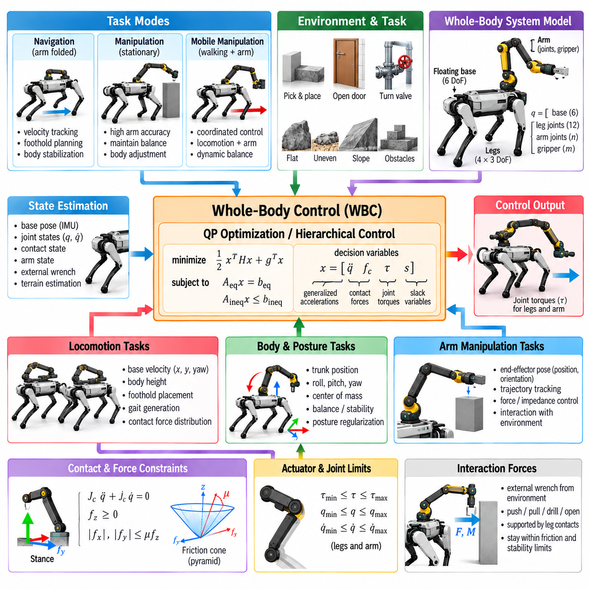{width="7.268055555555556in" height="7.268055555555556in"}

Whole-Body Control (WBC) integration of a manipulation arm transforms a quadruped from a mobile locomotion platform into a mobile manipulation system. The legs, floating base, arm, and gripper become dynamically coupled parts of one robot. Instead of commanding the arm independently while the quadruped merely stands underneath it, integrated WBC coordinates locomotion, balance, contact forces, body posture, and manipulation objectives simultaneously.

A platform such as Spot equipped with an arm illustrates the mobile-manipulation concept clearly. The arm extends the reachable workspace beyond what fixed-base manipulation permits because the quadruped can reposition its body and feet around the task. Conversely, arm motion influences the supporting robot through reaction forces and moments. Effective control therefore requires coordination between manipulation and locomotion rather than treating them as unrelated subsystems.

The complete system can be modeled as a floating-base multibody mechanism containing the six-degree-of-freedom body pose, leg joints, arm joints, and gripper coordinates. The generalized state consequently becomes larger than that of a locomotion-only quadruped. Mass distribution and inertia also vary with arm configuration, making full-body dynamics particularly important when the manipulator carries heavy tools or objects far from the trunk.

Arm motion changes the combined center of mass of the robot. Extending the manipulator forward shifts the center of mass toward the front contacts, while lateral extension creates asymmetric loading between the left and right legs. WBC compensates by redistributing ground reaction forces, modifying body posture, or repositioning the feet. Without this coordination, aggressive arm motion can reduce stability even when the arm trajectory itself is kinematically feasible.

The manipulation end effector is represented as another operational-space task within WBC. Desired position and orientation trajectories can be converted into Cartesian velocity or acceleration references through the end-effector Jacobian. The optimization then determines compatible arm, body, and sometimes leg motion. This allows the robot to exploit all available degrees of freedom rather than forcing the arm alone to satisfy every manipulation objective.

Whole-body redundancy is one of the major advantages of integrated control. If the arm approaches a joint limit while reaching toward an object, the quadruped can translate or rotate its trunk to extend the effective workspace. If further adjustment is necessary, it can take a step and establish a new support configuration. Mobile manipulation therefore turns locomotion itself into a mechanism for increasing manipulation reachability.

Task hierarchy determines how this redundancy is used. Contact feasibility, actuator safety, and balance generally remain high-priority requirements. During manipulation, end-effector position, orientation, or interaction force may receive higher priority than nominal body posture. Joint posture, energy minimization, and preferred configurations can remain lower-priority objectives that exploit residual freedom without disturbing the manipulation task.

The appropriate hierarchy changes with operating mode. During navigation, locomotion velocity, body stabilization, and foothold generation dominate while the arm may remain folded in a transport posture. When the robot reaches a work location, manipulation accuracy can become more important and locomotion commands can be reduced. During combined walking and manipulation, both task groups must be coordinated continuously according to mission requirements.

Stationary manipulation does not imply that the legs should remain completely passive. Even when all four feet remain in contact, small body translations, rotations, and force redistributions can improve arm reachability and reduce joint effort. WBC can intentionally move the trunk within a safe support region while preserving foot contacts, effectively using the legs as a large positioning mechanism beneath the manipulator.

Contact interaction introduces additional requirements when the arm pushes, pulls, turns, drills, opens doors, or operates equipment. Forces generated at the end effector propagate through the arm and body to the supporting feet. The WBC dynamics must balance these interaction forces with ground reaction forces. Otherwise, a manipulation force that is acceptable for the arm alone may cause foot slip or destabilize the quadruped.

The end-effector interaction can be modeled as an external wrench acting on the robot. Force and torque references may be incorporated into the optimization, while friction constraints at the feet determine whether the required reaction wrench can be supported. This coupling establishes a whole-body manipulation capability envelope: achievable tool forces depend not only on arm strength but also on stance geometry, terrain friction, and leg actuator capacity.

Impedance control is particularly useful for manipulation tasks involving uncertain contact geometry. Instead of rigidly enforcing end-effector position, the controller specifies a relationship between position error and interaction force. The arm can then remain compliant when contacting handles, valves, surfaces, or tools. Whole-body impedance behavior can extend this concept by allowing controlled motion of both the arm and quadruped body.

Admittance control provides another approach when force measurements are available. Measured external force can be converted into a desired motion response, allowing the end effector or entire robot to yield naturally under interaction. The resulting motion reference can be passed to WBC, which determines how much response should be produced by arm joints, trunk motion, or stepping while preserving contact and balance constraints.

Force/torque sensing near the wrist improves interaction control by measuring the wrench applied at the end effector. Joint torque sensing or estimation can provide complementary information. These measurements help distinguish intended manipulation forces from unexpected collisions and model errors. They can also support payload estimation after an object is grasped, allowing the dynamic model to adapt to the newly acquired load.

Grasping an object changes the robot dynamics immediately. The object effectively becomes an additional payload attached through the arm, modifying the combined center of mass and inertia according to arm configuration. If object mass is significant, WBC should update its dynamics or estimate the resulting external wrench. Contact-force distribution among the feet can then adapt as the object is lifted, transported, or repositioned.

The support configuration strongly influences manipulation capability. A wide four-foot stance generally provides greater resistance to external moments than a narrow or dynamically changing support pattern. Before performing high-force manipulation, the robot may intentionally reposition its feet to create a more favorable support geometry. Manipulation planning should therefore consider stance selection as part of the task rather than assuming fixed foot locations.

Reachability should also be evaluated at the whole-body level. An object may lie outside the arm-only workspace but remain reachable after body translation, trunk rotation, height adjustment, or stepping. Whole-body inverse kinematics or optimization can evaluate combinations of these motions. This prevents unnecessary navigation movements while avoiding arm configurations near singularities or joint limits.

Collision avoidance becomes more complex after adding an arm. The manipulator must avoid the robot's trunk, legs, sensors, payload, and surrounding environment while the quadruped itself may be moving. Self-collision constraints can be incorporated through distance functions or optimization penalties. Environmental collision avoidance is usually coordinated with perception and motion planning before references are sent to the real-time WBC layer.

Manipulation accuracy depends on reliable state estimation. End-effector pose is influenced not only by arm encoder measurements but also by floating-base position and orientation errors. Small body-estimation errors can become significant at an extended tool tip. Visual localization, inertial sensing, joint encoders, terrain contact estimation, and sometimes external perception must therefore be combined to maintain an accurate manipulation reference frame.

Visual servoing can compensate for residual localization and calibration errors. A camera mounted on the head, body, wrist, or environment can estimate the relative pose between the tool and target. Instead of relying entirely on global coordinates, the manipulation controller updates end-effector references from visual error. WBC then realizes these corrections while simultaneously maintaining body stability and feasible ground contacts.

Locomotion and manipulation can also occur simultaneously. A quadruped may carry an object while walking, inspect a surface with a sensor, maintain a camera viewpoint, or move a tool along a structure. In these cases the end-effector trajectory and body trajectory are coupled over time. WBC distributes motion between stepping, trunk movement, and arm articulation while respecting contact transitions and actuator limits.

Walking manipulation places additional demands on trajectory planning because the support set changes as feet enter and leave contact. Arm motion that is feasible during four-foot support may become destabilizing during a two-foot support phase. The controller can reduce manipulation acceleration during vulnerable gait phases or synchronize arm movement with the contact schedule to maintain sufficient stability and force margin.

Model Predictive Control (MPC) can assist integrated WBC by anticipating future body motion, contacts, and manipulation requirements. A higher-level planner can predict how an arm trajectory will shift the center of mass or generate interaction forces and can adjust footholds in advance. WBC then resolves the instantaneous full-body dynamics and actuator constraints at a faster control frequency.

QP-based WBC provides a natural implementation framework for this integration. Floating-base dynamics, stance contacts, friction limits, torque bounds, and joint limits can be represented as constraints. End-effector tracking, interaction force, trunk orientation, swing-foot motion, and posture can appear as weighted tasks. The optimizer determines a dynamically consistent compromise across the complete quadruped-manipulator system.

Joint-limit management is particularly important because arm and leg joints may simultaneously approach unfavorable configurations. Rather than waiting for saturation, optimization can introduce avoidance costs or predictive inequality constraints. The trunk can then move proactively to preserve arm manipulability, while leg configurations retain enough workspace for balance recovery and future stepping.

Failure handling must account for both locomotion and manipulation. Unexpected object motion, failed grasp, excessive interaction force, foot slip, or arm tracking failure can change the stability condition rapidly. Depending on severity, the robot may release force, retract the arm, widen its stance, take a recovery step, lower the body, or stop the manipulation task while maintaining safe support.

Spot Arm demonstrates the broader architectural principle that a quadruped and manipulator should be treated as one coordinated physical system when performing mobile manipulation. The exact commercial implementation is platform specific, but the general WBC principle is universal: arm motion changes locomotion dynamics, leg contacts determine manipulation capability, and the floating base provides useful redundancy between them.

Integrated arm-quadruped WBC ultimately removes the artificial boundary between mobility and manipulation. The feet establish controllable interaction with the environment, the legs position and stabilize the floating base, and the arm performs task-level interaction. By optimizing these components together, a quadruped can reach farther, exert controlled forces, carry objects, manipulate while moving, and adapt its entire body to the physical requirements of the task.

조작 로봇 팔(Manipulation Arm)의 전신 제어(Whole-Body Control, WBC) 통합은 사족보행 로봇을 단순한 이동 플랫폼(Mobile Locomotion Platform)에서 이동 조작 시스템(Mobile Manipulation System)으로 확장한다. 다리, 부유 기저(Floating Base), 로봇 팔, 그리퍼(Gripper)는 하나의 로봇을 구성하는 동역학적으로 결합된 요소가 된다. 로봇 팔을 독립적으로 명령하고 사족보행 로봇이 단순히 그 아래에서 서 있는 방식과 달리, 통합 WBC는 이동, 균형, 접촉력, 몸체 자세, 조작 목표를 동시에 조정한다.

로봇 팔이 장착된 스팟(Spot)과 같은 플랫폼은 이동 조작(Mobile Manipulation)의 개념을 명확하게 보여준다. 사족보행 로봇이 작업 대상 주변에서 몸체와 발의 위치를 변경할 수 있기 때문에 로봇 팔은 고정 기저 조작(Fixed-Base Manipulation)보다 넓은 도달 작업 공간(Reachable Workspace)을 확보할 수 있다. 반대로 로봇 팔의 운동은 반력(Reaction Force)과 반작용 모멘트(Reaction Moment)를 통해 지지 로봇에 영향을 준다. 따라서 효과적인 제어를 위해서는 조작과 이동을 서로 독립적인 하위 시스템으로 취급하지 않고 상호 조정해야 한다.

전체 시스템은 6자유도 몸체 자세(Six-Degree-of-Freedom Body Pose), 다리 관절, 로봇 팔 관절, 그리퍼 좌표를 포함하는 부유 기저 다물체 메커니즘(Floating-Base Multibody Mechanism)으로 모델링할 수 있다. 이에 따라 일반화 상태(Generalized State)는 이동만 수행하는 사족보행 로봇보다 더 큰 차원을 가진다. 로봇 팔 구성에 따라 질량 분포와 관성도 변화하므로, 매니퓰레이터가 무거운 공구나 물체를 몸통에서 멀리 떨어진 위치에서 운반하는 경우 전신 동역학(Full-Body Dynamics)이 특히 중요해진다.

로봇 팔의 운동은 로봇의 결합 질량중심(Combined Center of Mass)을 변화시킨다. 매니퓰레이터를 전방으로 뻗으면 질량중심이 전방 접촉점으로 이동하고, 측면으로 뻗으면 좌우 다리 사이에 비대칭적인 하중이 발생한다. WBC는 지면 반력(Ground Reaction Force)을 재분배하거나 몸체 자세를 변경하거나 발의 위치를 조정하여 이를 보상한다. 이러한 협조 제어가 없으면 로봇 팔 궤적 자체가 운동학적으로 실현 가능하더라도 공격적인 로봇 팔 운동으로 인해 안정성이 저하될 수 있다.

조작 말단장치(Manipulation End Effector)는 WBC 내부에서 또 하나의 작업 공간 작업(Operational-Space Task)으로 표현된다. 원하는 위치 및 방향 궤적은 말단장치 자코비안(End-Effector Jacobian)을 통해 데카르트 속도(Cartesian Velocity) 또는 가속도 기준값으로 변환할 수 있다. 이후 최적화는 서로 호환되는 로봇 팔, 몸체, 경우에 따라 다리의 운동을 결정한다. 이를 통해 모든 조작 목표를 로봇 팔만으로 달성하도록 강제하는 대신 시스템이 사용할 수 있는 전체 자유도를 활용할 수 있다.

전신 여유도(Whole-Body Redundancy)는 통합 제어의 주요 장점 중 하나이다. 물체를 향해 접근하는 동안 로봇 팔이 관절 한계(Joint Limit)에 가까워지면 사족보행 로봇은 몸통을 병진 또는 회전시켜 실질적인 작업 공간을 확장할 수 있다. 추가적인 조정이 필요하면 한 걸음을 이동하여 새로운 지지 구성(Support Configuration)을 형성할 수 있다. 따라서 이동 조작에서는 이동 자체가 조작 도달 가능성(Manipulation Reachability)을 증가시키는 메커니즘으로 활용된다.

작업 계층(Task Hierarchy)은 이러한 여유도가 어떻게 사용될지를 결정한다. 접촉 실현 가능성(Contact Feasibility), 구동기 안전성(Actuator Safety), 균형은 일반적으로 높은 우선순위의 요구조건으로 유지된다. 조작 중에는 말단장치 위치, 방향 또는 상호작용 힘(Interaction Force)이 기준 몸체 자세보다 높은 우선순위를 가질 수 있다. 관절 자세, 에너지 최소화(Energy Minimization), 선호 구성(Preferred Configuration)은 조작 작업을 방해하지 않으면서 남아 있는 자유도를 활용하는 낮은 우선순위 목표로 설정할 수 있다.

적절한 작업 계층은 운용 모드(Operating Mode)에 따라 변화한다. 내비게이션 중에는 이동 속도, 몸체 안정화, 발 디딤 생성(Foothold Generation)이 우선하며 로봇 팔은 운반 자세(Transport Posture)로 접혀 있을 수 있다. 로봇이 작업 위치에 도달하면 조작 정확도가 더 중요해지고 이동 명령을 감소시킬 수 있다. 보행과 조작을 동시에 수행하는 동안에는 임무 요구조건에 따라 두 작업 그룹을 지속적으로 조정해야 한다.

정지 상태의 조작(Stationary Manipulation)이 다리가 완전히 수동적인 상태로 유지되어야 한다는 의미는 아니다. 네 발이 모두 지면과 접촉한 상태에서도 작은 몸체 병진, 회전, 힘 재분배를 이용하면 로봇 팔의 도달 가능성을 향상시키고 관절 부하를 줄일 수 있다. WBC는 발 접촉을 유지하면서 안전한 지지 영역(Safe Support Region) 내에서 의도적으로 몸통을 움직일 수 있으며, 이를 통해 다리를 매니퓰레이터 아래에 위치한 대형 위치 결정 메커니즘(Positioning Mechanism)처럼 활용할 수 있다.

로봇 팔이 밀기, 당기기, 회전시키기, 드릴 작업, 문 열기, 장비 조작 등을 수행하는 경우 접촉 상호작용(Contact Interaction)은 추가적인 요구조건을 발생시킨다. 말단장치에서 생성된 힘은 로봇 팔과 몸체를 거쳐 지지 발까지 전달된다. WBC 동역학은 이러한 상호작용 힘과 지면 반력 사이의 균형을 유지해야 한다. 그렇지 않으면 로봇 팔 자체에는 허용 가능한 조작력이라도 발의 미끄러짐이나 사족보행 로봇의 불안정성을 유발할 수 있다.

말단장치 상호작용은 로봇에 작용하는 외부 렌치(External Wrench)로 모델링할 수 있다. 힘 및 토크 기준값을 최적화 문제에 포함할 수 있으며, 발의 마찰 제약조건(Friction Constraint)을 통해 필요한 반작용 렌치(Reaction Wrench)를 지지할 수 있는지 판단한다. 이러한 결합은 전신 조작 능력 범위(Whole-Body Manipulation Capability Envelope)를 형성한다. 즉, 구현 가능한 공구 힘은 로봇 팔의 힘뿐 아니라 스탠스 형상(Stance Geometry), 지면 마찰, 다리 구동기 성능에도 영향을 받는다.

임피던스 제어(Impedance Control)는 불확실한 접촉 형상을 포함하는 조작 작업에 특히 유용하다. 말단장치 위치를 강제로 유지하는 대신 제어기는 위치 오차와 상호작용 힘 사이의 관계를 정의한다. 이를 통해 로봇 팔은 손잡이, 밸브, 표면, 공구 등에 접촉할 때 순응성(Compliance)을 유지할 수 있다. 전신 임피던스 동작(Whole-Body Impedance Behavior)은 이 개념을 확장하여 로봇 팔과 사족보행 로봇 몸체가 모두 제어된 방식으로 움직이도록 할 수 있다.

힘 측정값을 사용할 수 있는 경우 어드미턴스 제어(Admittance Control)는 또 다른 접근 방법을 제공한다. 측정된 외력을 원하는 운동 응답으로 변환하여 말단장치 또는 전체 로봇이 상호작용 힘에 따라 자연스럽게 움직이도록 할 수 있다. 생성된 운동 기준값은 WBC로 전달되며, WBC는 접촉 및 균형 제약조건을 유지하면서 로봇 팔 관절, 몸통 운동, 또는 스테핑(Stepping)이 각각 어느 정도의 응답을 담당할 것인지를 결정한다.

손목 부근의 힘/토크 센싱(Force/Torque Sensing)은 말단장치에 가해지는 렌치를 측정하여 상호작용 제어 성능을 향상시킨다. 관절 토크 센싱(Joint Torque Sensing) 또는 토크 추정 역시 보완적인 정보를 제공할 수 있다. 이러한 측정값은 의도된 조작력과 예상하지 못한 충돌 및 모델 오차를 구분하는 데 도움을 준다. 또한 물체를 파지한 이후 페이로드 추정(Payload Estimation)을 지원하여 새롭게 획득한 하중에 맞게 동역학 모델을 적응시킬 수 있다.

물체를 파지하면 로봇의 동역학은 즉시 변화한다. 물체는 로봇 팔을 통해 부착된 추가 페이로드처럼 작용하며, 로봇 팔 구성에 따라 결합 질량중심과 관성을 변화시킨다. 물체 질량이 상당한 경우 WBC는 동역학을 갱신하거나 이에 따른 외부 렌치를 추정해야 한다. 이후 물체를 들어 올리거나 운반하거나 위치를 변경하는 과정에서 발 사이의 접촉력 분배를 적응시킬 수 있다.

지지 구성은 조작 능력에 큰 영향을 미친다. 넓은 네 발 지지 자세(Wide Four-Foot Stance)는 일반적으로 좁거나 동적으로 변화하는 지지 형태보다 외부 모멘트에 대한 더 높은 저항 능력을 제공한다. 큰 힘이 필요한 조작을 수행하기 전에 로봇은 보다 유리한 지지 형상을 만들기 위해 의도적으로 발 위치를 변경할 수 있다. 따라서 조작 계획(Manipulation Planning)은 발 위치를 고정된 조건으로 가정하는 대신 스탠스 선택(Stance Selection)을 작업의 일부로 고려해야 한다.

도달 가능성(Reachability) 역시 전신 수준에서 평가해야 한다. 물체가 로봇 팔만의 작업 공간 밖에 있더라도 몸체 병진, 몸통 회전, 높이 조정, 스테핑을 수행하면 도달할 수 있다. 전신 역기구학(Whole-Body Inverse Kinematics) 또는 최적화를 이용하여 이러한 운동의 조합을 평가할 수 있다. 이를 통해 불필요한 내비게이션 이동을 줄이면서 로봇 팔이 특이점(Singularity)이나 관절 한계에 가까운 구성으로 진입하는 것을 방지할 수 있다.

로봇 팔이 추가되면 충돌 회피(Collision Avoidance)는 더욱 복잡해진다. 사족보행 로봇 자체가 움직일 수 있는 상황에서 매니퓰레이터는 로봇의 몸통, 다리, 센서, 페이로드, 주변 환경과의 충돌을 피해야 한다. 자체 충돌 제약조건(Self-Collision Constraint)은 거리 함수(Distance Function) 또는 최적화 페널티(Optimization Penalty)를 통해 포함할 수 있다. 환경 충돌 회피는 일반적으로 실시간 WBC 계층에 기준값이 전달되기 전에 지각 및 운동 계획(Motion Planning)과 연계하여 처리한다.

조작 정확도는 신뢰성 높은 상태 추정(State Estimation)에 의존한다. 말단장치 자세는 로봇 팔 인코더 측정뿐 아니라 부유 기저의 위치 및 방향 오차에도 영향을 받는다. 몸체 추정에서 발생하는 작은 오차도 길게 뻗은 공구 끝에서는 큰 오차가 될 수 있다. 따라서 정확한 조작 기준 좌표계(Manipulation Reference Frame)를 유지하기 위해 시각 위치 추정(Visual Localization), 관성 센싱(Inertial Sensing), 관절 인코더, 지형 접촉 추정, 경우에 따라 외부 지각 정보를 결합해야 한다.

비주얼 서보잉(Visual Servoing)은 남아 있는 위치 추정 및 보정 오차(Calibration Error)를 보상할 수 있다. 머리, 몸체, 손목 또는 외부 환경에 설치된 카메라는 공구와 목표물 사이의 상대 자세(Relative Pose)를 추정할 수 있다. 전역 좌표에만 의존하는 대신 조작 제어기는 시각 오차(Visual Error)를 이용하여 말단장치 기준값을 갱신한다. WBC는 몸체 안정성과 실현 가능한 지면 접촉을 동시에 유지하면서 이러한 보정 동작을 실행한다.

이동과 조작은 동시에 수행할 수도 있다. 사족보행 로봇은 보행하면서 물체를 운반하거나, 센서를 이용해 표면을 검사하거나, 카메라 시점을 유지하거나, 구조물을 따라 공구를 움직일 수 있다. 이러한 경우 말단장치 궤적과 몸체 궤적은 시간적으로 서로 결합된다. WBC는 접촉 전환(Contact Transition)과 구동기 한계를 만족하면서 스테핑, 몸통 운동, 로봇 팔 관절 운동 사이에 필요한 운동을 분배한다.

보행 중 조작(Walking Manipulation)은 발이 지면에 접촉하고 이탈함에 따라 지지 집합(Support Set)이 변화하기 때문에 궤적 계획에 추가적인 요구조건을 발생시킨다. 네 발 지지 상태에서는 가능한 로봇 팔 운동도 두 발 지지 단계에서는 불안정성을 유발할 수 있다. 제어기는 취약한 보행 단계에서 조작 가속도를 줄이거나 로봇 팔 운동을 접촉 일정(Contact Schedule)과 동기화하여 충분한 안정성 및 힘 여유(Force Margin)를 유지할 수 있다.

모델 예측 제어(Model Predictive Control, MPC)는 미래 몸체 운동, 접촉 상태, 조작 요구조건을 예측하여 통합 WBC를 지원할 수 있다. 상위 수준 계획기(Higher-Level Planner)는 로봇 팔 궤적이 질량중심을 어떻게 이동시키거나 상호작용 힘을 어떻게 발생시키는지 예측하고 사전에 발 디딤 위치를 조정할 수 있다. 이후 WBC는 더 높은 제어 주파수에서 순간적인 전신 동역학과 구동기 제약조건을 해결한다.

QP 기반 전신 제어(QP-Based WBC)는 이러한 통합을 구현하기 위한 자연스러운 프레임워크를 제공한다. 부유 기저 동역학, 지지 접촉, 마찰 한계, 토크 경계, 관절 한계를 제약조건으로 표현할 수 있다. 말단장치 추종, 상호작용 힘, 몸통 방향, 유각 발 운동, 자세는 가중 작업(Weighted Task)으로 구성할 수 있다. 최적화기는 완전한 사족보행 로봇-매니퓰레이터 시스템(Quadruped-Manipulator System) 전체에서 동역학적으로 일관된 절충 해를 결정한다.

관절 한계 관리(Joint-Limit Management)는 로봇 팔과 다리 관절이 동시에 불리한 구성에 접근할 수 있기 때문에 특히 중요하다. 포화가 발생할 때까지 기다리는 대신 최적화에 회피 비용(Avoidance Cost)이나 예측형 부등식 제약조건(Predictive Inequality Constraint)을 도입할 수 있다. 이를 통해 몸통이 선제적으로 움직여 로봇 팔의 조작성(Manipulability)을 유지하면서 다리 구성 역시 균형 복구 및 향후 스테핑을 위한 충분한 작업 공간을 확보할 수 있다.

실패 처리(Failure Handling)는 이동과 조작을 모두 고려해야 한다. 예상하지 못한 물체 운동, 파지 실패(Grasp Failure), 과도한 상호작용 힘, 발 미끄러짐, 로봇 팔 추종 실패는 안정성 조건을 빠르게 변화시킬 수 있다. 상황의 심각도에 따라 로봇은 힘을 해제하거나, 로봇 팔을 후퇴시키거나, 스탠스를 넓히거나, 복구 스텝(Recovery Step)을 수행하거나, 몸체를 낮추거나, 안전한 지지를 유지하면서 조작 작업을 중단할 수 있다.

스팟 암(Spot Arm)은 이동 조작을 수행할 때 사족보행 로봇과 매니퓰레이터를 하나의 조정된 물리 시스템(Coordinated Physical System)으로 취급해야 한다는 보다 일반적인 아키텍처 원칙을 보여준다. 실제 상용 구현 방식은 플랫폼마다 다르지만 일반적인 WBC 원칙은 동일하다. 로봇 팔 운동은 이동 동역학에 영향을 주고, 다리 접촉은 조작 능력을 결정하며, 부유 기저는 두 시스템 사이에서 활용할 수 있는 유용한 여유도를 제공한다.

통합 로봇 팔-사족보행 WBC(Integrated Arm-Quadruped WBC)는 궁극적으로 이동성(Mobility)과 조작(Manipulation) 사이의 인위적인 경계를 제거한다. 발은 환경과의 제어 가능한 상호작용을 형성하고, 다리는 부유 기저의 위치를 조정하고 안정화하며, 로봇 팔은 작업 수준의 상호작용을 수행한다. 이러한 구성요소를 함께 최적화함으로써 사족보행 로봇은 더 먼 위치에 도달하고, 제어된 힘을 가하며, 물체를 운반하고, 이동하면서 조작하며, 작업의 물리적 요구조건에 맞추어 전신을 적응시킬 수 있다.

##  

## 06.07. WBC Real Time 1kHz Computational Optimization [w/Code]

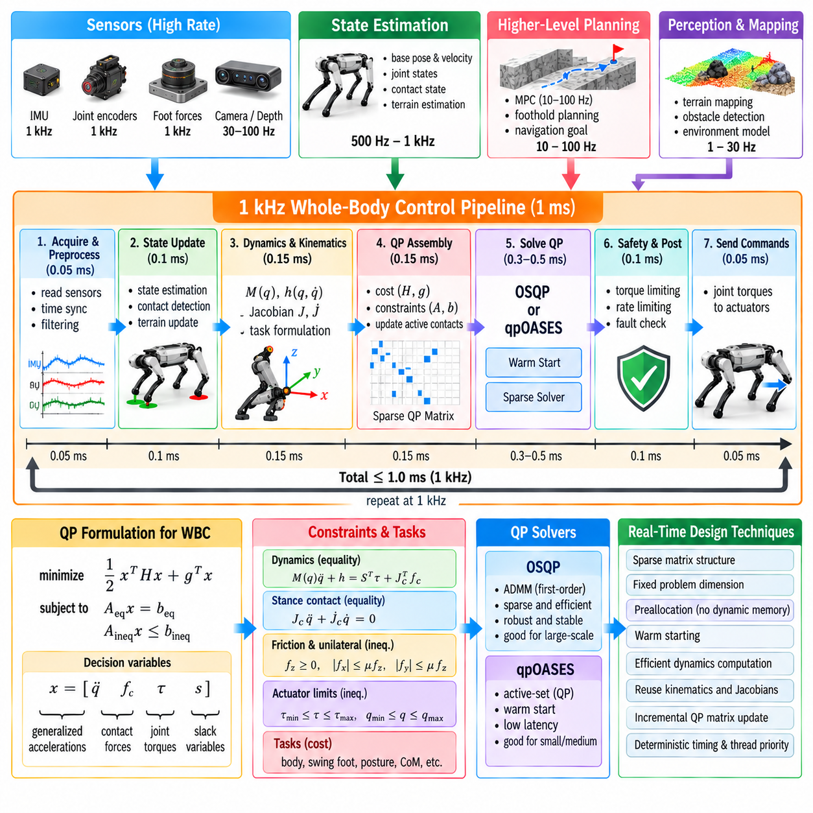{width="7.268055555555556in" height="7.268055555555556in"}

Real-time Whole-Body Control (WBC) at 1 kHz requires the complete sensing, dynamics, optimization, and command pipeline to finish within approximately one millisecond. This timing requirement is demanding because a quadruped controller must evaluate floating-base dynamics, contact constraints, task Jacobians, optimization matrices, and actuator commands while maintaining predictable execution time under changing gait conditions.

A 1 kHz control rate is valuable because legged robots experience fast contact dynamics and rapid changes in joint torque, foot force, and body motion. Short control intervals allow disturbances and tracking errors to be corrected before they grow significantly. High-rate control is particularly important during touchdown, slipping, impact recovery, dynamic trotting, running, and manipulation where interaction forces can change much faster than higher-level planners operate.

The 1 ms period should be treated as an end-to-end deadline rather than as the available time for the QP solver alone. State acquisition, filtering, state estimation, rigid-body dynamics, Jacobian computation, task generation, QP assembly, numerical optimization, safety checks, communication, and actuator command transmission all consume time. A solver taking 0.8 ms may therefore already be unsuitable if the surrounding pipeline requires another 0.5 ms.

A practical architecture separates control functions according to their required update frequencies. Motor current or torque regulation may operate at the actuator level at several kilohertz, WBC may execute near 500 Hz to 1 kHz, state estimation may run at a comparable rate, and Model Predictive Control (MPC) may operate at tens or hundreds of hertz. Perception, terrain mapping, and global planning normally execute more slowly and provide asynchronous references.

Computational optimization begins with reducing unnecessary problem dimensions. The WBC decision vector should contain only variables required by the chosen formulation. Generalized accelerations, contact forces, and joint torques can all be optimized explicitly, but this increases QP size. Eliminating variables analytically through rigid-body dynamics or exploiting actuated and unactuated partitions can reduce computation when the resulting numerical structure remains well conditioned.

Sparse linear algebra is fundamental because robot dynamics and WBC constraints contain substantial structure. Contact Jacobians affect selected coordinates, task matrices have repeated patterns, and many QP entries remain zero. Storing and solving these systems as dense matrices wastes computation and memory bandwidth. Sparse representations allow numerical solvers to operate primarily on meaningful nonzero elements and become increasingly advantageous as system complexity grows.

Fixed matrix dimensions can improve real-time performance even though the number of active contacts changes during locomotion. Instead of resizing the optimization problem whenever a foot enters or leaves stance, variables for all potential contacts can remain allocated. Bounds or constraint coefficients can activate and deactivate individual contacts. This preserves memory layouts and sparsity patterns and reduces unpredictable allocation or factorization overhead.

Preallocation is another important real-time design principle. Dynamic memory allocation inside the control loop can produce nondeterministic latency because allocation time depends on runtime memory state. Matrices, vectors, solver workspaces, communication buffers, and logging structures should therefore be created before entering the high-frequency loop whenever possible. Runtime execution should primarily update numerical values inside existing storage.

Rigid-body dynamics computation must also be efficient. Recursive algorithms can calculate mass matrices, nonlinear effects, centroidal quantities, and inverse dynamics without repeatedly performing expensive symbolic operations. Robotics libraries commonly exploit articulated-body and recursive Newton-Euler methods. The objective is not merely high average speed but consistent computation across different robot configurations and contact phases.

Task Jacobians and their derivatives can consume substantial computation when many operational-space objectives are active. Only quantities required by the current controller should be evaluated. Reusing intermediate kinematic transforms, spatial velocities, and frame data prevents repeated calculations. A well-designed computation graph evaluates forward kinematics once and allows multiple WBC tasks to access the resulting cached quantities.

QP matrix assembly can become as expensive as solving the optimization itself. Reconstructing matrices from high-level objects every cycle introduces unnecessary copying and allocation. Efficient implementations maintain a predetermined matrix structure and update only coefficients affected by the current robot state, reference, or contact mode. Direct access to solver data structures can further reduce conversion overhead between robotics and optimization libraries.

Warm starting is particularly effective for high-frequency WBC because consecutive optimization problems are strongly correlated. Over one millisecond, joint positions, velocities, desired forces, and task references usually change only slightly. The previous primal and dual solutions therefore provide useful initial conditions. Active-set solvers can reuse working sets, while iterative solvers can initialize optimization variables and multipliers from the preceding control cycle.

Factorization reuse provides another major computational advantage. If the QP sparsity structure remains unchanged, symbolic factorization does not need to be repeated every cycle. Depending on the solver and formulation, numerical factorizations or portions of them may also be reused or updated efficiently. Designing the controller so that contact switching modifies values and bounds rather than complete matrix topology can substantially reduce computation.

Solver tolerance should be selected for control performance rather than mathematical perfection. Driving primal and dual residuals to extremely small values may require many additional iterations without producing a meaningful improvement in robot behavior. The appropriate tolerance is the loosest setting that still maintains acceptable contact constraints, torque commands, tracking accuracy, and stability. This tradeoff should be determined experimentally.

Iteration limits are necessary for deterministic timing. An iterative solver should not continue indefinitely because one difficult QP could violate the control deadline. A maximum iteration count or computation-time budget provides a predictable upper bound. If convergence is incomplete, the controller can evaluate whether the current approximate solution is sufficiently feasible or whether a fallback command must be used.

OSQP can be useful for real-time WBC when its sparse structure, warm starting, and factorization behavior are exploited carefully. Its operator-splitting formulation allows accuracy and iteration count to be traded against computation time. However, achieving 1 kHz is not guaranteed simply by selecting a fast solver. Actual performance depends on QP dimensions, conditioning, processor architecture, contact structure, tolerance settings, and surrounding software overhead.

Active-set solvers such as qpOASES can also perform efficiently when sequential QPs differ only modestly. If the active constraint set remains similar between adjacent cycles, hot-start strategies may converge rapidly. Contact transitions can cause larger changes and increase computation. Consequently, benchmarking should include touchdown, liftoff, saturation, disturbance recovery, and other difficult cases rather than only steady-state walking.

Numerical scaling directly affects computation time. Poorly scaled force, acceleration, torque, and orientation variables can slow convergence or create inaccurate solutions. Task normalization and variable scaling should keep relevant quantities within comparable numerical ranges. Appropriate regularization of weakly constrained directions can improve Hessian conditioning and reduce solver effort while producing smoother control commands.

Strict task hierarchies can increase computational cost because several QPs may need to be solved sequentially. For a 1 kHz implementation, a single weighted QP is often computationally attractive, although it provides softer priority semantics. Hybrid strategies can keep safety-critical dynamics and physical limits as hard constraints while representing performance objectives through weighted costs, reducing the number of optimization stages.

Parallel computation can accelerate selected portions of the pipeline, but it must be applied carefully. Independent kinematic calculations, perception interfaces, logging, and some model updates may run on separate threads. The core optimization often contains sequential numerical dependencies, so adding threads does not automatically reduce latency. Synchronization, cache contention, and operating-system scheduling can even make timing less predictable.

CPU affinity and real-time scheduling are important on general-purpose computers. The WBC thread can be pinned to a dedicated processor core to reduce migration and cache disruption. Real-time operating-system policies can assign it higher scheduling priority than logging, visualization, networking, or user-interface tasks. Background processes should not be allowed to introduce unpredictable delays into a safety-critical control loop.

Memory behavior matters because modern processors can execute arithmetic much faster than they can recover poorly organized data from memory. Fixed-size arrays, contiguous storage, cache-friendly matrix layouts, and reduced copying improve deterministic performance. Excessive abstraction layers can create temporary objects and hidden allocations, so profiling should measure memory operations in addition to floating-point computation.

Communication latency must be included in the real-time budget. Commands may pass through EtherCAT, CAN, Ethernet, serial links, or proprietary actuator networks, while sensor measurements travel in the opposite direction. Deterministic field buses and synchronized timestamps reduce timing uncertainty. A controller that computes commands in 0.4 ms can still perform poorly if communication introduces large or variable delays.

Time synchronization becomes important when IMU, joint encoder, force, vision, and external sensing data originate from different devices. WBC assumes that the state represents a consistent physical instant. Timestamp errors can appear as false velocities, contact inconsistencies, or orientation errors. Hardware synchronization, PTP, shared clocks, or carefully designed timestamp compensation can improve the temporal consistency of sensor fusion.

Logging should never block the high-frequency control thread. Writing files, formatting text, transmitting telemetry, or rendering visualization can produce large latency spikes. The real-time loop should place compact data into preallocated lock-free or bounded buffers, while lower-priority threads perform storage and visualization asynchronously. Logging rates can also be reduced while preserving critical diagnostic variables.

Deadline monitoring is necessary because average execution time does not demonstrate real-time capability. The system should record minimum, mean, percentile, and worst-case computation times together with deadline misses. A controller averaging 0.3 ms but occasionally requiring 2 ms may be less suitable than one consistently completing in 0.7 ms. Tail latency is therefore a critical metric for WBC deployment.

Worst-case testing should deliberately exercise difficult operating conditions. Rapid contact switching, all task constraints active, near-singular configurations, torque saturation, low-friction constraints, arm manipulation, payload changes, and disturbance recovery can increase computation. Benchmarking only nominal standing or steady trotting can hide timing failures that emerge precisely when the robot most requires reliable control.

A multi-rate architecture prevents unnecessary work from entering the 1 kHz loop. Terrain planning, foothold optimization, MPC horizon updates, payload identification, and complex collision calculations can execute at lower frequencies. Their outputs can be interpolated or held between updates. The WBC layer should perform only calculations that genuinely require millisecond-scale feedback while consuming prepared references from slower modules.

Safety behavior must remain deterministic when the deadline cannot be met. The robot can temporarily reuse the previous valid torque command, apply a predefined stabilizing controller, reduce task demands, or enter a controlled stop. Repeated deadline misses should trigger escalation rather than allowing stale commands to continue indefinitely. Timing failure is therefore treated as a control fault, not merely a software performance issue.

Profiling should guide optimization instead of relying on assumptions. Execution time should be measured separately for state estimation, dynamics, kinematics, QP assembly, solver execution, safety processing, and communication. Optimization effort can then target the actual bottleneck. Replacing a solver provides little benefit if matrix construction, memory allocation, or communication dominates the control period.

Achieving 1 kHz WBC is ultimately a system-engineering problem combining control formulation, numerical optimization, software architecture, operating-system behavior, communication, and hardware capability. The goal is not simply to compute one solution in less than one millisecond, but to produce safe, dynamically consistent commands every millisecond with bounded latency. Deterministic execution is therefore as important as raw computational speed.

1 kHz에서의 실시간 전신 제어(Real-Time Whole-Body Control, WBC)는 전체 센싱, 동역학, 최적화, 명령 파이프라인이 약 1밀리초 이내에 완료되어야 한다. 이러한 시간 요구조건은 사족보행 제어기가 변화하는 보행 조건에서도 부유 기저 동역학(Floating-Base Dynamics), 접촉 제약조건(Contact Constraint), 작업 자코비안(Task Jacobian), 최적화 행렬, 구동기 명령을 계산하면서 예측 가능한 실행 시간을 유지해야 하므로 매우 까다롭다.

1 kHz 제어 주파수(Control Rate)는 다족 로봇에서 빠른 접촉 동역학(Contact Dynamics)과 관절 토크, 발 접촉력, 몸체 운동의 급격한 변화가 발생하기 때문에 중요하다. 짧은 제어 주기는 외란과 추종 오차가 크게 증가하기 전에 이를 보정할 수 있게 한다. 고주파 제어는 특히 착지(Touchdown), 미끄러짐, 충격 복구(Impact Recovery), 동적 트로트(Dynamic Trotting), 달리기, 조작 작업처럼 상호작용 힘이 상위 수준 계획기보다 훨씬 빠르게 변화하는 상황에서 중요하다.

1밀리초의 주기는 이차 계획법(Quadratic Programming, QP) 솔버에만 사용할 수 있는 시간이 아니라 종단 간 마감시간(End-to-End Deadline)으로 취급해야 한다. 상태 획득, 필터링, 상태 추정(State Estimation), 강체 동역학(Rigid-Body Dynamics), 자코비안 계산, 작업 생성, QP 구성, 수치 최적화, 안전 검사, 통신, 구동기 명령 전송이 모두 시간을 소비한다. 따라서 솔버가 0.8밀리초를 사용한다면 주변 파이프라인이 추가로 0.5밀리초를 요구하는 시스템에서는 이미 적합하지 않을 수 있다.

실용적인 아키텍처는 필요한 갱신 주파수에 따라 제어 기능을 분리한다. 모터 전류 또는 토크 조절은 구동기 수준에서 수 kHz로 동작할 수 있고, WBC는 약 500 Hz에서 1 kHz로 실행될 수 있으며, 상태 추정도 이와 비슷한 주파수에서 수행될 수 있다. 모델 예측 제어(Model Predictive Control, MPC)는 수십 또는 수백 Hz에서 동작할 수 있다. 지각, 지형 매핑, 전역 계획(Global Planning)은 일반적으로 더 낮은 주파수에서 실행되며 비동기 기준값(Asynchronous Reference)을 제공한다.

계산 최적화(Computational Optimization)는 불필요한 문제 차원을 줄이는 것에서 시작한다. WBC 결정 변수 벡터(Decision Vector)는 선택된 제어 구성에 필요한 변수만 포함해야 한다. 일반화 가속도(Generalized Acceleration), 접촉력(Contact Force), 관절 토크를 모두 명시적으로 최적화할 수 있지만 이는 QP의 크기를 증가시킨다. 강체 동역학을 이용하여 일부 변수를 해석적으로 제거하거나 구동 및 비구동 부분을 활용하면 수치적 구조의 조건성을 유지하면서 계산량을 줄일 수 있다.

희소 선형대수(Sparse Linear Algebra)는 로봇 동역학과 WBC 제약조건이 상당한 구조적 특성을 가지기 때문에 핵심적이다. 접촉 자코비안(Contact Jacobian)은 선택된 좌표에 영향을 주며, 작업 행렬에는 반복적인 패턴이 존재하고 많은 QP 원소가 0으로 유지된다. 이러한 시스템을 밀집 행렬(Dense Matrix)로 저장하고 계산하면 연산량과 메모리 대역폭을 낭비하게 된다. 희소 표현(Sparse Representation)은 수치 솔버가 의미 있는 비영 원소를 중심으로 계산하도록 하며 시스템 복잡도가 증가할수록 장점이 커진다.

이동 중 활성 접촉점의 수가 변화하더라도 고정된 행렬 차원(Fixed Matrix Dimension)을 유지하면 실시간 성능을 향상시킬 수 있다. 발이 지지 상태에 진입하거나 이탈할 때마다 최적화 문제의 크기를 변경하는 대신 모든 잠재적 접촉점에 대한 변수를 계속 할당할 수 있다. 경계조건(Bound)이나 제약조건 계수를 이용하여 개별 접촉을 활성화하거나 비활성화하면 메모리 배치와 희소 패턴을 유지하고 예측하기 어려운 할당 또는 행렬 분해 오버헤드를 줄일 수 있다.

사전 할당(Preallocation)은 또 다른 중요한 실시간 설계 원칙이다. 제어 루프 내부에서 동적 메모리 할당(Dynamic Memory Allocation)을 수행하면 실행 시점의 메모리 상태에 따라 할당 시간이 달라질 수 있으므로 비결정론적 지연(Non-Deterministic Latency)이 발생할 수 있다. 따라서 가능하면 고주파 루프에 진입하기 전에 행렬, 벡터, 솔버 작업 공간, 통신 버퍼, 로깅 구조를 생성해야 한다. 실행 중에는 기존 저장 공간 내부의 수치값만 갱신하는 것이 바람직하다.

강체 동역학 계산(Rigid-Body Dynamics Computation) 역시 효율적이어야 한다. 재귀 알고리즘(Recursive Algorithm)은 비용이 큰 기호 연산을 반복하지 않고 질량 행렬(Mass Matrix), 비선형 효과(Nonlinear Effect), 중심 동역학 물리량(Centroidal Quantity), 역동역학(Inverse Dynamics)을 계산할 수 있다. 로보틱스 라이브러리는 일반적으로 관절체 알고리즘(Articulated-Body Algorithm)과 재귀 뉴턴-오일러 방법(Recursive Newton-Euler Method)을 활용한다. 목표는 높은 평균 속도뿐 아니라 서로 다른 로봇 구성과 접촉 단계에서도 일관된 계산 시간을 확보하는 것이다.

여러 작업 공간 목표(Operational-Space Objective)가 활성화되면 작업 자코비안과 그 미분값 계산에 상당한 연산량이 필요할 수 있다. 현재 제어기에 실제로 필요한 물리량만 계산해야 한다. 중간 운동학 변환(Kinematic Transform), 공간 속도(Spatial Velocity), 프레임 데이터를 재사용하면 반복 계산을 방지할 수 있다. 잘 설계된 계산 그래프(Computation Graph)는 순기구학(Forward Kinematics)을 한 번 계산한 후 여러 WBC 작업에서 캐시된 결과를 공유하도록 한다.

QP 행렬 구성(QP Matrix Assembly)은 최적화 문제를 실제로 푸는 것만큼 많은 시간이 소요될 수 있다. 매 제어 주기마다 고수준 객체에서 행렬을 다시 생성하면 불필요한 복사와 메모리 할당이 발생한다. 효율적인 구현에서는 미리 결정된 행렬 구조를 유지하고 현재 로봇 상태, 기준값 또는 접촉 모드에 따라 달라지는 계수만 갱신한다. 솔버 데이터 구조에 직접 접근하면 로보틱스 라이브러리와 최적화 라이브러리 사이의 변환 오버헤드도 줄일 수 있다.

웜 스타트(Warm Starting)는 연속적인 최적화 문제 사이에 높은 상관관계가 존재하기 때문에 고주파 WBC에서 특히 효과적이다. 1밀리초 동안 관절 위치, 속도, 원하는 힘, 작업 기준값은 일반적으로 매우 조금만 변화한다. 따라서 이전의 원시 해(Primal Solution)와 쌍대 해(Dual Solution)는 유용한 초기조건을 제공한다. 활성 집합 솔버(Active-Set Solver)는 작업 집합(Working Set)을 재사용할 수 있고 반복형 솔버(Iterative Solver)는 이전 제어 주기의 최적화 변수와 승수(Multiplier)를 초기값으로 사용할 수 있다.

행렬 분해 재사용(Factorization Reuse)은 또 다른 중요한 계산상의 장점을 제공한다. QP의 희소 구조가 변경되지 않으면 기호적 분해(Symbolic Factorization)를 매 제어 주기마다 반복할 필요가 없다. 솔버와 문제 구성에 따라 수치적 분해(Numerical Factorization) 또는 그 일부 역시 효율적으로 재사용하거나 갱신할 수 있다. 접촉 전환이 전체 행렬 구조가 아니라 값과 경계조건을 변경하도록 제어기를 설계하면 계산량을 크게 줄일 수 있다.

솔버 허용오차(Solver Tolerance)는 수학적 완벽성보다 실제 제어 성능을 기준으로 선택해야 한다. 원시 잔차(Primal Residual)와 쌍대 잔차(Dual Residual)를 지나치게 작은 값까지 감소시키면 로봇 동작에는 의미 있는 향상이 없으면서 추가 반복 계산만 증가할 수 있다. 적절한 허용오차는 접촉 제약조건, 토크 명령, 추종 정확도, 안정성을 만족하면서 사용할 수 있는 가장 완화된 수준이며 실험을 통해 결정해야 한다.

결정론적 타이밍(Deterministic Timing)을 위해 반복 횟수 제한(Iteration Limit)이 필요하다. 반복형 솔버가 무한정 계산을 계속하면 하나의 어려운 QP 문제로 인해 제어 마감시간을 초과할 수 있다. 최대 반복 횟수 또는 계산 시간 예산(Computation-Time Budget)을 설정하면 예측 가능한 상한을 확보할 수 있다. 수렴이 완료되지 않은 경우 현재의 근사해가 충분히 실현 가능한지 평가하거나 폴백 명령(Fallback Command)을 사용해야 한다.

OSQP는 희소 구조, 웜 스타트, 행렬 분해 특성을 신중하게 활용할 경우 실시간 WBC에 유용할 수 있다. 연산자 분할(Operator Splitting) 기반 구성은 정확도와 반복 횟수를 계산 시간과 절충할 수 있도록 한다. 그러나 빠른 솔버를 선택하는 것만으로 1 kHz 동작이 보장되는 것은 아니다. 실제 성능은 QP 차원, 수치적 조건성, 프로세서 구조, 접촉 구조, 허용오차 설정, 주변 소프트웨어 오버헤드에 따라 결정된다.

qpOASES와 같은 활성 집합 솔버(Active-Set Solver)도 연속된 QP가 작은 차이만 가지는 경우 효율적으로 동작할 수 있다. 인접한 제어 주기 사이에서 활성 제약조건 집합이 비슷하게 유지되면 핫 스타트(Hot Start) 전략을 통해 빠르게 수렴할 수 있다. 반면 접촉 전환은 더 큰 변화를 발생시켜 계산량을 증가시킬 수 있다. 따라서 성능 평가는 정상적인 보행뿐 아니라 착지, 이륙, 포화, 외란 복구 등의 어려운 조건도 포함해야 한다.

수치적 스케일링(Numerical Scaling)은 계산 시간에 직접적인 영향을 준다. 힘, 가속도, 토크, 방향 변수의 스케일이 부적절하면 수렴 속도가 느려지거나 부정확한 해가 발생할 수 있다. 작업 정규화(Task Normalization)와 변수 스케일링을 이용하여 관련 물리량을 유사한 수치 범위에 유지해야 한다. 약하게 제한된 방향에 적절한 정규화(Regularization)를 적용하면 헤시안(Hessian)의 조건성을 향상시키고 솔버 계산량을 줄이면서 더 부드러운 제어 명령을 생성할 수 있다.

엄격한 작업 계층(Strict Task Hierarchy)은 여러 QP를 순차적으로 해결해야 할 수 있으므로 계산 비용을 증가시킨다. 1 kHz 구현에서는 단일 가중 QP(Single Weighted QP)가 계산 측면에서 매력적이지만 상대적으로 부드러운 우선순위 의미를 제공한다. 하이브리드 전략(Hybrid Strategy)은 안전에 중요한 동역학 및 물리적 한계를 강성 제약조건(Hard Constraint)으로 유지하고 성능 목표를 가중 비용함수로 표현하여 최적화 단계의 수를 줄일 수 있다.

병렬 계산(Parallel Computation)은 파이프라인의 일부를 가속할 수 있지만 신중하게 적용해야 한다. 독립적인 운동학 계산, 지각 인터페이스, 로깅, 일부 모델 갱신은 별도의 스레드(Thread)에서 실행할 수 있다. 그러나 핵심 최적화에는 순차적인 수치 의존성이 존재하는 경우가 많기 때문에 스레드를 추가한다고 반드시 지연 시간이 감소하는 것은 아니다. 동기화, 캐시 경합(Cache Contention), 운영체제 스케줄링으로 인해 오히려 타이밍의 예측 가능성이 저하될 수도 있다.

범용 컴퓨터에서는 CPU 어피니티(CPU Affinity)와 실시간 스케줄링(Real-Time Scheduling)이 중요하다. WBC 스레드를 전용 프로세서 코어에 고정하면 코어 이동과 캐시 교란을 줄일 수 있다. 실시간 운영체제 정책은 로깅, 시각화, 네트워크, 사용자 인터페이스 작업보다 높은 스케줄링 우선순위를 부여할 수 있다. 백그라운드 프로세스가 안전 필수 제어 루프에 예측할 수 없는 지연을 발생시키지 않도록 해야 한다.

현대 프로세서는 잘 정렬되지 않은 데이터를 메모리에서 가져오는 것보다 산술 연산을 훨씬 빠르게 수행할 수 있으므로 메모리 동작(Memory Behavior)이 중요하다. 고정 크기 배열, 연속 저장 구조(Contiguous Storage), 캐시 친화적인 행렬 배치, 데이터 복사 최소화는 결정론적 성능을 향상시킨다. 지나치게 많은 추상화 계층은 임시 객체와 숨겨진 메모리 할당을 발생시킬 수 있으므로 프로파일링에서는 부동소수점 연산뿐 아니라 메모리 동작도 측정해야 한다.

통신 지연(Communication Latency)은 실시간 시간 예산에 포함되어야 한다. 명령은 EtherCAT, CAN, Ethernet, 직렬 통신 또는 전용 구동기 네트워크를 통해 전달될 수 있으며 센서 측정값은 반대 방향으로 이동한다. 결정론적 필드버스(Deterministic Fieldbus)와 동기화된 타임스탬프는 시간 불확실성을 줄인다. 제어기가 0.4밀리초 안에 명령을 계산하더라도 통신에서 크거나 변동하는 지연이 발생하면 전체 제어 성능은 저하될 수 있다.

IMU, 관절 인코더, 힘 센서, 비전, 외부 센싱 데이터가 서로 다른 장치에서 생성되는 경우 시간 동기화(Time Synchronization)가 중요해진다. WBC는 상태값이 동일한 물리적 시점을 나타낸다고 가정한다. 타임스탬프 오차는 잘못된 속도, 접촉 불일치, 방향 오차처럼 나타날 수 있다. 하드웨어 동기화, 정밀 시간 프로토콜(Precision Time Protocol, PTP), 공유 클록(Shared Clock), 또는 신중하게 설계된 타임스탬프 보상을 이용하면 센서 융합의 시간적 일관성을 향상시킬 수 있다.

로깅(Logging)은 고주파 제어 스레드를 절대로 블로킹(Blocking)해서는 안 된다. 파일 기록, 텍스트 포맷팅, 텔레메트리 전송, 시각화 렌더링은 큰 지연 스파이크(Latency Spike)를 발생시킬 수 있다. 실시간 루프에서는 압축된 데이터를 사전 할당된 락프리 버퍼(Lock-Free Buffer) 또는 제한된 버퍼에 저장하고, 낮은 우선순위의 스레드에서 비동기적으로 저장 및 시각화를 수행해야 한다. 핵심 진단 변수를 유지하면서 로깅 주파수를 낮출 수도 있다.

평균 실행 시간만으로는 실시간 성능을 입증할 수 없기 때문에 마감시간 감시(Deadline Monitoring)가 필요하다. 시스템은 최소, 평균, 백분위수(Percentile), 최악 실행 시간(Worst-Case Execution Time)과 함께 마감시간 초과(Deadline Miss)를 기록해야 한다. 평균 0.3밀리초이지만 간헐적으로 2밀리초가 필요한 제어기는 지속적으로 0.7밀리초 안에 완료되는 제어기보다 부적합할 수 있다. 따라서 꼬리 지연(Tail Latency)은 WBC 배포에서 핵심적인 평가 지표이다.

최악 조건 시험(Worst-Case Testing)은 의도적으로 어려운 운용 조건을 포함해야 한다. 빠른 접촉 전환, 모든 작업 제약조건 활성화, 특이점에 가까운 구성, 토크 포화, 낮은 마찰 제약조건, 로봇 팔 조작, 페이로드 변화, 외란 복구는 계산량을 증가시킬 수 있다. 정상적인 기립이나 일정한 트로트만 벤치마킹하면 로봇이 가장 신뢰성 높은 제어를 필요로 하는 순간에 발생하는 타이밍 실패를 발견하지 못할 수 있다.

다중 주기 아키텍처(Multi-Rate Architecture)는 불필요한 계산이 1 kHz 루프에 진입하는 것을 방지한다. 지형 계획, 발 디딤 최적화, MPC 예측 구간 갱신, 페이로드 식별, 복잡한 충돌 계산은 더 낮은 주파수에서 실행할 수 있다. 이들의 출력은 갱신 사이에서 보간하거나 유지할 수 있다. WBC 계층은 실제로 밀리초 수준의 피드백이 필요한 계산만 수행하고 더 느린 모듈에서 준비된 기준값을 사용해야 한다.

마감시간을 만족하지 못하는 경우에도 안전 동작(Safety Behavior)은 결정론적으로 유지되어야 한다. 로봇은 이전의 유효한 토크 명령을 일시적으로 재사용하거나, 사전에 정의된 안정화 제어기(Stabilizing Controller)를 적용하거나, 작업 요구량을 줄이거나, 제어된 정지(Controlled Stop) 상태로 진입할 수 있다. 반복적인 마감시간 초과는 오래된 명령을 무기한 사용하는 대신 단계적으로 더 높은 안전 대응을 발생시켜야 한다. 따라서 타이밍 실패(Timing Failure)는 단순한 소프트웨어 성능 문제가 아니라 제어 고장(Control Fault)으로 취급해야 한다.

프로파일링(Profiling)은 추측이 아니라 실제 측정 결과를 기반으로 최적화를 수행하도록 해야 한다. 상태 추정, 동역학, 운동학, QP 행렬 구성, 솔버 실행, 안전 처리, 통신에 필요한 실행 시간을 각각 측정해야 한다. 이후 실제 병목 구간(Bottleneck)에 최적화 노력을 집중할 수 있다. 행렬 구성, 메모리 할당 또는 통신이 제어 주기의 대부분을 차지한다면 솔버를 교체하더라도 얻을 수 있는 성능 향상은 제한적이다.

1 kHz WBC를 구현하는 것은 궁극적으로 제어 구성, 수치 최적화, 소프트웨어 아키텍처, 운영체제 동작, 통신, 하드웨어 성능을 결합하는 시스템 엔지니어링(System Engineering) 문제이다. 목표는 단순히 하나의 해를 1밀리초 이내에 계산하는 것이 아니라 제한된 지연 시간(Bounded Latency)을 유지하면서 매 밀리초마다 안전하고 동역학적으로 일관된 명령을 생성하는 것이다. 따라서 결정론적 실행(Deterministic Execution)은 순수한 계산 속도만큼 중요하다.

##  

## 06.08. WBC Constraint Relaxation Infeasible Recovery [w/Code]

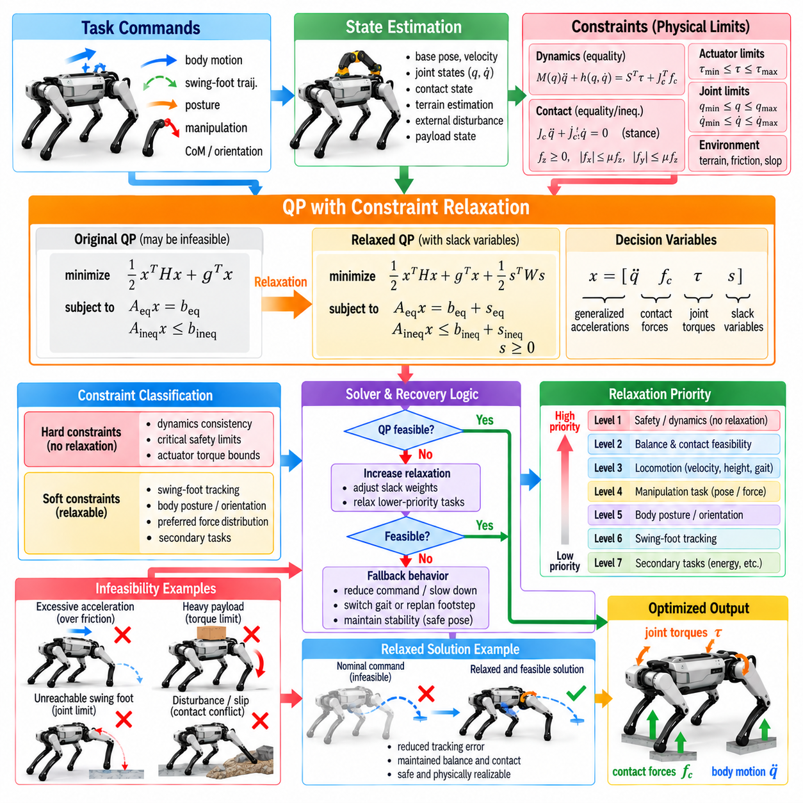{width="7.268055555555556in" height="7.268055555555556in"}

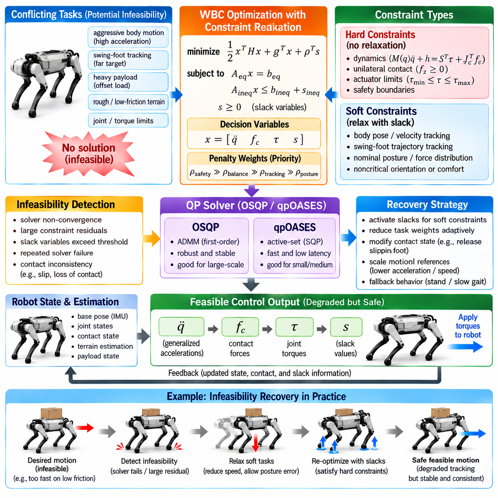{width="7.268055555555556in" height="7.268055555555556in"}

Constraint relaxation is a fundamental mechanism for maintaining Whole-Body Control (WBC) operation when the original optimization problem becomes infeasible. In a quadruped, desired body motion, swing-foot tracking, contact-force limits, friction constraints, joint limits, and actuator limits may conflict. A robust controller must recognize these conflicts and degrade selected objectives safely instead of returning no valid command.

Infeasibility occurs when no decision vector can satisfy all equality and inequality constraints simultaneously. For example, a desired body acceleration may require ground reaction forces outside the available friction region, or a swing-foot trajectory may demand joint accelerations incompatible with torque limits. The optimization problem is mathematically valid, but the requested combination of physical requirements cannot be realized by the robot.

The distinction between hard constraints and soft constraints is central to infeasibility recovery. Hard constraints represent conditions that should not normally be violated, such as fundamental equations of motion, critical actuator limits, and essential safety boundaries. Soft constraints represent requirements that may be relaxed when necessary, such as exact trajectory tracking, nominal posture, preferred force distribution, or noncritical orientation objectives.

Constraint relaxation introduces controlled freedom into otherwise rigid requirements. Instead of enforcing an equality exactly as Ax = b, the controller can write Ax = b + s, where s is a slack variable. The optimization penalizes the magnitude of s so that the original constraint remains approximately satisfied whenever possible. When conflict occurs, the solver can use a nonzero slack rather than declaring the entire QP infeasible.

Slack variables can also relax inequality constraints. A requirement such as Cx ≤ d can be modified to Cx ≤ d + s with s constrained to be nonnegative. A large penalty on s discourages violation under normal conditions. This formulation provides an explicit numerical measure of how much relaxation is required and allows the controller to distinguish small temporary conflicts from severe loss of feasibility.

Penalty weights determine which objectives are sacrificed first. If body orientation is more important than nominal joint posture, orientation relaxation should carry a much larger penalty. The optimizer will then allow posture error before significant orientation error. Proper weight selection therefore converts engineering priorities into quantitative recovery behavior and must reflect the physical consequences of violating each requirement.

Not every constraint should receive a slack variable. Relaxing an actuator torque limit without an independent hardware protection mechanism could command unsafe torque, while relaxing a friction constraint excessively may generate physically impossible contact forces. Constraint relaxation should therefore be designed around a safety hierarchy in which physical and hardware boundaries remain protected while performance-related objectives absorb most conflicts.

Contact constraints are a common source of WBC infeasibility. A controller may assume that a stance foot remains stationary while measured contact conditions indicate slipping or incomplete support. Strictly enforcing zero foot acceleration together with aggressive body tracking can then become inconsistent. The controller may soften selected contact kinematics or revise the contact state when evidence shows that the assumed rigid contact model is no longer appropriate.

Friction limitations produce another important conflict. Desired horizontal acceleration requires tangential ground reaction force, but each foot can generate only the force permitted by its normal load and available friction. When the requested acceleration exceeds this capability, WBC should reduce the motion objective rather than artificially violate the friction cone. This preserves physically realizable contact forces and reduces the probability of slip.

Actuator saturation can make an otherwise feasible motion impossible. Large payloads, extreme body postures, fast swing-leg trajectories, or disturbance recovery may require joint torques beyond motor limits. Torque bounds should generally remain hard constraints, while desired accelerations or tracking objectives are relaxed. The resulting motion may be slower or less accurate, but the command remains compatible with actuator capability.

Joint position and velocity limits require predictive treatment because waiting until a joint reaches its boundary leaves little room for recovery. WBC can introduce velocity-damper constraints or configuration-dependent bounds that become progressively restrictive near a limit. If another task conflicts with these protective constraints, its tracking accuracy is reduced before the joint enters an unsafe region.

Hierarchical relaxation provides a structured method for resolving conflicts. Safety-critical constraints occupy the highest level, followed by balance and contact feasibility, essential task execution, body tracking, manipulation accuracy, and finally comfort or posture objectives. When infeasibility appears, lower-priority requirements are relaxed first. This prevents arbitrary compromises caused solely by numerical weighting.

Strict hierarchical QP can enforce this ordering by solving multiple optimization stages. The optimal value of a higher-priority task is preserved while lower-priority tasks are optimized in the remaining feasible space. This provides clear priority semantics but increases computation. For high-rate WBC, weighted QP or hybrid hierarchical formulations may provide a practical compromise between computational cost and predictable relaxation behavior.

Feasibility restoration can also be implemented as a separate optimization phase. When the nominal QP fails, the controller solves a secondary problem whose objective is primarily to minimize constraint violations. The restored solution may not achieve the requested motion, but it identifies a nearby dynamically consistent state from which normal operation can resume. This is preferable to repeatedly attempting the same infeasible command.

Detecting infeasibility requires more than checking a solver return code. Maximum iteration limits, poor numerical conditioning, invalid sensor data, and true physical inconsistency can all produce solver failure. The controller should inspect primal and dual residuals, constraint violations, solver status, numerical values, and execution time before deciding whether the problem is physically infeasible or numerically unsuccessful.

Numerical conditioning can create apparent infeasibility even when a physical solution exists. Poor scaling between torque, force, acceleration, and orientation variables may make the optimization difficult to solve accurately. Regularization, variable scaling, bounded weights, and well-conditioned Jacobians reduce false failure detection. Recovery logic should therefore distinguish formulation problems from genuine loss of physical feasibility.

Contact transitions deserve special handling because the feasible set changes rapidly during touchdown and liftoff. Immediately imposing full stance constraints at touchdown can conflict with residual swing velocity, while removing contact support instantaneously at liftoff can demand abrupt force redistribution. Gradually ramping contact-force bounds and task weights creates a smoother transition between feasible regions.

Unexpected early or late contact can also invalidate the planned optimization structure. If a swing foot touches the terrain early, continued trajectory tracking may demand motion through the surface. If touchdown occurs late, assuming support from a nonexistent contact produces invalid force solutions. Contact estimation should therefore update the WBC constraint set rapidly and trigger appropriate relaxation during uncertain transition periods.

Payload changes can reduce feasibility margins without immediately producing failure. Increased mass raises required support forces and joint torques, while an offset payload changes the distribution of contact loads. A payload-aware WBC can monitor torque, friction, and force margins and begin relaxing acceleration or posture objectives before the QP becomes infeasible. Preventive adaptation is preferable to emergency recovery.

Manipulation introduces additional conflicts because end-effector forces must ultimately be supported by the legs and terrain. A commanded pushing force may exceed the reaction wrench that the stance can sustain. Rather than sacrificing foot stability, WBC should reduce the manipulation force, modify body posture, or request a better stance. Whole-body feasibility therefore determines the actual manipulation capability.

Constraint margins provide useful early-warning indicators. Distance from torque saturation, friction-cone boundaries, joint limits, and feasible contact-force regions can be monitored continuously. As margins shrink, the controller can progressively reduce task aggressiveness. This creates graceful degradation rather than waiting for a binary transition from feasible operation to complete solver failure.

Adaptive task scaling is an effective form of preventive relaxation. Desired body acceleration, swing-foot acceleration, manipulation force, or orientation rate can be multiplied by a scale factor between zero and one. The controller can search for the largest scale that preserves feasibility. The robot then performs as much of the requested motion as its current physical condition allows.

Recovery behavior should remain temporally smooth. Large changes in slack variables or task weights between consecutive cycles can produce discontinuous forces and torques even when each individual QP is feasible. Rate penalties, filtered relaxation variables, force-rate regularization, and gradual priority transitions can reduce command discontinuities while still allowing rapid response to genuine emergencies.

A fallback controller is necessary when optimization-based recovery cannot produce a trustworthy command within the real-time deadline. Depending on robot state, fallback behavior may hold the previous valid torque briefly, switch to a simpler stabilizing controller, lower the body, increase support, stop stepping, or initiate a controlled shutdown. The fallback strategy should be deterministic and validated independently of the nominal WBC.

Repeated infeasibility should be treated differently from an isolated event. A single failed cycle may result from a temporary contact transition or numerical disturbance, whereas persistent failure indicates a structural problem such as incorrect state estimation, damaged hardware, unrealistic commands, insufficient friction, or an invalid model. Supervisory logic should escalate recovery actions according to failure duration and severity.

Recovery can involve modifying the gait rather than only changing optimization weights. A dynamic trot may provide insufficient support margin for a heavy payload or strong manipulation force. Switching toward a slower gait, increasing duty factor, widening stance, lowering the center of mass, or establishing four-foot support can enlarge the feasible region before normal task execution resumes.

The controller should record the cause and magnitude of relaxation for diagnostics. Slack values, saturated constraints, task scaling factors, solver status, contact states, torque margins, and recovery transitions provide valuable information for field debugging. Frequent relaxation of the same constraint often reveals a planning, modeling, calibration, or hardware problem that should be corrected outside the WBC layer.

Simulation is particularly useful for validating infeasibility recovery because extreme conflicts can be generated without risking hardware. Tests can deliberately request excessive acceleration, reduce friction, apply large disturbances, introduce payload errors, force joint limits, or corrupt contact timing. The controller should demonstrate bounded commands, predictable priority degradation, and successful return to normal operation.

Hardware validation should begin with conservative conditions and gradually approach the feasibility boundaries. Force limits, torque saturation, difficult terrain, payload variation, and external disturbances can then be introduced systematically. Evaluation should measure not only whether the robot remains standing, but also relaxation magnitude, recovery time, torque continuity, contact slip, solver timing, and recurrence of infeasibility.

Constraint relaxation should not be viewed as a method for hiding poor controller design. If normal operation continuously requires large slack variables, the reference generator, dynamic model, task hierarchy, actuator sizing, or contact assumptions are probably inappropriate. Relaxation is intended to manage temporary conflicts and uncertainty while exposing persistent structural problems through monitoring and diagnostics.

Robust WBC therefore treats feasibility as a continuously managed resource rather than a binary solver property. Physical margins are monitored before failure, selected objectives are relaxed according to explicit priorities, contact assumptions are adapted when reality differs from the plan, and deterministic fallback behavior protects the robot when optimization cannot recover. This architecture allows a quadruped to degrade gracefully instead of failing abruptly when competing tasks exceed its instantaneous physical capability.

제약조건 완화(Constraint Relaxation)는 원래의 최적화 문제가 실행 불가능(Infeasible)해졌을 때 전신 제어(Whole-Body Control, WBC)의 동작을 유지하기 위한 핵심 메커니즘이다. 사족보행 로봇에서는 원하는 몸체 운동, 유각 발 추종(Swing-Foot Tracking), 접촉력 한계, 마찰 제약조건(Friction Constraint), 관절 한계, 구동기 한계가 서로 충돌할 수 있다. 강인한 제어기는 이러한 충돌을 인식하고 유효한 명령을 생성하지 못하는 대신 선택된 목표를 안전하게 완화해야 한다.

실행 불가능성(Infeasibility)은 모든 등식 및 부등식 제약조건을 동시에 만족하는 결정 변수 벡터(Decision Vector)가 존재하지 않을 때 발생한다. 예를 들어 원하는 몸체 가속도가 사용 가능한 마찰 영역을 벗어나는 지면 반력(Ground Reaction Force)을 요구하거나, 유각 발 궤적이 토크 한계와 양립할 수 없는 관절 가속도를 요구할 수 있다. 최적화 문제 자체는 수학적으로 유효하지만 요구된 물리적 조건들의 조합을 로봇이 실제로 구현할 수 없는 것이다.

강성 제약조건(Hard Constraint)과 연성 제약조건(Soft Constraint)의 구분은 실행 불가능성 복구(Infeasibility Recovery)의 핵심이다. 강성 제약조건은 기본 운동방정식, 중요한 구동기 한계, 필수적인 안전 경계와 같이 일반적으로 위반되어서는 안 되는 조건을 나타낸다. 연성 제약조건은 정확한 궤적 추종, 기준 자세, 선호하는 힘 분배, 중요도가 낮은 방향 목표처럼 필요한 경우 완화할 수 있는 요구조건을 나타낸다.

제약조건 완화는 기존의 엄격한 요구조건에 제어된 자유도를 도입한다. 등식 Ax = b를 정확하게 강제하는 대신 제어기는 Ax = b + s와 같이 표현할 수 있으며, 여기서 s는 슬랙 변수(Slack Variable)이다. 최적화는 s의 크기에 페널티를 부여하여 가능한 경우 원래의 제약조건이 근사적으로 유지되도록 한다. 충돌이 발생하면 솔버는 전체 QP를 실행 불가능하다고 선언하는 대신 0이 아닌 슬랙 값을 사용할 수 있다.

슬랙 변수는 부등식 제약조건(Inequality Constraint)을 완화하는 데도 사용할 수 있다. Cx ≤ d와 같은 요구조건을 Cx ≤ d + s로 변경하고 s가 음수가 되지 않도록 제한할 수 있다. s에 큰 페널티를 부여하면 정상 조건에서는 제약조건 위반을 억제할 수 있다. 이러한 구성은 어느 정도의 완화가 필요한지를 명시적인 수치로 나타내며 작은 일시적 충돌과 심각한 실행 가능성 상실을 구분할 수 있게 한다.

페널티 가중치(Penalty Weight)는 어떤 목표가 먼저 희생될지를 결정한다. 몸체 방향이 기준 관절 자세보다 중요하다면 방향 완화에는 훨씬 큰 페널티를 적용해야 한다. 그러면 최적화기는 상당한 방향 오차를 허용하기 전에 먼저 자세 오차를 허용하게 된다. 따라서 적절한 가중치 선택은 공학적 우선순위를 정량적인 복구 동작으로 변환하며 각 요구조건을 위반했을 때의 물리적 결과를 반영해야 한다.

모든 제약조건에 슬랙 변수를 적용해서는 안 된다. 독립적인 하드웨어 보호 메커니즘 없이 구동기 토크 한계를 완화하면 안전하지 않은 토크 명령이 발생할 수 있으며, 마찰 제약조건을 과도하게 완화하면 물리적으로 실현할 수 없는 접촉력을 생성할 수 있다. 따라서 제약조건 완화는 물리적 한계와 하드웨어 경계를 보호하면서 성능 관련 목표가 대부분의 충돌을 흡수하도록 하는 안전 계층(Safety Hierarchy)을 기반으로 설계해야 한다.

접촉 제약조건(Contact Constraint)은 WBC 실행 불가능성의 일반적인 원인이다. 제어기는 지지 발이 정지 상태를 유지한다고 가정할 수 있지만 측정된 접촉 상태는 미끄러짐이나 불완전한 지지를 나타낼 수 있다. 이러한 상황에서 0의 발 가속도를 공격적인 몸체 추종과 함께 엄격하게 강제하면 서로 일치하지 않는 조건이 발생할 수 있다. 강체 접촉 모델(Rigid Contact Model)이 더 이상 적절하지 않다는 증거가 나타나면 제어기는 일부 접촉 운동학을 완화하거나 접촉 상태를 수정할 수 있다.

마찰 한계(Friction Limit)는 또 다른 중요한 충돌을 발생시킨다. 원하는 수평 가속도를 생성하려면 접선 방향 지면 반력이 필요하지만 각 발은 수직 하중과 사용 가능한 마찰이 허용하는 범위에서만 힘을 생성할 수 있다. 요구된 가속도가 이러한 능력을 초과하면 WBC는 마찰 원뿔(Friction Cone)을 인위적으로 위반하는 대신 운동 목표를 감소시켜야 한다. 이를 통해 물리적으로 실현 가능한 접촉력을 유지하고 미끄러짐 가능성을 줄일 수 있다.

구동기 포화(Actuator Saturation)는 다른 조건에서는 실행 가능한 운동을 불가능하게 만들 수 있다. 무거운 페이로드, 극단적인 몸체 자세, 빠른 유각 다리 궤적, 외란 복구는 모터 한계를 초과하는 관절 토크를 요구할 수 있다. 토크 경계는 일반적으로 강성 제약조건으로 유지해야 하며 원하는 가속도나 추종 목표를 완화해야 한다. 결과적으로 운동이 느려지거나 정확도가 감소할 수 있지만 명령은 구동기 능력과 양립할 수 있다.

관절 위치 및 속도 한계(Joint Position and Velocity Limit)는 관절이 경계에 도달할 때까지 기다리면 복구할 여유가 거의 남지 않기 때문에 예측적으로 처리해야 한다. WBC는 관절 한계에 가까워질수록 점진적으로 더 엄격해지는 속도 감쇠 제약조건(Velocity-Damper Constraint)이나 구성 의존적 경계(Configuration-Dependent Bound)를 도입할 수 있다. 다른 작업이 이러한 보호 제약조건과 충돌하면 관절이 위험 영역에 진입하기 전에 해당 작업의 추종 정확도를 감소시킨다.

계층적 완화(Hierarchical Relaxation)는 충돌을 해결하기 위한 구조적인 방법을 제공한다. 안전 필수 제약조건이 가장 높은 수준을 차지하고 그다음으로 균형 및 접촉 실행 가능성, 필수 작업 수행, 몸체 추종, 조작 정확도, 마지막으로 편의성 또는 자세 목표가 배치된다. 실행 불가능성이 발생하면 낮은 우선순위의 요구조건부터 먼저 완화한다. 이를 통해 단순한 수치적 가중치 때문에 임의적인 절충이 발생하는 것을 방지한다.

엄격한 계층적 QP(Strict Hierarchical QP)는 여러 단계의 최적화를 순차적으로 해결하여 이러한 순서를 강제할 수 있다. 높은 우선순위 작업의 최적값을 유지하면서 남아 있는 실행 가능 공간(Feasible Space)에서 낮은 우선순위 작업을 최적화한다. 이 방법은 명확한 우선순위 의미를 제공하지만 계산량을 증가시킨다. 고주파 WBC에서는 가중 QP(Weighted QP) 또는 하이브리드 계층 구성(Hybrid Hierarchical Formulation)이 계산 비용과 예측 가능한 완화 동작 사이의 실용적인 절충안을 제공할 수 있다.

실행 가능성 복원(Feasibility Restoration)은 별도의 최적화 단계로 구현할 수도 있다. 기준 QP가 실패하면 제어기는 제약조건 위반을 최소화하는 것을 주요 목표로 하는 보조 문제를 해결한다. 복원된 해가 요구된 운동을 완전히 달성하지 못하더라도 정상 동작으로 복귀할 수 있는 가까운 동역학적 일관 상태(Dynamically Consistent State)를 식별할 수 있다. 이는 동일한 실행 불가능 명령을 반복적으로 시도하는 것보다 바람직하다.

실행 불가능성을 감지하려면 단순히 솔버 반환 코드(Solver Return Code)를 확인하는 것 이상이 필요하다. 최대 반복 횟수, 불량한 수치 조건성(Numerical Conditioning), 잘못된 센서 데이터, 실제 물리적 불일치 모두 솔버 실패를 발생시킬 수 있다. 제어기는 문제가 물리적으로 실행 불가능한 것인지 또는 단순히 수치적으로 해결되지 않은 것인지를 판단하기 전에 원시 잔차(Primal Residual), 쌍대 잔차(Dual Residual), 제약조건 위반, 솔버 상태, 수치값, 실행 시간을 확인해야 한다.

수치적 조건성 문제는 실제로 물리적 해가 존재하더라도 겉보기에는 실행 불가능한 것처럼 보이게 만들 수 있다. 토크, 힘, 가속도, 방향 변수 사이의 스케일링이 부적절하면 최적화 문제를 정확하게 해결하기 어려워질 수 있다. 정규화(Regularization), 변수 스케일링(Variable Scaling), 제한된 가중치, 조건성이 양호한 자코비안은 잘못된 실패 감지를 줄인다. 따라서 복구 로직은 구성 문제와 실제 물리적 실행 가능성 상실을 구분해야 한다.

접촉 전환(Contact Transition)은 착지와 이륙 과정에서 실행 가능 영역이 빠르게 변화하기 때문에 특별한 처리가 필요하다. 착지 시 전체 지지 제약조건을 즉시 적용하면 남아 있는 유각 속도와 충돌할 수 있으며, 이륙 시 접촉 지지를 순간적으로 제거하면 급격한 힘 재분배를 요구할 수 있다. 접촉력 경계와 작업 가중치를 점진적으로 변화시키면 서로 다른 실행 가능 영역 사이를 보다 부드럽게 전환할 수 있다.

예상하지 못한 조기 접촉(Early Contact) 또는 지연 접촉(Late Contact)도 계획된 최적화 구조를 무효화할 수 있다. 유각 발이 지형에 예상보다 일찍 접촉하면 기존 궤적 추종이 지면을 통과하는 운동을 요구할 수 있다. 착지가 늦어지면 존재하지 않는 접촉점이 지지력을 제공한다고 가정하여 잘못된 힘 해를 생성할 수 있다. 따라서 접촉 추정(Contact Estimation)은 WBC 제약조건 집합을 신속하게 갱신하고 불확실한 전환 구간에서 적절한 완화를 수행해야 한다.

페이로드 변화(Payload Change)는 즉각적인 실패를 발생시키지 않더라도 실행 가능성 여유(Feasibility Margin)를 감소시킬 수 있다. 질량 증가는 필요한 지지력과 관절 토크를 증가시키고 편심 페이로드는 접촉 하중의 분배를 변화시킨다. 페이로드 인식 WBC(Payload-Aware WBC)는 토크, 마찰, 힘 여유를 감시하고 QP가 실행 불가능해지기 전에 가속도 또는 자세 목표를 완화할 수 있다. 이러한 예방적 적응(Preventive Adaptation)은 비상 복구보다 바람직하다.

조작(Manipulation)은 말단장치 힘이 궁극적으로 다리와 지면에 의해 지지되어야 하기 때문에 추가적인 충돌을 발생시킨다. 명령된 밀기 힘이 현재 스탠스가 지지할 수 있는 반작용 렌치(Reaction Wrench)를 초과할 수 있다. WBC는 발 안정성을 희생하는 대신 조작력을 감소시키거나 몸체 자세를 변경하거나 더 적절한 스탠스를 요청해야 한다. 따라서 전신 실행 가능성(Whole-Body Feasibility)이 실제 조작 능력을 결정한다.

제약조건 여유(Constraint Margin)는 유용한 조기 경고 지표를 제공한다. 토크 포화, 마찰 원뿔 경계, 관절 한계, 실행 가능한 접촉력 영역까지의 거리를 지속적으로 감시할 수 있다. 이러한 여유가 감소하면 제어기는 작업의 공격성을 점진적으로 줄일 수 있다. 이는 실행 가능한 동작에서 완전한 솔버 실패로 갑자기 전환되는 것을 기다리는 대신 점진적인 성능 저하(Graceful Degradation)를 가능하게 한다.

적응형 작업 스케일링(Adaptive Task Scaling)은 효과적인 예방적 완화 방법이다. 원하는 몸체 가속도, 유각 발 가속도, 조작력, 방향 변화율에 0과 1 사이의 스케일 계수(Scale Factor)를 곱할 수 있다. 제어기는 실행 가능성을 유지하는 가장 큰 스케일 값을 탐색할 수 있다. 이를 통해 로봇은 현재 물리적 조건에서 허용되는 범위 내에서 요구된 운동을 최대한 수행할 수 있다.

복구 동작은 시간적으로 부드럽게 유지되어야 한다. 연속된 제어 주기 사이에서 슬랙 변수나 작업 가중치가 크게 변화하면 각각의 QP가 실행 가능하더라도 불연속적인 힘과 토크가 발생할 수 있다. 변화율 페널티(Rate Penalty), 필터링된 완화 변수, 힘 변화율 정규화(Force-Rate Regularization), 점진적인 우선순위 전환을 이용하면 실제 비상 상황에 빠르게 대응하면서도 명령 불연속성을 줄일 수 있다.

최적화 기반 복구가 실시간 마감시간 내에 신뢰할 수 있는 명령을 생성하지 못하는 경우 폴백 제어기(Fallback Controller)가 필요하다. 로봇 상태에 따라 이전의 유효한 토크를 짧은 시간 동안 유지하거나, 보다 단순한 안정화 제어기(Stabilizing Controller)로 전환하거나, 몸체를 낮추거나, 지지 상태를 증가시키거나, 스테핑을 중단하거나, 제어된 정지(Controlled Shutdown)를 시작할 수 있다. 폴백 전략은 결정론적이어야 하며 기준 WBC와 독립적으로 검증되어야 한다.

반복적으로 발생하는 실행 불가능성은 단발성 사건과 다르게 처리해야 한다. 한 번의 실패 주기는 일시적인 접촉 전환이나 수치적 외란에서 발생할 수 있지만 지속적인 실패는 잘못된 상태 추정, 손상된 하드웨어, 비현실적인 명령, 부족한 마찰, 잘못된 모델과 같은 구조적인 문제를 의미한다. 감독 로직(Supervisory Logic)은 실패의 지속 시간과 심각도에 따라 복구 동작의 수준을 단계적으로 높여야 한다.

복구는 단순히 최적화 가중치를 변경하는 것뿐 아니라 보행 형태(Gait)를 수정하는 방식으로도 수행할 수 있다. 동적 트로트(Dynamic Trot)는 무거운 페이로드나 강한 조작력을 처리하기에 충분한 지지 여유를 제공하지 못할 수 있다. 더 느린 보행으로 전환하거나, 듀티 팩터(Duty Factor)를 증가시키거나, 스탠스를 넓히거나, 질량중심을 낮추거나, 네 발 지지 상태를 형성하면 정상적인 작업 수행을 재개하기 전에 실행 가능 영역을 확장할 수 있다.

제어기는 진단을 위해 완화의 원인과 크기를 기록해야 한다. 슬랙 값, 포화된 제약조건, 작업 스케일링 계수, 솔버 상태, 접촉 상태, 토크 여유, 복구 전환 정보는 현장 디버깅(Field Debugging)에 중요한 정보를 제공한다. 동일한 제약조건이 반복적으로 완화된다면 WBC 계층 외부에서 수정해야 하는 계획, 모델링, 보정(Calibration), 하드웨어 문제가 존재할 가능성이 높다.

시뮬레이션(Simulation)은 하드웨어를 위험에 노출시키지 않고 극단적인 충돌 상황을 생성할 수 있기 때문에 실행 불가능성 복구를 검증하는 데 특히 유용하다. 과도한 가속도를 의도적으로 요구하거나, 마찰을 감소시키거나, 큰 외란을 적용하거나, 페이로드 오차를 도입하거나, 관절 한계를 강제하거나, 접촉 타이밍을 변경할 수 있다. 제어기는 제한된 명령, 예측 가능한 우선순위 저하, 정상 동작으로의 성공적인 복귀를 보여야 한다.

하드웨어 검증(Hardware Validation)은 보수적인 조건에서 시작하여 점진적으로 실행 가능성 경계에 접근해야 한다. 이후 힘 한계, 토크 포화, 어려운 지형, 페이로드 변화, 외부 외란을 체계적으로 도입할 수 있다. 평가는 단순히 로봇이 서 있는지 여부만 측정해서는 안 되며 완화 크기, 복구 시간, 토크 연속성, 접촉 미끄러짐, 솔버 실행 시간, 실행 불가능성의 반복 발생 여부도 함께 측정해야 한다.

제약조건 완화는 잘못된 제어기 설계를 숨기기 위한 방법으로 사용해서는 안 된다. 정상적인 운용에서 지속적으로 큰 슬랙 변수가 필요하다면 기준값 생성기(Reference Generator), 동역학 모델, 작업 계층, 구동기 용량, 또는 접촉 가정이 적절하지 않을 가능성이 높다. 완화는 일시적인 충돌과 불확실성을 관리하기 위한 것이며, 지속적인 구조적 문제는 감시와 진단을 통해 명확하게 드러나야 한다.

따라서 강인한 WBC(Robust WBC)는 실행 가능성(Feasibility)을 단순한 이진 솔버 속성이 아니라 지속적으로 관리해야 하는 자원으로 취급한다. 물리적 여유를 실패 이전부터 감시하고, 명시적인 우선순위에 따라 선택된 목표를 완화하며, 실제 환경이 계획과 다를 때 접촉 가정을 적응시키고, 최적화가 복구할 수 없는 경우 결정론적인 폴백 동작으로 로봇을 보호한다. 이러한 아키텍처를 통해 사족보행 로봇은 경쟁하는 작업들이 순간적인 물리적 능력을 초과할 때 갑작스럽게 실패하는 대신 점진적으로 성능을 완화하면서 안정적으로 대응할 수 있다.

##  

## 06.09. WBC Torque Command Safety Limiting [w/Code]

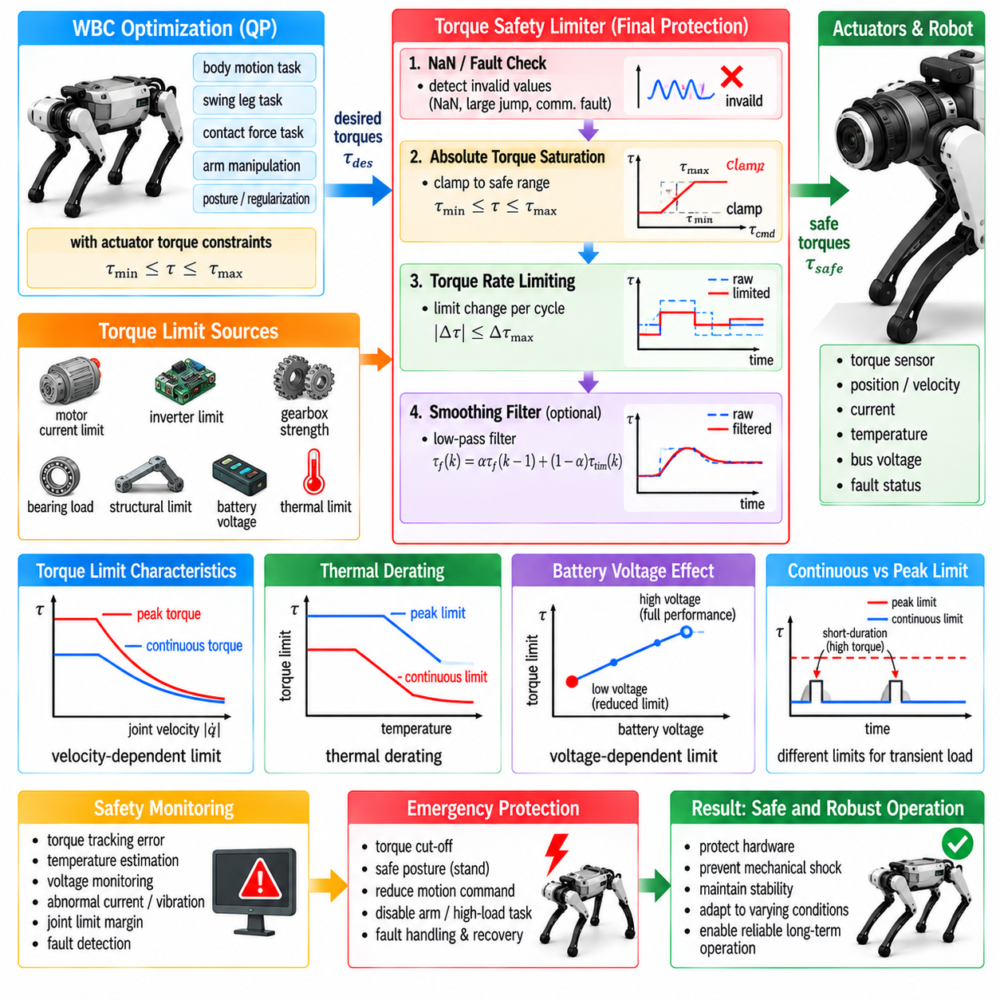{width="7.268055555555556in" height="7.268055555555556in"}

Whole-Body Control (WBC) ultimately produces commands that are transmitted to physical actuators, making torque-command safety limiting the final protective boundary between optimization and hardware. Even when the WBC solution is dynamically consistent, commanded torques can become unsafe because of model errors, unexpected contacts, communication delays, disturbances, payload changes, or numerical transients. Safety supervision must therefore remain active immediately before actuation.

Torque limits originate from several physical constraints rather than from a single motor specification. Motor electromagnetic capability, inverter current limits, gearbox strength, bearing loads, structural limits, battery voltage, thermal state, and manufacturer-defined operating envelopes can all restrict allowable joint torque. A safe controller should represent these limits explicitly and distinguish continuous operating capability from short-duration peak capability.

The most direct protection is absolute torque saturation. For each joint, the commanded torque can be constrained between minimum and maximum allowable values before transmission to the actuator. This prevents software from requesting values beyond established hardware limits. However, simple clipping alone is insufficient because independently saturating joints after optimization can destroy the coordinated force distribution originally computed by WBC.

Whenever possible, actuator torque bounds should therefore be incorporated directly into the WBC optimization. If τmin ≤ τ ≤ τmax is enforced as an inequality constraint, the optimizer searches only among solutions that satisfy the available torque range. Body tracking, contact-force distribution, swing motion, or manipulation objectives can then be adjusted consistently when the requested motion approaches actuator capability.

A second independent saturation layer is still valuable after optimization. This final command limiter protects against implementation errors, corrupted solver outputs, invalid numerical values, communication faults, and unexpected software behavior. The optimization constraint and final safety clamp serve different purposes: the first preserves control feasibility, while the second provides a last deterministic hardware-protection boundary.

Torque-rate limiting is equally important because a command can remain within its absolute magnitude limit while changing too rapidly between control cycles. Large torque steps can generate mechanical shock, excite structural vibration, increase gearbox stress, and produce abrupt contact-force changes. A rate limiter constrains the difference between consecutive commands so that actuator loading evolves within a defined temporal envelope.

The allowable torque rate should reflect actuator dynamics and task requirements. Excessively restrictive rate limits can prevent rapid disturbance rejection or touchdown stabilization, while overly permissive limits provide little protection against command discontinuities. Different joints may require different limits because hip, thigh, knee, and arm actuators can have different motor, transmission, inertia, and structural characteristics.

Filtering can further smooth torque commands, but it introduces phase delay. A low-pass filter suppresses high-frequency command noise and numerical oscillation, yet excessive filtering can reduce responsiveness and destabilize fast feedback loops. Filtering should therefore complement physically meaningful torque and torque-rate constraints rather than compensate for poorly conditioned optimization or unstable controller tuning.

Joint torque capability can vary with joint velocity. Electric actuators generally cannot provide the same torque across the complete speed range because motor voltage, back electromotive force, current limits, and transmission characteristics constrain the torque-speed envelope. A fixed torque bound may therefore overestimate available capability at high speed. Velocity-dependent limits provide a more realistic actuator constraint.

Battery voltage also affects available actuator performance. As battery voltage decreases or experiences transient sag under heavy loading, the motor drive may lose the ability to generate the torque predicted under nominal voltage. A safety-aware WBC can use voltage-dependent actuator limits or a supervisory derating factor so that motion objectives remain compatible with the electrical power actually available.

Thermal protection requires a longer time horizon than instantaneous torque limiting. A motor may safely generate high peak torque for a short interval but overheat if the same load persists. Motor winding temperature, inverter temperature, gearbox temperature, and estimated thermal state can therefore be used to reduce allowable torque progressively. This process is commonly treated as thermal derating rather than abrupt shutdown.

Continuous and peak torque limits should be handled differently. Peak torque can support brief events such as impact recovery, stepping, or disturbance rejection, whereas continuous torque defines sustainable operation. A supervisory layer can monitor how long each actuator remains above its continuous rating and reduce the available peak envelope when thermal or electrical energy budgets are being exhausted.

Mechanical limits may be more restrictive than motor limits in some configurations. Gear teeth, shafts, bearings, link structures, and joint housings experience loads resulting from both actuator torque and external contact forces. Consequently, a command that is electrically feasible may still create excessive structural loading. Conservative joint torque bounds can incorporate transmission and structural safety factors where direct load estimation is unavailable.

Torque safety must also consider joint position. Near a mechanical joint stop, even a moderate torque directed further into the limit can create damaging loads. Position-dependent safety logic can reduce allowable torque as a joint approaches its boundary and prevent commands that drive it deeper into the stop. This protection complements joint-position and velocity constraints inside WBC.

Velocity-dependent directional limiting can provide additional protection near joint boundaries. If a joint is approaching its upper limit rapidly, positive torque may be restricted more strongly than negative torque because negative torque assists recovery. Such asymmetric limits preserve the ability to move away from unsafe regions while suppressing commands that increase risk.

Contact conditions strongly influence safe torque commands. A stance leg transmits joint torque into ground reaction force, while a swing leg primarily accelerates its own links. The same numerical torque can therefore have very different physical consequences depending on contact state. Incorrect contact classification may cause a controller to apply large support torques to a foot that is not actually supporting the robot.

Touchdown is particularly sensitive because the transition from swing motion to force support can generate sharp torque changes. Contact detection, force ramping, impedance behavior, and torque-rate limiting should work together so that the leg does not instantaneously apply full stance effort at impact. Smooth load transfer reduces mechanical shock and improves contact stability.

Foot slip requires another safety response. Continuing to increase tangential contact force after friction capability has been exceeded can worsen slipping and destabilize the robot. WBC should maintain contact forces inside friction constraints, while safety supervision can monitor unexpected foot velocity or contact inconsistency and reduce aggressive torque commands when the assumed stance condition becomes unreliable.

External disturbances can legitimately require torque near the actuator limits. Safety limiting should therefore avoid blindly suppressing every large command. The controller must distinguish a necessary short recovery action from sustained overload or abnormal behavior. Peak-duration monitoring, body-state information, contact confidence, and thermal margin can help determine whether high torque should remain temporarily available.

Payload carrying changes the torque safety margin because additional mass increases gravitational and inertial loading. A robot that has substantial torque reserve when unloaded may operate close to continuous limits while carrying cargo. Payload estimation can therefore be connected to safety supervision so that speed, acceleration, body height, gait, and manipulation force are reduced before actuator saturation becomes persistent.

Manipulation arms create similar coupling. A heavy object held far from the body can generate large moments that must ultimately be balanced by arm joints, trunk dynamics, leg torques, and ground reaction forces. Torque limiting should therefore be applied across the complete quadruped-manipulator system rather than protecting the arm and locomotion subsystems independently.

Power limiting provides another safety layer because simultaneous high torque across many joints can exceed battery or inverter capability even when each actuator individually remains within its limit. Electrical power can be approximated from joint torque, velocity, motor current, and drive efficiency. A supervisory controller can reduce task aggressiveness when predicted or measured total power approaches the system limit.

Regenerative operation also requires consideration. During deceleration or downhill locomotion, actuators can return electrical energy toward the DC bus or battery. If the battery cannot accept sufficient regenerative power, bus voltage can rise. Drive-level protection remains essential, while higher-level control can reduce aggressive regenerative braking or distribute deceleration over time and across joints.

Command validation should reject non-finite or corrupted numerical values before they reach the actuator interface. NaN, infinity, uninitialized memory, invalid timestamps, or implausibly large discontinuities should trigger a deterministic safety response. Numerical validation is computationally inexpensive and should be performed even when the upstream solver is considered reliable.

Communication freshness is another part of torque-command safety. A valid torque computed from an old robot state can become unsafe if transmission is delayed or the control process stalls. Commands should therefore carry timing information, and actuator or supervisory watchdogs should detect stale updates. Loss of fresh commands should transition the system toward a predefined safe behavior rather than indefinitely holding arbitrary torque.

Watchdog behavior must be designed according to the robot's physical state. Instantly setting every torque to zero may be inappropriate for a standing quadruped because the body can collapse. Depending on the actuator architecture, a safer response may involve controlled torque reduction, transition to local impedance control, body lowering, or another validated fallback mode before disabling actuation.

Independent safety supervision is valuable because failures can occur inside the primary WBC itself. A separate monitor can check body orientation, joint position and velocity, torque magnitude, torque rate, actuator temperature, battery condition, contact consistency, communication health, and collision indicators. Related quadruped control architectures similarly place joint/torque limits, thermal and electrical protection, fault detection, and emergency-stop supervision around WBC and low-level joint control. Quadruped Stair-Climbing Contro... Quadruped Stair-Climbing Contro...

Safety intervention should be graded rather than purely binary. Small violations may require command clipping or task scaling, shrinking margins may trigger gait reduction or acceleration limits, persistent overload may require body lowering or controlled stopping, and severe faults may require emergency shutdown. A staged response preserves useful robot capability while escalating protection according to actual risk.

The safety layer should communicate limiting information back to WBC and higher-level planners. If a joint is repeatedly torque-limited, the optimizer should not continue requesting the same infeasible motion indefinitely. Saturation flags, thermal derating factors, available torque envelopes, and power margins can be fed back so that gait, foothold, body trajectory, or manipulation objectives are adapted.

Logging is essential for validating torque-command safety. Requested torque, optimized torque, final limited torque, rate-limit activation, actuator temperature, current, voltage, contact state, joint velocity, and safety events should be recorded with synchronized timestamps. Comparing these signals reveals whether limiting occurs only during exceptional events or is continuously compensating for an unsuitable controller or mechanical design.

Simulation and hardware-in-the-loop testing can exercise extreme torque conditions without immediately exposing the robot to damage. Tests should include abrupt disturbances, contact errors, payload changes, joint-limit approaches, communication delays, solver failures, high-speed motion, low battery voltage, and thermal derating. Safety monitoring and staged validation are consistent with the broader simulation-to-HIL-to-real-robot deployment structure used in the supporting quadruped control architecture. Quadruped Stair-Climbing Contro...

Real-robot validation should gradually approach torque and power boundaries while monitoring structural loads, temperature, tracking performance, and stability. Tests should verify not only that commands remain numerically within limits, but also that saturation does not create unexpected balance loss, contact slip, oscillation, or discontinuous behavior. Worst-case transitions are more informative than steady-state operation alone.

Torque-command safety limiting should ultimately be treated as a layered architecture rather than a single clipping function. WBC constraints maintain dynamically consistent commands, rate and magnitude limits suppress dangerous transients, thermal and electrical derating reflect changing hardware capability, watchdogs protect against communication and software faults, and independent supervision provides final system-level protection.

A well-designed torque safety architecture allows a quadruped to use its actuator capability aggressively when necessary without treating maximum performance as permanently available. The controller continuously respects instantaneous torque, rate, thermal, electrical, mechanical, contact, and timing limits while adapting higher-level objectives when margins shrink. Safe torque control therefore becomes an active part of whole-body behavior rather than merely a final saturation operation.

전신 제어(Whole-Body Control, WBC)는 궁극적으로 물리적 구동기(Physical Actuator)로 전달되는 명령을 생성하므로, 토크 명령 안전 제한(Torque-Command Safety Limiting)은 최적화와 하드웨어 사이의 최종 보호 경계가 된다. WBC 해가 동역학적으로 일관되더라도 모델 오차, 예상하지 못한 접촉, 통신 지연, 외란, 페이로드 변화, 수치적 과도현상으로 인해 명령 토크가 위험해질 수 있다. 따라서 실제 구동 직전까지 안전 감독(Safety Supervision)이 활성화되어야 한다.

토크 한계(Torque Limit)는 단일 모터 사양이 아니라 여러 물리적 제약조건에서 결정된다. 모터의 전자기적 성능, 인버터 전류 한계, 기어박스 강도, 베어링 하중, 구조적 한계, 배터리 전압, 열 상태(Thermal State), 제조사가 정의한 운용 영역이 모두 허용 가능한 관절 토크를 제한할 수 있다. 안전한 제어기는 이러한 한계를 명시적으로 표현하고 연속 운전 능력과 단시간 최대 능력을 구분해야 한다.

가장 직접적인 보호 방법은 절대 토크 포화(Absolute Torque Saturation)이다. 각 관절에 대해 명령 토크를 최소 및 최대 허용값 사이로 제한한 후 구동기로 전달할 수 있다. 이를 통해 소프트웨어가 설정된 하드웨어 한계를 초과하는 값을 요구하는 것을 방지할 수 있다. 그러나 최적화 이후 각각의 관절을 독립적으로 단순 클리핑(Clipping)하면 WBC가 계산한 협조된 힘 분배가 무너질 수 있으므로 단순한 클리핑만으로는 충분하지 않다.

따라서 가능하면 구동기 토크 경계(Actuator Torque Bound)를 WBC 최적화 문제에 직접 포함해야 한다. τmin ≤ τ ≤ τmax를 부등식 제약조건(Inequality Constraint)으로 적용하면 최적화기는 사용 가능한 토크 범위를 만족하는 해만 탐색한다. 요구된 운동이 구동기 성능에 접근하면 몸체 추종, 접촉력 분배, 유각 운동(Swing Motion), 조작 목표 등을 동역학적으로 일관된 방식으로 조정할 수 있다.

최적화 이후에도 두 번째 독립적인 포화 계층(Saturation Layer)을 두는 것이 유용하다. 이 최종 명령 제한기(Command Limiter)는 구현 오류, 손상된 솔버 출력, 잘못된 수치값, 통신 고장, 예상하지 못한 소프트웨어 동작으로부터 시스템을 보호한다. 최적화 제약조건과 최종 안전 클램프(Safety Clamp)는 서로 다른 역할을 가지며, 전자는 제어 실행 가능성을 유지하고 후자는 최종적인 결정론적 하드웨어 보호 경계를 제공한다.

토크 변화율 제한(Torque-Rate Limiting) 역시 중요하다. 명령 토크가 절대 크기 한계 내에 있더라도 제어 주기 사이에서 지나치게 빠르게 변화할 수 있기 때문이다. 큰 토크 스텝(Torque Step)은 기계적 충격을 발생시키고 구조 진동을 가진하며 기어박스 응력을 증가시키고 접촉력의 급격한 변화를 유발할 수 있다. 변화율 제한기는 연속된 명령 사이의 차이를 제한하여 구동기 하중이 정의된 시간적 범위 내에서 변화하도록 한다.

허용 가능한 토크 변화율은 구동기 동역학(Actuator Dynamics)과 작업 요구조건을 반영해야 한다. 지나치게 엄격한 변화율 제한은 빠른 외란 억제나 착지 안정화를 방해할 수 있으며, 지나치게 완화된 제한은 명령 불연속에 대한 보호 효과가 거의 없다. 고관절, 대퇴 관절, 무릎 관절, 로봇 팔 관절은 서로 다른 모터, 변속기, 관성, 구조적 특성을 가질 수 있으므로 각각 다른 제한값이 필요할 수 있다.

필터링(Filtering)은 토크 명령을 더욱 부드럽게 만들 수 있지만 위상 지연(Phase Delay)을 발생시킨다. 저역통과 필터(Low-Pass Filter)는 고주파 명령 잡음과 수치적 진동을 억제하지만 지나친 필터링은 응답성을 감소시키고 빠른 피드백 루프를 불안정하게 만들 수 있다. 따라서 필터링은 잘못된 조건의 최적화나 불안정한 제어기 튜닝을 보상하는 수단이 아니라 물리적으로 의미 있는 토크 및 토크 변화율 제약조건을 보완하는 방식으로 사용해야 한다.

관절 토크 성능은 관절 속도에 따라 달라질 수 있다. 전기 구동기(Electric Actuator)는 모터 전압, 역기전력(Back Electromotive Force), 전류 한계, 변속기 특성으로 인해 전체 속도 범위에서 동일한 토크를 생성할 수 없는 경우가 일반적이다. 따라서 고정된 토크 경계는 고속 영역에서 실제 사용 가능한 성능을 과대평가할 수 있다. 속도 의존적 토크 한계(Velocity-Dependent Torque Limit)를 사용하면 보다 현실적인 구동기 제약조건을 표현할 수 있다.

배터리 전압(Battery Voltage) 역시 사용 가능한 구동기 성능에 영향을 준다. 배터리 전압이 감소하거나 높은 부하에서 순간적인 전압 강하가 발생하면 모터 드라이브는 정상 전압 조건에서 예상한 토크를 생성하지 못할 수 있다. 안전성을 고려한 WBC는 전압 의존적 구동기 한계 또는 감독 계층의 디레이팅 계수(Derating Factor)를 사용하여 실제 사용 가능한 전력과 운동 목표를 일치시킬 수 있다.

열 보호(Thermal Protection)는 순간적인 토크 제한보다 더 긴 시간 범위를 고려해야 한다. 모터는 짧은 시간 동안 높은 피크 토크(Peak Torque)를 안전하게 생성할 수 있지만 동일한 부하가 지속되면 과열될 수 있다. 따라서 모터 권선 온도, 인버터 온도, 기어박스 온도, 추정된 열 상태를 이용하여 허용 가능한 토크를 점진적으로 감소시킬 수 있다. 이러한 과정은 일반적으로 갑작스러운 정지보다 열 디레이팅(Thermal Derating) 방식으로 처리된다.

연속 토크 한계(Continuous Torque Limit)와 피크 토크 한계(Peak Torque Limit)는 서로 다르게 처리해야 한다. 피크 토크는 충격 복구, 스테핑, 외란 억제와 같은 짧은 사건을 지원할 수 있지만 연속 토크는 지속 가능한 운전을 정의한다. 감독 계층(Supervisory Layer)은 각 구동기가 연속 정격을 초과하여 동작하는 시간을 감시하고 열적 또는 전기적 에너지 예산이 소진되는 경우 사용 가능한 피크 영역을 감소시킬 수 있다.

일부 구성에서는 기계적 한계(Mechanical Limit)가 모터 한계보다 더 엄격할 수 있다. 기어 치형, 샤프트, 베어링, 링크 구조, 관절 하우징은 구동기 토크와 외부 접촉력에 의해 발생하는 하중을 모두 받는다. 따라서 전기적으로 실행 가능한 명령이라도 과도한 구조 하중을 발생시킬 수 있다. 직접적인 하중 추정이 불가능한 경우 보수적인 관절 토크 경계에 변속기 및 구조 안전계수(Structural Safety Factor)를 포함할 수 있다.

토크 안전성은 관절 위치(Joint Position)도 고려해야 한다. 기계적 관절 정지점(Mechanical Joint Stop) 근처에서는 한계 방향으로 더 밀어 넣는 중간 크기의 토크조차 손상을 유발할 수 있다. 위치 의존적 안전 로직(Position-Dependent Safety Logic)은 관절이 경계에 접근할수록 허용 토크를 감소시키고 관절을 정지점 안쪽으로 더 밀어 넣는 명령을 방지할 수 있다. 이러한 보호는 WBC 내부의 관절 위치 및 속도 제약조건을 보완한다.

관절 경계 근처에서는 속도 의존적 방향 제한(Velocity-Dependent Directional Limiting)을 적용하여 추가적인 보호를 제공할 수 있다. 관절이 상한에 빠르게 접근하고 있다면 양의 토크를 음의 토크보다 더 강하게 제한할 수 있다. 음의 토크는 관절을 안전 영역으로 복귀시키는 데 도움이 되기 때문이다. 이러한 비대칭 한계(Asymmetric Limit)는 위험을 증가시키는 명령을 억제하면서 안전 영역으로 이동할 수 있는 능력을 유지한다.

접촉 조건(Contact Condition)은 안전한 토크 명령에 큰 영향을 준다. 지지 다리(Stance Leg)는 관절 토크를 지면 반력(Ground Reaction Force)으로 전달하지만 유각 다리(Swing Leg)는 주로 자체 링크를 가속한다. 따라서 동일한 수치의 토크라도 접촉 상태에 따라 물리적 결과가 크게 달라질 수 있다. 잘못된 접촉 상태 분류는 실제로 지지하지 않는 발에 제어기가 큰 지지 토크를 적용하도록 만들 수 있다.

착지(Touchdown)는 유각 운동에서 힘 지지 상태로 전환하면서 급격한 토크 변화를 발생시킬 수 있기 때문에 특히 민감하다. 접촉 감지(Contact Detection), 힘 램핑(Force Ramping), 임피던스 동작(Impedance Behavior), 토크 변화율 제한이 함께 작동하여 충격 순간에 다리가 즉시 최대 지지력을 적용하지 않도록 해야 한다. 부드러운 하중 전달은 기계적 충격을 감소시키고 접촉 안정성을 향상시킨다.

발 미끄러짐(Foot Slip)에는 별도의 안전 대응이 필요하다. 마찰 능력을 이미 초과한 이후에도 접선 방향 접촉력을 계속 증가시키면 미끄러짐이 악화되고 로봇이 불안정해질 수 있다. WBC는 접촉력을 마찰 제약조건 내부에 유지해야 하며, 안전 감독 계층은 예상하지 못한 발 속도 또는 접촉 불일치를 감시하고 가정된 지지 조건의 신뢰성이 낮아질 경우 공격적인 토크 명령을 감소시킬 수 있다.

외부 외란(External Disturbance)은 구동기 한계에 가까운 토크를 정당하게 요구할 수 있다. 따라서 안전 제한기가 모든 큰 명령을 무조건 억제해서는 안 된다. 제어기는 필요한 단시간 복구 동작과 지속적인 과부하 또는 비정상 동작을 구분해야 한다. 피크 지속 시간 감시(Peak-Duration Monitoring), 몸체 상태 정보, 접촉 신뢰도, 열 여유를 이용하면 높은 토크를 일시적으로 유지할 수 있는지를 판단할 수 있다.

페이로드 운반(Payload Carrying)은 추가 질량으로 인해 중력 및 관성 하중이 증가하므로 토크 안전 여유(Torque Safety Margin)를 변화시킨다. 무부하 상태에서는 충분한 토크 여유를 가지는 로봇도 화물을 운반할 때는 연속 토크 한계에 가까워질 수 있다. 따라서 페이로드 추정(Payload Estimation)을 안전 감독과 연결하여 구동기 포화가 지속되기 전에 속도, 가속도, 몸체 높이, 보행 형태, 조작력을 감소시킬 수 있다.

조작 로봇 팔(Manipulation Arm)도 유사한 결합 효과를 발생시킨다. 몸체에서 멀리 떨어진 위치에 무거운 물체를 들고 있으면 큰 모멘트가 발생하며, 이는 결국 로봇 팔 관절, 몸통 동역학, 다리 토크, 지면 반력에 의해 균형을 이루어야 한다. 따라서 토크 제한은 로봇 팔과 이동 하위 시스템을 독립적으로 보호하는 것이 아니라 전체 사족보행 로봇-매니퓰레이터 시스템(Quadruped-Manipulator System)에 걸쳐 적용해야 한다.

전력 제한(Power Limiting)은 또 다른 안전 계층을 제공한다. 여러 관절에서 동시에 높은 토크가 발생하면 각각의 구동기가 개별 한계 이내에 있더라도 배터리 또는 인버터의 전체 성능을 초과할 수 있다. 전기적 전력은 관절 토크, 속도, 모터 전류, 드라이브 효율을 이용하여 근사할 수 있다. 감독 제어기(Supervisory Controller)는 예측 또는 측정된 전체 전력이 시스템 한계에 접근하면 작업의 공격성을 감소시킬 수 있다.

회생 동작(Regenerative Operation)도 고려해야 한다. 감속이나 내리막 보행 중에는 구동기가 전기 에너지를 직류 버스(DC Bus) 또는 배터리로 반환할 수 있다. 배터리가 충분한 회생 전력을 받아들일 수 없으면 버스 전압이 상승할 수 있다. 드라이브 수준의 보호가 필수적이며, 상위 수준 제어기는 공격적인 회생 제동(Regenerative Braking)을 줄이거나 감속을 시간 및 여러 관절에 분산시킬 수 있다.

명령 검증(Command Validation)은 유한하지 않거나 손상된 수치값이 구동기 인터페이스에 도달하기 전에 이를 거부해야 한다. 비수치값(Not a Number, NaN), 무한대(Infinity), 초기화되지 않은 메모리, 잘못된 타임스탬프, 비현실적으로 큰 불연속 변화는 결정론적인 안전 대응을 발생시켜야 한다. 수치 검증은 계산 비용이 매우 낮으므로 상위 솔버가 신뢰할 수 있다고 판단되는 경우에도 수행해야 한다.

통신 최신성(Communication Freshness) 역시 토크 명령 안전성의 일부이다. 오래된 로봇 상태를 기반으로 계산된 유효한 토크라도 전송이 지연되거나 제어 프로세스가 정지하면 위험해질 수 있다. 따라서 명령에는 시간 정보가 포함되어야 하며 구동기 또는 감독 워치독(Watchdog)은 오래된 갱신을 감지해야 한다. 새로운 명령이 전달되지 않을 경우 임의의 토크를 무기한 유지하는 대신 사전에 정의된 안전 동작으로 전환해야 한다.

워치독 동작(Watchdog Behavior)은 로봇의 물리적 상태에 따라 설계해야 한다. 서 있는 사족보행 로봇에서 모든 토크를 즉시 0으로 만드는 것은 몸체가 붕괴할 수 있으므로 적절하지 않을 수 있다. 구동기 아키텍처에 따라 더 안전한 대응은 토크를 제어된 방식으로 감소시키거나, 로컬 임피던스 제어(Local Impedance Control)로 전환하거나, 몸체를 낮추거나, 구동을 비활성화하기 전에 검증된 다른 폴백 모드(Fallback Mode)로 전환하는 것일 수 있다.

주요 WBC 자체에서도 고장이 발생할 수 있으므로 독립적인 안전 감독(Independent Safety Supervision)이 중요하다. 별도의 감시기는 몸체 방향, 관절 위치 및 속도, 토크 크기, 토크 변화율, 구동기 온도, 배터리 상태, 접촉 일관성, 통신 상태, 충돌 지표를 확인할 수 있다. 관련 사족보행 제어 아키텍처에서도 관절 및 토크 한계, 열 및 전기 보호, 고장 감지(Fault Detection), 비상 정지(Emergency Stop)를 WBC와 저수준 관절 제어 주변의 독립적인 안전 기능으로 구성한다.

안전 개입(Safety Intervention)은 단순한 이진 방식이 아니라 단계적으로 수행하는 것이 바람직하다. 작은 위반에는 명령 클리핑 또는 작업 스케일링(Task Scaling)을 적용하고, 안전 여유가 감소하면 보행 성능이나 가속도를 제한하며, 지속적인 과부하에서는 몸체를 낮추거나 제어된 정지(Controlled Stop)를 수행할 수 있다. 심각한 고장에서는 비상 정지가 필요할 수 있다. 이러한 단계적 대응은 실제 위험 수준에 따라 보호 수준을 높이면서 가능한 범위에서 로봇의 유용한 기능을 유지한다.

안전 계층은 제한 정보를 WBC와 상위 수준 계획기(Higher-Level Planner)에 다시 전달해야 한다. 특정 관절에서 토크 제한이 반복적으로 발생한다면 최적화기가 동일한 실행 불가능 운동을 계속 요구해서는 안 된다. 포화 상태 플래그(Saturation Flag), 열 디레이팅 계수, 사용 가능한 토크 영역, 전력 여유를 피드백하여 보행, 발 디딤 위치, 몸체 궤적, 조작 목표를 적응시킬 수 있다.

로깅(Logging)은 토크 명령 안전성을 검증하는 데 필수적이다. 요구 토크, 최적화된 토크, 최종 제한 토크, 변화율 제한 활성화 상태, 구동기 온도, 전류, 전압, 접촉 상태, 관절 속도, 안전 이벤트를 동기화된 타임스탬프와 함께 기록해야 한다. 이러한 신호를 비교하면 제한 기능이 예외적인 사건에서만 작동하는지 또는 부적절한 제어기나 기계 설계를 지속적으로 보상하고 있는지를 확인할 수 있다.

시뮬레이션(Simulation)과 하드웨어 인 더 루프 시험(Hardware-in-the-Loop Testing, HIL)을 이용하면 로봇을 즉시 손상 위험에 노출시키지 않고 극단적인 토크 조건을 시험할 수 있다. 시험에는 급격한 외란, 접촉 오류, 페이로드 변화, 관절 한계 접근, 통신 지연, 솔버 실패, 고속 운동, 낮은 배터리 전압, 열 디레이팅을 포함해야 한다. 이러한 단계적 검증을 통해 실제 로봇에 적용하기 전에 안전 감독과 보호 동작을 체계적으로 확인할 수 있다.

실제 로봇 검증(Real-Robot Validation)은 구조 하중, 온도, 추종 성능, 안정성을 감시하면서 토크 및 전력 경계에 점진적으로 접근해야 한다. 시험에서는 명령이 단순히 수치적 한계 내부에 있는지만 확인해서는 안 된다. 토크 포화가 예상하지 못한 균형 상실, 접촉 미끄러짐, 진동, 불연속적인 동작을 발생시키지 않는지도 검증해야 한다. 정상 상태의 운용만 평가하는 것보다 최악 조건의 전환 상황을 시험하는 것이 더 중요한 정보를 제공한다.

토크 명령 안전 제한은 궁극적으로 하나의 단순한 클리핑 함수가 아니라 계층화된 아키텍처(Layered Architecture)로 취급해야 한다. WBC 제약조건은 동역학적으로 일관된 명령을 유지하고, 토크 크기 및 변화율 제한은 위험한 과도현상을 억제하며, 열 및 전기적 디레이팅은 변화하는 하드웨어 성능을 반영한다. 또한 워치독은 통신 및 소프트웨어 고장을 보호하고 독립적인 안전 감독은 최종적인 시스템 수준 보호 기능을 제공한다.

잘 설계된 토크 안전 아키텍처(Torque Safety Architecture)는 최대 성능을 항상 사용할 수 있다고 가정하지 않으면서도 필요한 순간에는 사족보행 로봇이 구동기 성능을 적극적으로 활용할 수 있게 한다. 제어기는 순간 토크, 변화율, 열적·전기적·기계적 한계, 접촉 조건, 시간적 한계를 지속적으로 준수하면서 안전 여유가 감소할 경우 상위 수준 목표를 적응시킨다. 따라서 안전한 토크 제어(Safe Torque Control)는 단순한 최종 포화 연산이 아니라 전신 동작(Whole-Body Behavior)을 구성하는 능동적인 요소가 된다.

##  

## 06.10. WBC Validation Simulation and Field Test

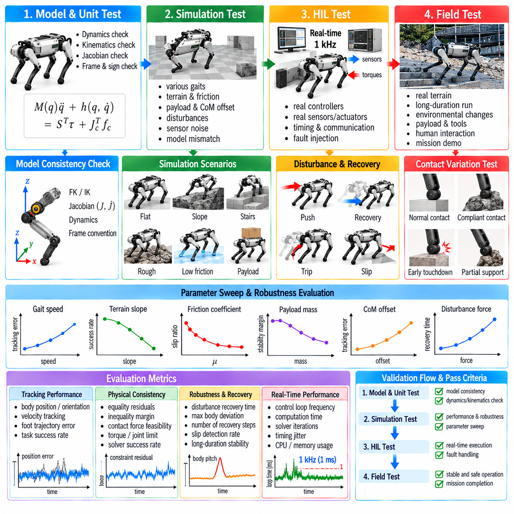{width="7.268055555555556in" height="7.268055555555556in"}

Whole-Body Control (WBC) validation determines whether a quadruped controller remains dynamically consistent, stable, safe, and computationally reliable beyond ideal nominal conditions. Validation must examine not only trajectory tracking but also contact-force feasibility, torque limits, timing behavior, disturbance recovery, constraint handling, and transitions between locomotion states. A controller that performs well in one simulated gait is not yet ready for field deployment.

Validation should progress through increasingly realistic environments rather than beginning directly on the physical robot. Mathematical checks and unit tests establish basic correctness, simulation exposes the controller to controlled dynamic conditions, hardware-in-the-loop testing evaluates real interfaces and timing, and physical experiments confirm behavior under actual contact uncertainty. Each stage should define measurable criteria for advancement to the next stage.

The first validation layer concerns the internal consistency of the WBC formulation. Dimensions, coordinate conventions, reference frames, Jacobians, dynamics terms, inequality directions, and contact definitions should be verified independently. Small sign or frame errors can remain hidden during simple standing tests yet become severe during dynamic locomotion. Automated tests should therefore evaluate model quantities over many randomly generated robot configurations.

Rigid-body dynamics can be checked through consistency relationships between forward dynamics, inverse dynamics, and numerical integration. Given identical states and forces, independent computational paths should produce compatible accelerations or torques within defined tolerances. Energy and momentum behavior can provide additional diagnostic information, especially when investigating unexpected motion that appears before optimization or feedback control is introduced.

Kinematic validation should examine forward kinematics, foot positions, body transforms, task Jacobians, and Jacobian derivatives. Numerical differentiation can be compared with analytical Jacobians over randomly sampled configurations. Because WBC converts desired Cartesian behavior into generalized motion through these quantities, even a small kinematic error can appear later as inaccurate foot tracking, incorrect body stabilization, or unexpected contact forces.

Optimization validation should initially use deterministic test cases whose expected behavior is known. Standing on level terrain, symmetric four-foot support, zero desired acceleration, and simple body translations provide useful baselines. The resulting contact forces, generalized accelerations, and torques should satisfy equations of motion, friction constraints, actuator limits, and task requirements before more complex locomotion scenarios are introduced.

Constraint residuals should be measured directly rather than inferred from visible robot behavior. Equality residuals quantify dynamic and contact consistency, while inequality margins reveal proximity to friction, torque, force, and joint limits. Solver success alone does not prove that a solution is physically useful. Validation should therefore record primal residuals, constraint violations, slack variables, and available safety margins for every control cycle.

Simulation provides a controlled environment for testing combinations that would be expensive or dangerous on hardware. Gait speed, terrain slope, friction coefficient, payload mass, center-of-mass offset, external disturbances, sensor noise, and actuator limits can be varied systematically. Parameter sweeps reveal boundaries of the feasible operating region and identify conditions where tracking quality, stability, or optimization reliability begins to degrade.

The simulation model should not be identical to the controller model in every detail. If WBC and simulation share exactly the same masses, inertias, friction assumptions, actuator response, and contact model, validation can become unrealistically favorable. Introducing model mismatch is essential because the physical robot will never match its mathematical representation perfectly. Robustness should be evaluated against plausible uncertainty rather than ideal model agreement.

Contact modeling deserves particular attention because quadruped performance depends strongly on foot-ground interaction. Simulation should include variations in friction, compliance, restitution, surface inclination, and contact timing. Tests should intentionally create early touchdown, delayed touchdown, partial support, and slipping. The objective is to determine whether contact estimation and WBC constraints remain stable when actual contact differs from the planned contact schedule.

Disturbance testing evaluates recovery capability. External forces or impulses can be applied to the trunk from different directions and at different phases of the gait. The magnitude should increase gradually until recovery boundaries are identified. Useful measurements include body displacement, orientation error, recovery time, peak joint torque, contact-force margin, number of recovery steps, and whether the controller changes gait or activates fallback behavior.

Payload validation should vary both mass and load location. A centered payload primarily changes total weight and inertia, while an offset payload creates asymmetric contact requirements and gravitational moments. Tests should evaluate whether load estimation, force redistribution, torque limiting, and motion scaling respond correctly. Sudden pickup or release events are especially useful for examining transient adaptation of the WBC model.

Manipulation-capable quadrupeds require combined locomotion and arm validation. Arm extension, object lifting, pushing, pulling, and end-effector tracking can shift the center of mass and generate external reaction forces. Simulation should evaluate whether leg forces and body posture compensate appropriately. Tasks that are feasible for the arm alone may become infeasible when whole-body contact and friction constraints are considered.

Monte Carlo testing can expose combinations of uncertainty that individual parameter sweeps may miss. Robot mass, inertia, friction, sensor bias, terrain geometry, communication delay, and external disturbances can be randomized across repeated trials. Statistical distributions of tracking error, solver failure, slip occurrence, torque saturation, and recovery success provide a broader measure of robustness than a small number of hand-selected demonstrations.

Real-time computational validation must occur alongside dynamic validation. A WBC designed for 1 kHz operation should be tested under worst-case computational conditions rather than only nominal standing. Contact transitions, active torque constraints, manipulation tasks, near-singular configurations, payload adaptation, and recovery behavior can increase computation. Mean execution time alone is insufficient; maximum and high-percentile latency must also remain within the control budget.

Software stress testing should introduce delayed sensor packets, missing messages, stale timestamps, invalid numerical values, solver non-convergence, and temporary communication interruptions. These failures may not appear in ordinary simulation but are realistic in deployed systems. The controller should respond deterministically by rejecting corrupted data, preserving bounded commands, activating fallback logic, or entering a controlled safe state.

Hardware-in-the-loop (HIL) testing provides an intermediate stage between software simulation and unrestricted robot experiments. The WBC software can execute on the intended onboard computer while communicating through real interfaces and timing paths, with simulated robot dynamics or selected hardware components replacing the full machine. This exposes communication latency, scheduling jitter, driver behavior, synchronization errors, and computational bottlenecks before dynamic hardware risk is introduced.

Actuator-level validation should precede full-body dynamic testing. Individual joints or limbs can be tested for torque tracking, position sensing, velocity estimation, communication timing, saturation behavior, thermal response, and emergency shutdown. Commanded and measured torque should be compared across representative operating ranges. Unexpected actuator behavior should be resolved before relying on WBC to coordinate the complete robot.

Initial whole-robot hardware tests should begin with constrained and low-energy conditions. Supported standing, reduced torque limits, low body height, slow posture changes, and conservative contact-force targets reduce risk while validating sign conventions and force distribution. Mechanical support systems or safety tethers may be appropriate during early tests, provided they do not introduce unmodeled forces that invalidate the measurements.

Static standing is a useful first WBC hardware benchmark because expected force distribution can be estimated directly. On level ground with a centered center of mass, vertical forces should exhibit physically reasonable sharing among the feet. Controlled body translations and orientation changes can then verify whether force distribution moves predictably while torque, friction, and joint limits remain satisfied.

Dynamic testing should progress gradually from slow stepping to walking, trotting, turning, slopes, irregular terrain, and disturbance recovery. Only one major source of difficulty should be increased at a time when practical. This progression helps isolate failures. Jumping immediately from static standing to aggressive dynamic locomotion can make it difficult to determine whether a failure originates from estimation, dynamics, contact handling, optimization, or hardware.

Terrain validation should include surfaces with different friction, stiffness, geometry, and inclination. Flat laboratory floors are insufficient for field-oriented quadrupeds. Ramps, small obstacles, uneven ground, compliant surfaces, and controlled low-friction regions expose weaknesses in contact assumptions. Terrain difficulty should increase only after baseline locomotion demonstrates repeatable stability and adequate safety margins.

Field testing introduces uncertainty that is difficult to reproduce completely in simulation. Terrain geometry may be poorly observed, friction can vary between individual footholds, environmental disturbances can occur unexpectedly, and sensing quality can change with vibration, lighting, temperature, dust, or moisture. Field validation therefore examines whether the complete perception, estimation, planning, WBC, and actuator chain operates reliably as an integrated system.

Field experiments should be organized around explicit operating envelopes rather than informal demonstrations. Speed, payload, slope, terrain roughness, manipulation force, temperature, battery condition, and disturbance level should have defined ranges. Successful operation inside these ranges establishes a validated envelope, while failures near its boundaries provide information for improving controller limits and supervisory safety policies.

Repeatability is essential. A robot completing a difficult maneuver once does not establish reliable performance. The same scenario should be repeated sufficiently to characterize variation in tracking error, contact behavior, solver timing, and recovery success. Repeated trials are particularly important for contact-rich locomotion because small differences in foothold location or surface condition can produce substantially different dynamic responses.

Validation metrics should connect directly to WBC objectives and constraints. Useful quantities include body position and orientation error, swing-foot tracking error, ground reaction force error, friction margin, joint torque margin, joint-limit margin, solver residuals, computation time, energy consumption, slip distance, recovery time, and constraint-relaxation magnitude. No single metric is sufficient to characterize whole-body performance.

Safety metrics should be evaluated separately from nominal performance. The controller should record torque saturation, thermal derating, watchdog activation, communication faults, infeasible optimization events, fallback transitions, excessive body attitude, unexpected contact, and emergency stops. A system that achieves excellent trajectory tracking but repeatedly approaches unsafe limits should not be considered successfully validated.

Failure cases should be preserved as regression tests. Once a specific combination of terrain, contact timing, payload, or disturbance produces a failure, the scenario should be reproduced in simulation whenever possible and added to the automated validation suite. After controller modifications, previously solved failures should be retested to ensure that improvements in one area have not introduced regressions elsewhere.

Simulation-to-reality discrepancies should be treated as engineering information rather than merely as imperfections. Differences in actuator bandwidth, structural compliance, backlash, friction, sensor delay, contact deformation, and state estimation can explain why physical behavior differs from simulation. Recorded field data can be replayed or used to refine simulation parameters, creating an iterative loop between modeling, control development, and experimental validation.

Acceptance criteria should be defined before final field qualification. Required tracking accuracy, maximum allowable torque usage, minimum friction margin, solver success rate, deadline compliance, recovery success, payload capability, and fault-response behavior should be specified quantitatively wherever possible. This prevents subjective judgments based only on visually impressive demonstrations and creates a repeatable engineering basis for release decisions.

WBC validation is therefore not a final test performed after controller development but a continuous process spanning mathematical verification, simulation, software stress testing, HIL evaluation, controlled hardware experiments, and field trials. Each stage exposes different classes of failure and feeds evidence back into controller design. The result is a progressively validated operating envelope rather than an assumption that successful simulation automatically implies reliable physical performance.

A mature validation process ultimately demonstrates that the quadruped can maintain dynamically consistent behavior when reality differs from the nominal plan. Contact uncertainty, model mismatch, payload variation, actuator limitations, computational jitter, disturbances, and environmental complexity must all be represented in testing. Reliable WBC emerges when performance, feasibility, timing, and safety are validated together across simulation and real-world operation.

전신 제어(Whole-Body Control, WBC) 검증은 이상적인 정상 조건을 벗어난 상황에서도 사족보행 로봇 제어기가 동역학적 일관성, 안정성, 안전성, 계산 신뢰성을 유지하는지를 판단하는 과정이다. 검증에서는 단순한 궤적 추종뿐 아니라 접촉력 실행 가능성(Contact-Force Feasibility), 토크 한계, 시간 동작, 외란 복구, 제약조건 처리, 이동 상태 사이의 전환을 함께 평가해야 한다. 하나의 시뮬레이션 보행에서 우수한 성능을 보였다고 해서 현장 배포 준비가 완료된 것은 아니다.

검증은 실제 로봇에서 바로 시작하는 것이 아니라 점진적으로 현실성이 증가하는 환경을 거쳐 진행해야 한다. 수학적 검사와 단위 시험(Unit Test)은 기본적인 정확성을 검증하고, 시뮬레이션은 제어기를 통제된 동적 조건에 노출시키며, 하드웨어 인 더 루프 시험(Hardware-in-the-Loop Testing, HIL)은 실제 인터페이스와 시간 특성을 평가한다. 이후 실제 물리 실험을 통해 현실적인 접촉 불확실성에서의 동작을 확인한다. 각 단계에는 다음 단계로 진행하기 위한 측정 가능한 기준이 정의되어야 한다.

첫 번째 검증 계층은 WBC 구성 자체의 내부 일관성(Internal Consistency)을 확인하는 것이다. 차원, 좌표 규약, 기준 좌표계(Reference Frame), 자코비안(Jacobian), 동역학 항, 부등식 방향, 접촉 정의를 독립적으로 검증해야 한다. 작은 부호 오류나 좌표계 오류는 단순한 기립 시험에서는 드러나지 않다가 동적 보행에서 심각한 문제로 나타날 수 있다. 따라서 자동화된 시험을 통해 무작위로 생성된 다양한 로봇 구성에서 모델 물리량을 평가해야 한다.

강체 동역학(Rigid-Body Dynamics)은 순동역학(Forward Dynamics), 역동역학(Inverse Dynamics), 수치 적분(Numerical Integration) 사이의 일관성 관계를 이용하여 검증할 수 있다. 동일한 상태와 힘이 주어졌을 때 독립적인 계산 경로에서 정의된 허용오차 범위 내의 일관된 가속도 또는 토크가 생성되어야 한다. 에너지와 운동량 동작 역시 추가적인 진단 정보를 제공할 수 있으며, 특히 최적화나 피드백 제어를 적용하기 전부터 예상하지 못한 운동이 발생하는 문제를 조사할 때 유용하다.

운동학 검증(Kinematic Validation)은 순기구학(Forward Kinematics), 발 위치, 몸체 변환, 작업 자코비안(Task Jacobian), 자코비안 미분을 평가해야 한다. 무작위로 샘플링된 구성에서 수치 미분(Numerical Differentiation) 결과와 해석적 자코비안(Analytical Jacobian)을 비교할 수 있다. WBC는 이러한 물리량을 통해 원하는 데카르트 동작을 일반화 운동(Generalized Motion)으로 변환하므로 작은 운동학 오류도 이후 부정확한 발 추종, 잘못된 몸체 안정화, 예상하지 못한 접촉력으로 나타날 수 있다.

최적화 검증(Optimization Validation)은 먼저 예상되는 동작을 알고 있는 결정론적 시험 사례(Deterministic Test Case)를 사용해야 한다. 평탄한 지면에서의 기립, 대칭적인 네 발 지지, 0의 목표 가속도, 단순한 몸체 병진 운동은 유용한 기준 시험이 된다. 더 복잡한 이동 시나리오를 도입하기 전에 계산된 접촉력, 일반화 가속도, 토크가 운동방정식, 마찰 제약조건, 구동기 한계, 작업 요구조건을 만족하는지 확인해야 한다.

제약조건 잔차(Constraint Residual)는 눈으로 관찰되는 로봇 동작에서 간접적으로 판단하는 대신 직접 측정해야 한다. 등식 잔차(Equality Residual)는 동역학 및 접촉 일관성을 정량화하며, 부등식 여유(Inequality Margin)는 마찰, 토크, 힘, 관절 한계에 얼마나 가까운지를 보여준다. 솔버 성공만으로 해가 물리적으로 유용하다는 것을 증명할 수는 없다. 따라서 모든 제어 주기에 대해 원시 잔차(Primal Residual), 제약조건 위반, 슬랙 변수(Slack Variable), 사용 가능한 안전 여유를 기록해야 한다.

시뮬레이션(Simulation)은 실제 하드웨어에서 수행하기에는 비용이 높거나 위험한 조건의 조합을 시험할 수 있는 통제된 환경을 제공한다. 보행 속도, 지형 경사, 마찰계수, 페이로드 질량, 질량중심 오프셋, 외부 외란, 센서 노이즈, 구동기 한계를 체계적으로 변화시킬 수 있다. 매개변수 스윕(Parameter Sweep)을 이용하면 실행 가능한 운용 영역의 경계를 파악하고 추종 성능, 안정성, 최적화 신뢰성이 저하되기 시작하는 조건을 식별할 수 있다.

시뮬레이션 모델은 모든 세부사항에서 제어기 모델과 완전히 동일해서는 안 된다. WBC와 시뮬레이션이 동일한 질량, 관성, 마찰 가정, 구동기 응답, 접촉 모델을 공유하면 검증 결과가 비현실적으로 유리해질 수 있다. 실제 로봇은 수학적 표현과 완벽하게 일치하지 않으므로 모델 불일치(Model Mismatch)를 도입하는 것이 중요하다. 이상적인 모델 일치가 아니라 현실적으로 가능한 불확실성에 대해 강인성(Robustness)을 평가해야 한다.

사족보행 성능은 발과 지면의 상호작용에 크게 의존하므로 접촉 모델링(Contact Modeling)을 특별히 고려해야 한다. 시뮬레이션에는 마찰, 순응성(Compliance), 반발계수(Restitution), 표면 경사, 접촉 타이밍의 변화를 포함해야 한다. 조기 착지(Early Touchdown), 지연 착지(Delayed Touchdown), 부분 지지, 미끄러짐을 의도적으로 발생시켜야 한다. 목적은 실제 접촉이 계획된 접촉 일정(Contact Schedule)과 다를 때에도 접촉 추정과 WBC 제약조건이 안정적으로 유지되는지를 확인하는 것이다.

외란 시험(Disturbance Testing)은 복구 능력을 평가한다. 몸통에 서로 다른 방향으로 외력이나 충격을 가하고 보행의 서로 다른 단계에서 시험할 수 있다. 외란 크기는 복구 경계가 식별될 때까지 점진적으로 증가시켜야 한다. 유용한 측정값에는 몸체 변위, 방향 오차, 복구 시간, 최대 관절 토크, 접촉력 여유, 복구 스텝 수, 제어기가 보행을 변경하거나 폴백 동작(Fallback Behavior)을 활성화했는지 여부가 포함된다.

페이로드 검증(Payload Validation)은 질량과 하중 위치를 모두 변화시켜야 한다. 중앙에 위치한 페이로드는 주로 전체 중량과 관성을 변화시키지만 편심 페이로드(Offset Payload)는 비대칭적인 접촉 요구조건과 중력 모멘트를 발생시킨다. 시험에서는 하중 추정, 힘 재분배, 토크 제한, 운동 스케일링(Motion Scaling)이 올바르게 반응하는지 평가해야 한다. 갑작스러운 물체 획득 또는 해제는 WBC 모델의 과도 적응(Transient Adaptation)을 평가하는 데 특히 유용하다.

조작 기능을 갖춘 사족보행 로봇은 이동과 로봇 팔을 결합한 검증이 필요하다. 로봇 팔 확장, 물체 들어 올리기, 밀기, 당기기, 말단장치 추종(End-Effector Tracking)은 질량중심을 이동시키고 외부 반력을 발생시킬 수 있다. 시뮬레이션에서는 다리 힘과 몸체 자세가 이를 적절하게 보상하는지 평가해야 한다. 로봇 팔만 고려하면 실행 가능한 작업도 전신 접촉 및 마찰 제약조건을 고려하면 실행 불가능할 수 있다.

몬테카를로 시험(Monte Carlo Testing)은 개별적인 매개변수 스윕에서 발견하기 어려운 불확실성 조합을 찾아낼 수 있다. 로봇 질량, 관성, 마찰, 센서 바이어스, 지형 형상, 통신 지연, 외부 외란을 반복 시험에서 무작위화할 수 있다. 추종 오차, 솔버 실패, 미끄러짐 발생, 토크 포화, 복구 성공률의 통계적 분포를 이용하면 소수의 수동 선택 시연보다 더 폭넓은 강인성 평가가 가능하다.

실시간 계산 검증(Real-Time Computational Validation)은 동적 검증과 함께 수행해야 한다. 1 kHz 운용을 목표로 설계된 WBC는 정상적인 기립 상태뿐 아니라 최악의 계산 조건에서도 시험해야 한다. 접촉 전환, 활성화된 토크 제약조건, 조작 작업, 특이점에 가까운 구성, 페이로드 적응, 복구 동작은 계산량을 증가시킬 수 있다. 평균 실행 시간만으로는 충분하지 않으며 최대 지연과 높은 백분위 지연(High-Percentile Latency) 역시 제어 시간 예산을 만족해야 한다.

소프트웨어 스트레스 시험(Software Stress Testing)은 지연된 센서 패킷, 누락된 메시지, 오래된 타임스탬프, 잘못된 수치값, 솔버 비수렴(Solver Non-Convergence), 일시적인 통신 중단을 포함해야 한다. 이러한 고장은 일반적인 시뮬레이션에서는 나타나지 않을 수 있지만 실제 배포 시스템에서는 충분히 발생할 수 있다. 제어기는 손상된 데이터를 거부하고 제한된 명령을 유지하거나 폴백 로직을 활성화하거나 제어된 안전 상태로 진입하는 방식으로 결정론적으로 대응해야 한다.

하드웨어 인 더 루프 시험(Hardware-in-the-Loop Testing, HIL)은 소프트웨어 시뮬레이션과 제한 없는 실제 로봇 시험 사이의 중간 단계를 제공한다. WBC 소프트웨어를 실제 탑재 컴퓨터에서 실행하고 실제 인터페이스 및 시간 경로를 통해 통신하면서 전체 로봇 대신 시뮬레이션된 로봇 동역학 또는 일부 하드웨어 구성요소를 사용할 수 있다. 이를 통해 동적 하드웨어 위험을 도입하기 전에 통신 지연, 스케줄링 지터(Scheduling Jitter), 드라이버 동작, 동기화 오류, 계산 병목을 발견할 수 있다.

구동기 수준 검증(Actuator-Level Validation)은 전신 동적 시험보다 먼저 수행해야 한다. 개별 관절 또는 다리를 대상으로 토크 추종, 위치 센싱, 속도 추정, 통신 타이밍, 포화 동작, 열 응답, 비상 정지를 시험할 수 있다. 대표적인 운용 범위에서 명령 토크와 측정 토크를 비교해야 한다. 예상하지 못한 구동기 동작은 WBC가 전체 로봇을 조정하도록 하기 전에 해결되어야 한다.

초기 전신 하드웨어 시험은 제한되고 낮은 에너지 조건에서 시작해야 한다. 지지된 기립(Supported Standing), 감소된 토크 한계, 낮은 몸체 높이, 느린 자세 변화, 보수적인 접촉력 목표는 부호 규약과 힘 분배를 검증하면서 위험을 줄일 수 있다. 초기 시험에서는 기계적 지지 시스템 또는 안전 테더(Safety Tether)를 사용할 수 있지만, 측정 결과를 무효화할 정도의 모델링되지 않은 힘이 발생하지 않도록 주의해야 한다.

정적 기립(Static Standing)은 예상되는 힘 분배를 직접 추정할 수 있기 때문에 초기 WBC 하드웨어 벤치마크로 유용하다. 평탄한 지면에서 질량중심이 중앙에 위치한다면 수직력은 각 발 사이에서 물리적으로 타당하게 분배되어야 한다. 이후 제어된 몸체 병진 및 방향 변화를 통해 토크, 마찰, 관절 한계를 만족하면서 힘 분배가 예측 가능한 방식으로 변화하는지를 검증할 수 있다.

동적 시험(Dynamic Testing)은 느린 스테핑에서 시작하여 보행, 트로트(Trot), 회전, 경사면, 불규칙 지형, 외란 복구로 점진적으로 발전시켜야 한다. 가능하다면 한 번에 하나의 주요 난이도 요소만 증가시키는 것이 좋다. 이러한 단계적 진행은 고장의 원인을 분리하는 데 도움이 된다. 정적 기립에서 공격적인 동적 보행으로 즉시 전환하면 문제가 상태 추정, 동역학, 접촉 처리, 최적화, 하드웨어 중 어디에서 발생했는지 판단하기 어려워진다.

지형 검증(Terrain Validation)은 서로 다른 마찰, 강성, 형상, 경사를 가진 표면을 포함해야 한다. 평탄한 실험실 바닥만으로는 현장 운용을 목표로 하는 사족보행 로봇을 충분히 검증할 수 없다. 경사로, 작은 장애물, 불규칙 지면, 순응성 표면, 통제된 저마찰 영역을 통해 접촉 가정의 약점을 발견할 수 있다. 기준 이동이 반복 가능한 안정성과 충분한 안전 여유를 입증한 이후에만 지형 난이도를 높여야 한다.

현장 시험(Field Testing)은 시뮬레이션에서 완전히 재현하기 어려운 불확실성을 도입한다. 지형 형상을 정확하게 관측하지 못할 수 있고 개별 발 디딤 위치마다 마찰이 달라질 수 있으며 환경 외란이 예기치 않게 발생할 수 있다. 또한 진동, 조명, 온도, 먼지, 습기로 인해 센싱 품질이 달라질 수 있다. 따라서 현장 검증에서는 지각, 상태 추정, 계획, WBC, 구동기 전체 체인이 하나의 통합 시스템으로 신뢰성 있게 동작하는지를 평가한다.

현장 실험은 비공식적인 시연이 아니라 명확한 운용 영역(Operating Envelope)을 중심으로 구성해야 한다. 속도, 페이로드, 경사, 지형 거칠기, 조작력, 온도, 배터리 상태, 외란 수준에 대해 정의된 범위를 설정해야 한다. 이러한 범위 내부에서 성공적인 동작이 반복되면 검증된 운용 영역을 확립할 수 있으며, 경계 부근에서 발생한 실패는 제어기 한계와 감독 안전 정책을 개선하는 데 필요한 정보를 제공한다.

반복성(Repeatability)은 필수적이다. 로봇이 어려운 동작을 한 번 성공했다고 해서 신뢰할 수 있는 성능이 입증되는 것은 아니다. 동일한 시나리오를 충분히 반복하여 추종 오차, 접촉 동작, 솔버 실행 시간, 복구 성공률의 변동을 특성화해야 한다. 특히 접촉이 많은 이동에서는 발 디딤 위치나 표면 상태의 작은 차이도 상당히 다른 동적 응답을 만들 수 있으므로 반복 시험이 중요하다.

검증 지표(Validation Metric)는 WBC의 목표 및 제약조건과 직접 연결되어야 한다. 유용한 물리량에는 몸체 위치 및 방향 오차, 유각 발 추종 오차, 지면 반력 오차, 마찰 여유, 관절 토크 여유, 관절 한계 여유, 솔버 잔차, 계산 시간, 에너지 소비, 미끄러짐 거리, 복구 시간, 제약조건 완화 크기(Constraint-Relaxation Magnitude)가 포함된다. 하나의 지표만으로 전신 성능을 충분히 특성화할 수는 없다.

안전 지표(Safety Metric)는 정상 성능과 별도로 평가해야 한다. 제어기는 토크 포화, 열 디레이팅(Thermal Derating), 워치독 활성화, 통신 고장, 실행 불가능 최적화 사건, 폴백 전환, 과도한 몸체 자세, 예상하지 못한 접촉, 비상 정지를 기록해야 한다. 뛰어난 궤적 추종 성능을 달성하더라도 반복적으로 위험한 한계에 접근하는 시스템은 성공적으로 검증되었다고 판단해서는 안 된다.

실패 사례(Failure Case)는 회귀 시험(Regression Test)으로 보존해야 한다. 특정한 지형, 접촉 타이밍, 페이로드, 외란의 조합이 실패를 발생시켰다면 가능한 경우 해당 시나리오를 시뮬레이션에서 재현하고 자동화된 검증 시험군에 추가해야 한다. 제어기를 수정한 이후에는 이전에 해결된 실패 사례를 다시 시험하여 한 영역의 개선이 다른 영역에서 새로운 퇴행(Regression)을 발생시키지 않았는지 확인해야 한다.

시뮬레이션과 실제 환경 사이의 차이(Simulation-to-Reality Discrepancy)는 단순한 결함이 아니라 공학적 정보로 취급해야 한다. 구동기 대역폭, 구조적 순응성, 백래시(Backlash), 마찰, 센서 지연, 접촉 변형, 상태 추정의 차이를 통해 실제 동작이 시뮬레이션과 다른 이유를 설명할 수 있다. 기록된 현장 데이터를 재생하거나 시뮬레이션 매개변수를 개선하는 데 사용하면 모델링, 제어 개발, 실험 검증 사이에 반복적인 개선 루프를 형성할 수 있다.

최종 현장 적격성 평가(Field Qualification)를 수행하기 전에 승인 기준(Acceptance Criteria)을 정의해야 한다. 요구되는 추종 정확도, 최대 허용 토크 사용량, 최소 마찰 여유, 솔버 성공률, 마감시간 준수율, 복구 성공률, 페이로드 성능, 고장 대응 동작을 가능한 한 정량적으로 규정해야 한다. 이를 통해 시각적으로 인상적인 시연에만 의존하는 주관적인 판단을 방지하고 제품 또는 시스템 배포 결정을 위한 반복 가능한 공학적 기준을 마련할 수 있다.

따라서 WBC 검증은 제어기 개발이 완료된 후 수행하는 최종 시험이 아니라 수학적 검증, 시뮬레이션, 소프트웨어 스트레스 시험, HIL 평가, 통제된 하드웨어 실험, 현장 시험으로 이어지는 지속적인 과정이다. 각 단계는 서로 다른 종류의 고장을 발견하고 그 증거를 다시 제어기 설계에 반영한다. 그 결과 성공적인 시뮬레이션이 자동으로 신뢰할 수 있는 실제 성능을 의미한다고 가정하는 대신 점진적으로 검증된 운용 영역(Validated Operating Envelope)을 확립할 수 있다.

성숙한 검증 프로세스(Mature Validation Process)는 궁극적으로 실제 환경이 기준 계획과 달라지는 상황에서도 사족보행 로봇이 동역학적으로 일관된 동작을 유지할 수 있음을 입증해야 한다. 접촉 불확실성, 모델 불일치, 페이로드 변화, 구동기 한계, 계산 지터(Computational Jitter), 외란, 환경 복잡성을 모두 시험에 포함해야 한다. 신뢰할 수 있는 WBC는 성능, 실행 가능성, 실시간성, 안전성을 시뮬레이션과 실제 환경 전체에서 함께 검증할 때 완성된다.
