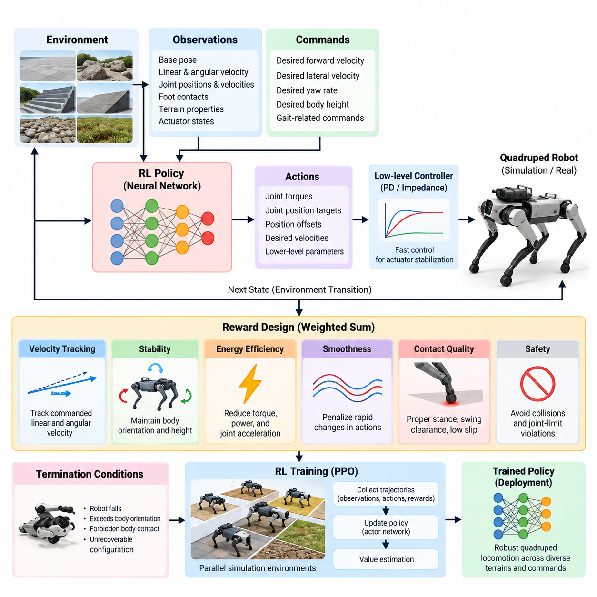
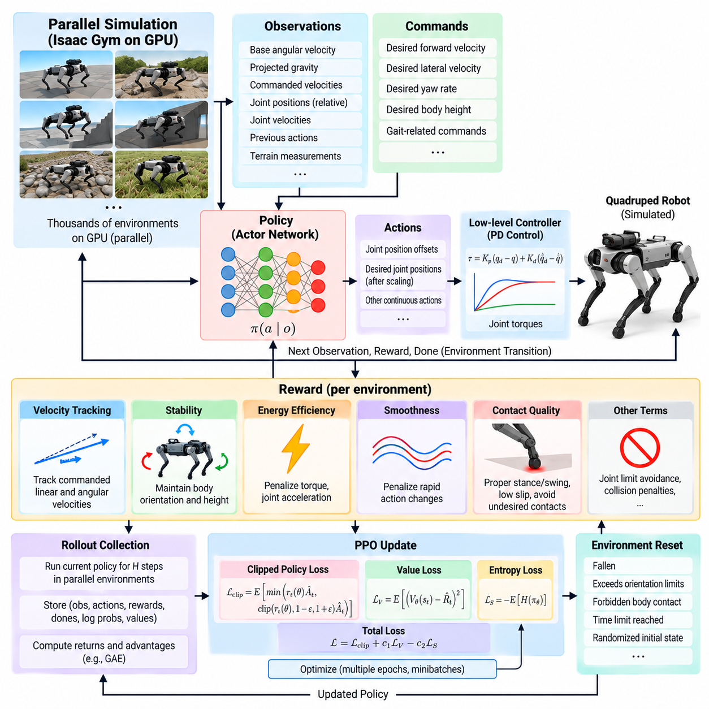
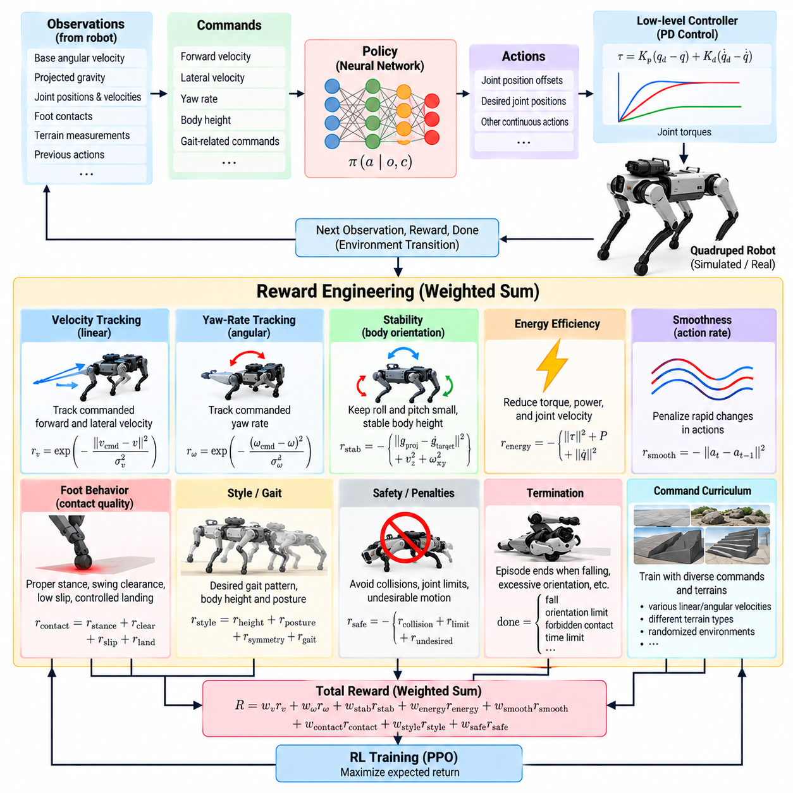
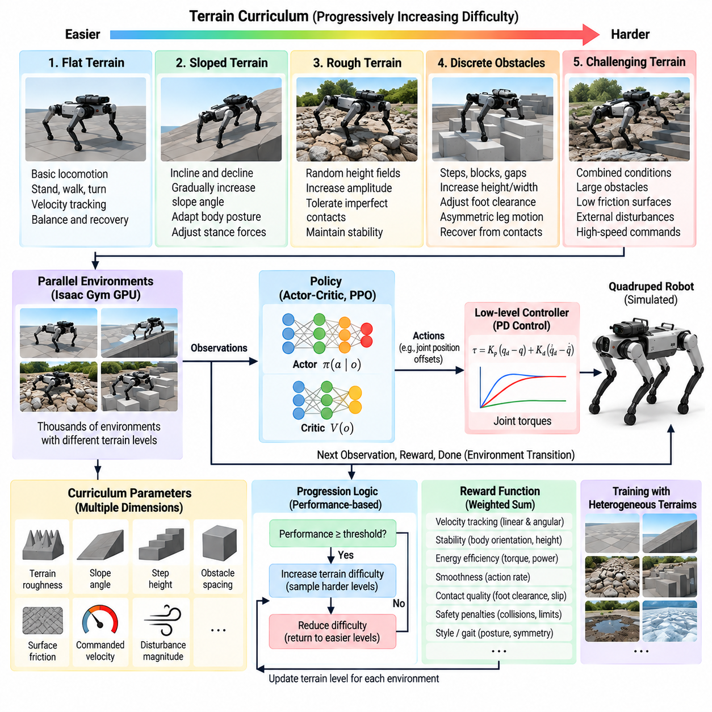
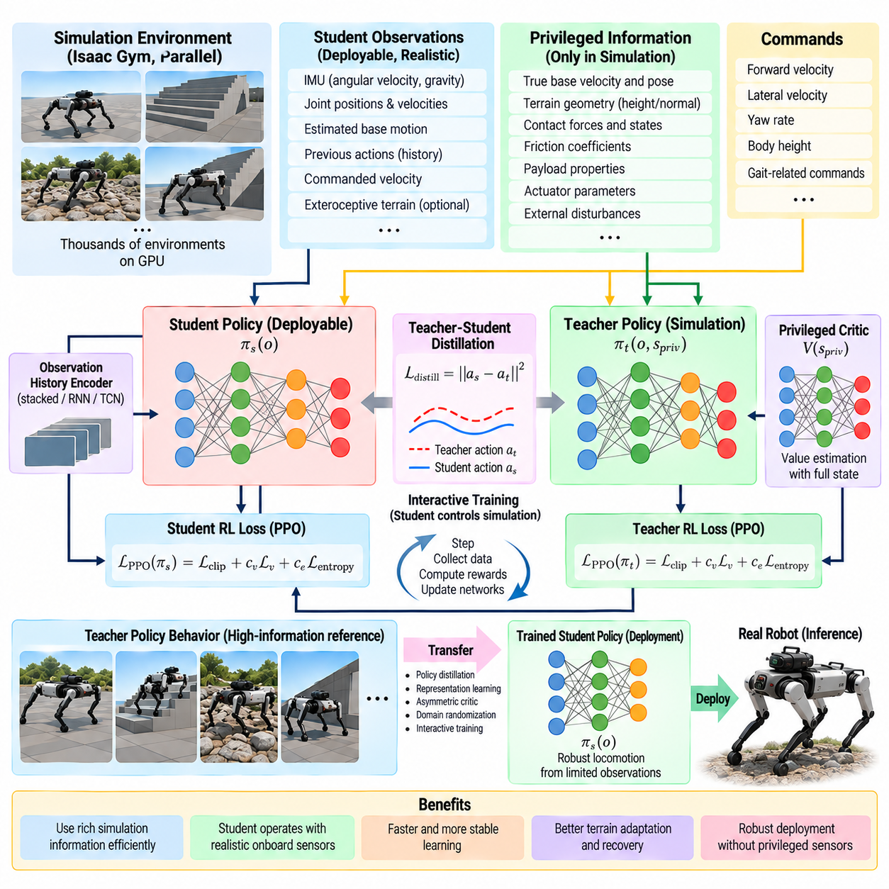
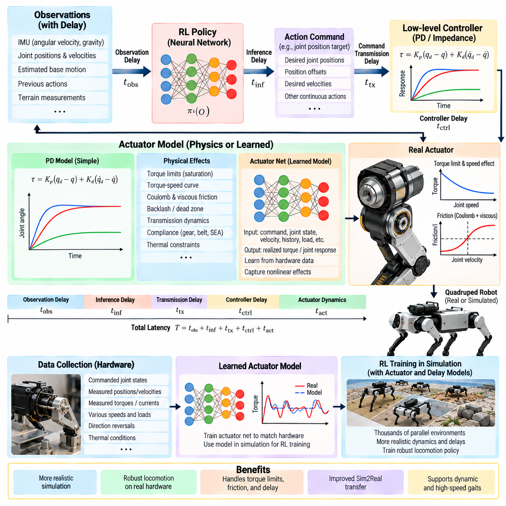
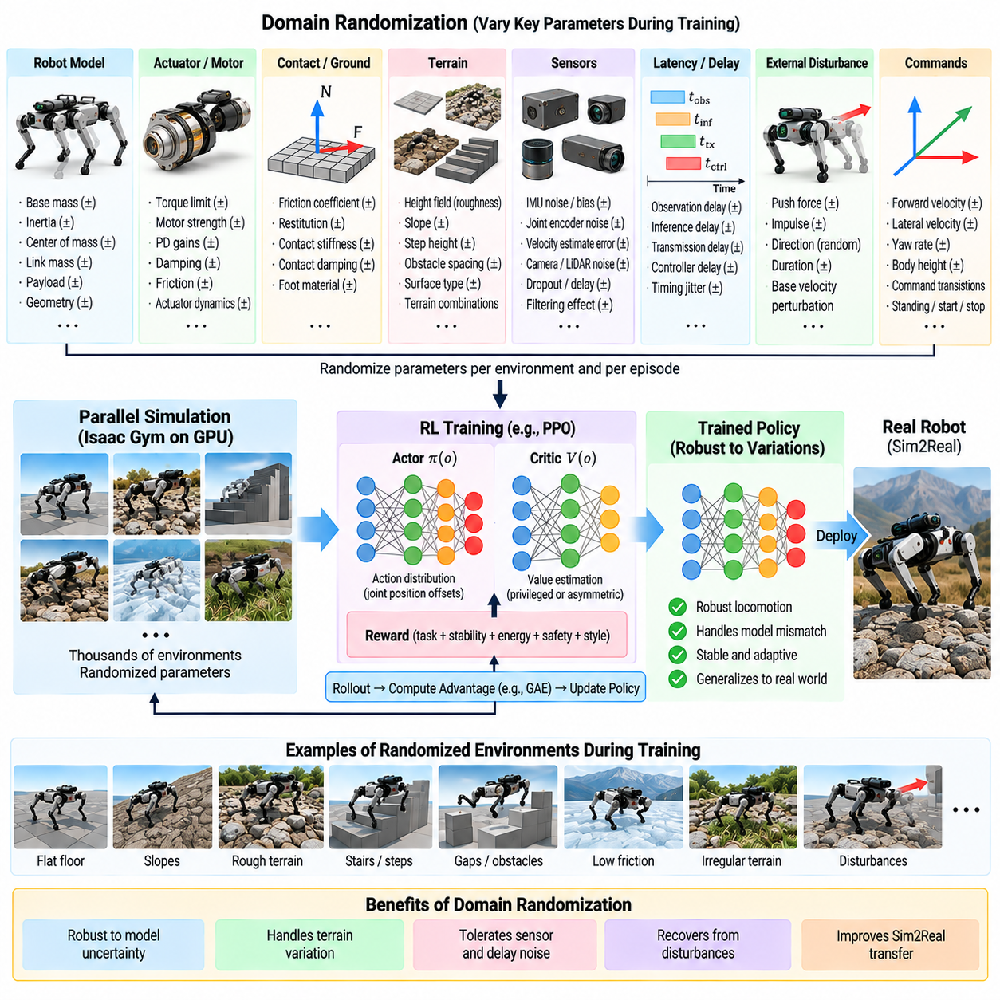
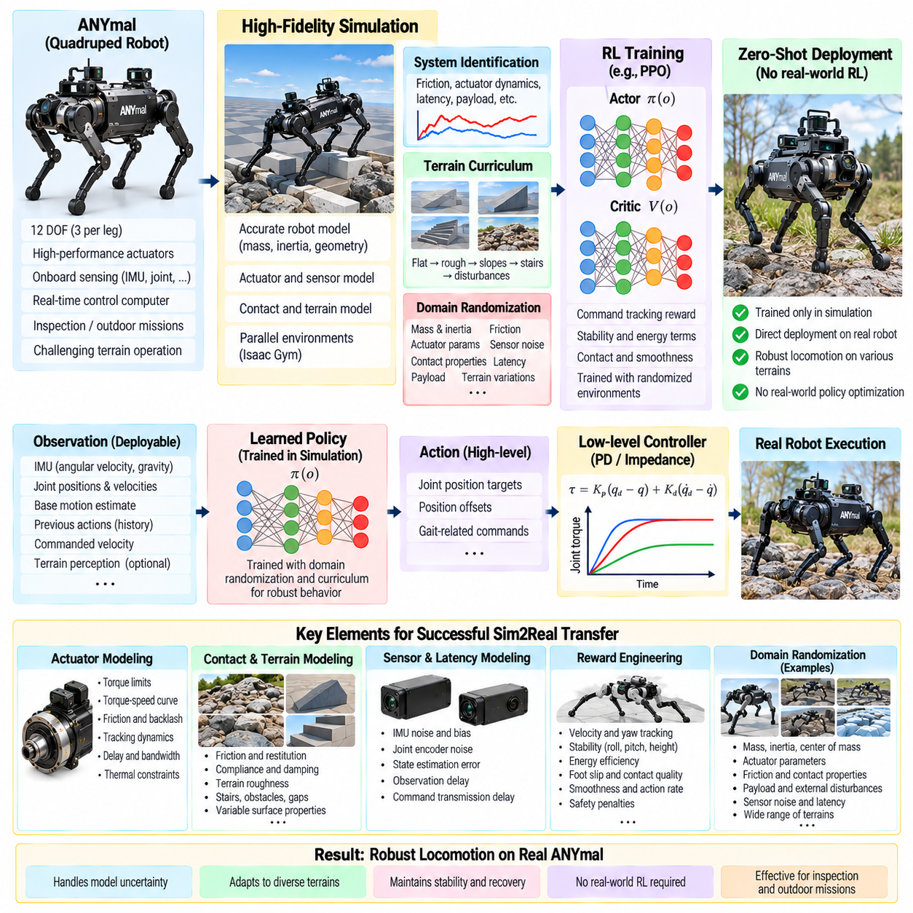
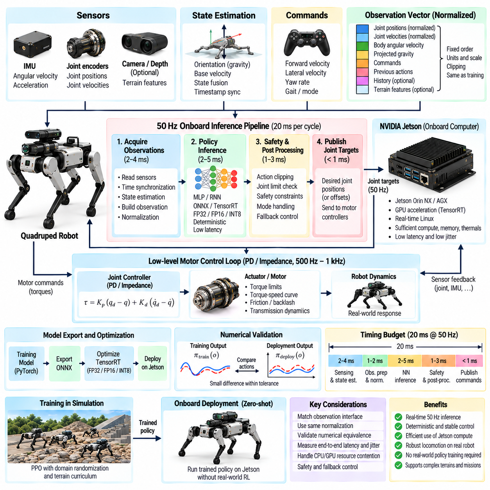
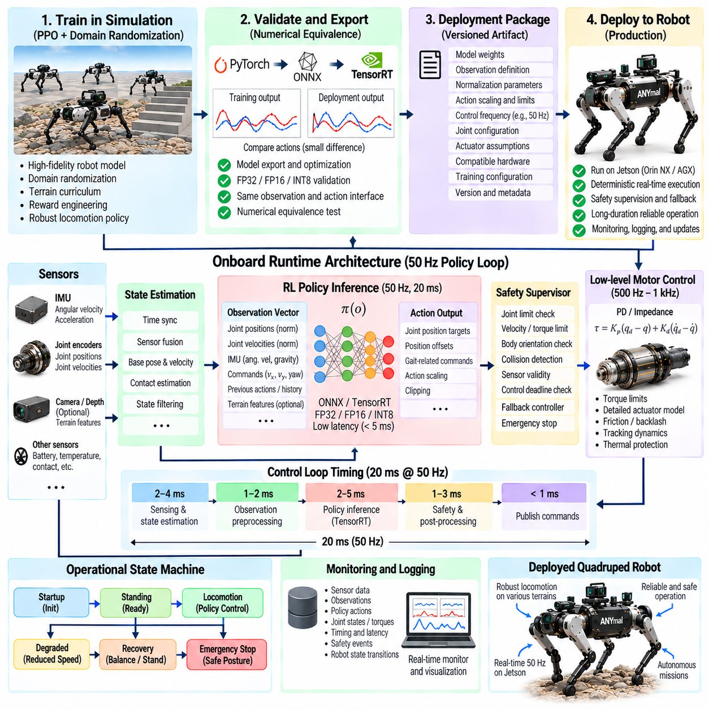

**Volume 21. Quadruped Robot Software**

# Chapter 07. Reinforcement Learning for Locomotion

## 07.01. RL Locomotion Overview Reward Design Architecture

{width="7.268055555555556in" height="7.268055555555556in"}

Reinforcement learning locomotion treats quadruped control as a sequential decision problem in which a policy learns how to transform observations of the robot and its environment into actions that produce stable, agile motion. Instead of explicitly deriving every contact sequence, foothold, and joint trajectory, the controller improves its behavior through repeated interaction with a simulated environment and numerical feedback encoded by a reward function.

A typical formulation represents locomotion as a Markov decision process containing states, observations, actions, transition dynamics, rewards, and episode termination conditions. The underlying state may include base pose, linear and angular velocity, joint positions, joint velocities, foot contacts, terrain properties, and actuator states. The policy normally receives only observations that could realistically be estimated or measured during deployment.

The action representation strongly influences learning stability and deployment behavior. A policy may directly output joint torques, but many practical quadruped systems instead generate joint position targets, position offsets, desired velocities, or parameters for a lower-level controller. Position-target actions combined with a fast PD or impedance controller provide a useful separation between learned motion generation and deterministic actuator-level stabilization.

Locomotion commands are usually supplied as part of the policy observation so that one policy can represent a family of behaviors rather than a single fixed gait. Desired forward and lateral velocity, yaw rate, body height, or gait-related commands can condition the learned behavior. The resulting controller therefore learns a mapping from the current robot condition and commanded motion to actions that continuously adapt the legs and body.

Reward design defines what successful locomotion means to the learning algorithm. A common objective combines command tracking, stability, energy efficiency, smoothness, contact quality, and safety. Conceptually, the total reward can be written as a weighted combination of terms such as velocity tracking, yaw-rate tracking, body orientation, foot behavior, torque usage, action variation, joint-limit avoidance, and undesirable collision penalties.

Velocity tracking is generally one of the dominant positive objectives. The policy is rewarded when measured base velocity approaches the commanded velocity, while angular tracking encourages the desired turning rate. Exponential tracking functions are often useful because they provide strong rewards near the target while maintaining smooth gradients over a meaningful error range. Reward scales must nevertheless be tuned relative to all competing objectives.

Stability objectives discourage excessive roll, pitch, vertical velocity, and uncontrolled body motion. These terms prevent a policy from achieving commanded velocity through dynamically undesirable behavior. Additional penalties can constrain deviations from nominal body height or orientation. However, excessively strong posture regulation may suppress useful dynamic motions, so reward weights should allow the body to respond naturally during acceleration, turning, impact, and terrain traversal.

Energy-related terms reduce unnecessarily aggressive actuation. Torque magnitude, mechanical power, joint acceleration, or combinations of torque and joint velocity can be penalized to promote efficient movement. Smoothness penalties may additionally constrain rapid changes in policy actions. These objectives are important because a policy trained only for velocity tracking can discover high-frequency or high-torque strategies that work in simulation but stress actuators and transfer poorly to hardware.

Contact-aware rewards shape how the feet interact with the ground. Depending on the desired behavior, training may encourage appropriate stance duration, sufficient swing-foot clearance, controlled landing velocity, and low tangential slip. Penalties for collisions involving knees, thighs, or the robot body help prevent physically undesirable solutions. Contact terms must remain compatible with terrain diversity because rigid assumptions about foot timing can reduce adaptability.

Termination conditions form another important component of reward architecture. Episodes may terminate when the robot falls, exceeds allowable body orientation, experiences forbidden body contact, or enters an unrecoverable configuration. Early termination prevents simulation resources from being spent on meaningless states and implicitly defines unacceptable behavior. Nevertheless, termination rules should not be so restrictive that the policy never experiences recoverable disturbances or difficult configurations.

The learning architecture usually separates simulation, policy optimization, and deployment interfaces. Thousands of simulated quadrupeds can execute trajectories in parallel while an on-policy algorithm such as Proximal Policy Optimization collects observations, actions, rewards, and value estimates. The collected trajectories are then used to update an actor network that generates actions and a critic that estimates expected return during training.

The actor commonly receives proprioceptive observations including projected gravity, base angular velocity, joint position errors, joint velocities, previous actions, and motion commands. Depending on the locomotion problem, exteroceptive information such as terrain heights may also be included. Observation normalization and carefully defined coordinate frames are essential because inconsistent scales or reference frames can significantly degrade optimization and hardware transfer.

The critic can use the same observations as the actor, but simulation permits an asymmetric architecture in which additional privileged information is available only during training. Exact base velocity, terrain parameters, contact forces, friction coefficients, or other simulator states can improve value estimation without becoming deployment requirements. This principle naturally supports later teacher-student and privileged-learning architectures within the broader RL locomotion pipeline. Volume_21_Quadruped_Robot_Softw...

Training normally begins in simulation because reinforcement learning requires enormous numbers of interactions and inevitably explores unstable behavior. Parallel physics simulation makes it possible to gather experience from many robot instances simultaneously. Randomized initial poses, commands, disturbances, terrain conditions, and physical parameters broaden the state distribution encountered during training and reduce dependence on one nominal simulation configuration.

Curriculum design can organize this exploration progressively. A policy may first learn standing and low-speed tracking on flat terrain before encountering higher velocities, slopes, stairs, rough surfaces, external disturbances, or reduced friction. Difficulty can increase according to training progress or task performance. Curriculum learning therefore complements reward engineering by controlling which experiences are presented while the locomotion capability develops.

For transfer to a physical quadruped, the training architecture must account for the simulation-to-reality gap. Mass, inertia, friction, motor strength, joint damping, sensor noise, communication delay, control latency, and terrain properties can be randomized within plausible ranges. Actuator dynamics may require explicit modeling because commanded joint targets or torques do not instantaneously produce the idealized response assumed by simplified simulation.

The deployed architecture normally operates at multiple rates. A learned policy can run at a moderate frequency and generate desired joint commands, while a lower-level motor-control loop executes at a substantially higher frequency. State estimation, safety monitoring, joint-limit enforcement, torque saturation, communication supervision, and emergency behavior remain deterministic components around the learned policy rather than being delegated entirely to reinforcement learning.

This separation is essential for production systems. Reinforcement learning should be viewed as one component of the locomotion stack rather than the complete robot controller. The policy provides adaptive motion behavior, while state estimation provides reliable observations, actuator interfaces execute commands, and safety layers reject dangerous outputs. Higher-level navigation or mission software supplies desired motion commands without directly controlling individual legs.

Reward engineering, policy architecture, simulation fidelity, curriculum design, actuator modeling, and domain randomization therefore form a coupled system. Improving only the optimization algorithm does not guarantee better locomotion. A policy can obtain excellent simulated return while exploiting unrealistic contacts, excessive torque, inaccurate actuator dynamics, or simulator-specific observations. Successful RL locomotion requires the training objective and environment to represent deployment constraints from the beginning.

Evaluation should consequently extend beyond accumulated reward. Command-tracking error, fall rate, disturbance recovery, electrical or mechanical energy, foot slip, peak torque, joint-limit margin, action smoothness, terrain success rate, and robustness to parameter variation provide more interpretable measures. Validation across unseen environments is particularly important because memorizing the distribution used during training is different from acquiring robust locomotion behavior.

Within the quadruped software architecture, this framework provides the foundation for subsequent development of PPO-based training, detailed reward engineering, terrain curricula, privileged teacher-student learning, actuator and delay modeling, domain randomization, zero-shot Sim2Real transfer, onboard inference, and production deployment. These topics form the intended progression of the reinforcement-learning locomotion chapter in the supplied structure. Volume_21_Quadruped_Robot_Softw...

## 07.02. PPO for Quadruped Locomotion Isaac Gym [w/Code]

{width="7.268055555555556in" height="7.268055555555556in"}

Proximal Policy Optimization (PPO) is widely used for quadruped locomotion because it combines relatively stable policy updates with efficient parallel experience collection. In an Isaac Gym training architecture, thousands of simulated quadrupeds can execute simultaneously on a GPU, allowing large batches of locomotion experience to be generated without sequential CPU-bound simulation. This makes PPO practical for learning dynamic behaviors that require hundreds of millions or billions of simulated control steps.

The locomotion problem is formulated as a continuous-control Markov decision process. At every policy step, each simulated robot receives an observation vector describing its current condition and a command specifying the desired motion. The actor network maps this information to continuous actions, while the environment advances the robot dynamics, evaluates contacts and constraints, calculates a reward, and returns the next observation together with termination information.

A typical observation vector contains base angular velocity, projected gravity, commanded linear and angular velocities, joint positions relative to nominal configurations, joint velocities, and the previous policy action. Additional terrain measurements can be included when terrain-aware locomotion is required. Observation components are normally scaled or normalized so that quantities with different physical units do not produce poorly conditioned neural-network inputs.

The policy action can represent joint position offsets relative to a nominal standing configuration. After appropriate scaling, these outputs become desired joint positions for a lower-level proportional-derivative controller. The PD controller converts position and velocity errors into joint torques that are applied through the simulator. This architecture avoids requiring PPO to discover actuator-level stabilization entirely by itself while retaining sufficient freedom to learn highly dynamic leg motions.

Isaac Gym enables the robot model, rigid-body dynamics, contact calculations, environment states, and policy-related tensors to remain on the GPU. Parallel environments can therefore advance with limited CPU-GPU communication. The primary advantage is not simply faster rendering or visualization, but high-throughput physics simulation and tensor processing, which permit PPO to collect large rollout batches from many statistically different robot instances at once.

During rollout collection, the current policy samples actions for every environment over a fixed horizon. Each transition stores observations, actions, rewards, termination flags, policy log probabilities, and value estimates. When the rollout horizon is complete, these trajectories form a training batch. Returns and advantages are then calculated before the actor and critic networks are updated over several optimization epochs.

The critic estimates the expected cumulative return from the current state or observation, providing a baseline that reduces variance in the policy-gradient estimate. Generalized Advantage Estimation (GAE) is commonly used to combine temporal-difference information across multiple time scales. The discount factor determines the importance of future rewards, while the GAE parameter controls the tradeoff between low-variance and low-bias advantage estimates.

PPO updates the actor using a probability-ratio objective that compares the new policy with the policy that generated the rollout. Instead of allowing arbitrarily large policy changes, the probability ratio is clipped within a bounded interval. This clipped surrogate objective discourages destructive updates while still allowing repeated optimization over collected samples, which is especially valuable when learning sensitive contact-rich locomotion behaviors.

The complete optimization objective normally includes the clipped policy loss, a value-function loss for critic learning, and an entropy term that supports exploration. Their relative coefficients affect training behavior significantly. Excessive entropy can prevent precise locomotion from emerging, whereas insufficient exploration can cause premature convergence. Likewise, inaccurate critic learning can destabilize advantage estimates even when the actor architecture itself is well designed.

Reward computation occurs independently for every parallel robot. Velocity and yaw-rate tracking can provide primary task rewards, while penalties regulate vertical motion, roll and pitch behavior, torque usage, joint acceleration, action changes, foot slip, undesirable contacts, and other physical properties. The PPO algorithm optimizes the numerical objective it receives, so reward implementation must accurately represent the intended locomotion behavior rather than merely produce increasing episode return.

Environment resets are an important part of the training loop. A robot can be reset after falling, violating orientation limits, contacting forbidden body regions, or reaching the episode time limit. Reset states should contain sufficient variation in pose, command, and environment conditions to prevent the policy from depending on a narrow initial configuration. Efficient GPU-side resets allow failed environments to restart without interrupting the remaining parallel simulations.

Command sampling determines the behavioral envelope of the learned controller. Each environment can receive randomly sampled forward velocity, lateral velocity, and yaw-rate commands that remain fixed for a short interval before changing. By training many environments with different commands simultaneously, PPO learns a command-conditioned locomotion policy capable of accelerating, decelerating, turning, moving laterally, and standing rather than requiring separate networks for each behavior.

Terrain can also be distributed across the parallel environments. Some robots may train on flat ground while others encounter slopes, rough surfaces, steps, or procedurally generated height fields. Terrain difficulty can be adjusted using curriculum logic so that successful robots progress toward harder conditions. This prevents difficult terrain from overwhelming the early learning stage while eventually exposing the policy to a broad locomotion distribution.

Domain randomization can be applied independently to individual Isaac Gym environments. Robot mass, center of mass, friction, motor strength, joint parameters, initial states, disturbances, and other physical properties can vary across simulated instances. Consequently, a single PPO update can contain experience from many slightly different robot dynamics, encouraging the policy to learn behavior that is less dependent on one precisely calibrated simulation model.

External perturbations are useful for learning recovery behavior. Random pushes or temporary base velocity disturbances can be introduced during training so that the policy experiences states outside nominal periodic locomotion. The robot must then restore balance while continuing to follow the commanded velocity. Perturbation magnitude and frequency should be selected carefully because disturbances that are too severe early in training can dominate the learning signal.

Control frequency and simulation frequency should be distinguished explicitly. Physics may be integrated using a small simulation time step, while the learned policy executes less frequently through action decimation. Between policy updates, the lower-level controller repeatedly applies commands during multiple physics steps. This arrangement resembles deployment architectures in which motor control operates faster than neural-network inference and reduces unnecessary policy evaluations during training.

Neural-network architecture for PPO locomotion is often comparatively compact because inference must eventually execute onboard with deterministic latency. Multilayer perceptrons can map the observation vector to action distributions and value estimates efficiently. The actor typically predicts the mean of a continuous action distribution together with learned or parameterized action variance, allowing stochastic exploration during training and deterministic or low-variance action selection during evaluation.

Training diagnostics should examine more than the mean episode reward. Individual reward components, episode length, command-tracking error, termination causes, action magnitude, torque usage, policy entropy, value loss, clipping fraction, and approximate policy divergence provide information about why learning succeeds or fails. A rising total reward can conceal undesirable compensation between terms, such as improved velocity tracking obtained through excessive torque or unstable body motion.

Periodic deterministic evaluation is therefore useful alongside stochastic training. Evaluation environments can disable exploration noise and execute fixed command profiles, terrain sequences, and disturbance tests. Comparing these results across checkpoints reveals whether improved training return corresponds to meaningful locomotion performance. Checkpointing also allows recovery from unstable updates and enables later comparison of policies trained with different rewards, randomization ranges, or network configurations.

A practical PPO workflow in Isaac Gym consequently forms a closed loop of massively parallel simulation, rollout collection, advantage estimation, clipped policy optimization, critic learning, evaluation, and checkpointing. Within the supplied quadruped software structure, this implementation provides the computational foundation for subsequent reward engineering, terrain curriculum, privileged learning, actuator modeling, domain randomization, Sim2Real transfer, onboard inference, and production deployment. Volume_21_Quadruped_Robot_Softw...

## 07.03. Reward Engineering Velocity Tracking Energy Style [w/Code]

{width="7.268055555555556in" height="7.268055555555556in"}

Reward engineering is one of the most influential design processes in reinforcement-learning locomotion because the policy ultimately optimizes the numerical objective rather than an abstract concept of good walking. For quadrupeds, the reward must simultaneously express command tracking, dynamic stability, energy efficiency, contact quality, smooth motion, and desired gait characteristics while avoiding unintended solutions that exploit the simulator.

A practical reward function is usually constructed as a weighted sum of multiple terms evaluated at every policy step. Positive terms encourage desired behavior, while penalties suppress undesirable motion or excessive control effort. The relative magnitude of these components is often more important than their absolute values because PPO responds to the combined optimization landscape created by all rewards, penalties, termination conditions, and command distributions.

Velocity tracking provides the primary task objective for command-conditioned locomotion. The robot should reproduce desired forward and lateral velocities while remaining responsive to changes in commanded motion. A tracking reward can be based on the difference between commanded and measured base velocity, often using an exponential function that produces a high value near zero error and decreases smoothly as tracking error becomes larger.

Yaw-rate tracking extends the same principle to rotational motion. The policy is rewarded when measured angular velocity around the vertical axis approaches the commanded yaw rate. Linear and angular tracking terms should be balanced so that the robot neither sacrifices translation to achieve turning nor ignores rotational commands while maximizing forward velocity. Training commands must therefore span the operational velocity and turning envelope expected during deployment.

Tracking rewards should be expressed in physically meaningful coordinate frames. Desired planar velocity is commonly compared with robot velocity expressed in a body-aligned frame, allowing the same policy to operate regardless of global orientation. Careful frame selection also prevents the network from learning unnecessary dependencies on world coordinates and makes forward, lateral, and rotational commands consistent across randomized environments.

Energy efficiency requires explicit reward shaping because a policy rewarded only for tracking can discover unnecessarily aggressive solutions. Common penalties include squared joint torque, mechanical power, joint velocity, or combinations of these quantities. A torque penalty discourages excessive actuator effort, while a power-related term more directly represents energetic expenditure associated with producing motion under load.

Energy penalties must not dominate the locomotion objective. If their weights are too large, the easiest way for the policy to minimize effort may be to move slowly, ignore commands, or produce weak leg motions that compromise disturbance recovery. If they are too small, the robot may track commands accurately while generating high torque peaks and inefficient oscillations. Reward tuning therefore requires examining physical metrics in addition to accumulated return.

Action-rate penalties are frequently introduced to suppress rapid changes between consecutive policy outputs. If the current action differs strongly from the previous action, the controller receives a penalty proportional to that variation. This encourages temporal smoothness and reduces high-frequency command oscillation, which is especially important when learned position targets are executed through a high-rate PD controller connected to real actuators.

Joint acceleration or velocity penalties can provide additional regularization. Excessive joint acceleration may indicate abrupt reversals, impact-driven behavior, or simulator-specific strategies that are difficult for physical hardware to reproduce. However, these penalties should preserve the fast leg motions required for dynamic locomotion. High-speed trotting, recovery steps, jumping, or rough-terrain traversal naturally require larger accelerations than quiet standing.

Style rewards describe how the robot should perform the task rather than only whether the commanded velocity is achieved. Desired body height, orientation, foot clearance, stance behavior, symmetry, gait timing, or posture can be encoded as additional objectives. Style shaping is useful when unconstrained reinforcement learning produces technically successful but mechanically undesirable motions such as crouched walking, excessive body oscillation, or irregular stepping.

Body-orientation penalties commonly regulate roll and pitch relative to gravity. Projected gravity provides a convenient representation because it indicates body orientation without requiring global heading information. A separate vertical-velocity penalty can suppress unnecessary bouncing, while an angular-velocity penalty can reduce excessive roll and pitch rates. Together these terms encourage a stable trunk without forcing the body to remain artificially rigid.

Foot-related shaping influences swing and stance behavior. Swing feet may be encouraged to achieve sufficient clearance to avoid terrain collisions, while stance feet can be penalized for tangential slip. Contact-force or landing-velocity penalties can reduce harsh impacts. These objectives should be designed carefully because overly strict assumptions about foot trajectories may prevent the policy from discovering adaptive strategies for slopes, obstacles, loose surfaces, or unexpected disturbances.

Gait style can also emerge from contact timing. Rewards may encourage suitable air time, coordinated phase relationships, or specific contact patterns when a particular gait is desired. For example, trot-like behavior can be promoted by encouraging diagonal coordination. However, excessively prescribing contact schedules reduces the ability of reinforcement learning to discover transitions or alternative strategies that may be more appropriate under different speeds and terrains.

Joint-limit penalties protect mechanical feasibility by discouraging configurations near position or velocity limits. Similar penalties can be applied when commanded torques approach actuator limits. These terms create a soft safety margin before hard saturation or termination becomes necessary. They are particularly important when simulation permits configurations that are mathematically valid but undesirable because of linkage geometry, cable routing, thermal loading, or physical actuator constraints.

Undesirable contact penalties provide another important safety signal. Contacts involving the trunk, knees, upper legs, or other prohibited robot components can receive strong negative rewards. A fall or severe orientation violation can additionally terminate the episode. The combination of continuous contact penalties and termination conditions teaches the policy to distinguish recoverable deviations from states that represent complete locomotion failure.

Reward scales should be interpreted together with the control time step. A reward accumulated at every simulation or policy step changes numerically when the control frequency changes unless time scaling is handled consistently. This becomes important when comparing experiments or transferring configurations between simulation architectures. Reward implementation should therefore make explicit whether individual terms represent instantaneous quantities, rates, or approximations of time-integrated costs.

Reward clipping and normalization can improve numerical behavior, but they can also hide meaningful differences between good and exceptional trajectories. Similarly, large negative penalties may overwhelm positive tracking rewards and produce conservative behavior. Rather than relying on arbitrary large constants, reward magnitudes should be inspected from actual rollouts so that each term contributes within an intentional range during representative locomotion.

Curriculum learning and reward engineering interact strongly. During early training, basic velocity tracking and stability may dominate while difficult terrain, strong perturbations, or demanding commands remain limited. As the policy improves, broader command ranges and harder terrain expose weaknesses in energy efficiency, contact behavior, and gait style. Reward terms that appeared well balanced on flat terrain may therefore require reevaluation under the full training distribution.

A useful tuning process records each reward component separately rather than observing only total episode return. Velocity error, yaw error, torque, mechanical power, action variation, foot slip, body orientation, contact events, and termination causes should be monitored alongside their corresponding reward values. This reveals whether improved total return reflects genuine locomotion quality or compensation between conflicting terms.

Reward ablation provides another effective validation method. Individual terms can be removed or systematically reweighted while keeping the remaining training configuration unchanged. Comparing resulting policies reveals which objectives are essential, redundant, or unintentionally restrictive. Such experiments are especially valuable because visually plausible locomotion does not necessarily indicate low energy consumption, robust command tracking, or transferable actuator behavior.

The final reward architecture should produce a policy that satisfies several objectives without depending on one narrowly optimized behavior. Accurate velocity tracking provides task performance, energy terms encourage efficient actuation, smoothness terms improve realizability, contact objectives shape ground interaction, and style terms regulate mechanically desirable motion. Their balance determines whether PPO learns merely to move or develops locomotion suitable for robust physical deployment.

Within the reinforcement-learning chapter structure, reward engineering therefore connects PPO training directly to later terrain curricula, privileged learning, actuator modeling, domain randomization, Sim2Real transfer, onboard inference, and production deployment. A well-designed reward does not eliminate these later requirements, but it establishes the behavioral objective that all subsequent robustness and transfer mechanisms must preserve. Volume_21_Quadruped_Robot_Softw...

## 07.04. Terrain Curriculum for Robust Locomotion [w/Code]

{width="7.268055555555556in" height="7.268055555555556in"}

Terrain curriculum learning organizes locomotion training so that a quadruped encounters progressively more difficult ground conditions instead of being exposed to the entire terrain distribution from the beginning. The objective is to establish fundamental balance and command tracking first, then expand those capabilities toward slopes, irregular surfaces, obstacles, and highly disturbed terrain while preserving stable learning.

Training immediately on difficult terrain can produce sparse or misleading learning signals because an untrained policy may fall before experiencing useful locomotion states. A curriculum reduces this problem by controlling environmental difficulty according to policy competence. Early environments provide conditions in which successful steps are achievable, allowing PPO to discover meaningful relationships between body motion, joint actions, contacts, and rewards before harder situations are introduced.

A terrain curriculum normally defines multiple difficulty dimensions rather than a single easy-to-hard sequence. Terrain roughness, slope angle, step height, obstacle spacing, surface discontinuity, friction, commanded velocity, and disturbance magnitude can each be varied. The curriculum therefore represents a multidimensional distribution of locomotion challenges, and progression determines which portions of this distribution are sampled during different stages of training.

Flat terrain forms a useful initial domain because it isolates fundamental locomotion behavior from complex terrain interactions. The policy can learn standing, forward and lateral velocity tracking, turning, coordinated stepping, body stabilization, and basic recovery. Once these behaviors become reliable, terrain complexity can increase without requiring the optimizer to discover basic gait generation and difficult terrain adaptation simultaneously.

Sloped terrain introduces systematic changes in gravitational loading and contact forces. Ascending requires increased propulsion and appropriate body configuration, while descending demands controlled braking and impact management. Curriculum levels can gradually increase positive and negative slope angles, enabling the policy to adapt joint motion, stance forces, and body orientation before encountering more irregular three-dimensional surfaces.

Rough terrain can be generated using randomized height fields with progressively increasing amplitude and spatial frequency. Low levels contain small surface variations that minimally disturb nominal gait, while higher levels produce uneven footholds and stronger body disturbances. This progression teaches the policy to tolerate imperfect contacts and changing leg extension without immediately confronting obstacles that exceed its developing recovery capability.

Discrete obstacles such as steps, blocks, gaps, or stepping structures introduce different requirements from continuous roughness. Difficulty can be controlled through obstacle height, width, spacing, and arrangement. As complexity increases, the policy must generate greater swing-foot clearance, adjust stance duration, tolerate asymmetric leg configurations, and recover from contacts that do not occur at the nominal ground height.

Curriculum progression can be based on explicit performance criteria rather than elapsed training time. A robot may advance when it travels a required distance, maintains command tracking, survives for sufficient episode duration, or achieves a threshold success rate. Performance-based progression prevents environments from becoming harder merely because optimization has continued for a fixed number of iterations, regardless of whether the required skill has actually emerged.

Regression is equally important. If a policy repeatedly fails at its current terrain level, the environment can reduce difficulty and return the robot to conditions where useful experience can still be collected. Bidirectional curriculum adjustment creates a feedback mechanism between demonstrated competence and training distribution. It also prevents large populations of parallel environments from remaining trapped in states that produce repeated falls and little informative locomotion data.

In massively parallel simulation, different robots can occupy different curriculum levels simultaneously. Successful environments progress toward harder terrain while less successful instances remain at easier levels. This produces a heterogeneous training batch containing both consolidated skills and emerging challenges. PPO therefore receives experience across a range of difficulty rather than being forced through globally synchronized curriculum stages.

Terrain assignment should maintain sufficient diversity within each difficulty level. If every environment at one level contains an identical slope or obstacle sequence, the policy may memorize recurring geometric patterns rather than acquire general terrain robustness. Procedural generation can vary terrain realization while preserving a controlled difficulty range, allowing the curriculum to regulate challenge without reducing training to a small collection of deterministic courses.

Command difficulty can be coupled with terrain difficulty. High-speed locomotion on rough ground is substantially harder than low-speed traversal of the same surface, so velocity and yaw-rate ranges may initially remain conservative on challenging terrain. As competence improves, command ranges can expand. This creates a joint curriculum over environmental geometry and locomotion demand rather than treating terrain adaptation as an isolated problem.

Reward engineering must remain compatible with curriculum progression. Strong penalties for body motion, joint acceleration, or deviations from nominal gait that are appropriate on flat ground may suppress movements required for difficult terrain. A robust reward architecture should permit larger adaptive body and leg responses when necessary while still discouraging instability, excessive energy consumption, foot slip, and mechanically undesirable behavior.

Terrain curricula also interact with contact-related rewards. Increasing obstacle height naturally changes swing trajectories, landing velocities, stance durations, and contact forces. If foot-clearance or contact-timing rewards encode overly narrow assumptions, the policy may fail when entering higher curriculum levels. Reward terms should therefore describe useful physical behavior without prescribing a single gait geometry for every terrain condition.

Proprioceptive locomotion can benefit from terrain curricula even when explicit terrain perception is unavailable. Repeated exposure to variations in contact timing, joint loading, base acceleration, and foot slip teaches the policy to respond to terrain indirectly through internal robot measurements. The learned controller can therefore develop reactive adaptation to disturbances that become observable only after physical interaction with the ground.

When exteroceptive observations are available, terrain curriculum training additionally teaches the policy to associate upcoming geometry with appropriate actions. Height samples, depth-derived terrain features, or elevation information can provide advance knowledge of slopes and obstacles. Curriculum progression then develops not only reactive recovery but also anticipatory adaptation, provided that the observations used during training are representative of those available during deployment.

Domain randomization should complement rather than replace terrain curriculum. Curriculum controls task difficulty, whereas randomization broadens uncertainty within the task. At a given terrain level, friction, payload, mass distribution, actuator strength, sensor noise, or latency may vary across environments. The policy must consequently solve progressively harder terrain while also learning that the exact physical parameters of the robot and surface are uncertain.

Care is required to avoid catastrophic forgetting as the curriculum advances. If training becomes concentrated exclusively on difficult terrain, performance on flat ground or simple commands can deteriorate because those experiences become underrepresented. Maintaining a mixture of easier and harder environments preserves previously learned skills while adding new capabilities. The target is broad locomotion competence rather than maximum performance on the highest terrain level alone.

Curriculum metrics should therefore include more than progression level. Terrain completion rate, fall frequency, traveled distance, command-tracking error, foot slip, energy consumption, recovery success, and episode duration can reveal whether higher difficulty is producing genuine robustness. Evaluation should also use terrain realizations excluded from training so that progression cannot be explained by memorization of the procedural generator or a limited terrain set.

The final curriculum should cover the operational envelope expected for deployment while retaining a margin beyond nominal conditions. A policy intended for industrial inspection may need reliable behavior on flat floors, ramps, stairs, gravel, uneven outdoor ground, and localized obstacles. Training slightly beyond expected roughness, slope, or disturbance levels can provide robustness, but unrealistic extremes may consume capacity and encourage behavior irrelevant to the actual robot mission.

Terrain curriculum learning consequently acts as a distribution-management mechanism for reinforcement learning. It determines when and how the policy encounters increasingly demanding locomotion states while preserving enough successful experience for PPO optimization. Within the chapter structure, it prepares the policy for privileged learning, actuator and delay modeling, domain randomization, zero-shot Sim2Real transfer, onboard inference, and eventual production deployment. Volume_21_Quadruped_Robot_Softw...

## 07.05. Privileged Learning Teacher Student Framework [w/Code]

{width="7.268055555555556in" height="7.268055555555556in"}

Privileged learning addresses a fundamental problem in reinforcement-learning locomotion: simulation provides complete knowledge of the robot and environment, while the deployed robot observes only limited, noisy sensor information. Instead of discarding the additional simulation information, a teacher-student framework uses it during training and subsequently transfers the resulting locomotion capability to a student policy that can operate using realistic onboard observations.

Privileged information may include exact base velocity, terrain geometry, contact forces, friction coefficients, payload properties, actuator parameters, external disturbances, or other simulator states that cannot be measured reliably during deployment. Such variables make the locomotion problem easier to interpret during training because the policy can distinguish whether a change in motion originates from terrain, dynamics, contact, or external perturbation.

The teacher policy is trained in simulation with access to this richer state representation. Its observation can combine standard proprioceptive measurements with privileged variables describing the underlying environment and robot dynamics. PPO or another reinforcement-learning algorithm then optimizes the teacher for command tracking, stability, energy efficiency, terrain traversal, and recovery while benefiting from information unavailable to the eventual deployed controller.

Because the teacher has direct access to hidden physical variables, it can learn effective responses without first inferring those variables from observation history. For example, knowledge of terrain height or friction can immediately influence foot motion, while knowledge of an external disturbance can help generate an appropriate recovery response. The teacher therefore represents a high-information reference policy rather than the final deployment policy.

The student policy is constrained to observations that can realistically be obtained onboard. These may include IMU measurements, joint positions and velocities, previous actions, commanded velocity, estimated base motion, and possibly exteroceptive terrain observations. The student cannot directly access simulator-only quantities, so it must reproduce useful teacher behavior using incomplete information that resembles the sensing conditions of the physical robot.

Teacher-to-student transfer can be formulated as policy distillation, imitation, or representation learning. During simulation, identical or related states are presented to both networks, and the student is trained to reproduce teacher actions or internal representations from restricted observations. This provides a supervised learning signal in addition to reinforcement rewards and can substantially reduce the difficulty of discovering robust locomotion exclusively from partial observations.

A simple distillation objective minimizes the difference between teacher and student actions. For continuous quadruped control, this may correspond to differences between desired joint positions, action means, or policy distributions. However, direct action matching alone can be insufficient because small differences in actions alter future robot states, eventually moving the student into regions that were not represented by teacher-generated trajectories.

Interactive student training can reduce this distribution mismatch. The student is allowed to control simulated robots while the teacher or privileged critic provides reference information for the states actually visited by the student. Training therefore includes recovery from the student\'s own errors instead of only reproducing ideal teacher trajectories. This is particularly important for locomotion because contact dynamics can amplify small action errors over multiple steps.

Another approach introduces a latent representation of privileged information. A teacher-side encoder converts terrain, dynamics, contact, or disturbance variables into a compact latent vector that conditions the policy. A student-side adaptation module then estimates an equivalent latent representation from observable histories. The deployment policy can consequently adapt its behavior without explicitly reconstructing every hidden physical parameter.

Observation history is especially valuable when hidden properties cannot be inferred from a single instant. Friction, payload variation, actuator weakness, terrain compliance, or control delay may reveal themselves through temporal patterns in joint motion and body response. A student can process several recent observations and actions using stacked vectors, recurrent networks, temporal convolutions, or other history encoders to estimate the latent physical context.

Privileged critics provide a related asymmetric architecture. The actor receives only deployment-compatible observations, while the critic receives additional simulator state during training. Because the critic is not required during final action generation, privileged information can improve value estimation without creating an unavailable sensor dependency in the deployed policy. This often provides a simpler alternative to transferring a fully privileged teacher.

Teacher and student architectures should clearly separate training-only and deployment-available data. If a simulator variable accidentally enters the student observation, the resulting policy may achieve excellent validation performance in simulation but become impossible to execute correctly on hardware. Observation interfaces should therefore be treated as explicit software contracts, with privileged channels marked and prevented from entering the production inference path.

Sensor noise and estimation error should be represented while training the student. Perfect simulated IMU values, joint measurements, or base-velocity estimates can create another form of privileged information even if their variable names correspond to real sensors. Noise, bias, latency, filtering effects, dropped observations, and estimation uncertainty should therefore be modeled so that the student learns under conditions closer to the onboard state-estimation pipeline.

Terrain information requires similar discipline. A teacher may receive exact terrain heights around the robot, whereas a deployed student may rely on depth cameras, LiDAR, elevation maps, or no explicit terrain sensing at all. Training should distinguish ideal geometric information from realizable perception. If exteroception is unavailable or unreliable, the student may instead infer terrain effects from proprioceptive interaction and observation history.

The teacher itself should be trained across a sufficiently broad environment distribution. A teacher that succeeds only under nominal mass, friction, terrain, and actuator conditions cannot provide robust demonstrations for the student. Terrain curriculum and domain randomization can therefore be applied before or during teacher training, producing reference behavior across the variability that the student is ultimately expected to handle.

Student performance should not be evaluated only by action similarity to the teacher. The important criteria remain closed-loop locomotion performance, including command-tracking error, fall rate, terrain success, disturbance recovery, energy consumption, foot slip, and actuator feasibility. A student can differ from the teacher at individual time steps yet achieve equally effective or even more robust trajectories under restricted observations.

A useful validation procedure compares the privileged teacher, simulated student, and deployment-oriented student under identical command and terrain distributions. The performance gap indicates how much capability is lost when privileged information is removed. Additional ablation of observation history, terrain sensing, adaptation latent variables, or privileged critic inputs can reveal which information channels contribute most strongly to locomotion robustness.

Privileged learning also supports adaptation to changing robot dynamics. If training randomizes payload, motor strength, friction, or delay, the teacher can exploit direct knowledge of these parameters while the student learns to infer their effects from recent motion. This converts teacher-student learning from simple behavior cloning into a mechanism for implicit online system identification and adaptive locomotion.

The final deployment architecture contains only the student-side components required for inference. Simulator state, privileged terrain labels, exact contact quantities, and teacher networks are removed unless a specific module is intentionally retained for training or diagnostics. The resulting controller must execute within the onboard computational budget while receiving the same observation definitions, history structure, normalization, and action interface used during student training.

Within the reinforcement-learning locomotion structure, privileged teacher-student learning forms a bridge between high-information simulation training and sensor-constrained physical deployment. It builds on PPO, reward engineering, and terrain curricula, then prepares the policy for actuator and delay modeling, domain randomization, zero-shot Sim2Real transfer, onboard inference, and production deployment defined in the subsequent sections. Volume_21_Quadruped_Robot_Softw...

## 07.06. Actuator Net Delay and Hardware Modeling [w/Code]

{width="7.268055555555556in" height="7.268055555555556in"}

Actuator, network-delay, and hardware modeling are essential for reinforcement-learning locomotion because a simulated policy normally assumes cleaner and faster actuation than a physical quadruped can provide. Real motors have finite bandwidth, torque limits, friction, transmission effects, thermal constraints, and controller dynamics, while sensing and command paths introduce latency. Ignoring these effects can produce policies that perform well in simulation but become unstable on hardware.

The actuator model defines the relationship between the action generated by the locomotion policy and the mechanical torque actually produced at each joint. When a policy outputs desired joint positions, those commands usually pass through a lower-level PD or impedance controller before reaching the motor. The resulting torque depends on position error, velocity error, controller gains, saturation limits, motor characteristics, and transmission dynamics rather than on the policy command alone.

A simple simulation may approximate joint torque using proportional and derivative feedback. This representation is computationally efficient and can reproduce basic servo behavior, but it assumes an ideal relationship between command and output. Physical actuators exhibit nonlinear effects such as friction, backlash, torque-speed limitations, current saturation, compliance, and response delay. Dynamic locomotion can expose these differences much more strongly than slow quasi-static motion.

Torque saturation must be represented because the physical motor cannot produce unlimited effort. Available torque may also decrease as joint speed increases because of motor voltage and back-electromotive-force constraints. If simulation ignores this torque-speed relationship, the policy may learn fast joint motions that require physically unavailable torque. The discrepancy becomes especially important during acceleration, impact recovery, climbing, jumping, and high-speed gait transitions.

Joint friction introduces another difference between ideal and physical motion. Coulomb friction, viscous friction, stiction, and transmission losses influence the torque required to initiate and maintain movement. Exact analytical identification is not always necessary for reinforcement learning, but the simulation should reproduce the magnitude and variability of these effects sufficiently well that the policy does not depend on unrealistically frictionless joints.

Compliance and transmission dynamics can also influence locomotion. Gearboxes, belts, structural elasticity, series-elastic elements, and compliant feet can cause the measured joint position to differ dynamically from the motor-side motion. An actuator model may therefore include effective stiffness, damping, or additional internal states. The required model complexity depends on whether these dynamics materially affect the frequency range used by the learned controller.

An alternative to manually constructing every nonlinear actuator equation is to learn an actuator network from hardware data. Commanded joint states, measured joint states, velocities, and previous actuator behavior can be used as inputs to a neural model that predicts realized torque or actuator response. Such an Actuator Net can approximate nonlinear effects that are difficult to represent with a simple PD model while remaining efficient enough for large-scale simulation.

Training data for an Actuator Net should cover the operating region expected during locomotion. Slow movements alone are insufficient if the deployed robot performs rapid trotting or disturbance recovery. Data should contain representative joint positions, velocities, accelerations, load conditions, direction reversals, and command amplitudes. Otherwise, the learned actuator model may extrapolate poorly exactly where dynamic locomotion places the greatest demands on hardware.

The Actuator Net should remain separate from the locomotion policy conceptually. Its purpose is to improve the simulated mapping between commands and physical actuator behavior, not to replace the locomotion controller. During reinforcement-learning training, the policy interacts with the learned or calibrated actuator model and therefore experiences more realistic consequences for its actions before those actions are ever executed on the physical robot.

Latency is equally important because the policy never acts on a perfectly instantaneous representation of the physical system. Sensor acquisition, filtering, state estimation, message transport, policy inference, command transmission, motor-controller processing, and actuator response each contribute delay. Even a few milliseconds can alter the phase relationship between body motion and corrective action when the robot is executing fast dynamic gaits.

Observation delay means that the policy receives information representing an earlier physical state. A delayed IMU measurement, joint state, or estimated velocity can cause corrective actions to arrive after the robot has already evolved significantly. Simulation can reproduce this effect by maintaining observation histories or buffers and delivering data from previous time steps rather than the most recently calculated state.

Action delay represents the interval between policy computation and physical command execution. A command may remain in a queue while communication and low-level control processing occur. Training can model this using action buffers that apply commands after a configurable number of simulation steps. Fractional or variable delays may require interpolation, higher simulation frequency, or stochastic delay models rather than a single fixed integer-step offset.

Network delay can be modeled separately when locomotion components communicate through distributed software. Although low-level joint control should normally remain local and deterministic, state estimates or higher-level commands may pass through middleware or networked processors. Delay, jitter, packet loss, scheduling variation, and asynchronous timestamps can then influence the information available to the policy and should be considered according to the actual deployment architecture.

Constant delay modeling is useful for establishing a nominal timing budget, but physical systems commonly exhibit jitter. A policy trained with exactly one deterministic delay can become sensitive when the real system occasionally responds faster or slower. Randomizing observation and action latency within measured bounds exposes the policy to timing uncertainty and encourages control strategies that remain stable across the expected hardware timing distribution.

Control frequency must be modeled together with delay. The policy may execute at tens or hundreds of hertz while the motor controller operates near the kilohertz range. Action decimation allows one policy output to remain active over several physics integration steps, while the lower-level controller continuously updates torque. This multirate structure should correspond closely to the timing architecture intended for onboard deployment.

Hardware modeling extends beyond actuators and latency. Link mass, inertia, center of mass, joint damping, mechanical limits, foot geometry, contact properties, battery-dependent actuator capability, payload, and sensor mounting can all influence locomotion. Parameters with reliable measurements should be calibrated, while uncertain parameters can be represented as distributions. The goal is not a perfectly identical digital replica but a simulation whose errors do not create exploitable shortcuts.

System identification provides the measurements required to construct these models. Individual joints can be excited with controlled commands while position, velocity, current, torque estimates, and timing are recorded. Whole-body experiments can provide additional information about contact and structural dynamics. Comparing simulated and measured responses reveals which model parameters or learned actuator components most strongly influence the behaviors relevant to locomotion.

Hardware logs should also be used to estimate end-to-end timing rather than relying only on nominal software frequencies. Timestamped sensor acquisition, state-estimator output, policy execution, command publication, motor-controller reception, and measured joint response can expose hidden delays. These measurements establish realistic ranges for latency randomization and help distinguish communication delay from mechanical actuator response.

Model validation should compare simulation and hardware using identical or closely matched command sequences. Joint tracking error, phase lag, torque response, overshoot, settling behavior, energy consumption, and frequency response provide useful indicators. Whole-body validation can additionally compare base acceleration, gait timing, contact events, and recovery behavior. Matching only static joint positions is insufficient for validating a model intended for dynamic locomotion.

Actuator and delay models should not be made unnecessarily complex. A highly detailed model that dramatically reduces parallel simulation throughput may provide less practical value than a compact approximation combined with appropriate randomization. Model fidelity should concentrate on effects to which the locomotion policy is sensitive, preserving the large-scale experience generation required by PPO while eliminating unrealistic behavior that could otherwise be exploited during training.

The resulting training environment exposes the policy to finite actuator capability, nonlinear response, realistic control timing, and uncertain hardware parameters. This changes Sim2Real preparation from a purely geometric or terrain problem into a complete dynamic transfer problem. Within the chapter sequence, actuator-network, delay, and hardware modeling therefore connects privileged learning to domain randomization, zero-shot Sim2Real transfer, onboard inference, and production deployment. Volume_21_Quadruped_Robot_Softw...

## 07.07. Domain Randomization for Quadruped Sim2Real [w/Code]

{width="7.268055555555556in" height="7.268055555555556in"}

Domain randomization is a central Sim2Real strategy for quadruped reinforcement learning because no simulation can reproduce every physical property of the deployed robot and environment exactly. Instead of optimizing a policy for one nominal model, training intentionally varies uncertain parameters across simulated environments. The policy must therefore discover locomotion behavior that remains effective over a distribution of possible dynamics rather than exploiting one precise simulator configuration.

The underlying principle is to treat modeling error as structured uncertainty. Robot mass, inertia, center of mass, joint friction, motor strength, contact properties, sensor characteristics, control latency, and terrain parameters can all differ between simulation and hardware. By sampling these quantities during training, the simulator creates many related versions of the robot, forcing PPO to learn actions that tolerate physical variation.

Randomization ranges should be based on plausible hardware uncertainty rather than arbitrary extremes. Parameters that are accurately measured can remain within narrow intervals, whereas poorly identified quantities can use broader distributions. Manufacturing tolerances, payload variation, battery condition, temperature, mechanical wear, and calibration uncertainty can provide practical guidance. The objective is robustness to realistic variation, not survival under physically meaningless models.

Mass and inertia randomization changes how the body and individual links respond to joint forces and ground contact. Base mass can vary because of payloads, sensors, protective covers, or mounted equipment, while center-of-mass position can shift as hardware configuration changes. Randomizing these properties prevents the policy from depending on one exact relationship between actuator effort, body acceleration, and balance response.

Actuator randomization represents uncertainty in the conversion from policy commands to realized joint behavior. Motor strength, PD gains, damping, friction, torque limits, and actuator-network parameters can vary independently or through correlated models. This exposes the policy to robots whose joints respond slightly differently, reducing sensitivity to imperfect actuator identification and to variations between individual motors on the physical platform.

Ground interaction is another major source of Sim2Real error. Friction coefficients, restitution, contact stiffness, damping, and local terrain properties can be randomized so that the policy does not assume a single ideal contact model. Friction variation is particularly important because insufficient friction causes slip while excessive simulated friction can allow unrealistic horizontal forces that make locomotion appear more stable than it will be on hardware.

Terrain randomization complements the terrain curriculum. Curriculum learning determines how difficult the locomotion problem becomes, whereas domain randomization varies physical conditions within that difficulty. Two environments can contain similarly rough terrain but use different friction, compliance, orientation, or geometric perturbations. Combining both methods teaches the policy to handle increasing terrain complexity without assuming that every surface behaves identically.

Sensor randomization prevents the policy from relying on unrealistically perfect observations. IMU angular velocity, orientation estimates, joint positions, joint velocities, base velocity estimates, and terrain measurements can receive noise, bias, scaling errors, or filtering effects. The magnitude and temporal characteristics of these perturbations should approximate the real sensing pipeline because independent white noise alone may not reproduce persistent bias or correlated measurement error.

Observation latency and action latency can also be randomized. Instead of training with one fixed delay, buffers can select values from measured timing ranges so that observations sometimes arrive older and commands sometimes take longer to reach the actuator. Jitter is especially important in distributed software architectures because scheduling, communication, inference, and device processing can introduce variable timing even when the average control frequency remains constant.

External disturbances broaden the dynamic states encountered during training. Random pushes, impulses, base-velocity perturbations, or temporary force disturbances can represent collisions, cable forces, payload movement, or unexpected environmental interaction. Their magnitude, direction, duration, and timing can be randomized. Such perturbations encourage recovery behavior and prevent the policy from assuming that locomotion always evolves from an undisturbed periodic gait.

Command randomization should cover the operational motion envelope. Forward velocity, lateral velocity, yaw rate, standing periods, and command transitions can vary independently within feasible limits. This ensures that robustness is learned across behaviors rather than only at one preferred gait speed. The distribution should include transitions because acceleration, deceleration, and turning can expose dynamic weaknesses that remain hidden during constant-speed locomotion.

Randomization can be applied at environment reset, periodically during an episode, or continuously depending on the physical meaning of each parameter. Robot mass or link inertia normally remains constant during one episode, while external disturbances can change at any time. Sensor noise varies continuously, whereas payload changes may occur only between missions. Matching the randomization timescale to the real phenomenon prevents the simulator from creating unrealistic dynamics.

Independent uniform sampling is simple but not always physically appropriate. Some parameters are correlated; for example, a heavier payload may change both total mass and center of mass, while battery voltage can influence available actuator performance across multiple joints simultaneously. Structured randomization can preserve such relationships, producing simulated robots that remain physically plausible while still covering a broad uncertainty region.

Randomization strength should often increase progressively. Large parameter variation at the beginning of training can make the optimization problem unnecessarily difficult before basic locomotion has emerged. A curriculum over randomization magnitude can begin near nominal dynamics and gradually broaden as performance improves. This approach combines task curriculum with uncertainty curriculum and can provide more stable convergence than immediately exposing the policy to the full uncertainty range.

Excessive randomization can be as harmful as insufficient randomization. If the training distribution includes unrealistic masses, delays, friction values, or actuator strengths, the policy may become overly conservative or sacrifice nominal performance to survive conditions that will never occur. Conversely, narrow randomization can leave a policy brittle to modest hardware mismatch. The distribution should therefore be treated as an engineering model of uncertainty rather than a generic robustness setting.

Privileged learning can exploit randomized parameters during training. A teacher or privileged critic may receive the true sampled mass, friction, motor strength, terrain property, or disturbance state, while the deployment student must infer their effects from observable motion. This allows simulation to use exact knowledge for efficient learning without requiring those quantities to be directly measured when the policy runs on the physical quadruped.

Randomization effectiveness should be evaluated through parameter sweeps rather than only average training return. Policies can be tested systematically across mass, friction, latency, actuator strength, sensor noise, and terrain conditions to identify failure boundaries. Such robustness maps reveal whether the policy has learned a broad stable region or merely performs well near the center of the training distribution.

Ablation studies are useful for identifying which uncertainty sources matter most. Separate policies can be trained without friction randomization, actuator variation, latency variation, sensor noise, or external disturbances and then compared under matched evaluation conditions. This prevents unnecessary complexity and identifies the parameters whose mismatch most strongly affects locomotion transfer, allowing simulation effort to focus on physically important uncertainties.

Hardware measurements should continuously refine the randomization distribution. Joint-response logs, timing measurements, current and torque estimates, IMU statistics, contact behavior, payload configurations, and field-test failures can reveal whether the original parameter ranges were realistic. Sim2Real development therefore becomes iterative: hardware data improves the simulation distribution, and the revised simulation produces policies better prepared for subsequent hardware testing.

The strongest policy is not necessarily the one with the highest simulated reward but the one whose performance degrades gracefully when physical parameters move away from nominal values. Command tracking, fall rate, energy consumption, foot slip, torque saturation, recovery success, and terrain completion should therefore be measured across the randomized evaluation space. Robustness must be demonstrated as a property of closed-loop locomotion rather than inferred from training statistics.

Within the quadruped reinforcement-learning sequence, domain randomization integrates terrain variability, privileged learning, actuator modeling, timing uncertainty, sensing imperfections, and dynamic disturbances into a unified Sim2Real training distribution. It prepares the learned policy for zero-shot transfer by reducing dependence on simulator-specific assumptions, while the subsequent stages verify whether this robustness survives onboard inference and production deployment. Volume_21_Quadruped_Robot_Softw...

## 07.08. Zero Shot Sim2Real Transfer ANYmal Case [w/Code]

{width="7.268055555555556in" height="7.268055555555556in"}

Zero-shot Sim2Real transfer describes the deployment of a locomotion policy trained entirely in simulation onto a physical quadruped without additional policy optimization using real-world locomotion data. In an ANYmal-style case, success depends not on one transfer technique but on the combined accuracy and robustness of simulation, actuator modeling, observation design, reward engineering, terrain curricula, and domain randomization developed before hardware deployment. Pasted text(75)

The central challenge is the reality gap between simulated and physical dynamics. Even high-fidelity rigid-body simulation cannot reproduce every aspect of joint friction, actuator response, structural compliance, foot-ground contact, sensor noise, battery effects, payload inertia, and environmental disturbance. Small discrepancies can accumulate through closed-loop control and produce substantially different locomotion behavior once the learned policy is executed on the robot. Pasted text(75)

An ANYmal-class quadruped presents a demanding transfer problem because stable locomotion emerges from continuous interaction among multiple articulated joints, body inertia, ground reaction forces, friction, contact timing, and actuator dynamics. Every foot placement changes the whole-body force distribution. Consequently, successful transfer requires the simulated policy to learn robust closed-loop behavior rather than memorize trajectories that depend on one exact physical model. Pasted text(75)

The simulation model should first reproduce the robot\'s major physical characteristics with sufficient accuracy. Link masses, inertias, joint limits, foot geometry, collision shapes, actuator capabilities, and control frequencies establish the nominal model. System identification then improves uncertain components such as joint friction, actuator dynamics, sensor latency, battery-dependent behavior, payload inertia, contact mechanics, and structural flexibility before final policy training. Pasted text(75)

Actuator modeling is especially important because the learned policy interacts with the world through joint-level dynamics. An ideal torque source or perfectly responsive position servo can permit behaviors that physical motors cannot reproduce. Realistic models should represent finite actuator strength, tracking dynamics, damping, friction, saturation, and delay so that simulated actions produce responses sufficiently close to those available on the physical platform.

Contact modeling creates another major transfer boundary. Walking depends continuously on ground reaction force, friction, impact, slip, compliance, and terrain deformation. A policy trained only on ideal rigid ground can exploit contact behavior that disappears on physical surfaces. Training should therefore expose the controller to varied friction, compliance, roughness, and stability rather than assuming one perfectly known foot-ground interaction. Pasted text(75)

The observation interface used in simulation must correspond to information available on the physical robot. Joint positions, joint velocities, inertial measurements, body motion estimates, contact-related signals, terrain information, and commanded motion can describe the locomotion state. Compact physically meaningful representations reduce unnecessary dependence on simulator-specific state while preserving the information needed for balance, command tracking, and terrain adaptation. Pasted text(75)

The action interface must likewise remain compatible with deployment. Rather than allowing the reinforcement-learning policy to depend on an unrealistic direct actuator interface, a hierarchical architecture can generate joint position targets, gait-related commands, or other references executed by deterministic low-level control. This separation preserves learned adaptability while allowing fast motor regulation and hardware protection to remain within conventional control loops. Pasted text(75)

Reward engineering prepares the policy for transfer by discouraging solutions that achieve velocity tracking through physically undesirable behavior. Stability, energy consumption, foot slip, excessive joint motion, abrupt acceleration, and unnecessary oscillation can all influence the learned gait. Smooth and efficient locomotion is particularly valuable because it reduces actuator stress while producing more stable body motion for perception payloads carried by an inspection quadruped. Pasted text(75)

Terrain curriculum learning progressively expands the locomotion distribution. Initial training can establish stable walking on simple ground before introducing roughness, slopes, stairs, rocks, disturbances, payload changes, actuator delays, and sensor uncertainty. This staged process prevents difficult transfer-oriented conditions from overwhelming early optimization while eventually requiring the policy to operate under conditions substantially broader than a nominal laboratory floor. Pasted text(75)

Domain randomization then converts remaining model uncertainty into a training distribution. Ground friction, actuator characteristics, payload mass, joint damping, sensor calibration, terrain geometry, contact compliance, communication latency, and mechanical tolerances can vary between simulated episodes. The policy therefore cannot rely on one exact robot or environment and must instead discover locomotion strategies that remain effective across plausible physical variations. Pasted text(75)

External disturbance injection further expands the state distribution encountered during training. Random forces and impacts can represent unexpected contact, uneven loading, environmental forces, or local terrain failure. Rather than experiencing only stable periodic gait states, the policy repeatedly encounters deviations and must recover balance while continuing its task. Recovery therefore becomes part of the learned closed-loop behavior before the controller reaches hardware. Pasted text(75)

Zero-shot transfer does not mean that hardware knowledge is absent from training. On the contrary, measurements from the physical platform should determine nominal simulation parameters and realistic randomization ranges. The term indicates that the final policy does not require reinforcement-learning updates from physical locomotion trials before its initial deployment. Hardware characterization therefore occurs before transfer even though policy optimization remains simulation based.

The first hardware execution should use conservative operating conditions. Command velocities, terrain difficulty, disturbance exposure, and motion duration can remain limited while engineers compare physical responses against simulation. Joint tracking, body orientation, contact timing, foot trajectories, actuator loading, and energy behavior provide evidence about whether the learned controller remains inside the dynamic region represented during training.

Physical deployment should begin in controlled test environments rather than immediately in unrestricted field operation. Laboratory floors, artificial terrain, ramps, stairs, gravel, and obstacle courses provide progressively more demanding validation conditions. Walking stability, recovery capability, energy consumption, foot trajectories, actuator loading, and body motion can then be compared against expected simulated behavior before the operational envelope is expanded. Pasted text(75)

A successful zero-shot policy should preserve command tracking while tolerating differences in friction, payload, motor response, timing, and terrain. Exact reproduction of simulated trajectories is neither necessary nor desirable because the physical system inevitably differs. The stronger criterion is whether closed-loop locomotion remains stable and whether performance degrades gradually rather than catastrophically when real dynamics move away from nominal simulation conditions.

Failure analysis should distinguish policy limitations from simulation-model errors. Repeated foot slip may indicate an unrealistic friction distribution, delayed recovery may reveal timing mismatch, and systematic joint tracking errors may expose actuator-model deficiencies. Hardware observations can therefore refine system identification and randomization ranges even when the long-term objective remains zero-shot transfer rather than extensive real-world reinforcement learning.

Runtime safety supervision remains necessary after successful transfer. Independent mechanisms can monitor body orientation, joint limits, actuator temperature, battery condition, communication health, sensor integrity, and collision risk. Learned locomotion should therefore operate inside a broader safety architecture capable of modifying or overriding commands when predefined hardware constraints are violated. Pasted text(75)

Evaluation should extend beyond the visual appearance of walking. Command-tracking error, fall frequency, recovery success, foot slip, energy consumption, actuator saturation, body oscillation, and terrain completion provide quantitative evidence of transfer quality. Testing across multiple surfaces and payload conditions is particularly important because successful operation on one laboratory floor does not demonstrate robustness across the intended deployment distribution.

For an ANYmal-style industrial deployment, the locomotion policy ultimately supports higher-level inspection and autonomy functions. Real missions may involve uneven terrain, stairs, gravel, changing environmental conditions, and onboard sensing payloads. Stable locomotion therefore becomes infrastructure for perception and mission execution rather than an isolated demonstration, and Sim2Real robustness directly influences the reliability of the complete Physical AI system. Pasted text(75)

Zero-shot Sim2Real transfer consequently represents the integrated validation of the preceding reinforcement-learning pipeline. PPO provides the optimization mechanism, reward engineering defines useful behavior, terrain curricula expand locomotion competence, privileged learning exploits simulation information, actuator and delay models improve dynamic fidelity, and domain randomization builds robustness. Their combined result is a policy prepared to move from simulation to physical quadruped hardware without real-world policy retraining.

## 07.09. RL Policy Onboard Inference 50Hz Jetson [w/Code]

{width="7.268055555555556in" height="7.268055555555556in"}

Onboard inference converts a reinforcement-learning locomotion policy from a simulation-trained model into a deterministic real-time control component running directly on the quadruped. A 50 Hz policy loop provides a new action every 20 ms, requiring sensing, state estimation, observation construction, neural-network inference, safety processing, and command publication to complete within a predictable timing budget on the Jetson-class embedded computer.

The 50 Hz policy frequency should be distinguished from the higher-frequency low-level motor-control loop. The reinforcement-learning policy may generate desired joint positions, residual commands, or other references every 20 ms, while embedded joint controllers execute PD or impedance control at hundreds of hertz or kilohertz. This multirate architecture allows learned whole-body behavior to coexist with fast deterministic actuator regulation.

Each inference cycle begins by acquiring the observations expected by the trained policy. Typical inputs include joint positions, joint velocities, body angular velocity, projected gravity, commanded linear and yaw velocities, previous actions, and possibly observation history or terrain features. The deployment observation vector must preserve exactly the ordering, units, coordinate conventions, scaling, clipping, and normalization used during simulation training.

State-estimation timing is as important as neural-network execution time. Joint encoders and IMU measurements may arrive at different rates and timestamps, while velocity or orientation estimates require filtering and sensor fusion. The inference pipeline should therefore associate observations with a consistent control timestamp rather than simply combining the newest available values, which may represent physically different moments in the robot\'s motion.

Observation normalization must be transferred directly from the training configuration. Scaling factors for angular velocity, joint displacement, joint velocity, commands, terrain measurements, or observation histories determine the numerical distribution seen by the network. Even when the physical values are correct, inconsistent normalization can move inference inputs far outside the distribution encountered during training and cause unstable or unintelligible actions.

The neural policy itself is typically compact compared with large perception models. A multilayer perceptron can map the normalized locomotion observation to actions using a small number of fully connected layers and nonlinear activations. For history-dependent policies, additional temporal encoders or recurrent components may be present. Deployment should retain only the student-side or actor-side computation required for action generation, excluding training-only critics and privileged inputs.

A Jetson platform is suitable when the policy network and surrounding software fit within the available compute, memory, power, and thermal envelope. GPU acceleration can reduce inference time, but raw throughput is not the only requirement. Locomotion needs low latency and low jitter, so the deployment configuration should be evaluated using worst-case execution time and timing distributions rather than only average neural-network throughput.

The inference model can be exported from the training framework into a deployment representation such as ONNX and then executed through an optimized runtime. TensorRT can be used on NVIDIA Jetson platforms to optimize supported network operations and reduce execution overhead. The exported model must be numerically validated against the original training implementation before it is allowed to control physical hardware.

Numerical validation should feed identical observation vectors into the original policy and the deployed inference engine and compare their outputs. Small floating-point differences may be acceptable, but systematic deviations can indicate unsupported operators, export errors, activation differences, normalization mistakes, or precision-related problems. This offline equivalence test isolates software conversion errors before they become locomotion failures.

FP32 inference provides a useful reference implementation because it generally remains close to the numerical behavior used during training. FP16 can reduce memory bandwidth and improve inference performance on compatible Jetson hardware, but the resulting policy should be revalidated over representative observation distributions. INT8 optimization requires greater caution because quantization error can alter small action differences that influence closed-loop contact dynamics.

A 20 ms cycle requires explicit timing allocation. Sensor synchronization and state estimation consume part of the period, observation preprocessing consumes another portion, neural inference requires bounded execution time, and safety checks plus command transmission must complete before the deadline. Engineering margin should remain available so that occasional operating-system scheduling or device activity does not immediately cause a missed control update.

Latency should be measured end to end rather than only around the neural-network call. The relevant quantity extends from sensor sampling through state estimation, policy execution, command transport, low-level processing, and eventual actuator response. A policy that executes in a fraction of a millisecond can still experience substantial effective delay if upstream observations are old or downstream commands remain buffered before reaching the motors.

Jitter is particularly dangerous because reinforcement-learning policies are usually trained under a defined control interval. If one action is applied for 20 ms and another unexpectedly remains active for substantially longer, the effective controller dynamics change. Timestamp monitoring, deadline statistics, bounded queues, appropriate process priorities, and controlled communication paths help maintain predictable behavior under realistic onboard computational load.

Action postprocessing must reproduce the training-time interface. Neural outputs may represent normalized joint offsets rather than direct physical commands, requiring scaling, addition of nominal joint configurations, and conversion into actuator references. Action clipping should match the limits used during training, while an independent hardware safety layer can impose stricter absolute joint, velocity, torque, or workspace constraints where necessary.

Previous-action inputs require careful implementation because they create temporal state inside the inference interface. The value provided at the next cycle should correspond to the action definition used during training, not an arbitrarily modified motor command from another software layer. Similarly, policies using stacked observation histories require deterministic buffer initialization, update order, and reset behavior to prevent deployment from seeing temporal sequences unlike those used in simulation.

The onboard software architecture should separate hard real-time or safety-critical functions from computationally variable workloads. Perception, mapping, logging, visualization, and communication may share the Jetson with locomotion inference, but they should not be allowed to unpredictably block the policy loop. Resource isolation, bounded message queues, process priorities, and controlled GPU usage can reduce interference between locomotion and higher-level autonomy components.

Thermal and power behavior must be tested because sustained embedded inference differs from short benchmark execution. Jetson clock frequency can change because of power modes or thermal management, altering latency after extended operation. Validation should therefore include long-duration runs with representative perception and autonomy workloads active, confirming that the 50 Hz locomotion deadline remains satisfied under the expected deployment power and temperature conditions.

Failure handling should be defined before physical testing. Missing observations, stale timestamps, inference exceptions, NaN values, excessive action magnitude, communication loss, or repeated deadline misses should trigger deterministic responses. Depending on the robot architecture, these responses may include holding a safe command, transitioning to a stable posture, reducing commanded motion, handing control to a fallback controller, or initiating an emergency stop.

Instrumentation is necessary for validating the complete pipeline. Each control cycle can record observation timestamps, preprocessing duration, inference latency, action values, publication time, deadline status, and selected robot-state variables. These logs make it possible to correlate locomotion instability with timing faults, sensor anomalies, action saturation, or model behavior rather than attributing every hardware problem directly to reinforcement learning.

Hardware-in-the-loop testing provides an intermediate validation stage before unrestricted walking. The deployed Jetson inference stack can execute at the intended 50 Hz rate while interacting with simulation, recorded observations, or a constrained physical setup. This verifies model loading, timing, observation construction, communication, reset handling, and safety supervision using the same software path intended for the actual quadruped.

Initial walking tests should begin with conservative commands and controlled terrain while timing and policy outputs are continuously monitored. Once stable behavior is confirmed, velocity ranges, turning commands, terrain difficulty, payload variation, and disturbance exposure can be expanded. The purpose is not to retrain the policy on the robot but to verify that the deployed inference implementation preserves the robust behavior established during Sim2Real training.

A successful 50 Hz Jetson deployment therefore requires more than fitting a neural network onto an embedded GPU. The complete control path must preserve the training-time observation and action contracts while satisfying deterministic timing, numerical equivalence, computational isolation, thermal stability, and runtime safety requirements. Onboard inference is consequently the execution bridge between zero-shot Sim2Real transfer and sustained physical quadruped operation in production environments.

## 07.10. RL Locomotion Policy Production Deployment [w/Code]

{width="7.268055555555556in" height="7.268055555555556in"}

Production deployment of a reinforcement-learning locomotion policy transforms a successful research controller into a maintainable robotic software component that can operate repeatedly under real mission conditions. The objective is no longer simply to demonstrate stable walking. The deployed policy must satisfy requirements for reliability, deterministic execution, safety, hardware compatibility, diagnostics, configuration control, recovery, and long-duration operation.

The production policy should be treated as a versioned software and model artifact rather than an isolated neural-network checkpoint. Its deployment package should identify the network weights, observation definition, normalization parameters, action scaling, control frequency, joint configuration, actuator assumptions, training configuration, and compatible robot hardware. This prevents apparently identical models from being executed with incompatible runtime settings.

A strict observation contract is essential because the neural policy assumes exactly the input representation used during training. Joint positions, velocities, IMU signals, projected gravity, commanded motion, previous actions, terrain features, and observation histories must retain their defined ordering, units, reference frames, scaling, clipping, and timing. A change in one preprocessing component can alter policy behavior even when the neural-network weights remain unchanged.

The action contract requires the same discipline. Policy outputs may represent normalized joint offsets, desired positions, residual actions, or other references rather than direct actuator commands. Production software must apply the same scaling, nominal posture, clipping, and transformation used during training. Hardware-specific safety constraints can then be applied independently without changing the semantic meaning of the learned action interface.

The locomotion policy should operate inside a hierarchical control architecture. The learned controller can generate adaptive whole-body commands at its designed policy frequency, while faster deterministic joint controllers regulate torque, position, or impedance. Higher-level navigation supplies velocity and turning commands, and independent safety mechanisms supervise the complete system. This separation limits the responsibility of the neural policy and simplifies validation.

Runtime timing must remain deterministic under realistic computational load. Perception, mapping, navigation, communication, logging, and user interfaces may execute concurrently with locomotion, but they must not cause unacceptable inference delay or jitter. Production validation should measure complete control-cycle latency, deadline misses, observation age, command age, and worst-case execution time while all expected onboard workloads are active.

The deployed inference engine should be frozen only after numerical equivalence has been demonstrated against the validated training implementation. Model export, graph optimization, TensorRT conversion, FP16 execution, or other acceleration techniques can change numerical behavior. Representative observation sets should therefore be replayed through both implementations, and action differences should remain within an explicitly accepted tolerance before hardware release.

Safety supervision must remain independent of the reinforcement-learning policy. Joint position, velocity, torque, body orientation, actuator temperature, battery state, communication health, sensor validity, collision conditions, and control deadlines can be monitored outside the neural network. When limits are exceeded, the supervisory layer should be able to restrict commands, reduce speed, transition posture, invoke a fallback controller, or initiate an emergency stop.

Production deployment also requires clearly defined operational states. Startup, initialization, standing, locomotion, degraded operation, recovery, shutdown, and emergency behavior should have deterministic transitions. The policy should not begin controlling the robot until required sensors, state estimation, actuator communication, normalization data, and runtime configuration have been validated. Similarly, control should exit safely when required dependencies become unavailable.

Startup initialization is particularly important for policies using previous actions, recurrent states, or observation histories. Buffers must be initialized according to the assumptions used during training rather than filled with arbitrary runtime values. A controlled transition from standing into learned locomotion can prevent discontinuities in joint targets and internal temporal state during the first policy cycles.

Fault handling should distinguish transient anomalies from conditions requiring immediate shutdown. A single delayed observation may permit a bounded fallback response, whereas repeated stale data, invalid state estimates, NaN policy outputs, communication loss, severe orientation errors, or actuator faults may require locomotion termination. The response to each fault category should be deterministic, testable, logged, and independent of operator interpretation.

Recovery behavior should also be defined beyond ordinary learned disturbance rejection. The policy may recover from slips, pushes, or temporary terrain errors within its trained distribution, but large failures can place the robot outside that region. Production systems therefore require separate procedures for safe stopping, controlled sitting or lying, stand-up recovery, operator intervention, or switching to another validated controller.

Validation should progress through increasingly realistic stages. Offline model replay can verify numerical behavior, software-in-the-loop testing can validate interfaces, hardware-in-the-loop testing can exercise the production communication path, and constrained robot trials can confirm physical execution. Only after these stages should testing expand toward higher speeds, difficult terrain, payload variation, environmental disturbance, and extended autonomous missions.

Acceptance criteria should be quantitative rather than based primarily on visual judgment. Command-tracking error, fall frequency, terrain completion, recovery success, foot slip, energy consumption, actuator saturation, body oscillation, inference latency, deadline-miss rate, and safety interventions can characterize production readiness. Metrics should be evaluated across repeated trials because a single successful demonstration provides weak evidence of operational reliability.

Long-duration testing reveals failure modes that short locomotion demonstrations cannot expose. Thermal throttling, battery-voltage reduction, memory growth, communication degradation, estimator drift, mechanical heating, calibration changes, and accumulated timing disturbances may appear only after sustained operation. Production qualification should therefore include mission-duration tests with perception, navigation, logging, and communication workloads running simultaneously.

Environmental validation should represent the intended operational envelope. A production quadruped may encounter smooth floors, ramps, stairs, gravel, uneven outdoor ground, low-friction regions, obstacles, payload changes, and external disturbances. Testing should include nominal conditions, boundary conditions, and controlled excursions beyond nominal limits so that engineers can identify where performance degrades and where safety supervision must intervene.

Configuration management becomes critical when multiple physical robots are deployed. Hardware revisions, actuator calibrations, sensor extrinsics, payload configurations, firmware versions, and inference engines can create meaningful differences between nominally identical units. Each policy release should therefore specify its validated compatibility range, and deployment tooling should prevent unsupported combinations from being installed accidentally.

Telemetry and logging provide the evidence required for field diagnosis. Production logs should capture relevant observations, commands, actions, state estimates, inference timing, safety events, actuator conditions, and software versions with synchronized timestamps. When an incident occurs, engineers should be able to reconstruct whether the cause originated from perception, state estimation, policy behavior, timing, communication, hardware, or environmental conditions.

Field data should feed back into simulation without automatically turning deployment into online reinforcement learning. Repeated slips, timing anomalies, actuator differences, payload effects, or terrain failures can refine system identification, domain-randomization ranges, terrain distributions, and validation scenarios. A revised policy can then be retrained and qualified through the controlled release process before replacing the production version.

Policy updates require regression testing because improvement in one terrain or command range can degrade previously validated behavior. New releases should be evaluated against a fixed benchmark suite containing representative commands, terrains, disturbances, hardware variations, and safety cases. Comparison with the currently deployed policy makes performance changes explicit and reduces the risk of silently losing capabilities during retraining.

Rollback capability is equally important. The previous validated policy, runtime engine, normalization configuration, and associated software should remain recoverable if a new release exhibits unexpected field behavior. Model deployment should therefore use identifiable versions and reproducible packages rather than manually replacing neural-network files on individual robots without traceability.

Production readiness ultimately means that the reinforcement-learning policy behaves as one controlled component within the complete robotic system. PPO training, reward engineering, terrain curricula, privileged learning, actuator modeling, domain randomization, zero-shot Sim2Real transfer, and onboard inference establish the technical capability. Deployment engineering adds the lifecycle controls required to preserve that capability safely and consistently.

A production locomotion policy is therefore not finished when the robot first walks successfully outside simulation. It is finished only when its inputs, outputs, timing, hardware dependencies, safety boundaries, failure responses, validation evidence, telemetry, version history, and update procedure are sufficiently controlled for repeated operation. This converts reinforcement-learning locomotion from an experimental demonstration into deployable Physical AI infrastructure.
