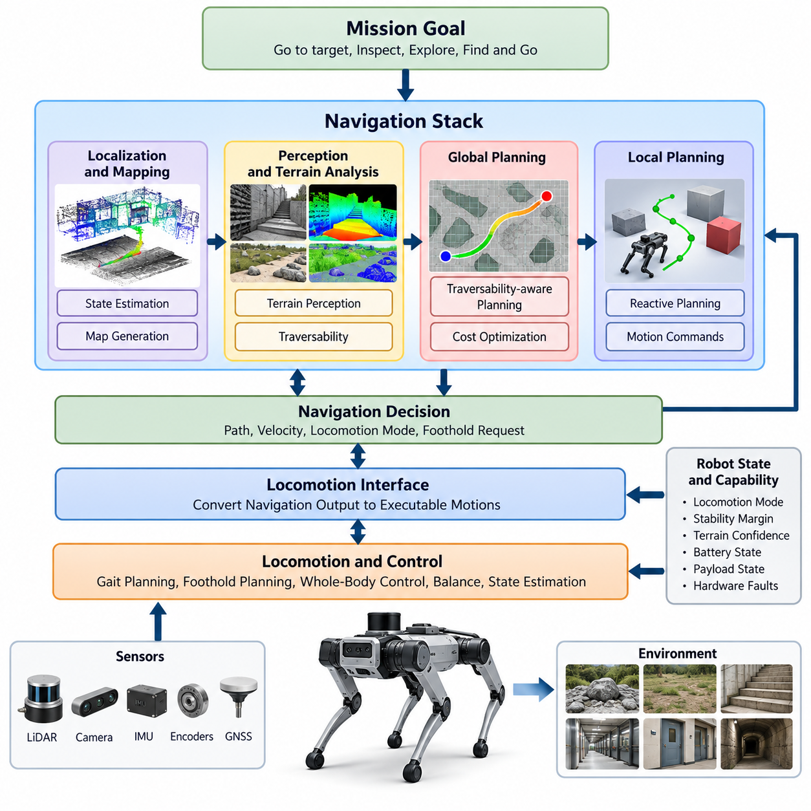
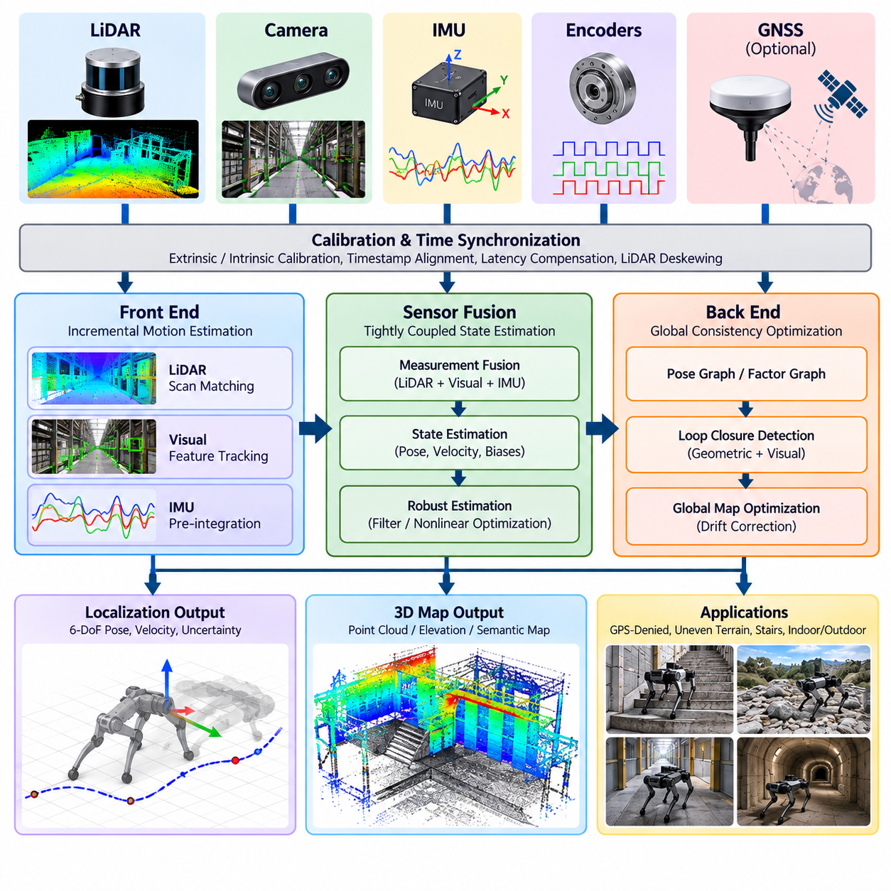
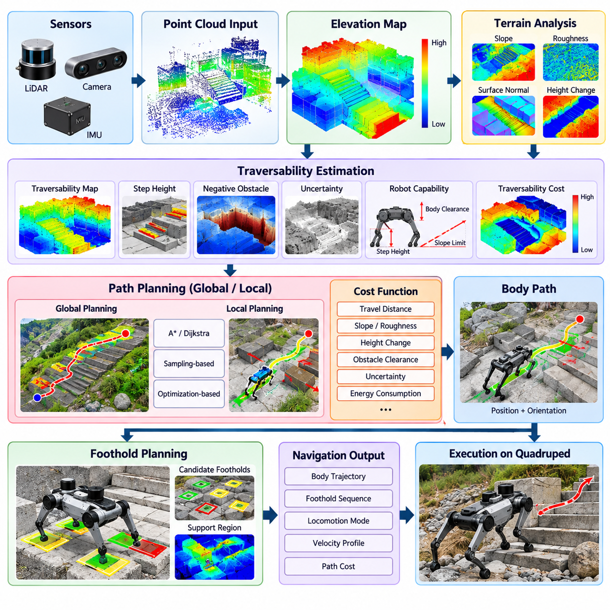
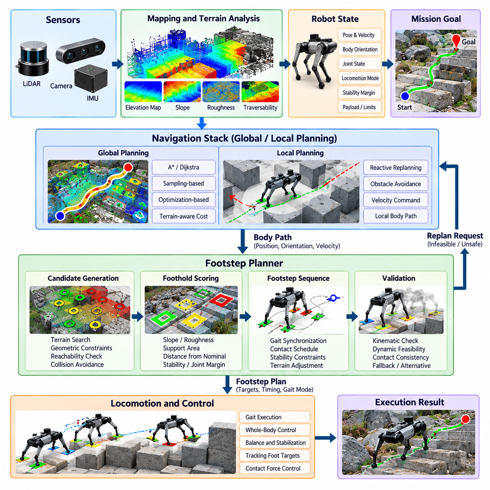
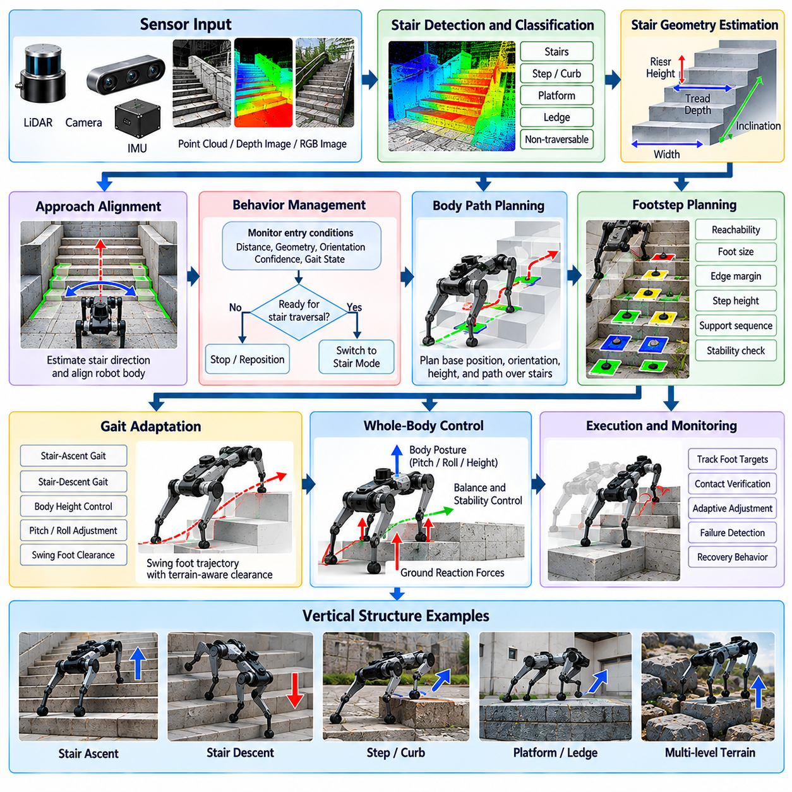
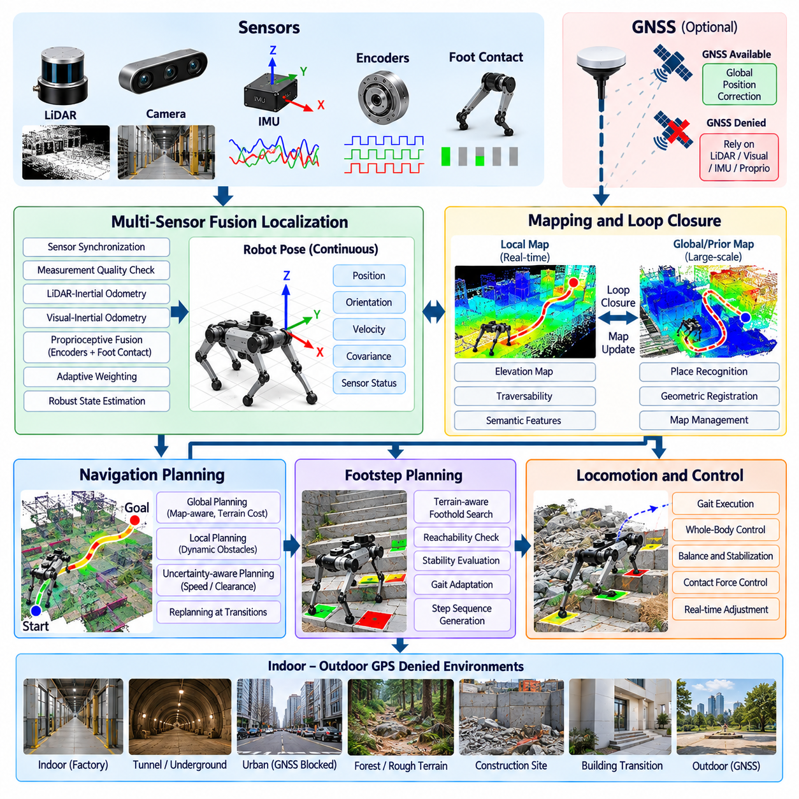
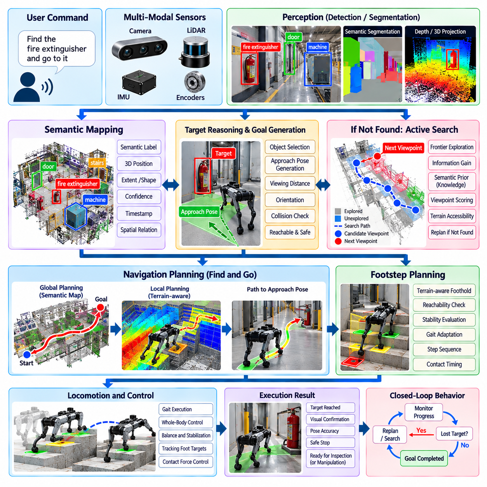
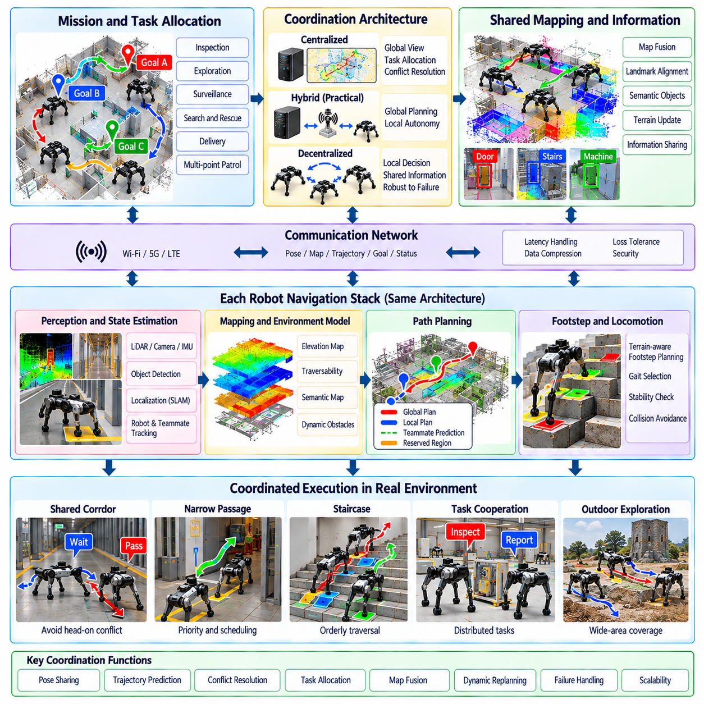
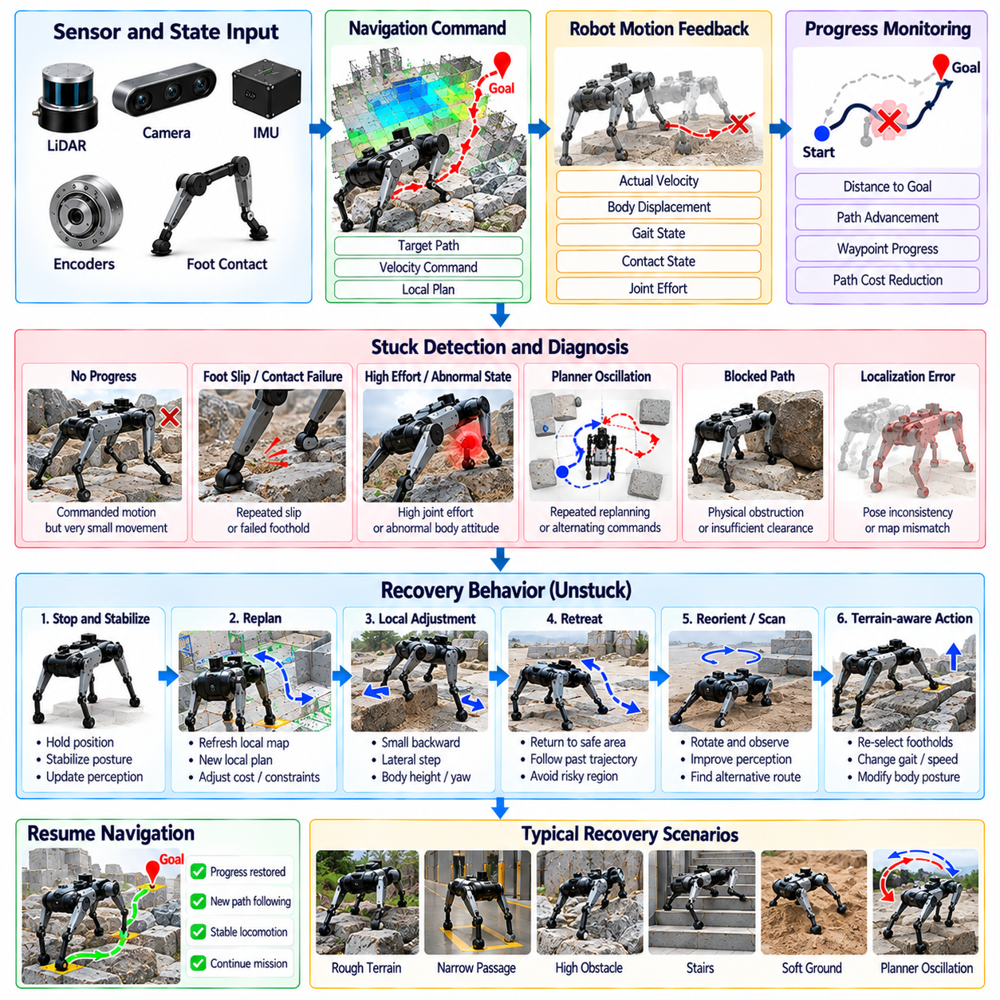
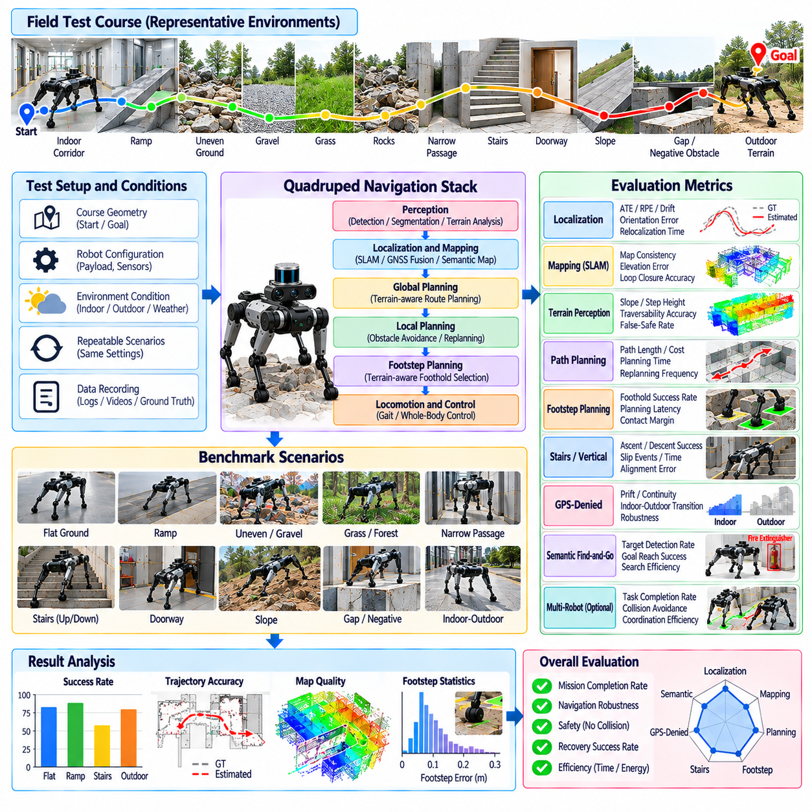

**Volume 21. Quadruped Robot Software**


# Chapter 08. Quadruped Navigation

##  

## 08.01. Quadruped Navigation SW Stack Overview

{width="7.268055555555556in" height="7.268055555555556in"}

A quadruped navigation software stack connects high-level mission objectives with terrain-aware locomotion, allowing the robot to move autonomously through environments that cannot be represented adequately by conventional planar mobile-robot navigation. Within the broader quadruped software architecture, navigation sits above locomotion, balance, whole-body control, and terrain perception while consuming their state and capability information. Volume_21_Quadruped_Robot_Softw...

The navigation stack normally begins with a localization and mapping subsystem that estimates the robot pose relative to a persistent or locally generated map. LiDAR, cameras, IMUs, joint encoders, and sometimes GNSS provide complementary observations. Unlike wheeled robots, quadrupeds experience body oscillation, impacts, large roll and pitch motion, and intermittent foot contacts, requiring navigation localization to remain robust during dynamic locomotion.

Mapping for quadruped navigation must represent more than horizontal occupancy. Three-dimensional geometry, elevation, surface slope, discontinuities, obstacle height, ceiling clearance, and traversability are important because the robot may intentionally walk across terrain that a conventional navigation system would classify as occupied. Elevation maps and local terrain representations therefore provide an interface between geometric perception and locomotion-aware planning.

The perception pipeline continuously transforms raw sensor observations into navigation-relevant environmental information. Point clouds and depth images may be filtered, registered, and fused into occupancy, elevation, or semantic representations. Terrain perception can additionally identify grass, gravel, sand, rocks, negative obstacles, and discrete stepping regions, consistent with the dedicated terrain-processing functions defined elsewhere in the quadruped software structure. Volume_21_Quadruped_Robot_Softw...

Global planning determines a feasible route from the robot\'s current position toward a mission goal. Classical graph search, sampling-based planning, or optimization methods can operate on traversability-aware cost maps rather than simple binary occupancy grids. Terrain slope, roughness, step height, expected foothold quality, clearance, locomotion energy, and safety margins can contribute to the cost function so that the shortest geometric route is not automatically considered the best route.

A local planner converts the global route into commands that remain feasible under current terrain and obstacle conditions. It operates over a shorter horizon and continuously responds to newly detected objects, mapping changes, localization uncertainty, and locomotion constraints. Depending on the architecture, its output may be a desired body velocity, base trajectory, local path segment, locomotion mode request, or a richer sequence of terrain-aware motion objectives.

A defining characteristic of quadruped navigation is the connection between body-level path planning and foot-level motion feasibility. A route may be geometrically collision-free while still being impossible to traverse because suitable footholds do not exist. Navigation therefore exchanges information with foothold and gait planning, allowing terrain difficulty to influence step locations, gait selection, body orientation, velocity limits, and decisions to stop or select an alternative route.

The locomotion interface separates navigation decisions from the high-frequency control mechanisms that physically execute them. Navigation may operate at relatively low planning frequencies, whereas state estimation, model predictive control, whole-body control, and actuator loops operate much faster. This hierarchy prevents computationally expensive mapping or planning operations from interfering with deterministic stabilization and torque control required to keep the quadruped dynamically balanced.

Navigation also depends on explicit robot-state and capability information. The planner should know whether the platform is standing, walking, recovering, climbing, slipping, approaching actuator limits, or experiencing degraded sensing. Locomotion mode, available gait, estimated stability margin, terrain confidence, battery condition, payload state, and hardware faults can therefore modify planning decisions instead of being treated only as low-level diagnostic information.

Stairs and vertical structures illustrate why quadruped navigation requires richer behavior than conventional mobile navigation. A staircase may require detection of its orientation and dimensions, alignment of the robot body, selection of a suitable gait, adjustment of base height, generation of appropriate footholds, and controlled transition back to normal walking. The chapter structure consequently treats stair and vertical-structure navigation as a dedicated navigation capability. Volume_21_Quadruped_Robot_Softw...

GPS-denied operation requires localization to remain reliable across indoor, underground, industrial, and partially outdoor environments. LiDAR-inertial or visual-inertial estimation can provide local motion estimates while SLAM maintains spatial consistency. When GNSS becomes available, global information may be incorporated without allowing abrupt reference-frame corrections to destabilize navigation or locomotion. The resulting architecture should tolerate transitions between localization sources.

Semantic navigation adds meaning to geometric navigation. Instead of receiving only metric coordinates, a quadruped may receive goals such as finding a doorway, inspecting a machine, approaching a valve, or reaching a specified room. Semantic perception associates detected objects and regions with spatial representations, while mission logic converts semantic objectives into navigation goals that can ultimately be executed through the same terrain-aware planning and locomotion interfaces.

Recovery behavior is another first-class component because navigation failures are unavoidable in complex terrain. Progress monitoring can detect conditions such as repeated replanning, excessive tracking error, prolonged zero velocity, foot slip, blocked paths, or localization degradation. Recovery logic can then stop safely, rotate or backtrack, change gait, request remapping, select another route, reposition the body, or escalate the failure to a supervisory mission layer.

Safety supervision should remain independent enough to override nominal navigation commands. Collision risk, excessive terrain slope, insufficient foothold confidence, localization failure, instability, actuator faults, or communication loss may trigger velocity reduction, controlled stopping, posture stabilization, or emergency behavior. Navigation therefore operates as part of a layered safety architecture rather than possessing unrestricted authority over physical motion.

A practical implementation can expose these capabilities through modular ROS 2 components, with asynchronous perception and mapping pipelines connected to planning, behavior management, locomotion, diagnostics, and mission interfaces. The larger software taxonomy explicitly separates ROS 2 middleware, SLAM, perception, navigation, and legged-robot navigation concerns, supporting a modular architecture in which each subsystem can evolve while preserving well-defined interfaces. 08_Robotics_Software_Tree 08_Robotics_Software_Tree

Ultimately, the quadruped navigation stack is best understood as a hierarchical closed-loop system rather than a single path planner. Localization establishes where the robot is, perception describes surrounding geometry and terrain, mapping maintains spatial knowledge, global planning selects a route, local planning adapts motion, locomotion converts commands into dynamically feasible movement, and feedback continuously updates every layer as the physical robot interacts with the environment.

4족 보행 로봇 내비게이션 소프트웨어 스택(Quadruped Navigation Software Stack)은 상위 수준의 임무 목표(Mission Objective)를 지형 인식형 보행(Terrain-Aware Locomotion)과 연결하여, 기존의 평면 이동 로봇 내비게이션만으로는 충분히 표현하기 어려운 환경에서 로봇이 자율적으로 이동할 수 있도록 한다. 전체 4족 보행 로봇 소프트웨어 아키텍처에서 내비게이션(Navigation)은 보행(Locomotion), 균형 제어(Balance Control), 전신 제어(Whole-Body Control), 지형 인식(Terrain Perception)의 상위 계층에 위치하며, 이들로부터 상태와 수행 능력 정보를 전달받는다.

내비게이션 스택(Navigation Stack)은 일반적으로 로봇의 위치와 자세를 지속적으로 유지되거나 국부적으로 생성되는 지도(Map)에 대해 추정하는 위치 추정 및 지도 작성 서브시스템(Localization and Mapping Subsystem)에서 시작한다. 라이다(LiDAR), 카메라(Camera), 관성 측정 장치(IMU), 관절 인코더(Joint Encoder), 경우에 따라 위성 항법 시스템(GNSS)이 상호 보완적인 관측 정보를 제공한다. 4족 보행 로봇은 동적 보행 과정에서 몸체 진동, 충격, 큰 롤(Roll) 및 피치(Pitch) 운동, 간헐적인 발 접촉을 경험하므로 위치 추정은 이러한 조건에서도 강건성을 유지해야 한다.

4족 보행 로봇의 내비게이션을 위한 지도 작성(Mapping)은 단순한 수평 점유 정보 이상의 환경 정보를 표현해야 한다. 로봇이 기존 내비게이션 시스템에서는 장애물로 분류할 수 있는 지형을 의도적으로 통과할 수 있기 때문에 3차원 형상(3D Geometry), 고도(Elevation), 표면 경사(Surface Slope), 불연속 영역(Discontinuity), 장애물 높이(Obstacle Height), 상부 여유 공간(Ceiling Clearance), 주행 가능성(Traversability)이 중요하다. 따라서 고도 지도(Elevation Map)와 국부 지형 표현(Local Terrain Representation)은 기하학적 인식과 보행 인식형 경로 계획을 연결하는 인터페이스 역할을 한다.

인식 파이프라인(Perception Pipeline)은 원시 센서 관측값(Raw Sensor Observation)을 내비게이션에 필요한 환경 정보로 지속적으로 변환한다. 포인트 클라우드(Point Cloud)와 깊이 영상(Depth Image)은 필터링, 정합(Registration), 융합(Fusion) 과정을 거쳐 점유 지도(Occupancy Map), 고도 지도(Elevation Map), 의미론적 표현(Semantic Representation)으로 구성될 수 있다. 지형 인식(Terrain Perception)은 잔디, 자갈, 모래, 암석, 음의 장애물(Negative Obstacle), 불연속적인 발 디딤 영역(Discrete Stepping Region) 등을 추가적으로 식별할 수 있다.

전역 경로 계획(Global Planning)은 로봇의 현재 위치에서 임무 목표 지점까지 이동할 수 있는 실행 가능한 경로를 결정한다. 전통적인 그래프 탐색(Graph Search), 샘플링 기반 경로 계획(Sampling-Based Planning), 최적화 기반 경로 계획(Optimization-Based Planning)은 단순한 이진 점유 격자(Binary Occupancy Grid)가 아니라 주행 가능성을 고려한 비용 지도(Traversability-Aware Cost Map)를 사용할 수 있다. 지형 경사, 거칠기, 단차 높이, 예상 발 디딤 품질, 여유 공간, 보행 에너지, 안전 여유가 비용 함수에 포함되어 기하학적으로 가장 짧은 경로가 반드시 최적 경로로 선택되지 않도록 한다.

국부 경로 계획기(Local Planner)는 전역 경로(Global Route)를 현재의 지형 및 장애물 조건에서 실행 가능한 명령으로 변환한다. 국부 경로 계획기는 비교적 짧은 예측 구간(Horizon)에서 동작하며 새롭게 탐지된 물체, 지도 변화, 위치 추정 불확실성(Localization Uncertainty), 보행 제약 조건에 지속적으로 대응한다. 아키텍처에 따라 출력은 목표 몸체 속도(Desired Body Velocity), 베이스 궤적(Base Trajectory), 국부 경로 구간(Local Path Segment), 보행 모드 요청(Locomotion Mode Request), 또는 보다 풍부한 지형 인식형 이동 목표가 될 수 있다.

4족 보행 로봇 내비게이션의 핵심적인 특징은 몸체 수준 경로 계획(Body-Level Path Planning)과 발 수준 이동 가능성(Foot-Level Motion Feasibility)을 연결한다는 점이다. 어떤 경로가 기하학적으로 충돌이 없더라도 적절한 발 디딤 위치(Foothold)가 존재하지 않으면 실제로 통과할 수 없다. 따라서 내비게이션은 발 디딤 계획(Foothold Planning) 및 보행 패턴 계획(Gait Planning)과 정보를 교환하며, 지형 난이도가 발 위치, 보행 패턴 선택, 몸체 자세, 속도 제한, 정지 또는 대체 경로 선택에 영향을 주도록 해야 한다.

보행 인터페이스(Locomotion Interface)는 내비게이션 의사결정과 이를 실제 물리적 운동으로 실행하는 고주파 제어 메커니즘(High-Frequency Control Mechanism)을 분리한다. 내비게이션은 상대적으로 낮은 계획 주파수에서 동작할 수 있지만 상태 추정(State Estimation), 모델 예측 제어(Model Predictive Control, MPC), 전신 제어(Whole-Body Control, WBC), 액추에이터 제어 루프(Actuator Control Loop)는 훨씬 높은 주파수에서 동작한다. 이러한 계층 구조는 계산량이 많은 지도 작성이나 경로 계획이 로봇의 동적 균형 유지에 필요한 결정론적 안정화 및 토크 제어를 방해하지 않도록 한다.

내비게이션은 명시적인 로봇 상태(Robot State)와 수행 능력 정보(Capability Information)에도 의존한다. 경로 계획기는 플랫폼이 정지 상태인지, 보행 중인지, 복구 동작 중인지, 등반 중인지, 미끄러지고 있는지, 액추에이터 한계에 접근하고 있는지, 또는 센서 성능이 저하된 상태인지를 알아야 한다. 따라서 보행 모드, 사용 가능한 보행 패턴, 추정 안정성 여유(Estimated Stability Margin), 지형 신뢰도, 배터리 상태, 탑재물 상태, 하드웨어 고장 정보가 단순한 저수준 진단 정보에 머무르지 않고 경로 계획 의사결정에 직접 영향을 줄 수 있다.

계단(Stair)과 수직 구조물(Vertical Structure)은 4족 보행 로봇 내비게이션이 기존 이동 로봇 내비게이션보다 복잡한 동작을 필요로 하는 대표적인 사례이다. 계단을 이동하려면 계단의 방향과 치수를 탐지하고, 로봇 몸체를 정렬하며, 적절한 보행 패턴을 선택하고, 베이스 높이를 조절하고, 적합한 발 디딤 위치를 생성한 뒤 일반 보행으로 안정적으로 복귀해야 할 수 있다. 따라서 계단 및 수직 구조물 내비게이션은 독립적인 내비게이션 기능으로 다루어질 필요가 있다.

위성 항법 불가 환경(GPS-Denied Environment)에서는 실내, 지하, 산업 현장 및 부분적인 실외 환경을 이동하는 동안에도 위치 추정이 신뢰성을 유지해야 한다. 라이다-관성 위치 추정(LiDAR-Inertial Estimation) 또는 시각-관성 위치 추정(Visual-Inertial Estimation)은 국부적인 운동 추정을 제공하고, 동시적 위치 추정 및 지도 작성(SLAM)은 공간적 일관성을 유지할 수 있다. 위성 항법 시스템(GNSS)을 사용할 수 있게 되면 전역 위치 정보를 통합하되, 급격한 기준 좌표계 보정이 내비게이션이나 보행을 불안정하게 만들지 않도록 해야 한다.

의미론적 내비게이션(Semantic Navigation)은 기하학적 내비게이션에 환경의 의미를 추가한다. 단순한 좌표값을 목표로 전달받는 대신 4족 보행 로봇은 출입문 찾기, 기계 설비 검사, 밸브 접근, 특정 방으로 이동하기와 같은 목표를 받을 수 있다. 의미론적 인식(Semantic Perception)은 탐지된 물체와 영역을 공간 표현과 연결하고, 임무 로직(Mission Logic)은 의미론적 목표를 내비게이션 목표로 변환하여 최종적으로 동일한 지형 인식형 경로 계획 및 보행 인터페이스를 통해 실행할 수 있도록 한다.

복구 동작(Recovery Behavior) 역시 복잡한 지형에서는 내비게이션 실패를 완전히 제거하기 어렵기 때문에 핵심 구성 요소로 취급되어야 한다. 진행 상태 감시(Progress Monitoring)는 반복적인 재계획, 과도한 경로 추종 오차, 장시간의 정지 속도, 발 미끄러짐, 차단된 경로, 위치 추정 성능 저하 등을 감지할 수 있다. 복구 로직은 안전 정지, 회전 또는 후진, 보행 패턴 변경, 지도 재작성 요청, 대체 경로 선택, 몸체 재배치 또는 상위 임무 계층으로의 실패 보고를 수행할 수 있다.

안전 감독(Safety Supervision)은 정상적인 내비게이션 명령을 필요할 경우 무시하고 개입할 수 있을 정도로 독립성을 유지해야 한다. 충돌 위험, 과도한 지형 경사, 불충분한 발 디딤 신뢰도, 위치 추정 실패, 불안정 상태, 액추에이터 고장, 통신 단절은 속도 감소, 제어된 정지(Controlled Stop), 자세 안정화(Posture Stabilization), 비상 동작(Emergency Behavior)을 유발할 수 있다. 따라서 내비게이션은 물리적 운동에 대한 무제한 권한을 갖는 것이 아니라 계층화된 안전 아키텍처(Layered Safety Architecture)의 일부로 동작한다.

실제 구현에서는 이러한 기능을 모듈형 ROS 2 구성 요소(Modular ROS 2 Component)로 구성할 수 있으며, 비동기 인식 및 지도 작성 파이프라인(Asynchronous Perception and Mapping Pipeline)을 경로 계획, 행동 관리(Behavior Management), 보행, 진단(Diagnostics), 임무 인터페이스(Mission Interface)와 연결할 수 있다. 전체 소프트웨어 구조에서 ROS 2 미들웨어(ROS 2 Middleware), 동시적 위치 추정 및 지도 작성(SLAM), 인식(Perception), 내비게이션(Navigation), 보행 로봇 내비게이션(Legged-Robot Navigation)을 분리함으로써 각 서브시스템이 명확한 인터페이스를 유지하면서 독립적으로 발전할 수 있는 모듈형 아키텍처를 구성할 수 있다.

궁극적으로 4족 보행 로봇 내비게이션 스택(Quadruped Navigation Stack)은 하나의 경로 계획기가 아니라 계층형 폐루프 시스템(Hierarchical Closed-Loop System)으로 이해하는 것이 적절하다. 위치 추정(Localization)은 로봇이 어디에 있는지를 결정하고, 인식(Perception)은 주변의 기하학적 구조와 지형을 설명하며, 지도 작성(Mapping)은 공간 지식을 유지한다. 전역 경로 계획은 이동 경로를 선택하고, 국부 경로 계획은 움직임을 현재 상황에 맞게 조정하며, 보행 시스템은 명령을 동역학적으로 실행 가능한 운동으로 변환한다. 이러한 모든 계층은 실제 로봇이 환경과 상호작용하면서 생성되는 피드백을 통해 지속적으로 갱신된다.

##  

## 08.02. LiDAR Visual SLAM for Quadruped [w/Code]

{width="7.268055555555556in" height="7.268055555555556in"}

LiDAR-visual SLAM for quadruped robots provides continuous localization and three-dimensional environmental mapping while the platform traverses uneven, dynamic, and geometrically complex terrain. Unlike wheeled platforms operating primarily on planar surfaces, quadrupeds generate significant body translation, roll, pitch, vibration, and impact during locomotion. The SLAM system must therefore remain stable despite rapidly changing sensor poses and irregular motion.

LiDAR provides accurate geometric measurements of surrounding surfaces and is particularly valuable in industrial facilities, tunnels, construction sites, forests, and other environments where illumination may vary dramatically. Successive point clouds can be registered to estimate relative motion while simultaneously building a local or global map. Geometric features such as planes, edges, walls, poles, and ground structures provide constraints that reduce accumulated pose uncertainty.

Visual sensing complements LiDAR by capturing appearance, texture, color, and image features that geometric measurements alone cannot represent. Monocular, stereo, or RGB-D cameras may extract keypoints or learned visual features and track them across frames. Visual information becomes especially useful when LiDAR geometry is locally ambiguous, while LiDAR can maintain localization when images suffer from weak texture, illumination changes, motion blur, or partial darkness.

A practical quadruped SLAM architecture normally combines LiDAR and visual measurements with inertial information. The IMU supplies high-frequency angular velocity and linear acceleration measurements between slower LiDAR scans and camera frames. Inertial propagation provides short-term motion prediction, while LiDAR and visual observations periodically correct drift. This complementary relationship forms a tightly coupled state-estimation pipeline suitable for highly dynamic legged motion.

Sensor calibration is fundamental because every observation must be expressed consistently within the robot coordinate system. Extrinsic calibration determines the rigid transformations among LiDAR, cameras, IMU, and robot base frames, while camera intrinsic calibration defines the optical projection model. Small rotational or translational calibration errors can become substantial mapping errors when observations from multiple sensors are fused over long trajectories.

Time synchronization is equally important for a moving quadruped. A LiDAR point, camera exposure, and IMU measurement acquired at different physical times correspond to different robot poses. If timestamps are inaccurate, sensor fusion may interpret temporal displacement as geometric inconsistency. Hardware synchronization, precise timestamping, and compensation for known sensor latency therefore improve registration accuracy, particularly during fast turns, trotting, climbing, or body oscillation.

LiDAR measurements themselves may require motion compensation because a complete scan is collected over a finite interval rather than at one instantaneous pose. During dynamic locomotion, the robot can move significantly within that interval. Deskewing uses estimated motion, commonly derived from IMU integration, to transform individual points toward a common reference time before scan matching. This reduces point-cloud distortion and improves geometric consistency.

The SLAM front end converts synchronized sensor measurements into incremental motion constraints. LiDAR scan matching aligns current geometric observations with previous scans or a local map, while visual tracking estimates camera motion from corresponding image features. Inertial propagation predicts the state between observations. These measurements can be combined through filtering or nonlinear optimization to estimate position, orientation, velocity, and relevant sensor biases.

The back end maintains longer-term consistency by optimizing accumulated pose constraints. Keyframes or selected LiDAR frames become nodes in a pose graph or factor graph, while relative-motion estimates form constraints between them. When the robot revisits a previously observed location, loop-closure detection can introduce an additional constraint that corrects accumulated drift and improves global map consistency without disrupting short-term locomotion control.

Loop closure for a quadruped may use both geometric and visual evidence. Visual place recognition can identify previously observed scenes from image appearance, while LiDAR descriptors or point-cloud registration can verify geometric consistency. Combining the modalities helps reject false matches because visually similar corridors may possess different geometry, while geometrically repetitive industrial structures may contain distinctive visual information useful for place recognition.

Degenerate environments require explicit attention. A long featureless corridor, tunnel, open field, repetitive warehouse aisle, or geometrically sparse area may provide insufficient constraints in one or more directions. Visual texture can compensate for weak LiDAR geometry, while LiDAR can compensate for poor visual conditions. The estimator should monitor observation quality and covariance so downstream navigation knows when localization confidence has degraded.

Quadruped locomotion introduces another useful information source through proprioception. Joint encoders, foot contact estimates, and leg kinematics can provide estimates of base motion relative to supporting feet. Although foot slip and compliant terrain prevent leg odometry from being treated as an absolute reference, it can contribute additional short-term constraints when LiDAR or visual measurements temporarily degrade. Contact confidence should determine how strongly such information influences estimation.

The mapping output required for navigation is often richer than the point-cloud map maintained internally by SLAM. Estimated robot poses can be used to register depth observations into local elevation maps, occupancy representations, or traversability maps. Consequently, SLAM establishes the spatial reference required by the subsequent elevation-map path planning, footstep planning, stair navigation, and GPS-denied navigation functions defined in the quadruped navigation architecture. Volume_21_Quadruped_Robot_Softw...

Coordinate-frame management must clearly separate global mapping, locally continuous odometry, robot base, and individual sensor frames. Global loop-closure corrections may change the estimated relationship between the map and odometry frames, but they should not generate discontinuous commands in the high-frequency locomotion controller. A locally smooth pose estimate can therefore support control while globally optimized estimates maintain long-term navigation consistency.

Real-time implementation requires careful allocation of computational resources. High-rate IMU propagation and local state estimation require low latency, whereas point-cloud registration, visual feature processing, loop detection, and global graph optimization can consume substantial CPU or GPU resources. Processing rates, map resolution, keyframe density, point-cloud size, and optimization frequency should be selected so that SLAM remains responsive without competing excessively with locomotion and whole-body control.

ROS 2 integration can expose LiDAR scans, camera images, IMU measurements, transforms, odometry, maps, diagnostic states, and localization confidence through clearly defined interfaces. The navigation planner consumes the resulting pose and environmental representation, while monitoring components detect sensor loss, estimator divergence, excessive covariance, or timing failures. This modular organization also allows LiDAR, visual, or fusion algorithms to be replaced without redesigning the entire navigation stack.

Robust field deployment requires testing beyond nominal localization accuracy. Evaluation should include rapid gait transitions, sharp turning, stair climbing, vibration, temporary camera occlusion, low illumination, LiDAR degradation, repeated structures, moving objects, sensor timestamp errors, and temporary loss of individual modalities. Useful metrics include trajectory error, relative pose drift, loop-closure reliability, map consistency, computational latency, estimator recovery time, and navigation success.

Ultimately, LiDAR-visual SLAM for a quadruped should be viewed as a resilient multimodal state-estimation foundation rather than merely a mapping algorithm. LiDAR supplies geometric structure, cameras provide complementary visual information, inertial sensing captures rapid motion, and optional proprioceptive constraints reflect physical contact with terrain. Their coordinated fusion provides the stable spatial awareness required for autonomous quadruped navigation across challenging real-world environments.

4족 보행 로봇을 위한 라이다-비전 동시적 위치 추정 및 지도 작성(LiDAR-Visual SLAM)은 로봇이 불균일하고 동적이며 기하학적으로 복잡한 지형을 이동하는 동안 연속적인 위치 추정(Localization)과 3차원 환경 지도 작성(3D Environmental Mapping)을 제공한다. 주로 평면에서 이동하는 바퀴형 플랫폼과 달리 4족 보행 로봇은 이동 과정에서 큰 몸체 병진 운동, 롤(Roll), 피치(Pitch), 진동, 충격을 발생시킨다. 따라서 SLAM 시스템은 빠르게 변화하는 센서 자세와 불규칙한 운동에서도 안정성을 유지해야 한다.

라이다(LiDAR)는 주변 표면의 정확한 기하학적 측정값을 제공하며, 특히 조명 조건이 크게 변할 수 있는 산업 시설, 터널, 건설 현장, 산림 등의 환경에서 유용하다. 연속적인 포인트 클라우드(Point Cloud)를 정합하여 상대 운동을 추정하는 동시에 국부 또는 전역 지도를 구축할 수 있다. 평면, 모서리, 벽, 기둥, 지면 구조와 같은 기하학적 특징(Geometric Feature)은 누적되는 자세 불확실성을 감소시키는 제약 조건을 제공한다.

시각 센싱(Visual Sensing)은 기하학적 측정만으로는 표현하기 어려운 외관, 텍스처(Texture), 색상, 영상 특징(Image Feature)을 획득하여 라이다를 보완한다. 단안(Monocular), 스테레오(Stereo), RGB-D 카메라는 특징점(Keypoint) 또는 학습된 시각 특징(Learned Visual Feature)을 추출하고 프레임 간에 이를 추적할 수 있다. 라이다의 기하학적 정보가 국부적으로 모호할 때 시각 정보가 유용하며, 반대로 영상이 낮은 텍스처, 조명 변화, 모션 블러(Motion Blur), 부분적인 암흑 환경의 영향을 받을 때 라이다가 위치 추정을 유지할 수 있다.

실용적인 4족 보행 로봇 SLAM 아키텍처는 일반적으로 라이다 및 시각 측정값과 관성 정보(Inertial Information)를 결합한다. 관성 측정 장치(IMU)는 상대적으로 느린 라이다 스캔과 카메라 프레임 사이에서 고주파 각속도와 선형 가속도 측정값을 제공한다. 관성 전파(Inertial Propagation)는 단기 운동 예측을 제공하고, 라이다 및 시각 관측은 주기적으로 드리프트(Drift)를 보정한다. 이러한 상호 보완 관계는 동적인 보행 운동에 적합한 긴밀 결합 상태 추정 파이프라인(Tightly Coupled State-Estimation Pipeline)을 형성한다.

센서 보정(Sensor Calibration)은 모든 관측값을 로봇 좌표계 내에서 일관되게 표현해야 하기 때문에 기본적으로 중요하다. 외부 파라미터 보정(Extrinsic Calibration)은 라이다, 카메라, IMU, 로봇 베이스 프레임 사이의 강체 변환(Rigid Transformation)을 결정하며, 카메라 내부 파라미터 보정(Intrinsic Calibration)은 광학 투영 모델(Optical Projection Model)을 정의한다. 작은 회전 또는 병진 보정 오차도 여러 센서의 관측값이 긴 이동 경로에 걸쳐 융합되면 상당한 지도 오차로 확대될 수 있다.

시간 동기화(Time Synchronization)는 움직이는 4족 보행 로봇에서 동일하게 중요하다. 서로 다른 물리적 시점에 획득된 라이다 포인트, 카메라 노출(Camera Exposure), IMU 측정값은 각각 서로 다른 로봇 자세에 대응한다. 타임스탬프(Timestamp)가 부정확하면 센서 융합 시스템은 시간적 변위를 기하학적 불일치로 해석할 수 있다. 따라서 하드웨어 동기화(Hardware Synchronization), 정밀한 타임스탬프, 알려진 센서 지연 보상은 특히 빠른 회전, 트로트(Trot), 등반, 몸체 진동 상황에서 정합 정확도를 향상시킨다.

라이다 측정값은 하나의 완전한 스캔이 단일 순간의 자세에서 획득되는 것이 아니라 일정한 시간 구간에 걸쳐 수집되므로 운동 보상(Motion Compensation)이 필요할 수 있다. 동적 보행 중에는 이 시간 동안 로봇이 상당히 움직일 수 있다. 디스큐잉(Deskewing)은 일반적으로 IMU 적분에서 얻은 추정 운동을 이용하여 개별 포인트를 스캔 정합 이전에 공통 기준 시점으로 변환한다. 이를 통해 포인트 클라우드 왜곡을 감소시키고 기하학적 일관성을 향상시킬 수 있다.

SLAM 프런트엔드(SLAM Front End)는 동기화된 센서 측정값을 증분 운동 제약 조건(Incremental Motion Constraint)으로 변환한다. 라이다 스캔 정합(LiDAR Scan Matching)은 현재의 기하학적 관측을 이전 스캔이나 국부 지도와 정렬하고, 시각 추적(Visual Tracking)은 영상의 대응 특징을 이용하여 카메라 운동을 추정한다. 관성 전파는 관측 사이의 상태를 예측한다. 이러한 측정값은 필터링(Filtering) 또는 비선형 최적화(Nonlinear Optimization)를 통해 결합되어 위치, 자세, 속도 및 관련 센서 바이어스(Sensor Bias)를 추정할 수 있다.

SLAM 백엔드(SLAM Back End)는 누적된 자세 제약 조건을 최적화하여 장기적인 일관성을 유지한다. 키프레임(Keyframe) 또는 선택된 라이다 프레임은 포즈 그래프(Pose Graph)나 팩터 그래프(Factor Graph)의 노드가 되고, 상대 운동 추정값은 노드 사이의 제약 조건을 형성한다. 로봇이 이전에 관측했던 위치를 다시 방문하면 루프 폐쇄 검출(Loop-Closure Detection)이 추가적인 제약 조건을 생성하여 단기 보행 제어를 방해하지 않으면서 누적 드리프트를 보정하고 전역 지도 일관성을 향상시킬 수 있다.

4족 보행 로봇의 루프 폐쇄(Loop Closure)는 기하학적 정보와 시각적 증거를 모두 사용할 수 있다. 시각적 장소 인식(Visual Place Recognition)은 영상의 외관을 이용하여 이전에 관측한 장면을 식별할 수 있으며, 라이다 기술자(LiDAR Descriptor) 또는 포인트 클라우드 정합은 기하학적 일관성을 검증할 수 있다. 두 모달리티(Modality)를 결합하면 시각적으로 유사하지만 형상이 다른 복도나, 기하학적으로 반복적이지만 구별되는 시각 정보를 가진 산업 구조물에서 잘못된 매칭(False Match)을 줄일 수 있다.

퇴화 환경(Degenerate Environment)은 명시적으로 고려해야 한다. 특징이 부족한 긴 복도, 터널, 개방된 공간, 반복적인 창고 통로 또는 기하학적으로 희소한 영역에서는 하나 이상의 방향에 대해 충분한 제약 조건을 얻지 못할 수 있다. 시각 텍스처는 부족한 라이다 기하 정보를 보완하고, 라이다는 열악한 시각 조건을 보완할 수 있다. 추정기(Estimator)는 관측 품질과 공분산(Covariance)을 감시하여 위치 추정 신뢰도가 저하될 경우 하위 내비게이션 시스템이 이를 인지할 수 있도록 해야 한다.

4족 보행 로봇은 고유수용감각(Proprioception)을 통해 또 하나의 유용한 정보원을 제공한다. 관절 인코더(Joint Encoder), 발 접촉 추정(Foot Contact Estimation), 다리 기구학(Leg Kinematics)은 지지하는 발을 기준으로 베이스 운동을 추정하는 데 사용할 수 있다. 발 미끄러짐과 유연한 지형 때문에 다리 오도메트리(Leg Odometry)를 절대적인 기준으로 사용할 수는 없지만, 라이다 또는 시각 측정 성능이 일시적으로 저하될 경우 추가적인 단기 제약 조건을 제공할 수 있다. 접촉 신뢰도(Contact Confidence)에 따라 이러한 정보가 상태 추정에 미치는 가중치를 결정해야 한다.

내비게이션에 필요한 지도 출력은 SLAM 내부에서 유지되는 포인트 클라우드 지도보다 더 풍부한 경우가 많다. 추정된 로봇 자세를 이용하여 깊이 관측값을 국부 고도 지도(Local Elevation Map), 점유 표현(Occupancy Representation), 주행 가능성 지도(Traversability Map)에 정합할 수 있다. 따라서 SLAM은 이후의 고도 지도 기반 경로 계획(Elevation-Map-Based Path Planning), 발 디딤 계획(Footstep Planning), 계단 내비게이션(Stair Navigation), 위성 항법 불가 환경 내비게이션(GPS-Denied Navigation)에 필요한 공간 기준을 제공한다.

좌표 프레임 관리(Coordinate-Frame Management)는 전역 지도(Global Map), 국부적으로 연속적인 오도메트리(Local Odometry), 로봇 베이스(Robot Base), 개별 센서 프레임(Sensor Frame)을 명확하게 분리해야 한다. 전역 루프 폐쇄 보정은 지도 프레임과 오도메트리 프레임 사이의 추정 관계를 변경할 수 있지만, 고주파 보행 제어기에 불연속적인 명령을 발생시켜서는 안 된다. 따라서 국부적으로 부드러운 자세 추정값은 제어에 사용하고, 전역적으로 최적화된 추정값은 장기적인 내비게이션 일관성을 유지하는 데 사용할 수 있다.

실시간 구현(Real-Time Implementation)을 위해서는 계산 자원의 신중한 할당이 필요하다. 고주파 IMU 전파와 국부 상태 추정은 낮은 지연시간(Low Latency)을 요구하는 반면, 포인트 클라우드 정합, 시각 특징 처리, 루프 검출, 전역 그래프 최적화는 상당한 CPU 또는 GPU 자원을 사용할 수 있다. SLAM이 보행 제어 및 전신 제어와 과도하게 계산 자원을 경쟁하지 않으면서 신속하게 응답할 수 있도록 처리 주파수, 지도 해상도, 키프레임 밀도, 포인트 클라우드 크기, 최적화 주기를 적절하게 설정해야 한다.

ROS 2 통합(ROS 2 Integration)은 명확하게 정의된 인터페이스를 통해 라이다 스캔, 카메라 영상, IMU 측정값, 좌표 변환(Transform), 오도메트리(Odometry), 지도, 진단 상태(Diagnostic State), 위치 추정 신뢰도(Localization Confidence)를 제공할 수 있다. 내비게이션 경로 계획기는 생성된 자세와 환경 표현을 사용하고, 모니터링 구성 요소는 센서 손실, 추정기 발산(Estimator Divergence), 과도한 공분산, 시간 동기화 실패를 감지한다. 이러한 모듈형 구성은 전체 내비게이션 스택을 다시 설계하지 않고도 라이다, 비전 또는 센서 융합 알고리즘을 교체할 수 있도록 한다.

강건한 현장 배치(Field Deployment)를 위해서는 정상적인 위치 추정 정확도 이상의 시험이 필요하다. 평가에는 빠른 보행 패턴 전환, 급격한 회전, 계단 등반, 진동, 일시적인 카메라 가림, 저조도, 라이다 성능 저하, 반복적인 구조물, 이동 물체, 센서 타임스탬프 오차, 개별 센서 모달리티의 일시적인 손실 등이 포함되어야 한다. 유용한 평가 지표로는 궤적 오차(Trajectory Error), 상대 자세 드리프트(Relative Pose Drift), 루프 폐쇄 신뢰성, 지도 일관성, 계산 지연시간, 추정기 복구 시간, 내비게이션 성공률 등이 있다.

궁극적으로 4족 보행 로봇을 위한 라이다-비전 동시적 위치 추정 및 지도 작성(LiDAR-Visual SLAM)은 단순한 지도 작성 알고리즘이 아니라 강건한 다중 모달 상태 추정 기반(Resilient Multimodal State-Estimation Foundation)으로 이해해야 한다. 라이다는 기하학적 구조를 제공하고, 카메라는 이를 보완하는 시각 정보를 제공하며, 관성 센싱(Inertial Sensing)은 빠른 운동을 포착하고, 선택적으로 사용되는 고유수용감각 제약(Proprioceptive Constraint)은 지형과의 실제 물리적 접촉을 반영한다. 이러한 정보의 체계적인 융합은 복잡한 실제 환경에서 자율적인 4족 보행 로봇 내비게이션을 수행하는 데 필요한 안정적인 공간 인식(Spatial Awareness)을 제공한다.

##  

## 08.03. Elevation Map Based Path Planning [w/Code]

{width="7.268055555555556in" height="7.268055555555556in"}

Elevation-map-based path planning enables a quadruped robot to reason explicitly about terrain geometry rather than reducing the environment to a two-dimensional occupied-or-free representation. Each cell of an elevation map stores an estimate of surface height and may additionally contain uncertainty, surface normal, slope, roughness, or traversability information. This representation provides the geometric foundation needed to distinguish walkable uneven terrain from genuinely impassable obstacles.

The elevation map is commonly generated from registered LiDAR point clouds, depth-camera measurements, or fused three-dimensional observations using the robot pose supplied by localization or SLAM. Sensor measurements are transformed into a consistent map frame and accumulated into grid cells. Because measurements contain noise and pose uncertainty, practical mapping systems maintain statistical height estimates rather than treating every observed point as exact terrain geometry.

For quadruped navigation, a local elevation map is particularly important because locomotion decisions depend on terrain immediately surrounding the robot. The map can move with the platform while continuously incorporating new observations and removing outdated information. A global representation may guide long-distance navigation, while a higher-resolution local map supports terrain evaluation, body-path refinement, foothold selection, and immediate obstacle avoidance.

Raw elevation alone is insufficient for determining whether terrain can be crossed safely. Terrain-analysis operations derive properties such as slope, surface normal, local height variation, roughness, step height, discontinuity, and available support area. These quantities transform geometric measurements into locomotion-relevant features that describe how difficult a region is for the quadruped rather than simply whether physical material exists there.

Traversability estimation converts terrain features into a measure of movement feasibility. Flat and sufficiently wide surfaces may receive low traversal cost, while steep slopes, highly irregular regions, large height discontinuities, uncertain measurements, or areas near negative obstacles receive progressively larger costs. Regions exceeding the physical capabilities or configured safety limits of the robot can be classified as non-traversable.

The traversability model should reflect the actual morphology and locomotion capability of the platform. Maximum step height, leg workspace, body clearance, allowable roll and pitch, foot size, reachable foothold area, gait capability, and payload condition can all change whether a terrain segment is feasible. Consequently, the same elevation map may produce different traversability costs for different quadrupeds or even for different operating modes of one robot.

Negative obstacles require special handling because missing measurements cannot automatically be interpreted as free space. Ditches, pits, drop-offs, stair edges, and cliff-like boundaries may appear as abrupt decreases in elevation or regions with incomplete observations. The planner should assign conservative costs around such boundaries and preserve uncertainty until sufficient sensor evidence exists, preventing the robot from selecting apparently short routes across unsupported space.

Path planning operates over the resulting elevation and traversability representation by searching for a sequence of robot configurations or body positions connecting the current state to the goal. Graph-search algorithms such as A\* or Dijkstra variants can operate on discretized terrain cells, while sampling-based or optimization-based methods can represent continuous states. The search cost combines travel distance with terrain difficulty rather than minimizing geometric distance alone.

A useful terrain-aware cost function can incorporate slope, roughness, height change, obstacle clearance, uncertainty, predicted energy consumption, and proximity to terrain limits. Weighting these terms allows the planner to express mission-specific preferences. An inspection robot may favor conservative and smooth terrain, while a time-critical mission may accept greater terrain difficulty if the predicted stability and locomotion constraints remain within safe bounds.

Quadruped planning must also consider the orientation and dimensions of the robot body. A narrow passage may contain individually valid footholds but provide insufficient clearance for the trunk. Similarly, traversing a steep side slope may be technically possible but create excessive roll or reduce the available leg workspace. Planning can therefore evaluate candidate base position, yaw, expected roll and pitch, and collision geometry rather than treating the robot as a planar point.

The body path produced from the elevation map should remain connected to foothold feasibility. A candidate route may cross terrain that appears traversable at map resolution while offering no reliable sequence of foot contacts. The planner can therefore use approximate foothold availability, support-region size, or reachable terrain quality as additional costs. More detailed footstep planning can subsequently refine the route and reject segments that cannot produce stable contact sequences.

This relationship creates a hierarchical planning architecture. The elevation-map planner first identifies a terrain-aware body corridor or route at manageable computational cost. A local planner then evaluates the route at higher resolution, and a footstep planner selects feasible contact locations according to leg reachability and gait constraints. The chapter structure explicitly places elevation-map planning before footstep-planner integration, reflecting this progression from terrain-level routing to locomotion execution. Volume_21_Quadruped_Robot_Softw...

Dynamic replanning is necessary because elevation maps evolve as the robot moves. Previously occluded surfaces become visible, vegetation may generate inconsistent measurements, people or machinery may enter the scene, and localization corrections may modify terrain alignment. The planner should therefore update local costs and reconsider affected route segments without unnecessarily recomputing the entire mission path whenever a small environmental change occurs.

Uncertainty should be propagated into planning rather than hidden inside the mapping subsystem. Cells with high height variance, sparse observations, uncertain surface normals, or inconsistent measurements should carry additional traversal cost. This allows the robot to prefer well-observed terrain while still permitting exploration when necessary. The degree of conservatism can be adjusted according to mission risk, sensing quality, and available recovery behaviors.

Planning and locomotion must exchange information bidirectionally. The planner provides desired routes, velocities, body poses, or terrain objectives, while the locomotion layer reports achievable gait modes, velocity limits, stability conditions, slip estimates, and execution failures. If the controller reports repeated slip or inability to realize planned footholds, the navigation layer can increase the corresponding terrain cost and request an alternative route.

Real-time performance requires balancing map resolution and planning complexity. Fine elevation grids preserve small steps and foothold-scale geometry but increase memory use and search time. Coarser maps support faster long-range planning but can hide critical terrain details. Multi-resolution approaches can use coarse global representations for route selection and high-resolution local maps near the robot for precise terrain assessment and locomotion preparation.

ROS 2 implementation can separate elevation mapping, terrain analysis, traversability estimation, global planning, local planning, and locomotion interfaces into modular components. The mapping component publishes terrain layers, while planners consume those layers together with localization and robot capability information. Diagnostic interfaces should expose map age, coverage, uncertainty, planning latency, route validity, and reasons for rejecting terrain so that failures can be analyzed systematically.

Validation should include terrain conditions that expose limitations of both mapping and planning. Representative tests include ramps with increasing slope, isolated steps, stairs, rocks, gravel, narrow passages, uneven ground, ditches, partially observed edges, and transitions between terrain classes. Evaluation can measure path success, traversal time, path length, energy consumption, minimum stability margin, replanning frequency, foothold feasibility, and the rate of unsafe terrain selections.

Ultimately, elevation-map-based path planning transforms three-dimensional terrain perception into navigation decisions that respect the physical capabilities of a quadruped. Instead of asking only whether a location is occupied, the planner asks whether the robot can safely place its body and feet there, how difficult the traversal will be, and whether a better alternative exists. This terrain-centered reasoning forms the bridge between SLAM-based spatial awareness and executable legged locomotion.

고도 지도 기반 경로 계획(Elevation-Map-Based Path Planning)은 환경을 단순한 2차원 점유 또는 자유 공간(Occupied-or-Free) 표현으로 축소하는 대신, 4족 보행 로봇이 지형의 기하학적 구조(Terrain Geometry)를 명시적으로 추론할 수 있도록 한다. 고도 지도의 각 셀(Cell)은 표면 높이 추정값을 저장하며, 추가적으로 불확실성(Uncertainty), 표면 법선(Surface Normal), 경사(Slope), 거칠기(Roughness), 주행 가능성(Traversability) 정보를 포함할 수 있다. 이러한 표현은 보행 가능한 불규칙 지형과 실제 통과 불가능한 장애물을 구분하는 데 필요한 기하학적 기반을 제공한다.

고도 지도(Elevation Map)는 일반적으로 위치 추정(Localization) 또는 동시적 위치 추정 및 지도 작성(SLAM)이 제공하는 로봇 자세를 이용하여 정합된 라이다 포인트 클라우드(LiDAR Point Cloud), 깊이 카메라 측정값(Depth-Camera Measurement), 또는 융합된 3차원 관측값으로 생성된다. 센서 측정값은 일관된 지도 좌표계(Map Frame)로 변환되어 격자 셀에 누적된다. 측정값에는 노이즈와 자세 불확실성이 존재하므로 실제 지도 시스템은 모든 관측점을 정확한 지형 형상으로 간주하기보다 통계적 높이 추정값을 유지한다.

4족 보행 로봇 내비게이션에서는 로봇 주변의 지형이 보행 의사결정에 직접적인 영향을 미치므로 국부 고도 지도(Local Elevation Map)가 특히 중요하다. 지도는 플랫폼과 함께 이동하면서 새로운 관측 정보를 지속적으로 통합하고 오래된 정보를 제거할 수 있다. 전역 표현(Global Representation)은 장거리 내비게이션을 안내하고, 보다 높은 해상도의 국부 지도는 지형 평가, 몸체 경로 정제(Body-Path Refinement), 발 디딤 위치 선택(Foothold Selection), 즉각적인 장애물 회피를 지원한다.

원시 고도 정보(Raw Elevation)만으로는 지형을 안전하게 통과할 수 있는지 판단하기에 충분하지 않다. 지형 분석(Terrain Analysis)은 경사, 표면 법선, 국부 높이 변화(Local Height Variation), 거칠기, 단차 높이(Step Height), 불연속성(Discontinuity), 이용 가능한 지지 영역(Available Support Area)과 같은 속성을 계산한다. 이러한 값은 단순히 물리적인 물체의 존재 여부를 나타내는 기하학적 측정값을 해당 지형이 4족 보행 로봇에게 얼마나 어려운지를 나타내는 보행 관련 특징(Locomotion-Relevant Feature)으로 변환한다.

주행 가능성 추정(Traversability Estimation)은 지형 특징을 이동 가능성의 척도로 변환한다. 평탄하고 충분히 넓은 표면에는 낮은 주행 비용(Traversal Cost)을 부여할 수 있으며, 가파른 경사, 매우 불규칙한 영역, 큰 높이 불연속, 불확실한 측정 영역, 음의 장애물(Negative Obstacle)에 가까운 영역에는 점차 높은 비용을 부여할 수 있다. 로봇의 물리적 능력 또는 설정된 안전 한계를 초과하는 영역은 주행 불가능(Non-Traversable) 영역으로 분류할 수 있다.

주행 가능성 모델(Traversability Model)은 실제 플랫폼의 형태학적 특성(Morphology)과 보행 능력을 반영해야 한다. 최대 단차 높이, 다리 작업 공간(Leg Workspace), 몸체 여유 공간(Body Clearance), 허용 가능한 롤(Roll) 및 피치(Pitch), 발 크기, 도달 가능한 발 디딤 영역, 보행 패턴 능력(Gait Capability), 탑재물 상태(Payload Condition)는 모두 특정 지형 구간의 이동 가능 여부를 변화시킬 수 있다. 따라서 동일한 고도 지도도 서로 다른 4족 보행 로봇 또는 동일한 로봇의 서로 다른 운용 모드에 따라 다른 주행 비용을 생성할 수 있다.

음의 장애물(Negative Obstacle)은 측정값이 없는 영역을 자동으로 자유 공간으로 해석할 수 없기 때문에 별도의 처리가 필요하다. 도랑, 구덩이, 낭떠러지, 계단 가장자리, 절벽 형태의 경계는 급격한 고도 감소 또는 관측 정보가 불완전한 영역으로 나타날 수 있다. 경로 계획기는 이러한 경계 주변에 보수적인 비용을 부여하고 충분한 센서 증거가 확보될 때까지 불확실성을 유지함으로써 로봇이 지지되지 않는 공간을 가로지르는 짧은 경로를 선택하는 것을 방지해야 한다.

경로 계획(Path Planning)은 생성된 고도 및 주행 가능성 표현을 기반으로 현재 상태에서 목표까지 연결되는 로봇 구성 또는 몸체 위치의 연속적인 경로를 탐색한다. A\*(A-Star) 또는 다익스트라(Dijkstra) 계열과 같은 그래프 탐색 알고리즘(Graph-Search Algorithm)은 이산화된 지형 셀에서 동작할 수 있으며, 샘플링 기반 또는 최적화 기반 방법은 연속 상태(Continuous State)를 표현할 수 있다. 탐색 비용은 단순한 기하학적 거리만 최소화하는 것이 아니라 이동 거리와 지형 난이도를 함께 고려한다.

효과적인 지형 인식형 비용 함수(Terrain-Aware Cost Function)는 경사, 거칠기, 높이 변화, 장애물 여유 거리(Obstacle Clearance), 불확실성, 예상 에너지 소비량, 지형 한계에 대한 근접도를 포함할 수 있다. 이러한 항목의 가중치를 조절하면 임무별 선호도를 표현할 수 있다. 검사 로봇은 보수적이고 평탄한 지형을 선호할 수 있는 반면, 시간 제약이 중요한 임무에서는 예상 안정성과 보행 제약 조건이 안전 범위 내에 있는 경우 더 어려운 지형을 허용할 수 있다.

4족 보행 로봇의 경로 계획은 로봇 몸체의 방향과 크기도 고려해야 한다. 좁은 통로에 개별적으로 유효한 발 디딤 위치가 존재하더라도 몸통(Trunk)이 통과하기 위한 충분한 여유 공간이 없을 수 있다. 마찬가지로 가파른 횡경사(Side Slope)를 통과하는 것이 기술적으로 가능하더라도 과도한 롤을 발생시키거나 이용 가능한 다리 작업 공간을 감소시킬 수 있다. 따라서 로봇을 평면상의 점으로 취급하는 대신 후보 베이스 위치, 요(Yaw), 예상 롤 및 피치, 충돌 형상(Collision Geometry)을 평가할 수 있다.

고도 지도에서 생성된 몸체 경로(Body Path)는 발 디딤 가능성(Foothold Feasibility)과 연결되어야 한다. 후보 경로가 지도 해상도 수준에서는 통과 가능한 지형을 지나더라도 안정적인 발 접촉 순서를 제공하지 못할 수 있다. 따라서 경로 계획기는 대략적인 발 디딤 가능 영역, 지지 영역의 크기, 도달 가능한 지형 품질을 추가 비용으로 사용할 수 있다. 이후 보다 상세한 발걸음 계획(Footstep Planning)이 경로를 정제하고 안정적인 접촉 순서를 생성할 수 없는 구간을 제거할 수 있다.

이러한 관계는 계층형 경로 계획 아키텍처(Hierarchical Planning Architecture)를 형성한다. 고도 지도 경로 계획기는 먼저 관리 가능한 계산 비용으로 지형을 고려한 몸체 이동 통로 또는 경로를 식별한다. 이후 국부 경로 계획기(Local Planner)가 더 높은 해상도로 경로를 평가하고, 발걸음 계획기(Footstep Planner)는 다리 도달 가능성(Leg Reachability)과 보행 패턴 제약 조건에 따라 실행 가능한 접촉 위치를 선택한다. 이 과정은 지형 수준의 경로 설정에서 실제 보행 실행으로 점진적으로 구체화되는 구조를 형성한다.

로봇이 이동하면서 고도 지도가 지속적으로 변화하므로 동적 재계획(Dynamic Replanning)이 필요하다. 이전에 가려졌던 표면이 새롭게 관측되고, 식생은 일관되지 않은 측정값을 생성할 수 있으며, 사람이나 기계가 환경에 진입할 수 있고, 위치 추정 보정이 지형 정렬을 변경할 수도 있다. 따라서 경로 계획기는 작은 환경 변화가 발생할 때마다 전체 임무 경로를 불필요하게 다시 계산하지 않으면서 국부 비용을 갱신하고 영향을 받는 경로 구간을 재검토해야 한다.

불확실성(Uncertainty)은 지도 작성 서브시스템 내부에 숨기기보다 경로 계획 단계까지 전달되어야 한다. 높은 높이 분산(Height Variance), 희소한 관측값, 불확실한 표면 법선, 일관되지 않은 측정값을 가진 셀에는 추가적인 주행 비용을 부여해야 한다. 이를 통해 로봇은 충분히 관측된 지형을 우선적으로 선택하면서 필요한 경우 탐색(Exploration)도 수행할 수 있다. 보수성의 정도는 임무 위험도, 센싱 품질, 사용 가능한 복구 동작(Recovery Behavior)에 따라 조정할 수 있다.

경로 계획과 보행 시스템은 정보를 양방향으로 교환해야 한다. 경로 계획기는 목표 경로, 속도, 몸체 자세 또는 지형 목표를 제공하고, 보행 계층은 실행 가능한 보행 모드, 속도 제한, 안정성 상태, 미끄러짐 추정(Slip Estimation), 실행 실패 정보를 반환한다. 제어기가 반복적인 미끄러짐이나 계획된 발 디딤 위치를 실현할 수 없다고 보고하면 내비게이션 계층은 해당 지형의 비용을 증가시키고 대체 경로를 요청할 수 있다.

실시간 성능(Real-Time Performance)을 확보하려면 지도 해상도와 경로 계획 복잡성 사이의 균형이 필요하다. 세밀한 고도 격자는 작은 단차와 발 크기 수준의 지형 형상을 보존하지만 메모리 사용량과 탐색 시간을 증가시킨다. 반대로 거친 지도는 빠른 장거리 경로 계획을 지원하지만 중요한 지형 세부 정보를 감출 수 있다. 다중 해상도 접근법(Multi-Resolution Approach)은 전역 경로 선택에는 낮은 해상도 표현을 사용하고, 로봇 주변의 정밀한 지형 평가와 보행 준비에는 고해상도 국부 지도를 사용할 수 있다.

ROS 2 구현(ROS 2 Implementation)에서는 고도 지도 작성, 지형 분석, 주행 가능성 추정, 전역 경로 계획, 국부 경로 계획, 보행 인터페이스를 각각 모듈형 구성 요소(Modular Component)로 분리할 수 있다. 지도 작성 구성 요소는 지형 계층(Terrain Layer)을 발행하고, 경로 계획기는 위치 추정 정보 및 로봇 수행 능력 정보와 함께 이러한 계층을 사용한다. 진단 인터페이스는 지도 갱신 시간, 관측 범위, 불확실성, 경로 계획 지연시간, 경로 유효성, 지형 거부 원인을 제공하여 실패 원인을 체계적으로 분석할 수 있도록 해야 한다.

검증(Validation)은 지도 작성과 경로 계획의 한계를 모두 드러낼 수 있는 다양한 지형 조건을 포함해야 한다. 대표적인 시험에는 점차 경사가 증가하는 경사로, 독립적인 단차, 계단, 암석, 자갈, 좁은 통로, 불규칙 지면, 도랑, 부분적으로 관측된 가장자리, 서로 다른 지형 종류 사이의 전환 구간 등이 포함된다. 평가는 경로 성공률, 이동 시간, 경로 길이, 에너지 소비량, 최소 안정성 여유(Minimum Stability Margin), 재계획 빈도, 발 디딤 가능성, 위험 지형 선택 비율 등을 측정할 수 있다.

궁극적으로 고도 지도 기반 경로 계획(Elevation-Map-Based Path Planning)은 3차원 지형 인식 정보를 4족 보행 로봇의 물리적 능력을 고려한 내비게이션 의사결정으로 변환한다. 경로 계획기는 단순히 특정 위치가 점유되어 있는지를 판단하는 것이 아니라 로봇이 해당 위치에 몸체와 발을 안전하게 배치할 수 있는지, 그 지형을 통과하는 것이 얼마나 어려운지, 그리고 더 적합한 대체 경로가 존재하는지를 판단한다. 이러한 지형 중심 추론(Terrain-Centered Reasoning)은 SLAM 기반 공간 인식과 실제 실행 가능한 보행 운동을 연결하는 핵심적인 가교 역할을 한다.

##  

## 08.04. Footstep Planner Integration with Nav Stack [w/Code]

{width="7.268055555555556in" height="7.268055555555556in"}

Footstep planner integration connects terrain-level navigation with the discrete contact decisions required for quadruped locomotion. A conventional navigation planner may generate a collision-free body path, but this does not guarantee that each leg can establish stable contact with the terrain. The footstep planner therefore converts navigation objectives into feasible foothold sequences while respecting robot geometry, leg reachability, terrain properties, gait timing, and stability constraints.

The navigation stack typically supplies a global or local body path together with desired motion direction, velocity, and goal information. The footstep planner receives this information along with elevation maps, traversability layers, robot state estimates, and locomotion status. Rather than independently selecting a completely different route, it refines the navigation solution at the contact level and determines whether the proposed body motion can actually be supported by a physically realizable sequence of footsteps.

Terrain information is fundamental to this process. Elevation maps describe surface height and local geometry, while derived layers may represent slope, roughness, surface normal, uncertainty, obstacle distance, and traversability. The planner searches these representations for candidate footholds that provide sufficient contact area and acceptable orientation. Regions near cliffs, holes, sharp discontinuities, unstable surfaces, or uncertain measurements can be rejected or assigned high placement costs.

Each candidate foothold must also satisfy kinematic reachability. A geometrically attractive terrain patch may be unusable if the corresponding leg cannot reach it without approaching joint limits or producing an unfavorable body configuration. The planner therefore evaluates candidate foot positions relative to the hip and expected base pose. Reachability regions can be approximated geometrically or evaluated using inverse kinematics, depending on available computational resources and required planning accuracy.

Gait structure imposes temporal and combinatorial constraints on footstep planning. During a trot, diagonal leg pairs alternate between stance and swing phases, while walking, crawling, bounding, or other gaits produce different contact schedules. The planner cannot select footholds independently for each leg because future placements depend on which feet remain in contact and how the body moves between support configurations. Footstep planning must therefore remain synchronized with the active gait generator.

Stability constraints further restrict feasible contact sequences. Candidate footsteps should maintain sufficient support for the predicted center-of-mass motion and avoid configurations that demand excessive ground reaction forces or body orientation changes. Static criteria may be useful during slow walking, whereas dynamic locomotion requires consideration of momentum, contact forces, capture behavior, or predictions supplied by model predictive control. The required fidelity depends on the locomotion regime.

A practical architecture often separates nominal foothold generation from terrain-aware adjustment. The gait controller first predicts a nominal landing location based on commanded velocity, body motion, gait phase, and expected stance duration. The footstep planner then searches around that location for a better terrain contact. This preserves the intended locomotion behavior while allowing individual steps to move away from rocks, gaps, edges, steep patches, or other undesirable regions.

Foothold scoring can combine several objectives rather than selecting the nearest valid cell. Candidate locations may be evaluated according to distance from the nominal foothold, local slope, roughness, support area, surface uncertainty, collision clearance, leg extension, joint margin, expected stability, and consistency with future steps. Weighted costs allow the system to trade tracking accuracy against terrain safety without unnecessarily disturbing the gait whenever the nominal location is already suitable.

The relationship between body-path planning and footstep planning should be bidirectional. If feasible footsteps can be found along the navigation path, the planner returns contact targets to the locomotion system. If repeated search fails because terrain is unreachable, too narrow, excessively steep, or poorly observed, the failure should propagate upward. The navigation layer can then modify the local body path, reduce velocity, select another corridor, or request additional perception instead of forcing an infeasible motion.

This interaction is especially important in discrete terrain. Stepping stones, rubble, stairs, beams, narrow platforms, and large gaps cannot always be represented adequately by a smooth traversability cost. The planner may need to reason explicitly about individual support regions and sequences of contacts. In such cases, navigation determines the broader route through the environment, while footstep planning determines the precise physical contacts that make traversal of that route possible.

Footstep planning can be formulated as graph search, optimization, sampling, or combinations of these methods. A search state may encode body pose, active support configuration, gait phase, and selected foot locations. Successor states represent possible future contacts that satisfy terrain and kinematic constraints. Because exhaustive search can become computationally expensive, practical systems use restricted candidate sets, motion primitives, heuristics, short planning horizons, or hierarchical planning.

Receding-horizon operation allows the planner to remain responsive to new terrain observations. Rather than fixing a long sequence of footsteps far in advance, the system plans several upcoming contacts and repeatedly updates them as the robot moves. Near-term footsteps can become committed once the swing motion begins, while later footsteps remain adjustable. This approach limits computational complexity and accommodates mapping changes, localization corrections, disturbances, and execution errors.

The interface with swing-leg control must clearly define when a planned foothold becomes executable. Once a target is accepted, the swing trajectory generator creates a collision-free foot path from lift-off to touchdown while providing sufficient terrain clearance. Late replanning should be limited because abrupt changes in landing position can demand unrealistic swing velocity or acceleration. The planner therefore requires commitment rules that account for remaining swing time and actuator capability.

Contact execution also provides valuable feedback. Touchdown may occur earlier or later than expected because elevation estimates are imperfect, and the foot may slip after contact on loose or inclined terrain. Contact sensors, joint torque estimates, IMU measurements, and state estimation can detect such discrepancies. The resulting information can update terrain confidence, modify subsequent footholds, or trigger gait adaptation and recovery behavior when the original contact plan becomes unreliable.

Integration with whole-body control ensures that planned contacts can be translated into dynamically consistent robot motion. The whole-body controller distributes forces across stance legs, tracks desired body motion, and controls swing legs toward their targets while respecting torque, friction, and kinematic constraints. If required forces or joint commands become infeasible, this information should be returned to the planning layer so that future footholds or body trajectories can be modified.

The navigation software structure places footstep-planner integration directly after elevation-map-based path planning and before specialized stair and GPS-denied navigation functions. This ordering reflects the hierarchical relationship between spatial mapping, terrain-aware route generation, contact-level planning, and locomotion execution within the quadruped navigation stack. Volume_21_Quadruped_Robot_Softw...

ROS 2 integration can separate navigation planning, elevation mapping, footstep planning, gait generation, state estimation, and whole-body control into components with explicit interfaces. Messages can contain body-path segments, gait states, foothold candidates, selected contacts, terrain confidence, planning status, and failure reasons. Lifecycle and diagnostic mechanisms should ensure that invalid maps, stale state estimates, or unavailable controllers cannot silently produce unsafe foot commands.

Real-time performance requires limiting both terrain-search complexity and communication latency. High-resolution terrain data may contain thousands of possible contact cells, but only a small region around each predicted landing location is usually relevant. Parallel candidate evaluation, precomputed reachability maps, efficient terrain queries, and bounded optimization iterations can keep planning latency predictable while preserving sufficient terrain awareness for dynamic walking.

Validation should measure more than whether the robot reaches its destination. Tests should evaluate foothold success rate, planning latency, minimum contact margin, joint-limit margin, slip frequency, rejected footholds, replanning frequency, body-path deviation, and recovery events. Representative terrain should include isolated blocks, stairs, gaps, irregular rocks, slopes, narrow support regions, partially observed surfaces, and transitions between continuous and discrete terrain.

Ultimately, footstep planner integration provides the critical bridge between where a quadruped intends to travel and where its feet can physically land. Navigation supplies spatial intent, terrain perception describes possible support surfaces, the footstep planner selects feasible contacts, and locomotion and whole-body control execute them. Continuous feedback between these layers transforms an abstract route through the environment into a sequence of stable, terrain-aware physical interactions.

발걸음 계획기 통합(Footstep Planner Integration)은 지형 수준의 내비게이션(Terrain-Level Navigation)과 4족 보행(Quadruped Locomotion)에 필요한 이산적인 접촉 의사결정(Discrete Contact Decision)을 연결한다. 기존 내비게이션 경로 계획기는 충돌이 없는 몸체 경로(Body Path)를 생성할 수 있지만, 이것만으로 각 다리가 지형과 안정적인 접촉을 형성할 수 있다고 보장할 수는 없다. 따라서 발걸음 계획기(Footstep Planner)는 로봇 형상, 다리 도달 가능성(Leg Reachability), 지형 특성, 보행 타이밍(Gait Timing), 안정성 제약 조건을 고려하여 내비게이션 목표를 실행 가능한 발 디딤 순서(Foothold Sequence)로 변환한다.

내비게이션 스택(Navigation Stack)은 일반적으로 목표 이동 방향, 속도, 목표 정보와 함께 전역 또는 국부 몸체 경로(Global or Local Body Path)를 제공한다. 발걸음 계획기는 이 정보와 함께 고도 지도(Elevation Map), 주행 가능성 계층(Traversability Layer), 로봇 상태 추정값(Robot State Estimate), 보행 상태(Locomotion Status)를 전달받는다. 발걸음 계획기는 완전히 다른 경로를 독립적으로 선택하기보다 접촉 수준(Contact Level)에서 내비게이션 해를 정제하고, 제안된 몸체 운동이 물리적으로 실현 가능한 발걸음 순서에 의해 실제로 지지될 수 있는지를 판단한다.

지형 정보(Terrain Information)는 이러한 과정의 핵심적인 기반이다. 고도 지도는 표면 높이와 국부 형상을 표현하며, 파생 계층(Derived Layer)은 경사, 거칠기, 표면 법선(Surface Normal), 불확실성(Uncertainty), 장애물 거리, 주행 가능성을 나타낼 수 있다. 계획기는 이러한 표현에서 충분한 접촉 면적과 적절한 방향을 제공하는 후보 발 디딤 위치(Candidate Foothold)를 탐색한다. 절벽, 구멍, 급격한 불연속 영역, 불안정한 표면, 불확실한 측정 영역에 가까운 위치는 제외하거나 높은 배치 비용(Placement Cost)을 부여할 수 있다.

각 후보 발 디딤 위치는 기구학적 도달 가능성(Kinematic Reachability)도 만족해야 한다. 기하학적으로 적합한 지형 영역이라도 해당 다리가 관절 한계(Joint Limit)에 접근하거나 불리한 몸체 자세를 만들지 않고 도달할 수 없다면 사용할 수 없다. 따라서 계획기는 예상 베이스 자세(Expected Base Pose)와 엉덩이 관절(Hip)을 기준으로 후보 발 위치를 평가한다. 도달 가능 영역(Reachability Region)은 사용 가능한 계산 자원과 필요한 계획 정확도에 따라 기하학적으로 근사하거나 역기구학(Inverse Kinematics)을 이용하여 평가할 수 있다.

보행 구조(Gait Structure)는 발걸음 계획에 시간적 및 조합적 제약 조건(Temporal and Combinatorial Constraint)을 부여한다. 트로트(Trot)에서는 대각선 방향의 다리 쌍이 지지 단계(Stance Phase)와 스윙 단계(Swing Phase)를 교대로 수행하는 반면, 워킹(Walking), 크롤링(Crawling), 바운딩(Bounding) 등의 보행 패턴은 서로 다른 접촉 일정(Contact Schedule)을 생성한다. 미래의 발 배치는 어떤 발이 지면과 접촉을 유지하는지와 몸체가 지지 구성 사이에서 어떻게 움직이는지에 따라 달라지므로 각 다리의 발 디딤 위치를 독립적으로 선택할 수 없다. 따라서 발걸음 계획은 활성화된 보행 생성기(Gait Generator)와 동기화되어야 한다.

안정성 제약 조건(Stability Constraint)은 실행 가능한 접촉 순서를 더욱 제한한다. 후보 발걸음은 예측된 질량 중심 운동(Center-of-Mass Motion)을 충분히 지지하고 과도한 지면 반력(Ground Reaction Force)이나 몸체 자세 변화를 요구하는 구성을 피해야 한다. 저속 보행에서는 정적 안정성 기준(Static Stability Criterion)이 유용할 수 있지만, 동적 보행에서는 운동량(Momentum), 접촉력(Contact Force), 캡처 동작(Capture Behavior), 모델 예측 제어(Model Predictive Control)가 제공하는 예측값 등을 고려해야 한다. 필요한 모델의 정밀도는 보행 운용 영역(Locomotion Regime)에 따라 달라진다.

실용적인 아키텍처는 일반적으로 명목 발 디딤 위치 생성(Nominal Foothold Generation)과 지형 인식형 보정(Terrain-Aware Adjustment)을 분리한다. 보행 제어기(Gait Controller)는 명령 속도, 몸체 운동, 보행 위상(Gait Phase), 예상 지지 시간을 기반으로 명목 착지 위치(Nominal Landing Location)를 먼저 예측한다. 이후 발걸음 계획기는 그 주변에서 더 적합한 지형 접촉 위치를 탐색한다. 이를 통해 의도된 보행 특성을 유지하면서 각각의 발걸음을 암석, 틈, 가장자리, 급경사 영역 등의 부적합한 위치에서 벗어나도록 조정할 수 있다.

발 디딤 위치 평가(Foothold Scoring)는 가장 가까운 유효 셀만을 선택하는 대신 여러 목표를 함께 고려할 수 있다. 후보 위치는 명목 발 디딤 위치와의 거리, 국부 경사, 거칠기, 지지 면적, 표면 불확실성, 충돌 여유 거리(Collision Clearance), 다리 신장량(Leg Extension), 관절 여유(Joint Margin), 예상 안정성, 미래 발걸음과의 일관성을 기준으로 평가할 수 있다. 가중 비용(Weighted Cost)을 사용하면 명목 위치가 이미 적합한 경우 보행을 불필요하게 변경하지 않으면서 경로 추종 정확도와 지형 안전성 사이의 균형을 조절할 수 있다.

몸체 경로 계획(Body-Path Planning)과 발걸음 계획(Footstep Planning)의 관계는 양방향이어야 한다. 내비게이션 경로를 따라 실행 가능한 발걸음을 찾을 수 있으면 계획기는 접촉 목표(Contact Target)를 보행 시스템에 전달한다. 반대로 지형이 도달 불가능하거나 지나치게 좁고, 너무 가파르거나, 충분히 관측되지 않아 반복적으로 탐색에 실패하면 이 실패 정보가 상위 계층으로 전달되어야 한다. 내비게이션 계층은 실행 불가능한 운동을 강제하는 대신 국부 몸체 경로를 수정하거나 속도를 줄이고, 다른 이동 통로를 선택하거나 추가적인 환경 인식을 요청할 수 있다.

이러한 상호작용은 불연속 지형(Discrete Terrain)에서 특히 중요하다. 디딤돌(Stepping Stone), 잔해(Rubble), 계단, 보(Beam), 좁은 플랫폼, 큰 간격(Gap)은 연속적인 주행 가능성 비용만으로 충분히 표현하기 어려울 수 있다. 이러한 경우 계획기는 개별 지지 영역(Support Region)과 접촉 순서를 명시적으로 추론해야 한다. 내비게이션은 환경을 통과하는 전체적인 경로를 결정하고, 발걸음 계획은 해당 경로를 실제로 통과할 수 있도록 만드는 정확한 물리적 접촉 위치를 결정한다.

발걸음 계획은 그래프 탐색(Graph Search), 최적화(Optimization), 샘플링(Sampling), 또는 이들을 결합한 방법으로 구성할 수 있다. 탐색 상태(Search State)는 몸체 자세, 현재 지지 구성(Support Configuration), 보행 위상, 선택된 발 위치를 포함할 수 있다. 후속 상태(Successor State)는 지형 및 기구학적 제약을 만족하는 미래 접촉 위치를 나타낸다. 완전 탐색은 계산량이 매우 커질 수 있으므로 실제 시스템에서는 제한된 후보 집합, 모션 프리미티브(Motion Primitive), 휴리스틱(Heuristic), 짧은 계획 구간(Planning Horizon), 계층형 계획(Hierarchical Planning)을 사용한다.

이동 지평선 방식(Receding-Horizon Operation)을 사용하면 계획기가 새로운 지형 관측에 지속적으로 대응할 수 있다. 먼 미래의 긴 발걸음 순서를 미리 고정하는 대신 앞으로 수행할 몇 개의 접촉을 계획하고 로봇이 이동하면서 이를 반복적으로 갱신한다. 가까운 시점의 발걸음은 스윙 운동이 시작되면 확정할 수 있으며, 이후의 발걸음은 계속 조정 가능한 상태로 유지할 수 있다. 이러한 접근법은 계산 복잡도를 제한하면서 지도 변화, 위치 추정 보정, 외란(Disturbance), 실행 오차에 대응할 수 있도록 한다.

스윙 다리 제어(Swing-Leg Control)와의 인터페이스는 계획된 발 디딤 위치가 언제 실행 가능한 상태로 확정되는지를 명확하게 정의해야 한다. 목표가 승인되면 스윙 궤적 생성기(Swing Trajectory Generator)는 이륙(Lift-Off)부터 착지(Touchdown)까지 충분한 지형 여유를 확보하는 충돌 없는 발 궤적을 생성한다. 착지 위치가 늦게 변경되면 비현실적으로 높은 스윙 속도나 가속도가 요구될 수 있으므로 늦은 시점의 재계획은 제한해야 한다. 따라서 계획기는 남은 스윙 시간과 액추에이터 성능을 고려하는 확정 규칙(Commitment Rule)을 필요로 한다.

접촉 실행(Contact Execution)은 또한 중요한 피드백 정보를 제공한다. 고도 추정값이 완벽하지 않기 때문에 착지가 예상보다 빠르거나 늦게 발생할 수 있으며, 느슨하거나 경사진 지형에서는 접촉 이후 발이 미끄러질 수도 있다. 접촉 센서(Contact Sensor), 관절 토크 추정값(Joint Torque Estimate), IMU 측정값, 상태 추정(State Estimation)을 이용하여 이러한 차이를 감지할 수 있다. 그 결과를 이용하여 지형 신뢰도를 갱신하고 이후의 발 디딤 위치를 수정하거나, 기존 접촉 계획의 신뢰성이 저하되면 보행 적응(Gait Adaptation)과 복구 동작(Recovery Behavior)을 수행할 수 있다.

전신 제어(Whole-Body Control)와의 통합은 계획된 접촉을 동역학적으로 일관된 로봇 운동으로 변환할 수 있도록 한다. 전신 제어기는 지지 다리 사이에 힘을 분배하고, 목표 몸체 운동을 추종하며, 토크, 마찰, 기구학적 제약 조건을 만족하면서 스윙 다리를 목표 위치로 제어한다. 필요한 힘이나 관절 명령이 실행 불가능해지면 이러한 정보를 계획 계층으로 다시 전달하여 이후의 발 디딤 위치 또는 몸체 궤적을 수정할 수 있도록 해야 한다.

내비게이션 소프트웨어 구조에서 발걸음 계획기 통합(Footstep Planner Integration)은 고도 지도 기반 경로 계획(Elevation-Map-Based Path Planning) 다음에 위치하며, 특수한 계단 및 위성 항법 불가 환경 내비게이션(Stair and GPS-Denied Navigation) 기능보다 앞에 배치된다. 이러한 순서는 4족 보행 로봇 내비게이션 스택에서 공간 지도 작성, 지형 인식형 경로 생성, 접촉 수준 계획(Contact-Level Planning), 보행 실행 사이의 계층적 관계를 반영한다.

ROS 2 통합(ROS 2 Integration)에서는 내비게이션 계획, 고도 지도 작성, 발걸음 계획, 보행 생성, 상태 추정, 전신 제어를 명시적인 인터페이스를 가진 독립적인 구성 요소로 분리할 수 있다. 메시지(Message)는 몸체 경로 구간, 보행 상태, 후보 발 디딤 위치, 선택된 접촉 위치, 지형 신뢰도, 계획 상태, 실패 원인을 포함할 수 있다. 수명 주기(Lifecycle) 및 진단 메커니즘(Diagnostic Mechanism)은 유효하지 않은 지도, 오래된 상태 추정값, 사용할 수 없는 제어기가 안전하지 않은 발 명령을 조용히 생성하지 못하도록 해야 한다.

실시간 성능(Real-Time Performance)을 확보하려면 지형 탐색 복잡도와 통신 지연시간(Communication Latency)을 모두 제한해야 한다. 고해상도 지형 데이터에는 수천 개의 가능한 접촉 셀이 포함될 수 있지만, 일반적으로 각 예상 착지 위치 주변의 작은 영역만 실제 탐색에 필요하다. 병렬 후보 평가(Parallel Candidate Evaluation), 사전 계산된 도달 가능성 지도(Precomputed Reachability Map), 효율적인 지형 질의(Terrain Query), 제한된 최적화 반복 횟수를 활용하면 동적 보행에 필요한 충분한 지형 인식 능력을 유지하면서 계획 지연시간을 예측 가능한 범위로 제한할 수 있다.

검증(Validation)은 단순히 로봇이 목적지에 도달했는지만 평가해서는 안 된다. 시험에서는 발 디딤 성공률, 계획 지연시간, 최소 접촉 여유(Minimum Contact Margin), 관절 한계 여유, 미끄러짐 빈도, 거부된 발 디딤 위치, 재계획 빈도, 몸체 경로 이탈량, 복구 동작 발생 횟수를 평가해야 한다. 대표적인 시험 지형에는 독립 블록, 계단, 간격, 불규칙한 암석, 경사면, 좁은 지지 영역, 부분적으로 관측된 표면, 연속 지형과 불연속 지형 사이의 전환 영역 등이 포함되어야 한다.

궁극적으로 발걸음 계획기 통합(Footstep Planner Integration)은 4족 보행 로봇이 이동하고자 하는 위치와 실제로 발을 디딜 수 있는 위치 사이를 연결하는 핵심적인 가교를 제공한다. 내비게이션은 공간적 이동 의도(Spatial Intent)를 제공하고, 지형 인식(Terrain Perception)은 가능한 지지 표면을 설명하며, 발걸음 계획기는 실행 가능한 접촉 위치를 선택하고, 보행 제어와 전신 제어는 이를 실제 운동으로 실행한다. 이러한 계층 사이의 지속적인 피드백은 환경을 통과하는 추상적인 경로를 안정적이고 지형을 고려한 물리적 상호작용의 연속으로 변환한다.

##  

## 08.05. Stair and Vertical Structure Navigation [w/Code]

{width="7.268055555555556in" height="7.268055555555556in"}

Stair and vertical-structure navigation extends quadruped mobility beyond approximately planar terrain by enabling deliberate traversal of steps, staircases, ledges, platforms, and abrupt elevation transitions. These structures require coordinated perception, geometric reasoning, body-path planning, foothold selection, gait adaptation, and balance control. A route that appears short in a horizontal map may require a highly constrained sequence of contacts when significant vertical displacement is involved.

The navigation system must first recognize that the approaching terrain requires a specialized traversal behavior. Elevation maps, LiDAR point clouds, depth images, or fused three-dimensional representations can reveal repeated height discontinuities, horizontal tread surfaces, vertical risers, platform edges, and changes in floor elevation. Classification should distinguish traversable stairs from walls, isolated obstacles, drop-offs, and structures whose dimensions exceed the robot\'s locomotion capability.

Stair geometry can be represented through parameters such as riser height, tread depth, staircase width, inclination, orientation, number of visible steps, and confidence in the estimated structure. These quantities provide more useful planning information than raw point clouds alone. Because parts of a staircase may initially be occluded, the estimator should update the structural model continuously as the robot approaches and additional surfaces become visible.

Accurate approach alignment is critical before stair traversal begins. The robot should estimate the dominant direction of the staircase and position its body so that the intended motion is compatible with leg workspace and foothold geometry. Large yaw misalignment can cause individual legs to encounter different step boundaries, reduce available support area, and increase collision risk. The navigation layer may therefore generate a dedicated alignment maneuver before initiating climbing or descent.

The transition from ordinary terrain navigation to stair traversal should be managed explicitly. A behavior manager can monitor distance to the first step, terrain confidence, robot orientation, gait state, localization quality, and available clearance. Once entry conditions are satisfied, the system switches from general navigation to a stair-specific locomotion mode. If confidence falls below a required threshold, the robot should stop or reposition rather than entering the structure with uncertain geometry.

Footstep planning becomes strongly constrained on stairs because each foot must land on a limited tread region. Candidate footholds should maintain adequate distance from tread edges while remaining reachable from the expected body pose. The planner must consider foot dimensions, leg workspace, step height, support configuration, and the order of leg movement. Small errors that are tolerable on continuous ground may become significant when the available landing surface is narrow.

Ascending and descending stairs present different control problems. During ascent, the swing foot requires sufficient clearance to avoid striking the riser, while the body must gain height without exceeding joint or torque limits. During descent, the next support surface may be partially hidden and touchdown may occur below the current body level. Descent therefore demands conservative edge detection, accurate height estimation, and careful regulation of downward body motion.

Swing-foot trajectories should reflect the detected structure rather than using a fixed clearance profile. During ascent, the trajectory can increase vertical clearance near a riser and then approach the target tread with controlled touchdown velocity. During descent, the controller must avoid clipping the edge while extending the leg toward the lower surface. Terrain uncertainty can be incorporated by increasing clearance or reducing movement speed when geometric confidence is poor.

Body posture must also adapt throughout vertical traversal. Base height, pitch, roll, and forward position influence leg reachability and stability. On regular stairs, a controlled pitch adjustment may improve workspace distribution between front and rear legs. The planner and whole-body controller should coordinate body motion with upcoming contacts so that no leg is forced toward singular configurations or excessive extension while supporting the robot.

Dynamic stability depends on the evolving contact pattern. The support geometry changes as feet occupy different stair levels, producing asymmetric contact heights and potentially large load redistribution. Whole-body control can regulate ground reaction forces while maintaining desired body motion, but navigation and footstep planning should avoid contact sequences that create unnecessarily difficult force requirements. Stability margins should therefore influence step selection and traversal speed.

Vertical structures also include isolated steps, curbs, raised platforms, loading surfaces, and ledges that do not form regular staircases. These structures may require a short specialized maneuver rather than sustained stair locomotion. The navigation system should evaluate height, depth, available landing area, body clearance, and exit geometry before deciding whether the structure can be crossed directly or whether an alternative route should be selected.

Downward edges and drop-offs require particularly conservative perception. Missing depth measurements beyond an edge must not be interpreted as free space. The robot should identify the edge location, estimate the lower surface whenever possible, and verify that the expected vertical displacement lies within safe leg reach and touchdown limits. If the landing surface remains unobserved or uncertain, the planner should reject the transition or request a better sensing viewpoint.

Perception and locomotion should operate as a closed loop during traversal. Contact events can reveal discrepancies between the mapped step height and the physical surface. An unexpectedly early touchdown may indicate an underestimated elevation, while delayed contact may indicate a lower surface or mapping error. These observations can update local terrain estimates and modify subsequent footsteps rather than forcing the robot to execute an obsolete staircase model.

Localization must remain reliable despite repetitive stair geometry and strong body motion. Repeated treads and risers can create perceptual ambiguity, while impacts and pitch oscillations can challenge visual and inertial estimation. LiDAR, visual, inertial, and proprioceptive information can be combined to maintain a continuous pose estimate. Locally smooth odometry is particularly important because abrupt pose corrections could disturb contact planning during a climb.

The chapter structure places stair and vertical-structure navigation after LiDAR-visual SLAM, elevation-map-based path planning, and footstep-planner integration. This ordering reflects the dependency of specialized vertical traversal on reliable spatial estimation, three-dimensional terrain representation, route generation, and contact-level planning before more complex navigation behaviors are executed. Volume_21_Quadruped_Robot_Softw...

Failure detection should distinguish recoverable execution errors from conditions requiring traversal termination. Foot slip, unexpected contact, insufficient swing clearance, excessive body attitude, repeated foothold rejection, localization degradation, or actuator saturation may trigger a pause. Depending on the situation, the robot can adjust posture, replace a foothold, step backward, return to the previous landing, or abandon the staircase and request another route.

Recovery is especially challenging because the robot may be positioned with its feet on multiple elevation levels. A generic turning or backing behavior designed for flat ground may be unsafe. Stair-specific recovery should preserve known support contacts, minimize unnecessary body motion, and reason about where each foot can safely move. The planner should maintain sufficient information about recently traversed steps to support controlled retreat when forward progress becomes impossible.

Real-time implementation benefits from separating structural perception, behavior selection, footstep planning, trajectory generation, and low-level control. Structural perception can update at sensor-dependent rates, while foothold planning operates over upcoming contacts and whole-body control executes commands at substantially higher frequency. This hierarchy allows computationally demanding geometric reasoning without compromising the deterministic stabilization loops required during vertical motion.

Validation should include staircases with different riser heights, tread depths, widths, inclinations, surface materials, and lighting conditions, together with isolated steps and platform transitions. Tests should cover ascent, descent, partial visibility, approach-angle errors, sensor noise, low-friction surfaces, and interrupted traversal. Useful metrics include success rate, foothold margin, body-attitude error, slip frequency, contact error, traversal time, replanning events, and recovery success.

Ultimately, stair and vertical-structure navigation is a coordinated perception-to-contact capability rather than a simple extension of planar path planning. The robot must recognize vertical geometry, align its body, determine whether the structure is physically traversable, select constrained footholds, adapt gait and posture, regulate contact forces, and continuously verify execution. This integration allows quadrupeds to exploit their legged morphology in environments where conventional wheeled navigation is fundamentally limited.

계단 및 수직 구조물 내비게이션(Stair and Vertical-Structure Navigation)은 4족 보행 로봇이 계단, 단차, 돌출부(Ledge), 플랫폼, 급격한 고도 변화 등을 의도적으로 통과할 수 있도록 하여 거의 평면에 가까운 지형을 넘어 이동 능력을 확장한다. 이러한 구조물을 통과하려면 인식(Perception), 기하학적 추론(Geometric Reasoning), 몸체 경로 계획(Body-Path Planning), 발 디딤 위치 선택(Foothold Selection), 보행 적응(Gait Adaptation), 균형 제어(Balance Control)가 긴밀하게 협력해야 한다. 수평 지도에서는 짧아 보이는 경로라도 큰 수직 변위가 포함되면 매우 제한적인 접촉 순서(Contact Sequence)가 필요할 수 있다.

내비게이션 시스템은 먼저 접근하는 지형이 특수한 통과 동작(Specialized Traversal Behavior)을 요구한다는 것을 인식해야 한다. 고도 지도(Elevation Map), 라이다 포인트 클라우드(LiDAR Point Cloud), 깊이 영상(Depth Image), 융합된 3차원 표현을 통해 반복적인 높이 불연속, 수평 디딤면(Tread Surface), 수직 계단면(Riser), 플랫폼 가장자리, 바닥 고도 변화를 탐지할 수 있다. 분류 과정에서는 통과 가능한 계단과 벽, 독립 장애물, 낭떠러지, 로봇의 보행 능력을 초과하는 구조물을 구분해야 한다.

계단 형상(Stair Geometry)은 계단 높이(Riser Height), 디딤면 깊이(Tread Depth), 계단 폭, 경사도, 방향, 관측 가능한 계단 수, 추정된 구조의 신뢰도와 같은 파라미터로 표현할 수 있다. 이러한 값은 원시 포인트 클라우드만 사용하는 것보다 경로 계획에 더 유용한 정보를 제공한다. 처음 접근할 때 일부 계단이 가려질 수 있으므로 추정기는 로봇이 접근하면서 추가 표면이 관측될 때마다 구조 모델(Structural Model)을 지속적으로 갱신해야 한다.

계단 통과를 시작하기 전에 정확한 접근 정렬(Approach Alignment)이 중요하다. 로봇은 계단의 주 방향(Dominant Direction)을 추정하고 목표 운동이 다리 작업 공간(Leg Workspace) 및 발 디딤 형상과 일치하도록 몸체 위치와 방향을 조정해야 한다. 큰 요(Yaw) 방향 오차는 각 다리가 서로 다른 계단 경계를 만나게 하고 사용 가능한 지지 면적을 감소시키며 충돌 위험을 높일 수 있다. 따라서 내비게이션 계층은 계단 등반이나 하강을 시작하기 전에 전용 정렬 동작(Alignment Maneuver)을 생성할 수 있다.

일반적인 지형 내비게이션에서 계단 통과로 전환되는 과정은 명시적으로 관리되어야 한다. 행동 관리자(Behavior Manager)는 첫 번째 계단까지의 거리, 지형 신뢰도, 로봇 방향, 보행 상태(Gait State), 위치 추정 품질(Localization Quality), 이용 가능한 여유 공간을 감시할 수 있다. 진입 조건이 충족되면 시스템은 일반 내비게이션에서 계단 전용 보행 모드(Stair-Specific Locomotion Mode)로 전환한다. 신뢰도가 요구 임계값보다 낮아지면 불확실한 형상으로 진입하는 대신 로봇을 정지시키거나 위치를 다시 조정해야 한다.

계단에서는 각 발이 제한된 디딤면 영역에 착지해야 하므로 발걸음 계획(Footstep Planning)이 강하게 제약된다. 후보 발 디딤 위치(Candidate Foothold)는 예상 몸체 자세에서 도달 가능한 상태를 유지하면서 계단 가장자리로부터 충분한 거리를 확보해야 한다. 계획기는 발 크기, 다리 작업 공간, 계단 높이, 지지 구성(Support Configuration), 다리 이동 순서를 고려해야 한다. 연속적인 평지에서는 허용될 수 있는 작은 위치 오차도 이용 가능한 착지 표면이 좁은 계단에서는 중요한 문제가 될 수 있다.

계단 상승(Ascent)과 하강(Descent)은 서로 다른 제어 문제를 발생시킨다. 상승할 때 스윙 발(Swing Foot)은 수직 계단면과 충돌하지 않도록 충분한 여유 공간을 확보해야 하며, 몸체는 관절 또는 토크 한계를 초과하지 않으면서 높이를 증가시켜야 한다. 하강할 때는 다음 지지 표면이 부분적으로 가려질 수 있고 현재 몸체 높이보다 낮은 위치에서 착지가 발생한다. 따라서 하강에는 보수적인 가장자리 탐지, 정확한 높이 추정, 하향 몸체 운동의 정밀한 제어가 필요하다.

스윙 발 궤적(Swing-Foot Trajectory)은 고정된 여유 높이 프로파일을 사용하는 대신 탐지된 구조를 반영해야 한다. 상승 과정에서는 수직 계단면 근처에서 수직 여유 높이를 증가시키고 이후 목표 디딤면에 제어된 착지 속도로 접근할 수 있다. 하강 과정에서는 가장자리에 발이 걸리는 것을 방지하면서 다리를 아래쪽 표면으로 확장해야 한다. 지형 형상의 신뢰도가 낮은 경우 여유 높이를 증가시키거나 이동 속도를 감소시키는 방식으로 지형 불확실성(Terrain Uncertainty)을 반영할 수 있다.

수직 구조물을 통과하는 동안 몸체 자세(Body Posture)도 지속적으로 적응해야 한다. 베이스 높이(Base Height), 피치(Pitch), 롤(Roll), 전후 위치는 다리 도달 가능성과 안정성에 영향을 준다. 규칙적인 계단에서는 제어된 피치 조절을 통해 앞다리와 뒷다리 사이의 작업 공간 분포를 개선할 수 있다. 경로 계획기와 전신 제어기(Whole-Body Controller)는 향후 접촉 위치와 몸체 운동을 조정하여 특정 다리가 특이 자세(Singular Configuration) 또는 과도한 신장 상태에 놓이지 않도록 해야 한다.

동적 안정성(Dynamic Stability)은 지속적으로 변화하는 접촉 패턴(Contact Pattern)에 따라 달라진다. 발이 서로 다른 계단 높이에 위치하면서 지지 형상이 변화하고 비대칭적인 접촉 높이와 큰 하중 재분배가 발생할 수 있다. 전신 제어(Whole-Body Control)는 목표 몸체 운동을 유지하면서 지면 반력(Ground Reaction Force)을 조절할 수 있지만, 내비게이션 및 발걸음 계획은 불필요하게 어려운 힘 분배를 요구하는 접촉 순서를 피해야 한다. 따라서 안정성 여유(Stability Margin)는 발걸음 선택과 이동 속도 결정에 영향을 주어야 한다.

수직 구조물에는 규칙적인 계단을 형성하지 않는 독립 단차(Isolated Step), 연석(Curb), 높은 플랫폼, 적재면(Loading Surface), 돌출부도 포함된다. 이러한 구조물은 지속적인 계단 보행보다 짧은 특수 동작을 필요로 할 수 있다. 내비게이션 시스템은 구조물을 직접 통과할지 또는 대체 경로를 선택할지 결정하기 전에 높이, 깊이, 이용 가능한 착지 영역, 몸체 여유 공간, 구조물 통과 이후의 출구 형상(Exit Geometry)을 평가해야 한다.

하향 가장자리(Downward Edge)와 낙하 구간(Drop-Off)은 특히 보수적인 인식이 필요하다. 가장자리 너머에서 깊이 측정값이 없다는 사실을 자유 공간으로 해석해서는 안 된다. 로봇은 가장자리 위치를 식별하고 가능한 경우 아래쪽 표면을 추정하며, 예상되는 수직 변위가 안전한 다리 도달 범위와 착지 한계 내에 있는지를 확인해야 한다. 착지 표면이 관측되지 않았거나 불확실한 상태로 남아 있다면 계획기는 해당 전환을 거부하거나 더 나은 센싱 위치(Sensing Viewpoint)를 요청해야 한다.

지형을 통과하는 동안 인식과 보행은 폐루프(Closed Loop)로 동작해야 한다. 실제 접촉 이벤트(Contact Event)는 지도에서 추정한 계단 높이와 실제 물리적 표면 사이의 차이를 알려줄 수 있다. 예상보다 빠른 착지는 고도가 과소 추정되었음을 나타낼 수 있으며, 접촉 지연은 더 낮은 표면 또는 지도 오차를 의미할 수 있다. 이러한 관측값을 이용하여 국부 지형 추정값을 갱신하고, 오래된 계단 모델을 강제로 실행하는 대신 이후의 발걸음을 수정할 수 있다.

반복적인 계단 형상과 큰 몸체 운동이 존재하는 상황에서도 위치 추정(Localization)은 안정적으로 유지되어야 한다. 반복되는 디딤면과 수직 계단면은 인식 모호성(Perceptual Ambiguity)을 발생시킬 수 있으며, 충격과 피치 진동은 시각 및 관성 추정(Visual and Inertial Estimation)을 어렵게 만들 수 있다. 라이다, 시각, 관성, 고유수용감각(Proprioceptive Information)을 결합하여 연속적인 자세 추정값을 유지할 수 있다. 특히 국부적으로 부드러운 오도메트리(Local Odometry)는 급격한 자세 보정이 계단 이동 중 접촉 계획을 방해하는 것을 방지하는 데 중요하다.

이 장의 구조에서 계단 및 수직 구조물 내비게이션(Stair and Vertical-Structure Navigation)은 라이다-비전 동시적 위치 추정 및 지도 작성(LiDAR-Visual SLAM), 고도 지도 기반 경로 계획(Elevation-Map-Based Path Planning), 발걸음 계획기 통합(Footstep-Planner Integration) 이후에 배치된다. 이러한 순서는 복잡한 수직 이동 동작을 수행하기 전에 신뢰할 수 있는 공간 추정, 3차원 지형 표현, 경로 생성, 접촉 수준 계획(Contact-Level Planning)이 선행되어야 한다는 의존 관계를 반영한다.

실패 감지(Failure Detection)는 복구 가능한 실행 오류와 이동 중단이 필요한 조건을 구분해야 한다. 발 미끄러짐(Foot Slip), 예상하지 못한 접촉, 부족한 스윙 여유 높이, 과도한 몸체 자세, 반복적인 발 디딤 위치 거부, 위치 추정 성능 저하, 액추에이터 포화(Actuator Saturation)는 일시 정지를 유발할 수 있다. 상황에 따라 로봇은 자세를 조정하고, 발 디딤 위치를 변경하며, 뒤로 한 걸음 이동하거나 이전 착지 위치로 복귀하고, 계단 통과를 포기한 후 다른 경로를 요청할 수 있다.

복구(Recovery)는 로봇의 발이 서로 다른 높이에 위치할 수 있기 때문에 특히 어렵다. 평지를 대상으로 설계된 일반적인 회전 또는 후진 동작은 계단에서 안전하지 않을 수 있다. 계단 전용 복구(Stair-Specific Recovery)는 이미 확인된 지지 접촉을 유지하고 불필요한 몸체 운동을 최소화하며 각 발을 안전하게 이동할 수 있는 위치를 판단해야 한다. 전진이 불가능해졌을 때 제어된 후퇴를 수행할 수 있도록 계획기는 최근에 통과한 계단에 대한 충분한 정보를 유지해야 한다.

실시간 구현(Real-Time Implementation)에서는 구조물 인식(Structural Perception), 행동 선택(Behavior Selection), 발걸음 계획, 궤적 생성(Trajectory Generation), 저수준 제어(Low-Level Control)를 분리하는 것이 유리하다. 구조물 인식은 센서 특성에 따른 주기로 갱신할 수 있으며, 발 디딤 계획은 앞으로 수행할 접촉을 대상으로 동작하고, 전신 제어는 훨씬 높은 주파수로 명령을 실행한다. 이러한 계층 구조는 수직 운동에 필요한 결정론적 안정화 루프(Deterministic Stabilization Loop)를 방해하지 않으면서 계산량이 큰 기하학적 추론을 수행할 수 있도록 한다.

검증(Validation)은 서로 다른 계단 높이, 디딤면 깊이, 폭, 경사도, 표면 재질, 조명 조건을 가진 계단과 독립 단차 및 플랫폼 전환을 포함해야 한다. 시험은 상승, 하강, 부분적인 가시성, 접근 각도 오차, 센서 노이즈, 저마찰 표면, 이동 중단 상황을 포함해야 한다. 유용한 평가 지표에는 성공률, 발 디딤 여유(Foothold Margin), 몸체 자세 오차, 미끄러짐 빈도, 접촉 오차, 이동 시간, 재계획 횟수, 복구 성공률 등이 포함된다.

궁극적으로 계단 및 수직 구조물 내비게이션(Stair and Vertical-Structure Navigation)은 단순한 평면 경로 계획의 확장이 아니라 인식에서 접촉까지 연결되는 통합 능력(Perception-to-Contact Capability)이다. 로봇은 수직 형상을 인식하고, 몸체를 정렬하며, 구조물을 물리적으로 통과할 수 있는지 판단하고, 제한된 발 디딤 위치를 선택하며, 보행과 자세를 적응시키고, 접촉력을 조절하면서 실행 상태를 지속적으로 검증해야 한다. 이러한 통합을 통해 4족 보행 로봇은 기존 바퀴형 내비게이션이 근본적으로 제한되는 환경에서 다리형 구조(Legged Morphology)의 이동 능력을 효과적으로 활용할 수 있다.

##  

## 08.06. GPS Denied Indoor Outdoor Navigation [w/Code]

{width="7.268055555555556in" height="7.268055555555556in"}

GPS-denied indoor-outdoor navigation enables a quadruped robot to maintain autonomous mobility when Global Navigation Satellite System signals are unavailable, unreliable, obstructed, or intentionally ignored. Typical environments include factories, tunnels, underground facilities, dense urban areas, forests, construction sites, and transitions between buildings and open spaces. The navigation system must preserve continuous localization without assuming that one absolute positioning source will always remain available.

The fundamental requirement is a locally continuous state estimate that supports both navigation and locomotion. LiDAR, cameras, IMUs, joint encoders, and foot-contact information can provide complementary measurements when GNSS is absent. LiDAR and vision constrain motion relative to surrounding structures, inertial sensing captures rapid body dynamics, and proprioceptive information can provide short-term motion constraints based on leg kinematics and contact with the terrain.

LiDAR-inertial odometry is particularly useful in environments containing stable geometric structure. Successive scans are registered against previous observations or a local map while IMU measurements predict motion between scans and compensate for scan distortion. Walls, columns, machinery, terrain surfaces, and building structures provide geometric constraints. The resulting odometry can remain effective under darkness or illumination changes that degrade purely visual localization.

Visual-inertial odometry provides complementary capability by tracking image features while integrating high-rate inertial measurements. Cameras can exploit texture, object boundaries, and appearance information that may remain informative where LiDAR geometry is repetitive or sparse. However, motion blur, darkness, direct sunlight, reflective surfaces, and low-texture regions can reduce visual reliability, making multimodal fusion preferable for demanding quadruped operation.

A fused localization architecture should monitor the quality of each sensing modality rather than assuming fixed reliability. Measurement residuals, feature counts, scan-matching scores, covariance, illumination quality, and contact confidence can indicate when individual sources are degrading. The estimator can then reduce the influence of unreliable measurements while preserving state continuity through the remaining sensors instead of abruptly switching between independent localization solutions.

Indoor-outdoor transitions are challenging because sensing conditions can change rapidly. A robot leaving a building may move from structured geometry and controlled illumination into sunlight, vegetation, open terrain, rain, or sparse geometric surroundings. Conversely, entering a building can remove GNSS availability immediately. Localization should therefore overlap sensing sources during transitions so that the loss or recovery of one modality does not create a discontinuity in the robot pose.

When GNSS becomes available outdoors, it can provide global position information without replacing the locally smooth odometry required for locomotion. Global measurements can gradually constrain accumulated drift through a mapping or fusion layer while the local control frame remains continuous. Sudden corrections to the robot pose should be avoided because they can produce artificial path errors and destabilize local planning, foothold selection, or body-motion commands.

Coordinate-frame architecture is therefore important. A global map frame can represent long-term mission coordinates, while an odometry frame maintains locally continuous motion and the robot base frame represents the instantaneous platform pose. Corrections from loop closure or global positioning modify the relationship between global and local frames rather than abruptly changing the high-frequency base estimate used by locomotion and control.

GPS-denied navigation also depends on map management. A robot may navigate using a previously generated map, construct a new map online, or combine prior maps with current observations. Localization against a prior map can reduce drift during repeated inspection missions, but environmental changes may invalidate portions of that map. The system should distinguish persistent structures from temporary obstacles and maintain confidence in map regions used for localization.

Loop closure provides another mechanism for controlling long-term drift. When the robot revisits a known location, visual place recognition, LiDAR descriptors, or geometric registration can identify the previously observed region. The SLAM back end can then add a loop constraint and optimize the accumulated trajectory. Robust verification is necessary because repeated corridors, similar rooms, industrial equipment, or vegetation can otherwise generate false place matches.

Navigation planning must account for localization uncertainty rather than consuming pose estimates as if they were exact. When uncertainty increases, the robot may reduce speed, increase obstacle clearance, avoid narrow passages, or move toward regions containing stronger localization features. In severe cases, the planner can stop progression and request a localization recovery behavior rather than continuing into terrain where accumulated pose error could make the planned route unsafe.

Localization-aware planning can deliberately select routes that improve observability. A geometrically shorter path through a featureless open area may produce greater localization drift than a slightly longer path near walls, structures, or distinctive landmarks. Navigation cost functions can therefore include localization quality or predicted observability in addition to distance, terrain difficulty, energy consumption, and collision risk.

Quadruped proprioception becomes valuable when exteroceptive sensing temporarily deteriorates. Joint positions, leg kinematics, contact estimates, and body dynamics can provide short-duration motion information while cameras or LiDAR recover. Because feet may slip on gravel, mud, slopes, or loose surfaces, leg odometry should be weighted according to contact confidence rather than treated as an absolute motion reference.

Terrain-aware localization and navigation remain closely connected. Uneven ground produces roll, pitch, vertical displacement, vibration, and impact that can affect sensor measurements and scan registration. At the same time, elevation maps generated from localized observations support traversability analysis and footstep planning. Errors in localization therefore propagate into terrain geometry, making estimator consistency essential for reliable contact-level navigation.

The quadruped navigation structure places GPS-denied indoor-outdoor navigation after LiDAR-visual SLAM, elevation-map-based path planning, footstep-planner integration, and stair navigation. This organization reflects the dependency of robust GPS-denied autonomy on multimodal spatial estimation, terrain representation, locomotion-aware planning, and specialized traversal capabilities already established by the preceding navigation functions. Volume_21_Quadruped_Robot_Softw...

Localization failure detection should operate independently from ordinary navigation progress monitoring. Excessive covariance, inconsistent sensor residuals, loss of visual features, poor LiDAR registration, implausible velocity, or disagreement between inertial and proprioceptive motion can indicate estimator degradation. The system should identify these conditions before the pose estimate diverges far enough to produce unsafe navigation commands.

Recovery can use several strategies depending on available information. The robot may stop and rotate to acquire additional geometric or visual features, move back toward a recently reliable location, relocalize against a prior map, search for known landmarks, or temporarily rely on another sensing modality. Recovery motion should remain conservative because the system has reduced confidence in its own position during this phase.

Mission-level navigation should also tolerate temporary loss of global reference. The robot may continue executing a locally defined route while maintaining uncertainty bounds, then reconnect the local trajectory to global mission coordinates when reliable global information becomes available. This separation allows useful autonomous operation in tunnels, buildings, underground passages, and mixed indoor-outdoor routes without requiring uninterrupted absolute positioning.

ROS 2 implementation can separate sensor drivers, time synchronization, odometry estimation, SLAM, map localization, global-frame fusion, navigation planning, and diagnostics into modular components. Transform relationships and timestamps must remain consistent across these modules. Diagnostic outputs should expose localization mode, active sensor sources, covariance, map-matching quality, drift indicators, and recovery state so that navigation decisions can respond to estimator health.

Validation should include complete GNSS loss rather than merely degraded satellite accuracy. Tests should cover indoor corridors, large halls, tunnels, staircases, outdoor vegetation, open terrain, building entrances, repeated structures, darkness, strong sunlight, temporary camera occlusion, and partial LiDAR degradation. Metrics can include trajectory error, drift per distance, relocalization time, transition continuity, navigation success, recovery success, and maximum localization uncertainty.

Ultimately, GPS-denied indoor-outdoor navigation is achieved through resilient spatial estimation rather than dependence on a single replacement for GPS. LiDAR, vision, inertial sensing, proprioception, prior maps, and loop closure provide overlapping sources of spatial information. By managing their uncertainty and transitions explicitly, a quadruped can maintain continuous navigation from indoor facilities to complex outdoor terrain while preserving the stable local motion estimates required for legged locomotion.

위성 항법 불가 실내외 내비게이션(GPS-Denied Indoor-Outdoor Navigation)은 위성 항법 시스템(Global Navigation Satellite System, GNSS) 신호를 사용할 수 없거나, 신뢰하기 어렵거나, 차단되거나, 의도적으로 사용하지 않는 상황에서도 4족 보행 로봇이 자율 이동 능력을 유지할 수 있도록 한다. 대표적인 환경에는 공장, 터널, 지하 시설, 밀집된 도심 지역, 산림, 건설 현장, 건물 내부와 개방된 실외 공간 사이의 전환 구간이 포함된다. 내비게이션 시스템은 하나의 절대 위치 결정 수단이 항상 사용 가능하다고 가정하지 않고 연속적인 위치 추정(Localization)을 유지해야 한다.

가장 기본적인 요구사항은 내비게이션과 보행(Locomotion)을 모두 지원할 수 있는 국부적으로 연속적인 상태 추정(Local State Estimation)이다. 위성 항법 시스템을 사용할 수 없는 경우 라이다(LiDAR), 카메라(Camera), 관성 측정 장치(IMU), 관절 인코더(Joint Encoder), 발 접촉 정보(Foot-Contact Information)가 상호 보완적인 측정값을 제공할 수 있다. 라이다와 비전은 주변 구조물을 기준으로 운동을 제한하고, 관성 센싱(Inertial Sensing)은 빠른 몸체 동역학을 포착하며, 고유수용감각(Proprioceptive Information)은 다리 기구학과 지형 접촉을 기반으로 단기적인 운동 제약 조건을 제공할 수 있다.

라이다-관성 오도메트리(LiDAR-Inertial Odometry)는 안정적인 기하학적 구조가 존재하는 환경에서 특히 유용하다. 연속적인 스캔을 이전 관측값 또는 국부 지도와 정합하는 동안 IMU 측정값을 이용하여 스캔 사이의 운동을 예측하고 스캔 왜곡을 보정한다. 벽, 기둥, 기계 설비, 지형 표면, 건축 구조물은 기하학적 제약 조건을 제공한다. 이렇게 생성된 오도메트리는 순수한 시각 기반 위치 추정 성능을 저하시키는 어두운 환경이나 조명 변화에서도 효과적으로 유지될 수 있다.

시각-관성 오도메트리(Visual-Inertial Odometry)는 영상 특징(Image Feature)을 추적하면서 고주파 관성 측정값을 통합함으로써 상호 보완적인 위치 추정 기능을 제공한다. 카메라는 라이다의 기하학적 구조가 반복적이거나 희소한 환경에서도 유용할 수 있는 텍스처(Texture), 물체 경계(Object Boundary), 외관 정보를 활용할 수 있다. 그러나 모션 블러(Motion Blur), 어두운 환경, 직사광선, 반사 표면, 낮은 텍스처 영역은 시각 정보의 신뢰성을 감소시킬 수 있으므로 복잡한 4족 보행 로봇 운용에서는 다중 모달 융합(Multimodal Fusion)이 더욱 적합하다.

융합 위치 추정 아키텍처(Fused Localization Architecture)는 각 센싱 모달리티(Sensing Modality)의 신뢰도를 고정된 값으로 가정하지 않고 품질을 지속적으로 감시해야 한다. 측정 잔차(Measurement Residual), 특징점 수, 스캔 정합 점수(Scan-Matching Score), 공분산(Covariance), 조명 품질, 접촉 신뢰도(Contact Confidence)를 통해 개별 정보원의 성능 저하를 판단할 수 있다. 추정기는 신뢰성이 낮아진 측정값의 영향을 줄이고, 독립적인 위치 추정 결과 사이를 갑작스럽게 전환하는 대신 나머지 센서를 이용하여 상태의 연속성을 유지할 수 있다.

실내외 전환(Indoor-Outdoor Transition)은 센싱 조건이 급격하게 변화할 수 있기 때문에 특히 어렵다. 건물 밖으로 이동하는 로봇은 구조화된 기하 환경과 제어된 조명 조건에서 직사광선, 식생, 개방 지형, 비 또는 기하학적 특징이 부족한 환경으로 이동할 수 있다. 반대로 건물 내부로 진입하면 위성 항법 시스템을 즉시 사용할 수 없게 될 수 있다. 따라서 위치 추정 시스템은 전환 구간에서 여러 센싱 정보원을 중첩하여 사용함으로써 하나의 모달리티가 손실되거나 복구되더라도 로봇 자세에 불연속이 발생하지 않도록 해야 한다.

실외에서 위성 항법 시스템을 다시 사용할 수 있게 되면 보행에 필요한 국부적으로 부드러운 오도메트리(Local Smooth Odometry)를 대체하지 않으면서 전역 위치 정보를 제공할 수 있다. 전역 측정값은 지도 작성 또는 센서 융합 계층을 통해 누적된 드리프트(Drift)를 점진적으로 제한하고, 국부 제어 좌표계(Local Control Frame)는 연속성을 유지할 수 있다. 로봇 자세를 갑작스럽게 보정하면 인위적인 경로 오차를 발생시키고 국부 경로 계획, 발 디딤 위치 선택, 몸체 운동 명령을 불안정하게 만들 수 있으므로 피해야 한다.

따라서 좌표 프레임 아키텍처(Coordinate-Frame Architecture)가 중요하다. 전역 지도 프레임(Global Map Frame)은 장기적인 임무 좌표를 표현하고, 오도메트리 프레임(Odometry Frame)은 국부적으로 연속적인 운동을 유지하며, 로봇 베이스 프레임(Robot Base Frame)은 순간적인 플랫폼 자세를 표현할 수 있다. 루프 폐쇄(Loop Closure) 또는 전역 위치 결정에서 발생하는 보정은 보행과 제어에 사용되는 고주파 베이스 추정값을 갑작스럽게 변경하는 대신 전역 프레임과 국부 프레임 사이의 관계를 수정하는 방식으로 적용할 수 있다.

위성 항법 불가 내비게이션은 지도 관리(Map Management)에도 의존한다. 로봇은 이전에 생성된 지도를 사용하여 이동하거나 새로운 지도를 온라인으로 생성하거나, 기존 지도와 현재 관측 정보를 결합할 수 있다. 기존 지도에 대한 위치 추정은 반복적인 검사 임무에서 드리프트를 감소시킬 수 있지만 환경 변화로 인해 지도의 일부가 더 이상 유효하지 않을 수 있다. 시스템은 지속적으로 유지되는 구조물과 일시적인 장애물을 구분하고 위치 추정에 사용되는 지도 영역의 신뢰도를 관리해야 한다.

루프 폐쇄(Loop Closure)는 장기적인 드리프트를 제어하는 또 하나의 방법이다. 로봇이 기존에 방문했던 위치로 돌아오면 시각적 장소 인식(Visual Place Recognition), 라이다 기술자(LiDAR Descriptor), 기하학적 정합(Geometric Registration)을 이용하여 이전에 관측한 영역을 식별할 수 있다. 이후 SLAM 백엔드(SLAM Back End)는 루프 제약 조건을 추가하고 누적된 궤적을 최적화할 수 있다. 반복적인 복도, 유사한 방, 산업 설비, 식생은 잘못된 장소 매칭을 발생시킬 수 있으므로 강건한 검증(Robust Verification)이 필요하다.

내비게이션 경로 계획(Navigation Planning)은 위치 추정값을 정확한 값으로 가정하지 않고 위치 추정 불확실성(Localization Uncertainty)을 고려해야 한다. 불확실성이 증가하면 로봇은 이동 속도를 낮추고, 장애물 여유 거리(Obstacle Clearance)를 증가시키며, 좁은 통로를 피하거나 위치 추정에 유리한 특징이 많은 영역으로 이동할 수 있다. 심각한 경우에는 누적된 자세 오차로 인해 계획된 경로가 위험해지기 전에 이동을 중지하고 위치 추정 복구 동작(Localization Recovery Behavior)을 요청할 수 있다.

위치 추정 인식형 경로 계획(Localization-Aware Planning)은 관측 가능성(Observability)을 향상시키는 경로를 의도적으로 선택할 수 있다. 특징이 부족한 개방 공간을 통과하는 기하학적으로 짧은 경로가 벽, 구조물, 구별 가능한 랜드마크(Distinctive Landmark) 주변을 지나는 약간 긴 경로보다 더 큰 위치 추정 드리프트를 발생시킬 수 있다. 따라서 내비게이션 비용 함수에는 거리, 지형 난이도, 에너지 소비량, 충돌 위험뿐만 아니라 위치 추정 품질 또는 예상 관측 가능성을 포함할 수 있다.

4족 보행 로봇의 고유수용감각(Proprioception)은 외부 환경 센싱(Exteroceptive Sensing)의 성능이 일시적으로 저하될 때 유용하다. 관절 위치, 다리 기구학(Leg Kinematics), 접촉 추정(Contact Estimation), 몸체 동역학은 카메라 또는 라이다가 정상 상태로 복구될 때까지 짧은 시간 동안 운동 정보를 제공할 수 있다. 그러나 자갈, 진흙, 경사면, 느슨한 표면에서는 발이 미끄러질 수 있으므로 다리 오도메트리(Leg Odometry)를 절대적인 운동 기준으로 사용하지 않고 접촉 신뢰도에 따라 가중치를 조정해야 한다.

지형 인식형 위치 추정(Terrain-Aware Localization)과 내비게이션은 긴밀하게 연결되어 있다. 불규칙한 지면은 롤(Roll), 피치(Pitch), 수직 변위, 진동, 충격을 발생시키며 이러한 운동은 센서 측정과 스캔 정합에 영향을 줄 수 있다. 동시에 위치가 추정된 관측값으로 생성된 고도 지도(Elevation Map)는 주행 가능성 분석(Traversability Analysis)과 발걸음 계획(Footstep Planning)을 지원한다. 따라서 위치 추정 오차는 지형 형상에도 전달되므로 신뢰할 수 있는 접촉 수준 내비게이션을 위해서는 추정기의 일관성(Estimator Consistency)이 중요하다.

4족 보행 로봇 내비게이션 구조에서 위성 항법 불가 실내외 내비게이션(GPS-Denied Indoor-Outdoor Navigation)은 라이다-비전 동시적 위치 추정 및 지도 작성(LiDAR-Visual SLAM), 고도 지도 기반 경로 계획(Elevation-Map-Based Path Planning), 발걸음 계획기 통합(Footstep-Planner Integration), 계단 내비게이션(Stair Navigation) 이후에 배치된다. 이러한 구성은 강건한 위성 항법 불가 자율 이동이 앞서 구축된 다중 모달 공간 추정, 지형 표현, 보행 인식형 경로 계획, 특수 지형 통과 기능에 의존한다는 것을 반영한다.

위치 추정 실패 감지(Localization Failure Detection)는 일반적인 내비게이션 진행 상태 감시와 독립적으로 동작해야 한다. 과도한 공분산, 일관되지 않은 센서 잔차, 시각 특징 손실, 낮은 라이다 정합 품질, 비현실적인 속도, 관성 운동과 고유수용감각 운동 사이의 불일치는 추정기 성능 저하를 나타낼 수 있다. 시스템은 자세 추정값이 위험한 내비게이션 명령을 발생시킬 정도로 크게 발산하기 전에 이러한 상태를 식별해야 한다.

복구(Recovery)는 사용 가능한 정보에 따라 다양한 전략을 사용할 수 있다. 로봇은 정지한 상태에서 회전하여 추가적인 기하학적 또는 시각 특징을 획득하거나, 최근까지 위치 추정이 신뢰할 수 있었던 위치로 되돌아가거나, 기존 지도에 대해 재위치 추정(Relocalization)을 수행하거나, 알려진 랜드마크를 탐색하거나, 일시적으로 다른 센싱 모달리티에 의존할 수 있다. 이 단계에서는 시스템이 자신의 위치에 대한 신뢰도가 낮기 때문에 복구 운동은 보수적으로 수행되어야 한다.

임무 수준 내비게이션(Mission-Level Navigation)은 전역 기준(Global Reference)이 일시적으로 손실되는 상황도 허용해야 한다. 로봇은 불확실성 범위를 유지하면서 국부적으로 정의된 경로를 계속 수행하고, 신뢰할 수 있는 전역 정보가 다시 사용 가능해지면 국부 궤적을 전역 임무 좌표에 다시 연결할 수 있다. 이러한 분리를 통해 지속적인 절대 위치 정보 없이도 터널, 건물, 지하 통로, 실내외 혼합 경로에서 유용한 자율 운용을 수행할 수 있다.

ROS 2 구현(ROS 2 Implementation)에서는 센서 드라이버(Sensor Driver), 시간 동기화(Time Synchronization), 오도메트리 추정(Odometry Estimation), SLAM, 지도 기반 위치 추정(Map Localization), 전역 프레임 융합(Global-Frame Fusion), 내비게이션 경로 계획, 진단(Diagnostics)을 모듈형 구성 요소로 분리할 수 있다. 이러한 모듈 사이에서 좌표 변환 관계와 타임스탬프는 일관성을 유지해야 한다. 진단 출력은 위치 추정 모드, 활성 센서 정보원, 공분산, 지도 정합 품질, 드리프트 지표, 복구 상태를 제공하여 내비게이션 의사결정이 추정기 상태에 대응할 수 있도록 해야 한다.

검증(Validation)은 단순히 위성 항법 정확도가 저하된 조건뿐만 아니라 위성 항법 시스템이 완전히 손실된 조건까지 포함해야 한다. 시험 환경에는 실내 복도, 대형 홀, 터널, 계단, 실외 식생 지역, 개방 지형, 건물 출입구, 반복 구조물, 암흑 환경, 강한 직사광선, 일시적인 카메라 가림, 부분적인 라이다 성능 저하 등이 포함되어야 한다. 평가 지표에는 궤적 오차(Trajectory Error), 이동 거리당 드리프트, 재위치 추정 시간(Relocalization Time), 전환 연속성, 내비게이션 성공률, 복구 성공률, 최대 위치 추정 불확실성 등이 포함될 수 있다.

궁극적으로 위성 항법 불가 실내외 내비게이션(GPS-Denied Indoor-Outdoor Navigation)은 GPS를 대신하는 하나의 단일 기술에 의존하는 것이 아니라 강건한 공간 추정(Resilient Spatial Estimation)을 통해 구현된다. 라이다, 비전, 관성 센싱, 고유수용감각, 기존 지도(Prior Map), 루프 폐쇄는 서로 중첩되는 공간 정보를 제공한다. 이러한 정보원의 불확실성과 전환 과정을 명시적으로 관리함으로써 4족 보행 로봇은 실내 시설에서 복잡한 실외 지형까지 연속적인 내비게이션을 유지하면서 다리형 보행에 필요한 안정적인 국부 운동 추정값을 확보할 수 있다.

##  

## 08.07. Semantic Goal Navigation Find and Go [w/Code]

{width="7.268055555555556in" height="7.268055555555556in"}

Semantic goal navigation enables a quadruped robot to navigate toward goals expressed by meaning rather than only by metric coordinates. Instead of receiving a target such as a fixed map pose, the robot may be instructed to find a doorway, inspection panel, fire extinguisher, machine, vehicle, room, or other meaningful entity. The navigation system must translate this semantic objective into observable environmental evidence and ultimately into a physically reachable navigation goal.

A Find-and-Go pipeline combines semantic perception with localization, mapping, planning, and locomotion. The Find stage determines where the requested object, place, or region may exist, while the Go stage selects an appropriate destination and generates a terrain-feasible route toward it. These stages operate iteratively because the target may initially be outside the sensor field of view, partially occluded, ambiguously identified, or absent from the current map.

Semantic perception converts camera images, depth measurements, LiDAR observations, or fused sensor data into labeled environmental entities. Conventional object detectors, segmentation networks, open-vocabulary perception models, or multimodal vision-language models may provide object categories and confidence estimates. Depth and robot pose information then associate detections with three-dimensional positions so that semantic observations can participate in spatial navigation rather than remaining isolated image labels.

A semantic map extends geometric mapping by associating locations with objects, regions, structural elements, and other meaningful attributes. Individual map entities may contain a semantic label, position, extent, observation confidence, timestamp, and relationship to nearby structures. Multiple observations of the same physical object should be associated rather than inserted repeatedly, allowing the robot to maintain a persistent representation of where meaningful entities are believed to exist.

Semantic mapping must explicitly manage uncertainty because perception predictions are not always correct. A partially visible object may be misclassified, several instances of the same class may exist, and an object may move after being mapped. The system can combine repeated observations, spatial consistency, detection confidence, and temporal information before accepting an entity as a reliable navigation target. Low-confidence hypotheses can remain provisional until additional evidence becomes available.

When a requested target already exists in the semantic map, goal generation converts the entity location into a valid robot destination. Navigating directly to the object\'s center is usually inappropriate because that position may be occupied or physically inaccessible. Instead, the system selects an approach pose with suitable viewing distance, orientation, terrain support, body clearance, and sensor visibility while preserving enough space for inspection or subsequent manipulation.

If the target has not yet been observed, semantic navigation becomes an active search problem. The robot must determine where to move in order to maximize the probability of detecting the requested entity. Candidate viewpoints can be generated from unexplored frontiers, known room types, structural context, prior semantic knowledge, or regions that provide favorable sensor coverage. Search therefore combines exploration with goal-directed semantic reasoning rather than wandering randomly.

Viewpoint selection should consider both information gain and physical accessibility. A location may offer excellent visibility but require crossing unsafe terrain, climbing an unnecessary structure, or entering a narrow region with poor recovery options. Candidate viewpoints can therefore be evaluated using expected target visibility, travel cost, terrain traversability, localization confidence, sensing range, occlusion, and mission risk before the next search destination is selected.

Open-vocabulary perception expands semantic navigation beyond a fixed set of detector classes. A robot may receive a description such as "find the red emergency cabinet" or "go to the large pump near the pipeline" even when these exact categories were not predefined during detector training. Vision-language representations can compare textual goals with visual observations, while geometric verification and repeated sensing reduce the risk of acting on a semantically plausible but incorrect detection.

Spatial relationships can further disambiguate semantic goals. Instructions may refer to an object by context, such as a valve beside a tank, a doorway at the end of a corridor, or equipment inside a particular room. A semantic representation can encode relationships among objects, regions, and structural landmarks. The navigation system then evaluates both object identity and spatial context rather than relying exclusively on a single classification confidence value.

Once a target or promising search viewpoint has been selected, semantic navigation delegates physical route generation to the terrain-aware navigation stack. The planner uses localization, elevation maps, traversability information, obstacle geometry, and robot capability constraints to determine whether the semantic destination can be reached safely. Semantic reasoning therefore determines where the robot should go, while geometric and locomotion-aware planning determine how it can physically get there.

For quadrupeds, the selected semantic destination must also remain compatible with foothold and body-motion feasibility. An object may be visible across rubble, stairs, gaps, or steep terrain but still be difficult or unsafe to approach. The navigation layer can adjust the final approach position, select another viewing direction, or reject the target location when elevation-map and footstep planning indicate insufficient support or excessive traversal risk.

The Find-and-Go process should remain closed-loop while the robot moves. A target initially detected at long range may shift in the camera image, become occluded, or receive a revised three-dimensional position as better observations become available. Semantic perception should therefore continue updating the target estimate during approach. The navigation goal can be refined gradually instead of forcing the robot to follow an outdated position generated from a single detection.

Target confirmation is important before declaring semantic navigation successful. Reaching the requested coordinate does not guarantee that the intended entity has actually been found. The robot can verify the target using renewed visual observations, semantic confidence, geometric consistency, expected spatial relationships, and required viewing conditions. A mission may define success as target visibility, arrival within a specified distance, inspection-quality observation, or readiness for manipulation.

Failure handling should distinguish semantic failure from geometric navigation failure. The robot may reach a search location without detecting the target, identify multiple ambiguous candidates, lose the target during approach, or discover that the selected object is unreachable. In each case, the system can update semantic belief, select another viewpoint, reconsider candidate instances, or report that the search has exhausted the available environment rather than repeatedly attempting the same goal.

Memory and map persistence allow semantic navigation to improve repeated missions. Previously observed equipment, rooms, doors, inspection points, and landmarks can be stored with their spatial context and confidence. During later missions, the robot can use these records as priors while still verifying that the environment has not changed. Persistent semantic information is particularly useful for routine industrial inspection, patrol, facility monitoring, and asset-location tasks.

The quadruped navigation structure places semantic Find-and-Go navigation after GPS-denied indoor-outdoor navigation and before multi-quadruped coordination and recovery behaviors. This ordering reflects its dependence on reliable localization, three-dimensional mapping, terrain-aware planning, footstep integration, and robust operation across complex environments before higher-level semantic objectives are converted into autonomous movement. Volume_21_Quadruped_Robot_Softw...

ROS 2 implementation can separate semantic perception, semantic mapping, goal interpretation, search planning, geometric navigation, and mission supervision into modular components. Interfaces can exchange target descriptions, detected entities, confidence values, three-dimensional poses, selected viewpoints, navigation goals, and search status. This separation allows perception models or semantic reasoning methods to evolve without requiring redesign of the underlying locomotion and navigation controllers.

Evaluation should test more than object-detection accuracy. Representative scenarios should include known and previously unseen objects, multiple instances of the same class, partial occlusion, changing illumination, incorrect detections, movable objects, targets on different floors or terrain levels, and targets requiring active exploration. Metrics can include search success, time to detection, travel distance, false-goal rate, target-confirmation accuracy, navigation success, and recovery from semantic errors.

Ultimately, semantic goal navigation transforms a quadruped from a robot that merely moves to coordinates into a platform that can move according to the meaning of its environment. The system connects semantic perception and spatial memory with search, terrain-aware planning, footstep feasibility, and locomotion. Through this Find-and-Go architecture, high-level objectives such as locating, approaching, inspecting, or interacting with meaningful entities become executable physical navigation behaviors.

의미론적 목표 내비게이션(Semantic Goal Navigation)은 4족 보행 로봇이 단순한 미터법 좌표(Metric Coordinate)가 아니라 의미를 통해 표현된 목표를 향해 이동할 수 있도록 한다. 고정된 지도 자세(Map Pose)와 같은 목표를 전달받는 대신 로봇은 출입문, 검사 패널, 소화기, 기계, 차량, 방 또는 기타 의미 있는 개체를 찾도록 지시받을 수 있다. 내비게이션 시스템은 이러한 의미론적 목표(Semantic Objective)를 관측 가능한 환경 증거로 변환하고 최종적으로 물리적으로 도달 가능한 내비게이션 목표로 변환해야 한다.

찾아서 이동하기 파이프라인(Find-and-Go Pipeline)은 의미론적 인식(Semantic Perception)을 위치 추정(Localization), 지도 작성(Mapping), 경로 계획(Planning), 보행(Locomotion)과 결합한다. 찾기 단계(Find Stage)는 요청된 물체, 장소 또는 영역이 어디에 존재할 가능성이 있는지를 판단하고, 이동 단계(Go Stage)는 적절한 목적지를 선택하여 해당 위치까지 지형적으로 실행 가능한 경로를 생성한다. 목표가 처음에는 센서 시야 밖에 있거나 부분적으로 가려져 있거나 모호하게 식별되거나 현재 지도에 존재하지 않을 수 있으므로 이러한 단계는 반복적으로 수행된다.

의미론적 인식(Semantic Perception)은 카메라 영상, 깊이 측정값, 라이다 관측값 또는 융합 센서 데이터를 라벨이 지정된 환경 개체(Environmental Entity)로 변환한다. 기존 객체 검출기(Object Detector), 분할 네트워크(Segmentation Network), 개방형 어휘 인식 모델(Open-Vocabulary Perception Model), 다중 모달 비전-언어 모델(Multimodal Vision-Language Model)은 객체 범주와 신뢰도 추정값을 제공할 수 있다. 이후 깊이 정보와 로봇 자세 정보를 이용하여 검출 결과를 3차원 위치와 연결함으로써 의미론적 관측값이 단순한 영상 라벨에 머무르지 않고 공간 내비게이션에 사용될 수 있도록 한다.

의미론적 지도(Semantic Map)는 위치를 객체, 영역, 구조 요소 및 기타 의미 있는 속성과 연결하여 기하학적 지도(Geometric Map)를 확장한다. 개별 지도 개체(Map Entity)는 의미론적 라벨, 위치, 공간적 범위, 관측 신뢰도, 타임스탬프(Timestamp), 주변 구조물과의 관계를 포함할 수 있다. 동일한 물리적 객체에 대한 여러 관측값은 반복적으로 새로운 객체로 삽입하는 대신 서로 연관시켜야 하며, 이를 통해 로봇은 의미 있는 개체가 어디에 존재한다고 판단되는지에 대한 지속적인 표현(Persistent Representation)을 유지할 수 있다.

인식 예측이 항상 정확한 것은 아니므로 의미론적 지도 작성(Semantic Mapping)은 불확실성(Uncertainty)을 명시적으로 관리해야 한다. 부분적으로 보이는 물체가 잘못 분류될 수 있고, 동일한 클래스의 여러 인스턴스(Instance)가 존재할 수 있으며, 지도에 기록된 이후 물체가 이동할 수도 있다. 시스템은 하나의 개체를 신뢰할 수 있는 내비게이션 목표로 받아들이기 전에 반복 관측, 공간적 일관성, 검출 신뢰도, 시간 정보를 결합할 수 있다. 신뢰도가 낮은 가설은 추가적인 증거가 확보될 때까지 잠정 상태로 유지할 수 있다.

요청된 목표가 이미 의미론적 지도에 존재한다면 목표 생성(Goal Generation)은 해당 개체의 위치를 유효한 로봇 목적지로 변환한다. 객체의 중심으로 직접 이동하는 것은 그 위치가 점유되어 있거나 물리적으로 접근할 수 없을 수 있기 때문에 일반적으로 적절하지 않다. 대신 시스템은 검사 또는 후속 조작을 위한 충분한 공간을 유지하면서 적절한 관측 거리, 방향, 지형 지지 조건, 몸체 여유 공간(Body Clearance), 센서 가시성(Sensor Visibility)을 갖는 접근 자세(Approach Pose)를 선택한다.

목표가 아직 관측되지 않았다면 의미론적 내비게이션은 능동 탐색 문제(Active Search Problem)가 된다. 로봇은 요청된 개체를 탐지할 확률을 최대화하기 위해 어디로 이동해야 하는지를 결정해야 한다. 후보 관측 지점(Candidate Viewpoint)은 탐색되지 않은 프런티어(Unexplored Frontier), 알려진 공간 유형, 구조적 맥락, 사전 의미론적 지식(Prior Semantic Knowledge), 유리한 센서 관측 범위를 제공하는 영역에서 생성할 수 있다. 따라서 탐색은 무작위로 이동하는 것이 아니라 탐험(Exploration)과 목표 지향적 의미론적 추론을 결합한다.

관측 지점 선택(Viewpoint Selection)은 정보 획득량(Information Gain)뿐만 아니라 물리적인 접근 가능성도 고려해야 한다. 어떤 위치가 매우 좋은 가시성을 제공하더라도 위험한 지형을 통과하거나 불필요한 구조물을 올라가야 하거나 복구 가능성이 낮은 좁은 영역으로 진입해야 할 수 있다. 따라서 다음 탐색 목적지를 선택하기 전에 예상 목표 가시성, 이동 비용, 지형 주행 가능성(Traversability), 위치 추정 신뢰도, 센싱 범위, 가림(Occlusion), 임무 위험도를 기준으로 후보 관측 지점을 평가할 수 있다.

개방형 어휘 인식(Open-Vocabulary Perception)은 고정된 검출 클래스 집합을 넘어 의미론적 내비게이션의 범위를 확장한다. 로봇은 검출기 학습 과정에서 정확히 정의되지 않았더라도 "빨간색 비상 캐비닛을 찾아라" 또는 "배관 근처의 대형 펌프로 이동하라"와 같은 설명을 받을 수 있다. 비전-언어 표현(Vision-Language Representation)은 텍스트 목표와 시각적 관측값을 비교할 수 있으며, 기하학적 검증과 반복 센싱을 통해 의미론적으로 그럴듯하지만 잘못된 검출 결과를 기반으로 행동할 위험을 줄일 수 있다.

공간적 관계(Spatial Relationship)는 의미론적 목표의 모호성을 더욱 줄일 수 있다. 명령은 탱크 옆의 밸브, 복도 끝의 출입문, 특정 방 내부의 장비처럼 주변 맥락을 이용하여 객체를 지칭할 수 있다. 의미론적 표현은 객체, 영역, 구조적 랜드마크(Structural Landmark) 사이의 관계를 인코딩할 수 있다. 이를 통해 내비게이션 시스템은 하나의 분류 신뢰도 값에만 의존하지 않고 객체의 정체성과 공간적 맥락을 함께 평가할 수 있다.

목표 또는 유망한 탐색 관측 지점이 선택되면 의미론적 내비게이션은 실제 경로 생성을 지형 인식형 내비게이션 스택(Terrain-Aware Navigation Stack)에 전달한다. 경로 계획기는 위치 추정, 고도 지도(Elevation Map), 주행 가능성 정보, 장애물 형상, 로봇 수행 능력 제약 조건을 이용하여 의미론적 목적지까지 안전하게 도달할 수 있는지를 판단한다. 따라서 의미론적 추론은 로봇이 어디로 가야 하는지를 결정하고, 기하학적 및 보행 인식형 경로 계획은 실제로 어떻게 그 위치까지 이동할지를 결정한다.

4족 보행 로봇에서는 선택된 의미론적 목적지가 발 디딤 및 몸체 운동 가능성(Foothold and Body-Motion Feasibility)과도 호환되어야 한다. 객체가 잔해, 계단, 틈, 급경사 지형 너머에서 보이더라도 접근하기 어렵거나 위험할 수 있다. 고도 지도 및 발걸음 계획(Footstep Planning)에서 충분한 지지 영역이 없거나 이동 위험이 과도하다고 판단하면 내비게이션 계층은 최종 접근 위치를 조정하고 다른 관측 방향을 선택하거나 해당 목표 위치를 거부할 수 있다.

찾아서 이동하기 과정(Find-and-Go Process)은 로봇이 이동하는 동안에도 폐루프(Closed Loop) 상태를 유지해야 한다. 먼 거리에서 처음 탐지된 목표는 카메라 영상에서 위치가 변화하거나 가려질 수 있으며, 더 나은 관측값이 확보되면서 3차원 위치가 수정될 수도 있다. 따라서 의미론적 인식은 접근 과정에서도 목표 추정값을 지속적으로 갱신해야 한다. 하나의 검출 결과에서 생성된 오래된 위치를 강제로 추종하는 대신 내비게이션 목표를 점진적으로 정제할 수 있다.

의미론적 내비게이션의 성공을 선언하기 전에 목표 확인(Target Confirmation)이 중요하다. 요청된 좌표에 도달했다는 사실만으로 의도한 개체를 실제로 찾았다고 보장할 수 없다. 로봇은 새로운 시각 관측, 의미론적 신뢰도, 기하학적 일관성, 예상된 공간적 관계, 요구되는 관측 조건을 이용하여 목표를 다시 검증할 수 있다. 임무에 따라 성공 조건은 목표 가시성, 지정된 거리 이내의 도달, 검사 품질 수준의 관측, 또는 조작(Manipulation)을 수행할 준비가 완료된 상태로 정의할 수 있다.

실패 처리(Failure Handling)는 의미론적 실패와 기하학적 내비게이션 실패를 구분해야 한다. 로봇이 탐색 위치에 도달했지만 목표를 발견하지 못하거나, 여러 개의 모호한 후보를 식별하거나, 접근 과정에서 목표를 잃어버리거나, 선택된 객체에 물리적으로 접근할 수 없음을 확인할 수 있다. 각각의 경우 시스템은 동일한 목표를 반복적으로 시도하는 대신 의미론적 신뢰 상태(Semantic Belief)를 갱신하고, 다른 관측 지점을 선택하고, 후보 인스턴스를 다시 평가하거나, 사용 가능한 환경에 대한 탐색이 완료되었음을 보고할 수 있다.

메모리와 지도 지속성(Map Persistence)을 이용하면 반복 임무에서 의미론적 내비게이션 성능을 향상시킬 수 있다. 이전에 관측한 장비, 방, 출입문, 검사 지점, 랜드마크를 공간적 맥락과 신뢰도 정보와 함께 저장할 수 있다. 이후 임무에서는 환경이 변경되지 않았는지를 다시 검증하면서 이러한 기록을 사전 정보(Prior)로 활용할 수 있다. 지속적인 의미론적 정보는 정기적인 산업 검사, 순찰, 시설 모니터링, 자산 위치 탐색 임무에서 특히 유용하다.

4족 보행 로봇 내비게이션 구조에서 의미론적 찾아서 이동하기 내비게이션(Semantic Find-and-Go Navigation)은 위성 항법 불가 실내외 내비게이션(GPS-Denied Indoor-Outdoor Navigation) 이후, 다중 4족 보행 로봇 협조(Multi-Quadruped Coordination) 및 복구 동작(Recovery Behavior) 이전에 배치된다. 이러한 순서는 상위 수준의 의미론적 목표를 자율 이동으로 변환하기 전에 신뢰할 수 있는 위치 추정, 3차원 지도 작성, 지형 인식형 경로 계획, 발걸음 통합, 복잡한 환경에서의 강건한 운용 능력이 먼저 확보되어야 한다는 의존 관계를 반영한다.

ROS 2 구현(ROS 2 Implementation)에서는 의미론적 인식, 의미론적 지도 작성, 목표 해석(Goal Interpretation), 탐색 계획(Search Planning), 기하학적 내비게이션, 임무 감독(Mission Supervision)을 모듈형 구성 요소로 분리할 수 있다. 인터페이스를 통해 목표 설명, 검출된 개체, 신뢰도 값, 3차원 자세, 선택된 관측 지점, 내비게이션 목표, 탐색 상태를 교환할 수 있다. 이러한 분리는 기본 보행 및 내비게이션 제어기를 다시 설계하지 않고도 인식 모델이나 의미론적 추론 방법을 발전시킬 수 있도록 한다.

평가(Evaluation)는 단순한 객체 검출 정확도 이상의 항목을 시험해야 한다. 대표적인 시나리오에는 알려진 객체와 이전에 보지 못한 객체, 동일 클래스의 여러 인스턴스, 부분 가림, 조명 변화, 잘못된 검출, 이동 가능한 객체, 서로 다른 층 또는 지형 높이에 위치한 목표, 능동 탐색이 필요한 목표 등이 포함되어야 한다. 평가 지표에는 탐색 성공률, 탐지까지 걸린 시간, 이동 거리, 잘못된 목표 선택률(False-Goal Rate), 목표 확인 정확도, 내비게이션 성공률, 의미론적 오류로부터의 복구 성능 등이 포함될 수 있다.

궁극적으로 의미론적 목표 내비게이션(Semantic Goal Navigation)은 4족 보행 로봇을 단순히 좌표로 이동하는 로봇에서 환경의 의미에 따라 이동할 수 있는 플랫폼으로 변화시킨다. 시스템은 의미론적 인식과 공간 메모리(Spatial Memory)를 탐색, 지형 인식형 경로 계획, 발 디딤 가능성, 보행과 연결한다. 이러한 찾아서 이동하기 아키텍처(Find-and-Go Architecture)를 통해 의미 있는 개체를 찾고, 접근하고, 검사하거나 상호작용하는 것과 같은 상위 수준의 목표를 실제 실행 가능한 물리적 내비게이션 동작으로 변환할 수 있다.

##  

## 08.08. Multi Quadruped Coordination Navigation [w/Code]

{width="7.268055555555556in" height="7.268055555555556in"}

Multi-quadruped coordination navigation extends autonomous mobility from a single robot to a team that shares space, information, and mission objectives. Each quadruped must preserve its own localization, terrain perception, path planning, and locomotion capability while coordinating with other robots operating nearby. The navigation problem therefore includes not only reaching individual goals but also preventing conflicts, distributing spatial tasks, and maintaining useful team behavior when communication or sensing becomes unreliable.

A coordinated system can be organized as centralized, decentralized, or hybrid architecture. Centralized coordination allows a mission computer to maintain a global view of robot positions, assignments, and planned routes, simplifying task allocation and conflict resolution. Decentralized coordination improves resilience by allowing each robot to make local decisions from shared information. Hybrid architectures combine global mission planning with autonomous local navigation and are often practical for field deployment.

Every robot requires a consistent representation of its own pose and the estimated poses of teammates. When all robots operate within a common mapped environment, shared map coordinates can provide a reference for exchanging trajectories, observations, and goals. However, localization uncertainty must accompany pose information because two robots reporting precise coordinates from inconsistent maps can create more serious coordination errors than robots explicitly communicating uncertainty.

Shared mapping can increase both navigation coverage and environmental awareness. One quadruped may observe terrain, obstacles, semantic objects, or structural features that remain outside another robot\'s sensor range. These observations can be exchanged and integrated into local or global maps when coordinate alignment is sufficiently reliable. Shared information can reduce redundant exploration and allow robots to plan using environmental knowledge acquired by teammates.

Map fusion requires careful handling of reference frames and duplicate observations. Independent robots may initially construct maps with different origins, orientations, accumulated drift, and local uncertainty. Relative observations, common landmarks, loop closures, or known deployment poses can establish transformations between maps. Fusion should occur only when alignment confidence is sufficient, because an incorrect map transformation can corrupt navigation information across the entire team.

Task allocation determines which robot should travel toward each mission objective. Assignments can consider distance, estimated traversal time, terrain difficulty, remaining energy, sensing capability, payload, communication quality, and current workload. For quadrupeds, terrain capability may be especially important because one platform may safely cross stairs or rubble while another configuration carrying a heavy payload should select a less demanding route.

Multi-robot route planning must prevent robots from becoming dynamic obstacles to one another. Simply generating independent shortest paths can create head-on conflicts in narrow corridors, competition for staircases, or congestion around shared goals. Coordination can reserve spatial regions or time intervals, assign route priorities, modify local trajectories, or delay individual robots so that each platform maintains safe separation while preserving mission efficiency.

Narrow passages require explicit coordination because two quadrupeds may not have sufficient space to pass safely. A robot approaching a corridor, doorway, bridge, stairway, or confined inspection route can communicate its intended occupancy interval. Other robots can wait at designated holding locations or select alternative paths. Priority may depend on mission urgency, distance already traveled, battery state, or whether reversing would create additional risk.

Trajectory sharing allows each robot to predict teammate motion rather than reacting only after another robot enters sensor range. Shared trajectory messages can contain planned positions, timing, velocity, confidence, and validity horizon. Local planners then treat teammate trajectories as time-dependent constraints. Because plans can change after disturbances or replanning, received trajectories should expire automatically unless refreshed rather than remaining permanently valid.

Physical sensing must remain responsible for immediate collision safety even when cooperative communication is available. A robot should not assume that a teammate will follow its transmitted trajectory perfectly. Slip, localization error, communication delay, emergency stopping, or unexpected terrain can change actual motion. LiDAR, cameras, and proximity reasoning therefore continue to detect nearby robots and obstacles independently of coordination messages.

Communication quality directly affects coordination strategy. High-bandwidth links may support frequent map and trajectory exchange, while degraded networks may permit only compact pose, goal, and status messages. The system should monitor latency, packet loss, message age, and connectivity rather than treating communication as continuously reliable. Navigation behavior can become progressively more conservative as the freshness of shared information decreases.

Communication loss should not automatically cause mission failure. Each quadruped should retain sufficient local autonomy to stop safely, continue within an assigned region, return toward a communication point, or complete a bounded task according to mission policy. When connectivity returns, robots can exchange updated poses, map changes, completed tasks, and current intentions before coordinated operation resumes. This prevents temporary network failures from producing uncontrolled team behavior.

Distributed exploration can divide an unknown environment among multiple quadrupeds. Frontier regions or semantic search areas can be assigned according to travel cost and expected information gain, reducing repeated coverage. As robots discover new corridors, terrain transitions, objects, or blocked routes, the shared mission representation can be updated. Allocation can then be recomputed so that team effort follows the evolving structure of the environment.

Coordination is particularly useful for semantic Find-and-Go missions. Multiple robots can search different regions for the same requested object or divide a list of semantic targets among themselves. When one robot detects a likely target, it can share the semantic identity, confidence, location, and supporting observations. Another robot with better terrain access or sensing capability may then be assigned to approach, verify, inspect, or manipulate the target.

Terrain-aware coordination must consider that the same route may have different costs for different robots. Surface slope, step height, foothold availability, body clearance, payload condition, and locomotion mode influence route feasibility. Team planning should therefore exchange more than simple occupancy information. Robot-specific traversability and capability constraints allow assignments to reflect whether each quadruped can physically execute the proposed route.

The quadruped navigation structure places multi-quadruped coordination after semantic goal navigation and before recovery and fail-safe navigation. This ordering reflects a progression from reliable individual localization and terrain-aware locomotion toward higher-level semantic navigation and finally coordinated team operation. Multi-robot coordination should therefore build upon, rather than replace, the autonomous navigation capabilities available on each individual quadruped.

Failure of one robot should trigger controlled redistribution rather than collapse of the coordinated mission. A robot may become immobilized, lose localization, encounter inaccessible terrain, experience low battery, or enter a degraded sensing state. Its assigned goals can be returned to the team and redistributed according to remaining capability. The failed robot itself should communicate its condition and location whenever possible so that teammates can avoid or assist it.

Deadlock detection is necessary when individually reasonable decisions prevent collective progress. Two robots may wait for one another indefinitely, block opposite ends of a narrow passage, or repeatedly replan around each other. Coordination logic can detect persistent lack of progress and resolve it using priority rules, temporary reservations, retreat behaviors, or reassignment. Deadlock resolution should avoid rapid priority changes that create oscillatory behavior.

Time synchronization improves the interpretation of shared trajectories and observations. Robot clocks do not need to be perfectly identical for every function, but timing uncertainty must remain bounded when coordination depends on predicted occupancy. Timestamped poses, trajectories, sensor observations, and map updates allow receiving robots to determine whether information is sufficiently current. Excessively old information should be rejected or assigned reduced confidence.

ROS 2 implementation can represent each quadruped with a separate namespace containing localization, mapping, planning, footstep, and control components, while team-level nodes manage task allocation, map exchange, trajectory coordination, and mission state. Communication interfaces should identify robot source, timestamp, coordinate frame, confidence, and validity. Quality-of-service policies can be selected according to whether messages represent critical state, transient plans, or large map data.

Validation should include more than successful simultaneous movement. Tests should cover corridor crossing, doorway contention, shared stairways, distributed exploration, semantic search, communication delay, packet loss, localization disagreement, robot failure, blocked routes, and changing task priorities. Useful metrics include mission completion time, total travel distance, collision and near-collision events, waiting time, duplicated coverage, communication load, deadlock frequency, and recovery success.

Ultimately, multi-quadruped coordination navigation transforms several independently capable robots into a cooperative mobile system. Each quadruped retains responsibility for its own perception, localization, terrain-aware planning, foothold feasibility, and immediate safety, while coordination layers exchange goals, maps, trajectories, and mission status. This separation of local autonomy and team-level cooperation enables scalable navigation across large, complex, and partially connected environments.

다중 4족 보행 로봇 협조 내비게이션(Multi-Quadruped Coordination Navigation)은 자율 이동 능력을 단일 로봇에서 공간, 정보, 임무 목표를 공유하는 로봇 팀으로 확장한다. 각 4족 보행 로봇은 주변에서 운용되는 다른 로봇과 협조하면서도 자체적인 위치 추정(Localization), 지형 인식(Terrain Perception), 경로 계획(Path Planning), 보행(Locomotion) 능력을 유지해야 한다. 따라서 내비게이션 문제는 개별 목표에 도달하는 것뿐만 아니라 충돌 방지, 공간적 작업 분배, 통신 또는 센싱의 신뢰성이 저하된 상황에서도 유용한 팀 동작을 유지하는 것을 포함한다.

협조 시스템(Coordinated System)은 중앙집중형(Centralized), 분산형(Decentralized), 또는 하이브리드 아키텍처(Hybrid Architecture)로 구성할 수 있다. 중앙집중형 협조에서는 임무 컴퓨터(Mission Computer)가 로봇 위치, 작업 할당, 계획된 경로를 전역적으로 관리하여 작업 할당과 충돌 해결을 단순화할 수 있다. 분산형 협조에서는 각 로봇이 공유 정보를 기반으로 국부적인 의사결정을 수행하여 강건성을 높일 수 있다. 하이브리드 아키텍처는 전역 임무 계획과 자율적인 국부 내비게이션을 결합하며 실제 현장 배치에 적합한 경우가 많다.

각 로봇은 자신의 자세와 팀 동료 로봇의 추정 자세를 일관되게 표현할 수 있어야 한다. 모든 로봇이 공통으로 지도화된 환경에서 운용되는 경우 공유 지도 좌표계(Shared Map Coordinate Frame)를 이용하여 궤적, 관측값, 목표를 교환할 수 있다. 그러나 자세 정보에는 위치 추정 불확실성(Localization Uncertainty)이 함께 전달되어야 한다. 서로 일치하지 않는 지도에서 두 로봇이 정확하다고 가정한 좌표를 공유하는 것은 불확실성을 명시적으로 전달하는 것보다 더 심각한 협조 오류를 발생시킬 수 있다.

공유 지도 작성(Shared Mapping)은 내비게이션 범위와 환경 인식 능력을 모두 향상시킬 수 있다. 하나의 4족 보행 로봇이 다른 로봇의 센서 범위 밖에 있는 지형, 장애물, 의미론적 객체(Semantic Object), 구조적 특징을 관측할 수 있다. 좌표 정렬(Coordinate Alignment)의 신뢰도가 충분한 경우 이러한 관측값을 교환하여 국부 또는 전역 지도에 통합할 수 있다. 공유 정보는 중복 탐색을 감소시키고 다른 로봇이 획득한 환경 정보를 이용하여 경로를 계획할 수 있도록 한다.

지도 융합(Map Fusion)은 기준 좌표계(Reference Frame)와 중복 관측값을 신중하게 처리해야 한다. 독립적으로 운용되는 로봇은 서로 다른 원점, 방향, 누적 드리프트(Accumulated Drift), 국부 불확실성을 가진 지도를 생성할 수 있다. 로봇 간 상대 관측, 공통 랜드마크(Common Landmark), 루프 폐쇄(Loop Closure), 알려진 초기 배치 자세를 이용하여 지도 사이의 변환 관계를 설정할 수 있다. 잘못된 지도 변환은 전체 로봇 팀의 내비게이션 정보를 손상시킬 수 있으므로 정렬 신뢰도가 충분한 경우에만 지도를 융합해야 한다.

작업 할당(Task Allocation)은 각각의 임무 목표를 어느 로봇이 수행해야 하는지를 결정한다. 작업 할당에서는 거리, 예상 이동 시간, 지형 난이도, 잔여 에너지, 센싱 능력, 탑재물(Payload), 통신 품질, 현재 작업 부하를 고려할 수 있다. 4족 보행 로봇에서는 지형 통과 능력이 특히 중요할 수 있다. 예를 들어 하나의 플랫폼은 계단이나 잔해를 안전하게 통과할 수 있지만 무거운 탑재물을 운반하는 다른 로봇은 난이도가 낮은 경로를 선택해야 할 수 있다.

다중 로봇 경로 계획(Multi-Robot Route Planning)은 로봇들이 서로에게 동적 장애물(Dynamic Obstacle)이 되는 것을 방지해야 한다. 각 로봇이 독립적으로 최단 경로만 생성하면 좁은 복도에서 정면 충돌이 발생하거나, 계단 사용이 서로 충돌하거나, 공통 목표 주변에서 혼잡이 발생할 수 있다. 협조 시스템은 공간 영역 또는 시간 구간을 예약하고, 경로 우선순위를 할당하며, 국부 궤적을 수정하거나 특정 로봇의 이동을 지연시켜 임무 효율성을 유지하면서 각 플랫폼 사이의 안전거리를 확보할 수 있다.

좁은 통로(Narrow Passage)에서는 두 4족 보행 로봇이 안전하게 교차할 충분한 공간이 없을 수 있으므로 명시적인 협조가 필요하다. 복도, 출입문, 교량, 계단, 제한된 검사 경로에 접근하는 로봇은 해당 공간을 점유할 예정인 시간 구간(Intended Occupancy Interval)을 공유할 수 있다. 다른 로봇은 지정된 대기 위치(Holding Location)에서 기다리거나 대체 경로를 선택할 수 있다. 우선순위는 임무 긴급도, 이미 이동한 거리, 배터리 상태 또는 후진 시 발생하는 추가 위험에 따라 결정할 수 있다.

궤적 공유(Trajectory Sharing)를 사용하면 각 로봇은 다른 로봇이 센서 범위에 진입한 이후에만 반응하는 대신 팀 동료의 움직임을 미리 예측할 수 있다. 공유 궤적 메시지에는 계획된 위치, 시간 정보, 속도, 신뢰도, 유효 시간 범위(Validity Horizon)가 포함될 수 있다. 국부 경로 계획기는 팀 동료의 궤적을 시간 의존적 제약 조건(Time-Dependent Constraint)으로 처리한다. 외란 또는 재계획으로 인해 경로가 변경될 수 있으므로 수신된 궤적은 영구적으로 유효한 것으로 유지하지 않고 갱신되지 않으면 자동으로 만료되어야 한다.

협력 통신(Cooperative Communication)을 사용할 수 있는 경우에도 즉각적인 충돌 안전성은 물리적 센싱(Physical Sensing)이 담당해야 한다. 로봇은 팀 동료가 전송한 궤적을 완벽하게 추종할 것이라고 가정해서는 안 된다. 미끄러짐, 위치 추정 오차, 통신 지연, 비상 정지, 예상하지 못한 지형으로 인해 실제 움직임이 변경될 수 있다. 따라서 라이다, 카메라, 근접 판단(Proximity Reasoning)은 협조 메시지와 독립적으로 주변 로봇과 장애물을 지속적으로 탐지해야 한다.

통신 품질(Communication Quality)은 협조 전략에 직접적인 영향을 준다. 고대역폭 연결에서는 빈번한 지도 및 궤적 교환이 가능하지만, 성능이 저하된 네트워크에서는 압축된 자세, 목표, 상태 메시지만 교환할 수 있다. 시스템은 통신이 항상 신뢰할 수 있다고 가정하는 대신 지연시간(Latency), 패킷 손실(Packet Loss), 메시지 경과 시간(Message Age), 연결 상태를 감시해야 한다. 공유 정보의 최신성이 감소할수록 내비게이션 동작을 점진적으로 보수적으로 변경할 수 있다.

통신 손실(Communication Loss)이 발생했다고 해서 자동으로 임무 실패로 이어져서는 안 된다. 각 4족 보행 로봇은 안전하게 정지하거나, 할당된 영역 내에서 계속 이동하거나, 통신이 가능한 지점으로 복귀하거나, 임무 정책에 따라 제한된 작업을 완료할 수 있는 충분한 국부 자율성(Local Autonomy)을 유지해야 한다. 연결이 복구되면 로봇은 협조 운용을 다시 시작하기 전에 갱신된 자세, 지도 변화, 완료된 작업, 현재 이동 의도를 교환할 수 있다. 이를 통해 일시적인 네트워크 장애가 통제되지 않은 팀 동작으로 이어지는 것을 방지할 수 있다.

분산 탐색(Distributed Exploration)은 미지의 환경을 여러 4족 보행 로봇 사이에 분할할 수 있다. 프런티어 영역(Frontier Region) 또는 의미론적 탐색 영역(Semantic Search Area)을 이동 비용과 예상 정보 획득량(Expected Information Gain)에 따라 할당함으로써 중복 탐색을 줄일 수 있다. 로봇이 새로운 복도, 지형 전환, 객체 또는 차단된 경로를 발견하면 공유 임무 표현(Shared Mission Representation)을 갱신할 수 있다. 이후 환경 구조의 변화에 따라 팀의 작업이 재분배되도록 할당을 다시 계산할 수 있다.

협조 기능은 의미론적 찾아서 이동하기 임무(Semantic Find-and-Go Mission)에서 특히 유용하다. 여러 로봇이 동일하게 요청된 객체를 찾기 위해 서로 다른 영역을 탐색하거나 의미론적 목표 목록을 분담할 수 있다. 하나의 로봇이 가능성이 높은 목표를 탐지하면 의미론적 정체성, 신뢰도, 위치, 이를 뒷받침하는 관측 정보를 공유할 수 있다. 이후 지형 접근성이나 센싱 능력이 더 우수한 다른 로봇을 할당하여 해당 목표에 접근하고, 확인하고, 검사하거나 조작할 수 있다.

지형 인식형 협조(Terrain-Aware Coordination)는 동일한 경로라도 로봇에 따라 서로 다른 비용을 가질 수 있다는 점을 고려해야 한다. 표면 경사, 단차 높이, 발 디딤 가능성(Foothold Availability), 몸체 여유 공간(Body Clearance), 탑재물 상태, 보행 모드는 경로의 실행 가능성에 영향을 준다. 따라서 팀 경로 계획에서는 단순한 점유 정보만 공유해서는 충분하지 않다. 로봇별 주행 가능성(Robot-Specific Traversability)과 수행 능력 제약 조건을 이용하면 각 4족 보행 로봇이 제안된 경로를 실제로 수행할 수 있는지를 반영하여 작업을 할당할 수 있다.

4족 보행 로봇 내비게이션 구조에서 다중 4족 보행 로봇 협조 내비게이션(Multi-Quadruped Coordination Navigation)은 의미론적 목표 내비게이션(Semantic Goal Navigation) 이후, 복구 및 고장 안전 내비게이션(Recovery and Fail-Safe Navigation) 이전에 배치된다. 이러한 순서는 신뢰할 수 있는 개별 위치 추정과 지형 인식형 보행에서 상위 수준의 의미론적 내비게이션으로 발전하고, 최종적으로 협조된 로봇 팀 운용으로 확장되는 구조를 반영한다. 따라서 다중 로봇 협조는 각 4족 보행 로봇이 보유한 자율 내비게이션 기능을 대체하는 것이 아니라 그 위에 구축되어야 한다.

하나의 로봇에서 고장이 발생하면 협조 임무 전체가 중단되는 대신 제어된 작업 재분배(Controlled Redistribution)가 수행되어야 한다. 로봇이 이동 불능 상태가 되거나, 위치 추정을 잃거나, 접근할 수 없는 지형을 만나거나, 배터리가 부족하거나, 센싱 성능이 저하된 상태에 진입할 수 있다. 해당 로봇에 할당되었던 목표는 팀으로 반환하여 남아 있는 로봇의 수행 능력에 따라 다시 할당할 수 있다. 고장난 로봇은 가능한 경우 자신의 상태와 위치를 공유하여 다른 로봇이 이를 회피하거나 지원할 수 있도록 해야 한다.

교착 상태 감지(Deadlock Detection)는 개별적으로는 합리적인 의사결정이 팀 전체의 진행을 방해하는 상황에서 필요하다. 두 로봇이 서로를 무한정 기다리거나, 좁은 통로의 양쪽 끝을 차단하거나, 서로를 회피하기 위해 반복적으로 재계획할 수 있다. 협조 로직은 지속적인 진행 정체를 감지하고 우선순위 규칙, 임시 공간 예약(Temporary Reservation), 후퇴 동작(Retreat Behavior), 작업 재할당을 이용하여 이를 해결할 수 있다. 교착 상태 해결 과정에서는 우선순위가 지나치게 빠르게 변경되어 진동성 동작(Oscillatory Behavior)이 발생하지 않도록 해야 한다.

시간 동기화(Time Synchronization)는 공유 궤적과 관측 정보의 해석 정확도를 향상시킨다. 모든 기능에서 로봇의 시계가 완벽하게 동일할 필요는 없지만, 협조가 예상 점유 상태(Predicted Occupancy)에 의존하는 경우 시간 불확실성은 제한된 범위 내에 있어야 한다. 타임스탬프가 포함된 자세, 궤적, 센서 관측값, 지도 갱신 정보를 사용하면 수신 로봇은 해당 정보가 충분히 최신 상태인지를 판단할 수 있다. 지나치게 오래된 정보는 거부하거나 낮은 신뢰도를 부여해야 한다.

ROS 2 구현(ROS 2 Implementation)에서는 각 4족 보행 로봇을 위치 추정, 지도 작성, 경로 계획, 발걸음 계획, 제어 구성 요소를 포함하는 독립적인 네임스페이스(Namespace)로 표현할 수 있으며, 팀 수준 노드(Team-Level Node)는 작업 할당, 지도 교환, 궤적 협조, 임무 상태를 관리할 수 있다. 통신 인터페이스에는 로봇 식별 정보, 타임스탬프, 좌표 프레임, 신뢰도, 유효 상태가 포함되어야 한다. 서비스 품질 정책(Quality-of-Service Policy)은 메시지가 중요 상태, 일시적인 계획, 대용량 지도 데이터 중 무엇을 표현하는지에 따라 선택할 수 있다.

검증(Validation)은 단순히 여러 로봇이 동시에 성공적으로 이동하는지만 평가해서는 안 된다. 시험에는 복도 교차, 출입문 점유 충돌, 공유 계단, 분산 탐색, 의미론적 탐색, 통신 지연, 패킷 손실, 위치 추정 불일치, 로봇 고장, 차단된 경로, 작업 우선순위 변경 등이 포함되어야 한다. 유용한 평가 지표에는 임무 완료 시간, 총 이동 거리, 충돌 및 근접 충돌(Near-Collision) 발생 횟수, 대기 시간, 중복 탐색 범위, 통신 부하, 교착 상태 발생 빈도, 복구 성공률 등이 포함된다.

궁극적으로 다중 4족 보행 로봇 협조 내비게이션(Multi-Quadruped Coordination Navigation)은 독립적으로 동작할 수 있는 여러 로봇을 하나의 협력 이동 시스템(Cooperative Mobile System)으로 변환한다. 각 4족 보행 로봇은 자체적인 인식, 위치 추정, 지형 인식형 경로 계획, 발 디딤 가능성, 즉각적인 안전에 대한 책임을 유지하고, 협조 계층은 목표, 지도, 궤적, 임무 상태를 교환한다. 이러한 국부 자율성(Local Autonomy)과 팀 수준 협력(Team-Level Cooperation)의 분리를 통해 넓고 복잡하며 통신 연결이 부분적으로 제한된 환경에서도 확장 가능한 내비게이션을 구현할 수 있다.

##  

##  

## 08.09. Recovery Behavior Stuck Detection Unstuck [w/Code]

{width="7.268055555555556in" height="7.268055555555556in"}

Recovery behavior for quadruped navigation provides a controlled response when the robot can no longer make meaningful progress toward its navigation goal. A robot may become stuck because of terrain geometry, foot slip, obstacle interaction, localization error, planner oscillation, insufficient clearance, or locomotion constraints. Recovery should therefore begin with reliable detection of abnormal progress rather than waiting until the navigation system fails completely.

Stuck detection should compare commanded motion with actual robot motion over an appropriate time window. If the navigation system continuously requests forward velocity while estimated displacement remains very small, the robot may be physically blocked or unable to generate effective locomotion. The detector should consider commanded velocity, odometry, body displacement, gait phase, contact state, and elapsed time so that intentional stopping is not incorrectly classified as failure.

Progress monitoring provides a navigation-level indication of whether the robot is approaching its objective. Distance-to-goal, advancement along the planned path, change in local waypoint index, and reduction of remaining path cost can be monitored over time. A robot that continues moving but repeatedly returns to nearly the same location may be trapped in an oscillatory planning pattern even though its instantaneous velocity appears normal.

Locomotion-level indicators provide additional evidence of physical entrapment. Repeated foot slip, unexpected contact, excessive joint effort, failed foothold placement, abnormal body attitude, and persistent tracking error can indicate that the planned motion is not executable. Combining navigation progress with locomotion feedback helps distinguish a blocked path from a controller or terrain interaction problem and supports selection of an appropriate recovery action.

Stuck detection should use multiple indicators rather than a single threshold. Low displacement alone may occur while the robot waits for a moving obstacle, performs a deliberate posture transition, or carefully negotiates difficult terrain. A confidence-based detector can combine lack of progress, repeated replanning, contact anomalies, actuator effort, terrain conditions, and planner status. Recovery is initiated only when the combined evidence indicates that normal navigation is unlikely to resume.

The first recovery response should generally minimize unnecessary motion. The robot can stop, stabilize its body, verify contact conditions, refresh local perception, and request a new local plan. Temporary obstacles or stale terrain information may disappear after a new sensor update. This low-risk recovery stage avoids aggressive movement when the cause of failure has not yet been identified and provides a stable state from which subsequent actions can be evaluated.

If replanning does not restore progress, the robot can modify its local configuration. Small backward motions, lateral steps, body-height adjustment, yaw rotation, or repositioning of individual feet may move the platform away from a constrained configuration. For a quadruped, such recovery can exploit legged mobility more effectively than simply commanding reverse velocity because each foot and the body posture can be adjusted according to local terrain.

A retreat behavior can return the robot toward a recently traversed region known to be feasible. The navigation system can maintain a short history of robot poses, footholds, or local path segments and use this information to identify a safe rollback direction. Retracing recent motion is particularly useful when the robot enters a narrowing passage, encounters an unexpected terrain boundary, or discovers that the route ahead cannot support reliable footsteps.

Rotation-based recovery can improve both perception and route availability. Turning the body or scanning from a stationary posture may expose previously occluded obstacles, terrain surfaces, or localization features. However, rotation should not be treated as universally safe because uneven terrain, stairs, narrow ledges, or constrained footholds may provide insufficient space. The recovery manager should verify local support and collision clearance before commanding large orientation changes.

Terrain-related recovery should interact directly with elevation mapping and footstep planning. If a nominal foothold repeatedly fails, the planner can enlarge its candidate search region, reduce commanded velocity, change gait, or select a different body pose. Terrain cells associated with repeated slip or failed contact can receive increased traversal cost, preventing the navigation system from immediately selecting the same physically problematic route again.

Planner oscillation requires a different response from physical entrapment. A local planner may alternate between two corridors, repeatedly change avoidance direction, or continuously generate incompatible commands around an obstacle. Detecting repeated path switching or alternating velocity commands allows the system to identify this behavior. Recovery can temporarily commit to one maneuver, increase hysteresis, modify local costs, or request a new higher-level route.

Localization degradation can also appear as navigation failure. If pose estimates jump, drift, or become highly uncertain, the planner may believe that the robot is not progressing even when it is physically moving. Recovery should therefore examine localization covariance, sensor residuals, map-matching quality, and estimator health before assuming mechanical entrapment. When localization is responsible, movement may be stopped while a dedicated relocalization behavior is executed.

Recovery actions should be organized by increasing risk and cost. A typical sequence progresses from stopping and refreshing perception to local replanning, posture adjustment, short displacement, controlled retreat, broader route replanning, and finally mission-level intervention. The exact ordering should depend on terrain and robot state rather than being a rigid universal script. Actions known to be unsafe in the current support configuration must be excluded.

Recovery must remain tightly coupled with balance and whole-body control. A navigation-level request to back up or rotate cannot override contact stability, joint limits, torque limits, or collision constraints. The locomotion controller should determine whether the requested maneuver is dynamically executable and return failure information when it is not. This prevents the recovery system from transforming a navigation problem into a loss-of-balance event.

Special handling is required on stairs and vertical structures. A quadruped stuck with feet on different elevation levels cannot safely execute generic turning or lateral motion designed for flat ground. Recovery should preserve verified support contacts, use known stair geometry, and prefer controlled retreat toward previously occupied treads. If safe motion cannot be established, maintaining a stable posture and requesting higher-level intervention may be preferable to continued autonomous attempts.

Recovery history is useful for preventing repeated failure cycles. The system can record which recovery actions were attempted, where they occurred, and whether they improved progress. If the robot repeatedly becomes stuck at the same terrain region, the corresponding map area can be temporarily blocked or assigned a substantially higher navigation cost. The global planner can then search for a genuinely different route instead of repeatedly returning to the same failure condition.

A recovery manager can be implemented as a state machine, behavior tree, or hierarchical supervisory controller. It receives information from navigation, localization, terrain perception, footstep planning, locomotion, and safety monitoring, then selects an action according to the diagnosed failure state. Explicit recovery states make system behavior easier to test and allow each transition to define entry conditions, success criteria, timeout conditions, and escalation rules.

In a multi-quadruped system, recovery should also be communicated to teammates. A stopped robot may become a temporary obstacle in a corridor or occupy a shared stairway. Broadcasting its location, recovery state, expected motion, and route availability allows other robots to wait, replan, or redistribute tasks. If the robot cannot recover, its assigned mission objectives can be transferred while its physical location remains represented as an obstacle.

ROS 2 integration can expose progress status, stuck confidence, recovery state, selected behavior, attempt count, and failure reason through explicit interfaces. Navigation, footstep, locomotion, localization, and safety components should be able to reject recovery commands that violate their constraints. Diagnostic logs should preserve the sensor and planner conditions surrounding each stuck event so that repeated field failures can be reproduced and analyzed.

Validation should deliberately create recoverable and non-recoverable situations. Representative tests include blocked corridors, narrow passages, loose terrain, failed footholds, local-planner oscillation, unexpected obstacles, stair interruptions, localization degradation, and temporary sensor loss. Metrics can include stuck-detection accuracy, false detection rate, detection latency, recovery time, recovery success rate, repeated-failure frequency, traveled recovery distance, and number of escalations.

Ultimately, stuck detection and unstuck recovery transform navigation failure from an uncontrolled exception into a managed autonomous behavior. The robot observes whether commanded motion produces meaningful progress, diagnoses likely causes using navigation and locomotion evidence, and applies increasingly capable recovery actions while preserving physical stability. This closed-loop approach allows quadrupeds to recover from many real-world navigation failures without sacrificing the safety constraints required for legged mobility.

4족 보행 로봇 내비게이션을 위한 복구 동작(Recovery Behavior)은 로봇이 더 이상 내비게이션 목표를 향해 의미 있는 진행을 수행할 수 없을 때 제어된 대응을 제공한다. 로봇은 지형 형상, 발 미끄러짐(Foot Slip), 장애물과의 상호작용, 위치 추정 오류(Localization Error), 경로 계획기 진동(Planner Oscillation), 불충분한 여유 공간, 보행 제약 조건(Locomotion Constraint) 등으로 인해 움직이지 못하는 상태에 빠질 수 있다. 따라서 복구는 내비게이션 시스템이 완전히 실패할 때까지 기다리는 것이 아니라 비정상적인 진행 상태를 신뢰성 있게 감지하는 것에서 시작해야 한다.

고착 감지(Stuck Detection)는 적절한 시간 구간 동안 명령된 운동과 실제 로봇 운동을 비교해야 한다. 내비게이션 시스템이 지속적으로 전진 속도를 요구하지만 추정된 변위가 매우 작다면 로봇이 물리적으로 차단되었거나 효과적인 보행 운동을 생성하지 못하는 상태일 수 있다. 감지기는 명령 속도, 오도메트리(Odometry), 몸체 변위, 보행 위상(Gait Phase), 접촉 상태(Contact State), 경과 시간을 고려하여 의도적인 정지 상태가 잘못 실패로 분류되지 않도록 해야 한다.

진행 상태 감시(Progress Monitoring)는 로봇이 목표에 실제로 접근하고 있는지를 내비게이션 수준에서 판단할 수 있도록 한다. 목표까지의 거리, 계획된 경로를 따라 이동한 진행량, 국부 웨이포인트(Local Waypoint) 인덱스 변화, 남아 있는 경로 비용의 감소 등을 시간에 따라 감시할 수 있다. 로봇이 계속 움직이고 있더라도 거의 동일한 위치로 반복적으로 돌아온다면 순간적인 속도는 정상으로 보이더라도 진동성 경로 계획 패턴(Oscillatory Planning Pattern)에 갇혀 있을 수 있다.

보행 수준 지표(Locomotion-Level Indicator)는 물리적인 고착 상태에 대한 추가적인 증거를 제공한다. 반복적인 발 미끄러짐, 예상하지 못한 접촉, 과도한 관절 구동력, 발 디딤 위치 배치 실패(Foothold Placement Failure), 비정상적인 몸체 자세, 지속적인 추종 오차(Tracking Error)는 계획된 운동을 실제로 실행할 수 없음을 나타낼 수 있다. 내비게이션 진행 정보와 보행 피드백을 결합하면 경로 차단 문제와 제어기 또는 지형 상호작용 문제를 구분하고 적절한 복구 동작을 선택할 수 있다.

고착 감지는 하나의 임계값에 의존하기보다 여러 지표를 함께 사용해야 한다. 낮은 변위만으로는 로봇이 이동 장애물을 기다리거나, 의도적인 자세 전환을 수행하거나, 어려운 지형을 조심스럽게 통과하는 상황과 고착 상태를 구분하기 어렵다. 신뢰도 기반 감지기(Confidence-Based Detector)는 진행 부족, 반복적인 재계획, 접촉 이상, 액추에이터 구동력, 지형 조건, 경로 계획기 상태를 결합할 수 있다. 정상적인 내비게이션이 다시 시작될 가능성이 낮다는 충분한 증거가 확보된 경우에만 복구를 시작해야 한다.

첫 번째 복구 대응은 일반적으로 불필요한 움직임을 최소화해야 한다. 로봇은 정지하고 몸체를 안정화하며 접촉 상태를 확인하고 국부 환경 인식(Local Perception)을 갱신한 후 새로운 국부 경로 계획(Local Plan)을 요청할 수 있다. 일시적인 장애물이나 오래된 지형 정보는 새로운 센서 갱신 이후 해소될 수 있다. 이러한 저위험 복구 단계는 실패 원인이 아직 명확하지 않은 상태에서 공격적인 움직임을 방지하고 이후의 복구 동작을 평가할 수 있는 안정적인 상태를 제공한다.

재계획으로 진행 상태가 회복되지 않으면 로봇은 국부 구성(Local Configuration)을 변경할 수 있다. 짧은 후진 운동, 측면 발걸음(Lateral Step), 몸체 높이 조정, 요 회전(Yaw Rotation), 개별 발의 재배치를 통해 플랫폼을 제약된 자세에서 벗어나게 할 수 있다. 4족 보행 로봇에서는 단순히 후진 속도를 명령하는 것보다 각 발과 몸체 자세를 국부 지형에 맞게 조정할 수 있기 때문에 이러한 복구 방식이 다리형 이동 능력(Legged Mobility)을 더욱 효과적으로 활용할 수 있다.

후퇴 동작(Retreat Behavior)은 로봇을 최근에 통과하여 이동 가능성이 확인된 영역으로 되돌릴 수 있다. 내비게이션 시스템은 최근 로봇 자세, 발 디딤 위치 또는 국부 경로 구간의 짧은 이력을 유지하고 이를 이용하여 안전한 후퇴 방향을 식별할 수 있다. 최근 이동 경로를 역으로 따라가는 방법은 로봇이 점점 좁아지는 통로에 진입하거나 예상하지 못한 지형 경계를 만나거나 전방 경로에서 신뢰할 수 있는 발 디딤 위치를 확보할 수 없음을 발견했을 때 특히 유용하다.

회전 기반 복구(Rotation-Based Recovery)는 환경 인식과 사용 가능한 경로를 동시에 개선할 수 있다. 몸체를 회전하거나 정지 자세에서 주변을 스캔하면 이전에 가려졌던 장애물, 지형 표면 또는 위치 추정 특징(Localization Feature)을 관측할 수 있다. 그러나 불규칙한 지형, 계단, 좁은 돌출부, 제한된 발 디딤 위치에서는 회전을 수행할 충분한 공간이 없을 수 있으므로 회전을 항상 안전한 동작으로 간주해서는 안 된다. 복구 관리자는 큰 방향 변화를 명령하기 전에 국부 지지 상태와 충돌 여유 공간을 확인해야 한다.

지형 관련 복구(Terrain-Related Recovery)는 고도 지도 작성(Elevation Mapping) 및 발걸음 계획(Footstep Planning)과 직접적으로 상호작용해야 한다. 명목 발 디딤 위치(Nominal Foothold)가 반복적으로 실패하면 경로 계획기는 후보 탐색 영역을 확대하거나 명령 속도를 줄이고, 보행 패턴(Gait)을 변경하거나 다른 몸체 자세를 선택할 수 있다. 반복적인 미끄러짐이나 접촉 실패가 발생한 지형 셀에는 더 높은 주행 비용(Traversal Cost)을 부여하여 내비게이션 시스템이 동일한 물리적 문제를 가진 경로를 즉시 다시 선택하지 않도록 할 수 있다.

경로 계획기 진동(Planner Oscillation)은 물리적인 고착 상태와 다른 대응을 필요로 한다. 국부 경로 계획기(Local Planner)가 두 개의 이동 통로 사이에서 반복적으로 전환하거나, 장애물 주변에서 회피 방향을 계속 변경하거나, 서로 양립할 수 없는 명령을 지속적으로 생성할 수 있다. 반복적인 경로 변경이나 교대로 발생하는 속도 명령을 감지하면 이러한 동작을 식별할 수 있다. 복구 과정에서는 특정 동작을 일정 시간 유지하거나, 히스테리시스(Hysteresis)를 증가시키거나, 국부 비용을 수정하거나, 새로운 상위 수준 경로를 요청할 수 있다.

위치 추정 성능 저하(Localization Degradation) 역시 내비게이션 실패처럼 나타날 수 있다. 자세 추정값이 갑작스럽게 변하거나 드리프트하거나 불확실성이 크게 증가하면 로봇이 실제로 이동하고 있더라도 경로 계획기는 진행하지 못하고 있다고 판단할 수 있다. 따라서 복구 시스템은 기계적인 고착 상태로 판단하기 전에 위치 추정 공분산(Localization Covariance), 센서 잔차(Sensor Residual), 지도 정합 품질(Map-Matching Quality), 추정기 상태(Estimator Health)를 확인해야 한다. 위치 추정 문제가 원인이라면 전용 재위치 추정 동작(Relocalization Behavior)을 수행하는 동안 로봇의 이동을 중지할 수 있다.

복구 동작은 위험도와 비용이 점진적으로 증가하도록 구성해야 한다. 일반적인 순서는 정지 및 환경 인식 갱신에서 시작하여 국부 재계획, 자세 조정, 짧은 변위 이동, 제어된 후퇴, 더 넓은 범위의 경로 재계획, 최종적으로 임무 수준 개입(Mission-Level Intervention)으로 진행될 수 있다. 그러나 정확한 순서는 고정된 범용 절차가 아니라 지형과 로봇 상태에 따라 결정되어야 한다. 현재 지지 구성에서 위험하다고 판단되는 동작은 복구 후보에서 제외해야 한다.

복구는 균형 제어(Balance Control) 및 전신 제어(Whole-Body Control)와 긴밀하게 결합되어야 한다. 후진하거나 회전하라는 내비게이션 수준의 요청이 접촉 안정성(Contact Stability), 관절 한계, 토크 한계, 충돌 제약 조건을 무시해서는 안 된다. 보행 제어기(Locomotion Controller)는 요청된 동작이 동역학적으로 실행 가능한지를 판단하고 실행할 수 없는 경우 실패 정보를 반환해야 한다. 이를 통해 복구 시스템이 단순한 내비게이션 문제를 균형 상실(Loss of Balance) 사고로 확대하는 것을 방지할 수 있다.

계단과 수직 구조물(Stair and Vertical Structure)에서는 특별한 복구 처리가 필요하다. 서로 다른 높이에 발을 디딘 상태에서 고착된 4족 보행 로봇은 평지를 대상으로 설계된 일반적인 회전 또는 측면 운동을 안전하게 수행할 수 없다. 복구 과정에서는 검증된 지지 접촉을 유지하고 알려진 계단 형상을 이용하며 이전에 점유했던 디딤면을 향한 제어된 후퇴를 우선적으로 고려해야 한다. 안전한 운동을 확보할 수 없다면 계속해서 자율 복구를 시도하기보다 안정된 자세를 유지하면서 상위 수준의 개입을 요청하는 것이 적절할 수 있다.

복구 이력(Recovery History)은 반복적인 실패 순환을 방지하는 데 유용하다. 시스템은 어떤 복구 동작이 시도되었는지, 어디에서 수행되었는지, 실제 진행 상태가 개선되었는지를 기록할 수 있다. 로봇이 동일한 지형 영역에서 반복적으로 고착된다면 해당 지도 영역을 일시적으로 차단하거나 내비게이션 비용을 크게 증가시킬 수 있다. 이를 통해 전역 경로 계획기(Global Planner)는 동일한 실패 지점으로 반복적으로 돌아오는 대신 실질적으로 다른 경로를 탐색할 수 있다.

복구 관리자(Recovery Manager)는 상태 머신(State Machine), 행동 트리(Behavior Tree), 계층형 감독 제어기(Hierarchical Supervisory Controller)로 구현할 수 있다. 복구 관리자는 내비게이션, 위치 추정, 지형 인식, 발걸음 계획, 보행, 안전 모니터링(Safety Monitoring)으로부터 정보를 전달받고 진단된 실패 상태에 따라 적절한 동작을 선택한다. 명시적인 복구 상태를 정의하면 시스템 동작을 보다 쉽게 시험할 수 있으며, 각 상태 전환에 진입 조건, 성공 기준, 시간 초과 조건(Timeout Condition), 단계적 대응 규칙(Escalation Rule)을 정의할 수 있다.

다중 4족 보행 로봇 시스템(Multi-Quadruped System)에서는 복구 상태도 팀 동료에게 공유해야 한다. 정지한 로봇은 복도에서 일시적인 장애물이 되거나 공동으로 사용하는 계단을 점유할 수 있다. 자신의 위치, 복구 상태, 예상 운동, 경로 이용 가능성을 전송하면 다른 로봇이 대기하거나 경로를 재계획하거나 작업을 재분배할 수 있다. 해당 로봇이 자체적으로 복구할 수 없는 경우 물리적 위치는 장애물로 계속 표현하면서 할당된 임무 목표를 다른 로봇으로 이전할 수 있다.

ROS 2 통합(ROS 2 Integration)에서는 진행 상태, 고착 신뢰도(Stuck Confidence), 복구 상태, 선택된 동작, 시도 횟수, 실패 원인을 명시적인 인터페이스를 통해 제공할 수 있다. 내비게이션, 발걸음 계획, 보행, 위치 추정, 안전 구성 요소는 각각의 제약 조건을 위반하는 복구 명령을 거부할 수 있어야 한다. 진단 로그(Diagnostic Log)는 각각의 고착 사건 주변에서 발생한 센서 및 경로 계획기 상태를 보존하여 현장에서 반복되는 실패를 재현하고 분석할 수 있도록 해야 한다.

검증(Validation)은 의도적으로 복구 가능한 상황과 복구 불가능한 상황을 모두 생성하여 수행해야 한다. 대표적인 시험에는 차단된 복도, 좁은 통로, 느슨한 지형, 발 디딤 실패, 국부 경로 계획기 진동, 예상하지 못한 장애물, 계단 이동 중단, 위치 추정 성능 저하, 일시적인 센서 손실 등이 포함된다. 평가 지표에는 고착 감지 정확도, 오검출률(False Detection Rate), 감지 지연시간, 복구 시간, 복구 성공률, 반복 실패 빈도, 복구 과정에서의 이동 거리, 상위 단계 대응 횟수 등이 포함될 수 있다.

궁극적으로 고착 감지 및 탈출 복구(Stuck Detection and Unstuck Recovery)는 내비게이션 실패를 통제되지 않은 예외 상황에서 관리 가능한 자율 동작(Managed Autonomous Behavior)으로 전환한다. 로봇은 명령된 운동이 실제로 의미 있는 진행을 생성하는지를 관측하고, 내비게이션 및 보행 정보를 이용하여 가능한 원인을 진단하며, 물리적 안정성을 유지하면서 점진적으로 더 강력한 복구 동작을 적용한다. 이러한 폐루프 접근법(Closed-Loop Approach)을 통해 4족 보행 로봇은 다리형 이동에 필요한 안전 제약 조건을 유지하면서 실제 환경에서 발생하는 다양한 내비게이션 실패로부터 자율적으로 복구할 수 있다.

##  

## 08.10. Quadruped Navigation Field Test Benchmark [w/Code]

{width="7.268055555555556in" height="7.268055555555556in"}

Field testing and benchmarking provide the final validation that a quadruped navigation system can operate reliably outside controlled simulation and laboratory conditions. A complete benchmark should evaluate localization, mapping, terrain interpretation, route planning, foothold feasibility, obstacle avoidance, recovery, and mission completion as an integrated system. Individual algorithms may perform well independently while their interactions produce failures during real deployment.

A representative field-test environment should contain terrain and structures that exercise the complete navigation stack. Flat corridors alone are insufficient for evaluating legged mobility. Test courses can combine ramps, uneven ground, gravel, grass, rocks, narrow passages, stairs, isolated steps, doorways, slopes, negative obstacles, and indoor-outdoor transitions. Difficulty should increase systematically so that performance degradation can be measured rather than described only as success or failure.

Benchmark design should begin with repeatable reference scenarios. Course geometry, start and goal poses, terrain configuration, payload, robot configuration, sensor settings, software version, and environmental conditions should be recorded for every test. Repeatability allows different navigation algorithms or software revisions to be compared under equivalent conditions and prevents improvements from being attributed incorrectly to changes in the test environment.

Localization performance is one of the fundamental benchmark dimensions. Ground-truth trajectories obtained from motion capture, survey references, total stations, high-accuracy external localization, or carefully constructed reference maps can be compared with onboard estimates. Useful metrics include absolute trajectory error, relative pose error, drift per traveled distance, orientation error, relocalization time, and maximum uncertainty during difficult terrain transitions.

SLAM and mapping should be evaluated separately from localization whenever possible. A robot may estimate its own motion adequately while producing distorted terrain geometry that later causes navigation failures. Map evaluation can examine structural consistency, surface alignment, loop-closure accuracy, elevation error, coverage, and persistence across repeated runs. Particular attention should be given to map quality after rapid turns, body oscillation, stair traversal, and sensor occlusion.

Terrain perception benchmarking should measure whether the navigation system correctly interprets surfaces in terms of locomotion capability. Elevation maps and traversability layers can be evaluated against known slopes, step heights, gaps, roughness, and obstacle boundaries. False-safe classifications are especially important because labeling dangerous terrain as traversable can directly produce unsafe motion, whereas conservative false rejection primarily reduces navigation efficiency.

Path-planning performance should be evaluated using both geometric and terrain-aware metrics. Path length and computation time remain useful, but they do not indicate whether a route is appropriate for a quadruped. Additional measures can include accumulated traversability cost, minimum obstacle clearance, slope exposure, number of replanning events, route stability, energy consumption, and whether the selected path remains compatible with body and foothold constraints.

Footstep-planning evaluation should examine the transition from planned terrain routes to executable physical contacts. Metrics can include foothold acceptance rate, rejected candidate count, distance between nominal and selected footholds, planning latency, contact margin from terrain edges, joint-limit margin, and touchdown error. Field tests should include terrain where valid support regions are sparse so that the planner must actively modify nominal footsteps rather than simply accept them.

Stair and vertical-structure tests should include both ascent and descent because their sensing and control requirements differ. Staircases can vary in riser height, tread depth, width, surface friction, illumination, and approach angle. Tests should record alignment error, foothold margin, body attitude, contact accuracy, traversal time, slip events, replanning frequency, and recovery behavior when a step cannot be executed as originally planned.

GPS-denied testing should deliberately remove reliable global positioning rather than merely operate where GNSS quality happens to be poor. Indoor corridors, tunnels, underground areas, dense structures, and building transitions can be used to measure drift and relocalization. Indoor-to-outdoor and outdoor-to-indoor tests should verify that the localization architecture maintains continuous local odometry while global reference information disappears or becomes available again.

Semantic Find-and-Go benchmarking evaluates whether the robot can convert meaningful objectives into successful physical navigation. Test targets can include equipment, doors, inspection points, rooms, or other recognizable entities placed in known and unknown locations. Metrics should distinguish target detection, semantic identification, viewpoint selection, target confirmation, route success, and final approach accuracy so that perception failures are not confused with navigation failures.

Multi-quadruped tests should measure coordination in addition to individual navigation performance. Scenarios can include shared corridors, doorway contention, common stairways, distributed exploration, semantic search, and overlapping routes. Communication latency, packet loss, robot failure, and localization disagreement should be introduced intentionally. Team metrics can include mission completion time, waiting time, duplicated coverage, deadlock frequency, communication load, and collision avoidance success.

Recovery benchmarking should deliberately create situations in which normal navigation cannot continue. Blocked routes, failed footholds, loose surfaces, narrow traps, planner oscillation, temporary sensor loss, and localization degradation can test stuck detection and unstuck behavior. Evaluation should measure detection latency, false stuck detection, recovery attempts, recovery duration, distance traveled during recovery, success rate, and whether repeated failures cause appropriate route escalation.

Dynamic obstacles should be included because field environments rarely remain static. People, vehicles, machinery, moving doors, or other robots can enter planned routes unexpectedly. Tests should evaluate detection latency, stopping behavior, local replanning, safe clearance, waiting decisions, and resumption after the obstacle disappears. The robot should demonstrate that dynamic avoidance does not cause unstable oscillation or force it toward terrain that is geometrically unsafe.

Environmental robustness testing should expose the navigation stack to changing illumination, darkness, shadows, dust, rain where hardware permits, reflective surfaces, vegetation, vibration, and sensor contamination. These conditions can affect cameras, LiDAR, inertial estimation, and terrain interpretation differently. The benchmark should record which sensing modalities degrade and whether multimodal estimation maintains acceptable navigation performance without unsafe discontinuities.

Navigation latency should be measured across the complete perception-to-action pipeline. Sensor acquisition, synchronization, state estimation, terrain-map update, path planning, footstep planning, command generation, and controller response all contribute to system delay. Average processing time alone is insufficient; worst-case latency, jitter, deadline misses, queue buildup, and computational saturation should also be recorded because occasional long delays can be more dangerous than moderate constant latency.

Computational resource usage should accompany performance measurements. CPU utilization, GPU utilization, memory consumption, network bandwidth, storage throughput, temperature, and power demand can reveal whether a navigation configuration is sustainable during long missions. A benchmark that succeeds for several minutes but gradually experiences thermal throttling, memory growth, or communication congestion does not demonstrate reliable field deployment capability.

Mission-level success should be defined before testing. Success may require reaching the goal within a specified time while avoiding collisions, falls, human intervention, localization loss, and prohibited terrain. Partial success criteria can identify whether the robot required recovery, remote assistance, or route modification. Explicit criteria prevent subjective interpretation and allow repeated trials to produce statistically meaningful success rates.

Long-duration endurance testing is necessary because many failures do not appear during short demonstrations. Repeated navigation over hours can expose map growth, memory leaks, accumulated localization drift, sensor temperature effects, battery-related performance changes, communication instability, and rare planner failures. Repeating representative routes also reveals whether performance remains consistent as environmental observations and internal maps accumulate.

Benchmark results should preserve enough diagnostic data to explain failures. Sensor streams, robot state, localization estimates, transforms, maps, planned paths, footholds, controller status, recovery events, system resource usage, and software logs should be timestamped and recorded. A failed trial is valuable when the complete causal sequence can be reconstructed, whereas a simple pass-or-fail result provides little guidance for engineering improvement.

Regression testing converts field experience into a repeatable development process. Important failures discovered outdoors should be reproduced in simulation, recorded-data playback, software-in-the-loop, hardware-in-the-loop, or controlled physical tests whenever possible. After software modification, the same scenario can be rerun to verify that the original problem is corrected without degrading previously validated navigation capabilities.

A useful benchmark report should separate subsystem metrics from integrated mission metrics while preserving their relationships. Localization accuracy, terrain-map quality, planning latency, foothold success, recovery performance, and computational load explain why the robot behaves as observed. Mission completion rate, intervention frequency, traversal time, and safety events summarize whether the complete navigation system satisfies operational requirements.

Ultimately, quadruped navigation field testing should demonstrate more than the ability to complete a prepared demonstration route. A mature benchmark examines whether the robot can perceive uncertain terrain, maintain localization, select physically feasible routes, execute stable contacts, handle dynamic changes, recognize failure, recover autonomously, and continue its mission. Repeated quantitative testing transforms these capabilities from isolated algorithms into evidence of dependable field autonomy.

현장 시험 및 벤치마킹(Field Testing and Benchmarking)은 4족 보행 로봇 내비게이션 시스템이 통제된 시뮬레이션 및 실험실 환경을 벗어나 실제 환경에서도 신뢰성 있게 동작할 수 있는지를 최종적으로 검증한다. 완전한 벤치마크(Benchmark)는 위치 추정(Localization), 지도 작성(Mapping), 지형 해석(Terrain Interpretation), 경로 계획(Route Planning), 발 디딤 실행 가능성(Foothold Feasibility), 장애물 회피(Obstacle Avoidance), 복구(Recovery), 임무 완료(Mission Completion)를 하나의 통합 시스템으로 평가해야 한다. 개별 알고리즘이 독립적으로 우수하게 동작하더라도 실제 배치에서는 알고리즘 사이의 상호작용으로 인해 실패가 발생할 수 있다.

대표적인 현장 시험 환경(Field-Test Environment)은 전체 내비게이션 스택(Navigation Stack)을 검증할 수 있는 지형과 구조물을 포함해야 한다. 평탄한 복도만으로는 다리형 이동성(Legged Mobility)을 충분히 평가할 수 없다. 시험 코스에는 경사로, 불규칙 지면, 자갈, 잔디, 암석, 좁은 통로, 계단, 독립 단차, 출입문, 경사면, 음의 장애물(Negative Obstacle), 실내외 전환 구간을 조합할 수 있다. 성능 저하를 단순한 성공 또는 실패가 아니라 정량적으로 측정할 수 있도록 난이도를 체계적으로 증가시켜야 한다.

벤치마크 설계(Benchmark Design)는 반복 가능한 기준 시나리오(Reference Scenario)를 정의하는 것에서 시작해야 한다. 모든 시험에서 코스 형상, 시작 및 목표 자세, 지형 구성, 탑재물(Payload), 로봇 구성, 센서 설정, 소프트웨어 버전, 환경 조건을 기록해야 한다. 반복 가능성(Repeatability)을 확보하면 서로 다른 내비게이션 알고리즘이나 소프트웨어 개정판을 동일한 조건에서 비교할 수 있으며 시험 환경 변화로 인한 결과를 알고리즘 개선으로 잘못 해석하는 것을 방지할 수 있다.

위치 추정 성능(Localization Performance)은 가장 기본적인 벤치마크 평가 항목 중 하나이다. 모션 캡처(Motion Capture), 측량 기준점(Survey Reference), 토털 스테이션(Total Station), 고정밀 외부 위치 추정 또는 정밀하게 구축된 기준 지도로 획득한 실측 궤적(Ground-Truth Trajectory)을 온보드 추정값과 비교할 수 있다. 유용한 평가 지표에는 절대 궤적 오차(Absolute Trajectory Error), 상대 자세 오차(Relative Pose Error), 이동 거리당 드리프트, 방향 오차, 재위치 추정 시간(Relocalization Time), 어려운 지형 전환 구간에서의 최대 불확실성이 포함된다.

SLAM 및 지도 작성(Mapping)은 가능한 경우 위치 추정과 분리하여 평가해야 한다. 로봇이 자신의 운동을 적절하게 추정하더라도 왜곡된 지형 형상을 생성하여 이후 내비게이션 실패를 발생시킬 수 있기 때문이다. 지도 평가는 구조적 일관성(Structural Consistency), 표면 정렬(Surface Alignment), 루프 폐쇄 정확도(Loop-Closure Accuracy), 고도 오차, 지도 범위, 반복 주행에서의 지속성을 평가할 수 있다. 특히 급격한 회전, 몸체 진동, 계단 통과, 센서 가림 이후의 지도 품질을 중요하게 평가해야 한다.

지형 인식 벤치마킹(Terrain Perception Benchmarking)은 내비게이션 시스템이 표면을 로봇의 보행 능력 관점에서 정확하게 해석하는지를 측정해야 한다. 고도 지도(Elevation Map)와 주행 가능성 계층(Traversability Layer)은 알려진 경사도, 단차 높이, 틈(Gap), 거칠기, 장애물 경계를 기준으로 평가할 수 있다. 위험한 지형을 통과 가능하다고 분류하는 잘못된 안전 판정(False-Safe Classification)은 직접적으로 위험한 운동을 발생시킬 수 있으므로 특히 중요하다. 반대로 보수적인 오거부(False Rejection)는 주로 내비게이션 효율성을 감소시킨다.

경로 계획 성능(Path-Planning Performance)은 기하학적 지표와 지형 인식형 지표를 함께 사용하여 평가해야 한다. 경로 길이와 계산 시간은 여전히 유용하지만 해당 경로가 4족 보행 로봇에 적합한지를 나타내지는 않는다. 추가적인 평가 항목으로 누적 주행 가능성 비용(Accumulated Traversability Cost), 최소 장애물 여유 거리, 경사 노출 정도, 재계획 횟수, 경로 안정성(Route Stability), 에너지 소비량, 선택된 경로가 몸체 및 발 디딤 제약 조건과 계속 호환되는지 여부를 사용할 수 있다.

발걸음 계획 평가(Footstep-Planning Evaluation)는 계획된 지형 경로가 실행 가능한 실제 물리적 접촉으로 변환되는 과정을 검증해야 한다. 평가 지표에는 발 디딤 위치 승인율(Foothold Acceptance Rate), 거부된 후보 수, 명목 발 디딤 위치와 선택된 발 디딤 위치 사이의 거리, 계획 지연시간, 지형 가장자리로부터의 접촉 여유(Contact Margin), 관절 한계 여유(Joint-Limit Margin), 착지 오차(Touchdown Error)가 포함될 수 있다. 현장 시험에는 유효한 지지 영역이 희소하여 계획기가 명목 발걸음을 그대로 사용하는 대신 적극적으로 수정해야 하는 지형도 포함해야 한다.

계단 및 수직 구조물 시험(Stair and Vertical-Structure Test)은 상승과 하강의 센싱 및 제어 요구사항이 서로 다르므로 두 방향을 모두 포함해야 한다. 계단은 계단 높이(Riser Height), 디딤면 깊이(Tread Depth), 폭, 표면 마찰, 조명, 접근 각도를 다양하게 구성할 수 있다. 시험에서는 정렬 오차, 발 디딤 여유, 몸체 자세, 접촉 정확도, 통과 시간, 미끄러짐 발생, 재계획 빈도, 원래 계획된 계단 이동을 실행할 수 없을 때의 복구 동작을 기록해야 한다.

위성 항법 불가 시험(GPS-Denied Testing)은 단순히 GNSS 품질이 우연히 낮은 환경에서 시험하는 것이 아니라 신뢰할 수 있는 전역 위치 정보를 의도적으로 제거하여 수행해야 한다. 실내 복도, 터널, 지하 공간, 밀집된 구조물, 건물 전환 구간을 이용하여 드리프트와 재위치 추정 성능을 측정할 수 있다. 실내에서 실외로 또는 실외에서 실내로 이동하는 시험에서는 전역 기준 정보가 사라지거나 다시 사용 가능해지는 동안 위치 추정 아키텍처가 연속적인 국부 오도메트리(Local Odometry)를 유지하는지 확인해야 한다.

의미론적 찾아서 이동하기 벤치마킹(Semantic Find-and-Go Benchmarking)은 로봇이 의미 있는 목표를 성공적인 물리적 내비게이션으로 변환할 수 있는지를 평가한다. 시험 목표에는 알려진 위치와 알려지지 않은 위치에 배치된 장비, 출입문, 검사 지점, 방 또는 기타 인식 가능한 개체를 사용할 수 있다. 인식 실패와 내비게이션 실패를 구분할 수 있도록 목표 탐지(Target Detection), 의미론적 식별(Semantic Identification), 관측 지점 선택(Viewpoint Selection), 목표 확인(Target Confirmation), 경로 이동 성공, 최종 접근 정확도를 개별적으로 측정해야 한다.

다중 4족 보행 로봇 시험(Multi-Quadruped Test)은 개별 내비게이션 성능뿐만 아니라 협조 성능(Coordination Performance)도 평가해야 한다. 시험 시나리오에는 공유 복도, 출입문 점유 충돌, 공동 계단, 분산 탐색, 의미론적 탐색, 중첩되는 이동 경로가 포함될 수 있다. 통신 지연, 패킷 손실(Packet Loss), 로봇 고장, 위치 추정 불일치를 의도적으로 발생시켜야 한다. 팀 수준 평가 지표에는 임무 완료 시간, 대기 시간, 중복 탐색 범위, 교착 상태(Deadlock) 발생 빈도, 통신 부하, 충돌 회피 성공률 등이 포함될 수 있다.

복구 벤치마킹(Recovery Benchmarking)은 정상적인 내비게이션을 계속할 수 없는 상황을 의도적으로 생성하여 수행해야 한다. 차단된 경로, 발 디딤 실패, 느슨한 표면, 좁은 함정 구간, 경로 계획기 진동(Planner Oscillation), 일시적인 센서 손실, 위치 추정 성능 저하 등을 이용하여 고착 감지(Stuck Detection)와 탈출 동작(Unstuck Behavior)을 시험할 수 있다. 평가에서는 감지 지연시간, 잘못된 고착 감지, 복구 시도 횟수, 복구 시간, 복구 중 이동 거리, 성공률, 반복적인 실패가 적절한 경로 변경 단계로 이어지는지를 측정해야 한다.

현장 환경은 정적인 상태로 유지되는 경우가 드물기 때문에 동적 장애물(Dynamic Obstacle)도 시험에 포함해야 한다. 사람, 차량, 기계 설비, 움직이는 문 또는 다른 로봇이 계획된 경로에 예상하지 못하게 진입할 수 있다. 시험에서는 탐지 지연시간, 정지 동작, 국부 재계획(Local Replanning), 안전 여유 거리, 대기 판단, 장애물이 사라진 이후의 이동 재개를 평가해야 한다. 동적 회피가 불안정한 진동 동작을 발생시키거나 로봇을 기하학적으로 위험한 지형으로 이동시키지 않는다는 것도 검증해야 한다.

환경 강건성 시험(Environmental Robustness Testing)은 변화하는 조명, 암흑, 그림자, 먼지, 하드웨어가 허용하는 범위의 비, 반사 표면, 식생, 진동, 센서 오염에 내비게이션 스택을 노출시켜야 한다. 이러한 조건은 카메라, 라이다, 관성 추정(Inertial Estimation), 지형 해석에 서로 다른 영향을 줄 수 있다. 벤치마크에서는 어떤 센싱 모달리티(Sensing Modality)의 성능이 저하되는지를 기록하고 다중 모달 추정(Multimodal Estimation)이 위험한 불연속 없이 허용 가능한 내비게이션 성능을 유지하는지 확인해야 한다.

내비게이션 지연시간(Navigation Latency)은 전체 인식-행동 파이프라인(Perception-to-Action Pipeline)을 대상으로 측정해야 한다. 센서 데이터 획득, 시간 동기화(Time Synchronization), 상태 추정, 지형 지도 갱신, 경로 계획, 발걸음 계획, 명령 생성, 제어기 응답은 모두 시스템 지연에 영향을 준다. 평균 처리 시간만으로는 충분하지 않으며, 최악 조건 지연시간(Worst-Case Latency), 지터(Jitter), 마감시간 초과(Deadline Miss), 대기열 누적, 연산 포화 상태도 기록해야 한다. 간헐적으로 발생하는 긴 지연이 일정한 중간 수준의 지연보다 더 위험할 수 있기 때문이다.

연산 자원 사용량(Computational Resource Usage)은 성능 측정과 함께 평가해야 한다. CPU 사용률, GPU 사용률, 메모리 소비량, 네트워크 대역폭, 저장장치 처리량, 온도, 전력 요구량을 측정하면 특정 내비게이션 구성이 장시간 임무에서도 지속 가능한지를 판단할 수 있다. 몇 분 동안 성공적으로 동작하더라도 시간이 지나면서 열 스로틀링(Thermal Throttling), 메모리 증가, 통신 혼잡이 발생한다면 신뢰할 수 있는 현장 배치 능력을 입증했다고 보기 어렵다.

임무 수준 성공 기준(Mission-Level Success Criteria)은 시험을 시작하기 전에 정의해야 한다. 성공은 충돌, 넘어짐, 사람의 개입, 위치 추정 손실, 금지된 지형 진입 없이 지정된 시간 내에 목표에 도달하는 것으로 정의할 수 있다. 부분 성공 기준(Partial Success Criteria)을 이용하면 로봇이 복구, 원격 지원(Remote Assistance), 경로 변경을 필요로 했는지를 구분할 수 있다. 명시적인 기준은 주관적인 결과 해석을 방지하고 반복 시험에서 통계적으로 의미 있는 성공률을 계산할 수 있도록 한다.

장시간 내구 시험(Long-Duration Endurance Testing)은 짧은 시연에서는 나타나지 않는 많은 실패를 발견하기 위해 필요하다. 수 시간 동안 반복적으로 내비게이션을 수행하면 지도 크기 증가, 메모리 누수(Memory Leak), 누적 위치 추정 드리프트, 센서 온도 영향, 배터리 상태에 따른 성능 변화, 통신 불안정성, 드물게 발생하는 경로 계획기 실패를 발견할 수 있다. 대표적인 경로를 반복적으로 주행하면 환경 관측값과 내부 지도가 누적되는 상황에서도 성능이 일관되게 유지되는지를 확인할 수 있다.

벤치마크 결과에는 실패 원인을 설명할 수 있을 정도로 충분한 진단 데이터(Diagnostic Data)를 보존해야 한다. 센서 스트림, 로봇 상태, 위치 추정값, 좌표 변환(Transform), 지도, 계획 경로, 발 디딤 위치, 제어기 상태, 복구 이벤트, 시스템 자원 사용량, 소프트웨어 로그를 타임스탬프와 함께 기록해야 한다. 전체적인 인과 관계를 재구성할 수 있다면 실패한 시험도 높은 가치가 있지만, 단순한 통과 또는 실패 결과만으로는 공학적 개선을 위한 충분한 정보를 제공하기 어렵다.

회귀 시험(Regression Testing)은 현장 경험을 반복 가능한 개발 프로세스로 전환한다. 실외에서 발견된 중요한 실패는 가능한 경우 시뮬레이션, 기록 데이터 재생(Recorded-Data Playback), 소프트웨어 인 더 루프(Software-in-the-Loop), 하드웨어 인 더 루프(Hardware-in-the-Loop), 통제된 물리 시험으로 재현해야 한다. 소프트웨어를 수정한 이후 동일한 시나리오를 다시 실행하여 기존 문제가 해결되었는지와 이전에 검증된 내비게이션 기능이 저하되지 않았는지를 함께 확인할 수 있다.

유용한 벤치마크 보고서(Benchmark Report)는 하위 시스템 평가 지표(Subsystem Metric)와 통합 임무 평가 지표(Integrated Mission Metric)를 구분하면서 두 지표 사이의 관계를 유지해야 한다. 위치 추정 정확도, 지형 지도 품질, 경로 계획 지연시간, 발 디딤 성공률, 복구 성능, 연산 부하는 로봇이 특정한 방식으로 동작한 원인을 설명한다. 임무 완료율, 개입 빈도, 통과 시간, 안전 관련 이벤트는 전체 내비게이션 시스템이 운용 요구사항을 만족하는지를 종합적으로 보여준다.

궁극적으로 4족 보행 로봇 내비게이션 현장 시험(Quadruped Navigation Field Testing)은 사전에 준비된 시연 경로를 완주할 수 있다는 사실만을 입증해서는 안 된다. 성숙한 벤치마크는 로봇이 불확실한 지형을 인식하고, 위치 추정을 유지하며, 물리적으로 실행 가능한 경로를 선택하고, 안정적인 접촉을 수행하며, 동적 변화를 처리하고, 실패를 인식하며, 자율적으로 복구한 후 임무를 계속 수행할 수 있는지를 평가해야 한다. 반복적이고 정량적인 시험을 통해 이러한 기능은 개별 알고리즘의 집합에서 신뢰할 수 있는 현장 자율성(Dependable Field Autonomy)의 객관적인 증거로 발전할 수 있다.
