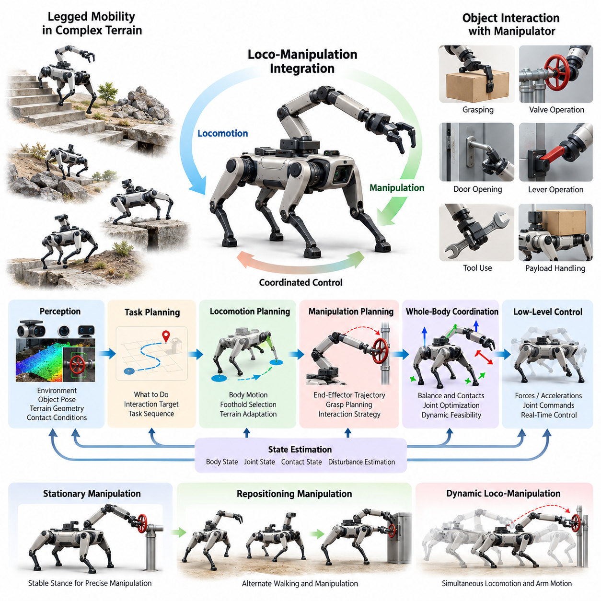
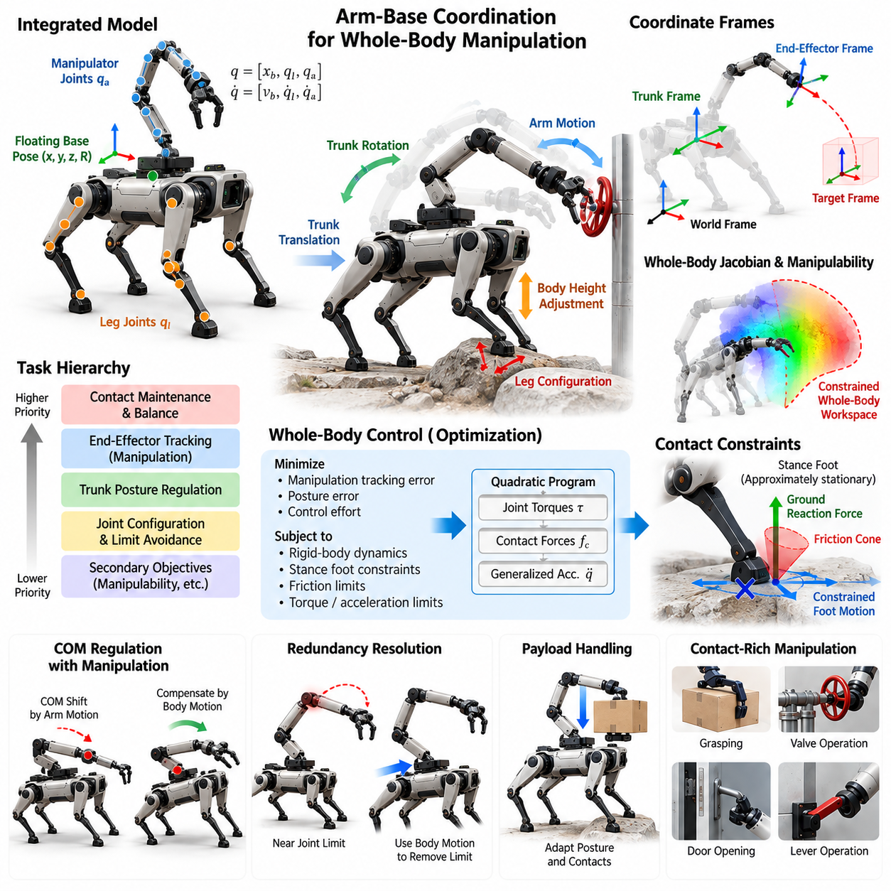
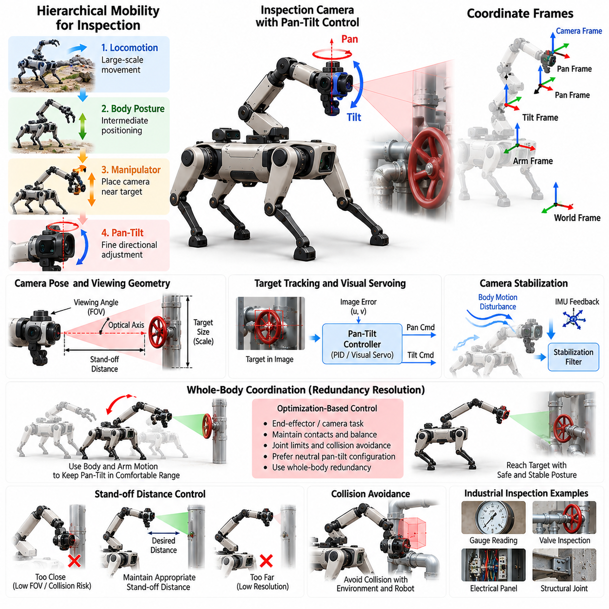
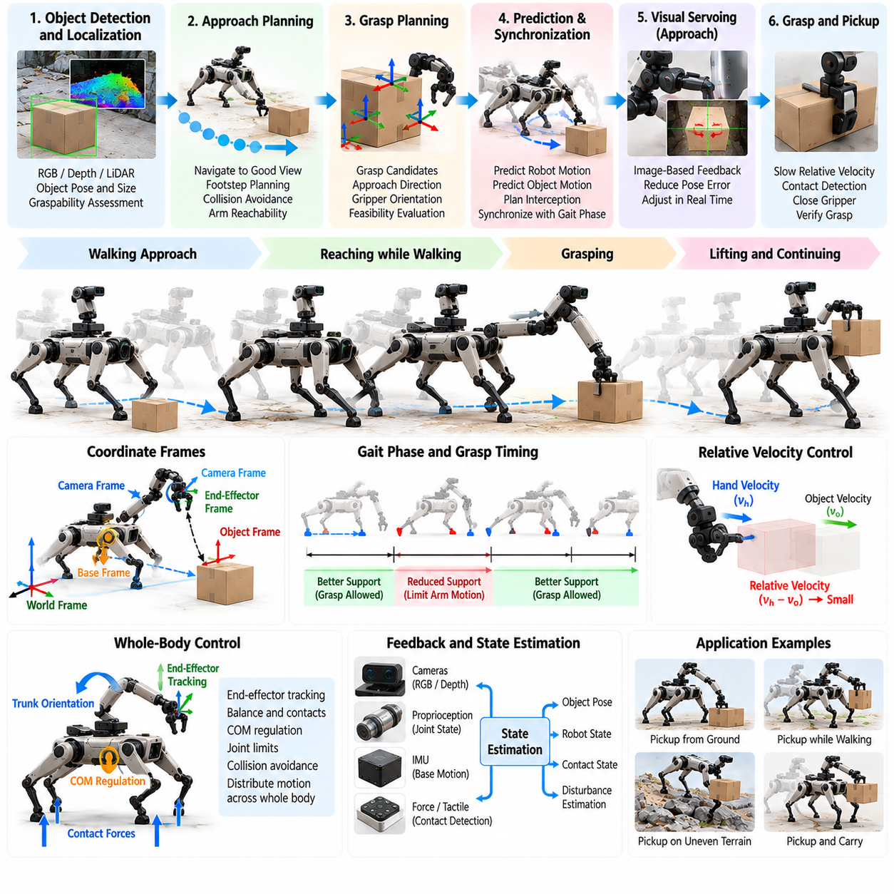
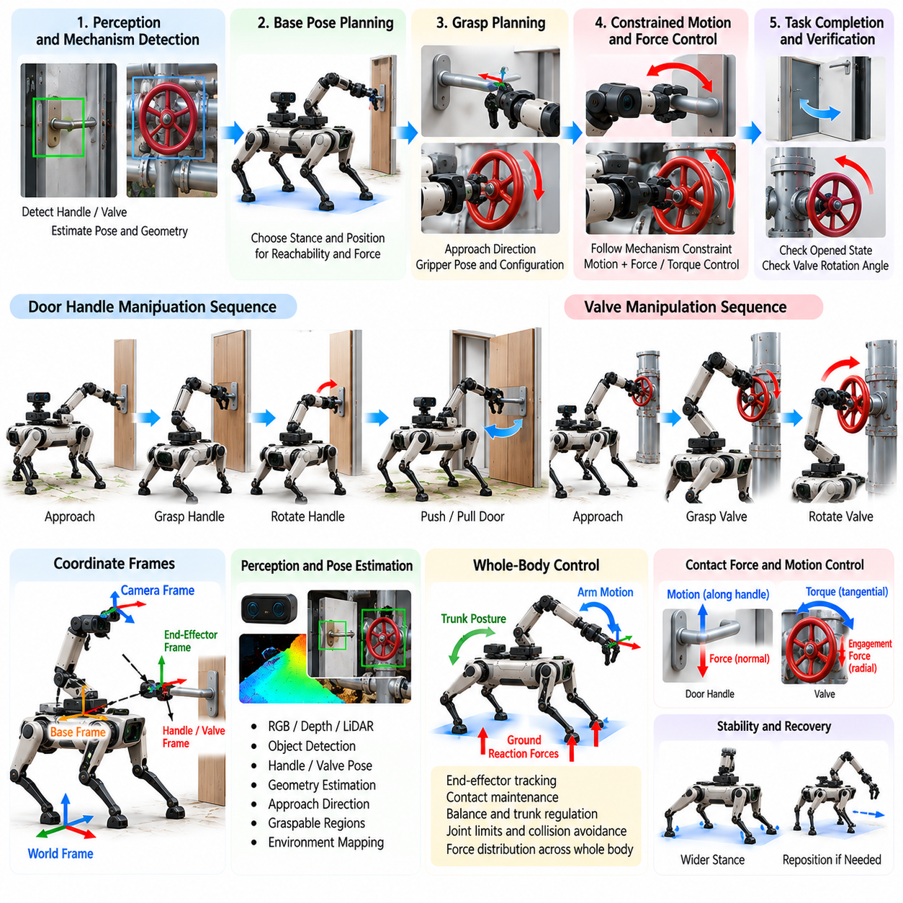
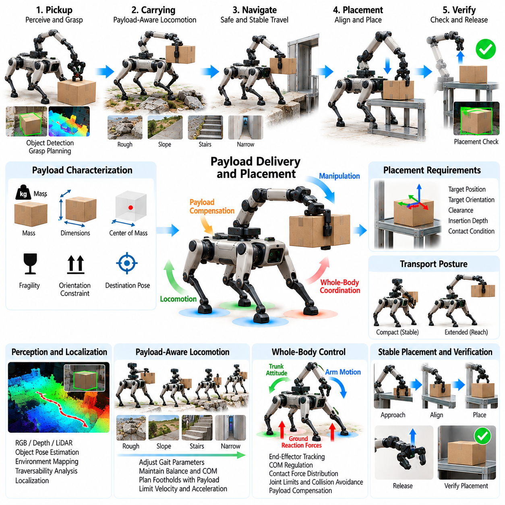
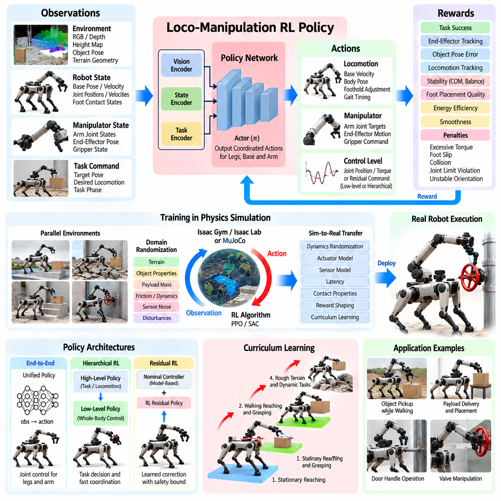
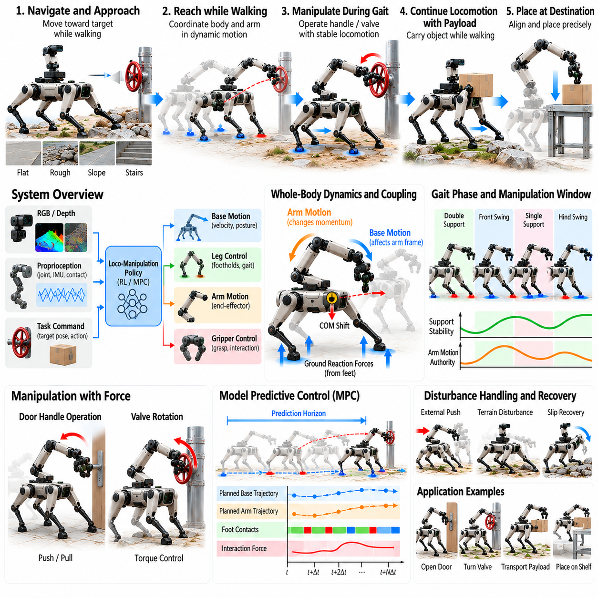
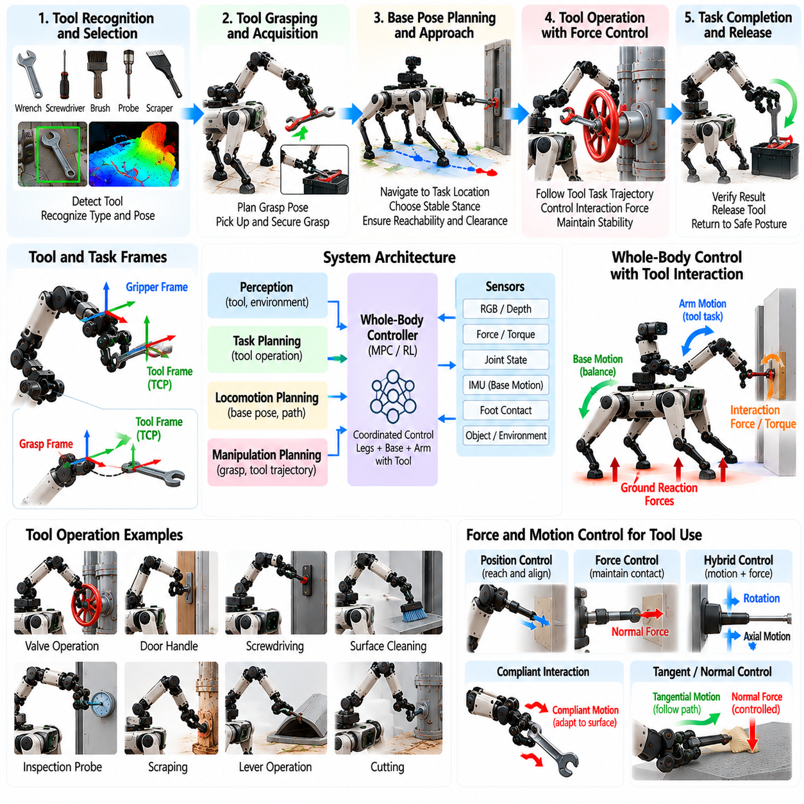
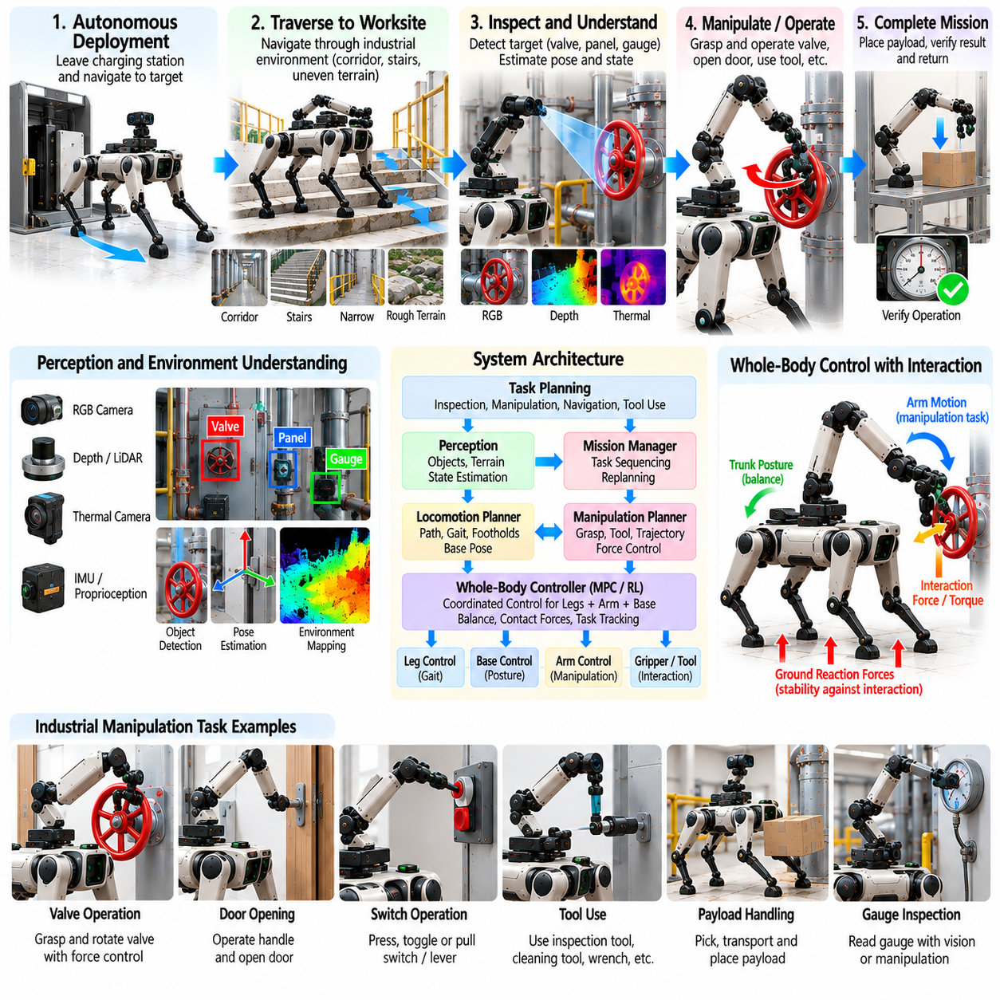

**Volume 21. Quadruped Robot Software**

# Chapter 09. Quadruped Manipulation

## 09.01. Quadruped with Arm Loco Manipulation Overview

{width="7.268055555555556in" height="7.268055555555556in"}

A quadruped equipped with a manipulator extends legged mobility into loco-manipulation, where locomotion and object interaction are treated as parts of one coordinated physical task. Instead of moving to a fixed pose and operating the arm independently, the robot can reposition its body, adjust footholds, regulate balance, and move the end effector together. This capability is central to the chapter structure, which progresses from arm-base coordination to mobile grasping, valve operation, payload handling, dynamic manipulation, tool use, and industrial applications. Volume_21_Quadruped_Robot_Softw...

The main advantage of an arm-equipped quadruped is the combination of terrain accessibility and manipulation reach. A wheeled mobile manipulator is constrained by traversable floor geometry, while a fixed manipulator is constrained by its installation location. A quadruped can walk across stairs, debris, slopes, gaps, and irregular surfaces, then use body translation, body orientation, leg configuration, and arm motion to establish an effective manipulation pose. The locomotion system therefore becomes an active component of the manipulator workspace rather than merely a transportation mechanism.

This integration also creates a tightly coupled dynamics problem. Motion of the arm changes the robot\'s center of mass, centroidal momentum, joint loading, and ground reaction force distribution. Manipulating a heavy object or applying force to a valve can introduce external forces and moments that disturb the stance. Conversely, body motion changes the arm\'s reference frame and end-effector trajectory. Successful loco-manipulation must therefore account for leg contacts, base dynamics, arm dynamics, payload effects, actuator limits, friction constraints, and task objectives within a coordinated control architecture.

A useful software decomposition separates perception, task planning, locomotion planning, manipulation planning, state estimation, whole-body coordination, and low-level control while preserving continuous information exchange among them. Perception estimates terrain geometry, object pose, grasp regions, contact conditions, and free space. The task layer determines what interaction should occur, while locomotion and manipulation planners generate compatible body, foothold, and end-effector objectives. Whole-body control then converts these objectives into dynamically feasible forces, accelerations, or joint commands.

Whole-body control is especially important because the quadruped may possess more controllable degrees of freedom than are required by a single manipulation objective. Task hierarchies can prioritize balance, contact maintenance, collision avoidance, end-effector tracking, posture regulation, and joint-limit avoidance. Optimization-based controllers can distribute motion across the legs, floating base, and manipulator so that the arm does not need to accomplish the entire Cartesian displacement alone. This directly connects quadruped manipulation with the preceding whole-body-control framework, including explicit manipulation-arm integration. Volume_21_Quadruped_Robot_Softw...

Manipulation can be performed in several mobility regimes. In a stationary regime, the robot establishes a stable stance before moving the arm, simplifying control and providing a relatively predictable manipulation frame. In a repositioning regime, the quadruped alternates walking and manipulation to enlarge its effective workspace. Fully dynamic loco-manipulation is more demanding because locomotion and arm motion occur simultaneously. The controller must then maintain end-effector accuracy despite periodic body motion, changing contacts, impacts, and terrain-induced disturbances.

Arm-base coordination provides a major workspace benefit. When an object lies outside the instantaneous arm workspace, the robot can translate or rotate its trunk instead of declaring the target unreachable. Body height can be changed to access low or elevated objects, and body roll or pitch can improve arm geometry on sloped terrain. Foot placements can also be selected to create a stance favorable for forceful manipulation. Reachability consequently becomes a whole-body property determined jointly by terrain, contacts, body configuration, manipulator kinematics, and environmental constraints.

Perception for loco-manipulation must support both mobility and interaction. Cameras and LiDAR can provide environmental geometry and obstacle information, while wrist cameras, depth sensors, and force-torque sensing can improve local manipulation accuracy. Proprioceptive measurements provide joint state and contact information needed for balance and disturbance estimation. Because the robot itself moves substantially during operation, transformations among world, body, arm-base, sensor, object, and end-effector frames must remain temporally consistent throughout the task.

Contact-rich operations introduce additional requirements beyond free-space trajectory tracking. Opening a door, rotating a valve, pushing a lever, or operating a tool creates constraints between the end effector and environment. The desired interaction may require controlled force along one direction while allowing motion along another. Impedance, admittance, force, or hybrid motion-force control can be combined with whole-body stabilization so that interaction forces do not destabilize the supporting legs. Contact transitions must also be detected reliably because unexpected sticking or slipping can rapidly alter system dynamics.

Mobile grasping illustrates the coupling particularly clearly. The robot must detect an object, select a feasible grasp, determine whether the target can be reached from the current configuration, and reposition when necessary. During approach, locomotion perception must continue to protect foothold safety while manipulation perception refines object pose. After grasp closure, the object becomes part of the effective mechanical system, altering mass distribution and collision geometry. Subsequent walking therefore requires payload-aware balance, motion planning, and manipulation control rather than simply holding the arm at a fixed joint configuration.

Payload transport further demonstrates why locomotion and manipulation cannot be engineered independently. An arm holding a payload can shift the combined center of mass away from the nominal support region and increase joint torque requirements. Acceleration of the payload generates inertial disturbances, particularly during gait transitions or rapid body motion. A practical controller can compensate by modifying base posture, gait speed, foothold locations, arm configuration, and ground reaction forces. Payload estimation and actuator thermal limits become important when operations continue for extended periods.

Planning must also consider environmental interaction at several spatial scales. A global planner may bring the quadruped near a workstation, while a local planner chooses an approach region compatible with terrain and manipulation requirements. A whole-body planner can then search for feasible base poses, stance configurations, arm trajectories, and contacts. Rather than optimizing navigation distance alone, the system should consider manipulation reachability, visibility, stability margin, collision clearance, force capability, and escape or recovery options when selecting the final working configuration.

Learning-based methods provide another path for solving highly coupled loco-manipulation problems. Reinforcement learning can optimize coordinated leg, body, and arm behaviors that are difficult to describe using manually constructed rules, while imitation learning can transfer demonstrations of complex interaction sequences. Policies may receive proprioceptive state, terrain observations, object information, task commands, and previous actions. However, learned control must still respect physical constraints, actuator limits, collision boundaries, and safety requirements, particularly when deployed around industrial equipment or people.

Robustness is essential because real manipulation targets rarely match ideal models. Object pose estimates contain uncertainty, terrain can deform or slip, grasp contacts can shift, and interaction forces may differ from simulation. A production system therefore needs feedback throughout the complete action rather than relying on an open-loop sequence. Failed grasps, unreachable targets, excessive contact forces, loss of foothold confidence, or balance degradation should trigger recovery behaviors such as arm retraction, stance widening, body repositioning, re-perception, or safe task termination.

Safety must be enforced across both locomotion and manipulation layers. Joint position, velocity, torque, contact force, and end-effector speed limits should be complemented by stability and collision constraints. A manipulation command that is individually safe for the arm may still be unsafe for the complete robot if it produces excessive base moment or reduces foothold stability. Likewise, an otherwise valid gait may become unsafe while carrying an extended payload. Supervisory logic should therefore evaluate the coupled robot state and provide controlled degradation, protective stopping, or posture recovery.

The resulting arm-equipped quadruped should be understood as a mobile physical interaction system rather than a walking robot with an accessory manipulator. Its useful capability emerges from coordinated perception, terrain-aware locomotion, manipulation planning, whole-body control, contact reasoning, learning, and safety supervision. This perspective provides the foundation for subsequent treatment of arm-base coordination, inspection control, mobile grasping, door and valve interaction, payload placement, learned loco-manipulation, dynamic manipulation, tool use, and industrial deployment.

## 09.02. Arm Base Coordination Whole Body Manip [w/Code]

{width="7.268055555555556in" height="7.268055555555556in"}

Arm-base coordination enables an arm-equipped quadruped to treat its legs, floating base, and manipulator as one articulated system rather than as independently controlled subsystems. The objective is to distribute a manipulation task across all available degrees of freedom while maintaining stable ground contacts. A target end-effector pose may therefore be achieved through arm motion, trunk translation, trunk rotation, posture adjustment, or a coordinated combination of these motions.

The quadruped base differs fundamentally from the fixed base of a conventional industrial manipulator. Its trunk is supported through multiple unilateral foot contacts whose locations and allowable forces change with stance and gait. Consequently, movement of the arm modifies the load transmitted through the legs, while movement of the trunk changes the manipulator reference frame. Whole-body manipulation must continuously account for this coupling when calculating feasible joint motion and contact forces.

A useful mathematical representation defines a generalized configuration containing the floating-base pose, leg joint coordinates, and manipulator joint coordinates. The corresponding generalized velocity includes base linear and angular velocity together with all actuated joint velocities. Kinematic models then relate these variables to task-space quantities such as foot poses, center-of-mass motion, trunk orientation, elbow configuration, and end-effector position and orientation through their respective Jacobian matrices.

End-effector motion can be expressed relative to the world, trunk, or task frame depending on the manipulation objective. For precise interaction with an environmental object, a world- or object-referenced target is often preferable because the trunk may move while the hand should remain stationary. The controller must compensate for base motion by coordinating manipulator joints so that commanded end-effector motion remains consistent even when balance regulation causes small translations or rotations of the body.

Task hierarchy provides a practical mechanism for organizing competing whole-body objectives. Maintaining valid stance contacts and preventing loss of balance normally receive high priority, while end-effector tracking, trunk posture, joint configuration, and secondary optimization objectives are assigned compatible priorities. Rather than commanding every degree of freedom independently, the controller solves for a whole-body motion that satisfies critical constraints while exploiting remaining redundancy to improve manipulation performance.

Optimization-based whole-body control can formulate this coordination as a quadratic program. Decision variables may include generalized accelerations, joint torques, and contact forces. The optimization minimizes tracking errors for manipulation and posture tasks while satisfying rigid-body dynamics, stance-foot constraints, friction limits, torque bounds, and acceleration limits. This formulation allows manipulation objectives to be incorporated without violating the physical requirements needed to keep the quadruped standing safely.

Contact constraints are especially important because stance feet should remain approximately stationary relative to the supporting terrain during manipulation. Their velocities or accelerations can be constrained while contact forces are maintained inside feasible friction regions. If an arm motion generates a large reaction moment, the optimizer can redistribute ground reaction forces among the supporting legs. The robot can therefore counter manipulation disturbances using its complete support structure instead of relying only on arm joint control.

Redundancy resolution allows the system to use the quadruped body to extend the effective manipulator workspace. When the arm approaches a joint limit or poorly conditioned configuration, the trunk can translate, rotate, raise, or lower to restore a favorable arm posture. A secondary objective may keep joints near preferred configurations or maximize manipulability. This approach reduces unnecessary arm extension and can increase both positioning accuracy and available force at the end effector.

Manipulability is not determined only by the arm Jacobian because the floating base contributes additional motion capability. A whole-body Jacobian can describe how coordinated base and arm motion affects the end effector. However, base motion is constrained by leg reachability, support geometry, terrain, and contact stability. The practically available workspace is therefore a constrained whole-body workspace rather than the unconstrained geometric workspace obtained by simply combining arm and base degrees of freedom.

Center-of-mass regulation must be coordinated with manipulation because arm movement and payload motion shift the mass distribution of the robot. Extending the arm forward may require the trunk to move backward or ground reaction forces to change accordingly. With heavier payloads, the controller may lower the body or widen the effective support configuration before executing the manipulation. These compensating motions can be generated automatically as consequences of stability and posture objectives within the whole-body controller.

Forceful manipulation introduces an additional coupling between end-effector wrench and foot contact forces. When the robot pushes a door, pulls a handle, or rotates a valve, the environment applies an equal reaction wrench to the robot. The controller must determine whether the current stance can generate the opposing forces without foot slip, excessive joint torque, or loss of balance. Manipulation feasibility should therefore include force capability as well as conventional geometric reachability.

For contact interaction, the end-effector objective can combine motion tracking with compliant behavior. Impedance or force-control commands define how the hand should respond to contact, while the whole-body controller distributes the resulting wrench through the arm, trunk, and stance legs. This separation is useful because the manipulation layer can specify desired interaction behavior without explicitly determining every supporting joint torque, while the whole-body layer preserves dynamic consistency across the complete robot.

Arm-base coordination also requires collision-aware posture management. Moving the trunk to improve reach may bring the arm close to a leg, sensor mast, payload, or surrounding structure. Self-collision and environmental collision constraints should therefore be incorporated into planning or represented as inequality constraints and avoidance objectives. Joint limits, cable routing, actuator range, camera visibility, and manipulator singularities further reduce the set of theoretically possible whole-body configurations.

The controller must distinguish between continuous base adjustment and explicit locomotion. Small trunk motions can often be generated while the feet remain fixed, but larger workspace changes eventually exceed leg kinematic limits. At that point, the robot must relocate one or more feet or execute a walking maneuver. A supervisory coordinator can monitor reachability and determine whether the task should continue through stance manipulation, body repositioning, stepping, or complete locomotion to a new manipulation pose.

During stepping, manipulation becomes more difficult because the number and geometry of supporting contacts change. The arm may need to maintain an object pose while one leg swings, causing the remaining stance legs to absorb both locomotion and manipulation loads. Task priorities and allowable manipulation forces can be adjusted according to gait phase. For demanding operations, the robot may intentionally stop walking and establish a stable stance before applying significant end-effector forces.

State estimation quality directly affects arm-base coordination. Errors in trunk pose, joint position, foot contact state, or terrain orientation propagate into the estimated end-effector pose relative to the environment. Sensor fusion using inertial measurements, joint encoders, contact information, and external perception can provide a consistent estimate of the floating-base state. Accurate timestamping and coordinate transformations are particularly important when high-rate whole-body control and lower-rate perception operate together.

Real-time implementation typically separates high-rate dynamic stabilization from slower manipulation planning. A planner may generate desired hand trajectories, trunk references, and preferred configurations at moderate frequency, while the whole-body controller continuously resolves them against current contact and dynamic constraints. Low-level actuator controllers then execute joint torque or position commands at higher rates. This layered timing structure allows computationally expensive planning without sacrificing rapid stabilization against disturbances.

Constraint relaxation is necessary when all requested tasks cannot be satisfied simultaneously. A commanded hand pose may become incompatible with contact constraints, joint limits, or available torque. Instead of producing unstable commands, the controller can soften lower-priority objectives using slack variables or reduce manipulation speed and force. Critical constraints such as actuator protection, contact integrity, and collision avoidance should remain hard whenever possible, while less critical tracking objectives degrade gracefully.

Arm-base coordination should also expose meaningful status information to higher-level task logic. Metrics such as end-effector error, manipulability, stability margin, contact-force utilization, joint-limit proximity, and optimization feasibility can indicate whether the current manipulation configuration remains acceptable. A task executive can use these signals to request body repositioning, change the stance, replan the grasp, reduce interaction force, or terminate the action before the controller reaches a physically infeasible state.

Simulation provides an effective environment for developing whole-body manipulation because contact configurations, payloads, friction coefficients, sensor errors, and external forces can be varied systematically. Tests should include arm extension near workspace boundaries, heavy payload handling, force application from different directions, body repositioning, contact transitions, and unexpected disturbances. Hardware validation can then progress from stationary low-force manipulation toward coordinated stepping and increasingly dynamic interaction.

Effective arm-base coordination ultimately transforms the quadruped from a mobile platform carrying a robot arm into a unified whole-body manipulator. Locomotion supplies adaptable support and workspace mobility, the floating base contributes controllable positioning freedom, and the arm provides precise interaction capability. Whole-body optimization connects these functions through common kinematic, dynamic, contact, and safety constraints, allowing the robot to manipulate objects while continuously adapting its posture and support configuration.

## 09.03. Inspection Camera Arm Pan Tilt Control [w/Code]

{width="7.268055555555556in" height="7.268055555555556in"}

Inspection camera manipulation extends a quadruped robot from a mobile observation platform into an actively positioned sensing system. By mounting a camera on a manipulator or articulated inspection arm, the robot can move the sensor independently of the trunk and place it near gauges, pipes, electrical panels, valves, structural joints, or confined spaces. Pan-tilt control then provides fine directional adjustment while locomotion and arm motion establish the larger inspection workspace.

The inspection system can be understood as a hierarchy of mobility ranges. Quadruped locomotion provides large-scale translation through the environment, body posture changes provide intermediate positioning, manipulator motion places the camera near the target, and pan-tilt joints perform precise optical alignment. Coordinating these stages avoids unnecessary robot motion because small changes in viewing direction can be handled by the camera mechanism instead of repositioning the complete arm or quadruped.

A camera inspection task should define more than a desired sensor position. The camera optical axis, target distance, viewing angle, image scale, field of view, and expected visibility determine whether the resulting observation is useful. A controller can therefore represent the objective as a desired camera pose or as visual constraints that keep the target near the image center while maintaining an appropriate stand-off distance and orientation for measurement or recognition.

Pan and tilt joints provide a compact mechanism for controlling the camera viewing direction. Pan typically rotates the optical system around an approximately vertical axis, while tilt changes elevation around a transverse axis. Joint encoders provide the angular state required to calculate the camera orientation relative to the arm. Mechanical limits, cable routing, sensor housing geometry, backlash, velocity limits, and acceleration limits must be included so that commanded viewing motions remain physically realizable.

Coordinate-frame management is essential because the camera is attached to a moving kinematic chain. Transformations may be maintained among the world, quadruped base, manipulator base, arm links, pan joint, tilt joint, and camera optical frame. When the robot changes posture or the arm moves, the camera pose in the world changes even if the pan-tilt angles remain fixed. Accurate forward kinematics therefore allows the controller to distinguish camera motion caused by the arm from motion commanded directly at the pan-tilt unit.

A target-tracking controller can convert the relative target direction into desired pan and tilt angles. When image-based feedback is available, the horizontal and vertical displacement of a detected feature from the image center can be used as the control error. Proportional or PID control can reduce this error by commanding angular velocity or position. Filtering is normally required because noisy detections can otherwise produce visible camera jitter and unnecessary actuator motion.

Visual servoing provides a more general framework when inspection targets move in the image because of body sway, arm movement, or locomotion. Image-based visual servoing directly regulates visual features, while position-based approaches estimate target geometry and calculate camera motion in Cartesian space. For quadrupeds, visual feedback is particularly useful because small trunk oscillations produced by gait or terrain compliance can disturb the camera even when the manipulator joints accurately follow their references.

Camera stabilization should distinguish slow viewpoint changes from high-frequency disturbances. The arm and pan-tilt mechanism can follow deliberate inspection trajectories, while inertial measurements can help compensate for faster angular disturbances. A filtered estimate of camera orientation or angular velocity can generate stabilization corrections. The achievable compensation bandwidth depends on actuator dynamics, structural stiffness, communication delay, camera exposure, and the update rates of the perception and control loops.

Arm and pan-tilt coordination can be formulated as a redundancy-resolution problem. Multiple combinations of arm configuration and camera angles may observe the same target. The controller can prefer solutions that keep pan and tilt near their central ranges, avoid arm singularities, maintain collision clearance, and preserve future viewing freedom. When the pan joint approaches its limit, for example, the arm or quadruped body can rotate gradually so that the camera mechanism returns toward a neutral configuration.

Inspection often requires maintaining a controlled stand-off distance. Moving too close can reduce usable field of view, cause focus problems, or create collision risk, while excessive distance can reduce spatial resolution. The manipulator can regulate camera position while pan-tilt control maintains orientation. Depth sensing, stereo vision, range measurements, or known target geometry may provide the distance estimate required to maintain a repeatable inspection viewpoint.

Collision avoidance is especially important when the camera is inserted near machinery or into narrow spaces. The planner must consider not only the camera housing but also the complete manipulator, cables, pan-tilt mechanism, and quadruped body. A viewing pose that produces an excellent image may be unacceptable if the elbow intersects a pipe or leaves insufficient clearance for stabilization motion. Collision-aware planning should therefore be performed together with visibility and camera-placement optimization.

Occlusion provides another constraint unique to inspection. A target may be geometrically reachable but hidden by equipment, the robot\'s own arm, or surrounding structures. Candidate viewpoints can be evaluated according to line of sight, expected target coverage, viewing incidence angle, and distance. If visibility deteriorates during execution, the system can modify pan-tilt orientation first, then reposition the arm, and finally relocate the quadruped when local adjustments cannot restore the required observation.

Automated inspection benefits from viewpoint sequencing rather than treating each image independently. A mission planner can specify a series of assets or regions to inspect, while a local camera planner determines suitable viewpoints for each target. The robot may stop at one base location and inspect several nearby components by moving only the arm and camera. This reduces locomotion time, energy consumption, terrain exposure, and positioning uncertainty compared with moving the complete robot for every observation.

Image acquisition should be synchronized with robot motion when measurement quality is important. Images captured during rapid arm movement or body vibration may suffer from motion blur or inconsistent viewpoints. The system can trigger acquisition after camera velocity falls below a threshold or when pose error enters a specified tolerance. Exposure time, illumination, autofocus state, thermal-camera integration time, and other sensor-specific conditions can also be incorporated into the capture decision.

Inspection payloads may contain more than a conventional RGB camera. Thermal imagers, zoom cameras, depth cameras, radiation sensors, acoustic sensors, or other instruments can share the articulated arm. Pan-tilt control then becomes part of a general sensor-pointing subsystem. Different sensors may require different stand-off distances and viewing orientations, so the inspection task should expose sensor-specific constraints while reusing common arm positioning, stabilization, collision avoidance, and target-tracking functions.

Zoom control can be coordinated with physical camera positioning when an optical zoom camera is used. Increasing focal length improves apparent target size but narrows the field of view and amplifies pointing errors and vibration. The system may first acquire the target using a wide field of view, center it through pan-tilt control, and then increase zoom gradually while tightening stabilization requirements. Loss of the target can trigger zoom reduction and reacquisition rather than uncontrolled searching.

Quadruped posture can improve camera access without requiring a full locomotion maneuver. Lowering the body may allow inspection beneath equipment, while raising or pitching the trunk can extend vertical reach. These posture changes must remain compatible with terrain contact and balance constraints. The inspection planner can therefore treat body pose as an additional sensing degree of freedom, but significant posture adjustment should remain coordinated with locomotion and whole-body control rather than being commanded solely by the camera subsystem.

During walking inspection, the camera controller must operate despite periodic base motion and changing foot contacts. A high-level target direction can remain fixed in the world while arm and pan-tilt commands compensate for trunk motion. However, stabilization authority is finite, and aggressive locomotion can exceed actuator bandwidth or produce excessive blur. Mission logic should therefore select walking speed and gait according to required image quality, using stationary inspection when high-resolution measurements are necessary.

Fault handling is required because inspection may occur in locations where direct human recovery is difficult. Loss of target detection, encoder faults, actuator saturation, communication delay, unexpected contact, or camera-stream failure should produce controlled responses. The system can freeze the current viewpoint, retract the arm, return the pan-tilt mechanism to a protected pose, or abort the inspection. Safe retraction paths are particularly important when the sensor has been inserted into confined machinery.

Performance evaluation should measure both robotic and sensing quality. Relevant quantities include pointing error, target-centering error, camera-pose repeatability, stabilization residual, tracking bandwidth, image sharpness, target visibility, inspection coverage, and time required to acquire each viewpoint. Tests should include stationary stance, body posture changes, arm repositioning, walking disturbances, different target distances, occlusions, low illumination, and narrow-space inspection to characterize practical operating limits.

An integrated inspection camera arm ultimately allows the quadruped to position perception actively rather than accepting whatever viewpoint is available from fixed body sensors. Locomotion determines where the robot can operate, whole-body posture establishes a useful support configuration, the arm determines sensor position, and pan-tilt control precisely directs the optical axis. Their coordinated operation enables repeatable, close-range inspection of assets that would otherwise be difficult, hazardous, or inaccessible to conventional mobile sensing platforms.

## 09.04. Object Pickup while Walking Mobile Grasp [w/Code]

{width="7.268055555555556in" height="7.268055555555556in"}

Object pickup while walking combines quadruped locomotion, object perception, grasp planning, arm motion, and balance control into a continuous mobile manipulation task. Unlike conventional pick-and-place, the robot does not necessarily stop at a predefined manipulation pose before reaching for an object. It can approach the target while adjusting its body and manipulator, allowing locomotion to contribute directly to grasp acquisition and increasing the effective manipulation workspace.

The central challenge is that the grasp target is observed from a moving reference frame. Walking produces translation, rotation, vertical body motion, and periodic disturbances associated with changing foot contacts. Meanwhile, the target may remain stationary in the world or move independently. The perception and control system must therefore maintain a consistent estimate of object pose relative to the world, robot base, and manipulator while these coordinate frames continuously change.

Mobile grasping typically begins with target detection and localization at sufficient distance for approach planning. RGB, depth, stereo, or LiDAR perception can estimate object position, orientation, dimensions, and surrounding free space. The robot should also estimate whether the object is graspable from its current approach direction. Early perception allows locomotion to steer toward a region that provides favorable visibility, arm reachability, collision clearance, and stable footholds rather than simply minimizing walking distance.

A grasp candidate includes more than an end-effector pose. It should specify the approach direction, gripper orientation, finger configuration, clearance, expected contact region, and required object-relative motion. Candidate grasps can be evaluated together with the predicted robot configuration at pickup time. A grasp that is feasible from a stationary base may become unsuitable during walking because body oscillation, limited arm compensation, or reduced support geometry leaves insufficient tracking margin.

The pickup problem therefore requires prediction of both target state and robot motion. The controller can estimate where the quadruped base will be when the hand reaches the object and generate a corresponding arm trajectory. If the object is moving, its future pose must also be predicted. The grasp is then planned around an interception condition in which the hand and object reach compatible position, orientation, and relative velocity within an acceptable temporal window.

Locomotion and manipulation planning should exchange information continuously. The locomotion planner can modify walking velocity, heading, body height, or footholds to improve manipulation feasibility, while the arm planner reports workspace margins and preferred approach geometry. If the target lies near the edge of the arm workspace, a small change in body trajectory may provide substantially more robust grasping than extending the manipulator toward a singular or joint-limited configuration.

Walking phase strongly affects grasp feasibility. During phases with a larger or better distributed support region, the robot may tolerate greater arm acceleration and interaction force. During reduced-support phases, aggressive reaching can create undesirable angular momentum or shift the center of mass toward a stability boundary. The manipulation controller can therefore synchronize critical grasp events with favorable gait phases or temporarily modify gait timing as the hand approaches the target.

Whole-body control provides the mechanism for coordinating these competing objectives. End-effector tracking, trunk orientation, center-of-mass regulation, swing-leg motion, stance-foot constraints, and joint limits can be considered simultaneously. Instead of forcing the arm alone to reject base disturbances, the controller can distribute compensation across the trunk and available joints. This is particularly useful when the hand must remain accurately aligned with an object while the quadruped continues stepping.

Visual servoing can correct errors that remain after geometric planning. As the robot approaches the object, image measurements provide increasingly precise relative information and can compensate for localization drift or imperfect object models. The controller may use image-space target error, estimated Cartesian pose error, or a combination of both. Perception latency must be considered because delayed corrections can destabilize tracking when the robot and hand are moving rapidly.

The final approach should generally reduce relative hand-object velocity before contact. Even when the quadruped continues walking, the arm can move relative to the trunk so that the end effector approximately matches the object\'s world-frame velocity at grasp closure. For a stationary object, this means canceling much of the base motion through coordinated arm motion. Reducing relative velocity lowers impact, improves finger placement, and decreases the probability that the object will be pushed away before secure grasp formation.

Contact detection marks an important transition from reaching to load-bearing manipulation. Gripper motor current, finger position, tactile sensing, force-torque measurements, or visual cues can indicate whether contact has occurred. The controller should distinguish successful enclosure from accidental collision or partial contact. Closing force can then be regulated according to object properties while the whole-body controller prepares for the additional load that will be introduced when the object leaves its supporting surface.

The instant of lifting changes the dynamics of the complete robot. Object mass becomes part of the moving system, shifting the combined center of mass and increasing manipulator joint torque. If the payload estimate is uncertain, force or torque measurements can provide an online estimate after lift-off. The controller may reduce walking speed, alter body posture, modify footholds, or move the arm toward a more compact carrying configuration once the object has been securely acquired.

Grasp verification should occur before the robot commits to faster locomotion. Finger closure alone does not guarantee that the object is securely held. Tactile distribution, gripper force, object motion relative to the hand, visual confirmation, or small controlled test motions can provide evidence of grasp stability. If confidence is low, the robot can slow down, place the object back, adjust the grasp, or stop walking rather than allowing a weak grasp to become a dropped payload.

Collision avoidance must remain active throughout the pickup sequence. The planner must consider collisions between the arm and legs, the grasped object and robot body, and the entire system and surrounding environment. During walking, these relationships change continuously as legs swing and the trunk oscillates. The grasped object should be added to the collision model immediately after acquisition because its geometry can significantly alter safe arm configurations and available walking clearance.

Terrain introduces another coupling between mobility and grasping. Uneven ground can produce body orientation changes that disturb the approach trajectory, while poor footholds near the target may prevent the robot from maintaining a desirable pickup configuration. Terrain perception should therefore influence where and when grasping occurs. In difficult conditions, the robot may deliberately slow down, shorten steps, widen stance, or transition to stationary manipulation rather than attempting an unnecessarily dynamic pickup.

Dynamic pickup should not be treated as mandatory behavior. A robust system should select among continuous walking pickup, slowed walking, step-and-grasp, or complete stop-and-grasp according to task urgency, object properties, terrain, and uncertainty. Lightweight objects with large grasp regions may permit continuous acquisition, whereas fragile, heavy, small, or poorly localized objects may require a stable stance. This adaptive strategy provides useful mobility without sacrificing reliability.

Recovery behavior is essential because mobile grasping contains multiple opportunities for failure. The target may become occluded, move unexpectedly, leave the reachable workspace, or produce an invalid grasp. The robot should be able to cancel the reach, retract the arm, adjust its path, reacquire the object, and generate another grasp attempt. If contact destabilizes the robot, balance recovery and safe arm motion must take priority over preserving the manipulation attempt.

Real-time implementation benefits from separating planning and stabilization rates. Object detection and grasp planning may operate at moderate frequency, trajectory generation can update as the target estimate changes, and whole-body control executes at a much higher rate. Time synchronization is critical because a pose estimate associated with an old camera frame may correspond to a substantially different robot configuration by the time it reaches the controller during dynamic walking.

Safety constraints should bound end-effector speed, contact force, joint torque, body attitude, stability margin, and allowable payload behavior. A mobile grasp command should be rejected or degraded when predicted motion approaches collision, actuator, or balance limits. The robot may automatically decrease walking velocity as uncertainty increases. For operations near people, additional limits on arm velocity, gripper force, and approach direction are required because both the base and manipulator contribute to relative motion.

Simulation allows mobile grasping to be tested across walking speeds, gait phases, object locations, perception errors, payload masses, friction conditions, and terrain profiles. Evaluation should measure grasp success rate, pickup time, end-effector tracking error, object-relative velocity at contact, disturbance to locomotion, stability margin, and post-grasp payload retention. Hardware testing can progress from stationary pickup to slow walking and finally continuous dynamic acquisition.

Successful object pickup while walking demonstrates the fundamental value of loco-manipulation. The quadruped no longer treats locomotion as a separate stage that must finish before manipulation begins. Instead, walking changes the reachable workspace, body motion contributes to the approach, the arm compensates for locomotion, and whole-body control preserves stability throughout contact and lifting. The result is a robot capable of acquiring objects naturally while moving through complex environments.

## 09.05. Door Handle and Valve Manipulation [w/Code]

{width="7.268055555555556in" height="7.268055555555556in"}

Door-handle and valve manipulation are representative contact-rich tasks for arm-equipped quadrupeds because they combine precise perception, constrained end-effector motion, sustained interaction force, and whole-body stability. Unlike free-space reaching, the robot becomes mechanically coupled to the environment after contact. Successful execution therefore requires coordinated control of the gripper, manipulator, floating base, supporting legs, and contact forces throughout the interaction.

The task begins with identifying the interaction mechanism and estimating its geometry. For a door, relevant quantities include handle position, handle orientation, hinge location, door plane, and expected opening direction. For a valve, the system should estimate the wheel or lever center, rotation axis, radius, graspable regions, and surrounding clearance. These estimates define both the initial grasp pose and the constrained motion that must follow after contact.

Perception uncertainty is particularly important because small pose errors can cause failed grasping or excessive contact force. RGB-D cameras, stereo vision, LiDAR, wrist cameras, or learned object detectors can provide an initial target estimate, while close-range sensing refines the pose during approach. Visual servoing can correct residual alignment error by continuously adjusting the end-effector trajectory relative to the detected handle or valve before physical contact occurs.

The quadruped should select a base pose that supports both geometric reachability and force generation. Standing too far away can force the arm near full extension, reducing manipulability and available interaction force. Standing too close may create self-collision or prevent the door from moving. The preferred stance should provide sufficient arm workspace, stable footholds, collision clearance, useful camera visibility, and a support geometry capable of resisting the expected reaction wrench.

Grasp planning depends strongly on the mechanism being operated. A lever-style door handle may require the gripper to approach from a particular direction, close around the handle, and rotate it before pulling or pushing the door. A round valve wheel may permit several grasp locations around its circumference. The selected grasp should maximize contact security while preserving enough manipulator workspace to execute the subsequent constrained trajectory without encountering joint limits.

After grasp establishment, the control problem changes from free-space manipulation to constrained interaction. The hand can no longer follow an arbitrary Cartesian trajectory because its motion is determined partly by the mechanism geometry. A door handle may rotate around its local axis, a door panel rotates around a hinge, and a valve follows a circular trajectory around a fixed shaft. The controller should represent these kinematic constraints explicitly or estimate them online from measured motion and force.

Force and torque sensing provides important feedback during mechanism operation. The robot can detect whether a handle is locked, whether a valve requires unexpectedly high torque, or whether the grasp is slipping. Excessive resistance should not simply produce increasing actuator effort. Instead, force thresholds and compliance behavior can prevent damage to the robot, mechanism, or environment while providing information that higher-level logic can use to classify the interaction state.

Impedance control is well suited to these tasks because exact mechanism geometry may not be known. Rather than enforcing a perfectly rigid position trajectory, the controller defines a desired relationship between position error and interaction wrench. Compliance can be permitted along uncertain directions while sufficient stiffness is maintained for grasp stability and task execution. This allows the end effector to follow small geometric deviations without generating unnecessarily large internal forces.

Hybrid motion-force control provides another useful formulation. Motion can be controlled along directions where the mechanism should move, while force is regulated along constrained directions. During valve rotation, for example, tangential motion may drive the wheel while radial contact force maintains engagement. During door opening, the controller can regulate the force applied normal to the handle or door while commanding the motion needed to follow the hinge-generated arc.

Whole-body coordination becomes necessary when reaction forces exceed what the arm alone can comfortably manage. Pulling a heavy door creates a wrench that propagates through the manipulator into the quadruped trunk and stance legs. The whole-body controller can modify trunk posture and redistribute ground reaction forces to oppose this disturbance. If necessary, the robot can widen its stance, lower its body, or select footholds that provide a more favorable support configuration before continuing.

Door opening introduces a changing workspace problem because the grasped handle moves as the door rotates. A base pose that is suitable at the beginning may become unsuitable later in the trajectory. The quadruped may therefore need to reposition its trunk or step while maintaining the grasp. Arm-base coordination should preserve the end-effector constraint while the legs establish a new support configuration, effectively turning door opening into a combined locomotion and manipulation problem.

Maintaining grasp during stepping requires careful task prioritization. The end effector should follow the door trajectory while stance contacts and balance constraints remain satisfied. When one leg swings, the remaining contacts must support both the robot and interaction wrench. The controller may reduce door-opening speed during contact transitions or temporarily pause mechanism motion while completing a step. This avoids forcing manipulation performance at the expense of locomotion stability.

Valve manipulation often requires repeated regrasping because the manipulator may not be able to rotate continuously through the full required angle. The robot can rotate the valve through the available arm range, stop while maintaining mechanism state, release the gripper, move to another grasp location, and continue rotation. Planning should ensure that each regrasp remains collision-free and that the valve does not unintentionally return due to stored mechanical force or process pressure.

A valve may also require substantial torque. The achievable end-effector wrench depends on manipulator configuration, actuator limits, grasp geometry, and quadruped support conditions. A configuration near a kinematic singularity may provide poor torque capability even when the valve is geometrically reachable. The planner should therefore consider force manipulability and predicted joint torque, selecting body and arm configurations that provide sufficient mechanical advantage for the expected operation.

Slip detection is important for both handles and valves. Relative motion between the gripper and mechanism can be inferred from tactile sensors, force changes, finger displacement, or visual tracking. When slip is detected, the controller can increase gripping force within safe limits, reduce manipulation speed, modify wrist orientation, or stop and regrasp. Continuing an operation with an unstable grasp can produce sudden loss of load and destabilize the entire quadruped.

State estimation should track the mechanism as the task progresses. Door angle, handle state, valve rotation angle, grasp condition, interaction wrench, and robot configuration together describe task progress. These variables allow the task executive to distinguish successful motion from situations in which the arm moves but the mechanism does not. Explicit state tracking also supports recovery because the robot can determine whether it should retry the grasp, increase force, reposition, or terminate the operation.

Task sequencing is naturally represented as a state machine or behavior tree. A door task may include detection, approach, pre-grasp alignment, grasp closure, handle actuation, latch verification, door motion, body repositioning, release, and passage. Valve operation may include detection, grasping, torque application, rotation monitoring, regrasping, completion verification, and release. Transitions should depend on sensed physical conditions rather than elapsed time alone.

Collision checking must account for the changing geometry of the environment. As a door opens, the door panel sweeps through space and may collide with the robot body, legs, or arm. Valve environments can contain nearby pipes, frames, or instrumentation that restrict wrist motion. Planning should update collision geometry according to estimated mechanism state so that trajectories remain safe throughout the interaction rather than only at the initial configuration.

Recovery strategies should be designed explicitly because contact-rich tasks frequently violate nominal assumptions. The robot may miss the handle, encounter a locked door, underestimate valve torque, lose visual tracking, or reach a joint limit during operation. Recovery can include releasing contact, retracting the arm, changing base position, selecting another grasp, re-estimating mechanism geometry, or requesting operator assistance instead of repeatedly applying uncontrolled force.

Safety supervision should limit gripper force, end-effector wrench, joint torque, body attitude, contact-force utilization, and mechanism speed. Unexpected force growth can indicate collision, jamming, or incorrect geometric estimation. Safety logic should be able to stop commanded motion while preserving a stable stance and, when appropriate, maintain or release the grasp in a controlled manner. Human proximity requires additional limits on door motion and manipulator velocity.

Simulation can evaluate variations in handle geometry, hinge location, valve size, friction, stiffness, required torque, perception error, and foothold conditions before hardware deployment. Useful metrics include grasp success, mechanism completion rate, peak interaction force, valve torque capability, door-opening time, number of regrasps, stability margin, and recovery success. Hardware testing should progress from low-force fixtures to realistic industrial mechanisms and constrained environments.

Door-handle and valve manipulation demonstrate why quadruped manipulation must integrate perception, contact control, force reasoning, and locomotion. The arm provides precise interaction, but successful operation depends on how the complete robot supports and reacts to environmental forces. By coordinating grasping, compliant control, whole-body stabilization, stepping, and recovery, an arm-equipped quadruped can operate mechanisms designed for humans while maintaining mobility across complex industrial environments.

## 09.06. Payload Delivery and Placement [w/Code]

{width="7.268055555555556in" height="7.268055555555556in"}

Payload delivery and placement extends quadruped manipulation beyond object pickup by requiring the robot to transport a grasped load through changing terrain and place it accurately at a destination. The task couples locomotion, payload-aware dynamics, manipulation planning, perception, and contact control over an extended period. Unlike a short grasping action, the payload continuously modifies the robot's mass distribution, actuator loading, collision geometry, and balance conditions during travel.

A delivery task begins by characterizing the payload and the destination. Relevant payload properties include estimated mass, dimensions, center of mass, grasp configuration, fragility, and allowable orientation. The destination may impose placement position, orientation, clearance, insertion depth, or contact requirements. These properties determine whether the object should be carried close to the trunk, held at a specific attitude, or repositioned before the final placement phase.

After pickup, the object becomes part of the effective multibody system. Its mass changes the combined center of mass and modifies the inertia observed during acceleration, turning, and body rotation. An object held far from the trunk creates larger moments than the same object carried close to the body. Payload-aware control should therefore update the dynamic model or compensate for the additional load when calculating joint torques, contact forces, and feasible locomotion commands.

Payload estimation can be performed from known object information or inferred after lifting. Joint torque, force-torque sensing, gripper measurements, and arm configuration can provide observations from which mass and approximate center-of-mass location are estimated. The estimate need not be perfectly accurate to be useful. Even a bounded classification such as light, moderate, or heavy can allow the controller to select more conservative gait parameters and manipulation limits.

The carrying posture strongly affects stability and energy consumption. A compact arm configuration generally reduces the moment generated around the quadruped base and decreases collision exposure. However, some payloads require a particular orientation to prevent spilling, damage, or loss of grasp. The planner must therefore balance compactness, object constraints, camera visibility, arm manipulability, and the ability to react to terrain disturbances while selecting a transport configuration.

Whole-body control coordinates payload compensation with locomotion. As the robot walks, the controller regulates trunk attitude and center-of-mass behavior while distributing ground reaction forces among stance feet. The additional wrench created by the payload can be incorporated into the optimization. If the arm is offset to one side, the controller may shift the trunk, modify stance forces, or adjust footholds to counter the resulting roll moment and preserve sufficient stability margin.

Gait parameters should adapt to payload conditions rather than remaining identical to unloaded locomotion. A heavy or extended load may require lower velocity, reduced acceleration, shorter steps, longer stance duration, or smoother gait transitions. Sudden turns and rapid body rotations can create large inertial forces at the gripper. A payload-aware gait manager can therefore limit commanded motion according to estimated mass, arm extension, terrain difficulty, and available actuator capability.

Terrain perception becomes especially important because the consequences of a poor foothold increase when carrying a load. Slopes, steps, loose ground, and discrete obstacles can generate trunk disturbances that propagate into the manipulator and payload. The navigation system can prefer routes with greater traversability margin even when they are slightly longer. Route cost can incorporate payload stability, expected body motion, required clearance, and recovery opportunities in addition to geometric distance.

Collision geometry must be updated immediately after the object is acquired. A carried box, tool, container, or component may extend beyond the normal robot envelope and collide with walls, railings, vegetation, machinery, or the robot's own legs. Planning should represent the payload as an attached collision object whose pose changes with the arm. This is essential when passing through doorways, turning in confined spaces, or negotiating terrain that requires large body posture changes.

Grasp stability should be monitored throughout transport. Walking vibration, impact, arm motion, and changing gravity direction on slopes can cause gradual slip even when the initial grasp was secure. Tactile sensors, gripper position, motor current, force-torque measurements, or visual tracking can detect changes in grasp condition. The controller can increase grip force within safe limits, reduce locomotion intensity, reposition the arm, or stop before the payload is lost.

Fragile or orientation-sensitive payloads require motion-quality constraints beyond conventional robot stability. A container holding liquid may need limited tilt and acceleration, while delicate equipment may impose shock or vibration limits. The planner can constrain payload angular velocity, linear acceleration, jerk, or orientation relative to gravity. These limits should propagate into gait generation so that locomotion commands remain compatible with the physical requirements of the transported object.

Navigation and manipulation should remain coupled as the robot approaches the delivery location. The navigation system should not merely drive to a single point and then hand control to the arm. Instead, the final approach should consider manipulator reachability, destination visibility, terrain support, collision clearance, and required placement direction. A slightly different base pose can greatly improve placement accuracy and reduce the amount of arm extension required.

Destination perception refines the placement target during the final approach. Cameras or depth sensors can identify shelves, trays, fixtures, containers, tables, or designated placement regions and estimate their pose relative to the robot. When geometric tolerances are tight, wrist-mounted perception can provide local measurements after global navigation has positioned the quadruped nearby. Visual feedback can then compensate for localization error and uncertainty in the environment model.

Placement planning should distinguish between free placement and constrained placement. Placing an object on an open surface primarily requires collision-free motion and stable support after release. Inserting a component into a holder, slot, rack, or fixture imposes additional geometric constraints and may require precise orientation. The controller should select an approach direction that preserves visibility, avoids singular configurations, and provides sufficient compliance for the expected contact condition.

The transition from carrying to placement often requires changing the arm configuration significantly. The payload may be transported close to the trunk for stability but must be extended outward to reach the destination. This extension shifts the combined center of mass and increases joint torque just as precise positioning becomes important. Whole-body control can compensate by changing trunk position, lowering the body, widening support, or redistributing stance forces before the final placement motion.

Contact-aware placement is preferable when the destination surface position is uncertain. Rather than relying entirely on a predefined vertical coordinate, the robot can approach slowly and detect contact through force, torque, tactile, or gripper signals. Once support is detected, the controller can reduce downward force and allow the object to settle. Compliant behavior prevents excessive force from being transmitted into the object, supporting structure, manipulator, or quadruped body.

Precise placement may use visual servoing together with force control. Vision provides lateral and rotational alignment before contact, while force sensing becomes increasingly important after contact occurs. For constrained insertion, small compliant search motions can compensate for residual pose error. The system should distinguish successful seating from jamming by monitoring motion, contact wrench, and expected insertion progress rather than assuming that commanded displacement corresponds directly to object motion.

Release should occur only after the payload is confirmed to be supported by the destination. Premature gripper opening can drop the object, while delayed release may disturb an object that has already settled. Support can be inferred from changes in gripper load, arm force, object pose, or contact state. After opening the gripper, the robot should verify that the object remains stable before retracting the manipulator and resuming locomotion.

Arm retraction must also be planned because the placed object and surrounding structures remain collision hazards. The shortest reverse trajectory is not always safe, particularly after insertion or placement inside a confined region. A retreat path should preserve clearance while moving the arm toward a compact locomotion configuration. Once the manipulator is clear, the quadruped can restore its nominal posture and transition from manipulation mode back to normal navigation.

Delivery failures require explicit recovery logic. The robot may detect payload slip, excessive joint torque, blocked navigation, an unreachable placement target, unexpected contact, or unstable support after release. Recovery can include stopping locomotion, lowering the object to a safe surface, adjusting the grasp, selecting another base pose, replanning the route, or retrying placement. Protecting the robot and payload should take priority over completing the original trajectory.

Safety supervision should account for the combined robot-payload system. Joint torque, gripper force, stability margin, foot contact quality, arm extension, payload acceleration, and collision clearance can all define operational limits. When these limits are approached, the system can reduce speed or transition to a safer posture. A heavy payload should never be treated as an isolated arm load because its dynamic effects propagate through the trunk, legs, and ground contacts.

Simulation provides a practical environment for evaluating payload mass, center-of-mass offset, grasp location, gait speed, terrain, friction, route geometry, and placement tolerance. Performance metrics can include delivery success rate, payload retention, placement position and orientation error, peak joint torque, stability margin, transport time, energy consumption, and recovery frequency. Hardware validation can progress from light rigid objects to heavier and more fragile payloads.

Payload delivery and placement demonstrates the complete manipulation cycle of an arm-equipped quadruped: acquire an object, incorporate it into the robot's dynamic state, transport it through the environment, establish a manipulation-compatible destination pose, place it through controlled contact, verify release, and recover locomotion posture. Coordinating these stages transforms the quadruped from a mobile carrier into a terrain-capable autonomous material-handling system.

## 09.07. Quadruped Loco Manip RL Policy [w/Code]

{width="7.268055555555556in" height="7.268055555555556in"}

Reinforcement learning provides a powerful framework for quadruped loco-manipulation because locomotion, balance, arm motion, and physical interaction can be optimized as a coupled behavior rather than as independently engineered controllers. A loco-manipulation policy receives information about the robot, environment, and manipulation objective and produces coordinated actions that allow the quadruped to move its body while simultaneously positioning or controlling the manipulator.

The central design problem is determining what the policy should observe and control. Observations may include base orientation and velocity, joint positions and velocities, foot contact states, manipulator configuration, end-effector pose, previous actions, terrain information, object pose, and task commands. Depending on the architecture, exteroceptive observations from depth cameras or height maps can also be encoded so that locomotion and manipulation adapt to surrounding geometry.

Policy actions can operate at several levels of abstraction. A low-level policy may directly generate joint position targets, torque commands, or residual corrections for both legs and arm. A hierarchical policy can instead output desired base velocity, body pose, foothold adjustments, and end-effector commands that are executed by conventional controllers. The appropriate action space depends on required control bandwidth, training complexity, hardware safety, and the amount of model-based structure retained in the system.

A unified policy can learn correlations that are difficult to encode manually. Extending the arm forward may automatically cause the learned behavior to shift the trunk backward, alter stance forces, or change step timing. Reaching sideways may produce a wider support configuration, while carrying a heavy object may naturally result in slower locomotion and a compact arm posture. These coordinated responses emerge when training objectives properly represent both manipulation performance and locomotion stability.

Reward design is therefore one of the most important elements of loco-manipulation learning. The reward can combine end-effector tracking, object pose error, commanded locomotion tracking, body stability, foot-placement quality, energy consumption, smoothness, and task completion. Penalties can discourage excessive joint torque, foot slip, collisions, unstable body orientation, abrupt actions, or joint-limit violations. Reward terms should be balanced so that the policy cannot improve manipulation performance by sacrificing basic locomotion safety.

Sparse task rewards may be insufficient for complex manipulation sequences because successful completion can be rare during early training. Curriculum learning can begin with simplified tasks such as stationary reaching, then introduce body repositioning, stepping, object contact, grasping, payload transport, and dynamic locomotion. Task difficulty can increase gradually through larger target ranges, rougher terrain, heavier payloads, stronger disturbances, and tighter placement tolerances as policy performance improves.

Hierarchical reinforcement learning can separate long-horizon task decisions from fast whole-body coordination. A high-level policy may select target object poses, manipulation phases, desired base locations, or locomotion commands, while a low-level policy generates dynamically consistent joint behavior. This decomposition reduces the burden on a single neural network and allows learned components to coexist with deterministic planners, state machines, whole-body controllers, and safety supervisors.

Residual reinforcement learning provides another practical architecture. Instead of replacing an existing locomotion or manipulation controller, the learned policy produces corrections to nominal commands. A model-based controller can preserve balance, contact constraints, and basic tracking, while reinforcement learning compensates for modeling error or improves task-specific coordination. Residual magnitude can be bounded so that the learned component cannot arbitrarily override the stable baseline controller.

Training generally relies on physics simulation because loco-manipulation requires very large numbers of interactions and failures during exploration. Parallel simulation can generate experience across many robot instances with different targets, terrain configurations, object properties, and disturbances. Efficient GPU-based simulation allows policies to experience a broader state distribution than would be practical on hardware, while avoiding mechanical wear and safety risks during early learning.

The simulator must represent both locomotion and manipulation contacts with sufficient fidelity. Foot-ground friction, actuator dynamics, arm inertia, gripper contact, payload mass, joint limits, latency, and collision behavior influence the learned strategy. An unrealistic model may produce behaviors that exploit simulation artifacts, such as excessive contact impulses or unrealistically fast actuator response. Training should therefore emphasize physically plausible dynamics rather than only maximizing simulated reward.

Domain randomization improves robustness by varying parameters that are uncertain in the real system. Robot mass, payload properties, motor strength, joint damping, friction, terrain geometry, sensor noise, communication delay, object pose, and external disturbances can be randomized between episodes. The objective is not to reproduce one physical robot perfectly but to train a policy that remains effective across a distribution containing the real operating conditions.

Privileged learning can further improve training efficiency. A teacher policy may receive simulator-only information such as exact terrain geometry, contact forces, object states, friction coefficients, or payload parameters. A student policy is then trained to reproduce useful behavior using only observations available on the physical robot. This approach allows rich simulation information to guide learning without requiring unavailable privileged variables during deployment.

Object interaction introduces discontinuous dynamics that make policy learning more difficult. The system transitions from free-space reaching to contact, grasping, lifting, carrying, and release, with different physical constraints in each phase. A policy can learn these transitions directly, but explicit phase information or hierarchical task structure may improve reliability. Contact sensors and force estimates are particularly valuable because visual information alone may not reveal whether a grasp or environmental contact is mechanically secure.

Dynamic loco-manipulation also requires temporal coordination. The policy may learn to synchronize arm acceleration with favorable gait phases, reduce reaching motion during vulnerable support transitions, or modify stepping when interaction forces increase. Recurrent neural networks, temporal observation histories, or state estimators can provide information about recent motion and contacts. Temporal context is useful when instantaneous observations cannot fully describe hidden dynamics or delayed actuator response.

Payload manipulation should be included explicitly during training because an acquired object changes the robot dynamics. Randomized payload mass and center-of-mass offset can teach the policy to adjust body posture, gait, and arm configuration automatically. Training can also include grasp uncertainty or slight object motion inside the gripper. A robust policy should maintain balance and task progress without requiring exact prior knowledge of every payload.

Safety constraints should not rely exclusively on learned rewards. A policy may encounter states outside the training distribution or exploit unintended reward tradeoffs. Deployment architectures should therefore retain deterministic limits on joint position, velocity, torque, collision, body attitude, contact force, and workspace boundaries. A safety layer can filter, clamp, or reject policy actions, while an independent supervisor can trigger stopping, arm retraction, or posture recovery.

Policy inference must satisfy real-time computational requirements on the onboard computer. Observation preprocessing, neural-network execution, action filtering, and communication should complete within the control period with bounded latency. Large perception encoders may run at lower frequency than proprioceptive control. A practical architecture can combine a fast policy for whole-body action generation with slower vision or task modules whose outputs are maintained between updates.

Sim-to-real transfer should be evaluated progressively rather than deploying a fully dynamic policy immediately. Initial hardware tests can use stationary reaching and low-force arm motion, followed by controlled stepping, payload handling, and simple contact tasks. Walking speed, terrain difficulty, interaction force, and manipulation range can then be increased gradually. Logged discrepancies between simulation and hardware can guide further system identification, randomization, and policy retraining.

Policy evaluation should measure more than accumulated reinforcement-learning reward. Relevant metrics include locomotion tracking error, end-effector accuracy, task success rate, grasp retention, payload stability, foot slip, energy use, peak torque, collision frequency, recovery success, and robustness to disturbances. Evaluation across unseen terrain, object poses, payloads, and friction conditions is necessary to determine whether the learned behavior generalizes beyond its training distribution.

Failure analysis is particularly important because learned policies may fail in ways that are difficult to predict from nominal trajectories. Tests should identify whether failures originate from perception error, insufficient exploration, reward imbalance, actuator saturation, contact-model mismatch, or out-of-distribution states. Recorded observations, actions, rewards, contact states, and safety interventions can be replayed to reproduce failures and construct targeted training scenarios for subsequent policy versions.

A production loco-manipulation system is therefore likely to be hybrid rather than purely learned. Reinforcement learning can provide adaptive whole-body coordination, while model-based control enforces dynamic structure, perception supplies environment state, planners manage long-horizon objectives, and safety logic constrains execution. The learned policy becomes one component within a larger robotics software stack rather than an unrestricted controller responsible for every system function.

Quadruped loco-manipulation reinforcement learning ultimately aims to create behaviors in which walking and manipulation emerge as one coordinated physical skill. The robot can reposition its body to improve reach, modify gait in response to arm motion, compensate for payloads, and adapt to contact forces without requiring every coupling to be manually programmed. When combined with robust simulation, domain randomization, hierarchical control, and explicit safety mechanisms, such policies provide a scalable path toward adaptive quadruped manipulation.

## 09.08. Manipulation During Dynamic Locomotion [w/Code]

{width="7.268055555555556in" height="7.268055555555556in"}

Manipulation during dynamic locomotion requires a quadruped to perform purposeful arm motion while its base continuously translates, rotates, and oscillates under changing foot contacts. Unlike stationary manipulation, the reference frame supporting the arm is never truly fixed. The control system must therefore preserve manipulation accuracy while simultaneously managing gait dynamics, balance, terrain interaction, and disturbances generated by the manipulator itself.

The fundamental difficulty arises from dynamic coupling between the arm, trunk, and legs. Accelerating the manipulator changes the robot's total linear and angular momentum, while each foot touchdown produces forces that propagate through the floating base into the arm. A rapid reaching motion can disturb body attitude, and an aggressive step can disturb end-effector tracking. Dynamic manipulation must account for these interactions rather than treating locomotion as an independent disturbance source.

A useful representation models the robot as one floating-base multibody system containing leg and manipulator joints. Generalized coordinates describe base pose and joint configuration, while generalized velocities represent base and joint motion. Whole-body dynamics then relate accelerations, actuator torques, gravity, contact forces, and external manipulation wrenches. This unified representation allows the controller to reason explicitly about how arm commands influence locomotion and how gait motion influences manipulation.

End-effector objectives should normally be expressed in a task-relevant reference frame. A hand carrying an object may need to maintain a nearly constant world-frame orientation even while the trunk pitches and rolls over terrain. For interaction with a moving target, the command may instead be object-relative. Accurate coordinate transformations and state estimation are essential because base motion must be removed from or incorporated into the desired end-effector trajectory at every control update.

Gait phase strongly influences the manipulation capability available at a particular instant. During a stable multi-foot support phase, larger arm accelerations or interaction forces may be feasible. During contact transition or reduced support, the same command can produce excessive body motion or contact-force demand. A dynamic manipulation controller can therefore schedule arm motion according to gait phase, shifting demanding portions of a task toward intervals with greater support authority.

The manipulator can also assist locomotion by managing whole-body momentum. Arm motion does not always need to be treated as a disturbance that must be rejected. Properly coordinated arm acceleration can counter trunk rotation, reduce angular momentum, or help stabilize the body during aggressive maneuvers. This principle resembles natural arm swinging in human locomotion, but an articulated quadruped manipulator can intentionally generate task-compatible momentum while still progressing toward a manipulation objective.

Whole-body control provides a systematic framework for coordinating these behaviors. The controller can simultaneously track end-effector motion, regulate trunk orientation, control center-of-mass behavior, maintain stance-foot constraints, execute swing-leg trajectories, and respect actuator limits. Optimization-based formulations distribute required motion and force across the complete robot so that manipulation tracking is achieved without violating the physical requirements of dynamic locomotion.

Task priorities may need to vary according to operating conditions. Under nominal walking, end-effector accuracy can receive substantial control authority. If a foot slips or the robot encounters an unexpected terrain disturbance, balance recovery should temporarily dominate manipulation tracking. The arm trajectory can be slowed, softened, or suspended while the legs restore a viable support state. Once stability returns, manipulation can resume without requiring complete task cancellation.

Contact-force feasibility becomes especially important when the manipulator applies force to the environment during locomotion. An external wrench at the hand must ultimately be balanced through the robot and its ground contacts. As feet enter and leave stance, the available set of supporting forces changes. The controller should verify that required ground reaction forces remain within friction and actuator limits before commanding substantial pushing, pulling, or other contact-rich manipulation.

Model predictive control can anticipate future gait and manipulation interactions rather than reacting only to current errors. Over a finite prediction horizon, the controller can consider expected foot contacts, base motion, arm trajectory, interaction forces, and dynamic constraints. It may adjust future footholds or body motion to create a more favorable manipulation configuration. Predictive coordination is particularly valuable when an upcoming grasp, push, or placement event requires increased stability.

Trajectory generation should limit unnecessary acceleration and jerk because rapid manipulator motion can destabilize locomotion. Smooth end-effector trajectories reduce reaction forces transmitted to the trunk and improve tracking under finite actuator bandwidth. However, overly conservative motion can reduce task performance. Dynamic trajectory scaling can adjust arm speed according to gait phase, terrain condition, payload, stability margin, and current actuator utilization.

Payloads increase the coupling between manipulation and locomotion. Once an object is grasped, its mass and inertia become part of the effective robot dynamics. A payload held far from the trunk can significantly increase pitch or roll moments during acceleration. The controller should incorporate estimated payload properties and may move the arm toward a compact configuration during difficult terrain traversal while allowing greater extension when support conditions improve.

Perception must remain reliable despite body vibration and changing camera viewpoints. Cameras mounted on the trunk, head, or manipulator experience motion generated by gait and terrain impact. Accurate timestamping, inertial compensation, and state estimation are required to transform observations into stable world or object coordinates. Visual tracking can provide continuous target updates, while prediction compensates for perception latency during rapid robot and end-effector motion.

Visual servoing can correct manipulation errors caused by imperfect localization or dynamic base motion. Instead of relying entirely on a precomputed arm trajectory, image or pose feedback continuously updates the relative target error. The controller can then coordinate the arm and body to maintain alignment. Filtering must balance noise suppression against delay because excessive filtering can make the visual correction too slow for dynamic locomotion.

Terrain-aware manipulation should account for predicted body disturbances before they occur. Stepping onto a slope, obstacle, compliant surface, or height transition changes trunk motion and contact forces. If terrain perception predicts a difficult step, the system can temporarily retract the arm, reduce manipulation speed, or delay a precision interaction until a more stable gait phase. Manipulation planning therefore benefits directly from the same terrain model used for locomotion.

Self-collision constraints become more challenging during dynamic movement because the relative geometry of the arm, trunk, and legs changes rapidly. A manipulator configuration that is safe during stance may conflict with a swinging leg or become unsafe after body pitching. Online collision monitoring should consider predicted leg trajectories as well as current geometry. Maintaining preferred arm regions can reduce the probability of sudden avoidance motions during locomotion.

Dynamic manipulation also requires explicit management of actuator capacity. Leg actuators may approach torque limits while climbing or accelerating, leaving less whole-body authority for compensating arm disturbances. Similarly, arm joints carrying a payload may have limited ability to reject base motion. Monitoring torque, velocity, thermal state, and power utilization allows the controller to reduce manipulation intensity before combined locomotion and arm demands exceed hardware capability.

Recovery behavior should preserve both robot stability and manipulation safety. When balance deteriorates, the system may retract the arm, move a payload toward the trunk, reduce interaction force, or release a noncritical object if necessary. For contact tasks, uncontrolled arm withdrawal may itself create hazards, so recovery must consider environmental constraints. A task supervisor should select recovery actions according to current grasp, contact, terrain, and support conditions.

Learning-based control can complement model-based dynamic coordination. Reinforcement learning policies can discover timing relationships between gait and arm motion that are difficult to design manually, while residual policies can compensate for model errors. Training with randomized terrain, payloads, contact conditions, latency, and disturbances can improve robustness. Deterministic safety constraints should remain active so that learned actions cannot violate critical joint, collision, or stability limits.

Real-time implementation requires multiple control rates. Whole-body stabilization and joint control typically operate at high frequency, while trajectory planning, perception, terrain analysis, and task decisions can update more slowly. Shared timestamps and consistent robot-state estimates are essential across these layers. Delayed arm or target information can become especially damaging during dynamic locomotion because the base configuration may change significantly within a short interval.

Simulation should test combinations of walking speed, gait type, arm trajectory, payload, terrain, external force, and perception uncertainty. Useful metrics include end-effector tracking error, body attitude deviation, foot slip, contact-force margin, joint torque, manipulation success, gait disturbance, and recovery performance. Evaluation should compare stationary manipulation with progressively faster locomotion to identify where dynamic coupling begins to limit task accuracy or stability.

Hardware validation should progress from simple arm motion during slow walking toward more demanding coordinated tasks. Initial experiments can maintain a fixed world-frame hand pose while the quadruped walks, followed by reaching, carrying, grasping, and contact interaction. Terrain complexity and locomotion speed can then increase gradually. High-rate logging of state, contact, torque, trajectory, and perception data is necessary to identify coupling effects that are difficult to reproduce visually.

Manipulation during dynamic locomotion ultimately requires locomotion and arm control to function as one physical behavior. The legs create changing support, the trunk provides a moving manipulation base, and the arm introduces both task motion and dynamic reaction forces. By coordinating momentum, contact forces, gait phase, perception, and whole-body motion, the quadruped can perform useful manipulation without requiring locomotion to stop whenever precise interaction is needed.

## 09.09. Tool Use with Quadruped Arm [w/Code]

{width="7.268055555555556in" height="7.268055555555556in"}

Tool use with a quadruped arm extends manipulation from direct object handling to tasks in which the robot controls an external implement to modify or interact with the environment. The tool may be a probe, inspection instrument, brush, scraper, lever, wrench, screwdriver, cutter, or specialized industrial device. Successful operation requires the robot to reason about the tool as an extension of its manipulator rather than treating the gripper itself as the final interaction point.

A tool-use task begins with identifying the tool, its graspable region, functional geometry, and intended interaction mode. The robot must distinguish between the grasp frame used to hold the tool and the task frame associated with the working tip or surface. For a long probe, for example, the relevant task point may be far from the gripper. Accurate knowledge of this transformation is essential because end-effector motion must ultimately produce the desired tool-tip trajectory.

Tool acquisition requires grasp planning that considers both grasp stability and future usability. A mechanically secure grasp may still be unsuitable if it places the tool at an inconvenient orientation or leaves insufficient wrist range for the task. Candidate grasps should therefore be evaluated according to tool alignment, arm manipulability, collision clearance, expected forces, and the workspace required after acquisition. The grasp should support the complete operation rather than only successful pickup.

When tool geometry is known, a predefined tool center point can be registered relative to the gripper. For unfamiliar or uncertain tools, the robot may estimate this relationship using vision, depth sensing, tactile observations, or controlled calibration motions. Small errors in tool length or orientation can produce significant errors at the working point, especially for elongated tools. Online refinement of the tool transform can therefore improve accuracy before precise interaction begins.

The quadruped should establish a base pose that provides sufficient workspace for the complete tool trajectory. Tool use often enlarges the effective manipulation envelope and introduces additional collision constraints beyond those of the bare arm. The robot must consider whether the tool can reach the target, whether the wrist can maintain the required orientation, and whether the legs and trunk can support the expected interaction forces without approaching unstable configurations.

Tool motion is naturally described in task coordinates associated with the functional part of the tool. A screwdriver may require translation along its axis combined with rotation, while a scraper may require motion tangent to a surface with controlled normal force. A probe may require precise point positioning and orientation. Representing commands in the tool task frame allows the controller to express the physical objective directly rather than constructing it indirectly through gripper motion.

Tool use frequently introduces kinematic constraints after environmental contact. Once a tool tip enters a hole, engages a fastener, rests against a surface, or contacts a mechanism, arbitrary Cartesian movement is no longer appropriate. The controller must respect the geometry imposed by the task. Constrained motion can be represented explicitly through allowable directions or inferred from measured force and motion when the exact environmental geometry is uncertain.

Force control becomes essential when task success depends on maintaining contact rather than merely reaching a pose. Brushing, scraping, polishing, probing, tightening, and levering require controlled interaction forces or torques. Excessive force can damage the tool, environment, or robot, while insufficient force may make the operation ineffective. Force-torque sensing at the wrist or estimated joint torques can provide feedback for regulating the interaction.

Impedance control provides useful compliance when the tool or environment geometry is imperfectly known. The controller can maintain stiffness along directions requiring precise guidance while allowing compliant motion along uncertain contact directions. For surface-following tasks, moderate normal compliance can accommodate geometric variation while tangential motion follows the desired path. This prevents small modeling errors from generating large internal forces or causing the tool to lose contact.

Hybrid motion-force control can separate directions requiring trajectory tracking from those requiring force regulation. During surface cleaning, tangential directions can follow a commanded path while normal force is controlled independently. During insertion, axial motion may be commanded while lateral forces guide alignment. Tool-specific coordinate frames make this decomposition easier because controlled directions can be defined according to the physical function of the tool.

Whole-body coordination is important because tool reaction forces propagate from the working point through the tool, gripper, arm, trunk, legs, and ground contacts. A long tool can amplify moments at the wrist and quadruped body. The whole-body controller can redistribute ground reaction forces, adjust trunk posture, or reposition the feet to provide a stronger mechanical support configuration before applying substantial force.

Tool leverage can be beneficial but also increases dynamic sensitivity. A long handle may allow the robot to generate useful torque at a mechanism with moderate gripper force, yet the same lever arm magnifies positioning errors and disturbances. Planning should therefore consider both mechanical advantage and controllability. The preferred grasp location may change depending on whether the task prioritizes large force, precise positioning, or a compromise between the two.

Dynamic tool use introduces additional inertial effects. Rapidly moving a heavy or elongated tool changes whole-body momentum and can disturb locomotion or stance stability. Trajectory generation should limit acceleration and jerk according to tool mass and inertia. If the robot must use a tool while stepping, demanding interaction phases can be synchronized with favorable support conditions, while arm motion can be reduced during vulnerable contact transitions.

Perception should track both the environment and the tool after grasping. The assumed tool pose relative to the gripper can change because of grasp slip, compliance, or mechanical play. Visual tracking of the tool tip or recognizable features can detect these changes. Combining visual measurements with gripper, tactile, and force information allows the robot to maintain a more reliable estimate of the true interaction point throughout the operation.

Collision checking must include the complete tool geometry as soon as it is grasped. A tool may extend significantly beyond the robot\'s normal arm envelope and can collide with the trunk, legs, surrounding equipment, or people even when the manipulator itself is collision-free. Swept-volume prediction is particularly useful for long tools because rotational wrist motion can cause the distant tool tip to move through a large region of space.

Many tool operations consist of repeated motion primitives. Turning a fastener may require rotate, release, reposition, regrasp, and rotate again. Cleaning may require repeated surface strokes, while probing may involve sequential measurement locations. These behaviors can be represented as reusable manipulation primitives coordinated by a task executive. Sensor-based transition conditions should determine when each primitive has succeeded rather than relying only on fixed timing.

Regrasping may be necessary when the original tool grasp cannot provide sufficient workspace for the complete task. The robot can temporarily place the tool, change its grasp, or manipulate it against environmental support to obtain a more useful configuration. Regrasp planning should preserve tool control and avoid unstable intermediate states. For demanding tasks, the quadruped may also reposition its body between tool-use phases instead of relying exclusively on arm motion.

Tool-use planning should include functional success criteria. Reaching the commanded trajectory does not necessarily mean that the task has been completed. A fastener must reach the required state, a surface operation must cover the intended region, and a probe must obtain a valid measurement. Force signatures, visual changes, mechanism state, tool displacement, or sensor readings can provide evidence that the physical objective has actually been achieved.

Tool condition should also be monitored when relevant. Unexpected changes in force, vibration, orientation, or task progress can indicate slipping, jamming, wear, breakage, or incorrect engagement. Continuing to execute the nominal trajectory under these conditions can increase damage. The controller should reduce force, stop motion, withdraw the tool, or initiate another attempt when observed interaction differs substantially from the expected physical behavior.

Recovery is particularly important because tool use introduces additional failure modes beyond ordinary grasping. The robot may fail to acquire the tool, grasp it incorrectly, lose calibration, miss the target, jam the working tip, exceed force limits, or drop the tool. Recovery behavior can include tool reacquisition, pose re-estimation, compliant withdrawal, base repositioning, regrasping, or task termination depending on the detected failure.

Safety supervision should constrain tool-tip speed, interaction wrench, arm torque, body stability, collision distance, and permitted workspace. These limits may depend on tool type because a lightweight inspection probe and a heavy rigid implement create different risks. Safety logic should remain independent of high-level task success and be able to stop or retract the manipulator when unexpected contact, excessive force, or unstable robot motion is detected.

Learning-based methods can complement model-based tool control when interaction dynamics are difficult to specify manually. Demonstration learning or reinforcement learning can acquire tool trajectories, contact strategies, or recovery behaviors from repeated experience. Learned policies can adapt to variation in geometry and friction, while conventional force control and safety constraints preserve predictable physical behavior. Hybrid architectures are therefore attractive for practical deployment.

Simulation can evaluate different tool dimensions, masses, grasp locations, contact properties, target poses, friction conditions, and robot stances before hardware testing. Relevant metrics include tool-tip tracking error, interaction-force error, task completion rate, grasp retention, peak joint torque, collision frequency, stability margin, and recovery success. Hardware validation should progress from lightweight tools and low-force contact toward realistic industrial interaction.

Tool use ultimately expands the functional capability of an arm-equipped quadruped without requiring a dedicated actuator for every possible task. Locomotion positions the robot, whole-body control establishes mechanical support, the arm provides gross tool motion, and compliant contact control regulates the functional interaction point. By combining tool geometry, perception, force reasoning, manipulation planning, and stable mobility, the quadruped can operate a broad range of human-designed implements in complex environments.

## 09.10. Quadruped Manipulation Industrial Case Study

{width="7.268055555555556in" height="7.268055555555556in"}

Industrial quadruped manipulation combines legged mobility with physical interaction so that a robot can perform useful work in facilities that were originally designed for human operators. Unlike conventional industrial manipulators fixed to a workstation, an arm-equipped quadruped can traverse stairs, uneven floors, narrow passages, platforms, and distributed work areas before performing manipulation. This mobility enables one robotic platform to service multiple locations without dedicated automation infrastructure.

A representative industrial mission begins with autonomous deployment from a charging or staging area to a remote work location. The quadruped navigates corridors, equipment zones, ramps, stairs, and partially structured terrain while maintaining localization and obstacle awareness. The manipulator normally remains in a compact transport configuration during navigation to reduce collision risk, joint loading, and dynamic disturbance until the robot approaches the designated manipulation area.

The industrial task can involve inspection followed by physical intervention. For example, the robot may navigate to a process unit, inspect gauges and thermal conditions, identify an abnormal state, and then operate a valve, switch, lever, or access panel. This sequence demonstrates an important advantage of mobile manipulation: perception does not merely generate a report but can trigger a controlled physical action that changes the state of the industrial environment.

Before manipulation begins, the robot establishes a task-compatible base pose. Navigation accuracy alone is not sufficient because the final body configuration must provide arm reachability, camera visibility, collision clearance, and mechanical support. The robot can refine its position using local perception and adjust individual footholds or trunk posture. A stable manipulation stance increases available end-effector force and reduces the likelihood that arm motion will destabilize the quadruped.

Local perception identifies the target mechanism and estimates its task-relevant geometry. RGB, depth, thermal, or other inspection sensors may locate handles, valves, switches, connectors, instruments, and surrounding structures. The manipulation system converts these observations into target frames for grasping and interaction. Close-range sensing is particularly important because global facility maps rarely contain the precise mechanism pose required for reliable physical manipulation.

A valve-operation case illustrates contact-rich industrial manipulation. The robot aligns its gripper with the valve, establishes a secure grasp, and applies controlled torque while monitoring force and motion. The valve constrains the hand to a particular rotational path, so the controller must follow the mechanism rather than impose an arbitrary Cartesian trajectory. If the required rotation exceeds the arm workspace, the robot can release, reposition, regrasp, and continue the operation.

Whole-body control becomes critical when the task generates substantial reaction forces. Torque applied to a valve or force applied to a lever propagates through the manipulator into the trunk and stance legs. The controller can redistribute ground reaction forces, modify body posture, and adjust support geometry to resist this wrench. Manipulation feasibility therefore depends not only on arm strength but also on the mechanical configuration of the entire quadruped.

Another industrial case is opening an equipment door or access panel before inspection or maintenance. The robot detects and grasps the handle, operates the latch, and follows the door trajectory while maintaining contact. As the door rotates, the required hand position moves outside the initial arm workspace. The quadruped may need to step or reposition its trunk while preserving the grasp, transforming a simple arm task into coordinated locomotion and manipulation.

Tool use further expands the industrial mission. The robot can acquire an inspection probe, cleaning tool, wrench, or specialized end-effector and transport it to a work location. After grasping, the tool becomes part of the effective manipulation geometry. The system must track the tool center point, account for additional mass and inertia, include the tool in collision checking, and regulate the interaction forces appropriate for its functional operation.

Payload handling provides another practical application. A quadruped can collect a component, sample container, maintenance item, or replacement part and transport it across terrain inaccessible to conventional wheeled manipulators. The payload changes the combined center of mass and dynamic response of the robot, requiring adjustments to gait, body posture, and arm configuration. During difficult traversal, the object can be held close to the trunk to reduce destabilizing moments.

At the destination, the robot transitions from transport to precision placement. Local perception estimates the receiving fixture, shelf, container, or work surface, while the quadruped chooses a base pose that provides suitable reachability. Visual servoing can correct residual alignment error, and compliant control can detect physical contact. The object is released only after the system verifies that the destination provides stable support and that the payload will remain in the intended configuration.

Industrial environments frequently contain constrained spaces that make collision management essential. Pipes, handrails, cabinets, machinery, cables, and structural members can surround the manipulation target. Collision checking must include the arm, legs, trunk, payload, and any grasped tool. Because the robot may change posture or step during manipulation, collision geometry should be updated continuously rather than evaluated only when the initial manipulation trajectory is generated.

Autonomous task execution can be organized through a state machine or behavior tree that coordinates navigation, inspection, manipulation, verification, and recovery. Each transition should depend on observed physical state rather than elapsed time alone. A valve command, for example, should not be considered successful merely because the arm executed the planned rotation. Sensor feedback should confirm that the mechanism actually moved to the required state.

Industrial reliability requires explicit recovery behavior. The robot may arrive at an unsuitable stance, fail to detect the target, miss a grasp, encounter unexpectedly high mechanism resistance, lose localization, or reach a joint limit. Recovery can include local repositioning, perception reinitialization, alternative grasp selection, compliant withdrawal, regrasping, or route replanning. When autonomous recovery is not safe, the robot should transition to a controlled state for operator assistance.

Human supervision remains valuable even when most of the mission is autonomous. An operator can authorize high-consequence actions, provide task-level commands, inspect sensor data, or intervene when environmental conditions fall outside validated operating limits. The preferred architecture keeps continuous low-level balance and force control onboard while allowing supervisory decisions to occur remotely. Communication loss should not compromise basic stability or manipulation safety.

Safety supervision should operate independently of task completion logic. Joint torque, end-effector force, gripper load, body attitude, foot contact, collision distance, actuator temperature, and payload condition can be monitored continuously. When limits are approached, the system can reduce speed, stop manipulation, retract the arm, or adopt a stable posture. Industrial autonomy should fail safely rather than repeatedly forcing a mechanism when the physical state is uncertain.

Industrial deployment also requires consideration of communication, computing, and power availability. Perception, state estimation, locomotion, whole-body control, and safety-critical manipulation should remain functional on the robot when network connectivity is degraded. Remote infrastructure can support mission planning, fleet coordination, data storage, and model updates, but essential physical control should not depend on unpredictable network latency.

Operational data from each mission can support continuous system improvement. Logs can include robot state, camera observations, force measurements, joint torque, contact events, task transitions, operator interventions, and failure conditions. Repeated analysis reveals which mechanisms, terrain conditions, or manipulation phases cause difficulty. These observations can guide controller tuning, perception improvements, new recovery behaviors, and targeted simulation scenarios.

Simulation provides a scalable environment for reproducing industrial tasks before deployment. Digital representations of equipment, terrain, mechanisms, payloads, and obstacles can be combined with variations in friction, object pose, sensor noise, and interaction resistance. Simulation is particularly useful for testing rare failures that would be expensive or hazardous to reproduce repeatedly on physical equipment, although final validation must still include representative hardware interaction.

Performance evaluation should measure the complete mission rather than only manipulation accuracy. Relevant metrics include navigation success, time to reach the task, target detection rate, grasp success, mechanism-operation success, placement accuracy, peak interaction force, number of recovery attempts, energy consumption, operator intervention frequency, and total mission completion rate. Long-duration repeated trials are necessary to expose reliability problems that may not appear in isolated demonstrations.

A staged deployment strategy reduces integration risk. Initial operation can use supervised navigation and simple low-force manipulation in controlled industrial areas. Subsequent stages can introduce autonomous navigation, contact-rich mechanisms, payload transport, tool use, stairs, and increasingly complex terrain. Each stage should have measurable acceptance criteria so that new capabilities are added only after the underlying locomotion, perception, manipulation, and safety functions demonstrate sufficient reliability.

The industrial value of quadruped manipulation is strongest where mobility and physical intervention must occur together. Fixed robots provide excellent repeatability inside structured cells, while wheeled mobile manipulators are efficient on accessible floors. Arm-equipped quadrupeds address a different operating space: distributed facilities containing stairs, irregular terrain, obstacles, and human-oriented equipment where a robot must first reach the task and then physically interact with it.

An industrial quadruped manipulation system therefore represents more than a walking robot carrying an arm. It integrates autonomous navigation, terrain adaptation, perception, whole-body control, grasping, force interaction, tool use, payload handling, recovery, and safety supervision into a single operational platform. When these capabilities are validated as an integrated system, the quadruped can progress from remote inspection toward autonomous physical work in hazardous, remote, and infrastructure-constrained industrial environments.
