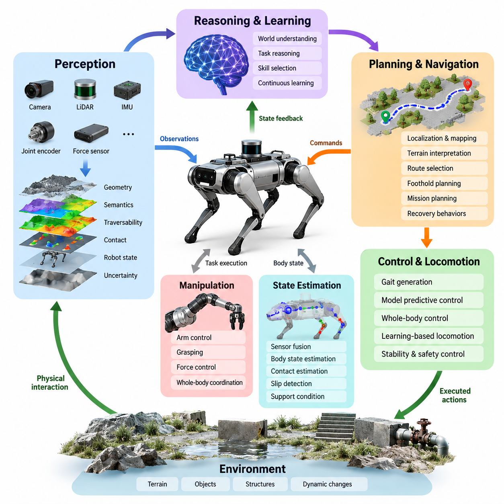
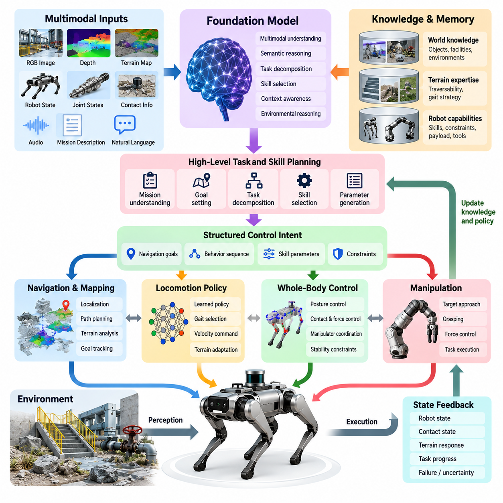
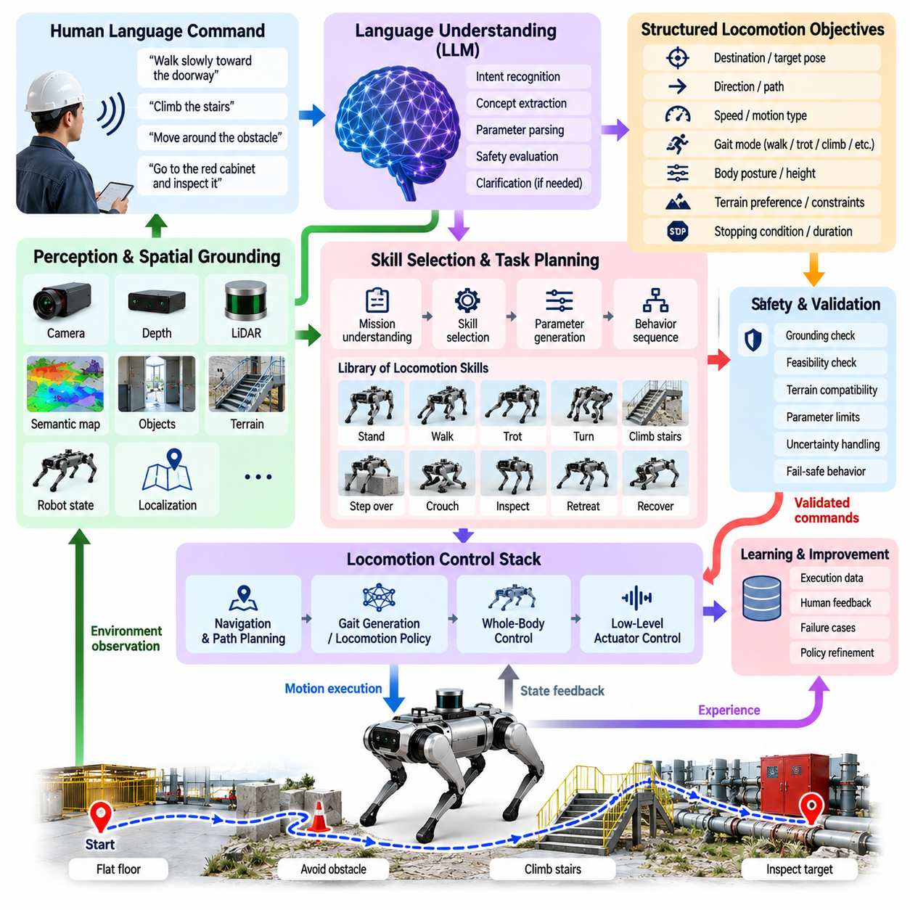
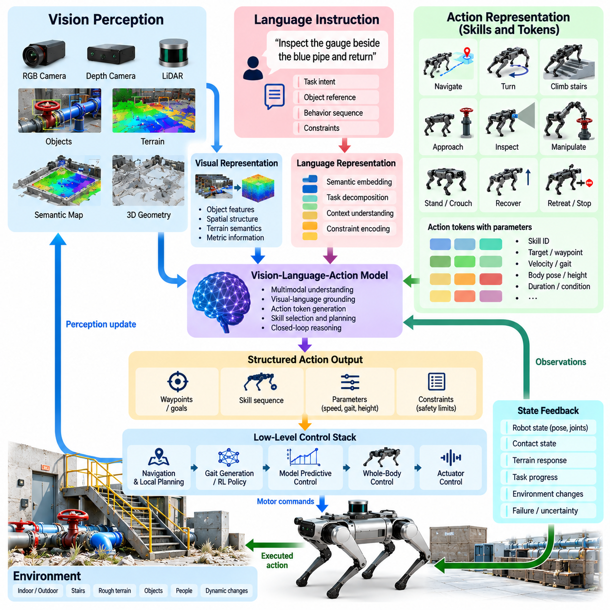
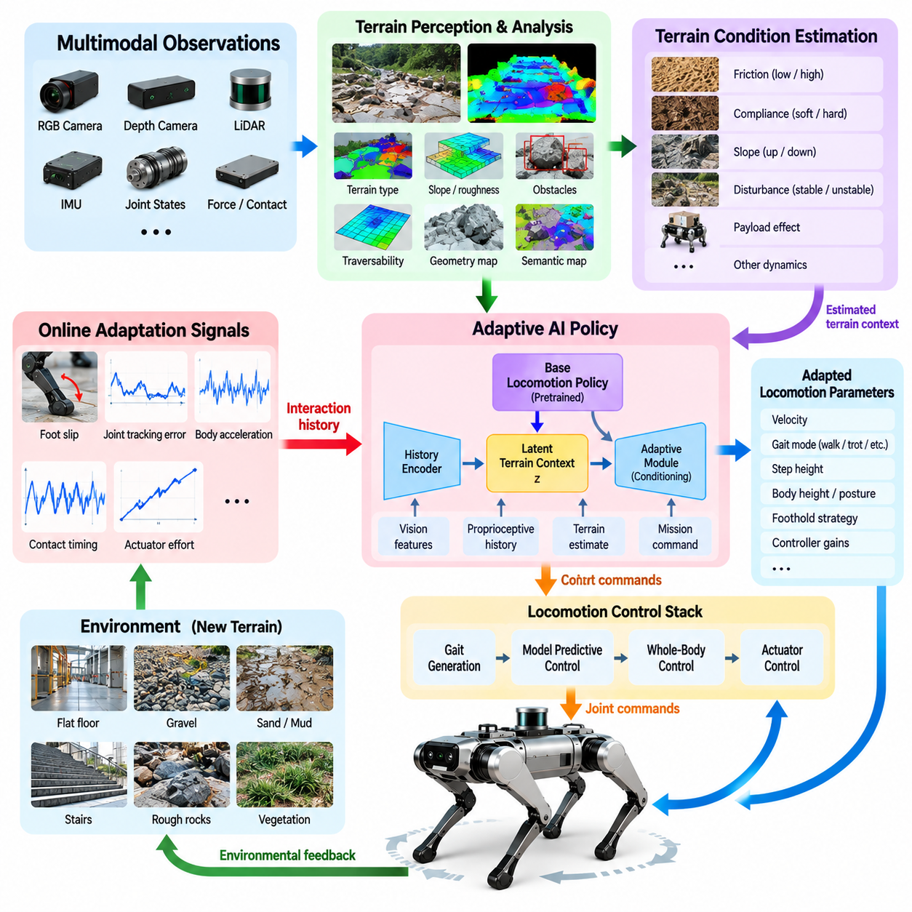
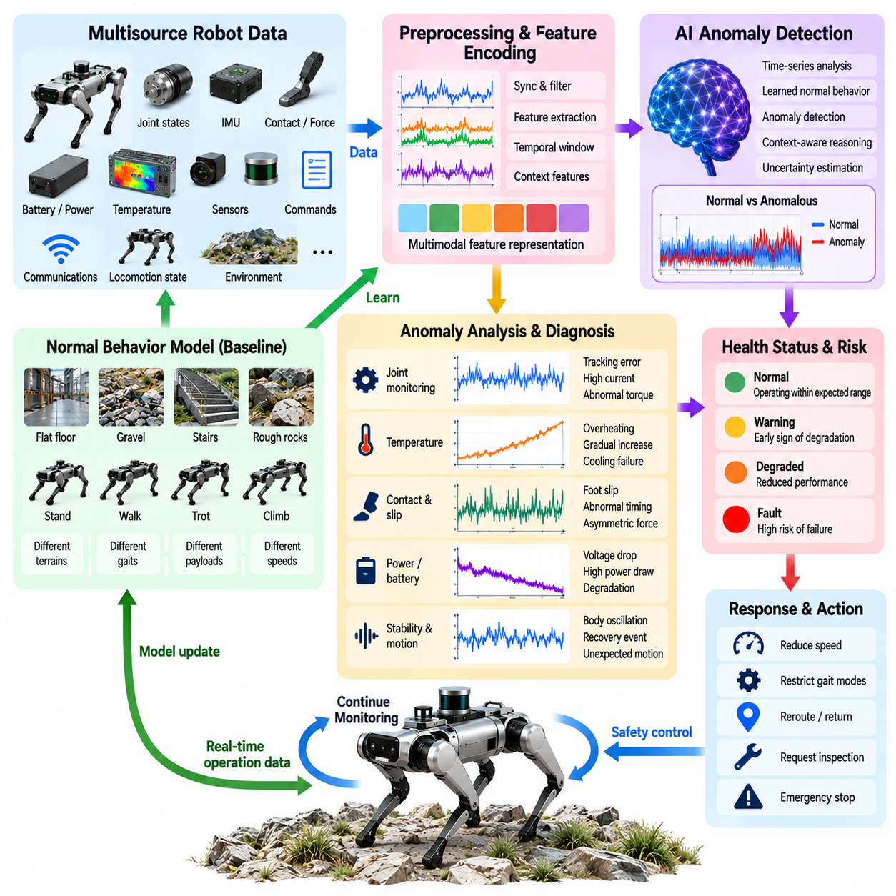
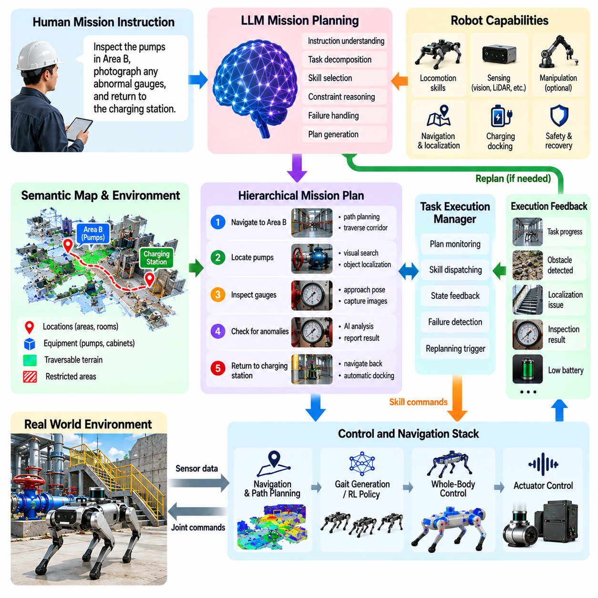
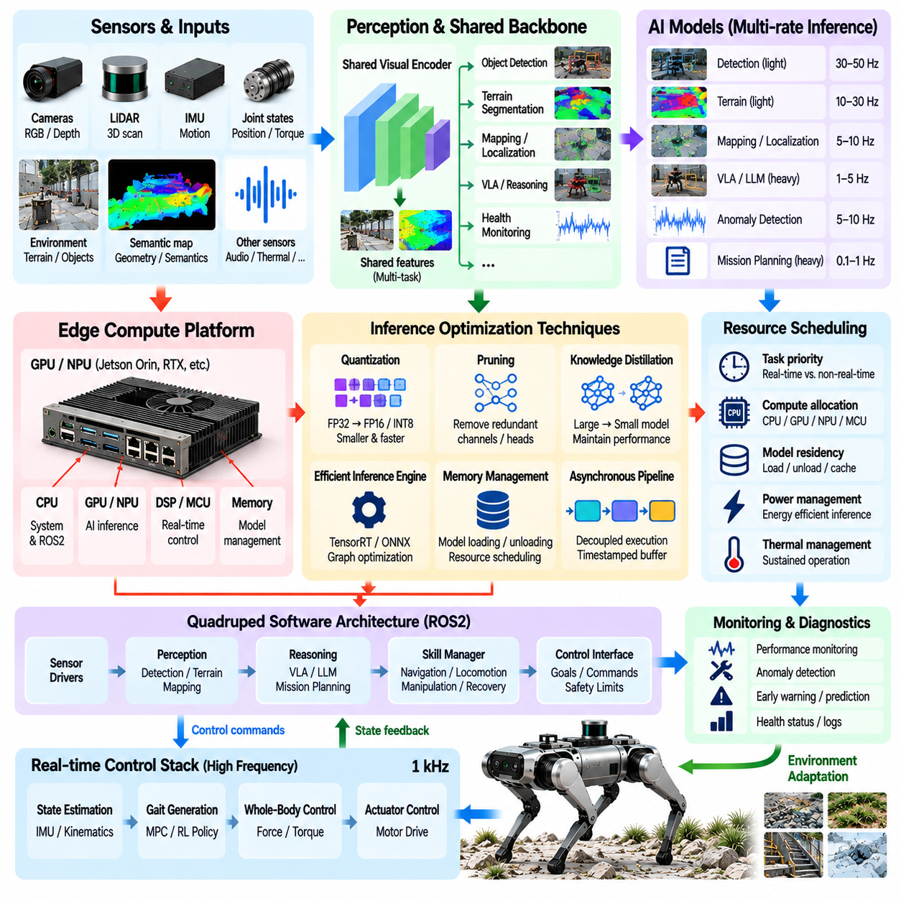
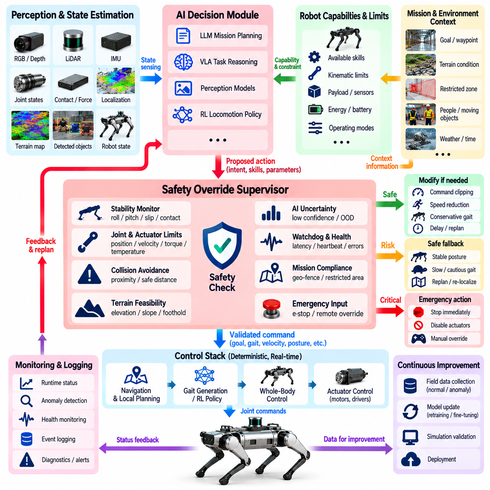
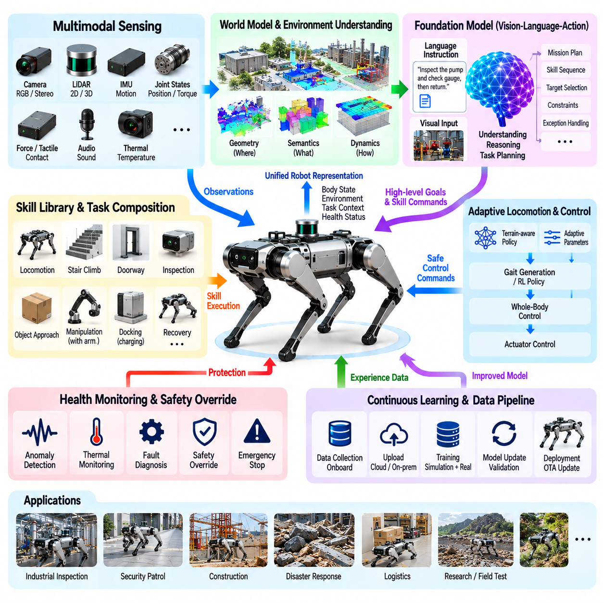

**Volume 21. Quadruped Robot Software**

# Chapter 10. Quadruped AI and Physical AI

## 10.01. Physical AI Integration Points for Quadruped

{width="7.268055555555556in" height="7.268055555555556in"}

4족 보행 로봇(Quadruped Robot)에서 피지컬 AI(Physical AI)는 인식(Perception), 추론(Reasoning), 학습(Learning), 계획(Planning), 물리 제어(Physical Control)가 서로 분리된 소프트웨어 모듈로 구현되는 것이 아니라 연속적인 폐루프(Closed Loop)로 통합될 때 구현된다. 4족 보행 로봇은 주변 환경과 내부 상태를 관찰하고, 그 물리적 의미를 해석하며, 임무를 만족시키는 행동을 선택하고, 보행(Locomotion) 또는 조작(Manipulation)을 통해 행동을 실행한 후, 그 결과 상태를 평가하여 다음 의사결정을 수행해야 한다. 이러한 통합은 기존 보행 스택(Locomotion Stack)을 체화 지능 시스템(Embodied Intelligence System)으로 확장한다.

첫 번째 통합 지점(Integration Point)은 다중 모달 인식(Multimodal Perception)이다. 카메라(Camera), 깊이 센서(Depth Sensor), 라이다(LiDAR), 관성 측정 장치(IMU), 관절 인코더(Joint Encoder), 힘 추정(Force Estimation) 및 기타 고유수용성 감각(Proprioceptive Signal)은 로봇과 환경에 대한 상호 보완적인 관측 정보를 제공한다. 피지컬 AI(Physical AI)는 이러한 측정값을 원시 센서 스트림(Raw Sensor Stream)에서 지형 형상(Terrain Geometry), 의미 객체(Semantic Object), 주행 가능성(Traversability), 접촉 조건(Contact Condition), 로봇 상태(Robot State), 불확실성(Uncertainty) 등의 표현으로 변환해야 한다. 이러한 표현은 상위 수준 AI 모델이 추론하고 의미 있는 행동을 생성할 수 있는 물리적 맥락(Physical Context)을 형성한다.

지형 인식(Terrain Perception)은 4족 보행 로봇이 개별적인 발 접촉(Foot Contact)을 통해 환경과 상호작용하기 때문에 특히 중요하다. 장애물은 단순히 회피해야 할 객체로만 표현될 수 없으며, 시스템은 해당 장애물을 넘어갈 수 있는지, 올라갈 수 있는지, 통과할 수 있는지 또는 발 디딤점(Foothold)으로 활용할 수 있는지를 판단해야 한다. 따라서 고도 지도(Elevation Map), 의미 지도(Semantic Map), 기하학적 특징(Geometric Feature), 학습된 지형 임베딩(Learned Terrain Embedding)을 보행 패턴 선택(Gait Selection), 발 디딤점 계획(Foothold Planning), 보행 정책(Locomotion Policy)과 연결할 수 있다. 이러한 결합은 환경에 대한 이해를 물리적으로 실행 가능한 행동으로 직접 변환한다.

두 번째 통합 지점은 AI 인식(AI Perception)과 상태 추정(State Estimation) 사이에 존재한다. 시각 관측(Visual Observation)은 외부 환경의 기하학적 구조를 설명할 수 있으며, 관성 측정 장치(IMU), 인코더(Encoder), 접촉 정보(Contact Information)는 몸체의 움직임과 지지 상태를 추정한다. 외수용성 정보(Exteroceptive Information)와 고유수용성 정보(Proprioceptive Information)를 결합하면 로봇은 겉으로 관찰되는 환경 변화와 자신의 움직임을 구별하고, 미끄러짐(Slipping), 예상하지 못한 접촉(Unexpected Contact), 불안정한 지지(Unstable Support), 지형 변형(Terrain Deformation)과 같은 사건을 인식할 수 있다. 이렇게 생성된 상태 표현(State Representation)은 학습 기반 지능(Learned Intelligence)과 결정론적 제어(Deterministic Control)를 연결하는 공통 인터페이스(Shared Interface)가 된다.

피지컬 AI(Physical AI)는 또한 다리형 플랫폼(Legged Platform)에 필요한 안정성 메커니즘(Stability Mechanism)을 우회하지 않으면서 상위 수준 의사결정(High-Level Decision)을 보행 명령(Locomotion Command)에 연결해야 한다. AI 모델은 목적지(Destination), 속도(Velocity), 자세(Posture), 보행 패턴(Gait), 선호 발 디딤점(Foothold Preference), 상호작용 행동(Interaction Behavior)을 요청할 수 있지만, 이러한 명령은 보행 생성(Gait Generation), 모델 예측 제어(Model Predictive Control, MPC), 전신 제어(Whole-Body Control, WBC), 학습 기반 보행 정책(Learned Locomotion Policy)을 위한 제약된 참조 명령(Constrained Reference)으로 변환되어야 한다. 모델 기반(Model-Based), 학습 기반(Learning-Based), 하이브리드 보행(Hybrid Locomotion) 접근법은 지능형 정책(Intelligent Policy)이 실제 물리적 움직임에 영향을 줄 수 있는 여러 인터페이스를 제공한다.

전신 제어(Whole-Body Control)는 또 하나의 핵심적인 경계 영역을 형성한다. 상위 수준 지능(High-Level Intelligence)은 센서 방향 조정, 관측 방향 유지, 화물 운반, 로봇 팔 위치 결정, 보행 중 객체 접근 등의 작업을 지정할 수 있다. 전신 제어(WBC)는 접촉(Contact), 토크(Torque), 마찰(Friction), 자세(Posture), 안정성(Stability) 제약을 만족시키면서 이러한 목표를 동역학적으로 일관된 힘(Dynamically Consistent Force)과 관절 명령(Joint Command)으로 변환한다. 따라서 피지컬 AI(Physical AI)는 저수준 제어(Low-Level Control)를 대체하는 것이 아니라 작업 의도(Task Intent)를 제공하며, 제어 계층(Control Layer)은 물리적 실행 가능성(Physical Feasibility)과 안전한 실행(Safe Execution)을 보장한다.

학습 기반 보행(Learning-Based Locomotion)은 특히 직접적인 통합 경로를 제공한다. 강화학습(Reinforcement Learning, RL) 정책은 관측값과 명령을 관절 목표값(Joint Target) 또는 기타 제어 참조값(Control Reference)으로 매핑할 수 있으며, 시뮬레이션(Simulation), 지형 커리큘럼(Terrain Curriculum), 특권 학습(Privileged Learning), 액추에이터 모델링(Actuator Modeling), 도메인 랜덤화(Domain Randomization)를 이용하여 실제 로봇에 배포하기 전에 강건성(Robustness)을 향상시킬 수 있다. 온보드 추론(Onboard Inference)은 학습된 정책을 실제 로봇의 실시간 루프(Real-Time Loop) 내부에 배치함으로써 학습 기반 지능을 물리적 행동으로 연결한다.

내비게이션(Navigation)은 보다 긴 시간 범위(Longer Temporal Horizon)의 통합을 요구한다. 피지컬 AI(Physical AI)는 위치 추정(Localization), 지도 작성(Mapping), 지형 해석(Terrain Interpretation), 의미 이해(Semantic Understanding), 경로 선택(Route Selection), 보행 실행 가능성(Locomotion Feasibility)을 결합해야 한다. 기존 경로 계획기(Conventional Planner)가 기하학적으로 충돌이 없는 경로를 결정하더라도, 4족 보행 로봇은 해당 경로상의 표면을 실제로 통과할 수 있는지를 추가로 판단해야 한다. 장비 탐색이나 검사 대상 접근과 같은 의미적 목표(Semantic Goal)는 내비게이션 목표로 변환되고, 다시 지형 인식 경로(Terrain-Aware Path), 발 디딤점(Foothold), 보행 명령(Gait Command), 복구 행동(Recovery Behavior)으로 구체화될 수 있다.

조작(Manipulation)은 로봇이 의도적으로 환경을 변화시킬 수 있기 때문에 또 다른 통합 차원을 추가한다. 로봇 팔(Arm)이 장착된 4족 보행 로봇은 밸브(Valve)를 향해 이동하고, 몸체를 안정화하며, 조작기(Manipulator)를 작업 공간(Workspace) 내부에 배치하고, 접촉을 형성하고, 힘을 가하며, 부유 베이스(Floating Base)에 전달되는 반력을 보상해야 할 수 있다. 따라서 AI 인식(AI Perception)과 작업 추론(Task Reasoning)은 보행(Locomotion), 파지(Grasping), 힘 제어(Force Control), 전신 협조 제어(Whole-Body Coordination)와 상호작용해야 한다.

파운데이션 모델(Foundation Model)은 의미적 지식(Semantic Knowledge)을 체화된 관측(Embodied Observation) 및 행동(Action)과 연결하는 인터페이스를 제공한다. 다중 모달 모델(Multimodal Model)은 시각 장면(Visual Scene), 언어 명령(Language Instruction), 임무 맥락(Mission Context), 로봇 상태(Robot State)를 해석할 수 있으며, 행동 지향 모델(Action-Oriented Model)은 이러한 표현을 목표(Goal), 기술(Skill), 정책 명령(Policy Command)으로 변환할 수 있다. 4족 보행 로봇에서 유용한 출력은 제한되지 않은 텍스트가 아니라 검사(Inspect), 접근(Approach), 횡단(Traverse), 관측(Observe), 조작(Manipulate), 후퇴(Retreat), 복구(Recover)와 같은 구조화된 물리적 의도(Structured Physical Intent)이다. 이러한 의도는 최종적으로 실행 가능한 로봇 능력(Executable Robot Capability)에 기반하여 구체화되어야 한다.

비전-언어-행동(Vision-Language-Action, VLA) 통합은 시각적 관측(Visual Observation)과 언어 수준 목표(Language-Level Objective)를 행동과 연결함으로써 이러한 개념을 확장한다. 특정 기계를 검사하라는 명령을 수행하려면 시스템은 목표물을 식별하고, 접근 가능성을 추론하며, 적절한 관측 위치까지 이동하고, 센서 방향을 조정하고, 균형을 유지하며, 측정 데이터를 수집한 후 임무 조건이 충족되었는지를 판단해야 한다. VLA 계층(VLA Layer)은 이러한 의미적 관계를 조정할 수 있으며, 전문화된 보행 및 제어 모듈(Specialized Locomotion and Control Module)은 실시간 물리 제약(Real-Time Physical Constraint) 아래에서 행동을 실행한다.

월드 모델(World Model)은 행동 이후 환경과 로봇 상태가 어떻게 변화할 수 있는지를 표현함으로써 또 하나의 중요한 피지컬 AI(Physical AI) 통합 지점을 제공한다. 현재 관측에만 반응하는 대신, 4족 보행 로봇은 발 디딤점이 안정적으로 유지될 가능성, 특정 경로가 험난한 지형으로 이어지는지 여부, 상호작용으로 인해 장면이 어떻게 변화하는지 등의 결과를 예측할 수 있다. 예측 표현(Predictive Representation)은 미래 상태(Future State)에 대한 계획을 지원할 수 있지만, 실제 물리 환경에는 모델 추론만으로 제거할 수 없는 불확실성이 존재하므로 예측 결과는 항상 센서 피드백(Sensor Feedback)과 결합되어야 한다.

엣지 컴퓨팅(Edge Computing)은 이러한 AI 기능을 로봇의 시간 요구조건(Timing Requirement)과 연결한다. 인식 네트워크(Perception Network), 학습된 보행 정책(Learned Locomotion Policy), 다중 모달 모델(Multimodal Model), 이상 탐지기(Anomaly Detector), 계획 모듈(Planning Module)은 서로 다른 주기와 계산 비용으로 동작할 수 있다. 빠른 균형 제어(Balance Control)와 액추에이터 제어(Actuator Control)는 결정론적으로 유지되어야 하지만, 상대적으로 느린 의미 추론(Semantic Reasoning)은 비동기적으로 실행될 수 있다. 따라서 소프트웨어 아키텍처(Software Architecture)는 모든 모델이 동일한 제어 주기로 동작한다고 가정하는 대신 AI 추론과 실시간 제어 사이에 명시적인 인터페이스, 타임스탬프(Timestamp), 유효 기간(Validity Period), 명령 우선순위(Command Priority), 폴백 동작(Fallback Behavior)을 정의해야 한다.

안전성(Safety)은 다른 모든 피지컬 AI(Physical AI) 기능을 둘러싸는 최종 통합 경계이다. 학습 모델이나 파운데이션 모델(Foundation Model)이 생성한 명령이 액추에이터(Actuator), 접촉(Contact), 토크(Torque), 속도(Velocity), 안정성(Stability), 작업 공간(Workspace) 제약을 직접 우회해서는 안 된다. 안전 모니터(Safety Monitor)는 제안된 행동을 검증하고, 명령 범위를 제한하며, 이상 상태(Anomalous State)를 탐지하고, 실행 불가능한 행동(Infeasible Behavior)을 거부하며, 필요한 경우 제어 권한을 결정론적 복구 제어기(Deterministic Recovery Controller)로 전환할 수 있다.

따라서 완전한 4족 보행 피지컬 AI 시스템(Quadruped Physical AI System)은 긴밀하게 연결된 여러 피드백 루프(Feedback Loop)의 계층 구조로 이해할 수 있다. 센서는 물리적 상태(Physical State)를 확립하고, 인식(Perception)은 기하학적 정보와 의미 정보를 추출하며, AI 모델은 맥락과 임무 의도를 해석하고, 계획(Planning)은 실행 가능한 행동을 선택하며, 보행 제어(Locomotion Control)와 전신 제어(Whole-Body Control)는 해당 행동을 현실 세계에서 구현한다. 그리고 새로운 관측 결과는 행동의 결과를 측정하여 다음 의사결정을 위한 증거(Evidence)로 다시 제공된다. 의미적 의사결정(Semantic Decision)이 안전하고 실행 가능한 행동으로 구체화되고, 모든 물리적 결과가 다음 의사결정을 위한 피드백으로 되돌아올 때 비로소 지능은 물리적 의미를 갖게 된다.

## 10.02. Foundation Model Based Quadruped Control [w/Code]

{width="7.268055555555556in" height="7.268055555555556in"}

파운데이션 모델 기반 4족 보행 로봇 제어(Foundation-Model-Based Quadruped Control)는 기존의 보행 제어(Locomotion Control)와 전신 제어(Whole-Body Control) 상위에 계층적 지능(Hierarchical Intelligence)을 도입한다. 파운데이션 모델(Foundation Model)은 실시간 제어기(Real-Time Controller)를 대체하는 대신 다중 모달 관측(Multimodal Observation), 임무 명령(Mission Instruction), 환경 맥락(Environmental Context), 로봇 능력(Robot Capability)을 해석하여 구조화된 제어 의도(Structured Control Intent)를 생성한다. 이러한 의도는 보행 생성기(Gait Generator), 보행 정책(Locomotion Policy), 궤적 계획기(Trajectory Planner), 모델 예측 제어기(Model Predictive Controller), 전신 제어기(Whole-Body Controller)가 실행할 수 있는 제한된 명령(Bounded Command)으로 변환된다.

4족 보행 로봇 운용을 위한 파운데이션 모델(Foundation Model)은 RGB 영상, 깊이 관측(Depth Observation), 지형 지도(Terrain Map), 로봇 자세(Robot Pose), 관절 상태(Joint State), 접촉 추정(Contact Estimation), 임무 설명(Mission Description), 작업자 언어(Operator Language)를 포함한 이질적인 입력을 받을 수 있다. 이러한 모달리티(Modality)는 동일한 물리적 상황의 서로 다른 측면을 표현하므로 공통 표현(Common Representation)이 필요하다. 다중 모달 인코더(Multimodal Encoder)는 이를 환경 의미(Environmental Semantics), 기하학적 관계(Geometric Relationship), 로봇 구성(Robot Configuration), 작업 맥락(Task Context), 잠재적 상호작용 가능성(Potential Interaction Opportunity)을 나타내는 잠재 특징(Latent Feature)으로 변환할 수 있다.

제어 아키텍처(Control Architecture)는 의미 추론(Semantic Reasoning)과 동적 안정화(Dynamic Stabilization)를 구분해야 한다. 장면을 이해하거나 행동을 선택하는 데에는 킬로헤르츠 수준의 갱신 속도가 필요하지 않으므로 파운데이션 모델 추론(Foundation-Model Inference)은 상대적으로 낮은 주파수에서 동작할 수 있다. 반면 액추에이터 제어(Actuator Control), 상태 추정(State Estimation), 균형 조절(Balance Regulation), 전신 제어(Whole-Body Control)는 결정론적인 고주파 실행(Deterministic High-Frequency Execution)이 필요하다. 따라서 파운데이션 모델은 제한되지 않은 모터 토크(Motor Torque)를 직접 생성하기보다 목표(Goal), 제약조건(Constraint), 기술 선택(Skill Selection), 참조 명령(Reference Command)을 생성해야 한다.

유용한 추상화 방법은 4족 보행 로봇의 행동을 재사용 가능한 물리 기술(Reusable Physical Skill)로 구성하는 것이다. 기술에는 기립(Stand), 보행(Walk), 트로트(Trot), 회전(Turn), 등반(Climb), 접근(Approach), 검사(Inspect), 웅크리기(Crouch), 복구(Recover), 조작(Manipulate), 후퇴(Retreat) 등이 포함될 수 있다. 파운데이션 모델은 현재 작업과 환경에 따라 이러한 능력을 선택하고 매개변수화(Parameterization)한다. 따라서 검사 대상에 접근하라는 명령은 하나의 불투명한 행동(Opaque Action)이 아니라 내비게이션(Navigation), 지형 횡단(Terrain Traversal), 몸체 방향 조정(Body Orientation), 센서 위치 결정(Sensor Positioning), 안정화(Stabilization) 기술의 연속으로 변환될 수 있다.

언어(Language)는 이러한 계층 구조에 대한 직관적인 인터페이스를 제공한다. 작업자는 특정 기계로 이동하여 전면 패널을 검사하고 경로가 위험해질 경우 복귀하라는 것과 같은 임무를 지정할 수 있다. 파운데이션 모델(Foundation Model)은 의미적 의도(Semantic Intent)를 해석하고 이를 실행 가능한 목표(Executable Objective)로 분해한다. 각각의 목표는 목표 자세(Target Pose), 허용 가능한 지형 등급(Allowable Terrain Class), 원하는 카메라 방향(Desired Camera Orientation), 보행 속도(Locomotion Velocity), 정지 거리(Stopping Distance), 종료 조건(Termination Condition)과 같이 측정 가능한 로봇 상태에 기반하여 구체화되어야 한다.

시각 정보(Visual Information)는 모델이 언어 수준의 개념(Language-Level Concept)을 물리 환경의 객체 및 영역과 연관시키도록 한다. 예를 들어 "큰 파이프 옆의 밸브"라는 표현은 로봇이 언어적 설명을 시각적 관측(Visual Observation) 및 공간 좌표(Spatial Coordinate)와 연결할 수 있을 때만 의미를 가진다. 그라운딩(Grounding)이 이루어지면 선택된 목표를 내비게이션(Navigation) 또는 조작 모듈(Manipulation Module)에 전달할 수 있다. 따라서 파운데이션 모델은 기존의 기하학적 추정(Geometric Estimation)과 제어 구성요소를 제거하는 것이 아니라 의미적 식별(Semantic Identification)과 이들을 연결한다.

지형 이해(Terrain Understanding)는 의미적 해석(Semantic Interpretation)이 최종적으로 접촉 실행 가능성(Contact Feasibility)을 만족해야 하기 때문에 4족 보행 로봇 제어에서 특히 중요하다. 파운데이션 모델은 계단(Stairs), 암석(Rocks), 잔해(Debris), 식생(Vegetation), 파이프(Pipes), 좁은 통로(Narrow Passage)를 인식할 수 있지만, 실제로 이러한 구조를 통과할 수 있는지는 보행 시스템(Locomotion System)이 판단해야 한다. 따라서 의미적 지형 정보(Semantic Terrain Information)는 보행 패턴 선택(Gait Selection), 속도 제한(Speed Limit), 몸체 높이(Body Height), 발 디딤점 선호(Foothold Preference), 지역 경로 계획(Local Planning)의 조건으로 활용될 수 있으며, 전용 제어기는 균형(Balance), 마찰(Friction), 도달 가능성(Reachability), 접촉 제약(Contact Constraint)을 강제한다.

파운데이션 모델은 여러 보행 전략(Locomotion Strategy) 가운데 적절한 방법을 선택하기 위한 맥락(Context)을 제공할 수도 있다. 평탄한 산업 시설 통로에서는 효율적인 트로트(Trot)가 가능하지만, 느슨한 자갈(Loose Gravel)에서는 보다 느린 이동과 보수적인 발 디딤점이 필요할 수 있다. 계단에서는 전용 등반 행동(Climbing Behavior)이 필요하며, 불확실한 지형에서는 이동하기 전에 탐색적 센싱(Exploratory Sensing)을 수행할 수 있다. 모델은 이러한 상황을 작업 수준(Task Level)에서 추론하고, 모델 기반(Model-Based) 또는 강화학습 기반(Reinforcement-Learning-Based) 보행 정책이 실제 물리적 전략을 실행하도록 할 수 있다.

강화학습(Reinforcement Learning)과의 통합은 일반적인 추론(General Reasoning)과 전문화된 운동 능력(Specialized Motor Competence)을 실용적으로 분리할 수 있게 한다. 파운데이션 모델은 학습된 보행 정책(Learned Locomotion Policy)을 선택하고 목표 속도(Desired Velocity), 보행 모드(Gait Mode), 몸체 자세(Body Posture), 지형 목표(Terrain Objective)와 같은 명령을 제공할 수 있다. 이후 강화학습 정책은 관측값과 명령을 고주파 제어 참조값(High-Frequency Control Reference)으로 변환한다. 이러한 분리는 광범위한 의미 지능(Semantic Intelligence)이 동적인 4족 보행을 위해 전문적으로 학습된 운동 정책(Motor Policy)을 활용할 수 있도록 한다.

전신 제어(Whole-Body Control)는 또 다른 실행 인터페이스(Execution Interface)를 제공한다. 4족 보행 로봇에 조작기(Manipulator), 센서 마스트(Sensor Mast), 탑재물(Payload), 검사 장치(Inspection Device)가 장착되면 파운데이션 모델의 결정에는 여러 몸체 목표(Body Objective)가 동시에 포함될 수 있다. 모델은 목표에 접근하면서 카메라 가시성(Camera Visibility)을 유지하거나 밸브를 조작하는 동안 베이스(Base)를 안정화하는 것과 같은 우선순위를 지정할 수 있다. 전신 제어는 관절(Joint), 접촉(Contact), 마찰(Friction), 토크(Torque), 안정성(Stability) 제약조건 아래에서 이러한 목표를 해결하고 동역학적으로 일관된 명령(Dynamically Consistent Command)을 생성한다.

임무가 하나의 행동을 넘어 지속될 경우 시간적 추론(Temporal Reasoning)이 중요해진다. 로봇은 여러 지형 영역을 통과하고, 여러 설비를 검사하며, 예상하지 못한 장애물에 대응하고, 충전 위치(Charging Location)로 복귀해야 할 수 있다. 파운데이션 모델은 작업 맥락(Task Context)을 유지하면서 관측 결과와 이전 행동의 결과를 기반으로 다음에 실행할 기술을 결정할 수 있다. 그러나 생성된 계획이 성공했다고 가정하는 것이 아니라 실제 행동의 성공 여부를 판단하는 최종 기준은 항상 물리적 상태(Physical State)가 되어야 한다.

메모리(Memory)를 추가하면 이전에 관측한 위치, 장애물, 실패한 행동, 지형 상태, 임무 진행 상황에 관한 정보를 유지함으로써 이러한 아키텍처를 확장할 수 있다. 이러한 정보를 활용하면 4족 보행 로봇은 모든 관측을 독립적으로 처리하지 않고 이후의 의사결정을 적응적으로 변경할 수 있다. 단기 메모리(Short-Term Memory)는 즉각적인 작업 실행을 지원하며, 장기 의미 메모리(Long-Term Semantic Memory) 또는 에피소드 표현(Episodic Representation)은 반복적으로 등장하는 환경을 인식하고 이전에 성공했던 전략을 재사용하는 데 활용될 수 있다.

예측 모델(Predictive Model)은 후보 행동을 실행하기 전에 그 결과를 추정함으로써 제어 성능을 더욱 향상시킬 수 있다. 시스템은 전진, 보행 패턴 변경, 다른 발 디딤 영역 선택, 대체 경로 이용 중 어떤 행동이 보다 안전한 상태를 만들어낼 가능성이 높은지를 비교할 수 있다. 이러한 예측은 의미 추론(Semantic Reasoning)과 물리 계획(Physical Planning) 사이의 월드 모델(World Model) 인터페이스와 유사하다. 예측 오차(Prediction Error)는 피할 수 없으므로 모델이 생성한 예상 결과는 지속적으로 실제 측정 상태(Measured State)와 비교되고 피드백(Feedback)을 통해 수정되어야 한다.

파운데이션 모델 추론(Foundation-Model Inference)은 계산 자원 제약(Computational Constraint)도 발생시킨다. 대규모 다중 모달 네트워크(Large Multimodal Network)는 기존 로봇 제어기보다 훨씬 많은 메모리와 연산 능력을 요구할 수 있지만, 이동형 4족 보행 로봇은 전력과 열 관리 능력이 제한되어 있다. 따라서 실제 시스템에서는 압축 모델(Compressed Model), 양자화(Quantization), 가속 추론(Accelerated Inference), 비동기 실행(Asynchronous Execution), 계층적 스케줄링(Hierarchical Scheduling)을 결합할 수 있다. 시간에 민감한 제어(Time-Critical Control)는 로컬에서 결정론적으로 유지하고, 계산 비용이 높은 추론은 새로운 의미적 의사결정이 필요한 경우에만 실행할 수 있다.

원격 엣지(Remote Edge) 또는 클라우드 자원(Cloud Resource)과의 통신은 사용 가능한 지능을 확장할 수 있지만, 보행 안전성(Locomotion Safety)이 네트워크 연결에만 의존해서는 안 된다. 원격 연산은 대규모 모델 추론(Large-Model Inference), 지도 분석(Map Analysis), 임무 최적화(Mission Optimization), 플릿 수준 지식(Fleet-Level Knowledge)을 지원할 수 있지만, 온보드 시스템(Onboard System)은 상태 추정(State Estimation), 안정화(Stabilization), 장애물 대응(Obstacle Response), 비상 행동(Emergency Behavior)을 유지해야 한다. 통신이 끊어지더라도 물리적 제어 능력을 상실하는 것이 아니라 정의된 방식으로 기능이 축소되어야 한다.

안전성(Safety)을 확보하려면 모델이 생성한 모든 명령이 실행 경계(Execution Boundary)를 통과해야 한다. 제안된 속도(Velocity), 자세(Pose), 발 디딤점(Foothold), 조작 목표(Manipulation Target), 기술 전환(Skill Transition)은 로봇의 한계와 현재 환경 조건을 기준으로 검증되어야 한다. 신뢰도 추정(Confidence Estimation), 상태 유효성(State Validity), 충돌 제약(Collision Constraint), 안정성 여유(Stability Margin), 액추에이터 한계(Actuator Limit), 통신 상태(Communication Health)를 이러한 검증에 활용할 수 있다. 허용된 운용 범위(Operating Envelope)를 벗어나는 명령은 거부하거나 수정하거나 검증된 폴백 행동(Verified Fallback Behavior)으로 대체해야 한다.

따라서 불확실성(Uncertainty)은 모델 출력 내부에 숨겨두는 것이 아니라 명시적으로 표현해야 한다. 모호한 객체 인식(Ambiguous Object Recognition), 불완전한 지형 관측(Incomplete Terrain Observation), 불확실한 위치 추정(Uncertain Localization), 익숙하지 않은 상황(Unfamiliar Situation)이 발생하면 로봇은 추가 센싱(Additional Sensing)을 요청하거나 속도를 낮추거나 정지하거나 보수적인 제어기(Conservative Controller)로 제어 권한을 전환할 수 있다. 파운데이션 모델은 의미적 추론이 충분히 물리적 근거를 확보한 상황과 추가적인 물리적 증거(Physical Evidence)가 필요한 상황을 구별할 수 있을 때 물리 제어에서 더욱 유용해진다.

이러한 시스템을 학습하려면 인식(Perception), 언어(Language), 상태(State), 행동(Action), 물리적 결과(Physical Outcome)를 연결하는 데이터가 필요하다. 시연(Demonstration), 원격 조작 궤적(Teleoperation Trajectory), 시뮬레이션 에피소드(Simulation Episode), 내비게이션 기록(Navigation Record), 조작 시퀀스(Manipulation Sequence), 실패 사례(Failure Case), 합성 환경(Synthetic Environment)은 상호 보완적인 학습 데이터를 제공할 수 있다. 목표는 단순히 그럴듯한 행동을 예측하는 것이 아니라 작업 의도, 환경 조건, 로봇 능력, 성공적인 물리적 실행 사이의 관계를 보존하는 표현(Representation)을 학습하는 것이다.

시뮬레이션(Simulation)은 실제 로봇에 배포하기 전에 파운데이션 모델의 의사결정을 평가할 수 있는 확장 가능한 환경을 제공한다. 다양한 지형, 센서 성능 저하(Sensor Degradation), 장애물, 외란(Disturbance), 탑재물, 임무 명령을 이용하면 실제 하드웨어로 반복 재현하기에는 비용이 높거나 위험한 상황을 모델에 경험시킬 수 있다. 그러나 접촉 동역학(Contact Dynamics), 센서 아티팩트(Sensor Artifact), 액추에이터 거동(Actuator Behavior), 통신 지연(Communication Latency), 환경 불확실성(Environmental Uncertainty)은 완벽하게 모델링하기 어렵기 때문에 시뮬레이션 결과 이후에는 반드시 실제 하드웨어 검증(Hardware Validation)이 수행되어야 한다.

최종적으로 이러한 아키텍처는 기존 4족 보행 로봇 소프트웨어 스택(Quadruped Software Stack)을 종단간 방식(End-to-End)으로 대체하는 구조가 아니라 계층 구조(Hierarchy)로 이해하는 것이 적절하다. 파운데이션 모델은 의미적 해석(Semantic Interpretation), 작업 분해(Task Decomposition), 맥락 추론(Contextual Reasoning), 기술 선택(Skill Selection), 적응(Adaptation)을 담당한다. 내비게이션(Navigation), 학습 기반 보행(Learned Locomotion), 모델 예측 제어(Model Predictive Control), 전신 제어(Whole-Body Control), 액추에이터 루프(Actuator Loop)는 점차 빠르고 물리적으로 강하게 제약된 실행 계층을 구성한다. 각 계층의 피드백은 지속적으로 상위 계층의 의사결정에 반영된다.

따라서 파운데이션 모델 기반 4족 보행 로봇 제어(Foundation-Model-Based Quadruped Control)는 범용 AI 추론(General-Purpose AI Reasoning)과 전문화된 체화 능력(Specialized Embodied Competence)을 연결한다. 그 가치는 로봇이 보다 광범위한 명령과 익숙하지 않은 상황을 이해하면서도 안정적인 보행에 필요한 결정론적 메커니즘(Deterministic Mechanism)을 유지할 수 있도록 하는 데 있다. 성공적인 구현에서는 의미 지능(Semantic Intelligence)과 물리적 제어 권한(Physical Authority)을 명확하게 분리해야 한다. 파운데이션 모델은 의미 있는 행동을 제안하고, 검증된 계획 및 제어 계층(Validated Planning and Control Layer)은 그러한 행동이 어떻게 안전한 실제 움직임으로 구현될 수 있는지를 결정한다.

## 10.03. Language Commanded Quadruped Locomotion [w/Code]

{width="7.268055555555556in" height="7.268055555555556in"}

언어 명령 기반 4족 보행(Language-Commanded Quadruped Locomotion)은 인간의 의도(Human Intent)와 다리형 로봇(Legged Robot)의 물리적 이동 능력(Physical Motion Capability)을 연결하는 의미적 인터페이스(Semantic Interface)를 제공한다. 작업자가 속도 벡터(Velocity Vector), 보행 매개변수(Gait Parameter), 발 디딤점(Foothold), 제어기 상태(Controller State)를 직접 지정하는 대신 시스템은 "문을 향해 천천히 걸어라", "계단을 올라가라", "장애물을 돌아서 이동하라"와 같은 명령을 받아들인다. 언어(Language)는 작업 의도(Task Intent)로 해석되고, 기존 제어기 또는 학습 기반 제어기가 안전하게 실행할 수 있는 구조화된 보행 목표(Structured Locomotion Objective)로 변환된다.

언어 인터페이스(Language Interface)는 실시간 보행 루프(Real-Time Locomotion Loop)와 분리되어야 한다. 언어 모델(Language Model)은 상대적으로 낮은 주파수에서 명령을 해석하고 행동 목표(Behavioral Objective)를 결정할 수 있지만, 상태 추정(State Estimation), 균형 제어(Balance Control), 보행 생성(Gait Generation), 액추에이터 제어(Actuator Control)는 훨씬 높은 주파수에서 동작한다. 따라서 언어 계층(Language Layer)은 관절 토크(Joint Torque)나 액추에이터 전류(Actuator Current)를 직접 명령하는 대신 목표 방향(Desired Direction), 속도(Velocity), 목적지(Destination), 보행 모드(Gait Mode), 몸체 자세(Body Posture), 지형 선호도(Terrain Preference), 정지 조건(Stopping Condition)과 같은 제한된 매개변수를 생성한다.

자연어 해석(Natural-Language Interpretation)은 명령에 포함된 보행 관련 개념(Locomotion-Related Concept)을 식별하는 것에서 시작한다. 하나의 명령에는 이동 유형(Motion Type), 방향(Direction), 속도(Speed), 목적지(Destination), 지형(Terrain), 공간 관계(Spatial Relationship), 지속 시간(Duration), 안전 제약조건(Safety Constraint)이 동시에 포함될 수 있다. 예를 들어 "복도의 왼쪽을 따라 천천히 걷고 계단 앞에서 정지하라"라는 명령에는 속도 선호도(Velocity Preference), 공간 제약(Spatial Constraint), 경로 개념(Route Concept), 종료 조건(Termination Condition)이 포함된다. 이러한 요소는 보행을 시작하기 전에 추출되어 기계가 실행할 수 있는 형태(Machine-Executable Form)로 표현되어야 한다.

공간 그라운딩(Spatial Grounding)은 언어적 표현(Linguistic Expression)을 로봇이 인식한 환경과 연결한다. "왼쪽", "뒤쪽", "가까이", "통과하여", "향해서"와 같은 표현은 기준 좌표계(Reference Frame)와 관측된 객체(Observed Object)를 기준으로 할 때만 의미를 가진다. 비전(Vision), 깊이 센싱(Depth Sensing), 라이다(LiDAR), 위치 추정(Localization), 의미 지도(Semantic Mapping)를 이용하여 참조된 구조물을 식별하고 좌표를 추정할 수 있다. 이후 언어 시스템은 "빨간 캐비닛으로 이동하라"와 같은 설명을 물리적으로 관측 가능한 위치와 연결된 내비게이션 목표(Navigation Target)로 변환할 수 있다.

잠재적으로 위험한 움직임을 시작하기 전에 모호성(Ambiguity)을 해결해야 한다. "저쪽으로 가라"와 같은 명령에는 고유한 목표를 결정하기 위한 정보가 충분하지 않을 수 있으며, "더 빠르게 걸어라"라는 명령은 현재 관측된 지형에서 안전하지 않을 수 있다. 시스템은 언어적 참조(Linguistic Reference)가 충분히 그라운딩되었는지, 요청된 행동이 현재 조건과 호환되는지를 평가해야 한다. 신뢰도가 충분하지 않은 경우에는 명확화(Clarification), 추가 인식(Additional Perception), 이동 속도 감소(Reduced Motion), 또는 불확실한 명령 부분의 실행 거부가 적절한 대응이 된다.

언어(Language)는 보행 수준 행동(Gait-Level Behavior)을 지정할 수도 있다. "조심스럽게 이동하라", "빠르게 건너라", "물체를 넘어가라", "몸을 낮게 유지하라"와 같은 표현은 속도(Speed), 보행 유형(Gait Family), 몸체 높이(Body Height), 스텝 높이(Step Height), 듀티 팩터(Duty Factor), 발 디딤점 보수성(Foothold Conservatism), 안정성 여유(Stability Margin) 등의 보행 매개변수로 변환될 수 있다. 그러나 이러한 매핑(Mapping)은 무제한이어서는 안 된다. 요청된 매개변수는 검증된 운용 범위(Validated Operating Range) 안에 있어야 하며, 실제로 필요한 세부 다리 움직임은 보행 생성기(Gait Generator) 또는 학습된 정책(Learned Policy)이 결정해야 한다.

동일한 언어 명령도 환경에 따라 서로 다른 물리적 행동을 요구할 수 있기 때문에 지형 인식 기반 해석(Terrain-Aware Interpretation)이 필수적이다. 평탄한 바닥에서 "앞으로 이동하라"라는 명령은 일반적인 트로트(Trot)를 허용할 수 있지만, 느슨한 자갈(Loose Gravel), 계단(Stairs), 암석(Rocks), 좁고 높은 표면(Narrow Elevated Surface)에서는 서로 다른 보행 및 발 디딤 전략이 필요하다. 따라서 지형 인식(Terrain Perception)은 의미적 의도(Semantic Intent)를 보행 매개변수로 변환하는 과정에 조건을 제공하며, 언어가 목표를 지정하면 물리적 맥락(Physical Context)이 그 목표를 어떻게 달성할지를 결정한다.

계층적 기술 표현(Hierarchical Skill Representation)은 언어와 보행을 연결하는 실용적인 방법을 제공한다. 로봇은 기립(Stand), 보행(Walk), 트로트(Trot), 회전(Turn), 계단 오르기(Climb Stairs), 장애물 넘기(Step Over), 웅크리기(Crouch), 검사(Inspect), 정지(Stop), 후퇴(Retreat), 복구(Recover)와 같이 검증된 기술(Validated Skill)을 제공할 수 있다. 언어 모델은 임의의 모터 동작을 직접 생성하는 대신 하나 이상의 기술을 선택하고 해당 매개변수를 제공한다. 따라서 복잡한 명령은 명시적인 진입 조건(Entry Condition), 실행 조건(Execution Condition), 종료 조건(Termination Condition)을 가진 검증된 보행 능력의 연속으로 분해될 수 있다.

예를 들어 "계단까지 걸어가서 천천히 올라간 후 정상에서 정지하라"라는 명령은 여러 개의 연결된 행동(Connected Behavior)으로 표현할 수 있다. 먼저 내비게이션(Navigation)이 적절한 계단 진입 자세(Stair-Entry Pose)까지 접근하고, 지형 인식(Terrain Perception)이 계단의 기하학적 구조를 검증하며, 보행 관리자(Locomotion Manager)가 계단 등반 모드(Stair-Climbing Mode)를 활성화하고, 완료 조건(Completion Condition)이 상부 표면 도착 여부를 탐지한다. 언어는 행동 순서(Behavioral Sequence)를 결정하지만, 각각의 전환이 물리적으로 유효한지는 인식과 제어가 결정한다.

언어 명령 기반 보행(Language-Commanded Locomotion)은 강화학습 정책(Reinforcement-Learning Policy)과도 통합될 수 있다. 학습된 보행 정책(Learned Locomotion Policy)은 원하는 선형 속도(Desired Linear Velocity), 각속도(Angular Velocity), 몸체 높이(Body Height), 보행 관련 명령(Gait-Related Command)을 입력으로 받을 수 있다. 언어 계층은 의미적 표현(Semantic Expression)을 이러한 명령 변수(Command Variable)로 변환하고, 정책은 로봇 관측값으로부터 고주파 관절 목표값(High-Frequency Joint Target)을 생성한다. 이러한 구조는 언어 모델이 세부적인 액추에이터 동역학(Actuator Dynamics)을 이해하지 않더라도 강화학습을 통해 획득된 동적 운동 능력(Dynamic Competence)을 유지할 수 있게 한다.

내비게이션(Navigation)은 즉각적인 이동 명령보다 목적지를 포함하는 명령에 대해 또 다른 실행 경로(Execution Pathway)를 제공한다. "검사 구역으로 이동하라"라는 명령은 일반적으로 지속적인 전진 속도 명령이 아니라 의미적 내비게이션 목표(Semantic Navigation Goal)로 변환되어야 한다. 내비게이션 시스템은 경로(Route)를 결정하고, 지형 인식 기반 계획(Terrain-Aware Planning)은 주행 가능성(Traversability)을 평가하며, 보행 계층(Locomotion Layer)은 지역적으로 실행 가능한 이동 명령을 따른다. 이러한 분리를 통해 상위 수준의 언어 추론이 모든 짧은 시간 규모의 움직임을 불필요하게 직접 제어하는 것을 방지할 수 있다.

대화형 명령(Conversational Command)을 처리하려면 시간적 맥락(Temporal Context)을 유지해야 한다. 작업자가 "펌프를 향해 걸어가라"라고 명령한 후 "더 천천히", "오른쪽으로 이동해", "거기서 멈춰"라고 지시하는 경우, 후속 명령은 이전 명령과 현재의 물리적 상황에 의존한다. 따라서 언어 인터페이스에는 활성 목표(Active Target), 선택된 행동(Selected Behavior), 관련 객체(Relevant Object), 현재 제약조건(Current Constraint), 임무 진행 상태(Mission Progress)를 포함하는 단기 작업 상태(Short-Term Task State)가 필요하다. 로봇이 움직이는 동안 물리적 관측은 이러한 맥락을 지속적으로 갱신해야 한다.

언어는 직접적인 명령뿐 아니라 조건부 행동(Conditional Behavior)도 표현할 수 있다. 작업자는 로봇이 거친 지형에 도달할 때까지 계속 이동하거나, 통로가 지나치게 좁아지면 정지하거나, 통신 품질이 저하되면 복귀하도록 요청할 수 있다. 이러한 명령은 측정 가능한 로봇 또는 환경 상태를 이용하여 평가할 수 있는 명시적인 조건(Explicit Condition)으로 변환되어야 한다. 이후 실행 로직(Execution Logic)은 언어 모델 추론과 독립적으로 이러한 조건을 감시하여 중요한 정지 조건(Critical Stopping Condition)이 결정론적으로 지속해서 작동하도록 해야 한다.

부정 제약조건(Negative Constraint)은 안전한 명령 수행(Safe Instruction Following)에서 특히 중요하다. 명령에는 "젖은 구역에 들어가지 마라", "계단을 피하라", "가장자리에서 떨어져 이동하라"와 같은 요구사항이 포함될 수 있다. 이러한 제약조건은 일시적인 텍스트 맥락(Temporary Textual Context)이 아니라 지속적인 계획 및 제어 제한(Persistent Planning and Control Restriction)으로 변환되어야 한다. 의미 지도(Semantic Map), 주행 가능성 계층(Traversability Layer), 진입 금지 영역(Exclusion Region), 속도 제한(Speed Limit), 제어기 제약조건(Controller Constraint)은 해당 보행 작업 전체에서 작업자의 제한 조건을 유지하기 위한 수단을 제공한다.

시스템은 또한 명령(Command)과 설명적 대화(Descriptive Conversation)를 구별해야 한다. 작업자가 장애물에 대해 이야기하는 것만으로 발화에 보행 관련 단어가 포함되었다는 이유로 로봇이 움직여서는 안 된다. 명령 분류기(Command Classifier) 또는 대화 상태 메커니즘(Dialogue-State Mechanism)은 발화가 실행 요청(Executable Request), 명확화(Clarification), 취소(Cancellation), 정보 질의(Information Query), 관련 없는 진술(Unrelated Statement) 중 무엇인지를 판단할 수 있다. 결과의 위험도가 사전에 정의된 임계값(Risk Threshold)을 초과하는 작업에는 명시적인 실행 상태(Explicit Execution State)와 확인 정책(Confirmation Policy)을 적용할 수 있다.

안전 감독(Safety Supervision)은 언어적 의도와 관계없이 항상 최상위 권한을 유지해야 한다. 명령이 명확하게 이해되었더라도 안정성 한계(Stability Limit), 충돌 제약(Collision Constraint), 액추에이터 능력(Actuator Capability), 위치 추정 유효성(Localization Validity), 지형 불확실성(Terrain Uncertainty), 정의된 운용 경계(Operational Boundary)와 충돌하는 경우 해당 명령은 거부되거나 수정되어야 한다. 비상 정지(Emergency Stop), 낙상 방지(Fall Prevention), 자세 복구(Posture Recovery), 저수준 보호 메커니즘(Low-Level Protective Mechanism)은 언어 모델과 독립적으로 동작하여 의미적 추론이 로봇의 기본 안전 기능을 비활성화할 수 없도록 해야 한다.

지연 시간(Latency)과 연산 자원의 가용성(Computational Availability)도 고려해야 한다. 언어 해석에는 상대적으로 큰 모델이 필요할 수 있지만, 보행 시스템은 모든 제어 주기마다 반복되는 모델 추론을 기다릴 수 없다. 따라서 의미적 해석(Semantic Interpretation)은 새로운 명령, 맥락 변화(Contextual Change), 의사결정 지점(Decision Point)이 발생할 때 수행하는 것이 적절하다. 검증된 보행 기술이 활성화된 이후에는 결정론적 제어기(Deterministic Controller) 또는 온보드 학습 정책(Onboard Learned Policy)이 지속적인 언어 모델 응답에 의존하지 않고 실행을 계속할 수 있다.

시험(Testing)은 시스템이 개별 문장을 올바르게 이해하는지만 평가해서는 안 된다. 검증(Validation)은 바꾸어 표현한 명령(Paraphrase), 모호한 참조(Ambiguous Reference), 상충되는 명령(Contradictory Command), 변화하는 지형(Changing Terrain), 중단된 명령(Interrupted Instruction), 사용할 수 없는 기술(Unavailable Skill), 센서 불확실성(Sensor Uncertainty), 안전하지 않은 요청(Unsafe Request)을 포함해야 한다. 시뮬레이션(Simulation)을 통해 언어와 환경 조건의 대규모 조합을 생성할 수 있으며, 실제 하드웨어 시험(Hardware Test)을 통해 해석된 명령이 실제 센싱, 통신, 접촉, 액추에이터 제약 아래에서 예측 가능한 물리적 행동을 생성하는지 검증할 수 있다.

궁극적으로 언어 명령 기반 4족 보행(Language-Commanded Quadruped Locomotion)은 인간의 의미 표현(Human Semantics)을 물리적 실행(Physical Execution)으로 변환하는 계층적 번역 과정(Layered Translation Process)을 형성한다. 언어 모델(Language Model)은 의도와 맥락을 해석하고, 인식(Perception)은 참조된 객체와 환경을 그라운딩하며, 작업 로직(Task Logic)은 검증된 기술을 선택하고, 내비게이션 및 지형 추론(Navigation and Terrain Reasoning)은 실행 가능한 움직임을 결정하며, 보행 제어기(Locomotion Controller)는 최종 명령을 실행한다. 지속적인 피드백(Continuous Feedback)은 의도한 물리적 상태가 실제로 달성되었는지를 확인함으로써 언어적 이해가 관측 가능한 로봇 행동(Observable Robot Behavior)에 지속적으로 기반하도록 한다.

## 10.04. Vision Language Action for Quadruped [w/Code]

{width="7.268055555555556in" height="7.268055555555556in"}

4족 보행 로봇을 위한 비전-언어-행동(Vision-Language-Action, VLA) 통합은 시각 인식(Visual Perception), 의미 추론(Semantic Reasoning), 언어 명령(Language Instruction), 물리적 행동(Physical Behavior)을 하나의 통합된 체화 지능 파이프라인(Embodied Intelligence Pipeline)으로 연결한다. 목표는 단순히 로봇이 무엇을 보고 있는지를 설명하는 것이 아니라 관측 정보와 작업 명령을 물리 환경에 영향을 미치는 행동으로 변환하는 것이다. 4족 보행 로봇에서 이러한 행동은 보행(Locomotion), 몸체 위치 조정(Body Positioning), 지형 횡단(Terrain Traversal), 검사(Inspection), 복구(Recovery), 협조 조작(Coordinated Manipulation)을 포함할 수 있다.

비전 구성요소(Vision Component)는 로봇 주변의 객체(Object), 지형(Terrain), 구조물(Structure), 사람(Person), 장애물(Obstacle), 공간 관계(Spatial Relationship)에 관한 정보를 제공한다. RGB 카메라(Camera)는 의미적 외형(Semantic Appearance)을 제공할 수 있으며, 깊이 카메라(Depth Camera), 라이다(LiDAR), 기하학적 지도(Geometric Map)는 거리 기반 구조(Metric Structure)를 제공한다. 이러한 관측은 의미 정보와 공간 정보를 모두 포함하는 시각 표현(Visual Representation)으로 인코딩되어 계단(Stairs), 문(Doors), 밸브(Valves), 복도(Corridors), 잔해(Debris), 검사 대상(Inspection Target)과 같은 개념을 물리적으로 관측 가능한 영역과 연결할 수 있게 한다.

언어(Language)는 비전만으로 항상 추론할 수 없는 작업 의도(Task Intent)와 맥락적 제약조건(Contextual Constraint)을 제공한다. "파란색 파이프 옆의 게이지를 검사하고 복귀하라"와 같은 명령은 목표(Objective), 의미적 참조(Semantic Reference), 예상되는 행동 순서(Expected Behavior Sequence)를 지정한다. 언어 표현(Language Representation)은 참조된 대상이 실제 객체 또는 위치와 대응하도록 시각 관측에 그라운딩(Grounding)되어야 한다. 이러한 그라운딩은 언어적 개념을 내비게이션(Navigation), 보행(Locomotion), 조작(Manipulation) 모듈이 사용할 수 있는 목표로 변환한다.

행동 구성요소(Action Component)는 그라운딩된 의미 표현(Grounded Semantic Representation)을 실행 가능한 로봇 행동으로 변환한다. 대규모 다중 모달 모델(Large Multimodal Model)이 원시 관절 토크(Raw Joint Torque)를 직접 예측하는 방식은 동적 안정화(Dynamic Stabilization)에 결정론적인 고주파 피드백(Deterministic High-Frequency Feedback)이 필요하기 때문에 안전이 중요한 4족 보행 로봇 운용에는 일반적으로 적절하지 않다. 실용적인 VLA 아키텍처는 검증된 저수준 제어기(Low-Level Controller)가 실행할 수 있는 목표(Goal), 기술(Skill), 웨이포인트(Waypoint), 속도 명령(Velocity Command), 몸체 자세(Body Pose), 보행 선택(Gait Selection), 조작 목표(Manipulation Objective) 수준의 행동을 생성한다.

행동 토큰화(Action Tokenization)는 다중 모달 추론(Multimodal Reasoning)을 로봇 행동과 연결하는 하나의 방법을 제공한다. 연속적인 로봇 행동(Continuous Robot Action)은 동작 프리미티브(Motion Primitive), 기술 식별자(Skill Identifier), 매개변수 범위(Parameter Range), 시간적으로 확장된 행동(Temporally Extended Behavior)에 대응하는 이산적 또는 구조화된 행동 토큰(Action Token)으로 표현할 수 있다. 하나의 토큰은 접근(Approach), 회전(Turn), 등반(Climb), 정지(Stop), 검사(Inspect), 웅크리기(Crouch), 복구(Recover), 조작(Manipulate) 등의 행동을 나타낼 수 있다. 이렇게 구성된 행동 어휘(Action Vocabulary)는 범용 의미 추론과 플랫폼별 모터 제어(Platform-Specific Motor Control) 사이의 중간 표현(Intermediate Representation)을 제공한다.

4족 보행 로봇의 행동 표현(Action Representation)은 작업 공간 수준의 의도(Task-Space Intention)와 다리 수준 실행(Leg-Level Execution)의 차이를 고려해야 한다. VLA 모델은 로봇이 암석 지형을 통과하여 검사 대상으로 이동해야 한다고 결정할 수 있지만, 개별 스윙 궤적(Swing Trajectory)을 모두 생성할 필요는 없다. 지형 인식 기반 보행 제어기(Terrain-Aware Locomotion Controller)는 접촉 스케줄(Contact Schedule)과 발 디딤점(Foothold)을 결정하고, 모델 예측 제어(Model Predictive Control), 강화학습 정책(Reinforcement-Learning Policy), 전신 제어(Whole-Body Control)는 동역학적으로 실행 가능한 움직임을 생성할 수 있다. 이러한 분리는 전문화된 보행 능력(Specialized Locomotion Competence)을 유지한다.

4족 보행 로봇의 행동은 단순한 이미지 좌표가 아니라 3차원 지형(Three-Dimensional Terrain)에서 발생하기 때문에 공간 그라운딩(Spatial Grounding)이 특히 중요하다. 시각적으로 탐지된 객체는 깊이(Depth), 로봇 자세(Robot Pose), 지도 좌표(Map Coordinate), 접근 가능한 영역(Accessible Approach Region)과 연결되어야 한다. 명령에서 "왼쪽에서 두 번째 밸브"를 지칭하는 경우 시스템은 올바른 시각적 객체를 식별하고 물리적 위치를 추정하며, 이동을 생성하기 전에 도달 가능한 관측 자세(Observation Pose) 또는 상호작용 자세(Interaction Pose)를 결정해야 한다.

지형 의미론(Terrain Semantics)은 비전과 행동을 연결하는 또 하나의 요소를 제공한다. 특정 영역을 풀(Grass), 자갈(Gravel), 계단(Stairs), 진흙(Mud), 잔해(Rubble), 좁은 플랫폼(Narrow Platform)으로 인식하면 로봇이 해당 영역을 이동하는 방법에 영향을 줄 수 있다. VLA 계층은 의미적 지형 범주(Semantic Terrain Category)를 행동 선호도(Behavioral Preference)와 연결할 수 있으며, 주행 가능성 분석(Traversability Analysis)은 해당 지형이 물리적으로 통과 가능한지를 판단한다. 이후 보행 선택(Gait Selection), 속도(Speed), 몸체 높이(Body Height), 스텝 높이(Step Height), 발 디딤 전략(Foothold Strategy)을 관측된 환경에 맞게 조정할 수 있다.

계층적 VLA 아키텍처(Hierarchical VLA Architecture)는 장시간 임무(Long-Horizon Mission)를 여러 개의 짧은 체화 기술(Embodied Skill)의 연속으로 표현할 수 있다. 예를 들어 방에 들어가 제어 패널을 찾고 표시 상태를 검사한 후 복귀하라는 명령을 고려할 수 있다. 모델은 먼저 방을 향한 내비게이션을 선택한 후 시각 탐색(Visual Search), 목표 접근(Target Approach), 센서 방향 조정(Sensor Orientation), 검사(Inspection), 복귀 내비게이션(Return Navigation)을 순차적으로 선택할 수 있다. 각 기술은 측정 가능한 사전 조건(Precondition)과 완료 기준(Completion Criterion)을 가지므로 물리적 피드백을 이용하여 시스템이 다음 단계로 진행해야 하는 시점을 결정할 수 있다.

초기 의사결정 이후 환경이 변화할 수 있기 때문에 행동 실행 중에도 시각 피드백(Visual Feedback)은 계속 활성화되어야 한다. 사람이 이동하거나, 장애물이 새롭게 나타나거나, 문이 닫히거나, 로봇이 예상과 다른 자세에 도달할 수 있다. 따라서 시스템에는 단일 개방 루프 예측(Open-Loop Prediction)이 아니라 반복적인 관측-행동 주기(Observation-Action Cycle)가 필요하다. 갱신된 시각 및 고유수용성 관측(Proprioceptive Observation)을 이용하면 실행 결과가 예상 상태에서 벗어났을 때 VLA 계층 또는 하위 계획기가 행동을 수정할 수 있다.

고유수용성 감각(Proprioception)은 영상만으로 신뢰성 있게 추론하기 어려운 정보를 제공하여 비전(Vision)을 보완한다. 관절 위치(Joint Position), 관성 측정 장치(IMU) 측정값, 접촉 상태(Contact State), 추정 힘(Estimated Force), 몸체 방향(Body Orientation), 미끄러짐 지표(Slip Indicator)는 로봇과 환경 사이의 상호작용을 설명한다. 이러한 신호를 시각 및 언어 표현과 결합하면 시스템은 통과 가능한 지형을 시각적으로 인식하는 것과 실제로 해당 지형을 통과하면서 안정적인 접촉을 유지하는 것을 구별할 수 있다. 따라서 물리적 피드백(Physical Feedback)은 체화 행동 이해(Embodied Action Understanding)의 일부가 된다.

VLA 모델은 로봇 팔(Arm)이나 다른 말단 실행기(End Effector)를 사용할 수 있는 경우 4족 보행 로봇의 조작(Manipulation)을 조정할 수도 있다. 문을 여는 작업은 손잡이(Handle)를 인식하고, 접근 자세(Approach Pose)를 선택하며, 4족 보행 로봇의 베이스(Base)를 위치시키고, 조작기로 도달하여 접촉을 형성하고, 힘을 가하며, 문이 움직임에 따라 보행을 조정해야 한다. 의미 기반 행동 계획(Semantic Action Planning)은 이러한 과정을 조정할 수 있으며, 전신 제어(Whole-Body Control)는 다리, 부유 베이스(Floating Base), 로봇 팔 사이의 결합 동역학(Coupled Dynamics)을 해결한다.

4족 보행 VLA 시스템의 학습 데이터(Training Data)는 관측(Observation), 명령(Instruction), 행동(Action), 결과(Outcome) 사이의 관계를 보존해야 한다. 원격 조작 시연(Teleoperation Demonstration), 내비게이션 궤적(Navigation Trajectory), 조작 에피소드(Manipulation Episode), 로봇 센서 로그(Robot Sensor Log), 시뮬레이션 롤아웃(Simulation Rollout), 주석이 포함된 작업 시퀀스(Annotated Task Sequence)는 상호 보완적인 학습 사례를 제공할 수 있다. 물리 환경에서 동작하는 로봇은 처음 계획한 대로 행동을 완료할 수 없는 상황도 학습해야 하므로 데이터에는 성공적인 행동뿐만 아니라 복구(Recovery) 및 실패 조건(Failure Condition)도 포함되어야 한다.

시뮬레이션(Simulation)은 VLA 학습 및 평가의 다양성을 크게 확장할 수 있다. 가상 환경(Virtual Environment)에서는 지형 형상(Terrain Geometry), 객체 배치(Object Placement), 조명(Lighting), 센서 노이즈(Sensor Noise), 장애물(Obstacle), 임무 명령(Mission Instruction), 외란(Disturbance)을 변화시키면서 동기화된 관측과 행동을 기록할 수 있다. 합성 언어 설명(Synthetic Language Description)을 생성된 시나리오와 연결하는 것도 가능하다. 그러나 접촉 동역학(Contact Dynamics), 시각적 아티팩트(Visual Artifact), 액추에이터 특성(Actuator Characteristic), 환경 불확실성(Environmental Uncertainty)은 시뮬레이션으로 완전히 재현할 수 없으므로 실제 환경 검증(Real-World Validation)이 필요하다.

일반화(Generalization)는 VLA 모델을 사용하는 핵심 동기 중 하나이다. 기존 행동 시스템은 특정 목표와 환경을 대상으로 설계될 수 있지만, 다중 모달 모델(Multimodal Model)은 익숙하지 않은 명령과 시각적 구성(Visual Configuration)을 이전에 학습한 개념과 연관시킬 가능성이 있다. 그러나 일반화는 반드시 검증된 로봇의 물리적 능력(Verified Physical Capability) 범위 안에서 이루어져야 한다. 새로운 지형이나 객체를 인식할 수 있다는 사실이 해당 플랫폼이 그것을 안전하게 통과하거나 조작할 수 있는 기계적 또는 제어 능력을 가지고 있다는 것을 의미하지는 않는다.

따라서 불확실성 관리(Uncertainty Management)가 필수적이다. VLA 시스템은 모호한 객체(Ambiguous Object), 가려진 목표(Occluded Target), 익숙하지 않은 지형(Unfamiliar Terrain), 상충되는 명령(Contradictory Instruction), 학습 분포 외 관측(Out-of-Distribution Observation)을 만날 수 있다. 신뢰도 척도(Confidence Measure)와 일관성 검사(Consistency Check)는 추가 센싱(Additional Sensing), 대체 관측 위치(Alternative Viewpoint), 속도 감소(Reduced Speed), 작업자 확인(Operator Clarification), 안전 종료(Safe Termination)를 유발할 수 있다. 물리적으로 그라운딩된 시스템은 의미적 또는 기하학적 해석이 불확실한 행동을 자신 있게 실행하기보다 추가적인 증거를 확보하는 것을 우선해야 한다.

안전 필터링(Safety Filtering)은 VLA가 생성한 의도와 독립적으로 유지되어야 한다. 제안된 모든 행동은 충돌 위험(Collision Risk), 안정성(Stability), 관절 한계(Joint Limit), 액추에이터 한계(Actuator Limit), 지형 실행 가능성(Terrain Feasibility), 위치 추정 품질(Localization Quality), 운용 경계(Operational Boundary)를 포함하는 제약조건을 통과해야 한다. 상위 수준 AI는 행동을 제안할 수 있지만, 해당 행동을 실행할 수 있는지와 어떻게 실행할지는 안전 감독기(Safety Supervisor)와 결정론적 제어기(Deterministic Controller)가 최종 권한을 유지해야 한다. 다중 모달 모델을 사용할 수 없는 경우에도 비상 정지(Emergency Stop)와 복구 메커니즘(Recovery Mechanism)은 계속 사용 가능해야 한다.

VLA 추론은 높은 연산 비용을 요구할 수 있기 때문에 엣지 배포(Edge Deployment)는 또 다른 아키텍처 제약조건을 발생시킨다. 시각 인코더(Visual Encoder)와 다중 모달 트랜스포머(Multimodal Transformer)는 상당한 GPU 메모리와 전력을 사용할 수 있지만, 이동형 4족 보행 로봇은 배터리 지속시간(Battery Endurance)과 열적 한계(Thermal Limit)를 유지해야 한다. 실제 시스템에서는 압축 모델(Compressed Model), 양자화(Quantization), 비동기 추론(Asynchronous Inference), 캐시된 표현(Cached Representation), 다중 추론 주기(Multiple Inference Rate)를 이용하여 의미 추론이 시간에 민감한 보행 및 균형 연산을 방해하지 않도록 할 수 있다.

평가(Evaluation)는 의미적 정확성(Semantic Correctness)과 물리적 성공(Physical Success)을 모두 측정해야 한다. VLA 시스템은 올바른 객체를 식별했지만 해당 객체에 도달하지 못할 수도 있고, 적절한 기술을 생성했지만 지형 제약조건을 위반할 수도 있다. 따라서 유용한 평가에는 명령 이해(Instruction Understanding), 그라운딩 정확도(Grounding Accuracy), 작업 완료(Task Completion), 지형 횡단 성공(Traversal Success), 개입률(Intervention Rate), 복구 행동(Recovery Behavior), 안정성(Stability), 지연 시간(Latency), 에너지 소비(Energy Consumption), 안전 위반(Safety Violation)이 포함되어야 한다. 시험은 시뮬레이션, 통제된 하드웨어 실험(Controlled Hardware Experiment), 점진적으로 현실성이 증가하는 필드 환경(Field Environment)을 결합해야 한다.

궁극적으로 4족 보행 로봇을 위한 비전-언어-행동(Vision-Language-Action)은 다중 모달 이해(Multimodal Understanding)를 체화된 실행(Embodied Execution)으로 연결하는 가교를 제공한다. 비전(Vision)은 무엇이 어디에 있는지를 확립하고, 언어(Language)는 의도와 제약조건을 지정하며, 행동 표현(Action Representation)은 로봇이 다음에 무엇을 수행해야 하는지를 결정한다. 이후 내비게이션(Navigation), 보행 정책(Locomotion Policy), 전신 제어(Whole-Body Control), 안전 메커니즘(Safety Mechanism)이 이러한 의미적 의사결정을 물리적으로 유효한 움직임으로 변환하며, 지속적인 센서 피드백(Continuous Sensory Feedback)이 예측된 행동과 실제 세계 사이의 폐루프(Closed Loop)를 완성한다.

## 10.05. Adaptive AI Policy to New Terrain Online [w/Code]

{width="7.268055555555556in" height="7.268055555555556in"}

온라인 적응(Online Adaptation)은 4족 보행 로봇이 학습 과정에서 충분히 포함되지 않았던 새로운 지형 조건을 만났을 때 보행 행동을 변경할 수 있도록 한다. 시뮬레이션(Simulation) 또는 통제된 환경(Controlled Environment)에서 학습된 정책(Policy)은 익숙한 표면에서는 우수하게 동작할 수 있지만, 느슨한 토양(Loose Soil), 젖은 지면(Wet Ground), 식생(Vegetation), 변형 가능한 재질(Deformable Material), 불규칙한 암석(Irregular Rock)에서는 안정성이 저하될 수 있다. 적응형 AI(Adaptive AI)는 완전한 오프라인 재학습(Offline Retraining) 없이 운용 중 수집된 관측 정보를 이용하여 행동을 조정함으로써 이러한 한계를 보완한다.

적응 문제(Adaptation Problem)는 현재 환경이 이전에 경험한 조건과 다르다는 것을 탐지하는 것에서 시작한다. 시각 및 기하학적 인식(Visual and Geometric Perception)은 비정상적인 지형의 외형이나 구조를 식별할 수 있으며, 고유수용성 신호(Proprioceptive Signal)는 예상하지 못한 물리적 상호작용을 나타낸다. 발 미끄러짐(Foot Slip) 증가, 비정상적인 관절 추종 오차(Joint Tracking Error), 예상하지 못한 몸체 가속도(Body Acceleration), 변화된 접촉 타이밍(Contact Timing), 높은 액추에이터 부하(Actuator Effort)는 지형이 시각적으로 익숙해 보이더라도 가정된 지형 동역학(Terrain Dynamics)이 정확하지 않다는 것을 나타낼 수 있다.

유용한 적응형 보행 아키텍처(Adaptive Locomotion Architecture)는 기본 정책(Base Policy)과 적응 메커니즘(Adaptation Mechanism)을 분리한다. 기본 정책은 대규모 시뮬레이션 또는 로봇 데이터로부터 학습된 보행 능력을 포함하며, 적응 모듈(Adaptation Module)은 최근 관측값으로부터 잠재적인 환경 특성(Latent Environmental Property)을 추정한다. 이러한 특성은 마찰(Friction), 순응성(Compliance), 경사(Slope), 외란(Disturbance), 탑재물 효과(Payload Effect), 액추에이터 응답(Actuator Response) 또는 기타 숨겨진 동역학(Hidden Dynamics)을 나타낼 수 있다. 추정된 맥락(Context)은 정책의 조건으로 사용되어 물리적 조건 변화에 따라 보행 행동을 변경할 수 있도록 한다.

많은 지형 특성은 하나의 센서 프레임(Sensor Frame)만으로 결정할 수 없기 때문에 시간적 관측 이력(Temporal Observation History)이 중요하다. 로봇은 자갈(Gravel)을 시각적으로 인식할 수 있지만, 실제 마찰 특성과 안정성은 여러 차례 발 접촉이 이루어진 이후 더욱 명확해진다. 따라서 관절 상태(Joint State), 접촉 이벤트(Contact Event), 몸체 움직임(Body Motion), 명령된 행동(Commanded Action), 그에 따른 가속도(Resulting Acceleration)의 짧은 시퀀스를 잠재 맥락(Latent Context)으로 인코딩할 수 있다. 이러한 이력을 사용하면 적응이 시각적 분류만이 아니라 실제로 측정된 물리적 상호작용을 기반으로 이루어질 수 있다.

온라인 적응(Online Adaptation)은 보행 네트워크의 모든 매개변수를 직접 수정하지 않고도 여러 수준에서 수행할 수 있다. 시스템은 기본 정책을 유지하면서 명령 속도(Commanded Speed), 보행 주파수(Gait Frequency), 듀티 팩터(Duty Factor), 스텝 높이(Step Height), 몸체 높이(Body Height), 발 디딤점 여유(Foothold Margin), 제어기 게인(Controller Gain)을 조정할 수 있다. 보다 발전된 시스템은 잠재 변수(Latent Variable), 잔차 정책(Residual Policy), 선택된 네트워크 매개변수(Network Parameter)를 갱신할 수 있다. 적응 범위를 검증된 차원(Validated Dimension)으로 제한하면 실제 운용 중 불안정한 행동이 발생할 위험을 줄일 수 있다.

지형 인식(Terrain Perception)은 실제 접촉이 발생하기 전에 예측 정보를 제공한다. 깊이 카메라(Depth Camera)와 라이다(LiDAR)는 경사(Slope), 거칠기(Roughness), 불연속(Discontinuity), 장애물 형상(Obstacle Geometry)을 추정할 수 있으며, 비전 모델(Vision Model)은 풀(Grass), 자갈(Gravel), 모래(Sand), 진흙(Mud), 암석(Rock)과 같은 표면 유형을 분류할 수 있다. 이러한 관측을 이용하여 로봇이 해당 영역을 밟기 전에 예상 지형 맥락(Expected Terrain Context)을 초기화할 수 있다. 이후 실제 접촉이 이루어지면 고유수용성 피드백(Proprioceptive Feedback)이 해당 추정값을 확인하거나 수정하여 예측적 적응(Anticipatory Adaptation)과 반응적 적응(Reactive Adaptation)을 결합한다.

미끄러짐 탐지(Slip Detection)는 특히 중요한 적응 신호(Adaptation Signal)이다. 예상된 발 움직임과 실제 관측된 발 움직임의 차이, 운동학적 속도(Kinematic Velocity)와 관성 운동(Inertial Motion) 사이의 불일치, 예상하지 못한 접촉 변위(Contact Displacement)는 충분하지 않은 접지력(Traction)을 나타낼 수 있다. 지속적인 미끄러짐이 탐지되면 시스템은 속도를 낮추고, 입각 시간(Stance Duration)을 증가시키며, 발 배치(Foot Placement)를 수정하고, 무게중심(Center of Mass)을 낮추거나 보다 보수적인 보행 패턴을 선택할 수 있다. 일시적인 측정 오차가 불필요하게 큰 행동 변화를 유발하지 않도록 적응은 점진적으로 수행되어야 한다.

지형 순응성(Terrain Compliance)은 지지 표면이 하중에 의해 변형될 수 있기 때문에 또 다른 문제를 발생시킨다. 모래(Sand), 토양(Soil), 식생(Vegetation), 눈(Snow), 연성 산업 재료(Soft Industrial Material)는 발이 가라앉거나 반력이 지연되어 발생하는 현상을 만들 수 있다. 로봇은 접촉 깊이(Contact Depth), 관절 움직임(Joint Motion), 힘 추정(Force Estimation), 몸체 응답(Body Response)을 이용하여 이러한 특성을 추론할 수 있다. 적응형 정책은 스텝 타이밍(Step Timing), 발 클리어런스(Foot Clearance), 입각 힘 분배(Stance Force Distribution), 명령 가속도(Commanded Acceleration)를 수정하여 변형 가능한 영역에서도 안정적인 진행을 유지할 수 있다.

강화학습 기반 보행 정책(Reinforcement-Learning Locomotion Policy)은 학습 분포(Training Distribution)에 다양한 동역학 조건이 포함되어 있을 경우 적응 제어(Adaptive Control)에 적합하다. 도메인 랜덤화(Domain Randomization)를 이용하면 정책을 마찰, 질량(Mass), 액추에이터 강도(Actuator Strength), 지연(Delay), 지형 형상(Terrain Geometry), 외란의 변화에 노출시킬 수 있다. 실제 배포 중 적응 네트워크(Adaptation Network)는 최근 관측을 가장 잘 설명하는 동역학 분포 영역을 추론할 수 있다. 생성된 잠재 추정값(Latent Estimate)은 보행 정책의 조건으로 사용되어 현재의 물리적 환경에 적합한 행동을 사실상 선택하게 한다.

고속 적응(Rapid Adaptation)은 로봇에서 반드시 경사 기반 가중치 갱신(Gradient-Based Weight Update)을 수행할 필요가 없다는 점에서 기존 온라인 학습(Conventional Online Learning)과 구별된다. 사전 학습된 적응 인코더(Pretrained Adaptation Encoder)는 짧은 관측 이력에서 환경 맥락을 추론하고 즉시 정책 행동을 변경할 수 있다. 이러한 방식은 연산 비용을 낮추고 제한되지 않은 매개변수 변경으로 인한 잠재적 위험을 방지한다. 경사 기반 미세조정(Gradient-Based Fine-Tuning)도 통제된 조건에서는 활용할 수 있지만, 보다 강력한 검증(Validation), 롤백(Rollback), 안정성 메커니즘(Stability Mechanism)이 필요하다.

메모리(Memory)를 이용하면 로봇이 임무 수행 중 경험한 지형 정보를 재사용할 수 있다. 특정 복도(Corridor), 경사면(Slope), 야외 영역(Outdoor Region)에서 이미 상당한 미끄러짐이 발생했다면 시스템은 해당 위치 또는 의미적 지형 범주(Semantic Terrain Category)를 관측된 물리적 특성과 연결할 수 있다. 로봇이 같은 영역을 다시 만날 경우 이전에 학습된 적응 매개변수(Adaptation Parameter)를 접촉 전에 정책 초기값으로 사용할 수 있다. 이후 환경 조건이 변화했을 가능성에 대비하여 새로운 측정값으로 추정 결과를 다시 갱신한다.

적응 시스템은 지형 변화와 동역학 변화의 다른 원인을 구별해야 한다. 무거운 탑재물(Heavy Payload), 손상된 발(Damaged Foot), 액추에이터 성능 저하(Actuator Degradation), 배터리 전압 감소(Battery Voltage Reduction), 외력(External Force), 상태 추정 오류(State-Estimation Error)는 어려운 지형과 유사한 관측 결과를 생성할 수 있다. 지형 인식 정보와 로봇 상태 정보(Robot Health Information), 고유수용성 이력을 결합하면 잘못된 적응을 방지하는 데 도움이 된다. 여러 설명이 모두 가능할 경우 시스템은 모든 비정상적인 반응을 특정 지형 범주로 강제하기보다 불확실성(Uncertainty)을 표현해야 한다.

신뢰도 인식 적응 메커니즘(Confidence-Aware Adaptation Mechanism)은 정책을 얼마나 적극적으로 변경할지를 조절할 수 있다. 관측 결과가 새로운 지형 조건을 강하게 지지하면 적응 시스템은 전문화된 행동(Specialized Behavior)으로 전환할 수 있다. 반대로 증거가 약하거나 서로 모순되는 경우에는 보수적인 매개변수를 유지하고, 속도를 낮추며, 추가적인 접촉 정보를 수집하거나 정지할 수 있다. 잘못된 환경 추정에 기반한 적응은 기존의 안정적인 보행 정책을 오히려 악화시킬 수 있으므로 신뢰도 임계값(Confidence Threshold)이 특히 중요하다.

온라인 적응은 엄격한 안전 영역(Safety Envelope) 안에서 동작해야 한다. 학습 시스템이 무엇을 제안하더라도 관절 한계(Joint Limit), 토크 한계(Torque Limit), 충돌 제약(Collision Constraint), 허용 가능한 몸체 방향(Allowable Body Orientation), 접촉 실행 가능성(Contact Feasibility), 안정성 기준(Stability Criterion)은 항상 우선한다. 안전 감독기(Safety Supervisor)는 적응된 정책을 감시하고 검증된 범위를 벗어나는 명령을 거부할 수 있다. 불안정성이 증가하면 로봇은 제어되지 않은 학습을 계속하는 대신 보수적인 보행으로 전환하거나 안전하게 정지하고, 자세를 복구하거나 작업자의 지원을 요청해야 한다.

적응 과정에 지속적인 매개변수 갱신이 포함될 경우 치명적 망각(Catastrophic Forgetting)도 중요한 문제가 된다. 짧은 지형 경험으로부터 지나치게 적극적으로 학습하면 현재의 성능은 향상되지만 이전에 안정적으로 수행하던 능력이 저하될 수 있다. 실제 시스템은 학습 가능한 매개변수를 제한하고, 동결된 기본 정책(Frozen Base Policy)을 보존하며, 잔차 적응(Residual Adaptation)을 사용하거나, 기준 체크포인트(Reference Checkpoint) 및 지형별 적응 상태(Terrain-Specific Adaptation State)를 유지할 수 있다. 이러한 메커니즘은 새로운 경험이 일반적인 보행 능력을 손상시키지 않으면서 행동에 반영되도록 한다.

적응 루프(Adaptation Loop)는 연산 타이밍(Computational Timing)도 고려해야 한다. 고주파 토크 제어(Torque Control)와 균형 제어(Balance Control)는 수백 헤르츠 또는 약 1킬로헤르츠에서 동작할 수 있지만, 지형 맥락 추정(Terrain Context Estimation)은 더 낮은 주파수에서 실행할 수 있다. 시각적 지형 해석(Visual Terrain Interpretation)은 이보다 더 느리게 동작할 수도 있다. 다중 주기 아키텍처(Multirate Architecture)를 사용하면 각 구성요소가 자신의 시간 요구조건에 따라 갱신되면서 타임스탬프가 포함된 관측(Timestamped Observation)과 제한된 인터페이스(Bounded Interface)를 통해 인식, 적응, 제어 사이의 일관성을 유지할 수 있다.

시뮬레이션(Simulation)은 다양한 지형과 동역학 변화를 안전하게 대량으로 생성할 수 있기 때문에 적응형 정책을 준비하는 데 필수적이다. 학습 환경에서는 마찰(Friction), 순응성(Compliance), 경사(Slope), 계단 형상(Step Geometry), 센서 노이즈(Sensor Noise), 액추에이터 지연(Actuator Delay), 탑재물(Payload), 외부 외란(External Disturbance)을 랜덤화할 수 있다. 커리큘럼 전략(Curriculum Strategy)은 난이도를 점진적으로 증가시키면서 서로 다른 지형 사이의 전환에 적응 메커니즘을 노출시킬 수 있다. 목표는 개별 표면을 단순히 숙달하는 것이 아니라 물리적 변화가 상호작용을 통해 어떻게 추론될 수 있는지를 학습하는 것이다.

평가(Evaluation)에는 학습 분포에서 제외되었거나 학습 조건과 크게 달라진 지형을 의도적으로 포함해야 한다. 시험에서는 적응 전후의 속도 추종(Velocity Tracking), 미끄러짐 비율(Slip Rate), 몸체 안정성(Body Stability), 발 배치 오차(Foot-Placement Error), 에너지 소비(Energy Consumption), 복구 빈도(Recovery Frequency), 적응 시간(Adaptation Time), 낙상률(Fall Rate)을 측정할 수 있다. 특히 전환 시험(Transition Test)이 중요하다. 로봇이 풀과 자갈에서 각각 안정적으로 움직일 수 있더라도 두 지형 사이를 이동하면서 변화를 인식하고 적응하는 과정에서 실패할 수 있기 때문이다.

필드 배포(Field Deployment)의 초기 단계에서는 적응 범위를 되돌릴 수 있는 변화(Reversible Change)로 제한하는 것이 적절하다. 매개변수와 잠재 상태(Latent State)는 관측값, 지형 추정값, 안전 개입(Safety Intervention), 성능 지표(Performance Metric)와 함께 기록되어야 한다. 적응된 구성이 성능 저하를 발생시키면 시스템은 즉시 알려진 안정 정책(Known Stable Policy)으로 복귀할 수 있어야 한다. 기록된 에피소드(Logged Episode)는 이후 검토하여 오프라인 학습에 다시 포함함으로써 실제 환경에서 발생한 어려운 경험을 향후 정책의 적용 범위 개선에 활용할 수 있다.

따라서 온라인 지형 적응(Online Terrain Adaptation)은 4족 보행을 관측과 행동 사이의 고정된 매핑(Fixed Mapping)에서 맥락 인식형 제어 과정(Context-Sensitive Control Process)으로 전환한다. 인식(Perception)은 지형 특성을 예측하고, 물리적 상호작용(Physical Interaction)은 실제 동역학을 드러내며, 적응 메커니즘은 추정된 맥락을 갱신하고, 보행 정책은 검증된 한계 내에서 행동을 변경한다. 이후 지속적인 피드백(Continuous Feedback)을 통해 적응이 실제로 안정성과 작업 진행을 향상시켰는지를 판단함으로써 로봇은 현실의 물리 환경이 학습 과정의 가정과 다르더라도 더욱 강건하게 동작할 수 있다.

## 10.06. AI Based Anomaly Detection Health Monitor [w/Code]

{width="7.268055555555556in" height="7.268055555555556in"}

AI 기반 이상 탐지 및 상태 모니터링(AI-Based Anomaly Detection and Health Monitoring)은 4족 보행 로봇이 예상된 물리적 및 컴퓨팅 상태(Physical and Computational State) 범위 내에서 정상적으로 동작하고 있는지를 지속적으로 판단하는 메커니즘을 제공한다. 단순히 고정 임계값 경보(Fixed Threshold Alarm)에만 의존하는 대신 AI 모델은 관절 움직임(Joint Motion), 액추에이터 동작(Actuator Behavior), 접촉 패턴(Contact Pattern), 몸체 동역학(Body Dynamics), 센서 출력(Sensor Output), 전력 소비(Power Consumption), 온도(Temperature), 보행 성능(Locomotion Performance) 사이의 관계를 학습할 수 있다. 목적은 단순히 비정상적인 신호를 식별하는 것이 아니라 여러 관측값의 조합이 성능 저하(Degradation), 예상하지 못한 상호작용(Unexpected Interaction), 또는 발생 중인 고장 상태(Emerging Failure Condition)를 나타내는지를 판단하는 것이다.

4족 보행 로봇은 운용 과정에서 상태 모니터링(Health Monitoring)과 관련된 대량의 정보를 생성한다. 관절 위치(Joint Position), 속도(Velocity), 토크(Torque), 전류(Current), 온도(Temperature), 관성 측정 장치(IMU) 측정값, 접촉 추정(Contact Estimation), 배터리 전압(Battery Voltage), 통신 상태(Communication Status), 보행 명령(Locomotion Command)은 모두 시스템 상태에 대한 근거를 제공할 수 있다. 개별 측정값은 정상적인 이유로도 비정상적으로 보일 수 있기 때문에 이러한 신호는 함께 해석되어야 한다. 예를 들어 모터 전류 증가는 어려운 지형(Difficult Terrain), 탑재물 변화(Payload Change), 액추에이터 성능 저하(Actuator Degradation)로 인해 발생할 수 있다. AI 기반 모니터링은 상태가 비정상적인지를 판단하기 전에 여러 신호 사이의 상관관계(Correlation)를 분석할 수 있다.

비정상적인 행동을 신뢰성 있게 탐지하기 위해서는 먼저 모니터링 시스템이 정상 행동(Normal Behavior)의 표현을 확립해야 한다. 정상 운용 데이터(Normal Operating Data)는 시뮬레이션(Simulation), 실험실 시험(Laboratory Testing), 통제된 보행 실험(Controlled Locomotion Experiment), 필드 운용(Field Operation)에서 수집할 수 있다. 데이터는 서로 다른 보행 패턴(Gait), 속도(Speed), 지형(Terrain), 탑재물(Payload), 몸체 방향(Body Orientation), 온도(Temperature), 배터리 상태(Battery Condition)를 포함해야 한다. 이를 통해 정상 상태를 하나의 고정된 센서 값으로 정의하는 대신 예상 운용 범위(Expected Operating Envelope)를 나타내는 기준선(Baseline)을 구성할 수 있다. 이후 편차(Deviation)는 해당 상황의 운용 맥락(Operating Context)을 기준으로 평가할 수 있다.

많은 고장은 하나의 비정상적인 측정값으로 갑자기 나타나는 것이 아니라 점진적으로 진행되기 때문에 시계열 분석(Time-Series Analysis)이 특히 중요하다. 액추에이터 온도가 서서히 증가하거나, 추종 오차(Tracking Error)가 점차 커지거나, 미끄러짐 빈도(Slip Frequency)가 증가하거나, 배터리 전압이 점진적으로 저하되는 현상은 성능 저하의 초기 징후(Early Indication)를 제공할 수 있다. 순환 모델(Recurrent Model), 시간 인코더(Temporal Encoder), 통계 모델(Statistical Model), 기타 시퀀스 기반 방법(Sequence-Based Method)은 최근 관측 이력(Observation History)을 분석하여 개별 샘플만으로는 식별하기 어려운 시간적 패턴(Temporal Pattern)의 변화를 탐지할 수 있다.

이상 탐지(Anomaly Detection)는 명령된 행동(Commanded Behavior)과 실제 관측된 행동(Observed Behavior) 사이의 관계도 고려해야 한다. 보행 제어기(Locomotion Controller)가 특정 속도를 요구하지만 실제 측정된 몸체 움직임이 예상 응답과 지속적으로 다르다면 이러한 차이는 지형 상호작용(Terrain Interaction), 액추에이터 한계(Actuator Limitation), 기계적 마모(Mechanical Wear), 상태 추정 문제(State-Estimation Problem)를 나타낼 수 있다. 명령된 관절 궤적(Commanded Joint Trajectory)과 실제 측정된 관절 움직임 사이에서도 유사한 비교를 수행할 수 있다. 이러한 비교를 통해 생성되는 잔차 신호(Residual Signal)는 정상적인 환경 변화와 비정상적인 로봇 동작을 구별하는 데 유용한 근거를 제공한다.

접촉(Contact)과 보행 정보(Locomotion Information)는 4족 보행 시스템에 특화된 추가적인 상태 지표(Health Indicator)를 제공한다. 예상하지 못한 접촉 타이밍(Contact Timing), 지속적인 발 미끄러짐(Foot Slip), 비정상적인 입각 시간(Stance Duration), 비대칭적인 힘 분배(Asymmetric Force Distribution), 반복적인 복구 행동(Recovery Behavior)은 어려운 지형 또는 로봇 자체의 성능 저하를 나타낼 수 있다. 따라서 AI 모니터링은 지형 인식(Terrain Perception)을 고유수용성 정보(Proprioceptive Information) 및 보행 정보와 결합해야 한다. 이를 통해 거친 지형에 대한 정상적인 반응을 하드웨어 고장(Hardware Fault)으로 잘못 분류하는 것을 방지하면서 유사한 조건에서 지속적으로 나타나는 비정상 행동을 탐지할 수 있다.

상태 모니터링(Health Monitoring)은 신호 수준 이상 탐지(Signal-Level Anomaly Detection)부터 서브시스템 수준 진단(Subsystem-Level Diagnosis)까지 여러 계층으로 구성할 수 있다. 개별 센서 이상(Sensor Anomaly)은 손상된 측정값이나 통신 문제를 나타낼 수 있으며, 여러 관절에서 상관된 비정상 현상이 발생하면 기계적 문제 또는 액추에이터 문제를 의미할 수 있다. 보행 안정성(Locomotion Stability), 전력 소비(Power Consumption), 열적 거동(Thermal Behavior), 반복적인 복구 이벤트(Recovery Event)를 포함하는 상위 수준 패턴은 보다 광범위한 시스템 성능 저하(System Degradation)를 나타낼 수 있다. 모니터링 아키텍처는 개별 관측값이 운용 맥락 없이 해석되지 않도록 이러한 관계를 유지해야 한다.

AI 모델은 탐지된 추세가 계속될 경우 로봇이 어떻게 동작할 가능성이 있는지를 추정함으로써 예측형 상태 모니터링(Predictive Health Monitoring)을 지원할 수 있다. 구성요소가 명확한 고장 임계값(Hard Failure Threshold)을 초과할 때까지 기다리는 대신 시스템은 과거 행동과 비교하여 편차가 증가하는 현상을 식별하고 예상 위험 수준(Estimated Risk Level)을 부여할 수 있다. 이러한 예측은 신뢰할 수 있는 근거를 통해 검증되지 않는 한 권고적 정보(Advisory Information)로 유지되어야 한다. 상태 모니터는 검사(Inspection), 운용 속도 감소(Reduced Operating Speed), 보행 모드 제한(Restricted Gait Mode), 유지보수(Maintenance)를 권고할 수 있으며, 결정론적 안전 메커니즘(Deterministic Safety Mechanism)은 즉각적인 보호 동작을 계속 담당한다.

이상 상태를 해석할 때 불확실성(Uncertainty)과 신뢰도(Confidence)는 필수적이다. AI 모델은 알려진 고장과 유사한 패턴을 탐지할 수 있지만 실제 원인은 여전히 모호할 수 있다. 따라서 시스템은 이상 탐지(Anomaly Detection), 고장 분류(Fault Classification), 확인된 진단(Confirmed Diagnosis)을 구분해야 한다. 신뢰도가 낮은 이상 상태는 추가 센싱(Additional Sensing)이나 모니터링 주기 증가(Increased Monitoring Frequency)를 유발할 수 있으며, 신뢰도가 높고 안전에 중요한 상태(Safety-Critical Condition)는 사전에 정의된 보호 동작(Predefined Protective Response)을 시작할 수 있다. 이러한 분리는 잘못된 AI 해석으로 정상 운용이 불필요하게 중단되는 가능성을 줄인다.

상태 모니터(Health Monitor)는 단일 장애점(Single Point of Failure)이 되지 않으면서 4족 보행 로봇의 제어 아키텍처(Control Architecture)에 통합되어야 한다. AI 추론(AI Inference)은 상태 추정(State Estimation), 보행 제어(Locomotion Control), 전신 제어(Whole-Body Control), 시스템 진단(System Diagnostics)과 병렬로 동작할 수 있다. 이상 상태가 탐지되면 모니터는 심각도(Severity)와 영향을 받는 서브시스템(Subsystem)을 적절한 제어 계층에 전달할 수 있다. 경미한 상태에서는 제한 조건을 적용하면서 운용을 계속할 수 있지만, 심각한 상태에서는 보행 전환(Gait Transition), 제어된 정지(Controlled Stop), 자세 안정화(Posture Stabilization), 복구 행동(Recovery Behavior)을 수행할 수 있다. 실제 보호 동작은 검증된 시스템 로직(Validated System Logic)의 범위 안에서 실행되어야 한다.

원격 연결(Remote Connectivity)을 사용할 수 없는 상황에서도 상태 모니터링이 계속되어야 하기 때문에 엣지 배포(Edge Deployment)가 중요하다. 센서 스트림(Sensor Stream)과 추론 결과(Inference Result)는 소형 모델(Compact Model)과 효율적인 시계열 파이프라인(Time-Series Pipeline)을 이용하여 온보드(Onboard)에서 처리할 수 있다. 더 높은 연산량이 필요한 분석은 플릿 수준 진단(Fleet-Level Diagnostics)과 장기 추세 분석(Long-Term Trend Analysis)을 위해 엣지 서버(Edge Server) 또는 클라우드 시스템(Cloud System)으로 전달할 수 있지만, 즉각적인 이상 탐지와 안전 관련 대응은 로컬에서 계속 사용할 수 있어야 한다. 이러한 아키텍처는 실시간 안전성을 네트워크 가용성에 의존시키지 않으면서 향후 모델 개선을 위한 운용 데이터를 축적할 수 있도록 한다.

AI 기반 이상 탐지 및 상태 모니터링(AI-Based Anomaly Detection and Health Monitoring)의 최종 목표는 로봇 운용(Robot Operation), 물리적 상태(Physical Condition), 적응형 시스템 관리(Adaptive System Management) 사이에 폐루프 피드백 관계(Closed Feedback Relationship)를 구축하는 것이다. 정상 행동은 지속적으로 개선되는 기준선(Baseline)을 형성하고, 센서 및 제어 잔차(Sensor and Control Residual)는 편차를 드러내며, AI 모델은 비정상 패턴(Anomalous Pattern)을 식별하고, 상태 평가(Health Assessment)는 적절한 운용 대응(Operational Response)을 결정한다. 이러한 정보는 유지보수(Maintenance), 고장 분석(Failure Analysis), 시뮬레이션 개선(Simulation Refinement), 향후 학습(Future Training)을 위해 기록할 수도 있다. 이와 같이 상태 모니터링은 별도의 진단 기능이 아니라 피지컬 AI(Physical AI)의 통합 구성요소가 되며, 4족 보행 로봇이 자신의 운용 상태 변화를 인식하고 정의된 안전 경계(Safety Boundary) 내에서 대응할 수 있도록 한다.

## 10.07. LLM Based Mission Planning for Quadruped [w/Code]

{width="7.268055555555556in" height="7.268055555555556in"}

대규모 언어 모델 기반 임무 계획(LLM-Based Mission Planning)은 4족 보행 로봇이 상위 수준의 인간 목표(High-Level Human Objective)를 구조화된 실행 가능 로봇 작업(Executable Robotic Task)의 연속으로 변환할 수 있도록 한다. 작업자가 모든 웨이포인트(Waypoint), 보행 전환(Gait Transition), 검사 자세(Inspection Pose), 복구 행동(Recovery Action)을 수동으로 정의하는 대신 대규모 언어 모델(LLM)은 임무 설명(Mission Description)을 해석하고 이를 의미적 목표(Semantic Objective)로 분해할 수 있다. 이러한 목표는 실제 물리적 실행을 위해 검증된 내비게이션(Navigation), 보행(Locomotion), 인식(Perception), 조작(Manipulation), 안전(Safety) 모듈로 전달된다.

대규모 언어 모델(LLM)은 직접적인 모션 제어기(Direct Motion Controller)가 아니라 임무 수준 추론 구성요소(Mission-Level Reasoning Component)로 동작해야 한다. 4족 보행은 상태 추정(State Estimation), 균형(Balance), 보행 생성(Gait Generation), 전신 제어(Whole-Body Control), 액추에이터 조절(Actuator Regulation)을 위한 결정론적 피드백 루프(Deterministic Feedback Loop)를 필요로 하지만, 임무 추론(Mission Reasoning)은 일반적으로 훨씬 느린 주기로 진행된다. 따라서 LLM은 관절 토크(Joint Torque) 또는 기타 고주파 명령(High-Frequency Command)을 생성하는 대신 작업 계획(Task Plan), 기술 선택(Skill Selection), 제약조건(Constraint), 우선순위(Priority), 종료 조건(Termination Condition)을 생성한다.

임무 계획(Mission Planning)은 자연어 명령(Natural-Language Instruction)을 명시적인 작업 표현(Explicit Task Representation)으로 변환하는 것에서 시작한다. "B 구역의 펌프를 검사하고, 비정상적인 게이지가 있으면 사진을 촬영한 후 충전 스테이션으로 복귀하라"라는 명령에는 여러 목표(Objective), 순서 제약(Ordering Constraint), 조건부 행동(Conditional Action), 최종 목적지(Final Destination)가 포함되어 있다. 계획기는 이러한 요소를 식별하고 명령을 비구조화된 텍스트(Unstructured Text)로만 유지하는 대신 실행 중 평가할 수 있는 기계 판독 가능 임무 상태(Machine-Readable Mission State)로 변환해야 한다.

LLM이 로봇이 수행할 수 없는 행동을 계획하는 것을 방지하려면 능력 모델(Capability Model)이 필요하다. 계획기는 현재 사용할 수 있는 보행(Locomotion), 센싱(Sensing), 내비게이션(Navigation), 조작(Manipulation), 통신(Communication), 복구(Recovery) 기술을 알고 있어야 한다. 로봇 팔(Arm)이 없는 4족 보행 로봇은 밸브를 물리적으로 조작할 수 없으며, 적절한 센서가 없는 로봇은 요청된 측정을 수행할 수 없다. 따라서 임무 생성은 검증된 로봇 능력(Validated Robot Capability)과 해당 운용 제약조건(Operating Constraint)을 명시적으로 정의한 레지스트리(Registry)에 기반해야 한다.

계층적 작업 분해(Hierarchical Task Decomposition)는 실용적인 계획 구조를 제공한다. 복잡한 검사 임무(Inspection Mission)는 작업 구역으로의 내비게이션, 목표 장비 위치 확인, 관측 자세(Observation Pose)로의 접근, 센서 정렬(Sensor Alignment), 데이터 획득(Data Acquisition), 이상 상태 평가(Anomaly Assessment), 복귀 내비게이션(Return Navigation)으로 분할할 수 있다. 각각의 상위 수준 작업은 기존 로봇 기술과 다시 연결할 수 있다. 이러한 계층 구조를 이용하면 의미적 계획(Semantic Planning)을 세부적인 제어 구현과 독립적으로 유지하면서 임무 의도(Mission Intent)와 물리적 실행 사이에 명확한 인터페이스를 유지할 수 있다.

4족 보행 로봇의 임무는 지형과 접근 가능성(Accessibility)의 제약을 받기 때문에 환경 맥락(Environmental Context)이 생성되는 계획에 영향을 주어야 한다. 기하학적으로 짧은 경로라도 계단(Stairs), 느슨한 지면(Loose Ground), 좁은 구조물(Narrow Structure), 특수한 보행이 필요한 장애물을 포함할 수 있다. 지형 인식(Terrain Perception)과 주행 가능성 분석(Traversability Analysis)은 임무 계획기에 실행 가능성 정보를 제공하고, LLM은 대체 작업 순서 또는 경로를 추론할 수 있다. 최종 경로(Path)와 발 디딤점(Foothold)의 생성은 전용 내비게이션 및 보행 모듈의 역할로 유지되어야 한다.

의미 지도(Semantic Map)는 언어와 물리 환경 사이에 지속적인 그라운딩(Persistent Grounding)을 제공할 수 있다. 검사 구역(Inspection Zone), 펌프(Pump), 전기 캐비닛(Electrical Cabinet), 복도(Corridor), 계단(Stairway), 충전 스테이션(Charging Station), 제한 구역(Restricted Area)과 같은 위치는 지도 좌표(Map Coordinate) 및 운용 속성(Operational Attribute)과 연결된 명명된 개체(Named Entity)로 표현할 수 있다. LLM은 이러한 의미적 개념을 이용하여 추론하고, 기존 위치 추정(Localization) 및 내비게이션 시스템은 이를 기하학적 목표(Geometric Target)로 변환한다. 이러한 분리는 사람이 이해할 수 있는 임무 설명과 거리 기반 로봇 움직임(Metric Robot Motion)을 연결한다.

임무 계획에는 각 작업에 대한 명시적인 사전 조건(Precondition)과 완료 조건(Completion Condition)이 포함되어야 한다. 검사 작업은 데이터 수집을 시작하기 전에 로봇이 목표물에서 지정된 거리 안에 위치하고, 안정적인 자세(Stable Posture)를 유지하며, 충분한 센서 가시성(Sensor Visibility)을 확보하도록 요구할 수 있다. 완료 조건에는 성공적인 영상 획득(Image Capture)이나 목표가 실제로 관측되었다는 확인이 포함될 수 있다. 이러한 조건은 생성된 계획에 작업이 포함되었다는 이유만으로 LLM이 해당 행동이 성공했다고 가정하는 것을 방지한다.

물리적 세계는 임무 계획대로 정확하게 진행되는 경우가 드물기 때문에 실행 피드백(Execution Feedback)이 필수적이다. 계획된 복도가 차단되거나, 위치 추정 품질(Localization Quality)이 저하되거나, 지형이 예상보다 어려운 것으로 확인되거나, 목표 객체를 찾지 못할 수 있다. 실행 관리자(Execution Manager)는 이러한 사건을 구조화된 상태 정보(Structured State Information)를 이용하여 임무 추론 계층에 전달해야 한다. 이후 LLM은 이미 완료된 작업, 활성 제약조건(Active Constraint), 전체 임무 목표를 유지하면서 남아 있는 계획을 수정할 수 있다.

재계획(Replanning)은 정상적인 보행 중 LLM을 지속적으로 호출하는 대신 의미 있는 상태 변화(Meaningful State Change)가 발생할 때 수행되어야 한다. 지역 장애물 회피(Local Obstacle Avoidance), 보행 적응(Gait Adaptation), 균형 복구(Balance Recovery), 단기 궤적 수정(Short-Term Trajectory Correction)은 임무 계획을 변경하지 않고 전문 제어기가 처리할 수 있다. 목적지에 접근할 수 없게 되거나, 필요한 능력을 사용할 수 없게 되거나, 대체 목표 순서를 선택해야 하는 경우처럼 실패가 작업의 의미적 구조를 변화시킬 때 LLM 추론이 유용해진다.

메모리(Memory)는 장시간 지속되거나 여러 위치를 포함하는 임무를 지원한다. 계획기는 완료된 검사(Completed Inspection), 이전에 차단되었던 경로(Blocked Route), 발견된 장비(Discovered Equipment), 해결되지 않은 목표(Unresolved Target), 수집된 데이터(Collected Data), 남은 목표(Remaining Objective)에 대한 정보를 유지할 수 있다. 이러한 임무 상태(Mission State)를 이용하면 "중단한 지점부터 검사를 계속하라"와 같은 명령을 일관되게 해석할 수 있다. 메모리는 언어 모델이 생성한 대화 기록에만 의존하는 대신 검증된 실행 이벤트(Verified Execution Event)와 연결되어야 한다.

조건부 계획(Conditional Planning)을 사용하면 로봇이 임무와 관련된 관측 결과에 대응할 수 있다. 예를 들어 작업자는 로봇이 게이지를 검사한 후 판독값이 비정상적인 경우에만 추가 이미지를 촬영하도록 명령하거나, 배터리 용량이 운용 임계값(Operational Threshold) 아래로 떨어지면 즉시 복귀하도록 지시할 수 있다. LLM은 이러한 관계를 작업 수준 분기(Task-Level Branch)로 표현할 수 있지만, 안전에 중요한 조건(Safety-Critical Condition)은 반복적인 언어 모델 해석이 아니라 측정 가능한 센서 상태를 이용하는 결정론적 런타임 로직(Deterministic Runtime Logic)에 의해 평가되어야 한다.

다중 목표 임무(Multi-Objective Mission)에서는 명시적인 우선순위 관리(Priority Management)가 필요하다. 검사 범위(Inspection Coverage), 이동 시간(Travel Time), 에너지 소비(Energy Consumption), 통신 품질(Communication Quality), 지형 위험(Terrain Risk), 남은 배터리 용량(Remaining Battery Capacity)은 서로 경쟁할 수 있다. LLM은 임무 수준의 절충관계(Tradeoff)를 추론하고 작업 순서를 제안할 수 있으며, 정량적 계획기(Quantitative Planner)는 경로 비용(Route Cost)과 실행 가능성을 평가한다. 의미적 추론과 수치 최적화(Numerical Optimization)를 결합하면 자연어 기반 계획이 정밀한 기하학적 또는 자원 계산에 더 적합한 알고리즘을 대체하는 것을 방지할 수 있다.

불확실성(Uncertainty)은 임무 계획 전체에서 표현되어야 한다. 로봇은 객체 식별(Object Identity), 경로 접근 가능성(Route Accessibility), 위치 추정(Localization), 요청된 작업의 성공적인 완료 여부에 대해 불확실할 수 있다. 계획기는 누락된 정보를 임의로 생성하는 대신 관측 위치 변경(Change of Viewpoint), 목표에 더 가까이 접근하기, 영역 재스캔(Rescanning), 작업자에게 명확화 요청(Operator Clarification)과 같은 정보 획득 행동(Information-Gathering Action)을 생성해야 한다. 불확실성이 자신감 있는 텍스트 출력 내부에 숨겨지는 대신 명시적인 작업을 생성할 수 있을 때 임무 계획의 신뢰성이 향상된다.

안전 제약조건(Safety Constraint)은 LLM의 권한 외부에 유지되어야 한다. 제한 구역(Restricted Zone), 최대 속도(Maximum Velocity), 안정성 한계(Stability Limit), 통신 요구조건(Communication Requirement), 배터리 예비량(Battery Reserve), 충돌 제약(Collision Constraint), 비상 절차(Emergency Procedure)는 결정론적 감독기(Deterministic Supervisor)에 의해 강제되어야 한다. LLM이 특정 영역에 진입하거나 임무를 계속하도록 제안하더라도 실행 시스템은 검증된 운용 범위(Validated Operating Envelope)를 위반하는 모든 행동을 거부해야 한다. 비상 정지(Emergency Stop), 안전 자세(Safe Posture), 복구(Recovery), 제어된 종료(Controlled Shutdown)는 임무 추론과 독립적으로 항상 사용할 수 있어야 한다.

4족 보행 로봇에 로봇 팔(Arm)이 장착된 경우 LLM 계획기는 조작(Manipulation)도 조정할 수 있다. 밸브를 찾고, 접근하고, 조작하고, 변경된 상태를 확인한 후 검사를 계속하는 임무에는 의미 인식(Semantic Perception), 내비게이션(Navigation), 보행-조작(Loco-Manipulation), 검증(Verification) 사이의 협조가 필요하다. LLM은 이러한 능력을 작업 시퀀스(Task Sequence)로 구성할 수 있으며, 전신 제어(Whole-Body Control)와 조작 제어기(Manipulation Controller)는 각각의 물리적 상호작용이 동역학적으로 실행 가능하고 안전하게 수행될 수 있는지를 결정한다.

더 큰 모델이 필요한 경우 엣지 및 클라우드 컴퓨팅(Edge and Cloud Computing)은 임무 수준 추론을 확장할 수 있지만, 네트워크 연결(Network Connectivity)이 물리적 안전을 유지하기 위한 필수 조건이 되어서는 안 된다. 온보드 임무 실행기(Onboard Mission Executor)는 원격 LLM 연결이 중단되더라도 활성 작업(Active Task), 폴백 행동(Fallback Behavior), 복귀 경로(Return Route), 안전 규칙(Safety Rule)을 유지할 수 있다. 원격 추론(Remote Inference)은 의미적 계획과 플릿 수준 협조(Fleet-Level Coordination)를 향상시킬 수 있으며, 로컬 자율성(Local Autonomy)은 안전한 보행, 정지, 복구, 기본적인 임무 지속을 보장한다.

검증(Validation)은 생성된 계획의 언어적 품질만이 아니라 완전한 임무 행동(Complete Mission Behavior)을 평가해야 한다. 시험에는 모호한 명령(Ambiguous Instruction), 접근할 수 없는 목표(Inaccessible Target), 변화하는 지형(Changing Terrain), 차단된 경로(Blocked Route), 존재하지 않는 객체(Missing Object), 통신 손실(Communication Loss), 낮은 배터리 상태(Low Battery Condition), 기술 실행 실패(Failed Skill), 예상하지 못한 임무 중단(Unexpected Mission Interruption)이 포함되어야 한다. 시뮬레이션(Simulation)은 이러한 사건의 다양한 조합을 생성할 수 있으며, 하드웨어 및 필드 시험(Hardware and Field Test)은 실제 센싱, 보행, 타이밍, 환경 제약 아래에서도 계획이 실행 가능한지를 확인한다.

따라서 LLM 기반 임무 계획(LLM-Based Mission Planning)은 4족 보행 로봇 자율화 스택(Quadruped Autonomy Stack) 상위에서 의미적 오케스트레이션 계층(Semantic Orchestration Layer)으로 동작한다. 인간의 목표는 구조화된 작업으로 변환되고, 로봇 능력과 환경 지식에 기반하여 그라운딩되며, 검증된 기술(Validated Skill)을 통해 실행되고, 물리적 피드백(Physical Feedback)을 기준으로 지속적으로 확인된다. LLM은 무엇을 시도해야 하는지와 작업들이 서로 어떻게 연관되는지를 결정하고, 내비게이션, 보행, 전신 제어, 상태 모니터링(Health Monitoring), 안전 시스템은 실제 물리적 세계에서 무엇을 실행할 수 있는지를 결정한다.

## 10.08. Quadruped AI Edge Inference Optimization [w/Code]

{width="7.268055555555556in" height="7.268055555555556in"}

4족 보행 로봇 AI의 엣지 추론 최적화(Edge Inference Optimization)는 이동형 로봇에 탑재할 수 있는 제한된 연산 자원(Compute), 전력(Power), 메모리(Memory), 열적 자원(Thermal Resource) 안에서 인식(Perception), 추론(Reasoning), 보행 지능(Locomotion Intelligence), 상태 모니터링(Health Monitoring) 모델을 실행하는 데 초점을 둔다. 클라우드 AI(Cloud AI)와 달리 4족 보행 로봇의 추론은 플랫폼이 불확실한 환경을 지속적으로 이동하는 동안 실시간 제어(Real-Time Control)와 공존해야 한다. 따라서 최적화는 단순한 모델 처리량(Model Throughput)뿐만 아니라 결정론적 지연시간(Deterministic Latency), 자원 격리(Resource Isolation), 에너지 효율(Energy Efficiency), 지속 운용(Sustained Operation)을 목표로 한다.

온보드 컴퓨팅 아키텍처(Onboard Computing Architecture)는 일반적으로 서로 매우 다른 시간적 요구조건(Timing Requirement)을 가진 워크로드(Workload)를 포함한다. 상태 추정(State Estimation), 균형 제어(Balance Control), 액추에이터 통신(Actuator Communication), 안전 기능(Safety Function)은 결정론적인 고주파 실행이 필요할 수 있지만, 객체 탐지(Object Detection), 지형 분할(Terrain Segmentation), 비전-언어-행동 추론(VLA Reasoning), 이상 탐지(Anomaly Detection), 임무 계획(Mission Planning)은 더 낮은 주파수에서 동작할 수 있다. 엣지 최적화는 고비용 AI 추론이 시간에 민감한 보행 프로세스를 차단하거나 불안정하게 만들지 않도록 이러한 시간적 요구조건에 따라 연산 자원을 할당해야 한다.

모델 선택(Model Selection)은 사용 가능한 가장 큰 네트워크를 배포하는 것이 아니라 추론 복잡도(Inference Complexity)를 실제 물리적 작업(Physical Task)에 맞추는 것에서 시작한다. 지형 분류(Terrain Classification)에는 소형 시각 인코더(Compact Visual Encoder)가 적합할 수 있지만, 의미 기반 임무 추론(Semantic Mission Reasoning)에는 의사결정 시점에서만 실행되는 더 큰 다중 모달 모델(Multimodal Model)이 필요할 수 있다. 따라서 이기종 아키텍처(Heterogeneous Architecture)는 지속적으로 실행되는 소형 모델과 이벤트 기반(Event-Driven)으로 실행되는 대형 모델을 결합할 수 있다. 이를 통해 평균 연산 부하를 줄이면서 환경 또는 임무 조건에 따라 필요한 고급 추론 능력을 유지할 수 있다.

양자화(Quantization)는 추론 비용을 줄이는 가장 효과적인 방법 중 하나이다. 모델 가중치(Model Weight)와 활성값(Activation)을 고정밀 부동소수점 표현(High-Precision Floating-Point Representation)에서 FP16, INT8 또는 더 낮은 정밀도의 형식으로 변환하면 메모리 트래픽(Memory Traffic)을 줄이고 가속기 활용률(Accelerator Utilization)을 높일 수 있다. 그러나 인식 신뢰도(Perception Confidence), 지형 분류, 이상 점수(Anomaly Score), 정책 출력(Policy Output)은 수치 정밀도 감소에 서로 다르게 반응할 수 있으므로 각 기능별로 양자화를 검증해야 한다. 작업 수준 정확도(Task-Level Accuracy)에 대한 검증 없이 성능 향상만을 받아들여서는 안 된다.

구조적 가지치기(Structured Pruning)와 모델 압축(Model Compression)은 작업 성능에 거의 기여하지 않는 매개변수(Parameter), 채널(Channel), 어텐션 헤드(Attention Head), 기타 구성요소를 제거함으로써 연산 요구량을 더욱 줄일 수 있다. 지식 증류(Knowledge Distillation)를 이용하면 대형 교사 모델(Teacher Model)의 동작을 온보드 배포에 적합한 소형 학생 모델(Student Model)로 전달할 수 있다. 4족 보행 로봇 응용에서 압축은 일반적인 신경망 정확도만으로 평가하기보다 지형 횡단 성공률(Traversal Success), 그라운딩 정확도(Grounding Accuracy), 장애물 탐지(Obstacle Detection), 복구 행동(Recovery Behavior)과 같은 물리적 작업 지표를 기준으로 평가해야 한다.

추론 엔진(Inference Engine)은 연산 융합(Operation Fusion), 효율적인 커널(Kernel) 선택, 메모리 복사 최소화(Memory Copy Minimization), 하드웨어 전용 가속기(Hardware-Specific Accelerator) 활용을 통해 학습된 네트워크를 최적화할 수 있다. 그래프 컴파일(Graph Compilation)은 범용 학습 모델을 대상 GPU, NPU 또는 기타 AI 가속기(AI Accelerator)에 최적화된 실행 그래프(Execution Graph)로 변환할 수 있다. 가능한 경우 정적 텐서 크기(Static Tensor Dimension)와 사전 정의된 입력 프로파일(Predefined Input Profile)을 사용하여 효율성을 높일 수 있으며, 동적 형상(Dynamic Shape)은 환경 관측 또는 다중 모달 입력에서 실제로 필요한 경우에만 유지하는 것이 적절하다.

여러 AI 모델이 동일한 온보드 가속기(Onboard Accelerator)를 공유할 수 있기 때문에 메모리 관리(Memory Management)가 중요하다. 비전 인코더(Vision Encoder), 지형 모델(Terrain Model), 보행 정책(Locomotion Policy), 언어 구성요소(Language Component), 상태 모니터링 네트워크(Health-Monitoring Network)를 조정 없이 동시에 로드하면 전체 장치 메모리를 초과할 수 있다. 따라서 모델 상주(Model Residency)는 실행 빈도(Execution Frequency)와 임무 상태(Mission State)에 따라 계획되어야 한다. 자주 사용하는 모델은 메모리에 상주시킬 수 있으며, 사용 빈도가 낮은 모델은 해당 기능이 필요한 경우에만 로드하거나 언로드하거나 활성화할 수 있다.

공유 특징 추출(Shared Feature Extraction)을 이용하면 여러 인식 작업에서 중복되는 연산을 줄일 수 있다. 동일한 카메라 프레임(Camera Frame)을 지형 인식, 객체 탐지, 의미 지도(Semantic Mapping), VLA 추론을 위해 각각 독립적으로 처리하는 대신 공통 비전 백본(Common Visual Backbone)을 사용하여 재사용 가능한 중간 표현(Intermediate Representation)을 생성할 수 있다. 이후 작업별 헤드(Task-Specific Head)가 이러한 특징을 사용할 수 있다. 이러한 아키텍처는 지연시간과 메모리 대역폭(Memory Bandwidth)을 줄일 수 있지만, 하나의 작업에 대한 최적화가 다른 안전 관련 인식 기능을 저하시키지 않는지 공유 표현을 검증해야 한다.

비동기 실행(Asynchronous Execution)을 사용하면 모든 AI 결과를 기다리기 위해 보행 제어기(Locomotion Controller)를 정지시키지 않고도 인식 및 추론 파이프라인을 진행할 수 있다. 카메라 획득(Camera Acquisition), 전처리(Preprocessing), 추론(Inference), 후처리(Postprocessing), 매핑(Mapping), 임무 추론(Mission Reasoning)은 타임스탬프 버퍼(Timestamped Buffer)로 연결된 독립적인 단계로 동작할 수 있다. 제어 시스템은 가장 최신의 유효한 결과를 사용하면서 지나치게 오래된 정보는 거부할 수 있다. 이러한 시간적 분리(Temporal Decoupling)는 AI 워크로드의 실행 시간이 변동하는 경우 특히 중요하다.

다중 주기 추론(Multirate Inference)은 또 다른 중요한 최적화 기회를 제공한다. 로봇이 빠르게 이동할 때에는 지형 분할(Terrain Segmentation)을 자주 갱신해야 할 수 있지만, 환경이 안정적이라면 의미적 장면 해석(Semantic Scene Interpretation)은 더 느린 주기로 실행할 수 있다. 임무 수준 언어 추론(Mission-Level Language Reasoning)은 새로운 명령, 작업 완료, 중요한 환경 변화가 발생한 경우에만 실행할 수도 있다. 로봇 속도, 장면 변화(Scene Change), 불확실성(Uncertainty), 임무 상태에 따라 추론 주파수(Inference Frequency)를 동적으로 조정하면 반응성을 유지하면서 불필요한 연산을 줄일 수 있다.

관심 영역 처리(Region-of-Interest Processing)를 사용하면 관련성이 낮은 이미지 영역에 고비용 인식을 적용하는 것을 방지할 수 있다. 내비게이션 및 지형 분석은 지면과 근거리 작업 공간(Near-Field Workspace)을 우선적으로 처리할 수 있으며, 검사 작업에서는 특정 계측기나 구조물에 고해상도 처리(High-Resolution Processing)를 집중할 수 있다. 먼저 경량 모델(Coarse Model)이 후보 영역을 식별하고 추가적인 의미 정보가 필요한 위치에서만 고비용 모델을 활성화할 수 있다. 이러한 거친 단계에서 정밀 단계로 이어지는 전략(Coarse-to-Fine Strategy)은 중요한 목표에 대한 고해상도 분석을 유지하면서 평균 추론 비용을 줄인다.

이미지 변환(Image Conversion), 크기 조정(Resizing), 포인트 클라우드 변환(Point-Cloud Transformation), 동기화(Synchronization), 데이터 복사(Data Copy)는 신경망 추론이 시작되기 전에도 상당한 자원을 소비할 수 있으므로 센서 전처리(Sensor Preprocessing) 역시 최적화해야 한다. 제로 카피 전송(Zero-Copy Transport), 하드웨어 가속 전처리(Hardware-Accelerated Preprocessing), 고정 메모리(Pinned Memory), 효율적인 메시지 전달(Efficient Message Passing), 가속기 직접 접근(Direct Accelerator Access)을 이용하면 파이프라인 오버헤드(Pipeline Overhead)를 줄일 수 있다. 따라서 최적화에서는 신경망 자체의 실행 시간만 보고하는 것이 아니라 센서 입력에서 의사결정까지의 전체 지연시간(Sensor-to-Decision Latency)을 고려해야 한다.

AI 추론은 하드 실시간 안전 및 제어 워크로드(Hard Real-Time Safety and Control Workload)보다 명확하게 낮은 우선순위로 스케줄링되어야 한다. GPU 또는 가속기 자원 경쟁(Resource Contention)은 평균 추론 성능이 충분해 보이는 경우에도 지연시간 급증(Latency Spike)을 발생시킬 수 있다. 자원 분할(Resource Partitioning), CPU 어피니티(CPU Affinity), 실행 우선순위(Execution Priority), 제한된 큐(Bounded Queue), 워크로드 승인 정책(Workload Admission Policy)을 이용하여 핵심 프로세스를 보호할 수 있다. 연산 요구량이 가용 자원을 초과할 경우 보행 타이밍이 예측할 수 없게 악화되도록 두는 대신 중요하지 않은 추론의 실행 빈도를 낮추거나 선택적 모델(Optional Model)을 비활성화해야 한다.

열 관리(Thermal Management)는 지속적인 AI 성능과 직접적으로 연결된다. 모델이 짧은 벤치마크에서는 높은 처리량을 달성하더라도 장시간 필드 운용(Field Operation)에서는 열 스로틀링(Thermal Throttling)이 발생할 수 있다. 따라서 온도(Temperature), 전력 소비(Power Consumption), 가속기 주파수(Accelerator Frequency), 추론 지연시간(Inference Latency)을 함께 모니터링해야 한다. 열적 여유(Thermal Margin)가 부족해지면 동적 워크로드 관리(Dynamic Workload Management)를 통해 추론 주파수를 낮추거나, 더 작은 모델을 선택하거나, 센서 처리를 줄이거나, 중요하지 않은 추론을 연기하여 장시간 안정적인 로봇 운용을 유지할 수 있다.

컴퓨팅에 사용되는 모든 전력은 보행, 센싱, 통신, 임무 지속시간(Mission Endurance)에 사용할 수 있는 에너지를 감소시키므로 에너지 효율(Energy Efficiency) 역시 중요하다. 따라서 최적화에서는 초당 프레임 수(Frames per Second)뿐만 아니라 의사결정당 추론 에너지(Inference Energy per Decision)도 고려해야 한다. 이벤트 기반 실행(Event-Driven Execution), 적응형 프레임 레이트(Adaptive Frame Rate), 모델 압축, 가속기 활용, 선택적 센서 활성화(Selective Sensor Activation)를 통해 연산 에너지를 줄일 수 있다. 또한 임무 계획은 고비용 AI 기능을 최대 성능으로 계속 실행할지를 결정할 때 남아 있는 배터리 용량(Remaining Battery Capacity)을 고려할 수 있다.

AI 모델이 지연시간 마감(Latency Deadline)을 충족하지 못하거나 사용할 수 없게 되거나 유효하지 않은 출력을 생성하는 경우를 대비하여 폴백 행동(Fallback Behavior)이 필요하다. 4족 보행 로봇은 지속적인 상위 수준 추론에 의존하지 않는 안전한 보행 모드(Safe Locomotion Mode)를 유지해야 한다. 캐시된 지형 정보(Cached Terrain Information), 보수적인 속도 제한(Conservative Velocity Limit), 기존 장애물 탐지(Conventional Obstacle Detection), 로컬 정지 행동(Local Stopping Behavior), 검증된 복구 제어기(Validated Recovery Controller)를 이용하면 일시적인 AI 성능 저하 중에도 물리적 안전을 유지할 수 있다. 따라서 엣지 최적화는 모든 추론 요청이 항상 성공한다고 가정하는 것이 아니라 단계적 성능 저하(Graceful Degradation)를 포함해야 한다.

프로파일링(Profiling)은 대표적인 워크로드가 실행되는 전체 배포 시스템을 대상으로 수행해야 한다. 유용한 측정 항목에는 종단간 지연시간(End-to-End Latency), 추론 지터(Inference Jitter), 가속기 활용률(Accelerator Utilization), CPU 활용률(CPU Utilization), 메모리 점유율(Memory Occupancy), 대역폭(Bandwidth), 온도, 전력, 누락된 센서 프레임(Dropped Sensor Frame), 마감시간 위반(Deadline Miss)이 포함된다. 실제 4족 보행 로봇 운용에서는 여러 기능이 동시에 실행되므로 시험에서도 보행, 인식, 기록(Recording), 통신(Communication), 추론을 동시에 수행해야 한다. 독립된 모델 벤치마크만으로는 실제 운용 중 사용 가능한 성능을 크게 과대평가할 수 있다.

최적화는 기록된 데이터(Recorded Data)와 시뮬레이션에서 시작하여 하드웨어 인 더 루프(Hardware-in-the-Loop) 및 필드 시험(Field Testing)으로 진행되는 단계적 배포를 통해 검증해야 한다. 각각의 최적화 단계에서는 수치적 변경(Numerical Change), 스케줄링 결정(Scheduling Decision), 모델 압축이 핵심적인 물리적 행동을 예상하지 못한 방식으로 변경하지 않는지를 확인해야 한다. 회귀 시험(Regression Test)을 통해 모델 버전 사이의 인식 출력(Perception Output), 정책 명령(Policy Command), 임무 결정(Mission Decision), 안전 이벤트(Safety Event)를 비교할 수 있다. 이를 통해 계산 최적화와 로봇 수준 성능 사이에 추적 가능한 관계(Traceable Relationship)를 확립할 수 있다.

궁극적으로 4족 보행 로봇 AI 엣지 추론 최적화(Quadruped AI Edge Inference Optimization)는 각각의 지능 기능(Intelligence Function)이 자신의 물리적 역할에 필요한 만큼의 자원과 갱신 주기만을 할당받는 균형 잡힌 컴퓨팅 계층(Balanced Computing Hierarchy)을 구축하는 것이다. 압축(Compression), 양자화(Quantization), 비동기 파이프라인(Asynchronous Pipeline), 공유 표현(Shared Representation), 다중 주기 실행(Multirate Execution), 하드웨어 가속(Hardware Acceleration), 자원 스케줄링(Resource Scheduling)은 연산 비용을 줄이는 동시에 결정론적 제어(Deterministic Control)와 안전 기능을 보호한다. 최종 목표는 최대 AI 처리량(Maximum AI Throughput)이 아니라 로봇의 실제 전력, 열, 메모리, 시간적 한계 안에서 지속적이고 신뢰성 있게 동작할 수 있는 체화 지능(Embodied Intelligence)을 구현하는 것이다.

## 10.09. Quadruped AI Safety Override Mechanisms [w/Code]

{width="7.268055555555556in" height="7.268055555555556in"}

4족 보행 로봇을 위한 AI 안전 오버라이드 메커니즘(AI Safety Override Mechanism)은 학습 기반 및 생성형 AI 구성요소(Learning-Based and Generative AI Component)가 제안하는 행동을 제한, 수정 또는 종료할 수 있는 독립적인 권한(Independent Authority)을 확립한다. 4족 보행 로봇은 강화학습(Reinforcement Learning), 비전-언어-행동 모델(Vision-Language-Action Model), 적응형 정책(Adaptive Policy), LLM 임무 계획기(LLM Mission Planner)를 사용할 수 있지만, 이러한 시스템이 모든 물리적 조건에서 항상 올바르게 동작한다고 가정할 수는 없다. 따라서 안전 오버라이드(Safety Override)는 지능형 의사결정(Intelligent Decision Making)과 실제 움직임을 실행하기 위한 최종 허가(Final Permission)를 분리한다.

기본 원칙은 AI가 생성한 의도(AI-Generated Intent)가 액추에이터(Actuator)에 제한 없이 접근해서는 안 된다는 것이다. 정책(Policy)이나 추론 모델(Reasoning Model)이 생성한 명령은 보행(Locomotion), 전신 제어(Whole-Body Control), 하드웨어 인터페이스(Hardware Interface)에 도달하기 전에 검증된 실행 경계(Validated Execution Boundary)를 통과해야 한다. 이 경계에서는 요청된 속도(Velocity), 자세(Posture), 보행 패턴(Gait), 발 디딤점(Foothold), 궤적(Trajectory), 조작 목표(Manipulation Target), 임무 전환(Mission Transition)이 사전에 정의된 운용 한계(Operating Limit) 내에 있는지를 평가한다. 안전하지 않은 명령은 제한(Clipping), 대체(Replacement), 지연(Delay) 또는 완전한 거부(Rejection)가 가능하다.

안전 감독(Safety Supervision)은 감독 대상인 AI 모델과 독립적으로 동작해야 한다. 동일한 학습 모델이 행동을 생성하면서 동시에 해당 행동이 안전한지를 판단한다면 상관된 고장(Correlated Failure)으로 인해 보호 메커니즘이 무력화될 수 있다. 별도의 안전 감독기(Safety Supervisor)는 결정론적 규칙(Deterministic Rule), 상태 머신 로직(State-Machine Logic), 해석적 제약조건(Analytical Constraint), 검증된 추정기(Verified Estimator), 하드웨어 신호(Hardware Signal)를 사용할 수 있다. 이러한 아키텍처는 기본 추론 시스템이 잘못된 출력을 생성하거나 사용할 수 없는 상태가 되더라도 AI 행동을 오버라이드할 수 있는 독립적인 경로를 제공한다.

오버라이드 메커니즘(Override Mechanism)은 위험의 심각도(Severity)에 따라 구성할 수 있다. 경미한 위반은 속도, 가속도(Acceleration), 몸체 높이(Body Height), 회전 속도(Turning Rate)를 줄이는 명령 제한(Command Limiting)을 발생시킬 수 있다. 더 큰 위험은 동적 보행(Dynamic Locomotion)에서 보수적인 보행(Conservative Gait) 또는 안정적인 기립 자세(Stable Standing Posture)로 강제 전환할 수 있다. 심각한 조건에서는 제어된 정지(Controlled Stop), 액추에이터 비활성화(Actuator Disablement), 비상 정지(Emergency Stop)를 시작할 수 있다. 모든 비정상 상태를 동일하게 처리하는 대신 대응은 사용 가능한 시간과 물리적 위험 수준에 맞아야 한다.

로봇 안정성(Robot Stability)은 가장 중요한 오버라이드 기준(Override Criterion) 중 하나이다. 과도한 롤(Roll) 또는 피치(Pitch), 급격하게 변화하는 각속도(Angular Velocity), 예상된 접촉의 손실(Loss of Expected Contact), 불충분한 지지 형상(Support Geometry), 반복적인 발 미끄러짐(Foot Slip)은 AI 명령을 계속 실행하는 것이 안전하지 않음을 나타낼 수 있다. 안전 계층(Safety Layer)은 이러한 변수를 보행 정책과 독립적으로 모니터링하고 로봇이 복구 불가능한 상태(Unrecoverable State)에 도달하기 전에 명령된 움직임을 감소시킬 수 있다. 낙상 임박 탐지(Near-Fall Detection)는 전용 균형 복구 행동(Balance-Recovery Behavior)을 추가로 활성화할 수 있다.

관절 및 액추에이터 제약조건(Joint and Actuator Constraint)은 또 다른 하드 보호 경계(Hard Protection Boundary)를 형성한다. AI가 생성한 움직임은 관절 위치(Joint Position), 속도(Velocity), 토크(Torque), 전류(Current), 온도(Temperature) 한계뿐만 아니라 기계적 충돌 제약(Mechanical Collision Constraint)을 준수해야 한다. 전신 제어(Whole-Body Control)와 저수준 모터 인터페이스(Low-Level Motor Interface)는 상위 수준 정책이 실행 불가능한 자세를 요청하더라도 이러한 제한을 강제할 수 있다. 변화율 제한기(Rate Limiter)와 토크 포화(Torque Saturation)는 급격한 변화를 방지하며, 열적 또는 전기적 보호(Thermal or Electrical Protection)는 하드웨어 손상이 발생하기 전에 사용 가능한 성능을 점진적으로 낮출 수 있다.

인식 또는 학습 기반 보행 정책이 주행 가능성(Traversability)을 잘못 추정할 수 있기 때문에 지형 관련 오버라이드(Terrain-Related Override)가 필요하다. 음의 장애물(Negative Obstacle), 불안정한 가장자리(Unstable Edge), 과도한 경사(Excessive Slope), 불충분한 발 디딤 영역(Foothold Area), 불확실한 지형(Uncertain Terrain)은 계획된 움직임을 무효화할 수 있다. 안전 모니터(Safety Monitor)는 의도된 움직임을 고도 지도(Elevation Map), 충돌 형상(Collision Geometry), 지형 신뢰도(Terrain Confidence), 접촉 실행 가능성(Contact Feasibility)과 비교할 수 있다. 필요한 물리적 근거가 충분하지 않다면 로봇은 정지하거나 속도를 낮추고, 추가 관측을 수행하거나 대체 경로(Alternative Route)를 요청할 수 있다.

충돌 회피(Collision Avoidance)는 의미적 또는 임무 수준 목표(Semantic or Mission-Level Objective)보다 항상 우선적인 권한을 유지해야 한다. LLM이 검사 목표에 도달하는 것이 중요하다고 결정하더라도 사람, 차량, 구조물 또는 예상하지 못한 장애물이 보호 영역(Protected Region)에 진입하면 로봇은 계속 이동해서는 안 된다. 독립적인 근접 모니터링(Proximity Monitoring)은 라이다(LiDAR), 깊이 카메라(Depth Camera), 범퍼 센서(Bump Sensor), 기타 검증된 센싱 채널(Validated Sensing Channel)을 사용할 수 있다. 보호 구역(Protective Zone)은 여유 거리가 감소함에 따라 속도를 점진적으로 낮추고 최소 분리 거리(Minimum Separation)가 위반되면 즉시 정지를 명령할 수 있다.

AI 불확실성(AI Uncertainty)은 개입(Intervention)을 발생시키는 추가적인 조건을 제공한다. 객체 그라운딩(Object Grounding), 지형 분류(Terrain Classification), 위치 추정(Localization), 행동 예측(Action Prediction), 이상 상태 해석(Anomaly Interpretation)에 대한 낮은 신뢰도는 해당 AI 구성요소에 부여되는 권한을 감소시켜야 한다. 불확실한 정보로부터 결정을 강제로 생성하는 대신 안전 아키텍처는 추가 센싱(Additional Sensing)을 요청하거나, 보수적인 정책(Conservative Policy)을 선택하거나, 실행을 중단할 수 있다. 분포 외 탐지(Out-of-Distribution Detection)도 로봇이 학습 과정에서 충분히 표현되지 않았던 조건에 진입했음을 나타낼 수 있다.

워치독 메커니즘(Watchdog Mechanism)은 잘못된 의사결정뿐만 아니라 컴퓨팅 장애(Computational Failure)로부터도 시스템을 보호한다. 각각의 핵심 AI 프로세스는 주기적으로 하트비트(Heartbeat), 타임스탬프(Timestamp), 시퀀스 번호(Sequence Number), 유효성 상태(Validity Status)를 제공할 수 있다. 갱신 누락(Missing Update), 과도한 추론 지연(Excessive Inference Latency), 손상된 메시지(Corrupted Message), 오래된 인식 결과(Stale Perception Result), 통신 중단(Communication Interruption)이 발생하면 안전 감독기는 관련 명령을 무효화할 수 있다. 이후 로봇은 오래된 AI 출력을 계속 사용하는 대신 사전에 정의된 폴백 행동(Fallback Behavior)으로 전환한다.

명령 최신성(Command Freshness)은 비동기 AI 아키텍처(Asynchronous AI Architecture)에서 특히 중요하다. 지형 추정(Terrain Estimate) 또는 내비게이션 명령(Navigation Command)은 생성된 시점에는 정확했지만 로봇이 이동한 이후에는 안전하지 않을 수 있다. 따라서 안전과 관련된 모든 메시지에는 시간 정보(Timing Information)와 명시적인 유효 시간(Validity Interval)이 포함되어야 한다. 실행 계층(Execution Layer)은 오래된 명령을 거부하고 해당 명령의 기준 상태(Reference State)를 현재 로봇 상태와 비교할 수 있다. 이를 통해 지연된 추론 또는 통신으로 인해 과거의 환경 가정을 이용하여 로봇이 의도하지 않게 제어되는 것을 방지할 수 있다.

폴백 정책(Fallback Policy)은 대체 대상이 되는 AI 행동보다 단순하고 더 광범위하게 검증되어야 한다. 상황에 따라 폴백 운용(Fallback Operation)은 속도 감소, 위치 유지(Hold Position), 안정적인 기립 자세(Stable Stance) 진입, 검증된 경로를 따라 되돌아가기, 안전한 위치로 복귀하기 또는 자세 복구(Posture Recovery)를 의미할 수 있다. 목적은 장애 발생 중 최대의 임무 성능을 유지하는 것이 아니라 시스템을 알려지고 제어 가능한 상태(Known and Controllable State)로 이동시켜 운용을 안전하게 재개하거나 종료할 수 있도록 하는 것이다.

원격 또는 로컬 감독(Local Supervision)이 필요한 운용에서는 인간 오버라이드(Human Override)를 항상 사용할 수 있어야 한다. 작업자는 AI 계획기와 협상하지 않고 자율 실행(Autonomous Execution)을 일시 정지하거나, 임무를 취소하거나, 제어된 정지를 명령하거나, 비상 정지를 활성화할 수 있어야 한다. 자율 명령(Autonomous Command), 감독 명령(Supervisory Command), 원격 명령(Remote Command), 비상 명령(Emergency Command)이 충돌할 경우 어떤 명령 소스가 우선하는지를 권한 중재(Authority Arbitration)를 통해 정의해야 한다. 안전에 중요한 인간 명령은 의미적 해석(Semantic Interpretation)을 우회하여 보호된 채널(Protected Channel)을 통해 결정론적 제어 로직에 직접 전달되어야 한다.

4족 보행 로봇은 신뢰할 수 있는 네트워크 범위를 벗어나 운용될 수 있기 때문에 통신 손실(Communication Loss)에 대한 명시적인 처리도 필요하다. 로봇은 새로운 작업자 명령이 없다는 것을 무기한 임무를 계속해도 된다는 허가로 해석해서는 안 된다. 임무별 규칙(Mission-Specific Rule)을 통해 통신 손실 시 정지, 복귀(Return), 제한된 로컬 작업(Bounded Local Task)의 완료, 자율 복구(Autonomous Recovery)로 전환할지를 정의할 수 있다. 어떤 전략을 선택하더라도 안정화(Stabilization), 장애물 대응(Obstacle Response), 비상 보호(Emergency Protection)는 온보드에서 완전하게 사용할 수 있어야 한다.

배터리 및 전력 상태(Battery and Power Condition)도 AI 목표를 오버라이드할 수 있다. 임무 계획기가 검사를 계속하려 하더라도 안전 관리자(Safety Manager)는 필요한 경우 정지, 복구, 통신 또는 복귀에 필요한 충분한 에너지를 보존해야 한다. 저전압(Low Voltage), 비정상적인 전류 소비(Abnormal Current Draw), 전력 시스템 온도(Power-System Temperature), 급격하게 감소하는 충전 상태(State of Charge)는 보행 성능을 점진적으로 제한할 수 있다. 심각한 전력 상태에서는 중요하지 않은 AI 워크로드(Nonessential AI Workload)를 종료하고 제어 능력이 상실되기 전에 로봇을 안전한 상태로 이동시켜야 한다.

상태 모니터링 정보(Health-Monitoring Information)는 즉각적인 안전 임계값(Safety Threshold)을 넘기 전에 예측형 트리거(Predictive Trigger)를 제공할 수 있다. 액추에이터 온도 증가, 반복적인 추종 오차(Tracking Error), 비정상적인 진동(Unusual Vibration), 비대칭 하중(Asymmetric Loading), 지속적인 복구 이벤트(Recovery Event)는 진행 중인 성능 저하(Developing Degradation)를 나타낼 수 있다. 완전한 고장이 발생할 때까지 기다리는 대신 안전 감독기는 속도를 제한하고, 고부하 보행 모드(Demanding Gait Mode)를 비활성화하고, 탑재물 운용(Payload Operation)을 제한하거나 임무를 종료할 수 있다. 예측 정보는 안전 판단에 보수적으로 반영되어야 하며 결정론적 한계(Deterministic Limit)가 최종 권한을 유지해야 한다.

안전 오버라이드는 AI 출력에 숨겨진 수정 방식이 아니라 명시적인 시스템 상태(Explicit System State)로 표현되어야 한다. 정상 운용(Normal Operation), 제한 운용(Constrained Operation), 성능 저하 운용(Degraded Operation), 제어된 정지(Controlled Stop), 복구(Recovery), 비상 정지(Emergency Stop)와 같은 모드는 추적 가능한 행동을 제공한다. 각각의 상태 전환(State Transition)은 명확한 진입 조건(Entry Condition), 허용 행동(Permitted Action), 종료 조건(Exit Condition)을 가져야 한다. 이러한 상태 기반 아키텍처(State-Based Architecture)를 이용하면 AI 권한이 왜 감소되었는지와 자율 실행을 재개하기 전에 어떤 조건이 충족되어야 하는지를 확인할 수 있다.

오버라이드 상태에서 복구할 때에는 AI에 대한 전체 권한을 자동으로 복원하는 대신 검증(Validation)이 필요하다. 미끄러짐 이벤트(Slip Event), 통신 장애(Communication Failure), 열 경고(Thermal Warning), 인식 장애(Perception Fault)가 사라진 이후에도 시스템은 관련 상태가 허용 가능한 범위로 복귀했는지를 확인해야 한다. 안정화 시간(Stabilization Period), 센서 일관성 검사(Sensor Consistency Check), 작업자 확인(Operator Acknowledgement), 성공적인 자체 시험(Self-Test)이 요구될 수 있다. 히스테리시스(Hysteresis)를 적용하면 측정값이 안전 임계값 근처에 머무를 때 정상 모드와 제한 모드 사이에서 빠르게 반복 전환되는 현상을 방지할 수 있다.

하드웨어 비상 정지(Hardware Emergency Stop)는 최종 보호 계층(Final Protection Layer)으로 유지되어야 하며 AI 추론, 운영체제 스케줄링(Operating-System Scheduling), 네트워크 통신(Network Communication)에 의존해서는 안 된다. 플랫폼 아키텍처가 허용하는 경우 비상 경로(Emergency Path)는 검증된 안전 액추에이터 상태(Safe Actuator Condition)를 직접 강제할 수 있어야 한다. 소프트웨어 비상 정지(Software Emergency Stop)와 제어된 정지는 추가적인 보호 계층을 제공하지만 독립적인 하드웨어 보호를 제거해서는 안 된다. 정확한 안전 상태(Safe State)는 로봇의 기계 구조, 지형, 탑재물, 그리고 즉각적인 토크 제거가 오히려 낙상 위험을 발생시키는지 여부에 따라 달라진다.

로깅(Logging)은 안전 개입(Safety Intervention)을 이해하고 향후 AI 행동을 개선하기 위해 필수적이다. 시스템은 각각의 이벤트 전후에 로봇 상태(Robot State), AI 명령(AI Command), 감독기 판단(Supervisor Decision), 센서 근거(Sensor Evidence), 오버라이드 원인(Override Reason), 결과 행동(Resulting Action), 복구 결과(Recovery Outcome)를 기록해야 한다. 이러한 기록은 사고 분석(Incident Analysis), 회귀 시험(Regression Testing), 정책 재학습(Policy Retraining), 안전 검증(Safety Validation)을 지원한다. 반복적인 오버라이드는 심각한 고장이 발생하지 않았더라도 AI 정책이 충분히 학습되지 않은 운용 영역을 발견하는 데 활용할 수 있다.

검증(Validation)은 필드 운용 중 고장이 자연스럽게 발생하기를 기다리는 대신 모든 오버라이드 경로(Override Path)를 의도적으로 시험해야 한다. 시뮬레이션(Simulation), 소프트웨어 인 더 루프(Software-in-the-Loop), 하드웨어 인 더 루프(Hardware-in-the-Loop), 통제된 물리 시험(Controlled Physical Test)을 이용하여 오래된 명령(Stale Command), 센서 장애(Sensor Fault), 과도한 속도(Excessive Velocity), 유효하지 않은 발 디딤점(Invalid Foothold), 통신 손실, 열 경고, 낮은 배터리 상태, 불안정한 자세(Unstable Posture), AI 타임아웃(AI Timeout)을 주입할 수 있다. 시험에서는 개입이 발생하는지만 확인하는 것이 아니라 대응 지연시간(Response Latency)과 그 결과로 나타나는 로봇 행동이 정의된 안전 요구조건(Safety Requirement)을 만족하는지도 검증해야 한다.

궁극적으로 4족 보행 로봇의 AI 안전 오버라이드 메커니즘(Quadruped AI Safety Override Mechanism)은 지능형 자율성(Intelligent Autonomy)과 물리적 안전(Physical Safety) 사이에 명확한 권한 계층(Authority Hierarchy)을 확립한다. AI 시스템은 정교한 행동을 제안하고, 지형에 적응하며, 언어를 해석하고, 임무를 계획할 수 있지만, 독립적인 감독기(Independent Supervisor)가 이러한 행동의 실행 허용 여부를 최종적으로 결정한다. 결정론적 제약조건(Deterministic Constraint), 워치독(Watchdog), 폴백 상태(Fallback State), 인간 오버라이드(Human Override), 상태 모니터링(Health Monitoring), 비상 보호(Emergency Protection)를 통해 AI의 정확성이 상실되더라도 그것이 곧바로 로봇 제어 능력(Robot Control)의 상실로 이어지지 않도록 한다.

## 10.10. Future AI Native Quadruped Platform Vision

{width="7.268055555555556in" height="7.268055555555556in"}

미래의 AI 네이티브 4족 보행 로봇 플랫폼(Future AI-Native Quadruped Platform)은 단순히 AI 애플리케이션을 탑재하는 로봇에서 벗어나 기계 설계(Mechanical Design), 센싱(Sensing), 컴퓨팅(Computing), 제어(Control), 데이터 아키텍처(Data Architecture), 안전 시스템(Safety System)이 처음부터 체화 지능(Embodied Intelligence)을 중심으로 설계되는 기계로 발전할 것이다. AI는 더 이상 기존 보행 스택(Locomotion Stack)에 추가되는 선택적인 인식 계층(Perception Layer)이 아니라 학습(Learning), 추론(Reasoning), 적응(Adaptation), 물리적 상호작용(Physical Interaction)을 전체 로봇 플랫폼의 기본적인 아키텍처 특성으로 만드는 핵심 요소가 될 것이다.

AI 네이티브 4족 보행 로봇은 자신의 몸체(Body), 환경(Environment), 작업(Task), 운용 상태(Operational Condition)에 대한 통합 표현(Unified Representation)을 유지해야 한다. 카메라(Camera), 라이다(LiDAR), 고유수용성 감각(Proprioception), 힘 추정(Force Estimation), 오디오(Audio), 열 센싱(Thermal Sensing) 및 기타 모달리티(Modality)는 지속적으로 갱신되는 다중 모달 세계 표현(Multimodal World Representation)에 기여할 수 있다. 이러한 센서는 독립적인 인식 파이프라인으로 동작하기보다 기하학(Geometry), 의미론(Semantics), 동역학(Dynamics), 접촉(Contact), 객체(Object), 사람(Person), 지형(Terrain), 불확실성(Uncertainty)에 관한 상호 보완적인 정보를 제공하며, 상위 지능 계층이 이를 의사결정에 활용할 수 있다.

미래 플랫폼은 월드 모델(World Model)을 기존의 상태 추정(State Estimation) 및 매핑(Mapping)과 점차 결합하게 될 것이다. 월드 모델은 후보 행동(Candidate Action)에 따라 환경과 로봇 상태가 어떻게 변화할 수 있는지를 표현하여 시스템이 즉각적인 관측을 넘어 추론할 수 있도록 한다. 기하학적 지도(Geometric Map)는 구조물이 어디에 존재하는지를 설명하고, 의미 표현(Semantic Representation)은 그것이 무엇을 의미하는지를 설명하며, 학습된 동역학(Learned Dynamics)은 물리적 상호작용이 어떻게 변화할지를 추정한다. 이러한 표현을 결합하면 단순한 반응형 자율성(Reactive Autonomy)을 넘어 예측형 체화 지능(Predictive Embodied Intelligence)을 구현할 수 있다.

파운데이션 모델(Foundation Model)은 다양한 4족 보행 로봇 응용 분야에서 재사용 가능한 의미 및 추론 계층(Semantic and Reasoning Layer)을 제공할 수 있다. 검사(Inspection), 보안(Security), 건설(Construction), 물류(Logistics), 재난 대응(Disaster Response), 산업 유지보수(Industrial Maintenance)를 위해 완전히 독립적인 AI 시스템을 각각 개발하는 대신 공통 다중 모달 파운데이션(Common Multimodal Foundation)이 장면(Scene), 명령(Instruction), 객체(Object), 임무 맥락(Mission Context)을 해석할 수 있다. 이후 전체 지능 스택을 다시 구축하지 않고 어댑터(Adapter), 작업 정책(Task Policy), 기술 라이브러리(Skill Library), 검색 메커니즘(Retrieval Mechanism), 전문화된 인식 모듈(Specialized Perception Module)을 통해 응용 분야별 능력을 추가할 수 있다.

언어(Language)는 인간의 의도(Human Intent)와 로봇 자율성(Robot Autonomy)을 연결하는 중요한 인터페이스가 될 것이다. 작업자는 모든 임무에 대해 상세한 상태 머신(State Machine)을 프로그래밍하는 대신 자연어(Natural Language)를 이용하여 목표(Objective), 제약조건(Constraint), 우선순위(Priority), 예외 조건(Exception)을 설명할 수 있다. AI 네이티브 플랫폼은 이러한 명령을 구조화된 임무 그래프(Mission Graph)와 실행 가능한 기술(Executable Skill)로 변환할 수 있다. 그러나 언어는 의미적 인터페이스(Semantic Interface)이며 기하학적 계획(Geometric Planning), 실시간 제어(Real-Time Control), 결정론적 안전 강제(Deterministic Safety Enforcement)를 대체하는 수단은 아니다.

기술 기반 자율성(Skill-Based Autonomy)은 범용 추론(General Reasoning)과 신뢰할 수 있는 물리적 실행(Reliable Physical Execution)을 연결하는 가교를 제공한다. 보행(Locomotion), 계단 등반(Stair Climbing), 출입구 통과(Doorway Traversal), 검사(Inspection), 객체 접근(Object Approach), 센서 위치 조정(Sensor Positioning), 조작(Manipulation), 도킹(Docking), 복구(Recovery), 복귀(Return) 행동을 명시적인 사전 조건(Precondition)과 완료 기준(Completion Criterion)을 가진 재사용 가능한 기술로 표현할 수 있다. 상위 수준 AI는 임무 맥락에 따라 이러한 기술을 동적으로 조합하며, 검증된 제어기(Validated Controller)는 각 기술에 필요한 세부적인 물리적 움직임을 담당한다.

미래의 보행 정책(Locomotion Policy)은 제한된 지형 가정에 고정되기보다 점차 적응형(Adaptive)으로 발전할 것이다. 시각 기반 지형 이해(Visual Terrain Understanding)는 앞으로 나타날 조건을 예측하고, 고유수용성 상호작용(Proprioceptive Interaction)은 실제 접촉 이후 마찰(Friction), 순응성(Compliance), 미끄러짐(Slip), 충격(Impact), 예상하지 못한 외란(Unexpected Disturbance)을 드러낸다. 적응형 정책(Adaptive Policy)은 이러한 관측을 결합하여 보행 패턴(Gait), 속도(Velocity), 발 디딤점(Foothold), 몸체 자세(Body Posture), 제어기 매개변수(Controller Parameter)를 수정할 수 있다. 따라서 플랫폼은 지형을 단순한 기하학적 구조가 아니라 물리적 상호작용 문제(Physical Interaction Problem)로 해석하게 된다.

지속 학습(Continuous Learning)은 이러한 적응을 개별 임무를 넘어 확장한다. 어려운 지형과의 조우(Difficult Terrain Encounter), 실패한 접근(Failed Approach), 복구 이벤트(Recovery Event), 비정상적인 객체(Unusual Object), 작업자 개입(Operator Intervention), 성공적인 작업 실행(Successful Task Execution)은 향후 시스템 버전을 위한 학습 근거가 될 수 있다. 로봇의 경험은 온프레미스(On-Premise) 또는 클라우드 학습 환경(Cloud Learning Environment)에 업로드되어 선별(Curation)되고, 시뮬레이션에서 재현되며, 갱신된 모델에 반영될 수 있다. 검증된 개선 사항은 통제된 모델 수명주기 관리(Model Lifecycle Management)를 통해 실제 배포된 로봇으로 다시 전달할 수 있다.

시뮬레이션(Simulation)과 합성 데이터(Synthetic Data)는 AI 네이티브 개발 루프(AI-Native Development Loop)의 지속적인 구성요소가 될 것이다. 디지털 환경(Digital Environment)은 물리적으로 재현하기에 비용이 많이 들거나 위험한 지형 변화(Terrain Variation), 센서 조건(Sensor Condition), 희귀 고장(Rare Failure), 객체 배치(Object Arrangement), 기상 효과(Weather Effect), 임무 조합(Mission Combination)을 생성할 수 있다. 실제 운용 데이터(Operational Data)는 시뮬레이션 커버리지(Simulation Coverage)의 부족한 영역을 식별하고, 시뮬레이션은 이러한 부족 영역을 대상으로 특화된 사례를 생성할 수 있다. 이러한 폐루프(Closed Loop)는 로봇 지능이 시험되는 조건의 범위를 지속적으로 확장한다.

AI 네이티브 플랫폼은 데이터를 단순히 부수적으로 생성되는 로그(Log)가 아니라 아키텍처 자원(Architectural Resource)으로 취급해야 한다. 센서 스트림(Sensor Stream), 행동(Action), 임무 상태(Mission State), 모델 출력(Model Output), 불확실성 추정(Uncertainty Estimate), 안전 개입(Safety Intervention), 실패(Failure), 결과(Outcome)는 동기화되고 일관된 메타데이터(Metadata)와 연결되어야 한다. 이를 통해 디버깅(Debugging), 모델 평가(Model Evaluation), 모방학습(Imitation Learning), 강화학습(Reinforcement Learning), 이상 탐지(Anomaly Detection), 플릿 분석(Fleet Analytics)을 지원하는 추적 가능한 에피소드(Traceable Episode)를 구축할 수 있다. 따라서 로봇은 운용 기계인 동시에 구조화된 데이터 생성 플랫폼(Structured Data-Generation Platform)이 된다.

온보드 컴퓨팅(Onboard Computing)은 점차 이기종 구조(Heterogeneous Architecture)로 발전할 것이다. CPU는 오케스트레이션(Orchestration)과 결정론적 소프트웨어(Deterministic Software)를 관리하고, GPU 또는 NPU는 인식 및 파운데이션 모델을 실행하며, 실시간 프로세서(Real-Time Processor)는 제어 루프(Control Loop)를 보호하고, 전용 안전 하드웨어(Dedicated Safety Hardware)는 범용 AI 연산과 독립적으로 유지될 수 있다. 워크로드는 지연시간(Latency), 전력(Power), 열 상태(Thermal Condition), 임무 우선순위(Mission Priority)에 따라 이러한 자원 사이에서 배치될 수 있다. 이러한 분할은 고급 지능(Advanced Intelligence)과 예측 가능한 물리적 제어(Predictable Physical Control)가 공존할 수 있도록 한다.

엣지(Edge), 온프레미스(On-Premise), 클라우드 지능(Cloud Intelligence)은 서로 경쟁하는 배포 방식이 아니라 계층적 컴퓨팅 시스템(Hierarchical Computing System)을 구성할 수 있다. 로봇은 네트워크 연결 없이도 즉각적인 인식, 보행, 안전, 성능 저하 운용(Degraded Operation)을 수행할 수 있는 충분한 온보드 지능(Onboard Intelligence)을 필요로 한다. 인접한 엣지 또는 온프레미스 인프라는 더 큰 모델, 로컬 플릿 협조(Local Fleet Coordination), 지도 융합(Map Fusion), 현장 특화 학습(Site-Specific Learning)을 지원할 수 있다. 클라우드 시스템은 파운데이션 모델 개발, 대규모 학습(Large-Scale Training), 글로벌 플릿 분석(Global Fleet Analysis), 장기 지식 통합(Long-Term Knowledge Consolidation)을 담당할 수 있다.

여러 대의 4족 보행 로봇은 이러한 아키텍처를 개별 체화 지능(Individual Embodied Intelligence)에서 집단 물리 지능(Collective Physical Intelligence)으로 확장할 수 있다. 동일한 현장에서 운용되는 로봇은 의미 지도(Semantic Map), 지형 관측(Terrain Observation), 탐지된 위험(Detected Hazard), 임무 진행 상태(Mission Progress), 학습된 경험(Learned Experience)을 교환할 수 있다. 한 로봇이 접근할 수 없는 통로나 미끄러운 표면을 발견하면 다른 로봇이 해당 위치를 직접 경험하기 전에 그 정보를 이용하여 계획을 변경할 수 있다. 따라서 플릿 지능(Fleet Intelligence)은 개별 로봇의 경험을 공유된 운용 지식(Shared Operational Knowledge)으로 변환한다.

공통 공간 및 의미 그래프(Common Spatial and Semantic Graph)는 이러한 집단 지능(Collective Intelligence)의 기반을 제공할 수 있다. 로봇(Robot), 객체(Object), 위치(Location), 작업(Task), 위험(Hazard), 능력(Capability), 관측(Observation), 관계(Relationship)를 서로 독립적인 데이터베이스 레코드가 아니라 연결된 개체(Connected Entity)로 표현할 수 있다. 시간 정보(Temporal Information)는 이러한 관계가 어떻게 변화하는지를 설명할 수 있다. 이러한 그래프 기반 표현(Graph-Based Representation)을 통해 임무 추론은 물리적 위치를 의미적 의미(Semantic Meaning), 로봇 능력, 운용 이력(Operational History), 현재 플릿 상태(Current Fleet State)와 연결할 수 있다.

미래의 AI 네이티브 4족 보행 로봇은 범용 이동 조작 플랫폼(General Mobile Manipulation Platform)으로도 발전할 수 있다. 로봇 팔(Arm)이나 다른 말단 실행기(End Effector)를 추가하면 보행은 단순한 이동 수단에서 물리적 상호작용을 위한 능동적인 위치 조정(Active Positioning)으로 변화한다. 로봇은 작업 목표를 추론하면서 발 디딤점, 베이스 자세(Base Posture), 매니퓰레이터 도달 범위(Manipulator Reach), 접촉력(Contact Force), 균형(Balance)을 협조해야 한다. 따라서 보행-조작(Loco-Manipulation)은 다리와 매니퓰레이터를 독립된 기계로 처리하는 것이 아니라 몸체 전체를 하나의 결합된 물리 시스템(Coupled Physical System)으로 이해하는 지능을 필요로 한다.

이러한 맥락에서 자기 인식(Self-Awareness)은 의식(Consciousness)을 의미하는 것이 아니라 로봇 자신의 능력과 한계에 대한 운용 지식(Operational Knowledge)을 의미한다. 플랫폼은 어떤 센서를 사용할 수 있는지, 어떤 기술이 검증되었는지, 얼마나 많은 에너지가 남아 있는지, 액추에이터가 성능 저하 상태인지, 어떤 탑재물이 장착되어 있는지, 어떤 지형 범주에 대한 불확실성이 높은지를 알고 있어야 한다. 임무 추론은 이러한 내부 상태(Internal State)를 이용하여 현재 로봇의 물리적 또는 계산 능력을 초과하는 행동을 제안하지 않도록 할 수 있다.

따라서 안전(Safety)은 모델 개발 이후에 추가되는 기능이 아니라 AI 아키텍처 자체에 내재되어야 한다. 학습 시스템(Learning System)은 행동을 제안할 수 있지만 독립적인 안전 감독기(Independent Safety Supervisor)가 안정성(Stability), 충돌(Collision), 액추에이터, 열(Thermal), 전력, 운용 제약조건을 강제해야 한다. 신뢰도(Confidence)와 불확실성은 AI 결정에 부여되는 권한을 조절할 수 있다. 폴백 제어기(Fallback Controller), 워치독(Watchdog), 하드웨어 비상 메커니즘(Hardware Emergency Mechanism), 인간 오버라이드(Human Override)는 자율성이 고도화되더라도 결정론적 보호(Deterministic Protection)가 제거되지 않도록 한다.

로봇의 자율성과 연결성이 증가함에 따라 사이버보안(Cybersecurity)과 모델 무결성(Model Integrity) 역시 중요해질 것이다. 모델(Model), 임무 명령(Mission Command), 지도(Map), 소프트웨어 패키지(Software Package), 구성 업데이트(Configuration Update)는 실행 전에 인증(Authentication)되어야 한다. 접근 제어(Access Control)는 작업자(Operator), 개발자(Developer), 플릿(Fleet), 유지보수(Maintenance) 권한을 분리해야 한다. 런타임 모니터링(Runtime Monitoring)은 손상되거나 예상하지 못한 구성요소를 탐지할 수 있으며, 서명된 배포 산출물(Signed Deployment Artifact)과 롤백 메커니즘(Rollback Mechanism)은 승인되지 않았거나 결함이 있는 AI 업데이트로부터 로봇을 보호한다.

소프트웨어 아키텍처(Software Architecture)는 전체 플랫폼을 다시 설계하지 않고도 지속적인 발전을 지원해야 한다. 센싱(Sensing), 월드 모델링(World Modeling), 기술(Skill), 계획(Planning), 제어(Control), 안전(Safety), 하드웨어(Hardware) 사이의 표준화된 인터페이스(Standardized Interface)를 이용하면 개별 구성요소를 독립적으로 개선할 수 있다. 더 우수한 아키텍처가 등장하면 모델을 교체하면서도 능력 설명(Capability Description)과 실행 계약(Execution Contract)은 안정적으로 유지할 수 있다. AI 개발 주기는 기계 플랫폼의 교체 주기보다 훨씬 빠른 경우가 많기 때문에 이러한 모듈성(Modularity)은 필수적이다.

따라서 평가(Evaluation)는 개별 벤치마크 정확도(Isolated Benchmark Accuracy)에서 완전한 체화 능력(Complete Embodied Capability)을 평가하는 방향으로 전환될 것이다. 미래의 4족 보행 로봇은 임무를 이해하고, 관련 조건을 인식하고, 실행 가능한 기술을 선택하며, 익숙하지 않은 지형을 횡단하고, 외란에서 복구하며, 불확실성을 관리하고, 유용한 물리적 작업을 완료하면서 안전을 유지할 수 있는지를 기준으로 평가해야 한다. 평가는 시뮬레이션, 합성 시나리오(Synthetic Scenario), 하드웨어 시험(Hardware Testing), 장시간 운용(Long-Duration Operation), 적대적 조건(Adversarial Condition), 실제 필드 배포(Real Field Deployment)를 결합해야 한다.

장기적인 비전(Long-Term Vision)은 4족 보행 로봇이 자율 기능이 추가된 원격 조종 기계(Remotely Operated Machine)가 아니라 지속적으로 동작하는 물리 지능 노드(Physical Intelligence Node)로 운용되는 것이다. 로봇은 주변 환경을 인식하고 모델링하며, 인간의 목표를 이해하고, 물리적 결과를 예측하며, 기술을 선택하고 실행하고, 익숙하지 않은 조건에 적응하며, 자신의 운용 상태를 평가하고, 더 큰 학습 시스템에 경험을 제공한다. 지능은 몸체(Body), 엣지(Edge), 플릿(Fleet), 클라우드(Cloud)에 걸쳐 분산되지만 물리적 안전은 로컬에서 강제할 수 있어야 한다.

따라서 AI 네이티브 4족 보행 로봇 플랫폼(AI-Native Quadruped Platform)은 사전에 정의된 상황을 대상으로 로봇을 프로그래밍하는 방식에서 인식(Perception), 지식(Knowledge), 추론(Reasoning), 학습(Learning), 제어(Control), 물리적 경험(Physical Experience)을 지속적으로 연결하는 시스템을 엔지니어링하는 방식으로의 전환을 의미한다. 핵심 목표는 기존 로보틱스(Conventional Robotics)를 제거하는 것이 아니라 그 결정론적 기반(Deterministic Foundation)을 확장 가능한 AI(Scalable AI)와 결합하는 것이다. 이를 통해 플랫폼은 측정 가능한 물리 상태(Measurable Physical State), 검증된 실행(Verified Execution), 명시적인 안전 경계(Explicit Safety Boundary)에 기반하면서 축적된 경험을 통해 지속적으로 더 높은 능력을 확보할 수 있다.
