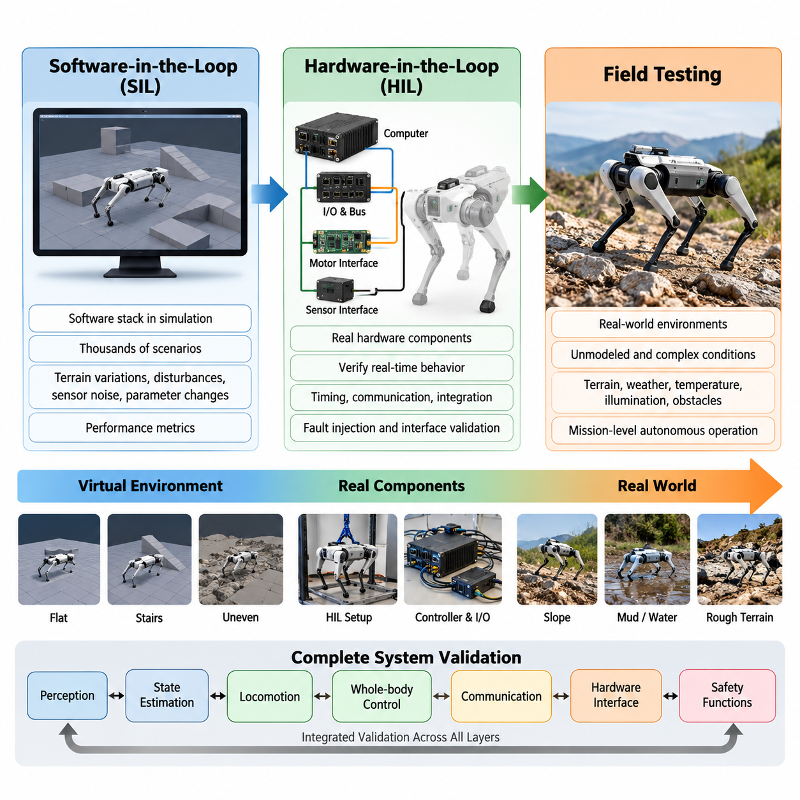
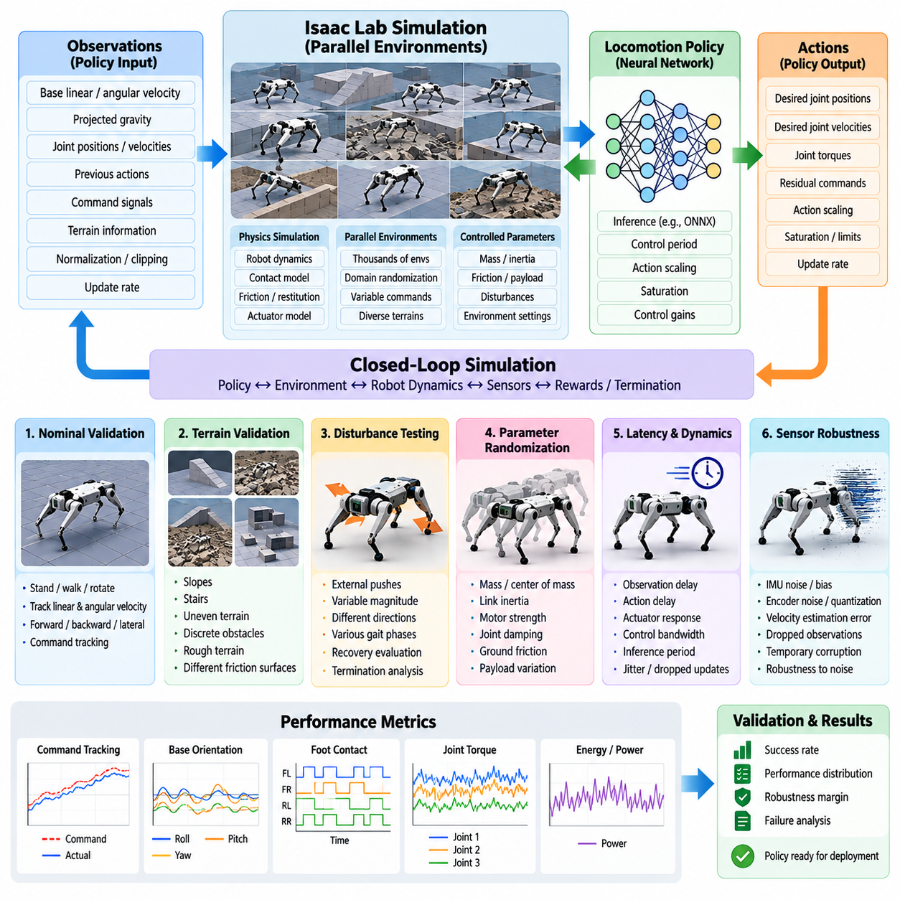
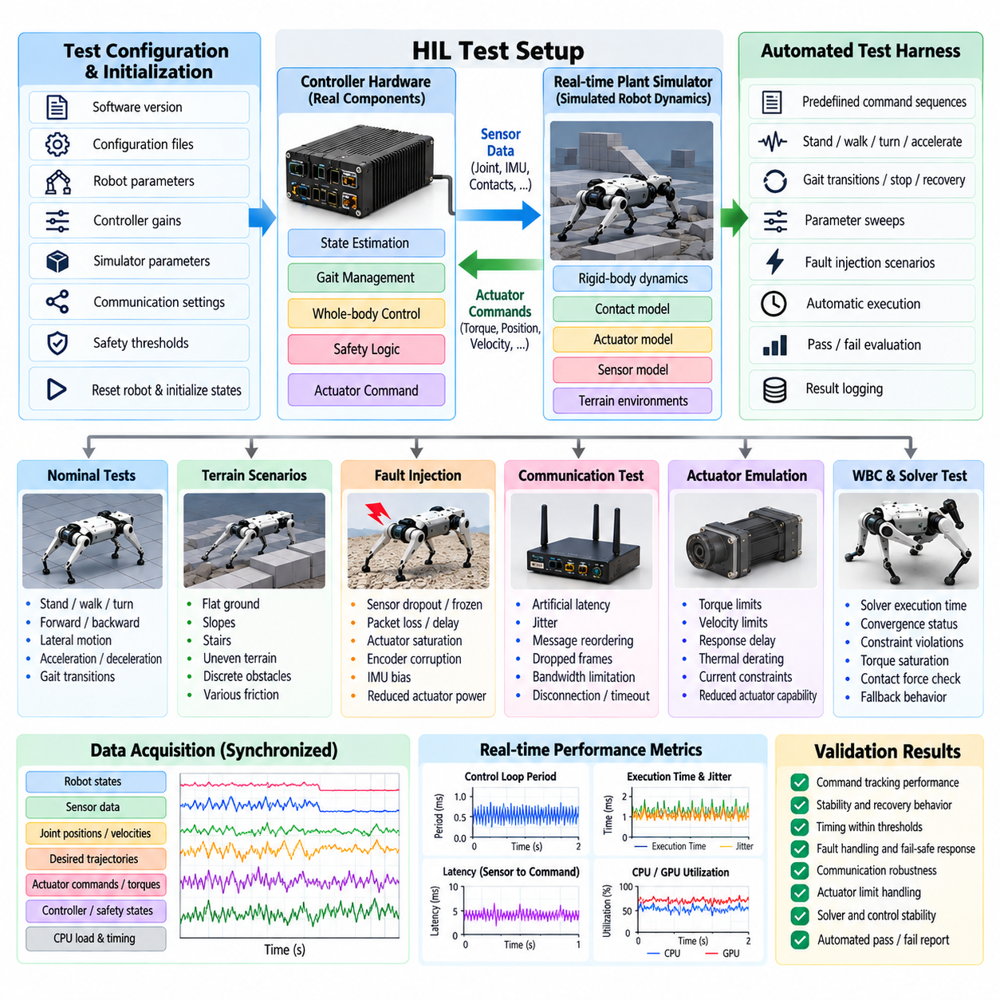
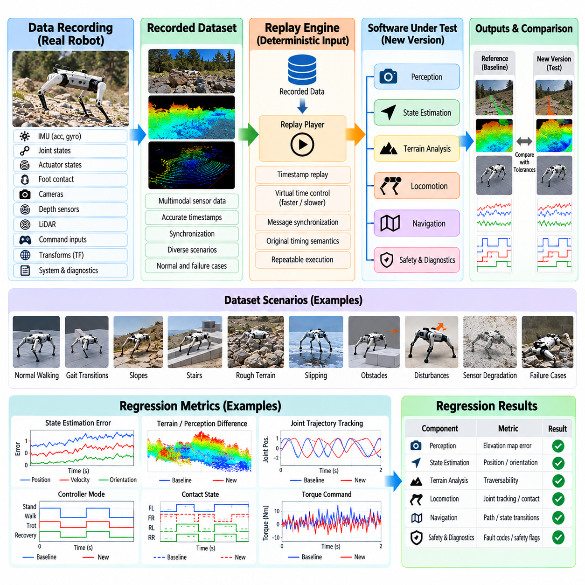
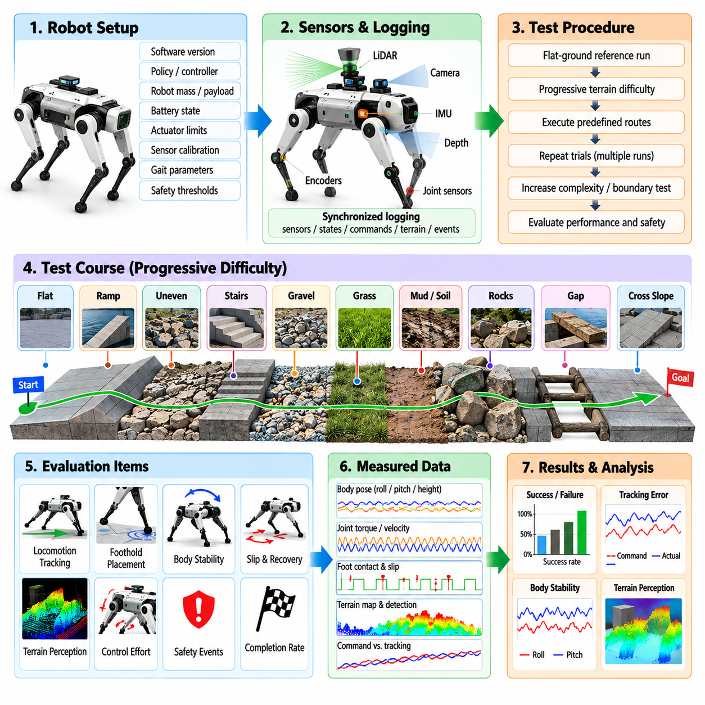
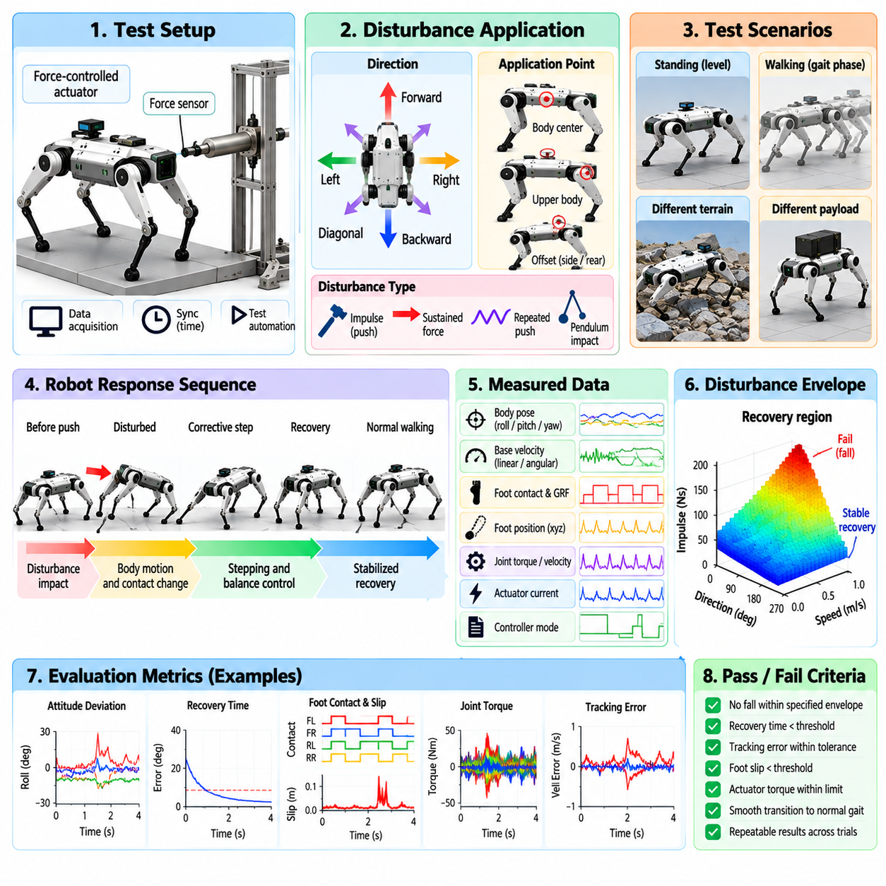
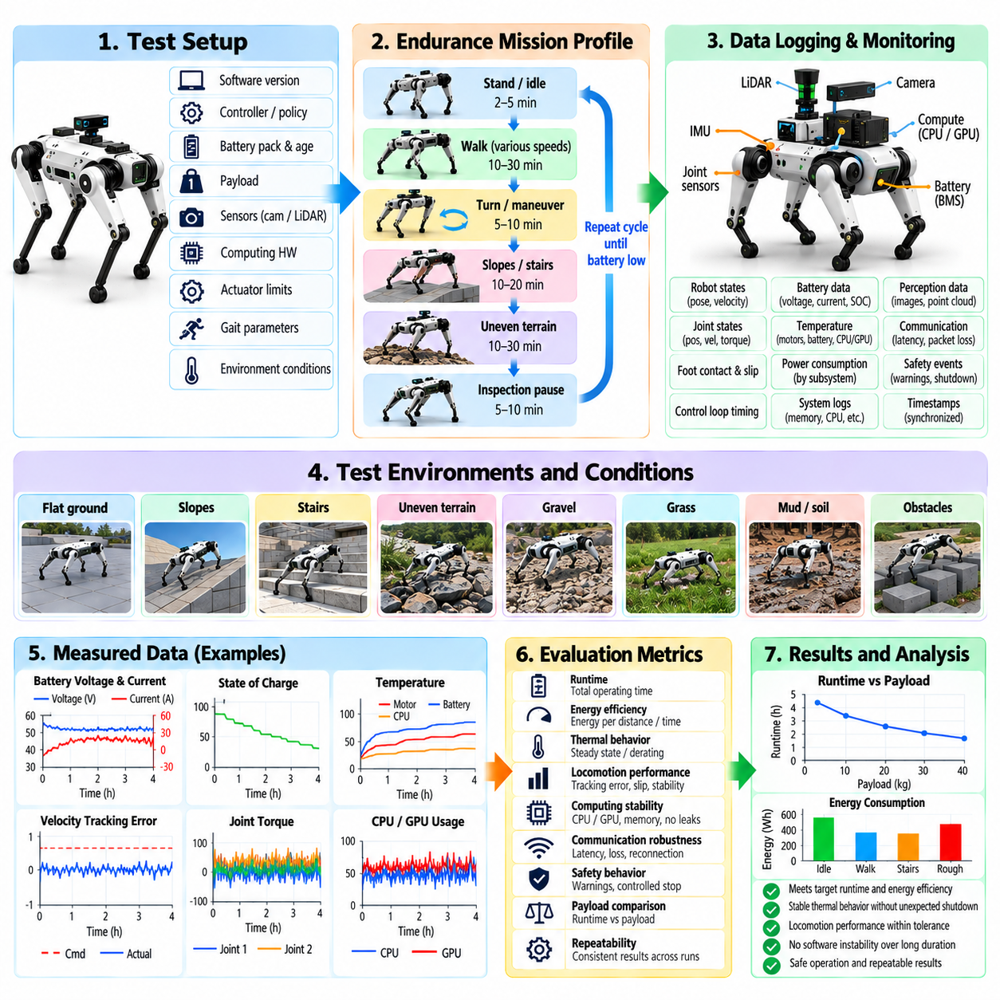
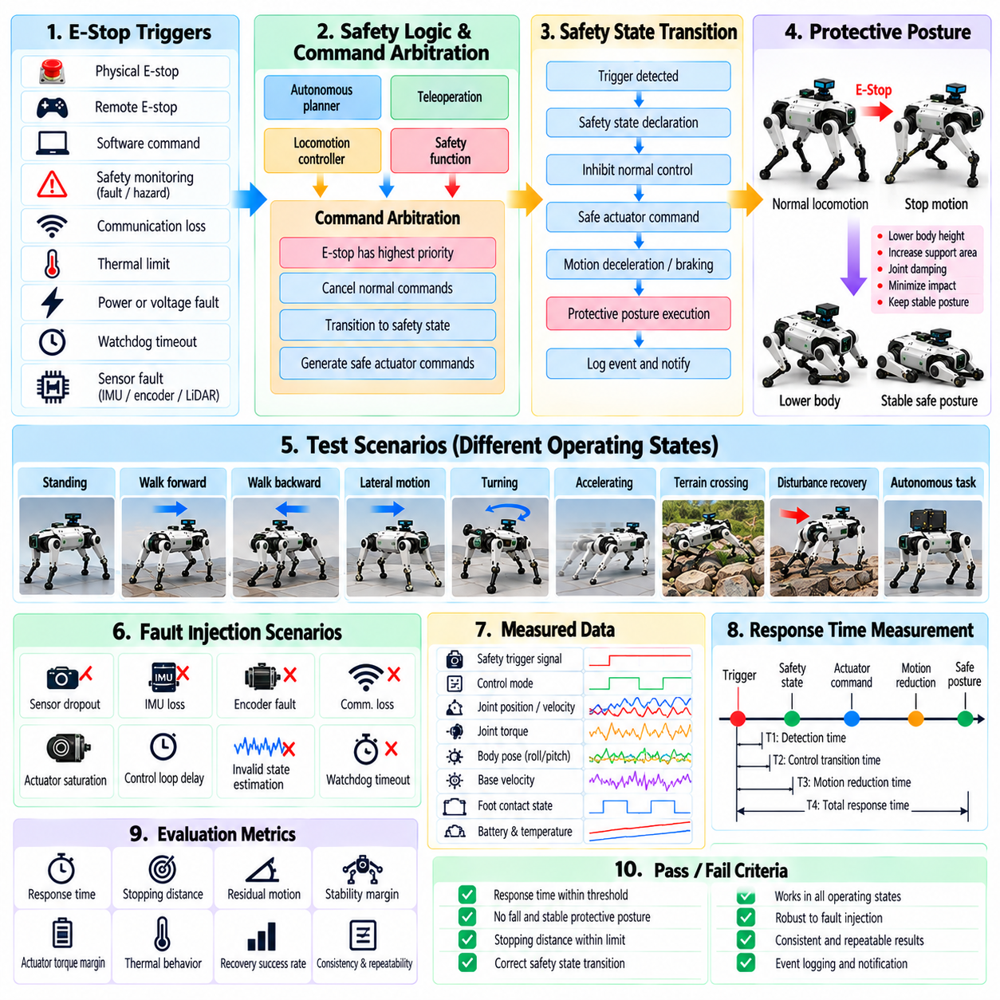
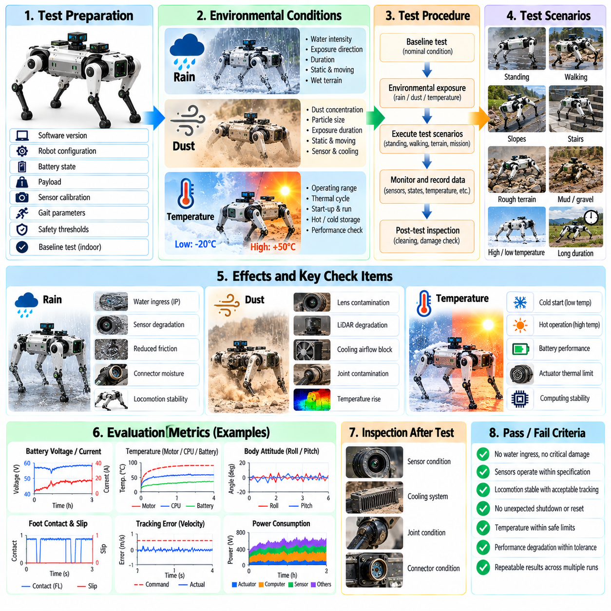
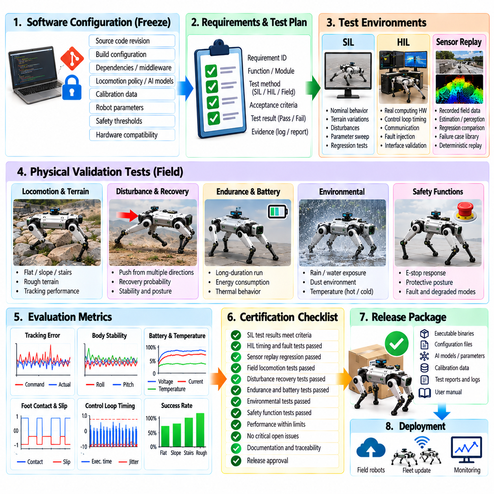

**Volume 21. Quadruped Robot Software**

# Chapter 11. Quadruped SW Testing and Validation

## 11.01. Quadruped SW Test Strategy Overview SIL HIL Field

{width="7.268055555555556in" height="7.268055555555556in"}

포괄적인 사족보행 로봇 소프트웨어 시험 전략(Quadruped Software Test Strategy)은 개별 알고리즘뿐만 아니라 인지(Perception), 상태 추정(State Estimation), 보행(Locomotion), 전신 제어(Whole-Body Control), 통신(Communication), 하드웨어 인터페이스(Hardware Interface), 안전 기능(Safety Function) 사이의 전체적인 상호작용을 검증해야 한다. 사족보행 로봇은 불확실한 환경과 반복적으로 물리적 접촉을 수행하므로, 소프트웨어에서 사소해 보이는 오류도 빠르게 균형 상실, 액추에이터(Actuator) 과부하, 충돌 또는 전도로 발전할 수 있다. 따라서 검증(Validation)은 통제된 가상 환경에서 시작하여 점차 현실적인 하드웨어 및 필드(Field) 조건으로 진행되어야 한다.

소프트웨어 인 더 루프(Software-in-the-Loop, SIL) 시험은 실제 하드웨어를 위험에 노출시키지 않고 사족보행 로봇의 동작을 평가할 수 있는 최초의 확장 가능한 환경을 제공한다. 실제 운용용 소프트웨어 스택(Software Stack), 제어기(Controller), 플래너(Planner), 상태 추정기(State Estimator) 또는 학습 기반 보행 정책(Learned Locomotion Policy)을 시뮬레이션된 로봇과 환경에서 실행한다. SIL 시험을 이용하면 보행 명령, 지형 변화, 외란, 센서 잡음, 통신 지연, 접촉 불확실성 및 파라미터 변화가 포함된 수천 개의 반복 가능한 시나리오를 수행하면서 성능 지표를 자동으로 수집할 수 있다.

유용한 SIL 환경은 단순히 시각적으로 현실적인 움직임을 생성하는 것이 아니라 실제 보행에 영향을 미치는 동역학(Dynamics)을 재현해야 한다. 로봇의 질량과 관성, 관절 마찰, 액추에이터 한계, 전달계(Transmission) 특성, 접촉 강성(Contact Stiffness), 지면 마찰, 센서 특성 및 제어 지연을 충분한 충실도(Fidelity)로 모델링해야 한다. 또한 이러한 파라미터를 현실적인 범위 내에서 무작위화(Randomization)하여 하나의 이상적인 시뮬레이션 설정에서 성공하는지를 확인하는 것이 아니라 다양한 운용 조건의 분포에서 강건성(Robustness)을 측정할 수 있어야 한다.

SIL 검증은 결정론적 회귀 시나리오(Deterministic Regression Scenario)와 무작위 스트레스 시험(Randomized Stress Testing)을 함께 사용해야 한다. 결정론적 시험은 소프트웨어 변경 이후에도 동일한 소프트웨어 버전과 초기 조건에서 예상한 동작이 계속 재현되는지를 확인하며, 무작위 시험은 개발자가 수동으로 예상하기 어려운 조건 조합에 제어기를 노출시킨다. 주요 관측 항목에는 속도 추종 오차, 자세 오차, 발 위치 정확도, 미끄러짐 빈도, 몸체 지상고, 접촉력, 관절 토크, 에너지 소비량, 솔버(Solver) 실패 및 전도 확률 등이 포함된다.

하드웨어 인 더 루프(Hardware-in-the-Loop, HIL) 시험은 시뮬레이션 환경의 일부를 통제된 상태로 유지하면서 실제 계산 및 전기·전자 구성요소를 시험 환경에 도입한다. 온보드 컴퓨터(Onboard Computer), 실시간 제어기(Real-Time Controller), 통신 버스(Communication Bus), 모터 인터페이스(Motor Interface), 센서 인터페이스(Sensor Interface), 안전 로직(Safety Logic)을 시뮬레이션 또는 에뮬레이션된 플랜트 신호(Plant Signal)와 함께 동작시킬 수 있다. 이 단계에서는 일반적인 시뮬레이션이 놓칠 수 있는 스케줄링 지터(Scheduling Jitter), 패킷 손실, 타임스탬프 오류, 계산 부하 초과, 통신 지연, 드라이버 오류 및 잘못된 하드웨어 추상화(Hardware Abstraction) 동작을 발견할 수 있다.

사족보행 로봇 아키텍처(Architecture)는 고주파 제어 루프(High-Frequency Control Loop)와 긴밀하게 결합된 보행 구성요소를 포함하므로 실시간 동작(Real-Time Behavior)이 특히 중요하다. 소프트웨어 구조에는 1 kHz 실시간 제어 루프 아키텍처(1 kHz Real-Time Control-Loop Architecture)와 하드웨어 추상화(Hardware Abstraction)가 보행 스택(Locomotion Stack)에 포함되므로, 타이밍 검증(Timing Validation)은 알고리즘 시뮬레이션과 실제 물리 시스템 배포 사이를 연결하는 필수 단계가 된다. 따라서 HIL 측정에는 루프 실행 시간, 데드라인 미스(Deadline Miss), 지터 분포, 센서-명령 지연, 동기화 정확도, CPU/GPU 사용률 및 통신 타이밍이 포함되어야 한다.

SIL에서 HIL로 전환할 때에는 가능한 한 동일한 시험 정체성(Test Identity)을 유지해야 한다. 시뮬레이션에서 사용한 지형 이벤트, 외란 프로파일(Disturbance Profile), 명령 시퀀스(Command Sequence) 또는 결함 주입(Fault Injection)을 HIL 환경에서도 동등한 입력과 합격 기준(Acceptance Criteria)을 사용하여 재현할 수 있어야 한다. 이를 통해 검증 단계별 결과를 비교하고 차이가 발생한 원인을 식별할 수 있다. SIL과 HIL 사이의 동작 차이는 불완전한 액추에이터 모델, 타이밍 가정, 수치적 차이, 인터페이스 문제 또는 모델링되지 않은 하드웨어 제약을 드러내는 경우가 많다.

물리적 로봇 시험(Physical Robot Testing)은 기본적인 안전, 통신, 액추에이터 및 제어기 동작이 이전 검증 게이트(Validation Gate)를 통과한 이후에 시작해야 한다. 초기 시험에서는 다리를 공중에 띄운 상태의 시험, 낮은 몸체 높이, 제한된 토크와 속도, 평탄한 지면, 제한된 보행 속도 및 즉시 접근 가능한 비상 정지(Emergency Stop)와 같은 저위험 조건을 사용해야 한다. 이후 보행, 회전, 보행 패턴 전환, 경사면, 계단, 불규칙 지형, 페이로드(Payload), 외부 외란 및 임무 수준의 자율 운용으로 시험 복잡도를 단계적으로 증가시킬 수 있다.

필드 시험(Field Testing)은 시뮬레이션이나 실험실 HIL 시스템으로 완전하게 표현하기 어려운 조건에서도 소프트웨어가 정상적으로 기능한다는 증거를 제공한다. 지면의 유연성, 느슨한 자갈, 식생, 진흙, 먼지, 비, 온도 변화, 조명 변화, 예상하지 못한 장애물, 무선 통신 성능 저하 및 반복적인 기계적 충격은 서로 결합된 외란을 발생시킨다. 따라서 검증 범위는 SIL과 HIL을 넘어 지형 횡단(Terrain Crossing), 밀기 복구(Push Recovery), 내구성(Endurance), 안전 기능 및 환경 시험(Environmental Testing)까지 확장되어야 한다.

필드 시험을 비공식적인 시연(Demonstration)으로 취급해서는 안 된다. 모든 시험 실행에는 정의된 초기 조건, 로봇 구성, 소프트웨어 버전, 지형 설명, 명령 프로파일, 환경 조건, 예상 동작, 실패 기준 및 기록된 텔레메트리(Telemetry)가 필요하다. 정량적인 성능 지표를 이용하면 서로 다른 두 제어기 버전을 객관적으로 비교할 수 있다. 영상은 고장 분석을 지원할 수 있지만, 동기화된 관절 상태, 관성 측정 장치(Inertial Measurement Unit, IMU) 데이터, 추정 상태, 접촉 정보, 액추에이터 명령, 온도, 전력 소비량, 플래너 출력, 안전 이벤트 및 시스템 로그가 공학적 검증에 필요한 핵심 증거를 제공한다.

핵심 원칙 중 하나는 요구사항에서 시험 결과까지의 추적성(Traceability)을 확보하는 것이다. 각각의 보행, 내비게이션(Navigation), 조작(Manipulation), 인공지능(AI), 안전 요구사항은 하나 이상의 검증 절차 및 측정 가능한 합격 임계값(Acceptance Threshold)과 연결되어야 한다. 시험 산출물(Test Artifact)에는 소프트웨어 커밋(Commit), 구성 파라미터, 로봇 하드웨어 리비전(Hardware Revision), 교정 상태(Calibration State), 모델 또는 정책 버전, 데이터셋 또는 재생 시퀀스(Replay Sequence), 시뮬레이터 구성 및 시험 환경이 명시되어야 한다. 이러한 정보가 없으면 성공적인 실험도 회귀 시험이나 제품 릴리스(Production Release) 판단을 위한 신뢰할 수 있는 근거로 활용하기 어렵다.

결함 주입(Fault Injection)은 센서 데이터 손실, 손상된 측정값, 지연된 메시지, 액추에이터 포화(Actuator Saturation), 마찰력 감소, 통신 중단, 상태 추정기 발산(Estimator Divergence), 과도한 온도 또는 플래너 출력 불가와 같은 비정상 조건을 의도적으로 발생시켜 정상 조건 시험을 보완한다. 시험의 목표가 항상 정상적인 보행을 유지하는 것은 아니다. 문제의 심각도에 따라 올바른 동작은 성능 저하 상태의 운용, 제어된 정지, 안정적인 자세 유지, 안전한 착좌(Safe Sitting) 또는 비상 종료(Emergency Shutdown)가 될 수 있다. 따라서 검증에서는 정상 성능만큼이나 복구 동작(Recovery Behavior)을 중요하게 평가해야 한다.

학습 기반 보행 정책(Learned Locomotion Policy)은 기존의 기능 시험 사례만으로 신경망 정책(Neural Policy)의 동작을 완전히 특성화하기 어렵기 때문에 추가적인 분포 기반 시험(Distribution-Oriented Testing)이 필요하다. 지형 형상, 마찰, 페이로드, 액추에이터 강도, 지연, 센서 잡음, 외부 외란 및 명령 프로파일을 넓은 범위에서 변화시켜야 한다. 시뮬레이션은 대규모 시험 범위를 제공하지만, 접촉 동역학(Contact Dynamics)과 액추에이터 동작이 지배적인 조건에서는 시뮬레이터의 성공만으로 물리적 강건성을 입증할 수 없으므로 대표적인 경계 조건(Boundary Condition)을 실제 하드웨어에서도 재현해야 한다.

회귀 시험(Regression Testing)은 전체 SIL-HIL-필드 파이프라인(SIL-HIL-Field Pipeline)을 소프트웨어 개발 과정과 연결해야 한다. 제어기, 상태 추정기, 플래너, 드라이버, 로봇 모델, 구성 파일 또는 학습 정책이 변경되면 이전에 검증된 시나리오 중 적절한 시험 집합이 자동으로 실행되어야 한다. 경량 시험은 모든 소프트웨어 변경마다 실행하고, 대규모 시뮬레이션 캠페인(Simulation Campaign)은 주기적으로 수행하며, HIL 또는 실제 로봇 시험은 릴리스 후보(Release Candidate)에 집중할 수 있다. 이러한 계층적 구조는 시험 범위를 확대하면서 비용이 높은 실제 하드웨어 시험이 주요 디버깅 수단이 되는 것을 방지한다.

최종 검증 결정(Final Validation Decision)은 하나의 성공적인 필드 시연이 아니라 축적된 증거를 기반으로 이루어져야 한다. SIL은 광범위한 시나리오 커버리지(Scenario Coverage)와 알고리즘의 반복 재현성을 확보하고, HIL은 타이밍과 하드웨어-소프트웨어 통합(Hardware-Software Integration)을 검증하며, 필드 시험은 물리적 불확실성이 존재하는 환경에서 실제 성능을 입증한다. 이 세 단계는 저비용이며 반복 가능한 시험에서 결함을 조기에 제거하고 점차 현실적인 단계에서 남아 있는 가정의 유효성을 확인하는 점진적 검증 퍼널(Progressive Validation Funnel)을 구성한다.

성숙한 사족보행 로봇 릴리스 프로세스(Release Process)는 모든 필드 고장(Field Failure)을 이전 시험 단계로 다시 환류함으로써 이러한 순환 구조를 완성한다. 기록된 센서 스트림은 재생 기반 회귀 시험(Replay-Based Regression Test)이 될 수 있고, 예상하지 못한 지형은 새로운 시뮬레이션 시나리오가 될 수 있으며, 하드웨어 타이밍 오류는 HIL 결함 주입 사례가 될 수 있다. 또한 안전 사고는 필수 릴리스 시험으로 전환될 수 있다. 이를 통해 SIL, HIL 및 필드 검증은 서로 분리된 개발 단계가 아니라 지속적으로 확장되는 증거 시스템(Evidence System)으로 작동하며, 실제 운용 경험이 축적될수록 소프트웨어 기준선(Software Baseline)의 강건성을 지속적으로 향상시킬 수 있다.

## 11.02. Locomotion Policy SIL Isaac Lab Validation [w/Code]

{width="7.268055555555556in" height="7.268055555555556in"}

사족보행 로봇 보행 정책(Locomotion Policy)의 소프트웨어 인 더 루프(Software-in-the-Loop, SIL) 검증은 실제 하드웨어에서 실행하기 전에 통제된 물리 시뮬레이션(Physics Simulation) 환경에서 정책을 평가하는 과정이다. 학습 기반 보행(Learning-Based Locomotion)에서는 정책의 동작이 관측값(Observation), 신경망 추론(Neural-Network Inference), 액추에이터 명령(Actuator Command), 로봇 동역학(Robot Dynamics), 접촉 조건(Contact Condition)의 상호작용으로 나타나기 때문에 이 단계가 특히 중요하다. Isaac Lab은 초기 상태와 환경 파라미터를 정밀하게 제어하면서 이러한 상호작용을 반복적으로 시험할 수 있는 확장 가능한 환경을 제공한다.

검증 환경은 실제 배포(Deployment)에서 사용하는 것과 동일한 정책 인터페이스(Policy Interface)를 재현해야 한다. 관측값에는 베이스 선속도 및 각속도(Base Linear and Angular Velocity), 투영 중력(Projected Gravity), 관절 위치와 속도, 이전 행동(Previous Action), 명령 신호(Command Signal), 지형 정보 또는 기타 정책별 입력이 포함될 수 있다. 관측값의 순서, 정규화(Normalization), 클리핑(Clipping), 스케일링(Scaling), 갱신 주기는 학습 및 배포 파이프라인과 일치해야 한다. SIL 구현에서 관측값의 의미나 좌표계 규약(Coordinate Convention)이 변경되면 학습된 정책 자체가 올바르더라도 불안정한 것처럼 나타날 수 있다.

정책 출력(Policy Output) 역시 동일하게 엄격하게 검증해야 한다. 신경망 행동(Neural-Network Action)은 일반적으로 저수준 제어기(Low-Level Controller)에 전달되기 전에 목표 관절 위치, 관절 속도, 토크 또는 잔차 명령(Residual Command)으로 변환된다. 따라서 검증에서는 신경망 출력에서부터 행동 스케일링(Action Scaling), 포화(Saturation), 제어 게인(Control Gain), 액추에이터 모델까지 이어지는 전체 경로를 검사해야 한다. 잘못된 행동 제한이나 일치하지 않는 제어 주기는 비현실적인 시뮬레이션 성능을 만들고 실제 사족보행 로봇으로 전이되었을 때 위험해질 수 있는 실패를 숨길 수 있다.

Isaac Lab은 다수의 로봇 환경을 병렬로 실행할 수 있으므로 실제 물리 시험에서 현실적으로 수행할 수 있는 범위보다 훨씬 넓은 조건 분포에서 보행 정책을 평가할 수 있다. 병렬 환경(Parallel Environment)에서는 명령 속도, 진행 방향, 초기 자세, 지형 형상, 마찰, 페이로드(Payload), 외란 크기 및 로봇 파라미터를 다양하게 변화시킬 수 있다. 소수의 성공적인 궤적만으로 정책을 평가하는 대신 수천 개의 에피소드(Episode)에 대한 성공률과 성능 분포를 추정하고 동작 신뢰성이 저하되는 영역을 식별할 수 있다.

기준 검증 캠페인(Baseline Validation Campaign)은 먼저 정상 조건(Nominal Condition)에서의 성능을 확립해야 한다. 사족보행 로봇에 정지, 전진 및 후진 보행, 측면 이동, 제자리 회전, 선속도와 각속도의 복합 추종 명령을 수행하도록 할 수 있다. 측정 항목에는 명령 추종 오차(Command Tracking Error), 베이스 자세(Base Orientation), 몸체 높이, 관절 운동, 발 접촉 타이밍(Foot Contact Timing), 토크 요구량, 전력 관련 값 및 종료 이벤트(Termination Event)가 포함되어야 한다. 안정적인 정상 조건 성능은 이후 더욱 어려운 시나리오를 비교하기 위한 기준이 된다.

지형 검증(Terrain Validation)은 이후 평탄한 지면을 넘어 운용 영역(Operating Envelope)을 확장해야 한다. 정책은 경사면, 계단, 불규칙 표면, 이산 장애물(Discrete Obstacle), 거친 지형 및 서로 다른 마찰 특성을 가진 표면에서 평가할 수 있다. 이는 강화학습 보행(Reinforcement-Learning Locomotion)에서 지형 커리큘럼(Terrain Curriculum), 액추에이터 모델링(Actuator Modeling), 도메인 무작위화(Domain Randomization), 시뮬레이션-현실 전이(Sim2Real Transfer)를 핵심 요소로 다루는 전체 소프트웨어 구조와 일치한다. 지형 난이도는 체계적으로 증가시켜 신뢰할 수 있는 보행과 불안정한 보행 사이의 경계를 정성적인 설명이 아니라 정량적으로 측정할 수 있어야 한다.

강건성 시험(Robustness Testing)에서는 물리 파라미터에 통제된 변화를 적용해야 한다. 로봇 질량, 질량중심(Center of Mass), 링크 관성(Link Inertia), 모터 출력, 관절 감쇠(Joint Damping), 지면 마찰, 반발 계수(Restitution), 페이로드 등을 정상값 주변에서 변화시킬 수 있다. 이러한 변화는 학습된 정책이 특정 시뮬레이션 로봇 모델에 지나치게 의존하는지를 확인한다. 실제 물리 플랫폼은 제조 공차, 페이로드 변화, 마모, 교정 오차 및 모델링 부정확성으로 인해 명목상 시뮬레이션 모델과 차이가 발생하므로, 제품 수준의 정책 후보는 현실적인 파라미터 불확실성에서도 허용 가능한 동작을 유지해야 한다.

지연(Latency)과 액추에이터 동역학(Actuator Dynamics)은 보행 정책이 시간적 불일치(Temporal Mismatch)에 매우 민감해질 수 있기 때문에 별도의 SIL 시험이 필요하다. 관측 지연, 행동 지연, 액추에이터 응답, 저수준 제어 대역폭(Low-Level Control Bandwidth), 정책 추론 주기(Policy Inference Period)를 독립적으로 또는 함께 변화시킬 수 있다. 인위적인 지터(Jitter)와 간헐적인 갱신 지연도 추가할 수 있다. 이에 따른 안정성 저하를 분석하면 온보드 배포(Onboard Deployment)에서 허용 가능한 타이밍 예산(Timing Budget)을 정의하고 하드웨어 시험 전에 추가적인 지연 무작위화 또는 액추에이터 모델링이 필요한지를 판단할 수 있다.

센서 강건성(Sensor Robustness)은 물리 동역학을 변경하는 대신 관측값에 변화를 적용하여 평가할 수 있다. 관성 측정 장치(Inertial Measurement Unit, IMU) 잡음, 관절 엔코더(Joint Encoder) 잡음, 속도 추정 오차, 바이어스(Bias), 양자화(Quantization), 관측값 손실 및 일시적인 데이터 손상을 통제된 수준으로 주입할 수 있다. 목적은 작은 인지 또는 상태 추정 오차가 비례적인 성능 저하로 이어지는지, 아니면 갑작스러운 정책 실패로 이어지는지를 확인하는 것이다. 이러한 시험은 정책이 과도하게 의존하는 관측값을 식별하여 실제 하드웨어의 센싱 및 상태 추정 요구사항의 우선순위를 결정하는 데에도 활용할 수 있다.

외부 외란 시험(External Disturbance Test)은 로봇이 정지하거나 이동하는 동안 몸체에 충격력(Impulse) 또는 지속적인 힘을 적용하여 복구 능력(Recovery Capability)을 평가한다. 동일한 힘이라도 현재 접촉 구성(Contact Configuration)에 따라 매우 다른 결과가 발생할 수 있으므로 외란의 방향, 크기, 지속시간, 보행 위상(Gait Phase), 명령 속도를 변화시켜야 한다. 유용한 성능 지표에는 최대 몸체 편차, 복구 시간, 발 위치 조정 반응, 복구 후 명령 추종 성능 및 전도 확률이 포함된다. 반복 시험을 통해 한 번의 성공적인 밀기 시연이 아니라 통계적인 복구 영역(Recovery Envelope)을 확보할 수 있다.

에피소드 종료 조건(Episode Termination Condition)은 보고되는 정책 강건성에 직접적인 영향을 미치므로 신중하게 정의해야 한다. 종료 조건에는 과도한 롤(Roll) 또는 피치(Pitch), 몸체와 지면의 충돌, 허용되지 않은 접촉, 관절 한계 위반, 불안정한 몸체 높이, 수치 계산 실패 또는 지정된 시간 내 복구 실패 등이 포함될 수 있다. 검증 보고서는 실제 전도(True Fall)와 보수적인 안전 종료(Safety Termination)를 구분해야 한다. 그렇지 않으면 물리적 동작이 유사한 정책이라도 서로 다른 종료 로직으로 인해 성공률이 달라져 정책 간 비교가 왜곡될 수 있다.

결정론적 재현성(Deterministic Reproducibility)은 회귀 시험(Regression Testing)에 필수적이다. 모든 검증 캠페인에 대해 난수 시드(Random Seed), 시뮬레이터 구성, 로봇 모델 버전, 정책 체크포인트(Policy Checkpoint), 관측 구성, 지형 생성기 파라미터, 제어 주파수, 물리 시뮬레이션 시간 간격(Physics Timestep), 도메인 무작위화 설정을 기록해야 한다. 새로운 정책 체크포인트나 소프트웨어 리비전(Software Revision)이 도입되면 동일한 시나리오 집합을 다시 실행하여 동작 변화가 통제되지 않은 시험 환경의 차이가 아니라 실제 변경 사항에서 발생했음을 확인할 수 있어야 한다.

대규모 평가는 평균값만이 아니라 성능 분포(Performance Distribution)를 요약해야 한다. 평균 속도 오차는 드물게 발생하는 치명적인 실패를 숨길 수 있으며, 높은 전체 성공률도 특정 지형이나 명령 범위에서 나타나는 취약성을 감출 수 있다. 백분위수(Percentile), 최악 조건 값(Worst-Case Value), 실패 횟수, 전도 확률, 완료율, 에너지 관련 지표 및 지형 난이도별 성능을 함께 분석하면 정책의 특성을 더욱 정확하게 파악할 수 있다. 실패 시나리오는 해당 시뮬레이터 상태와 파라미터와 함께 보존하여 영구적인 회귀 시험 사례로 전환해야 한다.

정책 검증에서는 경계 조건(Boundary Condition)을 의도적으로 탐색해야 한다. 파라미터 스윕(Parameter Sweep)을 통해 경사도, 계단 높이, 지형 거칠기, 명령 속도, 페이로드, 지연 또는 외란을 점진적으로 증가시키면서 사전에 정의된 합격 기준을 위반하는 지점을 찾을 수 있다. 이렇게 도출된 운용 영역은 정책이 어느 범위까지 신뢰성 있게 동작하며 어느 지점부터 성능 저하가 시작되는지를 보여준다. 이러한 접근 방식은 정책이 몇 개의 대표적인 환경을 성공적으로 통과했다는 사실만 보고하는 것보다 공학적인 릴리스 판단(Engineering Release Decision)에 훨씬 유용하다.

SIL 검증은 신경망 정책을 독립된 수학 함수로만 시험하는 것이 아니라 주변 보행 소프트웨어와의 통합(Integration)도 검증해야 한다. 명령 생성(Command Generation), 보행 상태 전환(Locomotion State Transition), 관측값 구성(Observation Construction), 추론 스케줄링(Inference Scheduling), 저수준 제어, 안전 제한(Safety Limit), 종료 로직이 함께 실행되어야 한다. 전체 소프트웨어 구조에서도 학습 정책 배포(Learned Policy Deployment)는 더 넓은 보행 아키텍처의 일부로 다루어지며, 이후 하드웨어 인 더 루프(HIL), 재생 기반 회귀 시험, 지형 시험, 외란 시험, 내구성 시험, 안전 시험 및 환경 검증으로 확장된다.

정책은 정상 조건, 무작위화 조건, 외란 조건 및 경계 조건 시나리오 전반에서 합격 기준(Acceptance Criteria)을 명확하게 정의하고 반복적으로 만족한 경우에만 Isaac Lab SIL 검증 단계를 통과하여 다음 단계로 진행해야 한다. SIL을 통과했다고 해서 실제 로봇이 동일하게 동작한다는 것이 증명되는 것은 아니다. 접촉 동역학, 액추에이터 동작, 센싱, 타이밍 및 구조적 영향은 여전히 완벽하게 모델링할 수 없기 때문이다. 대신 SIL은 취약한 정책을 조기에 제거하고 이후 HIL 및 필드 검증에서 집중적으로 확인해야 할 조건을 명확히 식별할 수 있는 광범위하고 반복 가능한 검증 근거(Evidence Base)를 제공한다.

## 11.03. Control Loop HIL Test Automation [w/Code]

{width="7.268055555555556in" height="7.268055555555556in"}

사족보행 로봇 제어 루프(Control Loop)의 하드웨어 인 더 루프(Hardware-in-the-Loop, HIL) 시험은 로봇 동역학(Robot Dynamics)을 시뮬레이션 또는 에뮬레이션(Emulation) 상태로 유지하면서 실제 운용용 제어 소프트웨어가 대표적인 컴퓨팅 및 통신 하드웨어에서 올바르게 동작하는지를 검증한다. 이 단계는 실제 사족보행 로봇에서 모든 비정상 조건을 재현하지 않고도 제어기를 현실적인 실행 타이밍, 인터페이스, 통신 지연 및 하드웨어 제약에 노출함으로써 소프트웨어 인 더 루프(Software-in-the-Loop, SIL) 검증과 실제 로봇 시험 사이를 연결한다.

일반적인 HIL 구성은 제어기 하드웨어(Controller Hardware)와 실시간 플랜트 시뮬레이터(Real-Time Plant Simulator)를 분리한다. 제어기는 실제 배포에 사용할 것과 동일한 소프트웨어 구성으로 상태 추정(State Estimation), 보행 관리(Gait Management), 전신 제어(Whole-Body Control), 안전 로직(Safety Logic), 액추에이터 명령 생성(Actuator Command Generation)을 실행한다. 플랜트 시뮬레이터는 관절 및 부유 베이스 동역학(Floating-Base Dynamics), 접촉 상호작용, 액추에이터 응답 및 가상 센서 측정값을 계산하고, 결정론적인 주기로 대표적인 통신 인터페이스를 통해 이러한 신호를 제어기와 교환한다.

제어 루프 타이밍(Control-Loop Timing)은 HIL 검증의 핵심 대상 중 하나이다. 사족보행 로봇의 보행은 센싱(Sensing), 상태 추정, 최적화(Optimization), 액추에이터 명령 생성의 동기화된 실행에 의존하며, 소프트웨어 구조에는 1 kHz 실시간 제어 루프 아키텍처(1 kHz Real-Time Control-Loop Architecture)가 포함된다. 따라서 HIL 자동화는 실행 주기, 최악 실행 시간(Worst-Case Execution Time), 스케줄링 지터(Scheduling Jitter), 데드라인 미스(Deadline Miss), 센서-명령 지연(Sensor-to-Command Latency), 명령 경과 시간(Command Age)을 측정하면서 동시에 타이밍 성능 저하가 시뮬레이션된 로봇의 안정성에 측정 가능한 영향을 발생시키는지를 확인해야 한다.

자동화된 HIL 시험은 정확하게 정의된 초기화 시퀀스(Initialization Sequence)에서 시작해야 한다. 각 시험을 실행하기 전에 소프트웨어 버전, 구성 파일(Configuration File), 로봇 파라미터, 제어 게인(Control Gain), 시뮬레이터 파라미터, 통신 설정 및 안전 임계값(Safety Threshold)을 로드해야 한다. 이후 시뮬레이션된 로봇을 알려진 자세로 초기화하고 제어기의 내부 상태를 일관된 방식으로 설정해야 한다. 재현 가능한 초기화는 한 실험의 잔여 상태가 다음 실험에 영향을 주는 것을 방지하고 서로 다른 소프트웨어 리비전(Software Revision)을 의미 있게 비교할 수 있도록 한다.

자동 시험 프레임워크(Automated Test Harness)는 수동 조작자의 입력에 의존하지 않고 명령 시퀀스(Command Sequence)를 생성해야 한다. 정지 자세 유지, 전진 및 후진 이동, 측면 이동, 회전, 가속, 감속, 보행 전환(Gait Transition), 정지 및 복구 명령을 타임스탬프가 포함된 시험 프로파일(Test Profile)로 표현할 수 있다. 각 단계에는 예상 응답과 허용 범위(Acceptance Range)를 연결한다. 이를 통해 HIL은 상호작용 중심의 공학 실험에서 반복 가능한 검증 프로세스로 전환되며 회귀 시험(Regression Testing)과 릴리스 적격성 검증(Release Qualification)에 활용할 수 있다.

신호 획득(Signal Acquisition)은 기능적 동작과 실시간 시스템 동작을 모두 기록해야 한다. 로봇 상태, 관절 위치와 속도, 추정된 베이스 상태, 접촉 추정(Contact Estimation), 목표 궤적, 관절 토크, 액추에이터 명령, 제어기 모드, 안전 상태, 통신 통계, 프로세서 부하 및 타이밍 측정값은 동기화된 시간 기준(Synchronized Time Base)을 공유해야 한다. 일관된 타임스탬프가 없으면 관측된 보행 오류가 제어 로직, 지연된 측정값, 통신 문제 또는 스케줄링 동작 중 어디에서 발생했는지를 판단하기 어렵다.

결함 주입(Fault Injection)은 실제 로봇을 손상시키지 않고 위험하거나 재현하기 어려운 고장을 발생시킬 수 있다는 점에서 HIL 시험에서 특히 중요하다. 자동화된 시나리오는 센서 데이터 손실, 고정된 측정값(Frozen Measurement), 타임스탬프 오프셋(Timestamp Offset), 패킷 손실, 통신 지연, 액추에이터 포화(Actuator Saturation), 액추에이터 성능 저하, 엔코더 데이터 손상, 관성 측정 장치(Inertial Measurement Unit, IMU) 바이어스 또는 간헐적인 인터페이스 장애를 발생시킬 수 있다. 고장의 심각도에 따라 예상되는 제어기 응답은 성능 저하 상태의 지속 운용, 보행 변경, 제어된 정지, 안전 자세 전환 또는 비상 종료(Emergency Shutdown)가 될 수 있다.

통신 인터페이스(Communication Interface)는 플랜트 동역학과 독립적으로 스트레스 시험(Stress Testing)을 수행해야 한다. 인위적인 지연, 지터, 메시지 순서 변경(Message Reordering), 프레임 손실, 대역폭 제한 및 일시적인 연결 중단을 센서와 액추에이터 경로에 삽입할 수 있다. 이러한 시험을 통해 안정성 또는 안전성이 손상되기 전에 제어 아키텍처가 어느 정도의 통신 성능 저하까지 허용할 수 있는지를 확인할 수 있다. 또한 타임아웃 감지(Timeout Detection), 오래된 데이터 거부(Stale-Data Rejection), 재연결 로직, 감시 타이머(Watchdog) 동작 및 사전에 정의된 페일세이프 상태(Fail-Safe State)로의 전환도 검증할 수 있다.

액추에이터 에뮬레이션(Actuator Emulation)은 이상적인 토크 전달만을 표현해서는 안 된다. 모터 토크 한계, 속도 한계, 포화, 응답 지연, 열적 출력 제한(Thermal Derating), 전류 제한, 전달계 영향(Transmission Effect), 액추에이터 성능 저하는 전신 동작에 영향을 줄 수 있다. HIL 자동화는 동일한 보행 명령을 실행하면서 이러한 파라미터를 체계적으로 변화시킬 수 있다. 이러한 시험을 통해 제어기가 하드웨어 한계 근처에서도 안정성을 유지하는지 확인하고 실제 액추에이터에서 동일한 시험을 수행하기 전에 토크 안전 제한(Torque Safety Limiting)이 올바르게 동작하는지를 검증할 수 있다.

전신 제어기(Whole-Body Controller, WBC)는 최적화 실패가 여러 다리에 즉각적으로 영향을 줄 수 있기 때문에 특별한 주의가 필요하다. 자동 시험에서는 솔버 실행 시간(Solver Execution Time), 수렴 상태(Convergence Status), 제약조건 위반(Constraint Violation), 토크 포화, 접촉력 실행 가능성(Contact-Force Feasibility), 대체 동작(Fallback Behavior)을 감시해야 한다. 공격적인 명령, 비현실적인 접촉 구성, 페이로드 변화 또는 마찰 감소를 이용하여 실행 불가능한 조건(Infeasible Condition)을 의도적으로 생성할 수 있다. 이를 통해 WBC 제약조건 완화(Constraint Relaxation), 실행 불가능 상태 복구(Infeasible Recovery), 토크 명령 안전 제한 및 후속 검증에 필요한 동작을 확인할 수 있다.

접촉 전환(Contact Transition)은 동역학적 불연속성(Dynamic Discontinuity)과 엄격한 타이밍 요구사항을 동시에 포함하기 때문에 반복적으로 시험해야 한다. 자동화된 보행 시퀀스는 수천 회의 지지기-유각기(Stance-to-Swing) 및 유각기-지지기(Swing-to-Stance) 전환을 실행하면서 접촉 추정값, 목표 발 궤적, 지면 반력(Ground Reaction Force), 토크 명령을 기록할 수 있다. 통계 분석을 통해 짧은 수동 시험에서는 발견하기 어려운 드문 신호 급증, 지연된 접촉 반응, 잘못된 위상 전환 또는 누적된 타이밍 오류를 식별할 수 있다.

스트레스 시험은 동일한 제어 작업을 유지하면서 계산 부하(Computational Load)를 증가시켜야 한다. 추가적인 인지 처리, 로깅(Logging), 통신 트래픽, 진단 기능 또는 인위적인 CPU/GPU 작업 부하를 적용하여 실제 온보드 시스템의 자원 경합(Resource Contention)을 재현할 수 있다. 목적은 중요도가 낮은 프로세스의 계산량이 증가하더라도 핵심 제어 태스크가 스케줄링 보장(Scheduling Guarantee)을 유지하는지를 확인하는 것이다. 자원 고갈(Resource Exhaustion)이 제어 루프 성능을 인지되지 않은 상태에서 저하시켜서는 안 되며, 감시 및 안전 메커니즘은 보행이 불안정해지기 전에 허용할 수 없는 타이밍 상태를 감지해야 한다.

회귀 자동화(Regression Automation)는 HIL의 가장 중요한 장점 중 하나이다. 검증된 모든 시나리오는 명령 프로파일, 초기 조건, 주입된 결함, 구성 정보 및 합격 임계값(Acceptance Threshold)과 함께 저장할 수 있다. 제어기 코드, 미들웨어(Middleware), 드라이버, 로봇 모델 또는 안전 로직이 변경되면 시험 스위트(Test Suite)가 관련 시험 사례를 자동으로 다시 실행할 수 있다. 결과를 검증된 기준선(Baseline)과 비교함으로써 실제 배포 전에 타이밍 회귀(Timing Regression), 변경된 안전 응답 및 동작 변화를 발견할 수 있다.

합격 기준(Acceptance Criteria)은 실시간 성능 지표와 물리적 성능 지표를 함께 포함해야 한다. 동작을 정확하게 추종하더라도 반복적으로 데드라인을 놓치는 제어기는 허용할 수 없으며, 반대로 타이밍이 완벽하더라도 불안정한 보행을 생성하는 제어기 역시 허용할 수 없다. 따라서 릴리스 임계값(Release Threshold)은 최대 지터, 데드라인 미스 비율, 지연, 추종 오차, 자세 편차, 토크 여유(Torque Margin), 접촉 일관성, 복구 시간, 솔버 신뢰성 및 결함 주입 상황에서 안전 기능이 올바르게 활성화되는지를 포함할 수 있다.

자동화된 보고(Automated Reporting)는 모든 실패를 재현할 수 있을 정도로 충분한 정보를 보존해야 한다. 각 결과에는 소프트웨어 커밋(Software Commit), 제어기 및 미들웨어 구성, 하드웨어 리비전(Hardware Revision), 플랜트 모델 버전, 시험 사례 버전, 타이밍 구성, 필요한 경우 난수 시드(Random Seed), 측정된 합격 기준이 기록되어야 한다. 실패한 시험에서는 문제를 발생시킨 이벤트 전후의 동기화된 텔레메트리(Telemetry)를 보존해야 한다. 이를 통해 엔지니어는 동일한 조건을 재생하고 원인을 규명하며 수정 사항을 적용한 뒤 해당 실패를 영구적인 회귀 시험 사례로 전환할 수 있다.

HIL 자동화는 궁극적으로 시뮬레이션과 실제 로봇 시험 사이에서 통제된 릴리스 게이트(Release Gate)의 역할을 수행한다. HIL은 실제 사족보행 로봇에서 발생하는 모든 구조 진동, 접촉 현상, 액추에이터 불완전성 또는 환경 영향을 완전히 재현할 수는 없지만, 대표적인 하드웨어 타이밍 및 인터페이스 조건에서 실제 운용 소프트웨어가 올바르게 실행되는지를 검증할 수 있다. 이후 수행되는 재생 기반 시험, 지형 시험, 외란 시험, 내구성 시험, 안전 시험 및 환경 시험과 결합하면 실제 로봇에서 처음 발견되는 소프트웨어 및 시스템 통합 결함을 크게 줄일 수 있다.

## 11.04. Sensor Data Replay Based Regression Test [w/Code]

{width="7.268055555555556in" height="7.268055555555556in"}

센서 데이터 재생 기반 회귀 시험(Sensor Data Replay-Based Regression Testing)은 이전에 기록된 센서 스트림(Sensor Stream)을 새로운 소프트웨어 버전에서 처리했을 때 사족보행 로봇 소프트웨어가 올바르고 일관된 동작을 계속 생성하는지를 검증한다. 실제 로봇 시험과 달리 재생(Replay)은 원래의 지형, 외란 또는 하드웨어 조건을 다시 구현하지 않고도 반복 실행할 수 있는 결정론적 입력(Deterministic Input)을 제공한다. 이를 통해 기록된 실제 운용 데이터를 인지, 상태 추정, 보행, 내비게이션 및 안전 소프트웨어의 업데이트로 발생한 동작 변화를 탐지하는 영구적인 검증 자산으로 활용할 수 있다.

재생 데이터셋(Replay Dataset)은 관련 소프트웨어 입력을 가능한 한 충실하게 재구성하는 데 필요한 센서 정보를 보존해야 한다. 일반적인 스트림에는 관성 측정 장치(Inertial Measurement Unit, IMU) 측정값, 관절 위치와 속도, 액추에이터 상태, 발 접촉 신호, 카메라, 깊이 센서(Depth Sensor), 라이다(LiDAR), 명령 입력, 좌표 변환(Transform), 시스템 상태 및 진단 메시지가 포함된다. 사족보행 로봇 제어는 고유수용성(Proprioceptive), 외수용성(Exteroceptive) 및 명령 신호 사이의 시간적 관계에 크게 의존하므로 정확한 타임스탬프와 동기화 메타데이터(Synchronization Metadata)가 필수적이다.

기준 데이터셋(Reference Dataset)은 정상적인 보행만을 표현해서는 안 된다. 기록에는 정지 자세, 보행 전환(Gait Transition), 가속, 회전, 경사면, 계단, 거친 지형, 미끄러짐, 장애물 통과, 외란, 복구 동작, 센서 성능 저하 및 대표적인 고장 이벤트가 포함되어야 한다. 어려운 필드 상황에서 수집된 데이터는 동일한 물리적 조건을 정확하게 재현하는 것이 비싸거나 불가능할 수 있기 때문에 특히 가치가 높다. 따라서 발견된 각각의 고장은 근본 원인(Root Cause)을 규명한 이후 영구적인 회귀 시나리오(Regression Scenario)로 전환할 수 있다.

재생 아키텍처(Replay Architecture)는 기록된 입력과 시험 대상 소프트웨어가 새롭게 생성한 출력을 분리해야 한다. 기록된 센서 메시지는 원래의 타임스탬프 또는 통제된 가상 시계(Virtual Clock)에 따라 주입하고, 인지, 상태 추정, 지형 분석, 진단 및 기타 선택된 모듈은 정상적으로 실행한다. 새롭게 생성된 출력은 수집하여 검증된 기준선(Validated Baseline) 또는 명시적인 합격 기준(Acceptance Criteria)과 비교한다. 이러한 방식은 반복 가능한 외부 입력을 유지하면서 실제와 유사한 모듈 간 상호작용을 보존한다.

시간 처리(Time Handling)는 메시지를 올바른 순서로 재생하는 것만으로 충분하지 않기 때문에 세심하게 설계해야 한다. 소프트웨어 구성요소는 타이머(Timer), 메시지 경과 시간(Message Age), 보간(Interpolation), 버퍼링(Buffering), 좌표 변환의 가용성 또는 타임아웃 로직(Timeout Logic)에 의존할 수 있다. 가상 시간 메커니즘(Virtual-Time Mechanism)을 사용하면 실제 시간보다 빠르거나 느리게 실행하면서도 원래의 시간 진행을 재현할 수 있다. 시간 의존 알고리즘이 동등한 타이밍 의미론(Timing Semantics)을 전달받는지 검증하여 재생 인프라의 차이를 소프트웨어 회귀로 잘못 판단하지 않도록 해야 한다.

회귀 비교(Regression Comparison)는 모든 수치 출력을 완전히 동일하게 요구하기보다는 각 소프트웨어 구성요소에 적합한 성능 지표를 사용해야 한다. 상태 추정 출력은 위치, 속도, 자세 및 드리프트 오차(Drift Error)를 이용하여 비교할 수 있으며, 지형 처리 결과는 고도 또는 주행 가능성(Traversability)의 차이를 사용할 수 있다. 보행 모듈은 보행 위상(Gait Phase), 접촉 상태, 목표 관절 궤적, 토크 명령 또는 안전 상태 전환을 통해 평가할 수 있다. 수치 허용오차(Numerical Tolerance)는 허용 가능한 부동소수점 및 솔버(Solver) 차이를 고려해야 한다.

그러나 결정론적인 이산 출력(Deterministic Discrete Output)에는 정확한 비교가 유용하다. 제어기 모드 전환, 결함 코드(Fault Code), 안전 플래그(Safety Flag), 보행 상태 변화, 플래너 결정, 감시 타이머(Watchdog) 이벤트 및 비상 정지 요청은 시험 조건이 변경되지 않았다면 일반적으로 동일하게 유지되어야 한다. 소프트웨어 변경으로 이러한 출력 중 하나가 의도적으로 변경되었다면 회귀 결과를 검토하고 새로운 동작이 검증된 이후에만 기준값을 갱신해야 한다. 변경된 기준선을 자동으로 승인하면 회귀 시험의 핵심 가치가 사라지게 된다.

재생 시험은 기록된 IMU, 엔코더(Encoder), 접촉 및 외부 센싱 데이터를 수정된 필터(Filter)나 상태 추정기(Estimator)에 반복적으로 입력할 수 있기 때문에 상태 추정 소프트웨어 검증에 특히 효과적이다. 엔지니어는 원래의 로봇 실험을 다시 수행하지 않고도 변경 사항이 드리프트를 줄이거나 강건성(Robustness)을 향상시키는지를 판단할 수 있다. 동시에 재생 시험은 초기화, 바이어스 추정(Bias Estimation), 접촉 처리, 좌표 변환 또는 센서 동기화 과정에서 발생한 의도하지 않은 변화를 발견할 수 있으며, 이러한 문제는 그렇지 않으면 이후 필드 시험에서야 나타날 수 있다.

인지 및 지형 처리 회귀(Perception and Terrain-Processing Regression)는 기록된 카메라, 깊이 및 라이다 스트림을 이용하여 매핑(Mapping)과 지형 해석(Terrain Interpretation)을 검증할 수 있다. 전처리, 교정 정보 처리, 필터링, 신경망 추론, 고도 지도(Elevation Map) 생성 또는 주행 가능성 분석의 변경 사항을 이전 결과와 비교할 수 있다. 지형 인지는 발 디딤 위치 선정(Foothold Selection) 및 보행과 긴밀하게 연결되므로 재생 시험에서는 겉보기에 작은 인지 변화가 하위 단계의 이동 결정에 실질적으로 다른 결과를 발생시키는지도 확인해야 한다.

센서 결함 사례(Sensor Fault Case)는 의도적으로 회귀 라이브러리(Regression Library)에 보존해야 한다. 패킷 손실, 일시적인 가림(Occlusion), 잡음이 포함된 IMU 측정값, 접촉 불확실성, 손상된 프레임, 지연된 스트림 또는 간헐적인 센서 동작을 포함하는 기록은 현실적인 강건성 시험을 제공한다. 또한 재생 과정에서 특정 메시지를 삭제하거나 지연시키고, 중복시키거나 수정하여 추가적인 결함을 주입할 수 있다. 이를 통해 실제 로봇을 잠재적으로 위험한 조건에 반복적으로 노출하지 않고도 실제 데이터에 기반한 통제된 변형 시험을 생성할 수 있다.

회귀 라이브러리는 시나리오와 예상 검증 목적에 따라 구성해야 한다. 짧은 데이터셋은 빠른 지속적 통합(Continuous Integration, CI) 시험에 유용하며, 긴 시퀀스는 내구성 동작, 환경 전환 또는 희귀 이벤트를 검증하는 데 사용할 수 있다. 전체 검증 구조에서 센서 재생은 SIL 보행 정책 검증과 HIL 제어 루프 시험 이후에 배치되고, 이후 지형, 외란, 내구성, 안전 및 환경 시험으로 이어진다. 이러한 구조에서 재생 시험은 실제 물리 시험에서 얻은 증거를 반복 가능한 소프트웨어 검증으로 다시 환류시키는 실용적인 수단이 된다.

모든 재생 데이터셋에는 출처 정보(Provenance Information)가 필요하다. 로봇 하드웨어 리비전(Hardware Revision), 센서 구성, 교정 파일(Calibration File), 기록 당시 사용한 소프트웨어 버전, 환경, 시험 목적, 명령 시퀀스, 알려진 이상 현상(Known Anomaly), 기록 시간을 데이터셋과 함께 관리해야 한다. 데이터셋 체크섬(Checksum) 또는 이에 상응하는 무결성 메커니즘(Integrity Mechanism)을 사용하면 의도하지 않은 변경을 방지할 수 있다. 교정 정보나 메시지 정의를 변경하면서 데이터셋 메타데이터를 갱신하지 않으면 원시 센서 파일 자체에는 문제가 없어 보이더라도 비교 결과가 무효화될 수 있으므로 버전 관리(Versioning)가 중요하다.

자동화 시스템은 관련 소프트웨어가 변경될 때마다 적절한 재생 시험 사례를 실행해야 한다. 상태 추정기 변경은 상태 추정 데이터셋을 실행하도록 하고, 지형 처리 변경은 카메라, 깊이 및 라이다 관련 시험을 실행하도록 구성할 수 있다. 보다 광범위한 릴리스 후보(Release Candidate)에서는 전체 회귀 라이브러리를 실행할 수 있다. 자동화 파이프라인(Automated Pipeline)은 합격 또는 실패 상태와 함께 성능 지표 차이 및 편차가 발생한 시간 구간을 보고하여 엔지니어가 변경의 영향을 받은 기록 부분에 직접 집중할 수 있도록 해야 한다.

대규모 센서 데이터셋에는 실용적인 데이터 관리 전략(Data-Management Strategy)이 필요하다. 모든 필드 기록을 영구적인 시험 사례로 만들 필요는 없다. 중복 데이터는 검증 범위를 향상시키지 않으면서 저장 공간과 실행 비용만 증가시키기 때문이다. 대표적인 시퀀스는 운용 조건, 지형 유형, 센서 구성, 고장 모드(Failure Mode), 소프트웨어 기능을 기준으로 선택해야 한다. 긴 임무 기록에서 특히 유용한 구간을 추출할 수 있지만 초기화 및 시간 의존 알고리즘이 유효한 운용 상태에 도달할 수 있도록 충분한 문맥(Context)을 유지해야 한다.

회귀 임계값(Regression Threshold)은 무해한 수치적 변화와 의미 있는 동작 변화를 구분해야 한다. 임계값이 지나치게 엄격하면 빈번한 거짓 실패(False Failure)가 발생하고, 지나치게 느슨하면 실제 성능 저하가 발견되지 않은 채 통과할 수 있다. 따라서 반복적으로 검증된 실행 결과와 각 신호에 대한 공학적 지식을 바탕으로 기준선을 설정해야 한다. 중요한 안전 출력(Critical Safety Output)에는 작은 수치 변화가 하위 동작에 영향을 주지 않는 중간 추정값보다 일반적으로 더 엄격한 기준을 적용해야 한다.

필드 고장(Field Failure)이 발견되면 소프트웨어를 변경하기 전에 해당 시점의 센서 이력(Sensor History)을 보존해야 한다. 재생을 이용하여 결함을 재현한 후 엔지니어는 수정 사항을 구현하고, 변경된 소프트웨어가 해당 고장을 해결하면서 기존 데이터셋도 계속 통과하는지를 확인할 수 있다. 이후 새로운 사례를 회귀 시험 스위트(Regression Test Suite)에 영구적으로 추가한다. 이러한 과정을 통해 실제 운용 경험은 개별 디버깅 과정 이후 사라지는 것이 아니라 지속적으로 시험 범위를 확대하는 자산으로 축적된다.

재생 기반 회귀 시험은 기록된 입력이 새롭게 생성된 제어 출력에 동적으로 반응할 수 없기 때문에 SIL, HIL 또는 실제 물리 시험을 대체하지 않는다. 상호작용 가능한 시뮬레이션 모델(Interactive Simulation Model)과 결합하지 않는 한 본질적으로 과거 관측값을 개방 루프(Open-Loop) 방식으로 재현하는 시험이다. 재생 시험의 강점은 실제 센서 조건을 결정론적으로 반복 재현할 수 있다는 점이다. SIL, HIL 및 필드 검증과 함께 사용하면 실제 환경에서 축적된 경험을 이후의 모든 사족보행 로봇 소프트웨어 릴리스에서 재사용 가능한 검증 증거로 전환하는 지속적인 피드백 경로(Continuous Feedback Path)를 구축할 수 있다.

## 11.05. Terrain Crossing Test Protocol Field [w/Code]

{width="7.268055555555556in" height="7.268055555555556in"}

필드 지형 횡단 검증(Field Terrain-Crossing Validation)은 사족보행 로봇이 기하학적 불확실성과 접촉 불확실성을 유발하는 실제 지면을 횡단하면서 보행 안정성(Locomotion Stability), 명령 추종(Command Tracking), 인지 신뢰성(Perception Reliability), 안전성을 유지할 수 있는지를 평가한다. 실험실 보행 시험과 달리 지형 시험은 센싱(Sensing), 상태 추정(State Estimation), 발 디딤 위치 선정(Foothold Selection), 보행 생성(Gait Generation), 전신 제어(Whole-Body Control), 액추에이터 동역학(Actuator Dynamics), 기계적 상호작용(Mechanical Interaction)이 결합된 영향을 전체 로봇에 가한다. 따라서 시험 프로토콜은 단순히 로봇이 코스 끝에 도달했는지가 아니라 시스템 수준의 동작을 평가해야 한다.

지형 시험 코스(Terrain Test Course)는 비정형 환경(Unstructured Environment)으로 진행하기 전에 통제되고 측정 가능한 지형 요소로 구성해야 한다. 대표적인 구간에는 평탄한 기준 지면, 경사로, 횡경사(Cross Slope), 계단, 독립된 단차, 불규칙 블록, 자갈, 잔디, 느슨한 토양, 암석, 틈새(Gap), 혼합 지형 전환(Mixed Terrain Transition)이 포함될 수 있다. 반복 시험을 비교하고 점진적으로 더 어려운 조건을 구성할 수 있도록 지형 형상, 표면 재질, 치수, 경사도, 단차 높이, 마찰 특성 및 환경 조건을 기록해야 한다.

모든 필드 시험은 정의된 로봇 구성(Robot Configuration)에서 시작해야 한다. 소프트웨어 리비전(Software Revision), 보행 정책 또는 제어기 버전, 로봇 질량, 페이로드(Payload), 배터리 상태, 액추에이터 제한, 센서 교정(Sensor Calibration), 보행 파라미터, 안전 임계값(Safety Threshold), 환경 조건을 기록해야 한다. 가능한 경우 초기 위치와 명령 경로도 반복 가능하도록 설정해야 한다. 이러한 통제는 하드웨어 또는 구성의 변화를 지형 횡단 성능의 차이로 잘못 해석하는 것을 방지한다.

어려운 지형 시험을 수행하기 전에 평지 기준 주행(Flat-Ground Reference Run)을 실시해야 한다. 로봇은 대표적인 정지 자세 유지, 보행, 회전, 가속 및 정지 명령을 수행하며 기준 추종 성능과 안정성 지표를 기록한다. 이러한 기준 시험은 지형 시험에 들어가기 전에 플랫폼이 정상적으로 동작하는지를 확인하고 이후 성능 저하를 평가하기 위한 비교 기준을 제공한다. 기준 지면에서 비정상적인 동작이 나타난다면 근본적인 문제가 규명될 때까지 지형 시험을 중단해야 한다.

기하학적 지형 난이도(Geometric Terrain Difficulty)는 처음부터 극한 조건으로 이동하지 않고 점진적으로 증가시켜야 한다. 경사로 기울기, 횡경사 각도, 단차 높이, 장애물 크기, 틈새 폭, 표면 거칠기 또는 암석 분포 등을 시험 사이에서 단계적으로 증가시킬 수 있다. 목적은 한 번의 성공적인 횡단을 시연하는 것이 아니라 성능이 반복적으로 유지되는 운용 영역(Operating Envelope)을 식별하는 것이다. 경계 시험(Boundary Testing)을 통해 추종 성능이 저하되고 복구 동작이 빈번해지거나 안전 기준을 초과하기 시작하는 지점을 확인해야 한다.

외수용성 센싱(Exteroceptive Sensing)을 사용하는 경우 지형 인지(Terrain Perception)는 실제 물리적 보행과 함께 평가해야 한다. 고도 지도(Elevation Map), 지형 분류(Terrain Classification), 주행 가능성 추정(Traversability Estimation), 장애물 검출, 후보 발 디딤 위치를 로봇의 움직임과 함께 기록해야 한다. 소프트웨어 구조에서는 고도 지도 생성, 지형 분류, 주행 가능성 분석, 이산 지형 검출(Discrete Terrain Detection), 음의 장애물 검출(Negative-Obstacle Detection), 지형 인식 기반 발 디딤 위치 선정(Terrain-Aware Foothold Selection)이 서로 연결되므로 이들이 실제 보행에 미치는 영향을 필드 검증의 주요 대상으로 삼아야 한다.

발 디딤 위치(Foot Placement)는 인지와 보행 계획이 실제 물리 환경과 어떻게 상호작용하는지를 직접적으로 보여주는 지표이다. 시험에서는 목표 발 디딤 위치와 실제 발 디딤 위치, 착지 타이밍(Touchdown Timing), 접촉 신뢰도(Contact Confidence), 발 미끄러짐(Foot Slip), 유각기 발의 지면 여유(Swing Clearance), 예상하지 못한 충돌을 기록해야 한다. 블록이나 디딤판과 같은 이산 지형에서는 발과 지지면 경계 사이의 여유가 특히 중요한 지표가 된다. 로봇이 전도되지 않고 코스를 통과하더라도 지지면 가장자리에 반복적으로 착지한다면 시스템의 취약성을 나타낼 수 있다.

몸체 안정성(Body Stability)은 단순히 통과 또는 전도 여부로 판단하지 않고 지속적으로 평가해야 한다. 롤(Roll), 피치(Pitch), 몸체 높이, 각속도, 가속도, 자세 오차 및 복구 이벤트(Recovery Event)는 지형 외란이 베이스(Base)에 얼마나 큰 영향을 미치는지를 보여준다. 관절 토크, 속도, 접촉력 및 액추에이터 포화(Actuator Saturation)는 제어 노력(Control Effort)에 대한 보완적인 정보를 제공한다. 반복적인 포화나 극단적인 몸체 움직임을 통해 겨우 성공한 횡단은 충분한 제어 여유(Control Margin)를 가진 안정적인 횡단과 동등하게 평가해서는 안 된다.

미끄러짐 시험(Slip Testing)은 지형의 기하학적 형상만으로 보행 난이도가 결정되지 않기 때문에 중요하다. 동일한 형상의 지면이라도 서로 다른 마찰 수준에서는 크게 다른 동작이 발생할 수 있다. 시험에서는 미끄러짐 발생 여부, 미끄러진 거리, 영향을 받은 다리, 보행 위상(Gait Phase), 추정된 마찰 대응 및 복구 시간을 기록해야 한다. 사용 가능한 접지력(Traction)을 통제된 방식으로 감소시키면 제어기가 점진적으로 적응하는지 또는 비교적 작은 마찰 변화가 갑작스러운 안정성 상실로 이어지는지를 확인할 수 있다.

지형 전환(Terrain Transition)은 두 가지 지면 유형 사이를 이동하는 것이 각각의 지면에 계속 머무르는 것보다 더 어려울 수 있으므로 별도로 평가해야 한다. 예를 들어 평지에서 자갈, 단단한 바닥에서 잔디, 평탄한 지면에서 경사로 또는 경사면 직후의 계단으로 전환되는 상황이 있다. 이러한 전환에서는 기하학적 형상, 접촉 특성, 인지 통계가 동시에 변한다. 따라서 전환 경계 주변에서 진입 속도, 보행 위상, 발 디딤 타이밍 및 상태 추정기(Estimator)의 동작을 분석해야 한다.

명령 속도(Commanded Speed)는 지형 난이도와 독립적인 시험 변수로 변화시켜야 한다. 저속에서 횡단 가능한 지형이라도 동적 효과가 증가하면 불안정해질 수 있다. 동일한 코스 조건을 유지하면서 전진 속도, 측면 속도 또는 회전 속도를 점진적으로 증가시킬 수 있다. 측정 결과는 속도 증가에 따라 추종 오차, 발 미끄러짐, 몸체 움직임, 토크 요구량 및 성공 확률이 어떻게 변화하는지를 보여주어야 한다. 이렇게 얻어진 데이터는 이후 상위 수준 안전 로직(Supervisory Safety Logic)에 사용할 수 있는 지형 의존적 속도 제한(Terrain-Dependent Velocity Limit)을 정의하는 데 활용할 수 있다.

사족보행 로봇이 장비나 조작 장치(Manipulation Hardware)를 운반하도록 설계된 경우 페이로드도 독립적인 시험 변수로 다루어야 한다. 추가 질량과 질량중심(Center of Mass)의 변화는 요구되는 접촉력, 관절 토크, 몸체 동역학 및 안정성 여유(Stability Margin)를 변화시킨다. 따라서 대표적인 페이로드 조건에서 지형 시험을 반복해야 한다. 무부하 상태와 적재 상태의 결과를 비교하면 제어기 튜닝(Controller Tuning)과 안전 제한이 실제 운용 구성 전반에서 유효하게 유지되는지를 확인할 수 있다.

필드 시험 프로토콜에는 명확한 실패 및 개입 기준(Failure and Intervention Criteria)이 필요하다. 과도한 몸체 자세 변화, 반복적인 발 미끄러짐, 관절 한계 접근, 액추에이터 과부하, 열 한계(Thermal Limit), 위치 추정 상실, 인지 실패, 통제되지 않은 후방 이동, 임박한 전도 또는 안전 시스템 작동과 같은 조건에서 시험을 종료할 수 있다. 사람의 개입(Human Intervention)이 발생한 경우 이를 조용히 제외해서는 안 되며 실패 또는 보조 횡단(Assisted Traversal)으로 기록해야 한다. 명확한 기준은 하드웨어를 보호하는 동시에 경계 상황에 대한 주관적인 해석을 방지한다.

접촉이 많은 보행(Contact-Rich Locomotion)은 명목상 동일한 시험에서도 결과가 달라질 수 있으므로 통계적 반복(Statistical Repetition)이 필요하다. 각 지형 조건은 완료율, 전도 또는 개입 확률, 횡단 시간, 추종 성능, 미끄러짐 빈도, 복구 횟수 및 에너지 소비량을 추정할 수 있을 정도로 충분히 반복해야 한다. 가장 성공적인 시험 결과만 보고하면 실제 변동성을 숨기게 된다. 제품 수준의 검증 프로세스에서는 드물게 발생하는 실패가 운용 위험을 지배할 수 있으므로 반복성과 하위 성능 구간(Lower-Tail Performance)을 중요하게 평가해야 한다.

필드 텔레메트리(Field Telemetry)는 센서, 상태 추정, 인지, 계획, 제어, 액추에이터, 전력 및 안전 시스템 전체에 대해 동기화된 로깅(Synchronized Logging)을 사용해야 한다. 외부 시점의 영상은 유용한 상황 정보를 제공할 수 있지만 기계 판독 가능한 데이터(Machine-Readable Data)를 대체해서는 안 된다. 실패가 발생하면 동기화된 로그를 이용하여 지형 관측에서 발 디딤 위치 결정, 접촉 이벤트, 상태 추정 반응, 제어기 동작, 최종 복구 또는 시험 종료에 이르는 전체 과정을 재구성할 수 있어야 한다.

예상하지 못한 필드 동작은 재사용 가능한 검증 자산(Reusable Validation Asset)으로 전환해야 한다. 센서 이력은 재생 기반 회귀 시험(Replay-Based Regression Test) 사례가 될 수 있으며, 측정된 지형 형상은 시뮬레이션에서 재구성할 수 있고, 문제가 발생한 마찰이나 외란 조건은 SIL 또는 HIL 시험에 다시 도입할 수 있다. 이러한 피드백 과정은 지형 횡단 프로토콜을 이전 단계의 SIL, HIL 및 센서 재생 검증과 연결하고 실제 필드 경험이 이후의 회귀 시험 범위(Regression Coverage)를 지속적으로 확장하도록 한다.

특정 지형 조건은 사전에 정의된 합격 기준(Acceptance Criteria)을 안전하지 않은 개입 없이 반복적으로 만족하는 경우에만 검증된 것으로 판단해야 한다. 단순한 코스 완료만으로는 충분하지 않으며 안정성, 추종 정확도, 제어 여유, 인지 일관성, 미끄러짐 특성, 복구 빈도 및 안전 시스템 동작이 모두 허용 가능한 범위에 유지되어야 한다. 측정 가능한 지형 요소에서 시작하여 혼합 지형과 더욱 비정형적인 환경으로 단계적으로 확장함으로써 필드 시험 프로토콜은 단발성 사족보행 이동 시연에 의존하는 것이 아니라 실제 배포를 위한 증거 기반 운용 영역(Evidence-Based Operating Envelope)을 확립할 수 있다.

## 11.06. Push Recovery and Disturbance Test Protocol

{width="7.268055555555556in" height="7.268055555555556in"}

밀기 복구 및 외란 시험(Push-Recovery and Disturbance Testing)은 외력이 정상적인 움직임을 방해한 이후 사족보행 로봇이 안정적인 보행을 유지하거나 복원할 수 있는지를 평가한다. 목적은 단순히 로봇이 넘어지는지를 확인하는 것이 아니라 외란의 크기, 방향, 타이밍, 접촉 구성(Contact Configuration), 운용 상태가 안정성에 어떤 영향을 미치는지를 특성화하는 것이다. 엄격한 시험 프로토콜은 최초 외란 발생부터 균형 보정, 발 디딤 적응, 복구 또는 통제된 안전 종료에 이르는 전체 반응을 측정해야 한다.

정량적인 비교를 위해서는 재현 가능한 외란 발생 장치(Reproducible Disturbance Mechanism)가 필수적이다. 사람이 직접 로봇을 미는 방식은 힘을 정밀하게 제어하기 어렵고 반복 시험 간 정량적인 비교를 어렵게 한다. 시험에는 계측형 진자(Instrumented Pendulum), 선형 액추에이터(Linear Actuator), 매달린 질량, 교정된 충격 장치(Calibrated Impact Device) 또는 알려진 충격량이나 지속 하중을 가할 수 있는 힘 제어 장치를 사용할 수 있다. 적용된 힘, 지속시간, 방향, 작용점 및 그 결과로 발생한 충격량(Impulse)을 측정하여 서로 다른 제어기 버전과 로봇 구성을 동일한 외란 조건에서 평가할 수 있어야 한다.

외란은 사족보행 로봇의 안정성이 접촉 기하(Contact Geometry)에 크게 의존하기 때문에 여러 방향으로 적용해야 한다. 전방, 후방, 측면, 대각선 및 회전 외란은 크기가 동일하더라도 서로 다른 반응을 발생시킬 수 있다. 또한 힘의 작용점을 몸체 중심과 높거나 중심에서 벗어난 위치로 변화시켜야 한다. 이에 따라 발생하는 모멘트(Moment)가 롤(Roll), 피치(Pitch), 요(Yaw) 반응을 크게 변화시킬 수 있기 때문이다. 따라서 각 시험 조건은 비정형적인 밀기 동작이 아니라 반복 가능한 외란 벡터(Disturbance Vector)로 정의해야 한다.

초기 시험은 마찰력이 높은 평탄한 지면에서 로봇이 정지한 상태로 시작해야 한다. 이후 자세 조절(Posture Regulation)만으로 대응할 수 있는 작은 외란에서부터 상당한 접촉력 재분배(Contact-Force Redistribution) 또는 보정 스텝(Corrective Stepping)이 필요한 큰 충격량까지 외란의 크기를 점진적으로 증가시킬 수 있다. 목적은 하나의 강한 충격 조건만 시험하는 것이 아니라 수동적 외란 억제(Passive Rejection), 능동적 몸체 보정, 스텝 복구(Stepping Recovery), 전도 직전 복구(Near-Fall Recovery), 복구 불가능 외란 사이의 전환 경계를 식별하는 것이다.

동적 시험(Dynamic Test)에서는 복구 능력이 보행 위상(Gait Phase)에 크게 의존하므로 로봇이 보행하는 동안 외란을 적용해야 한다. 네 발이 모두 지면을 지지하는 구성에서 측면 외란을 받는 경우와 지지 다리가 감소한 위상에서 동일한 외란을 받는 경우는 근본적으로 다른 결과를 발생시킨다. 따라서 외란은 개별 다리의 지지기(Stance Phase)와 유각기(Swing Phase) 또는 선택된 보행 위상에 동기화하여 적용해야 한다. 여러 위상 오프셋(Phase Offset)에서 반복 시험하면 무작위적인 필드 밀기 시험만으로는 발견하기 어려운 보행 주기의 취약 구간을 식별할 수 있다.

로봇의 균형 제어 아키텍처(Balance-Control Architecture)는 외란에 대응하는 전체 과정에서 지속적으로 관찰해야 한다. 소프트웨어 구조에는 지지기 힘 분배(Stance-Phase Force Distribution), 밀기 복구 제어(Push-Recovery Control), 베이스 높이 및 자세 조절(Base Height and Orientation Regulation), 외부 외란 추정(External-Disturbance Estimation), 전도 직전 복구가 독립적인 균형 기능으로 포함되어 있다. 시험에서는 외란의 심각도가 증가함에 따라 이러한 메커니즘이 어떻게 상호작용하는지와 정상 제어에서 복구 동작으로의 전환이 추가적인 불안정을 발생시키지 않고 부드럽게 이루어지는지를 확인해야 한다.

유용한 몸체 수준 측정값(Body-Level Measurement)에는 롤, 피치, 요, 베이스 위치, 몸체 높이, 선속도와 각속도 및 가속도가 포함된다. 최대 자세 편차(Peak Attitude Deviation)는 외란에 대한 즉각적인 반응을 나타내며, 복구 시간(Recovery Time)은 로봇이 허용 가능한 상태로 얼마나 빠르게 복귀하는지를 보여준다. 잔류 자세 오차(Residual Orientation Error) 또는 속도 오차는 로봇이 넘어지지 않았더라도 불완전한 복구 상태를 나타낼 수 있다. 이동 중 시험에서는 이러한 값을 절대적인 직립 자세가 아니라 명령 궤적(Commanded Trajectory)을 기준으로 평가해야 한다.

접촉 수준 측정(Contact-Level Measurement)은 제어기가 물리적으로 외란을 어떻게 억제하는지를 이해하는 데 필요한 정보를 제공한다. 각 다리에 대해 지면 반력(Ground Reaction Force), 추정 접촉 상태, 압력 중심(Center of Pressure), 발 위치, 미끄러짐 거리, 착지 타이밍(Touchdown Timing), 접촉력 재분배를 기록해야 한다. 갑작스러운 하중 감소, 과도한 접선 방향 힘 또는 반복적인 접촉 상태 전환은 안정성 여유(Stability Margin)가 감소했음을 나타낼 수 있다. 보정 스텝은 제어되지 않은 발 움직임과 구분해야 하는데, 두 현상 모두 발 디딤 위치의 큰 변화로 나타날 수 있기 때문이다.

관절 및 액추에이터 반응(Joint and Actuator Response)도 동시에 감시해야 한다. 관절 위치, 속도, 명령 토크, 추정 토크, 전류, 포화(Saturation), 열 상태(Thermal State)는 복구에 필요한 제어 노력(Control Effort)을 보여준다. 여러 액추에이터가 지속적으로 한계 상태에서 동작하기 때문에 겨우 직립 상태를 유지하는 로봇은 실질적인 복구 여유(Recovery Margin)가 충분하지 않을 수 있다. 따라서 합격 기준(Acceptance Criteria)은 성공적인 안정화 여부뿐만 아니라 액추에이터 사용률과 토크 여유(Torque Reserve)도 포함해야 한다.

외란 영역(Disturbance Envelope)은 사전에 정의된 복구 기준을 더 이상 만족하지 못할 때까지 충격량 또는 지속적인 힘을 체계적으로 증가시키는 방식으로 결정해야 한다. 외란 방향, 보행 패턴, 명령 속도, 지형 및 페이로드(Payload)에 따라 서로 다른 영역을 측정할 수 있다. 하나의 최대 밀기 힘만 보고하는 대신 결과 데이터는 다차원 복구 영역(Multidimensional Recovery Region)을 표현해야 한다. 사족보행 로봇은 강한 종방향 외란을 견디면서도 측면 외란에는 훨씬 취약할 수 있으므로 이러한 표현이 실제 운용 성능을 평가하는 데 더 유용하다.

평지에서 기준 복구 능력을 확립한 이후에는 지형 조건을 시험에 도입해야 한다. 동일한 외란 프로토콜을 경사면, 저마찰 표면, 자갈, 불규칙 지형 또는 이산 발 디딤 지형(Discrete Foothold Terrain)에서 반복할 수 있다. 감소된 마찰과 불규칙한 접촉 형상은 사용 가능한 보정력을 크게 감소시킬 수 있다. 지형 시험과 외란 시험을 결합하면 이상적인 접촉 조건에서 우수한 성능을 보이는 제어기가 실제 운용 환경에서도 충분한 복구 능력을 유지하는지를 확인할 수 있다.

명령된 움직임(Commanded Motion)도 외란 허용 능력에 영향을 준다. 시험에서는 정지, 저속 보행, 고속 보행, 회전, 가속 및 보행 전환 상태에서 유사한 외란을 적용하여 결과를 비교해야 한다. 속도가 증가하면 운동량과 사용 가능한 접촉 시간이 변화하며, 회전 중에는 비대칭적인 하중이 발생한다. 특히 전환 과정의 외란 시험은 일시적인 지지 구성 또는 제어기 상태 변화로 인해 정상 상태 보행에서는 나타나지 않는 취약성이 발생할 수 있기 때문에 중요하다.

사족보행 로봇이 센서, 화물, 배터리 또는 조작 장치(Manipulation Hardware)를 운반하는 경우 페이로드 시험(Payload Testing)이 필요하다. 추가된 질량은 운동량을 증가시키며, 이동하거나 높아진 질량중심(Center of Mass)은 회전 반응과 필요한 지면 반력을 변화시킨다. 따라서 동일하게 교정된 외란을 대표적인 페이로드 구성에서 반복해야 한다. 이를 통해 복구 임계값(Recovery Threshold)과 제어기 파라미터가 무부하 상태뿐만 아니라 목표 운용 범위 전체에서 유효한지를 확인할 수 있다.

전도 직전 동작(Near-Fall Behavior)은 일반적인 외란 억제와 구분하여 평가해야 한다. 몸체 자세, 각속도 또는 지지 형상이 정상적인 복구 영역을 벗어나면 제어기는 적극적인 보정 스텝, 몸체 높이 조정, 보행 변경 또는 통제된 보호 자세(Controlled Protective Posture)를 사용해야 할 수 있다. 성공적인 시험이 반드시 즉시 원래의 보행 상태로 복귀하는 것을 의미하지는 않는다. 정상적인 복구 영역을 초과하는 외란에서는 통제되지 않은 충격 없이 안전하고 안정적인 구성으로 전환하는 것이 올바른 결과가 될 수 있다.

고에너지 시험(High-Energy Test)을 시작하기 전에 안전 종료 기준(Safety Termination Criteria)을 설정해야 한다. 과도한 몸체 각도, 관절 한계 접근, 액추에이터 과부하, 제어되지 않은 미끄러짐, 안전줄(Tether) 하중, 충돌 위험 또는 상태 추정 상실이 발생하면 자동 또는 작업자에 의한 시험 종료가 필요할 수 있다. 비상 정지(Emergency Stop)가 지지 토크를 갑작스럽게 제거하여 충격을 더 심하게 만들어서는 안 된다. 시험 장치는 작업자와 하드웨어를 보호하는 동시에 안전 소프트웨어 자체도 검증 대상에 포함될 수 있도록 구성해야 한다.

접촉 타이밍과 물리적 상호작용으로 인해 시험마다 결과가 달라질 수 있으므로 통계적인 반복(Statistical Repetition)이 필요하다. 각 외란 조건은 복구 확률, 전도 확률, 보정 스텝 빈도, 최대 몸체 편차, 복구 시간, 미끄러짐 및 액추에이터 요구량을 추정할 수 있을 정도로 충분히 반복해야 한다. 성공적으로 견딘 가장 강한 외란만 보고하면 실제 성능의 상당한 불일치가 가려질 수 있다. 제품 수준 검증에서는 운용 경계 부근에서의 반복 가능한 복구 성능과 신뢰도를 중요하게 평가해야 한다.

모든 외란 시험에서는 동기화된 텔레메트리(Synchronized Telemetry)와 외부 관측을 사용해야 한다. 힘 측정값, 로봇 상태, 접촉 추정값, 보행 위상, 제어기 모드, 관절 명령, 액추에이터 피드백, 안전 이벤트 및 전력 데이터는 공통 시간 기준(Common Time Reference)을 공유해야 한다. 고속 영상(High-Speed Video) 또는 일반 영상은 물리적 상황을 보완적으로 제공할 수 있다. 이러한 기록을 결합하면 적용된 외란에서 시작하여 제어기의 반응과 성공적인 복구 또는 실패에 이르는 인과적 과정(Causal Sequence)을 재구성할 수 있다.

실제 물리적 외란 시험에서 발견된 실패는 이전 검증 단계로 직접 환류되어야 한다. 측정된 힘 프로파일(Force Profile)은 소프트웨어 인 더 루프(Software-in-the-Loop, SIL) 환경에서 재현할 수 있고, 타이밍에 민감한 반응은 하드웨어 인 더 루프(Hardware-in-the-Loop, HIL) 시나리오로 전환할 수 있으며, 기록된 센서 이력은 재생 기반 회귀 시험(Replay Regression Test)이 될 수 있다. 이러한 방식으로 밀기 복구 시험은 단순한 강건성 시연이 아니라 사족보행 로봇 소프트웨어 릴리스 프로세스를 지속적으로 강화하고 증거 기반 외란 운용 영역(Evidence-Based Disturbance Operating Envelope)을 정의하는 재사용 가능한 검증 사례의 원천이 된다.

## 11.07. Endurance and Battery Life Test Protocol

{width="7.268055555555556in" height="7.268055555555556in"}

내구성 시험(Endurance Testing)은 사족보행 로봇이 짧은 시연에서만 정상적으로 동작하는 것이 아니라 장시간의 지속적인 운용에서도 신뢰할 수 있는 보행, 연산, 센싱, 통신 및 안전 동작을 유지할 수 있는지를 평가한다. 배터리 수명 시험(Battery-Life Testing)은 현실적인 임무 프로파일(Mission Profile)에 따라 사용 가능한 에너지가 어떻게 변화하는지를 측정하여 이러한 평가를 보완한다. 시험 프로토콜은 짧은 기능 시험에서는 발견하기 어려운 점진적인 성능 저하, 열 누적, 에너지 한계 및 간헐적 고장을 확인할 수 있어야 한다.

반복 가능한 내구성 임무 프로파일(Endurance Mission Profile)은 목표 운용 환경의 실제 듀티 사이클(Duty Cycle)을 반영해야 한다. 시험 시퀀스에는 정지 자세 유지, 보행, 회전, 정지, 경사면, 계단, 불규칙 지형, 검사 대기, 통신 활동, 인지 처리 및 복구 구간을 조합할 수 있다. 하나의 속도로 계속 운용하는 대신 실제 보행 및 연산 부하의 변화를 재현하여 측정된 내구성이 인위적인 정상 상태 조건이 아니라 실제 배포 환경을 반영하도록 해야 한다.

각 시험 전에 로봇 구성(Robot Configuration)을 기록하고 안정화해야 한다. 소프트웨어 리비전(Software Revision), 보행 제어기 또는 정책 버전, 배터리 팩, 배터리 사용 기간, 초기 충전 상태(State of Charge), 페이로드(Payload), 센서 구성, 컴퓨팅 하드웨어, 액추에이터 제한, 보행 파라미터 및 환경 조건을 기록해야 한다. 또한 배터리 온도와 로봇의 열 상태(Thermal State)가 정의된 초기 조건에 도달하도록 하여 반복 시험의 시작 상태에 숨겨진 차이가 발생하지 않도록 해야 한다.

배터리 측정(Battery Measurement)은 전체 운용 시간만 기록해서는 안 된다. 임무 전체에 걸쳐 배터리 팩 전압, 전류, 충전 상태, 누적 에너지, 순간 전력(Instantaneous Power), 배터리 온도, 가능한 경우 셀 수준 정보(Cell-Level Information), 전력 시스템 경고를 기록해야 한다. 이러한 신호를 보행 상태와 연계하면 어떤 동작이 에너지 소비를 지배하는지 파악하고, 가속, 어려운 지형, 복구 기동 또는 높은 토크가 필요한 운용에서 전압 강하(Voltage Sag)나 전류 피크(Current Peak)가 전기적 한계에 접근하는지를 확인할 수 있다.

계측 시스템이 허용하는 경우 전력 소비(Power Consumption)를 하위 시스템별로 분해하여 분석해야 한다. 액추에이터는 일반적으로 주요 동적 부하(Dynamic Load)를 구성하며, 온보드 컴퓨터, GPU, 카메라, 라이다(LiDAR), 통신 장치, 냉각 시스템 및 보조 전자장치는 지속적인 전력 부하를 발생시킨다. 하위 시스템의 전력을 측정하면 보행 효율과 연산 오버헤드(Computing Overhead)를 구분할 수 있으며, 보행 생성, 액추에이터 활용, 인지 작업 부하, 추론 스케줄링(Inference Scheduling) 또는 보조 전력 관리 중 어느 부분을 개선해야 하는지를 판단할 수 있다.

에너지 소비는 보행 패턴, 속도, 지형 및 제어 노력에 크게 의존하므로 다양한 보행 조건에서 내구성을 평가해야 한다. 평지 보행을 기준선(Baseline)으로 설정한 후 대표적인 경사면, 거친 지형, 반복 회전, 정지-출발(Stop-and-Go) 운용 및 장애물 통과를 시험할 수 있다. 단위 시간당 에너지와 단위 거리당 에너지(Energy per Unit Distance)를 비교하면 정지 상태의 전자장치 소비가 지배적인 임무와 기계적 보행 및 지형 상호작용의 소비가 지배적인 임무를 구분할 수 있다.

사족보행 로봇이 검사 센서, 화물, 배터리 또는 조작 장치(Manipulation Hardware)를 운반하는 경우 페이로드는 중요한 내구성 변수이다. 추가 질량은 관절 토크 요구량, 지면 반력(Ground Reaction Force), 가속 요구량 및 잠재적인 보행 효율을 변화시킨다. 따라서 동일한 임무 프로파일을 이용하여 대표적인 페이로드 구성을 비교해야 한다. 이러한 결과를 통해 페이로드에 따른 운용 시간(Runtime)을 산정하고 배터리 용량이 주요 제약이 되기 전에 열적 한계 또는 액추에이터 한계에 도달하는지를 확인할 수 있다.

장시간 운용 중에는 열적 거동(Thermal Behavior)을 지속적으로 감시해야 한다. 모터 권선 또는 하우징, 모터 드라이버, 배터리, CPU, GPU, 전력 전자장치 및 내부 인클로저(Enclosure)의 온도는 순간적인 측정값이 한계 이내에 있더라도 점진적으로 상승할 수 있다. 시험에서는 온도가 지속 가능한 평형 상태(Sustainable Equilibrium)에 수렴하는지 또는 출력 제한(Derating)이나 종료 임계값을 향해 계속 상승하는지를 확인해야 한다. 열 스로틀링(Thermal Throttling)은 연산 성능을 감소시키고 간접적으로 제어 루프 타이밍이나 인공지능 추론 속도에도 영향을 줄 수 있다.

내구성 시험 중 제어 성능(Control Performance)이 배터리가 소진될 때까지 일정하다고 가정해서는 안 되며 지속적으로 평가해야 한다. 속도 추종 오차, 베이스 자세, 보행 일관성, 발 미끄러짐, 관절 토크, 상태 추정기 건전성(Estimator Health), 제어 루프 타이밍, 솔버 상태(Solver Status), 복구 이벤트를 시험 초기, 중간 및 종료 구간에서 비교해야 한다. 점진적인 성능 변화는 온도 의존적인 액추에이터 동작, 전압 변화에 따른 토크 제한, 센서 드리프트(Sensor Drift) 또는 누적된 소프트웨어 문제를 나타낼 수 있다.

장시간 소프트웨어 안정성(Long-Duration Software Stability) 자체도 중요한 검증 대상이다. 메모리 증가, 자원 누수(Resource Leakage), CPU 또는 GPU 사용률 증가, 로그 저장 공간 고갈, 통신 성능 저하, 큐 누적(Queue Accumulation), 타임스탬프 드리프트(Timestamp Drift), 프로세스 재시작 및 감시 타이머(Watchdog) 이벤트를 임무 전체에 걸쳐 감시해야 한다. 몇 분 동안은 정상적으로 보행하지만 수 시간의 운용 이후 소프트웨어 불안정성이 발생하는 로봇은 충분한 배터리 에너지가 남아 있더라도 제품 수준의 내구성 요구사항을 충족한다고 볼 수 없다.

배터리 충전 상태 추정(State-of-Charge Estimation)은 부정확한 잔여 운용 시간 추정이 임무 계획을 방해할 수 있으므로 실제 측정된 에너지 사용량과 비교하여 검증해야 한다. 보고되는 충전 상태는 누적 전류 또는 에너지와 일관되게 감소해야 하며 변화하는 부하 조건에서도 의미 있는 값을 유지해야 한다. 높은 전류가 필요한 보행에서는 일시적인 전압 강하가 발생할 수 있으므로 안전 로직(Safety Logic)은 순간적인 전기적 현상과 실제 배터리 고갈을 구분하면서도 통제된 임무 종료를 위한 충분한 에너지 여유를 유지해야 한다.

저전력 배터리 동작(Low-Battery Behavior)은 로봇이 통제되지 않은 상태로 종료될 때까지 운용하는 방식이 아니라 별도의 시험으로 검증해야 한다. 정의된 임계값에서는 경고, 임무 제한, 기지 복귀(Return-to-Base), 성능 제한, 안전 정지 또는 플랫폼별 대응 동작이 실행되어야 한다. 최초의 중요 경고(Critical Warning)가 발생한 이후에도 로봇이 안전한 상태에 도달할 수 있는 충분한 에너지를 유지해야 한다. 보행 중 갑작스러운 전원 상실은 사용 가능한 배터리 용량을 결정하는 허용 가능한 방법이 아니다.

반복적인 충전 및 방전 시험(Charge-and-Discharge Testing)은 단일 내구성 시험에서는 발견할 수 없는 변화를 확인할 수 있다. 배터리 용량, 내부 저항(Internal Resistance), 전압 강하, 온도 반응 및 실제 사용 가능한 임무 시간은 충방전 사이클과 노화(Aging)에 따라 변화할 수 있다. 소프트웨어 검증의 목적이 완전한 전기화학적 적격성 평가(Electrochemical Qualification)를 수행하는 것은 아니지만, 제어 및 에너지 관리 소프트웨어는 예상 사용 범위 내에서 배터리 특성이 변화하더라도 올바르게 동작하고 유지보수 또는 교체가 필요한 상태를 인식할 수 있어야 한다.

배터리 및 열 성능은 주변 온도와 냉각 효율에 영향을 받기 때문에 환경 조건(Environmental Condition)을 고려해야 한다. 대표적인 저온, 정상 온도 및 고온 조건은 사용 가능한 에너지, 전압 특성, 액추에이터 효율 및 컴퓨팅 장치 온도를 변화시킬 수 있다. 따라서 환경 내구성 시험(Environmental Endurance Test)은 가능한 경우 통제된 조건에서 수행하고, 동일한 임무 시험 사이의 차이를 해석하는 데 필요한 주변 온도, 공기 흐름, 지면 상태 및 기타 환경 요소를 기록해야 한다.

내구성 시험에는 통제된 중단과 비정상 이벤트(Abnormal Event)도 포함해야 한다. 일시적인 통신 손실, 센서 재시작, 위치 추정 성능 저하, 보행 복구, 연산 부하 급증 또는 임무 재계획(Mission Replanning)을 장시간 시험 중에 발생시켜 누적 운용 시간이 결함 대응 능력을 약화시키지 않는지 검증할 수 있다. 시스템 시작 직후 정상적으로 동작하는 복구 메커니즘은 장시간 운용 이후에도 오래된 상태(Stale State), 자원 고갈 또는 숨겨진 타이밍 성능 저하 없이 동일하게 기능해야 한다.

합격 기준(Acceptance Criteria)은 임무 지속 시간과 시스템 건전성(System Health)을 함께 고려해야 한다. 유용한 평가 항목에는 완료된 운용 시간, 이동 거리, 소비 에너지, 거리당 에너지, 최소 전압, 최대 전류, 열적 여유(Thermal Margin), 액추에이터 포화 빈도, 추종 성능, 소프트웨어 고장 횟수, 안전 이벤트 및 잔여 에너지 여유가 포함된다. 허용할 수 없는 온도, 반복적인 고장, 심각한 성능 저하 또는 소진된 안전 여유를 대가로 긴 운용 시간을 달성했다면 성공적인 내구성 결과로 평가해서는 안 된다.

모든 내구성 시험에서는 에너지, 열, 보행, 연산 및 안전 동작을 공통 시간축(Common Timeline)에서 분석할 수 있도록 동기화된 텔레메트리(Synchronized Telemetry)를 사용해야 한다. 중요한 이벤트는 해당 이벤트를 발생시킨 로봇의 운용 상태까지 추적할 수 있어야 한다. 반복적인 경사면 등반 중 온도 상승이 시작되거나 복구 동작과 동시에 전압 경고가 발생한 경우 동기화된 데이터를 이용하면 배터리 성능과 보행 성능을 독립적인 측정값으로 취급하지 않고 이들 사이의 인과 관계를 분석할 수 있다.

내구성 및 배터리 수명 검증(Endurance and Battery-Life Validation)은 궁극적으로 사족보행 로봇이 충분한 에너지와 안전 여유를 유지하면서 목표 임무를 반복적으로 완료할 수 있는지를 확인하는 과정이다. 결과는 하나의 최대 운용 시간을 제시하는 대신 특정 페이로드, 지형, 속도, 연산 부하 및 환경 조건에 따른 현실적인 운용 시간과 주행 거리 영역(Runtime and Range Envelope)을 정의해야 한다. 장시간 시험에서 발견된 실패는 재생(Replay), SIL, HIL 또는 실제 물리 회귀 시험(Physical Regression Test) 사례로 전환하여 내구성 검증 결과가 이후의 소프트웨어 릴리스에 직접 반영되도록 해야 한다.

## 11.08. Safety Function Test E Stop Posture [w/Code]

{width="7.268055555555556in" height="7.268055555555556in"}

안전 기능 검증(Safety-Function Validation)은 작업자 명령, 감지된 고장, 위험 조건 또는 시스템 무결성(System Integrity) 상실로 인해 정상적인 보행을 중단해야 할 때 사족보행 로봇이 예측 가능한 방식으로 대응하는지를 검증한다. 비상 정지(Emergency Stop)와 보호 자세(Protective Posture) 기능은 부적절한 정지 동작 자체가 새로운 위험을 발생시킬 수 있기 때문에 특히 중요하다. 따라서 시험에서는 단순히 움직임이 정지하는지만 확인하는 것이 아니라 능동 제어(Active Control) 상태에서 기계적·운용적으로 안전한 상태로 로봇이 어떻게 전환되는지를 평가해야 한다.

비상 정지 아키텍처(Emergency-Stop Architecture)는 물리적 또는 원격 트리거(Trigger)에서 최종 액추에이터 응답에 이르는 전체 명령 경로(Command Path)에 대해 시험해야 한다. 검증에서는 트리거 감지, 안전 상태 전환(Safety-State Transition), 명령 차단(Command Inhibition), 액추에이터 동작, 소프트웨어 알림 및 이벤트 로깅(Event Logging)을 확인해야 한다. 여러 비상 정지 입력원이 존재하는 경우 각 입력원을 독립적으로 그리고 조합하여 시험함으로써 어떠한 통신 경로, 소프트웨어 상태 또는 운용 모드도 안전 요청이 구동 시스템에 전달되는 것을 의도하지 않게 방해하지 않는지 확인해야 한다.

비상 정지는 일반적인 명령 정지(Commanded Stop)와 구분하여 평가해야 한다. 정상 정지는 궤적 감속(Trajectory Deceleration), 보행 완료 또는 통제된 자세 조정을 허용할 수 있지만, 비상 상황에서는 서로 다른 우선순위에 따라 더욱 빠른 상태 전환이 필요할 수 있다. 그러나 정지하거나 동적으로 움직이는 사족보행 로봇에서 모든 액추에이터의 힘을 즉시 제거하면 로봇이 붕괴할 수 있다. 따라서 지지 토크(Support Torque), 감쇠(Damping), 통제된 몸체 하강, 제동 또는 다른 보호 동작을 유지할 것인지를 포함하여 각 플랫폼의 예상 대응 방식을 명확하게 정의해야 한다.

시험 조건은 로봇의 주요 운용 상태를 포함해야 한다. 정지 자세, 전진 또는 후진 보행, 측면 이동, 회전, 가속, 지형 횡단, 외란으로부터의 복구 및 상위 수준 자율 동작(Higher-Level Autonomous Behavior)을 수행하는 동안 비상 정지를 활성화하여 평가해야 한다. 동일한 정지 명령이라도 보행 위상(Gait Phase), 속도, 몸체 운동량(Body Momentum), 지지 형상(Support Geometry), 지형에 따라 매우 다른 물리적 결과를 발생시킬 수 있으므로 검증을 정지 상태의 실험실 조건에만 한정해서는 안 된다.

응답 시간(Response Time)은 안전 트리거가 활성화된 시점부터 관련 제어 및 물리적 이벤트가 발생하는 시점까지 측정해야 한다. 유용한 타이밍 지점에는 트리거 감지, 안전 상태 선언, 정상 명령 취소, 안전 액추에이터 명령 생성, 측정 가능한 관절 움직임 감소 및 최종 안전 상태 도달이 포함된다. 목적은 물리적인 정지 과정 중 극히 일부만을 나타낼 수 있는 소프트웨어 콜백 시간(Software Callback Time)만 보고하는 것이 아니라 전체 안전 응답 지연(Safety Response Latency)을 특성화하는 것이다.

보호 자세 동작(Protective Posture Behavior)은 보행을 계속하는 것이 안전하지 않지만 즉각적인 전원 제거가 위험을 증가시키는 상황에서 통제된 로봇 구성을 제공해야 한다. 로봇 설계에 따라 몸체를 낮추거나 지지 영역(Support Area)을 확대하고, 안정적인 자세를 취하거나 관절 감쇠(Joint Damping)를 적용하거나 정의된 휴지 자세(Resting Posture)로 전환할 수 있다. 보호 자세는 관절, 액추에이터, 페이로드(Payload), 환경적 제약을 준수하면서 통제되지 않은 움직임과 충격을 최소화해야 한다. 또한 작업자의 개입에 의존하지 않고 반복 가능한 방식으로 동작해야 한다.

보호 자세 전환(Posture Transition)은 다양한 초기 몸체 자세와 다리 구성에서 시험해야 한다. 정상적인 정지 자세에서만 성공하는 보호 루틴(Protective Routine)은 실제 필드 운용에 충분하지 않다. 시험에는 중간 수준의 롤(Roll)과 피치(Pitch), 불규칙한 발 디딤 상태, 서로 다른 보행 위상, 부분적인 미끄러짐 및 대표적인 전도 직전 상태(Near-Fall Condition)가 포함되어야 한다. 비상 정지, 자세 복구(Posture Recovery), 밀기 복구(Push Recovery), 전도 직전 복구는 중요한 사족보행 로봇 안전 및 균형 기능이므로 비정상 상태에서도 이들 기능 사이의 상호작용이 일관되게 유지되어야 한다.

안전 로직(Safety Logic)은 복구 가능한 고장과 즉각적인 종료가 필요한 조건을 구분해야 한다. 일시적인 센서 성능 저하, 통신 지연, 위치 추정 상실, 액추에이터 경고, 과도한 몸체 자세, 열 한계(Thermal Limit) 또는 제어 루프 고장은 서로 다른 대응을 요구할 수 있다. 시험에서는 각 고장 심각도(Fault Severity)가 경고, 성능 저하 운용(Degraded Operation), 통제된 정지, 보호 자세 또는 비상 정지와 같은 의도된 동작으로 연결되는지 검증해야 한다. 또한 상태가 더욱 심각해지거나 허용된 시간 이상 지속되는 경우 적절한 단계로 안전 대응이 상향 전환(Escalation)되는지도 확인해야 한다.

결함 주입(Fault Injection)은 자연적으로 재현하기 어렵거나 위험한 안전 동작을 통제된 방식으로 시험할 수 있도록 한다. 시험에서는 오래된 센서 데이터(Stale Sensor Data), IMU 손실, 엔코더(Encoder) 고장, 통신 중단, 제어기 타임아웃(Controller Timeout), 액추에이터 포화(Actuator Saturation), 잘못된 상태 추정값, 과도한 연산 지연 또는 감시 타이머(Watchdog) 만료를 발생시킬 수 있다. 특히 하나의 고장이 정상 제어와 고장 감지를 동시에 방해할 가능성이 있는 경우 예상된 안전 상태 전환이 고장 난 구성요소 자체에 의존하지 않고 수행되는지를 확인해야 한다.

명령 중재(Command Arbitration)는 자율 플래너(Autonomous Planner), 원격 조작 명령(Teleoperation Command), 보행 제어기 및 안전 기능이 동시에 서로 다른 동작을 요청할 수 있으므로 별도의 검증이 필요하다. 비상 상태 또는 보호 상태가 활성화된 이후에는 낮은 우선순위의 이동 명령이 의도하지 않게 로봇의 움직임을 다시 시작해서는 안 된다. 안전 기능이 활성화된 이후에도 정상 명령을 계속 입력하여 정의된 리셋 절차(Reset Procedure)가 완료될 때까지 이러한 명령이 차단되는지 검증해야 한다. 원래의 고장이 사라졌다는 이유만으로 로봇이 자동으로 다시 움직여서는 안 된다.

리셋 및 복구 절차(Reset and Recovery Procedure)는 안전 기능의 일부이므로 활성화 과정과 동일한 수준으로 엄격하게 시험해야 한다. 시스템은 비상 상태를 해제하기 전에 작업자 확인(Operator Acknowledgement), 유효한 센서 상태, 정상적인 액추에이터, 허용 가능한 몸체 자세, 복구된 통신 및 활성화된 중요 고장이 없는지와 같은 필수 조건을 검증해야 한다. 리셋 이후 이전 보행 또는 자율 임무가 자동으로 다시 시작되어서는 안 되며, 그러한 동작이 명시적으로 설계되고 독립적으로 안전성이 검증된 경우에만 허용해야 한다.

비상 명령이 원격으로 발생할 수 있는 경우 통신 장애(Communication Failure)에 특별한 주의를 기울여야 한다. 메시지 손실, 지연, 중복 또는 순서 변경(Message Reordering)이 모호한 안전 상태를 발생시켜서는 안 된다. 로봇은 상위 감독 통신(Supervisory Communication)이 손실되었을 때 수행할 동작이 명확하게 정의되어 있어야 하며, 로컬 안전(Local Safety)을 유지하기 위해 원격 연결에만 의존해서는 안 된다. 시험에서는 타임아웃 처리, 로컬 감시 타이머(Local Watchdog), 명령 최신성 검사(Command Freshness Check), 온보드 안전 로직과 외부 비상 정지 메커니즘 사이의 관계를 검증해야 한다.

안전 상태 전환 중 액추에이터 동작(Actuator Behavior)은 기계적 및 전기적 한계 이내에 유지되어야 한다. 비상 정지 및 보호 자세 기능이 실행되는 동안 관절 토크, 속도, 위치, 전류 및 온도를 감시해야 한다. 갑작스러운 명령 불연속(Command Discontinuity)은 최종 명령 자체가 안전하더라도 충격 하중(Impact Load)을 발생시키거나 로봇을 불안정하게 만들 수 있다. 따라서 검증에서는 전체 전환 과정에서의 과도 응답(Transient Behavior), 토크 포화, 관절 한계 접근, 발 미끄러짐, 몸체 충격 및 액추에이터 고장을 확인해야 한다.

페이로드 및 조작 장치 구성(Manipulation Configuration)은 보호 동작에 상당한 영향을 줄 수 있다. 추가 질량 또는 높아진 질량중심(Center of Mass)은 정지 거리와 몸체 운동량을 증가시킬 수 있으며, 장착된 매니퓰레이터(Manipulator)는 몸체를 낮추는 과정에서 충돌 위험을 발생시킬 수 있다. 따라서 대표적인 페이로드와 장비 구성에서 안전 시험을 반복해야 한다. 아무것도 탑재하지 않은 기본 로봇에서 검증된 보호 자세가 모든 실제 배포 구성에서도 자동으로 안전하다고 가정해서는 안 된다.

지형 역시 비상 정지 및 보호 자세 성능에 영향을 준다. 시험은 고마찰 평탄 지면에서 시작하여 경사면, 저마찰 표면, 불규칙 지형, 계단 및 안전하게 시험할 수 있는 대표적인 필드 조건으로 단계적으로 확장해야 한다. 실험실 바닥에서는 안정적인 자세가 경사면에서는 미끄러짐이나 전도를 발생시킬 수 있다. 지형에 따른 제한 조건(Terrain-Dependent Limitation)을 명확하게 식별하여 환경 정보가 사용 가능한 경우 상위 수준 안전 로직이 적절한 대응 방식을 선택할 수 있도록 해야 한다.

한 번의 성공적인 동작을 보여주는 것이 아니라 신뢰성을 확립하기 위해 반복적인 활성화 시험이 필요하다. 비상 정지 및 보호 자세 시험은 다양한 운용 상태, 속도, 보행 위상, 페이로드 및 관련 고장 조건에서 반복해야 한다. 평가 지표에는 활성화 성공률, 응답 지연, 정지 거리, 최대 몸체 자세 변화, 잔류 움직임(Residual Motion), 액추에이터 부하, 보호 자세 완료율, 의도하지 않은 재시작 이벤트 및 사람의 개입이 필요했던 실패 사례가 포함되어야 한다.

모든 안전 이벤트(Safety Event)는 동기화되고 지속적으로 보존되는 진단 증거(Diagnostic Evidence)를 생성해야 한다. 트리거 발생원, 타임스탬프, 로봇 상태, 활성 고장, 제어기 모드, 안전 상태 전환, 액추에이터 명령, 측정된 관절 동작, 통신 상태 및 리셋 시퀀스를 기록해야 한다. 이러한 로그는 근본 원인 분석(Root-Cause Analysis)을 지원하고 안전 기능이 정의된 요구사항에 따라 동작했는지를 입증할 수 있도록 한다. 안전 관련 기록은 일반적인 운용 로그와 명확하게 구분할 수 있어야 한다.

안전 기능 검증은 활성화, 물리적 응답, 안정적인 보호 동작, 고장 격리(Fault Containment), 리셋 및 이후의 복구 과정이 대표적인 조건에서 모두 검증된 경우에만 완료된 것으로 판단해야 한다. 시험에서 발견된 실패는 소프트웨어 인 더 루프(Software-in-the-Loop, SIL), 하드웨어 인 더 루프(Hardware-in-the-Loop, HIL), 재생(Replay) 또는 실제 물리 시험 환경의 영구적인 회귀 시험(Regression Test) 사례로 전환해야 한다. 이를 통해 비상 정지 및 보호 자세 시험은 단순한 안전 기능 확인을 넘어 소프트웨어 변경으로 인해 기존에 확립된 사족보행 로봇의 안전 동작이 의도하지 않게 약화되는 것을 방지하는 강제적인 릴리스 게이트(Release Gate)로 기능할 수 있다.

## 11.09. Environmental Test Rain Dust Temperature

{width="7.268055555555556in" height="7.268055555555556in"}

환경 검증(Environmental Validation)은 사족보행 로봇이 목표 배포 환경을 대표하는 비, 먼지 및 온도 조건에 노출되었을 때 안전하고 신뢰할 수 있는 운용을 유지할 수 있는지를 평가한다. 실제 운용 로봇은 실외, 산업 시설 내부, 건설 현장, 광산, 에너지 시설 또는 재난 지역 등 실험실과 크게 다른 환경에서 동작할 수 있다. 따라서 시험의 목적은 개별 구성요소의 환경 내성(Environmental Resistance)만을 평가하는 것이 아니라 통합된 전체 로봇 시스템의 환경 대응 성능을 검증하는 것이다.

환경 요구사항(Environmental Requirement)은 먼저 로봇의 운용 설계 영역(Operational Design Domain, ODD)을 기반으로 정의해야 한다. 예상 강우량, 공기 중 먼지 농도, 주변 온도 범위, 노출 시간, 지면 상태, 바람, 페이로드(Payload), 임무 지속시간 및 요구되는 복구 동작을 시험 전에 문서화해야 한다. 실제 사족보행 로봇의 배포 환경에는 비, 눈, 먼지, 극한 온도, 자갈, 진흙 및 기타 변화하는 필드 조건이 포함될 수 있으므로 환경 한계는 실질적인 운용 영역(Operating Envelope)을 정의하는 중요한 요소가 된다.

환경 노출 시험을 시작하기 전에 정상적인 실험실 조건에서 기준 기능 시험(Baseline Functional Test)을 완료해야 한다. 로봇은 정지 자세 유지, 보행, 회전, 정지, 상태 추정(State Estimation), 인지(Perception), 통신 및 안전 기능을 수행하며 기준 텔레메트리(Reference Telemetry)를 기록해야 한다. 배터리 전압, 액추에이터 전류, 온도, 제어 루프 타이밍(Control-Loop Timing), 센서 건전성(Sensor Health), 위치 추정 품질 및 보행 성능은 이후 환경 조건에 따른 성능 저하를 평가하기 위한 기준선(Baseline)을 제공한다.

강우 시험(Rain Testing)은 자연적으로 발생하는 날씨에만 의존하지 않고 통제된 물 노출 조건을 재현해야 한다. 각 시험에서는 물의 강도, 노출 방향, 지속시간, 로봇 자세 및 운용 상태를 정의해야 한다. 관절 움직임, 몸체 방향, 냉각 공기 흐름 및 발의 충격이 물의 침투 경로를 변화시킬 수 있으므로 로봇이 정지한 상태와 대표적인 보행을 수행하는 상태를 모두 평가해야 한다. 시험은 해당 플랫폼에 정의된 인클로저(Enclosure) 및 침투 보호(Ingress Protection) 요구사항과 일관되게 수행해야 한다.

물에 대한 노출은 단순히 인클로저의 무결성만 영향을 주는 것이 아니다. 카메라 창에는 물방울이 축적될 수 있고, 라이다(LiDAR)의 측정 결과가 저하될 수 있으며, 전기 커넥터는 습기에 취약해질 수 있고, 젖은 표면에서는 발과 지면 사이의 마찰력이 감소할 수 있다. 따라서 시험에서는 센서 품질, 통신, 액추에이터 동작, 가능한 경우 절연 또는 전기적 경고, 보행 안정성을 동시에 감시해야 한다. 단순히 인클로저 내부로 물이 눈에 띄게 침투하지 않았다는 이유만으로 환경 검증이 완료된 것으로 판단해서는 안 된다.

젖은 지형 보행(Wet-Terrain Locomotion)은 비가 센싱뿐만 아니라 접촉 역학(Contact Mechanics)에도 영향을 주기 때문에 별도로 평가해야 한다. 콘크리트, 금속, 석재, 토양, 잔디 또는 도장된 표면은 젖은 이후 서로 크게 다른 마찰 특성을 나타낼 수 있다. 로봇이 대표적인 표면을 횡단하는 동안 발 미끄러짐(Foot Slip), 지면 반력 특성, 몸체 자세, 보정 스텝(Corrective Stepping), 속도 추종 성능을 측정해야 한다. 따라서 강우 검증은 날씨를 단순한 인클로저 시험으로 취급하지 않고 지형 횡단 및 외란 복구 검증과 직접적으로 연결해야 한다.

물에 노출되는 동안 인지 성능(Perception Performance)도 함께 평가해야 한다. 카메라 및 깊이 센서(Depth Sensor)의 창에 형성된 물방울이나 수막(Water Film)은 영상을 왜곡할 수 있으며, 비는 능동 거리 측정 센서(Active Ranging Sensor)에 일시적인 측정값을 발생시킬 수 있다. 엔지니어는 센서 가용성, 영상 품질, 포인트 클라우드(Point Cloud) 특성, 지형 추정 및 하위 단계의 보행 결정을 건조 조건의 기준선과 비교해야 한다. 세척, 가열, 소수성 표면(Hydrophobic Surface) 또는 센서 중복성(Sensor Redundancy)이 실제 제품 설계에 포함된 경우 이러한 메커니즘도 함께 평가해야 한다.

먼지 시험(Dust Testing)은 건설 현장, 광산, 공장, 농업 지역 또는 비포장 실외 환경에서 예상되는 공기 중 오염 조건을 대표해야 한다. 가능한 경우 먼지 농도, 입자 특성, 공기 흐름, 노출 시간 및 로봇의 운용 상태를 통제해야 한다. 움직이는 관절, 냉각 팬, 압력 차이 및 진동은 정적인 인클로저 시험에서는 나타나지 않는 오염 경로를 생성할 수 있으므로 로봇이 대표적인 동작을 수행하는 동안 먼지에 노출시켜야 한다.

먼지 축적(Dust Accumulation)은 즉각적인 기능 고장이 발생하지 않더라도 센서와 열 관리(Thermal Management) 성능을 점진적으로 저하시킬 수 있다. 따라서 카메라 렌즈, 깊이 센서, 라이다 창, 환기 경로, 방열판(Heat Sink), 팬, 관절, 커넥터 및 노출된 기계적 인터페이스를 시험 전후에 검사해야 한다. 센서 신호 품질과 내부 온도를 지속적으로 감시하여 오염이 갑작스러운 이진적 고장(Binary Failure)이 아니라 점진적인 성능 저하를 발생시키는지도 확인해야 한다.

먼지 노출 시험에서는 냉각 성능(Cooling Performance)에 특히 주의를 기울여야 한다. 제한된 공기 흐름이나 오염된 열전달 표면은 지속적인 운용 과정에서 CPU, GPU, 모터 드라이버, 배터리 및 액추에이터의 온도를 증가시킬 수 있다. 따라서 환경 시험에서는 오염 조건과 현실적인 연산 및 보행 작업 부하를 결합해야 한다. 짧은 먼지 노출에서는 정상적으로 동작하지만 이후 일반적인 임무 수행 중 열 스로틀링(Thermal Throttling)이나 시스템 종료에 도달한다면 실제 환경 내구성 요구사항을 충족한다고 볼 수 없다.

온도 시험(Temperature Testing)은 목표 운용 범위에서 정의된 저온, 정상 온도 및 고온 조건을 포함해야 한다. 짧은 환경 노출만으로는 배터리, 액추에이터, 전자장치 및 기계 구조가 실내 온도에 가까운 상태로 남을 수 있으므로 기능 시험 전에 전체 로봇이 적절한 열적 조건에 도달하도록 해야 한다. 저온 시동(Cold Start)과 고온 시동(Hot Start)은 열적으로 안정화된 이후의 연속 운용과 별도로 시험해야 한다. 시동 과정에서는 지속 운용 상태와 다른 취약성이 나타날 수 있기 때문이다.

저온 시험(Low-Temperature Testing)에서는 배터리 출력, 전압 강하(Voltage Sag), 액추에이터 응답, 윤활 특성, 센서 시동, 컴퓨팅 시스템 초기화 및 기계적 움직임을 확인해야 한다. 제어 소프트웨어가 정상적으로 동작하더라도 배터리 성능 저하로 사용 가능한 토크 또는 임무 지속시간이 제한될 수 있다. 로봇은 대표적인 정지 자세, 보행, 회전, 지형 횡단 및 안전 상태 전환을 수행해야 하며, 에너지 소비, 관절 추종 성능, 액추에이터 부하, 센서 유효성 및 제어 안정성을 정상 온도 결과와 비교해야 한다.

고온 시험(High-Temperature Testing)에서는 배터리, 액추에이터, 모터 드라이버, CPU, GPU, 전력 전자장치 및 내부 인클로저 전체의 열 축적(Thermal Accumulation)을 평가해야 한다. 로봇은 온도가 안정화되는지 또는 경고, 출력 제한(Derating), 시스템 종료 임계값을 향해 계속 상승하는지를 판단할 수 있을 정도로 충분한 시간 동안 현실적인 보행 및 연산 부하에서 동작해야 한다. 특히 열 스로틀링은 하드웨어 보호 기능이 작동하기 전에도 추론 지연(Inference Latency), 제어 루프 지터(Control-Loop Jitter) 또는 인지 처리 지연을 증가시킬 수 있으므로 중요하게 평가해야 한다.

온도 전환(Temperature Transition)은 정상 상태 시험에서 발견하기 어려운 문제를 드러낼 수 있다. 로봇을 저온 환경에서 따뜻한 환경으로 이동하면 결로(Condensation)가 발생할 수 있으며, 급격한 가열 또는 냉각은 교정(Calibration), 구조 치수, 씰(Seal) 및 센서 특성에 영향을 줄 수 있다. 목표 배포 환경에서 이러한 상황이 발생할 가능성이 있다면 각 온도 조건을 독립적으로 평가하는 데 그치지 않고 환경 전환 이후의 시동과 운용도 시험해야 한다. 센서 재교정(Recalibration)이나 안정화 시간이 임무 준비 상태에 영향을 미치는 경우 해당 요구사항을 문서화해야 한다.

실제 배포 환경에서는 하나의 환경 스트레스 요인만 독립적으로 발생하는 경우가 드물기 때문에 복합 환경 조건(Combined Environmental Condition)도 중요하다. 비와 저온이 동시에 발생하거나 먼지와 고온이 결합될 수 있으며, 오염 상태에서 높은 연산 부하가 지속될 수도 있다. 개별 환경 한계를 안전하게 확립한 이후 대표적인 복합 시험을 수행하여 환경 요인 사이의 상호작용이 새로운 고장 모드(Failure Mode)를 발생시키는지를 확인할 수 있다. 하드웨어를 불필요하게 통제되지 않은 손상에 노출하지 않으면서 환경적 경계를 특성화할 수 있도록 시험 강도는 점진적으로 증가시켜야 한다.

안전 기능(Safety Function)은 환경 노출 과정 전체에서 정상적으로 유지되어야 한다. 비상 정지(Emergency Stop), 보호 자세(Protective Posture), 감시 타이머(Watchdog), 통신 손실 대응, 열 보호(Thermal Protection), 액추에이터 고장 감지 및 저전력 배터리 대응 기능을 대표적인 비, 먼지 및 온도 조건에서 시험해야 한다. 안전 감독(Safety Supervision)은 일반적으로 몸체 자세, 관절 한계, 액추에이터 상태, 온도, 통신 건전성, 상태 추정기 유효성(Estimator Validity), 타이밍 감시에 의존하므로 환경에 의한 성능 저하가 안전한 동작에 필요한 정보를 감지되지 않은 상태에서 무효화해서는 안 된다.

환경 텔레메트리(Environmental Telemetry)는 주변 환경 조건과 로봇 동작을 동기화하여 기록해야 한다. 온도, 습도, 물 노출, 먼지 조건, 배터리 상태, 내부 온도, 액추에이터 데이터, 센서 상태, 통신 통계, 상태 추정 품질, 제어 타이밍, 보행 성능 지표 및 안전 이벤트가 공통 시간축(Common Timeline)을 공유해야 한다. 시험 후 검사(Post-Test Inspection)는 텔레메트리를 보완하여 즉각적인 소프트웨어 고장을 발생시키지 않을 수 있는 습기, 오염, 부식, 씰 손상, 커넥터 문제, 기계적 마모 또는 침전물을 식별해야 한다.

합격 기준(Acceptance Criteria)은 환경에 노출되는 동안의 즉각적인 동작뿐만 아니라 노출 이후의 잔류 상태(Residual Condition)까지 포함해야 한다. 로봇은 안전하지 않은 동작, 허용할 수 없는 센서 성능 저하, 열 한계 초과, 통제되지 않은 미끄러짐, 통신 손실 또는 예상하지 못한 시스템 종료 없이 요구 기능을 완료해야 한다. 환경 노출 이후에는 검사와 반복적인 기준 시험을 수행하여 성능이 예상 범위로 복귀하는지를 확인해야 한다. 단순히 환경 조건을 견뎌냈다는 사실만으로는 제품 수준의 지속적인 기능 신뢰성(Functional Reliability)이 검증되었다고 볼 수 없다.

비, 먼지 또는 온도 시험에서 발견된 실패는 가능한 경우 재사용 가능한 회귀 시험(Regression Test) 사례로 전환해야 한다. 기록된 센서 성능 저하는 재생 데이터(Replay Data)로 활용할 수 있고, 온도와 관련된 타이밍 문제는 하드웨어 인 더 루프(Hardware-in-the-Loop, HIL) 스트레스 시험으로 전환할 수 있으며, 변화된 마찰이나 센싱 조건은 시뮬레이션에서 재구성할 수 있다. 이를 통해 환경 시험은 지속적인 검증 루프(Continuous Validation Loop)의 일부가 되어 증거 기반 운용 한계(Evidence-Based Operating Limit)를 정의하고, 이후의 하드웨어 및 소프트웨어 리비전에서 이미 발견된 환경적 취약성이 다시 발생하지 않도록 할 수 있다.

## 11.10. Quadruped SW Certification Checklist and Release

{width="7.268055555555556in" height="7.268055555555556in"}

사족보행 로봇 소프트웨어 인증 및 릴리스(Quadruped Software Certification and Release)는 축적된 검증 증거(Validation Evidence)를 특정 소프트웨어 구성이 실제 배포에 적합하다는 통제된 의사결정으로 전환해야 한다. 여기서 인증(Certification)은 하나의 최종 시험을 의미하는 것이 아니라 보행, 인지, 제어, 하드웨어 통합, 안전, 내구성 및 환경 동작을 포함하는 정의된 검증 게이트(Verification Gate)를 완료하는 과정이다. 따라서 모든 릴리스 빌드(Release Build)는 요구사항, 시험 증거, 구성 기록, 알려진 제한사항 및 명시적인 승인 결정까지 추적 가능해야 한다.

인증을 시작하기 전에 릴리스 후보(Release Candidate)를 고유하게 식별할 수 있어야 한다. 소스 코드 리비전(Source-Code Revision), 저장소 커밋 식별자(Repository Commit Identifier), 빌드 구성, 컴파일러 및 종속성 버전, 미들웨어(Middleware), 펌웨어(Firmware), 보행 정책(Locomotion Policy), 인공지능 모델 파일, 교정 데이터(Calibration Data), 로봇 파라미터, 안전 임계값(Safety Threshold) 및 하드웨어 호환성을 동결해야 한다. 지속적으로 변경되는 소프트웨어 브랜치를 시험하면 결과를 실제 배포할 정확한 실행 구성과 연결할 수 없으므로 인증 증거가 무효화될 수 있다.

인증 체크리스트(Certification Checklist)는 소프트웨어 요구사항과 검증 증거 사이의 추적성(Traceability)을 확립해야 한다. 각 안전 중요 또는 임무 중요 요구사항(Safety-Critical or Mission-Critical Requirement)은 담당 소프트웨어 기능, 적용 가능한 시험 방법, 합격 기준(Acceptance Criteria), 시험 결과 및 이를 뒷받침하는 로그나 보고서를 식별해야 한다. 객관적인 검증 증거가 없는 요구사항은 공학적 판단만으로 승인하지 않고 미해결 상태로 유지해야 한다. 이를 통해 설계 의도, 구현된 동작 및 입증된 시스템 성능 사이에 측정 가능한 관계를 구축할 수 있다.

소프트웨어 인 더 루프(Software-in-the-Loop, SIL) 시험은 하드웨어 의존적인 인증을 진행하기 전에 보행 정책, 제어기, 상태 추정기(Estimator), 플래너(Planner) 및 안전 로직의 기본적인 동작을 확인해야 한다. 대표적인 정상 사례, 파라미터 변화, 지형 조건, 외란 및 고장 시나리오는 해결되지 않은 중대한 회귀(Regression) 없이 실행되어야 한다. 결정론적 시뮬레이션 사례(Deterministic Simulation Case)는 영구적인 회귀 시험 자산으로 유지하여 이후의 모든 릴리스 후보를 동일한 동작 기준에 따라 평가할 수 있도록 해야 한다.

하드웨어 인 더 루프(Hardware-in-the-Loop, HIL) 시험은 실제 배포 환경을 대표하는 컴퓨팅 및 통신 하드웨어에서 소프트웨어 실행을 검증해야 한다. 제어 루프 주파수, 최악 실행 시간(Worst-Case Execution Time), 스케줄링 지터(Scheduling Jitter), 센서-명령 지연(Sensor-to-Command Latency), 데드라인 미스(Deadline Miss), 프로세서 부하, 통신 타이밍 및 감시 타이머(Watchdog) 동작이 정의된 한계 이내에 유지되어야 한다. 결함 주입(Fault Injection) 시험에서는 지연되거나 손실되고 손상되거나 오래된 신호가 정의되지 않은 동작이 아니라 의도된 성능 저하 모드(Degraded Mode), 통제된 정지 또는 안전 상태 전환을 발생시키는지 확인해야 한다.

센서 재생 회귀 시험(Sensor Replay Regression)은 소프트웨어 변경 이후에도 검증된 필드 기록이 허용 가능한 출력을 계속 생성하는지를 입증해야 한다. 상태 추정, 지형 인지, 접촉 추정(Contact Estimation), 위치 추정(Localization), 진단 및 안전 결정은 기능별 허용오차를 이용하여 승인된 기준선(Approved Baseline)과 비교해야 한다. 이전에 발견된 필드 고장(Field Failure)은 재생 라이브러리(Replay Library)에 영구적으로 유지하여 한 릴리스에서 수정된 결함이 이후 리비전에서 감지되지 않은 상태로 다시 발생하지 않도록 해야 한다.

실제 물리적 보행 인증(Physical Locomotion Certification)은 배포를 위해 정의된 지형 영역(Terrain Envelope) 전체에서 운용 능력을 확인해야 한다. 적용 가능한 경우 평탄 지면, 경사면, 횡경사(Cross Slope), 계단, 불규칙 지형, 저마찰 영역, 이산 발 디딤 지형(Discrete Foothold) 및 대표적인 혼합 환경을 시험해야 한다. 단순한 완료율만으로는 충분하지 않으며 몸체 안정성, 추종 오차, 발 미끄러짐, 액추에이터 여유, 접촉 일관성, 인지 성능, 복구 동작 및 작업자 개입 빈도가 사전에 정의된 합격 한계를 만족해야 한다.

외란 및 복구 증거(Disturbance and Recovery Evidence)는 정상적인 보행이 방해받았을 때에도 로봇이 제어 가능한 상태를 유지한다는 것을 입증해야 한다. 밀기 복구 시험(Push-Recovery Test)은 대표적인 외란 방향, 크기, 보행 위상(Gait Phase), 속도, 지형 조건 및 페이로드(Payload)를 포함해야 한다. 복구 확률, 최대 몸체 편차, 보정 스텝(Corrective Stepping), 액추에이터 요구량 및 복구 시간이 허용 범위에 유지되어야 한다. 복구 가능한 영역을 벗어난 외란에서는 통제되지 않은 실패가 아니라 예측 가능한 보호 동작(Protective Behavior)으로 전환되어야 한다.

내구성 인증(Endurance Certification)은 요구되는 임무 지속시간 전체에서 허용 가능한 성능이 유지되는지를 입증해야 한다. 장시간 운용 과정에서 배터리 에너지, 전압, 전류, 액추에이터 온도, CPU 및 GPU 온도, 메모리 사용량, 연산 부하, 통신 건전성, 제어 타이밍 및 보행 성능을 지속적으로 감시해야 한다. 장시간 운용 이후 자원 누수(Resource Leakage), 열 스로틀링(Thermal Throttling), 타이밍 성능 저하, 누적 고장 또는 제어 품질 저하가 발생하는 경우 해당 릴리스는 내구성 적격성(Endurance Qualification)을 통과한 것으로 판단해서는 안 된다.

배터리 동작(Battery Behavior)은 임무 관리 및 안전 기능과 함께 검증해야 한다. 충전 상태 추정(State-of-Charge Estimation), 저에너지 경고, 전력 제한, 구현된 경우 기지 복귀 로직(Return-to-Base Logic), 저전력 상태에서의 통제된 정지는 정의된 임계값에 따라 동작해야 한다. 중요 경고 이후에도 목표 안전 상태에 도달하기 위한 충분한 예비 에너지(Reserve Energy)가 남아 있어야 한다. 따라서 인증에서는 명목 배터리 용량과 대표적인 페이로드, 지형, 온도 및 연산 부하에서 실제 임무에 사용할 수 있는 에너지(Usable Mission Energy)를 구분해야 한다.

안전 기능 인증(Safety-Function Certification)은 비상 정지(Emergency Stop), 보호 자세(Protective Posture), 고장 단계 상향(Fault Escalation), 감시 타이머, 명령 중재(Command Arbitration), 리셋 로직(Reset Logic) 및 복구 절차를 검증해야 한다. 비상 명령은 낮은 우선순위의 자율 또는 원격 조작 명령보다 우선해야 하며, 필요한 경우 유효한 리셋 조건이 충족될 때까지 안전 상태를 유지해야 한다. 시험에서는 소프트웨어 감지만 평가하는 것이 아니라 정지 동작, 잔류 움직임(Residual Motion), 몸체 안정성, 액추에이터 부하 및 최종 안전 구성을 포함한 전체 물리적 응답을 측정해야 한다.

환경 적격성 증거(Environmental Qualification Evidence)는 승인된 비, 먼지 및 온도 조건에서도 소프트웨어에 의존하는 기능이 신뢰성 있게 유지되는지를 입증해야 한다. 환경 노출로 인해 센싱, 상태 추정, 통신, 제어 타이밍, 보행 또는 안전 감독(Safety Supervision) 기능이 감지되지 않은 상태로 무효화되어서는 안 된다. 환경 조건이 검증된 한계를 초과하는 경우 소프트웨어는 능력 상실을 인식하지 못한 채 계속 운용하는 것이 아니라 정의된 경고, 제한, 성능 저하 운용 또는 안전 종료를 제공해야 한다.

고장 관리(Fault Management)는 서로 독립적인 오류 처리기의 집합이 아니라 통합된 아키텍처로 검토해야 한다. 센서 고장, 액추에이터 고장, 통신 손실, 상태 추정기 무효 상태, 과도한 온도, 저전력 배터리, 제어 루프 초과(Control-Loop Overrun), 위치 추정 실패 및 기타 감시 조건은 경고, 성능 저하 운용, 통제된 정지, 보호 자세 또는 비상 대응으로 일관되게 연결되어야 한다. 여러 고장이 동시에 발생하더라도 서로 모순되는 명령을 생성하거나 더 안전한 시스템 상태로의 단계적 전환을 방해해서는 안 된다.

알려진 제한사항(Known Limitation)과 해결되지 않은 결함(Unresolved Defect)은 릴리스 전에 명시적으로 분류해야 한다. 안전, 통제되지 않은 움직임, 상태 무결성(State Integrity) 또는 필수 임무 기능에 영향을 미치는 중대한 결함은 배포를 차단해야 한다. 심각도가 낮은 문제는 운용 영향, 감지 방법, 우회 방법(Workaround) 및 허용되는 운용 조건이 문서화된 경우에만 제한적으로 승인할 수 있다. 배포 현장의 작업자가 개발팀과 동일한 정보를 공유하지 않을 수 있으므로 결함을 개발팀 내부에서 암묵적으로 이해하고 있다는 이유만으로 릴리스를 승인해서는 안 된다.

구성 관리(Configuration Management)는 인증된 소프트웨어가 검증되지 않은 하드웨어 또는 파라미터와 실수로 조합되는 것을 방지해야 한다. 로봇 모델, 액추에이터 유형, 센서 구성, 페이로드 범위, 교정 데이터 세트, 컴퓨팅 플랫폼, 펌웨어 버전, 인공지능 모델 및 안전 파라미터는 가능한 경우 배포 또는 시스템 시작 과정에서 확인해야 한다. 구성 불일치(Configuration Mismatch)가 발생하면 진단 응답을 생성하고, 안전과 관련된 비호환성이 있는 경우 승인된 구성이 복원될 때까지 정상 운용을 방지해야 한다.

인증 증거(Certification Evidence)는 재현 가능한 릴리스 패키지(Reproducible Release Package)로 보관해야 한다. 패키지에는 소프트웨어 식별자, 빌드 산출물(Build Artifact), 구성 매니페스트(Configuration Manifest), 요구사항-시험 추적성, 자동화 시험 요약, 필드 시험 결과, 환경 및 내구성 검증 증거, 알려진 제한사항, 승인된 운용 영역 및 관련 텔레메트리 참조 정보가 포함되어야 한다. 시험 데이터셋과 스크립트도 버전 관리하여 이후 엔지니어가 특정 릴리스가 승인된 이유를 재구성하고 중요한 검증 결과를 다시 재현할 수 있도록 해야 한다.

최종 릴리스 승인(Final Release Approval)은 변경 사항을 구현한 소프트웨어 개발자에게만 의존하지 않고 검증 증거에 대한 독립적인 검토(Independent Review)를 요구해야 한다. 미해결 실패, 면제된 요구사항(Waived Requirement), 변경된 기준선, 수정된 안전 임계값 및 이전 릴리스와의 차이를 명시적으로 검토해야 한다. 승인 책임은 릴리스 식별자와 날짜와 함께 기록하여 해당 소프트웨어가 정의된 배포 기준을 충족한다는 결정에 대한 책임성과 추적성을 확보해야 한다.

배포(Deployment) 과정에서는 인증된 소프트웨어 상태를 그대로 보존해야 한다. 설치 패키지는 무결성 검사(Integrity Check), 통제된 버전 관리 및 롤백 기능(Rollback Capability)을 사용하여 배포 실패나 새롭게 발견된 문제가 발생한 경우 이전에 검증된 릴리스로 복귀할 수 있도록 해야 한다. 필드 로봇은 현재 활성화된 소프트웨어 및 구성 버전을 보고할 수 있어야 하며, 이를 통해 배포 이후 결함이나 안전 문제가 발견되었을 때 어떤 로봇이 영향을 받는지를 운영자가 확인할 수 있어야 한다.

릴리스 이후 모니터링(Post-Release Monitoring)은 인증 수명주기(Certification Lifecycle)의 외부 활동이 아니라 이를 완성하는 단계이다. 필드 고장, 예상하지 못한 복구 이벤트, 작업자 개입, 센서 성능 저하, 성능 이상 및 안전 기능 활성화를 수집하고 검토해야 한다. 중요한 이벤트는 재생(Replay), SIL, HIL 또는 실제 물리 회귀 시험(Physical Regression Test) 사례로 전환해야 한다. 이를 통해 인증은 배포된 각 세대의 로봇에서 얻은 새로운 검증 지식이 이후 소프트웨어 릴리스에 축적되는 지속적으로 강화되는 증거 기반 프로세스(Evidence Process)가 된다.

사족보행 로봇 소프트웨어 릴리스는 최종적으로 정확하게 식별된 구성이 요구되는 SIL, HIL, 재생, 필드, 외란, 내구성, 안전 및 환경 검증 게이트를 모두 통과하고 릴리스를 차단할 미해결 결함이 없는 경우에만 승인해야 한다. 이러한 체크리스트는 단순한 행정 문서가 아니라 실험 단계의 소프트웨어와 실제 운용 배포 사이에 위치하는 최종 기술 장벽(Final Technical Barrier)이다. 추적성, 재현성, 운용 한계 및 회귀 증거를 지속적으로 보존함으로써 새로운 기능의 추가가 이전에 입증된 신뢰성이나 안전성을 감지되지 않은 상태로 저하시키지 않도록 할 수 있다.
