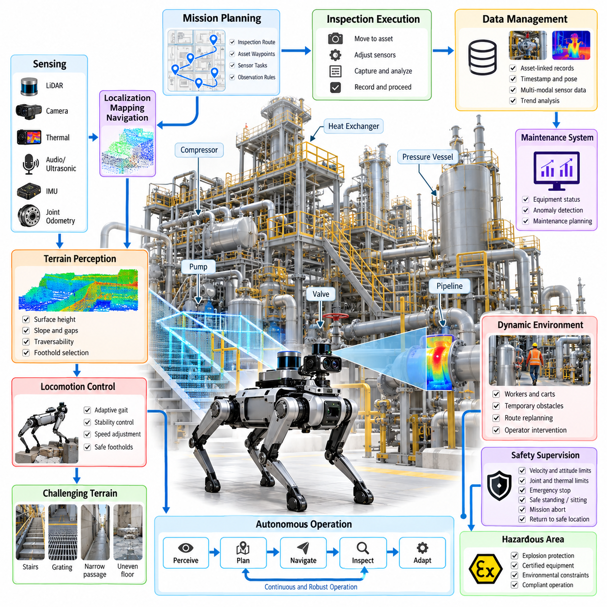
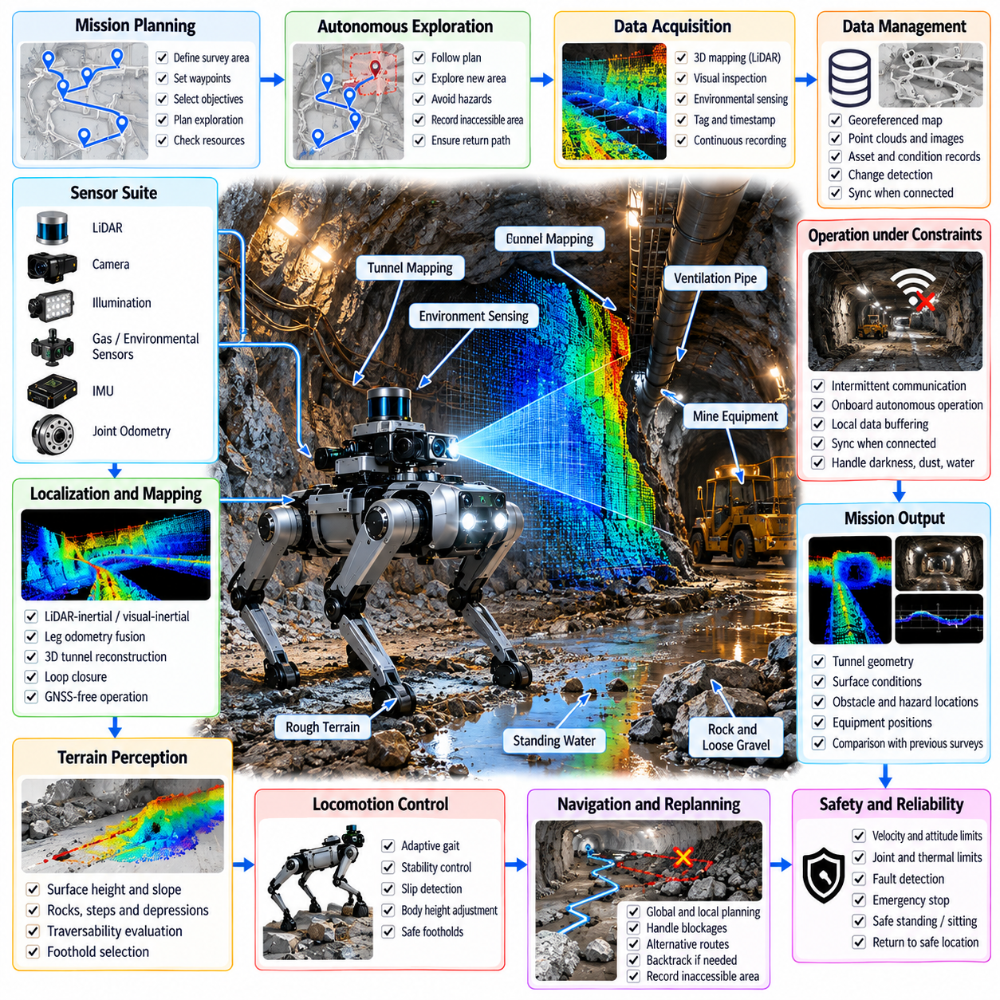
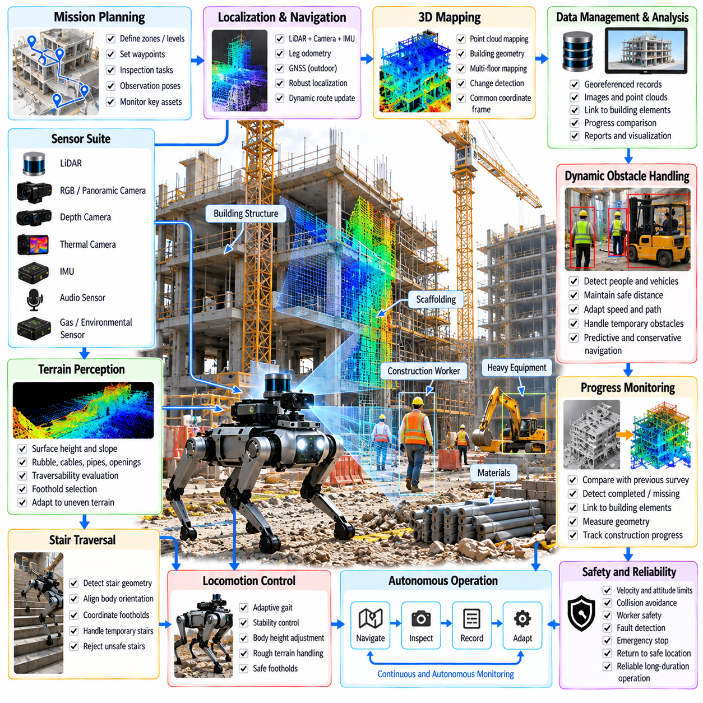
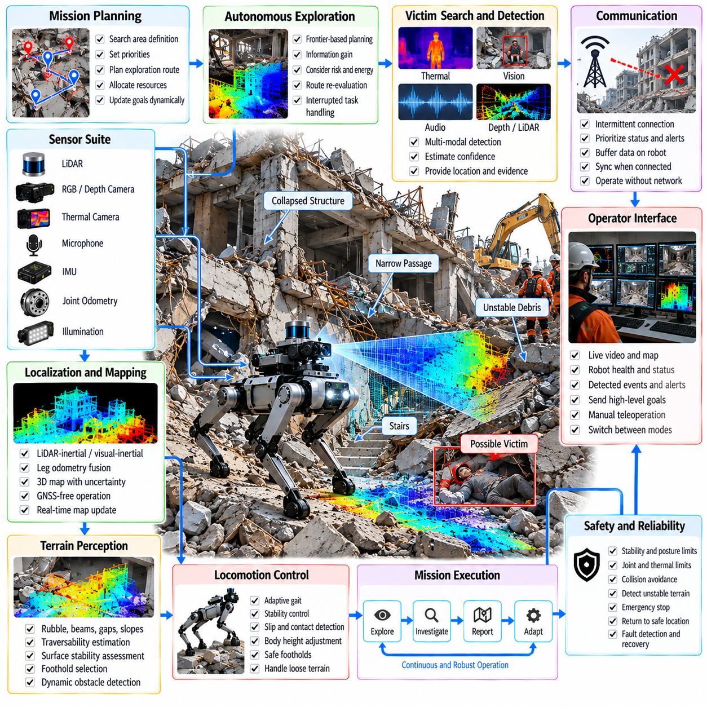
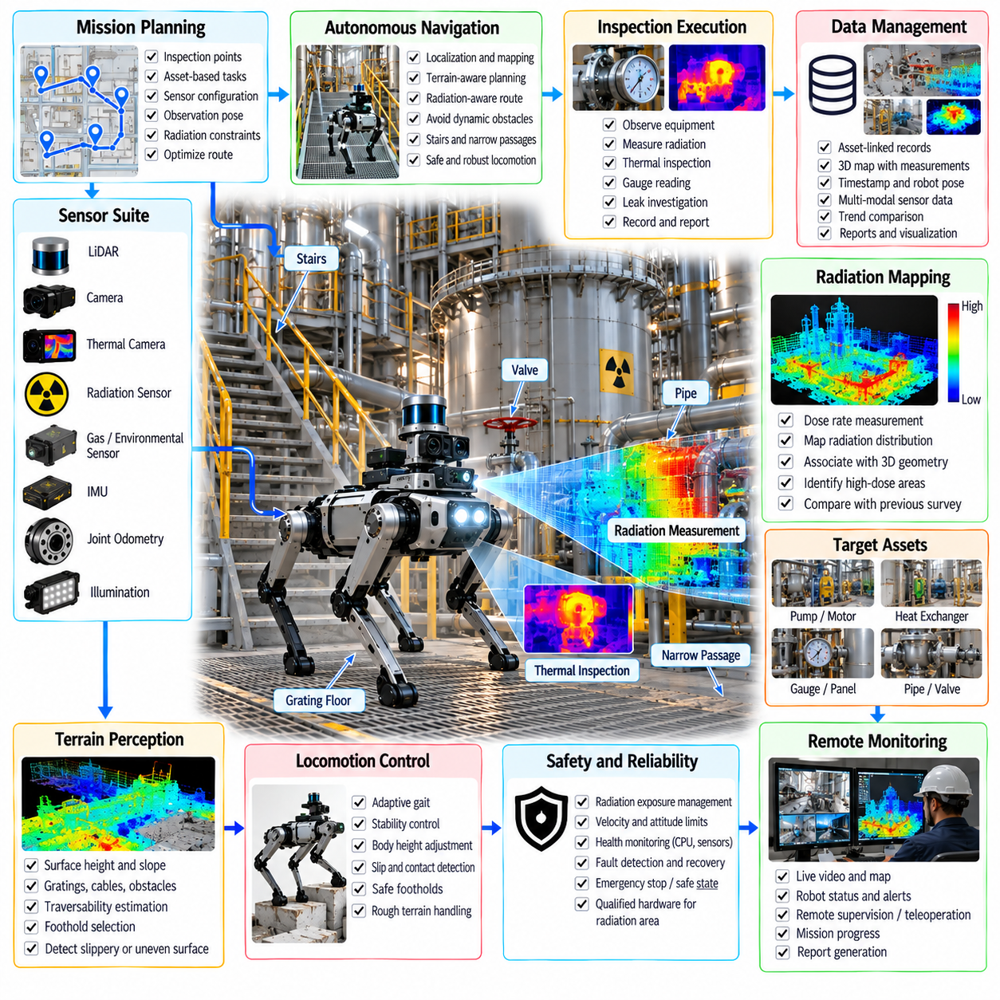
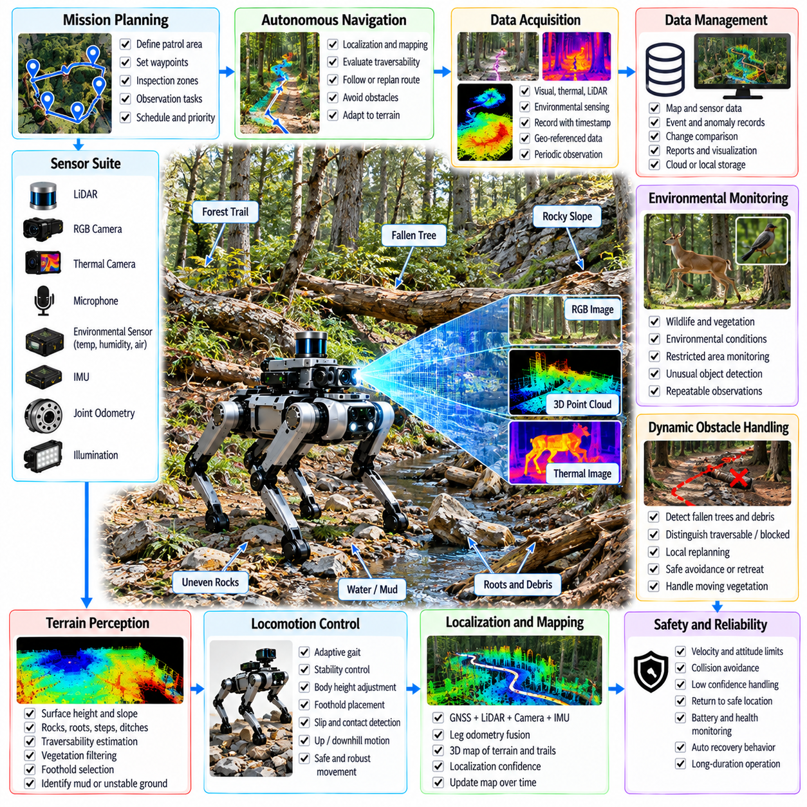
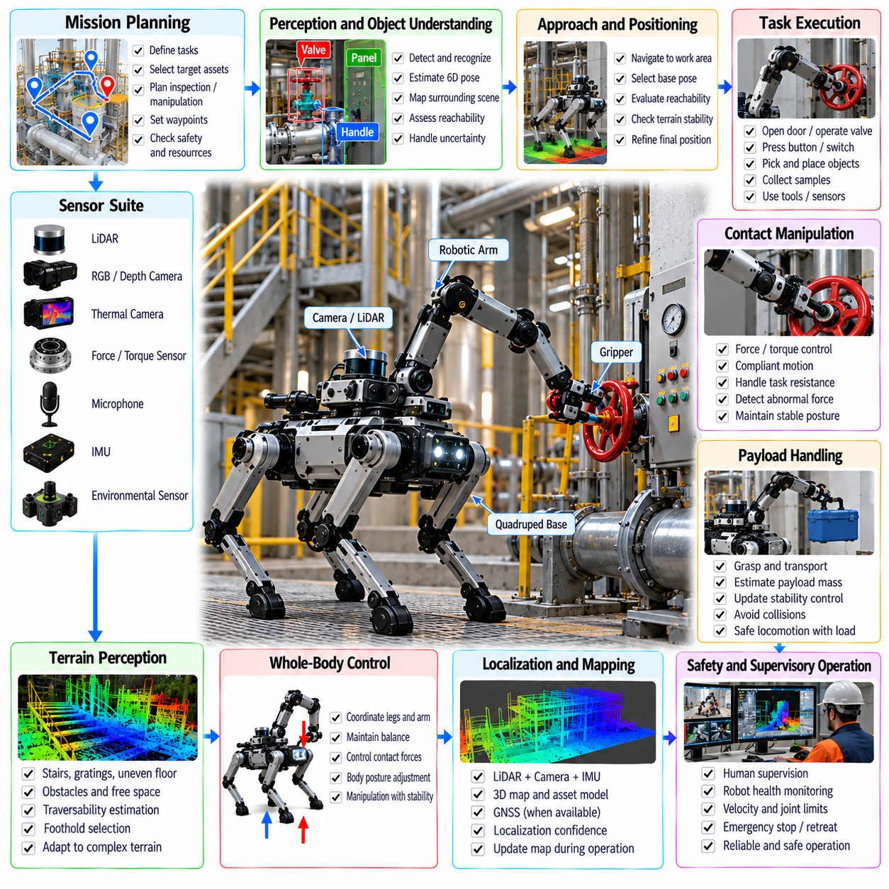
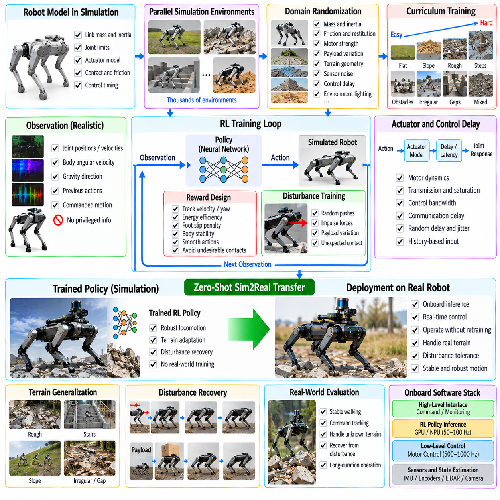
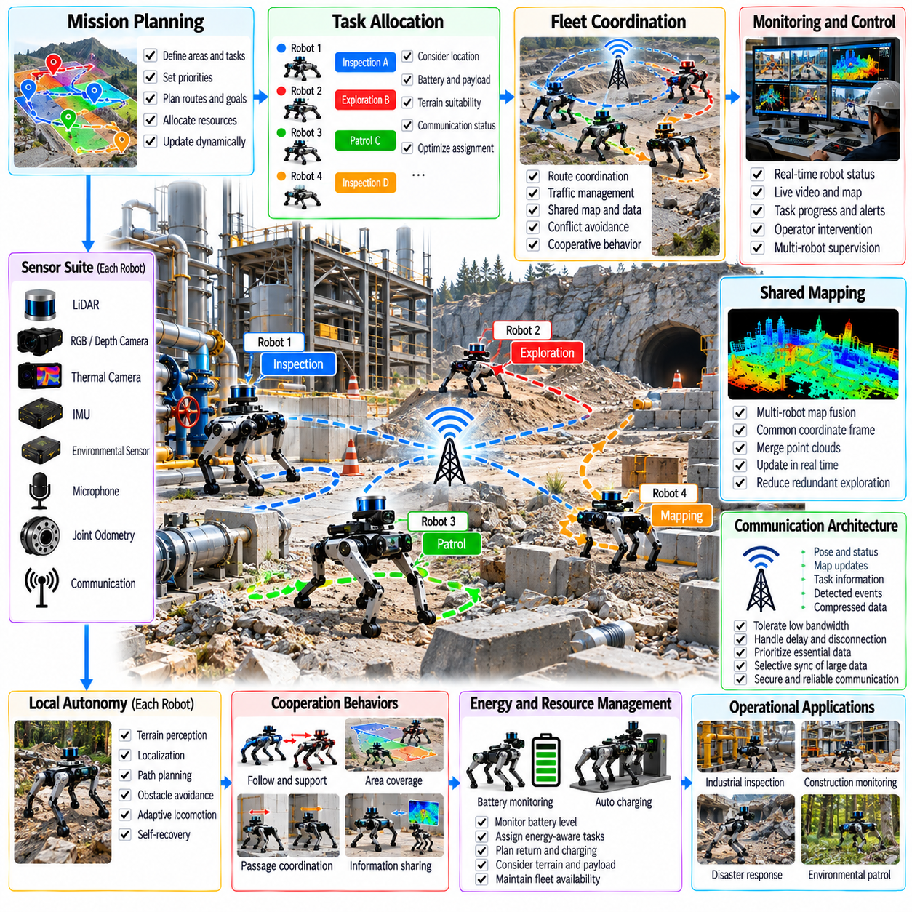
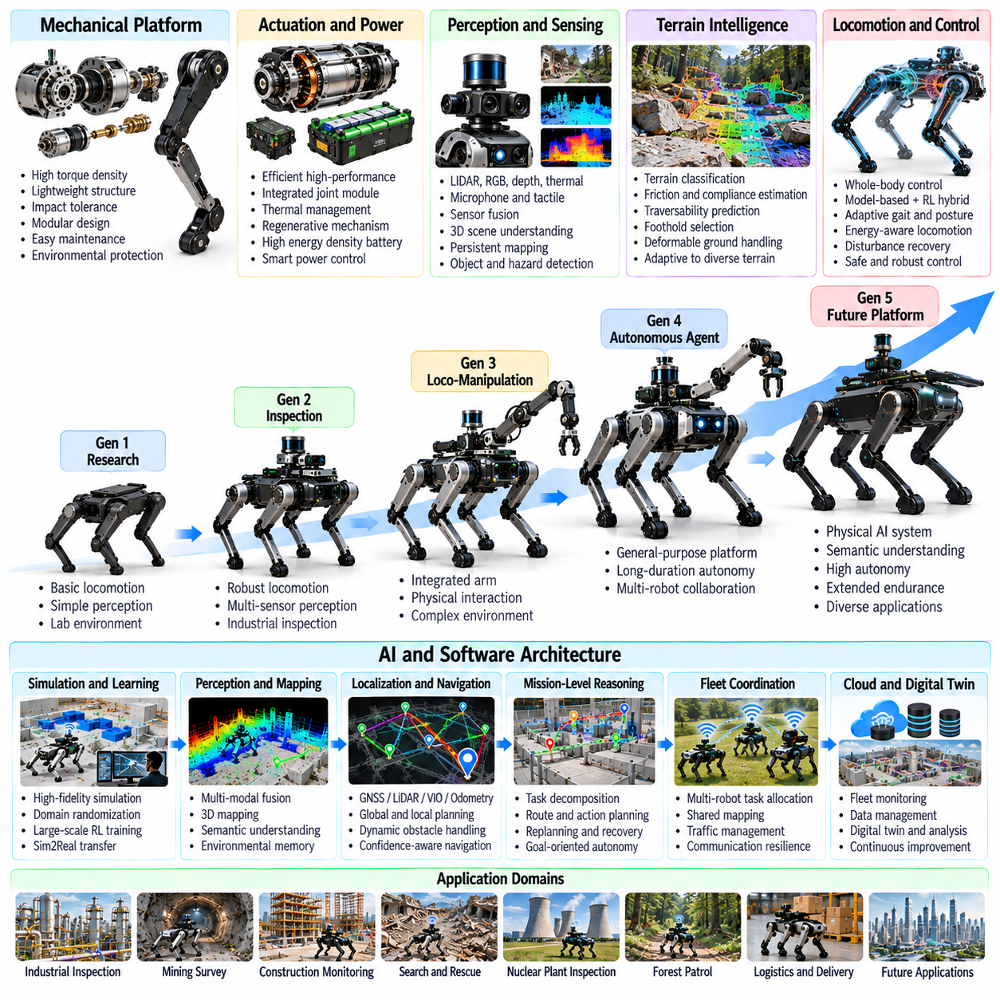

**Volume 21. Quadruped Robot Software**

# Chapter 12. Quadruped Case Studies

## 12.01. Oil Gas Plant Inspection Quadruped Case

{width="7.268055555555556in" height="7.268055555555556in"}

석유 및 가스 플랜트(Oil and Gas Plant)는 대규모 공정 구역(Process Area), 복잡하게 배치된 배관(Piping), 계단(Stairs), 그레이팅 바닥(Grated Floor), 좁은 통로(Narrow Passage), 위험 구역(Hazardous Zone)을 지속적으로 감시해야 하는 까다로운 점검 환경을 제공한다. 4족 보행 로봇(Quadruped Robot)은 이동형 센싱(Mobile Sensing)과 기존의 바퀴형 점검 로봇(Wheeled Inspection Robot)이 접근하기 어려운 지형을 통과할 수 있는 능력을 결합하기 때문에 특히 적합하다. 따라서 이 사례에서는 자율 점검(Autonomous Inspection)을 보행(Locomotion), 내비게이션(Navigation), 센싱(Sensing), 운영 안전(Operational Safety)이 통합된 문제로 다룬다.

일반적인 임무(Mission)는 펌프(Pump), 압축기(Compressor), 압력 용기(Pressure Vessel), 밸브(Valve), 파이프라인(Pipeline), 열교환기(Heat Exchanger), 유틸리티 시스템(Utility System)과 같은 공정 설비(Process Equipment)를 중심으로 정의된 점검 경로(Inspection Route)에서 시작된다. 로봇은 단순히 좌표 사이를 이동하는 것이 아니라 특정 자산(Asset)과 연결된 점검 작업(Inspection Task)을 수행한다. 각 웨이포인트(Waypoint)에는 카메라 방향(Camera Orientation), 관측 거리(Observation Distance), 센서 활성화(Sensor Activation), 측정 시간(Measurement Duration), 다음 임무로 진행하기 위한 허용 신뢰도(Acceptable Confidence) 등의 요구사항을 포함할 수 있다.

산업 플랜트(Industrial Plant)는 반복적인 구조(Repetitive Structure), 금속 표면(Metallic Surface), 변화하는 조명(Changing Illumination), 증기(Steam), 임시 장애물(Temporary Obstacle), 위성항법시스템(GNSS) 수신이 불안정하거나 불가능한 구역을 포함하기 때문에 로봇에는 강건한 위치추정 및 내비게이션 스택(Localization and Navigation Stack)이 필요하다. 라이다(LiDAR), 카메라(Camera), 관성측정장치(IMU), 다리 오도메트리(Leg Odometry)를 융합하여 위치를 유지할 수 있다. 이후 내비게이션 시스템(Navigation System)은 전역 경로 계획(Global Route Planning)과 국부 지형 평가(Local Terrain Evaluation)를 결합하여 계단, 파이프, 그레이팅, 연석(Curb), 케이블, 유지보수 장비 등을 단순한 기하학적 장애물이 아니라 주행 가능성(Traversability)에 따라 판단한다.

지형 인식(Terrain Perception)은 보행 동작(Locomotion Behavior)에 직접적인 영향을 미친다. 고도 지도(Elevation Map)와 국부 포인트 클라우드(Local Point Cloud)는 표면 높이, 경사(Slope), 불연속성(Discontinuity), 잠재적 발 디딤 위치(Foothold)를 식별하며, 고유감각 피드백(Proprioceptive Feedback)은 미끄러운 바닥이나 불안정한 접촉과 같은 예상하지 못한 접촉 상태(Contact Condition)를 파악한다. 불확실성이 증가하면 보행 제어기(Gait Controller)는 속도를 낮추고, 입각 시간(Stance Duration)을 증가시키며, 몸체 높이(Body Height)를 조정하거나 보다 보수적인 발 디딤 위치를 선택할 수 있다. 이러한 인식과 보행의 결합은 신뢰성 높은 플랜트 점검을 위해 필수적이다.

시각 점검(Visual Inspection)은 일반적으로 RGB 카메라(RGB Camera), 줌 카메라(Zoom Camera), 팬틸트 점검 페이로드(Pan-Tilt Inspection Payload)를 사용하여 게이지(Gauge), 표시기(Indicator), 부식(Corrosion), 누출 흔적(Leakage Evidence), 밸브 위치(Valve Position), 설비 상태(Equipment Condition)를 관찰한다. 열화상 이미징(Thermal Imaging)은 모터, 베어링(Bearing), 전기 설비, 파이프라인 또는 공정 부품 주변의 비정상적인 온도 분포를 탐지하여 가시광 센싱(Visible-Light Sensing)을 보완할 수 있다. 적절한 센서가 장착된 경우 음향(Acoustic) 또는 초음파(Ultrasonic) 페이로드를 이용하여 비정상적인 기계 신호나 가압 가스 누출(Pressurized-Gas Leakage)을 탐지할 수도 있다.

점검 소프트웨어(Inspection Software)는 서로 연결되지 않은 이미지와 센서 스트림(Sensor Stream)을 단순히 저장하는 것이 아니라 원시 관측 데이터(Raw Observation)를 자산 연계 기록(Asset-Associated Record)으로 변환해야 한다. 각 측정값은 로봇 자세(Robot Pose), 자산 식별자(Asset Identity), 타임스탬프(Timestamp), 임무 식별자(Mission Identifier), 센서 설정(Sensor Configuration), 신뢰도 정보(Confidence Information)와 연결될 수 있다. 반복적인 임무를 통해 시간적으로 비교 가능한 관측 데이터를 생성하면 유지보수 시스템(Maintenance System)이나 이상 탐지 알고리즘(Anomaly Detection Algorithm)이 지속적인 설비 변화와 시점 변화(Viewpoint Variation), 일시적인 환경 영향, 센서 노이즈(Sensor Noise)를 구별할 수 있다.

자율성(Autonomy)은 플랜트의 동적인 운영 상황도 고려해야 한다. 작업자, 카트(Cart), 임시 호스(Hose), 개방된 접근 패널(Access Panel), 유지보수용 비계(Scaffolding), 통로에 배치된 장비는 기존에 매핑된 경로를 무효화할 수 있다. 4족 보행 로봇은 이러한 변화를 탐지하고 필요할 경우 감속하거나 정지하며, 안전하게 회피할 수 있는 장애물에 대해서는 국부 재계획(Local Replanning)을 수행하고, 검증된 경로가 더 이상 존재하지 않을 경우 운영자 개입(Operator Intervention)을 요청해야 한다. 따라서 복구 행동(Recovery Behavior)은 내비게이션 이후에 추가되는 예외 기능이 아니라 임무 자율성(Mission Autonomy)의 일부가 된다.

산업 점검(Industrial Inspection)에서는 자율 임무 로직(Autonomous Mission Logic)과 안전 감독(Safety Supervision)을 명확하게 분리해야 한다. 상위 수준 계획기(High-Level Planner)는 경로와 점검 행동을 선택할 수 있지만, 독립적인 안전 메커니즘(Safety Mechanism)은 속도, 자세, 관절, 열 상태(Thermal State), 통신, 위치추정의 한계를 강제해야 한다. 비상 정지(Emergency Stop), 제어된 기립(Controlled Standing), 안전 착좌(Safe Sitting), 임무 중단(Mission Abort), 안전 위치 복귀(Return-to-Safe-Location)는 운영 안전 여유가 감소할 때 단계적으로 강화되는 대응 수단을 제공한다. 통신이 상실될 경우에는 제어되지 않은 임무 지속이 아니라 사전에 정의된 페일세이프 정책(Fail-Safe Policy)을 실행해야 한다.

위험 구역(Hazardous Area)에 로봇을 배치하려면 일반적인 로봇 이동성을 넘어서는 요구사항을 고려해야 한다. 로봇, 배터리, 컴퓨팅 하드웨어, 센서, 커넥터(Connector), 페이로드 인터페이스(Payload Interface)는 목표 시설의 환경적 및 규제적 제약(Environmental and Regulatory Constraints)에 따라 평가되어야 한다. 실험실에서 성공적으로 동작한 플랫폼이 폭발성 대기(Explosive Atmosphere)에 자동으로 적합하다고 판단할 수는 없다. 따라서 배치 계획(Deployment Planning)은 일반 산업 점검과 특정 위험 등급 구역(Classified Hazardous Location) 내부에서의 운용을 구분하고, 인증된 장비 능력(Certified Equipment Capability)에 따라 임무를 제한해야 한다.

실용적인 소프트웨어 아키텍처(Software Architecture)는 실시간 보행 제어(Real-Time Locomotion)와 상대적으로 느린 점검 지능(Inspection Intelligence)을 분리한다. 관절 제어(Joint Control)와 전신 안정화(Whole-Body Stabilization)는 높은 주파수에서 동작하며, 상태 추정(State Estimation), 지형 매핑(Terrain Mapping), 내비게이션, 임무 실행(Mission Execution), 인식(Perception), 이상 분석(Anomaly Analysis), 원격 감독(Remote Supervision)은 각각 적절한 낮은 주파수에서 동작한다. 이러한 계층적 구성(Layered Organization)은 기본적인 보행 제어의 안정성을 저해하지 않으면서 점검 애플리케이션(Inspection Application)을 발전시킬 수 있도록 한다.

임무 실행은 내비게이션 상태(Navigation State)와 점검 상태(Inspection State)의 연속적인 과정으로 표현할 수 있다. 로봇은 자산을 향해 이동하고, 관측 자세(Observation Pose)에 접근한 뒤, 몸체를 안정화하고, 센서를 목표 방향으로 정렬하며, 측정 데이터를 획득하고, 데이터 품질(Data Quality)을 검증한 후 결과를 기록하고 다음 자산으로 이동한다. 위치추정 신뢰도(Localization Confidence)나 센서 품질(Sensor Quality)이 임계값(Threshold) 이하로 떨어지면 데이터를 다시 획득하거나 로봇의 위치를 조정할 수 있다. 이를 통해 단순히 웨이포인트에 도달하는 것이 아니라 데이터 품질 자체가 명시적인 임무 완료 조건(Mission Completion Condition)이 된다.

원격 운영자(Remote Operator)는 높은 수준의 자율 운용에서도 중요한 역할을 담당한다. 감독 인터페이스(Supervisory Interface)는 로봇 위치, 임무 진행 상태, 실시간 영상(Live Video), 열화상 관측(Thermal Observation), 배터리 상태, 통신 품질, 탐지된 이상, 안전 이벤트(Safety Event)를 표시할 수 있다. 운영자는 일반적으로 보행을 지속적으로 원격 조작(Teleoperation)하기보다 예외 상황을 감독해야 한다. 개입이 필요한 경우 자율 모드(Autonomous Mode)와 수동 모드(Manual Mode) 사이의 제어 권한 전환(Authority Transition)을 명확하게 정의하여 서로 충돌하는 명령이 운동 제어기(Motion Controller)에 전달되지 않도록 해야 한다.

플릿 배치(Fleet Deployment)는 동일한 개념을 단일 로봇에서 여러 점검 에이전트(Inspection Agent)로 확장한다. 임무는 로봇 위치, 배터리 상태, 페이로드 능력(Payload Capability), 경로 접근성(Route Accessibility), 점검 우선순위(Inspection Priority)에 따라 할당할 수 있다. 중앙 플릿 서비스(Central Fleet Service)는 지도, 일정, 자산 데이터베이스(Asset Database), 점검 이력(Inspection History)을 관리하고, 각 로봇은 네트워크 성능이 저하된 상황에서도 안전을 유지할 수 있도록 충분한 온보드 자율성(Onboard Autonomy)을 보존해야 한다. 이러한 아키텍처는 주기적인 단일 로봇 순찰에서 지속적인 플랜트 전역 로봇 점검으로 점진적인 확장을 지원한다.

검증(Validation)은 단순히 보행 성능만 측정하는 것이 아니라 실제 플랜트에서 발생하는 운영상의 어려움을 재현해야 한다. 대표적인 시험에는 계단, 그레이팅 표면, 좁은 통로, 저조도 환경(Low Illumination), 임시 장애물, 통신 성능 저하, 반복적인 점검 시점, 장시간 순찰, 비상 정지, 위치추정 복구(Localization Recovery), 센서 데이터 완전성(Sensor-Data Completeness) 등이 포함된다. 성능은 임무 완료율(Mission Completion Rate), 개입 빈도(Intervention Frequency), 위치추정 신뢰성, 점검 범위(Inspection Coverage), 이상 탐지 품질, 에너지 소비(Energy Consumption), 안전 복구 성공률(Safe Recovery Success) 등을 통해 평가해야 한다.

결과적으로 석유 및 가스 플랜트 점검 시스템(Oil and Gas Plant Inspection System)은 단순히 카메라를 탑재한 4족 보행 로봇이 아니다. 이는 이동성(Mobility), 지형 이해(Terrain Understanding), 위치추정, 센서 위치 제어(Sensor Positioning), 자산 지능(Asset Intelligence), 임무 계획(Mission Planning), 안전 감독, 통신, 이력 데이터 관리(Historical Data Management)가 하나의 통합 시스템으로 동작하는 물리적 점검 플랫폼(Physical Inspection Platform)이다. 반복적인 인간의 위험 환경 노출을 줄이는 동시에 유지보수 의사결정(Maintenance Decision Making)에 활용할 수 있는 일관되고 추적 가능하며 반복 가능한 관측 데이터를 생성할 때 이러한 시스템의 실질적인 가치가 나타난다.

## 12.02. Underground Mine Survey Quadruped Case

{width="7.268055555555556in" height="7.268055555555556in"}

지하 광산 측량(Underground Mine Surveying)은 터널 내부에 불규칙한 지면, 급경사 램프(Steep Ramp), 느슨한 암석(Loose Rock), 고인 물, 어둠, 먼지, 협소한 통로, 불안정한 통신 환경이 복합적으로 존재하기 때문에 4족 보행 로봇(Quadruped Robot)에 매우 까다로운 환경이다. 일반적인 점검 경로와 달리 광산의 형상은 굴착이 진행되면서 변화할 수 있다. 따라서 로봇은 인간의 직접적인 감독에서 멀리 떨어진 상태에서도 강건한 보행(Robust Locomotion), 연속적인 매핑(Mapping), 위치추정(Localization), 환경 센싱(Environmental Sensing), 자율 복구(Autonomous Recovery)를 통합해야 한다.

주요 임무(Mission)는 갱도(Gallery), 드리프트(Drift), 교차 갱도(Crosscut), 램프(Ramp), 공동(Chamber), 작업 구역(Working Area)을 이동하면서 공간 및 환경 정보를 획득하는 것이다. 4족 보행 로봇은 라이다(LiDAR), 카메라(Camera), 관성측정장치(IMU), 조명(Illumination), 선택적인 환경 센서(Environmental Sensor)를 탑재하면서 기존 바퀴형 플랫폼(Wheeled Platform)이 이동하기 어려운 지형에서도 기동성을 유지할 수 있다. 측량 목적에는 터널 형상, 장애물 위치, 표면 상태, 장비 위치, 이전 매핑 임무와 비교한 변화 등이 포함될 수 있다.

지하에서는 위성항법시스템(GNSS)을 일반적으로 사용할 수 없기 때문에 온보드 위치추정(Onboard Localization)은 보조적인 내비게이션 기능이 아니라 핵심 기능이 된다. 라이다-관성 추정(LiDAR-Inertial Estimation) 또는 시각-관성 추정(Visual-Inertial Estimation)을 이용하여 로봇의 움직임을 지속적으로 추정할 수 있으며, 다리 오도메트리(Leg Odometry)는 몸체와 발의 움직임으로부터 추가적인 제약조건을 제공한다. 이러한 정보를 결합하면 특정 센서 방식에 대한 의존성을 낮추고 어둠, 먼지, 반복적인 터널 형상, 진동 또는 일시적인 시각 정보 저하가 개별 측정에 영향을 미치는 상황에서도 강건성을 향상시킬 수 있다.

3차원 라이다(3D LiDAR)는 광산 측량에서 단순한 장애물 탐지를 넘어 기하학적 재구성(Geometric Reconstruction)이 요구되기 때문에 특히 중요하다. 연속적으로 획득한 포인트 클라우드(Point Cloud)를 정합하여 터널 벽, 바닥 형상, 천장, 교차 지점, 대형 기반 시설을 나타내는 국부 또는 전역 지도(Local or Global Map)를 생성할 수 있다. 매핑 시스템은 관측 데이터를 일관된 좌표로 변환할 수 있도록 타임스탬프(Timestamp)와 자세(Pose) 정보를 보존해야 한다. 로봇이 기존에 인식했던 구역을 다시 방문하면 루프 폐쇄(Loop Closure)를 이용하여 누적된 드리프트(Drift)를 감소시킬 수 있다.

지형 인식(Terrain Perception)은 측량 매핑(Survey Mapping)보다 짧은 공간적·시간적 범위에서 동작한다. 국부 고도 지도(Local Elevation Map)는 보행에 직접 영향을 주는 암석, 함몰부(Depression), 단차(Step), 경사면, 배수로(Drainage Channel), 불규칙한 바닥 표면을 식별한다. 내비게이션 시스템(Navigation System)은 모든 기하학적 불연속을 장애물로 판단하는 대신 해당 영역의 주행 가능성(Traversability)을 평가한다. 이후 예상되는 지형 높이, 경사, 거칠기(Roughness), 사용 가능한 지지 영역(Support Region)에 따라 발 디딤 위치(Foothold)와 보행 파라미터(Gait Parameter)를 조정할 수 있다.

낮은 가시성(Low Visibility)에 대응하기 위해서는 능동 조명(Active Illumination)과 신중하게 설계된 센서 중복성(Sensor Redundancy)이 필요하다. 카메라는 시각적 기록과 의미론적 정보(Semantic Information)를 제공할 수 있지만 어둠, 공기 중 먼지, 물방울, 젖은 표면에서 발생하는 강한 반사로 인해 신뢰성이 저하될 수 있다. 따라서 라이다와 관성 센싱(Inertial Sensing)은 중요한 상호 보완 센서가 된다. 센서 상태 모니터링(Sensor-Health Monitoring)은 관측 품질 저하를 탐지하여 인식 실패가 보행 위험으로 발전하기 전에 내비게이션 속도, 위치추정 신뢰도 또는 임무 동작을 조정해야 한다.

보행 제어기(Locomotion Controller)는 외관상 안정적으로 보이는 지면에도 느슨한 자갈, 진흙, 젖은 암석 또는 지지력이 부족한 파편이 존재할 수 있으므로 불확실성(Uncertainty)에 대응해야 한다. 관절 움직임, 추정 접촉력(Contact Force), 몸체 동역학(Body Dynamics)으로부터 얻는 고유감각 정보(Proprioceptive Information)는 접촉 이후 발생하는 미끄러짐이나 예상하지 못한 발 침하(Foot Penetration)를 탐지할 수 있다. 제어기는 안정적인 지형이 확보될 때까지 발 디딤 위치를 변경하거나, 입각 시간(Stance Time)을 증가시키고, 명령 속도를 감소시키며, 몸체를 낮추거나 보다 보수적인 보행(Gait)을 선택할 수 있다.

광산 내비게이션(Mine Navigation)은 전역 탐사 목표(Global Exploration Objective)와 국부 보행 제약조건(Local Locomotion Constraint)을 통합해야 한다. 전역 계획기(Global Planner)는 터널 분기와 측량 대상 영역을 선택하고, 국부 계획기(Local Planner)는 주변 지형과 충돌 위험을 지속적으로 평가한다. 낙하물, 장비 또는 예상보다 통과하기 어려운 지면으로 기존 경로가 차단되면 로봇은 정지하고 대체 가능한 주행 경로를 탐색하며, 필요하면 후퇴하고, 위험한 이동을 반복적으로 시도하는 대신 접근 불가능 영역(Inaccessible Region)을 기록해야 한다.

자율 탐사(Autonomous Exploration)는 로봇이 기존에 매핑되지 않은 영역으로 진입할 수 있다는 추가적인 문제를 발생시킨다. 프론티어 기반 계획(Frontier-Based Planning) 또는 정보 기반 계획(Information-Driven Planning)을 이용하면 지도 범위를 확장할 가능성이 높은 새로운 영역을 선택할 수 있다. 그러나 탐사 결정은 이동성(Mobility), 잔여 에너지(Remaining Energy), 통신 상태, 위치추정 품질, 복귀 경로 가능성(Return-Path Feasibility)의 제약을 받아야 한다. 로봇이 원격 터널에서 안전하게 복귀하는 데 필요한 에너지를 소모한다면 최대 지도 커버리지(Map Coverage)를 확보하는 것은 의미가 없다.

지하 통신(Underground Communication)은 암반 구조와 터널 형상이 무선 신호를 감쇠시키기 때문에 간헐적으로 단절될 수 있다. 따라서 로봇은 지속적인 원격 명령 없이도 위치를 추정하고, 장애물을 회피하며, 균형을 유지하고, 복구 행동을 수행하며, 사전에 정의된 안전 상태(Safe State)에 도달할 수 있을 정도의 온보드 연산(Onboard Computation)을 유지해야 한다. 임무 데이터는 로컬에 임시 저장(Buffering)하고 통신이 복구되면 동기화할 수 있다. 이에 따라 통신 단절은 완전한 시스템 고장이 아니라 예상 가능한 운영 조건(Expected Operating Condition)으로 처리된다.

에너지 관리(Energy Management)는 지하 측량 경로가 충전 또는 로봇 회수 지점으로부터 멀리 확장될 수 있으므로 임무 계획(Mission Planning)과 통합되어야 한다. 임무 관리자(Mission Manager)는 이동 거리, 지형 난이도, 연산 부하(Computation Load), 페이로드 작동, 예상 복귀 거리를 이용하여 에너지 소비를 추정할 수 있다. 복귀 임계값(Return Threshold)은 단순한 명목 배터리 잔량에 의존하지 않고 안전 여유(Safety Reserve)를 포함해야 한다. 급경사나 거친 지형에서는 동일한 거리의 평탄한 지면 이동보다 훨씬 많은 에너지가 필요할 수 있다.

측량 품질(Survey Quality)은 보행 성공 여부와 독립적으로 평가해야 한다. 로봇이 터널을 성공적으로 통과하더라도 불완전하거나 기하학적으로 일관되지 않은 지도를 생성할 수 있다. 따라서 시스템은 임무 수행 중 포인트 클라우드 밀도(Point-Cloud Density), 정합 품질(Registration Quality), 위치추정 공분산(Localization Covariance), 센서 커버리지(Sensor Coverage), 미탐사 영역(Unexplored Region)을 모니터링해야 한다. 데이터 품질이 충분하지 않으면 로봇은 속도를 낮추거나 해당 구간을 다시 방문하고, 센서 관측 시점을 변경하거나 추가 스캔을 수행한 후에 해당 영역의 측량 완료를 선언할 수 있다.

반복적인 임무는 단일 기하학적 지도보다 더욱 가치 있는 변화 탐지(Change Detection)를 가능하게 한다. 서로 다른 날짜에 획득한 포인트 클라우드와 이미지를 정렬하여 터널 형상, 퇴적 물질(Material Accumulation), 차단된 통로, 장비 배치 또는 기타 구조적 차이를 식별할 수 있다. 신뢰성 높은 비교를 위해서는 일관된 좌표계(Coordinate Frame)와 불확실성 관리(Uncertainty Management)가 필요하다. 위치추정 드리프트나 정합 오류(Registration Error)가 광산 내부의 실제 물리적 변화로 잘못 판단되어서는 안 되기 때문이다.

안전 감독(Safety Supervision)은 탐사 목표와 독립적으로 동작한다. 몸체 자세(Body Attitude), 관절 상태, 모터 온도, 배터리 상태, 위치추정 신뢰도, 통신 상태, 지형 위험도(Terrain Risk)에 대한 제한 조건은 단계적으로 강화되는 안전 대응을 실행할 수 있다. 로봇은 속도를 감소시키거나 정지하고, 후퇴하거나, 안전하게 착좌(Safe Sitting)하고, 탐사를 종료하거나 이미 확인된 위치로 복귀할 수 있다. 또한 미끄러짐, 충돌 또는 험난한 지형으로 인해 비정상적인 자세에 놓이는 상황까지 복구 행동(Recovery Behavior)에서 고려해야 한다.

현실적인 검증 프로그램(Validation Program)은 어둠, 먼지, 느슨한 자갈, 경사면, 불규칙한 암석 표면, 물웅덩이, 좁은 통로, 통신 단절, 위치추정 성능 저하, 장시간 운용을 재현해야 한다. 평가는 측량 커버리지(Survey Coverage), 지도 일관성(Map Consistency), 위치추정 드리프트, 지형 통과 성공률(Terrain-Crossing Success), 운영자 개입 빈도(Intervention Frequency), 에너지 소비, 통신 독립 자율성(Communication-Independent Autonomy), 복구 성공률, 안전 복귀율(Safe Return Rate)을 측정해야 한다. 시험은 개별적인 보행 능력을 시연하는 수준을 넘어 전체 임무 수행 능력을 평가해야 한다.

지하 광산 사례(Underground Mine Case)는 4족 보행(Quadruped Locomotion)이 더 큰 자율 측량 시스템(Autonomous Surveying System)의 일부로 어떻게 통합되는지를 보여준다. 지형 인식, 상태 추정(State Estimation), 매핑, 내비게이션, 보행 적응(Gait Adaptation), 안전 감독, 에너지 관리, 통신, 측량 데이터 처리(Survey-Data Processing)가 지속적으로 협력해야 한다. 실질적인 목표는 단순히 로봇이 광산 내부를 걸어 다니게 만드는 것이 아니라, 인간의 위험 환경 노출을 최소화하면서 접근하기 어렵거나 위험한 영역에서 신뢰할 수 있는 공간 정보를 획득하고 로봇의 안전한 복귀를 위한 검증 가능한 경로(Verifiable Recovery Path)를 유지하는 것이다.

## 12.03. Construction Site Monitoring Quadruped Case

{width="7.268055555555556in" height="7.268055555555556in"}

건설 현장(Construction Site)은 프로젝트가 진행됨에 따라 지형, 접근 경로, 구조물, 자재, 기계 장비, 작업자 활동이 지속적으로 변화하는 매우 동적인 환경이다. 4족 보행 로봇(Quadruped Robot)은 인식 센서(Perception Sensor)를 탑재한 상태에서 계단, 미완성 바닥, 경사로, 잔해, 불규칙한 지면, 좁은 통로를 이동할 수 있기 때문에 이러한 환경의 모니터링에 적합하다. 따라서 건설 현장 모니터링은 이동성(Mobility), 매핑(Mapping), 점검(Inspection), 위치추정(Localization), 안전(Safety), 시계열 데이터 분석(Temporal Data Analysis)을 통합하는 문제이다.

건설 현장 모니터링 임무(Monitoring Mission)는 사전에 정의된 구역, 건물 층, 구조 요소, 장비 위치, 점검 시점(Inspection Viewpoint)을 중심으로 구성할 수 있다. 로봇은 단순히 고정된 순찰 경로를 따라가는 것이 아니라 특정 모니터링 목적과 연결된 관측 위치를 방문한다. 여기에는 공사 진행 상황 기록, 설치된 구성요소 점검, 작업 구역 문서화, 형상 측정, 접근 방해 요소 탐지, 이전 임무와 비교할 수 있는 반복 가능한 시각 및 공간 기록의 수집 등이 포함될 수 있다.

건설 현장은 어제의 지도가 오늘의 환경을 정확하게 표현하지 못할 수 있다는 점에서 정적인 산업 시설(Static Industrial Facility)과 다르다. 새로운 벽이 만들어지고, 임시 칸막이가 제거되며, 자재가 통로를 차단하고, 비계(Scaffolding)나 장비가 이동 가능한 경로를 변경할 수 있다. 따라서 로봇은 지도를 변경되지 않는 내비게이션 기준으로 사용하는 것이 아니라 지속적으로 변화하는 표현(Evolving Representation)으로 취급해야 한다. 국부 인식(Local Perception)은 이전에 통과 가능했던 영역이 여전히 접근 가능한지를 지속적으로 확인하고 중요한 변화가 탐지되면 내비게이션 정보를 갱신한다.

위치추정(Localization)은 라이다(LiDAR), 카메라(Camera), 관성측정장치(IMU), 다리 오도메트리(Leg Odometry)를 결합하여 실내외 영역에서 로봇의 자세(Robot Pose)를 유지할 수 있다. 위성항법시스템(GNSS)은 개방된 실외 공간에서는 도움을 줄 수 있지만 건물 내부, 지하층 또는 대형 구조물 사이에서는 신뢰성이 낮아질 수 있다. 따라서 라이다-관성 추정(LiDAR-Inertial Estimation)과 시각-관성 추정(Visual-Inertial Estimation)이 중요한 연속성을 제공한다. 특히 미완성 공간이나 반복적으로 배치된 구조 기둥으로 인해 특징적인 시각 정보가 부족한 환경에서는 강건한 위치추정(Robust Localization)이 필요하다.

3차원 매핑(3D Mapping)은 내비게이션과 건설 현장 문서화 모두에 필요한 정보를 제공한다. 라이다 포인트 클라우드(LiDAR Point Cloud)는 바닥, 벽, 기둥, 천장, 계단, 개구부, 장비, 임시 구조물을 표현할 수 있다. 관측 데이터를 공통 좌표계(Common Coordinate Frame)에 정합하면 연속적인 측량 결과를 비교하여 기하학적 변화를 파악할 수 있다. 생성된 지도는 사진, 탐지된 객체, 점검 결과, 공사 진행 상황을 실제 공간 위치와 연결하기 위한 공간적 기준(Spatial Reference)으로도 활용할 수 있다.

지형 인식(Terrain Perception)은 로봇이 특정 영역을 안전하게 통과할 수 있는지를 국부적으로 판단한다. 고도 지도(Elevation Map)와 포인트 클라우드 분석(Point-Cloud Analysis)을 이용하여 단차, 바닥 가장자리, 경사로, 잔해, 케이블, 파이프, 개구부, 불규칙한 표면을 식별할 수 있다. 로봇은 회피해야 하는 장애물과 보행을 조정하여 통과할 수 있는 지형을 구별해야 한다. 주행 가능성 추정(Traversability Estimation)은 환경의 난이도가 증가함에 따라 경로 비용(Path Cost), 명령 속도, 보행 선택(Gait Selection), 몸체 높이, 발 디딤 위치(Foothold Placement)에 영향을 줄 수 있다.

계단 이동(Stair Traversal)은 건설 과정에서 엘리베이터가 아직 운용되지 않을 수 있기 때문에 특히 중요한 기능이다. 로봇은 계단의 형상을 탐지하고 몸체를 계단 방향에 정렬하며, 몸체 자세를 조절하고, 충분한 여유 공간을 유지하면서 발 디딤 위치를 조정해야 한다. 임시 계단은 완성된 구조물의 계단과 치수나 표면 상태가 다를 수 있으므로 기하학적 인식(Geometric Perception)과 접촉 피드백(Contact Feedback)을 함께 사용해야 한다. 불확실하거나 구조적으로 부적합한 계단은 단순히 형상이 정상적인 계단과 유사하다는 이유만으로 통과해서는 안 된다.

시각 모니터링(Visual Monitoring)은 RGB 카메라, 파노라마 카메라(Panoramic Camera), 깊이 카메라(Depth Camera), 줌 카메라(Zoom Camera)를 이용하여 현장의 체계적인 기록을 생성할 수 있다. 서로 다른 날짜의 이미지가 유사한 위치와 방향에서 촬영될수록 공사 진행 평가(Progress Assessment)의 신뢰성이 향상되므로 반복 가능한 관측 시점(Repeatable Viewpoint)이 중요하다. 따라서 임무 시스템은 점검 자세(Inspection Pose)를 저장하고 이후 순찰에서 이를 재현하도록 시도할 수 있다. 기존 관측 위치에 접근할 수 없는 경우에는 그 차이를 기록하고 추적성을 유지하면서 대체 관측 자세(Alternative Observation Pose)를 선택할 수 있다.

진행 상황 모니터링(Progress Monitoring)은 센서 관측 데이터를 프로젝트 형상 및 건설 객체(Construction Entity)와 연계할 때 더욱 유용해진다. 포인트 클라우드, 이미지, 탐지된 객체를 개별적인 센서 파일로 유지하는 대신 층, 공간, 구조 요소, 장비 또는 작업 패키지(Work Package)와 연결할 수 있다. 적절한 프로젝트 정보가 제공되는 경우 측량 데이터를 예상 형상(Expected Geometry) 또는 디지털 건설 모델(Digital Construction Model)과 비교하여 완료된 요소, 누락된 요소, 위치가 변경된 요소 또는 잠재적으로 불일치하는 요소를 식별할 수도 있다.

작업자와 건설 기계가 동일한 운영 환경을 공유하기 때문에 동적 장애물 처리(Dynamic Obstacle Handling)는 필수적이다. 로봇은 사람, 차량, 이동 장비, 임시 작업 구역을 탐지하고 필요한 경우 속도를 낮추며 적절한 안전거리를 유지해야 한다. 내비게이션 동작은 기하학적으로 통과 가능한 모든 틈을 적극적으로 이용하기보다 예측 가능한 움직임(Predictable Motion)을 우선해야 한다. 안전한 경로를 확보할 수 없다면 작업이 진행 중인 구역을 자율적으로 통과하는 것보다 대기하거나 작업자의 도움을 요청하는 것이 적절할 수 있다.

미완성 구조물에서는 가장자리 및 음의 장애물 탐지(Edge and Negative-Obstacle Detection)가 특히 중요하다. 개방된 수직 통로(Open Shaft), 계단 개구부, 바닥 가장자리, 굴착 구역, 완성되지 않은 안전 장벽은 일반적인 양의 장애물(Positive Obstacle) 형태로 나타나지 않을 수 있다. 따라서 지형 인식은 지지면이 존재하지 않는 영역과 충분한 기하학적 정보가 확보되지 않은 영역을 식별해야 한다. 탐지된 낙차 영역 주변에는 보수적인 제외 구역(Conservative Exclusion Zone)을 생성하고, 노출된 경계 부근에서 위치추정 불확실성이 증가할 경우 안전 여유(Safety Margin)를 확대해야 한다.

건설 현장의 먼지, 변화하는 조명, 진동, 비, 반사 표면, 센서 오염은 인식 품질(Perception Quality)을 저하시킬 수 있다. 센서 상태 모니터링(Sensor-Health Monitoring)은 카메라 가시성 저하, 부족한 포인트 클라우드 품질, 일관되지 않은 위치추정 측정값을 탐지해야 한다. 로봇은 이에 대응하여 속도를 줄이고 위치를 변경하거나, 플랫폼이 지원하는 경우 센서를 청소 또는 점검하며, 필요하면 해당 점검 작업을 종료할 수 있다. 임무 완료 여부는 단순히 물리적으로 목표 위치에 도착했는지가 아니라 사용 가능한 모니터링 데이터(Usable Monitoring Data)를 획득했는지를 기준으로 판단해야 한다.

건설 현장의 경로는 사전 통보 없이 사용할 수 없게 되는 경우가 많기 때문에 자율 복구(Autonomous Recovery)가 필요하다. 통로가 차단되면 로봇은 국부 재계획(Local Replanning)을 수행하고 다른 연결 경로를 탐색하거나 이전에 검증된 위치로 복귀할 수 있다. 잔해나 느슨한 자재 위에서 보행이 불안정해지면 고유감각 피드백(Proprioceptive Feedback)을 이용하여 속도를 줄이고 발 디딤 위치를 변경하거나 후퇴할 수 있다. 환경 정보가 위험한 조건으로 변화했음을 나타내는 경우 동일한 위험 구간을 반복적으로 통과하려는 시도를 복구 로직(Recovery Logic)이 방지해야 한다.

임무 데이터(Mission Data)는 타임스탬프(Timestamp), 로봇 자세, 센서 설정, 관측 품질, 현장 위치, 임무 식별 정보(Mission Identity)를 보존해야 한다. 반복적인 측량은 시간에 따른 기록(Temporal Record)을 형성하며 이를 통해 건설 현장의 변화를 분석할 수 있다. 신뢰성 높은 비교를 위해서는 실제 공사 진행으로 발생한 변화와 위치추정 드리프트(Localization Drift), 관측 시점 변화(Viewpoint Variation), 임시 객체, 불완전한 센서 커버리지로 발생한 차이를 구분해야 한다. 따라서 탐지된 변화에는 모든 기하학적 차이를 확정된 공사 진행으로 표현하는 대신 신뢰도 정보(Confidence Information)를 함께 제공해야 한다.

운영 안전(Operational Safety)은 모니터링 목적과 독립적으로 유지되어야 한다. 안전 감독(Safety Supervision)은 몸체 자세, 관절 상태, 모터 온도, 배터리 상태, 위치추정 신뢰도, 통신 품질, 사람과의 거리, 지형 위험도와 관련된 제한 조건을 강제할 수 있다. 위험 수준에 따라 로봇은 속도를 감소시키거나 정지하고, 후퇴하거나, 안정된 자세(Stable Posture)를 취하며, 현재 점검을 중단하거나 지정된 안전 위치로 복귀할 수 있다. 또한 작업자는 개입 및 비상 정지(Emergency Stop)를 수행할 수 있는 명확하게 정의된 제어 권한을 유지해야 한다.

검증(Validation)은 계단, 경사로, 잔해, 케이블, 좁은 통로, 변화하는 현장 배치, 이동하는 작업자, 건설 장비, 저조도 환경(Low Illumination), 먼지, 통신 성능 저하, 노출된 가장자리 등 실제적인 건설 현장 조건을 재현해야 한다. 성능은 단순한 보행 속도가 아니라 경로 완료율(Route Completion), 모니터링 커버리지(Monitoring Coverage), 위치추정 정확도, 지도 일관성(Map Consistency), 반복 관측 위치 정확도(Repeat-Viewpoint Accuracy), 지형 통과 성공률, 작업자 개입 빈도, 데이터 완전성(Data Completeness), 복구 성공률, 안전한 임무 종료(Safe Mission Termination) 등을 통해 평가할 수 있다.

결과적으로 건설 현장 사례(Construction-Site Case)는 단순히 걸어 다니는 카메라 플랫폼이 아니라 이동형 물리 모니터링 시스템(Mobile Physical Monitoring System)을 보여준다. 4족 보행, 지형 인식, 위치추정, 매핑, 내비게이션, 반복 가능한 센싱(Repeatable Sensing), 변화 분석(Change Analysis), 자율 복구, 안전 감독이 하나의 통합된 스택(Coordinated Stack)으로 동작해야 한다. 이러한 시스템은 변화하는 건설 현장의 상태를 공간적으로 정합된 증거(Spatially Registered Evidence)로 반복 수집하면서, 단순한 정기 기록과 모니터링을 위해 작업자가 접근하기 어려운 영역에 직접 진입해야 하는 필요성을 줄일 수 있다.

## 12.04. Search and Rescue Disaster Scene Quadruped Case

{width="7.268055555555556in" height="7.268055555555556in"}

재난 현장 수색 및 구조(Search and Rescue) 작업에서는 지형 구조, 가시성, 통신, 환경 안전성이 모두 불확실한 상황에서 로봇이 운용되어야 한다. 붕괴된 건물, 지진, 폭발, 산사태, 산업 사고는 잔해, 경사진 표면, 좁은 통로, 불안정한 파편, 부분적으로 차단된 계단 등을 형성할 수 있다. 4족 보행 로봇(Quadruped Robot)은 다족 이동성(Legged Mobility)과 원격 센싱(Remote Sensing)을 결합하여 구조대원의 활동 범위를 확장하고 위험 지역에 사람이 불필요하게 노출되는 것을 줄일 수 있다.

임무 목표(Mission Objective)는 단순한 자율 주행(Autonomous Traversal)이 아니라 구조 의사결정(Rescue Decision)을 지원하는 정보를 획득하는 것이다. 로봇은 미탐사 공간을 수색하고, 접근 가능한 경로를 식별하며, 잠재적인 구조 대상자를 탐지하고, 구조물 상태를 점검하여 관측 결과를 지휘팀(Command Team)에 전달할 수 있다. 새로운 정보가 확보됨에 따라 임무 우선순위가 빠르게 변경될 수 있으므로 자율 아키텍처(Autonomy Architecture)는 목표 갱신, 작업 중단, 경로 재할당, 탐사에서 집중 조사로의 즉각적인 전환을 지원해야 한다.

재난 잔해 위에서의 이동성(Mobility)은 지속적인 지형 해석(Terrain Interpretation)을 필요로 한다. 라이다(LiDAR), 깊이 카메라(Depth Camera), 기타 기하학 센서(Geometric Sensor)를 이용하여 국부 고도 또는 표면 표현(Local Elevation or Surface Representation)을 생성하고, 이를 통해 암석, 파손된 콘크리트, 보(Beam), 단차, 틈, 경사면, 불규칙한 지지 영역을 식별할 수 있다. 주행 가능성 분석(Traversability Analysis)은 각 영역을 안전하게 통과할 수 있는지를 평가해야 하며, 보행 제어기(Locomotion Controller)는 국부 형상에 따라 속도, 몸체 높이, 보행 파라미터(Gait Parameter), 발 디딤 위치(Foothold)를 조정해야 한다.

재난 지형은 인식된 이후에도 기계적으로 안정된 상태를 유지한다고 가정할 수 없다. 느슨한 잔해는 하중을 받으면 움직일 수 있고, 손상된 바닥은 변형될 수 있으며, 외관상 단단해 보이는 표면도 충분한 지지력을 제공하지 못할 수 있다. 따라서 고유감각 센싱(Proprioceptive Sensing)은 예상하지 못한 발의 이동, 미끄러짐, 침하, 몸체 움직임을 탐지함으로써 외부환경 인식(Exteroceptive Perception)을 보완한다. 접촉 상태가 예측과 다르면 제어기는 동작의 공격성을 낮추고, 지지력을 재분배하며, 발 디딤 위치를 수정하거나 후퇴해야 한다.

붕괴된 구조물 내부에서는 위성항법시스템(GNSS)을 사용할 수 없을 수 있고 기존에 준비된 지도도 변화된 환경과 더 이상 일치하지 않을 수 있기 때문에 위치추정(Localization)이 어렵다. 라이다-관성(LiDAR-Inertial), 시각-관성(Visual-Inertial), 다리 오도메트리(Leg Odometry) 정보를 융합하여 로봇의 움직임을 추정하는 동시에 접근 가능한 영역의 지도를 생성할 수 있다. 매핑 시스템(Mapping System)은 자유 공간과 장애물뿐 아니라 불확실성(Uncertainty)도 표현해야 한다. 관측이 불충분한 형상 정보를 기반으로 내비게이션을 수행할 경우 더 큰 안전 여유가 필요하기 때문이다.

탐사 계획(Exploration Planning)은 정보 획득량(Information Gain)과 물리적 위험(Physical Risk) 사이의 균형을 유지해야 한다. 프론티어 기반 탐사(Frontier-Based Exploration)는 로봇을 지도화된 공간과 미지 공간 사이의 경계로 이동시킬 수 있지만 가장 가까운 미탐사 영역이 반드시 가장 안전하거나 가치 있는 목표인 것은 아니다. 후보 경로는 지형 난이도, 위치추정 신뢰도, 통신 품질, 잔여 에너지, 예상 정보 획득량, 복귀 경로 가용성(Return-Path Availability)을 이용하여 평가할 수 있다. 위험도가 높은 영역에 자율적으로 진입하려면 보다 높은 수준의 근거가 필요하다.

구조 대상자 탐색(Victim Search)은 모든 재난 상황에서 하나의 센서만으로 충분한 신뢰성을 확보하기 어렵기 때문에 상호 보완적인 센싱 방식(Sensing Modality)을 결합할 수 있다. 가시광 카메라는 시각 인식을 지원하고, 열화상 카메라(Thermal Camera)는 온도 패턴을 탐지하며, 마이크로폰(Microphone)은 음성이나 충격음을 수집하고, 깊이 센서 또는 라이다는 공간적 맥락(Spatial Context)을 제공한다. 열원, 가림(Occlusion), 먼지, 어둠, 소음, 잔해가 모호한 측정값을 생성할 수 있으므로 탐지 알고리즘은 센서 관측을 절대적인 확인 결과가 아니라 증거(Evidence)로 취급해야 한다.

잠재적인 구조 대상자가 탐지되면 임무 동작은 광범위한 탐사에서 국부적인 집중 관측(Localized Observation)으로 전환되어야 한다. 로봇은 안전한 위치에서 정지하고 몸체를 안정화한 후 카메라 또는 마이크로폰을 목표 방향으로 정렬하여 추가적인 측정값을 획득하고, 해당 위치와 이를 뒷받침하는 센서 데이터를 구조대원에게 전달할 수 있다. 구조대원이 로봇의 탐지 결과를 실제 공간상의 의미 있는 위치로 변환해야 하므로 관측과 연계된 로봇 자세(Robot Pose)와 지도 좌표(Map Coordinate)를 유지하는 것이 매우 중요하다.

손상된 구조물 내부에서는 통신(Communication)이 중요한 제약조건이 된다. 철근 콘크리트, 지하 공간, 복잡한 구조 형상, 긴 이동 거리는 무선 연결을 저하시키거나 일시적으로 완전히 단절시킬 수 있다. 따라서 로봇은 지속적인 원격 조작(Teleoperation)에 의존하지 않고 균형 유지, 국부 내비게이션(Local Navigation), 장애물 회피, 위치추정, 안전 복구(Safe Recovery)를 수행할 수 있는 온보드 기능(Onboard Capability)을 유지해야 한다. 센서 데이터는 로컬에 임시 저장할 수 있으며 통신 대역폭이 제한될 경우에는 중요도가 높은 상태 정보를 우선적으로 전송할 수 있다.

재난 현장에는 자율 시스템 설계 과정에서 사전에 예상하기 어려운 상황이 존재하기 때문에 원격 조작(Remote Operation)은 여전히 중요하다. 인터페이스는 구조대원이 실시간 센서 데이터, 지도, 로봇 상태, 임무 진행 상황, 탐지된 이벤트를 확인할 수 있도록 지원하는 동시에 필요할 경우 상위 수준의 목표를 지정하거나 수동 제어권을 확보할 수 있어야 한다. 자율 모드(Autonomous Mode)와 원격 조작 모드(Teleoperated Mode) 사이의 제어 권한 전환(Authority Transition)은 충돌하는 명령으로 인해 보행이나 내비게이션이 불안정해지지 않도록 명확하게 정의되어야 한다.

로봇이 잔해 사이에 갇히거나, 안정적인 발 디딤 위치를 잃거나, 예상하지 못한 낙차를 만나거나, 전진할 수 없는 영역으로 진입할 수 있으므로 복구 행동(Recovery Behavior)은 특히 중요하다. 복구에는 정지, 몸체 낮추기, 최근 검증된 발 디딤 위치를 따라 후진하기, 장애물 주변 경로 재계획, 이미 확인된 자세로 복귀하기, 운영자 지원 요청 등이 포함될 수 있다. 환경 조건을 통해 해당 이동이 위험하다는 사실이 이미 확인된 경우 동일하게 실패한 동작을 반복적으로 수행하지 않도록 해야 한다.

음의 장애물(Negative Obstacle)은 보수적으로 처리해야 한다. 구멍, 붕괴된 바닥, 수직 통로(Shaft), 계단 개구부, 잔해 사이의 틈은 센서 반사값이 거의 존재하지 않을 수 있으므로 눈에 보이는 장애물보다 더욱 위험할 수 있다. 인식 시스템은 지지면이 존재하지 않는 영역과 불확실한 영역을 명시적으로 식별해야 한다. 낙차 구역 주변에서는 내비게이션 비용과 제외 안전 여유(Exclusion Margin)를 증가시키고, 불확실한 가장자리에 접근할 때는 속도를 낮추며 표면 지지력을 신뢰성 있게 확인할 수 없는 위치에는 발을 배치하지 않아야 한다.

에너지 관리(Energy Management)는 험난한 지형으로부터 복귀하는 데 필요한 비용을 고려해야 한다. 배터리 잔량만으로 임무 지속 시간을 정확하게 판단할 수 없는 이유는 잔해를 오르는 동작, 지속적인 안정화, 고전력 센서 운용, 반복적인 경로 재계획이 에너지 소비를 증가시킬 수 있기 때문이다. 임무 관리자(Mission Manager)는 현재 위치, 경로 난이도, 페이로드 사용량, 불확실성을 기반으로 복귀 예비 에너지(Return Reserve)를 추정해야 한다. 잔여 에너지가 보수적인 복귀 또는 복구 시도에 부족해지기 전에 탐사를 종료해야 한다.

안전 감독(Safety Supervision)은 임무의 긴급성과 독립적으로 동작해야 한다. 몸체 자세, 관절 움직임, 액추에이터 온도, 배터리 상태, 위치추정 신뢰도, 지형 위험도, 통신 상태에 대한 제한 조건은 단계적으로 강화되는 보호 대응을 실행할 수 있다. 구조 정보의 가치가 매우 높더라도 자율 소프트웨어가 기본적인 하드웨어 또는 안정성 제약조건을 임의로 우회해서는 안 된다. 또한 긴급 개입이 예측 가능하고 추적 가능하도록 인간의 오버라이드 권한(Human Override Authority)을 체계적으로 구성해야 한다.

검증(Validation)은 표준화된 장애물에서 보행 성능을 시험하는 것만으로 충분하지 않다. 대표적인 시험 환경에는 불규칙한 잔해, 경사진 슬래브(Inclined Slab), 계단, 좁은 개구부, 저조도 환경, 먼지, 통신 성능 저하, 음의 장애물, 움직이는 잔해, 위치추정 불확실성이 포함되어야 한다. 평가 지표에는 탐사 면적(Explored Area), 구조 대상자 탐지 커버리지(Victim-Detection Coverage), 위치추정 정확도, 주행 가능성 통과 성공률, 운영자 개입 빈도, 통신 독립 운용 능력, 복구 성공률, 복귀 시 잔여 에너지, 안전한 임무 종료(Safe Mission Termination) 등이 포함될 수 있다.

결과적으로 수색 및 구조 사례(Search-and-Rescue Case)는 보행, 지형 인식, 매핑, 탐사, 다중모달 센싱(Multimodal Sensing), 통신, 복구, 인간 감독(Human Supervision)이 불확실한 환경에서 협력하는 통합 물리 AI 시스템(Integrated Physical AI System)을 나타낸다. 4족 보행 로봇의 목적은 전문 구조대원을 대체하는 것이 아니라 즉각적인 인간의 진입이 어렵거나 위험한 영역까지 구조대원의 인식 및 작전 범위를 확장하고, 구조 의사결정을 지원할 수 있는 공간적으로 참조된 증거(Spatially Referenced Evidence)를 안전하게 확보하여 전달하는 것이다.

## 12.05. Nuclear Plant Inspection Radiation Area Case

{width="7.268055555555556in" height="7.268055555555556in"}

원자력 발전소의 방사선 관리 구역(Radiation-Controlled Area) 점검은 단순히 접근하기 어려운 위치에 도달하는 것뿐만 아니라, 신뢰할 수 있는 공학적 정보(Engineering Information)를 획득하면서 작업자의 방사선 피폭(Radiation Exposure)을 줄이는 것이 중요한 목표이기 때문에 독특한 로봇공학 문제를 제시한다. 4족 보행 로봇(Quadruped Robot)은 계단, 그레이팅 바닥(Grated Floor), 좁은 통로, 케이블 횡단 구간, 설비가 밀집된 공간을 이동하면서 방사선, 영상, 열화상, 음향, 환경 센서를 탑재하여 원격 감독 점검(Remotely Supervised Inspection)을 수행할 수 있다.

일반적인 임무(Mission)에는 방사선 측량(Radiation Surveying), 설비 관찰, 누출 조사, 열화상 점검(Thermal Inspection), 계기 판독(Gauge Reading), 구조물 기록, 사고 이후의 정찰(Post-Event Reconnaissance) 등이 포함될 수 있다. 점검 지점(Inspection Point)은 단순한 내비게이션 좌표가 아니라 특정 자산(Asset)과 측정 요구사항에 연결되어야 한다. 임무 관리자(Mission Manager)는 각 점검 위치에 대해 센서 설정, 관측 자세(Observation Pose), 측정 시간, 허용 가능한 데이터 품질, 방사선 관련 운용 한계를 정의할 수 있다.

방사선 측정(Radiation Measurement)은 점검 페이로드(Inspection Payload)의 기능인 동시에 로봇의 운용 상황 인식(Operational Awareness)의 일부가 된다. 선량률 센서(Dose-Rate Sensor)는 로봇 위치와 타임스탬프(Timestamp)를 함께 기록하면서 방사선 강도를 지속적으로 측정할 수 있으며, 이를 통해 측정값을 실제 공간 위치와 연결할 수 있다. 경로를 따라 관측값을 누적하면 공간 방사선 분포(Spatial Radiation Representation)를 구성하여 운영자가 높은 선량률 영역을 식별하고 반복 임무 사이의 방사선 환경 변화를 비교할 수 있다.

대형 철근 콘크리트 구조물 내부에서는 위성항법시스템(GNSS)을 사용할 수 없고 시각적 특징도 반복적으로 나타날 수 있으므로 신뢰성 높은 위치추정(Localization)을 유지해야 한다. 라이다(LiDAR), 카메라(Camera), 관성측정장치(IMU), 다리 오도메트리(Leg Odometry)를 융합하여 로봇의 움직임을 추정할 수 있으며, 기존에 구축된 시설 지도도 유효한 경우 추가적인 제약조건을 제공할 수 있다. 잘못된 위치와 연결된 방사선 측정값은 센서 자체의 정확도가 높더라도 가치가 감소하므로 위치추정 신뢰도(Localization Confidence)를 명시적으로 모니터링해야 한다.

3차원 매핑(3D Mapping)은 점검 관측을 위한 기하학적 기준(Geometric Reference)을 제공한다. 라이다 포인트 클라우드(LiDAR Point Cloud)는 복도, 방, 계단, 배관, 밸브, 장비, 구조 부재, 임시 장애물을 표현할 수 있으며 센서 측정값을 이러한 공간상의 위치와 연결할 수 있다. 방사선 값, 열화상 관측(Thermal Observation), 사진, 탐지된 이상 상태가 공통 좌표계(Common Coordinate Frame)를 공유하면 운영자는 서로 다른 점검 방식(Inspection Modality)의 결과를 동일한 공간적 맥락에서 해석할 수 있다.

정비 구역에는 그레이팅, 호스, 케이블, 임시 차폐물(Temporary Shielding), 공구, 단차, 젖은 표면, 부분적으로 차단된 접근 경로 등이 존재할 수 있으므로 인공적으로 설계된 시설에서도 지형 인식(Terrain Perception)은 중요하다. 국부 고도 지도(Local Elevation Map)와 기하학적 인식(Geometric Perception)을 통해 주행 가능성(Traversability)을 평가할 수 있으며, 고유감각 센싱(Proprioceptive Sensing)은 예상하지 못한 미끄러짐이나 접촉 상태를 탐지한다. 표면 상태의 불확실성이 증가하면 보행 제어기(Locomotion Controller)는 속도를 줄이고 발 디딤 위치(Foothold)를 변경하거나 보다 보수적인 보행(Gait)을 선택할 수 있다.

방사선 피폭은 일반적인 산업 점검과 다른 방식으로 임무 계획(Mission Planning)에 영향을 준다. 계획기(Planner)는 점검 순서를 선택할 때 로봇의 누적 피폭량(Accumulated Exposure), 국부 선량률(Local Dose Rate), 예상 체류 시간(Expected Dwell Time), 경로 길이, 임무 우선순위를 고려할 수 있다. 기하학적으로 더 짧은 경로라도 훨씬 높은 방사선 구역을 통과한다면 반드시 더 좋은 경로라고 할 수 없다. 따라서 경로 계획(Route Planning)은 지형 난이도, 충돌 위험, 에너지 소비와 함께 방사선을 추가적인 환경 비용(Environmental Cost)으로 취급할 수 있다.

점검 체류 시간(Inspection Dwell Time) 역시 의도적으로 관리해야 한다. 고품질 센싱을 위해서는 카메라가 안정화되거나, 열 측정값이 안정되거나, 충분한 방사선 계수(Radiation Count)를 축적하는 동안 로봇이 정지 상태를 유지해야 할 수 있다. 그러나 높은 방사선장(Radiation Field)에서는 관측 시간이 길어질수록 온보드 전자장치와 센서의 누적 피폭이 증가한다. 따라서 임무 로직(Mission Logic)은 측정 품질과 피폭 사이의 균형을 유지해야 하며, 충분한 정보를 확보할 수 있다면 여러 번의 짧은 관측이나 대체 관측 위치를 사용할 수 있다.

방사선은 반도체 장치, 메모리, 센서, 통신 하드웨어, 컴퓨팅 시스템에 영향을 줄 수 있기 때문에 전자장치 신뢰성(Electronic Reliability)은 중요한 고려사항이다. 필요한 내방사선 성능(Radiation Tolerance)은 방사선 종류, 선량률, 누적 선량(Accumulated Dose), 차폐(Shielding), 임무 지속 시간, 부품 기술에 따라 크게 달라진다. 따라서 일반적인 플랜트 점검을 위해 설계된 플랫폼을 고방사선 환경에 자동으로 적합하다고 판단해서는 안 된다. 하드웨어 적격성 평가(Hardware Qualification)는 실제 운용이 예정된 방사선 환경에 대응해야 한다.

소프트웨어 아키텍처(Software Architecture)는 모든 연산이 무기한 신뢰성 있게 동작한다고 가정하는 대신 비정상 동작을 탐지하고 관리할 수 있어야 한다. 상태 모니터링(Health Monitoring)은 프로세서 상태, 탐지 가능한 메모리 오류, 센서 일관성, 통신 품질, 액추에이터 동작, 전원 시스템 상태를 감시할 수 있다. 워치독(Watchdog), 중복 측정(Redundant Measurement), 타당성 검사(Plausibility Check), 제어된 재시작(Controlled Restart), 보수적인 페일세이프 상태(Fail-Safe State)는 개별 고장의 영향을 줄일 수 있지만, 이러한 소프트웨어 메커니즘이 적절하게 검증된 하드웨어를 대체할 수는 없다.

철근 콘크리트, 철제 구조물, 구획 형상, 접근 지점으로부터의 거리로 인해 통신(Communication) 성능이 저하될 수 있다. 따라서 일시적인 통신 단절이 발생하더라도 로봇은 균형을 유지하고, 안전하게 정지하며, 주변 장애물을 회피하고, 사전에 정의된 복구 행동(Recovery Behavior)을 실행할 수 있는 충분한 온보드 자율성(Onboard Autonomy)을 유지해야 한다. 필요한 경우 고대역폭 점검 데이터(High-Bandwidth Inspection Data)는 로봇 내부에 저장하고, 로봇 상태, 위치추정, 방사선 수준, 임무 상태와 같은 필수 텔레메트리(Essential Telemetry)를 우선적으로 전송할 수 있다.

불필요한 작업자의 방사선 구역 진입을 줄이는 것이 로봇 점검의 주요 이점이므로 원격 감독(Remote Supervision)은 특히 중요하다. 운영자는 보다 안전한 장소에서 로봇 자세, 실시간 영상, 열화상 이미지, 방사선 측정값, 배터리 상태, 위치추정 신뢰도, 시스템 상태를 모니터링할 수 있다. 상위 수준 자율성(High-Level Autonomy)은 일반적인 내비게이션과 측정 절차를 수행하고, 인간 운영자는 임무 경로 변경, 추가 관측 요청, 복귀 명령 또는 비상 정지(Emergency Stop)를 수행할 수 있는 권한을 유지한다.

오염(Contamination)은 방사선 선량과 별개의 또 다른 운영 요소를 추가한다. 로봇이 잠재적인 오염 구역에 진입하는 경우 배치 계획(Deployment Planning)은 표면 재질, 노출된 관절, 냉각 경로(Cooling Path), 센서 윈도(Sensor Window), 커넥터(Connector), 기타 오염 물질이 잔류할 수 있는 영역을 고려해야 한다. 따라서 격리(Containment), 모니터링, 세척, 제염(Decontamination), 유지보수, 보관 절차를 단순한 임무 종료 후의 물류 문제가 아니라 플랫폼 설계 단계부터 고려해야 한다.

방사선 구역에서 사람이 직접 로봇을 회수해야 한다면 로봇 배치의 주요 목적 중 하나가 약화될 수 있으므로 자율 복구(Autonomous Recovery)는 보수적으로 설계되어야 한다. 경로가 차단되거나 위치추정 품질이 저하되면 로봇은 검증된 대체 경로를 탐색하고, 이전에 통과했던 경로를 따라 후퇴하거나, 지정된 안전 위치로 복귀해야 한다. 에너지 예비량(Energy Reserve)은 복구에 필요한 비용까지 포함해야 하며, 임무 계획은 로봇 회수를 위해 작업자가 불필요하게 방사선에 노출되어야 하는 영역으로의 진입을 피해야 한다.

점검 데이터(Inspection Data)는 타임스탬프, 로봇 자세, 센서 식별 정보, 교정 정보(Calibration Information), 자산 식별자(Asset Identifier), 방사선 측정값, 임무 기록을 통해 추적성(Traceability)을 유지해야 한다. 반복 임무를 수행하면 설비 상태와 방사선 분포의 시간적 변화(Temporal Change)를 비교할 수 있다. 그러나 관측 시점, 위치추정, 센서 교정, 차폐 구성, 발전소 운전 상태의 차이가 실제 설비 열화와 관계없이 측정값에 영향을 줄 수 있으므로 변화 결과는 불확실성(Uncertainty)을 고려하여 해석해야 한다.

검증(Validation)은 단순히 보행 성능만 평가하는 것이 아니라 전체 운용 절차(Operational Workflow)를 재현해야 한다. 시험에는 계단, 그레이팅, 좁은 복도, 케이블 횡단, 통신 성능 저하, 위치추정 불확실성, 센서 데이터 획득, 임무 중단, 자율 복귀(Autonomous Return), 비상 정지, 대표적인 방사선 측량 절차 등이 포함될 수 있다. 방사선 관련 하드웨어 시험(Radiation-Related Hardware Testing)은 비공식적인 방사선 노출 실험이 아니라 적절하게 통제된 시설과 검증된 절차(Qualified Procedure)를 통해 수행되어야 한다.

결과적으로 원자력 발전소 점검 사례(Nuclear Inspection Case)는 4족 보행 이동성(Quadruped Mobility), 위치추정, 매핑, 방사선 센싱(Radiation Sensing), 점검 인식(Inspection Perception), 임무 계획, 상태 모니터링, 통신, 안전 감독(Safety Supervision)이 함께 동작하는 통합 물리 AI 시스템(Integrated Physical AI System)을 의미한다. 이러한 시스템의 가치는 불필요한 인간의 방사선 피폭을 줄이면서 공간적으로 참조된 공학적 증거(Spatially Referenced Engineering Evidence)를 수집하는 데 있으며, 이를 위해서는 배치 한계, 내방사선 성능, 오염 관리, 복구 전략, 시설별 안전 요구사항을 시스템의 근본적인 제약조건으로 다루어야 한다.

## 12.06. Forest and Uneven Terrain Patrol Case

{width="7.268055555555556in" height="7.268055555555556in"}

산림 순찰(Forest Patrol)은 짧은 거리에서도 지형이 지속적으로 변화할 수 있기 때문에 구조화된 산업 환경(Structured Industrial Environment)과는 다른 보행 및 인식 문제를 제시한다. 4족 보행 로봇(Quadruped Robot)은 안정적인 이동을 유지하면서 흙, 암석, 나무뿌리, 쓰러진 나뭇가지, 풀, 진흙, 경사면, 얕은 도랑을 통과해야 한다. 따라서 순찰 임무(Patrol Mission)는 고정된 기하학적 경로에 의존하기보다 지형 인식(Terrain Perception), 적응형 보행(Adaptive Locomotion), 위치추정(Localization), 환경 관측(Environmental Observation), 자율 복구(Autonomous Recovery)를 통합해야 한다.

일반적인 산림 순찰 임무는 사전에 정의된 경계 구역, 산책로, 점검 구역, 생태 관측 지역, 기반시설 통로(Infrastructure Corridor), 주기적인 감시가 필요한 위치 등을 포함할 수 있다. 로봇은 계획된 경로를 따라 이동하면서 해당 지형이 계속 통과 가능한지를 지속적으로 평가할 수 있다. 순찰 목적에는 환경 상태 기록, 쓰러진 나무 또는 손상된 기반시설 식별, 비정상적인 객체 탐지, 제한 구역 모니터링, 서로 다른 순찰 시점 사이에서 비교할 수 있는 반복 가능한 관측 데이터 수집 등이 포함될 수 있다.

산림 환경에서는 울창한 식생 아래에서 위성항법시스템(GNSS)의 가용성이 달라질 수 있고 햇빛, 나뭇잎, 날씨, 계절에 따라 시각적 외관이 변화하기 때문에 위치추정이 어렵다. 강건한 위치추정 시스템(Robust Localization System)은 사용 가능한 경우 GNSS를 활용하고 라이다(LiDAR), 카메라(Camera), 관성측정장치(IMU), 다리 오도메트리(Leg Odometry)를 결합할 수 있다. 시스템은 위치추정 신뢰도(Localization Confidence)를 지속적으로 추정하고 센서 간 일치도가 충분하지 않은 상황을 인식해야 한다. 신뢰도가 감소하면 로봇은 속도를 낮추고 관측 밀도를 높이거나 이전에 검증된 위치로 복귀할 수 있다.

지형 인식은 안전한 산림 보행의 핵심 요소이다. 고도 지도(Elevation Map)와 포인트 클라우드(Point Cloud) 표현을 이용하여 경사면, 함몰부, 암석, 나무뿌리, 쓰러진 나뭇가지, 도랑, 기타 지면의 불규칙성을 식별할 수 있다. 그러나 눈에 보이는 모든 물체를 자동으로 장애물로 분류해서는 안 된다. 작은 나뭇가지는 통과할 수 있지만 비슷하게 보이는 물체 아래에는 불안정한 지면이나 깊은 틈이 숨어 있을 수 있다. 따라서 주행 가능성 추정(Traversability Estimation)은 형상, 예상 접촉 상태, 지형 거칠기, 경사도, 사용 가능한 발 디딤 위치(Foothold)를 함께 고려해야 한다.

4족 보행 로봇이 각각의 발 디딤 위치를 개별적으로 선택할 수 있다는 점은 불규칙한 지형에서 중요한 장점이 된다. 지면이 불규칙해지면 보행 제어기(Locomotion Controller)는 국부적인 환경 조건에 따라 발 배치, 몸체 높이, 보행 타이밍(Gait Timing), 명령 속도를 조정할 수 있다. 고유감각 피드백(Proprioceptive Feedback)은 발이 지면에 접촉한 이후 발생하는 예상하지 못한 접촉, 미끄러짐 또는 지형 변형을 식별할 수 있다. 제어기는 초기 지형 추정값이 계속 유효하다고 가정하지 않고 발 디딤 위치를 수정하거나 보다 보수적인 보행(Gait)을 적용하여 대응할 수 있다.

경사면에서는 몸체 자세(Body Orientation), 발 디딤 위치, 접촉력(Contact Force)을 협조적으로 제어해야 한다. 오르막이나 내리막을 이동하는 동안 로봇은 안정적인 지지 구성(Support Configuration)을 유지하기 위해 자세와 보행을 조정해야 할 수 있다. 횡경사(Side Slope)에서는 네 개의 발이 서로 크게 다른 높이에 위치할 수 있으므로 추가적인 롤 안정성(Roll Stability)이 요구된다. 따라서 내비게이션 시스템(Navigation System)은 단순한 기하학적 거리만을 기준으로 경로를 선택하지 않고 지형 경사와 국부 안정성(Local Stability)을 경로 평가에 포함해야 한다.

식생(Vegetation)은 나뭇잎, 풀, 나뭇가지, 움직이는 수풀이 불안정하거나 불완전한 센서 관측값을 생성할 수 있기 때문에 추가적인 인식 문제를 발생시킨다. 바람은 연속적인 측정 사이에서 환경의 외관을 변화시킬 수 있으며, 울창한 식생은 지형의 위험 요소를 부분적으로 가릴 수 있다. 센서 융합(Sensor Fusion)은 하나의 센서 방식에 대한 의존성을 줄이고, 시간 필터링(Temporal Filtering)은 지속적인 지형 구조와 일시적인 식생 움직임을 구분하는 데 도움을 줄 수 있다. 지면 상태를 충분한 신뢰도로 관측할 수 없다면 로봇은 보수적으로 행동해야 한다.

물과 연약 지반(Soft Ground)은 외관만으로 기계적인 지지력을 정확하게 판단하기 어려우므로 특히 중요하다. 진흙, 젖은 토양, 이끼, 얕은 물은 발의 미끄러짐이나 예상하지 못한 침하를 발생시킬 수 있다. 따라서 지형 분류(Terrain Classification)는 외부환경 인식 정보(Exteroceptive Information)와 고유감각 정보(Proprioceptive Information)를 함께 활용해야 한다. 접촉 상태가 지지력 감소를 나타내는 경우 로봇은 속도를 낮추고 입각 안정성(Stance Stability)을 증가시키며, 발 디딤 위치를 변경하거나 보다 단단한 지형의 대체 경로를 선택할 수 있다.

산림 순찰에서는 초기 경로가 계획된 이후 새롭게 나타나는 환경 장애물도 인식해야 한다. 쓰러진 나무, 나뭇가지, 침식(Erosion), 임시 장벽, 소규모 산사태, 인간 활동 등은 경로 접근성을 변화시킬 수 있다. 내비게이션 시스템은 가능한 경우 국부 재계획(Local Replanning)을 수행하고 안전하게 넘어갈 수 있는 장애물과 회피해야 하는 장애물을 구별해야 한다. 검증된 대체 경로가 존재하지 않는다면 로봇은 실패한 구간을 반복적으로 통과하려고 시도하는 대신 이미 확인된 안전 경로를 따라 후퇴해야 한다.

순찰 자율성(Patrol Autonomy)은 연속적인 이동뿐만 아니라 반복적인 관측 지점(Observation Point)을 중심으로 구성할 수 있다. 선택된 위치에서 로봇은 정지하여 몸체를 안정화하고 센서 방향을 조정한 후 고품질의 영상, 열화상, 음향 또는 환경 측정값을 획득할 수 있다. 유사한 자세에서 이러한 관측을 반복하면 시간에 따른 비교의 신뢰성을 향상시킬 수 있다. 식생 성장이나 지형 변화로 기존 관측 위치에 접근할 수 없는 경우 시스템은 그 차이를 기록하고 새로운 관측값을 기존 순찰 위치와 연계해야 한다.

장거리 산림 순찰(Long-Distance Forest Patrol)에서는 충전 기회가 제한될 수 있으므로 세심한 에너지 관리(Energy Management)가 필요하다. 배터리 계획은 지형 난이도, 경사, 보행 모드(Locomotion Mode), 센서 운용, 통신 요구사항, 복귀 또는 복구에 필요한 에너지를 고려해야 한다. 거리상으로 짧은 경로가 안정적인 지면을 이용하는 더 긴 경로보다 많은 에너지를 소비할 수도 있다. 따라서 임무 관리자(Mission Manager)는 로봇이 안전하게 얼마나 더 이동할 수 있는지를 결정할 때 지형 및 내비게이션 정보와 함께 예상 에너지 비용(Estimated Energy Cost)을 사용해야 한다.

울창한 산림이나 원격 지역에서는 통신(Communication) 역시 간헐적으로 단절될 수 있다. 로봇은 지속적인 원격 명령 없이도 기본적인 보행, 장애물 회피, 위치추정, 안전 복구(Safe Recovery)를 수행할 수 있는 충분한 온보드 자율성(Onboard Autonomy)을 유지해야 한다. 임무 데이터는 로봇 내부에 저장하고 통신이 가능해지면 동기화할 수 있다. 사전에 정의된 통신 단절 정책(Communication-Loss Policy)은 로봇이 대기할지, 제한적인 순찰을 계속할지, 통신 가능 구역으로 복귀할지 또는 지정된 안전 위치로 이동할지를 결정할 수 있다.

환경 모니터링(Environmental Monitoring)은 내비게이션과 직접적으로 관련된 센싱을 넘어 확장될 수 있다. RGB 카메라와 열화상 카메라(Thermal Camera)는 식생, 장비, 탐방로 상태 또는 비정상적인 열원을 기록할 수 있으며, 필요한 경우 마이크로폰(Microphone)과 기타 환경 센서를 통해 추가 정보를 획득할 수 있다. 센서 관측값은 위치, 시간, 방향, 임무 식별 정보(Mission Identity)와 연결되어야 하며, 이를 통해 반복 순찰 결과가 서로 연결되지 않은 이미지와 측정값의 집합이 아니라 구조화된 환경 기록(Structured Environmental Record)을 형성하도록 해야 한다.

안전 감독(Safety Supervision)은 순찰 목표와 독립적으로 유지되어야 한다. 시스템은 몸체 자세, 관절 상태, 액추에이터 온도, 배터리 상태, 위치추정 신뢰도, 지형 위험도(Terrain Risk), 통신 상태를 모니터링할 수 있다. 운용 안전 여유(Operational Margin)가 감소하면 로봇은 속도를 낮추고 정지하거나 경로를 변경하며, 이미 확인된 지형으로 복귀하거나 임무를 종료할 수 있다. 급경사, 절벽, 깊은 도랑 또는 불확실한 지면 주변에서는 계획된 목적지에 도달할 수 있더라도 보수적인 제외 안전 여유(Conservative Exclusion Margin)를 유지해야 한다.

검증(Validation)은 실제 산림 운용에서 예상되는 다양한 지형 조건을 재현해야 한다. 시험에는 급경사, 느슨한 토양, 암석, 나무뿌리, 쓰러진 나뭇가지, 진흙, 얕은 물, 울창한 식생, 변화하는 조명, 위성항법시스템 성능 저하(GNSS Degradation), 통신 단절, 장시간 순찰 등이 포함될 수 있다. 성능은 단순한 보행 속도가 아니라 순찰 완료율(Patrol Completion), 지형 통과 성공률, 위치추정 신뢰성, 운영자 개입 빈도, 에너지 소비, 관측 커버리지(Observation Coverage), 복구 성공률, 안전 복귀 능력(Safe Return Capability)을 이용하여 평가해야 한다.

산림 및 불규칙 지형 순찰 사례(Forest and Uneven-Terrain Patrol Case)는 4족 보행 로봇이 적응형 보행과 지속적인 환경 관측을 어떻게 결합할 수 있는지를 보여준다. 핵심 요구사항은 단순히 어려운 지면을 걸을 수 있는 능력이 아니라 변화하는 지형을 인식하고, 적절한 발 디딤 위치를 선택하며, 신뢰성 높은 위치추정을 유지하고, 에너지와 통신 제약조건을 관리하며, 환경이 예상과 달라졌을 때 안전하게 복구할 수 있는 능력이다. 이를 통해 기존 바퀴형 이동 플랫폼(Wheeled Mobility Platform)의 신뢰성이 저하될 수 있는 환경에서도 반복적인 순찰 임무를 수행할 수 있는 이동형 물리 AI 플랫폼(Mobile Physical AI Platform)을 구현할 수 있다.

## 12.07. Quadruped with Arm Industrial Manipulation Case

{width="7.268055555555556in" height="7.268055555555556in"}

로봇 팔(Robotic Arm)이 장착된 4족 보행 로봇(Quadruped Robot)은 하나의 플랫폼에서 보행 이동성(Legged Mobility), 전신 안정화(Whole-Body Stabilization), 인식(Perception), 객체 상호작용(Object Interaction)을 결합함으로써 다족 이동 능력을 산업용 조작(Industrial Manipulation) 영역으로 확장한다. 고정형 매니퓰레이터(Stationary Manipulator)와 달리 이 시스템은 계단, 좁은 통로, 불규칙한 바닥, 복잡한 작업 공간을 통과하여 설비에 접근할 수 있다. 핵심 과제는 작업 수행 중 발생하는 조작력이 로봇을 불안정하게 만들지 않도록 이동 베이스(Mobile Base)와 로봇 팔을 협조 제어하는 것이다.

산업용 임무(Industrial Mission)에는 문 열기, 핸들 조작, 밸브 회전, 버튼 누르기, 소형 부품 이동, 샘플 수집, 센서 배치, 공구 또는 물체 회수 등이 포함될 수 있다. 각각의 작업은 단순히 데카르트 좌표계 목표(Cartesian Target)에 도달하는 것 이상의 기능을 요구한다. 로봇은 먼저 적절한 베이스 위치와 몸체 방향을 선택해야 하기 때문이다. 따라서 조작 계획(Manipulation Planning)은 균형과 충돌 여유(Collision Clearance)를 유지하면서 말단장치(End Effector)가 목표에 도달할 수 있는 안정적인 전신 구성(Whole-Body Configuration)을 결정하는 것에서 시작된다.

인식 시스템(Perception System)은 상호작용에 필요한 대상 객체와 주변의 기하학적 환경을 모두 식별해야 한다. RGB, 깊이(Depth), 라이다(LiDAR) 센서를 이용하여 패널, 핸들, 밸브, 용기, 공구, 주변 구조물의 위치를 추정할 수 있다. 객체 자세 추정(Object Pose Estimation)은 조작을 위한 기준을 제공하고, 국부 매핑(Local Mapping)은 로봇 팔과 몸체 주변의 장애물을 식별한다. 작은 자세 오차도 구속된 접촉 작업(Constrained Contact Task)에서는 큰 영향을 줄 수 있으므로 인식 불확실성(Perception Uncertainty)을 조작 계획에 반영해야 한다.

접근 계획(Approach Planning)은 내비게이션(Navigation)과 조작 요구조건을 결합한다. 시각 점검에는 충분한 위치라도 물리적인 상호작용을 수행하기 위한 로봇 팔의 도달 범위, 관절 여유(Joint Margin), 지지 안정성(Support Stability)을 확보하지 못할 수 있다. 따라서 로봇은 목표 도달 가능성(Target Reachability), 로봇 팔 조작성(Arm Manipulability), 지형 품질, 몸체 여유 공간, 예상 상호작용력(Interaction Force), 탈출 가능성(Escape Capability)을 이용하여 후보 베이스 자세를 평가해야 한다. 내비게이션 시스템이 일반적인 작업 영역에 도착한 이후에도 최종 위치 정렬을 위해 몸체의 작은 병진 또는 회전 이동이 필요할 수 있다.

전신 제어(Whole-Body Control)는 다리, 부유 베이스(Floating Base), 매니퓰레이터(Manipulator) 사이를 연결하는 협조 제어 계층을 제공한다. 상호작용 과정에서 로봇 팔의 움직임은 시스템의 무게중심(Center of Mass)을 변화시키고 몸체를 통해 발까지 전달되는 반력을 발생시킨다. 전신 제어기(Whole-Body Controller)는 하나의 통합 최적화 프레임워크(Unified Optimization Framework)에서 베이스 자세, 접촉력, 로봇 팔 추종, 관절 제한을 제어할 수 있다. 작업 우선순위(Task Priority)를 이용하면 균형과 접촉 안정성을 가장 높은 우선순위로 유지하면서 남아 있는 실행 가능한 운동 공간에서 조작 목표를 달성할 수 있다.

정적 조작(Static Manipulation)은 로봇 팔의 움직임을 활성화하기 전에 안정적인 입각 자세(Stable Stance)를 확보하는 방식으로 시작할 수 있다. 제어기는 실질적인 지지 구성을 넓히고 몸체 높이와 방향을 조절하며 목표를 향해 로봇 팔을 움직이기 전에 발 접촉 품질(Foot Contact Quality)을 확인할 수 있다. 이러한 접근 방식은 보행과 조작을 일시적으로 분리하기 때문에 상호작용을 단순화한다. 특히 밸브 조작, 패널 상호작용, 공구 집기와 같이 목표물이 환경에 대해 정지해 있는 작업에 적합하다.

접촉이 많은 조작(Contact-Rich Manipulation)에서는 위치 제어(Position Control)만으로 처리하기 어려운 힘이 발생한다. 뻑뻑한 밸브를 돌리거나, 문을 당기거나, 스위치를 누르거나, 부품을 삽입하는 과정에서는 불확실한 접촉 하중(Contact Load)이 발생할 수 있다. 힘 또는 토크 센싱(Force or Torque Sensing), 모터 전류 추정(Motor-Current Estimation), 컴플라이언트 제어(Compliant Control)를 이용하여 상호작용력을 조절할 수 있다. 로봇은 정상적인 작업 저항과 비정상적인 힘 증가를 구별하여 과도한 하중이 몸체를 불안정하게 만들거나 설비를 손상시키기 전에 정지하거나 후퇴해야 한다.

문 조작(Door Manipulation)은 보행과 로봇 팔 제어의 협조가 필요한 대표적인 사례이다. 핸들을 잡은 이후에는 말단장치가 문의 움직임에 의해 운동학적으로 구속(Kinematically Constrained)된다. 문이 회전함에 따라 로봇은 그립(Grasp)을 유지하고 움직이는 문과의 충돌을 피하면서 몸체 위치를 변경해야 할 수 있다. 따라서 이 작업은 발걸음, 베이스 궤적(Base Trajectory), 로봇 팔 구성, 접촉력이 독립적으로 계획되는 것이 아니라 함께 변화해야 하는 이동-조작(Loco-Manipulation) 문제가 된다.

밸브 조작(Valve Operation)은 목표가 고정된 축을 중심으로 연속적인 회전 운동을 요구할 수 있다는 점에서 다른 제약조건을 가진다. 로봇은 접촉을 시작하기 전에 밸브 중심, 축 방향, 반경, 필요한 회전 방향을 추정해야 한다. 회전하는 동안 제어기는 적절한 법선력(Normal Force)과 접선력(Tangential Force)을 유지하면서 로봇 팔의 구성과 베이스 안정성을 모니터링한다. 로봇 팔이 관절 한계(Joint Limit)에 가까워지면 실행 불가능한 움직임을 강제하는 대신 몸체 위치를 변경하거나 다시 파지(Regrasp)할 수 있다.

페이로드 취급(Payload Handling)은 로봇의 동역학을 변화시키므로 전신 제어에 반영해야 한다. 로봇 팔이 물체를 들어 올리면 결합된 무게중심이 이동하고 페이로드의 질량과 위치에 따라 관성 특성(Inertial Property)이 변화한다. 하중 추정(Load Estimation)을 통해 제어기 파라미터와 안정성 제약조건(Stability Constraint)을 갱신할 수 있다. 또한 물체가 인식 센서를 가리거나, 사용 가능한 로봇 팔 작업 공간을 감소시키거나, 로봇이 페이로드를 운반하는 동안 충돌 형상(Collision Geometry)을 변화시키는지도 고려해야 한다.

이동형 파지(Mobile Grasping)는 객체 인식과 몸체 위치 설정의 협조를 요구한다. 로봇 팔이 부적절한 접근 자세를 모두 보상하도록 하는 대신 4족 보행 로봇은 전체 몸체를 이동하여 목표 도달 가능성을 향상시킬 수 있다. 이를 통해 실질적인 조작 작업 공간(Manipulation Workspace)을 크게 확장할 수 있지만 계획의 복잡성도 증가한다. 실용적인 전략은 내비게이션을 이용한 대략적인 위치 설정(Coarse Positioning), 몸체 조정을 이용한 중간 정렬(Intermediate Alignment), 로봇 팔 움직임을 이용한 최종 접근과 파지 실행으로 기능을 분담하는 것이다.

보행 중 조작(Manipulation During Locomotion)은 발이 지면에 접촉하고 떨어지는 과정에서 지지 구성이 지속적으로 변화하기 때문에 복잡성이 더욱 증가한다. 동적 작업(Dynamic Task)에서는 보행 단계(Gait Phase), 몸체 움직임, 페이로드 관성, 로봇 팔에 의해 발생하는 외란을 동시에 고려해야 한다. 많은 산업용 애플리케이션에서는 정밀한 조작 전에 정지하는 방식이 여전히 더 적합하다. 연속적인 이동-조작은 물체 운반, 당기기 또는 위치를 변경하면서 센서 접촉을 유지하는 것처럼 작업 자체에서 협조된 움직임이 필요한 경우에 유용하다.

작업 실행(Task Execution)은 명령된 움직임이 성공을 의미한다고 가정하지 않고 명시적인 검증(Explicit Verification)을 포함해야 한다. 핸들 조작 명령 이후에는 실제 메커니즘의 상태가 변경되었는지 확인해야 하며, 파지 이후에는 운반을 시작하기 전에 물체가 안정적으로 유지되고 있는지를 검증해야 한다. 시각 관측, 힘 측정, 관절 동작, 작업별 신호(Task-Specific Signal)를 이용하여 성공 여부를 확인할 수 있다. 검증에 실패하면 추가 관측, 위치 재조정, 재파지, 제어된 재시도 또는 운영자 지원을 실행할 수 있다.

안전 감독(Safety Supervision)은 보행과 조작을 모두 포함해야 한다. 관절 한계, 액추에이터 온도, 충돌 거리(Collision Distance), 발 접촉, 베이스 자세, 상호작용력, 페이로드 추정값, 위치추정 신뢰도(Localization Confidence)를 지속적으로 모니터링해야 한다. 비상 동작(Emergency Behavior)은 로봇 팔이 자유로운 상태인지, 물체를 들고 있는지 또는 환경에 기계적으로 구속되어 있는지를 고려해야 한다. 상당한 접촉력이나 페이로드가 존재하는 상황에서는 모든 관절을 단순히 정지시키는 것이 항상 가장 안전한 상태를 만들지는 않을 수 있다.

산업 현장 배치(Industrial Deployment)에서는 일반적인 접근, 위치 설정, 파지, 조작 절차는 자동화하면서 어려운 예외 상황은 원격 운영자(Remote Operator)가 처리할 수 있도록 하는 공유 자율성(Shared Autonomy)이 유용하다. 인터페이스는 로봇 자세, 카메라 영상, 목표 추정값, 접촉력, 로봇 팔 구성, 작업 상태를 제공할 수 있다. 운영자는 모든 관절을 직접 명령하지 않고 목표를 지정하거나 불확실한 행동을 승인할 수 있으므로 작업 부담을 줄이는 동시에 비정상적이거나 안전에 중요한 상황에 대한 인간의 제어 권한을 유지할 수 있다.

검증(Validation)은 로봇 팔과 4족 보행 로봇을 개별적으로 평가하는 대신 전체 이동-조작 시퀀스(Loco-Manipulation Sequence)를 시험해야 한다. 대표적인 시험에는 작업 위치까지의 내비게이션, 베이스 정렬, 목표 위치추정, 파지, 힘 제어 기반 상호작용(Force-Controlled Interaction), 페이로드 취급, 접촉 실패로부터의 복구, 안전한 후퇴가 포함될 수 있다. 평가 지표에는 작업 성공률, 위치 정확도, 상호작용력, 균형 여유(Balance Margin), 실행 시간, 운영자 개입 빈도, 복구 성공률, 서로 다른 지형과 목표 구성에서의 반복성(Repeatability)이 포함되어야 한다.

결과적으로 로봇 팔을 탑재한 4족 보행 로봇의 산업용 조작 사례(Quadruped-with-Arm Industrial Case)는 이동형 점검(Mobile Inspection)에서 이동형 물리적 개입(Mobile Physical Intervention)으로의 전환을 보여준다. 보행은 접근 능력을 제공하고, 인식은 작업 상황을 파악하며, 조작은 물리적 행동을 수행하고, 전신 제어는 로봇의 동역학을 통해 이러한 기능을 연결한다. 내비게이션, 발 디딤 안정성, 객체 인식, 힘 조절(Force Regulation), 작업 검증, 복구가 하나의 통합 시스템으로 동작할 때 4족 보행 로봇은 산업 환경을 위한 범용 이동형 조작 플랫폼(General Mobile Manipulation Platform)으로 발전할 수 있다.

## 12.08. RL Locomotion Sim2Real Zero Shot Case

{width="7.268055555555556in" height="7.268055555555556in"}

강화학습 기반 보행(Reinforcement-Learning Locomotion)은 명시적으로 모델링하기 어려운 지형, 외란(Disturbance), 모델링 불확실성(Modeling Uncertainty)을 정책(Policy)이 처리해야 하는 경우 강건한 4족 보행 제어(Quadruped Control)를 구현하기 위한 실용적인 접근 방법을 제공한다. 시뮬레이션-현실 전이 제로샷(Sim2Real Zero-Shot) 사례에서는 보행 정책을 전적으로 시뮬레이션에서 학습한 후 추가적인 실제 로봇 정책 학습 없이 물리적 로봇에 배포한다. 따라서 성공 여부는 실제 플랫폼에서 발생하는 불확실성을 충분히 포함할 수 있도록 시뮬레이션 경험을 얼마나 다양하게 구성하는가에 달려 있다.

시뮬레이션 환경(Simulation Environment)은 링크 질량(Link Mass), 관성(Inertia), 관절 한계(Joint Limit), 액추에이터 동작(Actuator Behavior), 접촉 형상(Contact Geometry), 마찰(Friction), 제어 타이밍(Control Timing)을 포함하는 4족 보행 로봇의 동역학 모델(Dynamic Model)에서 시작한다. 실제 하드웨어와 완벽하게 일치하는 모델을 만드는 것은 현실적이지도 않고 반드시 필요한 것도 아니지만, 체계적인 모델링 오차(Systematic Modeling Error)는 이해되어야 한다. 학습 환경은 보행에 영향을 주는 주요 물리 메커니즘을 재현하는 동시에 불확실한 파라미터 주변에서 제어된 변화를 정책에 경험시켜야 한다.

병렬 시뮬레이션(Parallel Simulation)은 수천 개의 로봇 인스턴스가 동시에 경험을 수집할 수 있도록 하여 강화학습을 실용적으로 만든다. 각각의 환경에는 서로 다른 지형 파라미터, 로봇 특성, 명령, 외란을 적용할 수 있다. 대규모 경험 수집(Large-Scale Experience Collection)을 통해 실제 하드웨어에서 재현하기에는 비용이 많이 들고 시간이 오래 걸리거나 위험한 다양한 조합을 정책에 경험시킬 수 있다. 따라서 물리적 로봇에 배포하기 전에 더 넓은 경험을 확보하여 강건성을 향상시킬 수 있다는 점에서 학습 처리량(Training Throughput)은 중요한 공학적 요소가 된다.

정책 관측값(Policy Observation)은 일반적으로 관절 위치, 관절 속도, 몸체 각속도(Body Angular Velocity), 추정 중력 방향(Estimated Gravity Direction), 이전 행동(Previous Action), 명령된 움직임 등 실제 로봇에서 사용할 수 있는 정보로 구성된다. 교사-학생 프레임워크(Teacher-Student Framework)를 사용하는 경우가 아니라면 실제 배포를 목적으로 하는 정책에 시뮬레이터의 특권 정보(Privileged Simulator Information)를 직접 제공해서는 안 된다. 이러한 관측 경계(Observation Boundary)를 유지하면 배포된 제어기가 실제 하드웨어에서 신뢰성 있게 측정하거나 추정할 수 없는 상태 변수에 의존하는 것을 방지할 수 있다.

보상 설계(Reward Design)는 학습 과정에서 나타나는 행동을 결정한다. 속도 및 요 회전 추종(Velocity and Yaw Tracking)은 로봇이 명령된 움직임을 따르도록 유도하며, 에너지 소비, 과도한 관절 움직임, 몸체 불안정성, 발 미끄러짐(Foot Slip), 바람직하지 않은 접촉, 급격한 행동 변화에 대해서는 페널티(Penalty)를 적용할 수 있다. 잘못 정의된 목표를 정책이 악용할 수 있기 때문에 보상 항(Reward Term)은 신중하게 균형을 맞춰야 한다. 생성된 보행이 과도한 에너지를 소비하거나 큰 충격력을 발생시키고 외란에 대한 강건성이 부족하다면 단순히 안정적으로 걷는 것만으로는 충분하지 않다.

지형 커리큘럼(Terrain Curriculum)은 학습이 진행됨에 따라 보행 난이도를 점진적으로 증가시킨다. 초기 환경은 거의 평탄한 표면으로 구성하고 이후 경사면, 거친 지형, 단차, 이산 장애물(Discrete Obstacle), 점점 더 불규칙한 높이 맵(Height Field)을 적용할 수 있다. 커리큘럼은 정책이 기본적인 균형과 명령 추종을 학습하기 전에 어려운 지형이 학습을 지배하는 것을 방지한다. 진행 단계는 성능에 따라 결정할 수 있으며, 높은 성능의 정책에는 더 어려운 지형을 제공하고 성능이 낮은 정책은 상대적으로 쉬운 조건에서 계속 학습하도록 할 수 있다.

도메인 랜덤화(Domain Randomization)는 제로샷 시뮬레이션-현실 전이(Zero-Shot Sim2Real Transfer)의 핵심 요소이다. 로봇 질량, 무게중심(Center of Mass), 관절 마찰, 모터 출력(Motor Strength), 지면 마찰, 반발계수(Restitution), 센서 노이즈, 지형 형상, 기타 불확실한 파라미터를 시뮬레이션 에피소드마다 변화시킬 수 있다. 하나의 명목 모델(Nominal Model)에 최적화하는 대신 정책은 가능한 시스템들의 분포 전반에서 효과적으로 동작하는 행동을 학습한다. 실제 로봇은 이러한 무작위화된 물리적 분포(Randomized Physical Distribution)에 포함되는 또 하나의 시스템으로 취급된다.

실제 하드웨어에서는 명령된 관절 목표값이나 토크가 즉각적으로 재현되지 않기 때문에 액추에이터 모델링(Actuator Modeling)은 특히 중요하다. 모터 동역학(Motor Dynamics), 전달계 특성(Transmission Characteristics), 포화(Saturation), 제어 대역폭(Control Bandwidth), 통신 지연, 저수준 서보 동작(Low-Level Servo Behavior)은 상당한 시뮬레이션 격차(Simulation Gap)를 발생시킬 수 있다. 액추에이터 모델 또는 학습된 액추에이터 네트워크(Actuator Net)는 명령, 관절 상태, 실제 발생 토크 사이의 관계를 근사하여 학습 과정에서 실제 물리적 제어 체인과 보다 유사한 동작을 경험하도록 할 수 있다.

추론(Inference), 통신, 센싱, 저수준 제어는 지연 시간(Latency)과 지터(Jitter)를 발생시키므로 제어 지연(Control Delay) 역시 랜덤화해야 한다. 완벽하게 동기화된 관측과 즉각적인 행동을 기반으로 학습된 정책은 실제 로봇에 배포했을 때 취약해질 수 있다. 무작위 관측 지연(Random Observation Delay), 행동 지연(Action Delay), 또는 과거 정보를 포함하는 입력(History-Based Input)을 이용하면 시간적 불확실성에 대한 내성을 향상시킬 수 있다. 목표는 하나의 정확한 지연 값을 재현하는 것이 아니라 실제 플랫폼에서 예상되는 지연 범위 전체에서 안정성을 학습하는 것이다.

외부 외란(External Disturbance)은 강건성 학습을 위한 또 다른 요소를 제공한다. 무작위 밀기(Random Push), 충격(Impulse), 페이로드 변화(Payload Variation), 예상하지 못한 접촉력을 시뮬레이션 과정에서 적용하여 복구 동작(Recovery Behavior)을 정상적인 정책 경험의 일부로 만들 수 있다. 외란은 초기 학습을 압도하지 않도록 점진적으로 증가시켜야 한다. 강건한 정책은 외란이 없는 조건에서만 안정적인 궤적에 의존하지 않고 교란 이후 발 디딤 위치, 몸체 움직임, 지지력을 조절하는 방법을 학습한다.

학습된 신경망 정책(Neural Policy)은 실제 배포 전에 온보드 추론 제약조건(Onboard Inference Constraint)을 만족해야 한다. 네트워크 크기, 관측 전처리(Observation Preprocessing), 추론 주파수(Inference Frequency), 수치 정밀도(Numerical Precision), 통신 인터페이스를 목표 컴퓨터 환경에서 시험해야 한다. 보행 정책은 기본 모터 제어 루프보다 낮은 주파수에서 실행되고 저수준 제어기가 정책 명령을 보간(Interpolation)하거나 추종할 수 있다. 유효 정책 실행 주파수의 변화는 시뮬레이션에서 학습된 폐루프 동역학(Closed-Loop Dynamics)을 변화시킬 수 있으므로 일관된 타이밍이 중요하다.

실제 환경에서 추가 학습을 수행하지 않는 경우에도 제로샷 배포(Zero-Shot Deployment)는 보수적인 하드웨어 조건에서 시작해야 한다. 초기 시험에서는 제한된 명령 범위, 통제된 지형, 안전 보조 장치(Safety Support), 엄격한 토크 또는 관절 제한을 사용할 수 있다. 학습된 정책 파라미터를 변경하지 않으므로 이러한 과정은 제로샷 전이의 조건을 위반하지 않는다. 목적은 로봇을 전체 운용 범위에 노출하기 전에 관측 규약(Observation Convention), 좌표계, 행동 스케일링(Action Scaling), 타이밍, 액추에이터 방향, 안전 인터페이스를 검증하는 것이다.

상태 추정(State Estimation)은 시뮬레이션과 현실을 연결하는 핵심 인터페이스이다. 학습 과정에서는 깨끗한 자세 및 속도 정보를 제공할 수 있지만 실제 로봇은 관성측정장치 측정값, 운동학(Kinematics), 필터링(Filtering), 접촉 가정을 이용하여 이러한 상태를 추정한다. 따라서 학습 파이프라인(Training Pipeline)은 현실적인 추정 노이즈와 불확실성을 표현해야 한다. 비현실적으로 정확한 상태 정보에 의존하는 정책은 기계적 시뮬레이션과 액추에이터 모델이 정확하더라도 실제 환경에서 실패할 수 있다.

시뮬레이션과 하드웨어 사이의 성능 비교는 로봇이 넘어지지 않고 서 있는지만 확인해서는 안 된다. 명령 추종 오차(Command-Tracking Error), 몸체 자세, 발 미끄러짐, 관절 궤적(Joint Trajectory), 토크 요구량, 에너지 소비, 접촉 타이밍(Contact Timing), 복구 동작을 분석하여 남아 있는 현실 격차(Reality Gap)를 평가할 수 있다. 하드웨어에서 기록된 궤적을 재생하거나 시뮬레이션 동작과 비교하면 제로샷 평가 과정에서 배포된 정책을 직접 수정하지 않고도 체계적인 차이를 식별할 수 있다.

실패 분석(Failure Analysis)에서는 정책 자체의 취약성과 통합 오류(Integration Error)를 구분해야 한다. 예상하지 못한 동작은 강화학습의 부족이 아니라 잘못된 관절 순서, 부호 규약(Sign Convention), 센서 스케일링, 좌표 프레임 정의(Frame Definition), 액추에이터 게인(Actuator Gain), 추론 타이밍, 상태 추정 오류에서 발생할 수 있다. 체계적인 배포 절차는 정책 자체가 불안정하다고 결론 내리기 전에 각각의 인터페이스를 검증한다. 잘못된 하드웨어-소프트웨어 인터페이스(Hardware-Software Interface)는 정책 재학습만으로 신뢰성 있게 보상하기 어렵기 때문에 이러한 구분은 매우 중요하다.

검증(Validation)은 기립과 저속 보행에서 시작하여 명령 전환(Command Transition), 경사면, 거친 지형, 외란, 장시간 운용으로 점진적으로 범위를 확장해야 한다. 평가 지표에는 명령 추종 정확도, 낙상률(Fall Rate), 미끄러짐 빈도(Slip Frequency), 복구 성공률, 에너지 비용(Energy Cost), 액추에이터 제한 위반, 지형 유형별 성능 등이 포함될 수 있다. 강화학습 정책과 실제 지형 사이의 상호작용에는 한 번의 성공적인 시연만으로 확인하기 어려운 통계적 변동(Statistical Variation)이 존재할 수 있으므로 반복적인 시험이 필요하다.

결과적으로 시뮬레이션-현실 제로샷 사례(Sim2Real Zero-Shot Case)는 정확한 시뮬레이션 하나를 만드는 것보다 불확실성을 체계적으로 관리함으로써 실제 환경으로의 전이를 달성할 수 있음을 보여준다. 지형 커리큘럼은 광범위한 보행 능력을 형성하고, 도메인 랜덤화는 명목 파라미터에 대한 의존성을 감소시키며, 액추에이터 및 지연 모델링은 중요한 현실 격차를 줄이고, 보수적인 검증은 물리적 플랫폼을 보호한다. 이러한 요소들이 통합되면 시뮬레이션에서 학습된 4족 보행 정책은 실제 로봇에서 추가적인 정책 최적화 없이도 실용적인 현실 세계 보행 제어기(Real-World Locomotion Controller)로 전환될 수 있다.

## 12.09. Multi Quadruped Fleet Coordination Case

{width="7.268055555555556in" height="7.268055555555556in"}

다중 4족 보행 로봇 군집 협조(Multi-Quadruped Fleet Coordination)는 여러 이동 에이전트(Mobile Agent)에 점검, 탐사, 순찰, 모니터링 작업을 분산함으로써 개별 로봇의 능력을 확장한다. 각각의 4족 보행 로봇은 보행과 장애물 회피를 위한 국부 자율성(Local Autonomy)을 유지하고, 군집 수준 협조(Fleet-Level Coordination)는 로봇들이 임무, 경로, 공간 정보, 운용 자원을 어떻게 공유할지를 결정한다. 핵심 과제는 모든 로봇이 지속적인 중앙집중식 제어(Centralized Control)에 의존하지 않으면서 효과적인 협력을 달성하는 것이다.

군집 임무(Fleet Mission)는 지리적 구역, 점검 대상, 탐사 프론티어(Exploration Frontier), 순찰 구간 또는 작업 우선순위로 분해할 수 있다. 협조 계층(Coordination Layer)은 로봇 위치, 이동 능력, 페이로드 구성(Payload Configuration), 배터리 상태, 통신 품질, 현재 작업 부하를 기준으로 이러한 작업을 할당한다. 운용 중에는 작업 적합성이 계속 변화하므로 동적 할당(Dynamic Allocation)이 중요하다. 에너지가 부족하거나 센싱 성능이 저하되거나 어려운 지형을 만난 로봇은 다른 로봇이 더 효율적으로 완료할 수 있는 작업을 넘겨줄 수 있다.

군집 협조는 임무 계획(Mission Planning)과 국부 운동 제어(Local Motion Control) 사이에 명확한 계층 구조를 유지해야 한다. 중앙집중식 또는 분산형 조정기(Distributed Coordinator)는 각 로봇이 방문해야 하는 영역을 결정할 수 있지만, 개별 4족 보행 로봇은 지형 인식(Terrain Perception), 발 디딤 위치 선택(Foothold Selection), 균형 유지, 충돌 회피, 즉각적인 안전을 자체적으로 담당해야 한다. 이러한 분리는 네트워크 지연이나 군집 계획 지연이 고주파 보행 제어 루프에 영향을 주는 것을 방지하고 통신이 일시적으로 단절되더라도 각 로봇이 안정성을 유지할 수 있도록 한다.

공유 매핑(Shared Mapping)은 협력을 위한 공통 공간적 맥락(Common Spatial Context)을 제공한다. 각각의 로봇은 라이다(LiDAR), 카메라(Camera), 관성측정장치(IMU), 상태 추정(State Estimation)을 이용하여 국부 지도를 생성한 후 선택된 지도 정보를 군집 시스템과 교환할 수 있다. 여러 로봇의 관측을 결합하면 탐사 범위를 확대하고 중복 탐사를 줄일 수 있지만, 지도 융합(Map Fusion)을 위해서는 신뢰할 수 있는 좌표 정렬(Coordinate Alignment)이 필요하다. 로봇 지도 사이의 잘못된 변환은 거짓 장애물, 중복 구조물 또는 일관되지 않은 작업 위치를 생성하여 군집 수준 의사결정의 품질을 저하시킬 수 있다.

다중 로봇 위치추정(Multi-Robot Localization)은 공유 랜드마크(Shared Landmark), 기존에 구축된 기반시설 지도, 다른 로봇이 획득한 관측 정보를 활용할 수 있다. 두 4족 보행 로봇이 서로 중첩되는 영역을 관측하면 상대적 제약조건(Relative Constraint)을 이용하여 전역 일관성(Global Consistency)을 향상시킬 수 있다. 그러나 공유되는 모든 자세 또는 지도 갱신에는 불확실성(Uncertainty)이 존재한다. 따라서 군집 소프트웨어는 신뢰도 정보를 유지하고, 특히 개별 로봇이 시각적으로 반복적인 환경, 위성항법시스템 사용 불가 환경(GNSS-Denied Environment), 기하학적으로 모호한 환경에서 운용될 때 모든 관측값을 동일한 정확도로 취급해서는 안 된다.

작업 할당(Task Allocation)은 비용 기반 최적화 문제(Cost-Based Optimization Problem)로 구성할 수 있다. 후보 작업 할당에서는 이동 거리, 지형 난이도, 예상 완료 시간, 잔여 배터리 에너지, 페이로드 호환성(Payload Compatibility), 임무 우선순위, 통신 제약조건 등을 고려할 수 있다. 거리만 최소화하면 가까운 로봇이 필요한 센서를 보유하지 않았거나 현재 상태에서 부적합한 지형을 통과해야 하는 경우 잘못된 의사결정을 내릴 수 있다. 따라서 작업 할당 비용은 단순한 기하학적 근접성이 아니라 실제 운용 가능성(Operational Feasibility)을 나타내야 한다.

여러 로봇이 좁은 복도, 계단, 출입구, 경사로 또는 기타 제한된 통로를 공유하는 경우 경로 협조(Route Coordination)가 중요해진다. 독립적인 계획기(Independent Planner)는 개별적으로는 유효하지만 서로 충돌하는 궤적을 생성할 수 있다. 군집 수준 교통 관리(Fleet-Level Traffic Management)는 주요 구간을 예약하고, 통행 우선순위를 지정하며, 대기 위치를 설정하거나 출발 시간을 분산할 수 있다. 국부 충돌 회피(Local Collision Avoidance)는 계속 활성화되지만 이러한 협조를 통해 근거리 충돌 상황으로 발전하기 전에 불필요한 로봇 간 조우를 줄일 수 있다.

통신 아키텍처(Communication Architecture)는 가변적인 대역폭, 지연, 일시적인 통신 단절을 허용할 수 있어야 한다. 높은 주파수의 관절 상태와 원시 센서 스트림(Raw Sensor Stream)을 전체 군집에 지속적으로 배포할 필요는 없다. 대신 로봇은 자세, 임무 상태, 지도 갱신, 탐지 이벤트, 시스템 상태, 작업 완료 정보와 같은 압축된 정보를 교환할 수 있다. 대용량 센서 데이터는 대역폭이 허용되는 경우 선택적으로 동기화하여 협조에 필요한 정보를 유지하면서 통신 부하(Communication Load)를 감소시킬 수 있다.

군집의 활동 범위가 안정적인 네트워크 커버리지를 벗어나는 경우 분산 운용(Distributed Operation)은 특히 중요해진다. 통신이 단절된 로봇이 즉시 안전한 운용 능력을 상실해서는 안 된다. 임무 규칙에 따라 제한된 국부 작업을 계속하거나, 안전한 위치에서 대기하거나, 통신 가능 영역으로 복귀하거나, 사전에 정의된 복구 정책(Recovery Policy)을 실행할 수 있다. 연결이 복구되면 작업 상태와 지도 변경 내용을 동기화하여 중복되거나 서로 충돌하는 작업이 계속되지 않도록 해야 한다.

에너지 인식 협조(Energy-Aware Coordination)를 이용하면 군집 전체에서 배터리 용량을 공유 운용 자원(Shared Operational Resource)으로 취급할 수 있다. 잔여 에너지가 충분한 로봇은 멀리 떨어져 있거나 난이도가 높은 임무를 담당하고, 에너지가 부족한 로봇은 가까운 작업에 배정하거나 충전 위치로 이동시킬 수 있다. 조정기는 단순히 로봇의 가동률을 최대화하는 대신 복귀와 복구에 충분한 에너지를 확보해야 한다. 동일한 이동 거리라도 에너지 비용이 크게 달라질 수 있으므로 지형 난이도와 페이로드 운용 상태를 에너지 추정(Energy Estimation)에 반영해야 한다.

이종 페이로드(Heterogeneous Payload)를 활용하면 4족 보행 로봇 군집을 동일한 로봇의 단순한 집합보다 높은 능력을 가진 시스템으로 구성할 수 있다. 하나의 플랫폼에는 열화상 센서(Thermal Sensor)를 탑재하고, 다른 플랫폼에는 고해상도 점검 카메라(High-Resolution Inspection Camera)를 장착하며, 또 다른 로봇에는 특수 환경 센서 또는 조작 장비를 탑재할 수 있다. 임무 계획은 각각의 작업에 적합한 로봇을 배정하거나 여러 플랫폼이 순차적으로 관측하도록 구성할 수 있다. 따라서 군집 지능(Fleet Intelligence)은 공간적 협조뿐만 아니라 능력 매칭(Capability Matching)까지 포함한다.

공유 이벤트 탐지(Shared Event Detection)는 협력적인 대응을 가능하게 한다. 하나의 로봇이 이상 상태, 접근할 수 없는 경로, 위험 지형 또는 잠재적인 목표를 탐지하면 공간적으로 참조된 이벤트(Spatially Referenced Event)를 군집에 전달할 수 있다. 다른 로봇은 해당 영역을 회피하거나, 다른 관측 위치에서 정보를 검증하거나, 새롭게 생성된 점검 작업을 수행할 수 있다. 이벤트에는 타임스탬프(Timestamp), 위치, 신뢰도(Confidence), 정보를 생성한 로봇, 관련 센서 정보가 포함되어야 하며 이를 통해 추적 가능한 증거(Traceable Evidence)를 기반으로 협조 의사결정을 수행할 수 있다.

군집 강건성(Fleet Robustness)을 확보하려면 개별 로봇의 고장을 점진적으로 처리할 수 있어야 한다. 로봇은 배터리 부족, 액추에이터 고장, 센서 성능 저하, 위치추정 상실, 지형 문제로 인해 정지할 수 있다. 조정기는 완료되지 않은 작업을 식별하고 다른 로봇이 이를 안전하게 인계할 수 있는지를 판단한 후 경로 계획을 갱신해야 한다. 하나의 로봇이 고장 나더라도 전체 임무가 중단되는 것이 아니라 군집의 수행 능력만 감소하도록 설계해야 한다. 핵심 군집 서비스(Critical Fleet Service) 역시 불필요한 단일 장애점(Single Point of Failure)을 피해야 한다.

군집 규모가 증가하면 모든 로봇을 직접 원격 조작(Teleoperation)하는 방식은 확장성이 떨어지므로 인간 감독(Human Supervision)의 중요성이 더욱 커진다. 운영자는 개별 로봇의 보행을 지속적으로 제어하기보다 임무 목표, 예외 상황, 경보, 로봇 상태, 전체 커버리지를 감독해야 한다. 군집 인터페이스(Fleet Interface)는 로봇 위치, 작업 할당, 배터리 상태, 통신 상태, 탐지된 위험, 임무 진행 상황을 제공하고, 운영자가 필요할 경우 작업 우선순위를 변경하거나 특정 로봇에 개입할 수 있도록 해야 한다.

안전 정책(Safety Policy)은 개별 로봇과 군집 수준 모두에서 동작해야 한다. 개별 로봇은 몸체, 관절, 지형, 충돌, 액추에이터 제한을 자체적으로 적용하고, 군집 조정기는 공유 공간 충돌, 제한 구역(Restricted Zone), 작업 권한(Task Authorization), 임무 전체의 비상 상태를 관리한다. 군집 정지 명령(Fleet Stop Command)은 명확하게 정의된 동작 의미를 가져야 하지만 국부 안전 기능(Local Safety Function)은 중앙 시스템과 독립적으로 계속 사용할 수 있어야 한다. 중앙 협조 시스템이 각각의 물리적 로봇에 필요한 즉각적인 보호 메커니즘을 대체해서는 안 된다.

검증(Validation)은 두 대의 로봇에서 시작하여 현실적인 통신 및 환경 제약조건을 추가하면서 점진적으로 더 큰 군집으로 확장해야 한다. 시험에는 동시 작업 할당, 공유 지도 갱신, 좁은 통로에서의 경로 충돌, 통신 단절, 로봇 고장, 배터리 상태에 따른 작업 재할당, 중복 관측, 통신 재연결 이후의 복구 등이 포함될 수 있다. 평가 지표에는 커버리지 효율(Coverage Efficiency), 작업 완료율, 협조 지연(Coordination Delay), 충돌 빈도, 통신 부하, 재할당 성공률, 운영자 개입 빈도, 안전한 임무 완료(Safe Mission Completion) 등이 포함되어야 한다.

결과적으로 다중 4족 보행 로봇 군집 사례(Multi-Quadruped Fleet Case)는 독립적으로 동작하는 다족 로봇을 분산형 물리 AI 시스템(Distributed Physical AI System)으로 전환하는 것을 보여준다. 국부 지능(Local Intelligence)은 지형 적응, 내비게이션, 안전을 담당하고, 군집 지능(Fleet Intelligence)은 작업 할당, 정보 공유, 교통 협조, 자원 관리, 집단 임무 상황 인식(Collective Mission Awareness)을 담당한다. 효과적인 협조를 위해 모든 의사결정을 중앙집중화할 필요는 없으며, 각각의 4족 보행 로봇이 독립적인 안전성을 유지하면서 전체 군집이 하나의 일관된 운용 시스템(Coherent Operational System)으로 행동할 수 있도록 적절하게 제어 권한(Authority)을 분배하는 것이 핵심이다.

## 12.10. Future Quadruped Platform Roadmap

{width="7.268055555555556in" height="7.268055555555556in"}

미래의 4족 보행 플랫폼(Future Quadruped Platform)은 특수 목적의 다족 보행 기계(Specialized Legged Machine)에서 이동성(Mobility), 인식(Perception), 조작(Manipulation), 학습(Learning), 통신(Communication), 자율 임무 수행(Autonomous Mission Execution)을 결합한 범용 물리 AI 시스템(General-Purpose Physical AI System)으로 발전할 것으로 예상된다. 따라서 개발 로드맵(Development Roadmap)은 더 빠르고 안정적인 보행뿐만 아니라 환경을 이해하고, 행동을 적응시키며, 물리적으로 상호작용하고, 장시간 신뢰성 있게 운용할 수 있는 통합 로봇 플랫폼(Integrated Robotic Platform)을 구축하는 데 초점을 맞춰야 한다.

기계 플랫폼(Mechanical Platform)은 더 높은 토크 밀도(Torque Density), 더 낮은 구조 질량(Structural Mass), 향상된 충격 내성(Impact Tolerance), 강화된 환경 보호(Environmental Protection)를 통해 지속적으로 발전할 것이다. 미래의 관절 모듈(Joint Module)은 모터, 감속기(Transmission), 엔코더(Encoder), 열 센싱(Thermal Sensing), 국부 제어(Local Control)를 유지보수와 교체가 용이한 소형 장치로 통합할 수 있다. 또한 기계 설계는 전체 로봇을 재설계하지 않고도 점검 센서, 매니퓰레이터(Manipulator), 통신 장비, 특수 임무 모듈을 교체할 수 있도록 모듈형 페이로드 인터페이스(Modular Payload Interface)를 지원해야 한다.

구동 기술(Actuation Technology)은 최대 성능뿐만 아니라 에너지 효율(Energy Efficiency)을 더욱 중요하게 고려하게 될 것이다. 높은 동적 성능(Dynamic Capability)은 복구와 험난한 지형에서 유용하지만 산업 현장에 배치하기 위해서는 긴 운용 시간과 관리 가능한 열적 거동(Thermal Behavior)도 필요하다. 미래의 제어기는 외란에 대응할 수 있는 충분한 동적 여유(Dynamic Reserve)를 유지하면서 에너지 비용에 따라 토크, 보행, 몸체 움직임을 최적화할 수 있다. 회생 메커니즘(Regenerative Mechanism)과 향상된 전력 전자장치(Power Electronics)는 반복적인 보행 과정에서 발생하는 에너지 손실을 추가적으로 줄일 수 있다.

인식(Perception)은 단순한 장애물 탐지에서 지속적인 3차원 장면 이해(Persistent Three-Dimensional Scene Understanding)로 발전할 것이다. 라이다(LiDAR), RGB 카메라, 깊이 센서(Depth Sensor), 열화상(Thermal Imaging), 마이크로폰(Microphone), 촉각 센싱(Tactile Sensing), 고유감각(Proprioception)을 융합하여 지형, 객체, 사람, 장비, 운용 위험 요소를 통합적으로 표현할 수 있다. 각각의 센서를 독립적으로 처리하는 대신 미래 시스템은 공간적·시간적 맥락(Spatial and Temporal Context)을 유지하여 서로 다른 시점에 획득한 관측값이 지속적으로 갱신되는 환경 이해에 기여하도록 해야 한다.

지형 지능(Terrain Intelligence)은 점차 예측적인 형태로 발전할 것이다. 현재의 시스템은 주로 주변 표면의 주행 가능성(Traversability)을 추정하지만 미래의 플랫폼은 접촉 이후 지형이 어떻게 반응할 것인지까지 예측할 수 있다. 시각적 형상, 재질의 외관, 이전 경험, 고유감각 피드백(Proprioceptive Feedback)을 결합하여 마찰(Friction), 컴플라이언스(Compliance), 변형 가능성(Deformability), 지지 품질(Support Quality)을 추정할 수 있다. 이를 통해 보행 시스템은 단순한 기하학적 형상뿐만 아니라 예측된 물리적 상호작용(Predicted Physical Interaction)을 기준으로 경로와 발 디딤 위치(Foothold)를 선택할 수 있다.

보행 제어(Locomotion Control)는 독립적인 보행 생성(Gait Generation)에서 통합 전신 지능(Unified Whole-Body Intelligence)으로 계속 발전할 것이다. 모델 기반 최적화(Model-Based Optimization)와 강화학습 정책(Reinforcement-Learning Policy)은 서로 경쟁하는 접근법으로 취급하기보다 협력적으로 사용할 수 있다. 최적화는 물리적 제약조건과 해석 가능한 안전 한계를 적용하고, 학습된 정책은 복잡한 지형과 불확실한 동역학에 대한 적응 능력을 제공할 수 있다. 결과적으로 제어기는 지형 난이도, 로봇 상태, 페이로드, 임무 요구사항에 따라 여러 전략을 선택하거나 혼합할 수 있다.

시뮬레이션-현실 전이 학습(Sim2Real Learning)은 광범위한 실제 로봇 학습이 비용이 많이 들고 잠재적으로 하드웨어를 손상시킬 수 있기 때문에 앞으로도 주요 개발 경로로 유지될 것이다. 고충실도 시뮬레이션(High-Fidelity Simulation), 도메인 랜덤화(Domain Randomization), 액추에이터 모델링(Actuator Modeling), 지형 생성(Terrain Generation), 센서 시뮬레이션, 대규모 병렬 학습(Large-Scale Parallel Training)을 통해 하드웨어 적응을 점차 줄이면서 실제 환경으로 전이할 수 있는 정책을 생성할 수 있다. 디지털 트윈(Digital Twin)은 실제 배치된 로봇의 운용 로그를 통합하여 새로운 현실 세계의 고장 형태와 환경 조건이 발견될 때마다 시뮬레이션 분포를 지속적으로 발전시킬 수 있다.

미래의 4족 보행 로봇은 조작(Manipulation)을 선택적인 실험 기능이 아니라 표준 기능으로 점차 포함하게 될 것이다. 통합 로봇 팔(Integrated Arm)을 사용하면 로봇이 작업 위치에 도달한 이후 문을 열고, 밸브를 조작하고, 공구를 사용하며, 샘플을 수집하고, 물체를 이동시키고, 물리적인 개입을 수행할 수 있다. 이를 통해 플랫폼은 이동형 센싱 시스템(Mobile Sensing System)에서 이동형 행동 시스템(Mobile Action System)으로 변화한다. 전신 제어(Whole-Body Control)는 다리, 부유 베이스(Floating Base), 로봇 팔, 말단장치(End Effector), 환경 접촉을 하나의 공통 동역학 프레임워크(Common Dynamic Framework)에서 협조 제어해야 한다.

자율성(Autonomy)은 웨이포인트 내비게이션(Waypoint Navigation)에서 임무 수준 추론(Mission-Level Reasoning)으로 발전할 것이다. 로봇은 모든 이동 명령을 개별적으로 전달받는 대신 시설의 특정 구역 점검, 이상 상태 탐색, 미지 영역 측량, 지정된 설비와의 상호작용과 같은 목표를 전달받을 수 있다. 임무 소프트웨어(Mission Software)는 이러한 목표를 내비게이션, 센싱, 조작, 검증, 복구 행동으로 분해하고 환경 조건이 변화함에 따라 계획을 지속적으로 재평가할 수 있다.

의미론적 이해(Semantic Understanding)는 인식과 행동 사이를 연결하는 중요한 역할을 수행할 것이다. 로봇이 객체를 단순한 기하학적 형상으로만 식별한다면 해당 객체와 어떻게 상호작용해야 하는지를 추론하는 능력이 제한된다. 미래 시스템은 탐지된 객체에 회전 가능한 밸브, 접근 경로를 제공하는 문, 판독해야 하는 계기(Gauge), 진입해서는 안 되는 제한 구역과 같은 기능적 의미(Functional Meaning)를 연결할 수 있다. 따라서 의미론적 정보(Semantic Information)는 계획과 조작에 직접적인 영향을 줄 수 있다.

파운데이션 모델(Foundation Model)과 멀티모달 모델(Multimodal Model)은 특히 시각적 장면, 언어 명령, 임무 맥락, 익숙하지 않은 객체를 해석할 때 미래 4족 보행 시스템을 위한 상위 수준 추론 인터페이스(Higher-Level Reasoning Interface)를 제공할 수 있다. 그러나 이러한 모델의 출력이 결정론적 안전 및 제어 계층(Deterministic Safety and Control Layer)을 직접 대체해서는 안 된다. 상위 수준 모델은 목표, 해석, 작업 순서를 제안하고, 검증된 내비게이션, 전신 제어, 충돌 회피, 안전 메커니즘은 물리적 제약조건을 만족하는 행동의 실제 실행을 담당해야 한다.

온보드 컴퓨팅(Onboard Computing)은 처리해야 하는 작업 부하가 증가함에 따라 더욱 이기종화(Heterogeneous)될 것이다. 실시간 모터 제어, 상태 추정(State Estimation), 인식, 신경망 추론(Neural Inference), 매핑, 계획, 통신, 임무 추론은 서로 다른 지연 시간과 연산 성능을 요구한다. 미래의 아키텍처는 이러한 작업을 실시간 프로세서(Real-Time Processor), CPU, GPU, 전용 AI 가속기(Dedicated AI Accelerator)에 분산할 수 있다. 소프트웨어 분할(Software Partitioning)은 상위 수준 지능의 고장이나 과부하가 물리적 안정성을 유지하는 데 필요한 저수준 기능을 중단시키지 않도록 설계되어야 한다.

군집 지능(Fleet Intelligence)은 또 다른 주요 로드맵 방향을 나타낸다. 여러 대의 4족 보행 로봇은 지도, 점검 결과, 작업 상태, 환경 이벤트를 공유하면서 경로와 자원을 협조적으로 관리할 수 있다. 군집 시스템(Fleet System)은 위치, 배터리 상태, 페이로드 능력, 지형 난이도, 임무 우선순위에 따라 작업을 동적으로 할당할 수 있다. 장기적인 목표는 단순히 많은 로봇을 동시에 운용하는 것이 아니라 개별 플랫폼이 공유된 운용 상황 이해(Shared Operational Understanding)에 기여하는 집단 물리 AI(Collective Physical AI)를 구현하는 것이다.

인간-로봇 협업(Human-Robot Collaboration)은 지속적인 원격 조작(Continuous Teleoperation)에서 감독 중심 상호작용(Supervisory Interaction)으로 발전할 것이다. 운영자는 임무 의도(Mission Intent)를 정의하고, 로봇의 해석을 검토하며, 불확실한 행동을 승인하고, 예외적인 상황에 개입하는 한편 일반적인 보행과 작업 수행은 자율적으로 이루어질 수 있다. 인터페이스는 불확실성, 로봇 상태, 환경 위험, 중요한 임무 결정의 근거를 전달하여 인간 감독자가 자율 행동을 언제 신뢰할 수 있는지를 판단할 수 있도록 해야 한다.

4족 보행 로봇이 시연 단계에서 실제 운용 기반시설(Operational Infrastructure)로 전환되면서 신뢰성(Reliability)과 유지보수성(Maintainability)은 알고리즘 성능만큼 중요해질 것이다. 플랫폼은 상태 모니터링(Health Monitoring), 고장 격리(Fault Isolation), 예지 정비(Predictive Maintenance), 교체 가능한 모듈, 교정 관리(Calibration Management), 소프트웨어 롤백(Software Rollback), 구조화된 진단 로그(Structured Diagnostic Log)를 지원해야 한다. 사소한 센서 오염, 액추에이터 성능 저하 또는 소프트웨어 고장이 발생할 때마다 전문 인력의 개입이 필요하다면 높은 수준의 자율 기능도 실제 운용에서 제한적인 가치만을 가지게 된다.

안전 공학(Safety Engineering)은 자율성의 발전과 함께 성숙해야 한다. 미래 플랫폼에는 액추에이터 제한, 전신 안정성, 충돌 회피, 지형 위험, 조작력(Manipulation Force), 통신 단절, 위치추정 불확실성, 임무 수준 제약조건을 포괄하는 계층형 보호 체계(Layered Protection)가 필요하다. 학습 기반 구성요소(Learned Component)는 정의된 안전 영역(Safety Envelope) 내부에서 동작해야 하며, 독립적인 감독 메커니즘은 신뢰도 또는 운용 여유가 감소할 경우 성능을 낮추거나, 움직임을 정지하거나, 후퇴하거나, 로봇을 안정된 상태로 전환할 수 있어야 한다.

결과적으로 장기적인 로드맵(Long-Term Roadmap)은 단순히 네 개의 다리를 이용한 보행만으로 정의되지 않는 4족 보행 플랫폼으로 수렴한다. 이동성은 물리적 접근 계층(Physical Access Layer)이 되고, 인식은 환경 이해를 제공하며, 학습은 적응 능력을 제공하고, 조작은 물리적 개입을 가능하게 하며, 군집 협조(Fleet Coordination)는 집단 능력을 형성하고, 임무 지능(Mission Intelligence)은 이러한 기능을 실제 운용 목표와 연결한다. 성숙한 플랫폼은 복잡한 현실 세계 환경에서 인식하고, 추론하고, 이동하고, 행동하고, 학습하며, 협력할 수 있는 지속 운용형 물리 AI 에이전트(Persistent Physical AI Agent)로 발전하게 된다.
